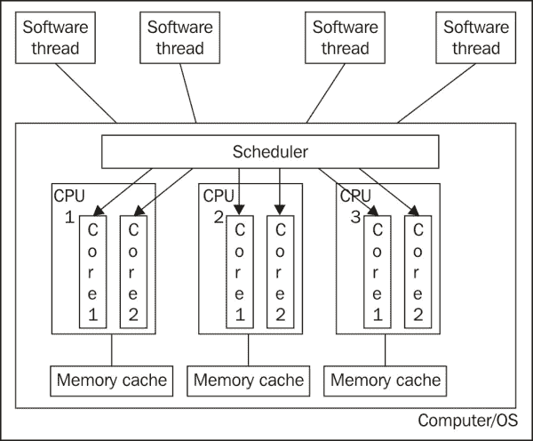

# 第一章 理解多处理和多核。

考虑到我们知道如何开发 C#应用程序，并且可以使软件完成我们需要的任务，这本书重点介绍了我们如何通过利用今天强大的硬件来使我们的 C#应用程序执行任务更加高效和快速。

在**过去**，计算机有一个单一的 CPU，一次只能运行一个软件线程。通过复杂的调度逻辑和快速的时钟和总线速度，它们能够使多个软件线程同时运行，但这只是一个错觉。具有一个核心的 CPU 的单 CPU 系统在每个时钟周期只能执行一个线程的指令。计算机有一个时钟来控制 CPU 的执行。每当时钟计数一个单位时，CPU 就执行一条指令。在这个模型中，开发使用多个软件线程的应用程序的需求有限。它仍然可以用于 UI 响应性，以便长时间运行的任务不会使用户界面**冻结**。我们将在第二章中进一步讨论这个问题，*查看多线程类 – BackgroundWorker*。因此，多线程应用程序允许软件应用程序对用户更加响应，但并不加快处理任务的速率。

我们必须了解一些与现代计算机提供的多处理能力相关的基本原理。我们必须考虑它们，以便开发充分利用并行处理功能的应用程序。在本章中，我们将涵盖许多主题，以帮助我们理解使用现代硬件进行并行编程的新挑战。阅读它并完成练习后，我们将从以下方面受益：

+   开始软件设计范式的转变。

+   理解开发新一代应用程序所需的技巧。

+   想象一下，我们可以使用 C#和古斯塔夫森（Gustafson）以及阿姆达尔（Amdahl）定律实现性能提升。

+   对关键过程进行精确的响应时间估计。

# 单处理器系统 – 古老的角斗士

**单处理器**系统使用老式的、经典的计算机架构。微处理器接收输入流，执行必要的处理，并将结果以输出流的形式发送到指定的目的地。以下图表示了一个单处理器系统（只有一个**核心**）中运行一个用户和一个任务的情况：

这种工作方案被称为**输入-处理-输出**（**IPO**）或**单指令，单数据**（**SISD**）。这种基本设计代表了由杰出的数学家约翰·冯·诺伊曼（John von Neumann）于 1952 年开发的**冯·诺伊曼机**。

## 单核 – 只有一个战士对抗所有人。

现在，具有单一处理器核心、只有一个逻辑处理器的系统被称为**单核**。

当只有一个用户在单处理器机器上运行应用程序，并且处理器足够快，能够在**关键**操作中提供足够的响应时间时，该模型将无任何重大问题地运行。

例如，考虑一个厨房中的机器人服务员，他只有两只手可以工作。如果你要求他完成一项需要两只手同时进行的任务，比如洗碗，他会很有效率。他有一个单一的处理器核心。

然而，假设你要求他完成各种任务——洗碗、清洁烤箱、准备你的午餐、拖地、为你的朋友做晚餐等等。你给他任务列表，他按列表完成任务。但由于洗碗太多，他甚至在准备你的午餐之前就已经是下午 2 点了——这时你已经非常饿了，于是你自己准备。当你有多个任务时，你需要更多的机器人。你需要多个执行核心和许多逻辑处理器。

机器人执行的每一项任务都是一个关键操作，因为你和你的朋友都非常饿！

让我们考虑另一个案例。我们有一个单处理器计算机，并且连接了多个用户，请求计算机必须处理的服务。在这种情况下，我们有多个输入流和多个输出流，每个连接的用户一个。由于只有一个微处理器，因此只有一个输入通道和一个输出通道。因此，输入流被排队（**多路复用**）以进行处理，然后输出流也会发生同样的情况，但顺序相反。

## 做一点每一项任务

为什么机器人要花这么长时间为你和你的朋友做晚餐？机器人会做一点每一项任务，然后回到列表中看看他还应该做什么。他必须不断移动到列表中，阅读它，然后开始一项新任务。完成列表所需的时间要长得多，因为他不够快，无法在规定的时间内完成多项任务。这就是**多路复用**，延迟被称为**冯·诺伊曼瓶颈**。多路复用需要额外的时间，因为你只有一个机器人来完成厨房中所有需要做的事情。

提供对多个用户并发访问的系统被称为**多用户**系统。

如果处理器不够快，无法为每个连接用户请求的每个关键操作提供足够的响应时间，处理器输入队列将产生瓶颈。这在计算机体系结构中被称为冯·诺伊曼瓶颈。

这个问题有三个可能的解决方案，每个方案都包括升级或增加以下之一：

+   通过使用更快的机器人来提高处理器的速度。他将需要更少的时间来完成每一项任务。

+   处理器处理指令的并发能力（并行），即给机器人添加更多手，以及使用他的手来完成不同工作的能力。

+   安装的处理器数量或处理核心数量，即增加更多的机器人。它们都可以专注于一项任务，但所有任务都是并行完成的。所有任务都更快完成，你也能准时得到午餐。这就是多任务处理。

无论我们选择哪种选项，我们都必须考虑其他因素，这些因素特别依赖于计算机执行的操作类型，并且可能产生额外的瓶颈。在某些情况下，主存储器访问速度可能太慢（机器人花费太多时间读取每个任务）。在其他情况下，磁盘子系统可能响应时间不佳（机器人花费太多时间记住要执行的任务），等等。在做出决定以排除瓶颈之前，对这些主题进行详细分析是很重要的。

此外，有时需要处理的数据量太大，问题在于内存和处理器之间的传输时间，也就是说，机器人移动每只手太慢。糟糕的机器人！你为什么不买一个新模型呢？

在过去几年中，微处理器制造商开发的每一个新的微架构都专注于提高处理器并行执行指令的能力（一个有更多手的机器人）。这些例子包括对**算术逻辑单元**（**ALU**）和**浮点单元**（**FPU**）等处理结构的持续复制，以及单个物理处理器中包含的处理核心数量的增加。因此，你可以构建一个由许多独立的机器人和许多手组成的超级机器人。每个子机器人可以专门从事一项特定任务，从而并行化工作。

作为服务器使用的计算机，连接了多个用户并运行应用程序，比仅由一个用户使用的计算机更能充分利用现代处理器并行执行指令的能力。我们将学习如何利用 C#编程语言开发的应用程序中的这些功能。你希望机器人准时为你准备午餐！

# 多处理器系统 – 多个战士赢得战斗

多处理器系统是解决冯·诺伊曼瓶颈的方案，但首先需要了解它们的详细特征，以便摒弃关于它们的某些神话。它们并不为所有应用程序提供即时的性能提升！困境在于，多处理器系统并不总是解决性能问题的最佳方案。

在具有多个处理器的系统中分配任务有两种基本方法：

+   **对称多处理（SMP）**：任何可用的处理器或核心都可以执行任务。最常用且效率最高的是*n*路对称多处理，其中*n*是安装的处理器数量。通过这种方法，每个处理器都可以独立执行任务，即使特定的软件没有针对多处理系统进行优化。厨房里有八个机器人。当一个机器人空闲时，他会回到列表中查看他应该做什么，并开始处理下一个任务（8 路对称多处理）。

+   **非对称多处理（AMP 或 ASMP）**：通常，一个处理器作为主处理器。它充当管理者，负责将任务分配给其他可用的处理器，为此使用不同的算法。厨房里有九个机器人。其中一个负责任务分配（管理者机器人）。他总是阅读列表并观察其他机器人工作（工人机器人是专门运行任务的处理器）。当一个机器人空闲时，管理者机器人会告诉他下一步该做什么。

机器人太贵了！你不想浪费一个机器人去分配任务。你更希望拥有独立的机器人。你希望机器人排列成类似于对称多处理方案的样式。

n 路对称多处理程序实现了最佳性能和最佳资源利用率，其中*n*可以是两个或更多处理器。通过它，每个可用的处理器都可以以绝对动态的方式执行任务。这就是为什么大多数多处理系统都采用这种方法。

具有许多用户连接或运行许多任务的对称多处理系统为解决冯·诺伊曼瓶颈提供了一个良好的解决方案。多个输入流被分配到不同的可用处理器进行执行，并生成多个并发输出流，如下面的图所示：

但如果洗碗量如此之大，以至于单个机器人需要几天时间才能完成，瓶颈将再次产生。他的手是否足够快？他的腿是否太慢？他是一个懒惰的机器人吗？

我们必须考虑到，如果处理器对用户请求的响应时间不够快，瓶颈将再次产生。然而，它也可能由性能瀑布中的其他问题引起。我们必须深入了解过程，以了解这些潜在的性能问题。

因此，当多处理系统中的用户数量或正在执行的任务数量增加时，很可能会耗尽处理能力，以及其他一些因素。如果发生这种情况，每个用户正在执行的任务运行时间将更长，因此响应时间会变差。

在这种情况下，有两种可能的方法可以保持响应时间不变：

+   **用新的处理器替换现有的处理器（购买超级机器人）**：为了应用此解决方案，应该有性能比率比目前使用的处理器更好的处理器，或者拥有更多执行核心（以实现更高的并行度）。它们还必须与主板兼容，以及与它们使用的插槽兼容。这种方法的一个重大缺点是旧处理器被丢弃。这也很昂贵。

+   **向现有处理器添加新的处理器（购买新机器人以帮助现有机器人）**：为了应用此解决方案，主板应该有空闲插槽。

# 多核心处理器和超线程

我们已经讨论了多 CPU 和单 CPU 计算机系统。现在，让我们来看看多核心 CPU 和超线程。多核心 CPU 拥有多个物理处理单元。本质上，它就像多个 CPU 一样工作。唯一的区别是，单个 CPU 的所有核心共享相同的内存缓存，而不是拥有自己的内存缓存。从多线程并行开发者的角度来看，多 CPU 和多核心之间的差异非常小。系统所有 CPU 的核心总数是可以并行调度和运行的物理处理单元的数量，即可以真正并行执行的软件线程的数量。

由于内存总线的共享，与拥有多个单核 CPU 相比，在 CPU 中拥有多个核心会有轻微的性能瓶颈。对于大多数应用程序来说，这可以忽略不计。

对于试图通过使用并行设计方法来估计性能提升的并行开发者，物理核心的数量是用于估计的关键因素。

此图显示了三个物理 CPU，每个 CPU 拥有两个逻辑核心：

以下图显示了一个具有四个逻辑核心的 CPU，每个核心都有自己的内存，然后是它们之间的共享内存：

接下来，让我们讨论超线程。这是一种英特尔开发的专有同时多线程（SMT）技术，它允许 CPU 中的单个物理核心拥有多个逻辑核心。这些逻辑核心中的每一个都称为**硬件线程**，可以被**操作系统**（**OS**）调度器单独调度。

操作系统必须实现 SMT 才能利用超线程技术，但今天，大多数操作系统都做到了。尽管每个硬件线程（逻辑核心）对于操作系统来说都表现为一个单独的核心来调度，但每个物理核心一次只能有一个逻辑核心执行软件指令。超线程在以下图中解释：

当你检查计算机硬件并估计并行应用程序的性能提升时，这一点很重要。在我们使用 Amdahl 定律和 Gustafson 定律进行性能估计的例子中，我们只会计算物理核心，因为从技术上讲，在单个物理核心中，逻辑核心在同一个时钟周期内不能执行指令。

## 利用多执行核心

提高处理能力的一种技术是增加微处理器的运行频率（**超频**），这提高了在相同时间内可处理的指令数量。这项技术已经使用了多年，并从传奇的 8086/8088（其频率为 4.77 MHz（兆赫兹））发展到现代微处理器的许多 GHz（千兆赫兹）。

然而，微处理器制造商在提高频率方面越来越面临困难，因为制造过程变得更加复杂，并且产生的热量难以以高效且经济的方式散发。

### 注意

再次考虑我们的机器人实例。你想要购买一台单个机器人，但希望它在 5 秒内清洁烤箱。这是可能的，但他需要钚作为能量来源，因为他必须以非常高的速度移动他的手臂和腿。此外，他还需要环境温度为 50 华氏度（5 度华氏度）或-15 摄氏度。为什么？好吧，因为以非常高的速度移动的金属会产生热量。你不想有一个烧毁的机器人。此外，钚非常昂贵。类似的情况也发生在现代微处理器上。

因此，另一种选择是开发新的微架构；首先复制，然后四倍复制处理结构，依此类推。这样，一个单一的微处理器封装中就有许多子处理器。这些子处理器被称为**执行核心**或**处理核心**。

具有多执行核心的微处理器，也称为**多核**，在一个封装中提供了许多相互连接的完整执行核心。它们的物理外观与传统的单核微处理器非常相似。然而，它们相当于在单个硅片内部以及在同一物理封装下相互连接的许多硅片。当然，我们正在避免对深层次技术问题的全面讨论。

### 注意

目前，大多数可用的现代计算机都配备了至少两个执行核心（双核）。因此，它们是具有多处理能力的计算机。

自从多执行核心的兴起以来，结合通信架构、不同核心所拥有的和共享资源的可能性一直在增加。就像生活中的每一件事一样，在每一种可能性中，制造成本和性能之间都存在权衡。因此，在微处理器世界中出现了一片新天地。

在某些情况下，每个执行核心都包含 L1 和 L2 缓存内存。缓存可以分成多个级别，首先访问较小的、较快的缓存，然后访问较慢的、较大的缓存。一个架构可以使用它想要的任何数量的缓存，但通常你会看到两个级别。这允许架构将常用数据存储在具有较低延迟的缓存中，以便更快地检索。

在其他情况下，L2 缓存内存被两个或更多核心共享。因此，每个核心都将能够访问整个 L2 缓存。

每个核心包含的资源越多，与其他核心共享的资源越少，每个核心达到的处理速度就越高。另一方面，在核心之间共享资源有利于未针对多处理优化应用，因为它们使用单个执行核心。

机器人的通信接口必须尽可能高效，因为你希望机器人执行许多不同的任务。

在这些微架构中，实现有效的外部内存访问是最重要的事情之一。与内部核心速度相比，与外部内存的通信在时间上具有很大的开销。当我们为我们的应用程序设计最关键的算法时，我们必须最小化外部内存访问，以实现最佳性能。这是在设计考虑并行性的应用程序时需要考虑的主要主题之一。

有两种方法可以加快机器人执行任务的速度，以洗碗为例：

+   将洗碗任务分成与可用机器人数量相对应的部分，并让机器人完成它们自己的全局任务部分。

+   准备一大堆要洗的餐具，当机器人有足够的空间在它们的洗涤槽中进行洗碗时，让每个机器人从那堆餐具中取物品。

内部总线非常重要，因为它在不同执行核心之间传输数据。许多微处理器使用一个或多个专用总线来完成这项任务，并且具有非常高的工作速度，而其他微处理器则通过**前端总线**（**FSB**）来建立这些通信，这是一种效率较低的方法。当微处理器拥有超过两个核心时，其架构可以是已知单核和双核微处理器架构的任何可能的合并。有些微处理器由两对核心组成，每个核心都使用专用总线来在两个核心之间进行数据交换，但两对核心通过 FSB 进行通信。

当我们优化应用程序以充分利用这些微架构时，我们应该最小化通过 FSB 传输的信息。此外，我们必须在评估优化应用程序的效率时考虑这一点。如果不这样做，我们可能会对它们得出错误的结论，并试图优化已经最大化的性能（根据底层硬件架构）。

基于许多独立物理处理器的非对称多处理系统具有许多 FSB 来访问外部内存，每个物理处理器一个。然而，具有多个核心的微处理器的系统必须共享作为通往外部世界和外部内存的巨大单扇门的 FSB。因此，协调执行核心活动的任务需要额外的时间来避免在共享 FSB 中的冲突。这是使用独立物理微处理器进行多处理和在一个物理微处理器中多个核心之间的重要区别。

当应用程序没有优化以充分利用每个核心中包含的缓存内存时，FSB 成为瓶颈的概率非常高。因此，当软件在这些微架构上运行时，应避免频繁访问主内存。

此外，许多非对称多处理系统使用与主内存的双倍通信通道。这个特性在许多多核微处理器中不可用。这使得预测在不同系统架构中应用程序的性能几乎不可能。然而，考虑到并行性来设计它们将充分利用系统中的任何特性。

现在，多核执行核心的微处理器已经非常普遍。然而，我们可以发现许多微处理器被安排在一个 n 路非对称多处理系统中，例如具有两个物理四核微处理器的 8 核系统。这对于高端工作站和服务器来说是一个非常吸引人的配置。

在未来几年里，微处理器将包含越来越多的处理核心。现代操作系统已经优化了以利用它们的并行处理能力。我们必须优化我们的应用程序以充分利用它们。

分析现代微处理器中使用的微架构是一个完整的书籍主题。然而，我们需要了解它们的一些知识，以便理解对我们目标有用的并行处理能力。

不要期待钚机器人！它们维护起来仍然太昂贵。

# 检查我们的硬件

正如我们将通过用于分析系统硬件的一些工具看到的那样，大多数系统只计算逻辑核心而不是物理核心。这一点很重要，因为在前一节中提到的限制中，CPU 在每个时钟周期只为一个物理核心执行一条指令。

让我们花点时间看看一些例子。首先，如果你在一台 Windows 机器上（我们将假设这本书中的例子都是基于 Windows 的），你可以右键单击任务栏并运行任务管理器。以下是我电脑上的一个示例：

当查看**性能**标签时，你可以看到它显示了四个正在运行的 CPU。这可能会让我们认为我的系统中有四个 CPU。但实际上，它实际上只有一个具有两个核心（物理）的 CPU，每个核心都有两个**硬件线程**（逻辑核心）。因此，Windows 的任务管理器显示了我们系统中有多少逻辑核心。这是系统调度器可以利用的可调度硬件线程的数量。

### 小贴士

**CPU-Z**是一个方便的工具，可以分析计算机的硬件以获取有关计算机的信息。你可以从[`www.cpuid.com/`](http://www.cpuid.com/)下载这款免费软件。

下面是我电脑的 CPU-Z 输出结果：

如您从 CPU-Z 输出的底部所示，我有一个**1**个 CPU，**2**个核心和**4**个硬件线程。了解系统有多少 CPU、物理核心和硬件线程非常重要，这样你可以正确估计并行开发带来的性能提升。在接下来的几节中，我们将检查几种基于物理核心数量预测这种性能提升的方法。这也有助于您了解通过向设计有并行性的软件应用程序“投入更多硬件”可能获得的收益。

# 操作系统调度器操作

到目前为止，我们一直在讨论硬件和 CPU、硬件核心和逻辑核心的数量；现在，让我们转向软件线程和操作系统。一个软件应用程序或服务可以在一个或多个进程和线程中运行。通常，一个**软件应用程序**有一个用户界面，并由计算机用户运行，而一个**软件进程**由操作系统运行并在后台运行。这两种都是计算机上正在执行的软件类型。

每个**应用程序**或**服务**都会有一个或多个它们实际执行的进程。**进程**是应用程序或服务的运行对象。此外，每个进程都有一个或多个执行线程（或软件线程）。**线程**是调度器在核心上安排的项目。我知道这可能会让人感到困惑，但了解硬件从底层到顶层的结构以及物理核心可以执行多少软件指令，以及从软件层面到每个在核心上执行的软件线程，这一点非常重要。

操作系统的**调度器**是其管理当前所有运行的软件线程并分配计算机核心（包括物理和逻辑核心）执行时间的子系统。执行时间被划分为机器周期，而**机器周期**是计算机时钟的一次滴答。

调度器决定每个时钟周期哪个软件线程在哪个核心（物理）上运行。因此，在计算机的每个时钟周期内，每个核心都可以执行一个软件线程的指令。记住，使用超线程技术，调度器将每个逻辑核心视为一个物理核心。但实际上，在每个时钟周期内，每个物理核心只执行一个软件线程的指令。

在我们的并行开发和性能提升的估计中，也很重要的是，我们在估计中假设每个硬件核心在每个时钟周期都可供我们的软件应用使用。实际上，大多数计算机在给定时间内运行着许多进程，并利用了核心的一些执行时间。

在 Windows 中，任务管理器提供了一些有用的信息，可以查看正在运行的内容以及消耗硬件资源的情况。我们已经查看了**性能**选项卡。现在，让我们看看**进程**选项卡：

任务管理器中的此选项卡显示了关于在 Windows 计算机上运行的进程的各种信息。正如您可以从前面的屏幕截图中的**线程**列中看到的那样，某些进程在任何给定时间都有许多执行线程。

您可以转到**查看**菜单并选择**选择列**来更改任务管理器为每个进程显示哪些信息列。

# 并发设计

现在我们已经了解了今天硬件的能力（多个处理器、多个物理核心和多个逻辑核心（硬件线程））以及操作系统调度器，让我们讨论如何在我们软件开发中利用这些优势。

我们知道我们的硬件具有同时执行多个指令的能力。正如我们将在后面的章节中看到的那样，.NET 提供了几个类和库，允许我们开发在多个线程中运行的软件，而不是单个软件线程。那么问题来了，何时开发我们的软件以在多个线程中并发运行是有意义的，我们可以期望获得什么样的性能提升？

在设计并发时，我们应该查看应用程序需求的高级抽象。看看应用程序执行了哪些功能，以及哪些功能可以在不影响其他功能的情况下并行运行。这将帮助我们决定如何确定可以设计到应用程序中的并行操作的数量。我们将在后面的章节中详细讨论实现重载并发（`Thread`类）和轻量级并发（任务并行库）的.NET 类；但到目前为止，我们需要确定我们的应用程序中可以并行发生什么以及多少。

例如，如果一个应用程序接收一个项目列表并将每个项目编码成一个加密字符串，那么每个项目的编码是否可以独立于另一个项目的编码并行运行？如果是这样，这个应用程序的“功能”就是一个很好的并发候选。一旦你定义了应用程序必须执行的所有高级功能，这种分析将确定应用程序可以从中受益的并行程度。

以下是一个并行设计的简单例子，其中一些功能顺序执行，而其他功能并行执行。正如我们将在下一节中看到的，一旦我们能够定义应用程序功能是并行还是顺序执行的比例，我们就可以了解我们可以期望的性能提升。

许多并行设计采用某种流水线设计，其中一些工作顺序执行，然后是并行工作，然后是顺序工作，如此循环。前面的图示展示了流水线设计的一个简单模型。另一种流行的并发设计模式是**生产者-消费者**模型，这实际上只是流水线模型的一种变体。在这个设计中，应用程序的一个功能*生产*一个输出，由应用程序的另一个功能*消费*。以下是这个设计模式的图示。在这个例子中，每个功能都可以并行操作。**加载图像**功能*生产*图像文件，由**缩放图像**功能*消费*。**缩放图像**功能也生产缩略图，由**过滤图像**功能*消费*，等等。由于这些功能块相互独立，它们可以运行在多个并发线程中：

以下图示展示了顺序操作：

以下图示展示了并行流水线设计：

## 估计性能提升

在设计或升级多处理器系统时，最常见的错误之一是在处理速度上进行线性预测。通常认为，系统中每个额外的处理器都会以与其处理能力成正比的方式提高性能。

例如，当我们有一个只有一个处理器的系统时，如果我们再添加三个，我们不会得到四倍的性能。这是因为每次我们添加一个处理器，它们用于协调工作和任务分配过程的时间就会增加。因此，由于用于管理任务的额外处理能力增加，它们的性能不会线性增长。

添加到厨房的额外机器人必须相互交流以协调它们的工作。

协调成本和性能提升取决于许多因素，包括以下：

+   **操作系统及其管理程序，用于在多个处理器之间协调和分配进程和线程**：这是机器人将适当任务分配给最合适的机器人模型的准确性。

+   **应用程序提供的多处理器运行优化级别**：这是最相关的一点，即使我们使用 n 路对称多处理方案。在这本书中，我们将学习如何在我们的软件中达到高水平的并发优化。这可以与机器人协同完成相同任务的能力相关联。

+   **微处理器的微架构**：这对应于机器人移动手和腿的速度以及执行类似任务的速度。

+   **微处理器共享的内存子系统速度**：这是机器人的通信接口。

+   **微处理器共享的 I/O 总线速度**：这是机器人管理其手和腿以完成每个任务（例如拖地和烹饪）的效率和精度。

所有这些项目在我们设计或升级机器时都代表一个问题，因为我们需要回答以下问题：

+   当用户数量增加时，我们需要多少个微处理器？根据朋友/任务的数量，你需要多少个机器人？

+   我们需要多少个微处理器来提高应用程序的性能？你需要多少个机器人来加速清洗时间？

+   我们需要多少个微处理器在特定时间内运行关键过程？你需要多少个机器人来在 5 分钟内清洁烤箱？

我们需要一个参考，类似于下表提供的参考，我们可以看到随着处理器数量的增加，协调成本和相对性能：

| 处理器数量 | 协调成本 | 相对性能 |
| --- | --- | --- | --- |
|   | **相对处理器** | **百分比** | **相对处理器** | **百分比** |
| 1 | 0.00 | 0% | 1.00 | 100% |
| 2 | 0.09 | 5% | 1.91 | 95% |
| 3 | 0.29 | 10% | 2.71 | 90% |
| 4 | 0.54 | 14% | 3.46 | 86% |
| 5 | 0.84 | 17% | 4.16 | 83% |
| 6 | 1.17 | 19% | 4.83 | 81% |
| 7 | 1.52 | 22% | 5.48 | 78% |
| 8 | 1.90 | 24% | 6.10 | 76% |
| 9 | 2.29 | 25% | 6.71 | 75% |
| 10 | 2.70 | 27% | 7.30 | 73% |
| 11 | 3.12 | 28% | 7.88 | 72% |
| 12 | 3.56 | 30% | 8.44 | 70% |
| 13 | 4.01 | 31% | 8.99 | 69% |
| 14 | 4.47 | 32% | 9.53 | 68% |
| 15 | 4.94 | 33% | 10.06 | 67% |
| 16 | 5.42 | 34% | 10.58 | 66% |
| 17 | 5.91 | 35% | 11.09 | 65% |
| 18 | 6.40 | 36% | 11.60 | 64% |
| 19 | 6.91 | 36% | 12.09 | 64% |
| 20 | 7.42 | 37% | 12.58 | 63% |
| 21 | 7.93 | 38% | 13.07 | 62% |
| 22 | 8.46 | 38% | 13.54 | 62% |
| 23 | 8.99 | 39% | 14.01 | 61% |
| 24 | 9.52 | 40% | 14.48 | 60% |
| 25 | 10.07 | 40% | 14.93 | 60% |
| 26 | 10.61 | 41% | 15.39 | 59% |
| 27 | 11.16 | 41% | 15.84 | 59% |
| 28 | 11.72 | 42% | 16.28 | 58% |
| 29 | 12.28 | 42% | 16.72 | 58% |
| 30 | 12.85 | 43% | 17.15 | 57% |
| 31 | 13.42 | 43% | 17.58 | 57% |
| 32 | 14.00 | 44% | 18.00 | 56% |

此表是在考虑了许多典型应用程序的整体平均性能测试，以及工作站和服务器中使用的最现代的多执行核心处理器的情况下准备的。这些处理器都兼容 AMD64 或 EMT64 指令集，也称为 x86-64。我们可以将这些值作为参考，以便了解我们在优化应用程序中将会看到的性能提升。

如前表所示，随着处理器或核心数量的增加，协调成本呈指数增长。以下图表显示了相对性能与处理器数量的关系：

如前一个截图所示，随着处理器或核心数量的增加，相对性能呈对数增长。

### 注意

以下是用以计算表中值和图表中值的公式：

*协调成本 = 0.3 x 对数（处理器数量）x（处理器数量 - 1）*

*相对性能 = 处理器数量 - 协调成本*

百分比是协调成本或相对性能与安装的总微处理器数量的比值。

现在，问题是没有许多并发用户，多处理器系统并没有证明像预期的那样有用。在仅由一个用户使用的工作站中，配备一个以上处理器的机器的使用只有在执行的应用程序设计为与多个处理器一起工作时才有意义。

大多数为单个用户设计的应用程序都没有优化以充分利用多个处理器。因此，如果代码没有准备好使用这些额外的处理器，其性能将不会提高，正如之前所解释的。

但是，为什么会这样呢？答案很简单。开发充分利用多个处理器的应用程序的过程比传统的软件开发过程要复杂得多（本书将展示如何使这项任务变得更容易）。除了需要大量处理能力的专业应用程序和那些专门用于解决复杂计算的应用程序之外，大多数应用程序都是使用传统的、线性的编程方案开发的。

尽管如此，具有多个逻辑执行核心的物理微处理器的发布导致了多处理器系统的广泛应用和充分利用这些微架构的迫切需求。

可以通过以下项目分析和衡量具有多个处理器的系统：

+   **处理器总数及其特性**：这是机器的总数及其特性。

+   **处理能力（不考虑协调过载）**：这是机器人在执行每个任务时的速度（不进行通信）。

+   **微架构和架构**：这是每个物理微处理器中的执行核心数量以及每个微架构中的物理微处理器数量。这些是每个机器人中的子机器人，手和腿的数量及其速度。

+   **共享内存的总线带宽**：这是机器人可以建立的并发通信的最大数量。

+   **I/O 总线带宽**：这是机器人在同时管理手和腿以完成每个任务时的效率、精度和速度。

### 注意

**处理器间的带宽**

这个总线允许处理器之间建立流畅的通信。它也被称为**处理器间总线**。在某些微架构中，这个总线与 FSB 相同。它竞争向微处理器外部世界的输出，因此窃取了可用带宽。微架构的多样性使得在现代计算世界中预测针对多处理器优化的应用程序的性能变得困难。

我们既不考虑存储空间，也不考虑内存量。我们专注于定义多个处理器操作和性能的参数。

## Amdahl 定律

Amdahl 定律是两个并行优化定律之一，用于帮助确定并行计算机设计中硬件和软件的预期性能提升。

Amdahl 定律是一个公式，用于帮助估计在应用程序中给定并发执行的应用程序部分和机器中的物理核心数量时预期的性能提升。

Gene Amdahl 是一位计算机架构师，他在 1967 年提出了他的算法，用于计算当系统的一部分为并行性编写时可以预期的最大预期性能改进。该算法以百分比计算预期加速比。

这条定律考虑了执行物理核心的数量，*N*，应用程序并行的百分比，*P*，以及串行的百分比，*B*。当使用*N*个核心时处理所需的时间如下：

*T (N) = T(1) x (P + 1/Nx(1-N))*

因此，最大加速比（*N*）将按以下方式计算：

*加速比（N）= T(1)/T(N) = T(1)/T(1)(B+1/N(1-P)) = 1/(P+1/N(1-P))* 

因此，Amdahl 定律指出，例如，如果一个应用程序的 50%是顺序执行的，50%是并行的，并且计算机有两个核心，那么最大加速比是：

*加速比 = 1/((1-.50)+.5/2) = 1.333*

因此，如果任务需要 100 个执行周期顺序执行，那么在有 50%并行的条件下将需要 75 个周期，因为 *75 (工作单元) x 1.33333 (加速比百分比) = 100 (工作单元)*。

以下图表显示了基于额外处理器的数量和可以并行运行的代码百分比的预测速度增加：

这一定律使你能够估计并发性能提升，并确定这些好处是否值得它为开发、调试和支持带来的额外复杂性。在开发并行软件应用程序时，必须考虑开发、调试和支持的额外成本。

## Gustafson 定律

Gustafson 定律试图通过考虑问题的规模来解决 Amdahl 定律的不足。Gustafson 假设问题规模不是固定的，而是增长的（可缩放的）。Amdahl 定律根据执行核心的数量计算给定问题大小的速度提升。Gustafson 定律计算缩放速度提升。

Gustafson 定律是：*S(P) = P – a * (P – 1)* 其中 *S* 是速度提升百分比，*P* 是处理核心的数量，*a* 是应用程序的并发百分比：

你会注意到，在 Gustafson 的计算中，给定并发百分比的曲线与 Amdahl 的计算相比并没有达到水平。

# 摘要

在本章中，我们学到了很多关于多处理器和多核硬件架构的知识，以及操作系统调度器如何管理它们。我们还学习了如何设计用于并行操作的软件应用程序，以及我们可以从这个中期待的性能提升。本章为我们整本书的其余部分做好了准备，并展示了如果软件开发者意识到多 CPU 和多核带来的潜力，今天的硬件可以为软件开发者提供哪些可能性。

现在我们已经了解了多处理和多核原理，我们准备学习并行程序的主要组件，即进程和线程，这是下一章的主题。
