# 第二章. 查看多线程类 – BackgroundWorker

C# 提供了多种在应用程序中创建和控制线程的方法。有 `Thread` 和 `ThreadPool` 类、**任务并行库** (**TPL**)、`Async` 方法以及 `BackgroundWorker` 组件。`BackgroundWorker` 是在 C# 中同时做很多事情的原始方式，对许多人来说，它已经过时了，现在 `Tasks` 和 `Threads` 是首选方法。但对于简单的多线程需求，`BackgroundWorker` 是一种极其方便且易于使用的实现同时做很多事情的方式。

在本章中，我们将详细研究这个组件，并将开始开发充分利用多处理的多线程应用程序。阅读本章并完成练习后，我们将：

+   开发能够在后台执行任务的同时保持图形用户界面活跃的应用程序，为用户提供更真实的生活体验

+   学习如何使用简单组件创建独立线程

+   理解同步和异步执行之间的区别

+   开发能够在图形用户界面中显示许多并发运行任务进度的应用程序

+   学习如何启动和取消后台任务

+   开发在必要时能够启动多个后台任务的应用程序

# 使用 BackgroundWorker 组件入门

自从 .NET 2.0 (C# 2005) 的引入以来，一个新的组件已经成为 Visual C# 的一部分，它简化了在独立线程中执行任务的过程，这些线程与主线程分离。它是 `BackgroundWorker` 组件 (`System.ComponentModel.BackgroundWorker`)，它允许我们以非常少的努力开始使用多个线程并利用并行性。

C# 和 .NET 工作环境中的组件的主要优势之一是，在设计时可以定义它们的属性、值和事件，而无需编写大量代码。

不幸的是，`BackgroundWorker` 组件不是一个 **Windows Presentation Foundation** (**WPF**) 组件。正如您在下面的屏幕截图中所见，在一个 Windows Form 应用程序中，它位于 **工具箱** 下的 **组件** 中：

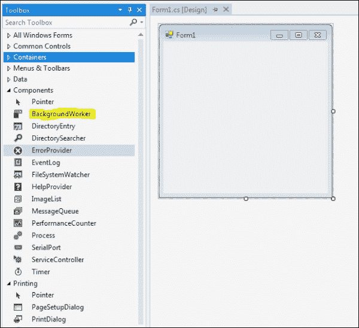

在 WPF 应用程序中，它不可用，如下所示：

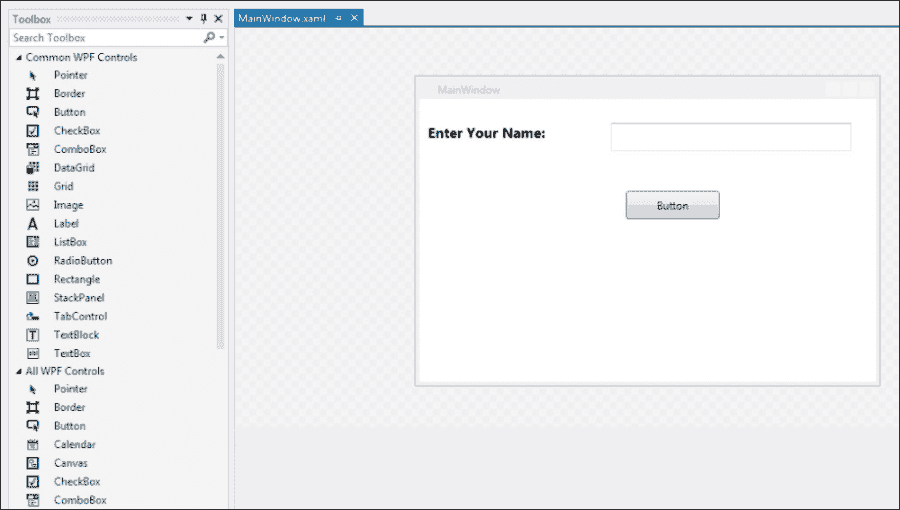

这并不意味着它在 WPF 中不可用。这只意味着您将需要完全通过代码来实现它，而不是能够在 **设计器** 视图中操作它。要在 WPF 中声明一个 `BackgroundWorker` 实例，我们只需添加以下 `using` 语句：

```cs
using System.ComponentModel;
Then we declare it in the code.
BackgroundWorker Worker = new BackgroundWorker();
```

从历史上看，多线程编程因为初始化、协调、停止和释放这些线程所需的代码极端复杂，让开发者感到恐惧。

在.NET 中开始实验多线程并学习基本原理的最简单方法是使用`BackgroundWorker`组件。它允许我们在设计时（在 Windows Forms 中）定义某些属性，并为`DoWork`事件处理器引入代码。它代表了一种简单且快速的方法来生成一个新的线程，独立于主线程（运行主应用程序流程的那个线程），而且无需使用更灵活或更复杂的方法。

需要在新线程中执行和运行的工作是在`BackgroundWorker`的`DoWork`事件处理器中编程的。为了理解它是如何工作的，让我们看一个例子来观察它的实际操作，并体验在同一个线程（应用程序的主线程）和另一个线程中运行代码之间的差异。

想象我们必须创建一个 CodeBreaker 应用程序。有一个由四个 Unicode 字符组成的代码，我们希望通过暴力攻击来破解它。因此，我们必须遍历每个 Unicode 字符，直到我们找到一个匹配项，然后继续到下一个字符，依此类推。

然而，由于应用程序破解代码需要一些时间，我们不希望在黑客过程中被守卫抓住。因此，我们将添加一些图片来模拟*How to do it*部分下的*Simple example without a BackgroundWorker object*部分中的 Fishes 游戏。我们必须能够通过点击按钮来隐藏我们的黑客应用程序并显示 Fishes 游戏。

首先，我们将构建一个新的 C#应用程序，并编写一个经典的线性编程循环，其中包含一些处理，以便在同一个线程（应用程序的主线程）中运行代码：

### 注意

为了在即将进行的实验中获得显著的结果，以及本书其余部分的示例，我们需要一台至少安装了两个核心或两个微处理器的计算机。

# 没有 BackgroundWorker 对象的简单示例

我们将首先通过创建一个单线程版本的我们的 CodeBreaking 应用程序来开始这个 WPF 章节。这将为我们提供一个起点，并展示在单个线程上运行所有内容的局限性。然后我们将重构我们的应用程序以使用两个线程，然后是许多线程，以展示改进的性能和能力。

如前所述，我们将在一个 WPF 应用程序中完成所有这些，而不是 Windows Forms。这将要求我们完全在代码中与`BackgroundWorker`组件一起工作，而不是能够在设计时使用它。

### 提示

**下载示例代码**

您可以从您在[`www.packtpub.com`](http://www.packtpub.com)的账户中下载您购买的所有 Packt 书籍的示例代码文件。如果您在其他地方购买了这本书，您可以访问[`www.packtpub.com/support`](http://www.packtpub.com/support)并注册，以便将文件直接通过电子邮件发送给您。

## 如何操作

以下是我们需要执行的步骤：

1.  在 Visual Studio 中创建一个新的 WPF 应用程序 C# 项目（**文件** | **新建** | **项目** | **Visual C#** | **WPF 应用程序**）。

1.  IDE 将创建一个包含 `MainWindow.xaml` 和 `MainWindow.xaml.cs` 文件的一个非常简单的应用程序。我们将命名我们的项目为 `CodeBreaker`：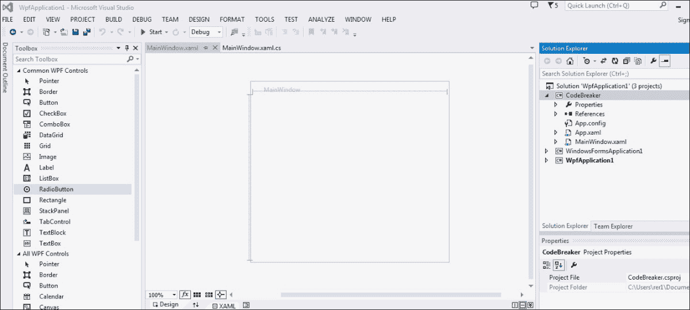

1.  在设计器中打开 `MainWindow.xaml`，并添加以下控件：

    +   两个显示骷髅和特工的图片（`imgSkull` 和 `imgAgent`）。

    +   三个显示三只鱼的图片（`imgFish1`、`imgFish2` 和 `imgFish3`）。

    +   四个文本块元素，它们的 `Text` 属性设置为 `"#1"`、`"#2"`、`"#3"` 和 `"#4"`（分别对应 `txtNumber1`、`txtNumber2`、`txtNumber3` 和 `txtNumber4`）。

    +   四个标签，它们的 `Text` 属性设置为 `"*"`（分别对应 `txtOutput1`、`txtOutput2`、`txtOutput3` 和 `txtOutput4`）。

    +   一个文本块元素，其 `Text` 属性设置为 `"CodeBreaker (Single-threaded)"`。

    +   一个文本块，其 `Text` 属性设置为 `"Fishes Game!!!"`。

    +   一个文本属性设置为 `"Start"` 的按钮（`btnStart`）。这是将运行主循环的按钮，该循环将找到代码。

    +   一个文本属性设置为 `"Hide"` 的按钮（`btnHide`）。此按钮必须隐藏与代码破解器相关的所有控件，并显示鱼游戏。当守卫到来时，你会点击此按钮！

    +   一个文本属性设置为 `"Game over"` 的按钮（`btnGameOver`）。此按钮必须隐藏与鱼游戏相关的所有控件，并再次显示代码破解器。当守卫离开且你感到安全时，你会点击此按钮继续破解代码！

    这里提到的控件在以下屏幕截图中显示：

    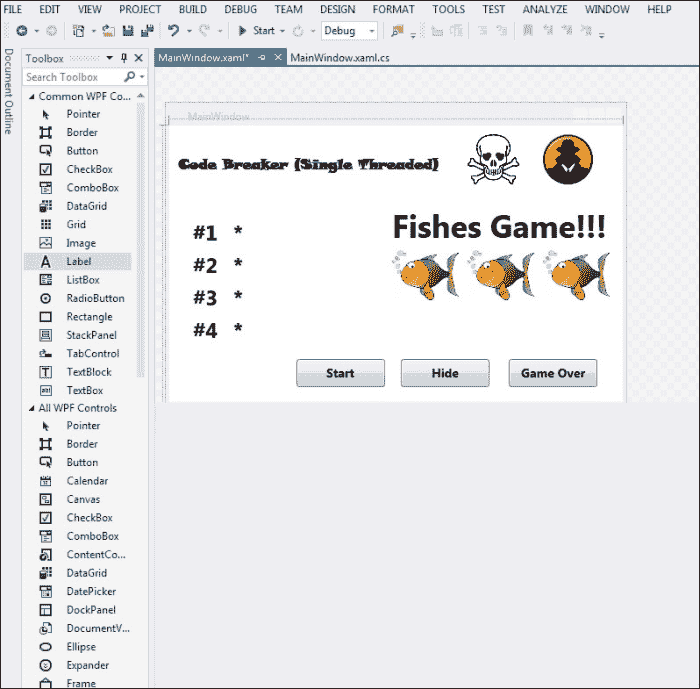

1.  在 `MainWindow.xaml.cs` 代码文件中，在 `public partial class MainWindow : Window` 定义中添加以下行以声明两个私有变量：

    ```cs
    // The simulated code to be broken
       private string Code;
       // The list of Labels of the characters to be broken.
       private List<TextBlock> OutputCharLabels;
    ```

1.  向我们的 `MainWindow` 类中添加以下方法，`SimulateCodeGeneration`，这将模拟必须被破解的代码：

    ```cs
        private void SimulateCodeGeneration()
        {
            // A Random number generator.
            Random loRandom = new Random();
            // The char position being generated
            int i;

            Code = "";
            for (i = 0; i <= 4; i++)
            {
                // Generate a Random Unicode char for each of 
                //the 4 positions
                Code += (char)(loRandom.Next(65535));
            }
        }
    ```

1.  添加以下过程，`setFishesVisibility`。这将改变与鱼游戏相关的控件的可视性：

    ```cs
            private void setFishesVisibility(System.Windows.Visibility pbValue)
            {
                // Change the visibility of the controls 
                //related to the fishes game.
                imgFish1.Visibility = pbValue;
                imgFish2.Visibility = pbValue;
                imgFish3.Visibility = pbValue;
                txtFishGame.Visibility = pbValue;
                btnGameOver.Visibility = pbValue;
            }
    ```

1.  添加以下过程，`setCodeBreakerVisibility`。这将改变与代码破解过程相关的控件的可视性：

    ```cs
            private void setCodeBreakerVisibility(System.Windows.Visibility pbValue)
            {
                // Change the visibility of the controls related to the CodeBreaking procedure.
                imgSkull.Visibility = pbValue;
                imgAgent.Visibility = pbValue;
                txtCodeBreaker.Visibility = pbValue;
                txtNumber1.Visibility = pbValue;
                txtNumber2.Visibility = pbValue;
                txtNumber3.Visibility = pbValue;
                txtNumber4.Visibility = pbValue;
                txtOutput1.Visibility = pbValue;
                txtOutput2.Visibility = pbValue;
                txtOutput3.Visibility = pbValue;
                txtOutput4.Visibility = pbValue;
                btnStart.Visibility = pbValue;
                btnHide.Visibility = pbValue;
            }
    ```

1.  添加以下过程，`showFishes`。这将显示鱼游戏并隐藏与代码破解过程相关的所有内容：

    ```cs
    private void showFishes()
    {
    // Hide all the controls related to the code 
    // breaking procedure.
    setCodeBreakerVisibility(System.Windows.Visibility.Hidden);
    // Change the window title
    this.Title = "Fishing game for Windows 1.0";
    // Make the fishes visible
    setFishesVisibility(System.Windows.Visibility.Visible);

    }
    ```

1.  添加以下过程，`showCodeBreaker`。这将隐藏鱼游戏（意味着你不想玩），并显示与代码破解过程相关的所有内容。你需要这个来破解代码：

    ```cs
            private void showCodeBreaker()
            {
                // Hide all the controls related to the fishes 
                // game
                setFishesVisibility(System.Windows.Visibility.Hidden);
                // Change the window title
                this.Title = "CodeBreaker Application";
                // Make the code breaker controls visible
                setCodeBreakerVisibility(System.Windows.Visibility.Visible);

            }
    ```

1.  添加以下函数，`checkCodeChar`。如果接收到的字符和位置与代码中的匹配，则返回 `true`。这将有助于我们的模拟，然后我们可以将其替换为真正的解码器：

    ```cs
            private bool checkCodeChar(char pcChar, int piCharNumber)
            {
                // Returns a bool value indicating whether the piCharNumber position of the code is the pcChar received.
                return (Code[piCharNumber] == pcChar);
            }
    ```

1.  在 MainWindow 构造函数中添加以下代码（在 `InitializeComponent()` 之后）：

    ```cs
                // Generate a random code to be broken
                SimulateCodeGeneration();
                // Create a new list of Label controls that show the characters of the code being broken.
                OutputCharLabels = new List<TextBlock>(4);
                // Add the Label controls to the List
                OutputCharLabels.Add(txtOutput1);
                OutputCharLabels.Add(txtOutput2);
                OutputCharLabels.Add(txtOutput3);
             OutputCharLabels.Add(txtOutput4);
            // Hide the fishes game and show the CodeBreaker
            showCodeBreaker();
    ```

1.  在按钮`butGameOver`的`Click`事件中打开，并输入以下代码：

    ```cs
        // Hide the fishes game and show the CodeBreaker
        showCodeBreaker();
    ```

1.  在按钮`butHide`的`Click`事件中打开，并输入以下代码：

    ```cs
        // Hide the CodeBreaker and show the fishes game
        showFishes();
    ```

1.  在按钮`butStart`的`Click`事件中打开，并输入以下代码：

    ```cs
                    // This code will break the simulated code.
                // This variable will hold a number to iterate from 1 to 65,535 - Unicode character set.
                int i;
                // This variable will hold a number to iterate from 0 to 3 (the characters positions in the code to be broken).
                int liCharNumber;
                // This variable will hold a char generated from the number in i
                char lcChar;
                // This variable will hold the current Label control that shows the char position being decoded.
                TextBlock loOutputCharCurrentLabel;

                for (liCharNumber = 0; liCharNumber < 4; liCharNumber++)
                {
                    loOutputCharCurrentLabel =
                    OutputCharLabels[liCharNumber];
                    // This loop will run 65,536 times
                    for (i = 0; i <= 65535; i++)
                    {
                        // myChar holds a Unicode char
                        lcChar = (char)(i);
                        loOutputCharCurrentLabel.Text = lcChar.ToString();
                        //Application.DoEvents();
                        if (checkCodeChar(lcChar, liCharNumber))
                        {
                            // The code position was found
                            break;
                        }
                    }
                }
                MessageBox.Show("The code has been decoded successfully.", this.Title);
    ```

1.  构建和运行应用程序：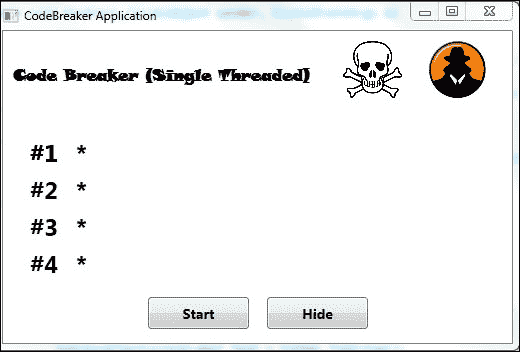

1.  点击**开始**按钮。当循环正在运行并且代码正在通过暴力破解时，尝试点击**隐藏**按钮。您将无法做到。

## 它是如何工作的？

当您试图破解代码时，如果守卫经过，您将被抓住，因为一旦开始破解代码，就无法停止，直到它完成。

为什么？因为我们没有多线程应用程序，我们失去了对图形用户界面的控制。

在`btnStart`点击事件处理器中编写的代码在主线程中运行。因此，当用户点击此按钮时，他将失去对 UI 的控制，无法点击其他按钮来隐藏与 CodeBreaker 相关的控件，因为线程正在处理`btnStart`点击方法。直到此方法完成，其他任何操作都无法处理。

代码相当简单。它四次生成 65,536 个 Unicode 字符，并调用`checkCodeChar`函数以确定它是否是代码的一部分。它试图在窗口中显示进度，显示每个测试的字符，但作为一个单线程应用程序，它在这个目标上失败了。同样，由于循环是在应用程序执行时创建的进程的主线程中运行的，我们失去了对 UI 的控制。我们无法移动窗口，更改其大小，或按按钮。主线程正在处理密集的循环，消耗单个核心的所有处理时间。因此，它无法在主窗口中显示信息。

因此，当守卫来时，您就死了。因此，让我们创建一个多线程应用程序，拯救人类生命！

# 带有异步 BackgroundWorker 的 WPF 示例

像前一个示例中使用的那种循环是运行在独立线程中的理想任务。这样，我们可以保持对 UI 的控制，并有可能取消作业，显示其进度，隐藏 CodeBreaker 控件，并显示我们的鱼游戏。因此，我们可以避免被守卫射杀（死亡或监禁）。

在本节中，我们将以简单的方式了解如何使用`BackgroundWorker`组件在我们的应用程序中创建第二个并发线程，这将使用户在执行 CodeBreaking 过程的同时能够执行其他操作。

我们将首先以异步方式完成这项工作，然后在下一章中以同步方式完成。差异将会展示；在异步方法中，我们将能够利用两个线程的并发处理，但我们将失去对第二个线程状态的可见性。我们将不知道它在 CodeBreaking 过程中的位置以及何时完成。

## 如何操作

现在，让我们对应用程序做一些修改。我们将使用`BackgroundWorker`组件来处理破解循环，以便在独立的线程中运行代码：

1.  打开项目，`CodeBreaker`。

1.  将一个`BackgroundWorker`对象添加到`MainWindow`（`bakCodebreaker`）类中。

    ```cs
    private readonly BackgroundWorker bakCodebreaker = new BackgroundWorker();
    ```

1.  接下来，在`MainWindow`类的构造函数中注册`DoWork`事件处理器。

    ```cs
    bakCodebreaker.DoWork += bakCodebreaker_DoWork;
    ```

1.  然后，添加`DoWork`事件处理器方法，并将之前在按钮`btnStart`的`Click`事件中输入的相同代码粘贴到该事件中（这是当`BackgroundWorker`对象启动时要运行的代码）：

    ```cs
            private void bakCodebreaker_DoWork(object sender, DoWorkEventArgs e)
            {
                // This code will break the simulated code.
                // This variable will hold a number to iterate from 1 to 65,535 - Unicode character set.
                int i;
                // This variable will hold a number to iterate from 0 to 3 (the characters positions in the code to be broken).
                int liCharNumber;
                // This variable will hold a char generated from the number in i
                char lcChar;
                // This variable will hold the current Label control that shows the char position being decoded.
                TextBlock loOutputCharCurrentLabel;

                for (liCharNumber = 0; liCharNumber < 4; liCharNumber++)
                {
                    loOutputCharCurrentLabel =
                    OutputCharLabels[liCharNumber];
                    // This loop will run 65,536 times
                    for (i = 0; i <= 65535; i++)
                    {

                        // myChar holds a Unicode char
                        lcChar = (char)(i);
                        //loOutputCharCurrentLabel.Text = lcChar.ToString();

                        if (checkCodeChar(lcChar, liCharNumber))
                        {
                            // The code position was found
                            break;

                        }
                    }

                   // MessageBox.Show("The code has been decoded successfully.",
                   //                  this.Title);
                }
          }
    ```

1.  然后，注释掉以下代码行：

    ```cs
        // loOutputCharCurrentLabel.Text = lcChar.ToString();
        // MessageBox.Show("The code has been decoded successfully.", this.Title);
    ```

    ### 注意

    您必须注释掉这些代码行，因为当`BackgroundWorker`对象创建一个新线程，其中循环将要运行时，它无法更改用户界面。有机制可以做到这一点，我们将在以后学习。

1.  在按钮`btnStart`的`Click`事件中打开，并输入以下代码：

    ```cs
        // Start running the code programmed in 
        // BackgroundWorker DoWork event handler
        // in a new independent thread and return control to 
        // the application's main thread
        bakCodebreaker.RunWorkerAsync();
    ```

1.  构建并运行应用程序。

1.  点击**开始**按钮。当循环正在运行，并且`BackgroundWorker`组件创建的新线程正在通过暴力破解代码时，尝试点击**隐藏**按钮。它有效，并且当 CodeBreaker 代码仍在后台工作时，您将看到鱼游戏在窗口中显示，如下面的截图所示：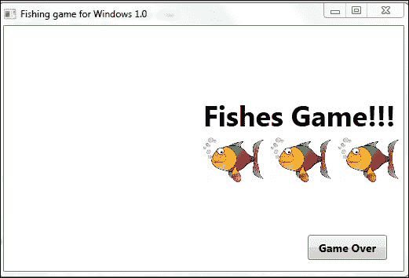

1.  移动窗口，更改其大小，最大化它，并执行您想要的任何其他操作。当您执行这些操作时，`DoWork`事件中编写的代码将在另一个线程中继续执行。

## 它是如何工作的？

我们可以点击**隐藏**按钮，窗口将显示带有**游戏结束**按钮的三条鱼，但程序继续在另一个线程（`BackgroundWorker`的`DoWork`方法）中处理 CodeBreaker。

在`DoWork`事件处理器中编写的代码在一个独立的线程中运行。因此，当用户点击**开始**按钮时，会创建一个新线程，用户不会失去对 UI 的控制。当 CodeBreaker 运行时，用户可以将鼠标光标移至其他按钮上，更改窗口大小，并使用与按钮类似的其他用户界面组件。

然而，我们无法看到正在破解的代码的进度。我们将很快解决这个问题。

## 它是如何在不阻塞 UI 的情况下工作的？

调用`BackgroundWorker`的`RunWorkerAsync()`方法后，线程的优势开始显现，`DoWork`事件处理器中编写的代码将在一个新的独立线程中运行。这种机制被称为**异步执行**。

当调用异步方法时，它以独立的方式运行，程序流程继续执行方法调用之后的指令，即使代码尚未完成执行。异步方法中的代码与主程序流程并发运行。

我们将逐步运行最后一个示例，以便理解异步执行以及主线程代码是如何继续运行的。

## 如何做到这一点

以下是需要遵循的步骤：

1.  打开项目 `CodeBreaker`。

1.  在`btnStart`的`Click`事件代码中的`bakCodebreaker.RunWorkerAsync();`行上设置一个断点。

1.  在`btnHide`的`Click`事件代码中的`showFishes();`行上设置一个断点。

1.  按下 *F5* 或在主菜单中导航到 **调试** | **开始调试**。

1.  点击 **开始** 按钮。定义了断点的行将突出显示为下一个将要执行的语句。

1.  再次按下 *F10* 或在主菜单中导航到 **调试** | **单步跳过** 几次。正如你所看到的，主线程中即将执行的下一个语句不在`BackgroundWorker`的**DoWork**事件处理器中。它保持在`btnStart`的`Click`事件代码中。

1.  现在，点击 **隐藏** 按钮。

1.  按下 *F10* 或在主菜单中导航到 **调试** | **单步跳过** 几次。正如你所看到的，由`BackgroundWorker`创建的线程在主线程中即将执行的下一个语句不在`BackgroundWorker`的`DoWork`事件处理器中时仍然在运行。它保持在`btnHide`的`Click`事件代码中。

## 它是如何工作的？

逐步运行应用程序时，我们无法进入`BackgroundWorker`的`DoWork`事件处理器中的代码。然而，代码正在运行，因为 CodeBreaker 线程完成了它的任务。这是因为`BackgroundWorker`对象在另一个线程中启动了代码的异步执行。因此，主线程继续执行其下一个语句，就像`RunWorkerAsync()`方法已成功完成一样。因此，该方法不是以线性、同步的方式执行代码。

主线程中的执行流程是同步的。主线程和由`BackgroundWorker`创建的线程是并发运行的。

### 注意

然而，并非所有闪光的东西都是金子。异步代码执行给程序员带来了许多新的烦恼，因为它结束了与同步和线性代码执行相关的许多隐含保证。我们将讨论这些问题，并提供针对最常见问题的简单解决方案。

当我们使用单个线程时，我们曾是编程上下文中所有可用元素的唯一所有者，包括实例、变量、集合、数组、构成图形用户界面的控件、组件等等。然而，当我们使用多个线程和异步执行时，我们在很多方面与陌生人共享这个世界。因此，可能有一些代码是并发运行的，影响某些变量的值，或者在我们将要工作的对象实例中实现更改。

因此，我们需要在处理代码的方式上发生范式转变。我们必须停止认为我们与代码是孤立的。几十年前，当家用电脑没有连接到网络时，情况也是如此。那时它们没有使用硬盘，用户是执行的一切的完整和唯一所有者。那时的内存交换等事情并没有发生。另一方面，如今，很难找到没有某种互联网连接的现代电脑。出现了许多可以中断数字生态系统和谐的防病毒、反间谍软件、反恶意软件等反威胁。因此，网站上应用程序的每个动作都伴随着那些“反”任何威胁。

多线程和异步执行也是如此。新线程出现，它们可以使为单线程设计的最完美的代码在多线程环境中执行时产生完全不可预期和难以理解的结果。

为了避免与并发编程相关的不同问题，必须应用许多技术。我们将通过这本书逐个具体案例分析它们。

# 使用同步 BackgroundWorker 的 WPF 示例

当我们使用单线程工作时，我们习惯于同步执行。这种机制会在当前指令处理完成后执行下一个指令。

当调用同步方法时，它在同一线程上运行，程序流程进入方法代码。一旦它从方法返回，无论是否有结果，它将继续执行方法调用旁边的指令。方法中没有代码可以稍后执行，因为它在将控制权返回给调用者时就已经完成了。主程序必须等待方法完成执行，才能继续执行下一组指令。

这就是当你逐步调试单线程应用程序时会发生的情况。

在单线程应用程序中，同步执行就像我们在经典线性编程中观察到的那样进行。当一行代码执行时，没有其他代码运行。

然而，在多线程应用程序中，例如使用一个或多个`BackgroundWorker`控件的应用程序，异步执行就出现了。

### 注意

我们必须掌握方法调用方式的重要变化，以及动态创建新的独立线程，以便适应 C#中的并行和并发编程。

# 展示进度

当进程延迟超过几秒钟时，用户可能会变得不耐烦。在这种情况下，他们需要知道完成所需的时间。一个很好的例子是，用带有进度条的动画对话框替换了诸如“请稍等…”之类的消息，在用户等待进程的同时娱乐他们，并显示完成任务所需的近似时间。

当我们仅使用一个线程并大量使用处理能力时，报告进度是我们面临的主要问题之一。现在，我们将对应用程序进行修改，以显示代码的解码过程，并为每个字符报告解码进度。这样，你将能够决定是否在守卫到来时隐藏代码破解器，还是等待过程完成。

由于我们在更新用户界面的同一线程中工作，如果我们发送命令以更改控件以显示任何类型的进度，它可能会在主线程检索控制时显示更新（通常，当过程已经完成时）。因此，由于在过程完成时观察没有用，有必要定期更新进度报告。

### 注意

根据规则，我们不能调用一个控件，因为使用的线程与创建它的线程不同。如果发生这种情况，将引发`InvalidOperationException`。为了安全地调用这些操作，我们必须使用委托和异步调用，即所谓的**回调**。

`BackgroundWorker`组件提供了一种简单的方法来报告进度，并简化了更新显示此进度的任何用户界面控件，而无需使用委托或异步调用（回调）。后两者确实是实现相同结果更为复杂的方法。

为了使用`BackgroundWorker`组件显示操作的进度，我们必须将其`WorkerReportsProgress`属性设置为`true`。其类型为`bool`，它表示在新线程中执行代码是否会报告某种进度。如果值为`true`，则`BackgroundWorker`组件将触发`ProgressChanged`事件处理程序。

此事件有助于更新用户界面。因此，它允许更改控件值，而无需考虑当我们想要从创建控件的线程（应用程序的主线程）之外执行时产生的问题。

我们将对第二个示例进行一些修改，以利用`BackgroundWorker`组件提供的功能，在用户界面中报告进度而不使用委托或回调。这样，我们将安全地避开守卫。

## 如何操作

以下是需要遵循的步骤：

1.  打开项目`CodeBreaker`。

1.  向`frmMain`添加四个`ProgressBar`控件（`pgbProgressChar1`、`pgbProgressChar2`、`pgbProgressChar3`和`pgbProgressChar4`）。

1.  在`MainWindow`构造函数中注册`ProgressChanged`事件处理程序：

    ```cs
    bakCodebreaker.ProgressChanged += bakCodebreaker_ProgressChanged;
    ```

1.  将`bakCodebreaker`的`WorkerReportsProgress`属性设置为`true`。

1.  将以下代码行添加到`setCodeBreakerVisibility`过程。这将改变与代码破解过程进度相关的新控件的可视性：

    ```cs
        // Change the visibility of the controls related to the 
        // progress of the CodeBreaking procedure
        pgbProgressChar1.Visibility = pbValue;
        pgbProgressChar2.Visibility = pbValue;
        pgbProgressChar3.Visibility = pbValue;
        pgbProgressChar4.Visibility = pbValue;
    ```

1.  在表单类声明中添加以下代码行以声明一个新的私有变量：

    ```cs
       // The list of ProgressBar controls that show the 
       // progress of the character being decoded
     private List<ProgressBar> prloProgressChar;
    ```

1.  在表单构造函数中（在 `InitializeComponent()` 之后）添加以下代码：

    ```cs
      // Create a new list of ProgressBar controls that show 
      // the progress of each character of the code being 
      // broken
        prloProgressChar = new List<ProgressBar>(4);
        // Add the ProgressBar controls to the list
        prloProgressChar.Add(pgbProgressChar1);
        prloProgressChar.Add(pgbProgressChar2);
        prloProgressChar.Add(pgbProgressChar3);
        prloProgressChar.Add(pgbProgressChar4);
    ```

1.  将一个新类文件添加到项目中，并将其命名为 `CodeBreakerProgress`。新的 `CodeBreakerProgress` 类将具有帮助提供许多与进度相关的值的属性。将以下代码添加到该类中。

    ```cs
        public class CodeBreakerProgress
        {
            // The char position in the 4 chars code
            private int priCharNumber;
            // The Unicode char code
            private int priCharCode;
            // The decoding process percentage completed
            private int priPercentageCompleted;

            public int CharNumber
            {
                get
                {
                    return priCharNumber;
                }
                set
                {
                    priCharNumber = value;
                }
            }

            public int CharCode
            {
                get
                {
                    return priCharCode;
                }
                set
                {
                    priCharCode = value;
                }
            }

            public int PercentageCompleted
            {
                get
                {
                    return priPercentageCompleted;
                }
                set
                {
                    priPercentageCompleted = value;
                }
            }
        }
    ```

1.  打开 `BackgroundWorker` 的 `bakCodebreaker` 中的 `DoWork` 事件，并在 `for` 循环之前输入以下代码：

    ```cs
        // This variable will hold a CodeBreakerProgress 
        // instance
        CodeBreakerProgress loCodeBreakerProgress = new CodeBreakerProgress();
        // This variable will hold the last percentage of the iteration completed
        int liOldPercentageCompleted;

        liOldPercentageCompleted = 0;
    ```

1.  现在，在相同的事件中，在 `if (checkCodeChar(lcChar, liCharNumber))` 行之前添加以下代码：

    ```cs
        // The percentage completed is calculated and stored in 
        // the PercentageCompleted property
        loCodeBreakerProgress.PercentageCompleted = (int)((i * 100) / 65535);
        loCodeBreakerProgress.CharNumber = liCharNumber;
        loCodeBreakerProgress.CharCode = i;

        if (loCodeBreakerProgress.PercentageCompleted > liOldPercentageCompleted)
        {
            // The progress is reported only when it changes with regard to the last one (liOldPercentageCompleted)
            bakCodebreaker.ReportProgress(loCodeBreakerProgress.PercentageCompleted, loCodeBreakerProgress);
            // The old percentage completed is now the 
            // percentage reported
            liOldPercentageCompleted = loCodeBreakerProgress.PercentageCompleted;
        }
    ```

1.  现在，在相同的事件中，在 `break;` 行之前添加以下代码：

    ```cs
        // The code position was found
        loCodeBreakerProgress.PercentageCompleted = 100;
        bakCodebreaker.ReportProgress(loCodeBreakerProgress.PercentageCompleted, loCodeBreakerProgress);
    ```

1.  打开 `BackgroundWorker` 的 `bakCodebreaker` 中的 `ProgressChanged` 事件，并输入以下代码（这是在调用 `ReportProgress` 方法时运行的代码）：

    ```cs
        // This variable will hold a CodeBreakerProgress instance
        CodeBreakerProgress loCodeBreakerProgress = (CodeBreakerProgress)e.UserState; 

        // Update the corresponding ProgressBar with the percentage received in the as a parameter
        prloProgressChar[loCodeBreakerProgress.CharNumber].Value = loCodeBreakerProgress.PercentageCompleted;
        // Update the corresponding Label with the character being processed
        OutputCharLabels[loCodeBreakerProgress.CharNumber].Text = ((char)loCodeBreakerProgress.CharCode).ToString();
    ```

1.  构建并运行应用程序。

1.  点击 **开始** 按钮，你会看到进度条正在填充，显示过程如何从 0 进展到 65,535 个 Unicode 字符以及正在测试的字符。这在上面的屏幕截图中显示。现在你有了更多信息来决定是否隐藏应用程序。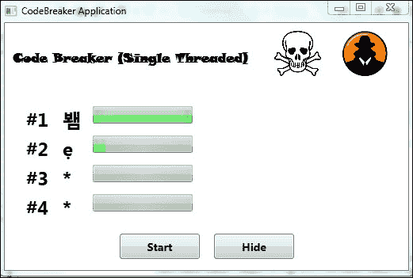

当代码正在被破解时，UI 可以继续使用，因为破解代码是在一个独立的线程中进行的。

如果在你的系统上破解代码运行得太快，为了查看发生了什么，在 `if (checkCodeChar(lcChar, liCharNumber))` 语句之前添加以下行。

```cs
System.Threading.Thread.Sleep(1);
```

这将在每个字符被检查之间添加 1 毫秒的等待时间。

## 它是如何工作的？

循环中编写的代码仅在完成百分比增加一个单位或更多时才报告进度。否则，我们将会触发 65,536 个事件来报告只有 100 个不同的百分比。这没有意义，并且会增加额外的处理负担。这将非常低效，并且会使循环执行时间更长。

# 取消 BackgroundWorker 线程

在独立的线程中执行耗时过程允许我们在显示其进度的同时并发工作。这样做的一个优点是，允许用户在图形用户界面中继续使用控件，而不会受到单线程应用程序的限制。例如，他或她可能想要取消破解过程，而不是让它完成。

`BackgroundWorker` 组件简化了取消它创建的线程中运行的代码执行的任务，而无需大量的编程工作。

要做到这一点，我们必须将`BackgroundWorker`的`WorkerSupportsCancellation`属性赋值为`true`。这是一个`bool`值，表示新线程中执行的代码是否可以通过调用`BackgroundWorker`的`CancelAsync()`方法来支持取消。此方法简单地将`true`值赋给`BackgroundWorker`的`CancellationPending`属性。因此，在`DoWork`事件处理器中执行的代码必须定期检查此属性值，以确定是否需要继续工作。

隐藏`CodeBreaking`并不会停止`CodeBreaking`过程。因此，如果有人黑入我们的电脑并看到这个过程，我们仍然可能被发现。因此，提供快速取消程序给应用程序非常重要。

## 如何操作

我们将对示例进行一些修改，以便用户可以在任何时候取消循环，而不需要使用代理或回调，利用`BackgroundWorker`组件提供的功能：

1.  打开项目`CodeBreaker`。

1.  将`bakCodebreaker`的`WorkerSupportsCancellation`属性设置为`true`。

1.  添加一个按钮控件`btnStop`。将其`Text`属性设置为`"Stop"`。

1.  在`setCodeBreakerVisibility`过程添加以下代码行。它将改变新按钮的可见性：

    ```cs
        // Change the visibility of the new stop button
          btnStop.Visibility = pbValue;
    ```

1.  在`bakCodebreaker`的`DoWork`事件中打开代码，并在`for`循环开始处的`lcChar = (char)(i)`之前输入以下代码（现在的代码添加了对提前取消的支持）：

    ```cs
        if (bakCodebreaker.CancellationPending)
        {
            // The user requested to cancel the process
            e.Cancel = true;
            return;
       }
    ```

1.  在按钮`btnStart`的`Click`事件中打开代码，并在开始处添加以下几行代码（现在的代码禁用了**Start**按钮并启用了**Stop**按钮）：

    ```cs
                    // Disable the Start button
                btnStart.IsEnabled = false;
                // Enable the Stop button
                btnStop.IsEnabled = true;
    ```

1.  在构造函数中将`btnStop`按钮的`IsEnabled`属性设置为`false`。因此，当应用程序启动时，按钮将被禁用。

1.  在`btnStop`按钮的`Click`事件中打开代码，并输入以下代码：

    ```cs
                    // Disable the Stop button
                btnStop.IsEnabled = false;
                // Enable the Start button
                btnStart.IsEnabled = true;

                //Call the CancelAsync method to cancel the 
                // process.
                bakCodebreaker.CancelAsync();
    ```

1.  构建并运行应用程序。

1.  点击**Start**按钮。现在点击**Stop**按钮。CodeBreaker 将取消其执行。由`BackgroundWorker`组件创建的线程将停止运行。结果如下截图所示：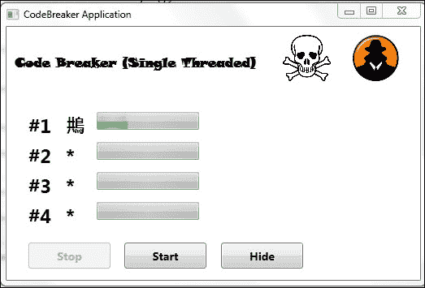

1.  现在，点击**Start**按钮并让 CodeBreaking 完成。

## 它是如何工作的？

之前，你可以避开守卫，现在你能够停止`CodeBreaking`，以防间谍黑入你的系统！

我们现在可以开发一个能够在后台执行耗时任务的应用程序，同时保持图形用户界面活跃。这为用户提供了一个更真实的生活体验，我们可以为用户提供随时开始和停止进程的可能性。我们使用`BackgroundWorker`组件的功能完成了所有这些。

然而，应用程序存在缺陷。当我们点击 **开始** 按钮并让过程完成时，**停止** 按钮不会被显示为禁用状态。此外，我们无法在屏幕上看到最终的代码。我们必须为此创建一个补救措施。

# 与多个 BackgroundWorker 组件一起工作

我们可以使用许多 `BackgroundWorker` 组件来运行多个并发线程。通常，我们会使用 `Thread` 类一次性运行多个线程，但 `BackgroundWorker` 类也为我们提供了这样做的一种简单方法。正如我们在上一章所学到的，性能结果将取决于我们运行应用程序的计算机中可用的核心或处理器的数量以及每个核心被其他执行线程占用的繁忙程度。

使用真实算法，破解四个 Unicode 字符代码的过程非常密集，所需时间比预期更长。破解代码必须尽可能快地完成。到目前为止，我们一直在使用多线程来使应用程序更响应，但现在，我们必须使破解过程的执行速度更快。

我们将把之前示例中的代码分成四个 `BackgroundWorker` 组件。通过这个示例，我们将学习多个 `BackgroundWorker` 组件如何共存并创建新的独立线程，从而实现令人难以置信的性能提升。

## 它是如何工作的？

需要遵循的步骤如下：

1.  打开 `CodeBreaker` 项目。

1.  添加三个新的 `BackgroundWorker` 组件（`bakCodeBreaker2`、`bakCodeBreaker3` 和 `bakCodeBreaker4`）以创建四个独立的线程。这是在 `MainWindow` 类的声明部分中完成的。接下来，在类构造函数中将它们的属性 `WorkerReportsProgress` 和 `WorkerSupportsCancellation` 设置为 `True`。

1.  在项目中添加一个新的类，并将其命名为 `CodeBreakerParameters`。`CodeBreakerParameters` 类将具有一些属性，这些属性将帮助提供许多值，这些值将作为四个 `BackgroundWorker` 组件的参数可用：

    ```cs
        public class CodeBreakerParameters
        {
            // The first char position in the 4 chars code to 
            // process
               private int priFirstCharNumber;
            // The last char position in the 4 chars code to 
            // process
               private int priLastCharNumber;
            // The maximum number of the Unicode character
            private int priMaxUnicodeCharCode;

            public int FirstCharNumber
            {
                get
                {
                    return priFirstCharNumber;
                }
                set
                {
                    priFirstCharNumber = value;
                }
            }

            public int LastCharNumber
            {
                get
                {
                    return priLastCharNumber;
                }
                set
                {
                    priLastCharNumber = value;
                }
            }

            public int MaxUnicodeCharCode
            {
                get
                {
                    return priMaxUnicodeCharCode;
                }
                set
                {
                    priMaxUnicodeCharCode = value;
                }
            }
        }
    ```

1.  再次，添加另一个新的类文件。这个类将被命名为 `CodeBreakerResult`。新的 `CodeBreakerResult` 类将具有一些属性，这些属性有助于为四个 `BackgroundWorker` 组件的 `RunWorkerCompleted` 事件提供许多值：

    ```cs
        public class CodeBreakerResult
        {
            // The first char position in the 4 chars code to 
            // process
            private int priFirstCharNumber;
            // The last char position in the 4 chars code to 
            // process
            private int priLastCharNumber;
            // The part of the broken code 
            private string prsBrokenCode;

            public int FirstCharNumber
            {
                get
                {
                    return priFirstCharNumber;
                }
                set
                {
                    priFirstCharNumber = value;
                }
            }

            public int LastCharNumber
            {
                get
                {
                    return priLastCharNumber;
                }
                set
                {
                    priLastCharNumber = value;
                }
            }

            public string BrokenCode
            {
                get
                {
                    return prsBrokenCode;
                }
                set
                {
                    prsBrokenCode = value;
                }
            }
        }
    ```

1.  在 `btnStart` 按钮的 `Click` 事件中打开，并在 `bakCodebreaker.RunWorkerAsync();` 行之前添加以下代码行（现在代码将为四个 `BackgroundWorker` 组件设置参数，并将它们异步运行）：

    ```cs
        // Start running the code programmed in each 
        // BackgroundWorker DoWork event handler in a new 
        // independent thread and return control to the 
        // application's main thread
        // First, create the CodeBreakerParameters for each 
        // BackgroundWorker and set its parameters
        CodeBreakerParameters loParameters1 = new CodeBreakerParameters();
        CodeBreakerParameters loParameters2 = new CodeBreakerParameters();
        CodeBreakerParameters loParameters3 = new CodeBreakerParameters();
        CodeBreakerParameters loParameters4 = new CodeBreakerParameters();
        loParameters1.MaxUnicodeCharCode = 32000;
        loParameters1.FirstCharNumber = 0;
        loParameters1.LastCharNumber = 0;
        loParameters2.MaxUnicodeCharCode = 32000;
        loParameters2.FirstCharNumber = 1;
        loParameters2.LastCharNumber = 1;
        loParameters3.MaxUnicodeCharCode = 32000;
        loParameters3.FirstCharNumber = 2;
        loParameters3.LastCharNumber = 2;
        loParameters4.MaxUnicodeCharCode = 32000;
        loParameters4.FirstCharNumber = 3;
        loParameters4.LastCharNumber = 3;
        bakCodebreaker.RunWorkerAsync(loParameters1);
        bakCodebreaker2.RunWorkerAsync(loParameters2);
        bakCodebreaker3.RunWorkerAsync(loParameters3);
        bakCodebreaker4.RunWorkerAsync(loParameters4);
    ```

1.  现在，在同一上述事件中，删除行 `bakCodebreaker.RunWorkerAsync();`。

1.  在 `btnStop` 按钮的 `Click` 事件中打开，并添加以下代码行（现在代码将取消四个 `BackgroundWorker` 组件，即 `bakCodebreaker` 和以下行中添加的三个 `BackgroundWorker` 组件）：

    ```cs
        bakCodebreaker2.CancelAsync();
        bakCodebreaker3.CancelAsync();
        bakCodebreaker4.CancelAsync();
    ```

1.  现在，我们将创建通用的过程来处理 `BackgroundWorker` 组件的以下程序化事件，接收与相应事件处理器相同的参数：

    +   `DoWorkProcedure` 用于 `DoWork` 事件

    +   `RunWorkerCompletedProcedure` 用于 `RunWorkerCompleted` 事件

    +   `ProgressChangedProcedure` 用于 `ProgressChanged` 事件

1.  将 `bakCodebreaker` 的 `DoWork` 事件处理器代码粘贴到一个新的私有过程中，然后按照以下所示进行更改：

    ```cs
        private void DoWorkProcedure(object sender, DoWorkEventArgs e)
    ```

1.  在开头添加以下变量定义：

    ```cs
        // This variable will hold the broken code
        string lsBrokenCode = "";
        CodeBreakerParameters loCodeBreakerParameters = (CodeBreakerParameters)e.Argument;
    ```

1.  将行 `int liTotal = (int)e.Argument;` 替换为以下（现在事件处理器过程需要更多的参数，因此我们创建了一个类来管理它们）：

    ```cs
        int liTotal = loCodeBreakerParameters.MaxUnicodeCharCode;
    ```

1.  将定义第一个循环的行替换为以下（现在循环考虑了通过 `CodeBreakerParameters` 实例接收到的参数）：

    ```cs
        for (liCharNumber = loCodeBreakerParameters.FirstCharNumber; liCharNumber <= loCodeBreakerParameters.LastCharNumber; liCharNumber++)
    ```

1.  将挂起的取消检查替换为以下行（我们使用 `sender` 参数类型转换，因为四个 `BackgroundWorker` 组件都使用了相同的程序）：

    ```cs
       if (((BackgroundWorker)sender).CancellationPending)
    ```

1.  将对 `ReportProgress` 方法的调用替换为以下行（再次，我们使用 `sender` 参数类型转换以进行泛化）：

    ```cs
    ((BackgroundWorker)sender).ReportProgress(loCodeBreakerProgress.PercentageCompleted, loCodeBreakerProgress);
    ```

1.  当 `checkCodeChar` 函数返回 `true` 时，替换对 `ReportProgress` 方法的调用为以下行：

    ```cs
        ((BackgroundWorker)sender).ReportProgress(loCodeBreakerProgress.PercentageCompleted, loCodeBreakerProgress);
    ```

1.  将行 `e.Result = lsBrokenCode;` 替换为以下行（现在我们必须返回多个结果；因此，我们使用之前创建的 `CodeBreakerResult` 类的实例）：

    ```cs
        // Create a new instance of the CodeBreakerResult class 
        // and set its properties' values
        CodeBreakerResult loResult = new CodeBreakerResult();
        loResult.FirstCharNumber = loCodeBreakerParameters.FirstCharNumber;
        loResult.LastCharNumber = loCodeBreakerParameters.LastCharNumber;
        loResult.BrokenCode = lsBrokenCode;
        // Return a CodeBreakerResult instance in the Result 
        // property
        e.Result = loResult;
    ```

1.  输入以下代码以创建新的 `RunWorkerCompleted` 过程：

    ```cs
        private void RunWorkerCompletedProcedure(object sender, RunWorkerCompletedEventArgs e)
        {
            if (!e.Cancelled)
            {
                // Obtain the CodeBreakerResult instance 
                // contained in the Result property of e 
                // parameter
                CodeBreakerResult loResult = (CodeBreakerResult)e.Result;
                int i;

                // Iterate through the parts of the result 
                // resolved by this BackgroundWorker
                for (i = loResult.FirstCharNumber; i <= loResult.LastCharNumber; i++)
                {
                    // The process has finishes, therefore the 
                    // ProgressBar control must show a 100%
                    prloProgressChar[i].Value = 100;
                    // Show the part of the broken code in the 
                    // label
                    OutputCharLabels[i].Text = loResult.BrokenCode[i - loResult.FirstCharNumber].ToString();
                }
        }
    ```

1.  输入以下代码以创建新的 `ProgressChangedProcedure` 过程：

    ```cs
        private void ProgressChangedProcedure(object sender, ProgressChangedEventArgs e)
        {
            // This variable will hold a CodeBreakerProgress 
            // instance
            CodeBreakerProgress loCodeBreakerProgress = (CodeBreakerProgress)e.UserState;
            // Update the corresponding ProgressBar with the percentage received as a parameter
            prloProgressChar[loCodeBreakerProgress.CharNumber].Value = loCodeBreakerProgress.PercentageCompleted;
            // Update the corresponding Label with the character being processed
            OutputCharLabels[loCodeBreakerProgress.CharNumber].Text = ((char)loCodeBreakerProgress.CharCode).ToString();
        }
    ```

现在，你必须为四个 `BackgroundWorker` 组件的三个附加事件处理器编写代码。因为我们使用了过程，所以我们将为四个 `BackgroundWorker` 组件使用相同的代码：

1.  在四个 `BackgroundWorker` 组件的 `DoWork` 事件处理器中添加以下代码：

    ```cs
        DoWorkProcedure(sender, e);
    ```

1.  在四个 `BackgroundWorker` 组件的 `ProgressChanged` 事件处理器中添加以下代码：

    ```cs
        ProgressChangedProcedure(sender, e);
    ```

1.  在四个 `BackgroundWorker` 组件的 `RunWorkerCompleted` 事件处理器中添加以下代码：

    ```cs
        RunWorkerCompletedProcedure(sender, e);
    ```

1.  构建并运行应用程序。

1.  点击 **开始** 按钮，让过程完成。你会看到所有四个字符都在同时并发解码。如果你有一台具有四个核心的机器，你会看到所有四个核心都在同时使用，性能得到了显著提升：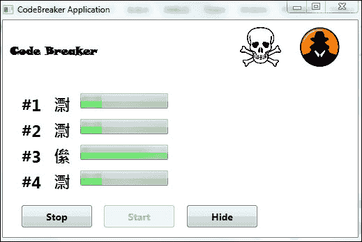

    完成后，它看起来是这样的：

    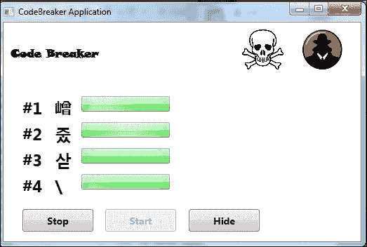

## 如何工作？

现在，你的代码破解过程非常快！代码的每个字符都在并行解码。

正如我们所见，使用`BackgroundWorker`组件提供的功能将一个过程拆分为许多线程是很容易的。前一个示例的执行结果将取决于计算机中可用的核心或处理器的数量。理想的情况是启动与可用核心数量相同的`BackgroundWorker`组件。这样，我们可以为每个线程实现最佳性能，并将 CPU 使用率提高到约 95%。当然，这会有所变化，我们并不总是知道目标机器上的核心数量。正如我们将在未来的章节中看到的，当我们在事先不知道机器上的核心数量时，有方法可以使用**任务并行库**（**TPL**）在机器上实现最大并发性。

现在，我们不需要运行许多应用程序实例来利用并行处理能力。使用`BackgroundWorker`组件以及我们迄今为止所学的一切，我们可以相当容易地将一个过程拆分为许多线程。

然而，我们不得不对代码进行一些重要的修改，因为我们需要泛化四个`BackgroundWorker`组件的行为，而不必四次编写相同的代码。这被称为**重构**，并且在开发软件时也应该进行，以最小化冗余代码。

我们创建了新的类来传递参数和获取结果，因为我们需要许多参数和许多结果。正如你所见，通过类型转换，C#为我们提供了泛化代码的极好替代方案。

### 注意

关键在于`sender`参数。请记住，这个参数在事件处理器中可用，它提供了一个指向触发事件的组件（即`BackgroundWorker`）的引用。将`sender`参数类型转换为`BackgroundWorker`组件，我们可以在不同的事件处理器中泛化代码，并为每个事件创建过程。

有很多变化。但一旦代码模式被练习和学习，与并发编程结构一起工作将变得更加容易。这在使用 TPL 时尤为重要。

目前，应用程序使用了四个`BackgroundWorker`组件，因此有四个独立的线程，不包括主线程。它不会给用户关于 CodeBreaking 全局过程结束的消息。

# 探索其他示例

尝试添加另一个`BackgroundWorker`来显示一个消息框，告诉用户过程已完成，或者当四个`BackgroundWorker`组件完成其工作后，禁用**停止**按钮并启用**开始**按钮。你可以使用`IsBusy()`函数。

您可以使用**进程资源管理器**来查看示例的运行线程并监控其活动。如果您还没有安装，可以从[`download.cnet.com/Process-Explorer/3000-2094_4-10223605.html`](http://download.cnet.com/Process-Explorer/3000-2094_4-10223605.html)下载并安装**进程资源管理器**。这是一个非常实用的工具，将允许您真正剖析应用程序中不同线程的情况。以下是在我们的`CodeBreaker`应用程序旁边运行的进程资源管理器的示例。

应用我们在上一章中学到的所有知识。此外，使用 Windows 任务管理器。当您在具有四核微处理器的计算机上使用进程资源管理器监控与四个`BackgroundWorker`线程同时运行的应用程序时，您将更好地理解多个进程和多线程应用程序之间的差异。

在按下**开始**按钮之前，您应该看到以下线程和信息：

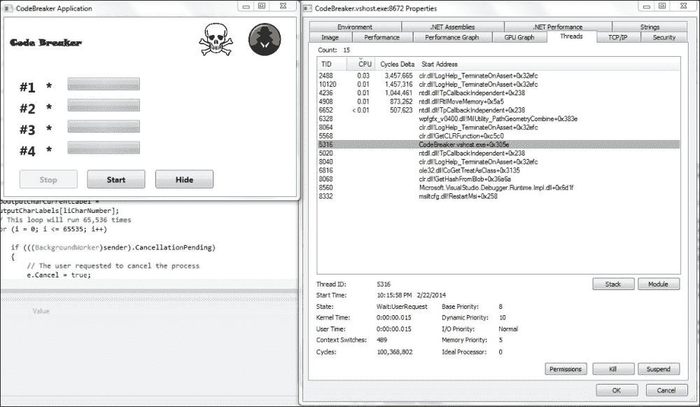

在按下**开始**按钮之后，您应该看到以下线程和信息：

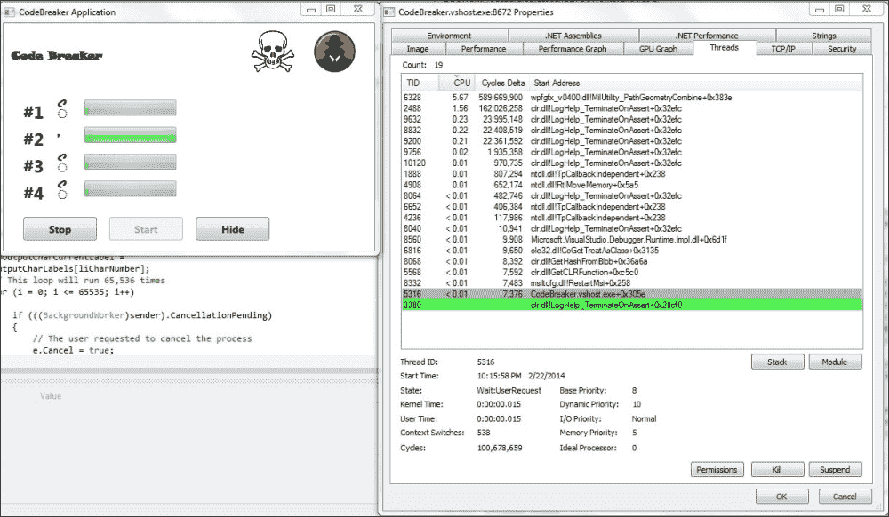

使用一个、两个、三个和四个线程同时监控应用程序。

使用我们在上一个示例中学到的模式来增强应用程序，仅使用一个`BackgroundWorker`组件。修改代码以添加在每个`BackgroundWorker`组件中启动和停止线程的可能性。

监控应用程序启动和停止一个、两个、三个和四个线程同时运行，并注意在进程资源管理器中线程活动以及 CPU 使用情况的变化。

在不同计算机上运行应用程序，这些计算机拥有不同的微处理器，并使用进程资源管理器来监控它们的行为并测量它们的性能。

# 摘要

在本章中，我们学习了如何使用`BackgroundWorker`组件来处理线程。具体来说，我们涵盖了以下内容：

+   开发能够使用`BackgroundWorker`组件创建后台线程并利用该组件提供的方法显示执行进度的应用程序

+   编程`BackgroundWorker`组件的代码以供执行

+   理解同步和异步执行之间的差异以及它们与线程的关系

+   在用户界面中报告多个线程的进度

+   使用`BackgroundWorker`实例启动和取消创建的线程

+   使用多个`BackgroundWorker`组件启动多个线程

+   在代码中创建`BackgroundWorker`组件的各种事件处理器

现在我们已经学会了使用`BackgroundWorker`组件在 C#应用程序中创建多个线程的简单方法，我们现在准备使用一种更加灵活但更复杂的技巧——`Thread`类，这是下一章的主题。
