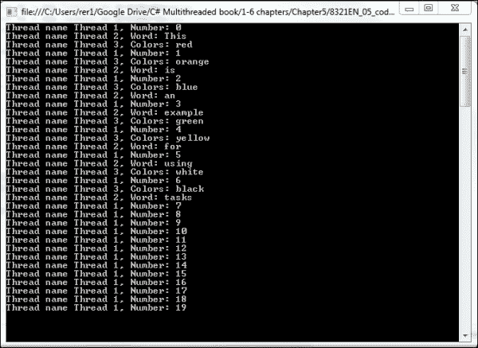
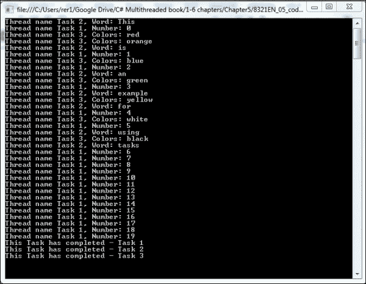
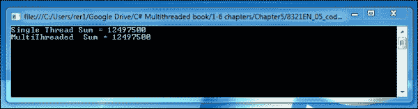
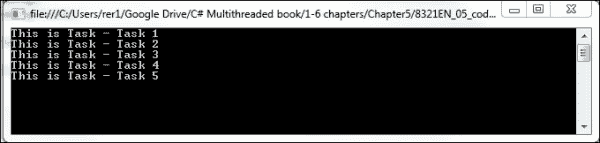
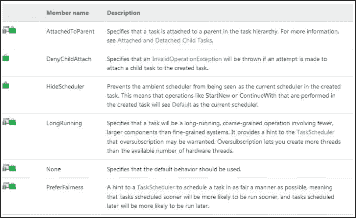
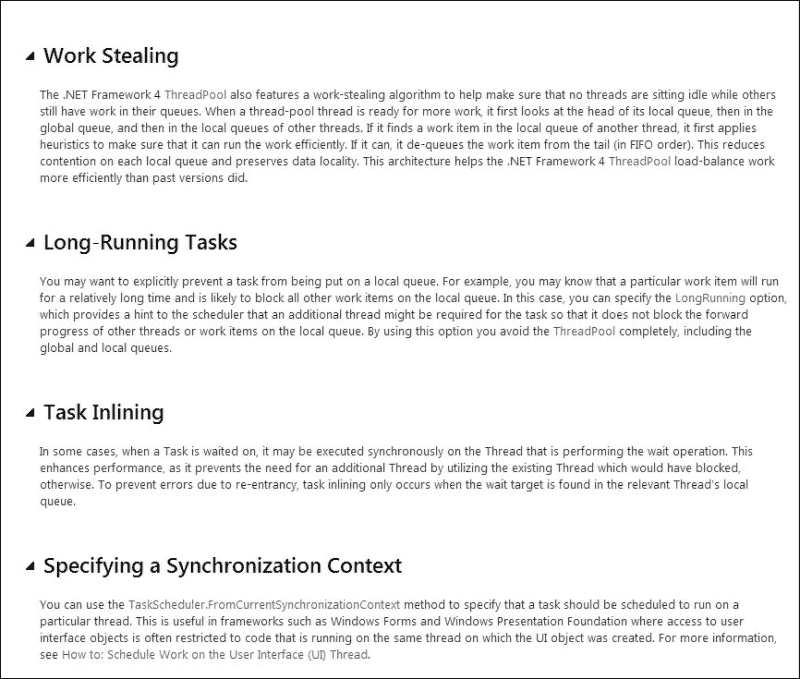
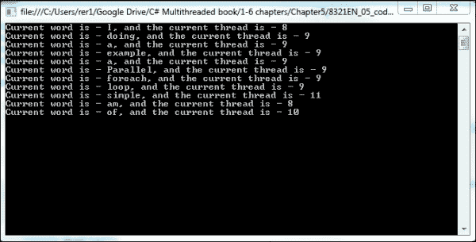

# 第五章：轻量级并发 – 任务并行库（TPL）

在 .NET 4.0 中，微软推出了所谓的 **任务并行库（Task Parallel Library，简称 TPL**），并通过开发多线程应用程序来回应用户的关注。TPL 允许开发者专注于他们试图实现的功能，而不会因为管理多个线程、线程池和可用的处理器核心数量而陷入困境。

到目前为止，我们已经介绍了 `BackgroundWorker` 组件和 `Thread` 类，以展示在 C#/.NET 应用程序中实现多线程功能的方法。这两种实现多线程功能的方法自 .NET 早期阶段以来一直存在。`Thread` 类是在 .NET 1.1 版本中引入的，而 `BackgroundWorker` 是在 .NET 2.0 版本中引入的。我们将这些方法归类为重量级并发，因为它们需要开发者做大量工作，并增加了代码设计的复杂性。开发者必须管理不同的线程，并且为了达到最大性能，需要确定机器中的处理器核心数量。

完成本章后，你将：

+   完全理解任务并行库及其构成的不同类

+   理解如何创建和使用 `Task` 类

+   理解任务在 .NET 和线程池中的管理方式

+   理解 `Parallel` 类以及如何使用它启动任务

+   了解多线程从重量级到轻量级并发的演变

+   学习何时使用任务而非 `线程`

+   理解任务并行与数据并行的区别

+   理解并发数据收集和并发数据处理

# 任务并行库

任务并行库（Task Parallel Library，简称 TPL）作为 .NET 4.0 版本的一部分被引入。最初，它以并行扩展（Parallel Extensions）的名义开发，这是微软研究院和 CLR 团队共同的努力成果。并行扩展包括 TPL 和 **并行 LINQ（Parallel LINQ，简称 PLINQ**），我们将在后续章节中介绍。现在，TPL 被优先考虑用于开发多线程应用程序，而不是线程和 `BackgroundWorker` 组件。

理念是创建一个托管并发库，将 .NET 的多线程能力提升到新的水平。TPL 包含一组位于 `System.Threading` 和 `System.Threading.Tasks` 命名空间中的 API 和公共类型。

使用 TPL 而不是线程的一个优点是 .NET 可以动态地调整应用程序，以最有效地使用其硬件的处理器核心。.NET 足够智能，可以确定机器中的处理器核心数量，并适当地管理 `ThreadPool`。当直接使用线程编程时，开发者必须处理这项工作。开发者不再需要确定核心数量和为达到最大性能而创建的相应线程数量。如果你还记得我们之前关于线程和 `BackgroundWorker` 组件的例子，我们不得不在代码中这样做。

TPL 还为我们管理 `ThreadPool`。它处理线程的调度、取消和状态管理。这个托管的 `ThreadPool` 允许 .NET 在管理任务与线程之间有更高的智能度。`Task.Factory` 类可以被告知一个任务是否是一个长时间运行的非 CPU 密集型任务，或者是一个 CPU 密集型任务。有了这些信息，它可以通过 `ThreadPool` 来管理，为每个核心创建一个线程（CPU 密集型任务）或为每个核心创建多个线程（长时间运行的任务等待其他资源）。这是以前需要由开发者处理逻辑。现在 .NET 为你处理。

接下来，我们将检查 TPL 的核心，即 `Task` 类。

# 探索任务

`Task` 类代表一些可以以异步方式原子执行的工作。它是 TPL 在 `ThreadPool` 上执行和管理的工作项。它与线程非常相似，但围绕它构建了更高层次的概念和功能。它是任务并行库的中心控制。

`Task` 类有一套完整的方法用于状态更新、取消、异常处理、调度和等待，这使得它相对于线程来说更“轻量级”。鉴于 TPL 提供的功能来管理后台的 `ThreadPool`，它还可以更有效地使用系统资源。

让我们先创建并执行一个任务。首先，我们将创建几个方法来表示要完成的工作。然后我们将使用任务来执行这项工作。主要有两种方法可以实现这一点：`Parallel.Invoke` 和 `Task.Factory.StartNew`。让我们分别看看。我们将从不需要返回值的任务开始。下一节将探讨运行返回值的任务的方法。

## 如何操作

我们将首先使用 Visual Studio 2013 创建一个新的控制台应用程序。我们将把我们的应用程序命名为 `TaskExample`。

1.  首先，我们将向 `Program.cs` 文件中添加两个 `using` 语句，以便我们可以使用 TPL 类。

    ```cs
    using System.Threading;
    using System.Threading.Tasks;
    ```

1.  接下来，让我们定义三个不同的 `static` 方法，它们将代表三个任务完成的工作：`WriteNumbers`、`WriteWords` 和 `WriteColors`。其中一个将遍历前 20 个数字并将每个数字写入控制台。另一个将遍历一个句子并将每个单词写入控制台。最后一个将遍历一个颜色数组并将每个颜色写入控制台。现在，将以下三个方法添加到您的 `Program.cs` 文件中：

    ```cs
            static void WriteNumbers()
            {
                //Set thread name.
                Thread.CurrentThread.Name = "Thread 1";

                for (int i = 0; i < 20; i++)
                {
    Console.WriteLine("Thread name {0}, Number: {1}", Thread.CurrentThread.Name, i);
                    Thread.Sleep(2000);
                }
            }

            static void WriteWords()
            {
                //Set thread name.
                Thread.CurrentThread.Name = "Thread 2";

                String localString = "This is an example for using tasks";
                String[] localWords = localString.Split(' ');
                foreach (String s in localWords)
                {
    Console.WriteLine("Thread name {0}, Word: {1}", Thread.CurrentThread.Name, s);
                    Thread.Sleep(2000);
                }

            }

            static void WriteColors()
            {
                //Set thread name.
                Thread.CurrentThread.Name = "Thread 3";

    String[] localColors = {"red", "orange", "blue", "green", "yellow", "white", "black"};
                foreach (String s in localColors)
                {
    Console.WriteLine("Thread name {0}, Colors: {1}",Thread.CurrentThread.Name, s);
                    Thread.Sleep(2000);
                }
            } 
    ```

1.  最后，我们将添加代码以将每个方法作为任务运行：

    ```cs
                //Create the 3 Tasks.
                Task t1 = new Task(() => WriteNumbers());
                Task t2 = new Task(() => WriteWords());
                Task t3 = new Task(() => WriteColors());

                //Run the 3 Tasks.
                t1.Start();
                t2.Start();
                t3.Start();

                Console.ReadLine();
    ```

1.  现在，编译并运行应用程序，你应该会看到一个类似于这样的控制台窗口：

    这是一个简单的示例，但它让你看到三个任务在单独的线程中运行，每个线程执行不同的方法。你可以看到每个任务的线程名称，并且你会注意到线程并不总是按顺序并发运行。

1.  现在，让我们用以下代码替换`Main`方法中的代码：

    ```cs
                //Create the 3 Tasks.
                //Task t1 = new Task(() => WriteNumbers());
                //Task t2 = new Task(() => WriteWords());
                //Task t3 = new Task(() => WriteColors());

                //Run the 3 Tasks.
                //t1.Start();
                //t2.Start();
                //t3.Start();
                Parallel.Invoke
                (
                    new Action(WriteNumbers),
                    new Action(WriteWords),
                    new Action(WriteColors)
                );
         Console.ReadLine();
    ```

1.  现在，重新构建并再次运行应用程序。你应该会看到相同或几乎相同的结果。

    ### 注意

    结果可能不同的原因是三种方法正在三个不同的核心上以三个不同的线程中运行。因此，根据性能和您计算机上运行的其他项目，这三个任务可以以不同的时间运行，这导致控制台输出顺序可能不同。

## 它是如何工作的

在上一个练习中，你学习了两种使用`Task`类在单独的线程中实现功能的方法。这些示例使用不返回值的函数并实例化`Task`类来执行这些方法。

`Task`构造函数接受一个`Action`委托：

```cs
public delegate void Action<in T>(
   T obj
)
```

我们使用 lambda 表达式来定义`Action`委托，它封装了一个要执行的方法。在本章的后面部分，我们将更详细地定义委托和 lambda 表达式。

首先，我们使用了`Task.Start()`方法来执行任务。这将在`ThreadPool`上放置任务，并让.NET 管理其执行。为了实例化`Task`类，我们在构造函数中使用了 lambda 表达式。

在第二个示例中，我们使用了 TPL 中的另一个类，并使用`Parallel.Invoke()`方法运行了任务。在这里，我们能够通过使用此方法和`Action`类一次将所有三个任务放置在`ThreadPool`上。

我们使用`Console.ReadLine()`命令在线程执行完成后保持命令窗口打开。这允许我们研究结果并控制窗口的关闭。要关闭窗口，只需按*Enter*键；这将完成`ReadLine`语句。控制台正在等待读取一行输入。

# 返回值的任务

现在，我们将看看如何启动一个返回值的任务。在大多数情况下，如果我们关心任务的结果，或者任务执行了一些其他程序需要消费的工作，那么我们希望任务返回一些值供我们使用。我们将通过开发一个简单的控制台应用程序来演示这一点，该应用程序启动三个任务，然后打印这三个任务的返回值。

## 如何操作

我们将首先使用 Visual Studio 2013 创建一个新的控制台应用程序。我们将把我们的应用程序命名为`TaskExampleWithReturnValues`。

接下来，将以下代码放置在`Program.cs`中的`Program`类中：

```cs
class Program
    {
        static void Main(string[] args)
        {
            //Create the 3 Tasks.
            Task<String> t1 = new Task<String>(() => WriteNumbers());
            Task<String> t2 = new Task<String>(() => WriteWords());
            Task<String> t3 = new Task<String>(() => WriteColors());

            //Run the 3 Tasks.
            t1.Start();
            t2.Start();
            t3.Start();

            Console.WriteLine(t1.Result);
            Console.WriteLine(t2.Result);
            Console.WriteLine(t3.Result);

            Console.ReadLine();

        }

        static String WriteNumbers()
        {
            //Set thread name.
            Thread.CurrentThread.Name = "Task 1";

            for (int i = 0; i < 20; i++)
            {
Console.WriteLine("Thread name {0}, Number: {1}",Thread.CurrentThread.Name, i);
                Thread.Sleep(2000);
            }

return String.Format("This Task has completed - {0}", Thread.CurrentThread.Name);
        }

        static String WriteWords()
        {
            //Set thread name.
            Thread.CurrentThread.Name = "Task 2";

            String localString = "This is an example for using tasks";
            String[] localWords = localString.Split(' ');
            foreach (String s in localWords)
            {
Console.WriteLine("Thread name {0}, Word: {1}", Thread.CurrentThread.Name, s);
                Thread.Sleep(2000);
            }

return String.Format("This Task has completed - {0}", Thread.CurrentThread.Name);
        }

        static String WriteColors()
        {
            //Set thread name.
            Thread.CurrentThread.Name = "Task 3";

String[] localColors = { "red", "orange", "blue", "green", "yellow", "white", "black" };
            foreach (String s in localColors)
            {
Console.WriteLine("Thread name {0}, Colors: {1}",Thread.CurrentThread.Name, s);
                Thread.Sleep(2000);
            }

return String.Format("This Task has completed - {0}", Thread.CurrentThread.Name);
        }
    }
```

最后，让我们构建并运行我们的应用程序。你的控制台窗口应该看起来像这样：



## 它是如何工作的

在此示例中，我们使用 `Task<TResult>` 版本的 `Task` 类，这允许我们在任务完成执行后指定一个返回对象。返回值将被放置在 `Task.Result` 属性中，并将是你在声明中定义的类型。因此，在以下代码行中，我们告诉 .NET 创建一个类型为 `Task` 的对象，该对象将执行 `WriteNumbers()` 方法并返回一个 `String` 值：

```cs
Task<String> t1 = new Task<String>(() => WriteNumbers());
```

这非常有用，因为它允许我们返回任何对象类型。

通过使用 `Console.WriteLine(t1.Result);` 这行代码，我们自动告诉 .NET 阻塞或暂停主线程，等待 `t1` 任务完成并返回 `t1.Result` 的值。.NET 足够智能，知道我们希望在执行此语句之前等待一个值的存在。否则，如果立即执行，值可能存在也可能不存在。如果不存在，我们会得到一个空引用错误。这是说使用 TPL 比使用线程更容易的另一种方式。TPL API 为你，即开发者，处理这些细节，并在代码中自行管理。

此外，在每种方法中，我们设置当前线程的名称，因此在我们的输出中，我们可以看到这三个任务在不同的线程中运行。

接下来，我们将检查 TPL 中的 API，它允许我们使用并发集合。

# 并发集合

另一个在 .NET 4.0 中引入的命名空间是 `Systems.Collections.Concurrent`。这并不是 TPL 的直接部分，但它经常与 TPL 一起使用，以提供许多常见的并行设计模式，例如我们在 第九章 中将要讨论的生产者-消费者模式，*管道和生产者-消费者设计模式*。

`System.Collections.Concurrent` 提供了 `Systems.Collections` 命名空间中集合类的线程安全版本。这些类与任务一起使用时工作得非常好。此命名空间包含 `ConcurrentBag`，这是一个包含诸如 `ConcurrentDictionary`、`ConcurrentQueue`、`ConcurrentStack` 和 `BlockingCollection` 等对象的集合，其中最流行的是这些。

所有这些并发集合都实现了底层集合的接口。这本质上封装了集合并提供了一个线程安全机制。这对于多线程开发者来说很方便，因为他们可以使用它们，而无需围绕它们设计线程安全逻辑。

在本节中，我们将查看`ConcurrentQueue`类，并展示如何使用任务来执行一个简单的多线程示例。这将展示 TPL 为多线程处理提供的强大和简单性。我们不必担心锁定资源以使其线程安全。我们不必担心硬件上的处理核心数量。我们不必担心变量之间的竞态条件。而且我们不必担心在类中使用全局变量来提供线程安全。所有这些都有类来处理。我们只需要关注逻辑。

拥有一组线程安全的集合供多个线程使用，使得多线程设计变得简单。注意我们比之前的例子需要考虑的事情更少。在我们划分工作之前，我们必须知道核心的数量来创建一个线程。现在这由`Task`和`ThreadPool`来处理。

我们必须将数据集划分为块，并给每个线程一个已知的数据块（即在图像处理示例中，每个线程得到图像的一个独立部分）。此外，我们最终必须回来并重新组装每个线程的结果。我们不再需要担心这三个问题。

在这个项目中，我们将从 0 到 5000（即 0 + 1 + 2 + 3 + 4 等等）的数字列表中取出，并由三个不同的线程求和。我们不会像以前那样给每个线程一个求和的范围，然后将结果相加。我们只需使用一个包含 5000 个数字的`ConcurrentQueue`集合，让三个线程分别取出项目，求和，并将求和结果加到总和中。

## 如何操作

让我们打开 Visual Studio 并创建一个名为`ConcurrentCollection`的新控制台应用程序项目；然后执行以下步骤：

1.  将以下代码放入`Program.cs`文件中：

    ```cs
    using System;
    using System.Collections.Concurrent;
    using System.Threading;
    using System.Threading.Tasks;

    class ConcurrentCollection
    { 
        static void Main()
        {
            ConcurrentQueue<int> queue = new ConcurrentQueue<int>();

            //Sum of a single thread adding the numbers as we queue them.
            int SingleThreadSum = 0;

            // Populate the queue. 
            for (int i = 0; i < 5000; i++)
            {
                SingleThreadSum += i;
                queue.Enqueue(i);
            }

            //Print the Sum of 0 to 5000.
            Console.WriteLine("Single Thread Sum = {0}", SingleThreadSum);

            //Sum of a multithread adding of the numbers.
            int MultiThreadSum = 0;

            //Create an Action delegate to dequeue items and sum them.
            Action localAction = () =>
            {
                int localSum = 0;
                int localValue;

                while (queue.TryDequeue(out localValue)) localSum += localValue;

                Interlocked.Add(ref MultiThreadSum, localSum);
            };

            // Run 3 concurrent Tasks.
            Parallel.Invoke(localAction, localAction, localAction);

            //Print the Sum of 0 to 5000 done by 3 separate threads.
            Console.WriteLine("MultiThreaded  Sum = {0}", MultiThreadSum);

            Console.ReadLine();
        }
    }
    ```

1.  现在，让我们构建并运行应用程序。你认为结果会是什么？它们应该看起来像以下输出：

## 它是如何工作的

在这个程序中，我们使用以下语句声明一个`ConcurrentQueue`对象：

```cs
ConcurrentQueue<int> queue = new ConcurrentQueue<int>();
```

然后我们使用以下循环将 1 到 5000 的数字放入队列中：

```cs
for (int i = 0; i < 5000; i++)
        {
            SingleThreadSum += i;
            queue.Enqueue(i);
        }
```

接下来，我们启动三个并行任务，每个任务从队列中取出项目，而无需锁定队列以保护线程安全，因为这是一个并发队列。它们使用以下命令从队列中取出所有项目：

```cs
queue.TryDequeue(out localValue)) localSum += localValue;
```

通过使用这个`ConcurrentQueue`对象，.NET 处理所有线程安全问题，并允许所有三个任务只关注要执行的工作。然后它们都将各自的局部和添加到`MultiThreadSum`值中。但请注意，这个值需要被锁定，因为它默认不是线程安全的，因为三个单独的任务都在并行尝试向它添加。

因此，最终，无论三个独立任务如何运行，`MultiThreadSum`都将保持不变，因为每个介于 1 到 5000 之间的数字只从队列中取出一次并加到总和中。

# 探索 TaskFactory 类

TPL（Task Parallel Library）在`System.Threading.Tasks`命名空间中的一个关键类是`TaskFactory`类。`TaskFactory`用于任务的创建和调度。`TaskFactory`类提供了一系列方法，使得任务的调度和管理变得非常简单。这些方法包括启动和继续方法，以及一系列符合我们将要在第十一章“异步编程模型”中介绍的模式的方法。本质上，这个类将许多常见的任务设计模式封装成易于使用和开发的方法。这是 TPL 使多线程开发变得“轻量级”的另一种方式。

大部分关于`TaskFactory`的工作将在第六章“基于任务的并行”和第七章“数据并行”中介绍，然后再在第十一章“异步编程模型”中再次介绍。但在这章中，我们将通过一个简单的示例来演示它们是如何被使用的。

## 如何实现

让我们从打开 Visual Studio 并创建一个名为`TaskFactoryExample`的新控制台应用程序开始。现在，让我们将以下代码添加到我们的`Program.cs`文件中：

```cs
using System;
using System.Collections.Generic;
using System.Linq;
using System.Text;
using System.Threading;
using System.Threading.Tasks;

namespace TaskFactoryExample
{
    class TaskFactoryExample
    {

        static TaskFactory TF = new TaskFactory(TaskScheduler.Default);

        static void Main(string[] args)
        {
            List<Task> tasklist = new List<Task>();

            tasklist.Add(TF.StartNew(() => Worker("Task 1"), CancellationToken.None, TaskCreationOptions.PreferFairness, TaskScheduler.Default));
            tasklist.Add(TF.StartNew(() => Worker("Task 2"), CancellationToken.None, TaskCreationOptions.PreferFairness, TaskScheduler.Default));
            tasklist.Add(TF.StartNew(() => Worker("Task 3"), CancellationToken.None, TaskCreationOptions.PreferFairness, TaskScheduler.Default));
            tasklist.Add(TF.StartNew(() => Worker("Task 4"), CancellationToken.None, TaskCreationOptions.PreferFairness, TaskScheduler.Default));
            tasklist.Add(TF.StartNew(() => Worker("Task 5"), CancellationToken.None, TaskCreationOptions.PreferFairness, TaskScheduler.Default));

            //wait for all tasks to complete.
            Task.WaitAll(tasklist.ToArray());

            //Wait for input before ending program.
            Console.ReadLine();
        }

        static void Worker(String taskName)
        {
            Console.WriteLine("This is Task - {0}", taskName);
        }
    }
}
```

现在，让我们编译并运行这个应用程序。你应该会看到以下截图所示的结果：



## 它是如何工作的

让我们现在检查我们刚刚完成的工作以及为什么它有效。你可以从输出中看到我们运行了五个任务，它们都在不同的线程中，然后等待它们完成。首先，我们创建了一个静态的`TaskFactory`类来使用：

```cs
static TaskFactory TF = new TaskFactory(TaskScheduler.Default);
```

`TaskFactory`构造函数有几个重载。我们使用的是只接受`TaskScheduler`对象的那个，我们选择了默认值。在本章的下一节中，我们将更详细地研究`TaskScheduler`类。

接下来，我们使用`TaskFactory`类的`StartNew()`方法创建了并运行了五个任务，如以下代码行所示。这个方法有很多重载，允许你根据你的需求和设计模式创建和启动任务。在第六章“基于任务的并行”和第七章“数据并行”中，我们将探讨更多这些内容：

```cs
TF.StartNew(() => Worker("Task 1"), CancellationToken.None, TaskCreationOptions.PreferFairness, TaskScheduler.Default)
```

让我们花一分钟来看看传递给`StartNew()`方法的不同的参数。我们传递了一个取消令牌、任务创建选项和调度器。这允许大量线程管理任务的工作无需手动完成。

取消令牌允许我们告诉.NET 任务是否可以被取消。它还允许我们设置一个等待句柄，如果任务被取消，则会被信号。任务创建选项允许以下设置，这比我们使用线程时对任务的控制要多得多（参考自[`msdn.microsoft.com/en-us/library/vstudio/system.threading.tasks.taskcreationoptions`](http://msdn.microsoft.com/en-us/library/vstudio/system.threading.tasks.taskcreationoptions))：



我们还向`TaskFactory`构造函数传递了一个用于`Action`对象的 lambda 表达式，它告诉任务应该执行什么：

```cs
() => Worker("Task 1")
```

最后，我们在任务列表上执行了`Task.WaitAll`，因此我们必须等待所有任务完成。我们将在下一章中看到如何直接使用`TaskFactory`对象来完成这项工作：

```cs
Task.WaitAll(tasklist.ToArray());
```

这是一个使用`TaskFactory`的基本示例，但你可以看到它提供的许多好处，以及与直接使用线程相比，它为开发者减少了多少工作量。

# 任务调度器

与使用`Thread`类相比，任务并行库的主要优势之一是`TaskScheduler`。这个类执行了你必须编程到你的多线程代码中以实现最大性能和效率的大量逻辑。这正是使用 TPL“轻量级”并发编程的真正原因。`TaskScheduler`类的主要任务是处理将任务排队到线程的工作，或者更具体地说，是`ThreadPool`，并管理`ThreadPool`以最好地利用机器上的处理核心数量。

`TaskScheduler`的一个最佳特性是它是一个`abstract`类，你可以从中派生自己的类。`TaskScheduler`允许你根据需要将任务调度到`ThreadPool`，如果默认的`TaskScheduler`不能满足你的需求。这为你提供了最大的灵活性和控制。

让我们花一分钟时间来谈谈`ThreadPool`。`ThreadPool`由一个队列（先进先出）组成，用于存储应用程序域中的线程工作项。任务被放置在这个队列中，直到有可用的线程来处理它们。在.NET 4.0 中，`ThreadPool`通过将工作队列变为`ConcurrentQueue`集合对象来增强性能，从而消除了使队列线程安全的锁定逻辑需求。

另一个需要注意的点是，不是其他任务子任务的任务被放入一个**全局**队列中，而子任务被放入父任务的**本地**队列中。因此，当一个线程完成处理工作项后，它会先在任务的本地队列中寻找更多的工作，然后再去全局队列。这是.NET 4.0 提高`ThreadPool`性能的另一种方式。

以下为`TaskScheduler`提高`ThreadPool`性能和从开发者那里移除工作的四种方式（参考自[`msdn.microsoft.com/en-us/library/dd997402(v=vs.110).aspx`](http://msdn.microsoft.com/en-us/library/dd997402(v=vs.110).aspx)）：



# 引入 Parallel 类

在本 TPL 入门指南中，我们将最后讨论的类是`Parallel`类。这个类将在第七章数据并行中详细讨论，当我们讨论数据并行时；但在这里介绍它也是值得的。`Parallel`类是`System.Threading.Tasks`命名空间的一部分，它提供了使用并行循环的功能。最常用的两个方法是`Parallel.For`和`Parallel.ForEach`，允许你遍历一个集合，并对集合中的每个项目并发执行逻辑。

我们在前面章节中简要地看到了它，当时我们使用`Parallel.Invoke`方法并行运行一组任务。但它的主要用途是数据并行。

我们可以使用命名方法、匿名方法或 lambda 表达式调用`Parallel.For`方法。

以下为三种方法的示例：

```cs
        // Named method.
        Parallel.For(0, 5, Method);

        //Anonymous method.
        Parallel.For(0, 5, delegate(int i)
        {
            // Do something
        });

        //Lambda expression.
        Parallel.For(0, 5, i =>
        {
            // Do something
        });
```

在命名方法版本中，你需要编写一个名为`Method`的方法，该方法接收一个整数参数，不返回任何内容。使用`Parallel.For`会导致.NET 并发运行循环的每个迭代。它是否这样做取决于处理器的核心数量以及同时进行的其他工作。

`Parallel.ForEach`方法接受一个`IEnumerable`数据源和一个`Action`委托，遍历数据源并对每个项目调用`Action`委托。如果有的话，它还会返回一个`ParallelLoopResult`对象，其中包含处理结果。这个的基本语法如下：

```cs
Parallel.ForEach(IEnumerable<TSource> source, Action<TSource> body)
```

## 如何实现

让我们看看一个简单的例子。打开 Visual Studio，创建一个名为`ParallelForEach`的新控制台应用程序，并执行以下步骤：

1.  将以下代码放置在`Program.cs`文件中：

    ```cs
    using System;
    using System.IO;
    using System.Threading;
    using System.Threading.Tasks;
    class SimpleForEach
    {
        static void Main()
        {
            string[] localStrings = "I am doing a simple example of a Parallel foreach loop".Split(' ');

            Parallel.ForEach(localStrings, currentString =>
                    {

                        Console.WriteLine("Current word is - {0}, and the current thread is - {1}", currentString,
                                            Thread.CurrentThread.ManagedThreadId);
                    } 
                 ); 

            Console.ReadLine();
        }
    }
    ```

1.  现在，让我们编译并运行应用程序。你的结果应该看起来像这样：

## 工作原理

首先，我们通过将句子拆分为字符串数组来创建一个`IEnumerable`集合，每个字符串代表句子中的一个单词。然后我们对每个单词执行`Parallel.ForEach`循环，并将单词和当前线程 ID 简单地打印到控制台。

这里需要注意的是，你看到线程 ID 8、9、10 和 11。每个循环迭代都有一个单独的线程，线程 ID 不是从 0 或 1 开始的。记住，TPL 使用`ThreadPool`。因此，`Action`代表者作为单独的任务被排队到`ThreadPool`中，每个迭代都有 11 个单词。`TaskScheduler`和.NET 尽可能地使用`ThreadPool`来并发处理这些排队的任务。在我的特定机器上，有四个处理核心。所以，它确实在四个线程之间分配了工作。但是，然后，根据计算机正在执行的其他工作，线程 8 处理了两个任务，线程 9 处理了七个任务，而线程 10 和 11 各自处理了一个任务。

但这里需要注意的是，我们不必管理任何这些。如果我们直接使用线程，我们就必须查询硬件并意识到有四个处理核心。然后，将数组分成四个更小的数组，并将每个较小的数组交给单个线程以实现最大性能。

# 代表者和 Lambda 表达式

在本章中，我们使用了代表者和 Lambda 表达式。这两个概念对于一些新开发者来说可能很令人困惑，所以让我们花点时间更详细地讨论一下。

在创建事件处理器时，经常使用代表者（Delegates）。一个**代表者**定义了一个封装了特定参数集和返回类型的引用类型的方法。它的工作方式与 C++中的函数指针非常相似。它允许我们传递一个代表者对象，这样我们就可以在编译时不知道方法的情况下调用该方法。

在我们的例子中，`Task`构造函数接受一个`Action`代表者来定义任务要执行的操作。在我们的例子中，我们在构造函数定义中设置了代表者的方法，但我们可以不这样做。我们可以写成这样：

```cs
            Action task1Method;
            task1Method = new Action(WriteNumbers);
            Task t1 = new Task(task1Method);
```

这样，我们声明了`Action`代表者。然后我们使用`WriteNumbers`方法实例化它，最后我们使用代表者实例化一个`Task`对象。在代码的后续部分，我们可以根据业务逻辑更改`Action`代表者使用的方法。因此，我们不需要在每次任务执行时都强制执行`WriteNumbers`方法。

在设计时，我们只需要知道我们想在任务中执行一个没有参数和没有返回类型的方法。这给了我们很大的权力和灵活性。

Lambda 表达式是一个匿名函数，可以用来创建代表者。在 Lambda 表达式中，有 Lambda 运算符`=>`以及这个运算符的左右两侧。左侧包含任何输入参数，右侧包含代码块的表达式。空括号表示没有参数。让我们看看以下语句：

```cs
Task t1 = new Task(() => WriteNumbers());
```

在这个语句中，我们使用 Lambda 表达式来表示`Task`构造函数接受的代表者：`() => WriteNumbers()`

这个 lambda 表达式告诉我们，委托没有输入参数(`()`)，并且委托的方法代码块是`WriteNumbers()`。

因此，我们可以看到，在前面的示例中，`Task`构造函数接受一个委托引用类型，我们使用 lambda 表达式来定义那个委托。通过这样做，我们可以在运行时灵活地更改任务执行时将执行哪个方法。编译时的唯一约束是传递给委托的参数和委托的返回类型。

# 摘要

在本章中，我们开始了对任务并行库的探索之旅，这将是本书剩余部分的重点。你学习了`Task`、`Action`、`TaskFactory`、`Parallel`和`TaskScheduler`类。

你还学习了轻量级并发与重量级并发的含义，并开始看到对开发者的许多好处。

本章中的代码示例非常简单，但旨在让你开始从 TPL 思维模式出发，跳出`Thread`和`BackgroundWorker`思维模式。在本书的剩余部分，我们将探索 TPL 类更多的详细功能以及几个常见的并行设计模式和它们如何使用 TPL 实现。

你应该已经能够看到 TPL 有多么强大，以及它处理为并发设计应用所涉及到的复杂性的程度。在构建多线程应用时，通常有四个开发者需要处理的考虑因素，这些因素不属于单线程应用；它们如下列出：

+   我们可以在应用程序中处理哪些功能并发？

+   我如何在不事先知道它将在什么机器上运行以及它可能有多少处理核心的情况下，管理以实现最佳性能？

+   我如何确保重叠在线程之间的数据和值是线程安全的？或者将数据和值分割以避免重叠？

+   我如何管理和协调不同的线程？

尽管我们刚刚开始讨论 TPL，但你已经可以看到，与直接使用线程进行并发编程相比，后三个问题已经为你处理好了。

第一项是一个设计决策，随着我们讨论常见的并行设计模式，你将看到 TPL 在这方面也帮了我们大忙。

现在，让我们继续前进到第六章，*基于任务的并行处理*，并开始真正熟悉使用 TPL 开发软件。
