# 第六章。基于任务的并行性

在本章中，我们将介绍**任务并行库**（**TPL**）以及使用`Task`类编写并发代码的细节。

在第五章")中，*轻量级并发 – 任务并行库 (TPL)*，我们开始了对轻量级并发和.NET 中完成多线程编程的新首选方式——TPL 的探索。在本章中，我们将进一步探讨基于任务并行性，并展示如何等待任务或多个任务，自定义任务的调度，错误处理以及取消任务。

TPL 为我们提供了一个简单的方法来在比直接与线程工作更高的抽象级别上调度、运行和协调任务。如前所述，任务是一组执行目标的指令，如果你愿意，是一个工作单元。我们可以在由委托调用的方法中定义任务，或者在任务创建命令中直接定义的 lambda 表达式中定义任务。

当同时运行多个任务时，有时我们需要在执行函数之前等待一个或多个任务完成，或者在某些条件出现时能够取消一个或多个任务，或者在并行运行时一个或多个任务抛出错误时协调异常处理。我们将在本章中讨论所有这些场景，并通过示例进行操作。到本章结束时，你将对在应用程序中并行使用任务的所有方面感到非常熟悉。

在本章中，你将学习如何：

+   当多个任务同时运行时，等待特定任务

+   等待所有或多个并发运行的任务

+   在特定条件发生时取消一个或多个任务

+   处理一个或多个任务抛出的异常

+   完全协调并发运行的任务的执行和完成

# 等待任务完成

执行任务时，我们首先需要知道它何时完成，以及如果它返回结果，结果是什么。让我们通过创建一个任务、等待其完成并检查结果来查看一个简单的示例。

我们将通过一个不返回结果的任务和一个返回结果的任务来完成这项工作，并观察`Task`和`Task<TResult>`之间的区别。当一个任务返回结果值时，等待是隐式的，而当它不返回时，我们需要显式地等待它。

## 如何做到这一点

首先，让我们打开 Visual Studio 并创建一个名为`WaitonTask`的新控制台应用程序。一旦我们创建了新项目，我们将在`Program.cs`文件中添加以下代码：

```cs
using System;
using System.Threading;
using System.Threading.Tasks;

class Program
{
static Random ran = new Random();
static void Main(string[] args)
    {
        // Wait on a single task with no timeout.
        Task taskA = Task.Factory.StartNew(() => Worker(10000));
taskA.Wait();
Console.WriteLine("Task A Finished.");

        // Wait on a single task with a timeout.
        Task taskB = Task.Factory.StartNew(() => Worker(2000000));
taskB.Wait(2000); //Wait for 2 seconds. 

if (taskB.IsCompleted)
Console.WriteLine("Task B Finished.");
else
Console.WriteLine("Timed out without Task B finishing.");

Console.ReadLine();
    }

static void Worker(intwaitTime)
    {
Thread.Sleep(waitTime);
    }
}
```

如你所见，我们正在创建一个运行 10 秒的任务，并将等待该任务完成。此任务调用名为`Worker`的方法，并使用`Task.Factory`和 lambda 表达式实例化。该任务不返回值。

现在，让我们编译并运行我们的新应用程序。以下是你应该看到的输出示例：

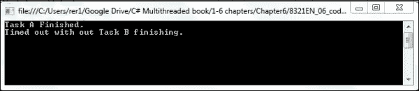

如你所见，我们首先使用`Worker`方法启动一个任务并等待它完成，然后我们再次使用`Worker`方法启动一个任务并执行带有超时值的等待。你注意到两次执行之间的区别了吗？

第一次运行任务时，我们将等待完整的 10 秒钟直到任务完成。第二次运行任务时，我们设置了一个超时值并在任务完成之前继续执行。由于任务运行时间超过 2 秒，等待命令超时，程序继续执行，而任务仍在运行。

在这两个例子中，我们都有一个不返回值的任务。现在，让我们将我们的工作任务改为返回一个值，看看会发生什么。让我们向程序中添加一个新的方法，称为`Worker1`。将以下代码添加到`Worker1`方法中：

```cs
static double Worker1()
    {
int i = ran.Next(1000000);
Thread.SpinWait(i);
return i;
    }
```

现在，在`Program.cs`文件的`Main`方法中，在`Console.ReadLine`命令之前，添加以下两行代码：

```cs
Task<double> taskC = Task<double>.Factory.StartNew(() => Worker1());

Console.WriteLine("TaskC finished = result is {0}.", taskC.Result);
```

现在，让我们再次编译并运行我们的程序。以下是你运行程序时应看到的输出：

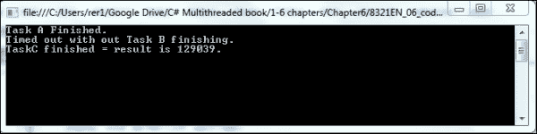

你注意到程序运行并等待`TaskC`完成了吗？我们很快就会了解到`Thread`类的`SpinWait`方法，但现在，为什么程序在代码中没有放置等待命令的情况下等待`TaskC`完成？

## 工作原理

在上一个练习中，我们看到了等待任务完成的三个方法。前两个例子使用了`Task.Wait`方法来告诉我们的程序等待任务。由于任务是在不同的线程上运行的，我们必须等待它完成，然后才能继续在主线程中执行程序的执行。在这两个例子中，我们的任务不返回任何值。在这种情况下，如果我们不希望主线程在启动任务（或至少在线程池中安排它）后继续执行，我们需要显式地等待任务完成。我们使用`Task`类中的`Task.Wait`方法来完成这个操作。

第一次，我们告诉程序等待任务完成并继续执行。第二次，我们在`Wait`方法中设置了一个超时值。这告诉主线程等待超时参数中的时间，然后继续执行。然后我们检查`Task.IsComplete`属性，以查看任务是否已完成。

由于任务被设置为运行时间超过超时值，当我们的主线程继续执行时，任务仍在运行。这就是为什么`IsComplete`属性是`false`，以及我们的`if`语句的`else`部分被执行的原因：

```cs
Console.WriteLine("Timed out without Task B finishing.");
```

你可以尝试修改这段代码，让任务运行的时间少于超时值，看看会发生什么。

接下来，我们使用返回`double`值的`Worker1`方法运行了一个任务。我们在这里看到了什么？我们没有放置`Task.Wait`命令，但我们的主程序仍然在任务完成之前等待，然后继续执行。为什么是这样？

我们知道它等待直到任务完成，因为当我们将`Task.Result`值写入控制台时，它有一个值并且不是`null`。在这种情况下，我们不需要显式使用`Task.Wait`方法，因为主线程将等待任务完成；它需要等待直到`Task.Result`属性被设置。通过定义一个带有返回值的任务，我们是在隐式地告诉我们的主线程等待任务完成。

因此，正如我们所看到的，如果我们不在任务中返回值，那么我们需要明确告诉我们的程序等待。然而，如果我们返回一个值，我们就是隐式地告诉我们的程序等待任务完成。

接下来，我们将看到如何在我们同时启动多个并发任务时控制主线程的执行。在这种情况下，如果我们的任务返回值，我们可能不希望隐式地等待每个任务完成。也许我们只想等待一个任务完成。

在我们当前的程序中，我们使用了`Thread.SpinWait`方法。这种方法与`Thread.Sleep`方法不同。`Thread.Sleep`方法等待指定的时间，而`SpinWait`方法则开始一个循环，循环次数由传递给方法的指定迭代次数决定。因此，在这种情况下，处理器的速度将决定持续时间，因为时钟速度将决定它完成迭代次数的速度。通过使用这种方法而不是`Sleep`方法，它还允许调度器在线程优先级指示的情况下执行上下文切换。

# 等待多个任务完成

在上一节中，我们探讨了如何显式和隐式地等待任务完成。现在，让我们看看当我们启动多个任务而不是一个任务时，我们如何控制执行和等待。

有时，我们可能只想等待一组任务中的一个任务完成。有时，我们可能想等待所有任务完成，有时我们可能想等待任务满足某个条件后才能继续。

以下截图显示了与`Task`类一起提供的所有`Wait`和`When`方法。`Wait`方法如下所示：

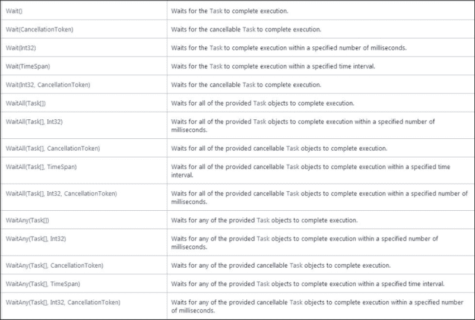

`When`方法如下所示：

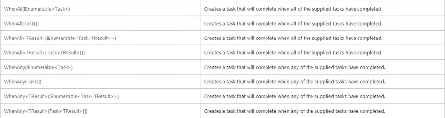

这两个图像都是来自[`msdn.microsoft.com/en-us/library/system.threading.tasks.task_methods(v=vs.110).aspx`](http://msdn.microsoft.com/en-us/library/system.threading.tasks.task_methods(v=vs.110).aspx)的引用。

我们将在本章中演示如何执行不同的`Wait`和`When`技术，但这只是为了给你更多关于可能性的想法。

让我们从创建一个简单的程序开始，通过在三个任务完成时用随机数字填充三个圆圈来演示`WaitAll`方法的工作原理。

## 如何做到这一点

要开始，我们需要使用 Visual Studio 创建一个 WPF 应用程序。打开 Visual Studio，创建一个名为`RandomCircles`的新 WPF 项目。一旦我们创建了此项目，就按照以下步骤进行操作：

1.  进入 Visual Studio 的设计模式，并将以下控件添加到`MainWindow.xaml`文件中：

    +   添加三个椭圆控件，并分别命名为`Circle1`、`Circle2`和`Circle3`。

    +   将三个圆的高度和宽度属性都设置为`120`。这是在 Visual Studio 的**设计**模式下在`MainWindow.xaml`文件中完成的。

    +   接下来，添加三个文本框，并将它们放置在圆内。分别命名为`text1`、`text2`和`text3`。将所有三个的`Text`属性设置为空字符串，并使它们的`Background`属性与椭圆控件的`Fill`属性颜色相同。

    +   接下来，添加一个按钮控件，并命名为`btnRandomAll`。将此控件上的`Content`属性设置为`Random All`。

    现在，您的`MainWindow.xaml`文件应该看起来像以下截图：

    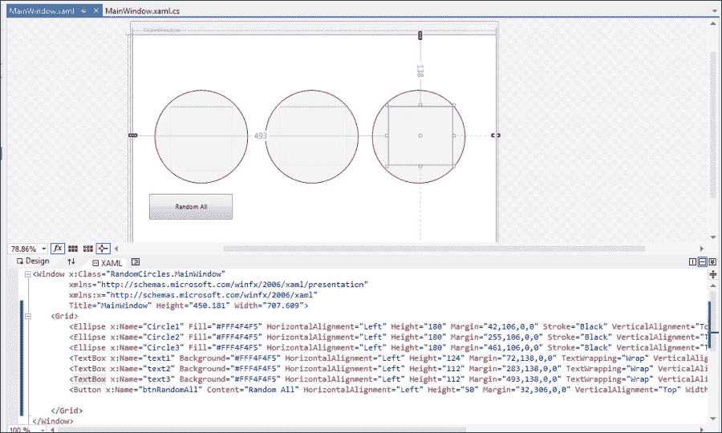

1.  接下来，让我们转到这个文件的代码后部`MainWindow.xaml.cs`。我们需要为`Threading`命名空间添加一个`using`语句。

    ```cs
    using System.Threading;
    ```

    ### 注意

    当您创建 WPF 项目时，`System.Threading.Tasks`命名空间应该已经包含在内，但请检查它是否真的在那里。

1.  现在，让我们添加一个工作方法来为即将创建的任务提供工作。创建一个名为`Worker1`的`private`方法，它返回一个字符串值。向其中添加以下代码：

    ```cs
    private String Worker1()
            {
    int result = ran.Next(10000000);
    Thread.SpinWait(result);
    return String.Format("Random Number is {0} and Time is {1}.",result, DateTime.Now.Millisecond);
            }
    ```

    ### 注意

    `SpinWait`在这里用来演示处理器速度如何影响函数的速度。`SpinWait`非常低效，并且确实比`Sleep()`消耗更多的 CPU 资源。

1.  接下来，让我们为`btnRandomAll`创建一个事件处理程序——一个名为`btnRandomAll_Click`的点击事件。在这个方法内部，添加以下代码：

    ```cs
    private void btnRandomAll_Click(object sender, RoutedEventArgs e)
            {
    // Wait for all tasks to finish.
    Task<String>[] tasks = newTask<String>[3];
    for (int i = 0; i< 3; i++)
                {
    tasks[i] = Task<String>.Factory.StartNew(() => Worker1());
                }
    Task.WaitAll(tasks);

                text1.Text = tasks[0].Result.ToString();
                text2.Text = tasks[1].Result.ToString();
                text3.Text = tasks[2].Result.ToString();
            }
    ```

这应该就是您需要的，以便有一个可以在单独的线程中运行三个任务的程序。每个任务都会随机运行一段时间。主线程将等待所有这些任务完成，然后返回一个字符串，其中包含任务使用的随机数和当前时间的毫秒数。

最后，让我们编译并运行我们的新程序。以下是在程序首次启动时随机圆应该看起来像的样子：

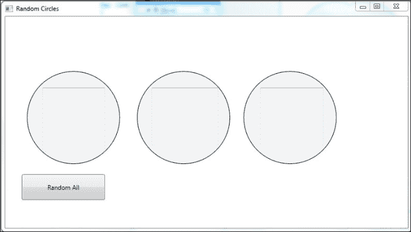

现在，点击一次**随机全部**按钮，看看输出结果是什么样子。以下是我们运行它时得到的结果：

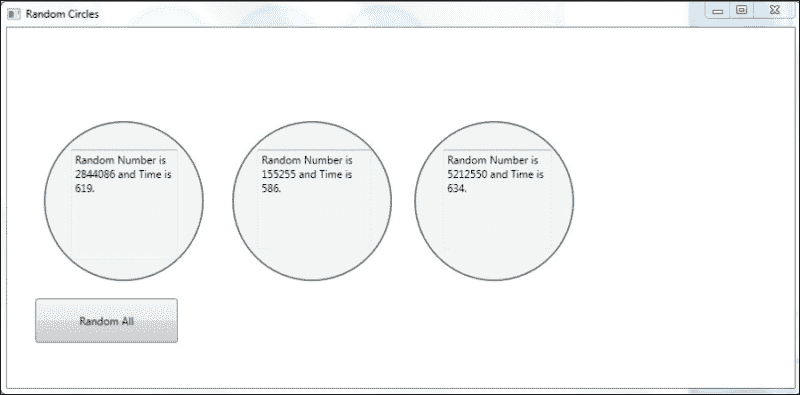

现在，再次点击**随机全部**按钮，看看程序看起来像什么。以下截图是我们得到的结果：

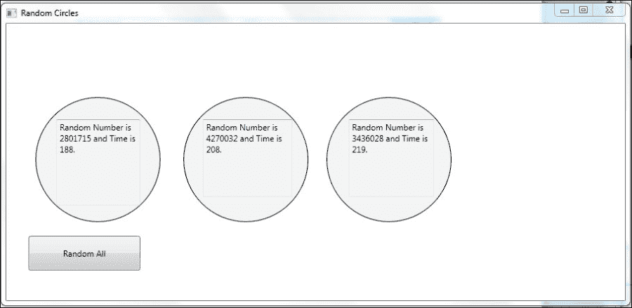

现在，让我们对我们的程序做一些修改并再次尝试运行它。进行以下修改：

1.  添加一个新的椭圆控件，并命名为`Circle4`。

1.  添加一个新的文本框控件，命名为`text4`，并将`Text`属性设置为空字符串。

1.  添加另一个按钮控件，命名为`btnRandomFirst`，并将`Content`属性设置为`RandomFirst`。

1.  为按钮添加一个事件处理器，命名为`btnRandomFirst_Click`，并添加以下代码到事件处理器中：

    ```cs
    private void btnRandomFirst_Click(object sender, RoutedEventArgs e)
            {
    Task<String>[] tasks = newTask<String>[3];
    for (int i = 0; i< 3; i++)
                {
    tasks[i] = Task<String>.Factory.StartNew(() => Worker1());
                }
    //Task.WaitAll(tasks);
    int index = Task.WaitAny(tasks);

                text4.Text = "Task " + index.ToString() + " finished first.";
            }
    ```

现在，让我们编译并运行我们的程序。以下是在采取行动之前的输出：

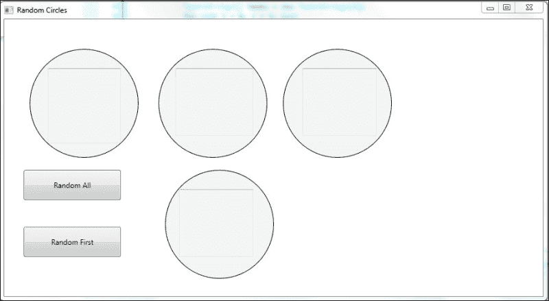

现在，点击一次**随机第一个**按钮，输出应该看起来像下面的截图：

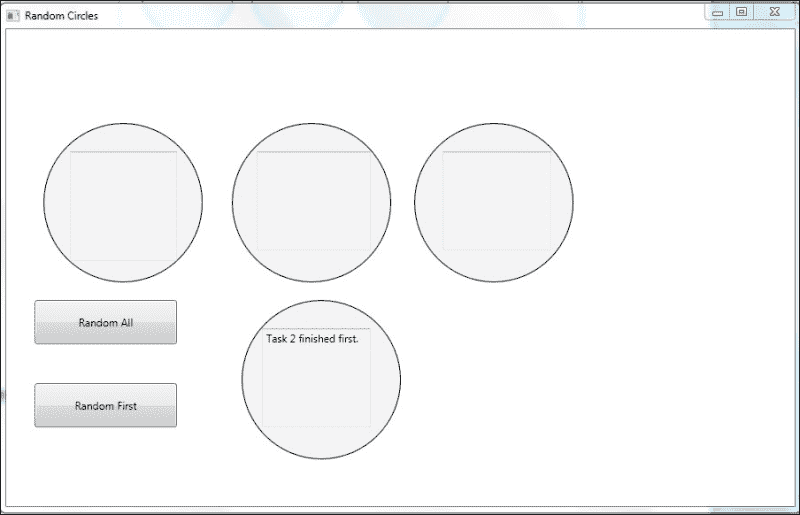

最后，让我们再次点击**随机第一个**按钮，看看结果。它们应该看起来像下面的截图：

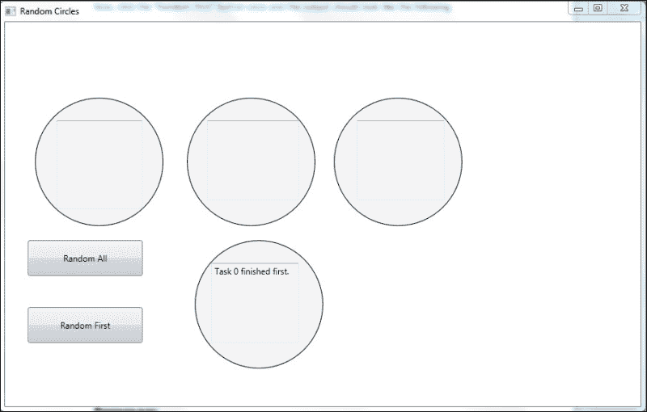

## 工作原理

让我们花一分钟回顾一下我们刚才用这个程序做了什么。

首先，我们的`Worker1`方法执行我们的*任务*是一个简单的工蜂。它生成一个随机数，然后对该数进行`Thread.SpinWait`迭代。然后它返回当前时间的毫秒数。所以每次这个方法作为一个任务在单独的线程中运行时，它将运行一个随机的时间。如果这个方法在不同线程中运行多个副本，那么它们将各自在不同的时间完成，因为`SpinWait`将运行一个不同随机生成的迭代次数。

1.  当你点击**随机全部**按钮时，事件处理器被触发。事件处理器开始运行三个单独的任务，每个任务都运行`Worker1`方法，使用以下命令：

    ```cs
    Task<String>.Factory.StartNew(() => Worker1());
    ```

1.  我们使用以下命令创建了一个带有字符串值`TResult`的`Task`数组：

    ```cs
    Task<String>[] tasks = newTask<String>[3];
    ```

1.  然后，我们使用以下命令等待任务数组中的所有任务：

    ```cs
    Task.WaitAll(tasks);
    ```

1.  然后，我们显示每个任务的结果，并看到它们各自有不同的随机数，完成时间也不同，尽管每个任务都在执行相同的方法。

1.  接下来，我们创建了一个第二个按钮，它执行的工作与第一个按钮类似，但这次我们使用的是以下命令而不是`Task.WaitAll`命令：

    ```cs
    int index = Task.WaitAny(tasks);
    ```

因此，在这种情况下，我们只等待三个任务中的任何一个完成，然后才在主线程中继续执行。你可以通过多次点击**随机第一个**按钮来验证这一点。每次可能是任务 0、1 或 2 先完成。

花一些时间来玩这两个命令，确保你完全理解它们是如何工作的。

在这本书中，我们将不会花时间来玩`Task`类的`Continue`、`ContinueAll`、`When`和`WhenAll`方法，但花一些时间来实验这些功能。这些方法允许你在其他任务完成时执行任务。因此，你可以将任务执行串联起来。这些方法的替代方案是在任务完成后再启动新任务。`Continue`和`When`方法允许你将它们合并为一个语句。

在下一节中，我们将探讨取消任务。根据你的需求，你可能想在任务结束之前取消你已经开始的任务。

# 取消任务

让我们来探讨如何取消任务。既然我们已经知道如何启动一个或多个任务以及如何协调等待一个或多个这些任务，那么在我们启动了一组任务之后，如果发生了一些事情需要我们停止它们怎么办？

在.NET 框架中，通过使用**取消令牌**来实现任务取消。在运行任务时使用的委托需要包含支持取消的代码，然后任何需要取消任务的其他代码可以请求取消任务。

### 注意

.NET 中的`CancellationToken`结构管理通知操作应该被取消。它有一个属性`IsCancellationRequested`，您可以使用它来查看是否已发出取消请求。此结构是`System.Threading`命名空间的一个成员，并由线程和任务在多线程环境中用于管理取消请求。

仅请求取消任务并不会取消任务。任务委托必须支持取消令牌。委托可以选择取消的两种方式。委托可以简单地从执行中返回，或者可以使用`ThrowIfCancellationRequested`方法抛出`OperationCanceledException`。

这两种取消方法有两个主要区别。如果委托只是从执行中返回，那么会发生以下情况：

1.  任务被置于`TaskStatus.RanToCompletion`状态而不是`TaskStatus.Canceled`。

1.  请求取消任务的代码不知道任务是否在完成之前被取消。

如果任务委托实现了取消的后者方法（抛出`OperationCanceledException`），那么会发生以下情况：

1.  任务被置于`TaskStatus.Canceled`状态。

1.  请求代码可以检查此状态并确定任务是被取消还是只是完成了。

因此，现在我们将创建一个 WPF 应用程序，允许用户取消任务。我们将演示如何创建取消令牌，监控任务状态以查看是否已取消，然后在取消时进行一些处理。这也会使用`Task.ContinueWith`方法。此方法允许我们在另一个任务完成后执行任务。

在我们的应用程序中，我们将启动 10 个任务。每个任务将接受一个整数参数作为输入，并将该参数乘以从 1 到 1000 万的数字，然后取结果的和。然后它将返回一个`double`类型的值，即结果。虽然这可能不是世界上最令人兴奋的计算，但它将根据您的处理器速度花费一些时间。

我们将使用任务取消令牌启动每个任务，并为它创建`ContinueWith`任务。一个将在任务运行到完成时继续执行，另一个将在任务被取消时继续执行。我们还将有一个**取消**按钮，允许您随时取消并停止正在进行的任务。

让我们开始吧。

## 如何操作

打开 Visual Studio 并创建一个新的 WPF 应用程序，命名为 `TaskCancel`。在 `MainWindow.xaml` 文件的 designer 窗口中，让我们添加以下项。

1.  添加两个按钮控件：一个命名为 `btnStart`，另一个命名为 `btnCancel`。

1.  接下来，为每个按钮添加一个点击事件处理程序：分别为 `btnStart_Click` 和 `btnCancel_Click`。

1.  添加一个名为 `textBlock1` 的文本块控件。

你的 `MainWindow.xaml` 文件应该看起来像下面的截图：

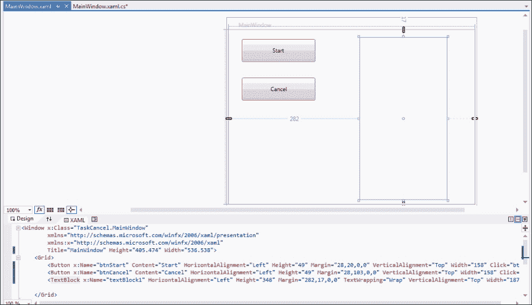

现在，转到 `MainWindow.xaml.cs` 文件的后端代码。让我们添加以下项：

1.  为 `System.Threading` 命名空间添加一个 `using` 语句：

    ```cs
    using System.Threading;
    ```

1.  然后，在顶部类定义中，让我们添加我们的取消令牌：

    ```cs
    CancellationTokenSourcets;
    ```

1.  接下来，让我们添加一个将在我们 10 个任务中执行的方法。我们将称这个方法为 `AddMultiple`。它接受一个整数参数，并返回一个 `double` 类型的值。向其中添加以下代码：

    ```cs
    public double AddMultiple(int number)
            {
    double result = 1;
    for (int i = 1; i< 100000000; i++)
                {
    ts.Token.ThrowIfCancellationRequested();
    result = result + (number * i);
                }
    return result;
     }
    ```

1.  然后，让我们将代码添加到 `btnStart` 的点击事件处理程序中，该处理程序将启动 10 个任务：

    ```cs
    private void btnStart_Click(object sender, RoutedEventArgs e)
            {
    ts = new CancellationTokenSource();

                textBlock1.Text = "";

    List<Task> tasks = new List<Task>();

    for (int i = 2; i<= 10; i++)
                {
    int tmp = i;

    Task<double> adder = Task.Factory.StartNew(() =>AddMultiple(tmp), ts.Token);

    tasks.Add(adder);

    var show = adder.ContinueWith(resultTask =>
                                         textBlock1.Text += tmp.ToString() + " - " + adder.Result.ToString() + Environment.NewLine,
    CancellationToken.None,
    TaskContinuationOptions.OnlyOnRanToCompletion,
    TaskScheduler.FromCurrentSynchronizationContext());

    var showCancel = adder.ContinueWith(resultTask =>
                                                   textBlock1.Text += tmp.ToString() + " canceled" + Environment.NewLine,
    CancellationToken.None,
    TaskContinuationOptions.OnlyOnCanceled, TaskScheduler.FromCurrentSynchronizationContext());
                }
            }
    ```

1.  最后，让我们将代码添加到 `btnCancel` 的点击事件处理程序中：

    ```cs
    private void btnCancel_Click(object sender, RoutedEventArgs e)
            {
    ts.Cancel();
            }
    ```

这就是我们必须要做的。现在，让我们编译并运行我们的应用程序。但这次，我们不要通过 Visual Studio 运行它。我们将直接运行应用程序。转到项目目录中的 `bin\Release` 文件夹，双击 `TaskCancel.exe` 应用程序。我们将简要解释为什么这样做，以及我们在 Visual Studio 中运行它时会发生什么。

当你运行应用程序时，它应该看起来像下面的截图：

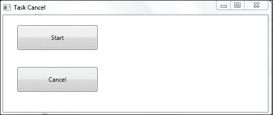

现在，点击 **开始** 按钮。然后点击 **取消** 按钮。你可以决定以多快的速度点击 **取消** 按钮，但你应该看到以下截图中的输出：

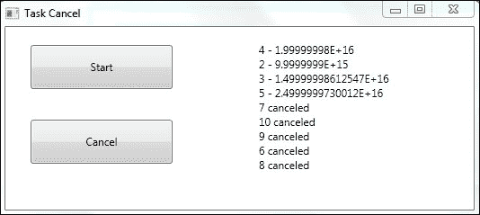

如果你尝试直接在 Visual Studio 中运行它，你会注意到当你点击 **取消** 按钮时，会发生一个未处理的异常。你可以按几次 *F5*，它将继续运行。但为什么会发生这种情况？

`ThrowIfCancellationRequested` 方法具有 **协作取消**。这会抛出一个异常，表示它已接受取消请求并将停止。这个异常由 .NET 中的 TPL 处理，不应该由你的代码处理。由于 Visual Studio 会寻找所有未处理的异常，并在调试模式下显示它们，所以当你通过 Visual Studio 调试模式运行应用程序时，你会看到它。有一种方法可以通过在 **工具** 下的 **选项-调试** 设置中关闭它，但我们不建议这样做，因为它可能会掩盖你想要看到的其他异常。尽管如此，我们在调试中遇到的这个异常是一个麻烦。 

## 工作原理

现在我们已经成功取消了正在运行的任务，让我们看看我们是如何做到的。首先，我们使用`CancellationTokenSource`定义了一个取消令牌。然后我们使用`ts = new CancellationTokenSource()`实例化它。这给我们提供了一个我们可以与之工作的取消令牌。

让我们简要地跳到结尾。要取消任务，我们只需在**取消**按钮的点击事件处理程序中调用令牌的`Cancel`方法，即`ts.Cancel()`。这将向任何使用此取消令牌的任务指示它们需要取消。现在，任务需要监控令牌并执行取消操作。

因此，让我们看看**开始**按钮的点击方法。在这里，我们使用以下代码创建并启动了 10 个任务：

```cs
Task<double> adder = Task.Factory.StartNew(() =>AddMultiple(tmp), ts.Token);
```

在这里，我们调用`Task.Factory.StartNew`命令，并传递给任务执行和取消令牌的委托。

然后，我们也调用`ContinueWith`命令来告诉任务在完成后要做什么。我们根据任务如何完成设置两个这样的命令：

```cs
var show = adder.ContinueWith(resultTask =>
                                     textBlock1.Text += tmp.ToString() + " - " + adder.Result.ToString() + Environment.NewLine,
CancellationToken.None,
TaskContinuationOptions.OnlyOnRanToCompletion,
TaskScheduler.FromCurrentSynchronizationContext());

var showCancel = adder.ContinueWith(resultTask =>
                                               textBlock1.Text += tmp.ToString() + " canceled" + Environment.NewLine,
CancellationToken.None,

TaskContinuationOptions.OnlyOnCanceled, TaskScheduler.FromCurrentSynchronizationContext());
```

对于第一个，我们传递参数`TaskContinuationOptions.OnlyOnCanceled`，对于第二个，我们传递参数`TaskContinuationOptions.OnlyOnRanToCompletion`。

因此，如果任务被取消，第二个`ContinueWith`命令将被执行，如果任务运行到完成，第一个`ContinueWith`命令将被执行。在这些`ContinueWith`命令中的每一个，我们传递一个要执行的 lambda 表达式，它打印出任务的输出。这就是我们如何更新每个任务完成后的 UI 状态。

从输出中你可以看到哪些任务运行到完成，哪些任务被取消。此外，请注意输出不是按顺序排列的。由于 10 个任务是由线程池和机器上不同的核心以及不同的工作负载来计划的，因此任务完成的顺序不同。

接下来，我们将查看任务中的错误处理。

# 任务异常处理

好吧，我们已经学习了如何开始、协调和取消任务。现在，让我们来谈谈任务中的错误处理。在 C#中，当我们讨论错误处理时，我们实际上是在谈论`try..catch..finally`结构。在这本书中，我们假设你已经熟悉`try..catch`块的操作。

任务有一个可以处于的状态生命周期。任务可以是空闲（已计划）、正在运行、挂起、已取消、有故障或已完成。每个任务都有一个`status`属性，它定义了任务当前的状态。我们在上一节中看到了这一点，并使用`OnlyOnCanceled`和`OnlyOnRanToCompletion`作为`TaskContinuationOptions`的选项来为我们的`ContinueWith`方法。

因此，当我们谈论使用 TPL 进行异常处理时，我们指的是有故障的任务。任务可以通过几种方式达到有故障的状态，例如，当任务委托失败并抛出异常时。一个**有故障的任务**基本上是一个导致错误并携带异常的任务。

如果您在故障任务上执行以下操作之一，您的代码将引发异常：

+   等待任务

+   使用任务的结果值

+   对任务执行`Await`

因此，当您使用任务的`Wait`、`WaitAll`、`Await`或`Result`方法时，应该用`try..catch`块包围这些语句。前两者将始终抛出`AggregateException`类型的异常，它是一个多个异常的容器。`Await`将抛出任务委托实际发生的异常。

这些是任务异常处理的基本知识。我们希望在任务的`Result`、`Wait`或`Await`周围执行`try..catch`。

但如果我们启动一个任务，并不关心等待它或其结果，但我们想知道它是否引发了异常？我们如何知道一个启动后忘记的任务是否有问题？在这种情况下，我们可以使用`ContinueWith`命令的简单技术。看看以下命令：

```cs
task.ContinueWith(resultTask =>DoSomething(), TaskContinuationOptions.OnlyOnFaulted);
```

在这种情况下，如果任务处于`OnlyOnFaulted`状态，我们创建一个任务来在`ContinueWith`命令上执行。

因此，您可以在等待任务时对结果执行`try..catch`异常处理，或者如果您没有等待任务或结果，您可以创建一个`ContinueWith`任务来处理异常。

# 摘要

在本章中，我们探讨了等待任务、取消、链式操作以及使用任务执行异常处理的方法。我们现在已经涵盖了所有需要在 TPL 中与任务一起工作的方面以及处理您的设计可能遇到的所有场景所需的技巧。

我们鼓励您进一步探索本章中介绍的技巧，并探索基于任务的并行世界的奥秘。直接与线程和`BackgroundWorker`组件工作的日子很快就会成为遥远的记忆。

最后这两个章节是关于 TPL 和基于任务的并行概述。在下一章中，我们将介绍基于数据的并行以及以并发方式处理数据集合。
