# 第七章。数据并行

在数据集合或数据集合上并发执行任务或一系列操作被称为数据并行。例如，如果我们有一个文件夹中的文件列表，并且我们想要将它们全部重命名，我们可以创建一个 `For` 循环遍历集合，并在每次迭代期间执行重命名命令。我们还可以使用 `foreach` 语句遍历集合数据类型，如 `List` 或 `DataView`。这些是 **Task Parallel Library** (**TPL**) 中的专用 `For` 和 `ForEach` 语句，位于 `System.Threading.Tasks.Parallel` 命名空间中。

TPL 提供了 `Parallel` 库，使用 `Parallel.For` 和 `Parallel.ForEach` 方法的不同重载，可以轻松地在数据集或数据集合上执行并发操作。

在本章中，我们将学习如何使用 `Parallel.For` 和 `Parallel.ForEach` 方法并行处理数据源中的项。我们还将检查 `ParallelLoopState` 类，它允许我们检查并发循环的结果并使用结果执行操作。最后，我们将学习如何在并发循环完成之前取消它。在本章中，我们将涵盖：

+   使用 `Parallel.For` 进行并行数据处理

+   `IEnumerable` 集合的并行数据处理

+   使用并发数据循环的结果

+   取消并行循环操作

# 并行循环处理

在本节的第一部分，我们将检查 `Parallel.For` 方法及其几种变体。此方法最基本的重载接受一个起始索引、一个结束索引和一个 `Action` 委托。在 `Parallel` 方法中，`Action` 委托可以用命名方法、匿名方法或 lambda 表达式实现。以下是为每个方法的基本语法：

```cs
        // Named method.
        Parallel.For(0, i, DoWork);

        // Anonymous method
        Parallel.For(0, i, delegate(int j)
        {
            // Do Work.
        });

        // Lambda expression.
        Parallel.For(0, i, j =>
        {
            // Do Work
        });
```

在每个示例中，方法或 lambda 表达式接受一个单一参数，即迭代值。如果您需要更多控制并发循环的执行，有重载方法接受由 .NET 内部生成的 `ParallelLoopState` 参数。我们将在本章后面讨论这一点，但它允许我们执行诸如取消并行循环或在每个循环迭代完成后执行操作等活动。

这里是 `Parallel.For` 方法的所有重载列表：

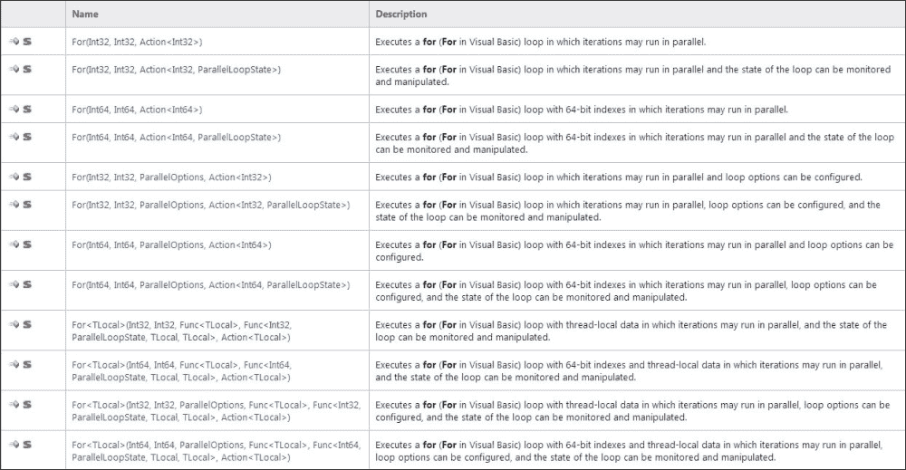

MSDN 参考—http://msdn.microsoft.com/en-us/library/system.threading.tasks.parallel.for(v=vs.110).aspx

此外，除了 `ParallelLoopState` 参数之外，一些重载允许方法返回线程安全的局部变量。

现在，让我们来看一个例子。我们将构建一个简单的 **Windows Presentation Foundation** (**WPF**) 应用程序，它接受一个整数数组，对这些数字进行计算，然后更新数组中的项。这将并行执行而不是顺序执行。

## 如何实现

对于这个例子，我们将创建一个 WPF 应用程序，允许用户在 10 个框中输入数字并点击一个按钮。一旦点击按钮，它将同时取每个数字并将其乘以 1 到 10 的数字，并求和结果。每个计算的结果将放回每个框中。执行以下步骤来完成：

1.  打开 Visual Studio 并创建一个名为`ParallelMath1`的 WPF 应用程序。

1.  在`MainWindow.xaml`设计视图中，将页面标题更改为`ParallelMath`：

    ```cs
    Title="ParallelMath" Height="350" Width="525">
    ```

1.  现在，创建 10 个文本框控件，并将它们分别命名为`tb1`、`tb2`、`tb3`、`tb4`、`tb5`、`tb6`、`tb7`、`tb8`、`tb9`和`tb10`，放置在`MainWindow.xaml`文件中。同时，将它们的`Text`属性设置为`0`。

1.  现在，在`MainWindow.xaml`文件中放置一个按钮控件，并将`Content`属性设置为`Calculate`，将`Name`属性设置为`btnCalculate`。

1.  接下来，为按钮的点击事件创建一个名为`btnCalculate_Click`的事件处理程序。

1.  在类定义内部，放置一行代码来创建一个包含 10 个整数的数组：

    ```cs
    int[] numbers = new int[10];
    ```

1.  现在，将以下代码放入`btnCalculate_Click`事件处理程序中：

    ```cs
                int[] numbers = new int[10];
                numbers[0] = Convert.ToInt32(tb1.Text);
                numbers[1] = Convert.ToInt32(tb2.Text);
                numbers[2] = Convert.ToInt32(tb3.Text);
                numbers[3] = Convert.ToInt32(tb4.Text);
                numbers[4] = Convert.ToInt32(tb5.Text);
                numbers[5] = Convert.ToInt32(tb6.Text);
                numbers[6] = Convert.ToInt32(tb7.Text);
                numbers[7] = Convert.ToInt32(tb8.Text);
                numbers[8] = Convert.ToInt32(tb9.Text);
                numbers[9] = Convert.ToInt32(tb10.Text);

                Parallel.For(0, 9, CalculateNumbers);

                tb1.Text = numbers[0].ToString();
                tb2.Text = numbers[1].ToString();
                tb3.Text = numbers[2].ToString();
                tb4.Text = numbers[3].ToString();
                tb5.Text = numbers[4].ToString();
                tb6.Text = numbers[5].ToString();
                tb7.Text = numbers[6].ToString();
                tb8.Text = numbers[7].ToString();
                tb9.Text = numbers[8].ToString();
             tb10.Text = numbers[9].ToString();
    ```

1.  最后，创建一个名为`CalculateNumbers`的方法，并将以下代码放入其中：

    ```cs
            private void CalculateNumbers(int i)
            {
                int j = numbers[i];
                for (int k = 1; k <= 10; k++)
                {
                    j *= k;
                }

                numbers[i] = j;

            }
    ```

这就完成了。现在，让我们运行我们的应用程序并看看会发生什么。记住我们没有添加任何错误处理。应用程序在点击**计算**按钮时期望每个文本框中只有一个数字。如果没有，应用程序将抛出一个参数超出范围的异常。

在点击按钮之前，你应该看到类似以下的结果：

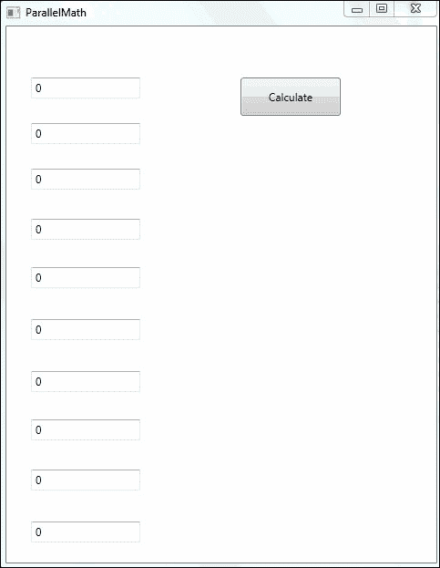

现在，让我们在我们的文本框中输入 10 个数字，以便应用程序看起来像以下这样：

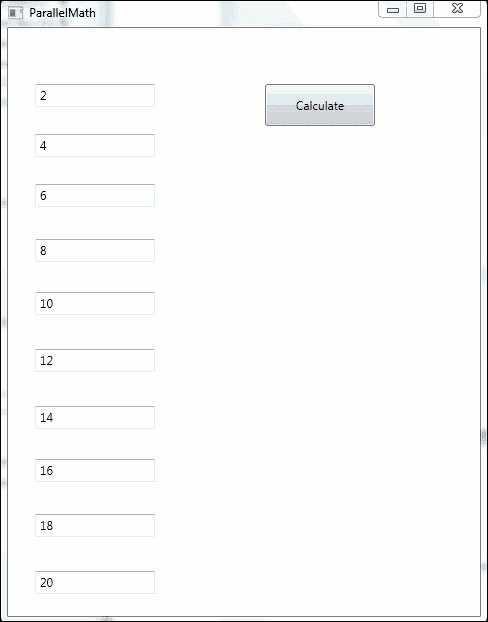

现在，点击**计算**按钮，你应该会非常快地看到以下结果，因为我们正在并行进行这些计算：

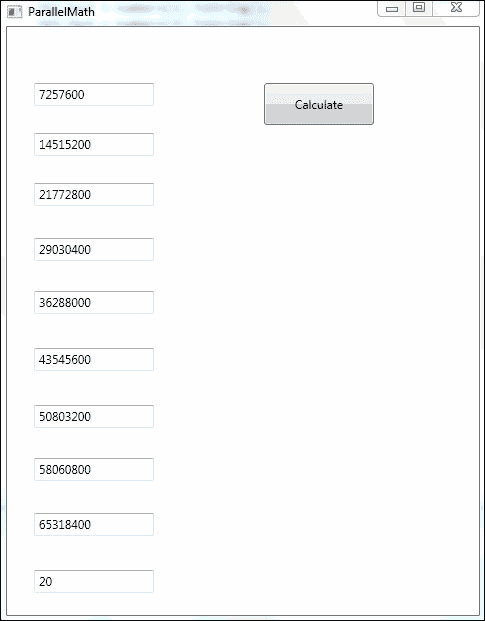

## 它是如何工作的

在前面的练习中，我们在 10 个文本框中输入了 10 个数字，然后点击了**计算**。程序随后将每个数字乘以 1 到 10 的数字，并将它们相加。然后，它将结果放回原始的文本框中。

所有这些都是在并行完成的。每个文本框都是并行处理的。这可能是 10 个单独的线程或更少，具体取决于我们在其上运行程序的硬件。与直接使用`Parallel`类和 TPL 使用线程不同，.NET 管理线程池，并最大化在机器上可用的处理核心上执行并行操作时的线程数。

让我们看看并发循环是如何执行的。它是单个命令`Parallel.For(0, 9, CalculateNumbers);`。此命令将 10 个任务排队到线程池中，每个任务将使用整数参数执行`CalculateNumbers`方法。

现在，让我们看看`Parallel.ForEach`命令。

# 使用 Parallel.ForEach 在集合上实现数据并行

我发现最有用的数据并行形式是对数据集合执行并发操作。这允许我们对列表、数据视图、字典等数据集合执行任务，并在单行代码中并行地对集合中的每个项执行任务！这使得使用数据并行化更加简单；您无需做任何超出常规数据处理的事情。这也是为什么 TPL 是 .NET 中如此美妙的功能增强之一的原因。

与 `Parallel.For` 方法类似，`Parallel.ForEach` 的结构如下所示：

```cs
Parallel.ForEach(dataCollection, item => DoWork(item));
```

在此方法的最基本版本中，有两个参数。有一个数据集合和一个用于在 `dataCollection` 的项上执行任务的 `Action` 委托。`Action` 委托接受一个参数，该参数是集合中的一个项。

以下都是 `ForEach` 方法的不同重载：

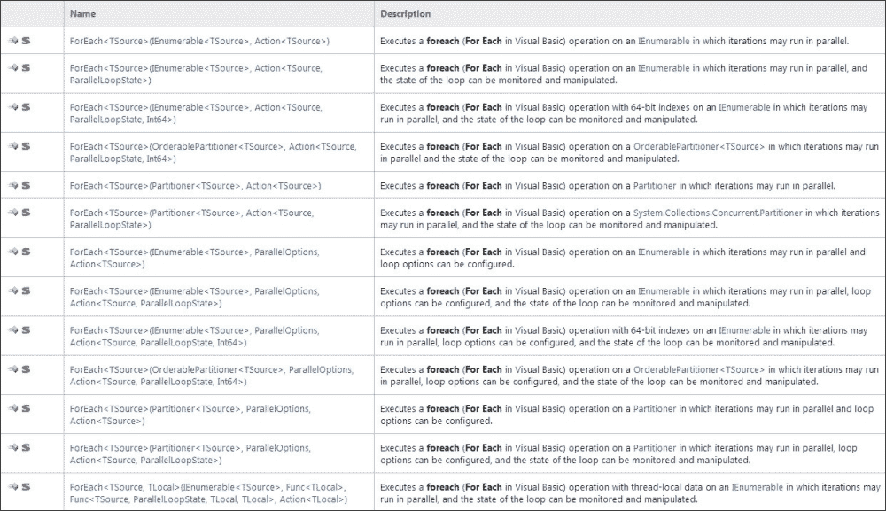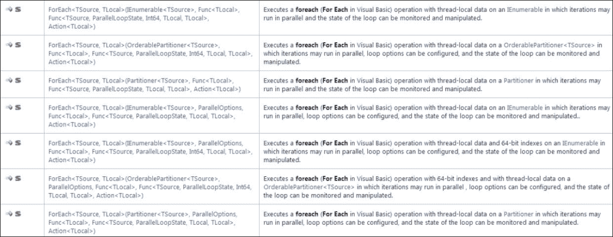

参考—http://msdn.microsoft.com/en-us/library/system.threading.tasks.parallel.foreach(v=vs.110).aspx

如您所见，此方法有许多不同的重载。它们允许我们使用 `ParallelLoopState` 对象或线程安全的局部变量。

我们将专注于仅对数据集合执行并发处理这种简单形式。为了进一步重申这一点，让我们回顾一下本书中早期工作的一个项目。在 第四章，*高级线程处理*中，我们编写了一个应用程序，它接受 JPG 图像，将其分割成单独的位图，然后对每个位图执行并行函数以查找旧星。然后它将单个位图重新组装成单个图像。

我们将使用数据并行化和 TPL 而不是直接使用线程来重写此应用程序。这将展示 TPL 如何简化多线程代码开发。

我们不再需要管理线程（启动它们、等待它们完成或跟踪它们）。我们不再需要管理机器上的处理核心数量，以在不启动太多单独线程的情况下最大化性能。我们只需要将大图像分割成一系列较小的位图，并使用 `Parallel.ForEach` 并发循环来处理每个位图。就是这样。让我们开始吧。

## 如何实现

我们将修改原始的 `OldStarsFinder` Windows 表单应用程序。为此，让我们执行以下步骤：

1.  首先，让我们在 Visual Studio 中打开我们的 `OldStarsFinder` 应用程序。

1.  让我们添加一个新的 `using` 语句，以便我们可以访问 `Parallel` 库：

    ```cs
    using System.Threading.Tasks;
    ```

1.  在类定义的开始处，删除所有旧的变量声明，并用以下内容替换它们：

    ```cs
    private int Count = 0;
    // Number of bitmaps to break the original into and add to 
    // the list of bitmaps.
    private List<Bitmap> BitmapList;
            //List of bitmaps to use the ParallelForEach on.
            Bitmap OriginalBitmap;
    private String prsOldStarsCount = "0";
    //Old stars count using a lock to protect thread safety.
    ```

1.  将 `CropBitmap` 方法替换为以下方法定义：

    ```cs
            private Bitmap CropBitmap(Bitmap proBitmap, Rectangle proRectangle)
            {
              // Create a new bitmap copying the portion of the 
              // original defined by proRectangle
                // and keeping its PixelFormat
                Bitmap loCroppedBitmap = proBitmap.Clone(proRectangle, proBitmap.PixelFormat);

                return loCroppedBitmap;
         }
    ```

1.  您可以将 `IsOldStar` 方法保持原样。

1.  将 `ThreadOldStarsFinder` 方法修改如下：

    ```cs
            private void ThreadOldStarsFinder(Bitmap loBitmap)
            {
                int liRow;                  // The pixel matrix (bitmap) row number (Y)
                int liCol;                  // The pixel matrix (bitmap) col number (X)
                Color loPixelColor;         // The pixel color

                // Iterate through each pixel matrix (bitmap) rows
                for (liRow = 0; liRow < loBitmap.Height; liRow++)
                {
                    // Iterate through each pixel matrix (bitmap) cols
                    for (liCol = 0; liCol < loBitmap.Width; liCol++)
                    {
                        // Get the pixel Color for liCol and liRow
                        loPixelColor = loBitmap.GetPixel(liCol, liRow);
                        if (IsOldStar(loPixelColor))
                        {
                            // The color range corresponds to an old star
                            // Change its color to a pure blue
                            loBitmap.SetPixel(liCol, liRow, Color.Blue);

                            lock (prsOldStarsCount)
                            {
                                int i = Convert.ToInt32(prsOldStarsCount);
                                i = i + 1;
                                prsOldStarsCount = i.ToString();
                            }

                        }
                    }
                }
      }
    ```

1.  然后将`ShowBitmapWithOldStars`方法更改为如下所示：

    ```cs
    private void ShowBitmapWithOldStars()
            {
                int liThreadNumber;
                // Each bitmap portion
                Bitmap loBitmap;
                // The starting row in each iteration
                int liStartRow = 0;

                // Calculate each bitmap's height
                int liEachBitmapHeight = ((int)(OriginalBitmap.Height / Count)) + 1;

                // Create a new bitmap with the whole width and height
                loBitmap = new Bitmap(OriginalBitmap.Width, OriginalBitmap.Height);
                Graphics g = Graphics.FromImage((Image)loBitmap);
                g.InterpolationMode = System.Drawing.Drawing2D.InterpolationMode.HighQualityBicubic;

                for (liThreadNumber = 0; liThreadNumber < Count; liThreadNumber++)
                {
                    // Draw each portion in its corresponding absolute starting row
                    g.DrawImage(BitmapList[liThreadNumber], 0, liStartRow);
                    // Increase the starting row
                    liStartRow += liEachBitmapHeight;
                }
                // Show the bitmap in the PictureBox picStarsBitmap
                picStarsBitmap.Image = loBitmap;
                //picStarsBitmap.Image.Save("c:\\packt\\resulting_image.png", ImageFormat.Png);

                tbCount.Text = prsOldStarsCount;

                g.Dispose();
        }
    ```

1.  现在，将`butFindOldStars_Click`事件处理程序更改为以下代码：

    ```cs
    private void butFindOldStars_Click(object sender, EventArgs e)
            {
                Count = Convert.ToInt32(tbTasks.Text);
                OriginalBitmap = new Bitmap(picStarsBitmap.Image);
                BitmapList = new List<Bitmap>(Count);

                int StartRow = 0;
                int EachBitmapHeight = ((int)(OriginalBitmap.Height / Count)) + 1;

                int HeightToAdd = OriginalBitmap.Height;
                Bitmap loBitmap;

                // Breakup the bitmap into a list of bitmaps.
                for (int i = 0; i < Count; i++)
                {

                    if (EachBitmapHeight > HeightToAdd)
                    {
                        // The last bitmap height perhaps is less than the other bitmaps height
                        EachBitmapHeight = HeightToAdd;
                    }

                    loBitmap = CropBitmap(OriginalBitmap, new Rectangle(0, StartRow, OriginalBitmap.Width, EachBitmapHeight));
                    HeightToAdd -= EachBitmapHeight;
                    StartRow += EachBitmapHeight;
                    BitmapList.Add(loBitmap);               
                }

                //Iterate through the list of bitmaps with the Parallel.ForEach command.
                Parallel.ForEach(BitmapList, item => ThreadOldStarsFinder(item));

                ShowBitmapWithOldStars();
        }
    ```

1.  然后添加一个带有文本`Number of bitmaps to divide into for processing:`的标签控件。

1.  还要添加一个文本框控件，并将其`Name`属性设置为`tbTasks`。这将允许你指定你想要将位图分割成多少部分。

1.  最后，我们移除了`butFindOldStarsBatch`按钮，因为在这个应用程序中我们不需要它。

使用任务并行库进行数据并行运行此应用程序，你需要做的就这些。

让我们编译并运行我们的应用程序。你应该会得到类似这样的结果：

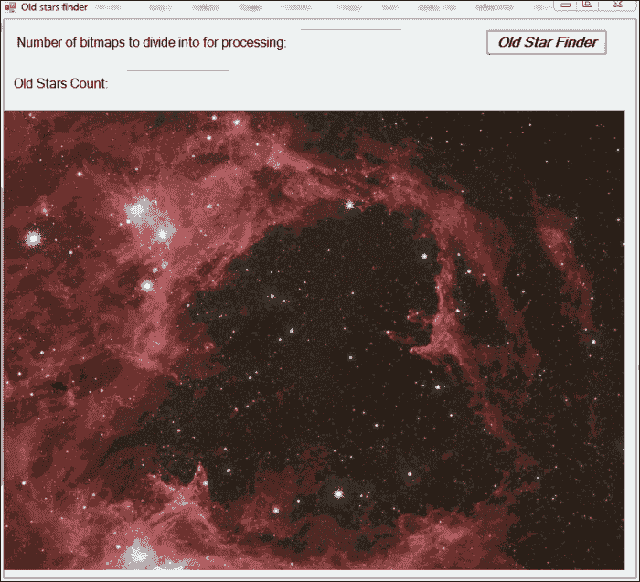

现在，输入要将图像分割成多少个位图的数字，并点击**Old Star Finder**按钮。应用程序现在看起来是这样的：

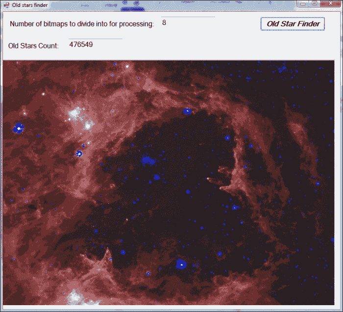

刚才发生了什么？我们输入了`8`作为要分割的位图数量。应用程序将 JPG 图像分割成 8 个大小相等的位图，然后将其放入位图列表集合中。然后它并发处理每个位图以寻找旧星。最后，它将位图重新组装成一张图像并重新显示。

让我们更仔细地看看刚才发生了什么。

## 它是如何工作的

如果你比较程序的两个版本，你会看到第二个版本代码更少，更简单。如果我们检查`butOldStarsFinder_Click`事件处理方法，我们会看到大部分的工作。首先，我们根据输入的数量将我们的图像分成一个包含较小位图的`List`集合。以下是完成此操作的代码：

```cs
            // Breakup the bitmap into a list of bitmaps.
            for (int i = 0; i < Count; i++)
            {
                if (EachBitmapHeight > HeightToAdd)
                {
                    // The last bitmap height perhaps is less than 
                    // the other bitmaps height
                    EachBitmapHeight = HeightToAdd;
                }

                loBitmap = CropBitmap(OriginalBitmap, new Rectangle(0, StartRow, OriginalBitmap.Width, EachBitmapHeight));
                HeightToAdd -= EachBitmapHeight;
                StartRow += EachBitmapHeight;
                BitmapList.Add(loBitmap);               
            }
```

接下来，我们将我们的列表集合`BitmapList`用于此行代码中的并行`ForEach`命令：

```cs
Parallel.ForEach(BitmapList, item => ThreadOldStarsFinder(item));
```

最后，当这个循环完成后，我们使用这个方法显示带有旧星的图像：

```cs
ShowBitmapWithOldStars();
```

就这些了。我们不再需要找出处理器有多少核心，并创建那么多线程。无论我们的集合中有多少项，.NET 都会将线程池中的线程最大化以实现最佳性能。如果需要，它会创建线程，如果可能，它会重用现有的线程。这节省了比机器核心数能有效地使用的线程更多的开销。

你现在可以明白为什么使用 TPL 编写的多线程代码被称为轻量级并发。这个版本的旧星查找器在代码和逻辑上肯定比直接使用线程或重量级并发编写的上一个版本“更轻”。

# 取消并行循环

现在我们已经学习了如何使用`Parallel`类库执行并行循环，让我们看看如果需要，我们如何停止或中断循环。使用正常的`For`或`ForEach`循环，我们可以使用`Continue`命令从循环中退出。

如果我们从并行循环中跳出，那么我们将完成当前正在执行的线程上的所有迭代，然后停止。如果我们 `Stop` 一个并行循环，那么我们将尽可能快地停止循环的所有当前运行迭代，但我们不会将它们运行到完成。在两种情况下，我们都不会为尚未开始的并行循环的其余迭代在线程池上调度任务。

要执行并行循环的跳出或停止，我们需要使用 `ParallelLoopState` 对象。这意味着我们必须使用 `Parallel.For` 或 `Parallel.ForEach` 方法的一个重载，该方法接受 `ParallelLoopState` 参数。

### 小贴士

`ParallelLoopState` 类是什么？这个类不能在你的用户代码中实例化。它由 TPL 和 .NET 提供，因此是一个特殊类。此对象为你的并行循环提供了一个与其他循环迭代交互的机制。

`break` 和 `stop` 方法是你将最常使用的，以及 `IsStopped` 和 `IsExceptional` 属性。这些属性允许你检查循环的任何迭代是否调用了 `Stop` 或抛出了异常。

现在，我们将我们的 `ParallelMath1` 示例更改为在七次迭代后停止循环。这是任意的，仅用于示例。但在实际示例中，有许多条件你将想要从并行循环中跳出或停止。

## 如何实现

我们只需要对我们的上一个程序做一些调整。让我们首先在 Visual Studio 中打开 `ParallelMath1` WPF 应用程序，并进行以下更改：

1.  创建一个名为 `CalculateNumbers2` 的新方法，并将以下代码放入其中：

    ```cs
            private void CalculateNumbers2(int i, ParallelLoopState pls)
            {
                int j = numbers[i];

                if (i < 7)
                {
                    for (int k = 1; k <= 10; k++)
                    {
                        j *= k;
                    }

                    numbers[i] = j;
                }

                else
                {
                    pls.Stop();
                    return;
                }
         }
    ```

1.  然后将我们的 `Parallel.For` 命令更改为调用此新方法：

    ```cs
    Parallel.For(0, 9, CalculateNumbers2);
    ```

就这样。现在，让我们运行我们的应用程序，并将数字放入每个框中，使其看起来像以下截图：

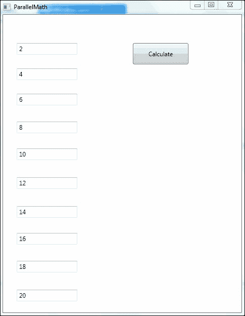

现在，点击 **Calculate** 按钮，你的结果应该看起来像以下截图：

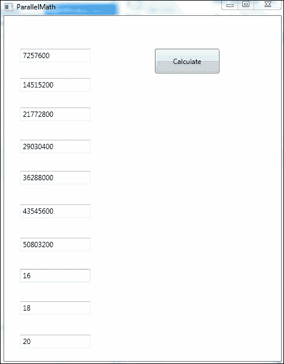

你看到了什么？是的，在并行循环的七次迭代后，循环停止，最后三次迭代没有完成。让我们看看原因。

## 工作原理

通过将 `ParallelLoopState` 参数添加到由并行 `For` 方法调用的方法中，我们实际上改变了被调用方法的重载。我们现在调用这个重载：


你会注意到我们没有创建这个 `ParallelLoopState` 变量并将其传递给 `CalculateNumbers2` 方法。这是由 .NET 完成的，我们可以直接使用它。非常方便！

现在，在我们的 `Action` 委托 `CalculateNumbers2` 中，我们使用以下命令调用此对象的 `Stop` 方法：

```cs
pls.Stop();
```

一旦调用此方法，循环的其余迭代将不会执行，循环将使用已经完成的迭代完成。

这不是一个非常实用的例子——为什么执行 10 次循环然后只停止在第七次？为什么不一开始就执行 7 次并行循环呢？这只是一个用于演示的例子。在你的应用程序中，你会找到许多条件，在这些条件下你将想要在完成所有迭代之前退出并行循环，就像使用正常的`For`循环一样。

# 并行循环中的异常处理

好吧，无论我们多么努力地编写无错误的代码，现实世界总会介入，不可避免地会遇到我们的代码会遇到的异常，例如文件未找到、参数超出范围等。当我们处理并行循环命令时，由于所有迭代都在可能不同的线程上运行，我们需要一种方法来收集循环任何迭代可能产生的所有异常。

.NET 提供了`AggregateException`类来专门实现这个目的。这允许我们将所有异常收集到`AggregateException`对象中，然后在循环完成后一次性“捕获”它。

就像处理正常的错误处理情况一样来考虑这个问题。通常，你会在代码的一部分周围放置一个`try`块，然后在其后放置一个`catch`块来处理`try`块中发生的任何异常。这将以相同的方式工作。我们将把`try`块放在我们的并行循环命令周围，然后捕获循环所有迭代中发生的异常。只是在这次，我们的`catch`块将捕获`AggregateException`，它只是异常的集合。

此外，在我们的`Action`委托中，我们将捕获发生的任何异常并将它们添加到`AggregateException`对象中。

就这些了！让我们通过修改我们的`ParallelMath1`项目来尝试生成一个异常，如果任何迭代产生的总和超过 500 万，来亲自尝试一下。

## 如何实现

首先，让我们在 Visual Studio 中打开`ParallelMath1`项目并做出以下更改：

1.  我们将使用一个`Concurrent`队列来收集异常，所以添加以下`using`语句：

    ```cs
    using System.Collections.Concurrent;
    ```

1.  然后，我们需要声明我们的`ConcurrentQueue`实例，使其对整个类可见。在数字整型数组的声明之后立即添加以下行：

    ```cs
    ConcurrentQueue<Exception> exceptions = new ConcurrentQueue<Exception>();
    ```

1.  接下来，我们将为我们的并行循环命令的`Action`委托添加一个新方法。我们将把这个方法命名为`CalculateNumbers3`。将以下代码添加到这个方法中：

    ```cs
            private void CalculateNumbers3(int i, ParallelLoopState pls)
            {
                int j = numbers[i];

                try
                {
                    for (int k = 1; k <= 10; k++)
                    {
                        j *= k;

                        if (j > 5000000) throw new ArgumentException(String.Format("The value of text box {0} is {1}. ", i, j));
                    }
                }
                catch(Exception e)
                {
                    exceptions.Enqueue(e);
                }

                numbers[i] = j;

        }
    ```

1.  然后，让我们修改`btnCalculate_Click`事件处理器。更改在填充数字数组和在填充文本框之间的代码，包括以下行：

    ```cs
                try
                {
                    Parallel.For(0, 10, CalculateNumbers3);

                    if (exceptions.Count > 0) throw new AggregateException(exceptions);
                }

                catch (AggregateException ae)
                {
                    // This is where you can choose which exceptions to handle. 
                    foreach (var ex in ae.InnerExceptions)
                    {
                        if (ex is ArgumentException)
                        {
                            tbMessages.Text += ex.Message;
                            tbMessages.Text += "\r\n";
                        }
                        else
                            throw ex;
                    }
         }
    ```

1.  最后，在`MainWindow.xaml`设计视图中，添加一个文本块控件；将其`Name`属性设置为`tbMessages`，并将其`Text`属性设置为空字符串。

现在我们的更改已经完成。当并行循环的任何迭代达到超过 500 万时，我们将抛出异常。所有异常都将收集到`ConcurrentQueue`中，并添加到`AggregateException`对象中。一旦并行循环执行完成，我们将处理`AggregateException`，如果有任何异常，并将它们的异常消息写入`Messages`文本块。

构建并运行你的应用程序。现在，在每个框中输入数字。你应该有一个看起来像以下截图的屏幕：

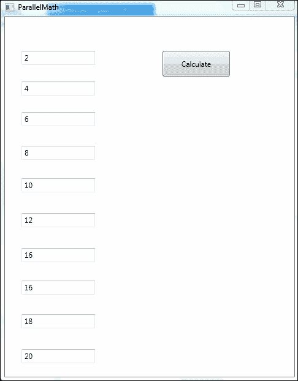

现在，点击**计算**按钮，你应该看到以下截图所示的结果：

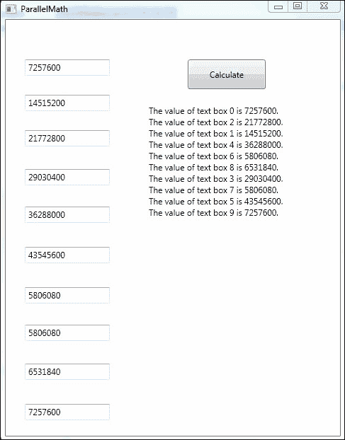

如您从输出中看到的，每个总数超过 500 万的框都会在我们的**消息**文本块中打印一行。在这个例子中，任何超过 500 万的数字都会抛出异常。一旦并行循环的所有迭代都完成，我们将处理这些异常并将它们的消息打印到`tbMessages`文本块中。

## 工作原理

我们做的第一件事是添加一个位于并发队列中的对象，用于存储所有异常。这是通过以下命令完成的：

```cs
ConcurrentQueue<Exception> exceptions = new ConcurrentQueue<Exception>();
```

接下来，在我们的并行`for`命令的`Action`委托中，在这个版本中执行`CalculateNumbers3`，我们通过异常检查大于 500 万的数字，使用以下命令：

```cs
if (j > 5000000) throw new ArgumentException(String.Format("The value of text box {0} is {1}. ", i, j));
```

然后，我们在委托中捕获这个异常，并使用以下语句将其添加到我们的并发队列中的异常对象：

```cs
            catch(Exception e)
            {
                exceptions.Enqueue(e);
            }
```

我们这样做是因为我们不希望打断在不同线程上运行的并行循环的其他迭代。我们希望循环完成处理后再处理异常。由于循环的每次迭代都是并发运行的，并且设计上不会影响其他迭代，因此我们不应该因为一次迭代出现问题而中断所有迭代。

循环完成后，我们想要检查是否有任何异常并处理它们。这是处理此功能的代码：

```cs
           try
            {
                Parallel.For(0, 10, CalculateNumbers3);

                if (exceptions.Count > 0) throw new AggregateException(exceptions);
            }

            catch (AggregateException ae)
            {
                // This is where you can choose which exceptions to handle. 
                foreach (var ex in ae.InnerExceptions)
                {
                    if (ex is ArgumentException)
                    {
                        tbMessages.Text += ex.Message;
                        tbMessages.Text += "\r\n";
                    }
                    else
                        throw ex;
                }
            }
```

如果我们在`ConcurrentQueue`对象中看到任何异常，我们抛出一个`AggregateException`，并给它整个异常队列。然后我们捕获这个`AggregateException`并处理它包含的所有异常。

我们还可以根据每个异常的类型执行不同的操作。你可以玩一下你的代码并尝试这个。

# 使用并行循环中的线程局部变量

一旦你熟悉了使用并行循环、停止它们以及使用它们进行异常处理，让我们谈谈如何使用线程局部变量更好地协调结果。如果我们想对所有并行循环迭代的结果求和，我们该如何做？

从我们目前所学的知识来看，我们会在循环之前创建一个类变量，并通过 `lock` 语句在每个循环迭代中访问它，以确保它是线程安全的。这会带来开销和协调时间。为了提高性能，我们可以使用线程局部变量来实现我们的并行循环。

`Parallel.For` 和 `Parallel.ForEach` 循环都有实现线程局部变量的重载。我们所说的线程局部变量是什么意思？这是一个其作用域持续到并行循环期间的变量，从第一次迭代开始之前到最后一次迭代完成。循环的每个迭代都获得自己的线程局部变量副本。

在并行循环方法的这些重载中，有三个函数被传递给循环以及迭代参数。对于 `For` 循环，迭代参数是循环索引的起始和结束值，而对于 `ForEach` 循环，则是源集合。

第一个函数将初始化线程局部变量。第二个函数是循环执行的 `Action` 委托。第三个函数是在循环的所有迭代完成后执行的 `Action` 委托，它接收每个循环迭代的线程局部变量。然后它可以处理结果，通常意味着合并结果。

让我们检查一下 `ForEach` 的一个重载：

```cs
ForEach<TSource, TLocal>(IEnumerable<TSource>, Func<TLocal>, Func<TSource, ParallelLoopState, TLocal, TLocal>, Action<TLocal>)
```

让我们花一点时间来剖析一下。我们将逐个解释方法定义中的每一部分及其作用：

+   `ForEach<TSource, TLocal>`：`TSource` 是源集合的数据类型，而 `TLocal` 是线程局部变量的数据类型。

+   `IEnumerable<TSource>`：这是源集合。由于我们正在使用 `ForEach` 示例，源集合必须是 `IEnumerable`。

+   `Func<TLocal>`：这是第一个函数；它初始化线程局部变量。

+   `Func<TSource, ParallelLoopState, TLocal, TLocal>`：这是第二个函数；它是由循环的每个迭代执行的 `Action` 委托。

+   `Action<TLocal>`：这是第三个函数；它是在每个迭代的局部状态上执行的 `Action` 委托。

尽管这是一个相当直接的概念，但它本身会导致一个看起来非常复杂的方法重载。为了确保我们理解，让我们去我们的 `ParallelMath1` 项目，看看它在我们一直在构建的示例应用程序中是如何工作的。

## 如何实现

为了在执行并行循环后使用线程局部变量来汇总我们的文本框，让我们打开我们的 `ParallelMath1` 项目并进行一些更改：

1.  在设计视图中 `MainWindow.xaml` 文件，让我们添加一个标签控件，并将 `Content` 属性设置为 `Sum:`。

1.  现在，让我们在它旁边添加一个文本框控件，并将 `Name` 属性设置为 `tbSum`，并将 `Text` 属性设置为空。

1.  在 `MainWindow.xaml.cs` 文件中，添加以下 `using` 语句，以便我们可以使用 `Interlocked.Add` 方法：

    ```cs
    using System.Threading;
    ```

1.  此外，在我们的 `ConcurrentQueue` 声明下方添加一个类变量，用于一个我们将称之为 `total` 的求和变量：

    ```cs
    long total = 0;
    ```

1.  然后，注释掉我们当前的 `Parallel.For` 命令，因为我们将要使用需要线程局部变量的新重载版本：

    ```cs
    //Parallel.For(0, 10, CalculateNumbers3);
    ```

1.  对于这个版本的 `Parallel.For`，使用 lambda 表达式而不是命名方法来处理 `Action` 委托更容易。所以，使用以下 `Parallel.For` 命令：

    ```cs
                    Parallel.For<long>(0, 10, 
                                () => 0,
                                (i, loop, subtotal) => 
                                {
                                    int j = numbers[i];
                                    for (int k = 1; k <= 10; k++)
                                    {
                                        j *= k;
                                    }

                                    numbers[i] = j;
                                    subtotal += j;
                                    return subtotal; 
                                },
                                (finalResult) => Interlocked.Add(ref total, finalResult)
                             );
    ```

1.  最后，在这条语句之后，添加以下语句，以便我们可以在用户界面上看到总数：

    ```cs
    tbSum.Text = total.ToString();
    ```

那就是我们需要做的所有更改，以便我们可以使用 `Parallel.For` 循环和线程局部变量来计算文本框的求和。

一旦做出这些更改，构建并运行应用程序。在文本框中输入数字，你应该有一个看起来像以下截图的屏幕：

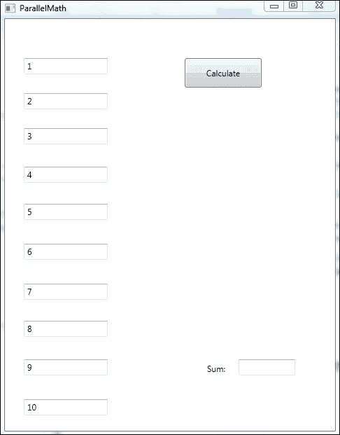

现在，点击 **计算** 按钮，看看会发生什么。结果应该看起来像下面的截图：

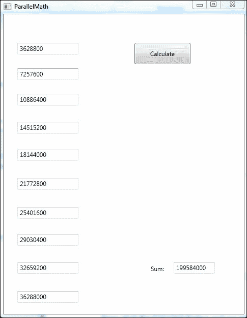

如示例所示，一旦并行循环处理完毕，我们现在有了所有文本框的总和。我们能够在每次迭代想要更新循环时不必不断锁定类变量的情况下做到这一点。我们可以在并行循环的末尾使用循环的每个迭代的线程局部值进行求和。

现在，让我们检查刚才发生了什么

## 工作原理

就像在这个项目的先前版本中一样，我们取 10 个不同的文本框中的数字，并将它们乘以 1 到 10 的数字，然后求和。然后将结果放回文本框中。但这次，我们取 10 个文本框中的新结果并求和，最终的总数显示在 `tbSum` 文本框中。

这个版本中唯一的真正区别是 `Parallel.For` 命令。让我们更深入地看看它：

```cs
                Parallel.For<long>(0, 10, 
                            () => 0,
                            (i, loop, subtotal) => 
                            {
                                int j = numbers[i];
                                for (int k = 1; k <= 10; k++)
                                {
                                    j *= k;
                                }

                                numbers[i] = j;
                                subtotal += j;
                                return subtotal; 
                            },
                            (finalResult) => Interlocked.Add(ref total, finalResult)
                            );
```

首先，我们现在有一个 `TResult` 参数，它是一个 `Parallel.For<long>` 的长整型。这告诉我们循环的每个迭代执行的 `Action` 委托将返回一个 `long` 类型的值。这次 `Action` 委托作为 lambda 表达式实现，并且是 `Parallel.For` 方法的第四个参数：

```cs
(i, loop, subtotal) => 
                            {
                                int j = numbers[i];
                                for (int k = 1; k <= 10; k++)
                                {
                                    j *= k;
                                }

                                numbers[i] = j;
                                subtotal += j;
                                return subtotal; 
                            }
```

让我们创建一个备份；前两个参数是迭代的起始和结束索引，0 和 10。第三个参数是我们的 `Action` 委托，它初始化线程局部变量。它使用 lambda 表达式实现：

```cs
() => 0
```

然后，我们传递给 `Parallel.For` 方法的最后一个参数是执行在每个迭代线程局部变量的 `Action` 委托：

```cs
(finalResult) => Interlocked.Add(ref total, finalResult)
```

在这个例子中，我们选择使用 lambda 表达式而不是命名或匿名方法来为三个 `Action` 委托，因为我们更容易看到正在发生什么以及传递给了什么。然而，我们可以使用命名方法达到相同的结果。

# 摘要

在本章中，我们涵盖了命令式数据并行化的所有方面。在第十章中，我们将讨论使用 PLINQ 的声明式数据并行化。在.NET 中使用 TPL 进行数据并行化实际上归结为使用`Parallel.For`和`Parallel.ForEach`方法执行并行循环。这些并行循环允许我们遍历一组或集合中的数据，并同时对集合中的每个成员执行相同的函数。

我们学习了如何使用`Parallel.For`在数据集上执行并行循环，以及使用`Parallel.ForEach`在数据集合上执行并行循环。然后我们看到了如何在达到特定条件时停止或跳出循环；为此，我们使用了.NET 可以生成的`ParallelLoopState`对象。

接下来，我们探讨了并行循环和`AggregateException`对象中的错误处理。我们学习了如何在循环的不同迭代过程中处理可能发生的所有异常，而不会影响其他迭代。

在最后一节中，我们看到了如何使用线程局部变量在我们的循环中创建一个线程安全的局部变量副本，然后在循环处理结束时使用所有这些局部副本的结果。

在下一章中，我们将花一些时间来探索 Visual Studio 调试器和它为调试同时运行多个线程的并行应用程序提供的功能。
