# 第八章。使用 Visual Studio 调试多线程应用程序

如本书所见，多线程应用程序在开发上具有自己的挑战，但它们在调试上也有独特的挑战。从 Visual Studio 2010 开始，Visual Studio 为调试任务和`Parallel`库开发了调试器的附加功能。

自 2003 年以来，Visual Studio 在其调试器中就有**线程**窗口，以帮助调试线程。然而，从 Visual Studio 2010 开始，他们增加了**并行堆栈**窗口、**并行监视**窗口和**任务**窗口，以帮助使用**任务并行库**（**TPL**）调试应用程序。在本章中，我们将检查所有这些窗口，并演示如何逐步执行多线程和多任务应用程序以查找程序流程问题和竞态/锁定条件。

**竞态条件**是一种错误类型，当多个线程相互干扰时发生，并基于不同线程的时机和执行。因此，这种条件并不在每次应用程序执行时都发生。它需要不同线程执行的一定时机。

当两个或更多线程几乎同时访问一个数据变量并尝试修改它时，会发生**竞态条件**。由于操作系统调度器可以在任何时候在线程之间切换，因此您无法预测线程访问数据的顺序。数据变化的结果取决于操作系统调度算法。这两个线程都在“竞速”以访问数据。

当一个线程检查一个变量的内容并执行一个动作，而另一个线程在第一个线程检查和执行动作的过程中改变了同一变量的内容时，可能会出现问题。

当两个或更多线程等待另一个线程锁定的资源时，会发生**锁定条件**。因此，如果线程 1 正在等待由线程 2 锁定的资源，而线程 2 正在等待由线程 1 锁定的资源，那么这两个线程将永远“挂起”，永远等待对方释放资源。这是一种称为**死锁**的锁定条件。

在本章中，你将学习以下内容：

+   使用调试器中的**线程**窗口

+   使用调试器中的**任务**窗口

+   访问**并行堆栈**和**并行监视**窗口

+   在具有多个线程和多个任务的程序中逐步执行

+   检测死锁条件

# 调试多线程应用程序的注意事项

在调试并行应用程序时，有几个因素需要考虑。首先，可能最明显的一点是，同时发生多个事件。如果你有一个包含五个线程的应用程序，那么这五个线程可以同时执行，这取决于你的机器有多少个核心。如果你逐步执行一个特定的线程，其他线程并不会只是等待你，除非有断点或者它们正在等待你逐步执行的线程所锁定的资源。你需要了解你的并行应用程序是如何设计和执行的，这样你才知道并行中发生了什么——特别是除了你可能逐步执行的线程之外的其他线程发生了什么。

其次，调试并发应用程序需要大量的信息。当在 TPL 应用程序上使用调试器时，你可以同时打开**本地**、**立即**、**线程**、**任务**、**并行堆栈**、**并行任务**、**进程资源管理器**、**源代码**和**对象资源管理器**窗口。这要么需要大量的屏幕空间，要么需要不断移动窗口以查看所需的信息。我强烈建议在双显示器设置上这样做。在调试并行应用程序时，屏幕空间永远都不嫌多。没有比在逐步执行应用程序时无法轻松查看所有所需信息更令人沮丧的事情了。

# 使用线程窗口

Visual Studio 调试器中的**线程**窗口允许你查看应用程序中所有线程的详细信息，并与之交互。你可以查看每个线程的堆栈。你可以冻结或解冻一个线程，并查看有关线程的所有详细信息。

如果你在一个应用程序中启动调试器，然后转到**调试** | **窗口**，你可以选择**线程**窗口。如果你这样做，你应该看到以下内容；这是我们在第七章中做的`OldStarFinder`程序线程版本的**线程**窗口，*数据并行*：

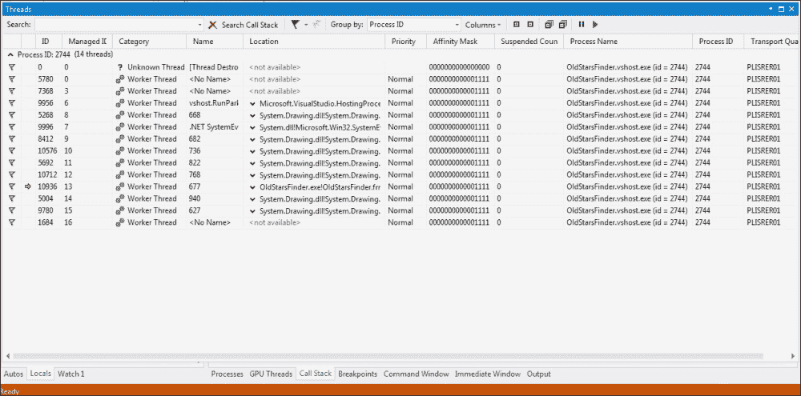

让我们来看看这个窗口，并详细检查它。它包含以下列：

+   **Flag**

+   **Active**

+   **ID**

+   **Managed ID**

+   **Category**

+   **Name**

+   **Location**

+   **Priority**

+   **Affinity Mask**

+   **Suspended Count**

+   **Process Name**

+   **Process ID**

+   **Transport Qualifier**

**Flag**列允许你指定一个线程为你想要监视的线程。如果你在这个窗口中右键单击一个线程，你可以标记或取消标记它为标记线程。

**Active**列指示哪个线程是当前活动的线程。黄色箭头在调试器中指定活动线程。值得注意的是，当你逐步执行一个线程时，其他线程会继续它们的操作，除非设置了断点。所有线程在你逐步执行特定线程时都不会阻塞。

**ID**列显示 Windows 中线程的 ID 号，这与.NET 托管 ID 不同。

**托管 ID**列显示线程的托管 ID 号。**托管线程**与 Windows 线程不同。在这个上下文中，**托管线程**是由 CLR 和线程池在.NET 中管理的线程。托管线程可以在一个或多个 Windows 线程中执行。.NET 托管线程是通过使用.NET `Threads`类创建的。此外，记住在使用`Tasks`时，任务不是线程。

**类别**列显示线程的分类，可以是主线程、用户界面线程、远程过程调用处理线程或工作线程。

**名称**列显示线程的**名称**属性，如果已设置，否则显示**<无名称>**。

**位置**列显示线程当前正在执行的方法。通过双击此列中的某一行，你可以看到线程的完整堆栈。

**优先级**列显示线程的 Windows 优先级。

**亲和掩码**列显示每个线程的此掩码。亲和性是一个位掩码，指示线程可以执行哪些处理器。在我们的例子中，我们有一个四处理器系统，除了一个线程外，所有线程的掩码都以`1111`结尾。这四个位代表我们的四个处理器。这表明这些线程可以在任何处理器上执行。`Threads`类中有方法允许你通过编程方式设置线程可以运行的处理器，如果你愿意的话。

**挂起计数**列是由冻结和解冻线程所操作的计数。如果你在托管代码中冻结一个线程，那么即使该线程能够运行，它也不会运行，挂起计数将为`1`。

**进程名称**列显示与线程关联的 Windows 进程。由于我们是通过 Visual Studio 调试器运行我们的应用程序，你会看到我们的线程的进程是**OldStarsFinder.vshost.exe**。你还可以在 Windows 中运行任务管理器并看到此进程。

现在我们已经了解了**线程**窗口提供的信息，你可以用它做些什么呢？你可以通过点击此窗口标题栏中的**列**下拉菜单来显示或隐藏显示中的列；你还可以对线程执行分组操作以更好地管理它们。我们已经看到了如何通过双击**位置**列中的一行来查看线程的调用堆栈。你也可以通过右键单击任何线程并选择**切换到线程**来将其设置为**活动**线程。

接下来，让我们来检查**任务**窗口。

# 使用任务窗口

**任务**窗口是在 2010 版本的 Visual Studio 调试器中添加的，当时在.NET 4.0 版本中将 TPL 添加到.NET 中。它与**线程**窗口类似，显示您应用程序中每个任务的信息。任务是通过使用`System.Threading.Tasks.Task`类或使用`async`和`await`关键字创建的。`async`和`await`关键字是在.NET 4.5 版本中引入的，将在第十一章 *异步编程模型*中介绍。像**线程**窗口一样，可以通过在 Visual Studio 的调试器中导航到**调试** | **窗口**来访问它：

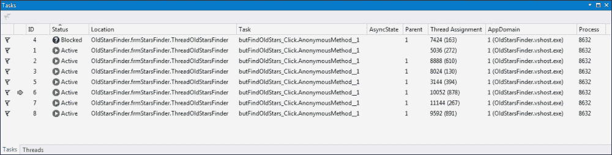

让我们检查您可以使用**任务**窗口进行的信息和功能：

+   **标志**: 此列显示您已标记或取消标记的任务。通过单击此列中的任务，您可以标记此任务中的线程。您可以标记多个任务，然后通过排序或使用分组功能来显示标记的任务。您还可以通过标记的任务来过滤**并行堆栈**窗口，以便您只能看到您感兴趣的任务的并行堆栈。

+   **图标**: 此列显示当前线程上当前任务的状态。这通过一个黄色箭头表示。一个白色箭头表示当前任务在调试器的断点处。一个暂停符号表示任务已被冻结。

+   **ID**: 此列是 Windows 为任务生成的识别号。在我们的示例中，我已经将`8`输入到**用于处理的位图数量**文本框中，然后在`Parallel.ForEach`循环之后设置了一个断点。您可以看到我们创建了八个任务，这些任务都在运行匿名方法，并且它们是从**查找旧恒星**按钮的点击事件处理器中启动的。它们的 ID 是 1 到 8 的数字。

+   **状态**: 此列显示任务的状态，可以是以下任何一种：

    +   **活动**: 任务当前在堆栈上处于活动状态

    +   **死锁**: 任务当前处于死锁状态，正在等待资源

    +   **等待**: 任务当前正在等待 CPU 分配

    +   **已计划**: 任务计划在线程池中的线程可用时开始执行

    +   **完成**: 任务已完成其执行

    如果一个任务的线程与应用程序中的另一个线程处于锁定状态，则认为该任务处于死锁状态。如果一个任务正在等待释放锁或另一个任务完成，则认为它正在等待。

+   **位置**: 此列显示特定任务的调用堆栈。与**线程**窗口不同，要查看整个调用堆栈，您需要将鼠标悬停在此列上，而不是双击它。此外，如果一个任务尚未开始但已计划，则此列可能尚未填充。

+   **父任务**: 此列显示创建该任务的任务的 ID。

+   **线程分配**：此列显示任务正在执行的线程的线程 ID 和线程名称。在我们的示例中，你可以看到我们在这行代码中使用了数字来命名我们的任务线程：

    ```cs
    Parallel.ForEach(BitmapList, item => ThreadOldStarsFinder(item,ran.Next(1000).ToString()));
    ```

    我们将 1 到 1,000 之间的随机数作为`ThreadOldStarsFinder`方法的第二个参数传入，然后使用以下行来设置对应任务的线程名称：

    ```cs
    Thread.CurrentThread.Name = ThreadName;
    ```

+   **APPDomain**：此列显示任务正在运行的应用程序域。**进程**列显示任务正在执行的 Windows 进程的 Windows ID。

+   **AsyncState**：如果使用`async`或`await`关键字从方法调用中运行任务，此列显示任务的异步状态。

当调试 TPL 应用程序时，此窗口非常有帮助，可以让你总体了解代码生成的所有任务，包括哪些是活跃的，以及每个任务调用的堆栈和线程信息。结合**线程**窗口，你可以很好地查看应用程序中运行的所有实体及其执行状态。

**任务**窗口在调试使用 TPL 的多线程应用程序时非常有用。如果你使用线程或`BackgroundWorker`组件，此窗口将不会有所帮助。

# 使用 Parallel Stacks 窗口

**Parallel Stacks**窗口在调试并行应用程序时非常有帮助，因为它以图形视图几乎像流程图的方式显示任务和线程信息。它显示了与**线程**和**任务**窗口相同的大量信息，但格式不同，并且显示了线程和任务之间的关系，这非常有帮助。

**线程**和**任务**窗口是查看你的多线程应用程序所有实体的良好表格方式，但它们并不擅长展示关系和程序流程信息。

**Parallel Stacks**信息有一个**线程**视图和一个**任务**视图。这些视图也可以切换到**方法**视图。

以下是在执行`Parallel.ForEach`命令并将位图分成八个部分后，我们的`OldStarsFinder`应用程序的**线程**视图：

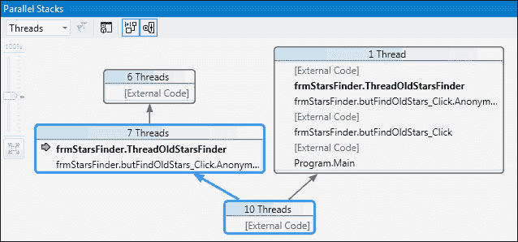

以下是在执行`Parallel.ForEach`命令并将位图分成八个部分后，我们的`OldStarsFinder`应用程序的**任务**视图：

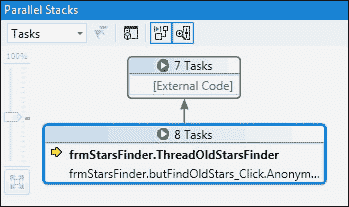

以下是在执行`Parallel.ForEach`命令并将位图分成八个部分后，我们的`OldStarsFinder`应用程序的**线程**视图切换到**方法**视图：

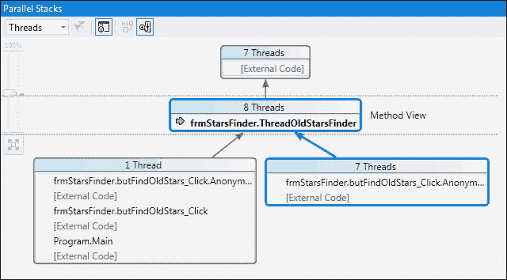

以下截图显示了执行`Parallel.ForEach`命令并将位图分成八个部分后，我们的`OldStarsFinder`应用程序的**任务**视图切换到**方法**视图：


关于此窗口有几个需要注意的事项。首先是工具栏。它允许你从下拉菜单中选择**线程**或**任务**。它还允许你只显示窗口中的标记线程。接下来，它允许你切换到**方法**视图，并且还可以放大某个区域。

在**线程**和**任务**视图中，当前线程的调用路径以蓝色突出显示。这就是为什么你可以看到多个框被突出显示的原因。连接到框的箭头显示任务或线程的调用路径，图中的每个框代表一个调用堆栈。此外，如果你将鼠标悬停在框的标题（也称为节点）或节点中的行上，你会看到一个工具提示。节点标题的工具提示显示导致此节点的调用路径中所有线程的线程 ID 和名称。在行或方法工具提示中，你会看到方法的堆栈。

节点中的黄色箭头表示当前活动线程的活动帧。此外，活动线程当前堆栈帧中所有节点的方程序式都以粗体显示。如果你在堆栈帧中的方法行上右键单击，你将获得一个菜单，允许你转到该任务或线程，或转到源代码。

我们之前展示的**方法**视图显示了所有调用或被当前方法调用的方法。当前方法显示在中间，调用它的方法显示在下方，它调用的方法显示在上方。这是获取 Visual Studio 函数当前运行时视图的一个好方法，即**查找所有引用**。它并不完全相同，但很相似。

**并行堆栈**窗口可能是你在调试模式中除了实际执行代码之外花费时间最多的地方。通常，你将打开**线程**和**任务**窗口以供表格参考，将代码打开以设置断点和逐行执行，以及使用**并行堆栈**窗口来跟踪所有线程、任务及其关系。

# 使用并行监视窗口

**并行监视**窗口允许你显示多个线程上持有的表达式的值。你可以看到它运行一个并行应用程序，并通过导航到**窗口** | **调试**来选择**并行监视**。正如你在下面的屏幕截图中所看到的，**并行监视**窗口在添加监视语句之前是空的。每一行显示一个具有与当前堆栈帧中方法匹配的方法调用的线程。

如果你点击**<添加监视>**栏，你可以输入一个要监视的表达式。这允许你查看多个线程中相同表达式的值。如果你想监视多个表达式，你可以像常规的**监视**窗口一样显示多达四个**并行监视**窗口。你还可以通过在窗口右上角的**通过布尔表达式筛选**框中筛选监视列表。如果你在那里输入一个表达式，它将只显示包含该表达式的线程：

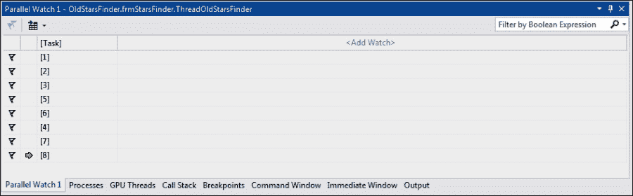

**并行监视**窗口实际上只是**监视**窗口，但它允许你在应用程序的所有线程上监视相同的表达式。在这个窗口中，任何 C#表达式都是有效的。

在下面的示例中，我们添加了一个监视变量到之前使用的示例。我们正在监视每个任务分配的线程的`Thread.Name`值。这是我们在完成`Parallel.ForEach`命令后的相同窗口。你可以看到只有一个任务已经执行，但其他任务已安排。已经开始的任务已经执行了其委托的第一行，即设置线程名称：

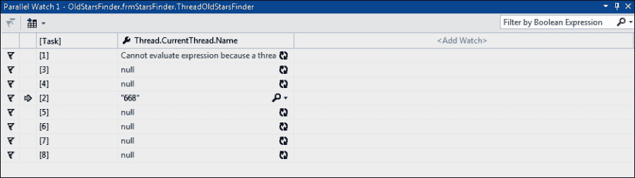

在一个`Parallel.For`或`Parallel.ForEach`循环中，这个窗口是一个非常有效的方法，该循环在多个任务中多次执行相同的委托。它允许你查看每个任务在执行那一刻的当前值。

# 调试整个应用程序

现在我们已经检查了 Visual Studio 调试器为调试多线程应用程序提供的所有窗口，让我们通过一个真实示例来操作。我们将使用在第七章中完成的`OldStarsFinder`应用程序，该应用程序使用任务和 TPL。请记住，这个应用程序接受用户输入的数字，然后将大位图文件按该数字分割成相等数量的较小位图文件。然后，使用并行`ForEach`循环，它处理每个位图以尝试在图像中找到旧星。它跟踪找到的旧星数量。完成时，它重新组装碎片并显示带有每个旧星蓝色的位图。它还显示它找到的旧星总数。让我们开始吧。

## 如何操作

首先，让我们在 Visual Studio 中打开我们的`OldStarsFinder`应用程序并设置一些断点以帮助我们开始。然后执行以下步骤：

1.  在包含`Parallel.ForEach`命令的代码行上设置断点，如图所示：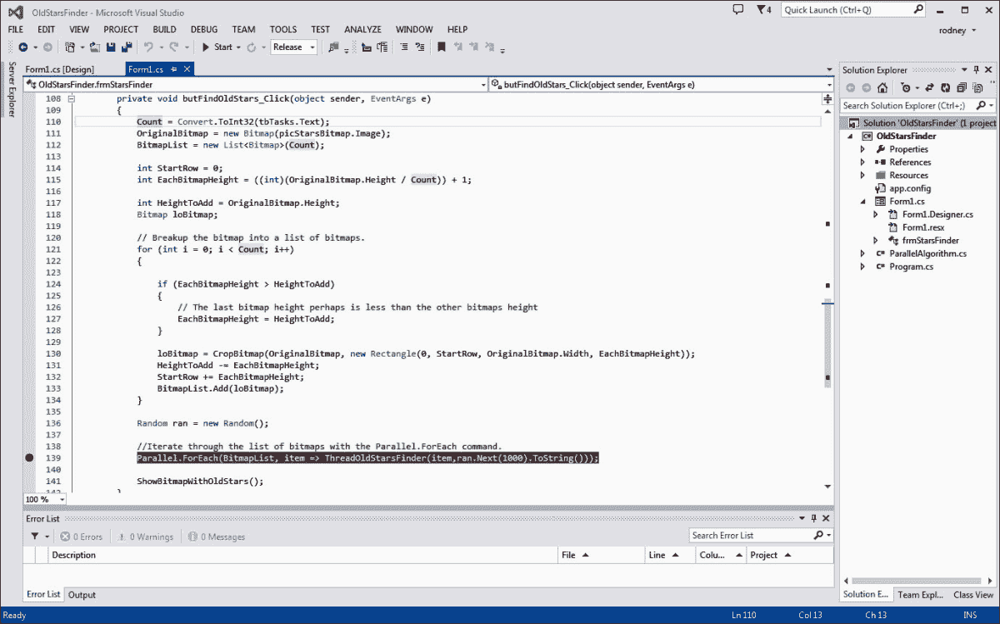

1.  现在，让我们在`ThreadOldStarsFinder`方法中放置第二个断点，该断点每个并行任务都在执行。我们将在方法中放置它，在那里我们使用从`Parallel.ForEach`命令传递的随机数设置线程名称：

1.  现在，让我们在调试器中启动应用程序，并在文本框中输入`6`，以将大图像分割成多少个位图：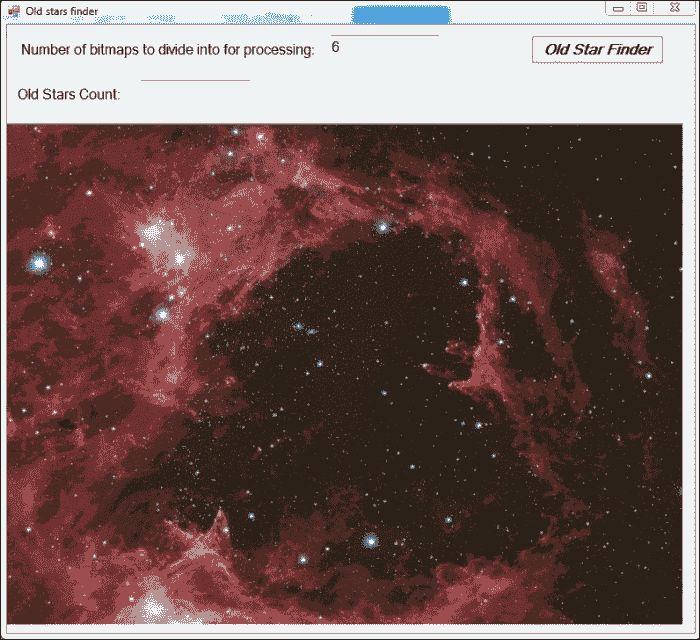

1.  接下来，让我们点击**旧星寻找器**按钮。我们会看到代码进入按钮的点击事件处理程序，并到达我们在`Parallel.ForEach`命令处设置的第一个断点。下面的截图显示了调试器以及**线程**、**任务**、**并行堆栈**和**并行监视**窗口的外观：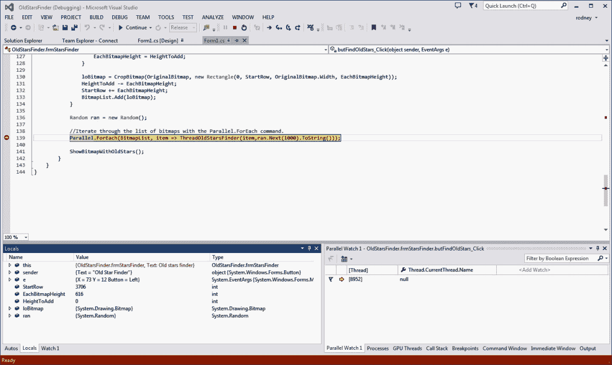

    在我们执行`Parallel.ForEach`命令之前，你可以看到还没有任何任务：

    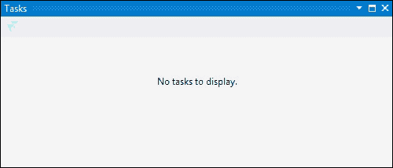

    你还会看到，这些任务没有额外的线程，因为我们还没有执行并行数据循环：

    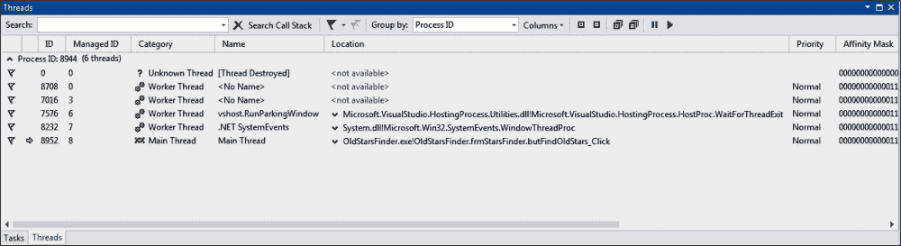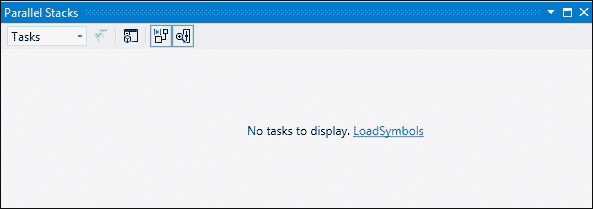

    看着**并行堆栈**窗口，你只能看到应用程序的主线程：

    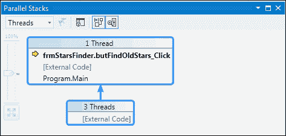

1.  现在，让我们在委托中的断点处执行`Parallel.ForEach`命令，并查看这些相同的窗口：

1.  现在，如果你将鼠标悬停在**并行堆栈**窗口中带有黄色箭头的行上，你会看到每个线程正在执行的代码行。这是使用**并行堆栈**窗口的**线程**视图：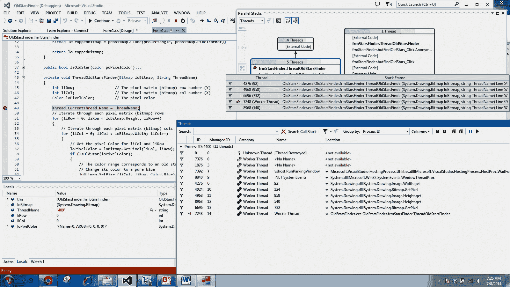

1.  现在，让我们使用**并行堆栈**窗口的**任务**视图来检查相同的内容：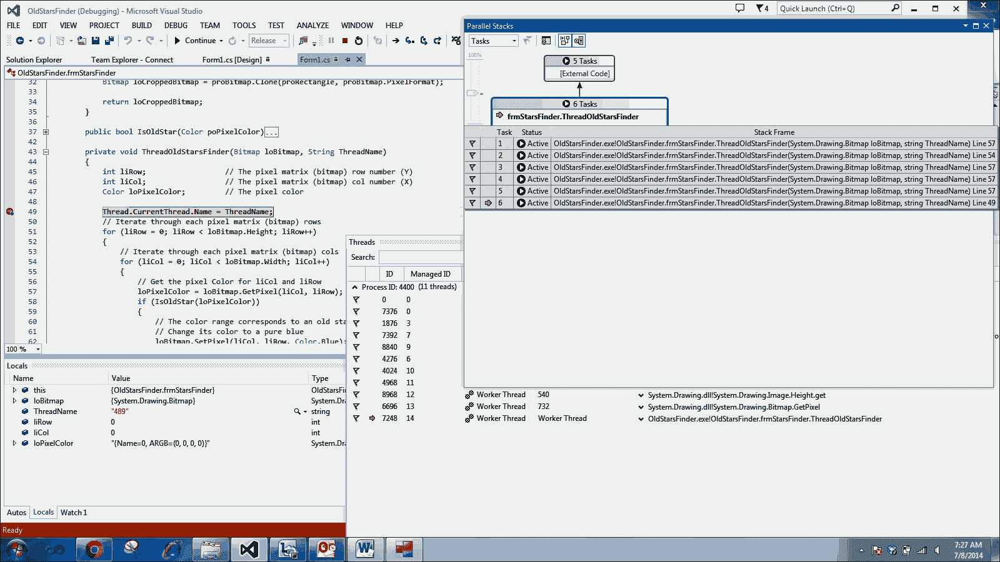

1.  此外，同时，让我们检查我们的**并行监视**窗口：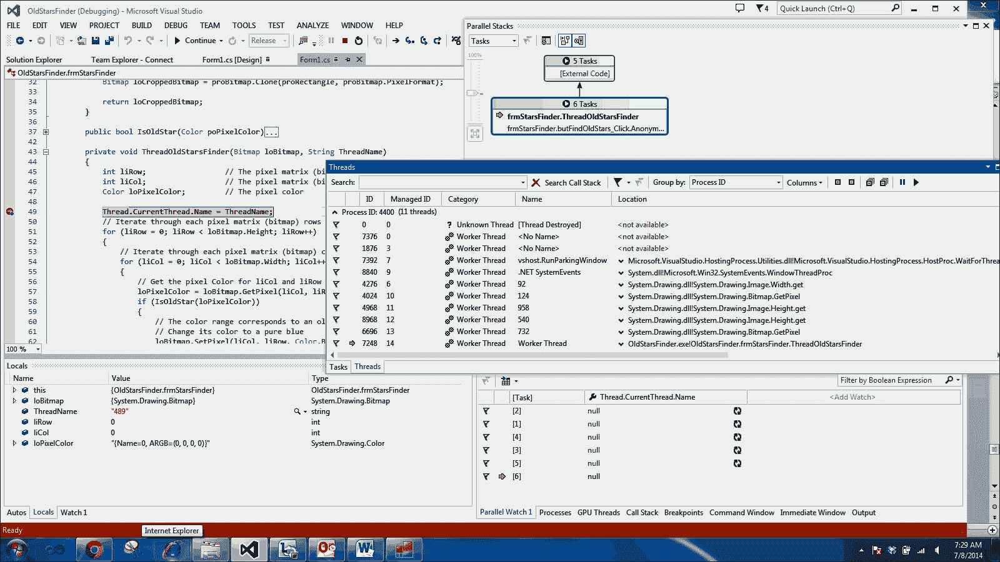

1.  接下来，让我们在`ThreadOldStarsFinder`委托方法中的当前行上执行单步跳过，并再次查看我们的窗口：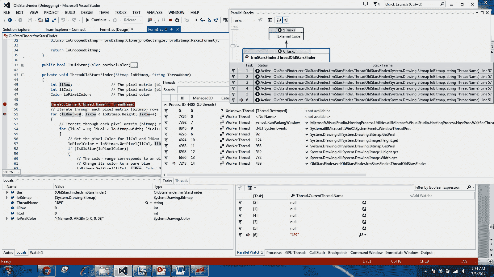

1.  然后开始逐步执行委托，注意发生了什么。以下是我们的示例视图：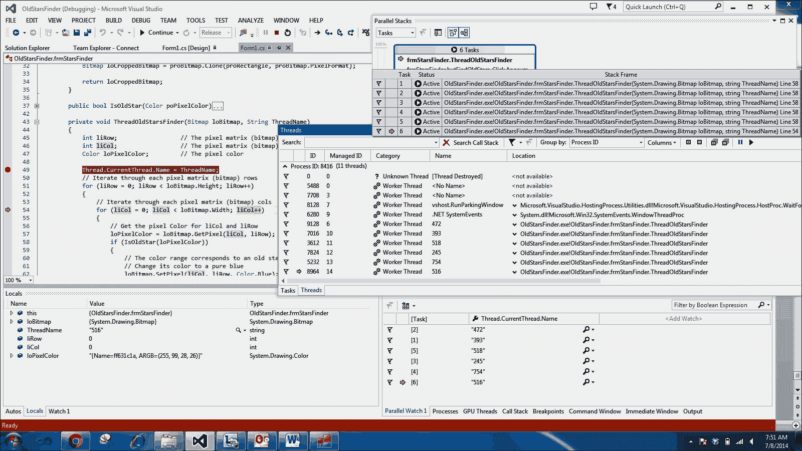

1.  注意，当你开始逐步执行一个线程上一个任务的委托时，窗口中的信息是如何变化的。你会在执行这个线程的一行之后注意到所有任务都在或可以位于不同的行上。此外，**并行监视**窗口会显示你在逐步执行表达式时的不同值。

1.  现在，让程序运行，直到它完成并行循环并准备好重新组装碎片。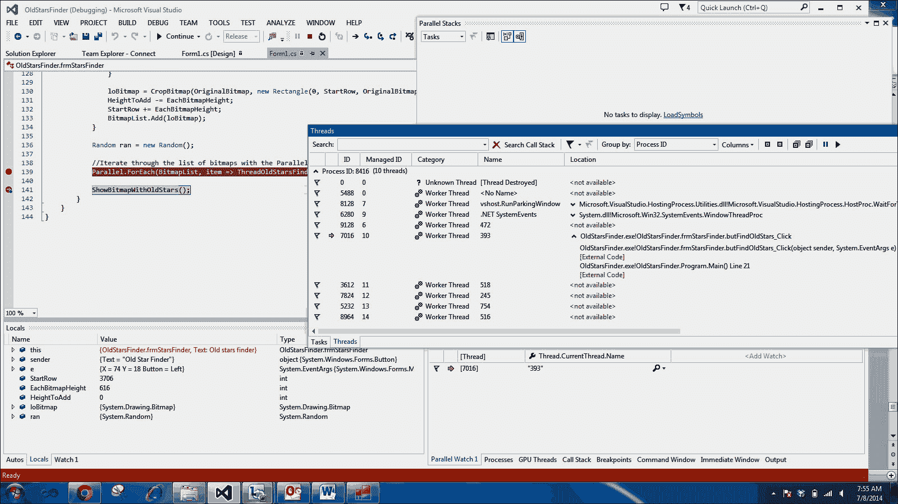

1.  如你所见，我们的应用程序中仍然有多个线程在运行，但没有任务。这表明我们在`Parallel.ForEach`循环中创建的所有任务都已经完成了它们的委托函数，任务不再在线程池中。但是，应用程序仍然在使用一些线程，并且需要清理一些线程。

现在我们已经看到了如何在调试器中打开所有各种窗口进行并行调试，并逐步执行了基于 TPL 的多线程应用程序。让我们谈谈刚刚发生的事情以及我们所看到的。

## 如何工作

你可以从我们之前的例子中看到，在我们进入`Parallel.ForEach`命令之前，我们的**任务**窗口或**并行堆栈**窗口在**任务**视图中没有显示任何任务；这在上面的屏幕截图中显示：

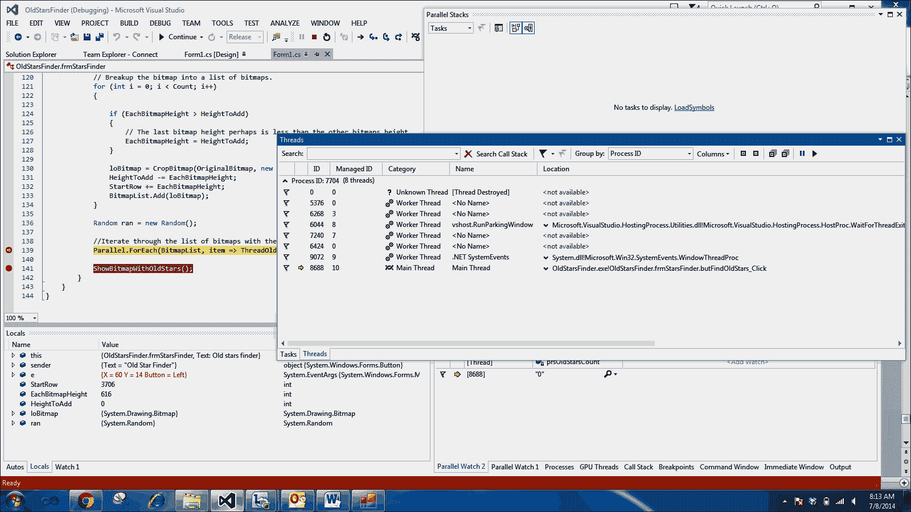

目前还没有任务，因为我们还没有创建任何任务。但是应用程序已经有了几个线程。有一个是主线程，这是我们设置断点的线程，有一个用于处理.NET 系统事件，还有一个用于我们应用程序运行的 Visual Studio 调试器。

让我们将我们的**并行堆栈**窗口切换到**线程**视图：

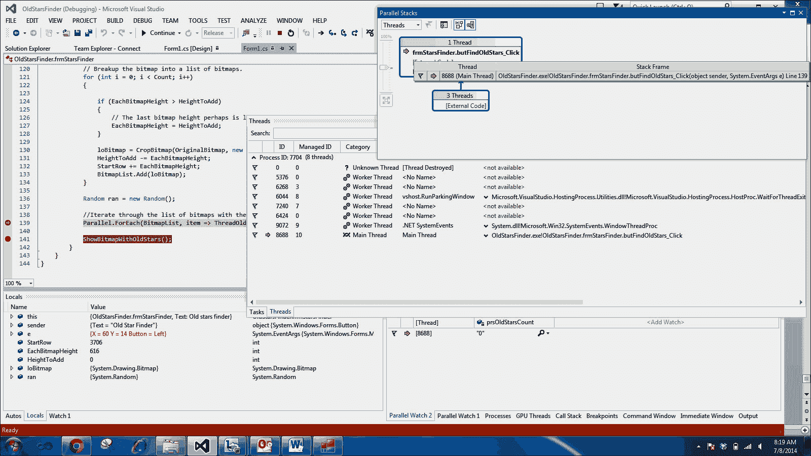

现在，你可以看到黄色箭头位于**旧星查找器**按钮的点击事件处理程序的第**139**行，正好是我们的断点所在位置。`prsOldStarsCount`变量被设置为`0`，因为这是我们初始化它的方式，而且代表者的任何版本都还没有运行来更新它。

现在，我已经跳过了委托行两次，让两个并行任务开始。让我们看看到目前为止的结果：

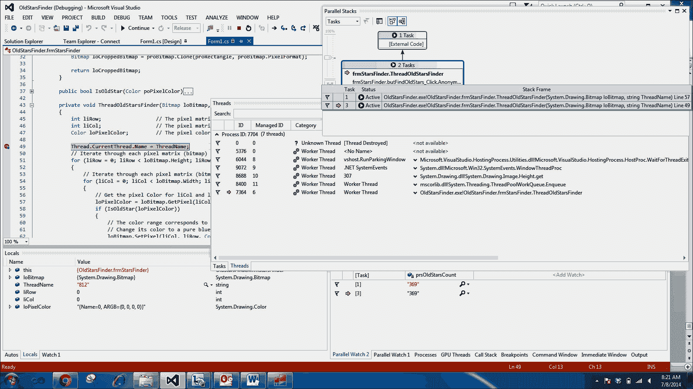

记住，当我们在一个线程中跳过一行时，其他线程将继续运行，直到我们跳过的线程完成并且控制权返回给调试器。所以，在我们执行一个线程中的一行代码时，可能会发生很多事情。正如我们所看到的，我们目前位于编号为**3**的任务的第**49**行。我们还可以看到任务**1**目前正在等待第**57**行。我们还在**并行监视**窗口中注意到，两个任务在变量`prsOldStarsCount`中都显示了**369**的值。这告诉我们什么？

这告诉我们，当我们仍然在任务**3**的委托方法中的第一行，并且还没有开始任何实际处理时，其他任务已经找到了**369**颗旧星。你也会注意到，**并行监视**窗口中的两个任务都显示`prsOldStarsCount`的相同值。这是因为这是一个全局变量，所有任务都在查看和更新相同的副本。现在，让我们在任务**3**的委托中跳过一行代码，看看会发生什么：

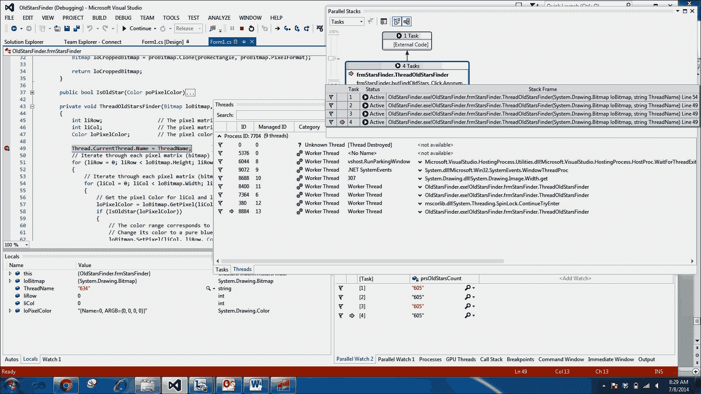

现在，我们位于编号为**4**的任务的第**49**行，`prsOldStarsCount`的值是**605**。发生了什么？我们在任务**3**中跳过了一行代码，最终在任务**4**的同一行。

记住我们在六个任务中每个任务的委托方法中设置了断点。当你跨过一行或继续在调试器中时，它会停在遇到的下一个断点上。此外，记住当我们跨过一行时，所有线程和任务都可以在那个时间运行。所以，当我们跨过任务**3**中的行时，调试器到达的下一个断点是任务**4**中相同的行。你可以从我们的窗口中看到一些东西。任务**2**、**3**和**4**都在第**49**行，还没有到达第**51**行（下一行可执行代码）。这告诉我们，当我们跨过任务**3**中的第**49**行时，调试器在任务**4**的第**49**行遇到了断点，在任务**3**的第**49**行执行完成之前。我们还看到，在达到下一个断点所需的时间内，我们的任务已经计数了**605**颗旧星，比**369**颗多。由于任务**1**是唯一一个我们看到超过第**49**行的任务，我们可以推断出它是计数所有这些星星的任务。

现在，让我们跨过这条线，看看接下来会发生什么：

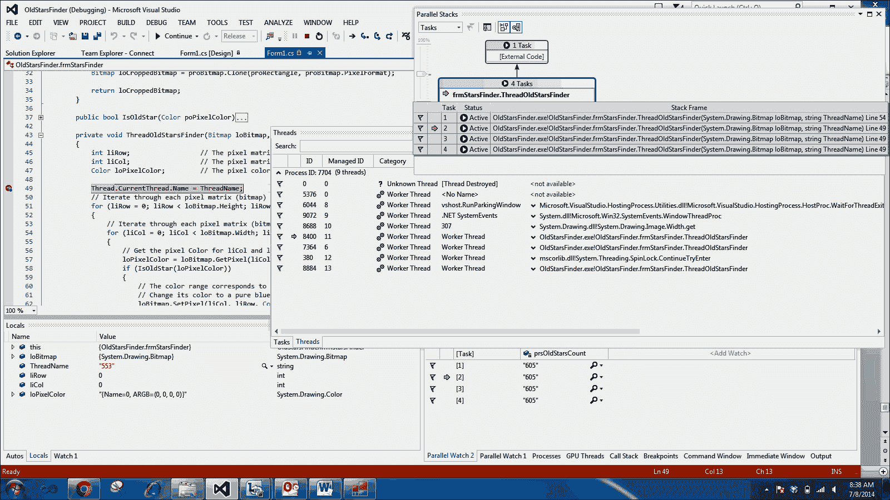

这次我们移动到了任务**2**的第**49**行，没有再计数任何旧星。让我们再跨过一行并检查：

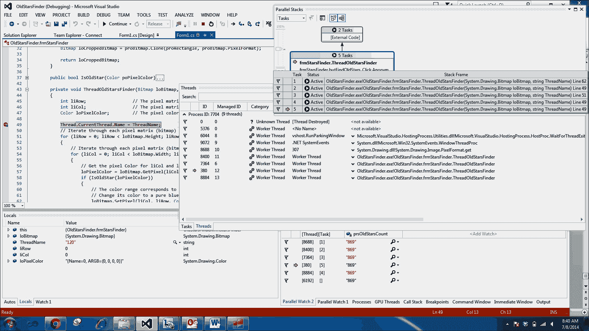

现在我们已经停在任务**5**的第**49**行。你还可以看到任务**1**和**3**现在都已经超过了第**49**行，我们现在已经计数了**869**颗旧星。让我们再跨过一行：


现在你可以看到，我们已经启动了我们`Parallel.ForEach`循环中请求的所有六个任务，并且已经达到了**1331**颗旧星。但是，即使已经找到了**1331**颗旧星，我们也没有在六个任务中的三个任务中超过第**49**行。让我们再跨过一行。由于我们已经在这六个任务中都达到了这个断点行，我们现在应该逐步执行我们当前的任务，即任务**6**。

但当我们这样做的时候，其他任务都可以运行。也就是说，我们运行的机器有四个处理核心，所以并不是所有的核心都能同时获得 CPU 时间，如下所示：

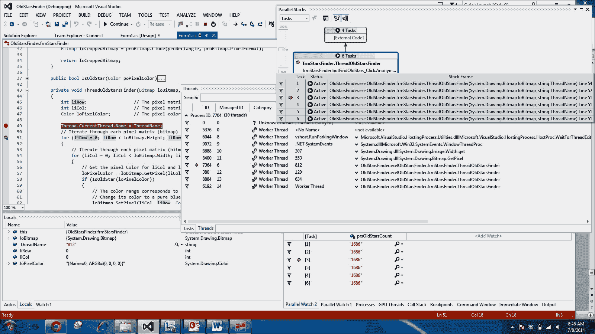

如你所见，我们现在可以开始逐步执行当前任务，而无需停止，因为所有任务都在运行的委托没有更多的断点可以干扰。你还可以看到，在执行任务**6**中这一行所需的时间内，我们现在已经计数了**1686**颗旧星，并在几个其他任务中移动了几行。

### 注意

还要注意，当你看到**[外部代码]**在堆栈帧中时，这指的是.NET 代码，而不是你自己的源代码。你可以设置调试器以显示外部代码的堆栈，但通常当你主要关注自己源代码的流程和调试时，这会提供太多信息。

在这一点上，继续逐步执行并观察会发生什么；然后停止应用程序并重新做这个练习。每次你在调试器中运行应用程序时，你应该看到略有不同的结果，因为我们有多个线程在运行并竞争处理时间。每次你逐步执行代码时，不同的线程将根据可用性和你机器上运行的其他竞争进程获得不同数量的 CPU 时间。记住，你的应用程序和调试并不是 Windows 机器上唯一运行的事情。

# 概述

在本章中，我们检查了 Visual Studio 为多线程和并行应用程序开发者提供的所有功能，以帮助他们调试和排查源代码中的问题。我们检查了**线程**窗口、**任务**窗口、**线程模式下的并行任务**窗口、**任务模式下的并行堆栈**窗口以及**并行堆栈**窗口。我们还使用这些窗口检查了我们的`OldStarsFinder`应用程序，并逐步执行了它的执行过程。

你已经学会了如何：

+   检查应用程序运行时的所有线程

+   使用 TPL 检查应用程序创建的所有任务

+   逐步执行具有多个任务和线程运行的应用程序

+   查看应用程序中任何线程或任务的堆栈

+   设置监视表达式并在所有线程中查看它们

在下一章中，我们将讨论一些并行应用程序的流行设计模式。
