# 第九章。管道和生产者-消费者设计模式

在本章中，我们将探讨两种流行的设计模式来解决并发问题——管道和生产者-消费者，这些模式用于使用 TPL 开发并行应用程序。**管道**设计是一种应用程序设计，其中包含多个任务或功能阶段，它们之间有工作项队列。因此，对于每个阶段，应用程序将从一个要执行的工作队列中读取，在该项上执行工作，然后将结果排队到下一阶段。通过这种方式设计应用程序，所有阶段都可以并行执行。每个阶段只需从其工作队列中读取，执行工作，并将工作结果放入下一阶段的工作队列中。

每个阶段都是一个任务，可以独立于其他阶段或任务运行。它们将继续执行，直到它们的队列变为空并标记为完成。如果队列为空但未完成，它们也会阻塞并等待更多工作项。

**生产者-消费者**设计模式是一个类似的概念，但有所不同。在这个设计中，我们有一组产生数据的功能，然后这些数据被另一组功能消费。每一组功能都是一个 TPL 任务。因此，我们有一个生产者任务和一个消费者任务，它们之间有一个缓冲区。这些任务中的每一个都可以独立运行。我们也可以有多个生产者任务和多个消费者任务。生产者独立运行，并将队列结果输出到缓冲区。消费者独立运行，从缓冲区中出队并处理项目。如果缓冲区满了，生产者可以阻塞并等待空间变得可用后再产生更多结果。同样，如果缓冲区为空，消费者可以阻塞，等待更多可消费的结果。

在本章中，你将学习以下内容：

+   使用管道设计模式设计应用程序

+   使用生产者-消费者设计设计应用程序

+   学习如何使用 `BlockingCollection`

+   学习如何使用 `BufferedBlocks`

+   理解 `System.Threading.Tasks.Dataflow` 库的类

# 管道设计模式

管道设计在并行设计中非常有用，当你可以将应用程序分解为一系列要执行的任务时，这样每个任务都可以与其他任务并发运行。每个任务输出的顺序必须与输入相同。如果顺序不重要，则可以执行并行循环。当顺序很重要，我们不想在项目开始执行任务 B 之前等待所有项目完成任务 A 时，管道实现就非常完美。

一些适合管道化的应用程序包括视频流、压缩和加密。在每个例子中，我们需要对数据进行一系列任务，并保留数据的顺序，但我们不希望在数据执行下一个任务之前等待每个数据项执行任务。

.NET 为实现此设计模式提供的键类是 `System.Collections.Concurrent` 命名空间中的 `BlockingCollection`。`BlockingCollection` 类是在 .NET 4.5 中引入的。它是一个线程安全的集合，专门为生产者-消费者和管道设计模式设计。它支持多个线程同时向集合中添加和移除项目。它还具有在集合满或空时阻塞添加和移除的方法。您可以指定最大集合大小，以确保超出消费者任务的生产者任务不会使队列过大。它支持取消令牌。最后，它支持枚举，这样您就可以在处理集合的项目时使用 `foreach` 循环。

向集合添加项目的生产者可以在将数据文件的最后一个项目添加到集合时调用 `CompleteAdding` 方法。在此方法被调用之前，如果消费者使用 `foreach` 循环从集合中消费项目，并且集合为空，它将阻塞，直到将项目放入集合而不是结束循环。

接下来，我们将看到一个使用加密程序实现的简单管道设计实现的例子。这个程序将在我们的管道中实现三个阶段。第一个阶段将逐字符读取文本文件，并将每个字符放入缓冲区（`BlockingCollection`）。下一个阶段将读取缓冲区中的每个字符，通过将其 ASCII 编号加 1 来加密它。然后，它将新字符放入我们的第二个缓冲区，并将其写入加密文件。我们的最终阶段将读取第二个缓冲区中的字符，将其解密回原始字符，并将其写入新文件和屏幕。正如您将看到的，阶段 2 和 3 将在阶段 1 完成从输入文件读取所有字符之前开始处理字符。所有这些都将保持字符的顺序，以确保最终输出文件与输入文件相同：

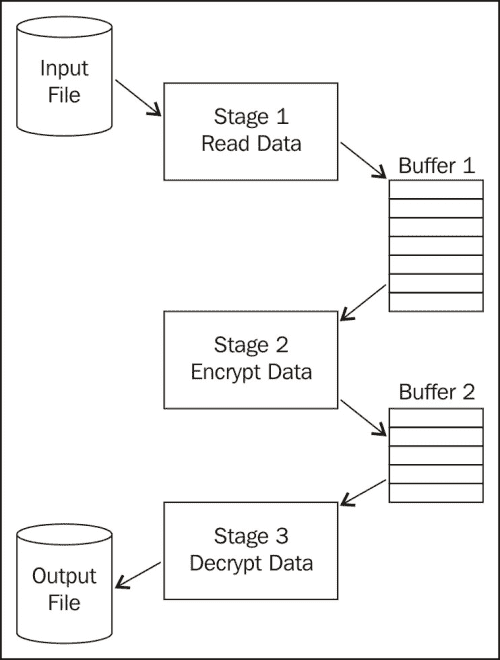

让我们开始吧。

## 如何做到这一点

首先，让我们打开 Visual Studio 并创建一个名为 `PipeLineApplication` 的新 **Windows Presentation Foundation** (**WPF**) 应用程序，并执行以下步骤：

1.  创建一个名为 `Stages.cs` 的新类。接下来，确保它具有以下 `using` 语句。

    ```cs
    using System;
    using System.Collections.Concurrent;
    using System.Collections.Generic;
    using System.IO;
    using System.Linq;
    using System.Text;
    using System.Threading.Tasks;
    using System.Threading;
    ```

1.  在 `MainWindow.xaml.cs` 文件中，确保存在以下 `using` 语句：

    ```cs
    using System;
    using System.Collections.Concurrent;
    using System.Collections.Generic;
    using System.IO;
    using System.Linq;
    using System.Text;
    using System.Threading.Tasks;
    using System.Threading;
    ```

1.  接下来，我们将为我们的管道中的每个阶段添加一个方法。首先，我们将创建一个名为 `FirstStage` 的方法。它将接受两个参数：一个将是 `BlockingCollection` 对象，它将是此阶段的输出缓冲区，另一个将是指向输入数据文件的字符串。这将是一个包含要加密的几段文本的文本文件。我们将把这个文本文件放在 `C:` 上的 `projects` 文件夹中。`FirstStage` 方法将具有以下代码：

    ```cs
    public void FirstStage(BlockingCollection<char> output, String PipelineInputFile)
            {
                String DisplayData = "";
                try
                {
                    foreach (char C in GetData(PipelineInputFile))
                    {
     //Displayed characters read in from the file.
                        DisplayData = DisplayData + C.ToString();

     // Add each character to the buffer for the next stage.
                        output.Add(C);

                    }
                }
                finally
                {
                    output.CompleteAdding();
                }
          }
    ```

1.  接下来，我们将添加一个用于第二阶段的方法，命名为`StageWorker`。这个方法不会返回任何值，并接受三个参数。其中一个将是一个`BlockingCollection`值，它将是它的输入缓冲区，第二个将是一个阶段的输出缓冲区，最后一个将是一个文件路径，用于在数据文件中存储加密后的文本。这个方法的代码看起来像这样：

    ```cs
    public void StageWorker(BlockingCollection<char> input, BlockingCollection<char> output, String PipelineEncryptFile)
            {
                String DisplayData = "";

                try
                {
                    foreach (char C in input.GetConsumingEnumerable())
                    {
                        //Encrypt each character.
                        char encrypted = Encrypt(C);

                        DisplayData = DisplayData + encrypted.ToString();

     //Add characters to the buffer for the next stage.
                        output.Add(encrypted);

                    }

     //write the encrypted string to the output file.
                    using (StreamWriter outfile =
                               new StreamWriter(PipelineEncryptFile))
                    {
                        outfile.Write(DisplayData);
                    }

                }
                finally
                {
                    output.CompleteAdding();
                }
            }
    ```

1.  现在，我们将为管道设计的第三和最后一个阶段添加一个方法。这个方法将被命名为`FinalStage`。它不会返回任何值，并接受两个参数。一个将是一个`BlockingCollection`对象，它是输入缓冲区，另一个将是指向输出数据文件的字符串。它将包含以下代码：

    ```cs
    public void FinalStage(BlockingCollection<char> input, String PipelineResultsFile)
            {
                String OutputString = "";
                String DisplayData = "";

                //Read the encrypted characters from the buffer, decrypt them, and display them.
                foreach (char C in input.GetConsumingEnumerable())
                {
                    //Decrypt the data.
                    char decrypted = Decrypt(C);

                    //Display the decrypted data.
                    DisplayData = DisplayData + decrypted.ToString();

                    //Add to the output string.
                    OutputString += decrypted.ToString();

                }

                //write the decrypted string to the output file.
                using (StreamWriter outfile =
                           new StreamWriter(PipelineResultsFile))
                {
                    outfile.Write(OutputString);
                }
            }
    ```

1.  现在我们已经有了管道三个阶段的处理方法，让我们添加一些实用方法。这些方法中的第一个方法将用于读取输入数据文件，并将数据文件中的每个字符放置在一个`List`对象中。这个方法将接受一个包含文件名的字符串参数，并返回一个字符的`List`对象。它将具有以下代码：

    ```cs
    public List<char> GetData(String PipelineInputFile)
            {
                List<char> Data = new List<char>();

                //Get the Source data.
                using (StreamReader inputfile = new StreamReader(PipelineInputFile))
                {
                    while (inputfile.Peek() >= 0)
                    {
                        Data.Add((char)inputfile.Read());
                    }

                }

                return Data;
           }
    ```

1.  现在，我们需要一个方法来加密字符。这将是一个简单的加密方法。加密方法对这个练习来说并不重要。这个练习旨在演示管道设计，而不是实现世界上最复杂的加密。这个加密方法将简单地取每个字符并将其 ASCII 数值加一。这个方法将接受一个字符类型作为输入参数并返回一个字符。它的代码如下：

    ```cs
    public char Encrypt(char C)
            {
                //Take the character, convert to an int, add 1, then convert back to a character.
                int i = (int)C;
                i = i + 1;
                C = Convert.ToChar(i);

                return C;
    }
    ```

1.  现在我们将在`Stages`类中添加一个最终的方法来解密字符值。它将简单地是`encrypt`方法的逆操作。它将接受 ASCII 数值并减去 1。这个方法的代码将如下所示：

    ```cs
    public char Decrypt(char C)
            {
                int i = (int)C;
                i = i - 1;
                C = Convert.ToChar(i);

                return C;
           }
    ```

1.  现在我们已经完成了`Stages`类，让我们将注意力转回`MainWindow.xaml.cs`文件。首先，你需要添加三个`using`语句。它们是为`StreamReader`、`StreamWriter`、`Threads`和`BlockingCollection`类：

    ```cs
    using System.Collections.Concurrent;
    using System.IO;
    using System.Threading;
    ```

1.  在`MainWindow`类的顶部，我们需要四个在整个类中可用的变量。我们需要三个指向我们的三个数据文件的字符串——输入数据、加密数据和输出数据。然后我们还需要一个`Stages`对象。这些声明看起来像这样：

    ```cs
    private static String PipelineResultsFile = @"c:\projects\OutputData.txt";
           private static String PipelineEncryptFile = @"c:\projects\EncryptData.txt";
           private static String PipelineInputFile = @"c:\projects\InputData.txt";
           private Stages Stage;
    ```

1.  然后，在`MainWindow`构造方法中，在`InitializeComponent`调用之后，添加一行来实例化我们的`Stages`对象：

    ```cs
    //Create the Stage object and register the event listeners to update the UI as the stages work.
    Stage = new Stages();
    ```

1.  接下来，向`MainWindow.xaml`文件添加一个按钮，该按钮将启动管道和加密。将这个按钮控件命名为`butEncrypt`，并将其`Content`属性设置为`加密文件`。接下来，在`MainWindow.xaml.cs`文件中为这个按钮添加一个点击事件处理程序。其事件处理方法将是`butEncrypt_Click`，并将包含此应用程序的主要代码。它将为两个队列实例化两个`BlockingCollection`对象。一个在阶段 1 和 2 之间，一个在阶段 2 和 3 之间。此方法将为每个阶段创建一个任务，该任务执行`Stages`类中的相应方法。然后，它将启动这三个任务并等待它们完成。最后，它将每个阶段的输出写入输入、加密和结果数据文件以及用于查看的文本块。其代码如下：

    ```cs
    private void butEncrpt_Click(object sender, RoutedEventArgs e)
            {
                //PipeLine Design Pattern

                //Create queues for input and output to stages.
                int size = 20;
                BlockingCollection<char> Buffer1 = new BlockingCollection<char>(size);
                BlockingCollection<char> Buffer2 = new BlockingCollection<char>(size);

                TaskFactory tasks = new TaskFactory(TaskCreationOptions.LongRunning, TaskContinuationOptions.None);

                Task Stage1 = tasks.StartNew(() => Stage.FirstStage(Buffer1, PipelineInputFile));
                Task Stage2 = tasks.StartNew(() => Stage.StageWorker(Buffer1, Buffer2, PipelineEncryptFile));
                Task Stage3 = tasks.StartNew(() => Stage.FinalStage(Buffer2, PipelineResultsFile));

                Task.WaitAll(Stage1, Stage2, Stage3);

                //Display the 3 files.
                using (StreamReader inputfile = new StreamReader(PipelineInputFile))
                {
                    while (inputfile.Peek() >= 0)
                    {
                        tbStage1.Text = tbStage1.Text + (char)inputfile.Read();
                    }

                }
                using (StreamReader inputfile = new StreamReader(PipelineEncryptFile))
                {
                    while (inputfile.Peek() >= 0)
                    {
                        tbStage2.Text = tbStage2.Text + (char)inputfile.Read();
                    }

                }
                using (StreamReader inputfile = new StreamReader(PipelineResultsFile))
                {
                    while (inputfile.Peek() >= 0)
                    {
                        tbStage3.Text = tbStage3.Text + (char)inputfile.Read();
                    }

                }
          }
    ```

1.  最后一件事情。让我们添加三个文本块来显示输出。我们将把这些文本块命名为`tbStage1`、`tbStage2`和`tbStage3`。我们还将添加三个带有文本`输入文件`、`加密文件`和`输出文件`的标签控件。这些将被放置在相应的文本块旁边。现在，`MainWindow.xaml`文件应该看起来像以下截图：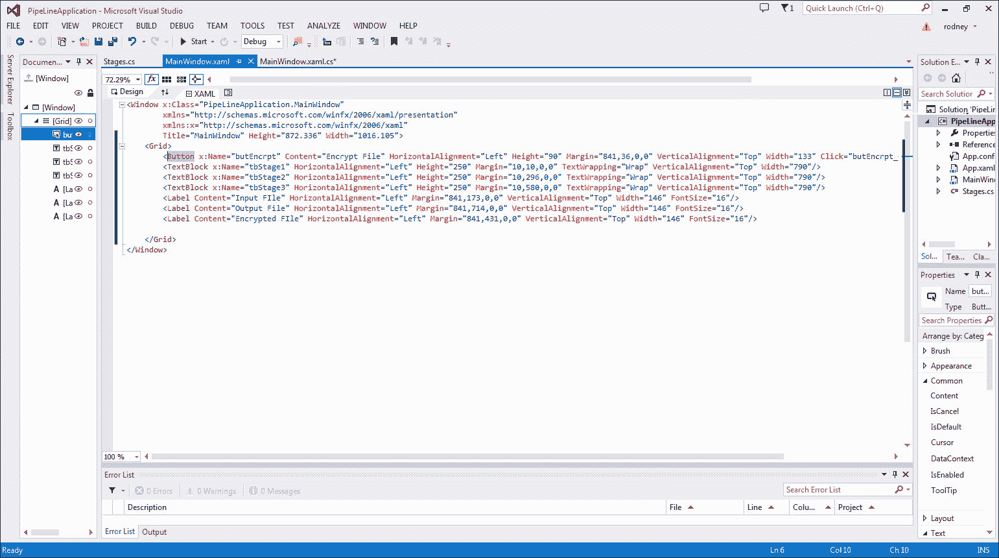

1.  现在，我们需要一个输入数据文件来加密。我们将把这个文件命名为`InputData.txt`，并将其放在我们电脑上的`C:\projects`文件夹中。在我们的例子中，我们向其中添加了以下文本：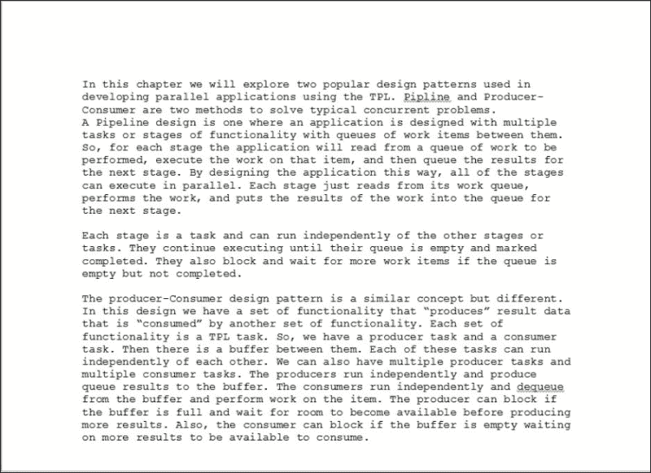

1.  我们已经完成，准备尝试它。编译并运行应用程序，你应该会有一个看起来像以下截图的窗口：

1.  现在，点击**加密文件**按钮，你应该看到以下输出：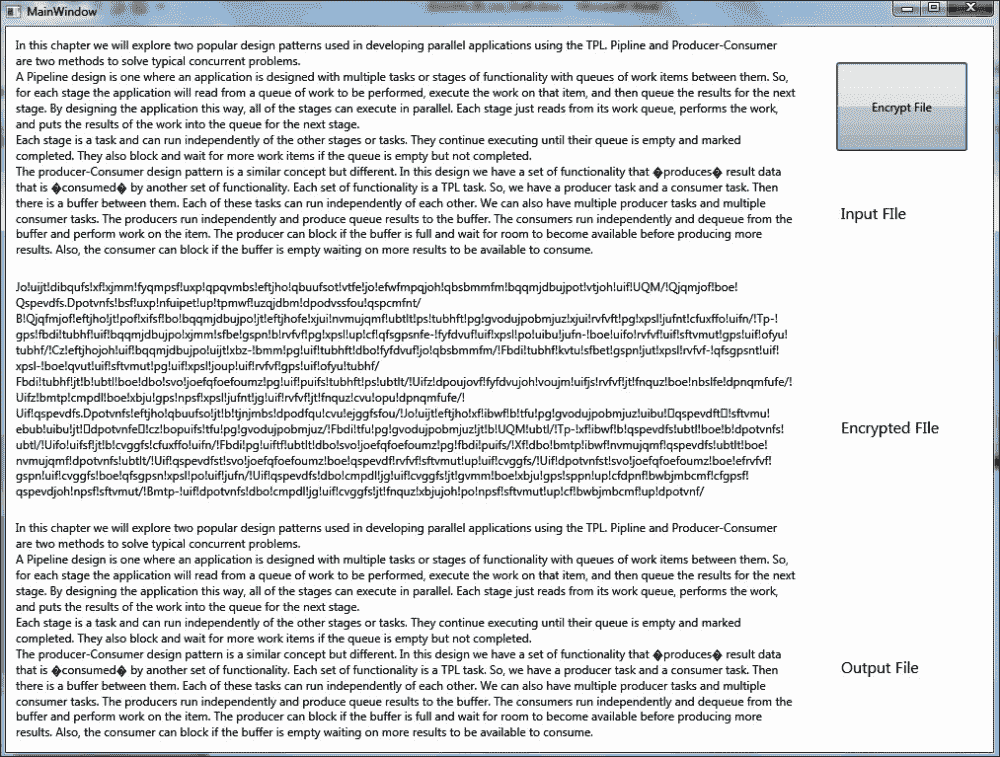

如您所见，输入和输出文件看起来相同，而加密文件看起来不同。请记住，**输入文件**是我们放入输入数据文本文件中的文本；这是我们在将文件读入字符列表后从第一阶段末端的输入。**加密文件**是在加密每个字符后的第二阶段的输出。**输出文件**是在再次解密字符后的第三阶段的输出。它应该与**输入文件**匹配。

现在，让我们看看它是如何工作的。

## 它是如何工作的

让我们看看`MainWindow.xaml.cs`文件中的`butEncrypt`点击事件处理方法，因为这里发生了许多操作。让我们检查以下代码行：

```cs
            //Create queues for input and output to stages.
            int size = 20;
            BlockingCollection<char> Buffer1 = new BlockingCollection<char>(size);
            BlockingCollection<char> Buffer2 = new BlockingCollection<char>(size);
            TaskFactory tasks = new TaskFactory(TaskCreationOptions.LongRunning, TaskContinuationOptions.None);

            Task Stage1 = tasks.StartNew(() => Stage.FirstStage(Buffer1, PipelineInputFile));
            Task Stage2 = tasks.StartNew(() => Stage.StageWorker(Buffer1, Buffer2, PipelineEncryptFile));
            Task Stage3 = tasks.StartNew(() => Stage.FinalStage(Buffer2, PipelineResultsFile));
```

首先，我们创建两个队列，这两个队列使用`BlockingCollection`对象实现。每个队列的大小设置为`20`个项目。这两个队列接受字符数据类型。

然后，我们创建一个`TaskFactory`对象，并使用它来启动三个任务。每个任务使用一个 lambda 表达式来执行`Stages`类中的一个阶段方法——`FirstStage`、`StageWorker`和`FinalStage`。

因此，现在我们除了主 UI 线程外还有三个单独的任务在运行。`Stage1`将逐个字符读取输入数据文件，并将每个字符放入队列`Buffer1`。记住，这个队列在阻塞`FirstStage`方法等待队列中的空间之前只能容纳 20 个项目。这就是我们知道`Stage2`在`Stage1`完成之前就开始运行的原因。否则，`Stage1`只会排队前 20 个字符然后阻塞。

一旦`Stage1`从输入文件中读取了所有字符并将它们放入`Buffer1`，它随后会进行以下调用：

```cs
            finally
            {
                output.CompleteAdding();
            }
```

这让`BlockingCollection`实例`Buffer1`知道没有更多的项目要放入队列中。因此，当`Stage2`在`Stage1`调用此方法后清空队列时，它不会阻塞，而是继续直到完成。在调用`CompleteAdding`方法之前，如果`Buffer1`为空，`Stage2`将阻塞，等待更多项目放入队列。这就是为什么为 Pipeline 和生产者-消费者应用程序开发了`BlockingCollection`实例。它提供了实现此功能的完美机制。

当我们创建`TaskFactory`时，我们使用了以下参数：

```cs
TaskCreationOptions.LongRunning
```

这告诉线程池，这些任务可能需要运行很长时间，并且有时可能会在等待队列时阻塞。这样，线程池可以决定如何最好地管理分配给这些任务的线程。

现在，让我们看看`Stage2`中的代码——`StageWorker`方法。我们需要一种以可枚举的方式移除项目的方法，这样我们就可以使用`foreach`循环遍历队列中的项目，因为我们不知道期望多少个项目。此外，由于`BlockingCollection`对象支持多个消费者，我们需要一种方法来移除其他消费者可能不会移除的项目。我们使用`BlockingCollection`类的以下方法：

```cs
foreach (char C in input.GetConsumingEnumerable())
```

这允许多个消费者从`BlockingCollection`实例中移除项目，同时保持项目的顺序。为了进一步提高应用程序的性能（假设我们有足够的可用处理核心），我们可以创建一个第四个任务，该任务也运行`StageWorker`方法。这样，我们就会有两个阶段和两个任务在运行。如果处理核心足够并且阶段 1 比阶段 2 运行得快，这可能是有帮助的。如果发生这种情况，它将不断填充队列并阻塞，直到空间可用。但如果我们运行多个阶段 2 任务，那么我们将能够跟上阶段 1。

然后，最后我们有这一行代码：

```cs
Task.WaitAll(Stage1, Stage2, Stage3);
```

这告诉我们的按钮处理程序等待直到所有任务都完成。一旦我们在每个`BlockingCollection`实例上调用`CompleteAdding`方法，并且缓冲区被清空，所有阶段都将完成，`TaskFactory.WaitAll`命令将得到满足，并且 UI 线程上的此方法可以完成其处理，在这个应用程序中是更新 UI 和数据文件：

```cs
            //Display the 3 files.
            using (StreamReader inputfile = new StreamReader(PipelineInputFile))
            {
                while (inputfile.Peek() >= 0)
                {
                    tbStage1.Text = tbStage1.Text + (char)inputfile.Read();
                }

            }
            using (StreamReader inputfile = new StreamReader(PipelineEncryptFile))
            {
                while (inputfile.Peek() >= 0)
                {
                    tbStage2.Text = tbStage2.Text + (char)inputfile.Read();
                }

            }
            using (StreamReader inputfile = new StreamReader(PipelineResultsFile))
            {
                while (inputfile.Peek() >= 0)
                {
                    tbStage3.Text = tbStage3.Text + (char)inputfile.Read();
                }

            }
```

接下来，尝试使用运行时间更长、更复杂阶段以及多个消费者阶段进行实验。此外，尝试使用我们在第八章调试多线程应用程序中学习的技术，通过 Visual Studio 调试器逐步执行应用程序，该章名为《使用 Visual Studio 调试多线程应用程序》。确保你理解阶段和缓冲区之间的交互。

# 解释消息块

让我们花一分钟时间来谈谈消息块和 TPL。微软作为 TPL 的一部分开发了一个新的库，但它并不直接随 .NET 4.5 一起提供。这个库被称为 TPL `Dataflow` 库。它位于 `System.Threading.Tasks.Dataflow` 命名空间中。它包含各种数据流组件，这些组件有助于异步并发应用程序，在这些应用程序中，需要在多个任务之间传递消息，或者当数据可用时传递数据，例如网络摄像头流式传输视频。

`Dataflow` 库的消息块对于设计模式，如 Pipeline 和生产者-消费者模式非常有帮助，在这种模式中，有多个生产者生产数据，这些数据可以被多个消费者消费。我们将要探讨的两个是 `BufferBlock` 和 `ActionBlock`。

TPL `Dataflow` 库包含用于辅助消息传递和并行化 I/O 重量级应用的类，这些应用具有很高的吞吐量。它提供了对数据缓冲和传递的显式控制。考虑一个异步从存储中加载大型二进制文件并处理这些数据的应用程序。传统的编程要求你使用回调和同步类，如锁，来协调任务并访问共享数据。通过使用 TPL `Dataflow` 对象，你可以创建在从磁盘位置读取时处理图像文件的对象。你可以设置数据可用时如何处理数据。由于 CLR 运行时引擎管理数据之间的依赖关系，因此你不必担心同步访问共享数据。此外，由于 CLR 引擎根据数据的异步到达来调度工作，因此 TPL `Dataflow` 对象可以通过管理任务运行的线程来提高性能。

在本节中，我们将介绍这两个类，`BufferBlock` 和 `ActionBlock`。

### 小贴士

TPL `Dataflow` 库（`System.Threading.Tasks.Dataflow`）不随 .NET 4.5 一起提供。要安装 `System.Threading.Tasks.Dataflow`，请在 Visual Studio 中打开你的项目，从 **项目** 菜单下选择 **管理 NuGet 包**，然后在网络上搜索 `Microsoft.Tpl.Dataflow`。

## BufferBlock

`DataFlow`库中的`BufferBlock`对象提供了一个存储数据的缓冲区。其语法是`BufferBlock<T>`。`T`表示数据类型是泛型，可以是任何类型。该对象类型的所有静态变量都保证是线程安全的。`BufferBlock`是一个异步消息结构，以先进先出的队列存储消息。消息可以由多个生产者“发布”到队列中，也可以由多个消费者“接收”。

TPL `DataFlow`库提供了三种类型对象的接口——源块、目标块和传播器块。`BufferBlock`是一个通用消息块，可以作为源和目标消息缓冲区，这使得它非常适合生产者-消费者应用程序设计。为了同时作为源和目标，它实现了 TPL `DataFlow`库定义的两个接口——`ISourceBlock<TOutput>`和`ITargetBlock<TOutput>`。因此，在我们将在本章“生产者-消费者设计模式”部分开发的应用程序中，您将看到生产者方法使用`ITargetBlock`接口实现`BufferBlock`，而消费者使用`ISourceBlock`接口实现`BufferBlock`。

这将是他们将要操作的同一个`BufferBlock`对象，但通过定义具有不同接口的本地对象，将会有不同的方法可供使用。生产者方法将有`Post`和`Complete`方法，而消费者方法将使用`OutputAvailableAsync`和`Receive`方法。

`BufferBlock`对象仅有两个属性，即`Count`，它表示队列中数据消息的数量，以及`Completion`，它获取一个异步操作和消息块完成的任务。

以下是这个类的几个方法：


参考自 http://msdn.microsoft.com/en-us/library/hh160414(v=vs.110).aspx

这里是它所实现的接口提供的一组扩展方法列表：

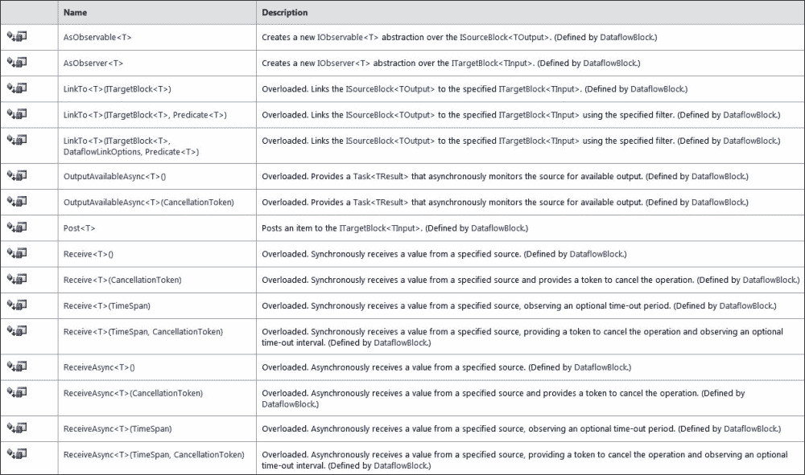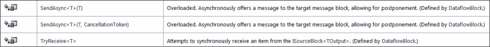

参考自 http://msdn.microsoft.com/en-us/library/hh160414(v=vs.110).aspx

最后，以下是这个类的接口引用：

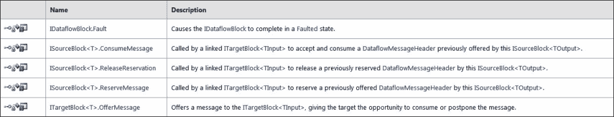

参考自 http://msdn.microsoft.com/en-us/library/hh160414(v=vs.110).aspx

因此，正如您所看到的，这些接口使得在管道的各个阶段之间使用`BufferBlock`对象作为通用队列变得非常容易。这种技术在生产者-消费者设计模式中，生产者和消费者之间也非常有用。

## ActionBlock

`DataFlow`库中的另一个非常有用的对象是`ActionBlock`。其语法是`ActionBlock<TInput>`，其中`TInput`是一个`Action`对象。`ActionBlock`是一个目标块，在接收到数据消息时执行一个委托。以下是一个使用`ActionBlock`的非常简单的示例：

```cs
            ActionBlock<int> action = new ActionBlock<int>(x => Console.WriteLine(x));

            action.Post(10);
```

在这个示例代码片段中，`ActionBlock`对象使用一个整数参数创建，并在将数据消息发布到缓冲区时执行一个简单的 lambda 表达式，该表达式执行`Console.WriteLine`。因此，当执行`action.Post(10)`命令时，整数`10`被发布到`ActionBlock`缓冲区，然后执行`ActionBlock`委托，在这种情况下实现为一个 lambda 表达式。

在这个例子中，由于这是一个目标块，我们随后需要调用`Complete`方法以确保消息块完成。

`BufferBlock`的另一个方便的方法是`LinkTo`方法。此方法允许您将`ISourceBlock`链接到`ITargetBlock`。因此，您可以有一个实现为`ISourceBlock`的`BufferBlock`，并将其链接到`ActionBlock`，因为它是`ITargetBlock`。这样，当`BufferBlock`接收到数据时，可以执行`Action`委托。这不会从消息块中出队数据。它只是允许您在数据被接收进入缓冲区时执行一些任务。

`ActionBlock`只有两个属性，即`InputCount`，它是队列中数据消息数量的计数，以及`Completion`，它获取一个异步操作和消息块完成的任务。它有以下方法：

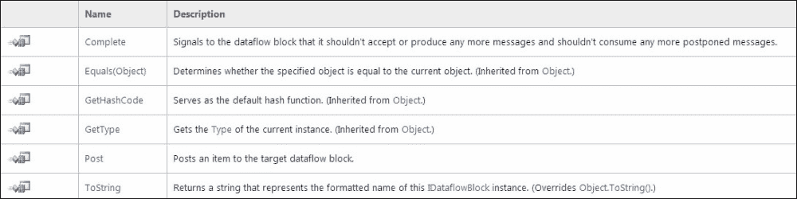

参考自 http://msdn.microsoft.com/en-us/library/hh194684(v=vs.110).aspx

从其接口实现了以下扩展方法：

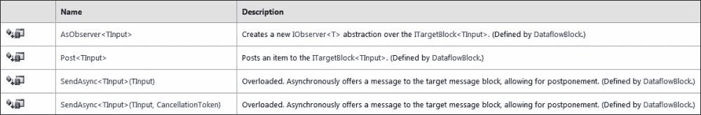

参考自 http://msdn.microsoft.com/en-us/library/hh194684(v=vs.110).aspx

此外，它实现了以下接口：

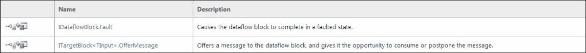

参考自 http://msdn.microsoft.com/en-us/library/hh194684(v=vs.110).aspx

现在我们已经稍微了解了微软开发的`Dataflow`库，让我们在生产者-消费者应用程序中使用它。

# 生产者-消费者设计模式

现在，我们已经介绍了 TPL 的`Dataflow`库以及它提供的对象集合，以帮助在并发任务之间进行异步消息传递，让我们来看看生产者-消费者设计模式。在典型的生产者-消费者设计中，我们有一个或多个生产者将数据放入队列或消息数据块中。然后我们有一个或多个消费者从队列中取出数据并处理它。这允许异步处理数据。使用`Dataflow`库对象，我们可以创建一个消费者任务，该任务监控一个`BufferBlock`，并在数据到达时从中拉取数据项。如果没有可用的项目，消费者方法将阻塞，直到有项目可用或`BufferBlock`被设置为`Complete`。正因为如此，我们可以在任何时间启动我们的消费者，甚至在生产者开始将项目放入队列之前。

然后，我们创建一个或多个任务来产生项目并将它们放入`BufferBlock`中。一旦生产者完成处理所有数据项到`BufferBlock`，它们可以标记块为`Complete`。在此之前，`BufferBlock`对象仍然可用于添加项目。这对于长时间运行的任务和应用程序来说非常完美，因为我们不知道数据何时到达。

因为生产者任务正在实现一个`BufferBlock`的输入参数作为`ITargetBlock`对象，而消费者任务正在实现一个`BufferBlock`的输入参数作为`ISourceBlock`，它们都可以使用同一个`BufferBlock`对象，但它们有不同的方法可用。一个有方法向块中产生项目并标记它完成。另一个有方法接收项目并等待更多项目，直到块被标记为完成。这样，`Dataflow`库实现了作为我们生产者和消费者之间队列的完美对象。

现在，让我们看看我们之前作为管道设计开发的应用程序，并使用`Dataflow`库对其进行修改。我们还将删除一个阶段，使其只有两个阶段，一个生产者和一个消费者。

## 如何做到这一点

我们需要做的第一件事是打开 Visual Studio 并创建一个名为`ProducerConsumerConsoleApp`的新控制台应用程序。我们这次使用控制台应用程序只是为了方便。我们在这里的主要目的是演示如何使用 TPL `Dataflow`库实现生产者-消费者设计模式。

一旦你打开了 Visual Studio 并创建了项目，我们需要执行以下步骤：

1.  首先，我们需要安装并添加对 TPL `Dataflow`库的引用。TPL `Dataflow`库（`System.Threading.Tasks.Dataflow`）不随.NET 4.5 一起提供。从**项目**菜单下选择**管理 NuGet 包**，然后在网络上搜索`Microsoft.Tpl.Dataflow`。

1.  现在，我们需要在我们的程序中添加两个`using`语句。一个用于`StreamReader`和`StreamWriter`，另一个用于`BufferBlock`对象：

    ```cs
    using System.Threading.Tasks.Dataflow;
    using System.IO;
    ```

1.  现在，让我们添加两个静态字符串，它们将指向我们的输入数据文件和输出的加密数据文件：

    ```cs
    private static String PipelineEncryptFile = @"c:\projects\EncryptData.txt";
           private static String PipelineInputFile = @"c:\projects\InputData.txt";
    ```

1.  接下来，让我们添加一个静态方法，它将充当我们的生产者。这个方法将具有以下代码：

    ```cs
            // Our Producer method.
            static void Producer(ITargetBlock<char> Target)
            {
                String DisplayData = "";

                try
                {
                    foreach (char C in GetData(PipelineInputFile))
                    {

                        //Displayed characters read in from the file.
                        DisplayData = DisplayData + C.ToString();

                        // Add each character to the buffer for the next stage.
                        Target.Post(C);

                    }
                }

                finally
                {
                    Target.Complete();
                }

            }
    ```

1.  然后，我们将添加一个静态方法来执行我们的消费者功能。它将具有以下代码：

    ```cs
            // This is our consumer method. IT runs asynchronously.
            static async Task<int> Consumer(ISourceBlock<char> Source)
            {
                String DisplayData = "";

                // Read from the source buffer until the source buffer has no  
                // available output data. 
                while (await Source.OutputAvailableAsync())
                {
                        char C = Source.Receive();

                        //Encrypt each character.
                        char encrypted = Encrypt(C);

                        DisplayData = DisplayData + encrypted.ToString();

                }

                //write the decrypted string to the output file.
                using (StreamWriter outfile =
                            new StreamWriter(PipelineEncryptFile))
                {
                    outfile.Write(DisplayData);
                }

                return DisplayData.Length;
            }
    ```

1.  然后，让我们创建一个简单的静态辅助方法来读取我们的输入数据文件，并将其逐字符放入一个`List`集合中。这将为我们提供生产者使用的字符列表。这个方法中的代码将看起来像这样：

    ```cs
            public static List<char> GetData(String PipelineInputFile)
            {
                List<char> Data = new List<char>();

                //Get the Source data.
                using (StreamReader inputfile = new StreamReader(PipelineInputFile))
                {
                    while (inputfile.Peek() >= 0)
                    {
                        Data.Add((char)inputfile.Read());
                    }

                }

                return Data;
            }
    ```

1.  接下来，我们将添加一个静态方法来加密我们的字符。这个方法将像我们在管道应用程序中使用的那样工作。它将字符的 ASCII 数值加一：

    ```cs
            public static char Encrypt(char C)
            {
                //Take the character, convert to an int, add 1, then convert back to a character.
                int i = (int)C;
                i = i + 1;
                C = Convert.ToChar(i);

                return C;
            }
    ```

1.  然后，我们需要为我们的`Main`方法添加代码。此方法将启动消费者和生产者任务。然后，当它们完成处理时，它将在控制台显示结果。此方法的代码如下所示：

    ```cs
            static void Main(string[] args)
            {
                // Create the buffer block object to use between the producer and consumer. 
                BufferBlock<char> buffer = new BufferBlock<char>();

                // The consumer method runs asynchronously. Start it now.  
                Task<int> consumer = Consumer(buffer);

                // Post source data to the dataflow block.
                Producer(buffer);

                // Wait for the consumer to process all data.
                consumer.Wait();

                // Print the count of characters from the input file.
                Console.WriteLine("Processed {0} bytes from input file.", consumer.Result);

                //Print out the input file to the console.
                Console.WriteLine("\r\n\r\n");
                Console.WriteLine("This is the input data file. \r\n");
                using (StreamReader inputfile = new StreamReader(PipelineInputFile))
                {
                    while (inputfile.Peek() >= 0)
                    {
                        Console.Write((char)inputfile.Read());
                    }

                }

                //Print out the encrypted file to the console.
                Console.WriteLine("\r\n\r\n");
                Console.WriteLine("This is the encrypted data file. \r\n");
                using (StreamReader encryptfile = new StreamReader(PipelineEncryptFile))
                {
                    while (encryptfile.Peek() >= 0)
                    {
                        Console.Write((char)encryptfile.Read());
                    }

                }

                //Wait before closing the application so we can see the results.
                Console.ReadLine();
            }
    ```

1.  这就是所需的全部代码。现在，让我们使用以下输入数据文件构建和运行应用程序：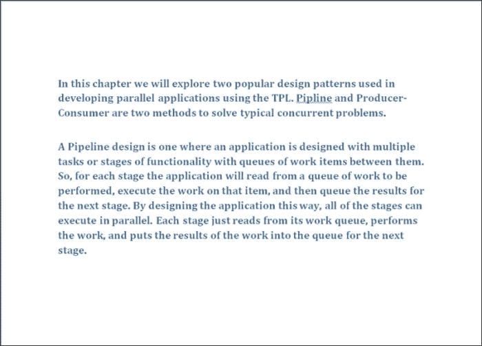

1.  一旦运行并完成，你的输出应该看起来像以下截图：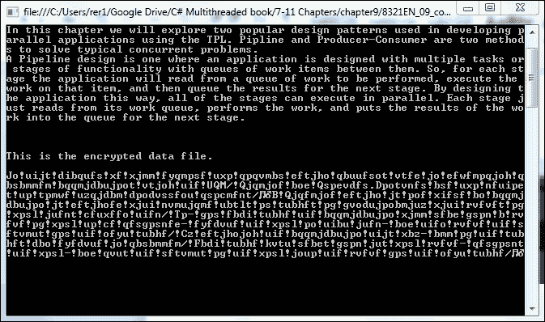

现在，尝试使用你自己的数据文件和输入进行操作。让我们检查发生了什么以及它是如何工作的。

## 它是如何工作的

首先，我们将通过`Main`方法。`Main`首先做的事情是创建一个名为`buffer`的`BufferBlock`对象。这将用作生产者和消费者之间项目的队列。此`BufferBlock`被定义为接受字符数据类型。

接下来，我们使用以下命令开始我们的消费者任务：

```cs
Task<int> consumer = Consumer(buffer);
```

此外，请注意，当此缓冲区对象进入消费者任务时，它被强制转换为`ISourceBlock`。注意我们消费者的方法头：

```cs
static async Task<int> Consumer(ISourceBlock<char> Source)
```

接下来，我们的`Main`方法使用以下命令启动我们的生产者任务：

```cs
Producer(buffer);
```

然后，我们等待消费者任务完成，使用以下命令：

```cs
consumer.Wait();
```

因此，现在我们的`Main`方法只是等待。它目前的工作已经完成。它已经启动了生产者和消费者任务。现在我们的消费者正在等待其`BufferBlock`中出现项目，以便它可以处理它们。消费者将保持在以下循环中，直到消息块中的所有项目都被移除并且块已被*完成*，这是通过有人调用其`Complete`方法来完成的：

```cs
     while (await Source.OutputAvailableAsync())
            {
                    char C = Source.Receive();

                    //Encrypt each character.
                    char encrypted = Encrypt(C);

                    DisplayData = DisplayData + encrypted.ToString();

            }
```

因此，现在我们的消费者任务将异步循环，在项目出现在消息队列时从队列中移除项目。它在 while 循环中使用以下命令来完成此操作：

```cs
await Source.OutputAvailableAsync())
```

同样，其他消费者任务可以同时运行并执行相同的事情。如果生产者添加项目到块的速度比消费者处理它们快，那么添加另一个消费者将提高性能。一旦有项目可用，消费者将调用以下命令从缓冲区获取项目：

```cs
char C = Source.Receive();
```

由于缓冲区包含字符类型的项目，我们将接收到的项目放入字符值中。然后消费者通过加密字符并将其附加到我们的显示字符串中来处理它：

现在，让我们看看消费者。消费者首先通过调用以下命令获取其数据：

```cs
GetData(PipelineInputFile)
```

此方法返回一个包含输入数据文件中每个字符的`List`集合。现在生产者遍历集合，并使用以下命令将每个项目放入缓冲区块：

```cs
Target.Post(C);
```

此外，请注意，在我们的消费者方法头中，我们将缓冲区强制转换为`ITargetBlock`类型：

```cs
static void Producer(ITargetBlock<char> Target)
```

一旦生产者完成处理字符并将它们添加到缓冲区，它将正式使用以下命令关闭`BufferBlock`对象：

```cs
Target.Complete();
```

生产者和消费者的内容到此结束。一旦`Main`方法完成等待消费者完成，它随后使用以下代码来输出处理过的字符数、输入数据和加密数据：

```cs
     // Print the count of characters from the input file.
            Console.WriteLine("Processed {0} bytes from input file.", consumer.Result);

            //Print out the input file to the console.
            Console.WriteLine("\r\n\r\n");
            Console.WriteLine("This is the input data file. \r\n");
            using (StreamReader inputfile = new StreamReader(PipelineInputFile))
            {
                while (inputfile.Peek() >= 0)
                {
                    Console.Write((char)inputfile.Read());
                }

            }

            //Print out the encrypted file to the console.
            Console.WriteLine("\r\n\r\n");
            Console.WriteLine("This is the encrypted data file. \r\n");
            using (StreamReader encryptfile = new StreamReader(PipelineEncryptFile))
            {
                while (encryptfile.Peek() >= 0)
                {
                    Console.Write((char)encryptfile.Read());
                }

            }
```

现在你已经熟悉使用 TPL `Dataflow`库中的对象实现基本的生产者-消费者设计，尝试对这个基本想法进行实验，但使用多个生产者和多个消费者，它们之间都使用同一个`BufferBlock`对象作为队列。

此外，尝试将本章开头提到的原始管道应用程序转换为具有两套生产者和消费者的 TPL `Dataflow`生产者-消费者应用程序。第一套将作为第 1 阶段和第 2 阶段，第二套将作为第 2 阶段和第 3 阶段。因此，实际上第 2 阶段将既是消费者又是生产者。

# 概述

在本章中，我们涵盖了大量的内容。我们学习了管道设计模式和生成者-消费者设计模式的好处以及如何实现它们。正如我们所见，这些都是在构建需要多个异步数据处理任务之间的并行和并发应用程序时非常有用的设计模式。

在管道设计中，我们能够在多个任务或阶段之间并发运行，即使这些阶段依赖于其他阶段处理和输出数据。这对于性能非常有帮助，因为所有功能不需要等待每个阶段完成处理每个数据项。在我们的示例中，我们能够在前一个阶段仍在加密数据并将其放入队列的同时开始解密数据。

在管道示例中，我们探讨了`BlockingCollection`类在充当管道各阶段之间的队列时的优势。

接下来，我们探讨了新的 TPL `Dataflow`库及其一些消息块类。这些类实现了库中定义的几个接口——`ISourceBlock`、`ITargetBlock`和`IPropogatorBlock`。通过实现这些接口，它允许我们编写通用的生产者和消费者任务功能，这些功能可以在各种应用程序中重用。

这两种设计模式和`Dataflow`库都允许以并发方式轻松实现常见功能。你将在许多应用中使用这些技术，当你在评估系统需求并确定如何实现并发以帮助提高性能时，这将成为一个首选的设计模式。就像所有编程一样，当你拥有一个易于使用且你感到舒适的工具箱时，并行编程会变得更加容易。

大多数从并行化中受益的应用程序将有利于某种形式的生成者-消费者或流水线模式。此外，`BlockingCollection`和`Dataflow`消息块对象是协调应用程序中数据之间的一种有用机制，无论使用何种设计模式。熟悉这些消息和队列类将非常有用。

现在，我们将回到下一章的数据并行化，这次，我们将使用 PLINQ 来探索显式数据并行化。
