# 第十章。并行 LINQ – PLINQ

在本章中，我们将学习使用 **Parallel Language Integrated Query**（**PLINQ**）进行声明式数据并行。在 第七章 *数据并行* 中，我们讨论了使用 `Parallel` 库和 `Parallel.For` 以及 `Parallel.ForEach` 循环进行数据并行。PLINQ 是 LINQ to Objects 的并行版本。**LINQ to Objects** 允许对实现 `IEnumerable` 或 `IEnumerable<T>` 接口的内存中数据集合（如 `List` 和 `DataTable`）进行 LINQ 查询。与顺序 LINQ 不同，PLINQ 尝试通过将数据集合划分为段并创建处理每个数据段的任务来使用运行在其上的计算机上的所有处理器。PLINQ 和 **Common Language Runtime**（**CLR**）足够智能，可以评估查询并确定它是否会从多线程执行中受益。如果不，则它将像正常的 LINQ 一样顺序执行。这是两者的最佳结合。.NET 通过并发操作来确定是否可以获得性能改进，并为您做出决定。

在 .NET 4.5 中，并行扩展方法被添加到了 `System.Linq` 命名空间。它包括所有标准 LINQ 操作的扩展方法，以及一些额外的并行操作扩展方法。几乎所有 PLINQ 方法都是在 `System.Linq.ParallelEnumerable` 命名空间中实现的。

本章将涵盖以下主题：

+   执行 PLINQ

+   PLINQ 中的排序

+   PLINQ 中的合并

+   取消 PLINQ

+   理解 PLINQ 的性能改进

# 执行 PLINQ

现在，让我们看看一个基本的 PLINQ 和语法。我们将使用三种不同的方法来执行 PLINQ 并检查结果。第一种方法将使用 `ParallelQuery` 类的 `ForAll` 方法。下一种方法将使用 LINQ 库中的 `AsParallel` 方法对 `Enumerable` 集合进行操作。最后一种方法将使用标准的 LINQ 方法语法。

然后，我们将显示三个查询的结果，并在三个列表框中显示，同时显示每个查询的执行时间。

## 如何操作

让我们从打开 Visual Studio 并创建一个名为 `WpfPLINQQuery` 的新 WPF 应用程序项目开始。一旦该项目打开，让我们执行以下步骤：

1.  在设计模式下打开 `MainWindow.xaml` 文件，添加三个按钮控件，并分别命名为 `btnMethod1`、`btnMethod2` 和 `btnMethod3`。将每个按钮的 `Content` 属性分别设置为 `执行方法 1`、`执行方法 2` 和 `执行方法 3`。接下来，在 `MainWindow.xaml.cs` 文件中为每个按钮创建一个点击事件处理程序，并分别命名为 `btnMethod1_Click`、`btnMethod2_Click` 和 `btnMethod3_Click`。

1.  在 `btnMethod1_Click` 事件处理程序方法中，放置以下代码：

    ```cs
    private void btnMethod1_Click(object sender, RoutedEventArgs e)
            {
                IEnumerable<int> collection1 = Enumerable.Range(10, 500000);

                //Start the timer.
                Stopwatch sw1 = new Stopwatch();
                sw1.Start();

         //Method 1 - This uses a ForAll method and an empty 
         //delegate method.
                ParallelQuery<int> PQ1 = from num in collection1.AsParallel()
                          where num % 5 == 0
                          select num;

                PQ1.ForAll((i) => DoWork(i));

        // Use a standard foreach loop and merge the results.
                foreach (int i in PQ1)
                {
                    lb1.Items.Add(i);
                }

                //Stop the timer.
                sw1.Stop();

                tbTime1.Text = sw1.ElapsedMilliseconds.ToString();

            }
    ```

1.  在 `btnMethod2_Click` 事件处理程序方法中，放置以下代码：

    ```cs
    private void btnMethod2_Click(object sender, RoutedEventArgs e)
            {
                IEnumerable<int> collection2 = Enumerable.Range(10, 500000);

                //Start the timer.
                Stopwatch sw2 = new Stopwatch();
                sw2.Start();

                // Method 2 - Use a standard ToArray method to return //the results.
                int[] PQ2 = (from num in collection2.AsParallel()
                           where num % 10 == 0
                           select num).ToArray();

                // Use a standard foreach loop and merge the results.
                foreach (int i in PQ2)
                {
                    lb2.Items.Add(i);
                }

                //Stop the timer.
                sw2.Stop();

                tbTime2.Text = sw2.ElapsedMilliseconds.ToString();
         }
    ```

1.  在`btnMethod3_Click`事件处理方法中，放置以下代码。同时，让我们添加三个列表框，并分别命名为`lb1`、`lb2`和`lb3`。

    ```cs
    private void btnMethod3_Click(object sender, RoutedEventArgs e)
            {
                IEnumerable<int> collection3 = Enumerable.Range(10, 10000);

                //Start the timer.
                Stopwatch sw3 = new Stopwatch();
                sw3.Start();

                // Method 3 - Use the LINQ standard method format.
                ParallelQuery<int> PQ3 = collection3.AsParallel().Where(n => n % 10 == 0).Select(n => n);

                // Use a standard foreach loop and merge the results.
                foreach (int i in PQ3)
                {
                    lb3.Items.Add(i);
                }

                //Stop the timer.
                sw3.Stop();

                tbTime3.Text = sw3.ElapsedMilliseconds.ToString();

            }
    ```

1.  然后添加三个文本框，并分别命名为`tbTime1`、`tbTime2`和`tbTime3`。同时，清除它们的`Text`属性。

1.  在`MainWindow.xaml.cs`文件中，我们需要添加一个`using`语句，以便`Stopwatch`类对我们可用。因此，在文件顶部添加以下语句，与其他`using`语句一起：

    ```cs
    using System.Diagnostics;
    ```

1.  然后，我们需要添加一个空方法作为 lambda 表达式的委托。我们将称之为`DoWork`。将其添加到`MainWindow`类的底部，以下代码：

    ```cs
    static void DoWork(int i)
            {
            }
    ```

1.  那就是我们需要添加到`MainWindow.xaml.cs`文件中的所有代码。现在，我们的`MainWindow.xaml`文件应该包含以下代码：

    ```cs
    <Window x:Class="WpfPLINQQuery.MainWindow"

            Title="MainWindow" Height="759.12" Width="725.431">

        <Grid>
            <ListBox x:Name="lb1" HorizontalAlignment="Left" Height="557" Margin="38,78,0,0" VerticalAlignment="Top" Width="150"/>
            <ListBox x:Name="lb2" HorizontalAlignment="Left" Height="557" Margin="285,78,0,0" VerticalAlignment="Top" Width="150"/>
            <ListBox x:Name="lb3" HorizontalAlignment="Left" Height="557" Margin="526,78,0,0" VerticalAlignment="Top" Width="150"/>
            <Button x:Name="btnMethod1" Content="Execute Method 1" HorizontalAlignment="Left" Height="43" Margin="38,26,0,0" VerticalAlignment="Top" Width="150" Click="btnMethod1_Click"/>
            <Button x:Name="btnMethod2" Content="Execute Method 2" HorizontalAlignment="Left" Height="43" Margin="285,26,0,0" VerticalAlignment="Top" Width="150" Click="btnMethod2_Click"/>
            <Button x:Name="btnMethod3" Content="Execute Method 3" HorizontalAlignment="Left" Height="43" Margin="526,26,0,0" VerticalAlignment="Top" Width="150" Click="btnMethod3_Click"/>
            <TextBox x:Name="tbTime1" HorizontalAlignment="Left" Height="28" Margin="38,684,0,0" TextWrapping="Wrap" VerticalAlignment="Top" Width="150"/>
            <TextBox x:Name="tbTime2" HorizontalAlignment="Left" Height="28" Margin="285,684,0,0" TextWrapping="Wrap" VerticalAlignment="Top" Width="150"/>
            <TextBox x:Name="tbTime3" HorizontalAlignment="Left" Height="28" Margin="526,684,0,0" TextWrapping="Wrap" VerticalAlignment="Top" Width="150"/>

        </Grid>

    </Window>
    ```

现在我们的项目已经完成。让我们构建并运行项目。程序运行时应该看起来像这样：


现在，让我们点击**执行方法 1**按钮。我们应该看到以下结果：

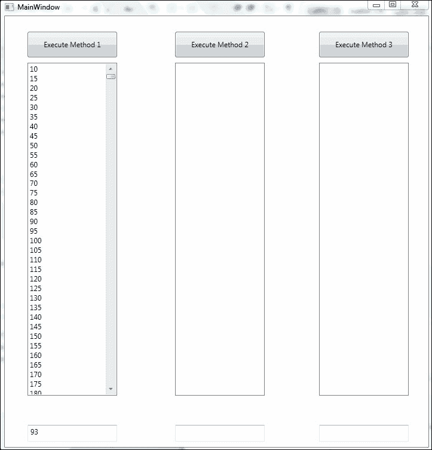

现在，让我们点击下一个两个按钮，**执行方法 2**和**执行方法 3**，看看程序看起来像什么：

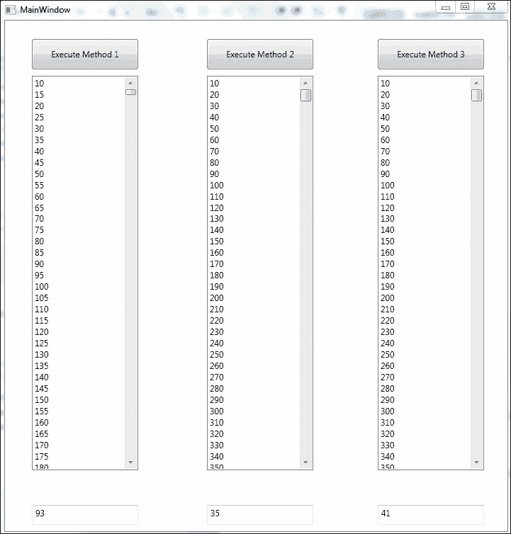

如您所见，我们使用了三种不同的方法执行了 PLINQ 并行查询，每次的结果都不同。如果您浏览结果，首先会注意到列表框中的数字没有排序。接下来您会注意到，每个查询的运行时间并不完全相同。当然，第一个查询将需要更长的时间来显示，因为我们除以 5 而不是 10，所以结果更多。但查询本身应该花费大致相同的时间。您可以通过移动停止`Stopwatch`对象的命令来尝试这个操作。

现在让我们来分析这是如何工作的。

## 工作原理

在这个项目中，我们使用了三种不同的方法执行了 PLINQ 并行查询。在第一种方法中，我们使用此行代码定义了一个`ParallelQuery`对象，但尚未执行：

```cs
ParallelQuery<int> PQ1 = from num in collection1.AsParallel()
                      where num % 5 == 0
                      select num;
```

我们使用以下命令将`AsParallel`方法添加到`IEnumerable`集合中：

```cs
collection1.AsParallel();
```

这告诉.NET 尝试并发执行此查询，如果它确定这将提高性能。我们可以使用并行扩展方法`WithExecutionMode(ParallelExecutionMode.ForceParallelism)`强制.NET 并发执行此查询。

然后，我们实际上使用了`ParallelQuery`类的`ForAll`方法来执行查询。我们使用以下命令来完成：

```cs
PQ1.ForAll((i) => DoWork(i));
```

要使用此命令，我们需要传递一个 lambda 表达式。我们只是使用一个 lambda 表达式，它传递一个委托到执行无操作的方法。我们不需要在委托方法中执行工作，因为我们已经在并行查询中完成了所有工作。

在第二种方法中，我们创建了一个并行查询，它在命令处理时执行并返回一个数组。此命令如下：

```cs
int[] PQ2 = (from num in collection2.AsParallel()
                       where num % 10 == 0
                       select num).ToArray();
```

### 注意

注意，我们在这里已经将 `ToArray()` 方法添加到了查询的结果中。通过这种方式实现并行查询，我们确保查询在执行此命令期间正在执行。在第一个方法中，我们创建了查询，但直到 `ForAll` 命令执行之前不会执行它。

在最终的方法中，我们使用 LINQ 方法语法。以下是使用此语法执行查询的语句：

```cs
ParallelQuery<int> PQ3 = collection3.AsParallel().Where(n => n % 10 == 0).Select(n => n);
```

在这里，我们返回一个 `ParallelQuery` 对象而不是数组。

此外，请注意，在这三种方法中，结果都不是按顺序返回的。我们将在本章后面看到如何确保结果的顺序，如果这是必要的。现在，我们只是在尝试运行一个并行查询。我们将让 .NET 决定如何运行查询（并发或顺序），以及以何种顺序。

# PLINQ 中的排序

现在，如果我们的结果顺序很重要呢？在许多情况下，我们希望结果以特定的顺序返回。让我们看看我们如何实现这一点。

`IEnumerable` 接口的并行扩展方法中包含了几种方法。我们使用最多的两种方法是 `AsOrdered()` 和 `AsOrderedBy()`。这两种方法保证了并行查询结果中的顺序保持。这确实会增加一些成本和开销。

让我们将我们的项目从上一节更新到返回有序结果。

## 如何操作

让我们打开我们的 `PLINQQuery` 项目并做出以下更改：

1.  将 `btnMethod1_Click` 方法中的并行查询语句修改如下，通过向查询中添加 `AsOrdered` 方法：

    ```cs
    ParallelQuery<int> PQ1 = from num in collection1.AsParallel().AsOrdered()
                          where num % 5 == 0
                       select num;
    ```

1.  现在，将 `btnMethod2_Click` 方法中的语句进行类似的修改。使其并行查询语句看起来如下：

    ```cs
    int[] PQ2 = (from num in collection2.AsParallel().AsOrdered()
                           where num % 10 == 0
                       select num).ToArray();
    ```

1.  最后，让我们对 `btn3Method_Click` 方法及其查询语句进行类似的修改：

    ```cs
    ParallelQuery<int> PQ3 = collection3.AsParallel().AsOrdered().Where(n =>           n % 10 == 0).Select(n => n);
    ```

那就是所有的更改；看起来很简单。现在，让我们构建并运行我们的应用程序。你应该得到一个看起来像以下截图的程序。

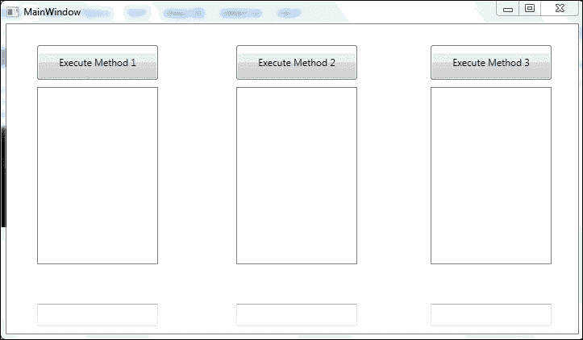

现在，让我们点击这三个按钮中的每一个来运行所有三个查询。你的程序现在应该看起来像以下截图：

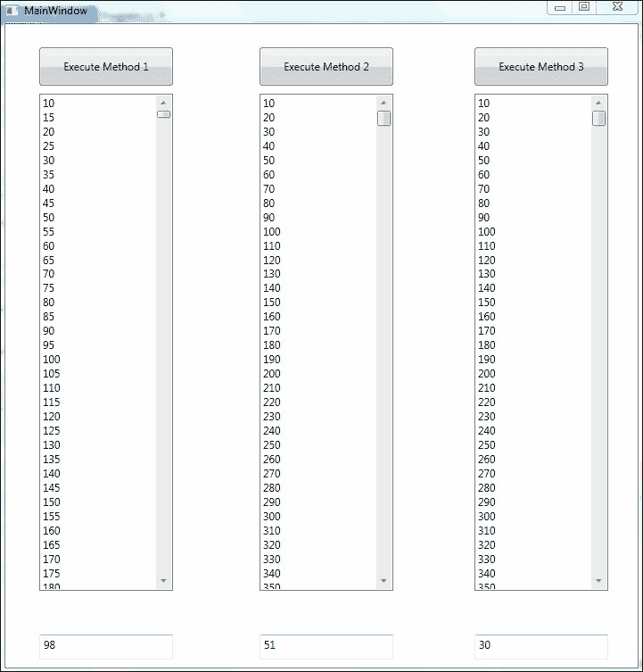

如你所见，结果现在是排序的。这是一个简单的例子；然而，在一个更复杂的例子中，你也会看到运行时间更长。正如你所预期的，排序结果会减慢查询处理速度。

此外，你是否注意到，如果你以不同的顺序在应用程序中执行查询，你通常会看到第一个查询比最后一个查询耗时更长？最后一个运行的查询通常更快有两个解释。.NET 已经运行了查询，因此它也花费了一些时间来确定最佳执行方法。此外，如果它选择并发运行查询，它已经承担了在线程池中创建任务的开销。

## 工作原理

从第一个项目到这个项目的更改很简单。我们只是将 `AsOrdered()` 方法添加到了我们针对 `IEnumerable` 集合执行的并行扩展方法 `AsParallel()` 中。

这迫使 .NET 对结果进行排序。我们还可以使用 `OrderBy` 查询语法对结果进行排序。需要注意的是，`OrderBy` 是顺序执行的，而不是并行执行的。以下截图解释了查询本身中的项目，这些项目将排序结果：

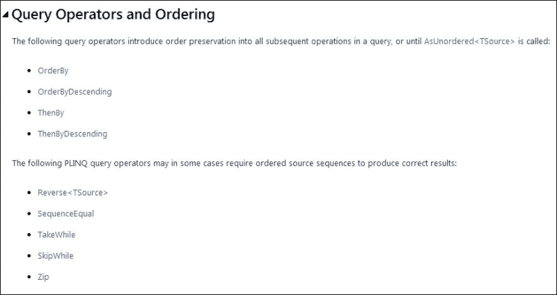

参考自 http://msdn.microsoft.com/en-us/library/dd460677(v=vs.110).aspx

# PLINQ 中的合并

我们已经学习了如何执行并行查询以及如何排序结果。现在，让我们检查我们的并行查询中的合并。

当执行并行查询时，.NET CLR 将源集合分区，以便多个任务可以并发地处理集合的各个部分。一旦完成，结果需要合并到一个结果集合中进行处理。根据使用的查询运算符，结果可以以不同的方式合并。指示结果集合新顺序的查询运算符将在合并之前缓冲来自各个线程的所有项目。其他查询运算符是部分缓冲的，而 `ForAll<TSource>` 查询运算符则不缓冲。它一旦处理完所有任务的所有项目，就会立即生成所有项目。

`WithMergeOptions<TSource>` 方法可以告诉 PLINQ 如何执行并发查询的合并过程。

如果一个查询无法执行指定的合并选项，.NET 将忽略它。因此，你可以看到 .NET 将合并选项视为建议，如果合并选项不兼容，它不会抛出错误；它只会忽略它。同样，如果你没有指定合并选项，.NET 会为你选择一个。因此，如果你确定特定的合并对你的性能最好，你可以使用合并选项，或者让 .NET 为你决定。这是 TPL 的美妙之处之一。它在处理常见的并发问题时为你做了很多思考。

以下截图列出了可以设置并行合并的不同选项：

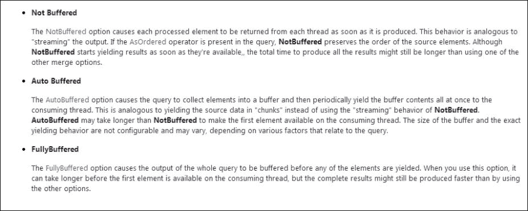

参考自 http://msdn.microsoft.com/en-us/library/dd997424(v=vs.110).aspx

以下支持合并的并行查询运算符：

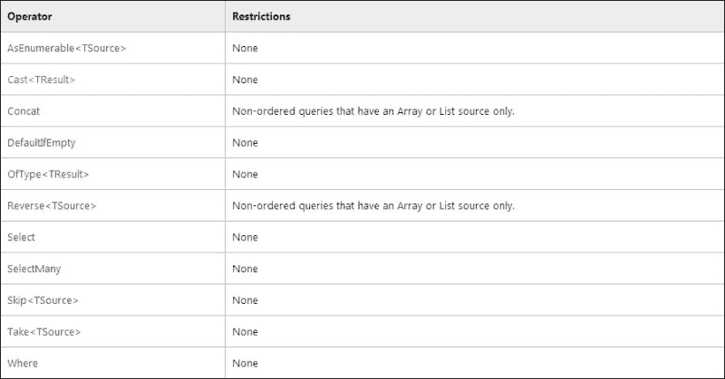

参考自 http://msdn.microsoft.com/en-us/library/dd997424(v=vs.110).aspx

## 如何做

现在，让我们回到我们的项目，尝试更改我们的程序以使用 `NotBuffered`、`AutoBuffered` 和 `FullyBuffered` 合并选项。

要做到这一点，让我们打开我们的 `PLINQQuery` 项目，并将 `btnMethod1_Click` 方法中的并行查询语句更改为以下内容：

```cs
ParallelQuery<int> PQ1 = from num in collection1.AsParallel().AsOrdered().WithMergeOptions(ParallelMergeOptions.NotBuffered)
                where num % 5 == 0
                select num;
```

现在，让我们构建并运行程序，然后单击 **执行方法 1** 按钮。你应该看到以下结果：

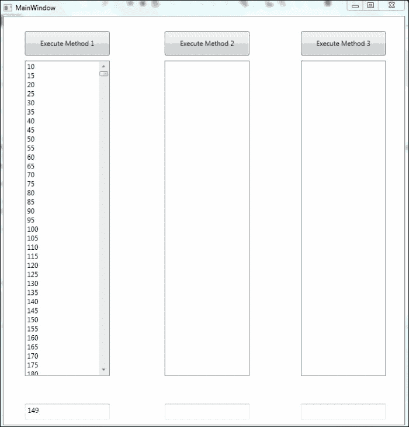

现在，让我们尝试使用`AutoBuffered`方法。为此，在`btnMethod1_Click`方法中，将并行查询语句更改为以下内容：

```cs
ParallelQuery<int> PQ1 = from num in collection1.AsParallel().AsOrdered().WithMergeOptions(ParallelMergeOptions.AutoBuffered)
                      where num % 5 == 0
                      select num;
```

现在再次构建并运行程序。点击**执行方法 1**按钮，你应该得到以下结果：

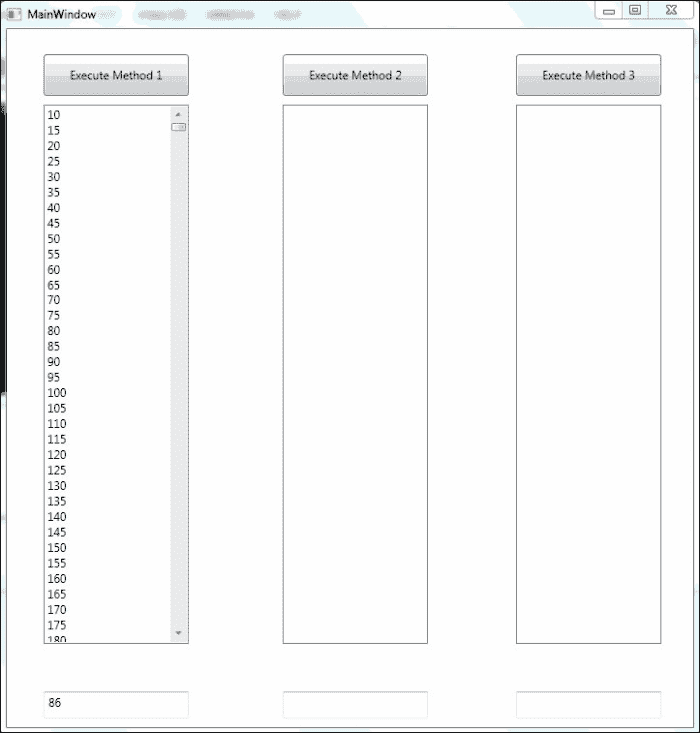

现在，让我们对这个方法中的并行查询进行最后一次更改，以使用`AutoBuffered`选项。将`btnMethod1_click`方法更改为以下并行查询语句：

```cs
ParallelQuery<int> PQ1 = from num in collection1.AsParallel().AsOrdered().WithMergeOptions(ParallelMergeOptions.FullyBuffered)
                      where num % 5 == 0
                      select num;
```

现在，让我们再次构建并运行这个应用程序，并点击**执行方法 1**按钮。结果应该看起来像以下截图：

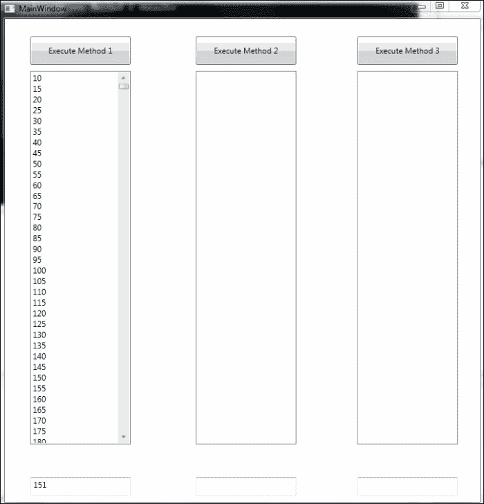

## 工作原理

如您所见，要告诉.NET 如何合并缓冲查询的结果，就像调用`WithMergeOptions()`并行扩展方法一样简单；就像按顺序排序结果一样简单，只需调用`AsOrdered()`并行扩展方法。

但你也会注意到，使用`AutoBuffered`或无合并选项可以获得最佳结果。尽管 PLINQ 提供了这些选项来指定并行查询的合并方式，但如果让.NET 决定如何做，结果通常会更好。

对于复杂示例，可能有益于告诉.NET 如何合并结果，但通常最好是让 CLR 自己决定。这是使用 PLINQ 和 TPL 的好处之一——许多复杂的工作和思考都由你处理。你可以将你的编码时间集中在功能上，而不是性能上。

# 取消 PLINQ

取消并行查询与使用 TPL 取消任务非常相似。首先，我们创建一个取消令牌，然后向取消令牌发出取消请求。这将创建一个操作取消异常。然后，当我们执行并行查询时，添加并行扩展方法`WithCancellation()`，并传递取消令牌。最后，我们捕获操作取消请求并处理它。

.NET 框架不会将单个`OperationCanceledException`传递到`System.AggregateException`中；`OperationCanceledException`必须在单独的`catch`块中处理。

## 如何操作

现在，让我们再次打开我们的`PLINQQuery`项目，这次我们将添加一个取消按钮并处理`btnMethod2_Click`事件处理方法：

1.  首先，将一个新的按钮控件添加到我们的`MainWindow.xaml.cs`文件中，将其`Content`属性设置为`取消`，并将控件命名为`btnCancel`。

1.  接下来，我们需要为`Threading`命名空间添加一个`using`语句，以便我们可以创建一个取消令牌对象。添加以下`using`语句：

    ```cs
          using System.Threading;
    ```

1.  接下来，让我们在`MainWindow`类的顶部创建一个取消令牌，如下所示：

    ```cs
                CancellationTokenSource cs = new CancellationTokenSource();
    ```

1.  现在，让我们为我们的**取消**按钮添加一个`btnCancel_Click`点击事件处理方法。它应该有以下的代码：

    ```cs
             private void btnCancel_Click(object sender, RoutedEventArgs e)
                  {
                         cs.Cancel();
               }
    ```

1.  此外，让我们将我们的 `IEnumerable` 集合更改为包含 500,000 个项目，这样它就会运行得更长，给我们一个取消操作的机会：

    ```cs
                IEnumerable<int> collection1 = Enumerable.Range(10, 500000);
    ```

1.  最后，让我们将 `btnMethod2_Click` 事件处理程序更改为以下代码以执行并行查询：

    ```cs
                try
                      {
                          // Method 2 - Use a standard TOArray method to //return the results.
    PQ2 = (from num in collection2.AsParallel().AsOrdered().WithCancellation(cs.Token)
                                 where num % 10 == 0
                                 select num).ToArray();
                      }
                      catch (OperationCanceledException ex)
                      {
                          lb2.Items.Clear();
                          lb2.Items.Add(ex.Message);
                          return;
                   }
    ```

现在，让我们构建并运行我们的程序。点击 **执行方法 2** 按钮，然后立即点击 **取消** 按钮。你应该会在你的应用程序中看到以下输出：

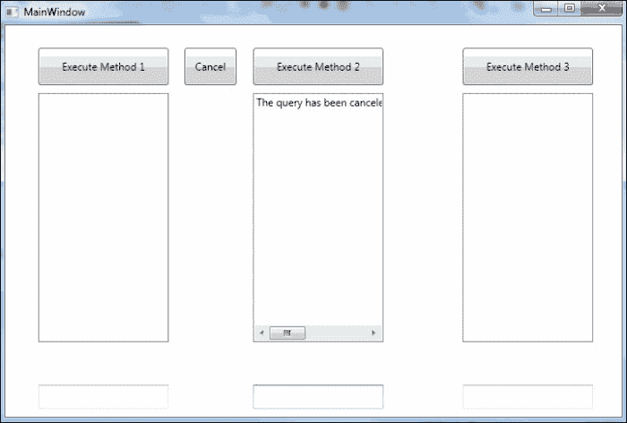

你可以看到我们在查询完成之前已经取消了并行查询。现在，让我们看看它是如何执行的。

## 工作原理

我们非常简单地执行了这项操作。首先，我们创建了一个取消令牌来与这个命令一起使用：

```cs
   CancellationTokenSource cs = new CancellationTokenSource();
```

接下来，我们创建了一个 **取消** 按钮。当它被按下时，我们执行取消令牌对象的 `Cancel()` 方法。这是在这里完成的：

```cs
    private void btnCancel_Click(object sender, RoutedEventArgs e)
        {
            cs.Cancel();
        }
```

最后，在我们的并行查询中，我们添加了 `WithCancellation()` 方法，并将取消令牌传递给它。然后我们添加了一个 `catch` 块来捕获任何 `OperationCanceledException` 异常：

```cs
        try
            {
                // Method 2 - Use a standard TOArray method to return the //results.
                PQ2 = (from num in collection2.AsParallel().AsOrdered().WithCancellation(cs.Token)
                             where num % 10 == 0
                             select num).ToArray();
            }
            catch (OperationCanceledException ex)
            {
                lb2.Items.Clear();
                lb2.Items.Add(ex.Message);
                return;
            }
```

就这些了。

# 理解 PLINQ 性能提升

我们已经看到了如何实现 PLINQ 查询并指定排序、合并和并行执行选项。我们还看到了如何使用 `ForAll()` 方法以及作为 `foreach` 循环来执行 PLINQ。所有这些因素都会影响查询的性能。同时，也很重要地考察了当 .NET 决定并行执行 PLINQ 时，它如何决定对源数据集合进行分区。记住，并行执行的 PLINQ 只是一个 LINQ，其中数据集合被分成组，并为处理每个数据分区的 `Where` 操作创建一个任务。以下图表展示了 LINQ 处理和 PLINQ 处理之间的差异。

以下图表展示了 LINQ 的过程：

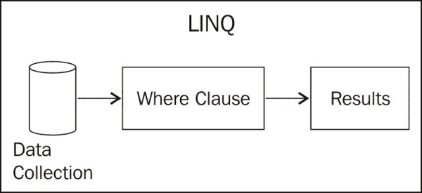

以下图表展示了 PLINQ 的过程。注意数据是如何分区的，以及 `Where` 子句是如何在每个分区上并发执行的：

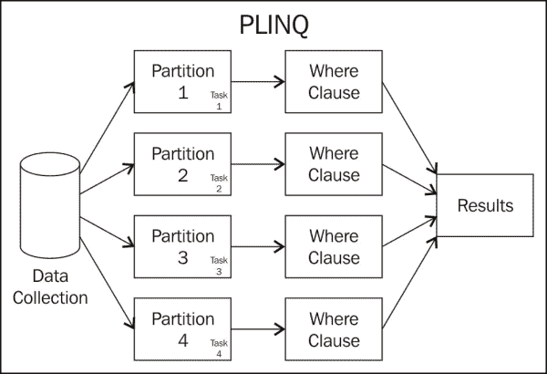

此外，当我们使用 `ForAll` 与 `foreach` 循环执行查询时，处理方式不同。我们可以通过找出结果顺序是否重要来确定哪种方法更好。如果结果顺序很重要，那么 `foreach` 是更好的处理方法，因为结果是在循环处理之后合并的。使用 `ForAll` 循环，整个查询在每个数据分区上单独处理，因此不会在正确的顺序中合并结果。你可以在查询的 `IEnumerable` 集合上放置 `AsOrdered` 方法，但这样它基本上会缓冲所有结果以合并它们，这样你就失去了 `ForAll` 循环带来的性能提升。以下图表展示了这些处理方式之间的差异。

首先，我们将看看`ForAll`处理：

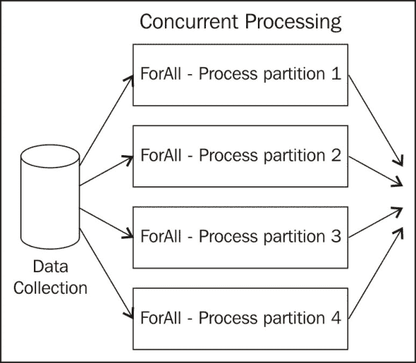

第二，让我们看看`foreach`处理的过程。注意在下面的图中，合并发生在`foreach`循环处理之前，因此`foreach`处理是顺序执行的：

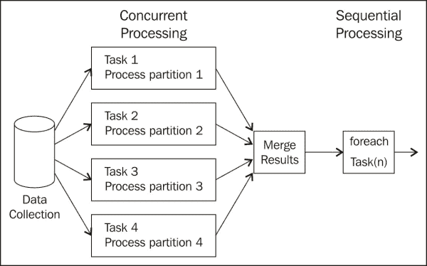

现在，让我们看看 PLINQ（或者更确切地说，.NET CLR）用来将数据集合分区成组以进行并行处理所使用的算法。.NET 使用四种不同的算法根据集合和查询来分区数据。以下屏幕截图详细说明了前两种算法：

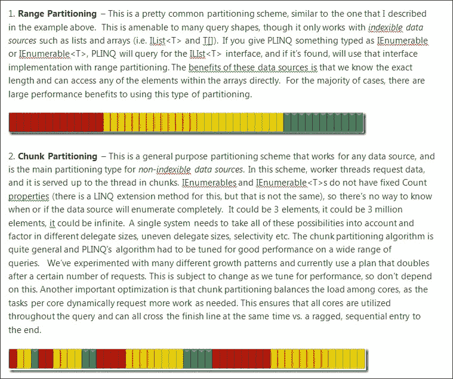

参考自 http://blogs.msdn.com/b/pfxteam/archive/2009/05/28/9648672.aspx

其他两个算法的详细信息如下：

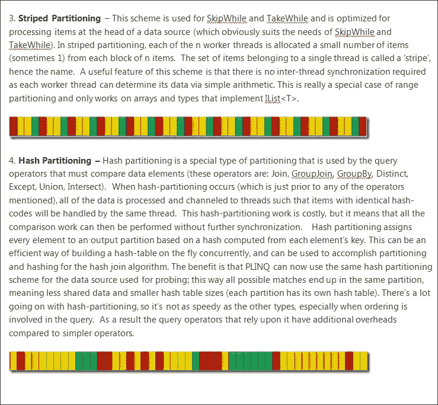

参考自 http://blogs.msdn.com/b/pfxteam/archive/2009/05/28/9648672.aspx

如前一个屏幕截图所示，PLINQ 根据数据类型和查询类型对源数据集合进行分区。这完全是.NET 执行的逻辑，我们不需要做。就像确定查询是否应该并发运行或顺序运行一样，它还确定并发是否是分区数据最佳的方式。

正如我们之前看到的，根据是否需要有序结果，使用`ForAll`或`foreach`语句可以带来更好的性能。

# 摘要

在本章中，你学习了如何将普通的 LINQ to Objects 查询转换为并发 PLINQ。你还学习了如何排序结果、合并结果以及取消查询。PLINQ 使得在支持`IEnumerable`的任何内存数据集合上并发处理查询变得非常容易。

还需要记住的是，PLINQ 只支持 LINQ to Objects，而不支持 LINQ 的其他形式，如 LINQ to SQL 或 LINQ to XML。

PLINQ 的实现与在 LINQ 查询中向源数据集合添加并行扩展方法一样简单——它真的就这么简单。然后.NET 可以确定查询是否通过分区数据集合为多个部分来运行并发查询会有更好的性能，以及如何进行分区。作为程序员，你不需要通过源代码担心任何这些问题。当执行 LINQ 查询时，PLINQ 真的是一件无需费脑力的事情，因为如果.NET 不能通过使查询并发来提高性能，它将只按顺序运行查询。

在下一章中，我们将探讨新的`async`和`await`关键字以及如何轻松实现异步方法。
