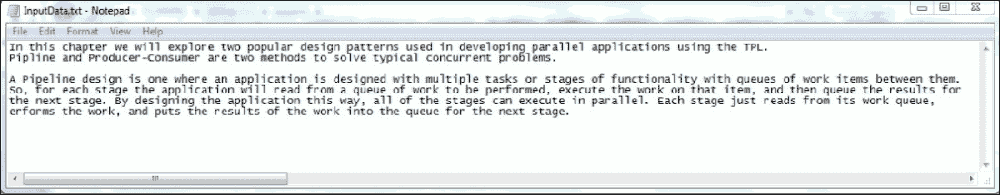
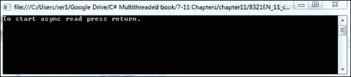
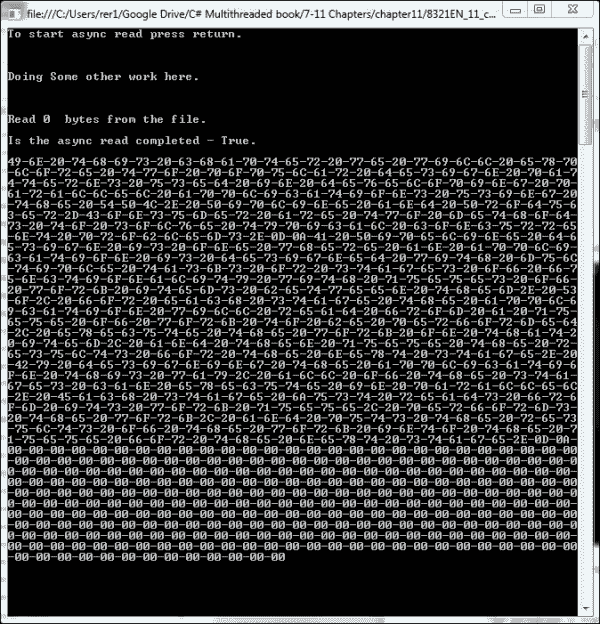
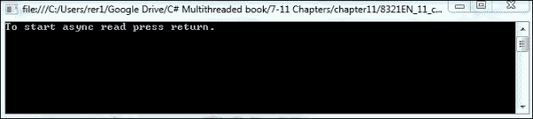
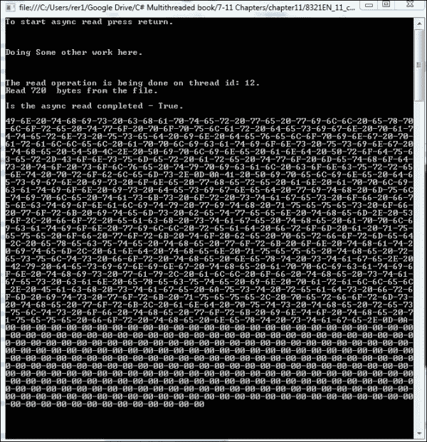
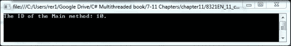
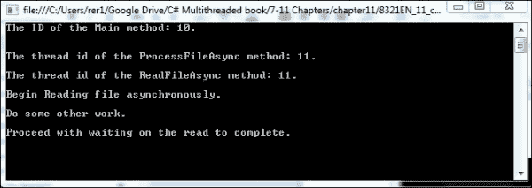
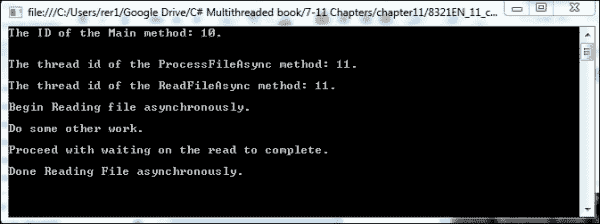
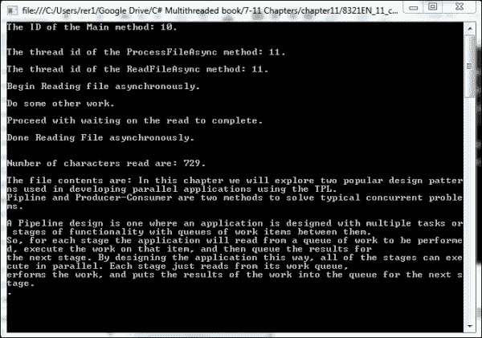

# 第十一章。异步编程模型

在本章中，我们将学习 .NET 4.5 中提供的新的 `async` 和 `await` 关键字，以及 **异步编程模型**（**APM**）。`async` 和 `await` 关键字是 .NET 为开发者提供的一种最新方法，使异步和多线程编程变得简单。这些新关键字使得使用 `BackgroundWorker` 组件变得更加难以证明其合理性。`async` 关键字使得将普通方法转换为在单独线程上运行的异步方法变得无缝。然后你可以在主线程中继续处理。当你准备好等待异步方法的结果时，你可以在主线程中使用 `await` 关键字来阻塞，直到方法返回。

异步编程模型使用 `IAsyncResult` 接口来完成相同类型的设计。在这个设计模式中，你创建一个委托，然后使用该委托的 `BeginInvoke` 和 `EndInvoke` 方法来启动方法并等待其完成。你也可以使用 `BeginInvoke` 方法返回的 `IAsyncResult` 接口来轮询以查看异步方法是否已完成，或者为异步方法设置一个 `wait` 处理程序以完成。

这两种方法为我们提供了实现类似于在 Windows Forms 应用程序和 .NET 早期版本中广泛使用的 `BackgroundWorker` 组件的功能的简单方法。这种功能在桌面应用程序中特别有用，当我们不希望应用程序的主线程被阻塞时。在桌面应用程序设计中，没有什么比用户点击按钮而整个用户界面在某个功能执行时冻结更糟糕的了。

让我们先看看异步编程模型以及如何使用这种设计模式在主线程之外运行一个方法。然后我们将让主线程等待其结果。

在本章中，我们将涵盖以下主题：

+   异步编程模型

+   使用 `AsyncCallback` 委托方法

+   `async` 和 `await` 关键字

# 异步编程模型简介

异步编程模型被 .NET 类用于实现异步设计。一个例子是 `FileStream` 的 `BeginRead` 和 `EndRead` 方法。这允许 `FileStream` 类实现异步文件读取。`StreamReader` 和 `StreamWriter` 类也有异步方法。它们使用 `IAsyncResult` 接口来实现这一功能。在你的自定义类中，你也可以实现这个接口，以便你拥有异步功能。

当使用此接口时，命名约定是在方法名称前加上`Begin`和`End`前缀。所以，你会命名一个`BeginMyMethod`和一个`EndMyMethod`。第一个方法是你要异步执行的方法。第二个方法是在你想要等待`Begin`方法结束并返回结果时调用以阻塞主线程的方法。

现在，让我们看看使用`FileStream`类的`BeginRead`和`EndRead`方法的示例。同样的技术可以使用你自己的类并实现`IAsyncResult`接口来实现。你不需要在方法名称前加上`Begin`和`End`前缀，但遵循命名约定是一种良好的编程实践，这样未来的开发者在使用你的类时可以直观地理解它们的工作方式。

## 如何操作

首先，让我们打开 Visual Studio 并创建一个名为`FileReadAsync`的新控制台项目。然后，让我们执行以下步骤：

1.  为`IO`和`Threading`类添加两个`using`语句，如下所示：

    ```cs
        using System.Threading;
        using System.IO;
    ```

1.  现在，让我们将以下代码添加到`Main`方法中：

    ```cs
    public static void Main()
            {
                byte[] FileData = new byte[1000];

                FileStream FS = new FileStream("c:\\projects\\InputData.txt", FileMode.Open, FileAccess.Read,  FileShare.Read, 1024, FileOptions.Asynchronous);

                Console.WriteLine("To start async read press return.");
                Console.ReadLine();

                IAsyncResult result = FS.BeginRead(FileData, 0, FileData.Length, null, null);

                // Work being done while we wait on the async //read.
                Console.WriteLine("\r\n");
                Console.WriteLine("Doing Some other work here. \r\n");
                Console.WriteLine("\r\n");

                //Calling EndRead will block the main thread //until the async work has finished.
                int num = FS.EndRead(result);

                FS.Close();

                Console.WriteLine("Read {0}  bytes from the file. \r\n", num);
                Console.WriteLine("Is the async read completed - {0}. \r\n", result.IsCompleted.ToString());
                Console.WriteLine(BitConverter.ToString(FileData));

                Console.ReadLine();
       }
    ```

1.  然后，最后，我们需要在`C:\projects`中添加一个名为`InputData.txt`的文件。这将是我们将要异步读取的文件。它可以包含任何你想要的文本；在我们的例子中，`InputData.txt`文件看起来如下截图所示：

现在，让我们构建并运行我们的应用程序。你应该看到一个像这样的屏幕：



程序正在等待用户点击回车按钮；一旦按钮被点击，它将执行数据文件的非阻塞读取。一旦你点击回车，你应该看到以下结果：



如果你再次点击回车键，应用程序将结束并退出。所以，让我们看看它是如何工作的。

## 它是如何工作的

这是一个现有的.NET 类`FileStream`的非常简单的示例，它使用`BeginRead`和`EndRead`这两个方法实现了异步编程模型。如果你查看`BeginRead`方法的方法定义，你会看到它实现了`IAsyncResult`接口：

```cs
public override IAsyncResult BeginRead(
   byte[] array,
   int offset,
   int numBytes,
   AsyncCallback userCallback,
   Object stateObject
)
```

你还可以查看`EndRead`方法的方法定义，如下所示：

```cs
public override int EndRead(
   IAsyncResult asyncResult
)
```

现在，让我们看看你的示例项目。在以下代码行中，我们设置了名为`FS`的`FileStream`对象：

```cs
FileStream FS = new FileStream("c:\\projects\\InputData.txt", FileMode.Open, FileAccess.Read,
            FileShare.Read, 1024, FileOptions.Asynchronous);
```

在这里，我们使用定义文件流、打开模式、读取访问和异步读取选项的参数声明一个新的`FileStream`对象。

然后我们使用以下代码异步启动读取操作：

```cs
            IAsyncResult result = FS.BeginRead(FileData, 0, FileData.Length, null, null);
```

当读取操作在另一个线程上异步进行时，我们进行一些其他工作。这个“其他”工作由以下三个`Console.WriteLine`语句表示：

```cs
            // Work being done while we wait on the async read.
            Console.WriteLine("\r\n");
            Console.WriteLine("Doing Some other work here. \r\n");
            Console.WriteLine("\r\n");
```

现在，我们阻塞主线程，并使用此语句等待异步写入完成：

```cs
            //Calling EndRead will block the main thread until the async work has finished.
            int num = FS.EndRead(result);
```

当读取完成时，此语句将完成并返回`IAsyncResult`对象和读取的字节数。然后我们使用以下语句将这些结果写入控制台：

```cs
            Console.WriteLine("Read {0}  bytes from the file. \r\n", num);
            Console.WriteLine("Is the async read completed - {0}. \r\n", result.IsCompleted.ToString());
```

我们检查`IAsyncResult`的`IsCompleted`方法，以确保读取已完成，尽管我们知道它已经完成，因为我们阻塞等待`EndRead`方法。我们这样做是为了预览异步编程模型的一个设计模式，我们将在本章中不演示——轮询方法。我们不是通过调用`EndRead`方法来阻塞主线程等待`Main`方法完成，而是可以创建一个循环，并定期检查`BeginRead`方法返回的`IAsyncResult`对象的`IsCompleted`属性。如果我们想在读取操作期间显示进度更新，这会很有用。

实现异步编程模型的第三种方法是在读取操作完成后使用委托方法进行处理。

# 使用 AsyncCallback 委托方法

我们已经看到如何使用在`FileStream`类中实现的 APM 设计模式来执行异步读取，然后等待结果。我们还提到过，我们可以轮询以查看异步读取是否已完成，而不是阻塞主线程。现在，我们将看到如何在异步读取完成后执行委托方法。

使用这种方法，我们不需要阻塞主线程等待或执行轮询`IsCompleted`属性的工作来查看读取何时完成。我们只需执行`BeginRead`方法并传递一个委托方法。然后我们继续前进，当读取完成时，委托方法将被执行。

让我们看看`FileStream`类的`BeginRead`方法的方法头。以下是该方法的定义：

```cs
public override IAsyncResult BeginRead(
   byte[] array,
   int offset,
   int numBytes,
   AsyncCallback userCallback,
   Object stateObject
)
```

你会看到传递给此方法的第四个参数是一个`AsyncCallback`委托。在我们之前的例子中，当我们调用此方法时，我们为这个参数传递了一个 null 值。这次让我们使用一个委托方法。

## 如何实现

让我们打开 Visual Studio 并创建一个名为`FileReadAsyncWithDelegate`的新控制台应用程序。一旦创建完成，我们将执行以下步骤：

1.  为`IO`和`Threading`类添加两个`using`语句，如下所示：

    ```cs
              using System.Threading;
              using System.IO;
    ```

1.  接下来，让我们将以下代码添加到我们的应用程序的`Main`方法中：

    ```cs
    public static void Main()
            {

                FileStream FS = new FileStream("c:\\projects\\InputData.txt", FileMode.Open, FileAccess.Read,
                FileShare.Read, 1024, FileOptions.Asynchronous);

                Console.WriteLine("To start async read press return.");
                Console.ReadLine();

                IAsyncResult result = FS.BeginRead(FileData, 0, FileData.Length, ReadComplete, FS);

                // Work being done while we wait on the async //read.
                Console.WriteLine("\r\n");
                Console.WriteLine("Doing Some other work here. \r\n");
                Console.WriteLine("\r\n");

                Console.ReadLine();
            }
    ```

1.  在`Main`方法之前，我们需要声明一个静态字节数组，以便它对`Main`方法和我们的新委托方法都可用。在`Main`方法之前添加以下语句：

    ```cs
             private static byte[] FileData = new byte[1000];
    ```

1.  然后，我们需要添加我们的委托方法。为我们的委托方法添加以下代码：

    ```cs
    private static void ReadComplete(IAsyncResult AResult)
            {
                // Write out the id of the thread that is //performing the read.
                Console.WriteLine("The read operation is being done on thread id: {0}.",
                   Thread.CurrentThread.ManagedThreadId);

                // Get the FileStream out of the IAsyncResult object.
                FileStream FS = (FileStream)AResult.AsyncState;

                // Get the results from the read operation.
                int num = FS.EndRead(AResult);

                // Make sure to close the FileStream.
                FS.Close();

                //Now, write out the results.
                Console.WriteLine("Read {0}  bytes from the file. \r\n", num);
                Console.WriteLine("Is the async read completed - {0}. \r\n", AResult.IsCompleted.ToString());
                Console.WriteLine(BitConverter.ToString(FileData));
           }
    ```

这就是本例中我们需要的所有代码。我们仍然需要在`C:\projects`中保留我们的`InputData.txt`文件。它应该仍然在从上次练习中创建它时存在。

现在，构建并运行应用程序，你应该会看到以下内容：



然后按回车键，应用程序应该显示以下结果：



你会看到结果几乎与之前练习的结果相同。这是真的。但我们实现它们的方式非常不同。这次，我们不是阻塞等待读取操作完成的主线程，而是在一个单独的线程上启动了一个委托方法，并等待读取操作完成，然后显示结果。让我们看看我们是如何做到的。

## 它是如何工作的

首先，让我们看看我们的 `Main` 方法。这次它更加精简，做的工作更少。它本质上只是创建 `FileStream` 对象，调用 `BeginRead` 方法，并传递一个委托方法。就是这样。然后它继续执行其他任务。它不会等待读取操作完成，不会处理结果，也不会关闭 `FileStream` 对象。以下代码展示了这一点：

```cs
        public static void Main()
        {

            FileStream FS = new FileStream("c:\\projects\\InputData.txt", FileMode.Open, FileAccess.Read,
            FileShare.Read, 1024, FileOptions.Asynchronous);

            Console.WriteLine("To start async read press return.");
            Console.ReadLine();

            IAsyncResult result = FS.BeginRead(FileData, 0, FileData.Length, ReadComplete, FS);

            // Work being done while we wait on the async read.
            Console.WriteLine("\r\n");
            Console.WriteLine("Doing Some other work here. \r\n");
            Console.WriteLine("\r\n");

            Console.ReadLine();
        }
```

关键在于以下语句：

```cs
IAsyncResult result = FS.BeginRead(FileData, 0, FileData.Length, ReadComplete, FS);
```

现在，第四个和第五个参数不再是 `null`，我们向这个方法传递一个委托方法和 `FileStream` 对象。这允许 `Main` 方法继续执行其他任务。

现在，让我们看看工作现在正在进行的地方——委托方法，`ReadComplete`：

```cs
        private static void ReadComplete(IAsyncResult AResult)
        {
            // Write out the id of the thread that is performing the read.
            Console.WriteLine("The read operation is being done on thread id: {0}.",
               Thread.CurrentThread.ManagedThreadId);

            // Get the FileStream out of the IAsyncResult object.
            FileStream FS = (FileStream)AResult.AsyncState;

            // Get the results from the read operation.
            int num = FS.EndRead(AResult);

            // Make sure to close the FileStream.
            FS.Close();

            //Now, write out the results.
            Console.WriteLine("Read {0}  bytes from the file. \r\n", num);
            Console.WriteLine("Is the async read completed - {0}. \r\n", AResult.IsCompleted.ToString());
            Console.WriteLine(BitConverter.ToString(FileData));
        }
```

你首先会注意到，`AsyncCallback` 委托定义需要一个不返回任何值且接收一个 `IAsyncResult` 参数作为输入的方法。

我们然后使用以下语句获取 `FileStream` 对象的状态：

```cs
FileStream FS = (FileStream)AResult.AsyncState;
```

然后，我们等待读取操作完成，并使用以下语句获取结果：

```cs
int num = FS.EndRead(AResult);
```

最后，我们使用以下语句处理结果：

```cs
            Console.WriteLine("Read {0}  bytes from the file. \r\n", num);
            Console.WriteLine("Is the async read completed - {0}. \r\n", AResult.IsCompleted.ToString());
            Console.WriteLine(BitConverter.ToString(FileData));
```

这就是全部内容。我们已经在本章的最后两部分中探讨了三种实现 APM 的方法：

+   调用 `Begin` 方法名，执行一些操作，然后使用 `End` 方法名进行阻塞，直到异步操作完成

+   调用 `Begin` 方法名，继续处理，并定期检查 `IAsyncResult` 对象的 `IsCompleted` 属性，以了解异步操作何时完成

+   调用 `Begin` 方法名以启动异步操作，然后在单独的线程上实现一个委托方法，等待异步操作并处理结果

在本章的剩余部分，我们将探讨在 .NET 版本 4.5.1 中引入的新 `async` 和 `await` 关键字。

# 异步和 await 关键字

在.NET 4.5 中，Microsoft 引入了`async`和`await`关键字，这使得开发者在方法中实现异步功能变得非常容易。将`async`关键字添加到方法头中告诉.NET 的 CLR，如果满足以下两个条件，则在该线程池中的单独线程上运行此方法：首先，运行它将提高性能；其次，在方法中使用`await`关键字。`async`方法将返回`void`、`Task`或`Task<TResult>`。此外，命名约定是将使用`async`关键字的任何方法后缀为`Async`。因此，方法名称应该是`MyMethodAsync`。这就是全部内容。实现与 APM 类似，但不使用`IAsyncResult`接口或实现它。

使用此方法的模式是让程序运行一个使用`async`关键字的独立任务中的方法。然后它可以继续执行。如果`async`方法没有返回值，则主线程可以继续执行。如果有主方法关心的返回值或想要知道异步操作何时完成，它可以在异步任务上等待完成并查看结果。在异步任务中，方法将在自己的线程上执行函数，然后在想要等待某些操作完成时调用`await`关键字。

为了演示这两个新关键字的使用，我们将重写我们之前的应用程序，使用`async`和`await`关键字异步读取文件。让我们开始吧。

## 如何操作

首先，让我们打开 Visual Studio 并创建一个名为`FileReadUsingAsync`的新控制台应用程序。一旦我们创建了此项目，请执行以下步骤：

1.  添加两个`using`语句用于`IO`和`Threading`类，如下所示：

    ```cs
              using System.Threading;
              using System.IO;
    ```

1.  接下来，让我们将以下语句添加到`Main`方法中：

    ```cs
    static void Main()
            {
                Console.WriteLine("The ID of the Main method: {0}. \r\n",
                    Thread.CurrentThread.ManagedThreadId);

                //Wait on the user to begin the reading of the //file.
                Console.ReadLine();

                // Create task, start it, and wait for it to //finish.
                Task task = new Task(ProcessFileAsync);
                task.Start();
                task.Wait();

                //Wait for a return before exiting.
                Console.ReadLine();
           }
    ```

1.  接下来，我们将创建`ProcessFileAsync`方法，该方法将在`Main`方法中创建的任务内运行。此方法将实现`async`关键字并异步运行。将以下代码添加到创建此方法：

    ```cs
    static async void ProcessFileAsync()
            {
                // Write out the id of the thread of the task //that will call the async method to read the file.
                Console.WriteLine("The thread id of the ProcessFileAsync method: {0}. \r\n",
                   Thread.CurrentThread.ManagedThreadId);

                // Start the HandleFile method.
                Task<String> task = ReadFileAsync("C:\\projects\\InputData.txt");

                // Perform some other work.
                Console.WriteLine("Do some other work. \r\n");

                Console.WriteLine("Proceed with waiting on the read to complete. \r\n");
                Console.ReadLine();

                // Wait for the task to finish reading the //file.
                String results = await task;
                Console.WriteLine("Number of characters read are: {0}. \r\n", results.Length);

                Console.WriteLine("The file contents are: {0}. \r\n", results);
          }
    ```

1.  现在，此方法将调用另一个`async`方法，该方法实际上会打开文件并读取内容。此方法`ReadFileAsync`将具有以下代码：

    ```cs
    static async Task<String> ReadFileAsync(string file)
            {
                // Write out the id of the thread that is //performing the read.
                Console.WriteLine("The thread id of the ReadFileAsync method: {0}. \r\n",
                   Thread.CurrentThread.ManagedThreadId);

                Console.WriteLine("Begin Reading file asynchronously. \r\n");

                // Read the specified file.
                String DataRead = "";
                using (StreamReader reader = new StreamReader(file))
                {
                    string character = await reader.ReadToEndAsync();

                    //Build string of data read.
                    DataRead = DataRead + character;

                    //Slow down the process.
                    System.Threading.Thread.Sleep(10000);

                }

                Console.WriteLine("Done Reading File asynchronously. \r\n");
                return DataRead;
          }
    ```

这就是全部内容。让我们构建我们的应用程序并运行它。我们应该看到以下输出：



到目前为止，应用程序正在等待我们，因此我们需要按回车键。然后我们将看到以下输出：



现在，我们已经启动了文件的异步读取，执行了一些其他工作，并且正在等待文件读取完成。一旦完成，我们应该看到以下输出：



现在，如果我们再次按下回车键，我们将看到读取操作的结果：



最后，如果我们再按一次回车键，应用程序将完成并退出。那么，这一切是如何工作的呢？

## 工作原理

现在，让我们来看看这个程序是如何工作的。首先，看看 `Main` 方法：

```cs
        static void Main()
        {
            Console.WriteLine("The of ID the Main method: {0}. \r\n",
                Thread.CurrentThread.ManagedThreadId);

            //Wait on the user to begin the reading of the file.
            Console.ReadLine();

            // Create task, start it, and wait for it to finish.
            Task task = new Task(ProcessFileAsync);
            task.Start();
            task.Wait();

            //Wait for a return before exiting.
            Console.ReadLine();
        }
```

这是一个简单的创建一个执行名为 `ProcessFileAsync` 的 `async` 方法的任务的方法。然后它启动这个任务并等待其完成。就是这样。所以，`Main` 方法只是生成一个任务来完成工作。

现在，`async` 方法 `ProcessFileAsync` 是在 `Main` 方法之外的一个单独的线程中执行的。这通过显示线程 ID 号来体现。您会从控制台输出中注意到，`Main` 线程的 ID 与执行 `ProcessFileAsync` 方法的任务的线程 ID 不同。让我们来分析这个方法。以下是我们需要剖析的代码：

```cs
        static async void ProcessFileAsync()
        {
            // Write out the id of the thread of the task that will call the async method to read the file.
            Console.WriteLine("The thread id of the ProcessFileAsync method: {0}. \r\n",
               Thread.CurrentThread.ManagedThreadId);

            // Start the HandleFile method.
            Task<String> task = ReadFileAsync("C:\\projects\\InputData.txt");

            // Perform some other work.
            Console.WriteLine("Do some other work. \r\n");

            Console.WriteLine("Proceed with waiting on the read to complete. \r\n");
            Console.ReadLine();

            // Wait for the task to finish reading the file.
            String results = await task;
            Console.WriteLine("Number of characters read are: {0}. \r\n", results.Length);

            Console.WriteLine("The file contents are: {0}. \r\n", results);
        }
```

这个方法的主要目标是运行 `async` 方法 `ReadFileAsync`。这是通过以下语句实现的：

```cs
Task<String> task = ReadFileAsync("C:\\projects\\InputData.txt");
```

然后，我们使用以下语句等待这个任务：

```cs
String results = await task;
```

前面的语句告诉方法启动一个 `async` 任务并等待其完成。由于它调用的方法返回 `Task<String>` 类型的值，`await task` 语句返回一个字符串值。`ReadFileAsync` 方法接受一个文件名作为输入，然后返回一个包含文件内容的字符串。这个方法在主线程之外的一个单独的线程上异步读取文件。

工作的核心是在 `ReadFileAsync` 方法中完成的。让我们来看看这个方法：

```cs
        static async Task<String> ReadFileAsync(string file)
        {
            // Write out the id of the thread that is performing the read.
            Console.WriteLine("The thread id of the ReadFileAsync method: {0}. \r\n",
               Thread.CurrentThread.ManagedThreadId);

            Console.WriteLine("Begin Reading file asynchronously. \r\n");

            // Read the specified file.
            String DataRead = "";
            using (StreamReader reader = new StreamReader(file))
            {
                string character = await reader.ReadToEndAsync();

                //Build string of data read.
                DataRead = DataRead + character;

                //Slow down the process.
                System.Threading.Thread.Sleep(10000);

            }

            Console.WriteLine("Done Reading File asynchronously. \r\n");
            return DataRead;
        }
```

在这里，我们使用 `async` 关键字来指定这是一个异步方法。这个方法为传入的文件名创建一个 `FileStream`，然后调用 `StreamReader.ReadToEndAsync` 方法以异步方式读取文件。它在这个语句中使用 `await` 关键字来通知 .NET 这是一个异步操作：

```cs
string character = await reader.ReadToEndAsync();
```

通过加入 `wait` 语句来稍微减慢处理速度，您可以看到以下写语句之间的执行延迟：

```cs
            Console.WriteLine("Proceed with waiting on the read to complete. \r\n");
            Console.ReadLine();
Console.WriteLine("Done Reading File asynchronously. \r\n");
```

这允许您看到在单独的线程上读取文件的同时，主线程仍然是可用的。

另一点需要注意的是，通过使用 `async`/`await` 编程方法或 APM 设计模式，我们不必处理启动、停止和管理线程的底层代码。这由 .NET 为我们处理。我们只需编写逻辑并使用适当的设计模式。

这是一个通用的方法，可以轻松实现任何可以提升应用程序性能的异步操作，而无需像我们在生产者-消费者或管道设计模式中所做的那样，为并行性或并发性设计整个应用程序。我们可以简单地编写一个异步运行的任务。

# 摘要

在本章中，你学习了两种非常重要的方法，可以在应用程序的主线程中异步运行特定的功能。这两种方法就是应用程序编程模型和 `async`/`await` 关键字。这两种设计技术允许你利用任务的异步执行，而无需围绕并发设计应用程序。这对于长时间运行的任务或访问外部资源的任务特别有用。这样，在我们等待诸如文件读取、HTTP GET 请求或数据库读取之类的操作时，我们不会阻塞应用程序的主线程。这些都是持续时间超出我们控制且不可预测的任务。因此，以异步方式执行这些类型的函数是有意义的，这样我们应用程序的主线程就可以继续运行。

当我们没有足够的并发功能来设计一个完整的并行应用程序，但有一个可能需要很长时间才能完成的特定任务时，这些技术非常有用。这两个方法的使用方式与 `BackgroundWorker` 组件的使用方式非常相似，并且继续使其过时。

应用程序编程模型是一种设计技术，用于你在创建类时使用。你可以创建两个方法并将它们命名为 `BeginMethodName` 和 `EndMethodName`，以实现 `IAsyncResult` 接口。然后你可以使用它们来启动一个异步操作，如果需要，可以阻塞主线程等待异步操作完成。这种技术在许多 .NET 类中都有使用，例如 `FileStream`、`StreamReader` 和 `StreamWriter`。但也可以在你设计类时使用它。

`async` 和 `await` 关键字是简单地在方法签名中指定它应该作为一个异步操作执行的一种方式。`async` 关键字将方法指定为异步方法，而 `await` 关键字在方法中使用，用于等待一个语句完成，然后方法才完成。这种技术可以在类中实现，也可以在应用程序或辅助类中的静态方法中实现。这两个技术为 .NET 开发者提供了两个额外的工具，以实现并发功能。

在整本书中，我们探讨了在 .NET 中实现并发和异步功能的各种方法。这包括从 .NET 1.0 以来一直存在的技术，以及最新引入的 .NET 4.5 的技术。它们从不允许阻塞主 UI 线程的简单异步方法，到用于设计完整并发应用程序的对象，再到用于并发处理数据集的对象。根据你特定应用程序或任务的需求，.NET 中有许多执行多线程功能的方法和技术。

现在你已经了解了.NET 所能提供的一切，永远不要在开发过程中错过任何机会，通过坚持单线程方法来最大化利用你的计算硬件或其响应性。
