# 第一章：C# 6.0 的新功能

在本章中，我们将介绍以下关于 C# 6.0 新功能的食谱：

+   创建您的 Visual Studio 项目

+   字符串插值

+   空条件运算符

+   自动实现属性和只读自动属性的初始化器

+   索引初始化器

+   `nameof`表达式

+   表达式体函数和属性

+   使用`static`

+   异常过滤器

+   在`catch`和`finally`块中使用`await`运算符

# 简介

C#作为一种编程语言首次出现在 2000 年。其开发团队由杰出的丹麦软件工程师 Anders Hejlsberg 领导。他是 C#的首席架构师和 TypeScript 的核心开发者。C#编程语言易于使用，本书将涉及于 2015 年 7 月 20 日发布的 C# 6.0。

了解 C# 6.0 中可用的新语言功能不仅会使您成为一个更有效的开发者，还允许您在您创建的软件中实施最新的最佳实践。一个鲜为人知的事实是，在 2000 年 7 月微软的**专业开发者大会**上发布之前，C#实际上被称为**C-like Object Oriented Language**（**酷**），但在发布时改名为 C#。

名称可能已经更改，但 C#仍然是一种学习和使用起来非常酷的语言。本章将向您介绍 C# 6.0 的新功能，并说明如何有效地在日常编程任务中使用这些功能。

# 创建您的 Visual Studio 项目

您将创建的 Visual Studio 项目将用于添加包含每个食谱中代码示例的类。该项目将是一个简单的控制台应用程序，它将调用静态类来完成食谱代码的展示，并将结果（如果有）输出到控制台窗口。

## 准备工作

要逐步执行本书中的食谱，您需要一个 Visual Studio 2015 的副本。如果您没有 Visual Studio 2015 的副本，您可以从[`www.visualstudio.com/en-us/products/visual-studio-community-vs.aspx`](https://www.visualstudio.com/en-us/products/visual-studio-community-vs.aspx)下载免费的 Visual Studio 2015 Community 版本。

您也可以通过导航到[`www.visualstudio.com/en-us/products/compare-visual-studio-2015-products-vs.aspx`](https://www.visualstudio.com/en-us/products/compare-visual-studio-2015-products-vs.aspx)来比较 Visual Studio 2015 的版本。

在您下载并安装 Visual Studio 2015 之后，创建一个新的控制台应用程序，该应用程序将包含本书中展示的食谱。

## 如何做…

1.  启动 Visual Studio 2015 并点击**文件**菜单。然后，点击**新建**然后选择**项目**。您也可以使用*Ctrl* + *Shift* + *N*键盘快捷键：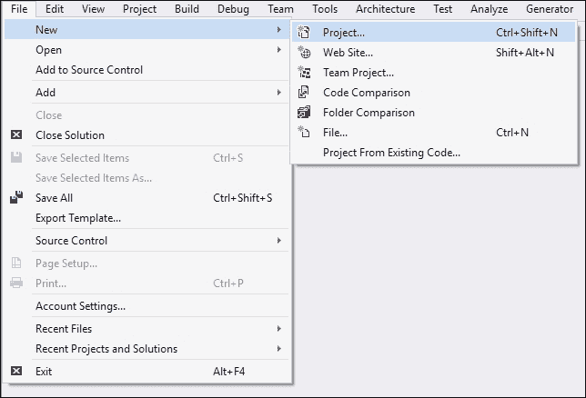

1.  在**新建项目**对话框屏幕上，选择**控制台应用程序**，您可以通过在左侧的树视图中导航到**已安装** | **模板** | **Visual C#** | **Windows** | **经典桌面**来找到它。您可以将您的控制台应用程序命名为`CodeSamples`：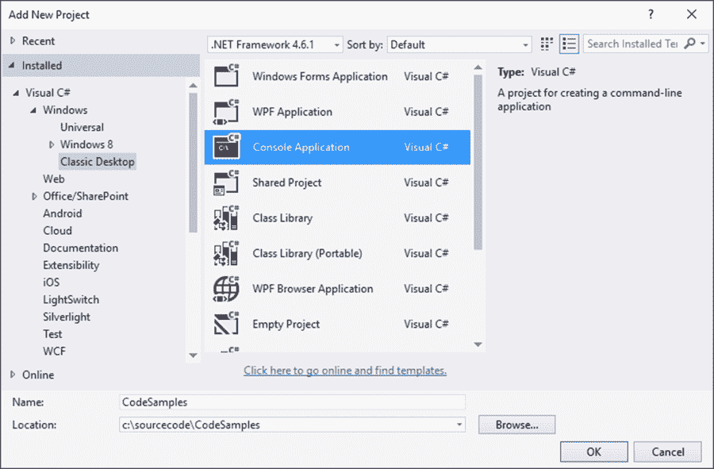

    ### 注意

    您会注意到选定的框架是 **.NET Framework 4.6.1**，这是默认选择的。在创建项目时，请保留此框架的选择。

1.  Visual Studio 现在将创建您的控制台应用程序，我们将使用它来创建本书所需的所有代码示例。

## 它是如何工作的…

此控制台应用程序将构成本书中食谱的基础。每个食谱都可以单独添加到这个控制台应用程序中。因此，一个食谱可以独立运行，无需创建先前的食谱。您还可以轻松地分离您可能想要添加和实验的任何自定义代码。还建议您通过添加自己的类来与代码进行交互。

# 字符串插值

字符串插值是一种非常简单且精确的方法，可以将变量值注入到字符串中。一个插值字符串表达式会查看包含的表达式。然后，它将这些表达式替换为表达式的结果的 `ToString` 表示形式。

## 准备工作

创建一个新的类来测试您的代码。我们将使用读取特定货币当前汇率的示例来说明如何使用字符串插值将字符串输出到用户界面。

## 如何操作…

1.  通过在解决方案上右键单击，选择**添加**，然后从上下文菜单中选择**新建项目**来创建一个新的类：

1.  从**添加新项目**对话框屏幕中选择**类库**从已安装模板，并将您的类命名为 `Chapter1`：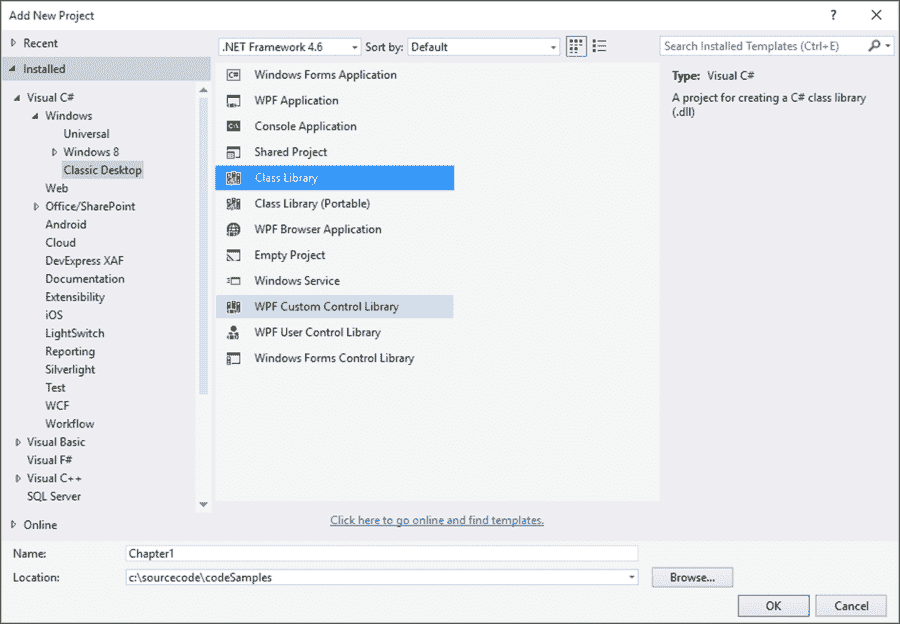

1.  您的新类库将以默认名称 `Class1.cs` 添加到您的解决方案中，我将它重命名为 `Recipes.cs` 以便正确区分代码。但是，如果您觉得这样更有意义，您可以将类重命名为您喜欢的任何名称。

1.  要重命名您的类，只需在**解决方案资源管理器**中单击类名，然后从上下文菜单中选择**重命名**：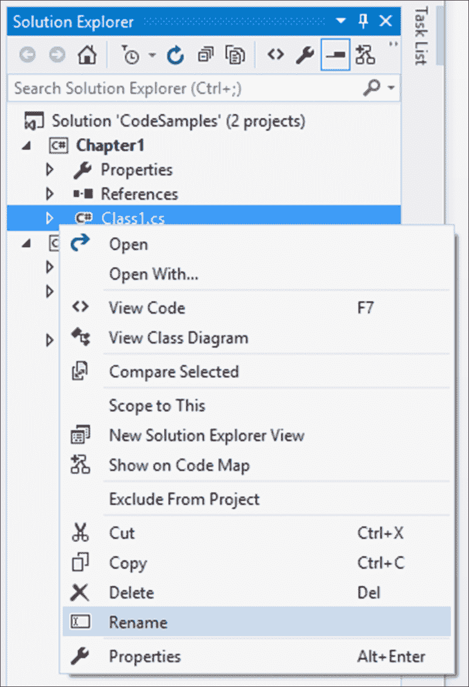

1.  Visual Studio 将要求您确认重命名项目中所有对 **Class1** 代码元素的引用。只需单击**是**：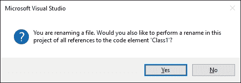

1.  现在创建的类需要使用 `static` 关键字使其成为静态的。同时，将代码中的类名重命名为 `Recipe1StringInterpolation`：

    ```cs
    namespace Chapter1
    {
        public static class Recipe1StringInterpolation
        {

        }
    }
    ```

    ### 注意

    注意，因此静态类不需要实例化，并且默认情况下将是密封类。这意味着它们不能进一步继承。在实践中，你通常会定义辅助或实用类为静态。这些类将经常被你的应用程序使用，例如解析日期或执行计算。这里使用 `static` 关键字只是为了在一个可以轻松快速从控制台应用程序中调用的类中说明 C# 6.0 的特定新功能。实际上，静态类可能不适合所有示例。

1.  在你的类中，添加一个属性来包含基础货币：

    ```cs
    public static string BaseCurrency { get; private set; }
    ```

1.  接下来，包括一个返回汇率的方法：

    ```cs
    private static decimal PreformConversion(string toCurrency)
    {
        decimal rate = 0.0m;

        if (BaseCurrency.Equals("ZAR"))
        {
            switch (toCurrency)
            {
                case "USD":
                    rate = 16.3040m;
                    break;
                default:
                    rate = 1.0m;
                    break;
            }
        }

        return rate;
    }
    ```

1.  最后要添加的方法是返回插值字符串表达式的那个方法：

    ```cs
    public static string ReadExchangeRate(string fromCurrencyCode, string toCurrencyCode)
    {
        BaseCurrency = fromCurrencyCode;
        decimal conversion = PreformConversion(toCurrencyCode);
        return $"1 {toCurrencyCode} = {conversion} {fromCurrencyCode} ";
    }
    ```

1.  现在，你需要将你创建的类连接到你的控制台应用程序。因此，你需要从控制台应用程序中添加对类的引用。在你的 `CodeSamples` 项目中，右键单击 **引用** 并选择 **添加引用…**：

1.  从弹出的 **参考** **管理器** 对话框中选择 `Chapter1` 解决方案以将其添加为参考。然后，点击 **确定** 按钮：

1.  在你的 `CodeSamples` 项目中，双击 `Program.cs` 文件，并将以下代码添加到 `Main` 方法中：

    ```cs
    string RandDollarExchangeRate = Chapter1.Recipe1StringInterpolation.ReadExchangeRate("ZAR", "USD");
    Console.WriteLine("The current Rand / Dollar exchange rate is:");
    Console.WriteLine(RandDollarExchangeRate);
    Console.Read();
    ```

1.  要查看结果，运行你的应用程序并查看控制台应用程序的输出：

1.  插值字符串表达式输出为 `1 USD = 16,3040 ZAR`。

## 它是如何工作的...

控制台应用程序通过调用以下代码行将南非兰特和美元的货币代码传递给静态类：`Chapter1.Recipe1StringInterpolation.ReadExchangeRate("ZAR", "USD");`

这个类是静态的，正如之前提到的，不需要实例化。然后 `ReadExchangeRate` 方法读取汇率并将其格式化为合适的字符串，使用字符串插值。你会注意到插值字符串表达式被写成 `$"1 {toCurrencyCode} = {conversion} {fromCurrencyCode} ";`。

`toCurrencyCode`、`conversion` 和 `fromCurrencyCode` 变量直接在字符串表达式中表示。这是一个格式化字符串的更简单方法，因为你可以不用 `String.Format`（在 C# 的早期版本中使用），同样的表达式将被写成 `String.Format("1 {0} = {1} {2} ", toCurrencyCode, conversion, fromCurrencyCode);`。

如你所见，插值字符串表达式更容易阅读和编写。然而，实际上，字符串插值仅仅是语法糖，因为编译器仍然将表达式视为 `String.Format`。你可能想知道在使用字符串插值时如何表示花括号。为此，你可以在表达式中简单地使用双花括号。如果你需要将汇率表示为 `{16,3040}`，你需要将其表示为 `$"{{{conversion}}}";`。

你也可以在插值字符串表达式中直接格式化字符串。如果你返回 `$"The date is {DateTime.Now}";` 表达式，输出将是 `The date is 2016/01/10 3:04:48 PM`。你可以继续修改表达式，使用冒号后跟的格式来格式化日期。将代码更改为 `$"The date is {DateTime.Now : MMMM dd, yyyy}";`。输出将被格式化，并产生 `The date is January 5, 2016`。

另一个很好的技巧是，你可以在字符串表达式中表达一个条件。考虑以下代码行，它确定一个年份是否是闰年：

```cs
$"The year {DateTime.Now.Year} {(DateTime.IsLeapYear(DateTime.Now.Year) ? " is " : " is not ")} a leap year.";
```

我们可以将三元 `?` 操作符进一步使用。考虑以下代码行：

```cs
$"There {(StudentCount > 1 ? "are " : "is ")}{StudentCount} student{(StudentCount > 1 ? "s" : "")} in the list."
```

由于冒号用于表示格式化，我们必须将表达式的条件部分用括号括起来。字符串插值是表达代码中易于阅读和理解的字符串的一种非常好的方式。

# 空条件操作符

开发者能做的最糟糕的事情就是在代码中不检查 null。这意味着没有对象的引用，换句话说，存在一个 null。引用类型变量有一个默认值 null。另一方面，值类型不能为 null。在 C# 2 中，开发者被引入了可空类型。为了确保对象不是 null，开发者通常编写一些复杂的 `if` 语句来检查对象是否为 null。C# 6.0 通过引入空条件操作符使这个过程变得非常简单。

它通过写入 `?.` 来表示，被称为问号点操作符。问号紧跟在实例之后，在通过点调用属性之前书写。可以这样理解空条件操作符：如果操作符的左侧是 null，整个表达式就是 null。如果左侧不是 null，则调用属性并成为操作的结果。真正看到空条件操作符的强大之处，就是看到它在实际中的应用。

## 准备工作

我们将创建另一个类来展示空条件操作符的使用。该方法将调用 `Student` 类来返回结果列表中的学生数量。在返回学生数量之前，我们将检查 `Student` 类是否有效。

## 如何做到这一点...

1.  在 *创建你的 Visual Studio 项目* 菜单中，在最后一个你编写的类下面创建另一个名为 `Recipe2NullConditionalOperator` 的类：

    ```cs
    public static class Recipe2NullConditionalOperator
    {

    }
    ```

1.  将名为`GetStudents`的方法添加到类中，并向其中添加以下代码：

    ```cs
    public static int GetStudents()
    {
        List<Student> students = new List<Student>(); 
        Student st = new Student();

        st.FirstName = "Dirk";
        st.LastName = "Strauss";
        st.JobTitle = "";
        st.Age = 19;
        st.StudentNumber = "20323742";
        students.Add(st);

        st.FirstName = "Bob";
        st.LastName = "Healey";
        st.JobTitle = "Lab Assistant";
        st.Age = 21;
        st.StudentNumber = "21457896";
        students.Add(st);

        return students?.Count() ?? 0;            
    }
    ```

1.  接下来，向你的代码中添加一个名为`Student`的第三个类，具有以下属性：

    ```cs
    public class Student
    {
        public string StudentNumber { get; set; }
        public string FirstName { get; set; }
        public string LastName { get; set; }
        public int Age { get; set; }
        public string JobTitle { get; set; }
    }
    ```

1.  我们的`Student`类将是我们在`GetStudents`方法中调用的对象。在`Program.cs`文件中，添加以下代码：

    ```cs
    int StudentCount = Chapter1.Recipe2NullConditionalOperator.GetStudents();
                if (StudentCount >= 1)
                    Console.WriteLine($"There {(StudentCount > 1 ? "are " : "is ")}{StudentCount} student{(StudentCount > 1 ? "s" : "")} in the list.");
                else
                    Console.WriteLine($"There were {StudentCount} students contained in the list.");
                Console.Read();
    ```

1.  运行控制台应用程序会导致应用程序告诉我们列表中有两个学生。这是预期的，因为我们向我们的`List<Student>`类中添加了两个`Student`对象：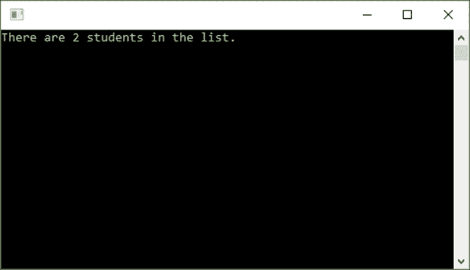

1.  要查看空条件运算符的实际应用，修改你的`GetStudents`方法中的代码，将`students`变量设置为空。你的代码应该看起来像这样：

    ```cs
    public static int GetStudents()
    {
        List<Student> students = new List<Student>(); 
        Student st = new Student();

        st.FirstName = "Dirk";
        st.LastName = "Strauss";
        st.JobTitle = "";
        st.Age = 19;
        st.StudentNumber = "20323742";
        students.Add(st);

        st.FirstName = "Bob";
        st.LastName = "Healey";
        st.JobTitle = "Lab Assistant";
        st.Age = 21;
        st.StudentNumber = "21457896";
        students.Add(st);

        students = null;
        return students?.Count() ?? 0;            
    }
    ```

1.  再次运行控制台应用程序，看看输出是如何变化的：

## 它是如何工作的…

考虑我们在`return`语句中使用的代码：

```cs
return students?.Count() ?? 0;
```

我们告诉编译器检查`List<Student>`类的变量`students`是否为空。我们通过在`students`对象后添加`?`来实现这一点。如果`students`对象不为空，我们使用点运算符，`Count()`属性成为语句的结果。

如果`students`对象为空，则返回零。这种方式检查空值使得所有`if(students != null)`代码都变得不必要。空值检查似乎淡入背景，使得表达和阅读空值检查变得更容易（更不用说代码更少了）。

如果我们必须将`return`语句更改为没有空条件运算符的常规`Count()`方法，我们会看到一个`ArgumentNullException was unhandled`错误：

```cs
return students.Count();
```

在`students`对象上调用`Count()`而不使用空条件运算符会破坏代码。空条件运算符是 C#语言的激动人心的补充，因为它使得编写检查空值的代码变得更加容易。代码越少，代码质量越好。

# 自动实现的属性和只读自动属性的初始化器

C# 6.0 的发布为自动实现的属性带来了两项增强。你现在可以内联初始化自动实现的属性，也可以定义它们而不需要设置器。

## 准备工作

为了说明如何实现这两个新的自动实现属性增强，我们将创建另一个类，该类计算给定条形码和折扣类型的折扣后的销售价格。

## 如何做到这一点…

1.  首先，创建一个名为`Recipe3AutoImplementedProperties`的静态类，并将`DiscountType`枚举器添加到该类中，以及自动实现的属性。然后，将这些自动实现的属性初始化为默认值：

    ```cs
    public static class Recipe3AutoImplementedProperties
    {
        public enum DiscountType { Sale, Clearout, None }
        private static int SaleDiscountPercent { get; } = 20;
        private static int ClearoutDiscountPercent { get; } = 35;
        public static decimal ShelfPrice { get; set; } = 100;
        public static decimal SalePrice { get; set; } = 100;
    }
    ```

1.  下一步是添加一个方法来计算与提供给方法的条形码相关联的商品的销售价格：

    ```cs
    public static void CalculateSalePrice(string barCode, DiscountType discount)
    {
      decimal shelfPrice = GetPriceFromBarcode(barCode);

      if (discount == DiscountType.Sale)
        SalePrice = (shelfPrice == 0 ? ShelfPrice.CalculateSalePrice(SaleDiscountPercent) : shelfPrice.CalculateSalePrice(SaleDiscountPercent));

      if (discount == DiscountType.Clearout)
       SalePrice = (shelfPrice == 0 ? ShelfPrice.CalculateSalePrice(ClearoutDiscountPercent): shelfPrice.CalculateSalePrice(ClearoutDiscountPercent));

      if (discount == DiscountType.None)
        SalePrice = (shelfPrice == 0 ? ShelfPrice :shelfPrice);
    }
    ```

1.  为了模拟数据库查找以找到条形码的销售价格，创建另一个方法来返回给定条形码的价格：

    ```cs
    private static decimal GetPriceFromBarcode(string barCode)
    {            
        switch (barCode)
        {
            case "123450":
                return 19.95m;                    
            case "123451":
                return 7.55m;
            case "123452":
                return 59.99m;
            case "123453":
                return 93.99m;
            default:
                return 0;
        }
    }
    ```

1.  最后，我们将创建一个扩展方法类来计算折扣后适用的销售价格：

    ```cs
    public static class ExtensionMethods
    {
        public static decimal CalculateSalePrice(this decimal shelfPrice, int discountPercent)
        {
            decimal discountValue = (shelfPrice / 100) * discountPercent;
            return shelfPrice - discountValue;
        }
    }
    ```

    ### 注意

    扩展方法默认是静态方法，允许你扩展你代码的功能（扩展现有类型）而无需修改原始类型。你现在可以在你的解决方案中有一个扩展方法类，在那里你可以添加有用的代码。使用扩展方法的一个好例子是计算给定日期的财政年度。扩展方法与其他静态方法的不同之处在于方法签名中使用 `this` 关键字。在前面的例子中，编译器通过查看它扩展的类型知道这是一个为 decimal 类提供的扩展方法。

1.  替换你的 `Program.cs` 文件中的代码并运行程序：

    ```cs
    string BarCode = String.Empty;

    BarCode = "123450";
    Chapter1.Recipe3AutoImplementedProperties.CalculateSalePric e(BarCode, Chapter1.Recipe3AutoImplementedProperties.DiscountType.Sale );
    Console.WriteLine(Chapter1.Recipe3AutoImplementedProperties .SalePrice);
    ```

1.  在应用折扣后，销售价格被计算并返回到控制台应用程序：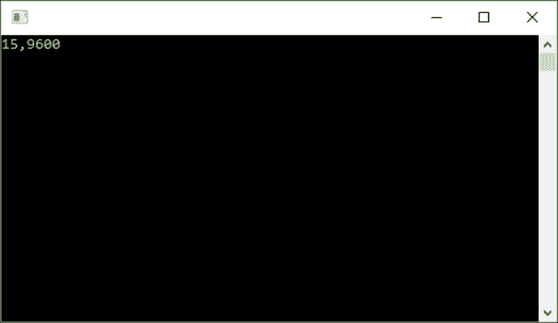

## 它是如何工作的…

如果你再次查看自动实现的属性，你会注意到我们有两个只读自动实现的属性。所有四个自动实现的属性都已使用默认值初始化。`SaleDiscountPercent` 和 `ClearoutDiscountPercent` 属性是只读的。这确保了折扣值不能以任何方式修改。

你还会注意到，如果从 `GetPriceFromBarcode` 方法返回的货架价格是零，那么在确定折扣价格时将使用默认的 `ShelfPrice` 属性值。如果没有应用折扣，`CalculateSalePrice` 方法将直接返回条形码价格。如果没有从条形码中确定价格，则返回默认的 `ShelfPrice` 属性值。

自动实现的属性初始化器和只读自动实现的属性可以大大减少不必要的 `if` `else` 语句。它还使实现属性的代码更易于阅读，因为意图可以通过初始化属性本身来包含。

看看如果我们尝试将 `SaleDiscountPercent` 或 `ClearoutDiscountPercent` 属性设置为不同的值会发生什么：


Visual Studio 将为只读属性发出错误，因为我们只能使用 `get` 关键字从这个属性中读取，而不能为其赋值。

# 索引初始化器

你需要记住，C# 6.0 并没有引入大的新概念，而是引入了一些旨在使你的代码更简洁、更易于阅读和理解的小特性。使用索引初始化器，这也不例外。你现在可以初始化新创建对象的索引。这意味着你不需要使用单独的语句来初始化索引。

## 准备工作

这里的变化很微妙。我们将创建一个方法来根据整数返回星期几。我们还将创建一个方法来返回财务年度的开始月份和薪资增长月份，然后设置薪资增长月份为一个不同于默认值的值。最后，我们将使用属性将特定类型的物种返回到控制台窗口。

## 如何操作…

1.  首先，创建一个名为 `Recipe4IndexInitializers` 的新类，并将第二个名为 `Month` 的类添加到您的代码中。`Month` 类仅包含两个已初始化的自动实现属性。`StartFinancialYearMonth` 已设置为二月（2 月），而 `SalaryIncreaseMonth` 已设置为三月（3 月）：

    ```cs
    public static class Recipe4IndexInitializers
    {

    }

    public class Month
    {
        public int StartFinancialYearMonth { get; set; } = 2;
        public int SalaryIncreaseMonth { get; set; } = 3;
    }
    ```

1.  继续添加一个名为 `ReturnWeekDay` 的方法，该方法接受一个整数作为参数，用于表示天数，到 `Recipe4IndexInitializers` 类中：

    ```cs
    public static string ReturnWeekDay(int dayNumber)
    {
        Dictionary<int, string> day = new Dictionary<int, string>
        {
            [1] = "Monday",
            [2] = "Tuesday",
            [3] = "Wednesday",
            [4] = "Thursday",
            [5] = "Friday",
            [6] = "Saturday",
            [7] = "Sunday"
        };

        return day[dayNumber];
    }
    ```

1.  对于第二个示例，将一个名为 `ReturnFinancialAndBonusMonth` 的方法添加到 `Recipe4IndexInitializers` 类中：

    ```cs
    public static List<int> ReturnFinancialAndBonusMonth()
    {
        Month currentMonth = new Month();
        int[] array = new[] { currentMonth.StartFinancialYearMonth, currentMonth.SalaryIncreaseMonth };
        return new List<int>(array) { [1] = 2 };  
    }
    ```

1.  最后，向类中添加几个自动实现的属性以包含物种，并在 `Recipe4IndexInitializers` 类中添加一个名为 `DetermineSpecies` 的方法。您的代码应如下所示：

    ```cs
    public static string Human { get; set; } = "Homo sapiens";
    public static string Sloth { get; set; } = "Choloepus hoffmanni";
    public static string Rabbit { get; set; } = "Oryctolagus cuniculus";
    public static string Mouse { get; set; } = "Mus musculus";
    public static string Hedgehog { get; set; } = "Erinaceus europaeus";
    public static string Dolphin { get; set; } = "Tursiops truncatus";
    public static string Dog { get; set; } = "Canis lupus familiaris";

    public static void DetermineSpecies()
    {
        Dictionary<string, string> Species =  new Dictionary<string, string>
        {
            [Human] = Human + " : Additional species information",
            [Rabbit] = Rabbit + " : Additional species information",
            [Sloth] = Sloth + " : Additional species information",
            [Mouse] = Mouse + " : Additional species information",
            [Hedgehog] = Hedgehog + " : Additional species information",
            [Dolphin] = Dolphin + " : Additional species information",
            [Dog] = Dog + " : Additional species information"
        };

        Console.WriteLine(Species[Human]);            
    }
    ```

1.  在您的控制台应用程序中，添加以下代码以调用 `Recipe4IndexInitializers` 类中的代码：

    ```cs
    int DayNumber = 3;
    string DayOfWeek = Chapter1.Recipe4IndexInitializers.ReturnWeekDay(DayNumber);
    Console.WriteLine($"Day {DayNumber} is {DayOfWeek}");

    List<int> FinancialAndBonusMonth = Chapter1.Recipe4IndexInitializers.ReturnFinancialAndBonusMo nth();
    Console.WriteLine("Financial Year Start month and Salary Increase Months are:");
    for (int i = 0; i < FinancialAndBonusMonth.Count(); i++)
    {
        Console.Write(i == 0 ? FinancialAndBonusMonth[i].ToString() + " and " : FinancialAndBonusMonth[i].ToString());
    }

    Console.WriteLine();
    Chapter1.Recipe4IndexInitializers.DetermineSpecies();
    Console.Read();
    ```

1.  一旦添加了所有代码，运行你的应用程序。输出将如下所示：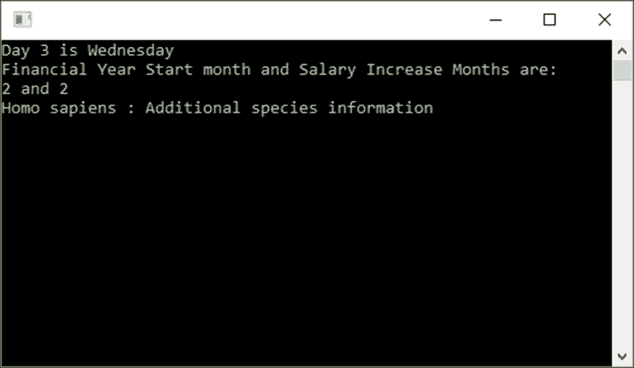

## 它是如何工作的…

第一个方法 `ReturnWeekDay` 创建了一个 `Dictionary<int, string>` 对象。您可以看到索引是如何用星期名称初始化的。如果我们现在将天数整数传递给该方法，我们可以通过引用索引来返回星期名称。

### 注意

在 `ReturnWeekDay` 中不使用零基索引的原因是因为一周的第一天与数值 1 相关联。

在第二个示例中，我们调用了一个名为 `ReturnFinancialAndBonusMonth` 的方法，该方法创建一个数组来存储财务年度开始月份和薪资增长月份。`Month` 类的两个属性分别初始化为 `2` 和 `3`。您可以看到，我们正在覆盖 `SalaryIncreaseMonth` 属性的值并将其设置为 `2`。这是在以下代码行中完成的：

```cs
return new List<int>(array) { [1] = 2 };
```

最后一个示例使用 `Human`、`Rabbit`、`Sloth`、`Mouse`、`Hedgehog`、`Dolphin` 和 `Dog` 属性来返回 `Species` 对象的正确索引值。

# `nameof` 表达式

`nameof` 表达式特别有用。现在您可以为代码中命名的对象提供一个字符串。如果您正在抛出异常，这尤其方便。现在您可以看到哪个变量引发了异常。在过去，开发者必须依赖于代码中的混乱字符串字面量。这特别容易出错，并且容易受到拼写错误的影响。另一个问题是，任何代码重构都可能错过一个字符串字面量，然后该代码就变得过时并损坏。

`nameof` 表达式已经拯救了我们的困境。编译器会看到你正在引用特定变量的名称，并将其正确地转换为字符串。因此，`nameof` 表达式也与任何你可能进行的重构保持同步。

## 准备工作

我们将使用本章中 *字符串插值* 菜单中编写的相同代码示例，并进行一些小的修改。我们将创建一个 `Student` 对象并向其中添加学生。然后，我们将该对象返回到控制台并输出学生数量。

## 如何操作…

1.  创建一个名为 `Recipe5NameofExpression` 的类。向该类添加一个名为 `StudentCount` 的自动实现属性：

    ```cs
    public static class Recipe5NameofExpression
    {
        public static int StudentCount { get; set; } = 0;
    }
    ```

1.  接下来，我们需要添加一个名为 `GetStudents` 的方法，该方法返回一个 `List<Student>` 对象。该方法包含一个 `try`/`catch` 语句，并将抛出 `ArgumentNullException()`：

    ```cs
    public static List<Student> GetStudents()
    {
        List<Student> students = new List<Student>();
        try
        {                
            Student st = new Student();

            st.FirstName = "Dirk";
            st.LastName = "Strauss";
            st.JobTitle = "";
            st.Age = 19;
            st.StudentNumber = "20323742";
            students.Add(st);

            st.FirstName = "Bob";
            st.LastName = "Healey";
            st.JobTitle = "Lab Assistant";
            st.Age = 21;
            st.StudentNumber = "21457896";
            students.Add(st);

            //students = null;

            StudentCount = students.Count();

            return students;
        }
        catch (Exception ex)
        {
            throw new ArgumentNullException(nameof(students));
        }
    }
    ```

    ### 注意

    实际上，我们不会立即简单地返回 `ArgumentNullException`。这只是为了说明在 `ArgumentNullException` 中使用 `nameof` 表达式的概念。

1.  在控制台应用程序中，我们将添加代码以返回 `List<Student>` 对象，并通过将 `StudentCount` 属性值输出到控制台窗口来报告列表中包含的学生数量：

    ```cs
    try
    {
        List<Chapter1.Student> StudentList = Chapter1.Recipe5NameofExpression.GetStudents();
        Console.WriteLine($"There are {Chapter1.Recipe5NameofExpression.StudentCount} students");                
    }
    catch (Exception ex)
    {
        Console.WriteLine(ex.Message);
    }
    finally
    {
        Console.Read();
    }
    ```

## 工作原理…

以当前代码运行控制台应用程序将调用 `GetStudents()` 方法。这将创建一个 `List<Student>` 对象，并向其中添加两个 `Student` 对象。`StudentCount` 属性设置为 `List<Student>` 对象的计数。然后 `GetStudents()` 方法将结果返回到控制台应用程序，该应用程序读取 `StudentCount` 属性并在控制台输出中显示它：


如果我们现在修改 `GetStudents()` 方法中的代码，在调用 `students.Count()` 之前将 `students` 变量设置为 `null`，将会抛出异常。异常在 `catch` 中被捕获，这就是我们使用 `nameof` 表达式来显示 `students` 变量的字符串字面量的地方：

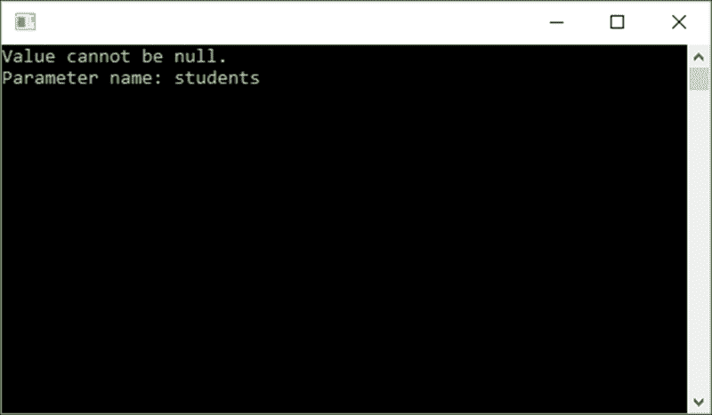

使用 `nameof` 表达式，我们可以确保表达式与重构操作（如重命名 `students` 变量）保持同步：

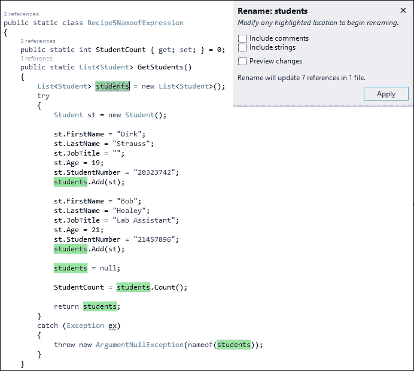

如果我们在 `catch` 语句中使用字符串字面量编写代码，那么当我们重命名 `students` 变量时，代码不会自动更新。`nameof` 表达式有效地允许开发者停止编写 `throw new ArgumentNullException("students");`，这将不会受到重构操作的影响。

在你的代码中使用 `nameof` 表达式的好处之一是它不涉及任何运行时成本，因为包含字符串字面量的代码是在编译时生成的。

稍微修改控制台应用程序中的代码，使其看起来像这样：

```cs
List<Chapter1.Student> StudentList = Chapter1.Recipe5NameofExpression.GetStudents();

int iStudentCount = Chapter1.Recipe5NameofExpression.StudentCount;
Console.WriteLine($"The value of the { nameof(Chapter1.Recipe5NameofExpression.StudentCount)} property is {iStudentCount}");
```

当你现在运行你的控制台应用程序时，你可以看到已经使用了 `nameof` 表达式来创建 `StudentCount` 属性的字符串字面量：

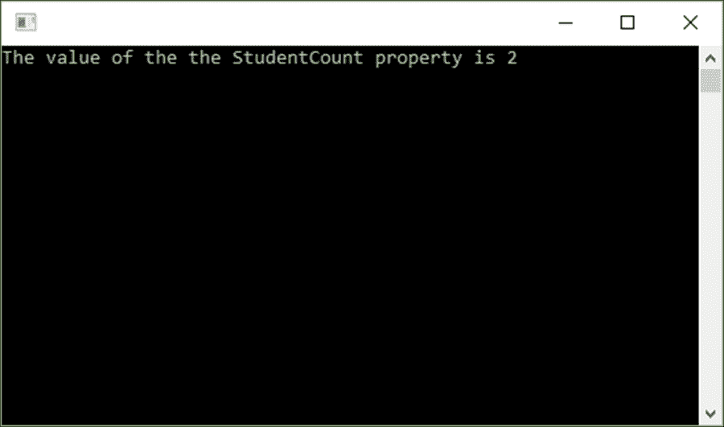

### 注意

确保你在 `GetStudents()` 方法中注释掉了 `students = null;` 这行代码；否则，你仍然会收到空异常。

你还可以使用 `nameof` 表达式与枚举一起使用。将以下代码添加到你的类中。我们基本上创建了一个名为 `Course` 的枚举。在 `SetCourse()` 方法中，我们根据课程 ID 设置一个课程：

```cs
public enum Course { InformationTechnology = 1, Statistics = 2, AppliedSciences = 3 }
public static string SelectedCourse { get; set; }
public static void SetCourse(int iCourseID)
{
    Course course = (Course)iCourseID;
    switch (course)
    {
        case Course.InformationTechnology:
            SelectedCourse = nameof(Course.InformationTechnology);
            break;
        case Course.Statistics:
            SelectedCourse = nameof(Course.InformationTechnology);
            break;
        case Course.AppliedSciences:
            SelectedCourse = nameof(Course.InformationTechnology);
            break;
        default:
            SelectedCourse = "InvalidCourse";
           break;
   }            
}
```

然后，我们使用 `switch` 语句根据课程 ID 参数选择定义的课程，并将 `SelectedCourse` 属性设置为枚举的 `nameof` 表达式。将以下代码添加到你的控制台应用程序中：

```cs
Chapter1.Recipe5NameofExpression.SetCourse(1);
Console.WriteLine($"The selected course is { Chapter1.Recipe5NameofExpression.SelectedCourse}");
```

运行控制台应用程序将导致所选枚举值的字符串表示形式：

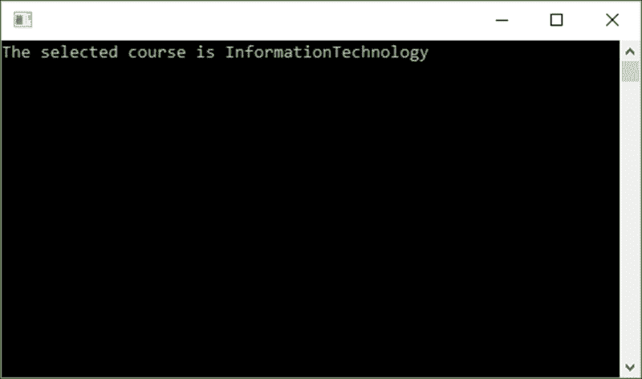

`nameof` 表达式是处理 C# 6.0 中对象的字符串字面量时保持代码同步的一种非常好的方法。

# 表达式主体函数和属性

如其名所示，表达式主体函数和属性允许方法和属性拥有一个表达式主体而不是语句主体。你会注意到表达式主体成员看起来很像 lambda 表达式，因为它们受到了 lambda 表达式的启发。

## 准备工作

要真正欣赏表达式主体函数和属性，我们需要看看之前代码是如何编写的。我们将创建一个类来计算商品的销售价格，该类将包含两个公共方法。一个用于设置货架价格，另一个用于返回显示计算出的销售价格的消息。

## 如何实现…

1.  创建一个名为 `Recipe6ExpressionBodiedFunctionMembers` 的类，并添加两个私有自动实现的属性来存储销售折扣百分比和货架价格：

    ```cs
    public static class Recipe6ExpressionBodiedFunctionMembers
    {
        private static int SaleDiscountPercent { get; } = 20;
        private static decimal ShelfPrice { get; set; } = 100;
    }
    ```

1.  如果你还没有在之前的菜谱中这样做，请添加一个扩展方法类来计算商品的销售价格：

    ```cs
    public static class ExtensionMethods
    {
        public static decimal CalculateSalePrice(this decimal shelfPrice, int discountPercent)
        {
            decimal discountValue = (shelfPrice / 100) * discountPercent;
            return shelfPrice - discountValue;
        }
    }
    ```

1.  现在，我们将向类中添加一个计算属性。这个计算属性使用 `ShelfPrice` 属性上的扩展方法来获取销售价格：

    ```cs
    private static decimal GetCalculatedSalePrice
    {
        get { return Math.Round(ShelfPrice.CalculateSalePrice(SaleDiscountPercen t) ,2); } 
    }
    ```

1.  最后，向你的类中添加两个方法来设置货架价格，另一个方法用于返回带有销售价格的消息：

    ```cs
    public static void SetShelfPrice(decimal shelfPrice)
    {
        ShelfPrice = shelfPrice;
    }                

    public static string ReturnMessage(string barCode)
    {
        return $"The sale price for barcode {barCode} is {GetCalculatedSalePrice}";
    }
    ```

1.  要查看代码的结果，请将以下代码添加到你的控制台应用程序中：

    ```cs
    string BarCode = "12345113";
    decimal ShelfPrice = 56.99m;
    Chapter1.Recipe6ExpressionBodiedFunctionMembers.SetShelfPri ce(ShelfPrice);            Console.WriteLine(Chapter1.Recipe6ExpressionBodiedFunctionM embers.ReturnMessage(BarCode));
    Console.Read();
    ```

## 如何工作…

运行你的应用程序将显示计算出的销售价格的消息：

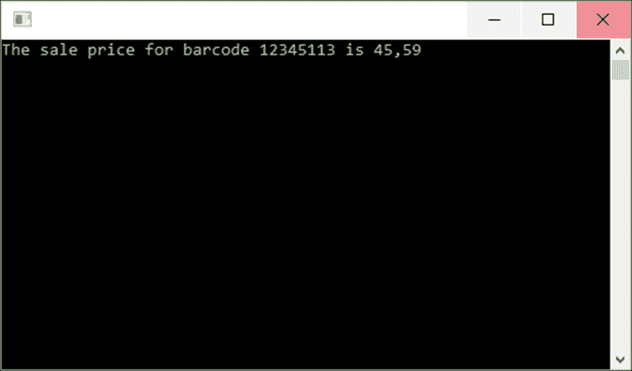

### 注意

在这里，我们只是在输出消息中提供了条形码。然而，在实际系统中，货架价格将根据特定的条形码从数据存储中查找。

回顾我们的类，我们可以看到它有些庞大。我们有一个返回销售价格的计算属性，以及两个只有一个 `return` 语句的方法。一个用于设置货架价格，另一个获取包含销售价格的消息。这就是表达式主体函数成员发挥作用的地方。将 `Recipe6ExpressionBodiedFunctionMembers` 类中的代码修改如下：

```cs
public static class Recipe6ExpressionBodiedFunctionMembers
{
    private static int SaleDiscountPercent { get; } = 20;
    private static decimal ShelfPrice { get; set; } = 100;

    private static decimal GetCalculatedSalePrice => Math.Round(ShelfPrice.CalculateSalePrice(SaleDiscountPercent));

    public static void SetShelfPrice(decimal shelfPrice) => ShelfPrice = shelfPrice;

    public static string ReturnMessage(string barCode) => $"The sale price for barcode {barCode} is {GetCalculatedSalePrice}";        
}
```

我们剩下的是一个简洁的类，它与我们之前编写的代码完全一样。代码更少，更容易阅读，看起来也更干净。您会注意到使用了 lambda `=>` 操作符。对于 `GetCalculatedSalePrice` 计算属性，`get` 关键字是缺失的。当我们将计算属性体更改为表达式时，它就隐含了。

但是，有一点需要注意，表达式主体函数成员不支持构造函数。

# 使用静态

C# 6.0 引入了一种新的 `using` 语句，现在它引用的是类型而不是命名空间。这意味着类型的静态成员将直接放入作用域。这对于您的代码意味着什么，可以从这个菜谱的简化结果中明显看出。

## 准备工作

我们将创建一个名为 `Recipe7UsingStatic` 的类，该类将根据星期几确定商品的销售价格。如果是星期五，我们将对商品应用销售折扣。在其他任何一天，我们将以货架价格出售商品。

## 如何实现...

1.  首先创建一个名为 `Recipe7UsingStatic` 的类，该类包含两个自动实现的属性和一个表示星期的枚举：

    ```cs
    public static class Recipe7UsingStatic
    {
        public enum TheDayOfWeek
        {
            Monday, Tuesday, Wednesday, Thursday, Friday, Saturday, Sunday
        }

        private static int SaleDiscountPercent { get; } = 20;
        private static decimal ShelfPrice { get; set; } = 100;        
    }
    ```

1.  现在我们将向 `Recipe7UsingStatic` 类中添加一个计算属性和两个方法。一个方法用于设置货架价格，另一个方法用于获取销售价格：

    ```cs
    private static decimal GetCalculatedSalePrice
    {
        get { return Math.Round(ShelfPrice.CalculateSalePrice (SaleDiscountPercen t), 2); }
    }        

    public static void SetShelfPrice(decimal shelfPrice)
    {
        ShelfPrice = shelfPrice;
    }

    public static decimal GetSalePrice(TheDayOfWeek dayOfWeek)
    {
        return dayOfWeek == TheDayOfWeek.Friday ? GetCalculatedSalePrice : ShelfPrice;
    }
    ```

1.  在控制台应用程序中，我们将添加代码来定义星期几，设置货架价格，然后获取销售价格。然后，将销售价格写入控制台应用程序：

    ```cs
    decimal ShelfPrice = 56.99m;

    Chapter1.Recipe7UsingStatic.TheDayOfWeek weekday = Chapter1.Recipe7UsingStatic.TheDayOfWeek.Friday;
    Chapter1.Recipe7UsingStatic.SetShelfPrice(ShelfPrice);
    Console.WriteLine(Chapter1.Recipe7UsingStatic.GetSalePrice( weekday));
    Console.Read();
    ```

## 工作原理…

运行您的控制台应用程序，并查看销售价格是否正确计算并输出到控制台应用程序：


现在，让我们更仔细地看看代码。特别是，看看 `GetCalculatedSalePrice` 计算属性。它使用 `Math.Round` 函数将销售价格四舍五入到两位小数：

```cs
private static decimal GetCalculatedSalePrice
{
    get { return Math.Round(ShelfPrice.CalculateSalePrice (SaleDiscountPercent), 2); }
}
```

实际上，`Math` 类是一个静态类，其中包含了一组函数，您可以在代码的任何地方使用这些函数来执行不同的数学计算。因此，请在上面的 `Recipes.cs` 文件顶部添加以下 `using` 语句：

```cs
using static System.Math;
```

现在，我们可以将计算属性 `GetCalculatedSalePrice` 修改为省略 `Math` 类名：

```cs
private static decimal GetCalculatedSalePrice
{
    get { return Round(ShelfPrice.CalculateSalePrice(SaleDiscountPercent), 2); }
}
```

这实际上是一个非常棒的增强功能。看看以下代码行：

```cs
Math.Sqrt(64);
Math.Tan(64);
Math.Pow(8, 2);
```

由于这个增强功能，前面的代码可以简单地写成以下这样：

```cs
Sqrt(64);
Tan(64);
Pow(8, 2);
```

然而，使用 `static` 关键字的功能还有更多。我们在这个章节的所有食谱中都使用了静态类。因此，我们也可以为我们的自定义静态类实现 `using static` 语句。将以下 `using` 语句添加到控制台应用程序的 `Program` 类顶部：

```cs
using static Chapter1.Recipe7UsingStatic;
using static Chapter1.Recipe7UsingStatic.TheDayOfWeek;
using static System.Console;
```

你会注意到我们在 `using static` 语句中包含了枚举器。这同样很棒，因为周五显然是一周中的某一天，枚举器不需要完全调用，就像旧的控制台应用程序代码中那样。通过添加 `using static` 语句，我们控制台应用程序中的代码可以按如下方式更改：

```cs
TheDayOfWeek weekday = Friday;
SetShelfPrice(ShelfPrice);
WriteLine(GetSalePrice(weekday));
Read();
```

这正是 `using static` 语句真正好处显现的地方。这意味着代码更少，使代码更易于阅读。回顾一下 C# 6.0 的理念，它并没有引入大的新概念，而是引入了许多小功能，使代码更干净，意图更容易理解。`using static` 功能正是如此。

# 异常过滤器

异常过滤器已经存在一段时间了。**Visual Basic.NET（VB.NET**）和 F# 开发者已经有一段时间拥有这项功能了。幸运的是，它现在已经被引入到 C# 6.0 中。异常过滤器不仅仅如表面所见。乍一看，异常过滤器似乎只是指定了当需要捕获异常时的条件。毕竟，“异常过滤器”这个名字就是这样暗示的。然而，仔细观察后，我们发现异常过滤器不仅仅是语法糖。

## 准备工作

我们将创建一个新的类 `Recipe8ExceptionFilters` 并调用一个读取 XML 文件的方法。文件读取逻辑由一个布尔标志设置为 `true` 决定。想象一下，这里有一个其他数据库标志，当它被设置时，也会将我们的布尔标志设置为 `true`，因此，我们的应用程序知道要读取给定的 XML 文件。

## 如何操作…

1.  创建一个名为 `Recipe8ExceptionFilters` 的类，该类包含两个方法。一个方法读取 XML 文件，另一个方法记录任何异常错误：

    ```cs
    public static class Recipe8ExceptionFilters
    {
        public static void ReadXMLFile(string fileName)
        {
            try
            {
                bool blnReadFileFlag = true;
                if (blnReadFileFlag)
                {
                    File.ReadAllLines(fileName);
                }
            }
            catch (Exception ex)
            {
                Log(ex);
                throw;
            }
        }

        private static void Log(Exception e)
        {
            /* Log the error */            
        }
    }
    ```

1.  在控制台应用程序中，添加以下代码以调用 `ReadXMLFile` 方法，并传递要读取的文件名：

    ```cs
    string File = @"c:\temp\XmlFile.xml";
    Chapter1.Recipe8ExceptionFilters.ReadXMLFile(File);
    ```

## 如何工作…

如果我们现在运行应用程序，显然会收到错误（这里假设你实际上在 `temp` 文件夹中没有名为 `XMLFile.xml` 的文件）。Visual Studio 将在 `throw` 语句处中断：


### 注意

你需要在代码文件顶部添加正确的命名空间 `System.IO`。

`Log(ex)` 方法已记录异常，但看看 **Watch1** 窗口。我们不知道 `blnReadFileFlag` 的值是什么。当捕获到异常时，堆栈会回溯（给代码添加开销）到实际的捕获块。因此，异常发生前的堆栈状态丢失。按照以下方式修改你的 `ReadXMLFile` 和 `Log` 方法，以包含异常过滤器：

```cs
public static void ReadXMLFile(string fileName)
{
    try
    {
        bool blnReadFileFlag = true;
        if (blnReadFileFlag)
        {
            File.ReadAllLines(fileName);
        }
    }
    catch (Exception ex) when (Log(ex))
    {

    }
}

private static bool Log(Exception e)
{
    /* Log the error */
    return false;
}
```

当你再次运行你的控制台应用程序时，Visual Studio 将在导致异常的实际代码行上中断：

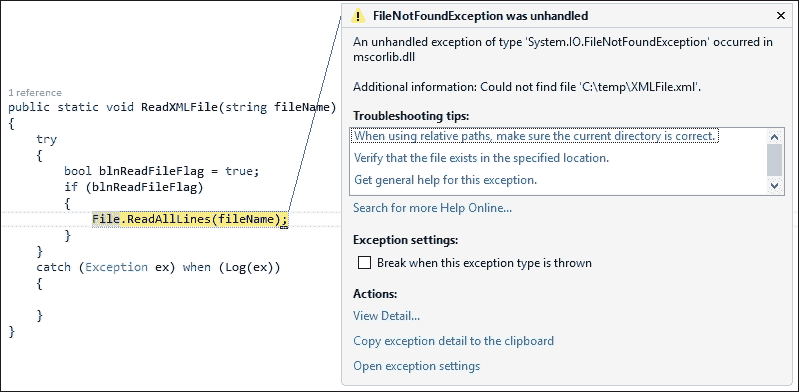

更重要的是，`blnReadFileFlag` 的值仍然在作用域内。这是因为异常过滤器可以看到异常发生时的堆栈状态，而不是异常被处理时的状态。查看 Visual Studio 中的 **Locals** 窗口，你会看到变量在异常发生时仍然在作用域内：


想象一下能够在日志文件中查看异常信息，同时所有局部变量值都可用。另一个值得注意的有趣点是 `Log(ex)` 方法中的 `return false` 语句。使用此方法记录错误并返回 `false` 将允许应用程序继续运行，并在其他地方处理异常。正如你所知，捕获 `Exception ex` 将捕获一切。通过返回 `false`，异常过滤器不会遇到 `catch` 语句，并且可以使用更具体的 `catch` 异常（例如，在我们的 `catch (Exception ex)` 语句之后的 `catch (FileNotFoundException ex)`）来处理特定错误。通常，在捕获异常时，在以下代码示例中 `FileNotFoundException` 永远不会被捕获：

```cs
catch (Exception ex) 
{

}
catch (FileNotFoundException ex)
{

}
```

这是因为捕获异常的顺序是错误的。传统上，开发者必须按照特定性顺序捕获异常，这意味着 `FileNotFoundException` 比较具体，因此必须放在 `catch (Exception ex)` 之前。使用返回 `false` 的方法调用的异常过滤器，我们可以准确地检查和记录异常：

```cs
catch (Exception ex) when (Log(ex))
{

}
catch (FileNotFoundException ex)
{

}
```

上述代码将捕获所有异常，并在捕获异常的过程中准确记录异常，但不会进入异常处理程序，因为 `Log(ex)` 方法返回 `false`。

异常过滤器的另一种实现是允许开发者在失败的情况下重试代码。你可能不希望专门捕获第一个异常，但可以在你的方法中实现一种超时元素。当错误计数器达到最大迭代次数时，你可以捕获并处理异常。你可以在这里看到基于 `try` 子句计数的异常捕获示例：

```cs
public static void TryReadXMLFile(string fileName)
{
    bool blnFileRead = false;
    do
    {
        int iTryCount = 0;
        try
        {
            bool blnReadFileFlag = true;
            if (blnReadFileFlag)                    
                File.ReadAllLines(fileName);                    
        }
        catch (Exception ex) when (RetryRead(ex, iTryCount++) == true)
        {

        }                
    } while (!blnFileRead);
}

private static bool RetryRead(Exception e, int tryCount)
{
    bool blnThrowEx = tryCount <= 10 ? blnThrowEx = false : blnThrowEx = true;
    /* Log the error if blnThrowEx = false */
    return blnThrowEx;
}
```

异常过滤是处理代码中异常的一种非常有用且极其强大的方式。异常过滤器背后的工作原理并不像人们想象的那样立即明显，但这里正是异常过滤器的实际力量所在。

# 在 catch 和 finally 块中使用 await 操作符

最后，在 C# 6.0 中，你现在可以在 `catch` 和 `finally` 块中使用 `await` 关键字。以前，开发者不得不求助于各种奇怪的解决方案来实现现在在 C# 6.0 中可以轻松实现的功能。实际上，这并没有比以下内容更多。

## 准备工作

我们将创建另一个类来模拟文件的删除。将抛出一个异常，然后执行 `catch` 块以及 `finally` 语句。在 `catch` 和 `finally` 子句中，我们将延迟并等待一个任务 3 秒。然后，我们将此延迟输出到控制台应用程序窗口。

## 如何实现…

1.  创建一个名为 `Recipe9AwaitInCatchFinally` 的类，并向该类添加一个名为 `FileRunAsync()` 的方法，其代码如下。确保 `filePath` 变量给出的路径中不存在文件：

    ```cs
    public static class Recipe9AwaitInCatchFinally
    {
        public static void FileRunAsync()
        {
            string filePath = @"c:\temp\XmlFile.xml";
            RemoveFileAcync(filePath);
            ReadLine();
        }
    }
    ```

1.  然后，向类中添加另一个名为 `RemoveFileAcync()` 的方法，该方法接受一个文件路径作为参数。在这个方法中包含 `try` `catch`，并添加尝试读取指定路径文件的代码：

    ```cs
    public static async void RemoveFileAcync(string filepath)
    {
        try
        {
            WriteLine("Read file");
            File.ReadAllLines(filepath);
        }
        catch (Exception ex)
        {

        }
        finally
        {        

        }
    }
    ```

1.  在 `catch` 子句中，添加以下代码来模拟一个需要几秒钟才能完成的过程：

    ```cs
    WriteLine($"Exception - wait 3 seconds {DateTime.Now.ToString("hh:MM:ss tt")}");
    await Task.Delay(3000);
    WriteLine($"Exception - Print {DateTime.Now.ToString("hh:MM:ss tt")}");
    WriteLine(ex.Message);
    ```

1.  在 `finally` 子句中，添加另一个延迟来模拟一个也需要几秒钟才能完成的任务：

    ```cs
    WriteLine($"Finally - wait 3 seconds {DateTime.Now.ToString("hh:MM:ss tt")}");
    await Task.Delay(3000);
    WriteLine($"Finally - completed {DateTime.Now.ToString("hh:MM:ss tt")}");
    ```

1.  在控制台应用程序中，只需在 `Recipe9AwaitInCatchFinally` 类中调用 `FileRunAsync()` 方法：

    ```cs
    Chapter1.Recipe9AwaitInCatchFinally.FileRunAsync();
    ```

## 如何工作…

添加代码后，运行控制台应用程序并查看输出：

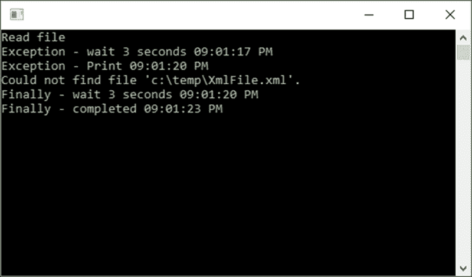

你会注意到抛出的异常是“文件未找到”异常。在 `catch` 中，代码在任务延迟时停止了 3 秒。对于 `finally` 子句中的代码也是如此。它也在任务延迟时延迟了 3 秒。

这意味着现在，在你的 C# 6.0 应用程序中，例如，你可以在异常日志消息写入日志时在 `catch` 子句中等待。你可以在关闭数据库连接以释放其他对象时在 `finally` 子句中做同样的事情。

编译器如何实现这个过程相当复杂。然而，你不需要担心这个功能是如何实现的。你所需要做的就是知道，`await` 关键字现在作为开发人员可用，可以在 `catch` 和 `finally` 块中使用。

### 小贴士

有关下载代码包的详细步骤，请参阅本书的序言。请查看。本书的代码包也托管在 GitHub 上，网址为 [`github.com/PacktPublishing/CSharp-Programming-Cookbook`](https://github.com/PacktPublishing/CSharp-Programming-Cookbook)。我们还有其他来自我们丰富的图书和视频目录的代码包，可在 [`github.com/PacktPublishing/`](https://github.com/PacktPublishing/) 找到。查看它们！
