# 第二章. 类和泛型

类是软件开发的基础，对于编写良好的代码至关重要。在本章中，我们将探讨类和泛型以及为什么我们需要使用它们。我们将涵盖的食谱如下：

+   创建和实现一个抽象类

+   创建和实现一个接口

+   创建和使用泛型类或方法

+   创建和使用泛型接口

# 简介

如你所知，类只是相关方法和属性的容器，用于描述软件中的某个对象。一个对象是特定类的实例，有时也模仿现实世界的事物。当你想到一辆车时，你可能会创建一个包含所有车辆都有的属性（属性）的车辆类，例如自动或手动变速箱、车轮数量（并非所有车辆都只有四个轮子），或燃料类型。

当我们创建车辆类的实例时，我们可以创建汽车对象、SUV 对象等等。这就是类的力量所在，它描述了我们周围的世界，并将其转化为编译器可以理解的编程语言。

# 创建和实现一个抽象类

许多开发者都听说过抽象类，但它们的实现却是个谜。作为开发者，你如何识别一个抽象类并决定何时使用它？实际上，定义相当简单。一旦你理解了抽象类的这个基本定义，何时以及为什么使用它就变得明显了。

想象一下，你正在开发一个管理猫舍中动物的应用程序。这个猫舍康复了狮子、老虎、美洲豹、豹、猎豹、美洲狮，甚至家猫。描述所有这些动物的共同名词是“猫”这个词。因此，你可以安全地假设所有这些动物的抽象是猫，因此这个词标识了我们的抽象类。然后，你会创建一个名为`Cat`的抽象类。

然而，你需要记住，你永远不会创建抽象类`Cat`的实例。从抽象类继承的所有类也共享一些功能。这意味着你会创建一个继承自抽象类`Cat`的`Lion`类和一个`Tiger`类。换句话说，继承的类是一种猫。这两个类以`Sleep()`、`Eat()`、`Hunt()`和许多其他方法的形式共享功能。这样，我们可以确保继承的类都包含这种共同的功能。

## 准备工作

让我们继续创建我们的猫抽象类。然后我们将使用它来继承并创建其他对象，以定义不同类型的猫。

## 如何做…

1.  在 Visual Studio **解决方案资源管理器**中，右键单击解决方案，单击**添加**，然后单击**新建项目**。选择**类库**选项将新的类库项目添加到您的解决方案中，并将其命名为`Chapter2`：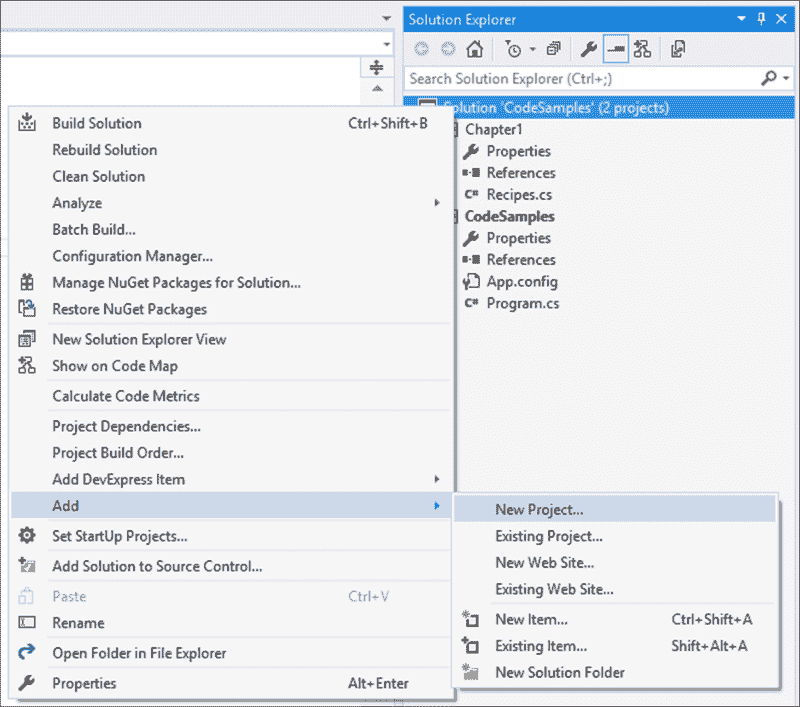

1.  已将名为`Chapter2`的类库项目添加到您的解决方案中。请右键单击添加到您的`Chapter2`项目中的默认类`Class1.cs`，并将其重命名为`Recipes.cs`：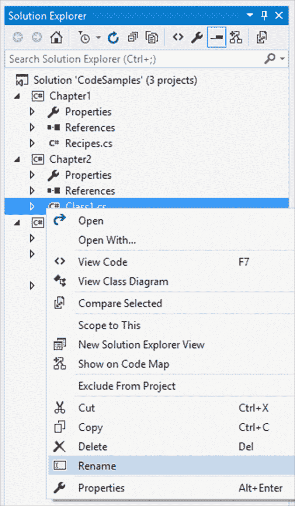

1.  完成此操作后，您的代码应类似于以下代码列表。您可以看到默认类已被重命名为`Recipes`，并且它存在于`Chapter2`命名空间中：

    ```cs
    namespace Chapter2
    {
        public class Recipes
        {
        }
    }
    ```

1.  现在，我们将默认类`Recipes`更改为名为`Cat`的抽象类。为此，将`abstract`关键字添加到类中，并将名称从`Recipes`更改为`Cat`。我们现在准备好描述`Cat`抽象类：

    ```cs
    namespace Chapter2
    {
        public abstract class Cat
        {
        }
    }
    ```

    ### 注意

    `abstract`关键字告诉我们，它所应用的对象没有实现。当在类声明中使用时，它基本上告诉编译器该类将用作基类。这意味着不能创建该类的实例。抽象类实现的唯一方式是当派生类从基类继承时实现它。

1.  向名为`Eat()`、`Hunt()`和`Sleep()`的抽象类中添加三个方法。您会注意到这些方法不包含主体（花括号）。这是因为它们已被定义为抽象的。与抽象类一样，抽象类中包含的抽象方法不包含实现。这三个方法基本上描述了所有猫共有的功能。所有猫都必须进食、狩猎和睡眠。因此，为了确保从`Cat`抽象类继承的所有类都包含此功能，它被添加到抽象类中。然后，这些方法在派生类中实现，我们将在接下来的步骤中看到：

    ```cs
        public abstract class Cat
        {
            public abstract void Eat();
            public abstract void Hunt();
            public abstract void Sleep();
        }
    ```

1.  我们想定义两种猫的类型。我们想要定义的第一种猫是狮子。为此，我们创建一个`Lion`类：

    ```cs
    public class Lion
    {

    }
    ```

1.  在此阶段，`Lion`类只是一个普通类，不包含在`Cat`抽象类中定义的任何公共功能。为了从`Cat`抽象类继承，我们需要在`Lion`类名称后添加`: Cat`。冒号表示`Lion`类继承自`Cat`抽象类。因此，`Lion`类是`Cat`抽象类的派生类：

    ```cs
    public class Lion : Cat
    {

    }
    ```

    一旦你指定`Lion`类从`Cat`类继承，Visual Studio 就会显示一个错误。这是预期的，因为我们已经告诉编译器`Lion`类需要继承`Cat`抽象类的所有功能，但我们实际上并没有将这些功能添加到`Lion`类中。派生类被称为覆盖抽象类中的方法，并且需要特别使用`override`关键字来编写。

1.  如果你将鼠标悬停在`Lion`类下方的红色波浪线处，Visual Studio 将通过灯泡功能提供错误解释。正如你所见，Visual Studio 告诉你，虽然你已经定义了类以从抽象类继承，但你没有实现`Cat`类的任何抽象成员：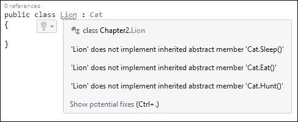

    ### 注意

    因此，你可以看到使用抽象类是强制系统内特定功能的一种绝佳方式。如果你在抽象类中定义了抽象成员，从该抽象类继承的派生类必须实现这些成员；否则，你的代码将无法编译。这可以用来强制执行公司采用的标准和惯例，或者简单地允许其他开发者在使用你的基类作为派生类时实施某些最佳实践。随着 Visual Studio 2015 功能代码分析器的出现，这可以确保团队的开发工作保持一致。

1.  要实现 Visual Studio 警告我们的这些成员，将鼠标光标放在`Lion`类名称上并按*Ctrl* + *.*（点号）。你还可以在灯泡弹出窗口中点击**显示潜在修复**链接。Visual Studio 会给你一个小提示，显示它将对你的代码所做的更改。你可以通过点击**预览更改**链接来预览这些更改，也可以通过点击适当的链接来修复文档、项目或解决方案中的所有发生情况：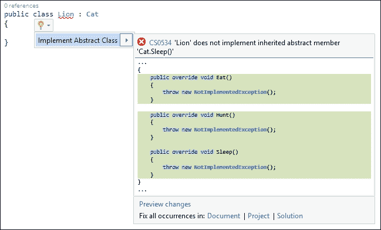

    在 Visual Studio 添加了建议窗口中显示的更改后，你的`Lion`类将正确无误，并看起来像以下步骤中列出的代码。

1.  你会注意到 Visual Studio 会自动在每个覆盖方法中添加一个`NotImplementedException`异常，其代码行如下：`throw new NotImplementedException();`

    ```cs
    public class Lion : Cat
    {
        public override void Eat()
        {
            throw new NotImplementedException();
        }

        public override void Hunt()
        {
            throw new NotImplementedException();
        }

        public override void Sleep()
        {
            throw new NotImplementedException();
        }
    }
    ```

    ### 注意

    这是 Visual Studio 在基类中覆盖方法时的默认行为。基本上，如果你在未编写任何实现的情况下实例化`Lion`类，将会生成一个运行时异常。从我们的抽象类继承的想法是扩展它并实现共同的功能。这就是我们需要实现这些功能的地方，这也是为什么抽象类中没有实现的原因。抽象类只是告诉我们以下方法需要实现。派生类负责实际的实现。

1.  然后添加`Lion`类重写方法的实现。首先，将`using static`语句添加到类文件顶部，用于`Console.WriteLine`方法：

    ```cs
    using static System.Console;
    ```

1.  然后，按照以下方式添加实现的方法代码：

    ```cs
    public override void Eat()
    {
        WriteLine($"The {LionColor} lion eats.");
    }

    public override void Hunt()
    {
        WriteLine($"The {LionColor} lion hunts.");
    }

    public override void Sleep()
    {
        WriteLine($"The {LionColor} lion sleeps.");
    }
    ```

1.  接下来，我们将创建另一个名为`Tiger`的类，它也继承自抽象类`Cat`。按照第 7 步到第 12 步创建`Tiger`类并继承`Cat`抽象类：

    ```cs
    public class Tiger : Cat
    {
        public override void Eat()
        {
            throw new NotImplementedException();
        }

        public override void Hunt()
        {
            throw new NotImplementedException();
        }

        public override void Sleep()
        {
            throw new NotImplementedException();
        }
    }
    ```

1.  按照以下方式为`Tiger`类添加相同的实现：

    ```cs
    public override void Eat()
    {
        WriteLine($"The {TigerColor} tiger eats.");
    }

    public override void Hunt()
    {
        WriteLine($"The {TigerColor} tiger hunts.");
    }

    public override void Sleep()
    {
        WriteLine($"The {TigerColor} tiger sleeps.");
    }
    ```

1.  对于我们的`Lion`类，添加一个`ColorSpectrum`枚举和一个名为`LionColor`的属性。在这里，`Lion`和`Tiger`类的实现将有所不同。虽然它们都必须实现抽象类中指定的共同功能，即`Eat()`、`Hunt()`和`Sleep()`，但只有狮子可以在其颜色范围内具有棕色或白色：

    ```cs
    public enum ColorSpectrum { Brown, White }
    public string LionColor { get; set; }
    ```

1.  接下来，在我们的`Lion`类中添加`Lion()`构造函数。这将使我们能够为猫舍中的狮子指定颜色。构造函数还接受一个`ColorSpectrum`枚举类型的变量作为参数：

    ```cs
    public Lion(ColorSpectrum color)
    {
        LionColor = color.ToString();
    }
    ```

1.  与此类似，但在颜色上有所不同，`Tiger`类只能有一个定义老虎为橙色、白色、金色、蓝色（是的，你实际上可以得到一只蓝色的老虎）或黑色的`ColorSpectrum`枚举。将`ColorSpectrum`枚举添加到`Tiger`类中，以及一个名为`TigerColor`的属性：

    ```cs
    public enum ColorSpectrum { Orange, White, Gold, Blue, Black }
    public string TigerColor { get; set; }
    ```

1.  最后，我们将为我们的`Tiger`类创建一个`Tiger()`构造函数，以将猫舍中老虎的颜色设置为老虎实际存在的有效颜色。通过这样做，我们在各自的类中分离了仅针对老虎和狮子的一些特定功能，而所有共同功能都包含在抽象类`Cat`中：

    ```cs
    public Tiger(ColorSpectrum color)
    {
        TigerColor = color.ToString();
    }
    ```

1.  要看到类在实际中的应用，我们首先需要将`Chapter2.cs`类文件添加为引用。在控制台应用程序项目中右键单击**引用**：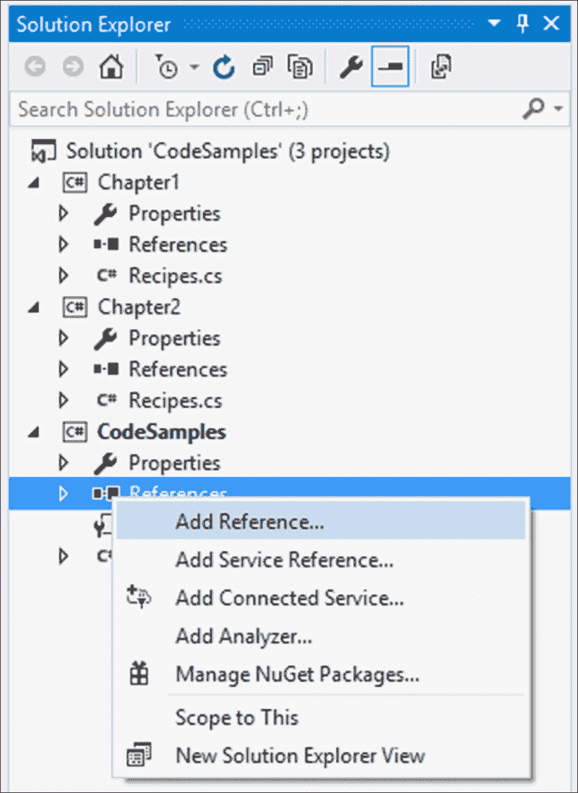

1.  **引用管理器**窗口将打开`CodeSamples`项目。选择`Chapter2`并单击**确定**按钮。然后，添加`using Chapter2;`语句：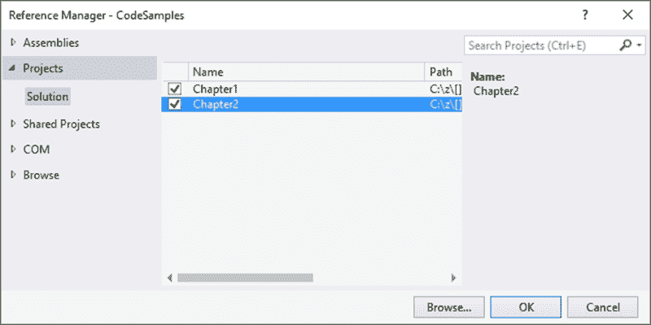

1.  现在，我们需要实例化`Lion`和`Tiger`类。你会看到我们从构造函数中设置了相应猫的颜色：

    ```cs
    Lion lion = new Lion(Lion.ColorSpectrum.White);
    lion.Hunt();
    lion.Eat();
    lion.Sleep();

    Tiger tiger = new Tiger(Tiger.ColorSpectrum.Blue);
    tiger.Hunt();
    tiger.Eat();
    tiger.Sleep();

    Console.ReadLine();
    ```

1.  当你运行你的控制台应用程序时，你会看到方法按顺序被调用：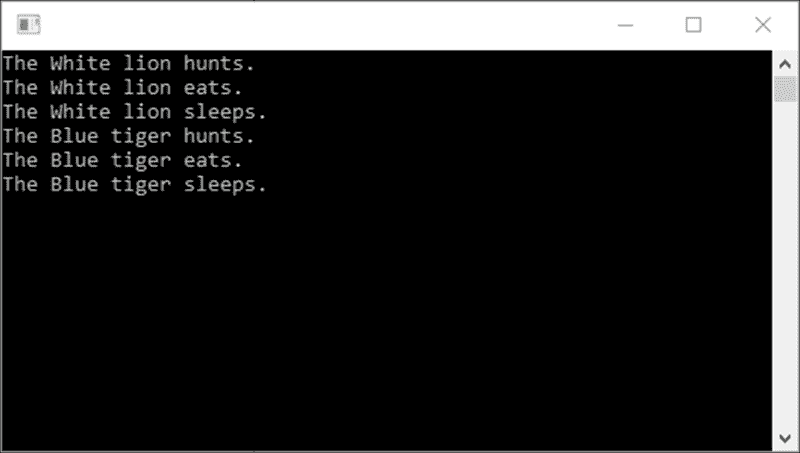

## 它是如何工作的…

尽管前面示例中的例子相当简单，但理论是正确的。抽象类将所有猫的集体功能分组，以便可以在每个派生类中共享。抽象类中不存在实现；它只定义需要发生的事情。将抽象类视为从抽象类继承的类的蓝图类型。

虽然实现的内容由您决定，但抽象类要求您添加它定义的抽象方法。从现在开始，您可以为您的应用程序中应该共享功能的相关类创建一个坚实的基础。这是继承的目标。让我们回顾一下抽象类的特点：

+   您不能使用 `new` 关键字实例化抽象类。

+   您只能向抽象类添加抽象方法和访问器。

+   您永远不能将抽象类作为 `sealed` 修改。`sealed` 修饰符阻止继承，而抽象则要求继承。

+   任何从您的抽象类派生的类都必须包括从抽象类继承的抽象方法的实现。

+   因为抽象类内部的抽象方法没有实现，所以它们也不包含主体。

# 创建和实现接口

对于许多开发者来说，接口是令人困惑的，它们的用途也不清楚。一旦您理解了定义接口的概念，接口实际上很容易掌握。

接口就像动词。例如，如果我们必须创建两个名为 `Lion` 和 `Tiger` 的类，它们从 `Cat` 抽象类派生，那么接口将描述某种动作。狮子和老虎可以吼叫（但不能咕噜）。然后我们可以创建一个名为 `IRoarable` 的接口。如果我们必须从我们的抽象类 `Cat` 派生一个名为 `Cheetah` 的类，我们就无法使用 `IRoarable` 接口，因为猎豹会咕噜。我们需要创建一个 `IPurrable` 接口。

## 准备工作

创建接口与创建抽象类非常相似。区别在于接口描述了类可以做什么，在 `Cheetah` 类的情况下，通过实现 `IPurrable`。

## 如何操作…

1.  如果您还没有在之前的菜谱中这样做，创建一个名为 `Cat` 的抽象类：

    ```cs
    public abstract class Cat
    {
        public abstract void Eat();
        public abstract void Hunt();
        public abstract void Sleep();
    }
    ```

1.  接下来，添加一个名为 `Cheetah` 的类，该类从 `Cat` 抽象类继承：

    ```cs
    public class Cheetah : Cat
    {

    }
    ```

1.  一旦您从 `Cat` 抽象类继承，Visual Studio 将通过灯泡功能显示警告。由于您从抽象类 `Cat` 继承，您必须在派生类 `Cheetah` 中实现抽象成员：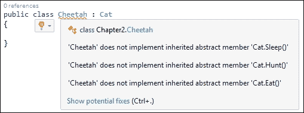

1.  这可以通过按*Ctrl* +*.*（句号）来轻松修复，并修复文档中的所有出现。您也可以为项目或解决方案执行此操作。对于我们的目的，我们只选择灯泡建议底部的**文档**链接。Visual Studio 将自动将抽象类中定义的抽象方法添加到您的 `Cheetah` 类中实现：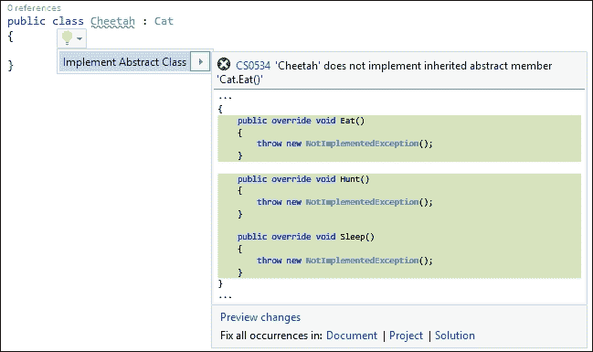

1.  你会注意到 Visual Studio 只添加了你需要重写的那些方法，但如果你尝试直接使用该类，它将抛出 `NotImplementedException`。使用抽象类的原因是在派生类 `Cheetah` 中实现抽象类 `Cat` 中定义的功能。如果不这样做，就违反了使用抽象类的规则：

    ```cs
    public class Cheetah : Cat
    {
        public override void Eat()
        {
            throw new NotImplementedException();
        }

        public override void Hunt()
        {
            throw new NotImplementedException();
        }

        public override void Sleep()
        {
            throw new NotImplementedException();
        }
    }
    ```

1.  为了添加一些实现，按照以下方式修改你的 `Cheetah` 类。在重写方法中的实现很简单，但这验证了在重写方法中编写某种实现规则的规则：

    ```cs
    public class Cheetah : Cat
    {
        public override void Eat()
        {
            WriteLine($"The cheetah eats.");
        }

        public override void Hunt()
        {
            WriteLine($"The cheetah hunts.");
        }

        public override void Sleep()
        {
            WriteLine($"The cheetah sleeps.");
        }
    }
    ```

    ### 注意

    你会注意到以下 `WriteLine` 方法是在没有 `Console` 类的情况下使用的。这是因为我们正在使用 C# 6.0 中的一个新特性，该特性允许开发者通过在类文件顶部添加 `using static System.Console;` 语句来将静态类引入作用域。

1.  创建一个名为 `IPurrable` 的接口，该接口将在 `Cheetah` 类中实现。接口的常见命名约定规定，接口名称应该以大写 I 开头：

    ```cs
    interface IPurrable
    {

    }
    ```

1.  接下来，我们将向接口添加一个方法，任何实现该接口的类都必须实现。你会注意到接口的 `SoftPurr` 方法根本没有任何实现。然而，它指定我们需要传递一个整数值给这个方法，这个值将代表 `Cheetah` 类将发出多少分贝的呼噜声：

    ```cs
    interface IPurrable
    {
        void SoftPurr(int decibel);
    }
    ```

1.  下一步是在 `Cheetah` 类上实现 `IPurrable` 接口。为此，我们需要在 `Cat` 抽象类名称之后添加 `IPurrable` 接口名称。如果 `Cheetah` 类没有从抽象类继承，那么接口名称将简单地跟在冒号后面：

    ```cs
    public class Cheetah : Cat, IPurrable
    {
        public override void Eat()
        {
            WriteLine($"The cheetah eats.");
        }

        public override void Hunt()
        {
            WriteLine($"The cheetah hunts.");
        }

        public override void Sleep()
        {
            WriteLine($"The cheetah sleeps.");
        }
    }
    ```

1.  在指定 `Cheetah` 类实现了 `IPurrable` 接口后，Visual Studio 再次通过灯泡功能显示警告。它警告我们，`Cheetah` 类没有实现接口 `IPurrable` 中定义的 `SoftPurr` 方法：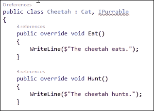

1.  就像我们之前做的那样，我们可以让 Visual Studio 通过输入 *Ctrl* + *.*（句号）来建议可能的修复方案。Visual Studio 会建议接口可以隐式或显式地实现：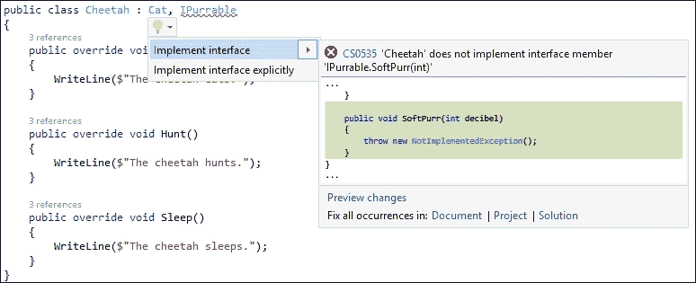

1.  知道何时使用隐式或显式实现也很简单。我们首先需要知道在什么情况下使用其中一种而不是另一种会更合适。让我们从通过选择灯泡建议中的第一个选项来隐式实现 `SoftPurr` 方法开始。你会看到，通过选择隐式实现 `IPurrable` 接口中定义的 `SoftPurr` 方法，它就像 `Cheetah` 类的一部分一样被添加：

    ```cs
    public class Cheetah : Cat, IPurrable
    {
        public void SoftPurr(int decibel)
        {
            throw new NotImplementedException();
        }

        public override void Eat()
        {
            WriteLine($"The cheetah eats.");
        }

        public override void Hunt()
        {
            WriteLine($"The cheetah hunts.");
        }

        public override void Sleep()
        {
            WriteLine($"The cheetah sleeps.");
        }
    }
    ```

1.  如果我们查看 `SoftPurr` 方法，它看起来就像 `Cheetah` 类中的一个普通方法。这本来是没问题的，除非我们的 `Cheetah` 类已经包含一个名为 `SoftPurr` 的属性。现在就给你的 `Cheetah` 类添加一个名为 `SoftPurr` 的属性：

    ```cs
    public class Cheetah : Cat, IPurrable
    {
        public int SoftPurr { get; set; }

        public void SoftPurr(int decibel)
        {
            throw new NotImplementedException();
        }

        public override void Eat()
        {
            WriteLine($"The cheetah eats.");
        }

        public override void Hunt()
        {
            WriteLine($"The cheetah hunts.");
        }

        public override void Sleep()
        {
            WriteLine($"The cheetah sleeps.");
        }        
    }
    ```

1.  Visual Studio 会立即通过告诉我们`Cheetah`类已经包含`SoftPurr`的定义来显示一个警告：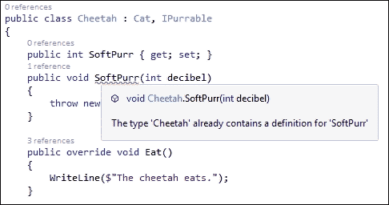

1.  正是在这里，显式实现的使用变得明显。这指定了`SoftPurr`方法是`IPurrable`接口中定义的实现的一个成员：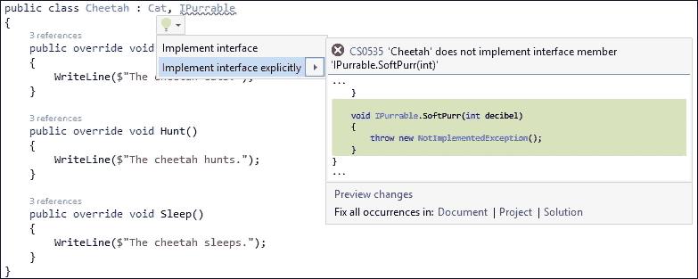

1.  因此，选择第二个选项显式实现接口将把`SoftPurr`方法添加到你的`Cheetah`类中，如下所示：

    ```cs
    public class Cheetah : Cat, IPurrable
    {
        public int SoftPurr { get; set; }

        void IPurrable.SoftPurr(int decibel)
        {
            throw new NotImplementedException();
        }

        public override void Eat()
        {
            WriteLine($"The cheetah eats.");
        }

        public override void Hunt()
        {
            WriteLine($"The cheetah hunts.");
        }

        public override void Sleep()
        {
            WriteLine($"The cheetah sleeps.");
        }        
    }
    ```

    编译器现在知道这是一个正在实现中的接口，因此这是一条有效的代码行。

1.  为了这本书的目的，我们只需使用隐式实现。让我们为`SoftPurr`方法编写一些实现，并使用 C# 6.0 中的新`nameof`关键字以及插值字符串进行输出。同时，删除之前添加的`SoftPurr`属性：

    ```cs
    public void SoftPurr(int decibel)
    {
        WriteLine($"The {nameof(Cheetah)} purrs at {decibel} decibels.");
    }
    ```

1.  转到我们的控制台应用程序，我们可以如下调用我们的`Cheetah`类：

    ```cs
    Cheetah cheetah = new Cheetah();
    cheetah.Hunt();
    cheetah.Eat();
    cheetah.Sleep();
    cheetah.SoftPurr(60);
    Console.ReadLine();
    ```

1.  运行应用程序将产生以下输出：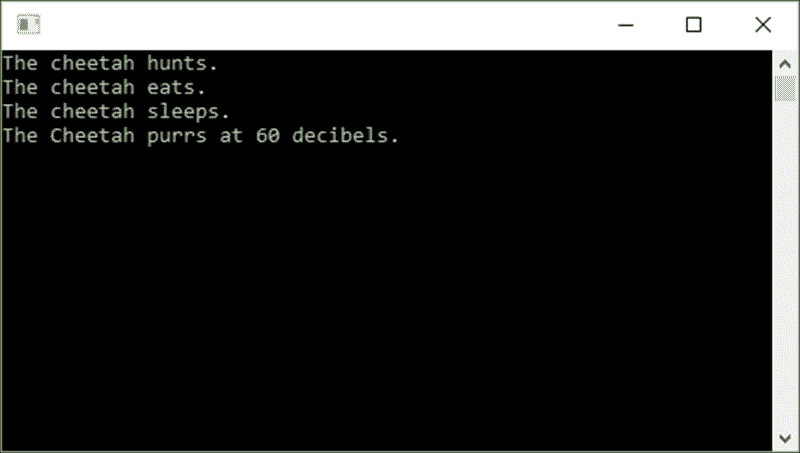

## 它是如何工作的…

所以，你可能想知道抽象类和接口之间的区别是什么。这基本上取决于你希望在哪里实现你的代码。如果你需要在派生类之间共享功能，那么抽象类最适合你的需求。换句话说，我们有一些对所有猫（狮子、老虎和猎豹）都共同的事情，比如狩猎、进食和睡眠。这最好在抽象类中使用。

如果你的实现特定于一个或几个类（但不是所有类），那么你最好的做法是使用接口。在这种情况下，`IPurrable`接口可以应用于几个类（例如，猎豹和家猫），但不能应用于所有猫（如狮子和老虎），因为不是所有猫都会发出咕噜声。

了解这些区别以及你需要在哪里放置你的实现将帮助你决定是否需要使用抽象类或接口。

# 创建和使用泛型类或方法

泛型是一种非常有趣的编写代码的方式。你可以在设计时延迟指定代码中元素的类型，直到它们在代码中使用。这基本上意味着你的类或方法可以与任何数据类型一起工作。

## 准备工作

我们将从一个可以接受任何数据类型作为其构造函数参数并对其进行操作的泛型类开始。

## 如何操作...

1.  声明一个泛型类实际上非常简单。我们只需要创建一个带有泛型类型参数`<T>`的类：

    ```cs
    public class PerformAction<T>
    {

    }
    ```

    ### 注意

    泛型类型参数基本上是一个占位符，用于在实例化变量类时需要定义的具体类型。这意味着泛型类 `PerformAction<T>` 不能在没有在实例化类时指定尖括号内的类型参数的情况下使用。

1.  接下来，创建一个泛型类型参数 `T` 的 `private` 变量。这个变量将保存我们传递给泛型类的值：

    ```cs
    public class PerformAction<T>
    {
        private T _value;
    }
    ```

1.  我们现在需要向泛型类添加一个构造函数。构造函数将接受一个类型为 `T` 的值作为参数。私有变量 `_value` 将被设置为传递给构造函数的参数：

    ```cs
    public class PerformAction<T>
    {
        private T _value;

        public PerformAction(T value)
        {
            _value = value;
        }
    }
    ```

1.  最后，为了完成我们的泛型类，创建一个返回类型为 `void` 的方法，命名为 `IdentifyDataType()`。这个方法将要做的就是告诉我们我们传递给泛型类的数据类型。我们可以使用 `GetType()` 来找到变量的类型：

    ```cs
    public class PerformAction<T>
    {
        private T _value;

        public PerformAction(T value)
        {
            _value = value;
        }

        public void IdentifyDataType()
        {
            WriteLine($"The data type of the supplied variable is {_value.GetType()}");
        }
    }
    ```

1.  要看到我们的泛型类在实际操作中的真正美，请在控制台应用程序中实例化泛型类，并在每个新的实例化中指定不同的数据类型参数：

    ```cs
    PerformAction<int> iAction = new PerformAction<int>(21);
    iAction.IdentifyDataType();

    PerformAction<decimal> dAction = new PerformAction<decimal>(21.55m);
    dAction.IdentifyDataType();

    PerformAction<string> sAction = new PerformAction<string>("Hello Generics");
    sAction.IdentifyDataType();                        

    Console.ReadLine();
    ```

1.  运行你的控制台应用程序将输出你每次实例化泛型类时给定的数据类型：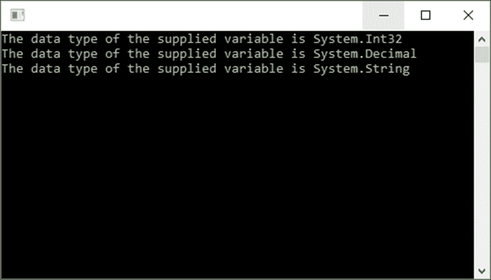

    我们使用了完全相同的类，但让它以三种非常不同的数据类型执行。这种灵活性是代码中一个非常强大的功能。

C# 的另一个特性是你可以约束实现的泛型类型：

1.  我们可以通过告诉编译器只有实现了 `IDisposable` 接口的数据类型才能与泛型类一起使用来实现这一点。通过在泛型类中添加 `where T : IDisposable` 来更改你的泛型类。你的泛型类现在应该看起来像这样：

    ```cs
    public class PerformAction<T> where T : IDisposable
    {
        private T _value;

        public PerformAction(T value)
        {
            _value = value;
        }

        public void IdentifyDataType()
        {
            WriteLine($"The data type of the supplied variable is {_value.GetType()}");
        }
    }
    ```

1.  返回控制台应用程序并查看泛型类的先前实例化：

    Visual Studio 将会告诉你，下划线红色的波浪线下的类型没有实现 `IDisposable`，因此不能提供给 `PerformAction` 泛型类。

1.  注释掉这些代码行，并将以下实例化添加到你的控制台应用程序中：

    ```cs
    DataSet dsData = new DataSet();
    PerformAction<DataSet> oAction = new PerformAction<DataSet>(dsData);
    oAction.IdentifyDataType();
    ```

    ### 注意

    注意，为了使这可行，你可能需要在你的代码文件中添加 `using System.Data;`。这是必要的，以便你可以声明一个 `DataSet`。

1.  如你所知，`DataSet` 类型实现了 `IDisposable`，因此它是一个有效的类型，可以传递给我们的泛型类。继续运行控制台应用程序：

    `DataSet` 类型是有效的，泛型类按预期执行，识别了传递给构造函数的参数类型。

但泛型方法呢？嗯，就像泛型类一样，泛型方法在设计时也不指定它们的类型。只有在方法被调用时才知道。让我们看看以下泛型方法的实现：

1.  让我们继续创建一个新的辅助类，命名为 `MyHelperClass`：

    ```cs
    public class MyHelperClass
    {
    }
    ```

1.  在这个辅助类内部，我们将创建一个名为`InspectType`的泛型方法。这个泛型方法有趣的地方在于它可以返回多种类型，因为返回类型也被标记为泛型类型参数。您的泛型方法不必返回任何内容。它也可以声明为`void`：

    ```cs
    public class MyHelperClass
    {
        public T InspectType<T>(T value) 
        {

        }
    }
    ```

1.  为了说明这个通用方法可以返回多种类型，我们将输出传递给通用方法的类型到控制台窗口，然后返回该类型并在控制台应用程序中显示它。您会注意到，在返回时需要将返回类型转换为`(T)`：

    ```cs
    public class MyHelperClass
    {
        public T InspectType<T>(T value) 
        {
            WriteLine($"The data type of the supplied parameter is {value.GetType()}");

            return (T)value;
        }
    }
    ```

1.  在控制台应用程序中，创建一个名为`MyEnum`的枚举器。泛型方法也可以接受枚举器：

    ```cs
    public enum MyEnum { Value1, Value2, Value3 }
    ```

1.  在创建枚举器后，将以下代码添加到控制台应用程序中。我们正在实例化和调用`oHelper`类，并传递不同的值给它：

    ```cs
    MyHelperClass oHelper = new MyHelperClass();
    var intExample = oHelper.InspectType(25);
    Console.WriteLine($"An example of this type is {intExample}");

    var decExample = oHelper.InspectType(11.78m);
    Console.WriteLine($"An example of this type is {decExample}");

    var strExample = oHelper.InspectType("Hello Generics");
    Console.WriteLine($"An example of this type is {strExample}");

    var enmExample = oHelper.InspectType(MyEnum.Value2);
    Console.WriteLine($"An example of this type is {enmExample}");

    Console.ReadLine();
    ```

1.  如果您运行控制台应用程序，您将看到泛型方法正确地识别了传递给它的参数类型，然后将其返回到控制台应用程序的调用代码中：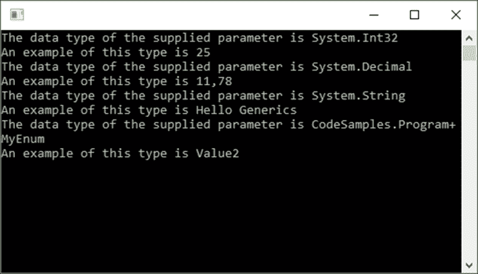

泛型方法可以在多种情况下使用。然而，这只是一个泛型类和方法的介绍。建议您进行进一步研究，以了解如何适当地在代码中实现泛型。

## 它是如何工作的…

泛型的核心在于能够重用单个类或方法。它允许开发者基本上在整个代码库中不重复类似的代码。这很好地符合**不要重复自己**（**DRY**）原则。这个设计原则指出，特定的逻辑位只应在代码中表示一次。

使用泛型类还可以让开发者创建在编译时类型安全的类。类型安全基本上意味着开发者可以确信对象的类型，并且可以以特定方式使用该类而不会遇到任何意外行为。因此，编译器承担了类型安全的负担。

泛型还允许开发者编写更少的代码，因为代码可以重用，更少的代码也执行得更好。

# 创建和使用泛型接口

泛型接口的工作方式与泛型中的先前示例非常相似。假设我们想在代码中找到某些类的属性，但我们不能确定我们需要检查多少个类。在这种情况下，一个泛型接口可能非常有用。

## 准备工作

我们需要检查几个类的属性。为此，我们将创建一个通用接口，该接口将返回一个字符串列表，其中包含为该类找到的所有属性。

## 如何操作…

让我们看看以下泛型接口的实现方式：

1.  继续创建一个名为 `IListClassProperties<T>` 的泛型接口。该接口将定义一个需要使用的方法，即 `GetPropertyList()`，它简单地使用 LINQ 查询来返回一个 `List<string>` 对象：

    ```cs
    interface IListClassProperties<T>
    {
        List<string> GetPropertyList();
    }
    ```

1.  接下来，创建一个名为 `InspectClass<T>` 的泛型类。让这个泛型类实现之前步骤中创建的 `IListClassProperties<T>` 接口：

    ```cs
    public class InspectClass<T> : IListClassProperties<T>
    {

    }
    ```

1.  如同往常，Visual Studio 将突出显示接口成员 `GetPropertyList()` 在 `InspectClass<T>` 泛型类中尚未实现：

1.  要显示任何潜在的修复，键入 *Ctrl* + *.*（句点）并隐式实现接口：

1.  这将在你的 `InspectClass<T>` 类中创建一个没有任何实现的 `GetPropertyList()` 方法。你将在稍后添加实现。如果你尝试在没有向 `GetpropertyList()` 方法添加任何实现的情况下运行你的代码，编译器将抛出 `NotImplementedException`：

    ```cs
    public class InspectClass<T> : IListClassProperties<T>
    {
        public List<string> GetPropertyList()
        {
            throw new NotImplementedException();
        }
    }
    ```

1.  接下来，为你的 `InspectClass<T>` 类添加一个构造函数，它接受一个泛型类型参数，并将其设置为私有变量 `_classToInspect`，你也需要创建这个变量。这是设置我们将要用来实例化 `InspectClass<T>` 对象的代码。我们将向对象传递一个从构造函数中获取的属性列表，构造函数将设置私有变量 `_classToInspect`，这样我们就可以在 `GetPropertyList()` 方法实现中使用它：

    ```cs
    public class InspectClass<T> : IListClassProperties<T>
    {
        T _classToInspect;
        public InspectClass(T classToInspect)
        {
            _classToInspect = classToInspect;
        }

        public List<string> GetPropertyList()
        {
            throw new NotImplementedException();
        }
    }
    ```

1.  为了完成我们的类，我们需要向 `GetPropertyList()` 方法添加一些实现。在这里，我们将使用 LINQ 查询来返回一个包含在构造函数提供的类中所有属性的 `List<string>` 对象：

    ```cs
    public List<string> GetPropertyList()
    {
        return _classToInspect.GetType().GetProperties().Select(p => p.Name).ToList();
    }
    ```

1.  转到我们的控制台应用程序，创建一个简单的类 `Invoice`。这是可以在系统中使用的几个类之一，`Invoice` 类是其中较小的一个。它通常只包含连接到数据存储的发票记录中的特定记录的发票数据。我们需要找到这个类中的属性列表：

    ```cs
    public class Invoice
    {
        public int ID { get; set; }
        public decimal TotalValue { get; set; }
        public int LineNumber { get; set; }
        public string StockItem { get; set; }
        public decimal ItemPrice { get; set; }
        public int Qty { get; set; }
    }
    ```

1.  我们现在可以利用我们的 `InspectClass<T>` 泛型类，该类实现了 `IListClassProperties<T>` 泛型接口。为此，我们将创建一个 `Invoice` 类的新实例。然后，我们将实例化 `InspectClass<T>` 类，将类型传递到尖括号中，并将 `oInvoice` 对象传递给构造函数。我们现在可以调用 `GetPropertyList()` 方法。结果返回到一个名为 `lstProps` 的 `List<string>` 对象。然后我们可以对列表运行 `foreach` 循环，将每个 `property` 变量的值写入控制台窗口：

    ```cs
    Invoice oInvoice = new Invoice();
    InspectClass<Invoice> oClassInspector = new InspectClass<Invoice>(oInvoice);
    List<string> lstProps = oClassInspector.GetPropertyList();

    foreach(string property in lstProps)
    {
        Console.WriteLine(property);
    }
    Console.ReadLine();
    ```

1.  继续运行代码，查看通过检查 `Invoice` 类的属性生成的输出：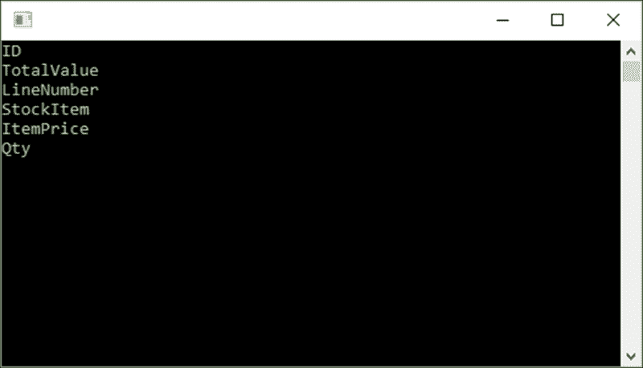

    如你所见，属性列表是按照在`Invoice`类中存在的顺序列出的。`IListClassProperties<T>`泛型接口和`InspectClass<T>`类不关心它们需要检查的类的类型。它们将接受任何类，对其运行代码，并产生结果。

但前面的实现仍然存在一个小问题。让我们看看这个问题的变体之一：

1.  考虑以下控制台应用程序中的代码：

    ```cs
    InspectClass<int> oClassInspector = new InspectClass<int>(10);
    List<string> lstProps = oClassInspector.GetPropertyList();
    foreach (string property in lstProps)
    {
        Console.WriteLine(property);
    }
    Console.ReadLine();
    ```

    你可以看到，我们很容易地将整数值和类型传递给`InspectClass<T>`类，代码没有任何警告。实际上，如果你运行这段代码，将不会返回任何内容，也不会在控制台窗口中输出任何内容。我们需要做的是在我们的泛型类和接口上实现约束。

1.  在类实现接口之后，在接口实现末尾添加`where T : class`子句。现在代码需要看起来像这样：

    ```cs
    public class InspectClass<T> : IListClassProperties<T> where T : class
    {
        T _classToInspect;
        public InspectClass(T classToInspect)
        {
            _classToInspect = classToInspect;
        }

        public List<string> GetPropertyList()
        {
            return _classToInspect.GetType().GetProperties().Select(p => p.Name).ToList();
        }
    }
    ```

1.  如果我们回到我们的控制台应用程序代码，你会看到 Visual Studio 已经下划线了传递给`InspectClass<T>`类的`int`类型：

    原因在于我们已经在我们的泛型类和接口上定义了一个约束。我们告诉编译器我们只接受引用类型。因此，这适用于任何类、接口、数组、类型或委托。因此，我们的`Invoice`类将是一个有效的类型，约束不会应用于它。

我们也可以在类型参数约束上更加具体。这样做的原因是，我们可能不希望将参数约束为引用类型。例如，如果我们想将泛型类和接口限制为只能接受在我们当前系统中创建的类，我们可以实现一个约束，即`T`的参数需要从一个特定的对象派生。在这里，我们可以再次使用抽象类：

1.  创建一个名为`AcmeObject`的抽象类，并指定所有从`AcmeObject`继承的类都必须实现一个名为`ID`的属性：

    ```cs
    public abstract class AcmeObject
    {
        public abstract int ID { get; set; }
    }
    ```

1.  现在，我们可以确保我们代码中创建的对象，需要从其读取属性的对象，都继承自`AcmeObject`。为了应用这个约束，修改泛型类并在接口实现后放置`where T : AcmeObject`约束。你的代码现在应该看起来像这样：

    ```cs
    public class InspectClass<T> : IListClassProperties<T> where T : AcmeObject
    {
        T _classToInspect;
        public InspectClass(T classToInspect)
        {
            _classToInspect = classToInspect;
        }

        public List<string> GetPropertyList()
        {
            return _classToInspect.GetType().GetProperties().Select(p => p.Name).ToList();
        }
    }
    ```

1.  在控制台应用程序中，将`Invoice`类修改为继承自`AcmeObject`抽象类。实现抽象类中定义的`ID`属性：

    ```cs
    public class Invoice : AcmeObject
    {
        public override int ID { get; set; }
        public decimal TotalValue { get; set; }
        public int LineNumber { get; set; }
        public string StockItem { get; set; }
        public decimal ItemPrice { get; set; }
        public int Qty { get; set; }            
    }
    ```

1.  创建两个名为`SalesOrder`和`CreditNote`的类。然而，这次，只让`SalesOrder`类继承自`AcmeObject`。将`CreditNote`对象保持原样。这样我们可以清楚地看到约束是如何应用的：

    ```cs
    public class SalesOrder : AcmeObject
    {
        public override int ID { get; set; }
        public decimal TotalValue { get; set; }
        public int LineNumber { get; set; }
        public string StockItem { get; set; }
        public decimal ItemPrice { get; set; }
        public int Qty { get; set; }
    }

    public class CreditNote
    {
        public int ID { get; set; }
        public decimal TotalValue { get; set; }
        public int LineNumber { get; set; }
        public string StockItem { get; set; }
        public decimal ItemPrice { get; set; }
        public int Qty { get; set; }
    }
    ```

1.  创建获取`Invoice`和`SalesOrder`类属性列表所需的代码。代码很简单，我们可以看到 Visual Studio 对这两个类都没有任何抱怨：

    ```cs
    Invoice oInvoice = new Invoice();
    InspectClass<Invoice> oInvClassInspector = new InspectClass<Invoice>(oInvoice);
    List<string> invProps = oInvClassInspector.GetPropertyList();

    foreach (string property in invProps)
    {
        Console.WriteLine(property);
    }
    Console.ReadLine();
    SalesOrder oSalesOrder = new SalesOrder();
    InspectClass<SalesOrder> oSoClassInspector = new InspectClass<SalesOrder>(oSalesOrder);
    List<string> soProps = oSoClassInspector.GetPropertyList();

    foreach (string property in soProps)
    {
        Console.WriteLine(property);
    }
    Console.ReadLine();
    ```

1.  然而，如果我们试图对我们的`CreditNote`类做同样的事情，我们会看到 Visual Studio 会警告我们无法将`CreditNote`类传递给`InspectClass<T>`类，因为我们实现的约束只接受派生自我们的`AcmeObject`抽象类的对象。通过这样做，我们实际上通过约束手段控制了允许传递给我们的泛型类和接口的确切内容：

## 它是如何工作的…

谈及泛型接口，我们已看到我们可以通过实现泛型接口来在泛型类上实现行为。使用泛型类和泛型接口的强大之处在前面已有很好的说明。

话虽如此，我们确实认为知道何时使用约束也很重要，这样你就可以将你的泛型类仅接受你想要的特定类型。这确保了当有人意外地将整数传递给你的泛型类时，你不会遇到任何惊喜。

最后，你可以使用的约束如下：

+   `where T: struct`: 类型参数必须是任何值类型

+   `where T: class`: 类型参数必须是任何引用类型

+   `where T: new()`: 类型参数需要一个无参构造函数

+   `where T: <base class name>`: 类型参数必须派生自给定的基类

+   `where T: <T must derive from object>`: `T` 类型参数必须在冒号之后派生自对象

+   `where T: <interface>`: 类型参数必须实现指定的接口
