# 第三章。C# 中的面向对象编程

本章将向你介绍 C# 和 **面向对象编程** （**OOP**）的基础。在本章中，你将涵盖以下食谱：

+   在 C# 中使用继承

+   使用抽象

+   利用封装

+   实现多态

+   单一职责原则

+   **开放/封闭** **原则**

# 简介

在你作为软件创作者的职业生涯中，你将多次听到 OOP 这个术语。这种设计哲学允许对象独立存在，并且可以被代码的不同部分重用。所有这一切都得益于我们所说的 OOP 的四个支柱，即继承、封装、抽象和多态。

为了掌握这一点，你需要开始思考执行特定任务的对象（基本上是实例化的类）。类需要遵循 SOLID 设计原则。这个原则在这里解释如下：

+   **单一职责** **原则** （**SRP**）

+   **开放/封闭** **原则**

+   **Liskov 替换** **原则** （**LSP**）

+   接口分离原则

+   依赖倒置原则

让我们先解释面向对象编程的四个支柱，然后我们将更详细地探讨 SOLID 原则。

# 在 C# 中使用继承

在当今世界，继承通常与事物的终结相关联。然而，在面向对象编程（OOP）中，它与新事物的开始和改进相关联。当我们创建一个新的类时，我们可以从一个已经存在的类中继承，我们的新类将继承它的所有特性，以及新类中添加的额外特性。这是继承的根本。我们将从另一个类继承的类称为派生类。

## 准备工作

为了说明继承的概念，我们将创建几个从另一个类继承以形成具有更多特性的新对象的类。

## 如何操作…

1.  通过右键单击你的解决方案并从上下文菜单中选择 **添加** 然后选择 **新项目** 来创建一个新的类库：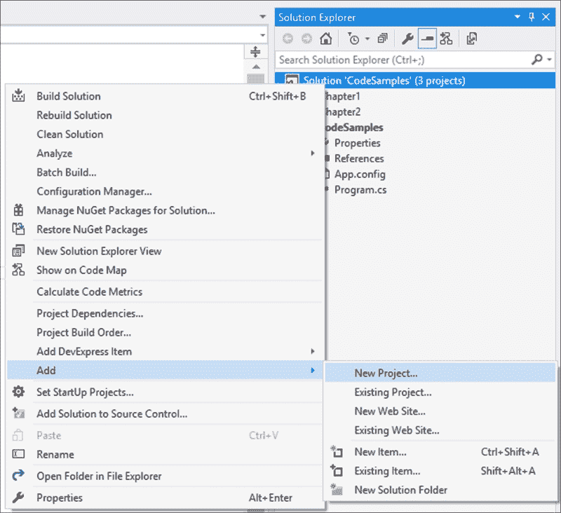

1.  在 **添加新项目** 对话框中，从已安装的模板中选择 **类库**，并将你的类命名为 `Chapter3`：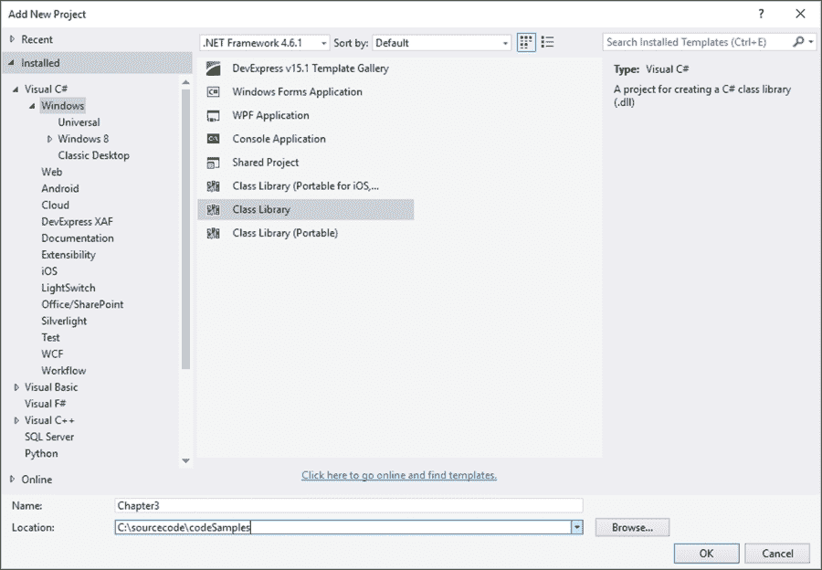

1.  你的新类库将以默认名称 `Class1.cs` 添加到你的解决方案中，我们将其重命名为 `Recipes.cs` 以便正确区分代码。然而，如果你觉得更有意义，你可以将你的类重命名为任何你喜欢的名称。

1.  要重命名你的类，只需在 **解决方案资源管理器** 中单击类名，然后从上下文菜单中选择 **重命名**：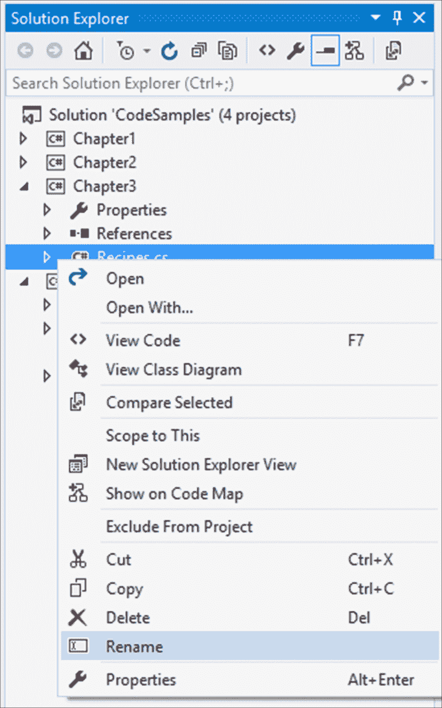

1.  Visual Studio 将要求你确认是否更改项目中所有对代码元素 **Class1** 的引用的名称。只需单击 **是**：

1.  现在，让我们创建一个名为 `SpaceShip` 的新类：

    ```cs
    public class SpaceShip
    {

    }
    ```

1.  我们的`SpaceShip`类将包含一些描述飞船基本功能的方法。将这些方法添加到你的`SpaceShip`类中：

    ```cs
    public class SpaceShip
    {
        public void ControlBridge()
        {

        }
        public void MedicalBay(int patientCapacity)
        {

        }
        public void EngineRoom(int warpDrives)
        {

        }
        public void CrewQuarters(int crewCapacity)
        {

        }
        public void TeleportationRoom()
        {

        }
    }
    ```

    因为`SpaceShip`类是所有其他星际飞船的一部分，它成为了其他所有飞船的蓝图。

1.  接下来，我们想要创建一个`Destroyer`类。为了实现这一点，我们将创建一个`Destroyer`类，并在类名后使用冒号来表示我们想要从另一个类（`SpaceShip`类）继承。因此，在创建`Destroyer`类时需要添加以下内容：

    ```cs
    public class Destroyer : SpaceShip
    {

    }
    ```

    ### 注意

    我们也可以说`Destroyer`类是从`SpaceShip`类派生出来的。因此，`SpaceShip`类是所有其他星际飞船的基类。

1.  接下来，向`Destroyer`类添加一些仅属于驱逐舰的独特方法。这些方法仅属于`Destroyer`类，而不属于`SpaceShip`类：

    ```cs
    public class Destroyer : SpaceShip
    {
        public void WarRoom()
        {

        }
        public void Armory(int payloadCapacity)
        {

        }

        public void WarSpecialists(int activeBattalions)
        {

        }
    }
    ```

1.  最后，创建一个名为`Annihilator`的第三个类。这是最强大的星际飞船，用于在行星上发动战争。通过创建类并将它标记为从`Destroyer`类派生出来，让`Annihilator`类继承自`Destroyer`类，如下所示`Annihilator : Destroyer`：

    ```cs
    public class Annihilator : Destroyer
    {

    }
    ```

1.  最后，向`Annihilator`类添加一些仅属于此类飞船的方法：

    ```cs
    public class Annihilator : Destroyer
    {
        public void TractorBeam()
        {

        }

        public void PlanetDestructionCapability()
        {

        }
    }
    ```

1.  在控制台应用程序中，通过在**CodeSamples**项目下的**References**上右键单击并从上下文菜单中选择**Add Reference**来添加对`Chapter3`类库的引用：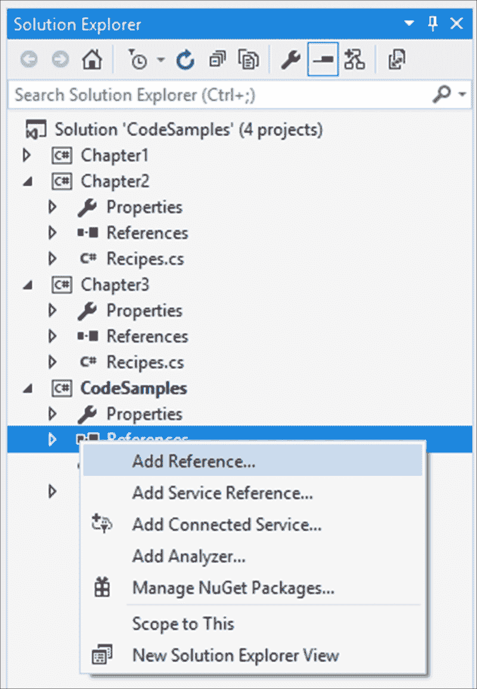

1.  在**Reference Manager**窗口中，选择**Projects** | **Solutions**下的`Chapter3`解决方案。这将允许你在控制台应用程序中使用我们刚刚创建的类：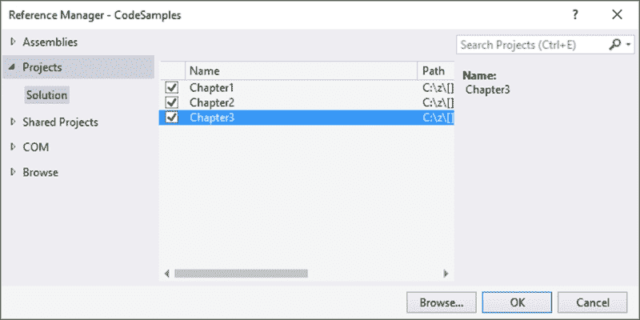

1.  现在我们看到的是，当我们创建`SpaceShip`类的新实例时，只有在该类中定义的方法对我们可用。这是因为`SpaceShip`类没有从任何其他类继承：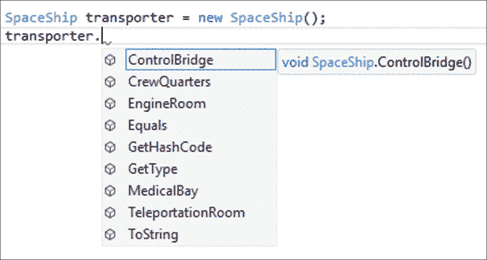

1.  在控制台应用程序中创建包含其方法的`SpaceShip`类：

    ```cs
    SpaceShip transporter = new SpaceShip();
    transporter.ControlBridge();
    transporter.CrewQuarters(1500);
    transporter.EngineRoom(2);
    transporter.MedicalBay(350);
    transporter.TeleportationRoom();
    ```

    你会看到，这些是我们实例化这个类的新实例时唯一可用的方法。

1.  接下来，创建`Destroyer`类的新实例。你会注意到`Destroyer`类包含的方法比我们在创建类时定义的方法要多。这是因为`Destroyer`类继承了`SpaceShip`类，因此继承了`SpaceShip`类的方法：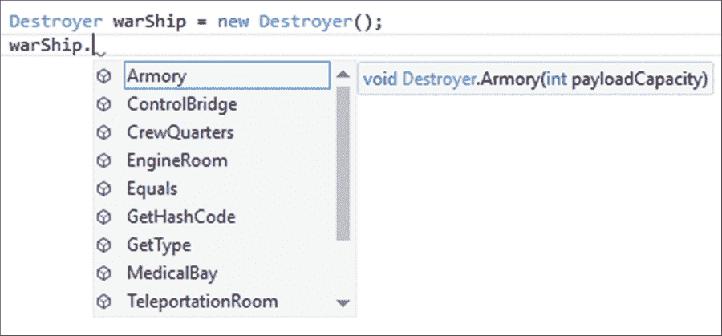

1.  在控制台应用程序中创建包含所有方法的`Destroyer`类：

    ```cs
    Destroyer warShip = new Destroyer();
    warShip.Armory(6);
    warShip.ControlBridge();
    warShip.CrewQuarters(2200);
    warShip.EngineRoom(4);
    warShip.MedicalBay(800);
    warShip.TeleportationRoom();
    warShip.WarRoom();
    warShip.WarSpecialists(1);
    ```

1.  最后，创建`Annihilator`类的新实例。这个类包含了`Destroyer`类的所有方法以及`SpaceShip`类的方法。这是因为`Annihilator`类从`Destroyer`类继承，而`Destroyer`类又从`SpaceShip`类继承：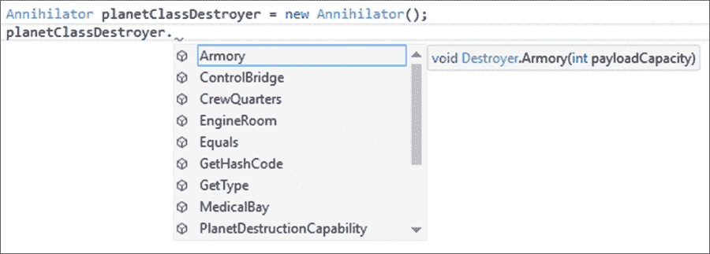

1.  在控制台应用程序中创建 `Annihilator` 类及其所有方法：

    ```cs
    Annihilator planetClassDestroyer = new Annihilator();
    planetClassDestroyer.Armory(12);
    planetClassDestroyer.ControlBridge();
    planetClassDestroyer.CrewQuarters(4500);
    planetClassDestroyer.EngineRoom(7);
    planetClassDestroyer.MedicalBay(3500);
    planetClassDestroyer.PlanetDestructionCapability();
    planetClassDestroyer.TeleportationRoom();
    planetClassDestroyer.TractorBeam();
    planetClassDestroyer.WarRoom();
    planetClassDestroyer.WarSpecialists(3);
    ```

## 它是如何工作的…

我们可以看到，继承使我们能够通过重用之前创建的另一个类中已经存在的功能来轻松扩展我们的类。但你也需要注意，对 `SpaceShip` 类的任何更改都将继承到最顶层的派生类。

继承是 C# 的一个非常强大的功能，它允许开发者编写更少的代码并重用已编写和测试过的方法。

# 使用抽象

通过抽象，我们从想要创建的对象中提取基本功能，所有从抽象对象派生的对象都必须具备这些功能。用简单的话来说，我们抽象出共同的功能，并将其放入一个单独的类中，这个类将被用来为从它继承的所有类提供共享功能。

## 准备工作

为了解释抽象，我们将使用抽象类。想象一下，你正在处理需要随着训练的进行而晋升等级的太空新兵。事实是，一旦你作为新兵学会一项新技能，这项技能就被学会了，即使你学会了更高级的做事方法，这项技能也会一直伴随着你。你必须在创建的新对象中实现所有之前学到的技能。抽象类很好地展示了这个概念。

## 如何做到这一点…

1.  创建一个名为 `SpaceCadet` 的抽象类。这是你开始训练时可以成为的第一种宇航员类型。抽象类及其成员使用 `abstract` 关键字定义。需要注意的是，抽象类不能被实例化。成员代表 `SpaceCadet` 将拥有的技能，例如谈判和基本武器训练：

    ```cs
    public abstract class SpaceCadet
    {
        public abstract void ChartingStarMaps();
        public abstract void BasicCommunicationSkill();
        public abstract void BasicWeaponsTraining();
        public abstract void Negotiation();
    }
    ```

1.  接下来，创建另一个名为 `SpacePrivate` 的抽象类，这个抽象类从 `SpaceCadet` 抽象类继承。我们基本上是在说，当一名太空新兵被训练成太空列兵时，他们仍然会保留作为太空新兵时学到的所有技能：

    ```cs
    public abstract class SpacePrivate : SpaceCadet
    {
        public abstract void AdvancedCommunicationSkill();
        public abstract void AdvancedWeaponsTraining();
        public abstract void Persuader();
    }
    ```

1.  为了演示这一点，创建一个名为 `LabResearcher` 的类，并从 `SpaceCadet` 抽象类继承。从抽象类继承是通过在新建的类名后定义一个冒号和抽象类名称来完成的。这告诉编译器 `LabResearcher` 类是从 `SpaceCadet` 类继承的：

    ```cs
    public class LabResearcher : SpaceCadet
    {

    }
    ```

    由于我们正在继承一个抽象类，编译器会在 `LabResearcher` 类名下划线以警告我们，派生类没有实现 `SpaceCadet` 抽象类中的任何方法。

1.  如果你将鼠标悬停在波浪线上方，你会看到灯泡提示为我们提供了发现的问题：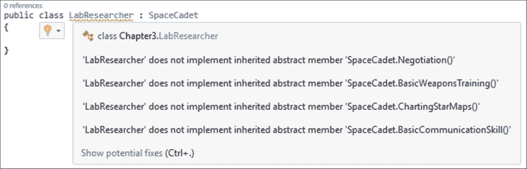

1.  Visual Studio 在提供解决方案以解决发现的问题方面做得很好。通过按 *Ctrl* + *.*（控制键和点），你可以让 Visual Studio 显示一些潜在修复（在这种情况下，只有一个修复）以解决已识别的问题：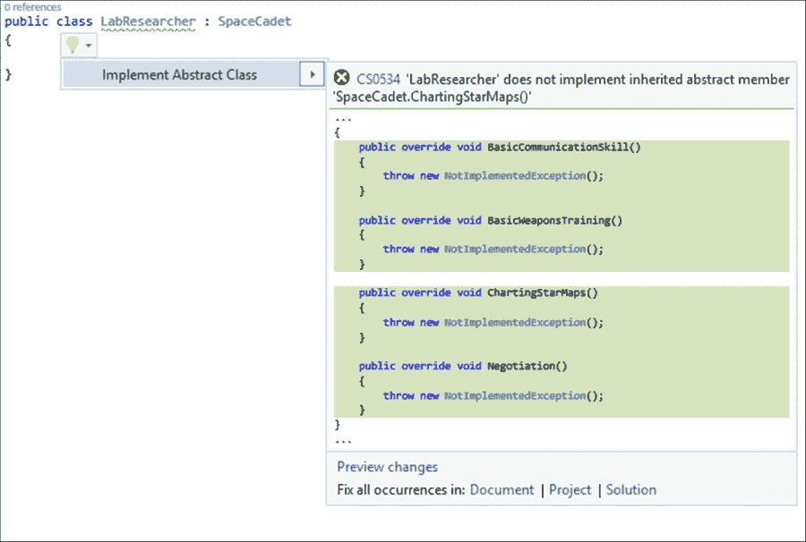

1.  在 Visual Studio 添加了所需的方法后，你会看到这些方法与 `SpaceCadet` 抽象类中定义的方法相同。因此，抽象类要求从抽象类继承的类实现抽象类中定义的方法。你还会注意到添加到 `LabResearcher` 类中的方法没有任何实现，如果直接使用将会抛出异常：

    ```cs
    public class LabResearcher : SpaceCadet
    {
        public override void BasicCommunicationSkill()
        {
            throw new NotImplementedException();
        }

        public override void BasicWeaponsTraining()
        {
            throw new NotImplementedException();
        }

        public override void ChartingStarMaps()
        {
            throw new NotImplementedException();
        }

        public override void Negotiation()
        {
            throw new NotImplementedException();
        }
    }
    ```

1.  接下来，创建一个名为 `PlanetExplorer` 的类，并使这个类继承自 `SpacePrivate` 抽象类。你会记得 `SpacePrivate` 抽象类是从 `SpaceCadet` 抽象类继承而来的：

    ```cs
    public class PlanetExplorer : SpacePrivate
    {

    }
    ```

1.  Visual Studio 将再次警告你，你的新类没有实现你继承的抽象类中的方法。然而，在这里，你会注意到灯泡提示告诉你，你没有在 `SpacePrivate` 和 `SpaceCadet` 抽象类中实现任何方法。这是因为 `SpacePrivate` 抽象类是从 `SpaceCadet` 抽象类继承而来的：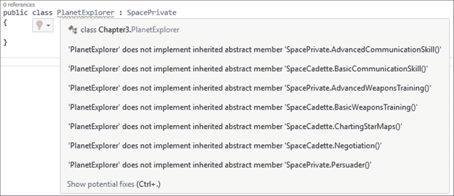

1.  要修复识别出的问题，请输入 *Ctrl* + *.*（控制键和点），让 Visual Studio 显示一些针对识别出的问题的潜在修复方案（在这种情况下，只有一个修复方案）：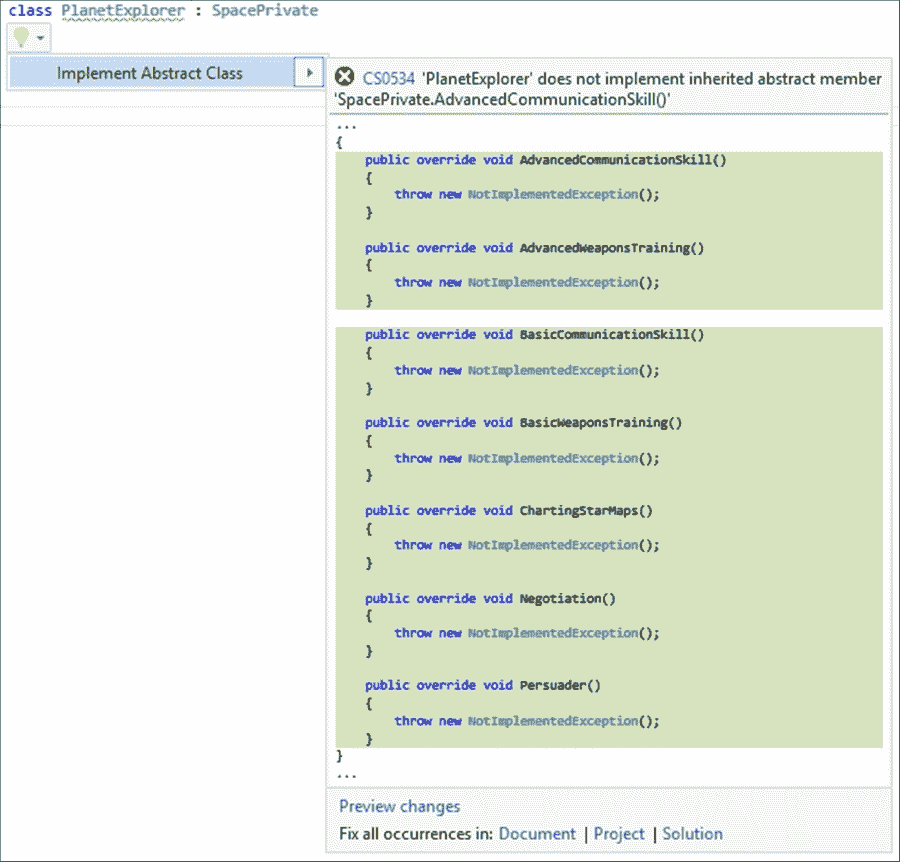

1.  在将修复方案添加到你的代码后，你会看到 `PlanetExplorer` 类包含了 `SpacePrivate` 和 `SpaceCadet` 抽象类中的所有方法：

    ```cs
    public class PlanetExplorer : SpacePrivate
    {
        public override void AdvancedCommunicationSkill()
        {
            throw new NotImplementedException();
        }

        public override void AdvancedWeaponsTraining()
        {
            throw new NotImplementedException();
        }

        public override void BasicCommunicationSkill()
        {
            throw new NotImplementedException();
        }

        public override void BasicWeaponsTraining()
        {
            throw new NotImplementedException();
        }

        public override void ChartingStarMaps()
        {
            throw new NotImplementedException();
        }

        public override void Negotiation()
        {
            throw new NotImplementedException();
        }

        public override void Persuader()
        {
            throw new NotImplementedException();
        }
    }
    ```

## 它是如何工作的……

抽象化使我们能够定义一组要在所有从抽象类派生的类之间共享的功能。从抽象类继承与从普通类继承之间的区别在于，使用抽象类时，你必须实现该抽象类中定义的所有方法。

这使得类易于版本控制和修改。如果你需要添加新功能，你可以通过将此功能添加到抽象类中来实现，而不会破坏任何现有代码。Visual Studio 将要求所有继承自抽象类的类实现抽象类中定义的新方法。

因此，你可以确信所做的更改将应用于所有从你的代码中的抽象类派生的类。

# 利用封装

封装是什么？简单来说，封装就是隐藏一个类内部不必要的实现细节。可以这样理解封装：大多数拥有汽车的人都知道汽车是靠汽油运行的。他们不需要了解内燃机的内部工作原理就能使用汽车。他们只需要知道当油快用完时需要加油，以及需要检查机油和轮胎压力。即使如此，通常也不是车主自己来做这些。对于类和封装来说，也是如此。

类的所有者是使用它的人。该类的内部工作原理不需要向使用该类的开发者公开。因此，该类就像一个黑盒。你知道，只要参数设置正确，类在功能上将是一致的。至于类如何得到输出，只要输入正确，对开发者来说并不重要。

## 准备工作

为了说明封装的概念，我们将创建一个在内部工作原理上相对复杂的类。我们需要计算航天飞机的**推重比**（**TWR**），以确定它是否能够垂直起飞。它需要施加比其重量更大的推力来对抗重力并进入稳定的轨道。这也取决于航天飞机起飞的行星，因为不同的行星对其表面的物体施加不同的重力。简单来说，TWR 必须大于一。

## 如何做到这一点…

1.  创建一个名为`LaunchSuttle`的新类。然后，向该类添加以下私有变量，用于发动机推力；航天飞机的质量；局部重力加速度；地球、月球和火星的重力常量值（这些是常量，因为它们永远不会改变）；万有引力常数；以及我们正在处理的行星枚举器：

    ```cs
    public class LaunchShuttle
    {
        private double _EngineThrust;
        private double _TotalShuttleMass;
        private double _LocalGravitationalAcceleration;

        private const double EarthGravity = 9.81;
        private const double MoonGravity = 1.63;
        private const double MarsGravity = 3.75;
        private double UniversalGravitationalConstant;

        public enum Planet { Earth, Moon, Mars }
    }
    ```

1.  为了我们的类，我们将添加三个重载构造函数，这些构造函数对于根据实例化时的已知事实计算 TWR 是必不可少的（我们假设我们总是会知道发动机推力能力和航天飞机的质量）。我们将为第一个构造函数传递重力加速度。如果我们事先知道这个值，这很有用。例如，地球的重力加速度是 9.81 m/s²。

    第二个构造函数将使用`Planet`枚举来计算使用常量变量值的 TWR。

    第三个构造函数将使用行星的半径和质量来计算当这些值已知时返回 TWR 的重力加速度：

    ```cs
    public LaunchShuttle(double engineThrust, double totalShuttleMass, double gravitationalAcceleration)
    {
        _EngineThrust = engineThrust;
        _TotalShuttleMass = totalShuttleMass;
        _LocalGravitationalAcceleration = gravitationalAcceleration;

    }

    public LaunchShuttle(double engineThrust, double totalShuttleMass, Planet planet)
    {
        _EngineThrust = engineThrust;
        _TotalShuttleMass = totalShuttleMass;
        SetGraviationalAcceleration(planet);

    }

    public LaunchShuttle(double engineThrust, double totalShuttleMass, double planetMass, double planetRadius)
    {
        _EngineThrust = engineThrust;
        _TotalShuttleMass = totalShuttleMass;
        SetUniversalGravitationalConstant();
        _LocalGravitationalAcceleration = Math.Round(CalculateGravitationalAcceleration (planetRadius, planetMass), 2);
    }
    ```

1.  为了使用传递`Planet`枚举作为参数给类的第二个重载构造函数，我们需要创建另一个被范围限定为`private`的方法来计算重力加速度。我们还需要将`_LocalGravitationalAcceleration`变量设置为与枚举值匹配的特定常量。这个方法是对类用户来说不需要看到就能使用类的方法。因此，它被范围限定为`private`，以便从用户那里隐藏该功能：

    ```cs
    private void SetGraviationalAcceleration(Planet planet)
    {
        switch (planet)
        {
             case Planet.Earth:
                _LocalGravitationalAcceleration = EarthGravity;
                break;
             case Planet.Moon:
                _LocalGravitationalAcceleration = MoonGravity;
                break;
             case Planet.Mars:
                _LocalGravitationalAcceleration = MarsGravity;
                break;
            default:
                break;
        }
    }
    ```

1.  在以下方法中，只有一个被定义为公共的，因此对类的用户是可见的。创建私有方法来设置万有引力常数、计算 TWR 和计算重力加速度。这些方法都被设置为私有作用域，因为开发者不需要知道这些方法做什么，以便使用该类：

    ```cs
    private void SetUniversalGravitationalConstant()
    {
        UniversalGravitationalConstant = 6.6726 * Math.Pow(10, -11);
    }

    private double CalculateThrustToWeightRatio()
    {
        // TWR = Ft/m.g > 1
        return _EngineThrust / (_TotalShuttleMass * _LocalGravitationalAcceleration);
    }

    private double CalculateGravitationalAcceleration(double radius, double mass)
    {
        return (UniversalGravitationalConstant * mass) / Math.Pow(radius, 2);
    }

    public double TWR()
    {
        return Math.Round(CalculateThrustToWeightRatio(), 2);
    }
    ```

1.  最后，在你的控制台应用程序中，创建以下具有已知值的变量：

    ```cs
    double thrust = 220; // kN
    double shuttleMass = 16.12; // t
    double graviatatonalAccelerationEarth = 9.81;
    double earthMass = 5.9742 * Math.Pow(10, 24);
    double earthRadius = 6378100;
    double thrustToWeightRatio = 0;
    ```

1.  创建`LaunchShuttle`类的新实例，并传递计算 TWR 所需的价值：

    ```cs
    LaunchShuttle NasaShuttle1 = new LaunchShuttle(thrust, shuttleMass, graviatatonalAccelerationEarth);
    thrustToWeightRatio = NasaShuttle1.TWR();
    Console.WriteLine(thrustToWeightRatio);
    ```

1.  当你在`NasaShuttle1`变量上使用点操作符时，你会注意到 IntelliSense 只显示`TWR`方法。这个类没有暴露任何关于它是如何得到计算出的 TWR 值的内部工作原理。开发者唯一知道的是，给定相同的输入参数，`LaunchShuttle`类将始终返回正确的 TWR 值：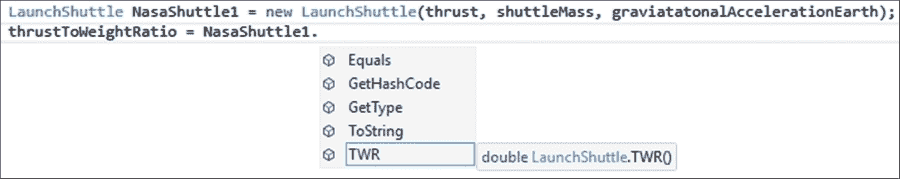

1.  为了测试这一点，创建`LaunchShuttle`类的两个更多实例，并且每次调用不同的构造函数：

    ```cs
    LaunchShuttle NasaShuttle2 = new LaunchShuttle(thrust, shuttleMass, LaunchShuttle.Planet.Earth);
    thrustToWeightRatio = NasaShuttle2.TWR();
    Console.WriteLine(thrustToWeightRatio);

    LaunchShuttle NasaShuttle3 = new LaunchShuttle(thrust, shuttleMass, earthMass, earthRadius);
    thrustToWeightRatio = NasaShuttle3.TWR();
    Console.WriteLine(thrustToWeightRatio);

    Console.Read();
    ```

1.  如果你运行你的控制台应用程序，你会看到 TWR 的值是相同的。这个值表明，一个重 16.12 吨的航天飞机，如果火箭产生 220 千牛顿的推力，将能够从地球表面起飞（即使只是勉强）：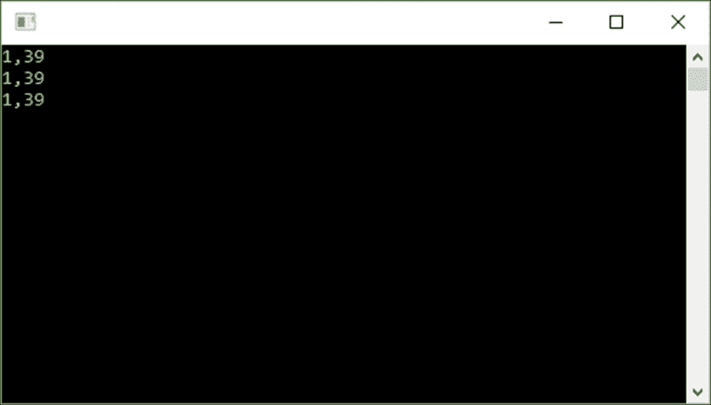

## 它是如何工作的…

该类使用作用域规则来隐藏类内部的一些功能，以防止类使用者访问。如前所述，开发者不需要知道如何进行计算，以便返回 TWR 的值。所有这些都帮助使类更有用且易于实现。以下是 C#中可用的各种作用域及其用途列表：

+   `Public`：这个关键字用于变量、属性、类型和方法，并且在任何地方都是可见的。

+   `Private`：这个关键字用于变量、属性、类型和方法，并且仅在定义它们的代码块中可见。

+   `Protected`：这个关键字用于变量、属性和方法。不要从公共或私有角度考虑这个问题。受保护的访问级别仅在其使用的类内部以及任何继承的类中可见。

+   `Friend`：这个关键字用于变量、属性和方法，并且只能由同一项目或程序集内的代码使用。

+   `Protected Friend`：这个关键字用于变量、属性和方法，并且是受保护作用域和友元作用域的组合（正如其名称所暗示的）。

# 实现多态性

一旦你研究了并理解了 OOP 的其他支柱，多态性这个概念就很容易掌握了。多态性字面上意味着某物可以有多种形式。这意味着从一个单一接口，你可以创建多个实现。

这有两个子部分，即静态多态和动态多态。在静态多态中，您正在处理方法和函数的重载。您可以使用相同的方法，但执行许多不同的任务。

在动态多态中，您正在处理抽象类的创建和实现。这些抽象类充当蓝图，告诉您派生类应该实现什么。下一节将探讨这两者。

## 准备工作

我们将首先通过展示抽象类的使用来阐述，这是一个动态多态的例子。然后，我们将创建重载构造函数作为静态多态的例子。

## 如何实现它…

1.  创建一个名为 `Shuttle` 的抽象类，并给它一个名为 `TWR` 的成员，这是计算航天飞机的 TWR：

    ```cs
    public abstract class Shuttle
    {
        public abstract double TWR();
    }
    ```

1.  接下来，创建一个名为 `NasaShuttle` 的类，并使其继承自抽象类 `Shuttle`，通过在 `NasaShuttle` 类声明末尾冒号后放置抽象类名称来实现：

    ```cs
    public class NasaShuttle : Shuttle
    {

    }
    ```

1.  Visual Studio 将下划线显示 `NasaShuttle` 类，因为您已告诉编译器该类继承自一个抽象类，但您尚未实现该抽象类的成员：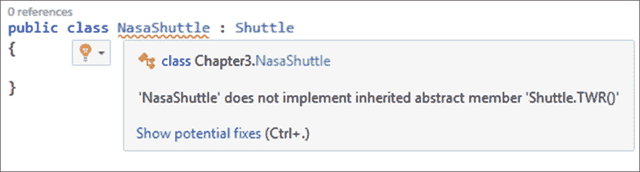

1.  为了修复已识别的问题，按 *Ctrl* + *.*（控制键和点）并让 Visual Studio 显示一些潜在的修复方案（在这种情况下，只有一个修复方案）以解决已识别的问题：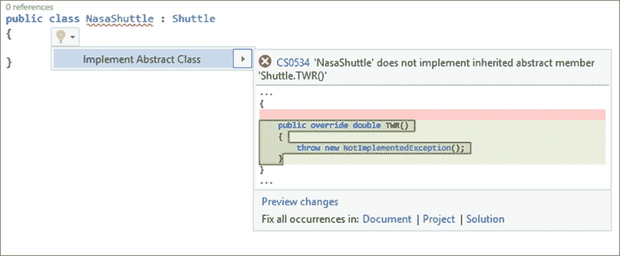

1.  Visual Studio 然后将缺失的实现添加到您的 `NasaShuttle` 类中。默认情况下，它将添加为未实现，因为您需要为在抽象类中重写的抽象成员提供实现：

    ```cs
    public class NasaShuttle : Shuttle
    {
        public override double TWR()
        {
            throw new NotImplementedException();
        }
    }
    ```

1.  创建另一个名为 `RoscosmosShuttle` 的类，并使其继承自相同的 `Shuttle` 抽象类：

    ```cs
    public class RoscosmosShuttle : Shuttle
    {

    }
    ```

1.  Visual Studio 将下划线显示 `RoscosmosShuttle` 类，因为您已告诉编译器该类继承自一个抽象类，但您尚未实现该抽象类的成员：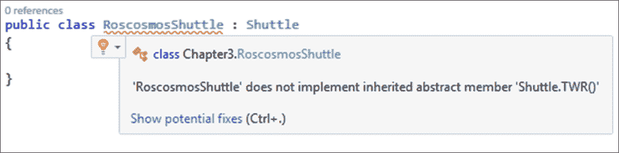

1.  为了修复已识别的问题，按 *Ctrl* + *.*（控制键和点）并让 Visual Studio 显示一些潜在的修复方案（在这种情况下，只有一个修复方案）以解决已识别的问题：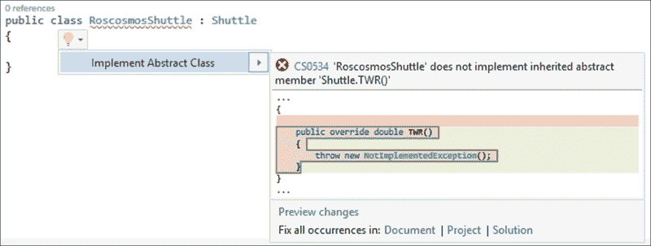

1.  被重写的方法随后被添加到 `RoscosmosShuttle` 类中，标记为未实现。您刚刚看到了动态多态的一个实际例子：

    ```cs
    public class RoscosmosShuttle : Shuttle
    {
        public override double TWR()
        {
            throw new NotImplementedException();
        }
    }
    ```

1.  要查看静态多态的示例，为 `NasaShuttle` 创建以下重载构造函数。构造函数名称保持不变，但构造函数的签名发生变化，这使得它成为重载：

    ```cs
    public NasaShuttle(double engineThrust, double totalShuttleMass, double gravitationalAcceleration)
    {

    }

    public NasaShuttle(double engineThrust, double totalShuttleMass, double planetMass, double planetRadius)
    {

    }
    ```

## 它是如何工作的…

多态性是你可以通过简单地应用良好的面向对象原则到你的类的设计中而轻松使用的东西。通过使用抽象的`Shuttle`类，我们看到当它用来从其抽象中派生新类时，该类采取了`NasaShuttle`类和`RoscosmosShuttle`类的形状。然后，`NasaShuttle`类的构造函数被重写以提供相同的方法名，但使用不同的签名来实现。

这是多态性的核心。你很可能在使用它时并不知道。

# 单一职责原则

当谈论 SOLID 原则时，我们将从 SRP（单一职责原则）开始。在这里，我们实际上是在说一个类有一个特定的任务需要完成，它不应该做其他任何事情。

## 准备工作

你将创建一个新的类，并编写代码在向星际飞船添加更多部队时抛出异常，导致其超负荷时，将错误记录到数据库中。

## 如何操作…

1.  创建一个名为`StarShip`的新类：

    ```cs
    public class Starship
    {

    }
    ```

1.  向你的类中添加一个新方法，用于设置`StarShip`类的最大部队容量：

    ```cs
    public void SetMaximumTroopCapacity(int capacity)
    {            

    }
    ```

1.  在这个方法中，添加一个`trycatch`子句，尝试设置最大部队容量，但出于某种原因，它将失败。失败后，它将错误写入数据库中的日志表：

    ```cs
    try
    {
        // Read current capacity and try to add more
    }
    catch (Exception ex)
    {
        string connectionString = "connection string goes here";
        string sql = $"INSERT INTO tblLog (error, date) VALUES ({ex.Message}, GetDate())";
        using (SqlConnection con = new SqlConnection(connectionString))
        {
            SqlCommand cmd = new SqlCommand(sql);
            cmd.CommandType = CommandType.Text;
            cmd.Connection = con;
            con.Open();
            cmd.ExecuteNonQuery();
        }
        throw ex;
    }
    ```

## 它是如何工作的…

如果你有的代码看起来像前面的代码，你违反了 SRP（单一职责原则）。`StarShip`类不再只负责自身以及与星际飞船相关的事物。现在它还必须承担将错误记录到数据库的角色。你在这里看到的问题是，数据库记录代码不属于`SetMaximumTroopCapacity`方法的`catch`子句。更好的方法是将创建一个单独的`DatabaseLogging`类，其中包含创建连接和将异常写入适当日志表的方法。你还会发现你将不得不在多个地方（每个`catch`子句）编写那些记录代码。如果你发现自己正在重复代码（通过从其他区域复制粘贴），你可能需要将那些代码放入一个公共类中，你很可能已经违反了 SRP 规则。

# 开放/封闭原则

在创建类时，我们需要确保类通过需要更改内部代码来禁止任何破坏性的修改。我们说这样的类是封闭的。如果我们需要以某种方式更改它，我们可以通过扩展类来实现。这种可扩展性就是我们所说的类对扩展是开放的。

## 准备工作

你将创建一个类，通过查看士兵的类别来确定士兵的技能。我们将向你展示许多开发者创建此类的方式以及如何使用开放/封闭原则创建此类。

## 如何操作…

1.  创建一个名为`StarTrooper`的类：

    ```cs
    public class StarTrooper
    {

    }
    ```

1.  向这个类添加一个枚举器`TrooperClass`，以标识我们想要返回技能的士兵类型。此外，创建一个`List<string>`变量来包含特定士兵类的技能。最后，创建一个名为`GetSkills`的方法，该方法返回给定士兵类的特定技能集。

    这个类相当简单，但代码的实现是我们经常看到的。有时，您会看到大量的`if` `else`语句而不是`switch`语句。虽然代码的功能是清晰的，但在不更改代码的情况下很难向`StarTrooper`类添加另一个士兵类。假设您现在必须向`StarTrooper`类添加一个额外的`Engineer`类。您将不得不修改`TrooperClass`枚举和`switch`语句中的代码。

    这种代码的更改可能会导致您在之前运行良好的代码中引入错误。我们现在看到`StarTrooper`类不是封闭的，并且不能轻松扩展以适应额外的`TrooperClass`对象：

    ```cs
    public enum TrooperClass { Soldier, Medic, Scientist }
    List<string> TroopSkill;

    public List<string> GetSkills(TrooperClass troopClass)
    {
        switch (troopClass)
        {
            case TrooperClass.Soldier:
            return TroopSkill = new List<string>(new string[] { "Weaponry", "TacticalCombat", "HandToHandCombat" });

            case TrooperClass.Medic:
            return TroopSkill = new List<string>(new string[] { "CPR", "AdvancedLifeSupport" });

            case TrooperClass.Scientist:
            return TroopSkill = new List<string>(new string[] { "Chemistry", "MollecularDeconstruction", "QuarkTheory" });

            default:
                return TroopSkill = new List<string>(new string[] { "none" });
        }
    }
    ```

1.  这个问题的解决方案是继承。我们不需要更改代码，而是扩展它。首先，重写上面的`StarTrooper`类并创建一个`Trooper`类。`GetSkills`方法被声明为`virtual`：

    ```cs
    public class Trooper
    {
        public virtual List<string> GetSkills()
        {
            return new List<string>(new string[] { "none" });
        }
    }
    ```

1.  现在，我们可以轻松地为可用的`Soldier`、`Medic`和`Scientist`士兵类创建派生类。创建以下从`Trooper`类继承的派生类。您可以看到，在创建`GetSkills`方法时使用了`override`关键字：

    ```cs
    public class Soldier : Trooper
    {
        public override List<string> GetSkills()
        {
             return new List<string>(new string[] { "Weaponry", "TacticalCombat", "HandToHandCombat" });
        }
    }

    public class Medic : Trooper
    {
        public override List<string> GetSkills()
        {
            return new List<string>(new string[] { "CPR", "AdvancedLifeSupport" });
        }
    }

    public class Scientist : Trooper
    {
        public override List<string> GetSkills()
        {
            return new List<string>(new string[] { "Chemistry", "MollecularDeconstruction", "QuarkTheory" });
        }
    }
    ```

1.  当扩展类以添加额外的`Trooper`类时，代码变得极其容易实现。如果我们现在想添加`Engineer`类，我们只需在从之前创建的`Trooper`类继承后简单地重写`GetSkills`方法：

    ```cs
    public class Engineer : Trooper
    {
    public override List<string> GetSkills()
        {
            return new List<string>(new string[] { "Construction", "Demolition" });
        }
    }
    ```

## 它是如何工作的...

从`Trooper`类派生的类是`Trooper`类的扩展。我们可以这样说，每个类都是封闭的，因为修改它不需要更改原始代码。`Trooper`类也是可扩展的，因为我们能够通过从它创建派生类来轻松扩展类。

这种设计的另一个副产品是更小、更易于管理的代码，它更容易阅读和理解。
