# 第六章。使用异步编程使应用程序响应

本章将向您介绍异步编程。本章将涵盖以下食谱：

+   异步函数的返回类型

+   异步编程中的任务处理

+   异步编程中的异常处理

# 简介

异步编程是 C# 中的一项激动人心的特性。它允许你在主线程上继续程序执行的同时，一个长时间运行的任务在其自己的线程中单独运行，与主线程分开。当这个长时间运行的任务完成时，它会通知主线程它已经完成（或失败）。异步编程的好处是它提高了应用程序的响应性。了解和掌握异步编程的最佳方式是亲身体验。以下食谱将向您展示一些基本概念。

# 异步函数的返回类型

在异步编程中，`async` 方法可以有三种可能的返回类型。这些是：

+   `void`

+   `Task`

+   `Task<TResult>`

我们将在接下来的食谱中查看每种返回类型。

## 准备工作

异步方法中 `void` 返回类型有什么用？通常，`void` 与事件处理器一起使用。请记住，`void` 不返回任何内容，因此您不能等待它。因此，如果您调用返回类型为 `void` 的异步方法，您的调用代码应该能够在不需要等待异步方法完成的情况下继续执行代码。

对于返回类型为 `Task` 的异步方法，您可以使用 `await` 操作符暂停当前线程的执行，直到被调用的异步方法完成。请记住，返回类型为 `Task` 的异步方法基本上不返回操作数。因此，如果它被编写为同步方法，它将是一个 `void` 返回类型的方法。这个声明可能有些令人困惑，但在接下来的食谱中会变得清晰。

最后，具有 `return` 语句的异步方法具有 `TResult` 返回类型。换句话说，如果异步方法返回布尔值，您将创建一个返回类型为 `Task<bool>` 的异步方法。

让我们从返回类型为 `void` 的异步方法开始。

## 如何操作…

1.  通过右键单击您的解决方案并从上下文菜单中选择 **添加**，然后选择 **新建项目** 来创建一个新的类库：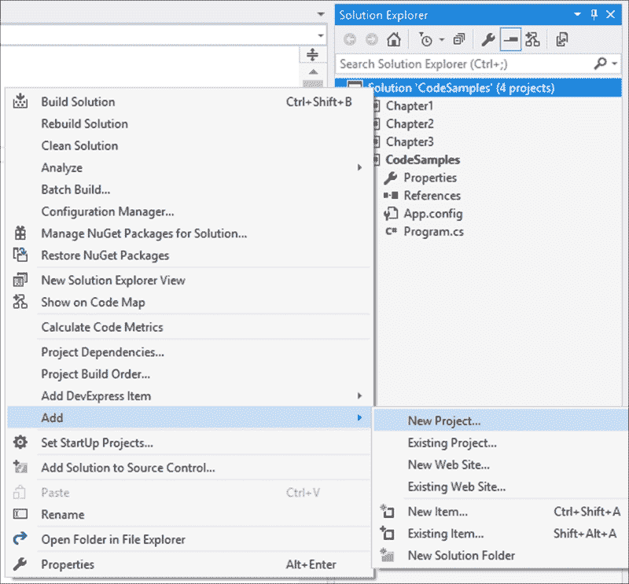

1.  在 **新建项目** 对话框屏幕上，从已安装的模板中选择 **类库**，并将您的类命名为 `Chapter6`：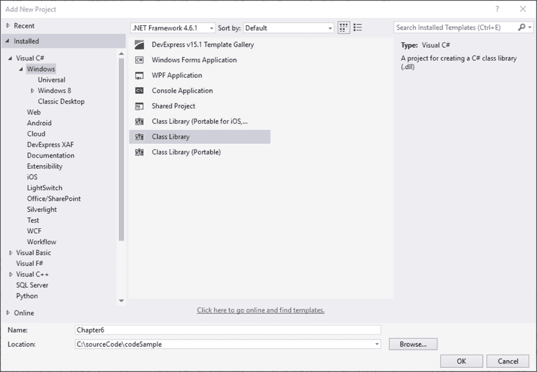

1.  您的新类库将以默认名称 `Class1.cs` 添加到您的解决方案中，我们将它重命名为 `Recipes.cs` 以便正确地区分代码。然而，如果您觉得更合适，您可以将您的类重命名为任何您喜欢的名称。

1.  要重命名您的类，只需在 **解决方案资源管理器** 中单击类名，并从上下文菜单中选择 **重命名**：

1.  Visual Studio 将要求您确认项目中所有对代码元素 **Class1** 的引用的新名称。只需点击 **是**：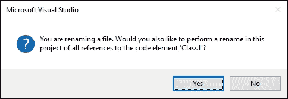

1.  下一步是添加另一个新项目。在解决方案上右键单击，并从上下文菜单中选择 **添加**，然后选择 **新项目**：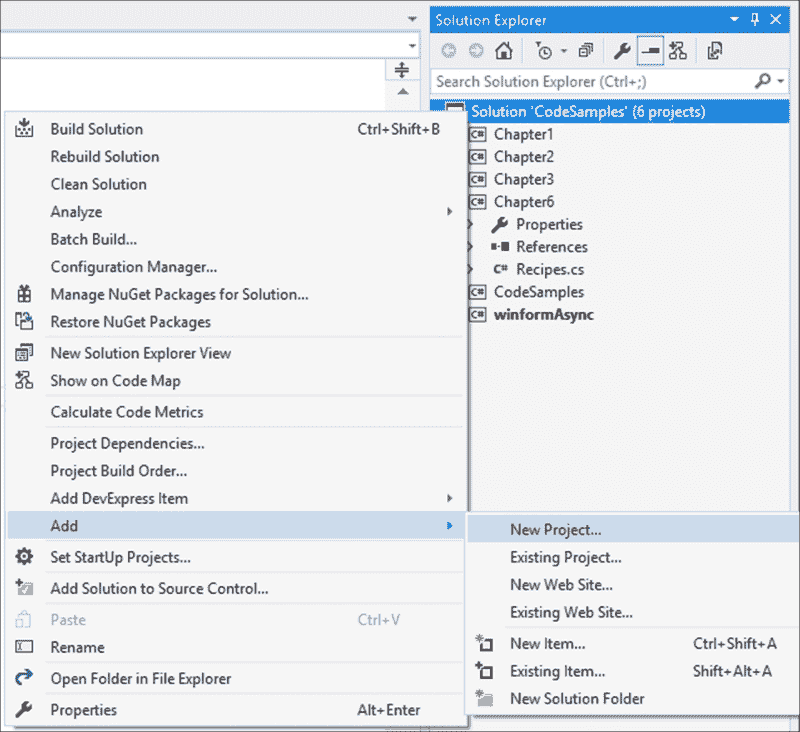

1.  这次，您将为您的解决方案创建一个新的 Windows Forms 应用程序。我们需要这样做，以便我们可以创建一个按钮点击事件。我们称我们的项目为 `winformAsync`：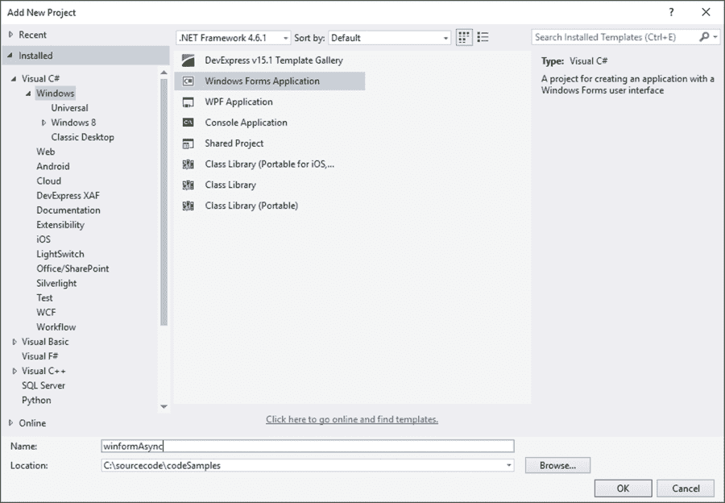

1.  您的 **解决方案资源管理器** 现在将类似于以下截图，其中添加了 Winforms 应用程序：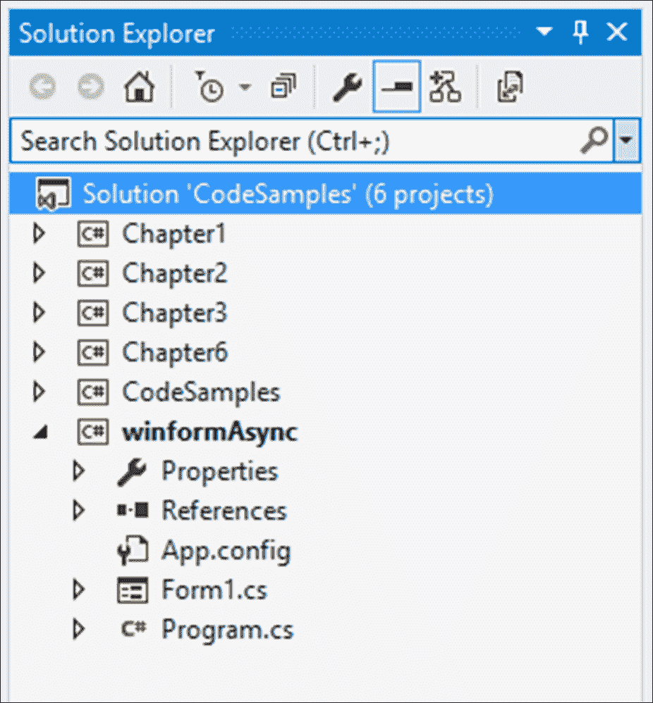

1.  在您添加了 Winforms 应用程序后，添加对您之前创建的 `Chapter6` 类的引用。为此，在 **winformAsync** 项目的 **引用** 下右键单击，并从上下文菜单中选择 **添加引用** 菜单项：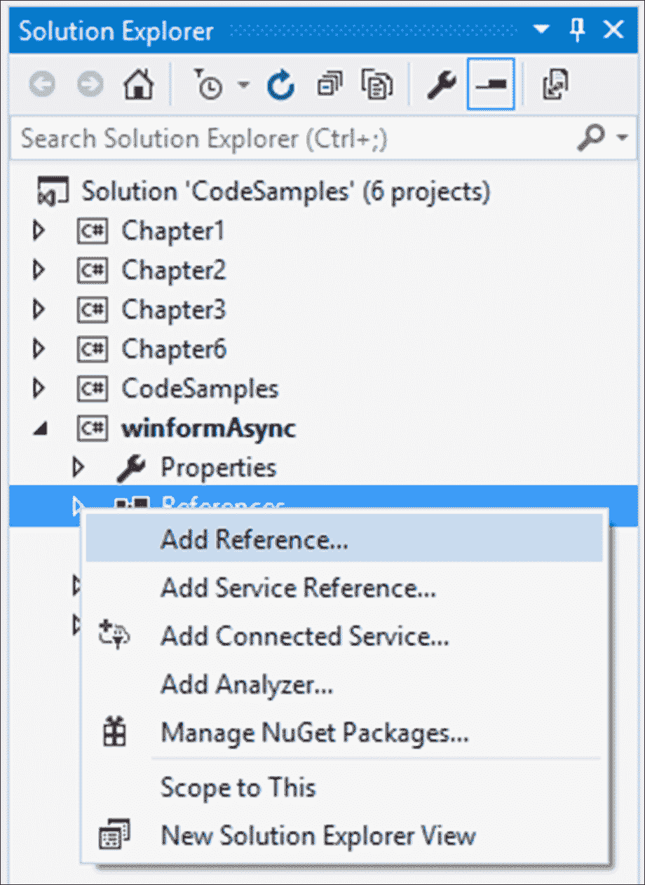

1.  从 **引用管理器** 屏幕中，选择位于左侧树视图中的 **项目** | **解决方案** 节点下的 `Chapter6` 类，然后单击 **确定** 按钮：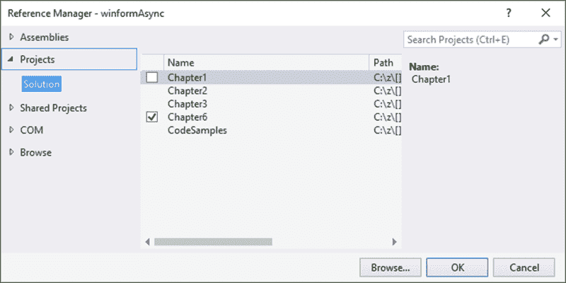

1.  另一个重要步骤是将 **winformAsync** 项目设置为解决方案中的启动项目。为此，右键单击 **winformAsync** 项目，并从上下文菜单中选择 **设置为启动项目** 菜单项：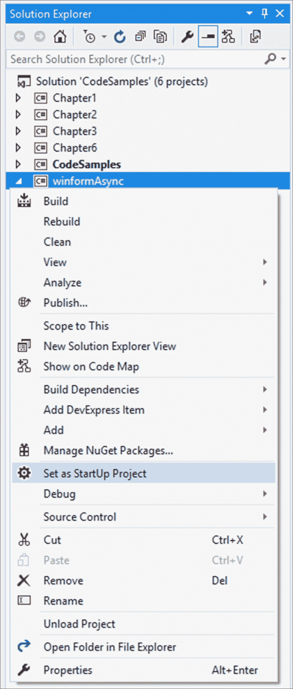

1.  在 **winformAsync** 表单设计器中，打开 **工具箱** 并选择位于 **所有 Windows Forms** 节点下的 **按钮** 控件：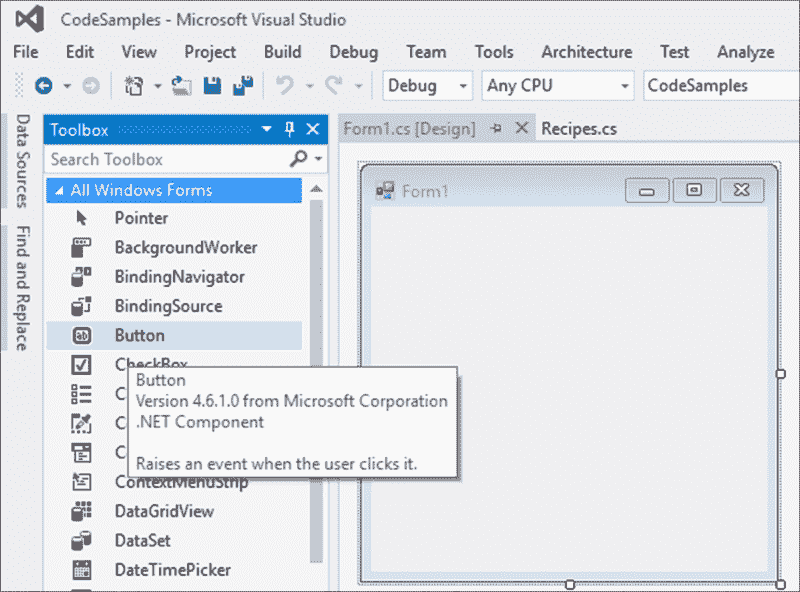

1.  将按钮控件拖放到 **Form1** 设计器中：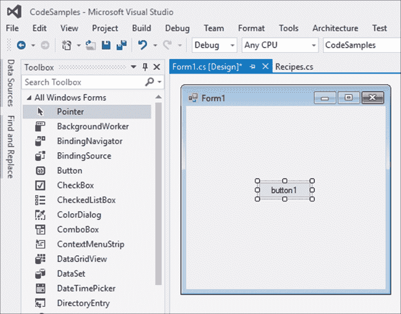

1.  在选择了按钮控件后，双击控件以在代码后面创建点击事件。Visual Studio 将为您插入事件代码：

    ```cs
    namespace winformAsync
    {
        public partial class Form1 : Form
        {
            public Form1()
            {
                InitializeComponent();
            }

            private void button1_Click(object sender, EventArgs e)
            {

            }
        }
    }
    ```

1.  修改 `button1_Click` 事件并添加 `async` 关键字到点击事件。这是一个返回 `void` 的异步方法的示例：

    ```cs
    private async void button1_Click(object sender, EventArgs e)
    {

    }
    ```

1.  在 `Chapter6` 类库中，添加一个名为 `AsyncDemo` 的新类：

    ```cs
    public class AsyncDemo
    {
    }
    ```

1.  要添加到 `AsyncDemo` 类的下一个方法是返回 `TResult`（在这种情况下，一个布尔值）的异步方法。此方法简单地检查当前年份是否为闰年，然后向调用代码返回一个布尔值：

    ```cs
    async Task<bool> TaskOfTResultReturning_AsyncMethod()
    {
        return await Task.FromResult<bool> (DateTime.IsLeapYear(DateTime.Now.Year));
    }
    ```

1.  下一个要添加的方法是返回 `Task` 类型的 `void` 返回方法，这样它允许您等待方法。该方法本身不返回任何结果，因此它是一个返回 `void` 的方法。然而，为了使用 `await` 关键字，您需要从此异步方法返回 `Task` 类型：

    ```cs
    async Task TaskReturning_AsyncMethod()
    {
        await Task.Delay(5000);
        Console.WriteLine("5 second delay");
    }
    ```

1.  最后，添加一个方法来调用前面的异步方法并显示闰年检查的结果。您会注意到我们在两个方法调用中都使用了`await`关键字：

    ```cs
    public async Task LongTask()
    {
        bool isLeapYear = await TaskOfTResultReturning_AsyncMethod();
        Console.WriteLine($"{DateTime.Now.Year} {(isLeapYear ? " is " : "  is not  ")} a leap year");
        await TaskReturning_AsyncMethod();
    }
    ```

1.  在按钮点击中，添加以下代码以异步调用长时间运行的任务：

    ```cs
    private async void button1_Click(object sender, EventArgs e)
    {
        Console.WriteLine("Button Clicked");
        Chapter6.AsyncDemo oAsync = new Chapter6.AsyncDemo();
        await oAsync.LongTask();
        Console.WriteLine("Button Click Ended");
    }
    ```

1.  运行您的应用程序将显示 Windows 窗体应用程序：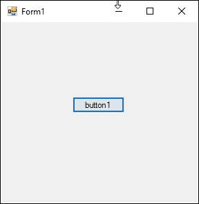

1.  在点击**button1**按钮之前，确保**输出**窗口是可见的：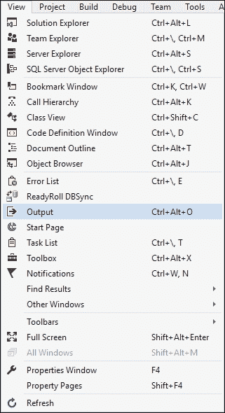

1.  从**视图**菜单中，点击**输出**菜单项或按*Ctrl* + *Alt* + *O*显示**输出**窗口。这将允许我们看到`Console.Writeline()`输出，因为我们已经将它们添加到`Chapter6`类和 Windows 应用程序中的代码中。

1.  点击**button1**按钮将在我们的**输出**窗口中显示输出。在整个代码执行过程中，窗体保持响应：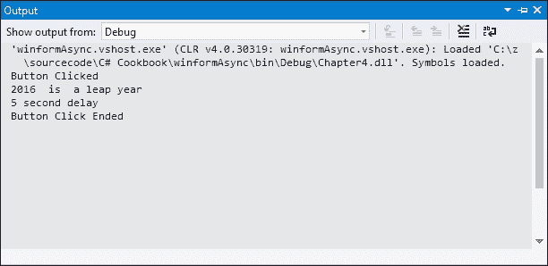

1.  最后，您还可以在单独的调用中使用`await`运算符。按照以下方式修改`LongTask()`方法中的代码：

    ```cs
    public async Task LongTask()
    {
        Task<bool> blnIsLeapYear = TaskOfTResultReturning_AsyncMethod();

        for (int i = 0; i <= 10000; i++)
        {
            // Do other work that does not rely on blnIsLeapYear before awaiting
        }

        bool isLeapYear = await TaskOfTResultReturning_AsyncMethod();

        Console.WriteLine($"{DateTime.Now.Year} {(isLeapYear ? " is " : "  is not  ")} a leap year");

        Task taskReturnMethhod = TaskReturning_AsyncMethod();

        for (int i = 0; i <= 10000; i++)
        {
            // Do other work that does not rely on taskReturnMethhod before awaiting
        }

        await taskReturnMethhod;
    }
    ```

## 它是如何工作的…

在前面的代码中，我们看到了在`button1_Click`事件中使用的返回`void`类型的异步方法。我们还创建了一个返回`Task`类型的方法，该方法不返回任何内容（如果用于同步编程，则将是`void`），但返回`Task`类型允许我们等待该方法。最后，我们创建了一个返回`Task<TResult>`类型的方法，它执行一些任务并将结果返回给调用代码。

# 异步编程中的任务处理

**基于任务的异步模式**（**TAP**）现在是创建异步代码的推荐方法。它在一个线程池的线程上异步执行，而不会在您应用程序的主线程上同步执行。它允许我们通过调用`Status`属性来检查任务的状态。

## 准备工作

我们将创建一个任务来读取一个非常大的文本文件。这将通过异步的`Task`来完成。

## 如何操作…

1.  创建一个大的文本文件（我们将其命名为`taskFile.txt`），并将其放置在您的`C:\temp`文件夹中：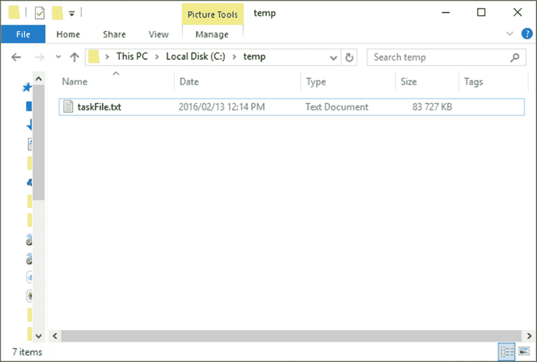

1.  在`AsyncDemo`类中，创建一个名为`ReadBigFile()`的方法，该方法返回`Task<TResult>`类型，它将用于返回从我们的大文本文件中读取的字节数：

    ```cs
    public Task<int> ReadBigFile()
    {    

    }
    ```

1.  将以下代码添加到打开和读取文件字节的操作中。您将看到我们正在使用`ReadAsync()`方法，该方法异步地从流中读取一系列字节，并通过从该流中读取的字节数在流中前进位置。您还会注意到我们正在使用一个缓冲区来读取这些字节：

    ```cs
    public Task<int> ReadBigFile()
    {
        var bigFile = File.OpenRead(@"C:\temp\taskFile.txt");
        var bigFileBuffer = new byte[bigFile.Length];
        var readBytes = bigFile.ReadAsync(bigFileBuffer, 0, (int)bigFile.Length);

        return readBytes;
    }
    ```

    ### 注意

    您可能需要处理的`ReadAsync()`方法异常包括`ArgumentNullException`、`ArgumentOutOfRangeException`、`ArgumentException`、`NotSupportedException`、`ObjectDisposedException`和`InvalidOperatorException`。

1.  最后，在`var readBytes = bigFile.ReadAsync(bigFileBuffer, 0, (int)bigFile.Length);`行之后立即添加代码的最后一部分，该部分使用 lambda 表达式来指定任务需要执行的工作。在这种情况下，是要读取文件中的字节：

    ```cs
    public Task<int> ReadBigFile()
    {
        var bigFile = File.OpenRead(@"C:\temp\taskFile.txt");
        var bigFileBuffer = new byte[bigFile.Length];
        var readBytes = bigFile.ReadAsync(bigFileBuffer, 0, (int)bigFile.Length);
        readBytes.ContinueWith(task =>
        {
            if (task.Status == TaskStatus.Running)
                Console.WriteLine("Running");
            else if (task.Status == TaskStatus.RanToCompletion)
                Console.WriteLine("RanToCompletion");
            else if (task.Status == TaskStatus.Faulted)
                Console.WriteLine("Faulted");

            bigFile.Dispose();
        });
        return readBytes;
    }
    ```

1.  如果在之前的菜谱中没有这样做，请将按钮添加到 Windows 窗体应用程序的窗体设计器中。在**winformAsync**窗体设计器中，打开**工具箱**并选择**按钮**控件，该控件位于**所有 Windows 窗体**节点下：

1.  将按钮控件拖放到**Form1**设计器中：

1.  选择按钮控件后，双击控件以在代码后创建点击事件。Visual Studio 将为您插入事件代码：

    ```cs
    namespace winformAsync
    {
        public partial class Form1 : Form
        {
            public Form1()
            {
                InitializeComponent();
            }

            private void button1_Click(object sender, EventArgs e)
            {

            }
        }
    }
    ```

1.  修改`button1_Click`事件并给点击事件添加`async`关键字。这是一个返回`void`的异步方法的示例：

    ```cs
    private async void button1_Click(object sender, EventArgs e)
    {

    }
    ```

1.  现在，请确保您添加代码以异步调用`AsyncDemo`类的`ReadBigFile()`方法。请记住将方法的结果（即读取的字节）读取到整数变量中：

    ```cs
    private async void button1_Click(object sender, EventArgs e)
    {
        Console.WriteLine("Start file read");
        Chapter6.AsyncDemo oAsync = new Chapter6.AsyncDemo();
        int readResult = await oAsync.ReadBigFile();
        Console.WriteLine("Bytes read = " + readResult);
    }
    ```

1.  运行您的应用程序将显示 Windows 窗体应用程序：

1.  在点击**button1**按钮之前，请确保**输出**窗口是可见的：

1.  从**视图**菜单中，点击**输出**菜单项或按*Ctrl* + *Alt* + *O*显示**输出**窗口。这将允许我们看到在`Chapter6`类和 Windows 应用程序中添加的`Console.Writeline()`输出。

1.  点击**button1**按钮将在我们的**输出**窗口中显示输出。在整个代码执行过程中，窗体保持响应：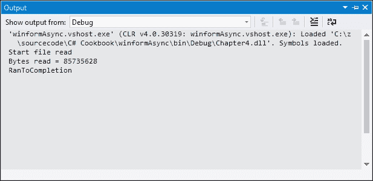

    ### 注意

    注意，显示在您的**输出**窗口中的信息将与截图不同。这是因为您使用的文件与我的不同。

## 它是如何工作的…

任务在单独的线程池线程上执行。这允许在处理大文件时应用程序保持响应。可以通过多种方式使用任务来改进您的代码。这个菜谱只是其中的一个例子。

# 异步编程中的异常处理

异步编程中的异常处理一直是一个挑战。这在捕获块中尤其如此。从 C# 6 开始，你现在可以在异常处理程序的`catch`和`finally`块中编写异步代码。

## 准备工作

应用程序将模拟读取日志文件的动作。假设第三方系统在另一个应用程序中处理日志文件之前，总是先备份日志文件。当这个处理正在进行时，日志文件被删除并重新创建。然而，我们的应用程序需要定期读取这个日志文件。因此，我们需要准备好文件可能不在我们预期的位置的情况。因此，我们将故意省略主日志文件，以便我们可以强制产生错误。

## 如何操作…

1.  创建一个文本文件和两个文件夹来包含日志文件。然而，我们将在`BackupLog`文件夹中只创建一个日志文件。`MainLog`文件夹将保持为空：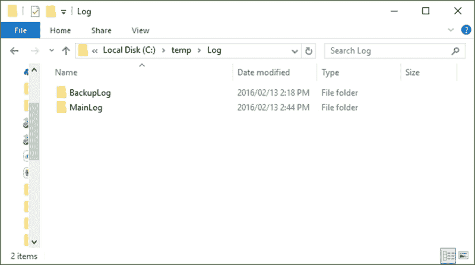

1.  在我们的`AsyncDemo`类中，编写一个方法来读取`MainLog`文件夹中的主日志文件：

    ```cs
    private async Task<int> ReadMainLog()
    {
        var bigFile = File.OpenRead(@"C:\temp\Log\MainLog\taskFile.txt");
        var bigFileBuffer = new byte[bigFile.Length];
        var readBytes = bigFile.ReadAsync(bigFileBuffer, 0, (int)bigFile.Length);
        await readBytes.ContinueWith(task =>
        {
            if (task.Status == TaskStatus.RanToCompletion)
                Console.WriteLine("Main Log RanToCompletion");
            else if (task.Status == TaskStatus.Faulted)
                Console.WriteLine("Main Log Faulted");

            bigFile.Dispose();
        });
        return await readBytes;
    }
    ```

1.  在`BackupLog`文件夹中创建一个读取备份文件的第二个方法：

    ```cs
    private async Task<int> ReadBackupLog()
    {
        var bigFile = File.OpenRead(@"C:\temp\Log\BackupLog\taskFile.txt");
        var bigFileBuffer = new byte[bigFile.Length];
        var readBytes = bigFile.ReadAsync(bigFileBuffer, 0, (int)bigFile.Length);
        await readBytes.ContinueWith(task =>
        {
            if (task.Status == TaskStatus.RanToCompletion)
                Console.WriteLine("Backup Log RanToCompletion");
            else if (task.Status == TaskStatus.Faulted)
                Console.WriteLine("Backup Log Faulted");

            bigFile.Dispose();
        });
        return await readBytes;
    }
    ```

    ### 注意

    实际上，我们可能只会创建一个方法来读取日志文件，只传递路径作为参数。在生产应用程序中，创建一个类并重写方法来读取不同的日志文件位置会是一个更好的方法。然而，对于本配方，我们特别希望创建两个独立的方法，以便在代码中清楚地看到对异步方法的调用。

1.  然后，我们将创建一个主要的`ReadLogFile()`方法，尝试读取主日志文件。由于我们尚未在`MainLog`文件夹中创建日志文件，代码将抛出`FileNotFoundException`。然后，它将在`ReadLogFile()`方法的`catch`块中运行异步方法并等待（这是在 C#的先前版本中不可能做到的），将读取的字节返回给调用代码：

    ```cs
    public async Task<int> ReadLogFile()
    {
        int returnBytes = -1;
        try
        {
            Task<int> intBytesRead = ReadMainLog();
            returnBytes = await ReadMainLog();
        }
        catch (Exception ex)
        {
            try
            {
                returnBytes = await ReadBackupLog();
            }
            catch (Exception)
            {
                throw;
            }
        }
        return returnBytes;
    }
    ```

1.  如果在先前的配方中没有这样做，请将按钮添加到 Windows Forms 应用程序的窗体设计器中。在**winformAsync**窗体设计器中打开**工具箱**并选择**按钮**控件，该控件位于**所有 Windows 窗体**节点下：

1.  将按钮控件拖动到**Form1**设计器上：

1.  在选择按钮控件后，双击控件以在代码后创建点击事件。Visual Studio 将为您插入事件代码：

    ```cs
    namespace winformAsync
    {
        public partial class Form1 : Form
        {
            public Form1()
            {
                InitializeComponent();
            }

            private void button1_Click(object sender, EventArgs e)
            {

            }
        }
    }
    ```

1.  修改`button1_Click`事件并给点击事件添加`async`关键字。这是一个返回`void`的异步方法的示例：

    ```cs
    private async void button1_Click(object sender, EventArgs e)
    {

    }
    ```

1.  接下来，我们将编写代码来创建`AsyncDemo`类的新实例并尝试读取主日志文件。在现实世界的例子中，代码在这个时候并不知道主日志文件不存在：

    ```cs
    private async void button1_Click(object sender, EventArgs e)
    {
        Console.WriteLine("Read backup file");
        Chapter6.AsyncDemo oAsync = new Chapter6.AsyncDemo();
        int readResult = await oAsync.ReadLogFile();
        Console.WriteLine("Bytes read = " + readResult);
    }
    ```

1.  运行您的应用程序将显示 Windows 窗体应用程序：

1.  在点击**button1**按钮之前，确保**输出**窗口是可见的：

1.  从**视图**菜单中，点击**输出**菜单项或按*Ctrl* + *Alt* + *O*键以显示**输出**窗口。这将允许我们看到`Console.Writeline()`的输出，因为我们已经将它们添加到了`Chapter6`类和 Windows 应用程序中的代码。

1.  为了模拟文件未找到异常，我们从`MainLog`文件夹中删除了文件。您将看到异常被抛出，并且`catch`块运行了读取备份日志文件的代码：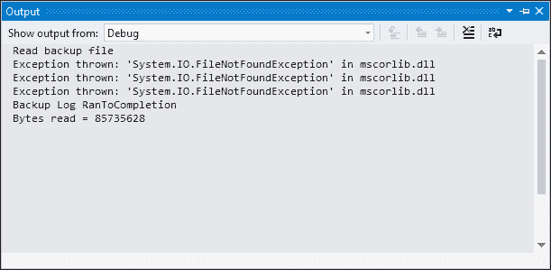

## 它是如何工作的…

我们可以在`catch`和`finally`块中等待的事实，为开发者提供了更多的灵活性，因为异步结果可以在整个应用程序中一致地等待。正如您从我们编写的代码中可以看到的，一旦异常被抛出，我们就异步地读取了备份文件的读取方法。
