# 第八章。代码合约

本章将向您介绍代码合约。这是一项非常强大的技术，它将使您能够确保您的代码免受不必要的错误。这尤其适用于您正在编写一个由多个开发者共享的类。代码合约允许您检查和处理在合约下传递给您的方法的参数。如果合约验证失败，您可以在您的方 法中采取果断行动来处理这种情况。本章将涵盖以下步骤：

+   下载、安装和将代码合约集成到 Visual Studio 中

+   创建代码合约前置条件

+   创建代码合约后置条件

+   创建代码合约不变量

+   创建代码合约 `Assert` 和 `Assume` 方法

+   创建代码合约 `ForAll` 方法

+   创建代码合约 `ValueAtReturn` 方法

+   创建代码合约 `Result` 方法

+   在抽象类中使用代码合约

+   使用合约缩写方法

+   使用 IntelliTest 创建测试

+   在扩展方法中使用代码合约

# 简介

您可能想知道代码合约究竟是什么。为了用通俗易懂的语言解释，代码合约是您添加到您的方法中的定义。它告诉编译器，合约下的方法将始终遵守特定的条件。例如，该方法永远不会向调用代码返回空值，或者该方法将始终期望一个大于特定值的参数。如果任何这些条件未满足，您的代码可以抛出异常，并且与您的类集成的开发者将被提示改进他们的调用代码。另一方面，当开发者调用您的类时，他们可以确信合约下的方法将始终以特定的方式行为，并且永远不会偏离。

在开发团队中工作时，代码合约确实非常突出，但在单开发者解决方案中实现这项技术只会提高你的代码质量。

# 下载、安装和将代码合约集成到 Visual Studio 中

在你可以在应用程序中使用代码合约之前，你需要下载并安装它们。最简单的方法是通过扩展和更新来完成。安装完成后，你需要为代码合约定义一些设置，以便它们开始针对其实现的代码进行功能。让我们看看以下步骤。

## 准备工作

首先，我们将创建一个新类并将其添加到我们的 Visual Studio 项目中。然后，我们将获取代码合约安装程序并为我们的项目安装它。

## 如何操作…

1.  通过右键单击你的解决方案并从上下文菜单中选择**添加**然后**新建项目**来创建一个新类：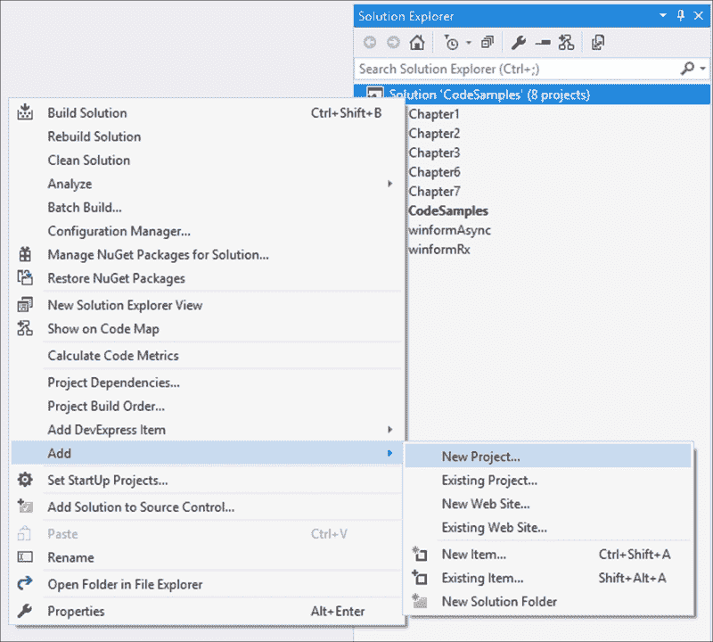

1.  从**添加新项目**对话框屏幕中，选择已安装的模板中的**类库**，并将您的类命名为 `Chapter8`：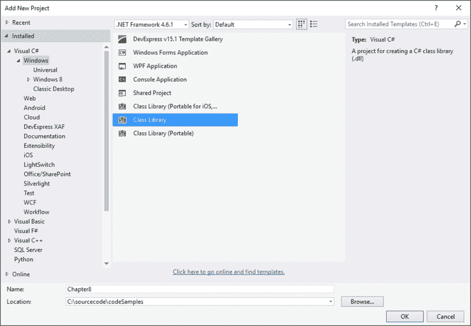

1.  你的新类库将以默认名称 `Class1.cs` 添加到你的解决方案中，我们将其重命名为 `Recipes.cs` 以便正确区分代码。然而，你可以将你的类重命名为你喜欢的任何名称。

1.  要重命名你的类，只需在 **解决方案资源管理器** 中单击类名，并从上下文菜单中选择 **重命名**：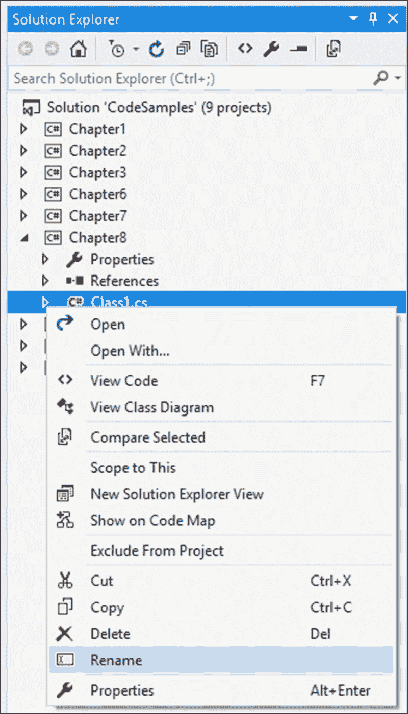

1.  Visual Studio 将要求你确认项目中对代码元素 **Class1** 的所有引用的重命名。只需点击 **是**：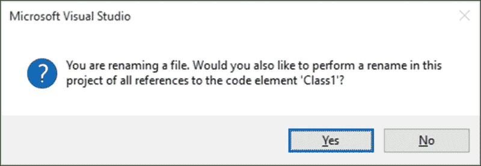

1.  接下来，点击 **工具** 菜单并选择 **扩展和更新…**：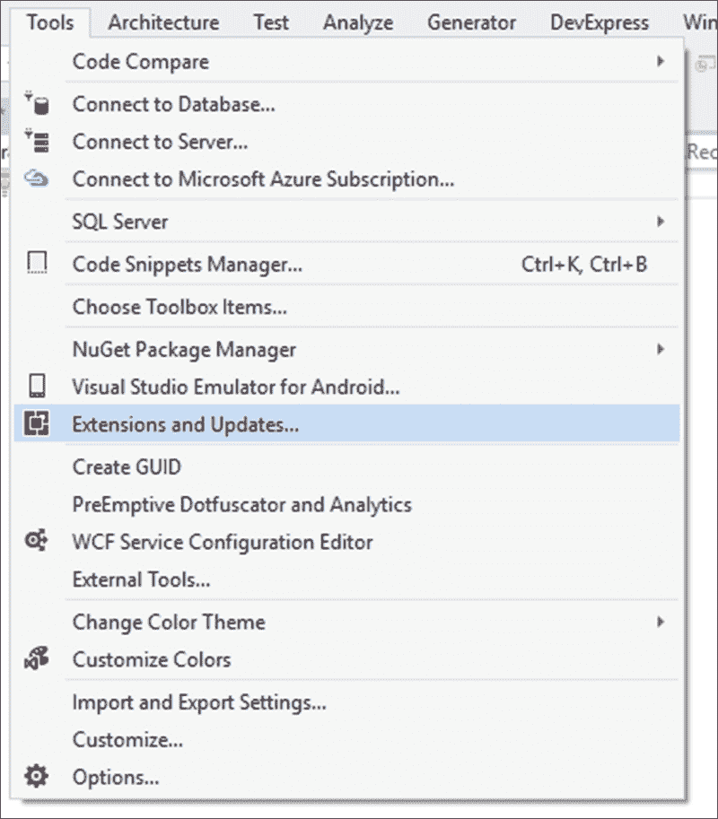

1.  你将看到 **扩展和更新** 窗口出现。务必点击左侧的 **Visual Studio 代码库** 并以 `Code Contracts` 作为搜索词。如果你还没有 Code Contracts 安装程序，你将在 **Code Contracts for .NET** 结果中看到一个下载按钮。点击它以下载和安装代码合约：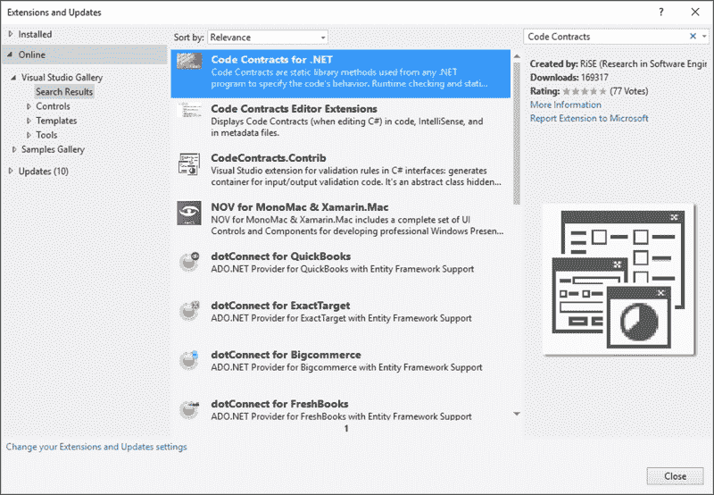

1.  在代码合约安装完成后，你可能需要重新启动 Visual Studio。完成此操作后，右键单击 `Chapter8` 项目，并从上下文菜单中选择 **属性**：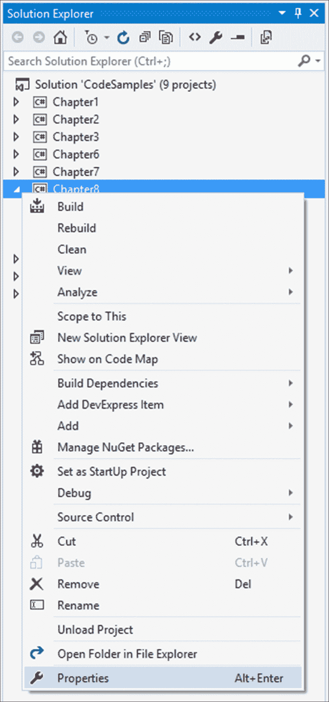

1.  你会注意到，为你的 `Chapter8` 项目属性页添加了一个新的 **代码合约** 选项卡。点击此选项卡，并确保 **执行运行时合约检查** 被勾选。然后，保存你的更改并关闭属性页：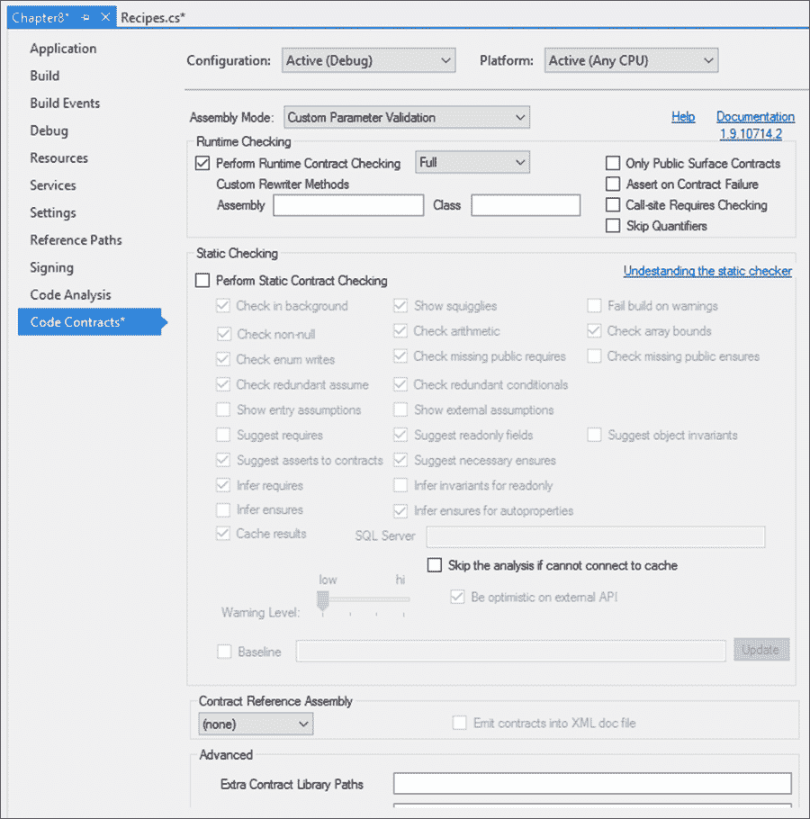

1.  最后，将你的 `Chapter8` 项目引用添加到之前创建的控制台应用程序中。通过展开控制台应用程序项目，右键单击 **引用** 项，并从上下文菜单中选择 **添加引用**：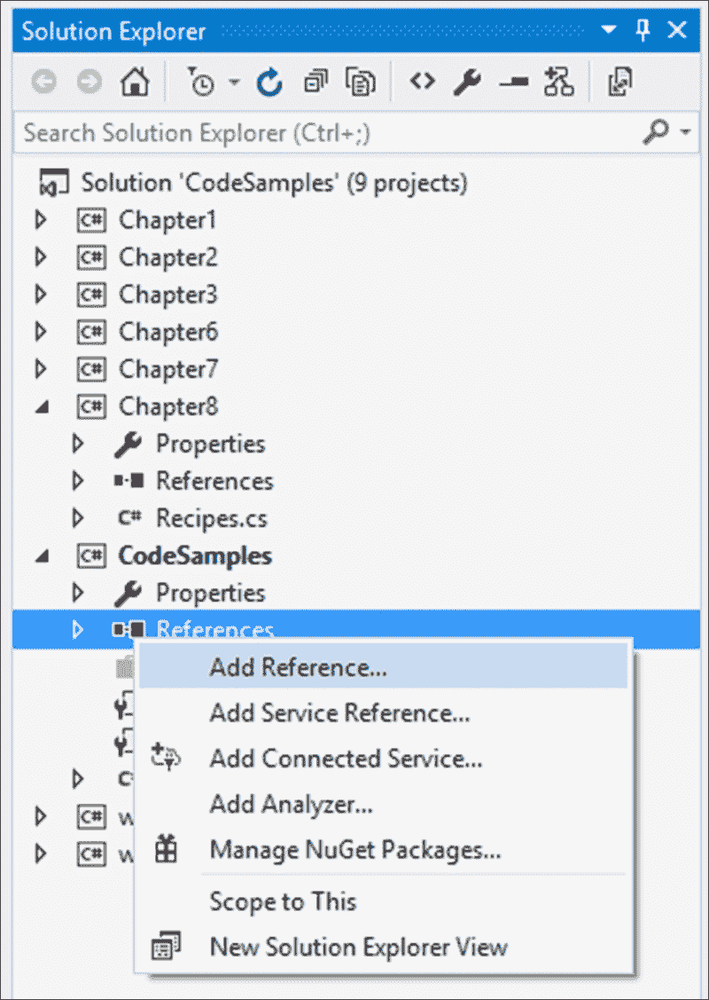

1.  确保你在项目引用部分已选择 `Chapter8`，然后点击 **确定**：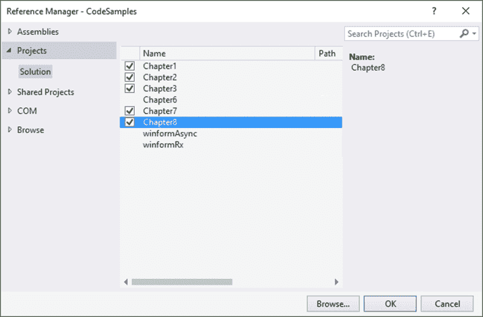

## 它是如何工作的…

现在，你已经安装并配置了最小要求，以在 `Chapter8` 类中启用代码合约。你可以继续构建你的解决方案，以确保一切构建成功。

# 创建代码合约预设条件

预设条件允许你在方法中使用参数之前精确控制参数的形状。这意味着你可以假设调用代码发送到你的方法的数据有很多东西。例如，你可以指定一个参数永远不能为空，或者一个值必须始终在特定的值范围内。可以检查日期，并对对象进行验证和审查。

你对你的方法传入的数据有完全的控制权。这让你在使用数据时感到安心，一旦它通过了你的合约，就不需要做额外的检查。

## 准备工作

确保你已经安装了代码合约，并且已经按照前一个菜谱中描述的项目属性中正确配置了设置。

## 如何操作…

1.  在你的 `Recipes` 类中，创建一个名为 `ValueGreaterThanZero()` 的新方法，并让它接受一个整数作为参数：

    ```cs
    public static class Recipes
    {
        public static void ValueGreaterThanZero(int iNonZeroValue)
        {

        }
    }
    ```

1.  在 `ValueGreaterThanZero()` 方法中，输入 `Contract` 声明的开头，你会注意到代码被一条红色的波浪线下划线。按下 *Crtl* + *.*（点）来显示潜在修复的建议。点击建议以将代码合约的 `using` 语句添加到你的类中：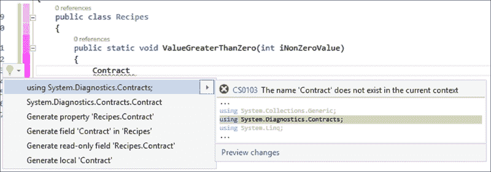

1.  完成后，继续输入先决条件。定义参数值必须大于零：

    ```cs
    public static void ValueGreaterThanZero(int iNonZeroValue)
    {
        Contract.Requires(iNonZeroValue >= 1, "Parameter iNonZeroValue not greater than zero");
    }
    ```

1.  如果你返回到控制台应用程序，添加以下 `using` 语句：

    ```cs
    using static System.Console;
    using static Chapter8.Recipes;
    ```

1.  由于我们已经创建了一个静态类，并通过 `using` 语句将其引入作用域，你可以在 `Recipes` 类中直接调用方法名。为了了解代码合约的工作原理，将零参数传递给方法：

    ```cs
    try
    {
        ValueGreaterThanZero(0);
    }
    catch (Exception ex)
    {
        WriteLine(ex.Message);
        ReadLine();
    }
    ```

1.  最后，运行你的控制台应用程序，查看生成的异常：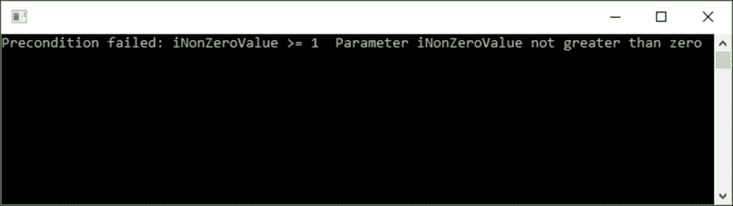

## 工作原理…

代码合约检查了先决条件，并确定传递给合约中方法的参数值未通过先决条件检查。抛出异常并输出到控制台窗口。

# 创建代码合约后置条件

正如代码合约先决条件控制传递给合约中方法的哪些信息一样，代码合约后置条件控制合约中方法返回给调用代码的信息。因此，你可以指定方法永远不会返回空值或空数据集，例如。实际条件并不重要；这是根据具体情况而变化的。这里要记住的重要事情是，这个代码合约允许你对自己的代码返回的数据有更多的控制。

## 准备工作

假设合约中的方法需要确保返回的值始终大于零。使用代码合约后置条件，我们可以轻松地强制执行此规则。

## 如何操作…

1.  在开始之前，确保你已经将以下 `using` 语句添加到 `Recipes` 类的顶部：

    ```cs
    using System.Diagnostics.Contracts;
    ```

1.  在 `Recipes` 类中添加一个名为 `NeverReturnZero()` 的方法，并将一个整数参数传递给此方法：

    ```cs
    public static class Recipes
    {
        public static int NeverReturnZero(int iNonZeroValue)
        {

        }
    }
    ```

1.  在方法内部，添加你的后置条件合约。正如预期的那样，合约类中的方法被称为 `Ensures`。这非常描述了它的功能。代码合约确保特定的方法结果永远不会返回。你可以在 `Contract.Ensures` 方法的签名中看到这一点。因此，后置条件确保此方法的结果永远不会为零：

    ```cs
    public static int NeverReturnZero(int iNonZeroValue)
    {
        Contract.Ensures(Contract.Result<int>() > 0, "The value returned was not greater than zero");

        return iNonZeroValue - 1;
    }
    ```

1.  返回到控制台应用程序，并添加以下 `using` 语句：

    ```cs
    using static System.Console;
    using static Chapter8.Recipes;
    ```

1.  由于你已经创建了一个静态类，并且使用`using`语句将其引入作用域，你只需直接在`Recipes`类中调用方法名。将`NeverReturnZero()`方法传递一个值为`1`的参数：

    ```cs
    try
    {
        NeverReturnZero(1);
    }
    catch (Exception ex)
    {
        WriteLine(ex.Message);
        ReadLine();
    }
    ```

1.  最后，运行你的控制台应用程序，并在控制台窗口中查看输出：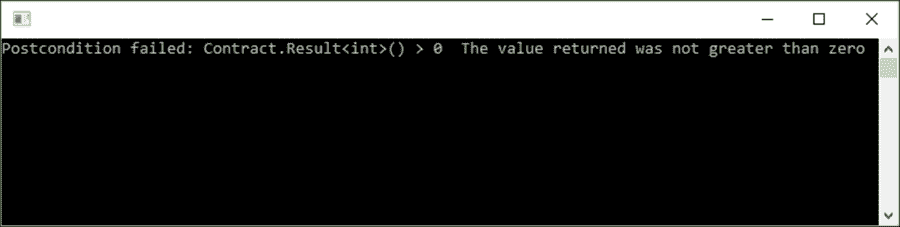

## 它是如何工作的…

当将`1`的值传递给合同中的方法时，它导致返回值为零。我们通过从传递给方法的参数中减去`1`来强制这样做。由于该方法确保非零值，因此抛出了我们定义的消息异常。

# 创建代码合同不变量

被定义为不变量的东西告诉我们它永远不会改变。它始终是相同的，无论发生什么。如果我们从代码合同的角度考虑这一点，这会带来大量的用例。不变量代码合同基本上用于验证类的内部状态。那么，“内部状态”是什么意思呢？嗯，类的属性给这个类一个特定的状态。让我们假设我们想要保证我们使用的类的属性只接受特定的值，从而确保该类的内部状态。这就是代码合同不变量发挥作用的地方。

## 准备工作

你可以通过以下示例更好地理解不变量的使用。假设该类需要存储日期。尽管如此，我们永远不能存储过去的日期。在类中使用的任何日期都必须是当前或未来的日期。

## 如何操作…

1.  在继续之前，请确保你已经将代码合同`using`语句添加到你的`Recipes.cs`类文件顶部：

    ```cs
    using System.Diagnostics.Contracts;
    ```

1.  接下来，我们将在`Recipes.cs`类文件中添加一个新的类，名为`InvariantClassState`。这样做是为了我们可以创建一个实例类而不是一个静态类：

    ```cs
    public class InvariantClassState
    {

    }
    ```

1.  将以下`private`属性添加到你的`InvariantClassState`类中，这些属性将接受年、月和日的整数值：

    ```cs
    private int _Year { get; set; }
    private int _Month { get; set; }
    private int _Day { get; set; }
    ```

1.  我们现在将向我们的`InvariantClassState`类添加一个构造函数。构造函数将接受参数来设置之前创建的属性：

    ```cs
    public InvariantClassState(int year, int month, int day)
    {
        _Year = year;
        _Month = month;
        _Day = day;
    }
    ```

    ### 注意

    如果你创建`public`属性，始终是一个好习惯用`private`设置器来创建它们，例如`public int Value { get; private set; }`。

1.  我们需要添加的下一个方法是合同不变量方法。你可以给这个方法起任何你喜欢的名字，在这个例子中，它被命名为`Invariants()`。你会看到许多开发者表示，一个普遍接受的做法是将这个方法命名为`ObjectInvariant()`。然而，这个方法的命名对不变量代码合同没有任何影响。你会注意到我们用`[ContractInvariantMethod]`装饰了这个方法，这就是定义这个方法（无论名字如何）作为不变量代码合同的原因。还有另一件重要的事情需要记住，不变量代码合同方法必须是一个`void`方法，并且被指定为`private`方法。

    在我们的代码合同不变性方法内部，我们现在指定哪些属性是不变的。换句话说，那些在这个代码合同不变性方法内部永远不会是其他值的属性。首先，我们将指定年值不能在过去。我们还将确保月值是一个在 `1` 到 `12` 之间的有效值。最后，我们将指定日值不能是月份包含的天数之外的值或小于 `1` 的值：

    ```cs
    [ContractInvariantMethod]
    private void Invariants()
    {
        Contract.Invariant(this._Year >= DateTime.Now.Year);
        Contract.Invariant(this._Month <= 12);
        Contract.Invariant(this._Month >= 1);
        Contract.Invariant(this._Day >= 1);
        Contract.Invariant(this._Day <= DateTime.DaysInMonth(_Year, _Month);
    }
    ```

1.  你可以通过提供一个异常消息来进一步扩展 `Contract.Invariant` 方法。然后你的 `Invariants()` 方法将看起来像这样：

    ```cs
    [ContractInvariantMethod]
    private void Invariants()
    {
        Contract.Invariant(this._Year >= DateTime.Now.Year, "The supplied year is in the past");
        Contract.Invariant(this._Month <= 12, $"The value {_Month} is not a valid Month value");
        Contract.Invariant(this._Month >= 1, $"The value {_Month} is not a valid Month value");
        Contract.Invariant(this._Day >= 1, $"The value {_Day} is not a valid calendar value");
        Contract.Invariant(this._Day <= DateTime.DaysInMonth(_Year, _Month), $"The month given does not contain {_Day} days");
    }
    ```

1.  最后，添加另一个方法，该方法返回按月/日/年格式化的日期：

    ```cs
    public string ReturnGivenMonthDayYearDate()
    {            
        return $"{_Month}/{_Day}/{_Year}";
    }
    ```

1.  当你完成时，你的 `InvariantClassState` 类将看起来像这样：

    ```cs
    public class InvariantClassState
    {
        private int _Year { get; set; }
        private int _Month { get; set; }
        private int _Day { get; set; }

        public InvariantClassState(int year, int month, int day)
        {
            _Year = year;
            _Month = month;
            _Day = day;
        }

        [ContractInvariantMethod]
        private void Invariants()
        {
            Contract.Invariant(this._Year >= DateTime.Now.Year, "The supplied year is in the past");
            Contract.Invariant(this._Month <= 12, $"The value {_Month} is not a valid Month value");
            Contract.Invariant(this._Month >= 1, $"The value {_Month} is not a valid Month value");
            Contract.Invariant(this._Day >= 1, $"The value {_Day} is not a valid calendar value");
            Contract.Invariant(this._Day <= DateTime.DaysInMonth(_Year, _Month), $"The month given does not contain {_Day} days");
        }

        public string ReturnGivenMonthDayYearDate()
        {            
            return $"{_Month}/{_Day}/{_Year}";
        }
    }
    ```

1.  返回到控制台应用程序，并将以下 `using` 语句添加到你的控制台应用程序 `Program.cs` 文件中：

    ```cs
    using Chapter8;
    ```

1.  我们现在将添加一个新的 `InvariantStateClass` 类实例，并将值传递给构造函数。首先，将小于 `1` 的当前年传递给构造函数。这将导致将上一年传递给构造函数：

    ```cs
    try
    {
        InvariantClassState oInv = new InvariantClassState(DateTime.Now.Year - 1, 13, 32);
        string returnedDate = oInv.ReturnGivenMonthDayYearDate();
        WriteLine(returnedDate);
    }
    catch (Exception ex)
    {
        WriteLine(ex.Message);                
    }
    ReadLine();
    ```

1.  运行你的控制台应用程序将导致代码合同不变性抛出异常，因为传递给构造函数的年份是过去的：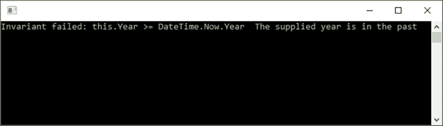

1.  让我们通过将有效的年值传递给构造函数来修改我们的代码，但保持其余的参数值不变：

    ```cs
    try
    {
        InvariantClassState oInv = new InvariantClassState(DateTime.Now.Year, 13, 32);
        string returnedDate = oInv.ReturnGivenMonthDayYearDate();

        WriteLine(returnedDate);
    }
    catch (Exception ex)
    {
        WriteLine(ex.Message);                
    }
    ReadLine();
    ```

1.  运行控制台应用程序将再次导致一个异常消息，指出月值不能大于 `12`：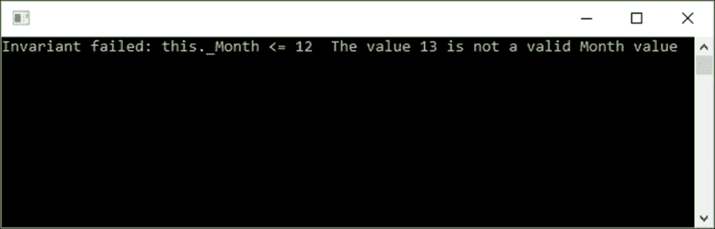

1.  再次修改传递给方法的参数，并提供一个有效的年和月值，但传递一个无效的日值：

    ```cs
    try
    {
        InvariantClassState oInv = new InvariantClassState(DateTime.Now.Year, 11, 32);
        string returnedDate = oInv.ReturnGivenMonthDayYearDate();

        WriteLine(returnedDate);
    }
    catch (Exception ex)
    {
        WriteLine(ex.Message);                
    }
    ReadLine();
    ```

1.  再次运行控制台应用程序将导致代码合同不变性抛出异常，因为日显然是错误的。没有一个月包含 32 天：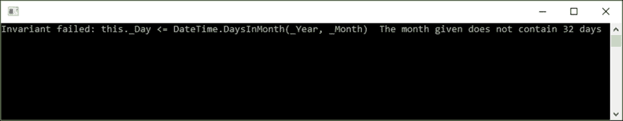

1.  再次修改传递给构造函数的参数，这次，为年、月和日添加有效的值：

    ```cs
    try
    {
        InvariantClassState oInv = new InvariantClassState(DateTime.Now.Year, 11, 25);
        string returnedDate = oInv.ReturnGivenMonthDayYearDate();

        WriteLine(returnedDate);
    }
    catch (Exception ex)
    {
        WriteLine(ex.Message);                
    }
    ReadLine();
    ```

1.  因为 2016 年 11 月 25 日是一个有效的日期（因为当前年份是 2016 年），所以格式化的日期被返回到控制台应用程序窗口：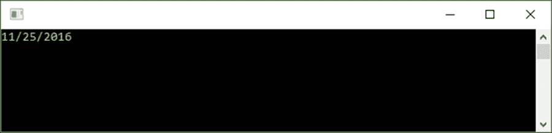

1.  让我们稍微改变一下，将 2017 年 2 月 29 日传递给构造函数：

    ```cs
    try
    {
        InvariantClassState oInv = new InvariantClassState(DateTime.Now.Year + 1, 2, 29);
        string returnedDate = oInv.ReturnGivenMonthDayYearDate();

        WriteLine(returnedDate);
    }
    catch (Exception ex)
    {
        WriteLine(ex.Message);                
    }
    ReadLine();
    ```

1.  再次，代码合同不变性方法抛出异常，因为 2017 年不是闰年：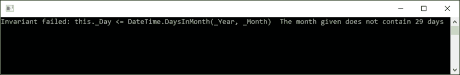

## 它是如何工作的…

代码合同不变量方法是一种简单而有效的方法，以确保你的类状态没有被修改。然后你可以假设你在类内部使用的属性始终是正确的，并且永远不会包含意外的值。我们喜欢将代码合同不变量视为一种不可变类型（尽管它不是）。字符串是不可变的，这意味着当值改变时，原始值永远不会被修改。当你改变字符串的值时，内存中总是会创建一个新的空间。同样，这让我想起了定义为不变量的属性。这些属性值永远不会改变到由我们的代码合同不变量方法定义之外的其他值。

# 创建代码合同 Assert 和 Assume 方法

代码合同的`Assert`和`Assume`方法可能一开始看起来有些令人困惑，但它们都提供了特定的功能。之前的代码合同条件必须出现在它们定义的方法的开始部分，而`Assert`方法可以放置在方法内部的任何位置。这意味着它将在编译的特定时间对代码产生影响。例如，如果你在合同下的方法中某处执行计算并需要检查计算出的值，你可以使用`Assert`在原地执行检查以确认计算值是否通过合同。

### 注意

不要混淆`Debug.Assert`与`Contract.Assert`。它们不是同一回事。`Debug.Assert`只有在你的代码以**调试**模式运行时才会产生影响。`Contract.Assert`将在**调试**和**发布**模式下运行。

然而，使用`Contract.Assume`，我们正在告诉代码合同，它需要假设它需要检查的条件是真实的。这仅适用于静态检查器已开启时，这一点将在本食谱中变得更加清晰。

## 准备工作

我们将使用相同的合同方法来展示在静态检查器开启时使用`Assert`和`Assume`方法。

## 如何做到这一点…

1.  在继续之前，请确保你已经将代码合同`using`语句添加到你的`Recipes.cs`类文件顶部：

    ```cs
    using System.Diagnostics.Contracts;
    ```

1.  在类中添加一个名为`ValueIsValid()`的方法，它接受两个整数参数：

    ```cs
    public static int ValueIsValid(int valueForCalc, int valueToDivide)
    {

    }
    ```

1.  在此方法中，添加一个计算步骤（它出现在方法中合同之前），从`valueForCalc`参数中减去`1`。将`Contract.Assert`方法放置在计算之后，以检查计算值的值。我们希望确保该值不为零：

    ```cs
    public static int ValueIsValid(int valueForCalc, int valueToDivide)
    {
        int calculatedVal = valueForCalc - 1;
        Contract.Assert(calculatedVal >= 1, "Calculated value will result in divide by zero exception.");
        return valueToDivide / calculatedVal;
    }
    ```

1.  在控制台应用程序中，将相关的`using`语句添加到`Program.cs`类中，以便将静态类引入作用域：

    ```cs
    using static Chapter8.Recipes;
    ```

1.  通过传递两个整数值调用`ValueIsValid()`方法。正如你所见，第一个参数将在合同下的方法内部计算出零值：

    ```cs
    try
    {
        int calcVal = ValueIsValid(1, 9);
    }
    catch (Exception ex)
    {
        WriteLine(ex.Message);
        ReadLine();
    }
    ```

1.  运行您的控制台应用程序并检查输出窗口。我们可以看到`Assert`合约正确地抛出了异常，因为计算出的值是零：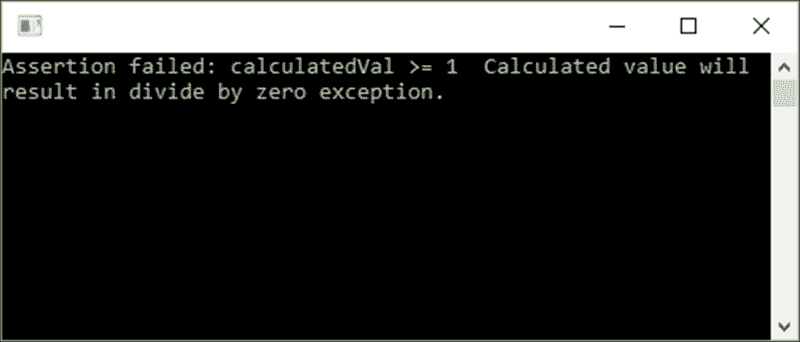

1.  然而，如果我们想在构建应用程序时检查我们的代码呢？这就是静态检查器发挥作用的地方。右键单击`Chapter8`项目并选择**属性**：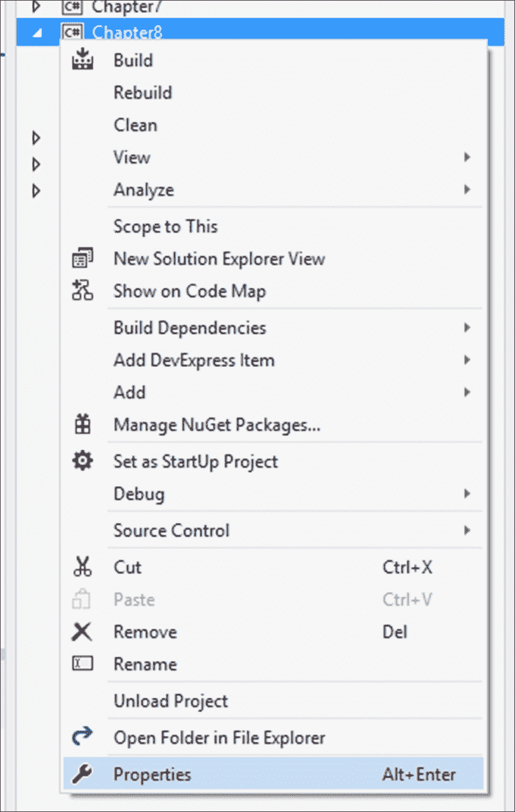

1.  点击**代码合约**选项卡，并选中**执行静态合约检查**旁边的复选框。同时，取消选中**在后台检查**复选框，并选择**警告时失败构建**。此外，将**警告级别**设置为**高**：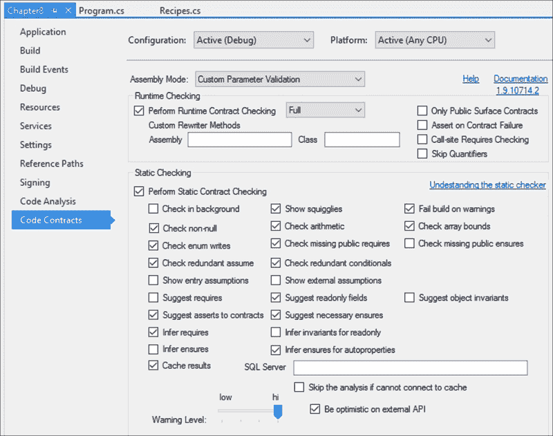

    ### 注意

    我们假设 Code Contracts 的开发者本意是在低和高之间设置警告级别。“Hi”可能是代码中的误拼。

1.  保存您的代码合约设置并运行您的控制台应用程序。您会注意到您的构建失败：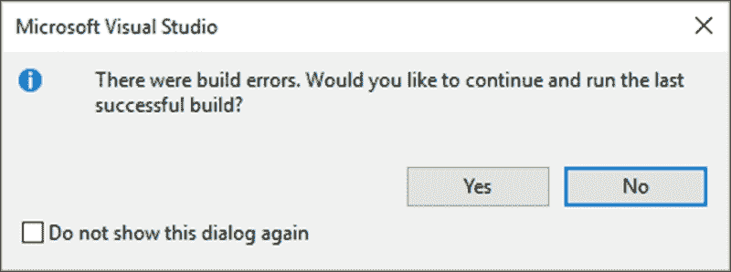

1.  如果我们查看`ValueIsValid()`方法，我们可以看到静态检查器已经识别出在合约下的方法需要定义一个额外的合约。静态检查器已经识别出我们需要在我们的方法中添加`Contract.Requires`来检查`valueForCalc`参数是否大于零：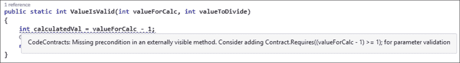

1.  如果我们必须纠正这一点，我们将在方法中添加`Contract.Requires`，如下所示：

    ```cs
    public static int ValueIsValid(int valueForCalc, int valueToDivide)
    {
        Contract.Requires((valueForCalc - 1) >= 1);
        int calculatedVal = valueForCalc - 1;
        Contract.Assert(calculatedVal >= 1, "Calculated value will result in divide by zero exception.");
        return valueToDivide / calculatedVal;
    }
    ```

1.  现在，让我们忽略静态检查器的建议，而是将`Contract.Assume`添加到我们的方法中。在这里，我们正在告诉静态检查器假设在`valueForCalc`参数的计算完成后，该值永远不会为零：

    ```cs
    public static int ValueIsValid(int valueForCalc, int valueToDivide)
    {
        Contract.Assume((valueForCalc - 1) >= 1);
        int calculatedVal = valueForCalc - 1; 
        Contract.Assert(calculatedVal >= 1, "Calculated value will result in divide by zero exception.");
        return valueToDivide / calculatedVal; 
    }
    ```

1.  如果我们再次运行我们的控制台应用程序，我们将得到一个干净的构建，因为静态检查器假设您最了解情况，并且计算后的值永远不会等于零。然而，如果计算出的值实际上是零，`Assume`仍然会在运行时检查该值，如果值等于零，则会抛出异常：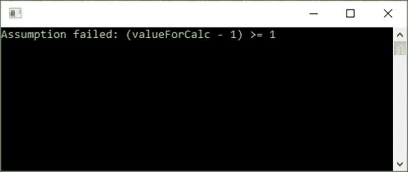

## 它是如何工作的…

您可能想知道代码合约中`Assume`的使用目的。实际上，当您处理无法控制的代码时，这非常有用。如果您实现了无法编辑或不含代码合约的代码，您可以告诉静态检查器忽略基于检查产生的错误的具体代码部分。

# 创建代码合约 ForAll 方法

如果这个代码合约听起来像是在验证某些或其他的集合，那么您就是正确的。代码合约`ForAll`将对`IEnumerable`集合执行验证。这对于开发者来说非常方便，因为您不需要对集合进行任何类型的迭代，也不需要编写验证逻辑。这个合约为您完成了这一切。

## 准备工作

我们将创建一个简单的整数列表，并用值填充该列表。我们的代码契约将验证列表中不包含任何零值。

## 如何做…

1.  在继续之前，确保你已经将代码契约的`using`语句添加到你的`Recipes.cs`类文件顶部：

    ```cs
    using System.Diagnostics.Contracts;
    ```

1.  在你的类中添加一个名为`ValidateList()`的方法，并将一个`List<int>`集合传递给它：

    ```cs
    public static void ValidateList(List<int> lstValues)
    {

    }
    ```

1.  在`ValidateList()`方法内部，添加`Contract.ForAll`契约。有趣的是，你会注意到我们在这里使用`Contract.Assert`来检查这个列表是否通过我们的契约条件。`Contract.ForAll`将使用 lambda 表达式来检查我们整数列表中的任何值都不等于零：

    ```cs
    public static void ValidateList(List<int> lstValues)
    {
        Contract.Assert(Contract.ForAll(lstValues, n => n != 0), "Zero values are not allowed");
    }
    ```

1.  在控制台应用程序中，将相关的`using`语句添加到`Program.cs`类中，以便将静态类引入作用域：

    ```cs
    using static Chapter8.Recipes;
    ```

1.  然后，你可以添加一个包含至少一个零值的简单整数列表，并将其传递给`ValidateList()`方法：

    ```cs
    try
    {
        List<int> intList = new List<int>();
        int[] arr;
        intList.AddRange(arr = new int[] { 1, 3, 2, 6, 0, 5});
        ValidateList(intList);
    }
    catch (Exception ex)
    {
        WriteLine(ex.Message);
        ReadLine();
    }
    ```

1.  运行控制台应用程序，并在输出中检查结果：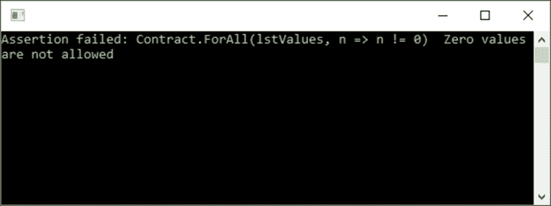

## 它是如何工作的…

我们可以看到，`ForAll`契约正好按我们预期的那样工作。这是一个极其有用的代码契约，特别是当你不需要添加大量的样板代码来检查集合中的各种无效值时。

# 创建代码契约 ValueAtReturn 方法

当使用代码契约`ValueAtReturn`时，我们能想到的最好例子是`out`参数。我个人并不经常使用`out`参数，但有时你需要使用它们。代码契约为此提供了支持，你可以在返回时检查值。

## 准备工作

我们将创建一个简单的方法，从参数中减去一个值。`out`参数将由代码契约验证，并将结果输出到控制台窗口。

## 如何做…

1.  在继续之前，确保你已经将代码契约的`using`语句添加到你的`Recipes.cs`类文件顶部：

    ```cs
    using System.Diagnostics.Contracts;
    ```

1.  在`Recipes`类中，创建一个新的方法`ValidOutValue()`，并传递一个名为`secureValue`的`out`参数：

    ```cs
    public static void ValidOutValue(out int secureValue)
    {

    }
    ```

1.  最后，将`Contract.ValueAtReturn`添加到方法中。有趣的是，你会发现这需要包含在`Contract.Ensures`中。这实际上是有道理的，因为代码契约确保我们将返回的值将符合特定的条件：

    ```cs
    public static void ValidOutValue(out int secureValue)
    {
        Contract.Ensures(Contract.ValueAtReturn<int>(out secureValue) >= 1, "The secure value is less or equal to zero");
        secureValue = secureValue - 10;
    }
    ```

1.  在控制台应用程序中，将相关的`using`语句添加到`Program.cs`类中，以便将静态类引入作用域：

    ```cs
    using static Chapter8.Recipes;
    ```

1.  然后，添加一些代码来调用`ValidOutValue()`方法，并将一个`out`参数传递给它：

    ```cs
    try
    {
        int valueToCheck = 5;
        ValidOutValue(out valueToCheck);
        WriteLine("The value is not zero");
    }
    catch (Exception ex)
    {
        WriteLine(ex.Message);
    }
    ReadLine();
    ```

1.  运行控制台应用程序，并在输出窗口中检查结果：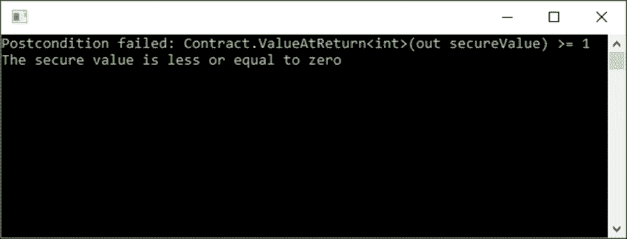

## 它是如何工作的…

我们可以看到，`out`参数已经成功验证。一旦条件不满足，代码契约抛出了我们能够捕获的异常。

# 创建代码契约 Result 方法

有时候，我们只是想有一种方式来验证方法的结果。我们希望能够检查返回的内容，并对其进行验证。正是在这里，代码契约`Result`可以派上用场。它将检查契约下方法返回的值与指定的契约，然后成功或失败。

## 如何操作…

1.  在继续之前，请确保你已经将代码契约`using`语句添加到你的`Recipes.cs`类文件顶部：

    ```cs
    using System.Diagnostics.Contracts;
    ```

1.  在`Recipes`类中，添加一个名为`ValidateResult()`的新方法，该方法接受两个整数作为参数：

    ```cs
    public static int ValidateResult(int value1, int value2)
    {

    }
    ```

1.  向此方法添加检查方法结果的代码契约`Result`。必须指出的是，代码契约`Result`永远不能在`void`方法中使用。这是显而易见的，因为这种代码契约的目的是检查和验证方法的结果。你还会注意到，代码契约`Result`方法与`Contract.Ensures`方法一起使用。`Contract.Result`的格式由返回类型`<int>()`和需要遵守的条件`>= 0`组成：

    ```cs
    public static int ValidateResult(int value1, int value2)
    {
        Contract.Ensures(Contract.Result<int>() >= 0, "Negative result not allowed");
        return value1 - value2;
    }
    ```

1.  在控制台应用程序中，将相关的`using`语句添加到`Program.cs`类中，以便将静态类引入作用域：

    ```cs
    using static Chapter8.Recipes;
    ```

1.  在契约下的静态方法中添加调用，并传递将导致代码契约抛出异常的参数。在这种情况下，我们传递了`10`和`23`，这将导致`ValidateResult()`方法返回一个负数：

    ```cs
    try
    {
        WriteLine(ValidateResult(10, 23));
    }
    catch (Exception ex)
    {
        WriteLine(ex.Message);
    }
    ReadLine();
    ```

1.  最后，运行控制台应用程序，检查返回到控制台输出窗口的结果：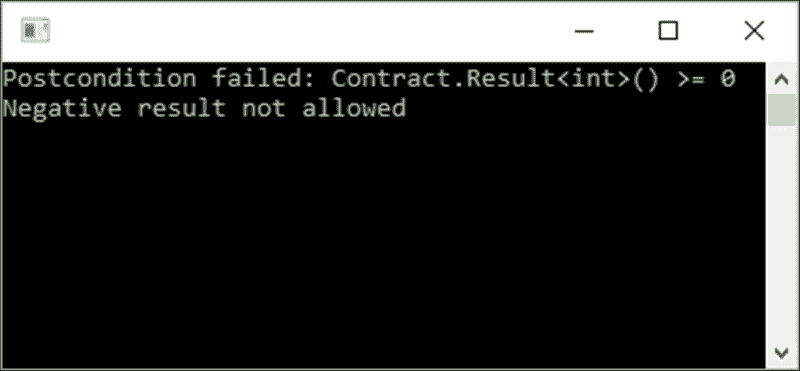

## 它是如何工作的…

你会看到代码契约检查了`ValidateResult()`方法的返回值，并发现它违反了契约。随后，将抛出异常并在控制台窗口中显示。

# 在抽象类上使用代码契约

如果你已经在代码中使用抽象类，你会知道能够通过代码契约来控制它们的使用，这将导致代码更加健壮。但究竟我们如何使用代码契约与抽象类结合呢？特别是既然抽象类不应该包含任何实现？好吧，这绝对可能，下面就是如何做到这一点的方法。

## 准备工作

如果你之前没有使用过抽象类，我们建议你首先阅读第二章，*类和泛型*，以熟悉如何使用和创建抽象类。

## 如何操作…

1.  在继续之前，请确保你已经将代码契约`using`语句添加到你的`Recipes.cs`类文件顶部：

    ```cs
    using System.Diagnostics.Contracts;
    ```

1.  创建一个名为`Shape`的抽象类，它定义了两个方法，分别称为`Length()`和`Width()`，每个方法都接受一个整数作为参数。记住，抽象类不包含任何实现：

    ```cs
    public abstract class Shape
    {
        public abstract void Length(int value);
        public abstract void Width(int value);
    }
    ```

1.  创建另一个名为 `ShapeContract` 的抽象类，它继承自 `Shape` 抽象类。我们的代码合同将驻留在这里：

    ```cs
    public abstract class ShapeContract : Shape
    {

    }
    ```

1.  重写 `Shape` 抽象类的 `Length()` 和 `Width()` 方法，并确保它们需要一个非零参数：

    ```cs
    public abstract class ShapeContract : Shape
    {
        public override void Length(int value)
        {
            Contract.Requires(value > 0, "Length must be greater than zero");
        }

        public override void Width(int value)
        {
            Contract.Requires(value > 0, "Width must be greater than zero");
        }
    }
    ```

1.  我们现在需要将 `ShapeContract` 合同类与 `Shape` 抽象类关联起来。我们将通过使用属性来完成此操作。在你的 `Shape` 抽象类顶部添加以下属性：

    ```cs
    [ContractClass(typeof(ShapeContract))]
    ```

1.  完成此操作后，你的 `Shape` 抽象类将看起来像这样：

    ```cs
    [ContractClass(typeof(ShapeContract))]
    public abstract class Shape
    {
        public abstract void Length(int value);
        public abstract void Width(int value);
    }
    ```

1.  我们还需要将 `Shape` 抽象类与 `ShapeContract` 抽象类关联起来，作为告诉编译器合同需要作用于哪个类的手段。我们将通过在 `ShapeContract` 类顶部添加以下属性来完成此操作：

    ```cs
    [ContractClassFor(typeof(Shape))]
    ```

1.  当你完成这些操作后，你的 `ShapeContract` 类将看起来像这样：

    ```cs
    [ContractClassFor(typeof(Shape))]
    public abstract class ShapeContract : Shape
    {
        public override void Length(int value)
        {
            Contract.Requires(value > 0, "Length must be greater than zero");
        }

        public override void Width(int value)
        {
            Contract.Requires(value > 0, "Width must be greater than zero");
        }
    }
    ```

1.  我们现在准备好实现 `Shape` 抽象类。创建一个名为 `Rectangle` 的新类，并继承 `Shape` 抽象类：

    ```cs
    public class Rectangle : Shape
    {

    }
    ```

1.  你会注意到 Visual Studio 用红色波浪线下划线标记了 `Rectangle` 类。这是因为还没有实现 `Shape` 类。将鼠标光标悬停在红色波浪线上，查看 Visual Studio 提供的灯泡弹出建议：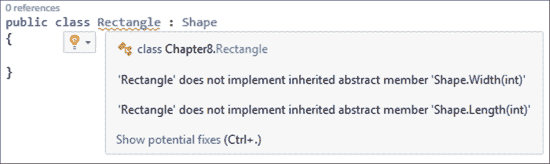

1.  通过按住 *Ctrl* + *.*（句号），你会看到可以实施的建议修复，以纠正 Visual Studio 警告你的错误。在这种情况下，Visual Studio 建议我们实施的单个修复是实现抽象类：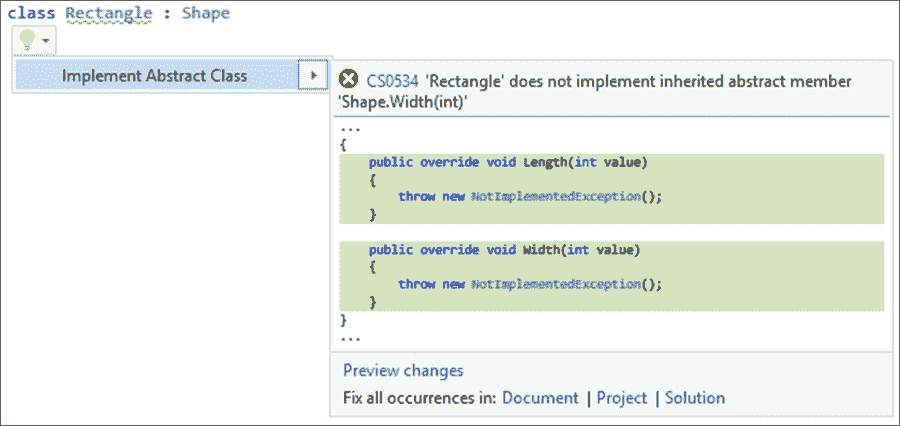

1.  在点击灯泡建议中的**实现抽象类**建议后，Visual Studio 将插入 `Shape` 抽象类的实现。你会注意到为你插入的方法仍然没有任何实现，如果你没有为 `Length()` 和 `Width()` 方法添加任何实现，它们将抛出 `NotImplementedException`：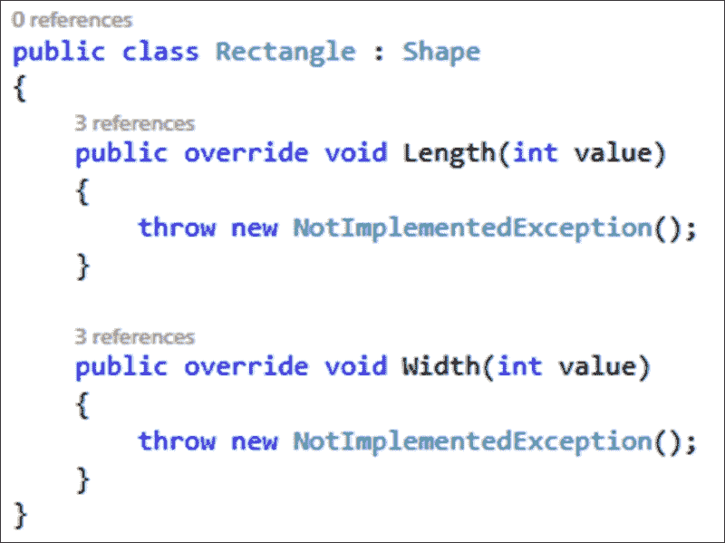

1.  要为我们的 `Rectangle` 类添加实现，为 `Length()` 和 `Width()` 方法创建两个属性，并将这些属性设置为提供的参数值的值：

    ```cs
    public class Rectangle : Shape
    {
        private int _length { get; set; }
        private int _width { get; set; }
        public override void Length(int value)
        {
            _length = value;
        }

        public override void Width(int value)
        {
            _width = value;
        }
    }
    ```

1.  在控制台应用程序中，向 `Program.cs` 类添加相关的 `using` 语句，以便将 `Chapter8` 类引入作用域：

    ```cs
    using Chapter8;
    ```

1.  创建 `Rectangle` 类的新实例，并将一些值传递给 `Rectangle` 类的 `Length()` 和 `Width()` 方法：

    ```cs
    try
    {
        Rectangle oRectangle = new Rectangle();
        oRectangle.Length(0);
        oRectangle.Width(1);
    }
    catch (Exception ex)
    {
        WriteLine(ex.Message);
    }
    ReadLine();
    ```

1.  最后，运行控制台应用程序并检查输出窗口：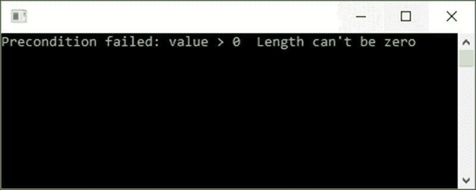

## 它是如何工作的…

由于我们在 `Length()` 方法中添加了一个零值，抽象类上的代码合同已正确地抛出了异常。能够在抽象类上实现代码合同允许开发者创建更好的代码，尤其是在团队工作中，你需要根据某些业务规则传达实现限制时。

# 使用契约缩写方法

缩写方法是代码契约功能的一个很好的补充。它们允许我们创建一个包含常用或分组代码契约的单个缩写方法。这意味着我们可以简化我们的代码并使其更易于阅读。

## 准备工作

我们将创建两个具有相同代码契约要求的方法。然后，通过实现一个缩写方法来包含代码契约，我们将简化契约下的方法。

## 如何操作…

1.  在继续之前，请确保您已将代码契约 `using` 语句添加到您的 `Recipes.cs` 类文件顶部：

    ```cs
    using System.Diagnostics.Contracts;
    ```

1.  在添加以下方法之前请考虑。这里有两个方法，每个方法都需要传入的参数不等于零，并且结果也不为零。每个方法内部实现不同，但应用的代码契约是相同的。为了避免代码契约不必要地重复，我们可以使用缩写方法：

    ```cs
    public static int MethodOne(int value)
    {
        Contract.Requires(value > 0, "Parameter must be greater than zero");
        Contract.Ensures(Contract.Result<int>() > 0, "Method result must be greater than zero");

        return value - 1;
    }

    public static int MethodTwo(int value)
    {
        Contract.Requires(value > 0, "Parameter must be greater than zero");
        Contract.Ensures(Contract.Result<int>() > 0, "Method result must be greater than zero");

        return (value * 10) - 10;
    }
    ```

1.  在您的 `Recipes` 类中添加一个名为 `StandardMethodContract()` 的新方法。此方法的名字可以是任何您喜欢的，但签名需要与缩写的方法匹配。在此方法内部，添加之前在 `MethodOne()` 和 `MethodTwo()` 中定义的所需代码契约：

    ```cs
    private static void StandardMethodContract(int value)
    {
        Contract.Requires(value > 0, "Parameter must be greater than zero");
        Contract.Ensures(Contract.Result<int>() >= 1, "Method result must be greater than zero");
    }
    ```

1.  将以下属性添加到 `StandardMethodContract()` 方法的顶部，以将其标识为缩写方法：

    ```cs
    [ContractAbbreviator]
    ```

1.  完成此操作后，您的缩写方法应如下所示：

    ```cs
    [ContractAbbreviator]
    private static void StandardMethodContract(int value)
    {
        Contract.Requires(value > 0, "Parameter must be greater than zero");
        Contract.Ensures(Contract.Result<int>() >= 1, "Method result must be greater than zero");
    }
    ```

1.  现在，您可以通过在代码契约的位置引用缩写方法来简化 `MethodOne()` 和 `MethodTwo()`：

    ```cs
    public static int MethodOne(int value)
    {
        StandardMethodContract(value);

        return value - 1;
    }

    public static int MethodTwo(int value)
    {
        StandardMethodContract(value);

        return (value * 10) - 10;
    }
    ```

1.  在控制台应用程序中，将相关的 `using` 语句添加到 `Program.cs` 类中，以便将静态类引入作用域：

    ```cs
    using static Chapter8.Recipes;
    ```

1.  首先，使用以下参数调用两个方法：

    ```cs
    try
    {
        MethodOne(0);
        MethodTwo(1);                
    }
    catch (Exception ex)
    {
        WriteLine(ex.Message);
    }
    ReadLine();
    ```

1.  如果您运行您的控制台应用程序，您将注意到代码契约在缩写契约中抛出异常，告诉我们提供的参数不能为零：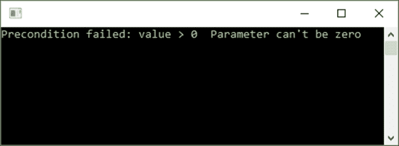

1.  然后，修改您的调用代码，为 `MethodOne()` 传递一个有效值，但保持对 `MethodTwo()` 的调用不变。再次运行您的控制台应用程序：

    ```cs
    try
    {
        MethodOne(200);
        MethodTwo(1);                
    }
    catch (Exception ex)
    {
        WriteLine(ex.Message);
    }
    ReadLine();
    ```

1.  这次，您将看到缩写方法中的代码契约在返回值不能为零的情况下抛出异常：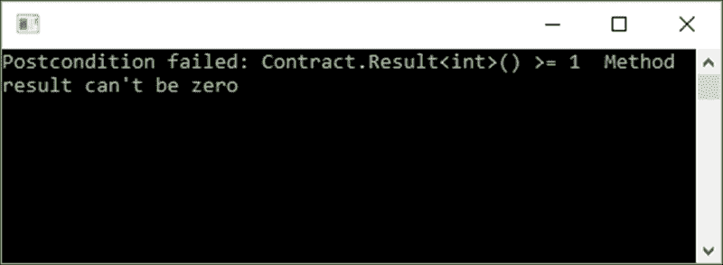

## 它是如何工作的…

缩写方法允许我们创建更易于阅读的代码，并将常用代码契约分组在带有 `[ContractAbbreviator]` 特性的公共方法中。缩写方法是代码契约的一个强大功能，开发人员可以利用它来生成更好的代码。

# 使用 IntelliTest 创建测试

IntelliTest 允许开发者创建和运行针对其代码合同的测试。这允许开发者通过创建额外的代码合同来通过 IntelliTest 报告的测试失败，从而创建最健壮的代码。但需要注意的是，IntelliTest 仅包含在 Visual Studio Enterprise 中。

## 准备工作

您需要使用 Visual Studio Enterprise 2015 来创建和运行 IntelliTests。

## 如何操作…

1.  在继续之前，请确保您已将代码合同 `using` 语句添加到 `Recipes.cs` 类文件顶部：

    ```cs
    using System.Diagnostics.Contracts;
    ```

1.  在您的 `Recipes.cs` 文件中添加一个名为 `CodeContractTests` 的新类：

    ```cs
    public class CodeContractTests
    {    

    }
    ```

1.  然后，在 `CodeContractTests` 类中添加一个名为 `Calculate()` 的方法，并将两个整数值作为参数传递给 `Calculate()` 方法。在 `Calculate()` 方法内部，添加一个代码合同以确保该方法的结果永远不会等于零：

    ```cs
    public class CodeContractTests
    {
        public int Calculate(int valueOne, int valueTwo)
        {
            Contract.Ensures(Contract.Result<int>() >= 1, "");

            return valueOne / valueTwo;
        }
    }
    ```

1.  选择 `Calculate()` 方法并右键单击它。从上下文菜单中，点击 **创建 IntelliTest** 菜单项：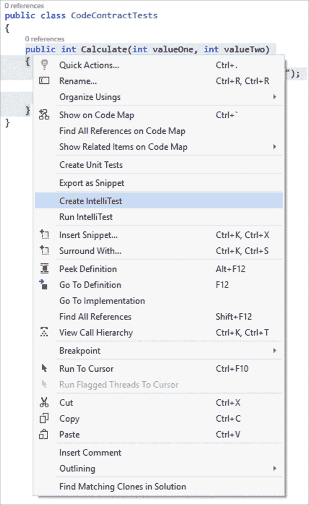

1.  Visual Studio 将显示 **创建 IntelliTest** 窗口。在这里，您可以定义您的 IntelliTest 的几个设置。需要注意的是，您可以使用与 **MSTest** 不同的测试框架。然而，出于我们的目的，我们将使用 **MSTest** 并将其他设置保留为默认值：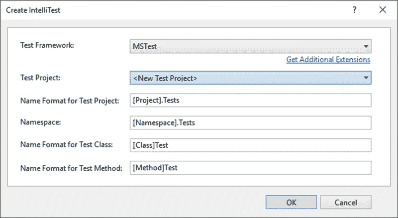

1.  当您点击 **确定** 按钮时，Visual Studio 将继续为您创建一个新的测试项目：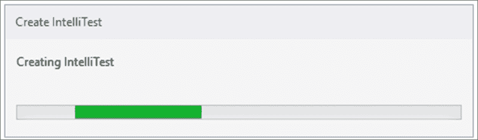

1.  当项目创建完成后，您将在 **解决方案资源管理器** 中看到创建的新测试项目。在本例中，因为我们保留了 **创建 IntelliTest** 窗口中的默认设置，所以我们的新测试项目将被称为 `Chapter8.Tests`：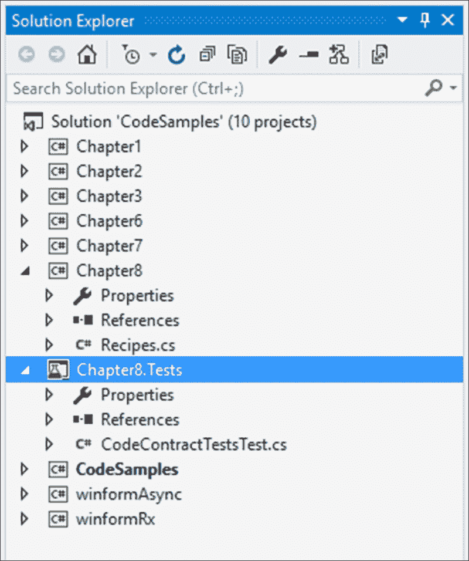

1.  继续展开 `Chapter8.Tests` 项目，然后点击为您创建的 `CodeContractTestsTest.cs` 文件。您将看到 Visual Studio 为您创建的以下代码：

    ```cs
    /// <summary>This class contains parameterized unit tests for CodeContractTests</summary>
    [PexClass(typeof(CodeContractTests))]
    [PexAllowedExceptionFromTypeUnderTest(typeof(InvalidOperati onException))]
    [PexAllowedExceptionFromTypeUnderTest(typeof(ArgumentExcept ion), AcceptExceptionSubtypes = true)]
    [TestClass]
    public partial class CodeContractTestsTest
    {
        /// <summary>Test stub for Calculate(Int32, Int32)</summary>
        [PexMethod]
        public int CalculateTest(
            [PexAssumeUnderTest]CodeContractTests target,
            int valueOne,
            int valueTwo
        )
        {
            int result = target.Calculate(valueOne, valueTwo);
            return result;
            // TODO: add assertions to method CodeContractTestsTest.CalculateTest (CodeContractTests, Int32, Int32)
        }
    }
    ```

1.  在 `CodeContractTests` 类中，右键单击 `Calculate()` 方法并从上下文菜单中选择 **运行 IntelliTest**：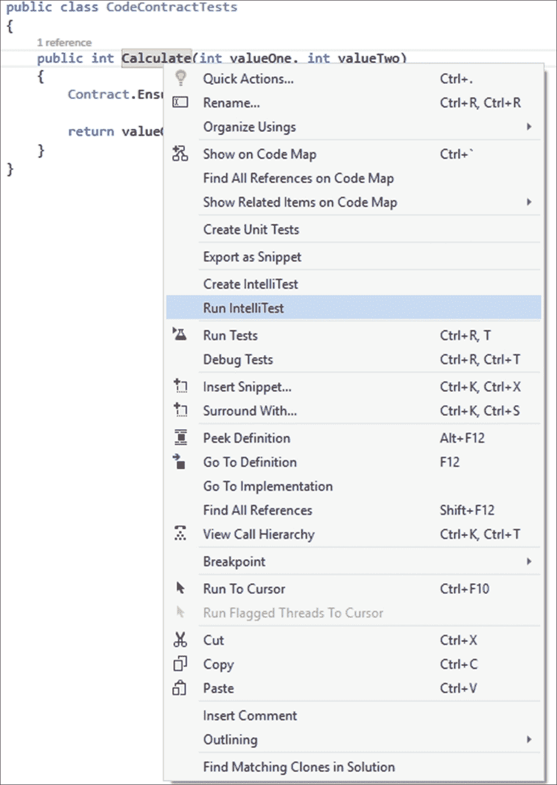

1.  IntelliTest 将立即开始工作并打开 **IntelliTest 探索结果** 窗口：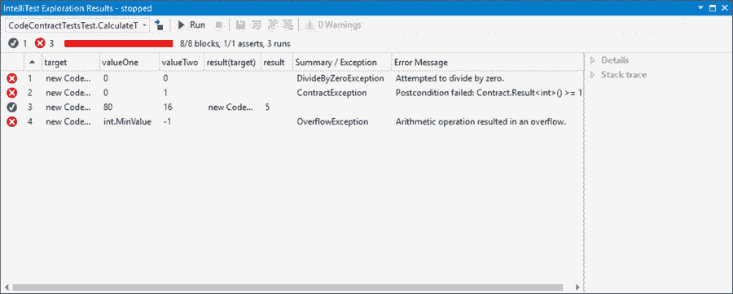

1.  从我们对 `Calculate()` 方法运行的测试结果中，我们可以看到有三个失败的测试和一个成功的测试。报告的测试失败是 `DivideByZeroException`、`ContractException` 和 `OverflowException`。点击单个测试失败可以查看测试详情以及 **堆栈跟踪**：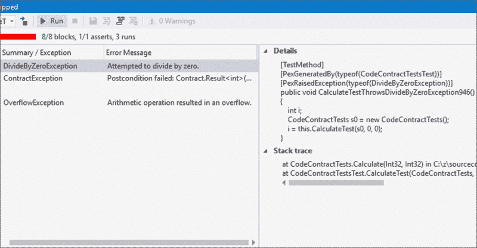

1.  让我们通过添加以下额外的代码合同来修改 `Calculate()` 方法：

    ```cs
    public int Calculate(int valueOne, int valueTwo)
    {
        Contract.Requires(valueOne > 0, "Parameter must be greater than zero");
        Contract.Requires(valueTwo > 0, "Parameter must be greater than zero");
        Contract.Requires(valueOne > valueTwo, "Parameter values will result in value <= 0");
        Contract.Ensures(Contract.Result<int>() >= 1, "");

        return valueOne / valueTwo;
    }
    ```

1.  从附加的代码约定中，我们可以看到，通过要求`valueTwo`参数大于零，我们已经解决了`DivideByZeroException`。我们还可以看到，要求`valueOne`总是大于`valueTwo`的代码约定已经解决了`ContractException`。最后，通过要求两个参数都大于零，我们自动解决了`OverflowException`：

1.  右键单击`Calculate()`方法并再次运行 IntelliTest。这次，你会看到所有测试都通过了，我们受合同约束的方法现在可以用于生产代码：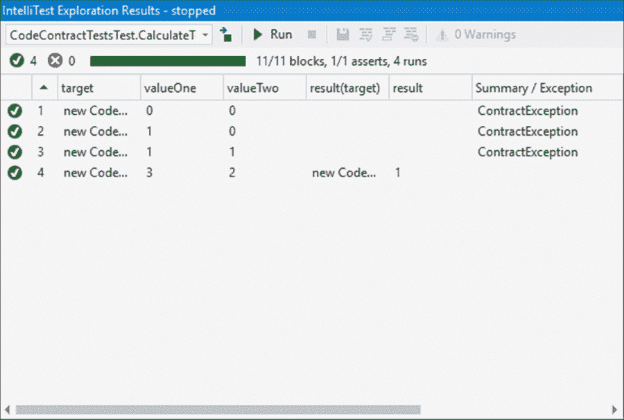

## 它是如何工作的……

IntelliTest 允许开发者通过几点击鼠标快速高效地为你的代码约定创建测试。

# 在扩展方法中使用代码约定

之前的菜谱展示了开发者如何创建各种代码约定来保护你的代码免受意外输入和输出的影响，但让我们看看开发者如何利用代码约定。扩展方法的想法浮现在脑海中，其中我们创建可以在整个项目中使用以执行常用操作的代码。

让我们使用代码约定`ForAll`方法。这会影响一个集合，因此自然地，它在扩展方法中的使用引导我们到一个可能的实现。在这个菜谱中，我们将创建一个使用代码约定来验证我们刚刚创建的列表的扩展方法。

## 准备工作

我们将创建一个用于扩展方法的静态类，然后使用`ForAll`代码约定来验证`List`集合。

## 如何做……

1.  在你继续之前，确保你已经将代码约定`using`语句添加到你的`Recipes.cs`类文件顶部：

    ```cs
    using System.Diagnostics.Contracts;
    ```

1.  创建一个名为`ExtensionMethods`的新静态类并将其添加到`Recipes.cs`类文件中：

    ```cs
    public static class ExtensionMethods
    {

    }
    ```

1.  接下来，添加一个名为`ContainsInvalidValue()`的扩展方法，它接受一个匿名类型`T`的给定列表和一个要检查的类型为`T`的无效值作为参数：

    ```cs
    public static bool ContainsInvalidValue<T>(this List<T> value, T invalidValue)
    {    

    }
    ```

1.  在我们的扩展方法内部，添加一个包裹在`try` `catch`语句中的代码约定`ForAll`，该语句检查给定参数是否在列表中存在：

    ```cs
    try
    {
        Contract.Assert(Contract.ForAll(value, n => !value.Contains(invalidValue)), "Zero values are not allowed");
        return false;
    }
    catch 
    {
        return true;
    }
    ```

1.  一旦你将所有代码添加到你的扩展方法中，它应该看起来像这样：

    ```cs
    public static class ExtensionMethods
    {
        public static bool ContainsInvalidValue<T>(this List<T> value, T invalidValue)
        {
            try
            {
                Contract.Assert(Contract.ForAll(value, n => !value.Contains(invalidValue)), "Zero values are not allowed");
                return false;
            }
            catch 
            {
                return true;
            }
        }
    }
    ```

1.  在控制台应用程序中，将相关的`using`语句添加到`Program.cs`类中，以便将`Chapter8`类引入作用域：

    ```cs
    using Chapter8;
    ```

1.  正如我们之前所做的那样，创建一个简单的列表，但这次，调用通过静态扩展方法类在列表上公开的扩展方法。现在，我们将能够通过使用扩展方法和代码约定直接验证我们的列表：

    ```cs
    List<int> intList = new List<int>();
    int[] arr;
    intList.AddRange(arr = new int[] { 1, 3, 2, 6, 0, 5 });

    if (intList.ContainsInvalidValue(4)) 
        WriteLine("Invalid integer Value");
    else
        WriteLine("Valid integer List");
    ```

1.  运行应用程序将产生以下输出：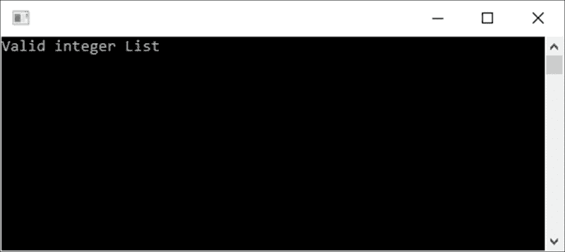

1.  由于我们在这里使用匿名类型，我们可以轻松地在包含不同类型的列表上调用这个扩展方法。以下是一个在字符串列表上的实现示例：

    ```cs
    List<string> strList = new List<string>();
    string[] arr2;
    strList.AddRange(arr2 = new string[] { "S", "A", "Z" });

    if (strList.ContainsInvalidValue("G"))
        WriteLine("Invalid string Value");
    else
        WriteLine("Valid string List");
    ```

1.  再次运行应用程序将产生以下输出：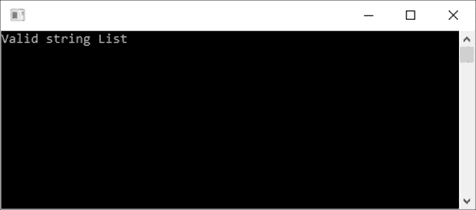

## 它是如何工作的…

我们可以看到，使用代码约定以及 C#的其他强大功能，我们可以利用非常强大的代码检查和验证技术。扩展方法可以在整个项目中使用，以执行频繁的验证或针对您项目的特定代码逻辑。
