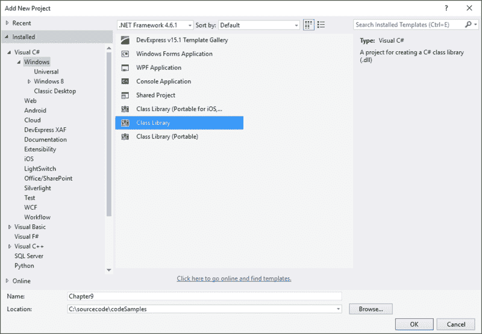
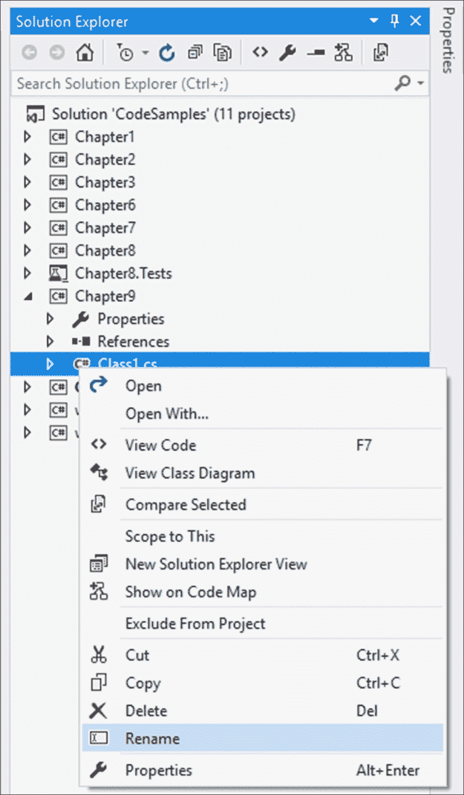
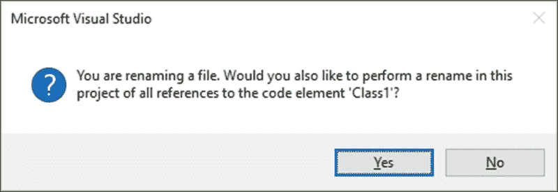
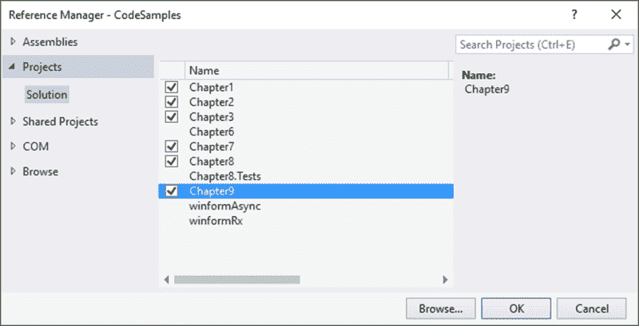
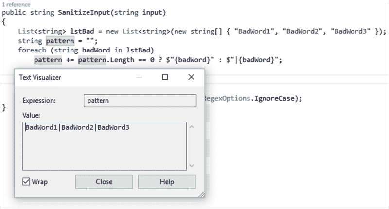
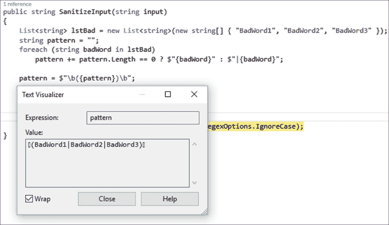
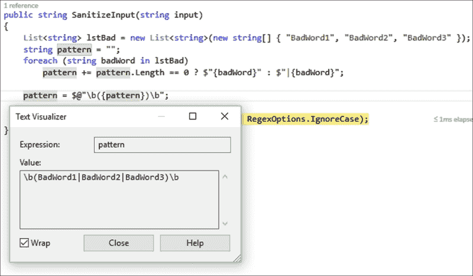
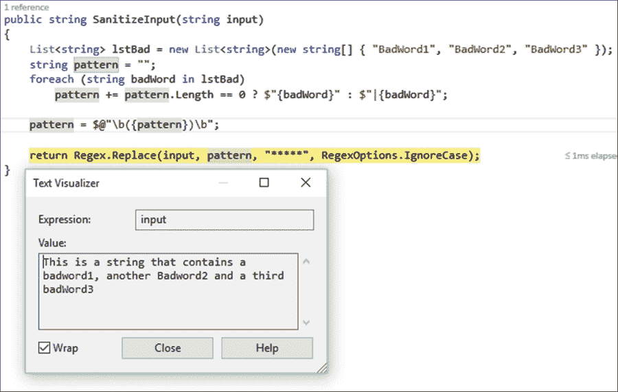
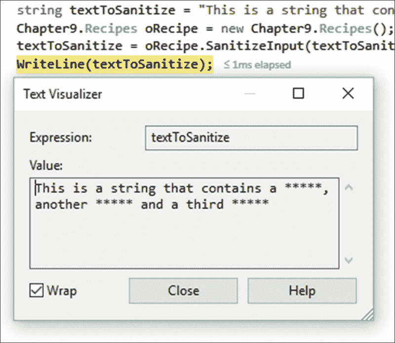

# 第九章。正则表达式

**正则表达式**（**regex**）对许多开发者来说仍然是一个谜。我们承认，我们经常使用它们，这足以证明深入了解它们的工作原理是必要的。另一方面，互联网上有许多经过测试的正则表达式模式，直接重用现有的模式通常比尝试自己创建一个更容易。正则表达式的主题远比本书单章所能解释的要多。

因此，在本章中，我们仅介绍一些正则表达式的概念。为了更深入地理解正则表达式，还需要进一步学习。然而，为了本书的目的，我们将更详细地研究正则表达式的创建方式和它们如何应用于一些常见的编程问题。在本章中，我们将涵盖以下食谱：

+   开始使用正则表达式

+   匹配有效日期

+   清理输入

+   动态正则表达式匹配

# 简介

正则表达式是通过使用表示特定文本匹配的特殊字符来描述字符串的模式。正则表达式的使用在编程中不是一个新概念。为了使正则表达式工作，它们需要使用正则表达式引擎来完成所有繁重的工作。

在.NET 框架中，Microsoft 为正则表达式的使用提供了支持。要使用正则表达式，您需要将 `System.Text.RegularExpressions` 程序集导入到您的项目中。这将允许编译器使用您的正则表达式模式并将其应用于您需要匹配的特定文本。

其次，正则表达式有一组特定的元字符，这些字符对正则表达式引擎具有特殊意义。这些字符是 `[ ]`、`{ }`、`( )`、`*`、`+`、`\`、`?`、`|`、`$`、`.` 和 `^`。

使用花括号 `{ }`，例如，允许开发者指定特定字符集需要出现的次数。另一方面，使用方括号定义需要精确匹配的内容。

例如，如果我们指定了 `[abc]`，则模式将寻找小写的 A、B 和 C。因此，正则表达式还允许您定义一个范围，例如 `[a-c]`，它被解释得与 `[abc]` 模式完全相同。

正则表达式还允许您使用 `^` 字符定义要排除的字符。因此，键入 `[^a-c]` 将找到小写字母 D 到 Z，因为模式告诉正则表达式引擎排除小写字母 A、B 和 C。

正则表达式还定义了 `\d` 和 `\D` 作为 `[0-9]` 和 `[⁰-9]` 的快捷类型。因此，`\d` 匹配所有数值，`\D` 匹配所有非数值。另一个快捷类型是 `\w` 和 `\W`，它们匹配从小写字母 A 到 Z 的所有字符，不考虑大小写，以及从 0 到 9 的所有数值和下划线字符。因此，`\w` 是 `[a-zA-Z0-9_]`，而 `\W` 是 `[^a-zA-Z0-9_]`。

正则表达式的基础知识相对容易理解，但你可以用正则表达式做更多的事情。

# 开始使用正则表达式

我们将创建一个名为 `Chapter9` 的新类，在这里我们将创建各种方法来展示正则表达式的使用。

## 准备工作

为了本书的目的，我们将创建一个简单的控制台应用程序来展示正则表达式的使用。实际上，你很可能不会将这种逻辑与你的生产代码混合在一起，因为这会导致代码被重写。正则表达式最佳添加位置是在扩展方法中的辅助类。

## 如何操作…

1.  首先右键单击解决方案，转到 **添加**，然后从上下文菜单中选择 **新建项目**：

1.  **添加新项目** 窗口打开。选择 **类库** 项目类型，并将项目命名为 `Chapter9`：

1.  在新类文件被添加后，你的 **解决方案资源管理器** 应该看起来像这样：

1.  右键单击 `Class1.cs` 文件，并从上下文菜单中选择 **重命名**：

1.  将 `Class1.cs` 文件重命名为 `Recipes.cs` 并在确认对话框中选择 **是**：

1.  在控制台应用程序中，点击 **引用** 部分，并从上下文菜单中选择 **添加引用**：

1.  在控制台应用程序的 **引用管理器** 中，选择 `Chapter9` 并点击 **确定** 以将其添加为控制台应用程序的引用：

1.  在 `Recipes` 类中添加以下 `using` 语句，以便我们可以在 .NET 中使用正则表达式程序集：

    ```cs
    using System.Text.RegularExpressions;
    ```

1.  完成所有这些后，你的 `Chapter9` 类应该看起来像这样：

    ```cs
    using System.Text.RegularExpressions;
    namespace Chapter9
    {
        public class Recipes
        {
        }
    }
    ```

## 工作原理…

我们已经添加了一个基本的类文件，它将被用来验证正则表达式模式，这个文件是从我们的控制台应用程序中调用的。

# 匹配有效日期

我们将创建一个正则表达式来验证 yyyy-mm-dd、yyyy/mm/dd 或 yyyy.mm.dd 的日期模式。一开始，这个正则表达式可能看起来令人畏惧，但请耐心等待。当你完成代码并运行应用程序后，我们将分析正则表达式。希望表达式逻辑会变得清晰。

## 准备工作

确保你已经将正确的程序集添加到你的类中。如果你的代码文件顶部还没有，请添加以下代码行：

```cs
using System.Text.RegularExpressions;
```

## 如何操作…

1.  创建一个名为 `ValidDate()` 的新方法，它接受一个字符串作为参数。这个字符串将是我们要验证的日期模式：

    ```cs
    public void ValidDate(string stringToMatch)
    {

    }
    ```

1.  将以下正则表达式模式添加到你的方法中，到一个方法变量中：

    ```cs
    string pattern = $@"^(19|20)\d\d-./- ./$";
    ```

1.  最后，添加正则表达式来匹配提供的字符串参数：

    ```cs
    if (Regex.IsMatch(stringToMatch, pattern))
        Console.WriteLine($"The string {stringToMatch} contains a valid date.");
    else
        Console.WriteLine($"The string {stringToMatch} DOES NOT contain a valid date.");
    ```

1.  完成此操作后，你的方法应该看起来像这样：

    ```cs
    public void ValidDate(string stringToMatch)
    {
        string pattern = $@"^(19|20)\d\d-./- ./$";

        if (Regex.IsMatch(stringToMatch, pattern))
            Console.WriteLine($"The string {stringToMatch} contains a valid date.");
        else
            Console.WriteLine($"The string {stringToMatch} DOES NOT contain a valid date.");            
    }
    ```

1.  返回到你的控制台应用程序，添加以下代码并通过点击 **开始** 来调试你的应用程序：

    ```cs
    Chapter9.Recipes oRecipe = new Chapter9.Recipes();
    oRecipe.ValidDate("1912-12-31");
    oRecipe.ValidDate("2018-01-01");
    oRecipe.ValidDate("1800-01-21");
                oRecipe.ValidDate($"{DateTime.Now.Year}.{DateTime.Now.Month }.{DateTime.Now.Day}");
    oRecipe.ValidDate("2016-21-12"); 
    Read();
    ```

    ### 注意

    您会注意到在先前的代码示例中使用了 `Read()` 而不是 `Console.Read()`。这是因为我们在控制台应用程序的 `using` 语句中添加了 `using static System.Console`;。这样做将允许您省略 `Console` 关键字。

1.  日期字符串被传递到正则表达式，模式与参数中的日期字符串进行匹配。输出在控制台应用程序中显示：

1.  如果仔细查看输出，您会注意到有一个错误。我们正在验证的日期字符串格式为 yyyy-mm-dd, yyyy/mm/dd, 和 yyyy.mm.dd。如果我们使用这种逻辑，我们的正则表达式错误地将一个有效日期标记为无效。这是日期 `2016.4.10`，即 2016 年 4 月 10 日，实际上是非常有效的。

    ### 注意

    我们将简要解释为什么日期 `1800-01-21` 是无效的。

1.  回到你的 `ValidDate()` 方法，将正则表达式更改为以下内容：

    ```cs
    string pattern = $@"^(19|20)\d\d-./-./$";
    ```

1.  再次运行控制台应用程序并查看输出：

这次正则表达式对所有给定的日期字符串都有效。但我们到底做了什么？这是它的工作原理。

## 它是如何工作的…

让我们更仔细地看看先前的代码示例中使用的两个表达式。将它们相互比较，您可以看到我们用黄色标记出的更改：


在我们解释这个更改意味着什么之前，让我们分解表达式并查看各个组成部分。我们的正则表达式基本上表示我们必须匹配所有以 19 或 20 开头并具有以下分隔符的字符串日期：

+   破折号 (`-`)

+   小数点 (`.`)

+   斜杠 (`/`)

为了更好地理解表达式，我们需要了解以下表达式的格式 *<有效年份><有效分隔符><有效月份><有效分隔符><有效日期>*。

我们还需要能够告诉正则表达式引擎考虑一个或另一个模式。单词“或”由元字符 `|` 表示。为了使正则表达式引擎考虑单词“或”而不拆分整个表达式，我们将其括在括号 `()` 中。

这里是正则表达式中使用的符号：

| 条件或 |
| --- |
| `&#124;` | 这表示“或”元字符。 |
| **年份部分** |
| `(19&#124;20)` | 只允许 19 或 20。 |
| `\d\d` | 匹配 0 到 9 之间的两个单个数字。要匹配 0 到 9 之间的单个数字，您将使用 `\d`。 |
| **有效的分隔符字符集** |
| `[-./]` | 匹配字符集中以下任意字符。这些是我们有效的分隔符。要匹配空格日期分隔符，您需要将其更改为 `[- ./]`，其中您可以在字符集中添加空格。我们在破折号和十进制之间添加了空格。 |
| **月份和日期的有效数字** |
| `0[1-9]` | 匹配以零开头，后跟 1 到 9 之间任意数字的部分。这将匹配 01, 02, 03, 04, 05, 06, 07, 08 和 09。 |
| `1[0-2]` | 匹配以 1 开头，后跟 0 到 2 之间的任何数字的任何部分。这将匹配 10, 11 或 12。 |
| `[1-9]` | 匹配 1 到 9 之间的任何数字。 |
| `[12][0-9]` | 匹配以 1 或 2 开头，后跟 0 到 9 之间的任何数字的任何部分。这将匹配所有介于 10 到 29 之间的数字字符串。 |
| `3[01]` | 匹配以 3 开头，后跟 0 或 1 的任何部分。这将匹配 30 或 31。 |
| **字符串的开始和结束** |
| `^` | 告诉正则表达式引擎从给定字符串的开始处开始匹配。 |
| `$` | 告诉正则表达式引擎在给定字符串的末尾停止匹配。 |

我们创建的第一个正则表达式解释如下：

+   `^`: 从字符串的开始处开始匹配。

+   `(19|20)`: 检查字符串是否以 19 或 20 开头。

+   `\d\d`: 在检查之后，跟随两个 0 到 9 之间的单个数字。

+   `[-./]`: 年份部分结束，随后是日期分隔符。

+   `(0[1-9]|1[0-2])`: 通过查找以 0 开头，后跟 1 到 9 之间的任何数字，或者以 1 开头，后跟 0 到 2 之间的任何数字的逻辑来找到月份。

+   `[-./]`: 月份逻辑结束，随后是日期分隔符。

+   `(0[1-9]|[12][0-9]|3[01])`: 然后，通过查找以 0 开头，后跟 1 到 9 之间的任何数字，或者以 1 或 2 开头，后跟 0 到 9 之间的任何数字，或者以 3 开头，后跟 0 到 1 之间的任何数字的逻辑来找到日期。

+   `$`: 继续这样做，直到字符串的末尾。

我们的第一个正则表达式是错误的，因为我们的月份逻辑是错误的。我们的月份逻辑指示通过查找以 0 开头，后跟 1 到 9 之间的任何数字，或者以 1 开头，后跟 0 到 2 之间的任何数字`(0[1-9]|1[0-2])`来找到月份逻辑。

这将找到 01, 02, 03, 04, 05, 06, 07, 08, 09 或 10, 11, 12。没有匹配的日期是`2016.4.10`（这里的日期分隔符没有影响）。这是因为我们的月份是一个单独的数字，而我们寻找的是以 0 开头的月份。为了解决这个问题，我们必须修改月份逻辑的表达式，以包括 1 到 9 之间的单个数字。我们通过在表达式的末尾添加`[1-9]`来实现这一点。

修改后的正则表达式如下所示：

+   `^`: 从字符串的开始处开始匹配。

+   `(19|20)`: 检查字符串是否以 19 或 20 开头。

+   `\d\d`: 在检查之后，跟随两个 0 到 9 之间的单个数字。

+   `[-./]`: 年份部分结束，随后是日期分隔符。

+   `(0[1-9]|1[0-2])`: 通过查找以 0 开头，后跟 1 到 9 之间的任何数字，或者以 1 开头，后跟 0 到 2 之间的任何数字，或者任何单个数字（1 到 9）的逻辑来找到月份。

+   `[-./]`: 月份逻辑结束，随后是日期分隔符。

+   `(0[1-9]|[12][0-9]|3[01])`: 然后，通过寻找以 0 开头的数字，后面跟着一个 1 到 9 之间的数字，或者以 1 或 2 开头的数字，后面跟着任何 0 到 9 之间的数字，或者一个匹配 3 的数字，后面跟着任何 0 到 1 之间的数字来找到天逻辑

+   `$`: 一直做到字符串的末尾

这是一个基本的正则表达式，我们称之为基本，因为我们还可以做更多的事情来使表达式更好。我们可以包括逻辑来考虑其他日期格式，例如 mm-dd-yyyy 或 dd-mm-yyyy。我们可以添加逻辑来检查二月，并验证它是否只包含 28 天，除非它是闰年，在这种情况下，我们需要允许二月的第二十九天。此外，我们还可以扩展正则表达式来检查一月、三月、五月、七月、八月、十月和十二月有 31 天，而四月、六月、九月和十一月只有 30 天。

# 清理输入

有时，你需要清理输入。这可能是为了防止 SQL 注入或确保输入的 URL 有效。在这个菜谱中，我们将查看用星号替换字符串中的脏话。我们确信有更多优雅且代码效率更高的方法来编写清理逻辑使用正则表达式（特别是当我们有一个大量的黑名单单词集合时），但在这里我们想要说明一个概念。

## 准备工作

确保你已经将正确的程序集添加到你的类中。如果你还没有这样做，请在你的代码文件顶部添加以下代码行：

```cs
using System.Text.RegularExpressions;
```

## 如何操作…

1.  在你的 `Recipes.cs` 类中创建一个新的方法，命名为 `SanitizeInput()`，并让它接受一个字符串参数：

    ```cs
    public string SanitizeInput(string input)
    {

    }
    ```

1.  在包含我们想要从输入中移除的脏话的方法中添加一个类型为 `List<string>` 的列表：

    ```cs
    List<string> lstBad = new List<string>(new string[] { "BadWord1", "BadWord2", "BadWord3" });
    ```

    ### 注意

    实际上，你可能需要使用数据库调用从数据库中的表中读取黑名单中的单词。你通常不会像这样将它们硬编码到列表中。

1.  开始构建我们将用来查找黑名单单词的正则表达式。使用 `|`（或）元字符连接单词，以便正则表达式可以匹配任何单词。当列表完成时，你可以在正则表达式的两边添加 `\b` 表达式。这表示单词边界，因此只会匹配整个单词：

    ```cs
    string pattern = "";
    foreach (string badWord in lstBad)
        pattern += pattern.Length == 0 ? $"{badWord}" : $"|{badWord}";

    pattern = $@"\b({pattern})\b";
    ```

1.  最后，我们将添加 `Regex.Replace()` 方法，该方法接受输入并查找模式中定义的单词的出现，同时忽略大小写并将脏话替换为 `*****`：

    ```cs
    return Regex.Replace(input, pattern, "*****", RegexOptions.IgnoreCase);
    ```

1.  完成此操作后，你的 `SanitizeInput()` 方法将看起来像这样：

    ```cs
    public string SanitizeInput(string input)
    {
        List<string> lstBad = new List<string>(new string[] { "BadWord1", "BadWord2", "BadWord3" });
        string pattern = "";
        foreach (string badWord in lstBad)
            pattern += pattern.Length == 0 ? $"{badWord}" : $"|{badWord}";

        pattern = $@"\b({pattern})\b";

        return Regex.Replace(input, pattern, "*****", RegexOptions.IgnoreCase);            
    }
    ```

1.  在控制台应用程序中，添加以下代码来调用 `SanitizeInput()` 方法并运行你的应用程序：

    ```cs
    string textToSanitize = "This is a string that contains a badword1, another Badword2 and a third badWord3";
    Chapter9.Recipes oRecipe = new Chapter9.Recipes();
    textToSanitize = oRecipe.SanitizeInput(textToSanitize);
    WriteLine(textToSanitize);
    Read();
    ```

1.  当你运行你的应用程序时，你将在控制台窗口中看到以下内容：

让我们更仔细地看看生成的正则表达式。

## 它是如何工作的…

让我们逐步分析代码，了解正在发生的事情。我们需要得到一个看起来像这样的正则表达式：`\b(wordToMatch1|wordToMatch2|wordToMatch3)\b`。

这基本上是说，找到任何由`\b`表示的单词，并且只匹配整个单词。当我们查看我们创建的列表时，我们会看到我们想要从输入字符串中删除的单词：


然后，我们创建了一个简单的循环，使用 OR 元字符创建要匹配的单词列表。在`foreach`循环完成后，我们得到了`BadWord1|BadWord2|BadWord3`的模式。然而，这仍然不是一个有效的正则表达式：



为了完成有效的正则表达式模式，我们需要在模式两侧添加`\b`表达式，告诉正则表达式引擎只匹配整个单词。正如你所看到的，我们正在使用字符串插值。字符串插值将在第一章中详细介绍，*C#6 的新特性*。

然而，在这里我们需要非常小心。首先编写代码来完成没有`@`符号的模式，如下所示：

```cs
pattern = $"\b({pattern})\b";
```

如果你运行你的控制台应用程序，你会看到坏词没有被匹配和过滤掉。这是因为我们没有在`b`之前转义`\`字符。因此，编译器解释这一行代码：



生成的表达式`[](BadWord1| BadWord2| BadWord3)[]`不是一个有效的表达式，因此不会清理输入字符串。

为了纠正这个问题，我们需要在字符串前添加`@`符号，告诉编译器将字符串视为字面量。这意味着任何转义序列都会被忽略。正确格式的代码行看起来像这样：

```cs
pattern = $@"\b({pattern})\b";
```

一旦你这样做，编译器就会逐字解释模式字符串，并生成正确的正则表达式模式：



使用我们正确的正则表达式模式，我们调用了`Regex.Replace()`方法。它接受要检查的输入、要匹配的正则表达式、用于替换匹配单词的文本，并且可选地允许忽略大小写：



当字符串返回到控制台应用程序的调用代码时，字符串将被正确清理：



正则表达式可以变得相当复杂，并且可以用来执行多种任务，以格式化和验证输入和其他文本。

# 动态正则表达式匹配

动态正则表达式匹配是什么意思呢？嗯，这不是一个官方术语，但我们用它来解释在运行时使用变量生成特定表达式的正则表达式。假设你正在为一个名为 Acme Corporation 的公司工作的文档管理系统，该系统需要实现文档的版本控制。为此，系统会验证文档是否具有有效的文件名。

一项业务规则规定，在特定一天上传的任何文件的文件名必须以前缀 `acm`（代表 Acme）和今天的日期（格式为 yyyy-mm-dd）开头。只能有文本文件、Word 文档（仅 `.docx`）和 Excel 文档（仅 `.xlsx`）。任何不符合此文件格式的文档将由另一个方法处理，该方法负责归档和无效文档。

您的方法需要执行的唯一任务是处理作为版本一文档的新鲜文档。

### 注意

在生产系统中，可能需要进一步逻辑来确定是否在同一天已上传相同的文档。然而，这超出了本章的范围。我们只是在尝试设定场景。

## 准备工作

确保您已将正确的程序集添加到您的类中。如果您还没有这样做，请在代码文件顶部添加以下行：

```cs
using System.Text.RegularExpressions;
```

## 如何操作…

1.  一种非常好的方法是使用扩展方法。这样，您可以直接在文件名变量上调用扩展方法，并对其进行验证。在您的 `Recipes.cs` 文件中，首先添加一个名为 `CustomRegexHelper` 的新类，并使用 `public static` 修饰符：

    ```cs
    public static class CustomRegexHelper
    {

    }
    ```

1.  将常规扩展方法代码添加到 `CustomRegexHelper` 类，并调用 `ValidAcmeCompanyFilename` 方法：

    ```cs
    public static bool ValidAcmeCompanyFilename(this String value)
    {

    }
    ```

1.  在您的 `ValidAcmeCompanyFilename` 方法内部，添加以下正则表达式。我们将在本食谱的 *工作原理…* 部分解释此正则表达式的构成：

    ```cs
    return Regex.IsMatch(value, $@"^acm[_]{DateTime.Now.Year}__(.txt|.docx|.xlsx)$");
    ```

1.  完成此操作后，您的扩展方法应如下所示：

    ```cs
    public static class CustomRegexHelper
    {
        public static bool ValidAcmeCompanyFilename(this String value)
        {
            return Regex.IsMatch(value, $@"^acm[_]{DateTime.Now.Year}[_] ({DateTime.Now.Month}|0[{DateTime.Now.Month}]) _ (.txt|.docx|.xlsx)$");
        }
    }
    ```

1.  回到 `Recipes` 类，创建一个名为 `DemoExtendionMethod()` 的 `void` 返回类型的方法：

    ```cs
    public void DemoExtendionMethod()
    {

    }
    ```

1.  添加一些输出文本以显示当前日期和有效的文件名类型：

    ```cs
    Console.WriteLine($"Today's date is: {DateTime.Now.Year}- {DateTime.Now.Month}-{DateTime.Now.Day}");
    Console.WriteLine($"The file must match: acm_{DateTime.Now.Year}_{DateTime.Now.Month}_{DateTime.Now. Day}.txt including leading month and day zeros");
    Console.WriteLine($"The file must match: acm_{DateTime.Now.Year}_{DateTime.Now.Month}_{DateTime.Now. Day}.docx including leading month and day zeros");
    Console.WriteLine($"The file must match: acm_{DateTime.Now.Year}_{DateTime.Now.Month}_{DateTime.Now. Day}.xlsx including leading month and day zeros");
    ```

1.  然后，添加文件名检查代码：

    ```cs
    string filename = "acm_2016_04_10.txt";
    if (filename.ValidAcmeCompanyFilename())
        Console.WriteLine($"{filename} is a valid file name");
    else
        Console.WriteLine($"{filename} is not a valid file name");

    filename = "acm-2016_04_10.txt";
    if (filename.ValidAcmeCompanyFilename())
        Console.WriteLine($"{filename} is a valid file name");
    else
        Console.WriteLine($"{filename} is not a valid file name");
    ```

1.  您会注意到 `if` 语句包含对包含文件名的变量的扩展方法的调用：

    ```cs
    filename.ValidAcmeCompanyFilename()
    ```

1.  如果您已完成此操作，您的方法应如下所示：

    ```cs
    public void DemoExtendionMethod()
    {
        Console.WriteLine($"Today's date is: {DateTime.Now.Year}-{DateTime.Now.Month}- {DateTime.Now.Day}");
        Console.WriteLine($"The file must match: acm_{DateTime.Now.Year}_{DateTime.Now.Month}_ {DateTime.Now.Day}.txt including leading month and day zeros");
        Console.WriteLine($"The file must match: acm_{DateTime.Now.Year}_{DateTime.Now.Month}_ {DateTime.Now.Day}.docx including leading month and day zeros");
        Console.WriteLine($"The file must match: acm_{DateTime.Now.Year}_{DateTime.Now.Month} _{DateTime.Now.Day}.xlsx including leading month and day zeros");

        string filename = "acm_2016_04_10.txt";
        if (filename.ValidAcmeCompanyFilename())
            Console.WriteLine($"{filename} is a valid file name");
        else
            Console.WriteLine($"{filename} is not a valid file name");

        filename = "acm-2016_04_10.txt";
        if (filename.ValidAcmeCompanyFilename())
            Console.WriteLine($"{filename} is a valid file name");
        else
            Console.WriteLine($"{filename} is not a valid file name");
    }
    ```

1.  回到控制台应用程序，添加以下代码，该代码仅调用 `void` 方法。这只是为了模拟之前提到的版本化方法：

    ```cs
    Chapter9.Recipes oRecipe = new Chapter9.Recipes();
    oRecipe.DemoExtendionMethod();
    Read();
    ```

1.  完成后，运行您的控制台应用程序：

## 工作原理…

让我们更仔细地看看生成的正则表达式。我们正在查看的是扩展方法中的 `return` 语句：

```cs
return Regex.IsMatch(value, $@"^acm[_]{DateTime.Now.Year}__(.txt|.do cx|.xlsx)$");
```

为了理解正在发生的事情，我们需要将这个表达式分解成不同的组件：

| 条件或 |
| --- |
| `&#124;` | 这表示 OR 元字符。 |
| **文件前缀和分隔符** |
| `acm` | 文件名必须以文本 `acm` 开头。 |
| `[_]` | 文件名中日期组件和前缀之间唯一的有效分隔符是一个下划线。 |
| **日期部分** |
| `{DateTime.Now.Year}` | 文件名中日期的插值年份部分。 |
| `{DateTime.Now.Month}` | 文件名中日期的插值月份部分。 |
| `0[{DateTime.Now.Month}]` | 日期的插值月部分，文件名前有前导零。 |
| `{DateTime.Now.Day}` | 日期的插值日部分，用于文件名。 |
| `0[{DateTime.Now.Day}]` | 日期的插值日部分，文件名前有前导零。 |
| **有效的文件格式** |
| `(.txt&#124;.docx&#124;.xlsx)` | 匹配这些文件扩展名之一，用于文本文件、Word 文档或 Excel 文档。 |
| **字符串的开始和结束** |
| `^` | 告诉正则表达式引擎从给定字符串的开始位置开始匹配。 |
| `$` | 告诉正则表达式引擎在给定字符串的结束位置停止匹配。 |

以这种方式创建正则表达式使我们总能保持其更新。因为我们必须始终匹配正在验证的文件中的当前日期，这创造了一个独特的挑战，但使用字符串插值、`DateTime` 和正则表达式 OR 语句可以轻松克服。

仔细查看一些更有用的正则表达式片段，你会发现这一章甚至还没有触及到可以完成的事情的表面。还有许多东西可以探索和学习。互联网上有许多资源，以及一些免费（有些在线）和商业工具可以帮助你创建正则表达式。
