# 前言

# 关于本书

C#是一种强大且多功能的面向对象编程（OOP）语言，可以开启多种职业道路。但是，与任何编程语言一样，学习 C#可能会具有挑战性。由于有各种各样的资源可用，很难知道从哪里开始。

正是**《C#工作坊》**在这里发挥作用。由行业专家编写和审阅，它提供了一种快速、支持性的学习体验，能迅速帮助你编写 C#代码并构建应用程序。与其他专注于枯燥、技术性解释底层理论的软件开发书籍不同，这个工作坊通过引人入胜的示例来帮助你学习每个概念如何在现实世界中应用。

在你阅读本书的过程中，你将解决模拟软件开发者每天都会遇到的真实练习。这些小型项目包括构建一个随机数猜测游戏、使用发布者-订阅者模型设计一个网络文件下载器、使用 Razor Pages 创建待办事项列表、使用 async/await 任务从斐波那契数列生成图像，以及开发一个温度单位转换应用程序，然后将其部署到生产服务器。

到这本书的结尾，你将拥有在 C#中提升职业生涯和应对雄心勃勃的项目所需的知识、技能和信心。

## 读者对象

这本书是为有志于成为 C#开发者的读者所写。建议你在开始之前对核心编程概念有基本的了解。虽然拥有其他编程语言的经验会有所帮助，但这并不是绝对必要的。

# 关于作者

**贾森·黑尔斯**自 2001 年 C#首次发布以来，一直在使用各种微软技术开发低延迟、实时应用程序。他是设计模式、OO 原则和测试驱动实践的积极倡导者。当他不在摆弄代码时，喜欢与他的妻子安以及他们的三个女儿在英国剑桥郡共度时光。

**阿尔曼塔斯·卡帕维丘斯**是信息和技术公司 TransUnion 的首席软件工程师。他作为一名专业程序员已经超过五年。除了全职编程工作外，阿尔曼塔斯在空闲时间免费教授编程，他在[Twitch.tv](http://Twitch.tv)上教授编程。他是名为 C# Inn 的 C#编程社区的创始人，该社区拥有超过 7000 名成员，并创建了两个免费的 C#训练营，帮助数百人开始他们的职业生涯。他采访过编程名人，如乔恩·斯基特、罗伯特·C·马丁（Uncle Bob）、马克·塞曼，并在一段时间内担任过兼职 Java 教师。阿尔曼塔斯喜欢谈论软件设计、清洁代码和架构。他还对敏捷（特别是 Scrum）感兴趣，是自动化测试的大粉丝，尤其是那些使用 BDD 进行的测试。他还获得了两年的微软 MVP([`packt.link/2qUJp`](https://packt.link/2qUJp))。

**马特乌斯·维加斯**在软件工程和架构领域工作了十多年，在过去的几年里致力于领导和管理工作。他对技术的兴趣主要集中在 C#、分布式系统和产品开发。作为一名户外爱好者，当他不工作时，喜欢花时间与家人一起探索自然、拍照或跑步。

# 关于章节

*第一章*，*你好，C#*，介绍了语言的基本概念，如变量、常量、循环和算术逻辑运算符。

*第二章*，*构建高质量面向对象代码*，涵盖了面向对象编程的基础及其四个支柱，然后介绍了清洁编码的五个主要原则——SOLID。本章还涵盖了 C#语言的最新特性。

*第三章*，*委托、事件和 Lambda 表达式*，介绍了委托和事件，它们是对象之间通信的核心机制，以及 Lambda 语法，它提供了一种清晰表达代码意图的方法。

*第四章*，*数据结构和 LINQ*，涵盖了用于存储多个值的常见集合类，以及专为在内存中查询集合而设计的集成语言 LINQ。

*第五章*，*并发：多线程并行和异步代码*，介绍了编写在不同场景下性能高效的代码的方法，以及如何避免常见的陷阱和错误。

*第六章*，*使用 SQL Server 的 Entity Framework*，介绍了使用 SQL 和 C#进行数据库设计和存储，并深入探讨了使用 Entity Framework 进行对象关系映射。本章还教授了与数据库一起工作的常见设计模式。

注意

对于那些对学习数据库基础知识以及如何使用 PostgreSQL 工作感兴趣的人，本书的 GitHub 仓库中包含了一章参考内容。您可以通过[`packt.link/oLQsL`](https://packt.link/oLQsL)访问它。

*第七章*，*使用 ASP.NET 创建现代 Web 应用程序*，探讨了如何编写简单的 ASP.NET 应用程序，以及如何使用诸如服务器端渲染和单页应用程序等技术来创建 Web 应用程序。

*第八章*，*创建和使用 Web API 客户端*，介绍了 API，并教您如何从 ASP.NET 代码中访问和消费 Web API。

*第九章*，*创建 API 服务*，继续讨论 API 主题，教您如何创建 API 服务以供使用，以及如何对其进行安全保护。本章还介绍了微服务概念。

注意

此外，还有两个附加章节（*第十章*，*自动化测试*，和*第十一章*，*生产就绪的 C#：从开发到部署*），您可以在[`packt.link/44j2X`](https://packt.link/44j2X)和[`packt.link/39qQA`](https://packt.link/39qQA)分别找到。

您还可以在[`packt.link/qclbF`](https://packt.link/qclbF)在线找到本研讨会中所有活动的解决方案。

本书有一些约定来有效地安排内容。在下一节中了解它们。

## 习惯用法

### 代码块

在书中，代码块设置如下：

```cs
using System;
namespace Exercise1_01
{
    class Program
    {
        static void Main(string[] args)
        {
            Console.WriteLine("Hello World!");
        }
    }
}
```

在输入和执行某些代码给出即时输出的情况下，这如下所示：

```cs
dotnet run
Hello World!
Good morning Mars!
```

### 着重

定义、新术语和重要词汇如下所示：

多线程是一种并发形式，其中使用**多个**线程来执行操作。

### 技术术语

章节正文中的语言命令以以下方式指示：

在这里，最简单的`Task`构造函数传递了一个`Action` lambda 表达式，这是您想要实际执行的代码目标。目标代码将消息`Inside taskA`写入控制台。

### 添加信息

以下方式指示了以下方式指示的重要信息：

注意

在软件开发中，术语`Factory`通常用来表示帮助创建对象的那些方法。

### 截断

长代码片段被截断，GitHub 上相应代码文件的名称放置在截断代码的顶部。整个代码的永久链接放置在代码片段下方，如下所示：

```cs
HashSetExamples.cs
using System;
using System.Collections.Generic;
namespace Chapter04.Examples
{
}
You can find the complete code here: http://packt.link/ZdNbS.
```

在深入探索 C#语言的强大功能之前，您需要安装.NET 运行时和 C#的开发与调试工具。

## 在开始之前

您可以选择安装完整的 Visual Studio 集成开发环境（IDE），它提供了一个功能齐全的代码编辑器（这是一个昂贵的许可证）或者您可以选择安装 Visual Studio Code（VS Code），这是微软的轻量级跨平台编辑器。*C#研讨会*针对 VS Code 编辑器，因为这不需要许可证费用并且可以在多个平台上无缝工作。

# 安装 VS Code

访问 VS Code 网站[`code.visualstudio.com`](https://code.visualstudio.com)，根据您首选平台的安装说明下载它。

注意

为了方便使用，最好勾选“创建桌面图标”复选框。

VS Code 是免费和开源的。它支持多种语言，并需要配置 C# 语言。一旦安装了 VS Code，您需要添加 `C# for Visual Studio Code`（由 OmniSharp 驱动）扩展以支持 C#。这可以在 https://marketplace.visualstudio.com/items?itemName=ms-dotnettools.csharp 找到。要安装 C# 扩展，请按照每个平台的说明进行操作：

1.  打开 `扩展` 标签，并输入 `C#`。

    注意

    如果您不想直接从网站安装 C# 扩展，可以从 VS Code 本身安装。

1.  选择第一个选项，即 `C# for Visual Studio Code (由 OmniSharp 驱动)`。

1.  点击 `安装` 按钮。

1.  重启 `VS Code`：

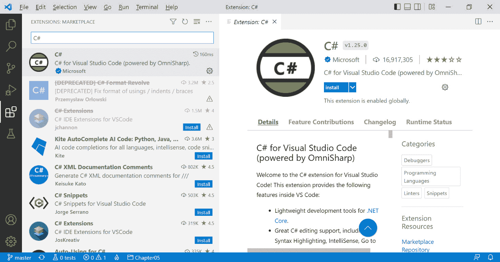

图 0.1：安装 VS Code 的 C# 扩展

您将看到 C# 扩展在 VS Code 中成功安装。现在您已将 VS Code 安装到您的系统上。

下一节将介绍如何在书的不同章节之间使用 VS Code。

## 在 VS Code 中切换章节

要更改默认项目以构建（无论是活动、练习还是演示），您需要指向这些练习文件：

+   `tasks.json` / `tasks.args`

+   `launch.json` / `configurations.program`

您应该了解两种不同的练习模式。一些练习有自己的项目。其他的有不同的主方法。每个练习的单个项目配置可以像这样（在这个例子中，对于 *第三章*，*委托、事件和 Lambda 表达式*，您正在配置 *Exercise02* 作为构建和启动点）：

`launch.json`

```cs
{
    "version": "0.2.0",
    "configurations": [
        {
            "name": ".NET Core Launch (console)",
            "type": "coreclr",
            "request": "launch",
            "preLaunchTask": "build",
            "program": "${workspaceFolder}/Exercises/ /Exercise02/bin/Debug/net6.0/Exercise02.exe",
            "args": [],
            "cwd": "${workspaceFolder}",
            "stopAtEntry": false,
            "console": "internalConsole"
        }

    ]
}
```

`tasks.json`

```cs
{
    "version": "2.0.0",
    "tasks": [
        {
            "label": "build",
            "command": "dotnet",
            "type": "process",
            "args": [
                "build",
                "${workspaceFolder}/Chapter05.csproj",
                "/property:GenerateFullPaths=true",
                "/consoleloggerparameters:NoSummary"
            ],
            "problemMatcher": "$msCompile"
        },

    ]
}
```

每个练习（例如，`Chapter05 Exercise02`）可以配置如下：

`launch.json`

```cs
{
    "version": "0.2.0",
    "configurations": [
        {
            "name": ".NET Core Launch (console)",
            "type": "coreclr",
            "request": "launch",
            "preLaunchTask": "build",
            "program": "${workspaceFolder}/bin/Debug/net6.0/Chapter05.exe",
            "args": [],
            "cwd": "${workspaceFolder}",
            "stopAtEntry": false,
            "console": "internalConsole"
        }

    ]
}
```

`tasks.json`

```cs
{
    "version": "2.0.0",
    "tasks": [
        {
            "label": "build",
            "command": "dotnet",
            "type": "process",
            "args": [
              "build",
              "${workspaceFolder}/Chapter05.csproj",
              "/property:GenerateFullPaths=true",
              "/consoleloggerparameters:NoSummary",
              "-p:StartupObject=Chapter05.Exercises.Exercise02.Program",
            ],
            "problemMatcher": "$msCompile"
        },

    ]
}
```

现在，您已经了解了 `launch.json` 和 `tasks.json`，可以继续下一节，该节详细介绍了 .NET 开发者平台的安装。

## 安装 .NET 开发者平台

.NET 开发者平台可以从 [`dotnet.microsoft.com/download`](https://dotnet.microsoft.com/download) 下载。有适用于 Windows、macOS 和 Linux Docker 的变体。*《C# 实验室》* 书籍使用 .NET 6.0。

按照步骤在 Windows 上安装 .NET 6.0 平台：

1.  选择 `Windows` 平台标签：

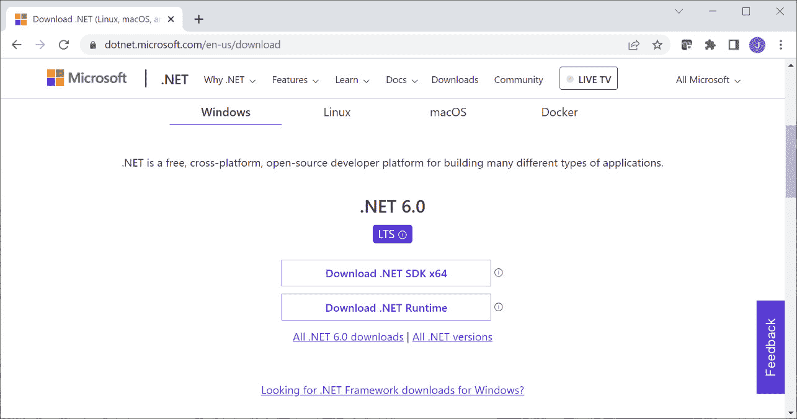

图 0.2：.NET 6.0 下载窗口

1.  点击 `下载 .NET SDK x64` 选项。

    注意

    *图 0.2* 中显示的屏幕可能会根据微软的最新发布版本而变化。

1.  根据您系统上安装的相应操作系统，打开并完成安装。

1.  安装完成后，重启计算机。

按照步骤在 macOS 上安装 .NET 6.0 平台：

1.  选择 `macOS` 平台标签 (*图 0.2*)。

1.  点击 `下载 .NET SDK x64` 选项。

下载完成后，打开安装文件。您应该有一个类似于 *图 0.3* 的屏幕：

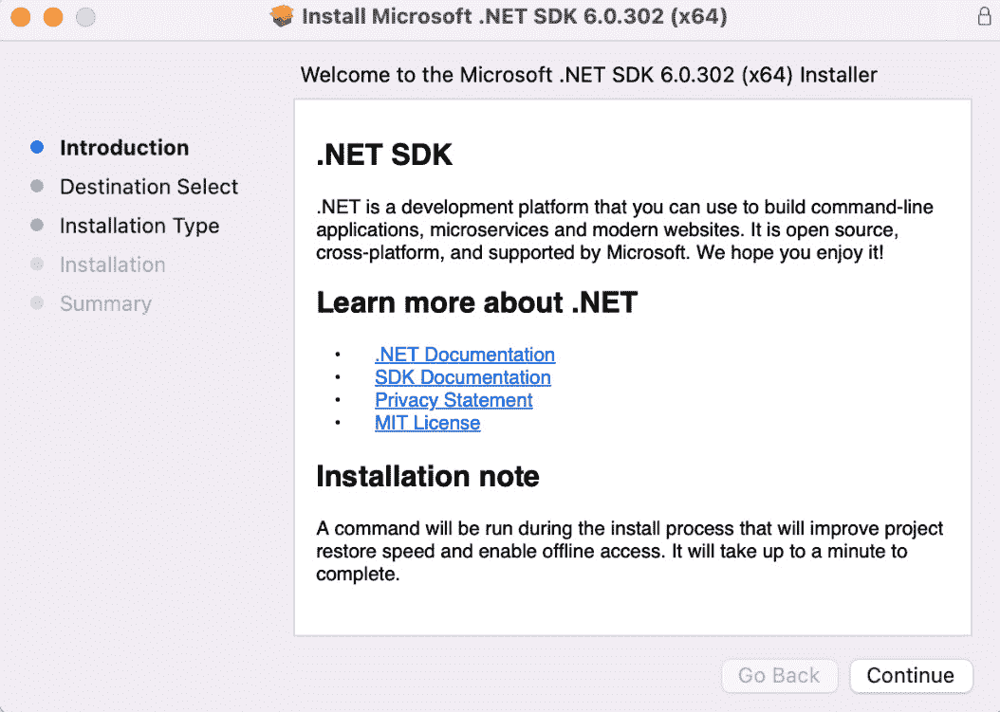

图 0.3：macOS 安装开始屏幕

1.  点击 `继续` 按钮。

以下屏幕将确认安装所需的磁盘空间量：

1.  点击 `安装` 按钮继续：

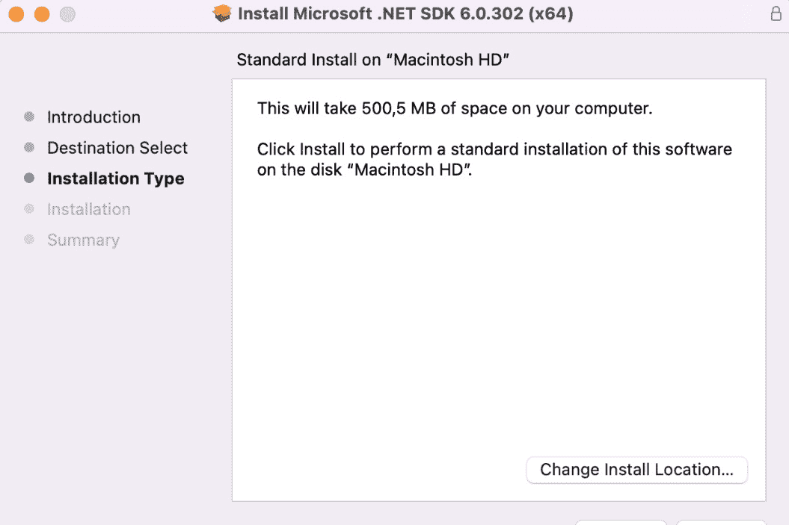

图 0.4：显示安装所需磁盘空间的窗口

您将在下一屏幕上看到一个进度条在移动：

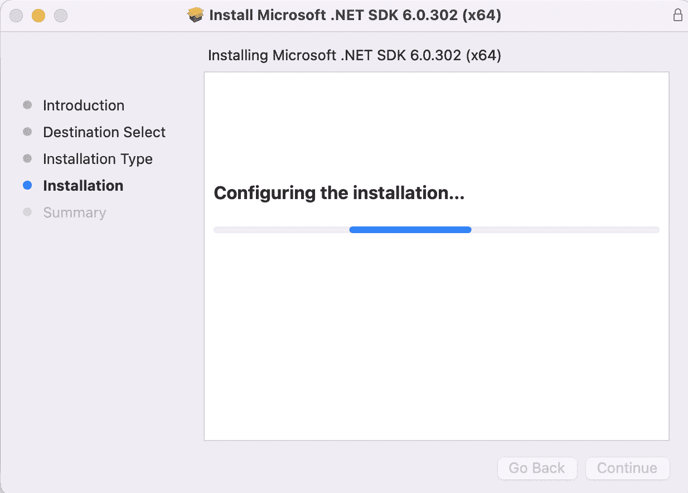

图 0.5：显示安装进度的窗口

安装完成后不久，您将看到一个成功屏幕（*图 0.6*）：

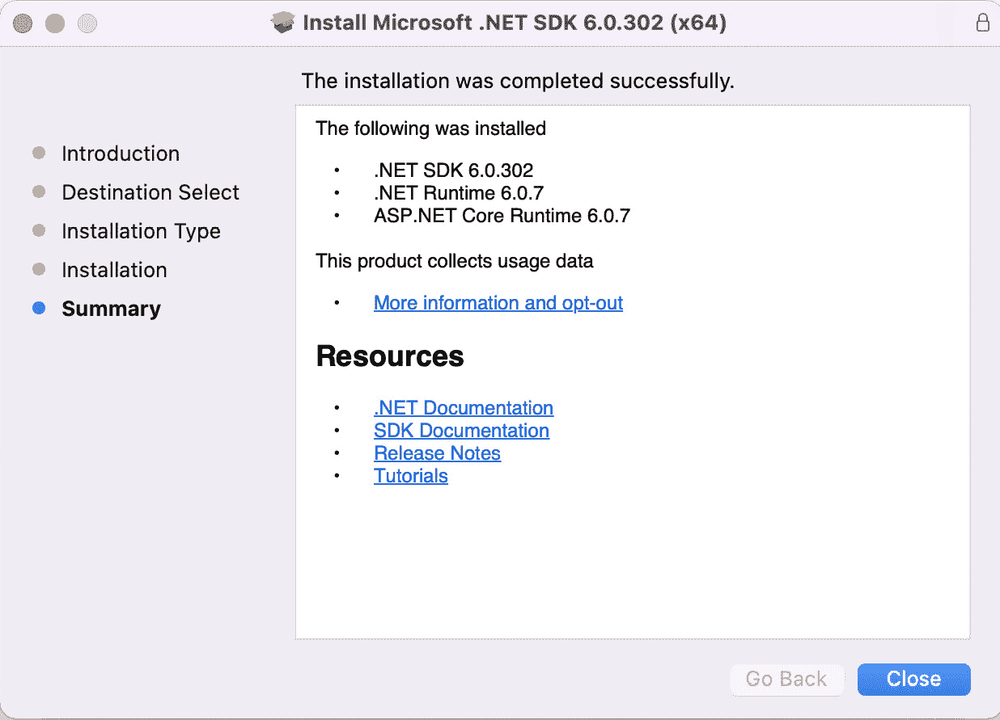

图 0.6：显示安装完成的窗口

1.  为了检查安装是否成功，打开您的终端应用程序并输入：

    ```cs
     dotnet –list-sdks 
    ```

这将检查您机器上安装的 .NET 版本。*图 0.7* 显示了输出，其中将列出您的已安装 SDK： 


图 0.7：在终端中检查已安装的 .NET SDK

通过这些步骤，您可以在您的机器上安装 .NET 6.0 SDK 并检查已安装的版本。

注意

Linux 的 .NET 6.0 安装步骤未包括，因为它们与 Windows 和 macOS 类似。

在继续之前，了解 .NET 6.0 功能是很重要的。

## Windows、macOS 和 Linux 中发现的 .NET 6.0 功能

### Windows

+   .NET 6.0：这是推荐用于 Windows 的最新长期支持 (LTS) 版本。它可以用于构建许多不同类型的应用程序。

+   .NET Framework 4.8：这是仅适用于 Windows 的版本，用于构建仅在 Windows 上运行的应用程序。

### macOS

+   .NET 6.0：这是推荐用于 macOS 的 LTS 版本。它可以用于构建许多不同类型的应用程序。请选择与您的苹果电脑处理器兼容的版本——x64 用于英特尔芯片和 ARM64 用于苹果芯片。

### Linux

+   .NET 6.0：这是推荐用于 Linux 的 LTS 版本。它可以用于构建许多不同类型的应用程序。

### Docker

+   .NET 映像：这个开发者平台可以用于构建不同类型的应用程序。

+   .NET Core 映像：这为构建许多类型的应用程序提供终身支持。

+   .NET 框架映像：这些是仅适用于 Windows 的 .NET 版本，用于构建在 Windows 上运行的任何类型的应用程序。

在您的系统上安装 .NET 6.0 后，下一步是使用 CLI 配置项目。

# .NET 命令行界面 (CLI)

安装 .NET 后，可以使用 CLI 创建和配置与 VS Code 一起使用的项目。要在命令提示符下启动 .NET CLI，请运行以下命令：

```cs
dotnet
```

如果 .NET 安装正确，您将在屏幕上看到以下消息：

```cs
Usage: dotnet [options]
Usage: dotnet [path-to-application]
```

一旦您安装了 CLI 以使用 VS Code 配置项目，您就需要了解一个强大的开源对象关系型数据库系统，它使用并扩展了 SQL 语言，即 PostgreSQL。

注意

您将首先通过安装 PostgreSQL 的说明进行 Windows 安装，然后是 macOS，最后是 Linux。

## Windows 版 PostgreSQL 安装

PostgreSQL 已在**第六章**，**SQL Server 中的 Entity Framework**中使用。在继续该章节之前，您必须按照以下步骤在您的系统上安装 PostgreSQL：

1.  前往 [`www.enterprisedb.com/downloads/postgres-postgresql-downloads`](https://www.enterprisedb.com/downloads/postgres-postgresql-downloads) 并下载适用于 Windows 的最新版本安装程序：

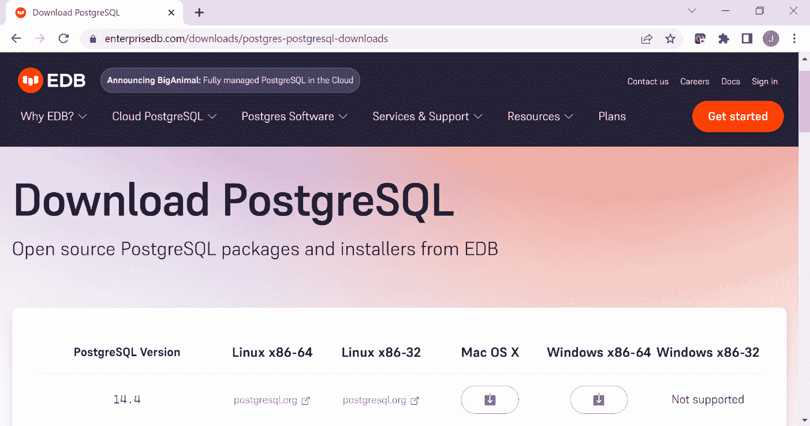

图 0.8：每个平台的最新 PostgreSQL 版本

注意

**图 0.8**所示的屏幕可能会根据供应商的最新发布而更改。

1.  打开下载的交互式安装程序并点击“下一步”按钮。将显示“设置 PostgreSQL”屏幕：


图 0.9：PostgreSQL 上传的欢迎屏幕

1.  点击“下一步”按钮进入下一屏幕，该屏幕要求输入安装目录的详细信息：

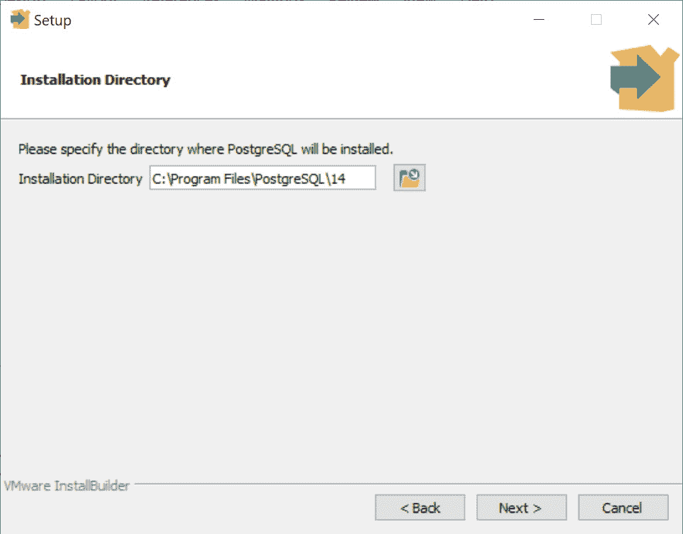

图 0.10：PostgreSQL 默认安装目录

1.  保持默认的“安装目录”不变，并点击“下一步”按钮。

1.  从**图 0.11**中的列表中选择以下内容：

    +   `PostgreSQL 服务器`指的是数据库。

    +   `pgAdmin 4` 是数据库管理工具。

    +   `Stack Builder` 是 PostgreSQL 环境构建器（可选）。

    +   `命令行工具`通过命令行与数据库交互。


图 0.11：选择继续的 PostgreSQL 组件

1.  然后点击“下一步”按钮。

1.  在下一屏幕，数据目录屏幕要求您输入存储数据的目录。因此，输入数据目录名称：

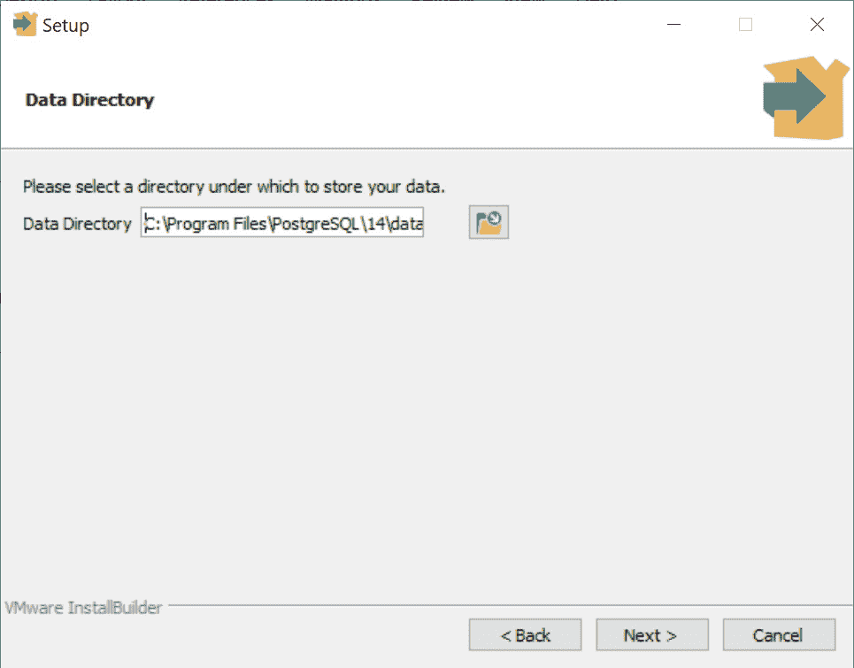

图 0.12：存储数据的目录

1.  一旦您输入了数据目录，点击“下一步”按钮继续。下一屏幕要求您输入密码。

1.  输入新的“密码。”

1.  在“重新输入密码”旁边重新输入数据库超级用户的密码：

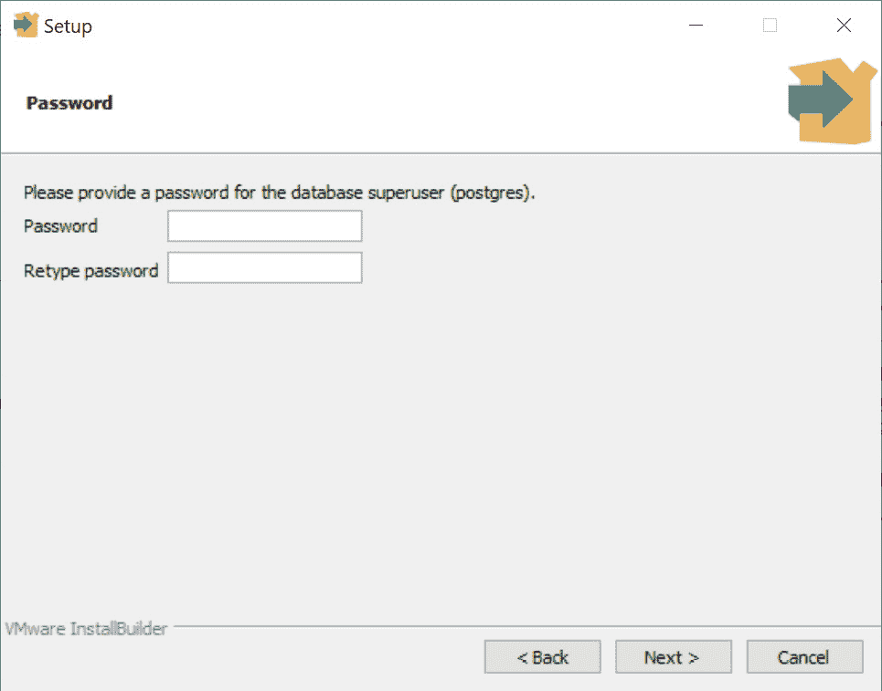

图 0.13：为数据库超级用户提供密码

1.  然后点击“下一步”按钮继续。

1.  下一屏幕显示端口号为`5432`。使用默认端口，即`5432`：

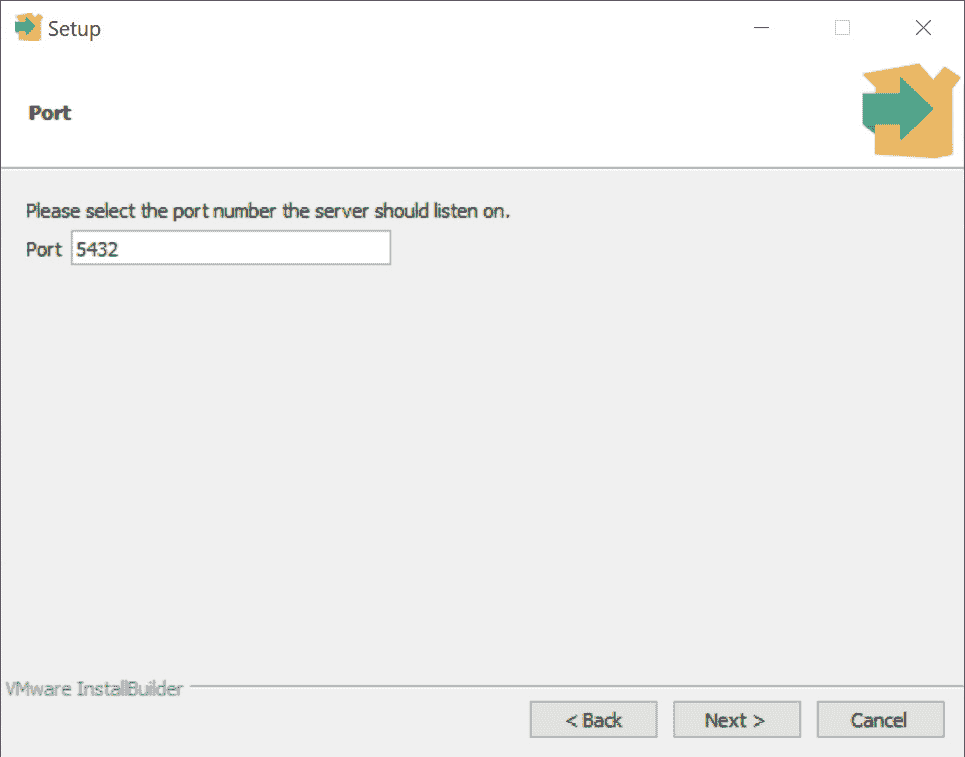

图 0.14：选择端口

1.  点击“下一步”按钮。

1.  高级选项屏幕要求您输入数据库集群的区域。将其保留为 `[默认区域]`：


图 0.15：选择数据库集群的区域设置

1.  然后点击 `下一步` 按钮。

1.  当显示预安装摘要屏幕时，点击 `下一步` 按钮继续：

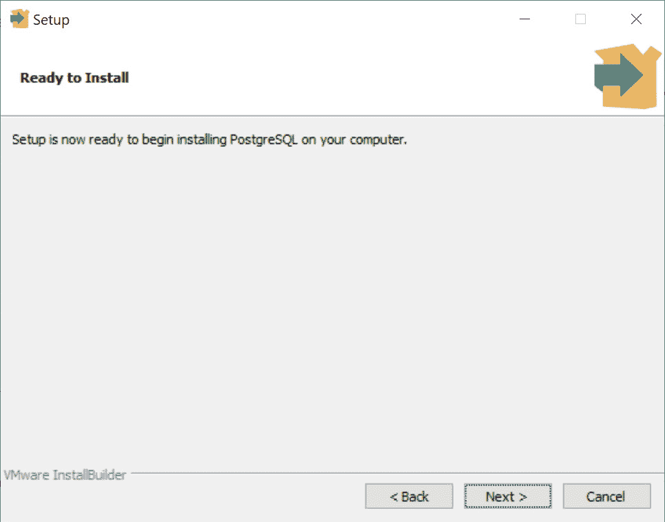

图 0.16：设置窗口显示准备安装的消息

1.  继续选择 `下一步` 按钮（保持默认设置不变），直到安装过程开始。

1.  等待其完成。完成之后，将显示完成 PostgreSQL 设置向导的屏幕。

1.  取消勾选 `退出时启动 Stack Builder` 选项：

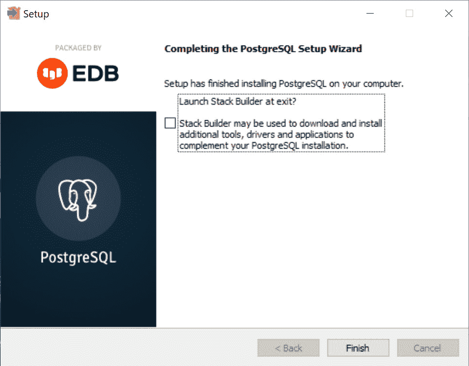

图 0.17：安装完成，Stack Builder 未勾选

Stack Builder 用于下载和安装额外的工具。默认安装包含所有用于练习和活动的工具。

1.  最后，点击 `完成` 按钮。

1.  现在从 Windows 打开 `pgAdmin4`。

1.  在设置主密码窗口中，为连接 PostgreSQL 中的任何数据库输入一个主 `密码`：

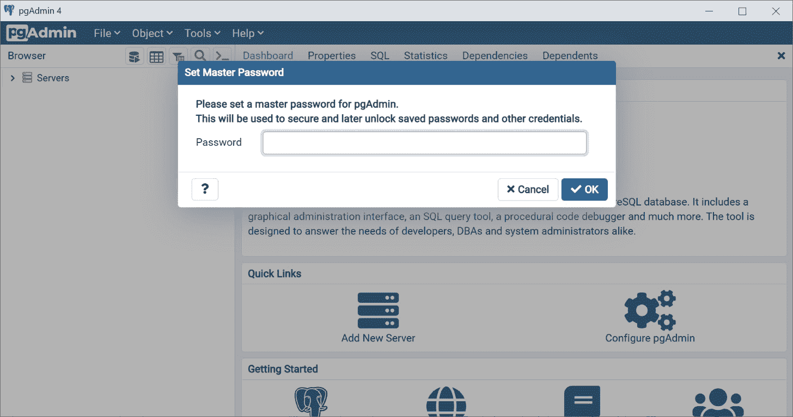

图 0.18：设置连接到 PostgreSQL 服务器的主密码

注意

输入一个您容易记住的密码会更好，因为它将用于管理您所有的其他凭证。

1.  接下来点击 `OK` 按钮。

1.  在 pgadmin 窗口的左侧，通过点击其旁边的箭头展开 `服务器`。

1.  您将被要求输入您的 PostgreSQL 服务器密码。输入与您在 *步骤 22* 中输入的相同密码。

1.  由于安全原因，请不要点击 `保存密码`：


图 0.19：设置 PostgreSQL 服务器 postgres 用户密码

PostgreSQL 服务器密码是您连接到 PostgreSQL 服务器并使用 `postgres` 用户时使用的密码。

1.  最后点击 `OK` 按钮。您将看到 pgAdmin 仪表板：

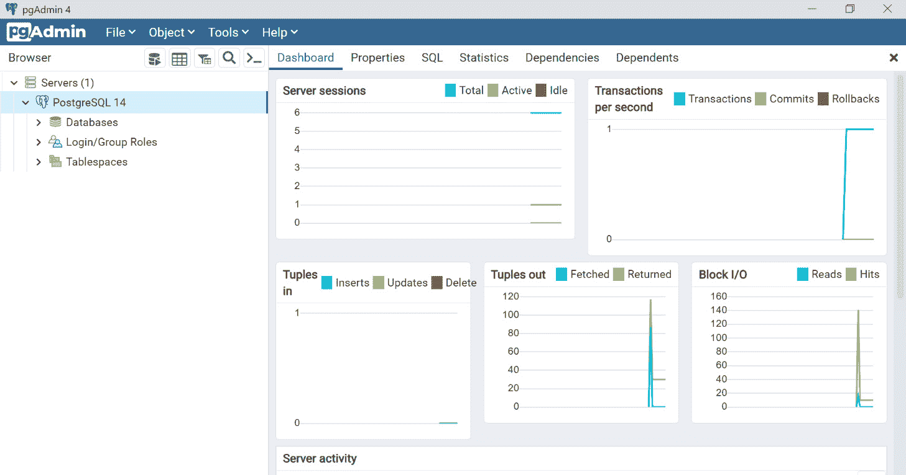

图 0.20：pgAdmin 4 仪表板窗口

为了探索 pgAdmin 仪表板，请转到 *探索 pgAdmin 仪表板* 部分。

## macOS 的 PostgreSQL 安装

使用以下步骤在您的 macOS 上安装 PostgreSQL：

1.  访问 Postgres 应用程序的官方网站以在 mac 平台上下载和安装 PostgreSQL：[`www.enterprisedb.com/downloads/postgres-postgresql-downloads`](https://www.enterprisedb.com/downloads/postgres-postgresql-downloads)。

1.  下载适用于 macOS 的最新 PostgreSQL：

    注意

    以下截图是在 macOS Monterey（版本 12.2）的 14.4 版本上拍摄的。

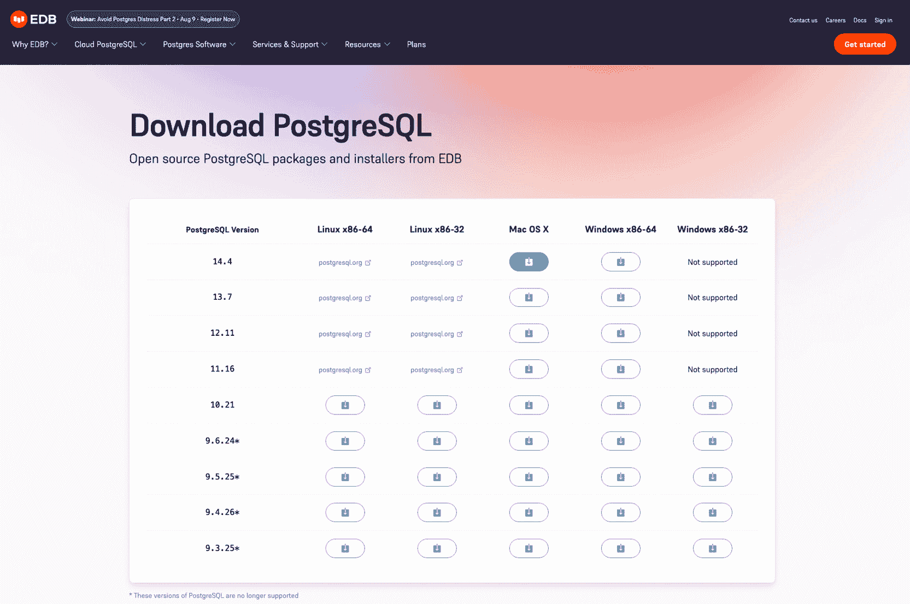

图 0.21：PostgreSQL 安装页面

1.  下载 macOS 的安装文件后，双击`安装文件`以启动 PostgreSQL 设置向导：

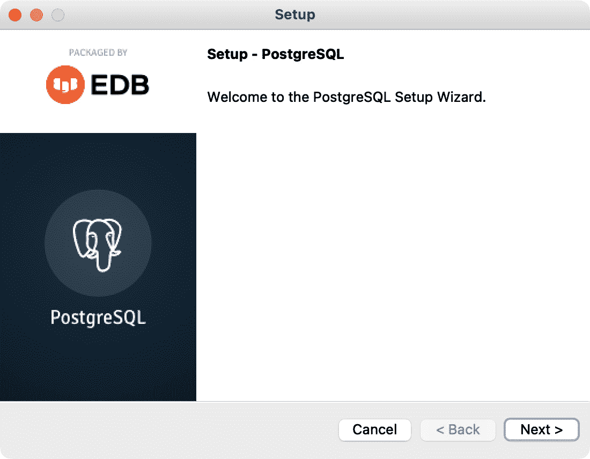

图 0.22：启动 PostgreSQL 设置向导

1.  选择您想要安装 PostgreSQL 的位置：

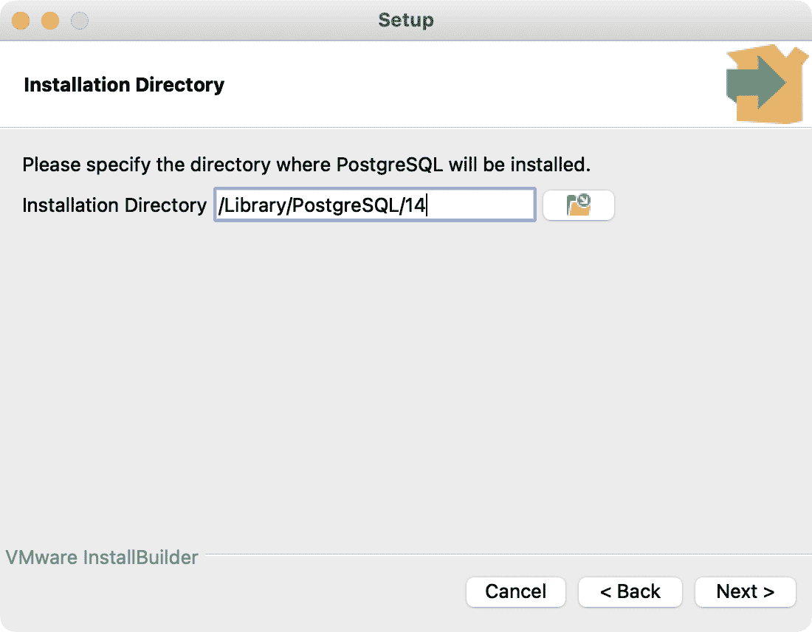

图 0.23：选择安装目录

1.  点击`下一步`按钮。

1.  在下一屏幕中，选择以下组件进行安装：

    +   PostgreSQL 服务器

    +   `pgAdmin 4`

    +   命令行工具

1.  取消选择`Stack Builder`组件：

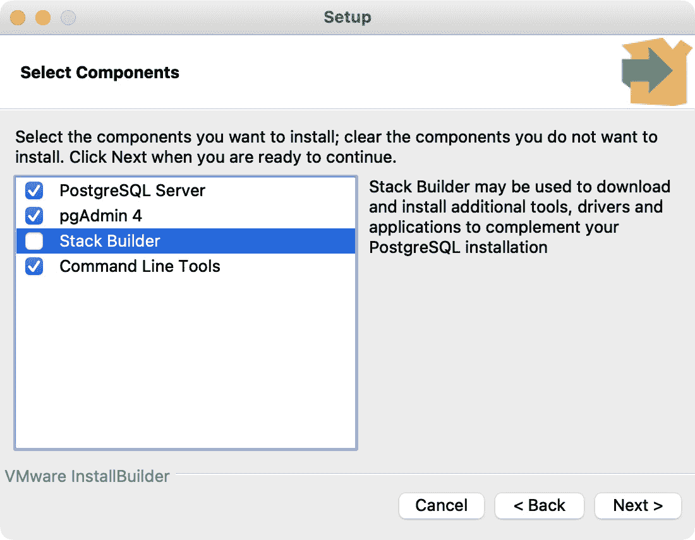

图 0.24：选择要安装的组件

1.  选择好选项后，点击`下一步`按钮。

1.  指定 PostgreSQL 将存储数据的数据目录：


图 0.25：指定数据目录

1.  点击`下一步`按钮。

1.  现在为 Postgres 数据库超级用户设置一个`密码`：

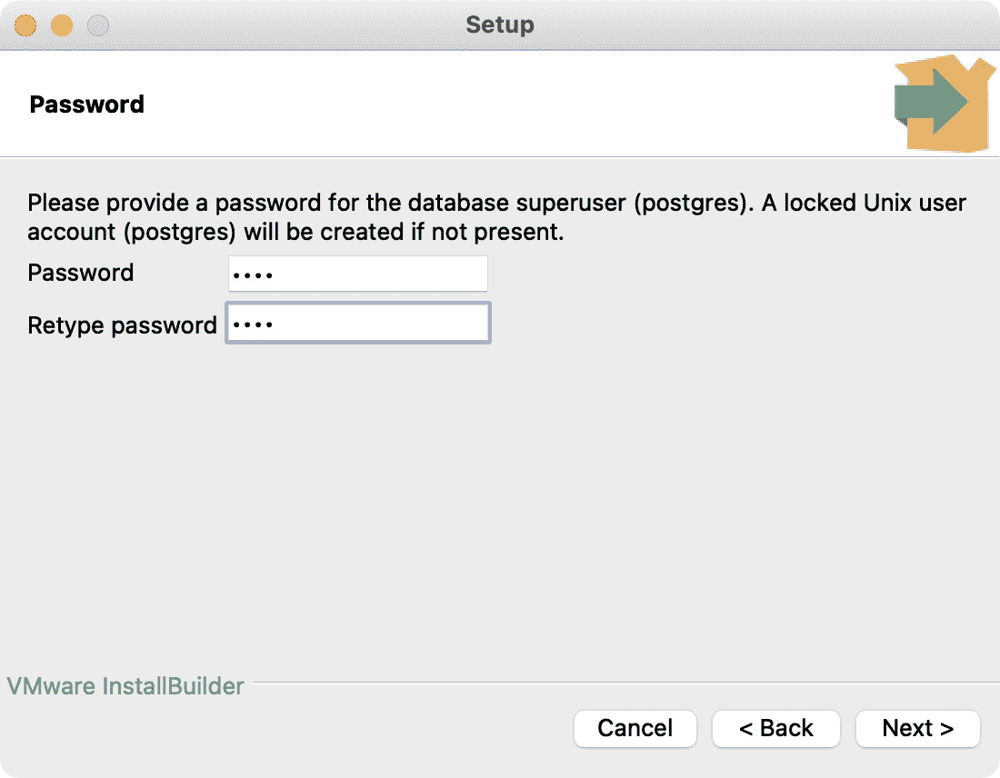

图 0.26：设置密码

确保安全地记下密码，以便登录到 PostgreSQL 数据库。

1.  点击`下一步`按钮。

设置您想要运行 PostgreSQL 服务器时的端口号。这里默认端口号设置为`5432`：


图 0.27：指定端口号

1.  点击`下一步`按钮。

1.  选择 PostgreSQL 要使用的区域。在这里，`[默认区域]`是 macOS 选择的区域：

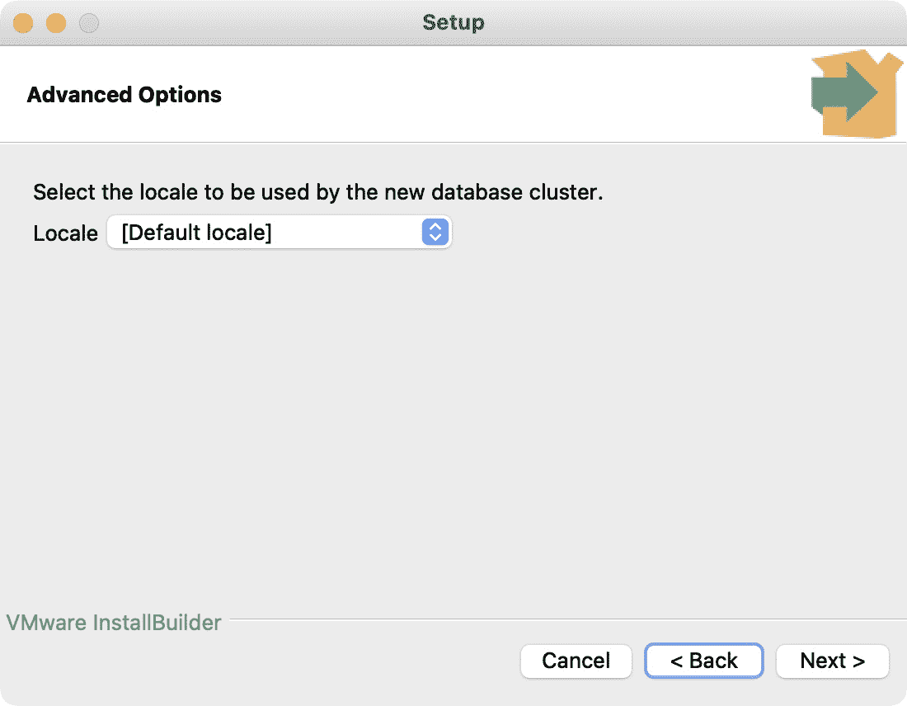

图 0.28：选择区域规范

1.  点击`下一步`按钮。

1.  在下一屏幕中，检查安装详情：

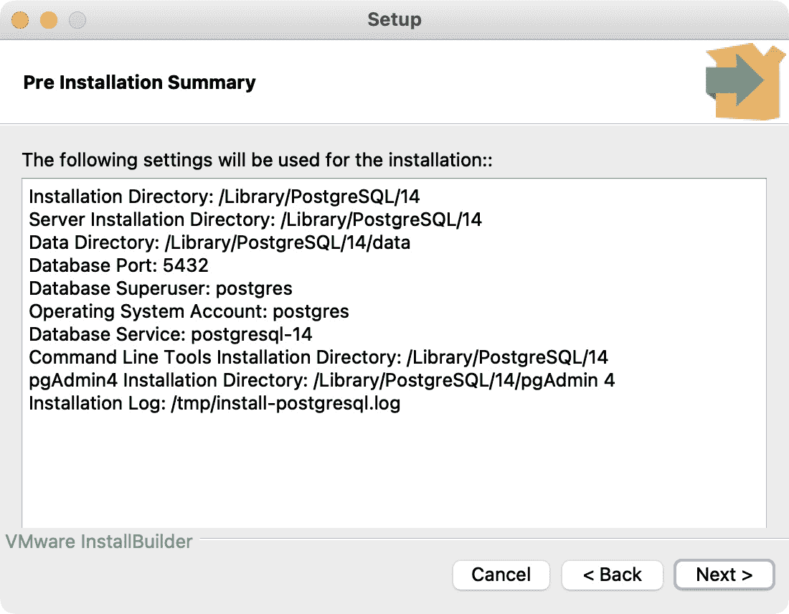

图 0.29：预安装摘要页面

最后，点击`下一步`按钮以开始您系统上 PostgreSQL 数据库服务器的安装过程：

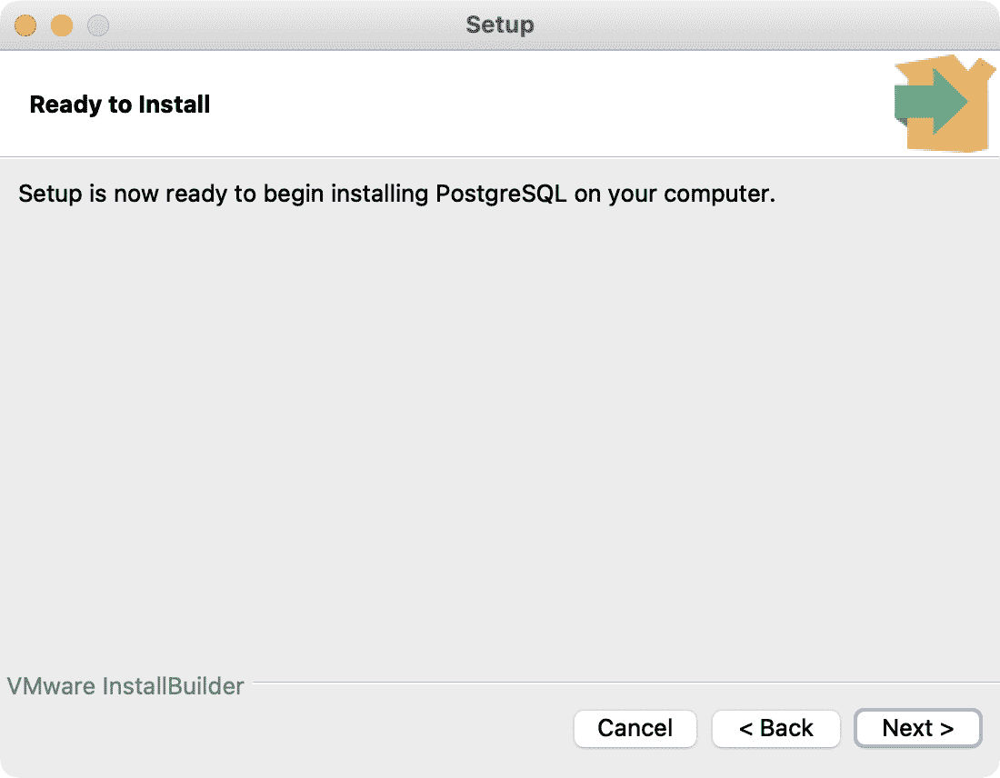

图 0.30：开始安装过程前的准备安装页面

1.  等待片刻，直到安装过程完成：

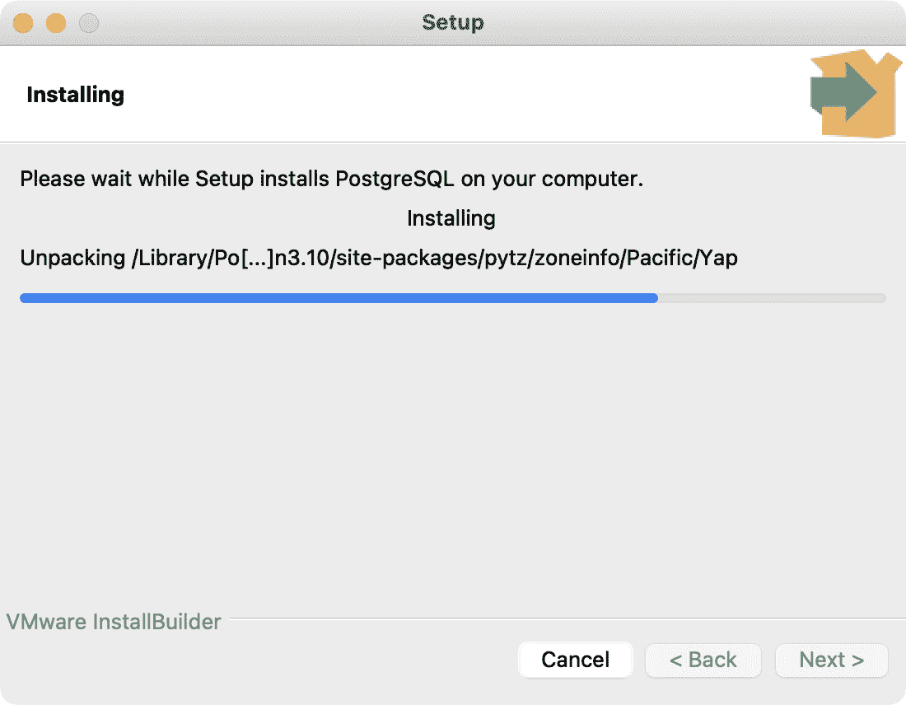

图 0.31：设置安装进行中

1.  当提示时，点击`下一步`按钮。下一屏幕显示消息，表明 PostgreSQL 安装已在您的系统上完成：

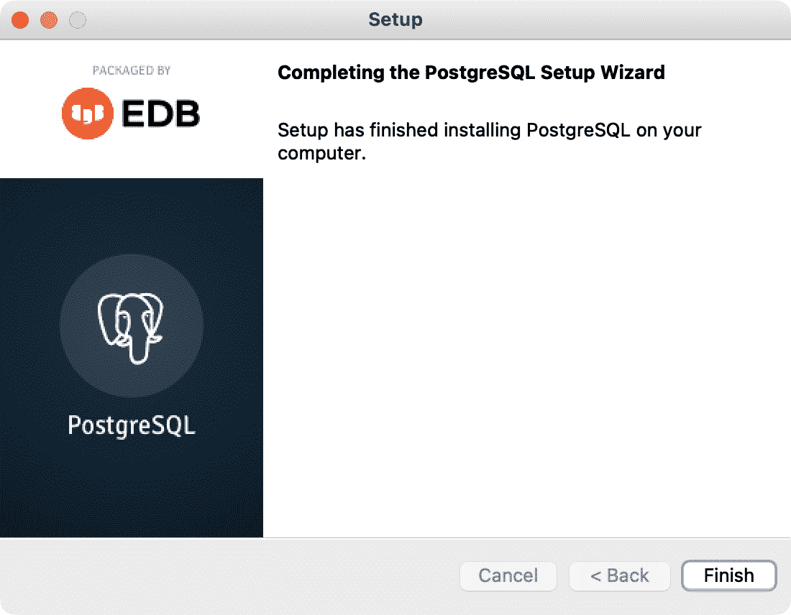

图 0.32：显示设置完成的成功消息

1.  安装完成后，点击`完成`按钮。

1.  现在，在 PostgreSQL 服务器中加载数据库。

1.  双击 `pgAdmin 4` 图标从您的 Launchpad 启动它。

1.  输入在安装过程中设置的 PostgreSQL 用户的密码。

1.  然后点击 `确定` 按钮。您现在将看到 pgAdmin 仪表板。

这完成了 macOS 上 PostgreSQL 的安装。下一节将使您熟悉 PostgreSQL 界面。

### 探索 pgAdmin 仪表板

在 Windows 和 macOS 上安装 PostgreSQL 后，按照以下步骤更好地掌握界面：

1.  从 Windows/ macOS（如果 pgAdmin 在您的系统上未打开）打开 `pgAdmin4`。

1.  点击左侧的 `服务器` 选项：


图 0.33：点击 `服务器` 创建数据库

1.  右键单击 `PostgreSQL 14`。

1.  然后点击 `创建` 选项。

1.  选择 `数据库…` 选项以创建新数据库：

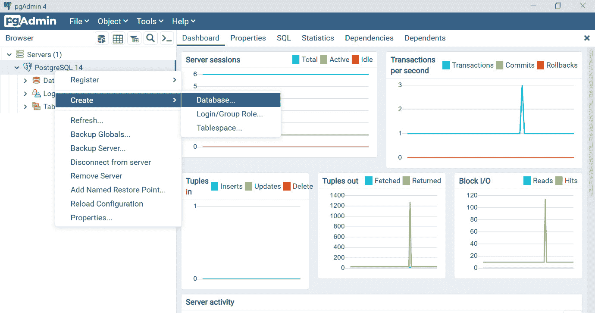

图 0.34：创建新数据库

这将打开一个创建 – 数据库窗口。

1.  输入数据库名称，即 `TestDatabase`。

1.  选择数据库的所有者或保留默认设置。目前，只需使用 `所有者` 作为 `postgres`：

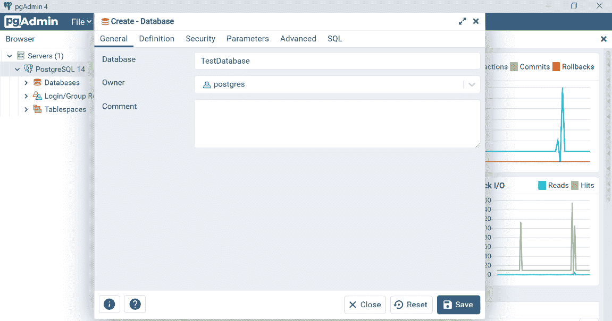

图 0.35：选择数据库的所有者

1.  然后点击 `保存` 按钮。这将创建一个数据库。

1.  右键单击 `数据库` 并选择 `刷新` 按钮：


图 0.36：在数据库上右键单击后点击 `刷新…` 按钮

在仪表板中现在显示了一个名为 `TestDatabase` 的数据库：

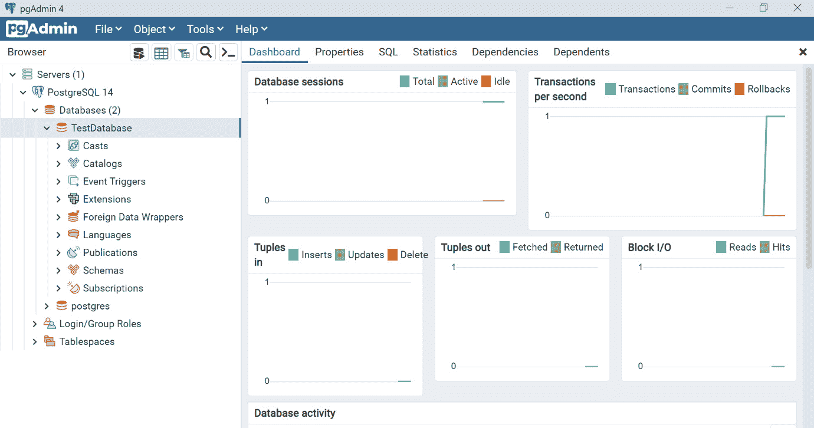

图 0.37：TestDatabase 准备就绪

现在您的数据库已准备好在 Windows 和 Mac 环境中使用。

## Ubuntu 上的 PostgreSQL 安装

在此示例中，您正在使用 Ubuntu 20.04 进行安装。执行以下步骤：

1.  为了安装 PostgreSQL，首先打开您的 Ubuntu 终端。

1.  确保使用以下命令更新您的仓库：

    ```cs
    $ sudo apt update
    ```

1.  使用以下命令安装 PostgreSQL 软件及其附加包（推荐）：

    ```cs
    $ sudo apt install postgresql postgresql-contrib
    ```

    注意

    要仅安装 PostgreSQL（不建议不使用附加包），请使用命令 `$ sudo apt install postgresql` 然后按 `Enter`。

此安装过程创建了一个名为 `postgres` 的用户账户，它具有默认的 `Postgres` 角色。

### 使用 `postgres` 角色访问 `postgres` 用户账户

有两种方式可以使用 `postgres` 用户账户启动 PostgreSQL CLI：

选项 1 如下所示：

1.  要以 `postgres` 用户身份登录，请使用以下命令：

    ```cs
    $ sudo -i -u postgres
    ```

1.  使用以下命令访问 CLI：

    ```cs
    $ psql
    ```

    注意

    有时，在执行前面的命令时，可能会显示`psql`错误，例如`could not connect to server: No such file or directory`。这是由于系统上的端口问题。由于此端口阻塞，PostgreSQL 应用程序可能无法工作。您可以稍后再尝试此命令。

1.  要退出 CLI，使用以下命令：

    ```cs
    $ \q
    ```

选项 2 如下：

1.  要以 postgres 用户登录，使用以下命令：

    ```cs
    $ sudo -u postgres psql
    ```

1.  要退出 CLI，使用以下命令：

    ```cs
    $ \q
    ```

### 验证 postgres 用户账户作为 postgres 用户角色

1.  要验证用户账户，登录并使用`conninfo`命令：

    ```cs
    $ sudo -u postgres psql
    $ \conninfo
    $ \q
    ```

使用此命令，您可以确保您已通过端口`5432`连接到`postgres`数据库作为`postgres`用户。如果您不想使用默认用户`postgres`，您可以为您创建一个新用户。

### 访问新用户和数据库

1.  使用以下命令创建新用户，并按`Enter`键：

    ```cs
    $ sudo -u postgres createuser –interactive
    ```

前面的命令将提示用户添加角色的名称和类型。

1.  输入角色的名称，例如，`testUser`。

1.  接下来，当提示设置新角色为超级用户时，输入`y`：

    ```cs
    Prompt:
    Enter the name of the role to add: testUser
    Shall the new role be a superuser? (y/n) y
    ```

这将创建一个名为`testUser`的新用户。

1.  使用以下命令创建一个名为`testdb`的新数据库：

    ```cs
    $ sudo -u postgres createdb testdb
    ```

1.  使用以下命令登录到新创建的用户账户：

    ```cs
    $ sudo -u testUser psql -d testdb
    ```

1.  使用以下命令来检查连接详情：

    ```cs
    $ \conninfo
    ```

1.  要退出 CLI，使用以下命令：

    ```cs
    $ \q
    ```

使用此命令，您可以确保您已通过端口`5432`连接到`testdb`数据库作为`testUser`用户。

通过这些步骤，您已经完成了 Ubuntu 上的 PostgreSQL 安装。

# 下载代码

从 GitHub 下载代码，链接为[`packt.link/sezEm`](https://packt.link/sezEm)。请参考这些文件以获取完整的代码。

本书使用的优质彩色图像可以在[`packt.link/5XYmX`](https://packt.link/5XYmX)找到。

如果您在安装过程中遇到任何问题或疑问，请通过电子邮件联系我们的`workshops@packt.com`。
