# 第二章：使用 C#

本章主要介绍 C# 编程语言的基础知识。在本章中，您将学习如何使用 C# 的语法编写语句，以及介绍一些您将每天使用的常用词汇。此外，到本章结束时，您将自信地了解如何在计算机内存中临时存储和处理信息。

本章涵盖了以下主题：

+   介绍 C# 语言

+   查找你的 C# 编译器版本

+   理解 C# 语法和词汇

+   使用变量

+   探索更多关于控制台应用程序的内容

# 介绍 C# 语言

本书本部分是关于 C# 语言——您将每天使用它来编写应用程序源代码的语法和词汇。

编程语言与人类语言有许多相似之处，只是在编程语言中，您可以自己创造词汇，就像苏斯博士一样！

在苏斯博士于 1950 年所著的《如果我管理动物园》一书中，他这样说道：

> “然后，为了向他们展示，我将航行到 Ka-Troo 并带回一个 It-Kutch，一个 Preep，一个 Proo，一个 Nerkle，一个 Nerd，还有一个 Seersucker！”

## C# 语言版本和特性

本书本部分涵盖了 C# 编程语言，主要面向初学者，因此涵盖了所有开发者都需要了解的基本主题，包括声明变量、存储数据和如何定义您自己的自定义数据类型。

本书涵盖了从版本 1 到最新版本 C# 13 的 C# 语言特性。您可以在以下链接中阅读 C# 13 的新特性总结：

[`learn.microsoft.com/en-us/dotnet/csharp/whats-new/csharp-13`](https://learn.microsoft.com/en-us/dotnet/csharp/whats-new/csharp-13)

如果您已经对较老的 C# 版本有所了解，并且对最新版本的新特性感到兴奋，我为您列出以下语言版本及其重要新特性，包括您可以在其中了解它们的章节编号和主题标题，以便更容易地跳转：

您可以在以下链接的 GitHub 仓库中阅读此信息：[`github.com/markjprice/cs13net9/blob/main/docs/ch02-features.md`](https://github.com/markjprice/cs13net9/blob/main/docs/ch02-features.md)。

## 理解 C# 标准

几年来，微软向 ECMA 标准机构提交了几种 C# 版本。微软在 2014 年将 C# 开源。您可以在以下链接中阅读最新的 C# 标准文档：[`learn.microsoft.com/en-us/dotnet/csharp/specification/`](https://learn.microsoft.com/en-us/dotnet/csharp/specification/)。比 ECMA 标准更有实用价值的是公开的 GitHub 仓库，它使 C# 和相关技术的开发尽可能开放，如*表 2.1*所示：

| **描述** | **链接** |
| --- | --- |
| C# 语言设计 | [`github.com/dotnet/csharplang`](https://github.com/dotnet/csharplang) |
| 编译器实现 | [`github.com/dotnet/roslyn`](https://github.com/dotnet/roslyn) |
| 标准来描述语言 | [`github.com/dotnet/csharpstandard`](https://github.com/dotnet/csharpstandard) |

表 2.1：C# 的公共 GitHub 仓库

# 发现您的 C# 编译器版本

.NET 语言编译器用于 C# 和 Visual Basic，也称为 **Roslyn**，以及用于 F# 的单独编译器，作为 .NET SDK 的一部分进行分发。要使用特定的 C# 版本，您必须至少安装该版本的 .NET SDK，如表 2.2 所示：

| **.NET SDK** | **Roslyn 编译器** | **默认 C# 语言** |
| --- | --- | --- |
| 1.0.4 | 2.0–2.2 | 7.0 |
| 1.1.4 | 2.3–2.4 | 7.1 |
| 2.1.2 | 2.6–2.7 | 7.2 |
| 2.1.200 | 2.8–2.10 | 7.3 |
| 3.0 | 3.0–3.4 | 8.0 |
| 5.0 | 3.8 | 9.0 |
| 6.0 | 4.0 | 10.0 |
| 7.0 | 4.4 | 11.0 |
| 8.0 | 4.8 | 12.0 |
| 9.0 | 4.12 | 13.0 |

表 2.2：.NET SDK 版本及其 C# 编译器版本

当您创建类库时，可以选择针对 .NET 标准以及现代 .NET 的版本。它们具有默认的 C# 语言版本，如表 2.3 所示：

| **.NET Standard** | **C#** |
| --- | --- |
| 2.0 | 7.3 |
| 2.1 | 8.0 |

表 2.3：.NET 标准版本及其默认 C# 编译器版本

虽然您必须安装 .NET SDK 的最低版本才能访问特定的编译器版本，但您创建的项目可以针对较旧的 .NET 版本，同时仍然使用现代编译器版本。例如，如果您安装了 .NET 9 SDK 或更高版本，那么您可以在针对 .NET 8 的控制台应用程序中使用 C# 13 语言功能。

## 如何输出 SDK 版本

让我们看看您可用的 .NET SDK 和 C# 语言编译器版本：

1.  在 Windows 上，启动 **Windows Terminal** 或 **命令提示符**。在 macOS 上，启动 **终端**。

1.  要确定您可用的 .NET SDK 版本，请输入以下命令：

    ```cs
    dotnet --version 
    ```

1.  注意，发布时的版本是 9.0.100，这表明它是 SDK 的初始版本，尚未修复任何错误或添加新功能，如下面的输出所示：

    ```cs
    9.0.100 
    ```

## 启用特定语言的版本编译器

开发工具如 Visual Studio 和 `dotnet` 命令行界面默认假设您想要使用 C# 语言编译器的最新主要版本。在 C# 8 发布之前，C# 7 是最新的主要版本，并且默认使用。

要使用 C# 点发布版（如 7.1、7.2 或 7.3）的改进，您必须在项目文件中添加 `<LangVersion>` 配置元素，如下面的标记所示：

```cs
<LangVersion>7.3</LangVersion> 
```

在 C# 13 与 .NET 9 一起发布后，如果微软发布了 C# 13.1 编译器，并且您想使用其新的语言功能，那么您将不得不在项目文件中添加一个配置元素，如下面的标记所示：

```cs
<LangVersion>13.1</LangVersion> 
```

`<LangVersion>` 的潜在值如表 2.4 所示：

| **<LangVersion>** | **描述** |
| --- | --- |
| `7`, `7.1`, `7.2`, `7.3`, `8`, `9`, `10`, `11`, `12`, `13` | 输入特定版本号将使用已安装的该编译器。 |
| `latestmajor` | 使用最高主版本号，例如，2019 年 8 月是 7.0，2019 年 10 月是 8，2020 年 11 月是 9，2021 年 11 月是 10，2022 年 11 月是 11，2023 年 11 月是 12，2024 年 11 月是 13。 |
| `latest` | 使用最高主版本和最高次版本号，例如，2017 年是 7.2，2018 年是 7.3，2019 年是 8，也许 2025 年上半年是 13.1。 |
| `preview` | 使用可用的最高预览版本，例如，在 2025 年 7 月中旬，当安装.NET 10 预览版 6 时，版本号为 14。 |

表 2.4：项目文件中的 LangVersion 设置

## 使用预览版 C#编译器版本

2025 年 2 月，微软可能会发布带有 C# 14 编译器的.NET 10 的第一个公共预览版。您可以从以下链接安装其 SDK：

[`dotnet.microsoft.com/en-us/download/dotnet/10.0`](https://dotnet.microsoft.com/en-us/download/dotnet/10.0)

**警告！** 该链接将直到 2025 年 2 月出现`404 缺少资源`错误，所以在此期间请不要使用它！

安装.NET 10 SDK 预览版后，您将能够使用它来创建新项目并探索 C# 14 中的新语言功能。

创建新项目后，您必须编辑`.csproj`文件并添加一个设置为`preview`的`<LangVersion>`元素，以使用预览版 C# 14 编译器，如下所示：

```cs
<Project Sdk="Microsoft.NET.Sdk">
  <PropertyGroup>
    <OutputType>Exe</OutputType>
    <TargetFramework>net10.0</TargetFramework>
 **<LangVersion>preview</LangVersion>**
  </PropertyGroup>
</Project> 
```

**良好实践**：您应该只为探索而将`<LangVersion>`设置为`preview`，而不是用于生产项目，因为它不受微软支持，并且可能存在更多错误。微软提供预览版本是因为他们想听取像您这样的开发者的反馈。这样，您就可以成为 C#开发和改进的一部分。

## 将.NET 9 的 C#编译器切换到未来版本

.NET 9 附带 C# 13 编译器，但这并不意味着您必须使用 C# 13 编译器。一旦.NET 10 SDK 在 2025 年 11 月普遍可用，您将能够获得两者的最佳结合。

您可以在项目继续针对.NET 9 的情况下使用.NET 10 SDK 及其 C# 14 编译器。为此，将目标框架设置为`net9.0`并添加一个设置为`14`的`<LangVersion>`元素，如下所示：

```cs
<Project Sdk="Microsoft.NET.Sdk">
  <PropertyGroup>
    <OutputType>Exe</OutputType>
 **<TargetFramework>net9****.0****</TargetFramework>**
    <ImplicitUsings>enable</ImplicitUsings>
    <Nullable>enable</Nullable>
 **<LangVersion>****14****</LangVersion>**
  </PropertyGroup>
</Project> 
```

前一个项目针对`net9.0`，因此在运行在.NET 9 运行时每月修补版本上时，它将得到支持，直到 2026 年 5 月。如果前一个项目使用.NET 10 SDK 构建，则可以将`<LangVersion>`设置为`14`，这意味着 C# 14。

如果您针对`net10.0`，并且已安装.NET 10 SDK，那么新项目将默认使用 C# 14，因此不需要显式设置。  

在 2026 年 2 月，微软可能会发布.NET 11 的第一个预览版，并在 2026 年 11 月，它可能会发布.NET 11 以供生产环境通用。您可以从以下链接安装其 SDK，并像上面描述的 C# 14 和.NET 10 一样探索 C# 15：

[`dotnet.microsoft.com/en-us/download/dotnet/11.0`](https://dotnet.microsoft.com/en-us/download/dotnet/11.0)

再次提醒，前面的链接是供将来使用的！它将直到 2026 年 2 月才会显示`404 资源未找到`错误，所以在此期间请不要使用前面的链接。

**警告！** 一些 C#语言特性依赖于底层.NET 库的变化。即使您使用最新的 SDK 和最新的编译器，在针对较老的.NET 版本时，您可能无法使用所有的新语言特性。例如，C# 11 引入了`required`关键字，但在针对.NET 6 的项目中无法使用，因为该语言特性需要仅在.NET 7 中可用的新属性。幸运的是，如果您尝试使用不支持的功能，编译器会发出警告。只需为此做好准备即可。

## 显示编译器版本

我们将首先编写显示编译器版本的代码：

1.  如果您已经完成了*第一章*，*你好，C#! 欢迎使用.NET!*，那么您将已经有一个`cs13net9`文件夹。如果没有，那么您需要创建它。

1.  使用您首选的代码编辑器创建一个新项目，如下列所示：

    +   项目模板：**控制台应用程序 [C#]** / `console`

    +   项目文件和文件夹：`Vocabulary`

    +   解决方案文件和文件夹：`Chapter02`

    +   **不要使用顶级语句**：已清除

    +   **启用原生 AOT 发布**：已清除

**良好实践**：如果您忘记了如何操作，或者没有完成上一章，那么在*第一章*，*你好，C#! 欢迎使用.NET!*中提供了创建具有多个项目的解决方案的逐步说明。

1.  在`Vocabulary`项目中，在`Program.cs`中，在注释之后添加一个语句来显示 C#版本作为错误，如下面的代码所示：

    ```cs
    #error version 
    ```

1.  运行控制台应用程序：

    +   如果您正在使用 Visual Studio，那么导航到**调试** | **不调试启动**。当提示继续并运行最后一个成功的构建时，点击**否**。

    +   如果您正在使用 VS Code，那么在`Vocabulary`文件夹的终端中，输入`dotnet run`命令。请注意，我们预期会出现编译器错误，所以当您看到它时不要慌张！

1.  注意，编译器版本和语言版本作为编译器错误消息编号`CS8304`出现，如图*2.1*所示：

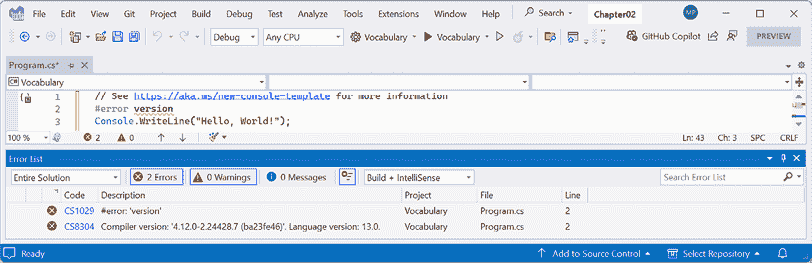

图 2.1：显示 C#语言版本的编译器错误

VS Code 的**问题**窗口或 Visual Studio 的**错误列表**窗口中的错误信息显示为`编译器版本：'4.12.0...'`，语言版本为`默认（13.0）`。

1.  注释掉导致错误的语句，如下面的代码所示：

    ```cs
    // #error version 
    ```

1.  注意，编译器错误信息消失了。

# 理解 C# 语法和词汇

让我们从查看 C# 语法和词汇的基础开始。在本章中，你将创建多个控制台应用程序，每个应用程序都展示了 C# 语言的相应功能。

## 理解 C# 语法

C# 的语法包括语句和代码块。要记录代码，你可以使用注释。

**良好实践**：注释不应该是记录代码的唯一方式。为变量和函数选择合理的名称、编写单元测试以及创建实际文档都是记录代码的其他方法。

## 语句

在英语中，我们用句号 `.` 来表示句子的结束。一个句子可以由多个单词和短语组成，单词的顺序是语法的一部分。例如，在英语中，我们说“the black cat。”

形容词，*黑色*，在名词，*猫*之前。然而，法语语法有不同的顺序；形容词在名词之后：“le chat noir。”重要的是要记住，顺序很重要。

C# 使用分号 `;` 来表示语句的结束。一个语句可以由多个 **类型**、**变量** 和由 **标记** 组成的 **表达式** 组成。每个标记由空白或某些其他可识别的不同标记（例如运算符）分隔，例如 `=` 或 `+`。

例如，在以下语句中，`decimal` 是一种类型，`totalPrice` 是一个变量，而 `subtotal + salesTax` 是一个表达式：

```cs
decimal totalPrice = subtotal + salesTax; 
```

表达式由名为 `subtotal` 的操作数、运算符 `+` 和另一个名为 `salesTax` 的操作数组成。操作数和运算符的顺序很重要，因为顺序会影响意义和结果。

## 注释

注释是记录你的代码以增强其他开发者或你自己在几个月后阅读时对其工作理解的主要方法。

在 *第四章*，*编写、调试和测试函数* 中，你将学习关于以三个斜杠 `///` 开头的 XML 注释，并使用工具生成网页来记录代码。

你可以使用双斜杠 `//` 添加注释来解释你的代码。编译器将忽略 `//` 之后直到行尾的所有内容，如下面的代码所示：

```cs
// Sales tax must be added to the subtotal.
decimal totalPrice = subtotal + salesTax; 
```

要写多行注释，请在注释开头使用 `/*`，并在注释结尾使用 `*/`，如下面的代码所示：

```cs
/*
This is a
multi-line comment.
*/ 
```

虽然 `/* */` 主要用于多行注释，但它也可以用于在语句中间注释，如下面的代码所示：

```cs
decimal totalPrice = subtotal /* for this item */ + salesTax; 
```

**良好实践**：设计良好的代码，包括具有良好命名的参数的函数签名和类封装，可以具有一定的自文档性。当你发现自己需要在代码中添加太多注释和解释时，问问自己：我能否重写，即重构，这段代码，使其在没有长注释的情况下更容易理解？

你的代码编辑器有命令可以让你更容易地添加和删除注释字符，如下面的列表所示：

+   Visual Studio：导航到**编辑** | **高级** | **注释选择**或**取消注释选择**。

+   VS Code：导航到**编辑** | **切换行注释**或**切换块注释**。

+   Rider：导航到**代码** | **使用行注释注释**或**使用块注释注释**。

**良好实践**：您通过在代码语句上方或之后添加描述性文本来**注释**代码。通过在语句之前或周围添加注释字符来**取消注释**代码，使其失效。**取消注释**意味着移除注释字符。

## 区块

在英语中，我们通过开始新行来表示新段落。C#使用大括号`{ }`来表示**区块**代码。

区块以声明开始，以指示正在定义的内容。例如，一个区块可以定义许多语言结构的开始和结束，包括命名空间、类、方法或如`foreach`之类的语句。

您将在本章和随后的章节中了解更多关于命名空间、类和方法的内容，但现在简要介绍一些这些概念：

+   **命名空间**包含类等类型，以将它们分组在一起。

+   **类**包含对象的成员，包括方法。

+   **方法**包含实现对象可以执行的动作的语句。

类似于 Visual Studio、Rider 和 VS Code 这样的代码编辑器提供了一个方便的功能，通过在代码左侧边缘移动鼠标光标时切换指向下或向右的箭头符号来折叠和展开区块，如图*2.2*所示：

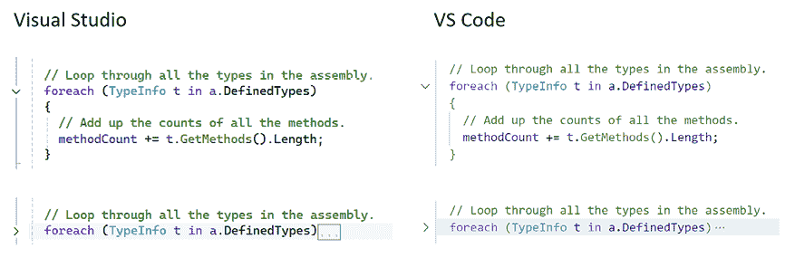

图 2.2：展开和折叠的代码编辑器

## 区域

您可以在任何您想要的语句周围定义自己的标记区域，然后大多数代码编辑器将允许您以与区块相同的方式折叠和展开它们，如下面的代码所示：

```cs
#region Three variables that store the number 2 million.
int decimalNotation = 2_000_000;
int binaryNotation = 0b_0001_1110_1000_0100_1000_0000;
int hexadecimalNotation = 0x_001E_8480;
#endregion 
```

以这种方式，区域可以被当作注释块处理，可以折叠以显示区块所执行的操作摘要。

我将在 GitHub 仓库的解决方案代码中始终使用`#region`区块，尤其是在我们开始定义作为自然折叠区域的函数之前，但我不会在印刷书中展示它们以节省空间。请根据自己的判断来决定是否想在您的代码中使用区域。

## 语句和区块的示例

在一个不使用顶级程序功能的简单控制台应用程序中，我在语句和区块中添加了一些注释，如下面的代码所示：

```cs
using System; // A semicolon indicates the end of a statement.
namespace Basics
{ // An open brace indicates the start of a block.
  class Program
  {
    static void Main(string[] args)
    {
      Console.WriteLine("Hello World!"); // A statement.
    }
  }
} // A close brace indicates the end of a block. 
```

注意，C#使用一种大括号样式，其中开括号和闭括号都位于自己的行上，并且处于相同的缩进级别，如下面的代码所示：

```cs
if (x < 3)
{
  // Do something if x is less than 3.
} 
```

其他语言如 JavaScript 使用花括号，但格式不同。它们将开括号放在声明语句的末尾，如下面的代码所示：

```cs
if (x < 3) {
  // Do something if x is less than 3.
} 
```

您可以使用您喜欢的任何样式，因为编译器并不关心。

有时，为了在印刷书籍中节省垂直空间，我会使用 JavaScript 花括号风格，但大多数情况下我坚持使用 C#花括号风格。我使用两个空格而不是更常见的四个空格进行缩进，因为我的代码将被打印在书中，因此有较窄的宽度可用。

**更多信息**：官方编码风格规范可以在以下链接中找到：[`learn.microsoft.com/en-us/dotnet/csharp/fundamentals/coding-style/coding-conventions`](https://learn.microsoft.com/en-us/dotnet/csharp/fundamentals/coding-style/coding-conventions).

不论任何官方指南，我建议您遵守您开发团队已采纳的标准，除非您是独立开发者，在这种情况下，只要您的代码可以编译，您可以使用任何您喜欢的约定。但请考虑您未来的自己，保持一致性，无论哪种方式都可以！

**良好实践**：在 Microsoft 官方文档中使用的花括号风格是 C#中最常用的。例如，查看以下链接中的`for`语句：[`learn.microsoft.com/en-us/dotnet/csharp/language-reference/statements/iteration-statements`](https://learn.microsoft.com/en-us/dotnet/csharp/language-reference/statements/iteration-statements).

## 使用空白格格式化代码

空白格包括空格、制表符和换行符。您可以使用空白格以您喜欢的任何方式格式化代码，因为额外的空白格对编译器没有影响。

**警告！**除非有逐步指导读者输入代码的说明，否则代码示例是编写来阅读和理解的，而不是直接输入到代码编辑器中。

以下四个语句都是等效的。由于所有四个语句都是等效的，它们都使用相同的变量名，因此不能在同一个代码块中声明所有这些，所以请不要尝试输入此代码，除非您也更改了三个`sum`变量名：

```cs
int sum = 1 + 2; // Most developers would prefer this format.
int
sum=1+
2; // One statement over three lines.
int       sum=    1    +2;int sum=1+2; // Two statements on one line. 
```

在前面的语句中，唯一必需的空白字符是在`int`和`sum`之间，以告诉编译器它们是不同的标记。任何单个空白字符（例如，空格、制表符或换行符）都是可接受的。

**更多信息**：您可以在以下链接中阅读 C#空白格的正式定义：[`learn.microsoft.com/en-us/dotnet/csharp/language-reference/language-specification/lexical-structure#634-white-space`](https://learn.microsoft.com/en-us/dotnet/csharp/language-reference/language-specification/lexical-structure#634-white-space).

## 理解 C#词汇

C#词汇由**关键字**、**符号字符**和**类型**组成。

在本书中您将看到并频繁使用的预定义保留关键字包括 `using`、`namespace`、`class`、`static`、`int`、`string`、`double`、`bool`、`if`、`switch`、`break`、`while`、`do`、`for`、`foreach`、`this` 和 `true`。

**警告！** `this` 关键字可以以多种方式使用，包括引用对象的当前实例、在当前对象实例上调用构造函数以及定义索引器。这三个示例将在 *第五章，使用面向对象编程构建自己的类型* 中介绍。

你将看到的某些符号字符包括 `"`, `'`, `+`, `-`, `*`, `/`, `%`, `@`, 和 `$`。

“括号”符号包括以下内容：

+   `()` 被称为 **括号**。它们用于调用函数、定义表达式或条件，以及在不同类型之间进行转换。

+   `{}` 被称为 **花括号**（也称为大括号）。它们用于定义代码块和执行对象和集合的初始化。

+   `[]` 被称为 **方括号**（也称为中括号）。它们用于访问数组或集合中的项目，以及围绕装饰代码元素的属性。

+   `<>` 被称为 **尖括号**。它们用于泛型类型、XML 和 HTML 文件，以及作为表达式中的 *小于* 或 *大于* 符号。

还有其他仅在特定上下文中具有特殊意义的上下文关键字，如 `and`、`or`、`not`、`record` 和 `init`。

然而，这仍然意味着语言中只有大约 100 个实际的 C# 关键字。

**良好实践**：C# 关键字使用全部小写。尽管你可以使用全部小写为自己的类型命名，但你不应这样做。从 C# 11 及以后的版本开始，编译器会发出警告，如下所示：`警告 CS8981 类型名 'person' 只包含小写 ascii 字符。此类名称可能被保留为语言的一部分。`

如果你想要使用 C# 关键字来命名一个变量，那么你可以通过在前面加上 `@` 符号来实现，如下面的代码所示：

```cs
// Prefix with @ to use a C# keyword as a variable name.
strin0g @class = "A poorly named variable!";
int @if = 5; 
```

**良好实践**：尽管你可以使用 C# 关键字作为变量名，但你应该避免这样做，因为这是一种不好的做法。对于多个 C# 版本，微软一直想向语言中添加一个新的关键字 `field`，但他们不愿意这样做，因为一些开发者可能已经使用了名为 `field` 的变量，这可能会对那些项目造成破坏性更改。

## 将编程语言与人类语言进行比较

英语语言有超过 250,000 个不同的单词，那么 C# 如何只拥有大约 100 个关键字就能应付自如？此外，如果 C# 只有英语单词数量的 0.0416%，那么它为什么如此难以学习？

人类语言和编程语言之间的一个关键区别是，开发者需要能够用新的含义定义新的“单词”。除了 C# 语言中的（大约）100 个关键字之外，这本书还将教你关于其他开发者定义的数十万个“单词”，但你还将学习如何定义你自己的“单词”。

全世界的程序员都必须学习英语，因为大多数编程语言使用英语单词，例如“if”和“break”。也有一些编程语言使用其他人类语言，例如阿拉伯语，但它们很少见。如果你对了解更多感兴趣，这个 YouTube 视频展示了阿拉伯语编程语言的演示：[`www.youtube.com/watch?v=EwYIZBL4sAU`](https://www.youtube.com/watch?v=EwYIZBL4sAU)。

## 更改 C# 语法颜色方案

默认情况下，Visual Studio 和 VS Code 用蓝色显示 C# 关键字，以便更容易地将它们与其他代码区分开来，其他代码默认为黑色。这两个工具都允许你自定义颜色方案。

在 Visual Studio 中：

1.  导航到 **工具** | **选项**。

1.  在 **选项** 对话框中，在 **环境** 部分中选择 **字体和颜色**，然后选择你想要定制的显示项。你也可以通过搜索而不是浏览来查找该部分。

在 VS Code 中：

1.  导航到 **文件** | **首选项** | **主题** | **颜色主题**。在 macOS 上，它在 **代码** 菜单中。

1.  选择一个颜色主题。为了参考，我将使用 **Light+（默认浅色）** 颜色主题，这样截图在打印的书中看起来会更好。

在 Rider 中，导航到 **文件** | **设置** | **编辑器** | **颜色方案**。

## 编写正确代码的帮助

纯文本编辑器，如记事本，不能帮助你写正确的英语。同样，记事本也不能帮助你写正确的 C#。

Microsoft Word 可以通过用红色波浪线突出显示拼写错误来帮助你写英语，Word 会说“icecream”应该是 ice-cream 或 ice cream，以及用蓝色波浪线突出显示语法错误，例如句子应该以大写字母开头。

同样，Visual Studio 和 VS Code 的 C# 扩展程序通过突出显示拼写错误（例如方法名需要是大写的 `WriteLine`）和语法错误（例如必须以分号结束的语句）来帮助你编写 C# 代码。

C# 扩展程序会持续监视你输入的内容，并通过用彩色波浪线突出显示问题来给你反馈，就像 Microsoft Word 一样。

让我们看看实际效果：

1.  在 `Program.cs` 中，将 `WriteLine` 方法中的 `L` 改为小写。

1.  删除语句末尾的分号。

1.  在 VS Code 中，导航到 **视图** | **问题**；在 Visual Studio 中，导航到 **视图** | **错误列表**；或在 Rider 中，导航到 **视图** | **工具窗口** | **问题**，注意代码错误下方会出现红色波浪线，并显示详细信息，如 *图 2.3* 所示：

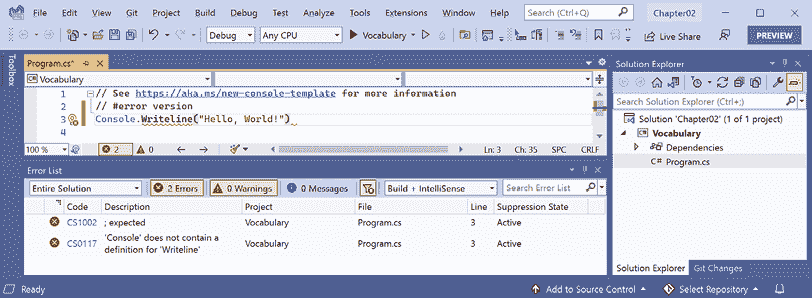

图 2.3：错误列表窗口显示两个编译错误

1.  修复两个编码错误。

## 导入命名空间

`System` 是一个命名空间，它类似于类型的地址。为了精确地找到某人的位置，你可能使用 `Oxford.HighStreet.BobSmith`，这告诉我们去牛津市的高街寻找名叫 Bob Smith 的人。

`System.Console.WriteLine` 告诉编译器在名为 `Console` 的 `System` 命名空间中查找名为 `WriteLine` 的方法。

为了简化我们的代码，.NET 6.0 之前每个版本的 **Console App** 项目模板在代码文件顶部添加了一个语句，告诉编译器始终在 `System` 命名空间中查找未带命名空间前缀的类型，如下面的代码所示：

```cs
using System; // Import the System namespace. 
```

我们称这种操作为 *导入命名空间*。导入命名空间的效果是，该命名空间中所有可用的类型都将对程序可用，而无需输入命名空间前缀。当你编写代码时，该命名空间中所有可用的类型都将显示在 IntelliSense 中。

## 隐式和全局导入命名空间

传统上，每个需要导入命名空间的需要导入命名空间的 `.cs` 文件都必须以 `using` 语句开始，以导入这些命名空间。例如，`System` 和 `System.Linq` 命名空间几乎在所有 `.cs` 文件中都需要，因此每个 `.cs` 文件的最初几行通常至少包含几个 `using` 语句，如下面的代码所示：

```cs
using System;
using System.Linq;
using System.Collections.Generic; 
```

当使用 ASP.NET Core 创建网站和服务时，每个文件通常都需要导入数十个命名空间。

C# 10 引入了一个新的关键字组合，.NET SDK 6 引入了一个新的项目设置，这两个设置协同工作以简化导入常用命名空间。

`global using` 关键字组合意味着你只需在一个 `.cs` 文件中导入一个命名空间，它将在所有 `.cs` 文件中可用，而无需在每个需要该命名空间的文件顶部导入该命名空间。你可以在 `Program.cs` 文件中放置 `global using` 语句，但我建议创建一个名为 `GlobalUsings.cs` 的单独文件，其中包含所有 `global using` 语句，如下面的代码所示：

```cs
global using System;
global using System.Linq;
global using System.Collections.Generic; 
```

**良好实践**：随着开发人员习惯于这种新的 C# 功能，我预计这个文件的命名约定将成为事实上的标准。正如你即将看到的，相关的 .NET SDK 功能使用类似的命名约定。

任何目标 .NET 6 或更高版本的项目，因此使用 C# 10 或更高版本编译器，将在 `obj\Debug\net9.0` 文件夹中生成一个 `<ProjectName>.GlobalUsings.g.cs` 文件，以隐式全局导入一些常用命名空间，如 `System`。隐式导入的命名空间的具体列表取决于你针对哪个 SDK，如 *表 2.5* 所示：

| **SDK** | **隐式导入的命名空间** |
| --- | --- |
| `Microsoft.NET.Sdk` | `System` `System.Collections.Generic` `System.IO` `System.Linq` `System.Net.Http` `System.Threading` `System.Threading.Tasks` |
| `Microsoft.NET.Sdk.Web` | 同 `Microsoft.NET.Sdk`，並增加：`System.Net.Http.Json`、`Microsoft.AspNetCore.Builder`、`Microsoft.AspNetCore.Hosting`、`Microsoft.AspNetCore.Http`、`Microsoft.AspNetCore.Routing`、`Microsoft.Extensions.Configuration`、`Microsoft.Extensions.DependencyInjection`、`Microsoft.Extensions.Hosting`、`Microsoft.Extensions.Logging` |
| `Microsoft.NET.Sdk.Worker` | 同 `Microsoft.NET.Sdk`，並增加：`Microsoft.Extensions.Configuration`、`Microsoft.Extensions.DependencyInjection`、`Microsoft.Extensions.Hosting`、`Microsoft.Extensions.Logging` |

表 2.5：.NET SDKs 及其隱式導入的命名空間

讓我們看看當前的自動生成的隱式導入文件：

1.  在 **解決方案探索器** 中，啟用 **顯示所有文件** 按鈕，並注意編譯器生成的 `bin` 和 `obj` 文件夾現在是可見的。

1.  在 `Vocabulary` 專案中，展開 `obj` 文件夾，展開 `Debug` 文件夾，展開 `net9.0` 文件夾，然後打開名為 `Vocabulary.GlobalUsings.g.cs` 的文件。

此文件的命名規範為 `<ProjectName>.GlobalUsings.g.cs`。注意 **g** 代表 **generated**，以與開發者編寫的代碼文件區分。

1.  請記住，此文件是編譯器為目標為 .NET 6 及更高版本的專案自動創建的，並導入了一些常用命名空間，包括 `System.Threading`，如下面的代碼所示：

    ```cs
    // <autogenerated />
    global using global::System;
    global using global::System.Collections.Generic;
    global using global::System.IO;
    global using global::System.Linq;
    global using global::System.Net.Http;
    global using global::System.Threading;
    global using global::System.Threading.Tasks; 
    ```

1.  关闭 `Vocabulary.GlobalUsings.g.cs` 文件。

1.  在 **解決方案探索器** 中，打開 `Vocabulary.csproj` 專案文件，然後向專案文件添加更多條目以控制哪些命名空間被隱式導入，如下面的標記中突出顯示：

    ```cs
    <Project Sdk="Microsoft.NET.Sdk">
      <PropertyGroup>
        <OutputType>Exe</OutputType>
        <TargetFramework>net9.0</TargetFramework>
        <Nullable>enable</Nullable>
        <ImplicitUsings>enable</ImplicitUsings>
      </PropertyGroup>
     **<ItemGroup>**
     **<Using Remove=****"System.Threading"** **/>**
     **<Using Include=****"System.Numerics"** **/>**
     **<Using Include=****"System.Console"** **Static=****"true"** **/>**
     **<Using Include=****"System.Environment"** **Alias=****"Env"** **/>**
     **</ItemGroup>**
    </Project> 
    ```

注意 `<ItemGroup>` 和 `<ImportGroup>` 的不同。請確保使用正確的一個！還要注意，項目組或項目組中元素的順序不重要。例如，`<Nullable>` 可以在 `<ImplicitUsings>` 之前或之後。

1.  將更改保存到專案文件。

1.  展開 `obj` 文件夾，展開 `Debug` 文件夾，展開 `net9.0` 文件夾，然後打開名為 `Vocabulary.GlobalUsings.g.cs` 的文件。

1.  注意，此文件現在導入 `System.Numerics` 而不是 `System.Threading`，已導入 `Environment` 類並將其別名為 `Env`，並靜態導入了 `Console` 類，如下面的代碼中突出顯示：

    ```cs
    // <autogenerated />
    global using global::System;
    global using global::System.Collections.Generic;
    global using global::System.IO;
    global using global::System.Linq;
    global using global::System.Net.Http;
    **global****using****global****::System.Numerics;**
    global using global::System.Threading.Tasks;
    **global****using** **Env =** **global****::System.Environment;**
    **global****using****static****global****::System.Console;** 
    ```

1.  在 `Program.cs` 中添加一條輸出計算機信息的語句，並注意由於我們靜態導入了 `Console` 類，我們可以無預先添加 `Console` 前綴來調用其方法，例如 `WriteLine`，並可以使用其別名 `Env` 引用 `Environment` 類，如下面的代碼所示：

    ```cs
    WriteLine($"Computer named {Env.MachineName} says \"No.\""); 
    ```

1.  运行專案，并注意信息，如下面的輸出所示：

    ```cs
    Computer named DAVROS says "No." 
    ```

您的计算机名称将不同，除非您像我一樣將您的計算機命名為《神秘博士》中的角色名稱。

你可以通过从项目文件中完全删除`<ImplicitUsings>`元素或将它的值更改为`disable`来为所有 SDK 禁用隐式导入命名空间的功能，如下面的标记所示：

```cs
<ImplicitUsings>disable</ImplicitUsings> 
```

**良好实践**：如果你想要手动创建一个包含所有`global using`语句的单个文件，而不是可能自动生成一个并手动创建其他文件，你可以选择这样做。但我的建议是保持该功能启用，并修改项目文件以更改`obj`文件夹层次结构中自动生成的类文件中包含的内容。

## 动词是方法

在英语中，动词是进行或动作词，如“跑”和“跳”。在 C#中，进行或动作词被称为**方法**。C#有数十万个方法可用。在英语中，动词根据动作发生的时间改变它们的书写方式。例如，Amir 过去**正在跳**，Beth 现在**跳**，他们过去**跳过**，Charlie 将来**将跳**。

在 C#中，例如`WriteLine`这样的方法会根据动作的具体情况改变它们的调用或执行方式。这被称为重载，我们将在第五章“使用面向对象编程构建自己的类型”中更详细地介绍。但就目前而言，请考虑以下示例：

```cs
// Outputs the current line terminator.
// By default, this is a carriage-return and line feed.
Console.WriteLine();
// Outputs the greeting and the current line terminator.
Console.WriteLine("Hello Ahmed");
// Outputs a formatted number and date and the current line terminator.
Console.WriteLine(
  "Temperature on {0:D} is {1}°C.", DateTime.Today, 23.4); 
```

当我展示没有编号的逐步说明的代码片段时，我不期望你将其作为代码输入，因此它们不会在没有上下文的情况下执行。

一个不同但并不完全精确的类比是，有些动词拼写相同，但根据上下文有不同的含义，例如，你可以输掉一场游戏，失去书中的位置，或者丢失钥匙。

## 名词是类型、变量、字段和属性

在英语中，名词是指出事物的名称。例如，Fido 是一只狗的名字。“狗”这个词告诉我们 Fido 是什么类型的事物，因此要命令 Fido 去捡球，我们会使用他的名字。

在 C#中，它们的对应物是**类型**、**变量**、**字段**和**属性**。例如：

+   `Animal`和`Car`是类型；它们是用于分类事物的名词。

+   `Head`和`Engine`可能是字段或属性；它们是属于`Animal`和`Car`的名词。

+   `Fido`和`Bob`是变量；它们是用于指代特定对象的名词。

C#有数万个类型可用，尽管你有没有注意到我没有说“在 C#中有数万个类型”？这种区别很微妙但很重要。C#语言只有几个关键字用于类型，如`string`和`int`，严格来说，C#并没有定义任何类型。看起来像类型的关键字，如`string`，是**别名**，它们代表 C#运行的平台提供的类型。

重要的是要知道 C#不能独立存在；毕竟，它是一种运行在.NET 变体上的语言。理论上，有人可以为 C#编写一个编译器，使用不同的平台，具有不同的底层类型。在实践中，C#的平台是.NET，它为 C#提供了数万个类型，包括`System.Int32`，这是`int`映射到的 C#关键字别名，以及许多更复杂的类型，如`System.Xml.Linq.XDocument`。

值得注意的是，术语**类型**经常与**类**混淆。你有没有玩过聚会游戏“二十个问题”，也称为“动物、植物或矿物”？在这个游戏中，一切都可以归类为动物、植物或矿物。在 C#中，每个**类型**都可以归类为`class`、`struct`、`enum`、`interface`或`delegate`。你将在第六章“实现接口和继承类”中了解这些的含义。例如，C#关键字`string`是一个`class`，但`int`是一个`struct`。因此，最好使用术语**类型**来指代两者。

## 揭示 C#词汇的广度

我们知道 C#有超过 100 个关键字，但有多少个类型呢？让我们编写一些代码来找出在简单的控制台应用程序中 C#可以访问多少个类型（及其方法）。

目前不必担心代码的具体工作原理，但要知道它使用了一种称为**反射**的技术：

1.  在`Program.cs`中注释掉所有现有的语句。

1.  我们首先在`Program.cs`文件的顶部导入`System.Reflection`命名空间，这样我们就可以使用该命名空间中的某些类型，如`Assembly`和`TypeName`，如下面的代码所示：

    ```cs
    using System.Reflection; // To use Assembly, TypeName, and so on. 
    ```

**良好实践**：我们可以使用隐式导入和`global using`功能将此命名空间导入到项目中所有`.cs`文件中，但由于只有一个文件，最好在需要此命名空间的文件中导入该命名空间。

1.  编写语句以获取编译后的控制台应用程序，并遍历它可访问的所有类型，输出每个类型的名称和方法数量，如下面的代码所示：

    ```cs
    // Get the assembly that is the entry point for this app.
    Assembly? myApp = Assembly.GetEntryAssembly();
    // If the previous line returned nothing then end the app.
    if (myApp is null) return;
    // Loop through the assemblies that my app references.
    foreach (AssemblyName name in myApp.GetReferencedAssemblies())
    {
      // Load the assembly so we can read its details.
      Assembly a = Assembly.Load(name);
      // Declare a variable to count the number of methods.
      int methodCount = 0;
      // Loop through all the types in the assembly.
      foreach (TypeInfo t in a.DefinedTypes)
      {
        // Add up the counts of all the methods.
        methodCount += t.GetMethods().Length;
      }
      // Output the count of types and their methods.
      WriteLine("{0:N0} types with {1:N0} methods in {2} assembly.",
        arg0: a.DefinedTypes.Count(),
        arg1: methodCount,
        arg2: name.Name);
    } 
    ```

`N0`是大写字母`N`后面跟着数字零。它不是大写字母`N`后面跟着大写字母`O`。它的意思是“用零（`0`）位小数格式化数字（`N`）。”

1.  运行项目。当你在**操作系统**（**OS**）上运行时，你会看到最简单应用中可用的类型和方法的实际数量。显示的类型和方法数量将根据你使用的操作系统而有所不同，如下面的 Windows 输出所示：

    ```cs
    0 types with 0 methods in System.Runtime assembly.
    41 types with 639 methods in System.Console assembly.
    112 types with 1,190 methods in System.Linq assembly. 
    ```

为什么`System.Runtime`程序集包含零个类型？这个程序集是特殊的，因为它只包含**类型前向器**而不是实际类型。类型前向器代表一个在.NET 之外或由于某些其他高级原因实现的类型。

1.  在文件顶部（在导入 `System.Reflection` 命名空间之后）添加语句以声明一些变量，如下面的代码所示：

    ```cs
    // Declare some unused variables using types in
    // additional assemblies to make them load too.
    System.Data.DataSet ds = new();
    HttpClient client = new(); 
    ```

1.  再次运行控制台应用程序并查看结果，结果应该如下所示：

    ```cs
    0 types with 0 methods in System.Runtime assembly.
    406 types with 7,139 methods in System.Data.Common assembly.
    425 types with 4,681 methods in System.Net.Http assembly.
    41 types with 639 methods in System.Console assembly.
    112 types with 1,190 methods in System.Linq assembly. 
    ```

现在，你更有理由理解为什么学习 C# 是一项挑战——因为有很多类型和方法需要学习。方法只是类型可以拥有的成员类别之一，你和其他程序员不断定义新的类型和成员！

## 示例：请求 ChatGPT 解释代码

我们在 `Vocabulary` 项目中编写的代码是当你可能想要请求 ChatGPT 解释某些内容时的一个很好的例子。如果你输入提示“解释以下代码：”然后是代码，这是它的响应：

“这段 C# 代码对当前应用程序引用的程序集（本质上相当于库或模块）进行分析。它统计了每个引用程序集中的类型和方法的总数。”

让我们更详细地分解代码：

1.  使用 `System.Reflection` 命名空间在运行时处理程序集、模块、类型、方法等。

1.  声明了 `System.Data.DataSet` 和 `HttpClient` 实例，但未使用。注释暗示这些实例是为了确保它们各自的程序集在后续分析中已加载。从某些程序集创建类的实例可能会导致这些程序集被加载到内存中。

1.  `Assembly.GetEntryAssembly()` 获取应用程序的入口点程序集。

1.  如果 `myApp` 为空（表示没有入口程序集，这在正常运行的 .NET 应用程序中应该是不可行的），则应用程序退出。

1.  `foreach` 循环遍历入口程序集引用的程序集中的每个程序集名称。

1.  `Assembly.Load(name)` 根据指定的程序集名称加载程序集。这允许您以编程方式与程序集交互。

1.  声明并初始化了一个计数变量 `methodCount` 为 `0`。这用于计算程序集中方法的总数。

1.  另一个嵌套的 `foreach` 循环遍历程序集中的每个类型。

1.  对于每种类型，它获取方法的数量 `(t.GetMethods().Length)` 并将其添加到 `methodCount`。

1.  最后，使用 `WriteLine()` 将程序集中的类型及其方法数量输出到控制台。字符串中的 `{0:N0}` 格式说明符是一个用于数字的占位符（`0` 指的是参数索引，`N` 表示数字格式，N 后面的 0 指定小数位数）。

因此，本质上，这个脚本统计了应用程序引用的每个程序集中存在多少类型和方法。这可能有助于了解应用程序的依赖项的复杂度或大小。”

现在回到现实世界，马克。这是一个相当不错的解释，没有错误或幻觉！

**良好实践**：GitHub Copilot 和 ChatGPT 等工具对于程序员在学习新事物时特别有用。一个优秀的程序员总是在学习新事物！这些工具不仅可以帮助您编写代码，还可以解释他人编写的代码，甚至提出改进建议。

# 与变量一起工作

所有应用程序都处理数据。数据进来，数据处理，然后数据出去。

数据通常来自文件、数据库或用户输入，可以暂时存储在变量中，这些变量将存储在运行程序的内存中。当程序结束时，内存中的数据就会丢失。数据通常输出到文件、数据库、屏幕或打印机。使用变量时，您应该首先考虑变量在内存中占用的空间大小，其次考虑其处理速度的快慢。

我们通过选择合适的数据类型来控制这个过程。您可以将简单的常见类型，如 `int` 和 `double`，视为不同大小的存储盒，较小的盒子占用较少的内存，但可能处理速度不快；例如，在 64 位操作系统上，添加 16 位数字可能不如添加 64 位数字处理得快。这些盒子中的一些可能堆叠得很近，而另一些可能被扔到更远的大堆里。

## 命名事物和赋值

对于事物有命名约定，遵循它们是一个好习惯，如*表 2.6*所示：

| **命名约定** | **示例** | **用于** |
| --- | --- | --- |
| 驼峰命名法 | `cost`, `orderDetail`, 和 `dateOfBirth` | 本地变量和私有字段 |
| 标题大小写，也称为帕斯卡大小写 | `String`, `Int32`, `Cost`, `DateOfBirth`, 和 `Run` | 类型、非私有字段和其他成员，如方法 |

表 2.6：命名约定及其应用

一些 C#程序员喜欢在私有字段名称前加下划线，例如，`_dateOfBirth` 而不是 `dateOfBirth`。所有类型的私有成员的命名没有正式定义，因为它们在类外是不可见的，所以无论是带下划线前缀还是不带都是有效的。

**良好实践**：遵循一致的命名约定将使您的代码容易被其他开发者（以及未来的您！）理解。

下面的代码块展示了使用 `=` 符号声明一个命名本地变量并将其赋值的示例。请注意，您可以使用 C# 6 中引入的关键字 `nameof` 输出变量的名称：

```cs
// Let the heightInMetres variable become equal to the value 1.88.
double heightInMetres = 1.88;
Console.WriteLine($"The variable {nameof(heightInMetres)} has the value
{heightInMetres}."); 
```

**警告**！前述代码中双引号内的消息换行是因为打印页面的宽度太窄。当在代码编辑器中输入此类语句时，请将其全部输入一行。

在 C# 12 及更高版本中，`nameof` 现在可以从静态上下文访问实例数据。您将在 *第五章*，*使用面向对象编程创建自己的类型* 中学习实例和静态数据之间的区别。

## 字面值

当您向变量赋值时，您通常会，但不总是，分配一个 **字面值**。但什么是字面值？字面值是一种表示固定值的符号。数据类型有不同的符号来表示它们的字面值，在接下来的几节中，您将看到使用字面值符号将值赋给变量的示例。

**更多信息**：您可以在 C# 语言规范中阅读字面值的正式定义：[`learn.microsoft.com/en-us/dotnet/csharp/language-reference/language-specification/lexical-structure#645-literals`](https://learn.microsoft.com/en-us/dotnet/csharp/language-reference/language-specification/lexical-structure#645-literals)。

## 存储文本

对于文本，单个字母，如 `A`，存储为 `char` 类型。

**良好实践**：实际上，这可能会更复杂。埃及象形文字 A002 (U+13001) 需要两个 `System.Char` 值（称为代理对）来表示它：`\uD80C` 和 `\uDC01`。不要总是假设一个 `char` 等于一个字母，否则您可能会在代码中引入难以察觉的错误。

`char` 的赋值使用单引号包围字面值，或分配函数调用的返回值，如下面的代码所示：

```cs
char letter = 'A'; // Assigning literal characters.
char digit = '1';
char symbol = '$';
char userChoice = GetChar(); // Assigning from a fictitious function. 
```

对于文本，多个字母，如 `Bob`，存储为 `string` 类型，并使用双引号包围字面值或通过分配函数调用或构造函数的返回值来赋值，如下面的代码所示：

```cs
string firstName = "Bob"; // Assigning literal strings.
string lastName = "Smith";
string phoneNumber = "(215) 555-4256";
// Assigning a string returned from the string class constructor.
string horizontalLine = new('-', count: 74); // 74 hyphens.
// Assigning a string returned from a fictitious function.
string address = GetAddressFromDatabase(id: 563);
// Assigning an emoji by converting from Unicode.
string grinningEmoji = char.ConvertFromUtf32(0x1F600); 
```

### 输出表情符号

要在 Windows 的命令提示符中输出表情符号，您必须使用 Windows Terminal，因为命令提示符不支持表情符号，并将控制台输出编码设置为使用 UTF-8，如下面的代码所示：

```cs
Console.OutputEncoding = System.Text.Encoding.UTF8;
string grinningEmoji = char.ConvertFromUtf32(0x1F600);
Console.WriteLine(grinningEmoji); 
```

### 文本字面值

转义字符是编程和文本处理中的一种特殊字符，用于引入 **转义序列**。转义序列允许表示难以或无法直接在字符串中包含的字符。这些序列通常以反斜杠 `\` 开头，后跟一个或多个字符。

当在 `string` 变量中存储文本时，您可以包含转义序列，这些序列使用反斜杠表示特殊字符，如制表符和换行符，如下面的代码所示：

```cs
string fullNameWithTabSeparator = "Bob\tSmith"; 
```

但如果您在 Windows 上存储文件的路径，并且其中一个文件夹名称以 `T` 开头，如下面的代码所示？

```cs
string filePath = "C:\televisions\sony\bravia.txt"; 
```

编译器会将 `\t` 转换为制表符，你将得到错误！

您必须使用 `@` 符号作为前缀来使用文本字面值 `string`，如下面的代码所示：

```cs
string filePath = @"C:\televisions\sony\bravia.txt"; 
```

在 C# 13 及更高版本中，您可以使用字符字面值转义序列 `\e` 来表示 ESC 字符（Unicode U+001B），如下面的代码所示：

```cs
// C# 13 or later.
char esc = '\e';
// C# 12 or earlier.
char esc = '\u001b'; 
```

在过去，你可能使用过 `\u001b` 或 `\x1b`。然而，使用 `\x1b` 并不推荐，因为任何在 `1b` 后面的有效十六进制数字都会被错误地解释为转义序列的一部分。

### 原始字符串字面量

从 C# 11 开始引入的原始字符串字面量，方便输入任何任意文本，而无需对内容进行转义。它们使得定义包含其他语言（如 XML、HTML 或 JSON）的字面量变得容易。

原始字符串字面量以三个或更多双引号字符开始和结束，如下面的代码所示：

```cs
string xml = """
             <person age="50">
               <first_name>Mark</first_name>
             </person>
             """; 
```

为什么需要三个或更多双引号字符？这是因为在内容本身需要包含三个双引号字符的情况下；这时你可以使用四个双引号字符来表示内容的开始和结束。如果内容需要包含四个双引号字符，那么你可以使用五个双引号字符来表示内容的开始和结束。依此类推。

在之前的代码中，XML 被缩进 13 个空格。编译器查看最后三个或更多双引号字符的缩进，然后自动从原始字符串字面量内的所有内容中移除该级别的缩进。因此，之前代码的结果将不会像定义代码那样缩进，而是与左边界对齐，如下面的标记所示：

```cs
<person age="50">
  <first_name>Mark</first_name>
</person> 
```

如果最后的三个双引号字符与左边界对齐，如下面的代码所示：

```cs
string xml = """
             <person age="50">
               <first_name>Mark</first_name>
             </person>
"""; 
```

那么在下面的标记中，13 个空格的缩进将不会被移除：

```cs
 <person age="50">
               <first_name>Mark</first_name>
             </person> 
```

### 原始插值字符串字面量

你可以将使用花括号 `{}` 的插值字符串与原始字符串字面量混合使用。你通过在字面量开头添加相应数量的美元符号来指定表示替换表达式的花括号数量。任何少于该数量的花括号都被视为原始内容。

例如，如果我们想定义一些 JSON，单花括号将被视为普通花括号，但两个美元符号告诉编译器任何两个花括号都表示一个替换表达式值，如下面的代码所示：

```cs
var person = new { FirstName = "Alice", Age = 56 };
string json = $$"""
              {
                "first_name": "{{person.FirstName}}",
                "age": {{person.Age}},
                "calculation": "{{{ 1 + 2 }}}"
              }
              """;
Console.WriteLine(json); 
```

之前的代码将生成以下 JSON 文档：

```cs
{
  "first_name": "Alice",
  "age": 56,
  "calculation": "{3}"
} 
```

美元符号的数量告诉编译器需要多少个花括号才能被识别为插值表达式。

注意围绕 `3` 的花括号 `{}`。这是故意的。在这个例子中，JSON 文档必须生成一个包含花括号的计算。为了展示这一点，代码使用了三个花括号：第一个开括号将输出为一个字面字符。接下来的两个花括号将被解释为表达式的开始。前两个闭括号将被解释为表达式的结束。最后一个闭括号将是一个字面字符。

如果代码只使用了两个花括号，那么这些花括号被视为表达式 `1 + 2` 的分隔符，并且不会出现在输出中：

```cs
var person = new { FirstName = "Alice", Age = 56 };
string json = $$"""
              {
                "first_name": "{{person.FirstName}}",
                "age": {{person.Age}},
                "calculation": "{{ 1 + 2 }}"
              }
              """;
Console.WriteLine(json); 
```

现在它生成了以下输出：

```cs
{
  "first_name": "Alice",
  "age": 56,
  "calculation": "3"
} 
```

### 总结存储文本的选项

总结：

+   **字面字符串**：用双引号括起来的字符。它们可以使用像 `\t` 这样的转义字符。要表示反斜杠，使用两个：`\\`。

+   **原始字符串字面量**：用三个或更多双引号括起来的字符。

+   **字面字符串**：以 `@` 为前缀的字符串，用于禁用转义字符，因此反斜杠 `\` 就是字面意义上的反斜杠。它还允许 `string` 值跨越多行，因为空白字符被视为自身，而不是传递给编译器的指令。

+   **插值字符串**：以 `$` 为前缀的字面字符串，用于启用嵌入的格式化变量。你将在本章后面了解更多关于此内容。

## 存储数字

数字是我们想要进行算术运算的数据，例如乘法。电话号码不是一个可量化的数字。要决定一个变量是否应该存储为数字，问问自己你是否需要对数字执行算术运算，或者数字是否包含非数字字符，如括号或破折号，用于格式化数字，例如 (414) 555-1234。在这种情况下，“数字”是一系列字符，因此应该将其存储为 `string`。

数字可以是自然数，例如 42，用于计数（也称为整数）；它们也可以是负数，例如 -42（称为整数）；或者它们可以是实数，例如 3.9（有分数部分），在计算机中称为单精度或双精度浮点数。

让我们探索数字：

1.  使用你喜欢的代码编辑器将一个新的 **Console App** / `console` 项目命名为 `Numbers` 并添加到 `Chapter02` 解决方案中：

    +   对于 Visual Studio，将启动项目配置为当前选择。

1.  在 `Program.cs` 中，删除现有代码，然后输入语句来声明一些使用各种数据类型的数字变量，如下面的代码所示：

    ```cs
    // An unsigned integer is a positive whole number or 0.
    uint naturalNumber = 23;
    // An integer is a negative or positive whole number or 0.
    int integerNumber = -23;
    // A float is a single-precision floating-point number.
    // The F or f suffix makes the value a float literal.
    // The suffix is required to compile.
    float realNumber = 2.3f;
    // A double is a double-precision floating-point number.
    // double is the default for a number value with a decimal point.
    double anotherRealNumber = 2.3; // A double literal value. 
    ```

### 存储整数

你可能知道计算机将所有内容存储为位。位的值是 `0` 或 `1`。这被称为**二进制数制**。人类使用**十进制数制**。

十进制数制，也称为十进制，以 10 为其**基数**，这意味着有 10 个数字，从 0 到 9。尽管它是人类文明中最常用的数制，但在科学、工程和计算机科学中，其他数制系统也很流行。二进制数制，也称为二进制，以 2 为其基数，这意味着有两个数字，0 和 1。

以下图像显示了计算机如何存储十进制数字 10。注意 8 和 2 列中值为 1 的位：8 + 2 = 10。

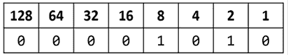

图 2.4：计算机如何存储十进制数字 10

因此，十进制中的 `10` 在二进制字节（8 位）中是 `00001010`。

### 通过使用数字分隔符提高可读性

C# 7 及以后的版本中看到的两项改进是使用下划线字符 `_` 作为数字分隔符以及支持二进制字面量。

你可以在数字字面量的数字中插入下划线，包括十进制、二进制或十六进制表示法，以提高可读性。

例如，你可以将一百万的十进制表示法，即基 10，写成 `1_000_000`。

你甚至可以使用印度常见的 2/3 分组：`10_00_000`。

### 使用二进制或十六进制表示法

要使用二进制表示法，即基 2，仅使用 1 和 0，在数字字面量前加上 `0b`。要使用十六进制表示法，即基 16，使用 0 到 9 和 A 到 F，在数字字面量前加上 `0x`。

### 探索整数

让我们输入一些代码来查看一些示例：

1.  在 `Numbers` 项目中的 `Program.cs` 文件中，输入语句以使用下划线分隔符声明一些数字变量，如下面的代码所示：

    ```cs
    int decimalNotation = 2_000_000;
    int binaryNotation = 0b_0001_1110_1000_0100_1000_0000;
    int hexadecimalNotation = 0x_001E_8480;
    // Check the three variables have the same value.
    Console.WriteLine($"{decimalNotation == binaryNotation}");
    Console.WriteLine(
      $"{decimalNotation == hexadecimalNotation}");
    // Output the variable values in decimal.
    Console.WriteLine($"{decimalNotation:N0}");
    Console.WriteLine($"{binaryNotation:N0}");
    Console.WriteLine($"{hexadecimalNotation:N0}");
    // Output the variable values in hexadecimal.
    Console.WriteLine($"{decimalNotation:X}");
    Console.WriteLine($"{binaryNotation:X}");
    Console.WriteLine($"{hexadecimalNotation:X}"); 
    ```

1.  运行项目并注意结果显示三个数字都是相同的，如下面的输出所示：

    ```cs
    True
    True
    2,000,000
    2,000,000
    2,000,000
    1E8480
    1E8480
    1E8480 
    ```

计算机可以使用 `int` 类型或其兄弟类型（如 `long` 和 `short`）精确地表示整数。

## 存储实数

计算机不能总是精确地表示实数，即十进制或非整数数。`float` 和 `double` 类型使用单精度和双精度浮点数来存储实数。

大多数编程语言实现了电气和电子工程师协会（**IEEE**）的浮点算术标准。IEEE 754 是 IEEE 于 1985 年建立的一个关于浮点算术的技术标准。

以下图像显示了计算机如何简化表示数字 `12.75` 的二进制表示法。注意 8、4、½和¼列中的值为 `1` 的位：

8 + 4 + ½ + ¼ = 12¾ = 12.75

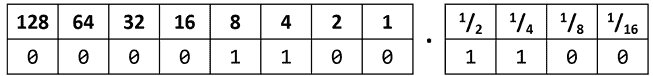

图 2.5：计算机以二进制表示法表示数字 12.75

因此，十进制表示法中的 `12.75` 在二进制表示法中是 `00001100.1100`。正如你所见，数字 `12.75` 可以使用位精确表示。然而，大多数数字不能，这是我们很快将要探讨的。

### 编写代码以探索数字大小

C# 有一个名为 `sizeof()` 的运算符，它返回类型在内存中使用的字节数。某些类型有名为 `MinValue` 和 `MaxValue` 的成员，它们返回可以存储在该类型变量中的最小和最大值。我们现在将使用这些功能来创建一个控制台应用程序以探索数字类型：

1.  在 `Program.cs` 文件底部，输入语句以显示三种数字数据类型的大小，如下面的代码所示：

    ```cs
    Console.WriteLine($"int uses {sizeof(int)} bytes and can store numbers in the range {int.MinValue:N0} to {int.MaxValue:N0}.");
    Console.WriteLine($"double uses {sizeof(double)} bytes and can store numbers in the range {double.MinValue:N0} to {double.MaxValue:N0}.");
    Console.WriteLine($"decimal uses {sizeof(decimal)} bytes and can store numbers in the range {decimal.MinValue:N0} to {decimal.MaxValue:N0}."); 
    ```

**警告！**本书中打印页面的宽度使得字符串值（双引号内）会换行。你必须将它们输入在同一行上，否则你会得到编译错误。

1.  运行代码并查看输出，如图 *2.6* 所示：


图 2.6：常见数字数据类型的尺寸和范围信息

`int` 变量使用 4 个字节的内存，可以存储高达约 20 亿的正负数。`double` 变量使用 8 个字节的内存，可以存储更大的值！`decimal` 变量使用 16 个字节的内存，可以存储大数字，但不如 `double` 类型大。

但你可能想知道，为什么 `double` 变量能够存储比 `decimal` 变量更大的数字，而它只使用了内存空间的一半？好吧，现在我们就来找出答案！

### 比较 `double` 和 `decimal` 类型

你现在将编写一些代码来比较 `double` 和 `decimal` 值。虽然不难理解，但现在不必担心理解语法：

1.  输入类型声明来声明两个 `double` 变量，将它们相加，并将它们与预期结果进行比较。然后，将结果写入控制台，如下面的代码所示：

    ```cs
    Console.WriteLine("Using doubles:");
    double a = 0.1;
    double b = 0.2;
    if (a + b == 0.3)
    {
      Console.WriteLine($"{a} + {b} equals {0.3}");
    }
    else
    {
      Console.WriteLine($"{a} + {b} does NOT equal {0.3}");
    } 
    ```

1.  运行代码并查看结果，如下面的输出所示：

    ```cs
    Using doubles:
    0.1 + 0.2 does NOT equal 0.3 
    ```

在使用逗号作为小数分隔符的文化中，结果将略有不同，如下面的输出所示：`0,1 + 0,2 does NOT equal 0,3`。

`double` 类型不能保证准确性，因为大多数数字，如 `0.1`、`0.2` 和 `0.3`，实际上不能精确地表示为浮点值。

如果你尝试不同的值，比如 `0.1 + 0.3 == 0.4`，它可能会返回 `true`，因为对于 `double` 类型的值，一些不精确的值在当前表示中恰好相等，尽管它们在数学上可能并不相等。所以，有些数字可以直接比较，但有些则不能。我特意选择了 `0.1` 和 `0.2` 来与 `0.3` 比较，因为它们不能进行比较，正如结果所证明的。

你可以比较存储在 `float` 类型的实数，它比 `double` 类型更不精确，但由于这种较低的精度，比较实际上会显示为 `true`！

```cs
float a = 0.1F;
float b = 0.2F;
if (a + b == 0.3F) // True because float is less "accurate" than double.
... 
```

作为一般规则，你应该只在精度，尤其是比较两个数字的相等性不重要时使用 `double`。一个例子可能是当你测量一个人的身高时；你将只使用大于或小于来比较值，但永远不会使用等于。

前面代码的问题可以通过计算机存储数字 `0.1` 或其倍数的方式来说明。为了在二进制表示法中表示 `0.1`，计算机在 1/16 列存储 1，在 1/32 列存储 1，在 1/256 列存储 1，在 1/512 列存储 1，依此类推。

十进制表示法中的数字 `0.1` 在二进制表示法中是 `0.00011001100110011`…，无限循环，如 *图 2.7* 所示：

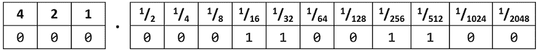

图 2.7：十进制表示法中数字 0.1 在二进制表示法中无限循环

**良好实践**：永远不要使用 `==` 比较双精度值。在 1990-1991 年的海湾战争中，一个美国爱国者导弹营在其计算中使用了双精度值。这种不精确导致它未能追踪和拦截一枚来袭的伊拉克飞毛腿导弹，造成 28 名士兵死亡；您可以在[`www.ima.umn.edu/~arnold/disasters/patriot.html`](https://www.ima.umn.edu/~arnold/disasters/patriot.html)上了解更多信息。自那时起，爱国者导弹系统已经得到了改进。“在服役 40 年后，爱国者防空系统终于做到了它被设计要做的。” “没有人 100%确信爱国者能够摧毁一枚 Kh-47 高超音速导弹，”基辅第 96 防空导弹旅指挥官谢尔盖·亚列缅科上校说。“乌克兰人证明了这一点。”：[`archive.ph/2023.06.11-132200/https://www.wsj.com/amp/articles/u-s-patriot-missile-is-an-unsung-hero-of-ukraine-war-db6053a0`](https://archive.ph/2023.06.11-132200/https://www.wsj.com/amp/articles/u-s-patriot-missile-is-an-unsung-hero-of-ukraine-war-db6053a0)。

现在让我们看看使用 `decimal` 数字类型的相同代码：

1.  复制并粘贴您之前编写的语句（使用了 `double` 变量）。

1.  修改语句以使用 `decimal` 并将变量重命名为 `c` 和 `d`，如下面的代码所示：

    ```cs
    Console.WriteLine("Using decimals:");
    decimal c = 0.1M; // M suffix means a decimal literal value
    decimal d = 0.2M;
    if (c + d == 0.3M)
    {
      Console.WriteLine($"{c} + {d} equals {0.3M}");
    }
    else
    {
      Console.WriteLine($"{c} + {d} does NOT equal {0.3M}");
    } 
    ```

1.  运行代码并查看结果，如下面的输出所示：

    ```cs
    Using decimals:
    0.1 + 0.2 equals 0.3 
    ```

`decimal` 类型是准确的，因为它将数字存储为一个大整数，并移动小数点。例如，`0.1` 被存储为 `1`，并标记为将小数点向左移动一位。`12.75` 被存储为 `1275`，并标记为将小数点向左移动两位。

**良好实践**：对于整数使用 `int`。对于不会与其他值进行比较的实数使用 `double`；比较 `double` 值是否小于或大于等是可以的。对于金钱、CAD 图纸、通用工程以及任何需要实数精度的场合使用 `decimal`。

### 特殊实数值

`float` 和 `double` 类型有一些有用的特殊值：`NaN` 表示“不是一个数字”（例如，零除以零的结果），`Epsilon` 表示可以存储在 `float` 或 `double` 中的最小正数，`PositiveInfinity` 和 `NegativeInfinity` 表示无限大的正数和负数。它们还有用于检查这些特殊值的方法，如 `IsInfinity` 和 `IsNaN`。

让我们编写一些代码语句来查看这些特殊值的外观：

1.  向输出中添加语句以输出一些特殊的 `double` 值，如下面的代码所示：

    ```cs
    #region Special float and double values
    Console.WriteLine($"double.Epsilon: {double.Epsilon}");
    Console.WriteLine($"double.Epsilon to 324 decimal places: {double.Epsilon:N324}");
    Console.WriteLine($"double.Epsilon to 330 decimal places: {double.Epsilon:N330}");
    const int col1 = 37; // First column width.
    const int col2 = 6; // Second column width.
    string line = new string('-', col1 + col2 + 3);
    Console.WriteLine(line);
    Console.WriteLine($"{"Expression",-col1} | {"Value",col2}");
    Console.WriteLine(line);
    Console.WriteLine($"{"double.NaN",-col1} | {double.NaN,col2}");
    Console.WriteLine($"{"double.PositiveInfinity",-col1} | {double.PositiveInfinity,col2}");
    Console.WriteLine($"{"double.NegativeInfinity",-col1} | {double.NegativeInfinity,col2}");
    Console.WriteLine(line);
    Console.WriteLine($"{"0.0 / 0.0",-col1} | {0.0 / 0.0,col2}");
    Console.WriteLine($"{"3.0 / 0.0",-col1} | {3.0 / 0.0,col2}");
    Console.WriteLine($"{"-3.0 / 0.0",-col1} | {-3.0 / 0.0,col2}");
    Console.WriteLine($"{"3.0 / 0.0 == double.PositiveInfinity",-col1} | {3.0 / 0.0 == double.PositiveInfinity,col2}");
    Console.WriteLine($"{"-3.0 / 0.0 == double.NegativeInfinity",-col1} | {-3.0 / 0.0 == double.NegativeInfinity,col2}");
    Console.WriteLine($"{"0.0 / 3.0",-col1} | {0.0 / 3.0,col2}");
    Console.WriteLine($"{"0.0 / -3.0",-col1} | {0.0 / -3.0,col2}");
    Console.WriteLine(line);
    #endregion 
    ```

1.  运行代码并查看结果，如下面的输出所示：

    ```cs
    double.Epsilon: 5E-324
    double.Epsilon to 324 decimal places: 0.000000000000000000000000000000000000000000000000000000000000000000000000000000000000000000000000000000000000000000000000000000000000000000000000000000000000000000000000000000000000000000000000000000000000000000000000000000000000000000000000000000000000000000000000000000000000000000000000000000000000000000000000000000000005
    double.Epsilon to 330 decimal places: 0.000000000000000000000000000000000000000000000000000000000000000000000000000000000000000000000000000000000000000000000000000000000000000000000000000000000000000000000000000000000000000000000000000000000000000000000000000000000000000000000000000000000000000000000000000000000000000000000000000000000000000000000000000000000004940656
    ----------------------------------------------
    Expression                            |  Value
    ----------------------------------------------
    double.NaN                            |    NaN
    double.PositiveInfinity               |      8
    double.NegativeInfinity               |     -8
    ----------------------------------------------
    0.0 / 0.0                             |    NaN
    3.0 / 0.0                             |      8
    -3.0 / 0.0                            |     -8
    3.0 / 0.0 == double.PositiveInfinity  |   True
    -3.0 / 0.0 == double.NegativeInfinity |   True
    0.0 / 3.0                             |      0
    0.0 / -3.0                            |     -0
    ---------------------------------------------- 
    ```

注意以下内容：

+   `NaN` 输出为 `NaN`。(`NaN` 表示“不是一个数字”。) 它可以由零除以零的表达式生成。

+   `PositiveInfinity`值输出为一个`8`，看起来像其侧面的无穷符号。它可以由任何正实数除以零的表达式生成。

+   `NegativeInfinity`值输出为`-8`，看起来像其侧面的无穷符号，前面有一个负号。它可以由任何负实数除以零的表达式生成。

+   零除以任何正实数是零。

+   零除以任何负实数是负零。

+   `Epsilon`略小于使用科学记数法表示的`5E-324`：[`en.wikipedia.org/wiki/Scientific_notation`](https://en.wikipedia.org/wiki/Scientific_notation)。

### 新数字类型和不安全代码

`System.Half`类型是在.NET 5 中引入的。像`float`和`double`一样，它可以存储实数。它通常使用两个字节的内存。`System.Int128`和`System.UInt128`类型是在.NET 7 中引入的。像`int`和`uint`一样，它们可以存储有符号（正负）和无符号（只有零和正）的整数值。它们通常使用 16 字节的内存。

对于这些新数字类型，`sizeof`运算符仅在非安全代码块中有效，你必须使用启用非安全代码的选项编译项目。让我们探索它是如何工作的：

1.  在`Program.cs`文件底部，输入语句以显示`Half`和`Int128`数字数据类型的大小，如下所示代码：

    ```cs
    unsafe
    {
      Console.WriteLine($"Half uses {sizeof(Half)} bytes and can store numbers in the range {Half.MinValue:N0} to {Half.MaxValue:N0}.");
      Console.WriteLine($"Int128 uses {sizeof(Int128)} bytes and can store numbers in the range {Int128.MinValue:N0} to {Int128.MaxValue:N0}.");
    } 
    ```

1.  在`Numbers.csproj`中，添加一个元素以启用不安全代码，如下所示突出显示的标记：

    ```cs
    <PropertyGroup>
      <OutputType>Exe</OutputType>
      <TargetFramework>net9.0</TargetFramework>
      <ImplicitUsings>enable</ImplicitUsings>
      <Nullable>enable</Nullable>
     **<AllowUnsafeBlocks>True</AllowUnsafeBlocks>**
    </PropertyGroup> 
    ```

1.  运行`Numbers`项目，并注意两种新数字类型的大小，如下所示输出：

    ```cs
    Half uses 2 bytes and can store numbers in the range -65,504 to 65,504.
    Int128 uses 16 bytes and can store numbers in the range -170,141,183,460,
    469,231,731,687,303,715,884,105,728 to 170,141,183,460,469,231,731,687,
    303,715,884,105,727. 
    ```

    **更多信息**：`sizeof`运算符需要非安全代码块，除了常用的类型如`int`和`byte`之外。你可以在以下链接了解更多关于`sizeof`的信息：[`learn.microsoft.com/en-us/dotnet/csharp/language-reference/operators/sizeof`](https://learn.microsoft.com/en-us/dotnet/csharp/language-reference/operators/sizeof)。不安全代码无法验证其安全性。你可以在以下链接了解更多关于不安全代码块的信息：[`learn.microsoft.com/en-us/dotnet/csharp/language-reference/unsafe-code`](https://learn.microsoft.com/en-us/dotnet/csharp/language-reference/unsafe-code)。

## 存储布尔值

布尔值只能包含两个文字值之一`true`或`false`，如下所示代码：

```cs
bool happy = true;
bool sad = false; 
```

他们最常用于分支和循环。你目前不需要完全理解它们，因为它们在*第三章*，*控制流程、转换类型和处理异常*中介绍得更为详细。

## 存储任何类型的对象

有一种特殊类型名为`object`，可以存储任何类型的数据，但它的灵活性是以代码更混乱和可能性能较差为代价的。出于这两个原因，你应该尽可能避免使用它。以下步骤展示了如果你需要使用对象类型时如何使用它们，因为你必须使用使用它们的 Microsoft 或第三方库：

1.  使用你喜欢的代码编辑器，将名为 `Variables` 的新 **控制台应用程序** / `console` 项目添加到 `Chapter02` 解决方案中。

1.  在 `Program.cs` 中，删除现有的语句，然后输入语句来声明和使用一些使用 `object` 类型的变量，如下所示：

    ```cs
    object height = 1.88; // Storing a double in an object.
    object name = "Amir"; // Storing a string in an object.
    Console.WriteLine($"{name} is {height} metres tall.");
    int length1 = name.Length; // This gives a compile error!
    int length2 = ((string)name).Length; // Cast name to a string.
    Console.WriteLine($"{name} has {length2} characters."); 
    ```

1.  运行代码并注意第四个语句无法编译，因为编译器不知道 `name` 变量的数据类型，如下 *图 2.8* 所示：

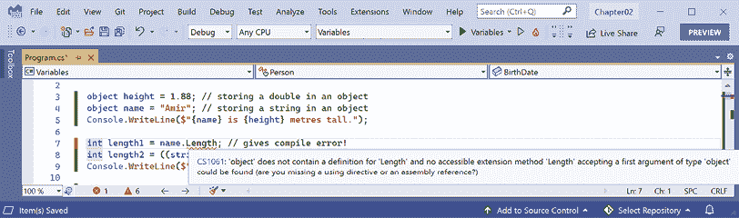

图 2.8：`object` 类型没有 `Length` 属性

1.  在无法编译的语句开头添加双斜杠来注释掉该语句，使其失效。

1.  再次运行代码，并注意编译器可以访问 `string` 的 `length` 属性，前提是程序员明确告诉编译器 `object` 变量包含一个 `string`，通过在 `name` 变量前加上类型转换表达式如 `(string)name`。结果可以成功写入控制台，如下所示：

    ```cs
    Amir is 1.88 meters tall.
    Amir has 4 characters. 
    ```

你将在 *第三章*，*控制流程、类型转换和异常处理* 中学习关于类型转换表达式的内容。

`object` 类型自 C# 的第一个版本以来就可用，但 C# 2 及以后的版本有一个更好的替代品，称为 **泛型**，我们将在 *第六章*，*实现接口和继承类* 中介绍。这将为我们提供所需的灵活性，但不会带来性能开销。

**良好实践**：避免将变量声明为 `System.Object`，即 `object` 类型。通常有更好的替代方案可以使用，比如泛型。

## 存储动态类型

还有一个名为 `dynamic` 的特殊类型，也可以存储任何类型的数据，但比 `object` 更灵活，其灵活性是以性能为代价的。`dynamic` 关键字是在 C# 4 中引入的。然而，与 `object` 不同，存储在变量中的值可以调用其成员，而无需显式转换。让我们使用一个 `dynamic` 类型：

1.  添加语句来声明一个 `dynamic` 变量。分配一个 `string` 文字值，然后是一个整数值，然后是一个整数值数组。最后，添加一个语句来输出 `dynamic` 变量的长度，如下所示：

    ```cs
    dynamic something;
    // Storing an array of int values in a dynamic object.
    // An array of any type has a Length property.
    something = new[] { 3, 5, 7 };
    // Storing an int in a dynamic object.
    // int does not have a Length property.
    something = 12;
    // Storing a string in a dynamic object.
    // string has a Length property.
    something = "Ahmed";
    // This compiles but might throw an exception at run-time.
    Console.WriteLine($"The length of something is {something.Length}");
    // Output the type of the something variable.
    Console.WriteLine($"something is a {something.GetType()}"); 
    ```

你将在 *第三章*，*控制流程、类型转换和异常处理* 中学习关于数组的内容。

1.  运行代码并注意它之所以能正常工作，是因为最后分配给 `something` 的值是一个具有 `Length` 属性的 `string` 值，如下所示：

    ```cs
    The length of something is 5
    something is a System.String 
    ```

1.  通过在语句前加上两个斜杠 `//` 来注释掉将 `string` 值赋给 `something` 变量的语句。

1.  运行代码并注意运行时错误，因为分配给 `something` 的最后一个值是一个没有 `Length` 属性的 `int`，如下所示：

    ```cs
    Unhandled exception. Microsoft.CSharp.RuntimeBinder.RuntimeBinderException: 'int' does not contain a definition for 'Length' 
    ```

1.  注释掉将 `int` 赋给 `something` 变量的语句。

1.  运行代码并注意输出，因为包含三个 `int` 值的数组确实有一个 `Length` 属性，如下面的输出所示：

    ```cs
    The length of something is 3
    something is a System.Int32[] 
    ```

`dynamic` 的一个限制是代码编辑器无法显示 IntelliSense 来帮助你编写代码。这是因为编译器在构建时无法检查类型。相反，**CLR (公共语言运行时)** 在运行时检查成员，如果成员缺失则抛出异常。

异常是表示在运行时出现错误的一种方式。你将在第三章，*控制流程、转换类型和处理异常*中了解更多关于它们以及如何处理它们的信息。

动态类型在与非 .NET 系统交互时最有用。例如，你可能需要与用 F#、Python 或某些 JavaScript 编写的类库一起工作。你也可能需要与像 **组件对象模型** (**COM**) 这样的技术进行交互，例如在自动化 Excel 或 Word 时。

## 声明局部变量

局部变量是在方法内部声明的，并且它们只在该方法的执行期间存在。一旦方法返回，分配给任何局部变量的内存就会被释放。

严格来说，值类型在释放时会被释放，而引用类型必须等待垃圾回收。你将在第六章，*实现接口和继承类*中学习值类型和引用类型之间的区别以及如何确保在释放非托管资源时只需要一次垃圾回收而不是两次。

### 指定局部变量的类型

让我们探索使用特定类型声明的局部变量和使用类型推断的情况。

使用特定类型声明并分配值给一些局部变量的类型语句，如下面的代码所示：

```cs
int population = 67_000_000; // 67 million in UK.
double weight = 1.88; // in kilograms.
decimal price = 4.99M; // in pounds sterling.
string fruit = "Apples"; // string values use double-quotes.
char letter = 'Z'; // char values use single-quotes.
bool happy = true; // Booleans can only be true or false. 
```

根据你的代码编辑器和配色方案，它将在每个变量名下方显示绿色波浪线，并淡化它们的文本颜色以警告你该变量已被分配但其值从未被使用。

### 推断局部变量的类型

你可以使用 `var` 关键字从 C# 3 及以后的版本声明局部变量。编译器将从赋值运算符 `=` 后分配的值推断类型。这发生在编译时，因此使用 `var` 对运行时性能没有影响。

没有小数点的文字数字被推断为 `int` 变量，即除非你添加了后缀，如下面的列表中所述：

+   `L`: 编译器推断为 `long`

+   `UL`: 编译器推断为 `ulong`

+   `M`: 编译器推断为 `decimal`

+   `D`: 编译器推断为 `double`

+   `F`: 编译器推断为 `float`

带有小数点的文字数字被推断为 `double` 类型，除非你添加了 `M` 后缀（在这种情况下编译器推断为 `decimal` 变量），或者 `F` 后缀，在这种情况下它推断为 `float` 变量。

双引号表示 `string` 变量，单引号表示 `char` 变量，而 `true` 和 `false` 值推断为 `bool` 类型：

1.  将前面的语句修改为使用 `var`，如下面的代码所示：

    ```cs
    var population = 67_000_000; // 67 million in UK.
    var weight = 1.88; // in kilograms.
    var price = 4.99M; // in pounds sterling.
    var fruit = "Apples"; // string values use double-quotes.
    var letter = 'Z'; // char values use single-quotes.
    var happy = true; // Booleans can only be true or false. 
    ```

1.  将鼠标悬停在每个 `var` 关键字上，并注意你的代码编辑器会显示一个包含推断出的类型信息的工具提示。

1.  在 `Program.cs` 的顶部，导入用于处理 XML 的命名空间，以便我们能够使用该命名空间中的类型声明一些变量，如下面的代码所示：

    ```cs
    using System.Xml; // To use XmlDocument. 
    ```

1.  在 `Program.cs` 的底部，添加创建一些新对象的语句，如下面的代码所示：

    ```cs
    // Good use of var because it avoids the repeated type
    // as shown in the more verbose second statement.
    var xml1 = new XmlDocument(); // Works with C# 3 and later.
    XmlDocument xml2 = new XmlDocument(); // Works with all C# versions.
    // Bad use of var because we cannot tell the type, so we
    // should use a specific type declaration as shown in
    // the second statement.
    var file1 = File.CreateText("something1.txt");
    StreamWriter file2 = File.CreateText("something2.txt"); 
    ```

**良好实践**：虽然使用 `var` 很方便，但一些开发者为了避免使代码读者更难理解正在使用的类型，会避免使用它。我个人只在类型明显时才使用它。例如，在先前的代码语句中，第一条语句在说明 `xml` 变量的类型方面与第二条语句一样清晰，但更简洁。然而，第三条语句在显示 `file` 变量的类型方面并不清晰，所以第四条更好，因为它显示了类型是 `StreamWriter`。如果有疑问，就明确写出！

注意，当你构建项目时，编译器会将 `var` 转换为实际类型。使用 `var` 声明的变量具有特定、已知、固定的数据类型。这与 `dynamic` 不同，编译器不会改变它。它保持为 `System.Dynamic` 类型，可以引用任何数据类型的任何对象。实际类型仅在运行时检查，因此，如果你访问它不存在成员时可能会抛出异常。

您可以使用 Visual Studio 的重构功能自动将 `var` 的使用转换为特定类型，具体请参阅以下链接：[`learn.microsoft.com/en-us/visualstudio/ide/reference/convert-var-to-explicit-type`](https://learn.microsoft.com/en-us/visualstudio/ide/reference/convert-var-to-explicit-type)。

### `new` 是做什么的？

在本节之前，已经有一些使用 C# `new` 关键字的例子，但到目前为止，我还没有明确解释它做什么。C# 的 `new` 关键字用于分配和/或初始化内存。要了解何时需要使用 `new`，你需要对类型了解更多。

值类型和引用类型及其与内存的关系在 *第六章，实现接口和继承类* 中有更详细的解释，所以现在我只介绍最基本的内容。

类型分为两类：**值类型**和**引用类型**。

值类型很简单，不需要使用 `new` 关键字来显式分配内存。但值类型可以使用 `new` 关键字来初始化它们的值。这在无法使用字面量设置值时很有用。

引用类型更复杂，需要使用 `new` 关键字来显式分配内存。同时，它们可以使用 `new` 关键字来初始化它们的状态。

例如，当你声明变量时，只有值类型如 `int` 和 `DateTime` 在内存中分配空间，而引用类型如 `Person` 则不会。

考虑以下声明一些局部变量的代码：

```cs
/* Value types have memory allocated on the stack automatically. */
short age; // Allocates 2 bytes of memory on the stack to store a System.Int16 value.
long population; // Allocates 8 bytes of memory on the stack to store a System.Int64 value.
DateTime birthdate; // Allocates 8 bytes of memory on the stack to store a System.DateTime value.
Point location; // Allocate 8 bytes of memory on the stack to store a System.Drawing.Point value.
/* Reference types will only have memory allocated on the heap when new is used (but they automatically have some memory allocated on the stack to store information about themselves including the memory address of where they are on the heap). */
Person bob; // Allocates memory in the stack that can point to a Person object in the heap. Initially, bob will have the value null. 
```

注意以下关于前面代码的说明：

+   `age` 的值为 `0`，并且在栈内存中已分配了 2 个字节的内存。

+   `population` 的值为 `0`，并且在栈内存中已分配了 8 个字节的内存。

+   `birthdate` 的值为 `0001-01-01`，并且在栈内存中已分配了 8 个字节的内存。

+   `location` 的值为 `0, 0`，并且在栈内存中已分配了 8 个字节的内存。

+   `bob` 的值为 `null`，并且在栈内存中已分配了 4 个字节的内存。没有为该对象分配堆内存。

现在我们来看看何时可能选择使用 `new`：

```cs
age = 45; // Initialize this variable to 45 using a literal value.
population = 68_000_000; // Initialize this variable to 68 million using a literal value.
birthdate = new(1995, 2, 23); // Initialize this variable to February 23, 1995\. C# does not support literal values for date/time values so we must use new.
location = new(10, 20); // Initialize the X and Y coordinates of this value type.
bob = new(); // Allocate memory on the heap to store a Person. Any state will have default values. bob is no longer null.
bob = new("Bob", "Smith", 45); // Allocate memory on the heap to store a Person and initialize state. bob is no longer null.
// Older syntax with explicit types
birthdate = new DateTime(1995, 2, 23); // Initialize this variable to February 23, 1995.
location = new Point(10, 20); // Initialize the X and Y coordinates of this value type.
bob = new Person(); // Allocate memory on the heap to store a Person. bob is no longer null.
bob = new Person("Bob", "Smith", 45); // Allocate memory on the heap to store a Person and initialize state. bob is no longer null. 
```

注意以下关于前面代码的说明：

+   `age`、`population`、`birthdate` 和 `location` 已经在栈上为它们分配了内存。如果我们想要它们的值与默认值不同，我们只需要使用 `new` 来初始化它们的值。

+   `bob` 必须使用 `new` 来为对象分配堆内存。`=` 赋值操作将分配的内存地址存储在栈上。引用类型如 `Person` 通常有多个构造函数，它们通过 `new` 被调用。默认构造函数将默认值分配给对象中的任何状态。带有参数的构造函数可以将其他值分配给对象中的任何状态。

构造函数在 *第五章，使用面向对象编程构建自己的类型* 中有更详细的介绍，所以我现在只介绍了最基本的概念。

### 使用目标类型 `new` 实例化对象

使用 C# 9，Microsoft 引入了一种新的实例化对象的语法，称为 **目标类型 `new`**。在实例化对象时，你可以首先指定类型，然后使用 `new` 而不必重复类型，如下面的代码所示：

```cs
XmlDocument xml3 = new(); // Target-typed new in C# 9 or later. 
```

如果你有一个需要设置字段或属性的类型，那么类型可以被推断，如下面的代码所示：

```cs
// In Program.cs.
Person kim = new();
kim.BirthDate = new(1967, 12, 26); // i.e. new DateTime(1967, 12, 26)
// In a separate Person.cs file or at the bottom of Program.cs.
class Person
{
  public DateTime BirthDate;
} 
```

这种实例化对象的方式在数组集合中特别有用，因为它们有多个对象，通常是同一类型，如下面的代码所示：

```cs
List<Person> people = new() // Instead of: new List<Person>()
{
  new() { FirstName = "Alice" }, // Instead of: new Person() { ... }
  new() { FirstName = "Bob" },
  new() { FirstName = "Charlie" }
}; 
```

你将在 *第三章*，*控制流程、转换类型和处理异常* 中学习数组，以及在 *第八章*，*使用常见的 .NET 类型* 中学习集合。

**良好实践**：使用目标类型的新实例化对象，因为它需要的字符更少；当从左到右阅读一个语句，就像英语一样，你立即就知道变量的类型，而且它不仅限于像 `var` 这样的局部变量，在我看来，不使用目标类型的新实例化的唯一原因是你必须使用版本 9 之前的 C# 编译器。我承认我的观点并不被整个 C# 社区接受。我在本书的其余部分都使用了目标类型的新实例化。如果您发现我遗漏了任何情况，请告诉我！Visual Studio 有一个重构功能，可以用来使用目标类型的新实例化，具体请参阅以下链接：[`learn.microsoft.com/en-us/visualstudio/ide/reference/use-new`](https://learn.microsoft.com/en-us/visualstudio/ide/reference/use-new)。

## 获取和设置类型的默认值

除了 `string` 之外的大多数原始类型都是 **值类型**，这意味着它们必须有一个值。你可以通过使用 `default()` 运算符并将类型作为参数传递来确定类型的默认值。你可以使用 `default` 关键字来分配类型的默认值。

`string` 类型是一个 **引用类型**。这意味着 `string` 变量包含一个值的内存地址，而不是值本身。引用类型变量可以有一个 `null` 值，这是一个表示变量尚未引用任何内容的字面量。`null` 是所有引用类型的默认值。

你将在 *第六章*，*实现接口和继承类* 中了解更多关于值类型和引用类型的内容。

让我们探索默认值：

1.  添加语句以显示 `int`、`bool`、`DateTime` 和 `string` 的默认值，如下所示代码：

    ```cs
    Console.WriteLine($"default(int) = {default(int)}");
    Console.WriteLine($"default(bool) = {default(bool)}");
    Console.WriteLine($"default(DateTime) = {
      default(DateTime)}");
    Console.WriteLine($"default(string) = {
      default(string) ?? "<NULL>"}"); 
    ```

`??` 运算符的意思是，如果为 `null`，则返回以下值。所以如果 `default(string)` 是 `null`，则返回的文本将是 `<NULL>`。

1.  运行代码并查看结果。请注意，如果你的输出日期和时间格式不同，那是因为日期和时间值是使用你电脑的当前文化格式化的，如下所示输出：

    ```cs
    default(int) = 0
    default(bool) = False
    default(DateTime) = 01/01/0001 00:00:00
    default(string) = <NULL> 
    ```

1.  添加语句以声明一个数字，分配一个值，然后将其重置为其默认值，如下所示代码：

    ```cs
    int number = 13;
    Console.WriteLine($"number set to: {number}");
    number = default;
    Console.WriteLine($"number reset to its default: {number}"); 
    ```

1.  运行代码并查看结果，如下所示输出：

    ```cs
    number set to: 13
    number reset to its default: 0 
    ```

# 探索更多关于控制台应用程序的内容

我们已经创建并使用了一些基本的控制台应用程序，但现在我们应该更深入地研究它们。

控制台应用程序是基于文本的，在命令提示符下运行。它们通常执行需要脚本的简单任务，例如编译文件或加密配置文件的一部分。

同样，它们也可以传递参数来控制其行为。

例如，可以创建一个新的控制台应用程序，使用 F# 语言并指定名称，而不是使用当前文件夹的名称，如下所示命令：

```cs
dotnet new console -lang "F#" --name "ExploringConsole" 
```

## 向用户显示输出

控制台应用程序执行的最常见的两个任务是写入和读取数据。我们已经使用了 `WriteLine` 方法来输出，但如果我们不想在行尾添加换行符，例如，如果我们稍后想在行尾继续写入更多文本，我们可以使用 `Write` 方法。

如果你想在控制台写入三个字母而不在其后添加换行符，那么请调用 `Write` 方法，如下面的代码所示：

```cs
Console.Write("A");
Console.Write("B");
Console.Write("C"); 
```

这将在单行上写入三个字符，并将光标留在行尾，如下面的输出所示：

```cs
ABC 
```

如果你想在控制台写入三个字母并在其后添加换行符，那么请调用 `WriteLine` 方法，如下面的代码所示：

```cs
Console.WriteLine("A");
Console.WriteLine("B");
Console.WriteLine("C"); 
```

这将写入三行，并将光标留在第四行：

```cs
A
B
C 
```

### 使用编号位置参数进行格式化

生成格式化字符串的一种方法是通过使用编号位置参数。

该功能由 `Write` 和 `WriteLine` 等方法支持。对于不支持该功能的方法，可以使用 `string` 参数的 `Format` 方法进行格式化。

让我们开始格式化：

1.  使用你喜欢的代码编辑器向 `Chapter02` 解决方案添加一个名为 `Formatting` 的新 **Console App** / `console` 项目。

1.  在 `Program.cs` 文件中，删除现有的语句，然后输入语句来声明一些数字变量并将它们写入控制台，如下面的代码所示：

    ```cs
    using System.Globalization; // To use CultureInfo.
    // Set current culture to US English so that all readers
    // see the same output as shown in the book.
    CultureInfo.CurrentCulture = CultureInfo.GetCultureInfo("en-US");
    int numberOfApples = 12;
    decimal pricePerApple = 0.35M;
    Console.WriteLine(
      format: "{0} apples cost {1:C}",
      arg0: numberOfApples,
      arg1: pricePerApple * numberOfApples);
    string formatted = string.Format(
      format: "{0} apples cost {1:C}",
      arg0: numberOfApples,
      arg1: pricePerApple * numberOfApples);
    //WriteToFile(formatted); // Writes the string into a file. 
    ```

    **警告！** 我们使用了 `CultureInfo` 类来强制文化设置为美国英语，以便对所有读者来说货币将是美元。在 *第四章，编写、调试和测试函数* 中，你将学习如何编写一个函数来控制文化，以便他们可以默认看到美国英语，或者覆盖它以显示你本地计算机的文化或指定的文化。

`Write`、`WriteLine` 和 `Format` 方法最多可以有三个编号参数，分别命名为 `arg0`、`arg1` 和 `arg2`。如果你需要传递超过三个值，那么你无法命名它们。`WriteToFile` 方法是一个不存在的用于说明该想法的方法。

1.  在 `Program.cs` 中，输入语句来写入三个和五个参数到控制台，如下面的代码所示：

    ```cs
    // Three parameter values can use named arguments.
    Console.WriteLine("{0} {1} lived in {2}.",
      arg0: "Roger", arg1: "Cevung", arg2: "Stockholm");
    // Four or more parameter values cannot use named arguments.
    Console.WriteLine(
      "{0} {1} lived in {2} and worked in the {3} team at {4}.",
      "Roger", "Cevung", "Stockholm", "Education", "Optimizely"); 
    ```

**良好实践**：一旦你更熟悉格式化字符串，你应该停止命名参数，例如，停止使用 `format:`, `arg0:`, 和 `arg1:`。前面的代码使用非规范化的风格来展示在学习过程中 `0` 和 `1` 的来源。

### Rider 及其关于装箱的警告

如果你使用 Rider 并且已经安装了 Unity 支持插件，那么它会对装箱问题抱怨很多。装箱发生的一个常见场景是将`int`和`DateTime`等值类型作为位置参数传递给`字符串`格式。这对于 Unity 项目来说是一个问题，因为它们使用与正常.NET 运行时不同的内存垃圾回收器。对于非 Unity 项目，如本书中的所有项目，你可以忽略这些装箱警告，因为它们不相关。你可以在以下链接中了解更多关于此 Unity 特定问题的信息：[`docs.unity3d.com/Manual/performance-garbage-collection-best-practices.html#boxing`](https://docs.unity3d.com/Manual/performance-garbage-collection-best-practices.html#boxing)。

### 使用插值字符串进行格式化

C# 6 及以后版本有一个方便的功能，称为**插值字符串**。以`$`为前缀的`字符串`可以使用大括号包围变量或表达式的名称来输出该变量或表达式在该位置在`字符串`中的当前值，如下所示：

1.  在`Program.cs`文件的底部输入一条语句，如下面的代码所示：

    ```cs
    // The following statement must be all on one line when using C# 10
    // or earlier. If using C# 11 or later, we can include a line break
    // in the middle of an expression but not in the string text.
    Console.WriteLine($"{numberOfApples} apples cost {pricePerApple
      * numberOfApples:C}"); 
    ```

1.  运行代码并查看结果，如下面的部分输出所示：

    ```cs
    12 apples cost $4.20 
    ```

简而言之，对于短且格式化的`字符串`值，插值`字符串`可能更容易阅读。但对于书中需要跨多行包裹的代码示例，这可能会变得复杂。在这本书的许多代码示例中，我将使用编号的位置参数。避免插值字符串的另一个原因是它们不能从资源文件中读取以进行本地化。

以下代码示例不打算在您的项目中输入。

在 C# 10 之前，`字符串`常量只能通过使用`+`运算符进行连接来组合，如下面的代码所示：

```cs
private const string firstname = "Omar";
private const string lastname = "Rudberg";
private const string fullname = firstname + " " + lastname; 
```

在 C# 10 中，插值字符串（以`$`为前缀）现在可以使用了，如下面的代码所示：

```cs
private const string fullname = $"{firstname} {lastname}"; 
```

这仅适用于组合`字符串`常量值。它不能与其他类型（如数字）一起使用，这需要运行时数据类型转换。你无法在顶级程序（如`Program.cs`）中输入`private const`声明。你将在*第五章*，*使用面向对象编程构建自己的类型*中看到如何使用它们。

**良好实践**：如果你正在编写的代码将成为 Unity 项目的一部分，那么插值字符串格式是一种避免装箱的简单方法。

### 理解格式字符串

变量或表达式可以使用格式字符串在逗号或冒号之后进行格式化。

`N0`格式字符串表示带有千位分隔符且没有小数位的数字，而`C`格式字符串表示货币。货币格式将由当前线程决定。

例如，如果你在英国的 PC 上运行使用数字或货币格式的代码，你会得到带有逗号作为千位分隔符的英镑，但如果你在德国的 PC 上运行它，你会得到带有点作为千位分隔符的欧元。

格式项的完整语法是：

```cs
{ index [, alignment ] [ : formatString ] } 
```

每个格式项都可以有一个对齐方式，这在输出值表时很有用，其中一些值可能需要在字符宽度内左对齐或右对齐。对齐值是整数。正整数表示右对齐，负整数表示左对齐。

例如，要输出一个水果及其数量的表格，我们可能希望将名称左对齐在 10 个字符宽的列中，并将计数格式化为没有小数位的数字，右对齐在 6 个字符宽的列中：

1.  在 `Program.cs` 的底部输入以下语句：

    ```cs
    string applesText = "Apples";
    int applesCount = 1234;
    string bananasText = "Bananas";
    int bananasCount = 56789;
    Console.WriteLine();
    Console.WriteLine(format: "{0,-10} {1,6}",
      arg0: "Name", arg1: "Count");
    Console.WriteLine(format: "{0,-10} {1,6:N0}",
      arg0: applesText, arg1: applesCount);
    Console.WriteLine(format: "{0,-10} {1,6:N0}",
      arg0: bananasText, arg1: bananasCount); 
    ```

1.  运行代码并注意对齐和数字格式的影响，如下面的输出所示：

    ```cs
    Name          Count
    Apples        1,234
    Bananas      56,789 
    ```

### 自定义数字格式

您可以使用自定义格式代码完全控制数字格式，如 *表 2.7* 所示：

| **格式代码** | **描述** |
| --- | --- |
| `0` | 零占位符。如果存在，则用相应的数字替换零；否则，使用零。例如，`0000.00` 格式化值 `123.4` 将给出 `0123.40`。 |
| `#` | 数字占位符。如果存在，则用相应的数字替换井号；否则，不使用任何内容。例如，`####.##` 格式化值 `123.4` 将给出 `123.4`。 |
| `.` | 小数点。设置数字中小数点的位置。尊重文化格式，因此在美式英语中是 `.`（点），在法语中是 `,`（逗号）。 |
| `,` | 分组分隔符。在每个组之间插入本地化的分组分隔符。例如，`0,000` 格式化值 `1234567` 将给出 `1,234,567`。还用于通过每个逗号除以 1,000 的倍数来缩放数字。例如，`0.00,,` 格式化值 `1234567` 将给出 `1.23`，因为两个逗号意味着除以 1,000 两次。 |
| `%` | 百分比占位符。将值乘以 100 并添加一个百分比符号。 |
| `\` | 转义字符。使下一个字符成为字面值而不是格式代码。例如，`\##,###\#` 格式化值 `1234` 将给出 `#1,234#`。 |
| `;` | 部分分隔符。为正数、负数和零定义不同的格式字符串。例如，`[0];(0);Zero` 格式化：`13` 将给出 `[13]`，`-13` 将给出 `(13)`，而 `0` 将给出 `Zero`。 |
| 其他 | 所有其他字符在输出中按原样显示。 |

表 2.7：自定义数字格式代码

**更多信息**：完整的自定义数字格式代码列表可以在以下链接中找到：[`learn.microsoft.com/en-us/dotnet/standard/base-types/custom-numeric-format-strings`](https://learn.microsoft.com/en-us/dotnet/standard/base-types/custom-numeric-format-strings).

您可以使用更简单的格式代码应用标准数字格式，例如 `C` 和 `N`。它们支持一个精度数字来指示您想要多少位精度。默认值为两位。最常见的一些格式代码在 *表 2.8* 中展示：

| **格式代码** | **描述** |
| --- | --- |
| `C` 或 `c` | 货币。例如，在美国文化中，`C` 格式化值 `123.4` 给出 `$123.40`，而 `C0` 格式化值 `123.4` 给出 `$123`。 |
| `N` 或 `n` | 数字。整数数字，可选带负号和分组字符。 |
| `D` 或 `d` | 小数。整数数字，可选带负号但没有分组字符。 |
| `B` 或 `b` | 二进制。例如，`B` 格式化值 `13` 给出 `1101`，而 `B8` 格式化值 `13` 给出 `00001101`。 |
| `X` 或 `x` | 十六进制。例如，`X` 格式化值 `255` 给出 `FF`，而 `X4` 格式化值 `255` 给出 `00FF`。 |
| `E` 或 `e` | 指数表示法。例如，`E` 格式化值 `1234.567` 将给出 `1.234567000E+003`，而 `E2` 格式化值 `1234.567` 将给出 `1.23E+003`。 |

表 2.8：标准数字格式代码

**更多信息**：标准数字格式代码的完整列表可以在以下链接中找到：[`learn.microsoft.com/en-us/dotnet/standard/base-types/standard-numeric-format-strings`](https://learn.microsoft.com/en-us/dotnet/standard/base-types/standard-numeric-format-strings).

你可以使用自定义格式代码完全控制日期和时间格式化，如下表 2.9 所示：

| **格式代码** | **描述** |
| --- | --- |
| `/` | 日期部分分隔符。因文化而异；例如，`en-US` 使用 `/`，而 `fr-FR` 使用 `-`（破折号）。 |
| `\` | 转义字符。如果你想在特殊格式代码中用作字面字符，则很有用；例如，`h \h m \m` 将格式化为上午 9:30，显示为 `9 h 30 m`。 |
| `:` | 时间部分分隔符。因文化而异；例如，`en-US` 使用 `:`，而 `fr-FR` 使用 `.`（点）。 |
| `d`, `dd` | 月份中的日期，从 `1` 到 `31`，或从 `01` 到 `31` 带前导零。 |
| `ddd`, `dddd` | 星期几的缩写或全称，例如，`Mon` 或 `Monday`，针对当前文化本地化。 |
| `f`, `ff`, `fff` | 十分之一秒、百分之一秒或毫秒。 |
| `g` | 时期或纪元，例如，`A.D.` |
| `h`, `hh` | 使用从 `1` 到 `12` 的 12 小时制的小时，或从 `01` 到 `12`。 |
| `H`, `HH` | 小时，使用从 `0` 到 `23` 的 24 小时制，或从 `01` 到 `23`。 |
| `K` | 时区信息。`null` 表示未指定时区，`Z` 表示 UTC，以及从 UTC 调整的本地时间，例如 `-8:00`。 |
| `m`, `mm` | 分钟，从 `0` 到 `59`，或从 `00` 到 `59` 带前导零。 |
| `M`, `MM` | 月份，从 `1` 到 `12`，或从 `01` 到 `12` 带前导零。 |
| `MMM`, `MMMM` | 月份的缩写或全称，例如，`Jan` 或 `January`，针对当前文化本地化。 |
| `s`, `ss` | 秒，从 `0` 到 `59`，或从 `00` 到 `59` 带前导零。 |
| `t`, `tt` | AM/PM 标识符的第一个或前两个字符。 |
| `y`, `yy` | 当前世纪的年份，从 `0` 到 `99`，或从 `00` 到 `99` 带前导零。 |
| `yyy` | 年份，至少三位数字，所需位数。例如，公元 1 年是 `001`。罗马城第一次被攻陷是在 `410` 年。本书第一版出版于 `2016` 年。 |
| `yyyy`, `yyyyy` | 四位或五位数的年份。 |
| `z`, `zz` | UTC 偏移的小时，无前导零，或带前导零。 |
| `zzz` | UTC 偏移的小时和分钟，带前导零，例如，`+04:30`。 |

表 2.9：日期和时间值的自定义格式代码

**更多信息**：完整的自定义格式代码列表可以在以下链接中找到：[`learn.microsoft.com/en-us/dotnet/standard/base-types/custom-date-and-time-format-strings`](https://learn.microsoft.com/en-us/dotnet/standard/base-types/custom-date-and-time-format-strings)。

您可以使用更简单的格式代码来应用标准的日期和时间格式，例如我们在代码示例中使用的 `d` 和 `D`，如下表 2.10 所示：

| **格式代码** | **描述** |
| --- | --- |
| `d` | 短日期模式。因文化而异；例如，`en-US` 使用 `M/d/yyyy`，而 `fr-FR` 使用 `dd/MM/yyyy`。 |
| `D` | 长日期模式。因文化而异；例如，`en-US` 使用 `mmmm, MMMM d, yyyy`，而 `fr-FR` 使用 `mmmm, dd MMMM yyyy`。 |
| `f` | 完整的日期/时间模式（短时间 - 小时和分钟）。因文化而异。 |
| `F` | 完整的日期/时间模式（长时间 – 小时、分钟、秒和 AM/PM）。因文化而异。 |
| `m`, `M` | 月份/日期模式。因文化而异。 |
| `o,` `O` | 标准化模式，适合序列化日期/时间值进行往返，例如，`2023-05-30T13:45:30.0000000-08:00`。 |
| `r`, `R` | RFC1123 模式。 |
| `t` | 短时间模式。因文化而异；例如，`en-US` 使用 `h:mm tt`，而 `fr-FR` 使用 `HH:mm`。 |
| `T` | 长时间模式。因文化而异；例如，`en-US` 使用 `h:mm:ss tt`，而 `fr-FR` 使用 `HH:mm:ss`。 |
| `u` | 通用可排序日期/时间模式，例如，`2009-06-15 13:45:30Z`。 |
| `U` | 通用完整日期/时间模式。因文化而异；例如，`en-US` 可能是 `Monday, June 15, 2009 8:45:30 PM`。 |

表 2.10：日期和时间值的标准格式代码

**更多信息**：完整的格式代码列表可以在以下链接中找到：[`learn.microsoft.com/en-us/dotnet/standard/base-types/standard-date-and-time-format-strings`](https://learn.microsoft.com/en-us/dotnet/standard/base-types/standard-date-and-time-format-strings)。

**警告**！注意 `"m"`（月份/日期格式的缩写，如美国的 7 月 4 日或英国的 4 July，省略年份并以文化特定方式呈现月份和日期）与 `"d m"`（自定义格式字符串，显示日期编号，然后是月份编号，中间有空格，如任何国家的 4 7 表示 7 月 4 日）之间的区别。

让我们看看如何使用多种格式输出值：

1.  输入语句以输出两次`十进制`值，首先使用当前文化作为货币，然后作为百分比，如下面的代码所示：

    ```cs
    decimal value = 0.325M;
    WriteLine("Currency: {0:C}, Percentage: {0:0.0%}", value); 
    ```

1.  运行代码并注意结果，如下面的输出所示：

    ```cs
    Currency: $0.33, Percentage: 32.5% 
    ```

## 从用户获取文本输入

我们可以使用`ReadLine`方法从用户获取文本输入。此方法等待用户输入一些文本。然后，当用户按下*Enter*时，用户输入的内容将作为`string`值返回。

让我们获取用户的输入：

1.  输入语句以询问用户他们的姓名和年龄，然后输出他们输入的内容，如下面的代码所示：

    ```cs
    Console.Write("Type your first name and press ENTER: ");
    string firstName = Console.ReadLine();
    Console.Write("Type your age and press ENTER: ");
    string age = Console.ReadLine();
    Console.WriteLine($"Hello {firstName}, you look good for {age}."); 
    ```

默认情况下，在.NET 6 及更高版本中，启用空值检查，因此 C#编译器会给出两个警告，因为`ReadLine`方法可能会返回一个`null`值而不是`string`值。但实际上，这种方法返回`null`的场景并不实用，所以我们将在这个场景中了解如何关闭这些特定的警告。

1.  对于`firstName`变量，在`string`后面添加一个`?`，如下面的代码所示：

    ```cs
    string? firstName = Console.ReadLine(); 
    ```

    这告诉编译器我们期望一个可能的`null`值，因此它不需要警告我们。如果变量是`null`，那么当它稍后通过`WriteLine`输出时，它将只是一个空白，所以在这种情况下是可行的。如果我们打算访问`firstName`变量的任何成员，那么我们就需要处理它可能是`null`的情况。

1.  对于`age`变量，在语句末尾的分号前添加一个`!`，如下面的代码所示：

    ```cs
    string age = Console.ReadLine()!; 
    ```

这被称为**null-forgiving operator**，因为它告诉编译器在这种情况下`ReadLine`不会返回`null`，因此它可以停止显示警告。现在，我们负责确保这一点。幸运的是，`Console`类型的`ReadLine`实现总是返回一个`string`，即使它只是一个空的`string`值。

1.  运行代码，然后输入一个姓名和年龄，如下面的输出所示：

    ```cs
    Type your name and press ENTER: Gary
    Type your age and press ENTER: 34
    Hello Gary, you look good for 34. 
    ```

您现在已经看到了处理编译器空值警告的两种常见方法。我们将在*第六章*，*实现接口和继承类*中更详细地介绍空值和如何处理它。

### `ReadLine`何时返回`null`？

`ReadLine`方法从标准输入流中读取下一行输入。如果用户按下*Enter*而没有输入任何内容，`ReadLine`将返回一个空字符串，而不是`null`。

在典型的控制台应用程序中，`ReadLine`仅在达到**流末尾**（**EOF**）时返回`null`。这通常不是在标准控制台环境中通过用户输入实现的，因为 EOF 通常由控制台关闭或重定向输入被完全消耗来表示。

在以下代码的上下文中：

```cs
string? name = ReadLine(); // Prompt user to enter their name. 
```

这里是`name`可能为`null`的条件：

+   如果标准输入流被重定向并达到 EOF

+   如果您在一个可以模拟 EOF 的环境中进行测试，例如某些开发环境或自动化测试设置

然而，在正常用户输入条件下，`ReadLine` 方法“永远不会”返回 `null`。

## 简化控制台的使用

在 C# 6 及更高版本中，`using` 语句不仅可以用于导入命名空间，还可以通过导入静态类进一步简化我们的代码。然后，我们就不需要在代码中输入 `Console` 类型名称。

### 为单个文件导入静态类型

您可以使用代码编辑器的 **查找和替换** 功能来删除我们之前写过的 `Console`：

1.  在 `Program.cs` 文件顶部添加一个语句以 **静态导入** `System.Console` 类，如下面的代码所示：

    ```cs
    using static System.Console; 
    ```

1.  在您的代码中选择第一个 `Console.`，确保您也选择了 `Console` 单词后面的点。

1.  在 Visual Studio 中，导航到 **编辑** | **查找和替换** | **快速替换**；在 VS Code 中，导航到 **编辑** | **替换**；或者在 Rider 中，导航到 **编辑** | **查找** | **替换**，并注意会出现一个覆盖对话框，供您输入要替换 `Console.` 的内容，如图 2.9 所示：

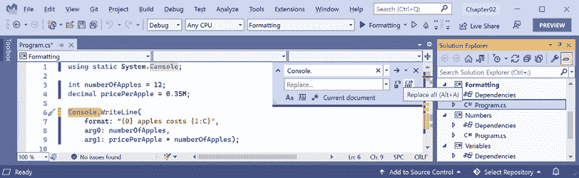

图 2.9：使用 Visual Studio 中的替换功能简化代码

1.  保持 **替换** 框为空，点击 **替换所有** 按钮（位于 **替换** 框右侧的两个按钮中的第二个），然后通过点击右上角的叉号关闭 **替换** 框。

1.  运行控制台应用程序并注意行为与之前相同。

### 为项目中的所有代码文件导入静态类型

而不是只为单个代码文件静态导入 `Console` 类，可能更好的做法是为项目中的所有代码文件全局导入：

1.  删除静态导入 `System.Console` 的语句。

1.  打开 `Formatting.csproj` 文件，在 `<PropertyGroup>` 部分之后，添加一个新的 `<ItemGroup>` 部分以全局和静态地导入 `System.Console`，使用隐式的 .NET SDK 功能，如下面的标记所示：

    ```cs
    <ItemGroup Label="Simplify console app">
      <Using Include="System.Console" Static="true" />
    </ItemGroup> 
    ```

**良好实践**：在 .NET 项目中的 `<ItemGroup>` 内部的 `Label` 属性是可选的但非常有用，主要原因围绕组织、定制和构建过程中的清晰度。当使用多个 `<ItemGroup>` 部分时，标签提供了对每个组包含内容的明确指示。使用标签，您可以根据构建配置或其他条件有条件地包含或排除某些项目。在这种情况下，我们只是用它来编写文档。

1.  运行控制台应用程序并注意行为与之前相同。

**良好实践**：将来，对于您为本书创建的所有控制台应用程序项目，添加上述部分以简化所有 C# 文件中与 `Console` 类一起工作所需编写的代码。

## 从用户获取键输入

我们可以使用`ReadKey`方法从用户那里获取键输入。此方法等待用户按下键或键组合，然后将其作为`ConsoleKeyInfo`值返回。

让我们来探索如何读取按键：

1.  输入语句以提示用户按下任何键组合，然后输出有关该组合的信息，如下面的代码所示：

    ```cs
    Write("Press any key combination: ");
    ConsoleKeyInfo key = ReadKey();
    WriteLine();
    WriteLine("Key: {0}, Char: {1}, Modifiers: {2}",
      arg0: key.Key, arg1: key.KeyChar, arg2: key.Modifiers); 
    ```

1.  运行代码，按下*K*键，注意结果，如下面的输出所示：

    ```cs
    Press any key combination: k
    Key: K, Char: k, Modifiers: 0 
    ```

1.  运行代码，按住*Shift*键并按下*K*键，注意结果，如下面的输出所示：

    ```cs
    Press any key combination: K
    Key: K, Char: K, Modifiers: Shift 
    ```

1.  运行代码，按下*F12*键，注意结果，如下面的输出所示：

    ```cs
    Press any key combination:
    Key: F12, Char: , Modifiers: 0 
    ```

**警告！** 当在 VS Code 中的终端内运行控制台应用程序时，一些键盘组合会在它们被你的控制台应用程序处理之前被代码编辑器捕获。例如，在 VS Code 中*Ctrl* + *Shift* + *X*组合会激活侧边栏中的**扩展**视图。要完全测试此控制台应用程序，请在项目文件夹中打开命令提示符或终端，并从那里运行控制台应用程序。

## 将参数传递给控制台应用程序

当你运行控制台应用程序时，你通常希望通过传递参数来改变其行为。例如，使用`dotnet`命令行工具，你可以传递新项目模板的名称，如下面的命令所示：

```cs
dotnet new console
dotnet new mvc 
```

你可能想知道如何获取传递给控制台应用程序的任何参数。

在.NET 6 之前的每个版本中，控制台应用程序项目模板都使其非常明显，如下面的代码所示：

```cs
using System;
namespace Arguments
{
  class Program
  {
    static void Main(string[] args)
    {
      Console.WriteLine("Hello World!");
    }
  }
} 
```

`string[] args`参数在`Program`类的`Main`方法中声明并传递。它们是一个用于将参数传递到控制台应用程序的数组。但在顶级程序中，如.NET 6 及以后的.NET 控制台应用程序项目模板所使用的，`Program`类及其`Main`方法以及`args`数组的声明都是隐藏的。诀窍是您必须知道它仍然存在。

命令行参数由空格分隔。其他字符，如连字符和冒号，被视为参数值的一部分。

要在参数值中包含空格，请将参数值用单引号或双引号括起来。

假设我们希望在命令行中输入一些颜色的名称，用于前景和背景，以及终端窗口的尺寸。我们可以通过从`args`数组中读取它们来读取颜色和数字，该数组总是传递给`Main`方法，也就是控制台应用程序的入口点：

1.  使用您首选的代码编辑器，向`Chapter02`解决方案中添加一个名为`Arguments`的新**Console App** / `console`项目。

1.  打开`Arguments.csproj`，在`<PropertyGroup>`部分之后，添加一个新的`<ItemGroup>`部分，使用.NET SDK 的隐式使用功能静态导入所有 C#文件中的`System.Console`，如下面的标记所示：

    ```cs
    <ItemGroup>
      <Using Include="System.Console" Static="true" />
    </ItemGroup> 
    ```

**良好实践**：请记住使用隐式使用 .NET SDK 功能，在所有未来的控制台应用程序项目中静态导入 `System.Console` 类型，以简化你的代码，因为这些说明不会每次都重复。

1.  在 `Program.cs` 文件中，删除现有的语句，然后添加一个语句来输出传递给应用程序的参数数量，如下面的代码所示：

    ```cs
    WriteLine($"There are {args.Length} arguments."); 
    ```

1.  运行控制台应用程序并查看结果，如下面的输出所示：

    ```cs
    There are 0 arguments. 
    ```

如果你正在使用 Visual Studio：

1.  导航到 **项目** | **参数** **属性**。

1.  选择 **调试** 选项卡，点击 **打开调试启动配置文件 UI**，在 **命令行参数** 框中，输入以下参数：`firstarg second-arg third:arg "fourth arg"`，如图 *2.10* 所示：

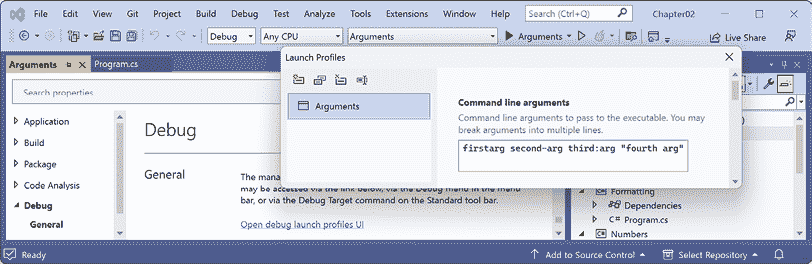

图 2.10：在 Visual Studio 项目属性中输入命令行参数

1.  关闭 **启动配置文件** 窗口。

1.  在 **解决方案资源管理器** 中，在 `Properties` 文件夹中，打开 `launchSettings.json` 文件并注意它定义了当你运行项目时的命令行参数，如图中高亮显示的以下配置所示：

    ```cs
    {
      "profiles": {
        "Arguments": {
          "commandName": "Project",
          **"commandLineArgs"****:** **"firstarg second-arg third:arg \"fourth arg\""**
        }
      }
    } 
    ```

`launchSettings.json` 文件也可以被 Rider 使用。VS Code 的等效文件是 `.vscode/launch.json` 文件。

1.  运行控制台应用程序项目。

如果你正在使用 VS Code，那么在 **终端** 中，在 `dotnet run` 命令之后输入一些参数，如下面的命令所示：

```cs
dotnet run firstarg second-arg third:arg "fourth arg" 
```

对于所有代码编辑器：

1.  注意到结果指示有四个参数，如下面的输出所示：

    ```cs
    There are 4 arguments. 
    ```

1.  在 `Program.cs` 中，为了枚举或迭代（即，遍历）这四个参数的值，在输出数组长度之后添加以下语句：

    ```cs
    foreach (string arg in args)
    {
      WriteLine(arg);
    } 
    ```

1.  再次运行代码并注意结果显示了四个参数的详细信息，如下面的输出所示：

    ```cs
    There are 4 arguments.
    firstarg
    second-arg
    third:arg
    fourth arg 
    ```

## 使用参数设置选项

我们现在将使用这些参数来允许用户选择输出窗口的背景、前景和光标大小。光标大小可以是 1 到 100 的整数，其中 1 表示光标单元格底部的线条，100 表示光标单元格高度的百分比。

我们已经静态导入了 `System.Console` 类。它具有 `ForegroundColor`、`BackgroundColor` 和 `CursorSize` 等属性，我们现在可以通过使用它们的名称来设置，而不需要用 `Console` 前缀。

`System` 命名空间已经导入，以便编译器了解 `ConsoleColor` 和 `Enum` 类型：

+   添加语句以警告用户如果没有输入三个参数，然后解析这些参数并使用它们来设置控制台窗口的颜色和尺寸，如下面的代码所示：

    ```cs
    if (args.Length < 3)
    {
      WriteLine("You must specify two colors and cursor size, e.g.");
      WriteLine("dotnet run red yellow 50");
      return; // Stop running.
    }
    ForegroundColor = (ConsoleColor)Enum.Parse(
      enumType: typeof(ConsoleColor),
      value: args[0], ignoreCase: true);
    BackgroundColor = (ConsoleColor)Enum.Parse(
      enumType: typeof(ConsoleColor),
      value: args[1], ignoreCase: true);
    CursorSize = int.Parse(args[2]); 
    ```

注意到编译器警告，设置 `CursorSize` 只在 Windows 上受支持。目前，不要担心大多数此代码，如 `(ConsoleColor)`、`Enum.Parse` 或 `typeof`，因为所有这些将在接下来的几章中解释。

+   如果你使用 Visual Studio，将参数更改为`red yellow 50`。运行控制台应用程序并注意光标大小减半，窗口中的颜色已更改，如*图 2.11*所示：

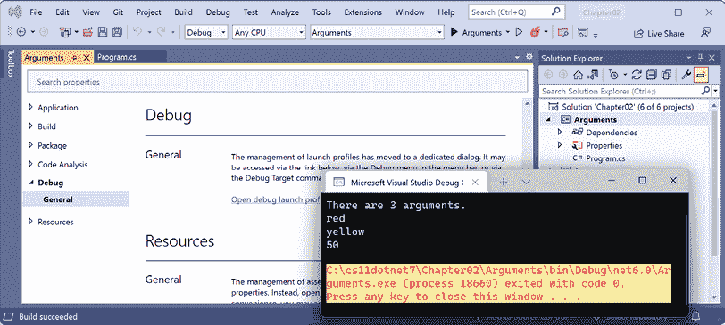

图 2.11：在 Windows 上设置颜色和光标大小

+   如果你使用 VS Code，则使用以下命令运行代码，将前景色设置为红色，背景色设置为黄色，光标大小设置为 50%：

    ```cs
    dotnet run red yellow 50 
    ```

在 macOS 或 Linux 上，你会看到一个未处理的异常，如*图 2.12*所示：

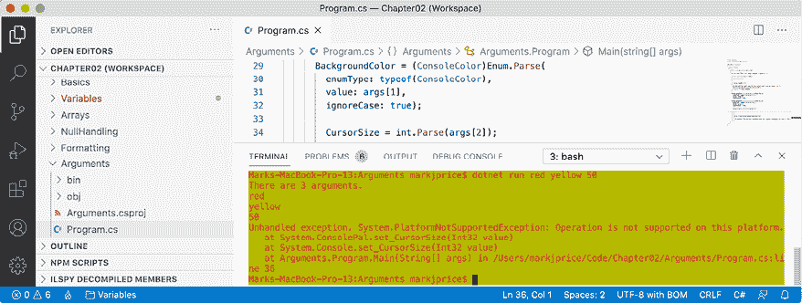

图 2.12：在不受支持的 macOS 上未处理的异常

尽管编译器没有给出错误或警告，但在运行时，某些 API 调用可能在某些平台上失败。尽管在 Windows 上运行的控制台应用程序可以更改其光标大小，但在 macOS 上则不行，如果尝试这样做，它会报错。

## 处理不支持 API 的平台

那我们如何解决这个问题呢？我们可以通过使用异常处理程序来解决。你将在*第三章*，*控制流程、转换类型和处理异常*中了解更多关于`try`-`catch`语句的详细信息，所以现在只需输入代码：

1.  修改代码，将改变光标大小的行包裹在`try`语句中，如下所示：

    ```cs
    try
    {
      CursorSize = int.Parse(args[2]);
    }
    catch (PlatformNotSupportedException)
    {
      WriteLine("The current platform does not support changing the size of the cursor.");
    } 
    ```

1.  如果你在 macOS 上运行此代码，你会看到异常被捕获，并向用户显示一个更友好的消息。

处理操作系统差异的另一种方法是使用`System`命名空间中的`OperatingSystem`类，如下所示：

```cs
if (OperatingSystem.IsWindowsVersionAtLeast(major: 10))
{
  // Execute code that only works on Windows 10 or later.
}
else if (OperatingSystem.IsWindows())
{
  // Execute code that only works earlier versions of Windows.
}
else if (OperatingSystem.IsIOSVersionAtLeast(major: 14, minor: 5))
{
  // Execute code that only works on iOS 14.5 or later.
}
else if (OperatingSystem.IsBrowser())
{
  // Execute code that only works in the browser with Blazor.
} 
```

`OperatingSystem`类为其他常见操作系统提供了等效方法，如 Android、iOS、Linux、macOS，甚至浏览器，这对于 Blazor Web 组件非常有用。

处理不同平台的第三种方法是使用条件编译语句。

有四个预处理器指令控制条件编译：`#if`、`#elif`、`#else`和`#endif`。

你可以使用`#define`定义符号，如下所示：

```cs
#define MYSYMBOL 
```

已经为你自动定义了许多符号，如下所示*表 2.11*：

| **目标框架** | **符号** |
| --- | --- |
| .NET 标准 | `NETSTANDARD2_0`, `NETSTANDARD2_1`等 |
| 现代 NET | `NET7_0`, `NET7_0_ANDROID`, `NET7_0_IOS`, `NET7_0_WINDOWS`等 |

表 2.11：预定义编译器符号

你可以编写仅针对指定平台编译的语句，如下所示：

```cs
#if NET7_0_ANDROID
// Compile statements that only work on Android.
#elif NET7_0_IOS
// Compile statements that only work on iOS.
#else
// Compile statements that work everywhere else.
#endif 
```

# 练习和探索

通过回答一些问题、进行一些实际操作，以及更深入地研究本章涵盖的主题来测试你的知识和理解。

## 练习 2.1 – 在线材料

在线材料可以是为我这本书编写的额外内容，也可以是引用由 Microsoft 或第三方创建的内容。

### 理解 async 和 await

C# 5 在处理`Task`类型时引入了两个 C#关键字，使得多线程变得容易。你可以在以下链接中阅读有关内容并查看代码示例：

[`github.com/markjprice/cs13net9/blob/main/docs/ch02-async-await.md`](https://github.com/markjprice/cs13net9/blob/main/docs/ch02-async-await.md)

### 探索 Spectre

不，不是来自詹姆斯·邦德电影的邪恶组织！**Spectre**是一个增强控制台应用程序的包。你可以在以下链接中了解它：`https://spectreconsole.net/`。

## 练习 2.2 – 练习

练习题深入探讨了本章的主题。

### 探索数字的大小和范围

在`Chapter02`解决方案中，创建一个名为`Exercise_Numbers`的控制台应用程序项目，该程序输出以下数字类型在内存中使用的字节数以及它们可以有的最小和最大值：`sbyte`、`byte`、`short`、`ushort`、`int`、`uint`、`long`、`ulong`、`Int128`、`UInt128`、`Half`、`float`、`double`和`decimal`。

运行你的控制台应用程序的结果应该类似于*图 2.13*：

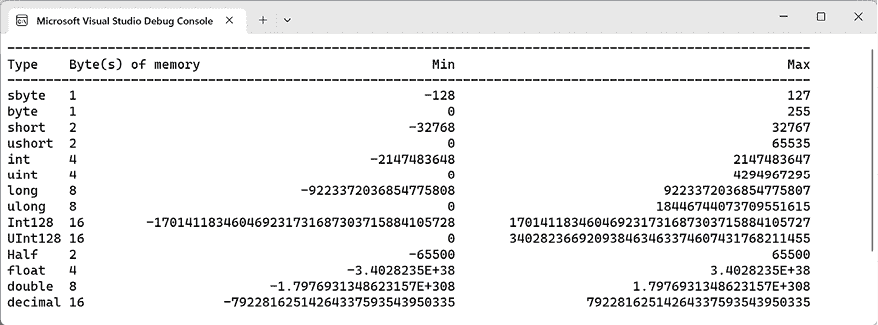

图 2.13：输出数字类型大小的结果

所有练习的代码解决方案都可以从以下链接的 GitHub 仓库下载或克隆：[`github.com/markjprice/cs13net9/tree/main/code`](https://github.com/markjprice/cs13net9/tree/main/code)。

## 练习 2.3 – 测试你的知识

为了得到一些问题的最佳答案，你需要自己进行研究。我希望你“跳出书本的思维”，所以我故意没有在书中提供所有答案。

我希望鼓励你养成寻找其他帮助的好习惯，遵循“授人以鱼不如授人以渔”的原则。

1.  你可以在 C#文件中输入什么语句来发现编译器和语言版本？

1.  C#中有哪两种类型的注释？

1.  什么是字面字符串和插值字符串的区别？

1.  为什么在使用`float`和`double`值时要小心？

1.  你如何确定像`double`这样的类型在内存中占用多少字节？

1.  何时应该使用`var`关键字？

1.  创建像`XmlDocument`这样的类的实例的最新语法是什么？

1.  为什么在使用`dynamic`类型时要小心？

1.  你如何右对齐格式字符串？

1.  哪个字符分隔控制台应用程序的参数？

*附录*，*测试你的知识问题的答案*，可以从 GitHub 仓库中的 README 链接下载：[`github.com/markjprice/cs13net9`](https://github.com/markjprice/cs13net9)。

## 测试你对数字类型的知识

你会选择哪种类型来表示以下“数字”？

+   人的电话号码

+   人的身高

+   人的年龄

+   人的薪水

+   一本书的 ISBN

+   一本书的价格

+   一本书的运输重量

+   一个国家的人口

+   宇宙中的星星数量

+   英国每个小型或中型企业的员工人数（每个企业最多约 50,000 名员工）

## 练习 2.4 – 探索主题

使用下一页上的链接了解本章涵盖主题的更多详细信息：

[`github.com/markjprice/cs13net9/blob/main/docs/book-links.md#chapter-2---speaking-c`](https://github.com/markjprice/cs13net9/blob/main/docs/book-links.md#chapter-2---speaking-c)

# 摘要

在本章中，你学习了如何：

+   声明具有指定或推断类型的变量。

+   使用一些内置的数字、文本和布尔类型。

+   选择数字类型。

+   在控制台应用程序中控制输出格式。

在下一章中，你将学习关于运算符、分支、循环、类型转换以及如何处理异常。
