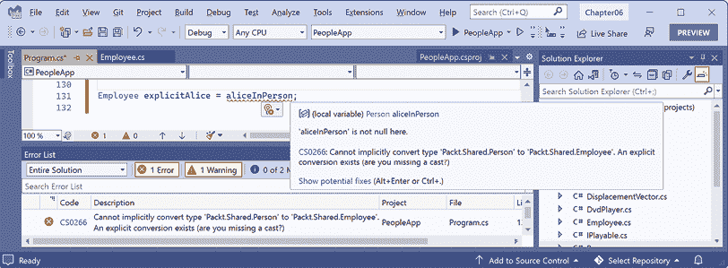

# 第六章：实现接口和继承类

本章介绍如何使用面向对象编程（**OOP**）从现有类型派生出新类型。您将学习如何使用运算符作为实现简单功能的一种替代方法，以及如何使用泛型使代码更安全、性能更高。您将了解委托和事件在类型之间交换消息。您将实现接口以实现常见功能。您将创建一个派生类从基类继承功能，重写继承的类型成员，并使用多态。最后，您将学习如何创建扩展方法和在继承层次结构中类之间的转换。

在仅在线部分，您将看到引用类型和值类型之间的区别以及它们如何在内存中存储。您将在本章末尾找到在线材料的链接。

本章涵盖以下主题：

+   设置类库和控制台应用程序

+   静态方法和运算符重载

+   使用泛型安全地使类型可重用

+   抛出和处理事件

+   实现接口

+   处理 `null` 值

+   从类继承

+   在继承层次结构中进行转换

+   继承和扩展 .NET 类型

+   总结自定义类型选择

# 设置类库和控制台应用程序

我们将首先定义一个包含两个项目的解决方案，就像在 *第五章*，*使用面向对象编程构建自己的类型* 中创建的那样。即使您完成了该章节的所有练习，也请遵循以下说明，以便您以全新的工作项目开始本章：

1.  使用您首选的代码编辑器创建一个新项目，如下面的列表所示：

    +   项目模板：**类库** / `classlib`

    +   项目文件和文件夹：`PacktLibrary`

    +   解决方案文件和文件夹：`Chapter06`

    +   框架：.NET 9.0（标准支持期）

1.  添加一个新项目，如下面的列表所示：

    +   项目模板：**控制台应用程序** / `console`

    +   项目文件和文件夹：`PeopleApp`

    +   解决方案文件和文件夹：`Chapter06`

    +   框架：.NET 9.0（标准支持期）

    +   不要使用顶级语句：已清除

    +   启用原生 AOT 发布：已清除

在本章中，两个项目都针对 .NET 9，因此默认使用 C# 13 编译器。

1.  在 `PacktLibrary` 项目中，将名为 `Class1.cs` 的文件重命名为 `Person.cs`。

1.  在两个项目中，添加 `<ItemGroup>` 以全局和静态导入 `System.Console` 类，如下面的标记所示：

    ```cs
    <ItemGroup>
      <Using Include="System.Console" Static="true" />
    </ItemGroup> 
    ```

1.  在 `Person.cs` 中，删除任何现有的语句并定义一个 `Person` 类，如下面的代码所示：

    ```cs
    namespace Packt.Shared;
    public class Person
    {
      #region Properties
      public string? Name { get; set; }
      public DateTimeOffset Born { get; set; }
      public List<Person> Children { get; set; } = new();
      #endregion
      #region Methods
      public void WriteToConsole()
      {
        WriteLine($"{Name} was born on a {Born:dddd}.");
      }
      public void WriteChildrenToConsole()
      {
        string term = Children.Count == 1 ? "child" : "children";
        WriteLine($"{Name} has {Children.Count} {term}.");
      }
      #endregion
    } 
    ```

1.  在 `PeopleApp` 项目中，添加对 `PacktLibrary` 的项目引用，如下面的标记所示：

    ```cs
    <ItemGroup>
      <ProjectReference
        Include="..\PacktLibrary\PacktLibrary.csproj" />
    </ItemGroup> 
    ```

1.  在 `Program.cs` 中，删除现有的语句，编写语句创建 `Person` 实例，然后将相关信息写入控制台，如下面的代码所示：

    ```cs
    using Packt.Shared;
    Person harry = new()
    {
      Name = "Harry",
      Born = new(year: 2001, month: 3, day: 25,
        hour: 0, minute: 0, second: 0,
        offset: TimeSpan.Zero)
    };
    harry.WriteToConsole(); 
    ```

1.  如果您使用 Visual Studio，请将解决方案的启动项目配置为当前选择。

1.  运行`PeopleApp`项目并注意结果，如下所示输出：

    ```cs
    Harry was born on a Sunday. 
    ```

# 静态方法和运算符重载

本节专门讨论适用于同一类型两个实例的方法。它不是关于更一般的情况，即适用于零个、一个或多个实例的方法。请记住，静态方法不需要对象实例。它们可以直接使用类名来调用。

我想想出一些适用于两个`Person`实例的方法，这些方法也可以成为二元运算符，如`+`和`*`。将两个人相加代表什么？将两个人相乘代表什么？明显的答案就是结婚和生孩子。

我们将设计我们的方法，以便我们可以模拟拉麦和他的两位妻子及其子女的故事，如下链接所述：

[`www.kingjamesbibleonline.org/Genesis-4-19/`](https://www.kingjamesbibleonline.org/Genesis-4-19/)

我们可能希望两个`Person`实例能够结婚并生育。我们可以通过编写方法和重载运算符来实现这一点。实例方法是对象对自己执行的操作；静态方法是类型执行的操作。

你选择哪种取决于哪种方式对操作来说最有意义。

**良好实践**：拥有静态和实例方法来执行类似操作通常是有意义的。例如，`string`既有`Compare`静态方法，也有`CompareTo`实例方法。这把如何使用功能的选择权交给了使用您类型的程序员，给了他们更多的灵活性。

## 使用方法实现功能

让我们先通过使用静态和实例方法来实现一些功能：

1.  在`Person.cs`中，添加具有私有后备存储字段的属性，以指示该人是否已婚以及与谁结婚，如下所示代码：

    ```cs
    // Allow multiple spouses to be stored for a person.
    public List<Person> Spouses { get; set; } = new();
    // A read-only property to show if a person is married to anyone.
    public bool Married => Spouses.Count > 0; 
    ```

1.  在`Person.cs`中，添加一个实例方法和一个静态方法，允许两个`Person`对象结婚，如下所示代码：

    ```cs
    // Static method to marry two people.
    public static void Marry(Person p1, Person p2)
    {
      ArgumentNullException.ThrowIfNull(p1);
      ArgumentNullException.ThrowIfNull(p2);
      if (p1.Spouses.Contains(p2) || p2.Spouses.Contains(p1))
      {
        throw new ArgumentException(
          string.Format("{0} is already married to {1}.",
          arg0: p1.Name, arg1: p2.Name));
      }
      p1.Spouses.Add(p2);
      p2.Spouses.Add(p1);
    }
    // Instance method to marry another person.
    public void Marry(Person partner)
    {
      Marry(this, partner); // "this" is the current person.
    } 
    ```

注意以下内容：

+   在`static`方法中，`Person`对象作为名为`p1`和`p2`的参数传递，并使用保护子句来检查`null`值。如果其中任何一个已经与对方结婚，则抛出异常；否则，它们各自被添加到对方的配偶列表中。如果您想允许两个人有多次婚礼，您可以采取不同的建模方式。在这种情况下，您可能选择不抛出异常，而是什么都不做。他们的婚姻状态将保持不变。如果他们已婚或未婚，额外的`Marry`调用不会改变。在这个场景中，我想让您看到代码通过抛出异常来识别他们已经结婚。

+   在实例方法中，调用`static`方法，传递当前的人（`this`）和他们想要结婚的伴侣。

    **警告**！尽管实例方法可以调用静态方法，但反之则不然。静态方法不能调用实例方法，因为没有对象实例可以调用它。

1.  在 `Person.cs` 中，向 `Person` 类添加一个实例方法，该方法可以输出已婚的人的配偶，如下面的代码所示：

    ```cs
    public void OutputSpouses()
    {
      if (Married)
      {
        string term = Spouses.Count == 1 ? "person" : "people";
        WriteLine($"{Name} is married to {Spouses.Count} {term}:");
        foreach (Person spouse in Spouses)
        {
          WriteLine($"  {spouse.Name}");
        }
      }
      else
      {
        WriteLine($"{Name} is a singleton.");
      }
    } 
    ```

1.  在 `Person.cs` 中，向 `Person` 类添加一个实例方法和一个静态方法，使得两个 `Person` 对象如果彼此结婚，就可以繁殖，如下面的代码所示：

    ```cs
    /// <summary>
    /// Static method to "multiply" aka procreate and have a child together.
    /// </summary>
    /// <param name="p1">Parent 1</param>
    /// <param name="p2">Parent 2</param>
    /// <returns>A Person object that is the child of Parent 1 and Parent 2.</returns>
    /// <exception cref="ArgumentNullException">If p1 or p2 are null.</exception>
    /// <exception cref="ArgumentException">If p1 and p2 are not married.</exception>
    public static Person Procreate(Person p1, Person p2)
    {
      ArgumentNullException.ThrowIfNull(p1);
      ArgumentNullException.ThrowIfNull(p2);
      if (!p1.Spouses.Contains(p2) && !p2.Spouses.Contains(p1))
      {
        throw new ArgumentException(string.Format(
          "{0} must be married to {1} to procreate with them.",
          arg0: p1.Name, arg1: p2.Name));
      }
      Person baby = new()
      {
        Name = $"Baby of {p1.Name} and {p2.Name}",
        Born = DateTimeOffset.Now
      };
      p1.Children.Add(baby);
      p2.Children.Add(baby);
      return baby;
    }
    // Instance method to "multiply".
    public Person ProcreateWith(Person partner)
    {
      return Procreate(this, partner);
    } 
    ```

注意以下事项：

+   在名为 `static` 的 `Procreate` 方法中，将要繁殖的 `Person` 对象作为名为 `p1` 和 `p2` 的参数传递。

+   创建了一个名为 `baby` 的新 `Person` 类，其名称由繁殖的两个人的名字组合而成。这可以通过设置返回的 `baby` 变量的 `Name` 属性来稍后更改。虽然我们可以在 `Procreate` 方法中添加一个用于婴儿名字的第三个参数，但我们将在稍后定义一个二元运算符，它们不能有第三个参数。因此，为了保持一致性，我们只返回婴儿引用，并让调用代码设置它的名字。

+   `baby` 对象被添加到父母的 `Children` 集合中，然后返回。类是引用类型，这意味着在内存中存储的 `baby` 对象的引用被添加，而不是 `baby` 对象的克隆。

+   在名为 `ProcreateWith` 的实例方法中，要繁殖的 `Person` 对象作为名为 `partner` 的参数传递，并且与 `this` 一起传递给静态 `Procreate` 方法以重用方法实现。`this` 是一个关键字，引用类的当前实例。使用不同的方法名对于相关的静态和实例方法是一种约定，但不要到无法匹配标准英语意义的地步。

因此，这可能意味着将两个方法命名为相同，例如，静态方法名为 `Marry(x, y)`，实例方法名为 `x.Marry(y)`。更常见的是，这意味着使用不同的方法名，例如，静态方法名为 `Procreate(x, y)`，实例方法名为 `x.ProcreateWith(y)`，或者静态方法名为 `Compare(x, y)`，实例方法名为 `x.CompareTo(y)`。

**良好实践**：创建新对象或修改现有对象的方法应该返回对该对象的引用，以便调用者可以访问结果。

5. 在 `Program.cs` 中，创建三个人，让他们结婚并相互繁殖，注意要在 `string` 中添加一个双引号字符，必须使用反斜杠字符作为前缀，如下面的代码所示：

```cs
// Implementing functionality using methods.
Person lamech = new() { Name = "Lamech" };
Person adah = new() { Name = "Adah" };
Person zillah = new() { Name = "Zillah" };
// Call the instance method to marry Lamech and Adah.
lamech.Marry(adah);
// Call the static method to marry Lamech and Zillah.
Person.Marry(lamech, zillah);
lamech.OutputSpouses();
adah.OutputSpouses();
zillah.OutputSpouses();
// Call the instance method to make a baby.
Person baby1 = lamech.ProcreateWith(adah);
baby1.Name = "Jabal";
WriteLine($"{baby1.Name} was born on {baby1.Born}");
// Call the static method to make a baby.
Person baby2 = Person.Procreate(zillah, lamech);
baby2.Name = "Tubalcain";
adah.WriteChildrenToConsole();
zillah.WriteChildrenToConsole();
lamech.WriteChildrenToConsole();
for (int i = 0; i < lamech.Children.Count; i++)
{
  WriteLine(format: "  {0}'s child #{1} is named \"{2}\".",
    arg0: lamech.Name, arg1: i,
    arg2: lamech.Children[i].Name);
} 
```

我使用 `for` 循环而不是 `foreach` 语句，这样我就可以使用 `i` 变量通过索引器访问每个孩子。

6. 运行 `PeopleApp` 项目并查看结果，如下面的输出所示：

```cs
Lamech is married to 2 people:
  Adah
  Zillah
Adah is married to 1 person:
  Lamech
Zillah is married to 1 person:
  Lamech
Jabal was born on 05/07/2023 15:17:03 +01:00
Adah has 1 child.
Zillah has 1 child.
Lamech has 2 children:
  Lamech's child #0 is named "Jabal".
  Lamech's child #1 is named "Tubalcain". 
```

正如你所看到的，对于适用于对象类型两个实例的功能，很容易提供静态和实例方法来实现相同的功能。在所有情况下，静态或实例方法都不是最好的，你无法预测你的类型可能会如何被使用。最好两者都提供，以便开发者能够以最适合他们需求的方式使用你的类型。

现在我们来看看如何为同一类型的两个实例添加第三种提供相同功能的方法。

## 使用操作符实现功能

`System.String` 类有一个名为 `Concat` 的 `static` 方法，它将两个 `string` 值连接起来并返回结果，如下面的代码所示：

```cs
string s1 = "Hello ";
string s2 = "World!";
string s3 = string.Concat(s1, s2);
WriteLine(s3); // Hello World! 
```

调用一个像 `Concat` 这样的方法是可以的，但可能对程序员来说，使用 `+` 符号操作符将两个 `string` 值“相加”会更自然，如下面的代码所示：

```cs
string s3 = s1 + s2; 
```

一个著名的圣经短语是 *Go forth and multiply*，意味着繁殖。让我们编写代码，使 `*`（乘法）符号允许两个 `Person` 对象繁殖。我们将使用 `+` 操作符来结婚两个人。

我们通过为 `*` 符号定义一个 `static` 操作符来实现这一点。语法相当像方法，因为实际上操作符 * 确实是一个方法，但它使用符号而不是方法名，这使得语法更简洁：

1.  在 `Person.cs` 中，为 `+` 符号创建一个 `static` 操作符，如下面的代码所示：

    ```cs
    #region Operators
    // Define the + operator to "marry".
    public static bool operator +(Person p1, Person p2)
    {
      Marry(p1, p2);
      // Confirm they are both now married.
      return p1.Married && p2.Married;
    }
    #endregion 
    ```

操作符的返回类型不需要与操作符参数的类型匹配，但返回类型不能是 `void`。

1.  在 `Person.cs` 中，为 `*` 符号创建一个 `static` 操作符，如下面的代码所示：

    ```cs
    // Define the * operator to "multiply".
    public static Person operator *(Person p1, Person p2)
    {
      // Return a reference to the baby that results from multiplying.
      return Procreate(p1, p2);
    } 
    ```

**良好实践**：与方法不同，当你输入点号（`.`）时，操作符不会出现在类型或类型实例的 IntelliSense 列表中。对于你定义的每个操作符，都要创建一个方法，因为程序员可能不会明显地意识到操作符是可用的。然后操作符的实现可以调用该方法，重用你编写的代码。提供方法的第二个原因是，并非所有语言编译器都支持操作符；例如，尽管 `*` 这样的算术操作符在 Visual Basic 和 F# 中受支持，但并没有要求其他语言支持 C# 支持的所有操作符。你必须阅读类型定义或文档来发现是否实现了操作符。

1.  在 `Program.cs` 中，注释掉调用静态 `Marry` 方法的语句，并用一个使用 `+` 操作符将他们结婚的 `if` 语句替换它，如下面的代码所示：

    ```cs
    // Person.Marry(lamech, zillah);
    if (lamech + zillah)
    {
      WriteLine($"{lamech.Name} and {zillah.Name} successfully got married.");
    } 
    ```

1.  在 `Program.cs` 中，在调用 `Procreate` 方法并在将子代写入控制台语句之前，使用 `*` 操作符让拉麦和他的妻子亚达和西拉再有两个孩子，如下面的代码所示：

    ```cs
    // Use the * operator to "multiply".
    Person baby3 = lamech * adah;
    baby3.Name = "Jubal";
    Person baby4 = zillah * lamech;
    baby4.Name = "Naamah"; 
    ```

1.  运行 `PeopleApp` 项目并查看结果，如下面的输出所示：

    ```cs
    Lamech and Zillah successfully got married.
    Lamech is married to 2 people:
      Adah
      Zillah
    Adah is married to 1 person:
      Lamech
    Zillah is married to 1 person:
      Lamech
    Jabal was born on 05/07/2023 15:27:30 +01:00
    Adah has 2 children.
    Zillah has 2 children.
    Lamech has 4 children:
      Lamech's child #0 is named "Jabal".
      Lamech's child #1 is named "Tubalcain".
      Lamech's child #2 is named "Jubal".
      Lamech's child #3 is named "Naamah". 
    ```

**更多信息**：要了解更多关于运算符重载的信息，你可以阅读以下链接中的文档：

[`learn.microsoft.com/en-us/dotnet/csharp/language-reference/operators/operator-overloading`](https://learn.microsoft.com/en-us/dotnet/csharp/language-reference/operators/operator-overloading)

# 使用泛型安全地重用类型

在 2005 年，随着 C# 2 和.NET Framework 2 的推出，微软引入了一个名为**泛型**的功能，这使得你的类型可以更安全地重用和高效。它是通过允许程序员传递类型作为参数来实现的，就像你可以传递对象作为参数一样。

本主题仅关于需要为其所处理的类型提供灵活性的类型。例如，集合类型需要能够存储任何类型的多个实例。这种灵活性可以通过使用`System.Object`类型或泛型来实现。对于不需要类型灵活性的其他场景，使用非泛型类型是良好的实践。

## 使用非泛型类型

首先，让我们看看使用非泛型类型的示例，以便你可以理解泛型旨在解决的问题，例如弱类型参数和值，以及使用`System.Object`引起的性能问题。

`System.Collections.Hashtable`可用于存储多个键值对，每个键值对都有一个唯一的键，稍后可以用来快速查找其值。键和值都可以是任何对象，因为它们被声明为`System.Object`。尽管这提供了灵活性，但它速度较慢，并且更容易引入错误，因为在添加项目时没有进行类型检查。

让我们编写一些代码：

1.  在`Program.cs`中，创建一个非泛型集合`System.Collections.Hashtable`的实例，并向其中添加四个项目，如下面的代码所示：

    ```cs
    // Non-generic lookup collection.
    System.Collections.Hashtable lookupObject = new();
    lookupObject.Add(key: 1, value: "Alpha");
    lookupObject.Add(key: 2, value: "Beta");
    lookupObject.Add(key: 3, value: "Gamma");
    lookupObject.Add(key: harry, value: "Delta"); 
    ```

注意，有三个项目具有唯一的整数键以查找它们。最后一个项目使用`Person`对象作为其键来查找。这在非泛型集合中是有效的。

1.  添加语句定义一个值为`2`的`key`，并使用它来在*哈希表*中查找其值，如下面的代码所示：

    ```cs
    int key = 2; // Look up the value that has 2 as its key.
    WriteLine(format: "Key {0} has value: {1}",
      arg0: key,
      arg1: lookupObject[key]); 
    ```

1.  添加语句使用`harry`对象来查找其值，如下面的代码所示：

    ```cs
    // Look up the value that has harry as its key.
    WriteLine(format: "Key {0} has value: {1}",
      arg0: harry,
      arg1: lookupObject[harry]); 
    ```

1.  运行`PeopleApp`项目，并注意它按如下所示正常工作：

    ```cs
    Key 2 has value: Beta
    Key Packt.Shared.Person has value: Delta 
    ```

尽管代码可以工作，但由于可以使用任何类型作为键或值，因此存在出错的可能性。如果另一位开发者使用了你名为`lookupObject`的变量，并期望所有项目都是某种类型，他们可能会将它们转换为该类型并引发异常，因为某些值可能是不同类型。拥有大量项目的查找对象也会导致性能不佳。

**良好实践**：避免使用`System.Collections`命名空间中的类型。使用`System.Collections.Generics`和相关命名空间中的类型。如果你需要使用使用非泛型类型的库，那么当然你必须使用非泛型类型。这通常被称为技术债务的例子。

## 与泛型类型一起工作

`System.Collections.Generic.Dictionary<TKey, TValue>`可以用来存储多个值，每个值都有一个唯一的键，稍后可以用来快速查找其值。键和值都可以是任何对象，但你必须在首次实例化集合时告诉编译器键和值的类型。你通过指定尖括号`<>`中的**泛型参数**类型`TKey`和`TValue`来完成此操作。

**良好实践**：当泛型类型有一个可定义的类型时，它应该命名为`T`，例如，`List<T>`，其中`T`是列表中存储的类型。当泛型类型有多个可定义的类型时，它应该使用`T`作为名称前缀，并有一个合理的名称，例如，`Dictionary<TKey, TValue>`。

泛型提供了灵活性，运行更快，并且使错误更容易避免，因为类型检查是在编译时添加项目时进行的。我们不需要显式指定包含`Dictionary<TKey, TValue>`的`System.Collections.Generic`命名空间，因为它默认隐式和全局导入。

让我们编写一些代码来使用泛型解决问题：

1.  在`Program.cs`中，创建一个泛型查找集合`Dictionary<TKey, TValue>`的实例，然后向其中添加四个项目，如下面的代码所示：

    ```cs
    // Define a generic lookup collection.
    Dictionary<int, string> lookupIntString = new();
    lookupIntString.Add(key: 1, value: "Alpha");
    lookupIntString.Add(key: 2, value: "Beta");
    lookupIntString.Add(key: 3, value: "Gamma");
    lookupIntString.Add(key: harry, value: "Delta"); 
    ```

1.  注意使用`harry`作为键时的编译错误，如下面的输出所示：

    ```cs
    /Users/markjprice/Code/Chapter06/PeopleApp/Program.cs(98,32): error CS1503: Argument 1: cannot convert from 'Packt.Shared.Person' to 'int' [/Users/markjprice/Code/Chapter06/PeopleApp/PeopleApp.csproj] 
    ```

1.  将`harry`替换为`4`。

1.  添加语句将`key`设置为`3`，并使用它来查找字典中的值，如下面的代码所示：

    ```cs
    key = 3;
    WriteLine(format: "Key {0} has value: {1}",
      arg0: key,
      arg1: lookupIntString[key]); 
    ```

1.  运行`PeopleApp`项目，并注意它按预期工作，如下面的输出所示：

    ```cs
    Key 3 has value: Gamma 
    ```

你现在已经看到了非泛型类型和需要存储任何类型的泛型类型之间的区别。你知道如果可能的话，始终使用泛型集合类型。除非你非常不幸，不得不使用遗留的非泛型库，否则你再也不需要编写使用可以存储任何类型的非泛型类型的代码了。

虽然使用泛型集合类型而不是非泛型集合类型是良好实践，但这并不意味着更一般的情况也是正确的。非泛型非集合类型和其他不需要与任何类型交互的类型的类型被经常使用。集合类型只是碰巧是最常见的从泛型中受益的类型。

# 触发和处理事件

方法通常被描述为*对象可以执行的操作，无论是对自己还是对相关对象*。例如，`List<T>`可以向自身添加项目或清除自身，而`File`可以在文件系统中创建或删除文件。

事件通常被描述为*发生在对象上的动作*。例如，在用户界面中，`Button`有一个`Click`事件，点击是发生在按钮上的事情。同样，`FileSystemWatcher`监听文件系统以获取更改通知，并引发如`Created`和`Deleted`等事件，这些事件在目录或文件更改时触发。

另一种思考事件的方式是，它们提供了一种在对象之间交换消息的方法。

事件建立在**委托**的基础上，所以让我们先看看什么是委托以及它们是如何工作的。

## 使用委托调用方法

你已经看到了调用或执行方法最常见的方式：使用`.`运算符通过其名称来访问方法。例如，`Console.WriteLine`告诉`Console`类型调用其`WriteLine`方法。

另一种调用或执行方法的方式是使用委托。如果你使用过支持**函数指针**的语言，那么可以将委托视为**类型安全的函数指针**。

换句话说，一个委托包含了一个必须与委托具有相同签名的方法的内存地址，使其能够以正确的参数类型安全地调用。

本节中的代码是说明性的，并不打算将其输入到项目中。你将在下一节中探索这样的代码，所以现在只需阅读代码并尝试理解其含义。

例如，想象一下在`Person`类中有一个方法，它必须以一个`string`类型的参数传入，并返回一个`int`类型，如下面的代码所示：

```cs
public class Person
{
  public int MethodIWantToCall(string input)
  {
    return input.Length; // It doesn't matter what the method does.
  } 
```

我可以像这样在名为`p1`的`Person`实例上调用此方法：

```cs
Person p1 = new();
int answer = p1.MethodIWantToCall("Frog"); 
```

或者，我可以定义一个与签名匹配的委托来间接调用方法。请注意，参数的名称不必匹配。只有参数的类型和返回值必须匹配，如下面的代码所示：

```cs
delegate int DelegateWithMatchingSignature(string s); 
```

**良好实践**：`delegate`是一个类似于`class`的引用类型，所以如果你在`Program.cs`中定义了一个，那么它必须位于文件的底部。最好将其定义在其自己的类文件中，例如，`Program.Delegates.cs`。如果你在`Program.cs`的中间定义了一个委托，那么你会看到以下编译器错误：`CS8803: Top-level statements must precede namespace and type declarations`。

现在，我可以创建一个代表，将其指向该方法，最后调用代表（它调用该方法），如下面的代码所示：

```cs
// Create a delegate instance that points to the method.
DelegateWithMatchingSignature d = new(p1.MethodIWantToCall);
// Call the delegate, which then calls the method.
int answer2 = d("Frog"); 
```

## 委托使用的示例

你可能正在想，“那有什么用呢？”

它提供了灵活性。例如，我们可以使用委托创建一个需要按顺序调用的方法的队列。在服务中排队执行的操作是常见的，以提高可伸缩性。

另一个例子是允许并行执行多个操作。委托内置了对在另一个线程上运行的异步操作的支持，这可以提高响应性。

最重要的例子是，委托允许我们在不需要相互了解的不同对象之间实现事件以发送消息。事件是组件之间松散耦合的一个例子，因为它们不需要相互了解；它们只需要知道事件签名。

## 状态：很复杂

委托和事件是 C#中最令人困惑的特性之一，可能需要尝试几次才能理解，所以当你跟随我们了解它们的工作原理时，如果你感到迷茫，请不要担心！继续学习其他主题，并在你的大脑有机会在睡眠中处理这些概念之后再回来。

## 定义和处理委托

微软为用作事件提供了两个预定义的委托。它们都有两个参数：

+   `object? sender`：此参数是对引发事件或发送消息的对象的引用。`?`表示此引用可以是`null`。

+   `EventArgs e` 或 `TEventArgs e`：此参数包含有关事件的附加相关信息。例如，在一个 GUI 应用程序中，你可能定义`MouseMoveEventArgs`，它具有鼠标指针的`X`和`Y`坐标属性。一个银行账户可能有一个`WithdrawEventArgs`，它有一个用于`Amount`的属性。

它们的签名简单，但灵活，如下面的代码所示：

```cs
// For methods that do not need additional argument values passed in.
public delegate void EventHandler(object? sender, EventArgs e);
// For methods that need additional argument values passed in as
// defined by the generic type TEventArgs.
public delegate void EventHandler<TEventArgs>(object? sender, TEventArgs e); 
```

**良好实践**：当你想在自定义类型中定义一个事件时，你应该使用这两个预定义的委托之一。

一些类型在需要实例但不需要特定值时提供“空”值。例如：

+   `string.Empty`是一个空字符串值`""`。与使用`""`相比，使用`string.Empty`更好，因为每次使用`""`时，编译器都必须实例化一个新的空字符串实例。你可以将`string.Empty`视为一个全局的单例空字符串。共享它比每次需要引用空字符串值时创建自己的新实例更有效。

+   `EventArgs.Empty`是一个空的`EventArgs`值。当必须符合需要将`EventArgs`实例作为参数传递的内置事件委托，但不需要任何特定值，因为无论如何它都不会被读取或使用在方法中时，使用它。

你可能已经定义了一个委托，如下面的代码所示：

```cs
public EventHandler? Shout; // This field could be null. 
```

在那种情况下，有多种方式可以调用委托，如下面的代码示例所示：

+   使用其变量名，`Shout`：

    ```cs
    Shout(this, EventArgs.Empty); 
    ```

+   使用它的`Invoke`方法来同步调用它：

    ```cs
    Shout.Invoke(this, EventArgs.Empty); 
    ```

+   使用它的`BeginInvoke`方法来异步调用它，无需回调函数或任何状态：

    ```cs
    IAsyncResult result = Shout.BeginInvoke(
      this, EventArgs.Empty, null, null); 
    ```

`BeginInvoke`方法超出了本书的范围，但我包括它，以便你知道它的存在。

委托及其方法处理程序可能存在多对多的关系。一个委托可以有一个方法处理程序。但一个委托也可以有多个方法处理程序（当你将`Shout`连接到`Harry_Shout`和`Harry_Shout_2`时，你会这样做）。许多委托可以引用一个方法处理程序，或者这些组合中的任何组合。让我们来探索委托和事件：

1.  向`Person`类中添加语句，并注意以下要点，如下面的代码所示：

    +   它定义了一个名为`Shout`的`EventHandler`委托字段。

    +   它定义了一个`int`字段来存储`AngerLevel`。

    +   它定义了一个名为`Poke`的方法。

    +   每次有人被戳时，他们的`AngerLevel`都会增加。一旦他们的`AngerLevel`达到三，他们就会引发`Shout`事件，但前提是至少有一个事件委托指向代码中其他地方定义的方法；也就是说，它不是`null`：

    ```cs
    #region Events
    // Delegate field to define the event.
    public EventHandler? Shout; // null initially.
    // Data field related to the event.
    public int AngerLevel;
    // Method to trigger the event in certain conditions.
    public void Poke()
    {
      AngerLevel++;
      if (AngerLevel < 3) return;
      // If something is listening to the event...
      if (Shout is not null)
      {
        // ...then call the delegate to "raise" the event.
        Shout(this, EventArgs.Empty);
      }
    }
    #endregion 
    ```

在调用对象的一个方法之前检查该对象是否不是`null`是非常常见的。C# 6 及以后版本允许使用`?`符号在`.`操作符之前简化行内`null`检查，如下面的代码所示：

`Shout?.Invoke(this, EventArgs.Empty);`

1.  在`PeopleApp`项目中，添加一个名为`Program.EventHandlers.cs`的新类文件。

1.  在`Program.EventHandlers.cs`中，删除任何现有的语句，然后添加一个具有匹配签名的函数，该函数从`sender`参数获取`Person`对象的引用，并输出一些关于它们的信息，如下面的代码所示：

    ```cs
    using Packt.Shared; // To use Person.
    // No namespace declaration so this extends the Program class
    // in the null namespace.
    partial class Program
    {
      // A method to handle the Shout event received by the harry object.
      private static void Harry_Shout(object? sender, EventArgs e)
      {
        // If no sender, then do nothing.
        if (sender is null) return;
        // If sender is not a Person, then do nothing and return; else assign sender to p.
        if (sender is not Person p) return;
        WriteLine($"{p.Name} is this angry: {p.AngerLevel}.");
      }
    } 
    ```

    **良好实践**：Microsoft 对处理事件的方法定义的约定是`ObjectName_EventName`。在本项目中，`sender`始终是一个`Person`实例，因此不需要进行`null`检查，并且事件处理程序可以仅使用`WriteLine`语句变得更加简单。然而，重要的是要知道，这些类型的`null`检查可以使你的代码在事件误用的情况下更加健壮。

你可以拥有任意多的方法作为事件处理程序，命名任意，只要方法签名与委托签名匹配。这意味着你可以有 50 个`Person`实例，每个实例都有自己的方法，或者有一个它们都共享的方法。这些方法可以在任何对场景有意义的级别声明，并且与设置的访问级别相匹配（如`protected`、`private`、`public`等）。委托和事件的一个关键好处是组件之间的松散绑定，因此希望具有最大的灵活性。

1.  在`Program.cs`中，添加一个语句将方法分配给委托字段，然后添加语句调用`Poke`方法四次，如下面的代码所示：

    ```cs
    // Assign the method to the Shout delegate.
    harry.Shout = Harry_Shout;
    // Call the Poke method that eventually raises the Shout event.
    harry.Poke();
    harry.Poke();
    harry.Poke();
    harry.Poke(); 
    ```

1.  运行`PeopleApp`项目并查看结果。注意，哈里在前两次被戳时没有说话，而且只有在他至少被戳了三次之后，他才足够生气而大喊，如下面的输出所示：

    ```cs
    Harry is this angry: 3.
    Harry is this angry: 4. 
    ```

在第 3 步中，请注意检查 `sender` 是否是一个 `Person` 实例，如果是，则将其分配给名为 `p` 的局部变量，如下所示：

```cs
// If sender is not a Person, then do nothing and return; else assign sender to p.
if (sender is not Person p) return;
WriteLine($"{p.Name} is this angry: {p.AngerLevel}."); 
```

第一条语句同时做了两件事，需要更多的解释。名为 `sender` 的参数被声明为 `object` 类型。这意味着我们无法直接说 `sender.Name` 或 `sender.AngerLevel`。我们需要将 `sender` 强制转换为显式定义为 `Person` 的局部变量。我们还需要检查 `sender` 是否实际上是一个 `Person`。

我们可以在单个表达式中同时完成这两件事：`sender is not Person p`。如果 `sender` 不是一个 `Person`，则此表达式将返回 `true`，因此执行 `return` 语句，方法立即返回。或者，如果 `sender` 是一个 `Person`，则 `sender` 将被存储在名为 `p` 的局部变量中，该变量是 `Person` 类型。之后，我们可以使用 `p.Name` 和 `p.AngerLevel` 这样的表达式。

## 定义和处理事件

你现在已经看到了代理如何实现事件最重要的功能：定义一个可以由完全不同的代码块实现的方法签名，调用该方法以及任何连接到代理字段的其他方法。

但事件又如何呢？它们比你想象的要简单。

当将方法分配给代理字段时，你不应该使用我们在前一个示例中使用的简单赋值运算符。

代理是多播的，这意味着你可以将多个代理分配给单个代理字段。我们本可以使用 `+=` 操作符，而不是 `=` 赋值，以便向同一个代理字段添加更多方法。当调用代理时，所有分配的方法都会被调用，尽管你无法控制它们调用的顺序。不要使用事件来实现购票排队系统；否则，数百万 Swifties 的愤怒将降临到你身上。

如果 `Shout` 代理字段已经引用了一个或多个方法，通过分配另一个方法，该方法将替换所有其他方法。对于用于事件的代理，我们通常希望确保程序员只使用 `+=` 或 `-=` 操作符来分配和删除方法：

1.  为了强制执行此操作，在 `Person.cs` 文件中，将 `event` 关键字添加到代理字段声明中，如下所示：

    ```cs
    public **event** EventHandler? Shout; 
    ```

1.  构建名为 `PeopleApp` 的项目，并注意编译器错误信息，如下所示：

    ```cs
    Program.cs(41,13): error CS0079: The event 'Person.Shout' can only appear on the left hand side of += or -= 
    ```

这就是（几乎）`event` 关键字所做的一切！如果你永远不会将多个方法分配给代理字段，那么从技术上讲，你不需要事件，但仍然是一个好习惯，表明你的意图，并期望代理字段被用作事件。

1.  在 `Program.cs` 文件中，修改注释和方法赋值，使用 `+=` 而不是仅仅使用 `=`, 如以下代码所示：

    ```cs
    // Assign the method to the Shout **event** delegate.
    harry.Shout **+**= Harry_Shout; 
    ```

1.  运行 `PeopleApp` 项目并注意它具有与之前相同的行为。

1.  在 `Program.EventHandlers.cs` 中，为 Harry 的 `Shout` 事件创建第二个事件处理程序，如下面的代码所示：

    ```cs
    // Another method to handle the event received by the harry object.
    private static void Harry_Shout_2(object? sender, EventArgs e)
    {
      WriteLine("Stop it!");
    } 
    ```

1.  在 `Program.cs` 中，在将 `Harry_Shout` 方法分配给 `Shout` 事件的语句之后，添加一个语句将新的事件处理程序附加到 `Shout` 事件，如下面的代码所示（高亮显示）：

    ```cs
    // Assign the method**(s)** to the Shout event delegate.
    harry.Shout += Harry_Shout;
    **harry.Shout += Harry_Shout_2;** 
    ```

1.  运行 `PeopleApp` 项目，查看结果。注意，每当引发事件时，这两个事件处理程序都会执行，这仅发生在愤怒水平达到三或更高时，如下面的输出所示：

    ```cs
    Harry is this angry: 3.
    Stop it!
    Harry is this angry: 4.
    Stop it! 
    ```

在 Windows 桌面开发中，想象你有三个按钮：`AddButton`、`SaveButton` 和 `DeleteButton`。每个按钮都有非常不同的功能。良好的实践是创建三个方法来处理它们的 `Click` 事件，分别命名为 `AddButton_Click`、`SaveButton_Click` 和 `DeleteButton_Click`。每个方法都会有不同的实现代码。

但现在，想象你有 26 个按钮：`AButton`、`BButton`、`CButton` 等等，直到 `ZButton`。每个按钮都有相同的功能：通过姓名的第一个字母过滤人员列表。良好的实践是创建一个方法来处理它们的 `Click` 事件，可能命名为 `AtoZButtons_Click`。此方法将包含一个实现代码，该代码将使用 `sender` 参数来确定哪个按钮被点击，因此知道如何应用过滤，但除此之外对所有按钮都是相同的。

事件就到这里。现在，让我们看看接口。

# 实现接口

接口是实现标准功能并将不同类型连接起来以创建新事物的一种方式。想想看，它们就像 LEGO™ 砖块顶部的凸起，允许它们“粘”在一起，或者插头和插座的标准电气标准。

如果一个类型实现了接口，那么它向 .NET 的其余部分承诺它支持特定的功能。因此，它们有时被描述为合同。

## 常见接口

*表 6.1* 展示了一些你的类型可能实现的常见接口：

| **接口** | **方法(s)** | **描述** |
| --- | --- | --- |
| `IComparable` | `CompareTo(other)` | 这定义了一个类型实现以对或排序其实例的比较方法。 |
| `IComparer` | `Compare(first, second)` | 这定义了一个二级类型实现以对或排序主类型实例的比较方法。 |
| `IDisposable` | `Dispose()` | 这定义了一个释放非托管资源的销毁方法，比等待终结器更有效。有关更多详细信息，请参阅本章后面的 *释放非托管资源* 部分。 |
| `IFormattable` | `ToString(format, culture)` | 这定义了一个文化感知的方法，将对象的值格式化为字符串表示形式。 |
| `IFormatter` | `Serialize(stream, object)` `Deserialize(stream)` | 这定义了将对象转换为和从字节流进行存储或传输的方法。 |
| `IFormatProvider` | `GetFormat(type)` | 这定义了一个基于语言和区域格式化输入的方法。 |

表 6.1：你可能希望你的数据类型实现的常见接口

## 排序时比较对象

在你的数据类型中，你将想要实现的最常见的接口之一是 `IComparable`。如果一个类型实现了 `IComparable` 接口之一，那么包含该类型实例的数组和集合可以被排序。

这是排序概念的抽象示例。要排序任何类型，最小功能就是能够比较两个项目并决定哪个在前。如果一个类型实现了这种最小功能，那么排序算法可以使用它以任何排序算法想要的方式对那个类型的实例进行排序。

`IComparable` 接口有一个名为 `CompareTo` 的方法。这个方法有两种变体，一种与可空 `object` 类型一起工作，另一种与可空泛型类型 `T` 一起工作，如下面的代码所示：

```cs
namespace System
{
  public interface IComparable
  {
    int CompareTo(object? obj);
  }
  public interface IComparable<in T>
  {
    int CompareTo(T? other);
  }
} 
```

`in` 关键字指定类型参数 `T` 是协变的，这意味着你可以使用比指定的更不派生的类型。例如，如果 `Employee` 从 `Person` 继承，那么两者都可以相互比较。

例如，`string` 类型通过在比较之前返回 `-1`（如果 `string` 应该在比较的 `string` 之前排序），返回 `1`（如果它应该在比较的 `string` 之后排序），以及返回 `0`（如果它们相等）来实现 `IComparable`。`int` 类型通过在比较的 `int` 小于被比较的 `int` 时返回 `-1`，在比较的 `int` 大于时返回 `1`，以及相等时返回 `0` 来实现 `IComparable`。

`CompareTo` 返回值可以总结如下 *表 6.2*：

| **此对象在其它对象之前** | **此对象等于其它对象** | **此对象在其它对象之后** |
| --- | --- | --- |
| -1 | 0 | 1 |

表 6.2：`CompareTo` 返回值摘要

在我们为 `Person` 类实现 `IComparable` 接口及其 `CompareTo` 方法之前，让我们看看当我们尝试对未实现此接口的 `Person` 实例数组进行排序时会发生什么，包括一些 `null` 或 `Name` 属性具有 `null` 值的实例：

1.  在 `PeopleApp` 项目中，添加一个名为 `Program.Helpers.cs` 的新类文件。

1.  在 `Program.Helpers.cs` 中，删除任何现有的语句。然后为 `partial` `Program` 类定义一个方法，该方法将输出作为参数传递的一个人名集合的所有名称，并在之前添加一个标题，如下面的代码所示：

    ```cs
    using Packt.Shared;
    partial class Program
    {
      private static void OutputPeopleNames(
        IEnumerable<Person?> people, string title)
      {
        WriteLine(title);
        foreach (Person? p in people)
        {
          WriteLine("  {0}",
            p is null ? "<null> Person" : p.Name ?? "<null> Name");
          /* if p is null then output: <null> Person
             else output: p.Name
             unless p.Name is null then output: <null> Name */
        }
      }
    } 
    ```

1.  在 `Program.cs` 中，添加创建 `Person` 实例数组的语句，调用 `OutputPeopleNames` 方法将项目写入控制台，然后尝试对数组进行排序并将项目再次写入控制台，如下面的代码所示：

    ```cs
    Person?[] people =
    {
      null,
      new() { Name = "Simon" },
      new() { Name = "Jenny" },
      new() { Name = "Adam" },
      new() { Name = null },
      new() { Name = "Richard" }
    };
    OutputPeopleNames(people, "Initial list of people:");
    Array.Sort(people);
    OutputPeopleNames(people,
      "After sorting using Person's IComparable implementation:"); 
    ```

1.  运行 `PeopleApp` 项目，将会抛出异常。正如消息所解释的，为了修复这个问题，我们的类型必须实现 `IComparable`，如下面的输出所示：

    ```cs
    Unhandled Exception: System.InvalidOperationException: Failed to compare two elements in the array. ---> System.ArgumentException: At least one object must implement IComparable. 
    ```

1.  在 `Person.cs` 文件中，在继承自 `object` 之后，添加一个逗号并输入 `IComparable<Person?>`，如下面的代码所示：

    ```cs
    public class Person :**IComparable****<****Person****?>** 
    ```

    您的代码编辑器将在新代码下方绘制一个红色波浪线以警告您尚未实现您承诺的方法。您的代码编辑器可以为您编写骨架实现。

1.  点击灯泡图标，然后点击 **实现接口**。

1.  滚动到 `Person` 类的底部以找到为您编写的代码，如下面的代码所示：

    ```cs
    public int CompareTo(Person? other)
    {
      throw new NotImplementedException();
    } 
    ```

1.  删除抛出 `NotImplementedException` 错误的语句。

1.  添加处理输入值变体的语句，包括 `null`。调用 `Name` 字段的 `CompareTo` 方法，该方法使用 `string` 类型的 `CompareTo` 实现方式。如以下代码所示，返回结果：

    ```cs
    int position;
    if (other is not null)
    {
      if ((Name is not null) && (other.Name is not null))
      {
        // If both Name values are not null, then
        // use the string implementation of CompareTo.
        position = Name.CompareTo(other.Name);
      }
      else if ((Name is not null) && (other.Name is null))
      {
        position = -1; // this Person precedes other Person.
      }
      else if ((Name is null) && (other.Name is not null))
      {
        position = 1; // this Person follows other Person.
      }
      else // Name and other.Name are both null.
      {
        position = 0; // this and other are at same position.
      }
    }
    else if (other is null)
    {
      position = -1; // this Person precedes other Person.
    }
    else // this and other are both null.
    {
      position = 0; // this and other are at same position.
    }
    return position; 
    ```

我们选择通过比较 `Name` 字段来比较两个 `Person` 实例。因此，`Person` 实例将按名称字母顺序排序。`null` 值将被排序到集合的底部。在返回之前存储计算出的 `position` 对于调试很有用。我还使用了比编译器需要的更多圆括号，以便代码更容易阅读。如果您更喜欢较少的括号，那么请随意删除它们。

此外，请注意，最终的 `else` 语句永远不会执行，因为 `if` 和 `else if` 子句的逻辑意味着它只有在 `this`（当前对象实例）为 `null` 时才会执行。在这种情况下，方法无论如何都无法执行，因为对象根本不存在！我编写了 `if` 语句来详尽地涵盖 `other` 和 `this` 的 `null` 和非 `null` 所有可能的组合，但实际上最后一种组合可能永远不会发生。

1.  运行 `PeopleApp` 项目。注意这次它应该按名称字母顺序排序，如下面的输出所示：

    ```cs
    Initial list of people:
      Simon
      <null> Person
      Jenny
      Adam
      <null> Name
      Richard
    After sorting using Person's IComparable implementation:
      Adam
      Jenny
      Richard
      Simon
      <null> Name
      <null> Person 
    ```

    **良好实践**：如果您想对您的类型的数组或集合进行排序，那么实现 `IComparable` 接口。

## 使用单独的类比较对象

有时，您可能无法访问类型的源代码，并且它可能没有实现 `IComparable` 接口。幸运的是，还有另一种对类型实例进行排序的方法。您可以创建一个实现略微不同接口的单独类型，该接口名为 `IComparer`：

1.  在 `PacktLibrary` 项目中，添加一个名为 `PersonComparer.cs` 的新类文件，其中包含一个实现 `IComparer` 接口的类，该类将比较两个人，即两个 `Person` 实例。通过比较它们的 `Name` 字段的长度来实现它，如果名称长度相同，则按字母顺序比较名称，如下面的代码所示：

    ```cs
    namespace Packt.Shared;
    public class PersonComparer : IComparer<Person?>
    {
      public int Compare(Person? x, Person? y)
      {
        int position;
        if ((x is not null) && (y is not null))
        {
          if ((x.Name is not null) && (y.Name is not null))
          {
            // If both Name values are not null...
            // ...then compare the Name lengths...
            int result = x.Name.Length.CompareTo(y.Name.Length);
            // ...and if they are equal...
            if (result == 0)
            {
              // ...then compare by the Names...
              return x.Name.CompareTo(y.Name);
            }
            else
            {
              // ...otherwise compare by the lengths.
              position = result;
            }
          }
          else if ((x.Name is not null) && (y.Name is null))
          {
            position = -1; // x Person precedes y Person.
          }
          else if ((x.Name is null) && (y.Name is not null))
          {
            position = 1; // x Person follows y Person.
          }
          else // x.Name and y.Name are both null.
          {
            position = 0; // x and y are at same position.
          }
        }
        else if ((x is not null) && (y is null))
        {
          position = -1; // x Person precedes y Person.
        }
        else if ((x is null) && (y is not null))
        {
          position = 1; // x Person follows y Person.
        }
        else // x and y are both null.
        {
          position = 0; // x and y are at same position.
        }
        return position;
      }
    } 
    ```

1.  在 `Program.cs` 文件中，添加语句以使用替代实现来对数组进行排序，如下面的代码所示：

    ```cs
    Array.Sort(people, new PersonComparer());
    OutputPeopleNames(people,
      "After sorting using PersonComparer's IComparer implementation:"); 
    ```

1.  运行 `PeopleApp` 项目，查看按名称长度然后按字母顺序对人员进行排序的结果，如下面的输出所示：

    ```cs
    After sorting using PersonComparer's IComparer implementation:
      Adam
      Jenny
      Simon
      Richard
      <null> Name
      <null> Person 
    ```

这次，当我们对 `people` 数组进行排序时，我们明确要求排序算法使用 `PersonComparer` 类型，以便按名字长度从短到长对人员进行排序，例如 `Adam`，以及从长到短排序，例如 `Richard`。当两个或更多名字的长度相等时，它们将按字母顺序排序，例如 `Jenny` 和 `Simon`。

## 隐式和显式接口实现

接口可以隐式和显式实现。隐式实现更简单，更常见。显式实现仅在类型必须具有具有相同名称和签名的多个方法时才是必要的。就我个人而言，我记得唯一一次需要显式实现接口是在编写这本书的代码示例时。

例如，`IGamePlayer` 和 `IKeyHolder` 都可能有一个名为 `Lose` 的方法，具有相同的参数，因为游戏和钥匙都可能丢失。接口的成员始终且自动是 `public` 的，因为它们必须可访问，以便其他类型可以实现它们！

在必须实现两个接口的类型中，只有一个 `Lose` 的隐式方法可以实现。如果两个接口可以共享相同的实现，则没有问题，但如果不行，则其他 `Lose` 方法必须以不同的方式实现并显式调用，如下面的代码所示：

```cs
public interface IGamePlayer // Defaults to internal.
{
  void Lose(); // Defaults to public. Could be set to internal.
}
public interface IKeyHolder
{
  void Lose();
}
public class Human : IGamePlayer, IKeyHolder
{
  // Implicit implementation must be public.
  public void Lose() // Implicit implementation.
  {
    // Implement losing a key.
    WriteLine("Implementation for losing a key.");
  }
  // Explicit implementation can be any access modifier.
  void IGamePlayer.Lose() // Defaults to private.
  {
    // Implement losing a game.
    WriteLine("Implementation for losing a game.");
  }
}
Human human = new();
human.Lose(); // Calls implicit implementation of losing a key.
// Outputs: Implementation for losing a key.
((IGamePlayer)human).Lose(); // Calls explicit implementation of losing a game.
// Outputs: Implementation for losing a game.
// Alternative way to do the same.
IGamePlayer player = human as IGamePlayer;
player.Lose(); // Calls explicit implementation of losing a game.
// Outputs: Implementation for losing a game. 
```

虽然在 `Human` 中 `IGamePlayer.Lose` 的实现是 `private` 的，但 `IGamePlayer.Lose` 成员本身有一个 `public` 访问修饰符，所以如果我们将 `Human` 实例转换为接口类型，那么那个 `Lose` 实现是可访问的。

**警告！**实现类型中的方法访问修饰符必须与接口中的方法定义匹配。例如，接口中的 `Lose` 方法是 `public`，所以类中的方法实现也必须是 `public`。

## 定义具有默认实现的接口

C# 8 中引入的一项语言特性是接口的**默认实现**。这允许接口包含实现。这打破了定义契约的接口和实现它们的类以及其他类型之间的清晰分离。一些 .NET 开发者认为这是对语言的扭曲。

让我们看看实际效果：

1.  在 `PacktLibrary` 项目中，添加一个名为 `IPlayable.cs` 的新文件，并修改语句以定义一个公共 `IPlayable` 接口，包含两个方法 `Play` 和 `Pause`，如下面的代码所示：

    ```cs
    namespace Packt.Shared;
    public interface IPlayable
    {
      void Play();
      void Pause();
    } 
    ```

1.  在 `PacktLibrary` 项目中，添加一个名为 `DvdPlayer.cs` 的新类文件，并修改文件中的语句以实现 `IPlayable` 接口，如下面的代码所示：

    ```cs
    namespace Packt.Shared;
    public class DvdPlayer : IPlayable
    {
      public void Pause()
      {
        WriteLine("DVD player is pausing.");
      }
      public void Play()
      {
        WriteLine("DVD player is playing.");
      }
    } 
    ```

这很有用，但如果我们决定添加一个名为 `Stop` 的第三个方法呢？在 C# 8 之前，一旦在原始接口中实现了一个类型，这将是无法实现的。接口的一个主要特征是它是一个固定的契约。

C# 8 允许在发布后向接口添加新成员，如果这些新成员具有默认实现。C# 纯粹主义者不喜欢这个想法，但出于实际原因，例如避免破坏性更改或需要定义全新的接口，这很有用，并且其他语言如 Java 和 Swift 也启用了类似的技术。

支持默认接口实现需要对底层平台进行一些基本更改，因此它们仅在目标框架为 .NET 5 或更高版本、.NET Core 3 或更高版本或 .NET Standard 2.1 时才受支持。因此，.NET Framework 不支持它们。

让我们在接口中添加一个默认实现：

1.  将 `IPlayable` 接口修改为添加一个具有默认实现的 `Stop` 方法，如下代码所示：

    ```cs
    namespace Packt.Shared;
    public interface IPlayable
    {
      void Play();
      void Pause();
    **void****Stop****()** **// Default interface implementation.**
     **{**
     **WriteLine(****"Default implementation of Stop."****);**
     **}**
    } 
    ```

1.  构建 `PeopleApp` 项目，并注意尽管 `DvdPlayer` 类没有实现 `Stop`，项目仍然编译成功。在未来，我们可以在 `DvdPlayer` 类中实现 `Stop` 方法来覆盖默认实现。

虽然有争议，但在接口中添加默认实现可能在定义接口时已知最常见实现的情况下很有用。因此，最好是在接口中定义一次该实现，然后大多数实现该接口的类型可以继承它而无需实现自己的。然而，如果接口定义者不知道成员应该如何或甚至能否实现，那么添加默认实现是徒劳的，因为它总会被替换。

想想你在本章前面看到的 `IComparable` 接口。它定义了一个 `CompareTo` 方法。那个方法的默认实现可能是什么？我个人认为，显然没有默认实现会具有任何实际意义。我能想到的最不糟糕的实现是将两个对象上调用 `ToString` 返回的 `string` 值进行比较。然而，每个类型实际上都应该实现自己的 `CompareTo` 方法。你很可能会在使用的 99.9% 的接口中找到相同的情况。

现在让我们看看如何处理空值。

# 处理空值

如果一个变量还没有值怎么办？我们如何表示这一点？C# 有 `null` 值的概念，可以用来表示变量尚未设置。

如果你不确定 .NET 中引用类型和值类型之间的区别，那么我建议你在继续阅读本节之前先阅读以下仅在线的章节：[`github.com/markjprice/cs13net9/blob/main/docs/ch06-memory.md`](https://github.com/markjprice/cs13net9/blob/main/docs/ch06-memory.md)。

## 使值类型可空

默认情况下，**值类型**如`int`和`DateTime`必须始终有一个*值*，因此得名。有时，例如，当读取允许空、缺失或`null`值的数据库中存储的值时，允许值类型为`null`是很方便的。我们称这种类型为**可空值类型**。

你可以通过在声明变量时将问号作为后缀来启用此功能。

让我们看看一个例子。我们将创建一个新的项目，因为一些 null 处理选项是在项目级别设置的：

1.  使用您首选的代码编辑器将一个新的**控制台应用程序**/`console`项目命名为`NullHandling`添加到`Chapter06`解决方案中。

1.  在`NullHandling.csproj`中，添加一个`<ItemGroup>`以全局和静态导入`System.Console`类。

1.  在`Program.cs`中，删除现有的语句，然后添加声明和赋值的语句，包括`null`，两个`int`变量，一个带有`?`后缀，一个不带，如下面的代码所示：

    ```cs
    int thisCannotBeNull  = 4;
    thisCannotBeNull = null; // CS0037 compiler error!
    WriteLine(thisCannotBeNull);
    int? thisCouldBeNull = null;
    WriteLine(thisCouldBeNull);
    WriteLine(thisCouldBeNull.GetValueOrDefault());
    thisCouldBeNull = 7;
    WriteLine(thisCouldBeNull);
    WriteLine(thisCouldBeNull.GetValueOrDefault()); 
    ```

1.  构建项目并注意编译错误，如下面的输出所示：

    ```cs
    Cannot convert null to 'int' because it is a non-nullable value type 
    ```

1.  注释掉导致编译错误的语句，如下面的代码所示：

    ```cs
    //thisCannotBeNull = null; // CS0037 compiler error! 
    ```

1.  运行项目并查看结果，如下面的输出所示：

    ```cs
    4
    0
    7
    7 
    ```

第二行是空的，因为它输出了`null`值。

1.  添加语句以使用替代语法，如下面的代码所示：

    ```cs
    // The actual type of int? is Nullable<int>.
    Nullable<int> thisCouldAlsoBeNull = null;
    thisCouldAlsoBeNull = 9;
    WriteLine(thisCouldAlsoBeNull); 
    ```

1.  点击`Nullable<int>`并按*F12*，或右键单击并选择**转到定义**。

1.  注意，泛型值类型`Nullable<T>`必须有一个类型`T`，它是一个`struct`或值类型。它具有如`HasValue`、`Value`和`GetValueOrDefault`等有用的成员，如图 6.1 所示：


图 6.1：揭示`Nullable<T>`成员

**良好实践**：当你在`struct`类型后追加一个`?`时，你将其转换为不同的类型。例如，`DateTime?`变为`Nullable<DateTime>`。

## 理解与 null 相关的缩写

在我们查看一些代码之前，让我们回顾一下表 6.3 中的一些常用缩写：

| **缩写** | **含义** | **描述** |
| --- | --- | --- |
| NRT | 可空引用类型 | 这是 C# 8 中引入的编译器功能，在 C# 10 的新项目中默认启用，它在设计时对您的代码进行静态分析，并显示对引用类型`null`值潜在误用的警告。 |
| NRE | `NullReferenceException` | 当**取消引用**一个`null`值时，在运行时抛出此异常，也称为访问一个`null`对象上的变量或成员。 |
| ANE | `ArgumentNullException` | 当方法、属性或索引器调用抛出异常时，如果参数或值为`null`，并且业务逻辑确定它无效，则会在运行时抛出此异常。 |

表 6.3：常用缩写

## 理解可空引用类型

`null`值的用法在许多语言中都很常见，以至于许多经验丰富的程序员从未质疑其存在的必要性。然而，有许多场景，如果我们不允许变量有`null`值，我们可以编写更好、更简单的代码。

C# 8 语言编译器最显著的变化是引入了对可空和不可空引用类型的检查和警告。*“但是等等！”*，你可能正在想。*“引用类型已经是可空的！”*

你是对的，但在 C# 8 及以后的版本中，可以通过设置文件或项目级别的选项来配置引用类型，以警告`null`值，从而启用这个有用的新功能。由于这是 C#的一个重大变化，微软决定将此功能作为可选功能。

由于数千个现有的库包和应用程序将期望旧的行为，这个新的 C#语言编译器功能要产生影响可能需要几年时间。甚至微软也没有时间在所有主要的.NET 包中完全实现这个新功能，直到.NET 6。像`Microsoft.Extensions`这样的重要库，用于日志记录、依赖注入和配置，直到.NET 7 才进行注解。

在过渡期间，你可以为你的项目选择几种方法：

+   **默认**：对于使用.NET 5 或更早版本创建的项目，不需要进行任何更改。不可为空的引用类型不会被检查。对于使用.NET 6 或更高版本创建的项目，默认启用 nullability 检查，但可以通过删除项目文件中的`<Nullable>`条目或将它设置为`disable`来禁用。

+   **选择加入项目和选择退出文件**：在项目级别启用功能，对于需要保持与旧行为兼容的任何文件，选择退出。这是微软在更新其自己的包以使用此新功能时内部使用的做法。

+   **选择加入文件**：仅对单个文件启用 NRT 功能。

**警告！** 此 NRT 功能并不能**阻止**`null`值，它只是**警告**你有关它们的信息，而且警告可以被禁用，所以你仍然需要小心！例如，使用`?`字符声明一个变量为可空并不允许`null`值，它只是禁用了警告，如下面的代码所示：

```cs
string firstName; // Allows null but gives warning when
potentially null.
string? lastName; // Allows null and does not give warning if
null. 
```

## 控制 nullability 警告检查功能

要在项目级别启用 nullability 警告检查功能，请在项目文件中将`<Nullable>`元素设置为`enable`，如下面的标记所示：

```cs
<PropertyGroup>
  ...
 **<Nullable>enable</Nullable>**
</PropertyGroup> 
```

要在项目级别禁用 nullability 警告检查功能，请在项目文件中将`<Nullable>`元素设置为`disable`，如下面的标记所示：

```cs
<PropertyGroup>
  ...
 **<Nullable>disable</Nullable>**
</PropertyGroup> 
```

你也可以完全删除`<Nullable>`元素，因为默认情况下如果没有明确设置，则禁用。

要在文件级别禁用此功能，请在代码文件顶部添加以下内容：

```cs
#nullable disable 
```

要在文件级别启用此功能，请在代码文件顶部添加以下内容：

```cs
#nullable enable 
```

## 禁用 null 和其他编译器警告

你可以选择在项目或文件级别启用可空性功能，但随后可能需要禁用与它相关的 50 多个警告。一些常见的可空性警告如下表 6.4 所示：

| **代码** | **描述** |
| --- | --- |
| `CS8600` | 将空字面量或可能的空值转换为非可空类型 |
| `CS8601` | 一个可能的空引用赋值 |
| `CS8602` | 可能的空引用解引用 |
| `CS8603` | 一个可能的空引用返回 |
| `CS8604` | 参数的一个可能的空引用参数 |
| `CS8618` | 当退出构造函数时，非可空字段`<field_name>`必须包含一个非空值。考虑将字段声明为可空的 |
| `CS8625` | 无法将空字面量转换为非可空引用类型 |
| `CS8655` | switch 表达式没有处理一些空输入（它不是详尽的） |

表 6.4：常见的可空性警告

你可以禁用整个项目的编译器警告。为此，添加一个`NoWarn`元素，其中包含用分号分隔的编译器警告代码列表，如下面的标记所示：

```cs
<NoWarn>CS8600;CS8602</NoWarn> 
```

要在语句级别禁用编译器警告，你可以禁用并恢复指定的编译器警告，以暂时抑制一组语句，如下面的代码所示：

```cs
#pragma warning disable CS8602
WriteLine(firstName.Length);
WriteLine(lastName.Length);
#pragma warning restore CS8602 
```

这些技术可以用于任何编译器警告，而不仅仅是与可空性相关的警告。

## 声明非可空变量和参数

如果你启用了 NRTs 并且想要将`null`值分配给引用类型，那么你必须使用相同的语法来使值类型可空，即在类型声明后添加一个`?`符号。

那么，NRTs 是如何工作的呢？让我们看一个例子。当存储关于地址的信息时，你可能想要强制为街道、城市和地区设置一个值，但建筑可以留空，即`null`：

1.  在`NullHandling`项目中，添加一个名为`Address.cs`的类文件。

1.  在`Address.cs`中，删除任何现有的语句，然后添加语句来声明一个具有四个字段的`Address`类，如下面的代码所示：

    ```cs
    namespace Packt.Shared;
    public class Address
    {
      public string? Building;
      public string Street;
      public string City;
      public string Region;
    } 
    ```

1.  几秒钟后，注意关于非可空字段的警告，例如`Street`未初始化，如下表 6.2 所示：


图 6.2：错误列表窗口中的非可空字段警告信息

1.  将空`string`值分配给`Street`字段，并定义构造函数来设置其他非空字段，如下面的代码所示：

    ```cs
    public string Street **=** **string****.Empty**;
    public string City;
    public string Region;
    **public****Address****()**
    **{**
     **City =** **string****.Empty;**
     **Region =** **string****.Empty;**
    **}**
    **// Call the default parameterless constructor**
    **// to ensure that Region is also set.**
    **public****Address****(****string** **city****) :** **this****()**
    **{**
     **City = city;**
    **}** 
    ```

1.  在`Program.cs`中，导入命名空间以使用`Address`，如下面的代码所示：

    ```cs
    using Packt.Shared; // To use Address. 
    ```

1.  在`Program.cs`中，添加语句来实例化一个`Address`并设置其属性，如下面的代码所示：

    ```cs
    Address address = new(city: "London")
    {
      Building = null,
      Street = null,
      Region = "UK"
    }; 
    ```

1.  注意设置`Street`时的`Warning` `CS8625`，但没有`Building`，如下面的输出所示：

    ```cs
    CS8625 Cannot convert null literal to non-nullable reference type. 
    ```

1.  在设置`Street`时，在`null`后添加一个感叹号，如下面的代码所示：

    ```cs
    Street = null**!**, // null-forgiving operator. 
    ```

1.  注意警告消失了。

1.  添加将取消引用 `Building` 和 `Street` 属性的语句，如下面的代码所示：

    ```cs
    WriteLine(address.Building.Length);
    WriteLine(address.Street.Length); 
    ```

1.  注意设置 `Building` 但没有设置 `Street` 时的 `Warning CS8602`，如下面的输出所示：

    ```cs
    CS8602 Dereference of a possibly null reference. 
    ```

在运行时，当与 `Street` 一起工作时，仍然可能会抛出异常，但编译器应该继续警告你与 `Building` 一起工作时可能出现的潜在异常，这样你就可以更改代码以避免它们。

1.  使用空条件运算符返回 `null` 而不是访问 `Length`，如下面的代码所示：

    ```cs
    WriteLine(address.Building?.Length); 
    ```

1.  运行控制台应用程序，注意访问 `Building` 的 `Length` 输出 `null` 值（空白行），但当我们访问 `Street` 的 `Length` 时，会抛出运行时异常，如下面的输出所示：

    ```cs
    Unhandled exception. System.NullReferenceException: Object reference not set to an instance of an object. 
    ```

1.  将访问 `Street` 长度的语句包裹在空检查中，如下面的代码所示：

    ```cs
    if (address.Street is not null)
    {
      WriteLine(address.Street.Length);
    } 
    ```

值得提醒的是，NRTs 只关于请求编译器提供有关可能引起问题的潜在 `null` 值的警告。它实际上并不改变你的代码的行为。它是在编译时对代码进行静态分析。

这就是为什么新的语言特性被命名为 **可空引用类型**（**NRTs**）。从 C# 8 开始，未修饰的引用类型可以变为不可空，并且使用与值类型相同的语法来使引用类型变为可空。

在引用类型后添加 `?` 并不会改变类型。这与在值类型后添加 `?` 不同，后者将其类型更改为 `Nullable<T>`。引用类型已经可以具有 `null` 值。你通过 **NRTs** 做的只是告诉编译器你期望它为 `null`，因此编译器不需要警告你。然而，这并不消除在整个代码中执行 `null` 检查的需要。

现在，让我们看看与 `null` 值一起工作的语言特性，这些特性会改变你的代码的行为，并且作为 NRTs 的良好补充。

## 检查空值

检查一个可空引用类型或值类型变量当前是否包含 `null` 是很重要的，因为如果你不这样做，可能会抛出 `NullReferenceException` 异常，从而导致错误。在使用可空变量之前，你应该检查 `null` 值，如下面的代码所示：

```cs
// Check that the variable is not null before using it.
if (thisCouldBeNull != null)
{
  // Access a member of thisCouldBeNull.
  int length = thisCouldBeNull.Length;
  ...
} 
```

C# 7 引入了 `is` 与 `!`（非）操作符的组合作为 `!=` 的替代方案，如下面的代码所示：

```cs
if (!(thisCouldBeNull is null))
{ 
```

C# 9 引入了 `is not` 作为 `!=` 的一个更清晰的替代方案，如下面的代码所示：

```cs
if (thisCouldBeNull is not null)
{ 
```

**良好实践**：虽然你传统上会使用 `(thisCouldBeNull != null)` 这样的表达式，但这已经不再被认为是良好的实践，因为开发者可能已经重载了 `!=` 操作符来改变其工作方式。使用 `is null` 和 `is not null` 的模式匹配是检查 `null` 的唯一保证方法。对于许多开发者来说，使用 `!=` 仍然是一种本能，所以如果我发现我还在使用它，我提前向你道歉！

由于 `is` 运算符不能被开发者重载，其行为是保证的。`==` 和 `!=` 运算符可以被开发者重载，因此它们的行为可能会改变。.NET 团队现在已经一致地使用 `is` 来实现它们的空值检查，所以我建议你也这样做，如下面的链接所示：

[`twitter.com/Dave_DotNet/status/1764995927868076428`](https://twitter.com/Dave_DotNet/status/1764995927868076428)

“重写”这个术语是指在面向对象继承的上下文中改变或扩展继承方法的行为。“重载”发生在你为现有的运算符或方法提供新的实现时。

如果你尝试使用可能为 `null` 的变量的成员，请使用 **空条件运算符** `?.`，如下面的代码所示：

```cs
string authorName = null;
int? authorNameLength;
// The following throws a NullReferenceException.
authorNameLength = authorName.Length;
// Instead of throwing an exception, null is assigned.
authorNameLength = authorName?.Length; 
```

有时，你可能想要将变量分配给结果，或者如果变量为 `null`，则使用替代值，例如 `3`。你可以使用 **空合并运算符** `??` 来完成这个操作，如下面的代码所示：

```cs
// Result will be 25 if authorName?.Length is null.
authorNameLength = authorName?.Length ?? 25; 
```

## 在方法参数中检查 `null`

即使你启用了 NRTs，在定义带有参数的方法时，检查 `null` 值也是良好的实践。

在 C# 的早期版本中，你必须编写 `if` 语句来检查 `null` 参数值，然后为任何 `null` 参数抛出 `ArgumentNullException` 异常，如下面的代码所示：

```cs
public void Hire(Person manager, Person employee)
{
  if (manager is null)
  {
    throw new ArgumentNullException(paramName: nameof(manager));
  }
  if (employee is null)
  {
    throw new ArgumentNullException(paramName: nameof(employee));
  }
  ...
} 
```

C# 10 引入了一个便利方法，如果参数为 `null`，则会抛出异常，如下面的代码所示：

```cs
public void Hire(Person manager, Person employee)
{
  ArgumentNullException.ThrowIfNull(manager);
  ArgumentNullException.ThrowIfNull(employee);
  ...
} 
```

C# 11 预览版提出了并引入了一个新的 `!!` 运算符，它可以为你完成这个操作，如下面的代码所示：

```cs
public void Hire(Person manager!!, Person employee!!)
{
  ...
} 
```

`if` 语句和异常的抛出将由系统自动完成。代码会在你编写的任何语句之前注入并执行。

这个提议在 C# 开发者社区中引起了争议。有些人可能更愿意使用属性来装饰参数，而不是一对字符。.NET 产品团队表示，他们通过使用这个特性将 .NET 库减少了超过 10,000 行代码。

这听起来像是一个使用它的好理由！而且，如果他们选择不使用，没有人必须使用它。不幸的是，团队最终决定删除这个特性，所以我们现在都必须手动编写空值检查。如果你对这个故事感兴趣，你可以在以下链接中了解更多信息：

[`devblogs.microsoft.com/dotnet/csharp-11-preview-updates/#remove-parameter-null-checking-from-c-11`](https://devblogs.microsoft.com/dotnet/csharp-11-preview-updates/#remove-parameter-null-checking-from-c-11)

我将这个故事包含在这本书中，因为我认为它是微软透明度的一个有趣例子，通过在公开环境中开发 .NET 并倾听并回应社区的反馈。

**良好实践**：始终记住，可空性是一个警告检查，而不是强制执行。你可以在以下链接中了解更多有关与 `null` 相关的编译器警告的信息：

[`learn.microsoft.com/en-us/dotnet/csharp/language-reference/compiler-messages/nullable-warnings`](https://learn.microsoft.com/en-us/dotnet/csharp/language-reference/compiler-messages/nullable-warnings)

关于“无”的讨论已经足够多了！让我们看看本章的重点，继承。

# 从类中继承

我们之前创建的 `Person` 类型是从 `System.Object` 继承（继承）的。现在，我们将创建一个从 `Person` 继承的子类：

1.  在 `PacktLibrary` 项目中，添加一个名为 `Employee.cs` 的新类文件。

1.  修改其内容以定义一个名为 `Employee` 的类，该类从 `Person` 继承，如下面的代码所示：

    ```cs
    namespace Packt.Shared;
    public class Employee : Person
    {
    } 
    ```

1.  在 `PeopleApp` 项目中，在 `Program.cs` 文件中添加语句以创建 `Employee` 类的一个实例，如下面的代码所示：

    ```cs
    Employee john = new()
    {
      Name = "John Jones",
      Born = new(year: 1990, month: 7, day: 28,
        hour: 0, minute: 0, second: 0, offset: TimeSpan.Zero)
    };
    john.WriteToConsole(); 
    ```

1.  运行 `PeopleApp` 项目并查看结果，如下面的输出所示：

    ```cs
    John Jones was born on a Saturday. 
    ```

注意，`Employee` 类继承了 `Person` 类的所有成员。

## 扩展类以添加功能

现在，我们将添加一些特定于员工的新成员以扩展这个类：

1.  在 `Employee.cs` 文件中，添加语句以定义两个属性，一个用于员工代码，另一个用于他们被雇佣的日期（我们不需要知道开始时间，因此可以使用 `DateOnly` 类型），如下面的代码所示：

    ```cs
    public string? EmployeeCode { get; set; }
    public DateOnly HireDate { get; set; } 
    ```

1.  在 `Program.cs` 文件中，添加语句以设置约翰的员工代码和雇佣日期，如下面的代码所示：

    ```cs
    john.EmployeeCode = "JJ001";
    john.HireDate = new(year: 2014, month: 11, day: 23);
    WriteLine($"{john.Name} was hired on {john.HireDate:yyyy-MM-dd}."); 
    ```

1.  运行 `PeopleApp` 项目并查看结果，如下面的输出所示：

    ```cs
    John Jones was hired on 2014-11-23. 
    ```

## 隐藏成员

到目前为止，`WriteToConsole` 方法是从 `Person` 继承的，并且它只输出员工的名字和出生日期和时间。我们可能想要改变这个方法对员工的行为：

1.  在 `Employee.cs` 文件中，添加语句以重新定义 `WriteToConsole` 方法，如下面的代码所示：

    ```cs
    namespace Packt.Shared;
    public class Employee : Person
    {
      public string? EmployeeCode { get; set; }
      public DateOnly HireDate { get; set; }
    **public****void****WriteToConsole****()**
     **{**
     **WriteLine(format:**
    **"{0} was born on {1:dd/MM/yy} and hired on {2:dd/MM/yy}."****,**
     **arg0: Name, arg1: Born, arg2: HireDate);**
     **}**
    } 
    ```

1.  运行 `PeopleApp` 项目，查看结果，并注意输出中的第一行是在员工被雇佣之前；因此，它有一个默认日期，如下面的输出所示：

    ```cs
    John Jones was born on 28/07/90 and hired on 01/01/01.
    John Jones was hired on 2014-11-23. 
    ```

你的代码编辑器会警告你，你的方法现在通过在方法名下画波浪线来隐藏 `Person` 中的方法，**问题**/**错误列表**窗口包含更多详细信息，并且在构建和运行控制台应用程序时，编译器会输出警告，如图 *6.3* 所示：


图 6.3：隐藏方法警告

如警告所述，你应该通过应用 `new` 关键字来隐藏这个消息，这表示你故意替换了旧方法，如下面的代码所示：

```cs
public **new** void WriteToConsole() 
```

现在立即修复这个问题。

## 理解 this 和 base 关键字

有两个特殊的 C# 关键字可以用来引用当前对象实例或它继承的基类：

+   `this`：它代表当前对象实例。例如，在 `Person` 类的实例成员（但不在静态成员中），你可以使用表达式 `this.Born` 来访问当前对象实例的 `Born` 字段。你很少需要使用它，因为表达式 `Born` 也会起作用。只有当存在一个也命名为 `Born` 的局部变量时，你才需要使用 `this.Born` 来明确表示你正在引用字段，而不是局部变量。

+   `base`：它代表当前对象继承的基类。例如，在 `Person` 类的任何地方，你可以使用表达式 `base.ToString()` 来调用该方法的基类实现。

你应该（希望）从 *第五章*，*使用面向对象编程构建自己的类型* 中记住，要访问静态成员，必须使用类型名称。

## 覆盖成员

与隐藏方法相比，通常更好的做法是 **覆盖** 它。只有当基类选择允许覆盖时，你才能覆盖它，通过将 `virtual` 关键字应用于应允许覆盖的任何方法。

让我们看看一个例子：

1.  在 `Program.cs` 中，添加一个语句将 `john` 变量的值使用其 `string` 表示形式写入控制台，如下面的代码所示：

    ```cs
    WriteLine(john.ToString()); 
    ```

1.  运行 `PeopleApp` 项目并注意，`ToString` 方法是从 `System.Object` 继承的，因此其实现返回命名空间和类型名称，如下面的输出所示：

    ```cs
    Packt.Shared.Employee 
    ```

1.  在 `Person.cs`（不在 `Employee` 类中！）中，通过添加一个 `ToString` 方法来覆盖此行为，输出人员的名称以及类型名称，如下面的代码所示：

    ```cs
    #region Overridden methods
    public override string ToString()
    {
      return $"{Name} is a {base.ToString()}.";
    }
    #endregion 
    ```

    `base` 关键字允许子类访问其超类的成员，即它继承或派生的 **基类**。

**良好实践**：一些代码编辑器，如 Visual Studio，在覆盖成员时将自动添加对基类成员的调用。为了决定是否需要保留此调用，请查看成员的提示或定义。例如，在 *第十章*，*使用 Entity Framework Core 处理数据* 中，你将覆盖 `DbContext` 类的一个名为 `OnConfiguring` 的方法。如果你将鼠标悬停在方法名称上，其提示会告诉你“基类实现不执行任何操作。”如果你 **转到定义** (*F12*) 方法，你会看到它确实不执行任何操作，如下面的代码所示：

```cs
protected internal virtual void OnConfiguring(
DbContextOptionsBuilder optionsBuilder)
{
} 
```

该方法仅存在于基类中，这样子类就可以覆盖它，然后当 EF Core 需要配置数据上下文时可以调用你的代码。覆盖方法实现调用基类实现将是一种浪费。

1.  运行 `PeopleApp` 项目并查看结果。现在，当调用 `ToString` 方法时，它将输出人员的名称，同时返回基类的 `ToString` 实现如下所示：

    ```cs
    John Jones is a Packt.Shared.Employee. 
    ```

**良好实践**：许多现实世界的 API，例如微软的 Entity Framework Core、Castle 的 DynamicProxy 和 Optimizely CMS 的内容模型，要求你在类中定义的属性被标记为 `virtual`，这样它们才能被重写。仔细决定哪些方法和属性成员应该被标记为 `virtual`。

## 从抽象类继承

在本章的早期部分，你学习了可以定义一组成员的类型，这些成员必须满足基本功能级别。这些非常有用，但它们的主要限制是，直到 C# 8，它们不能提供自己的任何实现。

这是一个特别的问题，如果你仍然需要创建将与 .NET Framework 和不支持 .NET Standard 2.1 的其他平台一起工作的类库。

在那些早期的平台上，你可以使用一个 **abstract class** 作为纯接口和完全实现类之间的某种中间解决方案。

当一个类被标记为 `abstract` 时，这意味着它不能被实例化，因为你已经表明这个类是不完整的。在它可以被实例化之前，它需要更多的实现。

例如，`System.IO.Stream` 类是 `abstract` 的，因为它实现了所有流都需要但又不完整的通用功能。因此，如果没有更多针对特定流类型的特定实现，它就毫无用处，所以你不能使用 `new Stream()` 来实例化它。

让我们比较以下代码中显示的两种接口类型和两种类类型：

```cs
public interface INoImplementation // C# 1 and later.
{
  void Alpha(); // Must be implemented by derived type.
}
public interface ISomeImplementation // C# 8 and later.
{
  void Alpha(); // Must be implemented by derived type.
  void Beta()
  {
    // Default implementation; can be overridden.
  }
}
public abstract class PartiallyImplemented // C# 1 and later.
{
  public abstract void Gamma(); // Must be implemented by derived type.
  public virtual void Delta() // Can be overridden.
  {
    // Implementation.
  }
}
public class FullyImplemented : PartiallyImplemented, ISomeImplementation
{
  public void Alpha()
  {
    // Implementation.
  }
  public override void Gamma()
  {
    // Implementation.
  }
}
// You can only instantiate the fully implemented class.
FullyImplemented a = new();
// All the other types give compile errors.
PartiallyImplemented b = new(); // Compile error!
ISomeImplementation c = new(); // Compile error!
INoImplementation d = new(); // Compile error! 
```

## 在接口和抽象类之间进行选择

你现在已经看到了使用接口或 `abstract` 类实现抽象概念的示例。你应该选择哪一个？现在，由于接口可以为它的成员提供默认实现，类中的 `abstract` 关键字是否已经过时了？

好吧，让我们考虑一个真实的例子。`Stream` 是一个 `abstract` 类。.NET 团队今天会使用接口来处理它吗？

接口的所有成员都必须是 `public`（或者至少与接口的访问级别相匹配，如果它应该只在其定义的类库中使用，则可以是 `internal`）。抽象类在其成员的访问修饰符方面有更多的灵活性。

与接口相比，抽象类的一个优点是，序列化通常不适用于接口。所以，不，我们仍然需要能够定义抽象类。

## 防止继承和重写

你可以通过将 `sealed` 关键字应用于其定义来防止其他开发者从你的类继承。例如，正如以下代码所示，没有人可以从 Scrooge McDuck 继承。

```cs
public sealed class ScroogeMcDuck
{
} 
```

.NET 中 `sealed` 的一个例子是 `string` 类。微软在 `string` 类内部实现了一些可能因你的继承而受到负面影响的极端优化，所以微软阻止了这种情况。

你可以通过在方法上应用`sealed`关键字来防止你的类中进一步重写`virtual`方法。例如，没有人可以改变 Lady Gaga 的唱歌方式，如下面的代码所示：

```cs
namespace Packt.Shared;
public class Singer
{
  // Virtual allows this method to be overridden.
  public virtual void Sing()
  {
    WriteLine("Singing...");
  }
}
public class LadyGaga : Singer
{
  // The sealed keyword prevents overriding the method in subclasses.
  public sealed override void Sing()
  {
    WriteLine("Singing with style...");
  }
} 
```

你只能密封重写的方法。

## 理解多态性

你现在已经看到了两种改变继承方法行为的方法。我们可以使用`new`关键字（称为**非多态继承**）来**隐藏**它，或者我们可以**重写**它（称为**多态继承**）。

两种方式都可以通过使用`base`关键字来访问基类或超类的成员，那么它们之间有什么区别呢？

这一切都取决于持有对象引用的变量的类型。例如，一个`Person`类型的变量可以持有`Person`类的引用，或者任何从`Person`派生的类型。

让我们看看这可能会如何影响你的代码：

1.  在`Employee.cs`中，添加语句来重写`ToString`方法，以便将员工的名字和代码写入控制台，如下面的代码所示：

    ```cs
    public override string ToString()
    {
      return $"{Name}'s code is {EmployeeCode}.";
    } 
    ```

1.  在`Program.cs`中，编写语句创建一个新的员工 Alice，并将其存储在类型为`Employee`的变量中。然后，将 Alice 存储在另一个类型为`Person`的变量中，然后调用两个变量的`WriteToConsole`和`ToString`方法，如下面的代码所示：

    ```cs
    Employee aliceInEmployee = new()
      { Name = "Alice", EmployeeCode = "AA123" };
    Person aliceInPerson = aliceInEmployee;
    aliceInEmployee.WriteToConsole();
    aliceInPerson.WriteToConsole();
    WriteLine(aliceInEmployee.ToString());
    WriteLine(aliceInPerson.ToString()); 
    ```

1.  运行`PeopleApp`项目并查看结果，如下面的输出所示：

    ```cs
    Alice was born on 01/01/01 and hired on 01/01/01
    Alice was born on a Monday
    Alice's code is AA123
    Alice's code is AA123 
    ```

当一个方法被`new`关键字隐藏时，编译器并不足够智能，无法知道该对象是一个`Employee`，因此它会调用`Person`中的`WriteToConsole`方法。

当一个方法使用`virtual`和`override`关键字被重写时，编译器足够智能，知道尽管变量被声明为`Person`类，而对象本身是`Employee`类，因此调用的是`Employee`类的`ToString`实现。

成员修饰符及其影响总结在*表 6.5*中：

| **变量类型** | **成员修饰符** | **执行的方法** | **在类中** |
| --- | --- | --- | --- |
| `Person` |  | `WriteToConsole` | `Person` |
| `Employee` | `new` | `WriteToConsole` | `Employee` |
| `Person` | `virtual` | `ToString` | `Employee` |
| `Employee` | `override` | `ToString` | `Employee` |

表 6.5：成员修饰符及其影响

在我看来，多态性对大多数程序员来说都是学术性的。如果你理解了这个概念，那很好；但如果不懂，我建议你不要担心。有些人喜欢通过说理解多态性对所有 C#程序员都很重要来让别人感到自卑，但在我看来，这并不重要。还有成千上万的其他主题，你的时间和精力将更好地花在这些主题上。

你可以用 C#成功地进行职业生涯，而无需能够解释多态性，就像赛车手不需要解释燃油喷射的工程原理一样。

**良好实践**：在可能的情况下，你应该使用`virtual`和`override`而不是`new`来更改继承方法的实现。

# 在继承层次结构中进行类型转换

**转换**在类型之间是微妙不同的，与类型之间的转换不同。转换是在相似类型之间，比如在 16 位整数和 32 位整数之间，或者在超类和它的子类之间。**转换**是在不相似类型之间，例如在文本和数字之间。

例如，如果你需要处理多种类型的`stream`，那么你不需要声明特定的流类型，如`MemoryStream`或`FileStream`，你可以声明一个`Stream`类型的数组，它是`MemoryStream`和`FileStream`的超类型。

## 隐式转换

在前面的例子中，你看到了如何将派生类型的实例存储在其基类型（或其基的基类型，等等）的变量中。当我们这样做时，这被称为**隐式转换**。

## 显式转换

隐式转换的相反是显式转换，你必须使用括号将你想要转换到的类型作为前缀来执行：

1.  在`Program.cs`中，添加语句将`aliceInPerson`变量赋值给一个新的`Employee`变量，如下代码所示：

    ```cs
    Employee explicitAlice = aliceInPerson; 
    ```

1.  你的代码编辑器显示了一个红色波浪线和编译错误，如图 6.4 所示：



图 6.4：缺少显式转换的编译错误

1.  将语句改为在分配的变量名前加上`Employee`类型的转换，如下代码所示：

    ```cs
    Employee explicitAlice = **(Employee)**aliceInPerson; 
    ```

## 避免转换异常

编译器现在很高兴；然而，因为`aliceInPerson`可能是一个不同的派生类型，比如`Student`而不是`Employee`，我们需要小心。在一个具有更复杂代码的真实应用中，这个变量的当前值可能被设置为`Student`实例，然后这个语句在运行时会抛出`InvalidCastException`错误。

## 使用`is`关键字检查类型

我们可以通过编写`try`语句来处理这个问题，但有一个更好的方法。我们可以使用`is`关键字来检查对象的类型：

1.  将显式转换语句包裹在`if`语句中，如下代码所示：

    ```cs
    **if** **(aliceInPerson** **is** **Employee)**
    **{**
     **WriteLine(****$"****{****nameof****(aliceInPerson)}** **is an Employee."****);**
      Employee explicitAlice = (Employee)aliceInPerson;
    **// Safely do something with explicitAlice.**
    **}** 
    ```

1.  运行`PeopleApp`项目并查看结果，如下输出所示：

    ```cs
    aliceInPerson is an Employee. 
    ```

**良好实践**：你可以进一步简化代码，使用声明模式，这将避免执行显式转换，如下代码所示：

```cs
if (aliceInPerson is Employee explicitAlice)
{
  WriteLine($"{nameof(aliceInPerson)} is an Employee.");
  // Safely do something with explicitAlice.
} 
```

这种检查和转换的技术在*第三章*，*控制流程，转换类型和处理异常*中有所介绍。

如果你想在 Alice 不是员工的情况下执行一组语句怎么办？

在过去，你将不得不使用`!`（非）运算符，如下代码所示：

```cs
if (!(aliceInPerson is Employee)) 
```

在 C# 9 及以后版本中，你可以使用`not`关键字，如下代码所示：

```cs
if (aliceInPerson is not Employee) 
```

## 使用`as`关键字转换类型

或者，你可以使用`as`关键字来转换类型。如果类型不能转换，`as`关键字返回`null`而不是抛出异常：

1.  在`Program.cs`中，添加语句使用`as`关键字将 Alice 转换，然后检查返回值是否不为 null，如下代码所示：

    ```cs
    Employee? aliceAsEmployee = aliceInPerson as Employee;
    if (aliceAsEmployee is not null)
    {
      WriteLine($"{nameof(aliceInPerson)} as an Employee.");
      // Safely do something with aliceAsEmployee.
    } 
    ```

由于访问`null`变量的成员将抛出`NullReferenceException`错误，因此在使用结果之前，您应该始终检查`null`。

1.  运行`PeopleApp`项目并查看以下输出结果：

    ```cs
    aliceInPerson as an Employee. 
    ```

**良好实践**：在派生类型之间进行转换时，使用`is`和`as`关键字以防止抛出异常。如果您不这样做，您必须为`InvalidCastException`编写`try`-`catch`语句。

# 继承和扩展.NET 类型

.NET 包含预构建的类库，包含数十万个类型。您不必创建自己的完全新的类型，您通常可以通过从微软的类型中派生来获得先机，以继承其部分或全部行为，然后对其进行重写或扩展。

## 继承异常

作为继承的一个例子，我们将派生一种新的异常类型：

1.  在`PacktLibrary`项目中，添加一个名为`PersonException.cs`的新类文件。

1.  修改文件内容以定义一个名为`PersonException`的类，具有三个构造函数，如下所示：

    ```cs
    namespace Packt.Shared;
    public class PersonException : Exception
    {
      public PersonException() : base() { }
      public PersonException(string message) : base(message) { }
      public PersonException(string message, Exception innerException)
        : base(message, innerException) { }
    } 
    ```

与普通方法不同，构造函数不是继承的，因此我们必须显式声明并显式调用`System.Exception`（或您从中派生的任何异常类）中的`base`构造函数实现，以便它们可供可能希望使用这些构造函数与我们的自定义异常的程序员使用。

1.  在`Person.cs`中添加语句以定义一个方法，如果日期/时间参数早于一个人的出生日期和时间，则抛出异常，如下所示：

    ```cs
    public void TimeTravel(DateTime when)
    {
      if (when <= Born)
      {
        throw new PersonException("If you travel back in time to a date earlier than your own birth, then the universe will explode!");
      }
      else
      {
        WriteLine($"Welcome to {when:yyyy}!");
      }
    } 
    ```

1.  在`Program.cs`中添加语句以测试当员工 John Jones 尝试穿越到太远的时间时会发生什么，如下所示：

    ```cs
    try
    {
      john.TimeTravel(when: new(1999, 12, 31));
      john.TimeTravel(when: new(1950, 12, 25));
    }
    catch (PersonException ex)
    {
      WriteLine(ex.Message);
    } 
    ```

1.  运行`PeopleApp`项目并查看以下输出结果：

    ```cs
    Welcome to 1999!
    If you travel back in time to a date earlier than your own birth, then the universe will explode! 
    ```

**良好实践**：在定义自己的异常时，给它们与在`System.Exception`中显式调用内置构造函数相同的三个构造函数。您可能继承的其他异常可能有更多。

## 当无法继承时扩展类型

之前，我们看到了如何使用`sealed`修饰符来防止继承。

微软已将`sealed`关键字应用于`System.String`类，这样就没有人可以继承并可能破坏字符串的行为。

我们是否还能向字符串添加新方法？是的，如果我们使用名为**扩展方法**的语言特性，该特性是在 C# 3.0 中引入的。为了正确理解扩展方法，我们需要首先回顾静态方法。

## 使用静态方法重用功能

自从 C#的第一个版本以来，我们能够创建`static`方法来重用功能，例如验证一个`string`是否包含电子邮件地址的能力。实现将使用您将在第八章*与常见.NET 类型一起工作*中了解更多信息的正则表达式。

让我们编写一些代码：

1.  在`PacktLibrary`项目中，添加一个名为`StringExtensions.cs`的新类文件。

1.  修改 `StringExtensions.cs`，如下所示代码，并注意以下内容：

    +   类导入一个命名空间来处理正则表达式。

    +   `IsValidEmail` 方法是 `static` 的，它使用 `Regex` 类型来检查与简单电子邮件模式匹配，该模式查找 `@` 符号前后有效的字符：

        ```cs
        using System.Text.RegularExpressions; // To use Regex.
        namespace Packt.Shared;
        public class StringExtensions
        {
          public static bool IsValidEmail(string input)
          {
            // Use a simple regular expression to check
            // that the input string is a valid email.
            return Regex.IsMatch(input,
              @"[a-zA-Z0-9\.-_]+@[a-zA-Z0-9\.-_]+");
          }
        } 
        ```

1.  在 `Program.cs` 中添加语句以验证两个电子邮件地址示例，如下所示代码：

    ```cs
    string email1 = "pamela@test.com";
    string email2 = "ian&test.com";
    WriteLine("{0} is a valid e-mail address: {1}",
      arg0: email1,
      arg1: StringExtensions.IsValidEmail(email1));
    WriteLine("{0} is a valid e-mail address: {1}",
      arg0: email2,
      arg1: StringExtensions.IsValidEmail(email2)); 
    ```

1.  运行 `PeopleApp` 项目并查看结果，如下所示输出：

    ```cs
    pamela@test.com is a valid e-mail address: True
    ian&test.com is a valid e-mail address: False 
    ```

这可行，但扩展方法可以减少我们必须键入的代码量，并简化此函数的使用。

## 使用扩展方法重用功能

将 `static` 方法转换为扩展方法很容易：

1.  在 `StringExtensions.cs` 中，在类之前添加 `static` 修饰符，然后在 `string` 类型之前添加 `this` 修饰符，如下所示代码中突出显示：

    ```cs
    public **static** class StringExtensions
    {
      public static bool IsValidEmail(**this** string input)
      { 
    ```

    **良好实践**：这两个更改告诉编译器将此方法视为扩展 `string` 类型的方法。

1.  在 `Program.cs` 中添加语句以使用需要检查有效电子邮件地址的 `string` 值的扩展方法，如下所示代码：

    ```cs
    WriteLine("{0} is a valid e-mail address: {1}",
      arg0: email1,
      arg1: email1.IsValidEmail());
    WriteLine("{0} is a valid e-mail address: {1}",
      arg0: email2,
      arg1: email2.IsValidEmail()); 
    ```

注意调用 `IsValidEmail` 方法的语法中的微妙简化。较旧、较长的语法仍然有效。

1.  `IsValidEmail` 扩展方法现在看起来就像 `string` 类型的所有实际实例方法一样，例如 `IsNormalized`，只是在方法图标上有一个小向下箭头，以表示这是一个扩展方法，如图 *图 6.5* 所示：


图 6.5：扩展方法出现在 IntelliSense 中，与实例方法并列

1.  运行 `PeopleApp` 项目并查看结果，这将与之前相同。

**良好实践**：扩展方法不能替换或覆盖现有的实例方法。例如，你不能重新定义 `Insert` 方法。扩展方法将作为重载出现在 IntelliSense 中，但将优先调用具有相同名称和签名的实例方法。

虽然扩展方法可能看起来没有带来很大的好处，但在 *第十一章*，*使用 LINQ 查询和操作数据* 中，你将看到一些非常强大的扩展方法用法。

## 方法链或流畅式

方法链，也称为流畅式，是一种编程技术，其中多个方法调用在一个语句中链接在一起。这是通过让每个方法返回相同对象的实例（通常是方法被调用的对象）来实现的，从而允许对同一对象进行一系列方法调用。这种风格在 C# 中很受欢迎，用于创建可读性和简洁的代码，尤其是在配置对象或构建复杂查询时。

例如，考虑这个 `Person` 类：

```cs
public class Person
{
    public string Name { get; set; }
    public int Age { get; set; }
    public Person SetName(string name)
    {
        Name = name;
        return this;
    }
    public Person SetAge(int age)
    {
        Age = age;
        return this;
    }
} 
```

要构建 `Person` 实例，你可以链式调用方法，如下所示代码：

```cs
Person person = new()
  .SetName("John Doe")
  .SetAge(30); 
```

扩展方法允许在不修改其源代码或创建新的派生类型的情况下向现有类型添加新方法。当与链式调用结合使用时，这可以增强现有类的可读性和功能性。

假设您有一个`Car`类，如下面的代码所示：

```cs
public class Car
{
  public string Model { get; set; }
  public string Color { get; set; }
} 
```

您可以创建扩展方法来为`Car`类启用方法链式调用：

```cs
public static class CarExtensions
{
  public static Car SetModel(this Car car, string model)
  {
    car.Model = model;
    return car;
  }
  public static Car SetColor(this Car car, string color)
  {
    car.Color = color;
    return car;
  }
} 
```

现在，您可以使用这些扩展方法在`Car`对象上链式调用方法：

```cs
Car car = new()
  .SetModel("Tesla Model S")
  .SetColor("Red"); 
```

链式调用的好处包括：

+   **可读性**：代码更易读，更接近自然语言

+   **简洁性**：减少了重复代码的需求

+   **可配置性**：允许灵活且易于配置对象

但链式调用的潜在缺点包括调试困难，因为长链可能更难调试，以及误导性的代码，如果不小心使用，可能会导致代码不够直观，尤其是在处理可空对象或复杂逻辑时。

**良好实践**：在链式调用时，使用清晰的方法名称以确保它们清楚地表明其目的，返回`this`或对象本身以保持链式调用，并仔细考虑如何在链式方法中处理潜在的错误或异常。

链式调用和流畅风格，尤其是当与 C#中的扩展方法结合使用时，可以提供干净、易读且易于维护的代码。

# 总结自定义类型选择

现在我们已经涵盖了面向对象编程和 C#中使您能够定义自己的类型的特性，让我们总结一下您所学的知识。

## 自定义类型的类别及其功能

自定义类型的类别及其功能总结在*表 6.6*中：

| **Type** | **Instantiation** | **Inheritance** | **Equality** | **Memory** |
| --- | --- | --- | --- | --- |
| `class` | Yes | Single | Reference | Heap |
| `sealed` `class` | Yes | None | Reference | Heap |
| `abstract` `class` | No | Single | Reference | Heap |
| `record`或`record` `class` | Yes | Single | Value | Heap |
| `struct`或`record` `struct` | Yes | None | Value | Stack |
| `interface` | No | Multiple | Reference | Heap |

表 6.6：自定义类型的类别及其功能

最好通过从“正常”情况开始思考，然后找出其他情况中的差异来考虑这些不同之处。例如，一个“正常”的`class`可以通过`new`来实例化，它支持单一继承，它使用内存引用相等性，并且其状态存储在堆内存中。

现在，让我们突出显示更专业化的类类型的不同之处：

+   一个`sealed`类不支持继承。

+   一个`abstract`类不允许使用`new`进行实例化。

+   一个`record`类使用值相等性而不是引用相等性。

我们可以对与其他“正常”类相比的其他类型做同样的事情：

+   一个`struct`或`record struct`不支持继承，它使用值相等性而不是引用相等性，并且其状态存储在栈内存中。

+   `interface`不允许使用`new`关键字进行实例化，并支持多重继承。

## 可变性和记录

一个常见的误解是认为`record`类型是不可变的，这意味着它们的实例属性和字段值在初始化后不能被更改。然而，`record`类型的可变性实际上取决于`record`是如何定义的。让我们来探讨可变性：

1.  在`PacktLibrary`项目中，添加一个名为`Mutability.cs`的新类文件。

1.  修改`Mutability.cs`，如下面的代码所示，并注意以下内容：

    ```cs
    namespace Packt.Shared;
    // A mutable record class.
    public record class C1
    {
      public string? Name { get; set; }
    }
    // An immutable record class.
    public record class C2(string? Name);
    // A mutable record struct.
    public record struct S1
    {
      public string? Name { get; set; }
    }
    // Another mutable record struct.
    public record struct S2(string? Name);
    // An immutable record struct.
    public readonly record struct S3(string? Name); 
    ```

1.  在`PeopleApp`项目中的`Program.cs`文件里，为每种类型创建一个实例，将初始`Name`值设置为`Bob`，然后修改`Name`属性为`Bill`。你会看到两种在初始化后不可变的类型，因为它们会给出编译器错误`CS8852`，如下面的代码所示：

    ```cs
    C1 c1 = new() { Name = "Bob" };
    c1.Name = "Bill";
    C2 c2 = new(Name: "Bob");
    c2.Name = "Bill"; // CS8852: Init-only property.
    S1 s1 = new() { Name = "Bob" };
    s1.Name = "Bill";
    S2 s2 = new(Name: "Bob");
    s2.Name = "Bill";
    S3 s3 = new(Name: "Bob");
    s3.Name = "Bill"; // CS8852: Init-only property. 
    ```

1.  注意，记录`C1`是可变的，而`C2`是不可变的。注意`S1`和`S2`是可变的，而`S3`是不可变的。

1.  注释掉导致编译器错误的两个语句。

    微软在记录方面做出了一些有趣的设计选择。确保你记住在结合记录、类和结构体时的行为上的微妙差异，并使用每种类型的不同声明方式。

## 比较继承和实现

对于我来说，“继承”和“实现”这两个术语是不同的，在 C#和.NET 的早期，你可以严格地将它们应用于类和接口。例如，`FileStream`类继承自`Stream`类，而`Int32` `struct`实现了`IComparable`接口。

“继承”意味着子类通过从其**基类**或**超类**继承而获得一些“免费”的功能。而“实现”意味着一些不是继承的而是必须由子类提供的功能。这就是为什么我选择将本章标题为“实现接口和继承类”。

在 C# 8 之前，接口始终是纯契约。接口中没有你可以继承的功能。在那些日子里，你可以严格地使用“实现”这个词来表示你的类型必须实现的一组成员，而“继承”用于表示你的类型可以继承并可能重写的类。

在 C# 8 中，接口现在可以包含默认实现，这使得它们更像抽象类，并且对于具有默认实现的接口来说，使用“继承”这个词是有意义的。但许多其他.NET 开发者和我一样，对这个功能感到不舒服，因为它破坏了曾经干净的语言设计。默认接口还需要对底层.NET 运行时进行更改，因此它们不能与像.NET Standard 2.0 类库和.NET Framework 这样的遗留平台一起使用。

类也可以有抽象成员，例如，没有实现的方法或属性，就像接口可以有。当一个子类从此类继承时，它必须提供这些抽象成员的实现，并且基类必须用`abstract`关键字装饰，以防止使用`new`关键字实例化，因为它缺少一些功能。

## 回顾示例代码

让我们回顾一些示例代码，说明类型之间的一些重要区别。

注意以下内容：

+   为了简化代码，我省略了`private`和`public`等访问修饰符。

+   为了节省垂直空间，我没有使用常规的花括号格式，而是将所有方法实现放在一个语句中，例如：

    ```cs
    void M1() { /* implementation */ } 
    ```

+   使用“I”作为接口的前缀是一种约定，而不是强制要求。使用这个前缀来突出接口是有用的，因为只有接口支持多重继承。

这里是代码：

```cs
// These are both "classic" interfaces in that they are pure contracts.
// They have no functionality, just the signatures of members that
// must be implemented.
interface IAlpha
{
  // A method that must be implemented in any type that implements
  // this interface.
  void M1();
}
interface IBeta
{
  void M2(); // Another method.
}
// A type (a struct in this case) implementing an interface.
// ": IAlpha" means Gamma promises to implement all members of IAlpha.
struct Gamma : IAlpha
{
  void M1() { /* implementation */ }
}
// A type (a class in this case) implementing two interfaces.
class Delta : IAlpha, IBeta
{
  void M1() { /* implementation */ }
  void M2() { /* implementation */ }
}
// A sub class inheriting from a base aka super class.
// ": Delta" means inherit all members from Delta.
class Episilon : Delta
{
  // This can be empty because this inherits M1 and M2 from Delta.
  // You could also add new members here.
}
// A class with one inheritable method and one abstract method
// that must be implemented in sub classes. A class with at least
// one abstract member must be decorated with the abstract keyword
// to prevent instantiation.
abstract class Zeta
{
  // An implemented method would be inherited.
  void M3() { /* implementation */ }
  // A method that must be implemented in any type that inherits
  // this abstract class.
  abstract void M4();
}
// A class inheriting the M3 method from Zeta but it must provide
// an implementation for M4.
class Eta : Zeta
{
  void M4() { /* implementation */ }
}
// In C# 8 and later, interfaces can have default implementations
// as well as members that must be implemented.
// Requires: .NET Standard 2.1, .NET Core 3.0 or later.
interface ITheta
{
  void M3() { /* implementation */ }
  void M4();
}
// A class inheriting the default implementation from an interface
// and must provide an implementation for M4.
class Iota : ITheta
{
  void M4() { /* implementation */ }
} 
```

# 练习和探索

通过回答一些问题、进行一些实际操作练习，以及更深入地研究本章主题来测试你的知识和理解。

## 练习 6.1 – 在线材料

在线材料可以是为我这本书编写的额外内容，也可以是 Microsoft 或第三方创建的内容的引用。

### 使用引用和值类型管理内存

阅读以下仅在网络上提供的部分，了解如何使用引用和值类型管理内存：

[`github.com/markjprice/cs13net9/blob/main/docs/ch06-memory.md`](https://github.com/markjprice/cs13net9/blob/main/docs/ch06-memory.md)

### 编写更好的代码

阅读以下仅在网络上提供的部分，了解如何使用分析器编写更好的代码：

[`github.com/markjprice/cs13net9/blob/main/docs/ch06-writing-better-code.md`](https://github.com/markjprice/cs13net9/blob/main/docs/ch06-writing-better-code.md)

## 练习 6.2 – 练习创建继承层次结构

按照以下步骤探索继承层次结构：

1.  在`Chapter06`解决方案中添加一个名为`Exercise_Inheritance`的新控制台应用程序。

1.  创建一个名为`Shape`的类，具有名为`Height`、`Width`和`Area`的属性。

1.  添加三个从它派生的类——`Rectangle`、`Square`和`Circle`——以及你认为合适的任何附加成员，并正确地重写和实现`Area`属性。

1.  在`Program.cs`中添加语句创建每个形状的一个实例，如下面的代码所示：

    ```cs
    Rectangle r = new(height: 3, width: 4.5);
    WriteLine($"Rectangle H: {r.Height}, W: {r.Width}, Area: {r.Area}");
    Square s = new(5);
    WriteLine($"Square H: {s.Height}, W: {s.Width}, Area: {s.Area}");
    Circle c = new(radius: 2.5);
    WriteLine($"Circle H: {c.Height}, W: {c.Width}, Area: {c.Area}"); 
    ```

1.  运行控制台应用程序，确保结果看起来像以下输出：

    ```cs
    Rectangle H: 3, W: 4.5, Area: 13.5
    Square H: 5, W: 5, Area: 25
    Circle H: 5, W: 5, Area: 19.6349540849362 
    ```

## 练习 6.3 – 测试你的知识

回答以下问题：

1.  什么是委托？

1.  什么是事件？

1.  基类和派生类是如何关联的，派生类如何访问基类？

1.  `is`和`as`运算符的区别是什么？

1.  哪个关键字用于防止类被派生或方法被进一步重写？

1.  哪个关键字用于防止使用`new`关键字实例化类？

1.  哪个关键字用于允许成员被重写？

1.  析构函数和解构方法的区别是什么？

1.  所有异常都应该有的构造函数的签名是什么？

1.  扩展方法是什么，以及如何定义一个？

## 练习 6.4 – 探索主题

使用下一页上的链接了解本章涵盖的主题：

[`github.com/markjprice/cs13net9/blob/main/docs/book-links.md#chapter-6---implementing-interfaces-and-inheriting-classes`](https://github.com/markjprice/cs13net9/blob/main/docs/book-links.md#chapter-6---implementing-interfaces-and-inheriting-classes)

# 摘要

在本章中，你学习了以下内容：

+   运算符

+   泛型类型

+   委托和事件

+   实现接口

+   引用类型和值类型之间的内存使用差异

+   与空值一起工作

+   使用继承派生和转换类型

+   基类和派生类，如何重写类型成员，以及使用多态

在下一章中，你将学习.NET 是如何打包和部署的，在随后的章节中，它为你提供的类型以实现常见功能，例如文件处理和数据库访问。
