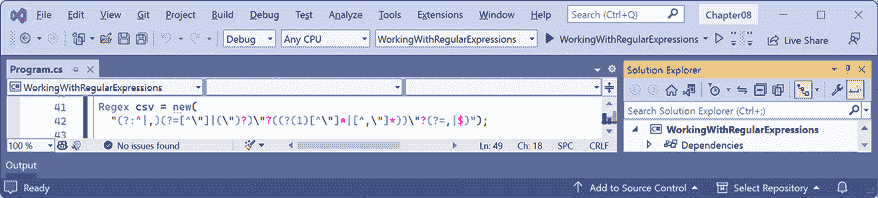
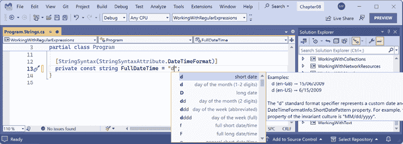
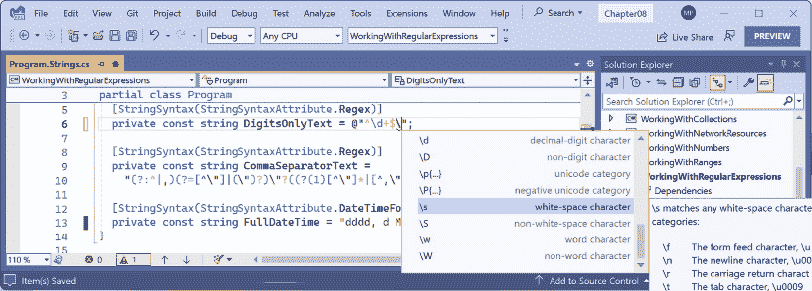
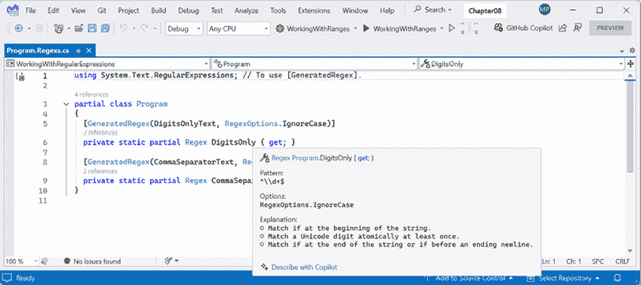
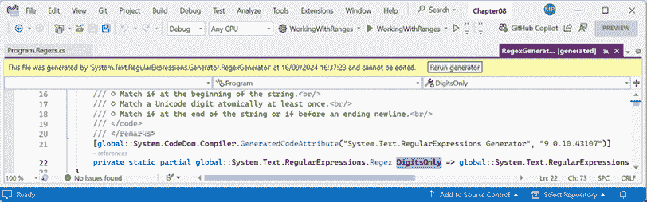
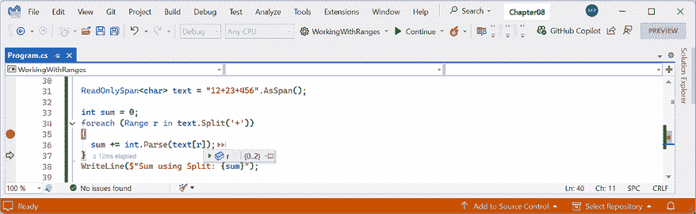

# 第八章：操作常见的 .NET 类型

本章介绍了一些包含在 .NET 中的常见类型。这些类型包括用于操作数字、文本和集合的类型；改进对 spans、indexes 和 ranges 的处理；以及在可选的在线部分，处理网络资源。

本章涵盖了以下主题：

+   操作数字

+   操作文本

+   使用正则表达式进行模式匹配

+   在集合中存储多个对象

+   操作 spans、indexes 和 ranges

# 操作数字

最常见的数据类型之一是数字。在 .NET 中用于操作数字的最常见类型如 *表 8.1* 所示：

| **命名空间** | **示例类型** | **描述** |
| --- | --- | --- |
| `System` | `SByte`, `Int16`, `Int32`, `Int64`, `Int128` | 整数；即零和正负整数。 |
| `System` | `Byte`, `UInt16`, `UInt32`, `UInt64`, `UInt128` | 基数；即零和正整数。 |
| `System` | `Half`, `Single`, `Double` | 实数；即浮点数。 |
| `System` | `Decimal` | 准确的实数；即用于科学、工程或金融场景。 |
| `System.Numerics` | `BigInteger`, `Complex`, `Quaternion` | 随意大的整数、复数和四元数。 |

表 8.1：常见的 .NET 数字类型

自从 2002 年 .NET Framework 1.0 发布以来，.NET 就有了 32 位的 `float` 和 64 位的 `double` 类型。IEEE 754 规范还定义了一个 16 位的浮点数标准。机器学习和其他算法将受益于这种更小、精度更低的数字类型；因此，Microsoft 在 .NET 5 及以后的版本中引入了 `System.Half` 类型。目前，C# 语言没有定义 `half` 别名，所以你必须使用 .NET 类型 `System.Half`。这可能在将来会改变。

`System.Int128` 和 `System.UInt128` 是在 .NET 7 中引入的，它们也没有 C# 别名关键字。

## 操作大整数

可以存储在 .NET 类型中的最大整数是大约十八亿五千万，使用无符号 64 位整数 `ulong` 存储。但如果你需要存储比这更大的数字怎么办？

让我们探索数值：

1.  使用您首选的代码编辑器创建一个新项目，如下面的列表所示：

    +   项目模板：**控制台应用程序** / `console`

    +   项目文件和文件夹：`WorkingWithNumbers`

    +   解决方案文件和文件夹：`Chapter08`

1.  在项目文件中，添加一个元素以静态和全局导入 `System.Console` 类。

1.  在 `Program.cs` 中，删除现有的语句，然后添加一个语句来导入 `System.Numerics`，如下面的代码所示：

    ```cs
    using System.Numerics; // To use BigInteger. 
    ```

1.  添加语句以输出 `ulong` 类型的最大值，以及使用 `BigInteger` 的 30 位数字，如下面的代码所示：

    ```cs
    const int width = 40;
    WriteLine("ulong.MaxValue vs a 30-digit BigInteger");
    WriteLine(new string('-', width));
    ulong big = ulong.MaxValue;
    WriteLine($"{big,width:N0}");
    BigInteger bigger =
      BigInteger.Parse("123456789012345678901234567890");
    WriteLine($"{bigger,width:N0}"); 
    ```

格式代码中值`40`的`width`常量表示“右对齐 40 个字符”，因此两个数字都排列在右侧边缘。`N0`表示“使用千位分隔符和零小数位。”

1.  运行代码并查看结果，如下所示输出：

    ```cs
    ulong.MaxValue vs a 30-digit BigInteger
    ----------------------------------------
                  18,446,744,073,709,551,615
     123,456,789,012,345,678,901,234,567,890 
    ```

`BigInteger`可以表示几乎无限长度的整数值。然而，在现实中，这受到可用内存和计算时间等因素的限制。如果生成的值过大，一些 API 也可能失败。因此，在.NET 9 及以后版本中，对`BigInteger`的最大长度进行了强制限制，限制为`(2³¹) - 1`位（约 21.4 亿位）。这相当于大约 256 MB 和约 646.5 百万位。这个限制确保 API 保持可靠和一致，同时仍然支持远大于大多数实际需求的数字。

## 乘以大整数

当你乘以两个 32 位整数时，结果可能会超出 32 位整数的范围。例如，32 位整数（`int`）的最大值是 2,147,483,647。如果你将这个值乘以另一个大整数，结果可能会超过这个限制，导致溢出，如果只使用 32 位来存储结果，可能会导致计算错误。

自从.NET 的最早版本以来，`System.Math`类有一个`BigMul`方法，它执行两个 32 位整数的乘法，并将完整的 64 位结果作为`long`返回。这个方法是必要的，因为使用*运算符乘以两个 32 位整数可能会导致 64 位整数，这可能会超出典型的 32 位整数类型。

自从.NET 5 以来，`BigMul`方法增加了对两个有符号或无符号`long`值进行乘法的重载。在.NET 9 及以后版本中，数字类型本身，如`int`、`long`、`uint`和`ulong`，现在也获得了`BigMul`方法来乘以它们的值，并将结果以下一个最大的类型返回。例如，`long.BigMul`返回`System.Int128`。

现在，让我们看看如何乘以大整数：

1.  在`Program.cs`中，添加语句以使用旧的和新的方法乘以一些大整数，如下所示代码：

    ```cs
    WriteLine("Multiplying big integers");
    int number1 = 2_000_000_000;
    int number2 = 2;
    WriteLine($"number1: {number1:N0}");
    WriteLine($"number2: {number2:N0}");
    WriteLine($"number1 * number2: {number1 * number2:N0}");
    WriteLine($"Math.BigMul(number1, number2): {
      Math.BigMul(number1, number2):N0}");
    WriteLine($"int.BigMul(number1, number2): {
      int.BigMul(number1, number2):N0}"); 
    ```

1.  运行代码并查看结果，如下所示输出：

    ```cs
    Multiplying big integers
    number1: 2,000,000,000
    number2: 2
    number1 * number2: -294,967,296
    Math.BigMul(number1, number2): 4,000,000,000
    int.BigMul(number1, number2): 4,000,000,000 
    ```

## 处理复数

一个复数可以表示为*a + bi*，其中*a*和*b*是实数，*i*是虚数单位，其中*i*² *= −1*。如果实部*a*为零，它是一个纯虚数。如果虚部*b*为零，它是一个实数。

复数在许多**科学、技术、工程和数学**（**STEM**）研究领域有实际应用。它们是通过分别添加加数的实部和虚部来相加的；考虑以下：

```cs
(a + bi) + (c + di) = (a + c) + (b + d)i 
```

让我们探索复数：

1.  在`Program.cs`中，添加语句以添加两个复数，如下所示代码：

    ```cs
    Complex c1 = new(real: 4, imaginary: 2);
    Complex c2 = new(real: 3, imaginary: 7);
    Complex c3 = c1 + c2;
    // Output using the default ToString implementation.
    WriteLine($"{c1} added to {c2} is {c3}");
    // Output using a custom format.
    WriteLine("{0} + {1}i added to {2} + {3}i is {4} + {5}i",
      c1.Real, c1.Imaginary,
      c2.Real, c2.Imaginary,
      c3.Real, c3.Imaginary); 
    ```

1.  运行代码并查看结果，如下所示输出：

    ```cs
    <4; 2> added to <3; 7> is <7; 9>
    4 + 2i added to 3 + 7i is 7 + 9i 
    ```

.NET 6 及更早版本使用不同的默认复数格式：`(4, 2)` 加上 `(3, 7)` 是 `(7, 9)`。在 .NET 7 及以后版本中，默认格式已更改为使用尖括号和分号，因为某些文化使用圆括号表示负数，并使用逗号表示小数。在撰写本文时，官方文档尚未更新以使用新格式，如下列链接所示：[`learn.microsoft.com/en-us/dotnet/api/system.numerics.complex.tostring`](https://learn.microsoft.com/en-us/dotnet/api/system.numerics.complex.tostring)。

## 与张量一起工作

张量是 **人工智能**（**AI**）中的基本数据结构。你可以把它们看作是专门的多维数组。

张量用于表示和编码各种形式的数据，包括文本序列（标记）、图像、视频和音频。张量以最优效率对高维数据进行计算，并在神经网络中存储权重信息和中间计算。

.NET 9 引入了一个新的 `Tensor<T>` 类型，它使与 AI 库（如 ML.NET、TorchSharp 和 ONNX Runtime）的高效交互成为可能，并在可能的情况下最小化数据复制。它通过直观的索引和切片操作简化了数据操作，确保易用性和效率。

## 为游戏和类似应用程序生成随机数

在不需要真正随机数的情况，如游戏中，你可以创建一个 `Random` 类的实例，如下面的代码示例所示：

```cs
Random r = new(); 
```

`Random` 有一个构造函数，用于指定用于初始化其伪随机数生成器的种子值，如下面的代码所示：

```cs
Random r = new(Seed: 46378); 
```

如你在 *第二章* *讲 C#* 中所学，参数名称应使用 *驼峰命名法*。定义 `Random` 类构造函数的开发者打破了这一惯例。参数名称应该是 `seed`，而不是 `Seed`。

**良好实践**：共享的种子值充当密钥；因此，如果你在两个应用程序中使用相同的随机数生成算法和相同的种子值，那么它们可以生成相同的“随机”数字序列。有时这是必要的，例如，当同步 GPS 接收器与卫星时，或者当游戏需要随机生成相同关卡时。但通常，你希望保持你的种子值保密。

### 使用 `Random` 类生成随机数

为了避免分配比必要的更多内存，.NET 6 引入了一个共享的静态 `Random` 实例，你可以访问它而不是创建自己的实例。

`Random` 类有常用的生成随机数的方法，如下列所示：

+   `Next`：此方法返回一个随机`int`（整数），它接受两个参数，`minValue`和`maxValue`，但`maxValue`不是方法返回的最大值！它是一个**排他性上限**，意味着`maxValue`比返回的最大值多 1。使用`NextInt64`方法返回一个`long`整数。

+   `NextDouble`：此方法返回一个大于或等于`0.0`且小于且从不等于`1.0`的数字。使用`NextSingle`方法返回一个`float`。

+   `NextBytes`：此方法使用随机`byte`（`0`到`255`）值填充任何大小的数组。通常将`byte`值格式化为十六进制，例如，`00`到`FF`。

让我们看看一些生成伪随机数的示例：

1.  在`Program.cs`中，添加语句以访问共享的`Random`实例，然后调用其方法来生成随机数，如下面的代码所示：

    ```cs
    Random r = Random.Shared;
    // minValue is an inclusive lower bound i.e. 1 is a possible value.
    // maxValue is an exclusive upper bound i.e. 7 is not a possible value.
    int dieRoll = r.Next(minValue: 1, maxValue: 7); // Returns 1 to 6.
    WriteLine($"Random die roll: {dieRoll}");
    double randomReal = r.NextDouble(); // Returns 0.0 to less than 1.0.
    WriteLine($"Random double: {randomReal}");
    byte[] arrayOfBytes = new byte[256];
    r.NextBytes(arrayOfBytes); // Fills array with 256 random bytes.
    Write("Random bytes: ");
    for (int i = 0; i < arrayOfBytes.Length; i++)
    {
      Write($"{arrayOfBytes[i]:X2} ");
    }
    WriteLine(); 
    ```

1.  运行代码并查看结果，如下面的输出所示：

    ```cs
    Random die roll: 1
    Random double: 0.06735275453092382
    Random bytes: D9 38 CD F3 5B 40 2D F4 5B D0 48 DF F7 B6 67 C1 95 A1 2C 58 42 CF 70 6C C3 BE 82 D7 EC 61 0D D2 2D C4 49 7B C7 0F EA CC B3 41 F3 04 5D 29 25 B7 F7 99 8A 0F 56 20 A6 B3 57 C4 48 DA 94 2B 07 F1 15 64 EA 8D FF 79 E6 E4 9A C8 65 C5 D8 55 3D 3C C0 2B 0B 4C 3A 0E E6 A5 91 B7 59 6C 9A 94 97 43 B7 90 EE D8 9A C6 CA A1 8F DD 0A 23 3C 01 48 E0 45 E1 D6 BD 7C 41 C8 22 8A 81 82 DC 1F 2E AD 3F 93 68 0F B5 40 7B 2B 31 FC A6 BF BA 05 C0 76 EE 58 B3 41 63 88 E5 5C 8B B5 08 5C C3 52 FF 73 69 B0 97 78 B5 3B 87 2C 12 F3 C3 AE 96 43 7D 67 2F F8 C9 31 70 BD AD B3 9B 44 53 39 5F 19 73 C8 43 0E A5 5B 6B 5A 9D 2F DF DC A3 EE C5 CF AF A4 8C 0F F2 9C 78 19 48 CE 49 A8 28 06 A3 4E 7D F7 75 AA 49 E7 4E 20 AF B1 77 0A 90 CF C1 E0 62 BC 4F 79 76 64 98 BF 63 76 B4 F9 1D A4 C4 74 03 63 02 
    ```

在确实需要真正随机数的情况下，例如在密码学中，有专门的数据类型，比如`RandomNumberGenerator`。我在配套书籍《.NET 8 工具与技能》中涵盖了这一点以及其他密码学类型，在标题为《使用密码学保护数据和应用程序》的章节中进行了介绍，该章节于 2024 年 7 月出版。

### .NET 8 及以后版本的新随机方法

.NET 8 引入了两个新的`Random`方法，如下列所示：

+   `GetItems<T>`：此方法接受一个类型为`T`的数组或只读 span 的选择，以及您想要生成的项目数量，然后从选择中随机返回这些数量的项目。

+   `Shuffle<T>`：此方法接受一个类型为`T`的数组或 span，并随机化项目的顺序。

让我们看看每个示例：

1.  在`Program.cs`中，添加语句以访问共享的`Random`实例，然后调用其方法来生成随机数，如下面的代码所示：

    ```cs
    string[] beatles = r.GetItems(
      choices: new[] { "John", "Paul", "George", "Ringo" },
      length: 10);
    Write("Random ten beatles:");
    foreach (string beatle in beatles)
    {
      Write($" {beatle}");
    }
    WriteLine();
    r.Shuffle(beatles);
    Write("Shuffled beatles:");
    foreach (string beatle in beatles)
    {
      Write($" {beatle}");
    }
    WriteLine(); 
    ```

1.  运行代码并查看结果，如下面的输出所示：

    ```cs
    Random ten beatles: Paul Paul John John John John Paul John George Ringo
    Shuffled beatles: George John Paul Paul John John John Ringo Paul John 
    ```

## 生成 GUID

**全局唯一标识符（GUID）**是一个 128 位的文本字符串，它代表一个用于标识的唯一值。作为开发者，当需要生成用于标识信息的唯一引用时，您将需要生成 GUID。传统上，数据库和计算机系统可能使用递增的整数值，但 GUID 更有可能在多任务系统中避免冲突。

`System.Guid`类型是一个值类型（`struct`），它表示 GUID 值。它有`Parse`和`TryParse`方法，可以将表示为`string`的现有 GUID 值转换为`Guid`类型。它有一个`NewGuid`方法来生成新的值。

`NewGuid`方法实现了**通用唯一标识符（UUID）**规范的第四版。您可以在以下链接中了解 UUID 规范：[`datatracker.ietf.org/doc/rfc9562/`](https://datatracker.ietf.org/doc/rfc9562/)。

.NET 9 引入了对 UUID 规范版本 7 的支持，这允许你控制自 Unix 纪元以来的前 48 位时间戳毫秒数，从而可以创建可排序的 GUID。这对于数据库的唯一 ID 来说要好得多。

让我们分解一个示例值：`0191a398-12ec-7d5e-a8d3-8a629eae8be1`：

+   前导 48 位是一个十六进制的时间戳：`0191a39812ec`。

    +   `0191a398`：前 32 位代表时间戳的高位。

    +   `12ec`：接下来的 16 位继续时间戳。

+   接下来的 12 位是十六进制的版本和变体：`7d5e`。

    +   `7`表示这是一个版本 7 的 UUID。

    +   剩余的三位（`d5e`）结合了时间戳和变体的一部分，用于识别 UUID 的布局。

+   最后的 68 位是一个十六进制的随机部分：`a8d3-8a629eae8be1`。

    +   这确保了 GUID 的唯一性。

让我们看看我们如何生成 GUID 值并输出它们：

1.  在`Program.cs`中添加语句以输出空`Guid`的值，生成一个新的随机`Guid`并输出其值，最后输出随机`Guid`值的每个单独的字节，如下面的代码所示：

    ```cs
    WriteLine($"Empty GUID: {Guid.Empty}.");
    Guid g = Guid.NewGuid();
    WriteLine($"Random GUID: {g}.");
    byte[] guidAsBytes = g.ToByteArray();
    Write("GUID as byte array: ");
    for (int i = 0; i < guidAsBytes.Length; i++)
    {
      Write($"{guidAsBytes[i]:X2} ");
    }
    WriteLine();
    WriteLine("Generating three v7 GUIDs:");
    for (int i = 0; i < 3; i++)
    {
      Guid g7 = Guid.CreateVersion7(DateTimeOffset.UtcNow);
      WriteLine($"  {g7}.");
    } 
    ```

1.  运行代码，查看结果，并注意三个 GUID 值的前部分（`0191a398-12ec`等）是可排序的，因为它们基于相同的`DateTimeOffset`值，如下面的输出所示：

    ```cs
    Empty GUID: 00000000-0000-0000-0000-000000000000.
    Random GUID: c7a11eea-45a5-4619-964a-a9cce1e4220c.
    GUID as byte array: EA 1E A1 C7 A5 45 19 46 96 4A A9 CC E1 E4 22 0C
    Generating three v7 GUIDs:
      0191a398-12ec-7d5e-a8d3-8a629eae8be1.
      0191a398-12ed-7913-8096-c6f70b5edd8f.
      0191a398-12ed-7475-8284-0588b573080e. 
    ```

    EF Core 团队有一个提案，允许在数据模型中使用版本 7 的 GUID。您可以在以下链接中了解更多关于这个想法：[`github.com/dotnet/efcore/issues/34158`](https://github.com/dotnet/efcore/issues/34158)。

# 处理文本

变量数据类型中最常见的其他类型之一是文本。在.NET 中用于处理文本的最常见类型如*表 8.2*所示：

| **命名空间** | **类型** | **描述** |
| --- | --- | --- |
| `System` | `Char` | 存储单个文本字符的存储空间 |
| `System` | `String` | 存储多个文本字符的存储空间 |
| `System.Text` | `StringBuilder` | 高效地操作字符串 |
| `System.Text.RegularExpressions` | `Regex` | 高效地匹配字符串模式 |

表 8.2：用于处理文本的常见.NET 类型

## 获取字符串的长度

让我们探索一些处理文本时的常见任务；例如，有时你需要找出存储在`string`变量中的文本片段的长度：

1.  使用您首选的代码编辑器，将一个新的**控制台应用程序**/ `console`项目命名为`WorkingWithText`添加到`Chapter08`解决方案中。

1.  在`WorkingWithText`项目中，在`Program.cs`中删除现有的语句，然后添加语句来定义一个变量以存储城市名称伦敦，并将其名称和长度写入控制台，如下面的代码所示：

    ```cs
    string city = "London";
    WriteLine($"{city} is {city.Length} characters long."); 
    ```

1.  运行代码并查看结果，如下面的输出所示：

    ```cs
    London is 6 characters long. 
    ```

## 获取字符串的字符

`string` 类内部使用 `char` 数组来存储文本。它还有一个索引器，这意味着我们可以使用数组语法来读取其字符。数组索引从 0 开始，因此第三个字符将在索引 2 处。

让我们看看这个动作：

1.  添加语句写入 `string` 变量中的第一个和第四个位置的字符，如下所示：

    ```cs
    WriteLine($"First char is {city[0]} and fourth is {city[3]}."); 
    ```

1.  运行代码并查看以下输出结果：

    ```cs
    First char is L and fourth is d. 
    ```

## 分割字符串

有时候，你需要将文本分割成任意字符，例如逗号：

1.  添加语句定义一个包含以逗号分隔的城市名称的单一 `string` 变量，然后使用 `Split` 方法并指定你想要将逗号作为分隔符，然后枚举返回的 `string` 值数组，如下所示：

    ```cs
    string cities = "Paris,Tehran,Chennai,Sydney,New York,Medellín";
    string[] citiesArray = cities.Split(',');
    WriteLine($"There are {citiesArray.Length} items in the array:");
    foreach (string item in citiesArray)
    {
      WriteLine($"  {item}");
    } 
    ```

1.  运行代码并查看以下输出结果：

    ```cs
    There are 6 items in the array:
      Paris
      Tehran
      Chennai
      Sydney
      New York
      Medellín 
    ```

在本章的后面部分，你将学习如何使用正则表达式处理更复杂的字符串分割场景。

## 获取字符串的一部分

有时候，你需要获取文本的一部分。`IndexOf` 方法有九种重载，可以返回指定 `char` 或 `string` 在 `string` 中的索引位置。`Substring` 方法有两种重载，如下所示：

+   `Substring(startIndex, length)`: 这将返回从 `startIndex` 开始并包含下一个 `length` 个字符的字符串部分。

+   `Substring(startIndex)`: 这将返回从 `startIndex` 开始并包含直到字符串末尾的所有字符的字符串部分。

让我们来看一个简单的例子：

1.  添加语句将一个人的全名存储在一个以空格字符分隔的 `string` 变量中，第一个和最后一个名字之间，找到空格的位置，然后提取名字和姓氏作为两部分，以便它们可以以不同的顺序重新组合，如下所示：

    ```cs
    string fullName = "Alan Shore";
    int indexOfTheSpace = fullName.IndexOf(' ');
    string firstName = fullName.Substring(
      startIndex: 0, length: indexOfTheSpace);
    string lastName = fullName.Substring(
      startIndex: indexOfTheSpace + 1);
    WriteLine($"Original: {fullName}");
    WriteLine($"Swapped: {lastName}, {firstName}"); 
    ```

1.  运行代码并查看以下输出结果：

    ```cs
    Original: Alan Shore
    Swapped: Shore, Alan 
    ```

如果初始全名的格式不同，例如 `"LastName, FirstName"`，则代码需要不同。作为一个可选练习，尝试编写一些语句，将输入 `"Shore, Alan"` 转换为 `"Alan Shore"`。

## 检查字符串内容

有时候，你需要检查一段文本是否以某些字符开始或结束，或者是否包含某些字符。你可以使用名为 `StartsWith`、`EndsWith` 和 `Contains` 的方法来实现这一点：

1.  添加语句存储一个 `string` 值，然后检查它是否以或包含几个不同的 `char` 值，如下所示：

    ```cs
    string company = "Microsoft";
    WriteLine($"Text: {company}");
    WriteLine("Starts with M: {0}, contains an N: {1}",
      arg0: company.StartsWith('M'),
      arg1: company.Contains('N')); 
    ```

    **良好实践**：`StartsWith`、`EndsWith` 和 `Contains` 可以传递 `string` 或 `char` 值。单引号表示前述代码中的 `char` 值。搜索类似 `'M'` 的 `char` 比搜索类似 `"M"` 的 `string` 值更高效。

1.  运行代码并查看以下输出结果：

    ```cs
    Text: Microsoft
    Starts with M: True, contains an N: False 
    ```

## 比较字符串值

两个常见的字符串值任务是排序（也称为整理）和比较。例如，当用户输入他们的用户名或密码时，你需要比较他们输入的内容与存储的内容。

`string`类实现了`IComparable`接口，这意味着你可以通过使用`CompareTo`实例方法轻松比较两个字符串值，它将返回`-1`、`0`或`1`，具体取决于值是“小于”、“等于”还是“大于”另一个。当你为`Person`类实现`IComparable`接口时，你看到了这个例子，如*第六章*，*实现接口和继承类*。

然而，字符的大小写可能会影响排序，文本的排序规则是文化相关的。例如，在传统的西班牙语中，双 L 被视为一个字符，如*表 8.3*所示：

| **文化** | **描述** | **示例字符串值** |
| --- | --- | --- |
| 西班牙语 | 在 1994 年，西班牙皇家学院发布了一条新的字母排序规则，将 LL 和 CH 视为拉丁字母字符，而不是单独的字符。 | 现代：`llegar`排在`lugar`之前。传统：`llegar`排在`lugar`之后。 |
| 瑞典语 | 在 2006 年，瑞典学院发布了一条新规则。在 2006 年之前，V 和 W 是同一个字符。自 2006 年以来，它们被视为不同的字符。 | 瑞典语单词大多只使用 V。包含 W 的借词（从其他语言借来的单词）现在可以保留那些 W，而不是用 Vs 替换 W。 |
| 德语 | 电话簿排序与字典排序不同，例如，重音符号被视为字母的组合。 | 在电话簿排序中，`Müller`和`Mueller`是同一个名字。 |
| 德语 | 字符`ß`被排序为`SS`。这是地址中常见的问题，因为“街道”这个词是`Straße`。 | `Straße`和`Strasse`有相同的意思。 |

表 8.3：欧洲语言排序规则示例

为了保持一致性和性能，有时你想以文化不变的方式进行比较。因此，最好使用`static`方法`Compare`。

让我们看看一些例子：

1.  在`Program.cs`的顶部，导入用于处理文化的命名空间，并启用特殊字符，如欧元货币符号，如下面的代码所示：

    ```cs
    using System.Globalization; // To use CultureInfo.
    OutputEncoding = System.Text.Encoding.UTF8; // Enable Euro symbol. 
    ```

1.  在`Program.cs`中，定义一些文本变量，并在不同的文化中进行比较，如下面的代码所示：

    ```cs
    CultureInfo.CurrentCulture = CultureInfo.GetCultureInfo("en-US");
    string text1 = "Mark";
    string text2 = "MARK";
    WriteLine($"text1: {text1}, text2: {text2}");
    WriteLine("Compare: {0}.", string.Compare(text1, text2));
    WriteLine("Compare (ignoreCase): {0}.",
      string.Compare(text1, text2, ignoreCase: true));
    WriteLine("Compare (InvariantCultureIgnoreCase): {0}.",
      string.Compare(text1, text2,
      StringComparison.InvariantCultureIgnoreCase));
    // German string comparisons
    CultureInfo.CurrentCulture = CultureInfo.GetCultureInfo("de-DE");
    text1 = "Strasse";
    text2 = "Straße";
    WriteLine($"text1: {text1}, text2: {text2}");
    WriteLine("Compare: {0}.", string.Compare(text1, text2,
      CultureInfo.CurrentCulture, CompareOptions.IgnoreNonSpace));
    WriteLine("Compare (IgnoreCase, IgnoreNonSpace): {0}.",
      string.Compare(text1, text2, CultureInfo.CurrentCulture,
      CompareOptions.IgnoreNonSpace | CompareOptions.IgnoreCase));
    WriteLine("Compare (InvariantCultureIgnoreCase): {0}.",
      string.Compare(text1, text2,
      StringComparison.InvariantCultureIgnoreCase)); 
    ```

1.  运行代码，查看结果，并注意小写字母“a”是“小于”（`-1`）大写字母“A”，所以比较返回-1。但我们可以设置一个选项来忽略大小写，或者更好的是，进行文化和大小写不变的比较，将两个字符串值视为相等（`0`），如下面的输出所示：

    ```cs
    text1: Mark, text2: MARK
    Compare: -1.
    Compare (ignoreCase): 0.
    Compare (InvariantCultureIgnoreCase): 0.
    text1: Strasse, text2: Straße
    Compare: 0.
    Compare (IgnoreCase, IgnoreNonSpace): 0.
    Compare (InvariantCultureIgnoreCase): -1. 
    ```

**更多信息**：你可以在以下链接中了解更多关于`string`比较的信息：[`learn.microsoft.com/en-us/globalization/locale/sorting-and-string-comparison`](https://learn.microsoft.com/en-us/globalization/locale/sorting-and-string-comparison)。

## 连接、格式化和其他字符串成员

如*表 8.4*所示，还有很多其他的`string`成员：

| **成员** | **描述** |
| --- | --- |
| `Trim`, `TrimStart`, `TrimEnd` | 这些方法从开始和/或结束处删除空白字符，如空格、制表符和回车符。 |
| `ToUpper`, `ToLower` | 这些将所有字符转换为大写或小写。 |
| `Insert`, `Remove` | 这些方法用于插入或删除一些文本。 |
| `Replace` | 这将一些文本替换为其他文本。 |
| `string.Empty` | 这可以用来代替每次使用空的双引号(`""`)分配内存的文本字面量字符串值。 |
| `string.Concat` | 这将两个字符串变量连接起来。当在字符串操作数之间使用时，`+`运算符执行等效操作。 |
| `string.Join` | 这将一个或多个字符串变量连接起来，每个字符串之间用一个字符隔开。 |
| `string.IsNullOrEmpty` | 这用于检查一个字符串变量是否为 null 或空。 |
| `string.IsNullOrWhiteSpace` | 这用于检查一个字符串变量是否为 null 或空白；也就是说，是任意数量的水平或垂直间隔字符的混合，例如，制表符、空格、回车、换行等。 |
| `string.Format` | 这是一个用于输出格式化字符串值的替代方法，它使用位置参数而不是命名参数进行字符串插值。 |

表 8.4：连接、格式化和其他字符串成员

前面的某些方法是`static`方法。这意味着该方法只能从类型调用，而不能从变量实例调用。在前面的表中，我通过在方法前加上`string.`前缀来指示静态方法，例如`string.Format`。

让我们探索一些这些方法：

1.  使用`Join`方法添加语句来接收一个`string`值数组，并使用分隔符将它们组合回单个`string`变量，如下面的代码所示：

    ```cs
    string recombined = string.Join(" => ", citiesArray);
    WriteLine(recombined); 
    ```

1.  运行代码并查看结果，如下面的输出所示：

    ```cs
    Paris => Tehran => Chennai => Sydney => New York => Medellín 
    ```

1.  添加语句以使用位置参数和插值`string`格式化语法来输出相同的三个变量两次，如下面的代码所示：

    ```cs
    string fruit = "Apples";
    decimal price =  0.39M;
    DateTime when = DateTime.Today;
    WriteLine($"Interpolated:  {fruit} cost {price:C} on {when:dddd}.");
    WriteLine(string.Format("string.Format: {0} cost {1:C} on {2:dddd}.",
      arg0: fruit, arg1: price, arg2: when)); 
    ```

    一些代码编辑器，如 Rider，会警告你关于装箱操作。这些操作虽然慢，但在这种情况下并不是问题。为了避免装箱，请在`price`和`when`上调用`ToString`方法。

1.  运行代码并查看结果，如下面的输出所示：

    ```cs
    Interpolated:  Apples cost $0.39 on Friday.
    string.Format: Apples cost $0.39 on Friday. 
    ```

注意，我们可以简化第二个语句，因为`Console.WriteLine`支持与`string.Format`相同的格式代码，如下面的代码所示：

```cs
WriteLine("WriteLine: {0} cost {1:C} on {2:dddd}.",
  arg0: fruit, arg1: price, arg2: when); 
```

## 高效构建字符串

你可以使用`String.Concat`方法或简单地使用`+`运算符将两个字符串连接起来以创建一个新的`string`。但是，当组合超过几个值时，这两种选择都是不好的做法，因为.NET 必须在内存中创建一个全新的`string`。

如果你只添加两个 `string` 值，这可能不会引起注意，但如果你在循环中多次连接字符串，它可能会对性能和内存使用产生显著的负面影响。你可以使用 `StringBuilder` 类型更有效地连接 `string` 变量。

我为配套书籍 *Apps and Services with .NET 8* 编写了一个仅在网络上可用的部分，关于使用 `string` 连接作为主要示例的性能基准测试。你可以选择在以下链接完成该部分及其实际编码任务：[`github.com/markjprice/apps-services-net8/blob/main/docs/ch01-benchmarking.md`](https://github.com/markjprice/apps-services-net8/blob/main/docs/ch01-benchmarking.md)。

**更多信息**：你可以在以下链接中看到使用 `StringBuilder` 的示例：[`learn.microsoft.com/en-us/dotnet/api/system.text.stringbuilder#examples`](https://learn.microsoft.com/en-us/dotnet/api/system.text.stringbuilder#examples)。

## 处理字符

有时，你需要处理单个字符。`System.Char` 类型（也称为 `char`）有一些有用的方法，如下表 8.5 所示：

| **方法** | **描述** |
| --- | --- |
| `char.IsDigit(char)`, `char.IsDigit(string, int)` | 如果字符是十进制数字，则返回 `true`。 |
| `char.IsLetter(char)`, `char.IsLetter(string, int)` | 如果字符是字母，则返回 `true`。 |
| `char.IsLower(char)`, `char.IsLower(string, int)` | 如果字符是小写字母，则返回 `true`。 |
| `char.IsUpper(char)`, `char.IsUpper(string, int)` | 如果字符是大写字母，则返回 `true`。 |
| `char.IsSeparator(char)`, `char.IsSeparator(string, int)` | 如果字符是分隔符，则返回 `true`。 |
| `char.IsSymbol(char)`, `char.IsSymbol(string, int)` | 如果字符是符号，则返回 `true`。 |
| `char.IsWhiteSpace(char)`, `char.IsWhiteSpace(string, int)` | 如果字符是空白字符，如空格或制表符，则返回 `true`。 |

表 8.5：处理字符的方法

## 字符串中的搜索

.NET 8 引入了 `SearchValues` 类型，该类型实现了一种在 spans 中搜索字符或字节集合的优化方法。例如，`SearchValues` 有助于在文本值中找到第一个元音实例，如下面的代码所示：

```cs
string vowels = "AEIOUaeiou";
// .NET 8 and later.
SearchValues<char> vowelsSearchValues = SearchValues.Create(vowels);   
ReadOnlySpan<char> text = "Fred";
WriteLine($"vowels: {vowels}");
WriteLine($"text: {text}");
WriteLine($"text.IndexOfAny(vowelsSearchValues): {
  text.IndexOfAny(vowelsSearchValues)}"); 
```

文本 `Fred` 中的第一个元音位于索引位置 2，如下面的输出所示：

```cs
vowels: AEIOUaeiou
text: Fred
text.IndexOfAny(vowelsSearchValues): 2 
```

在 .NET 9 或更高版本中，`SearchValues` 现在不仅支持搜索子字符串，还支持在较长的字符串中搜索字符，如下面的代码所示：

```cs
string[] names = [ "Cassian", "Luthen", "Mon Mothma",
  "Dedra", "Syril", "Kino" ];
// .NET 9 and later.
SearchValues<string> namesSearchValues = SearchValues.Create(
  names, StringComparison.OrdinalIgnoreCase);
ReadOnlySpan<char> sentence = "In Andor, Diego Luna returns as the titular character, Cassian Andor, to whom audiences were first introduced in Rogue One.";
WriteLine($"names: {string.Join(' ', names)}");
WriteLine($"sentence: {sentence}");
WriteLine($"sentence.IndexOfAny(vowelsSearchValues): {
  sentence.IndexOfAny(namesSearchValues)}"); 
```

Andor 字符列表中的第一个名字从索引位置 55 开始，如下面的输出所示：

```cs
names: Cassian Luthen Mon Mothma Dedra Syril Kino
sentence: In Andor, Diego Luna returns as the titular character, Cassian Andor, to whom audiences were first introduced in Rogue One.
sentence.IndexOfAny(vowelsSearchValues): 55 
```

# 使用正则表达式进行模式匹配

正则表达式对于验证用户输入非常有用。它们非常强大，也可能变得非常复杂。几乎所有的编程语言都支持正则表达式，并使用一组常见的特殊字符来定义它们。

让我们尝试一些示例正则表达式：

1.  使用你喜欢的代码编辑器添加一个名为`WorkingWithRegularExpressions`的新**控制台应用程序**/`console`项目到`Chapter08`解决方案中。

1.  在`Program.cs`中，删除现有的语句，然后导入以下命名空间：

    ```cs
    using System.Text.RegularExpressions; // To use Regex. 
    ```

## 检查作为文本输入的数字

我们将首先实现验证数字输入的常见示例：

1.  在`Program.cs`中，添加语句提示用户输入他们的年龄，然后使用查找数字字符的正则表达式来检查其有效性，如下所示：

    ```cs
    Write("Enter your age: ");
    string input = ReadLine()!; // Null-forgiving operator.
    Regex ageChecker = new(@"\d");
    WriteLine(ageChecker.IsMatch(input) ? "Thank you!" :
      $"This is not a valid age: {input}"); 
    ```

注意以下关于代码的说明：

+   `@`字符关闭了在`string`中使用转义字符的能力。转义字符以反斜杠为前缀。例如，`\t`表示制表符，`\n`表示换行符。在编写正则表达式时，我们需要禁用此功能。用电视剧《白宫风云》的话来说，“让反斜杠回归反斜杠。”

+   一旦使用`@`禁用转义字符，它们就可以被正则表达式解释。例如，`\d`表示数字。你将在本主题的后面学习到更多以反斜杠为前缀的正则表达式符号。

1.  运行代码，输入一个整数，例如`34`作为年龄，并查看以下输出结果：

    ```cs
    Enter your age: 34
    Thank you! 
    ```

1.  再次运行代码，输入`carrots`，并查看以下输出结果：

    ```cs
    Enter your age: carrots
    This is not a valid age: carrots 
    ```

1.  再次运行代码，输入`bob30smith`，并查看以下输出结果：

    ```cs
    Enter your age: bob30smith
    Thank you! 
    ```

我们使用的正则表达式是`\d`，它表示*一个数字*。然而，它并没有指定在这个数字前后可以输入什么。这个正则表达式可以用英语描述为：“输入任何你想要的字符，只要至少输入一个数字字符。”

在正则表达式中，你使用插入符`^`符号来指示输入的开始，使用美元符`$`来指示输入的结束。让我们使用这些符号来表示我们期望输入的开始和结束之间除了一个数字之外没有其他任何内容。

1.  添加一个`^`和一个`$`将正则表达式更改为`^\d$`，如下所示（高亮显示）：

    ```cs
    Regex ageChecker = new(@"**^**\d**$**"); 
    ```

1.  再次运行代码并注意它拒绝除单个数字之外的所有输入。

1.  在`\d`表达式后添加一个`+`来修改其含义为“一个或多个数字”，如下所示（高亮显示）：

    ```cs
    Regex ageChecker = new(@"^\d**+**$"); 
    ```

1.  再次运行代码并注意正则表达式只允许零个或多个任意长度的整数。

## 正则表达式性能改进

用于处理正则表达式的.NET 类型在整个.NET 平台以及许多使用它构建的应用程序中都被使用。因此，它们对性能有重大影响。然而，直到.NET 5，它们都没有得到微软太多的优化关注。

在 .NET 5 及更高版本中，`System.Text.RegularExpressions` 命名空间中的类型已重写实现以挤出最大性能。使用 `IsMatch` 等方法进行的常见正则表达式基准测试现在快五倍。最好的是，你不需要更改代码就能获得这些好处！

在 .NET 7 及更高版本中，`Regex` 类的 `IsMatch` 方法现在有一个针对 `ReadOnlySpan<char>` 的重载，作为其输入，这提供了更好的性能。

## 理解正则表达式的语法

你可以在正则表达式中使用的某些常见符号在 *表 8.6* 中显示：

| **符号** | **含义** | **符号** | **含义** |
| --- | --- | --- | --- |
| `^` | 输入的开始 | `$` | 输入的结束 |
| `\d` | 单个数字 | `\D` | 单个 *非*数字 |
| `\s` | 空白字符 | `\S` | *非*空白字符 |
| `\w` | 单词字符 | `\W` | *非*单词字符 |
| `[A-Za-z0-9]` | 字符范围 | `\^` | ^ (上箭头) 字符 |
| `[aeiou]` | 字符集合 | `[^aeiou]` | *不在*字符集合中 |
| `.` | 任意单个字符 | `\.` | . (点) 字符 |

表 8.6：常见的正则表达式符号

此外，一些影响正则表达式中先前符号的常见正则表达式量词在 *表 8.7* 中显示：

| **符号** | **含义** | **符号** | **含义** |
| --- | --- | --- | --- |
| `+` | 一个或多个 | `?` | 一个或没有 |
| `{3}` | 精确三个 | `{3,5}` | 三个到五个 |
| `{3,}` | 至少三个 | `{,3}` | 最多三个 |

表 8.7：常见的正则表达式量词

## 正则表达式示例

一些正则表达式的示例及其含义的描述在 *表 8.8* 中显示：

| **表达式** | **含义** |
| --- | --- |
| `\d` | 输入中某处的单个数字 |
| `a` | 输入中某处的字符`a` |
| `Bob` | 输入中某处的单词`Bob` |
| `^Bob` | 输入开头的单词“Bob” |
| `Bob$` | 输入末尾的单词“Bob” |
| `^\d{2}$` | 精确两个数字 |
| `^[0-9]{2}$` | 精确两个数字 |
| `^[A-Z]{4,}$` | 仅 ASCII 字符集中至少有四个大写英文字母 |
| `^[A-Za-z]{4,}$` | 仅 ASCII 字符集中至少有四个大写或小写英文字母 |
| `^[A-Z]{2}\d{3}$` | 仅 ASCII 字符集中的两个大写英文字母和三个数字 |
| `^[A-Za-z\u00c0-\u017e]+$` | 至少有一个 ASCII 字符集中的大写或小写英文字母或 Unicode 字符集中的欧洲字母，如下所示：`ÀÁÂÃÄÅÆÇÈÉÊËÌÍÎÏÐÑÒÓÔÕÖ×ØÙÚÛÜÝ``Þßàáâãäåæçèéêëìíîïðñòóôõö÷øùúûüýþÿıŒœŠšŸŽž` |
| `^d.g$` | 字母 `d`，然后是任意字符，然后是字母 `g`，因此它可以匹配 `dig` 和 `dog` 或 `d` 和 `g` 之间的任意单个字符 |
| `^d\.g$` | 字母 `d`，然后是一个点 `.`，然后是字母 `g`，因此它只会匹配 `d.g` |

表 8.8：带有其含义描述的正则表达式示例

**良好实践**：使用正则表达式验证用户输入。相同的正则表达式可以在其他语言中重用，例如 JavaScript 和 Python。

可以在以下链接找到一个方便的网站来构建和测试正则表达式：[`regex101.com/`](https://regex101.com/)。

## 分割复杂的以逗号分隔的字符串

在本章的早期部分，你学习了如何分割一个简单的以逗号分隔的字符串变量。但关于以下电影标题的例子又该如何处理呢？

```cs
"Monsters, Inc.","I, Tonya","Lock, Stock and Two Smoking Barrels" 
```

`string`值在每个电影标题周围使用双引号。我们可以使用这些引号来识别我们是否需要在逗号（或不是）上分割。`Split`方法不够强大，因此我们可以使用正则表达式。

**良好实践**：你可以在以下链接中阅读关于这个任务的 Stack Overflow 文章的更完整解释：[`stackoverflow.com/questions/18144431/regex-to-split-a-csv`](https://stackoverflow.com/questions/18144431/regex-to-split-a-csv)。

为了在`string`值中包含双引号，我们在它们前面加上反斜杠，或者我们可以在 C# 11 或更高版本中使用原始字符串字面量功能。

1.  添加语句以存储一个复杂的以逗号分隔的`string`变量，然后使用`Split`方法以愚蠢的方式分割它，如下面的代码所示：

    ```cs
    // C# 1 to 10: Use escaped double-quote characters \"
    // string films = "\"Monsters, Inc.\",\"I, Tonya\",\"Lock, Stock and Two Smoking Barrels\"";
    // C# 11 or later: Use """ to start and end a raw string literal
    string films = """
    "Monsters, Inc.","I, Tonya","Lock, Stock and Two Smoking Barrels"
    """;
    WriteLine($"Films to split: {films}");
    string[] filmsDumb = films.Split(',');
    WriteLine("Splitting with string.Split method:");
    foreach (string film in filmsDumb)
    {
      WriteLine($"  {film}");
    } 
    ```

1.  添加语句以定义一个正则表达式来智能地分割并写入电影标题，如下面的代码所示：

    ```cs
    Regex csv = new(
      "(?:^|,)(?=[^\"]|(\")?)\"?((?(1)[^\"]*|[^,\"]*))\"?(?=,|$)");
    MatchCollection filmsSmart = csv.Matches(films);
    WriteLine("Splitting with regular expression:");
    foreach (Match film in filmsSmart)
    {
      WriteLine($"  {film.Groups[2].Value}");
    } 
    ```

在后面的章节中，你将看到如何获取一个源生成器来自动生成用于正则表达式的 XML 注释，以解释其工作原理。这对于你可能从网站上复制过来的正则表达式来说非常有用。

1.  运行代码并查看结果，如下面的输出所示：

    ```cs
    Splitting with string.Split method:
      "Monsters
       Inc."
      "I
       Tonya"
      "Lock
       Stock and Two Smoking Barrels"
    Splitting with regular expression:
      Monsters, Inc.
      I, Tonya
      Lock, Stock and Two Smoking Barrels 
    ```

## 激活正则表达式语法着色

如果你使用 Visual Studio 作为代码编辑器，那么你可能已经注意到，当将`string`值传递给`Regex`构造函数时，你会看到颜色语法高亮显示，如*图 8.1*所示：



图 8.1：使用 Regex 构造函数时正则表达式颜色语法高亮显示

这将是提醒打印书籍读者的大好时机，他们只能看到前面的灰度图，他们可以在以下链接中看到所有图的全彩 PDF：[`packt.link/gbp/9781837635870`](https://packt.link/gbp/9781837635870)。

为什么这个`string`在大多数`string`值中不会进行语法着色，而它会呢？让我们找出答案：

1.  右键点击`new`构造函数，选择**转到实现**，注意名为`pattern`的`string`参数被一个名为`StringSyntax`的属性装饰，该属性传递了具有`Regex`常量值的`string`，如下面的代码所示，高亮显示：

    ```cs
    public Regex(**[StringSyntax(StringSyntaxAttribute.Regex****)]** **string** **pattern**) :
      this(pattern, culture: null)
    {
    } 
    ```

1.  右键点击`StringSyntax`属性，选择**转到实现**，注意有 12 种已识别的`string`语法格式可供选择，以及`Regex`，如下面的部分代码所示：

    ```cs
    [AttributeUsage(AttributeTargets.Property | AttributeTargets.Field | AttributeTargets.Parameter, AllowMultiple = false, Inherited = false)]
    public sealed class StringSyntaxAttribute : Attribute
    {
      public const string CompositeFormat = "CompositeFormat";
      public const string DateOnlyFormat = "DateOnlyFormat";
      public const string DateTimeFormat = "DateTimeFormat";
      public const string EnumFormat = "EnumFormat";
      public const string GuidFormat = "GuidFormat";
      public const string Json = "Json";
      public const string NumericFormat = "NumericFormat";
      public const string Regex = "Regex";
      public const string TimeOnlyFormat = "TimeOnlyFormat";
      public const string TimeSpanFormat = "TimeSpanFormat";
      public const string Uri = "Uri";
      public const string Xml = "Xml";
      …
    } 
    ```

1.  在 `WorkingWithRegularExpressions` 项目中，添加一个名为 `Program.Strings.cs` 的新类文件，删除任何现有语句，然后在部分 `Program` 类中定义一些 `string` 常量，如下所示：

    ```cs
    partial class Program
    {
      private const string DigitsOnlyText = @"^\d+$";
      private const string CommaSeparatorText =
        "(?:^|,)(?=[^\"]|(\")?)\"?((?(1)[^\"]*|[^,\"]*))\"?(?=,|$)";
    } 
    ```

注意，这两个 `string` 常量还没有任何颜色语法高亮。

1.  在 `Program.cs` 文件中，将字面量 `string` 替换为仅包含数字的正则表达式的 `string` 常量，如下所示，代码中已高亮显示：

    ```cs
    Regex ageChecker = new(**DigitsOnlyText**); 
    ```

1.  在 `Program.cs` 文件中，将字面量 `string` 替换为逗号分隔的正则表达式的 `string` 常量，如下所示，代码中已高亮显示：

    ```cs
    Regex csv = new(**CommaSeparatorText**); 
    ```

1.  运行 `WorkingWithRegularExpressions` 项目并确认正则表达式的行为与之前相同。

1.  在 `Program.Strings.cs` 文件中，导入 `[StringSyntax]` 属性的命名空间，然后将其装饰在两个 `string` 常量上，如下所示，代码中已高亮显示：

    ```cs
    **using** **System.Diagnostics.CodeAnalysis;** **// To use [StringSyntax].**
    partial class Program
    {
     **[****StringSyntax(StringSyntaxAttribute.Regex)****]**
      private const string DigitsOnlyText = @"^\d+$";
     **[****StringSyntax(StringSyntaxAttribute.Regex)****]**
      private const string CommaSeparatorText =
        "(?:^|,)(?=[^\"]|(\")?)\"?((?(1)[^\"]*|[^,\"]*))\"?(?=,|$)";
    } 
    ```

1.  在 `Program.Strings.cs` 文件中，添加另一个用于格式化日期的 `string` 常量，如下所示：

    ```cs
    [StringSyntax(StringSyntaxAttribute.DateTimeFormat)]
    private const string FullDateTime = ""; 
    ```

1.  在空字符串中单击，输入字母 `d`，并注意 IntelliSense 说明，如图 8.2 所示：



图 8.2：由于 StringSyntax 属性激活的 IntelliSense

1.  完成输入日期格式，并随着您输入，注意 IntelliSense 值：`dddd, d MMMM yyyy`。

1.  在内部，在 `DigitsOnlyText` 字面量字符串的末尾输入 `\`，并注意 IntelliSense 帮助您编写有效的正则表达式，如图 8.3 所示：



图 8.3：编写正则表达式的 IntelliSense

1.  删除您输入的 `\` 以触发 IntelliSense。

`[StringSyntax]` 属性是在 .NET 7 中引入的功能。它是否被识别取决于您的代码编辑器。.NET BCL 现在有超过 350 个参数、属性和字段被这个属性装饰。

## 使用源生成器提高正则表达式性能

当您将字符串字面量或字符串常量传递给 `Regex` 构造函数时，该类会解析字符串并将其转换为内部树结构，以优化方式表示表达式，以便正则表达式解释器可以高效地执行。

您也可以通过指定 `RegexOptions` 来编译正则表达式，如下所示：

```cs
Regex ageChecker = new(DigitsOnlyText, RegexOptions.Compiled); 
```

不幸的是，编译会有负面影响，会减慢正则表达式初始创建的速度。在创建出将被解释器执行的树结构之后，编译器必须将树转换为 IL 代码，然后该 IL 代码需要被 JIT 编译成原生代码。如果你只运行正则表达式几次，那么编译它并不值得，这也是为什么它不是默认行为的原因。如果你运行正则表达式超过几次，例如，因为它将被用来验证网站每个传入的 HTTP 请求的 URL，那么编译它是有意义的。但即使如此，你也应该只在必须使用.NET 6 或更早版本的情况下使用编译。

.NET 7 引入了一个用于正则表达式的源生成器，它可以识别你是否使用`[GeneratedRegex]`属性装饰了一个返回`Regex`的部分方法。它生成一个实现该方法的实现，该实现实现了正则表达式的逻辑。.NET 9 允许你使用部分属性，它具有更自然的语法。

让我们看看实际效果：

1.  在`WorkingWithRegularExpressions`项目中，添加一个名为`Program.Regexs.cs`的新类文件，并修改其内容以定义一些`partial`属性，如下面的代码所示：

    ```cs
    using System.Text.RegularExpressions; // To use [GeneratedRegex].
    partial class Program
    {
      [GeneratedRegex(DigitsOnlyText, RegexOptions.IgnoreCase)]
      private static partial Regex DigitsOnly { get; }
      [GeneratedRegex(CommaSeparatorText, RegexOptions.IgnoreCase)]
      private static partial Regex CommaSeparator { get; }
    } 
    ```

1.  在`Program.cs`中，将`new`构造函数替换为调用返回仅数字的正则表达式的`partial`方法，如下面高亮显示的代码所示：

    ```cs
    Regex ageChecker = **DigitsOnly**; 
    ```

1.  在`Program.cs`中，将新的构造函数替换为调用返回逗号分隔正则表达式的`partial`方法，如下面高亮显示的代码所示：

    ```cs
    Regex csv = **CommaSeparator**; 
    ```

1.  将鼠标指针悬停在`partial`方法上，注意工具提示描述了正则表达式的行为，如图*图 8.4*所示：



图 8.4：部分方法的工具提示显示了正则表达式的描述

1.  右键点击`DigitsOnly` `partial`方法，选择**转到定义**，并注意你可以查看自动生成的部分方法的实现，如图*图 8.5*所示：



图 8.5：正则表达式的自动生成源代码

1.  运行项目并确认功能与之前相同。

你可以在以下链接中了解更多关于.NET 7 对正则表达式改进的信息：[`devblogs.microsoft.com/dotnet/regular-expression-improvements-in-dotnet-7`](https://devblogs.microsoft.com/dotnet/regular-expression-improvements-in-dotnet-7)。

# 在集合中存储多个对象

另一种最常见的数据类型是集合。如果你需要在一个变量中存储多个值，那么你可以使用集合。

集合是在内存中可以以不同方式管理多个项的数据结构，尽管所有集合都有一些共享的功能。

在.NET 中用于处理集合的最常见类型如表*表 8.9*所示：

| **命名空间** | **示例类型** | **描述** |
| --- | --- | --- |
| `System .Collections` | `IEnumerable`,`IEnumerable<T>` | 集合使用的接口和基类。 |
| `System .Collections .Generic` | `List<T>`,`Dictionary<T>`,`Queue<T>`,`Stack<T>` | 在 C# 2.0 和 .NET Framework 2.0 中引入。这些集合允许你使用泛型类型参数指定你想要存储的类型（这更安全、更快、更高效）。 |
| `System .Collections .Concurrent` | `BlockingCollection`,`ConcurrentDictionary`,`ConcurrentQueue` | 这些集合在多线程场景中是安全的。 |
| `System .Collections .Immutable` | `ImmutableArray`,`ImmutableDictionary`,`ImmutableList`,`ImmutableQueue` | 设计用于原始集合的内容永远不会更改的场景，尽管它们可以创建作为新实例的修改后的集合。 |

表 8.9：常见的 .NET 集合类型

## 所有集合的共同特性

所有集合都实现了 `ICollection` 接口；这意味着它们必须有一个 `Count` 属性来告诉你它们中有多少对象，以及三个其他成员，如下面的代码所示：

```cs
namespace System.Collections;
public interface ICollection : IEnumerable
{
  int Count { get; }
  bool IsSynchronized { get; }
  object SyncRoot { get; }
  void CopyTo(Array array, int index);
} 
```

例如，如果我们有一个名为 `passengers` 的集合，我们可以这样做：

```cs
int howMany = passengers.Count; 
```

如你可能推测的那样，`CopyTo` 将集合复制到数组中。`IsSynchronized` 和 `SyncRoot` 用于多线程场景，因此我在这本书中没有涵盖它们。

所有集合都实现了 `IEnumerable` 接口，这意味着它们可以使用 `foreach` 语句进行迭代。它们必须有一个 `GetEnumerator` 方法，该方法返回一个实现 `IEnumerator` 的对象；这意味着返回的 `object` 必须有 `MoveNext` 和 `Reset` 方法来遍历集合，以及一个包含集合中当前项目的 `Current` 属性，如下面的代码所示：

```cs
namespace System.Collections;
public interface IEnumerable
{
  IEnumerator GetEnumerator();
}
public interface IEnumerator
{
  object Current { get; }
  bool MoveNext();
  void Reset();
} 
```

例如，要对 `passengers` 集合中的每个对象执行操作，我们可以编写以下代码：

```cs
foreach (Passenger p in passengers)
{
  // Perform an action on each passenger.
} 
```

除了基于 `object` 的集合接口之外，还有一个泛型集合接口，其中泛型类型定义了集合中存储的类型。它具有额外的成员，如 `IsReadOnly`、`Add`、`Clear`、`Contains` 和 `Remove`，如下面的代码所示：

```cs
namespace System.Collections.Generic;
public interface ICollection<T> : IEnumerable<T>, IEnumerable
{
  int Count { get; }
  bool IsReadOnly { get; }
  void Add(T item);
  void Clear();
  bool Contains(T item);
  void CopyTo(T[] array, int index);
  bool Remove(T item);
} 
```

## 与列表一起工作

列表，即实现 `IList<T>` 的类型，是**有序集合**，有一个 `int` 索引来显示项目在列表中的位置，如下面的代码所示：

```cs
namespace System.Collections.Generic;
[DefaultMember("Item")] // aka "this" indexer.
public interface IList<T> : ICollection<T>, IEnumerable<T>, IEnumerable
{
  T this[int index] { get; set; }
  int IndexOf(T item);
  void Insert(int index, T item);
  void RemoveAt(int index);
} 
```

`[DefaultMember]` 属性允许你在未指定成员名称时指定哪个成员被默认访问。要将 `IndexOf` 设置为默认成员，你可以使用 `[DefaultMember("IndexOf")]`。要指定索引器，你使用 `[DefaultMember("Item")]`。

`IList<T>` 从 `ICollection<T>` 派生，因此它有一个 `Count` 属性，一个将项目添加到集合末尾的 `Add` 方法，以及一个将项目插入到列表中指定位置的 `Insert` 方法，还有一个从指定位置删除项目的 `RemoveAt` 方法。

当你想要手动控制集合中项目的顺序时，列表是一个不错的选择。列表中的每个项目都有一个唯一的索引（或位置），它是自动分配的。项目可以是`T`定义的任何类型，并且项目可以重复。索引是`int`类型，从`0`开始，因此列表中的第一个项目位于索引`0`，如*表 8.10*所示：

| **索引** | **项目** |
| --- | --- |
| 0 | 伦敦 |
| 1 | 巴黎 |
| 2 | 伦敦 |
| 3 | 悉尼 |

表 8.10：具有索引的列表中的城市

如果在伦敦和悉尼之间插入一个新的项目（例如，圣地亚哥），那么悉尼的索引将自动增加。因此，你必须意识到在插入或删除项目后，项目的索引可能会发生变化，如*表 8.11*所示：

| **索引** | **项目** |
| --- | --- |
| 0 | 伦敦 |
| 1 | 巴黎 |
| 2 | 伦敦 |
| 3 | 圣地亚哥 |
| 4 | 悉尼 |

表 8.11：插入项目后的城市列表

**良好实践**：一些开发者可能会养成在应该使用数组时使用`List<T>`和其他集合的坏习惯。如果数据在实例化后不会改变大小，请使用数组而不是集合。在你添加和删除项目时，也应该最初使用列表，但一旦你完成对项目的操作，就将其转换为数组。

让我们探索列表：

1.  使用你喜欢的代码编辑器将一个新的**控制台应用程序**/ `console` 项目命名为`WorkingWithCollections`添加到`Chapter08`解决方案中。

1.  添加一个名为`Program.Helpers.cs`的新类文件。

1.  在`Program.Helpers.cs`中，定义一个部分`Program`类，其中包含一个泛型方法，用于输出带有标题的`T`值集合，如下面的代码所示：

    ```cs
    partial class Program
    {
      private static void OutputCollection<T>(
        string title, IEnumerable<T> collection)
      {
        WriteLine($"{title}:");
        foreach (T item in collection)
        {
          WriteLine($"  {item}");
        }
      }
    } 
    ```

1.  在`Program.cs`中，删除现有的语句，然后添加一些语句来展示一些定义和操作列表的常见方法，如下面的代码所示：

    ```cs
    // Simple syntax for creating a list and adding three items.
    List<string> cities = new();
    cities.Add("London");
    cities.Add("Paris");
    cities.Add("Milan");
    /* Alternative syntax that is converted by the compiler into
       the three Add method calls above.
    List<string> cities = new()
      { "London", "Paris", "Milan" }; */
    /* Alternative syntax that passes an array
       of string values to AddRange method.
    List<string> cities = new();
    cities.AddRange(new[] { "London", "Paris", "Milan" }); */
    OutputCollection("Initial list", cities);
    WriteLine($"The first city is {cities[0]}.");
    WriteLine($"The last city is {cities[cities.Count - 1]}.");
    WriteLine($"Are all cities longer than four characters? {
      cities.TrueForAll(city => city.Length > 4)}.");
    WriteLine($"Do all cities contain the character 'e'? {
      cities.TrueForAll(city => city.Contains('e'))}.");
    cities.Insert(0, "Sydney");
    OutputCollection("After inserting Sydney at index 0", cities);
    cities.RemoveAt(1);
    cities.Remove("Milan");
    OutputCollection("After removing two cities", cities); 
    ```

1.  运行代码并查看结果，如下面的输出所示：

    ```cs
    Initial list:
      London
      Paris
      Milan
    The first city is London.
    The last city is Milan.
    Are all cities longer than four characters? True.
    Do all cities contain the character 'e'? False.
    After inserting Sydney at index 0:
      Sydney
      London
      Paris
      Milan
    After removing two cities:
      Sydney
      Paris 
    ```

**良好实践**：LINQ 有名为`All()`和`Count()`的扩展方法，分别像`List<T>`类的`TrueForAll()`方法和`Count`属性一样工作。通常，使用类提供的方法而不是更通用的 LINQ 方法可以获得更好的性能。

## 使用字典

当每个**值**（或对象）都有一个唯一的子值（或一个虚构的值）可以用作**键**来快速在集合中查找值时，字典是一个不错的选择。键必须是唯一的。例如，如果你正在存储人员列表，你可以选择使用政府颁发的身份证号码作为键。在其他语言如 Python 和 Java 中，字典被称为**哈希表**。

将键想象成现实世界字典中的索引条目。它允许你快速找到单词的定义，因为单词（换句话说，键）是按顺序排列的；如果我们知道我们正在寻找*海牛*的定义，我们将跳到字典的中间开始查找，因为字母*m*在字母表的中间。

在编程中，字典在查找内容时同样智能。它们必须实现`IDictionary<TKey, TValue>`接口，如下面的代码所示：

```cs
namespace System.Collections.Generic;
[DefaultMember("Item")] // aka "this" indexer.
public interface IDictionary<TKey, TValue>
  : ICollection<KeyValuePair<TKey, TValue>>,
    IEnumerable<KeyValuePair<TKey, TValue>>, IEnumerable
{
  TValue this[TKey key] { get; set; }
  ICollection<TKey> Keys { get; }
  ICollection<TValue> Values { get; }
  void Add(TKey key, TValue value);
  bool ContainsKey(TKey key);
  bool Remove(TKey key);
  bool TryGetValue(TKey key, [MaybeNullWhen(false)] out TValue value);
} 
```

字典中的项目是`struct`类型的实例，也称为值类型`KeyValuePair<TKey, TValue>`，其中`TKey`是键的类型，`TValue`是值的类型，如下面的代码所示：

```cs
namespace System.Collections.Generic;
public readonly struct KeyValuePair<TKey, TValue>
{
  public KeyValuePair(TKey key, TValue value);
  public TKey Key { get; }
  public TValue Value { get; }
  [EditorBrowsable(EditorBrowsableState.Never)]
  public void Deconstruct(out TKey key, out TValue value);
  public override string ToString();
} 
```

一个`Dictionary<string, Person>`示例使用`string`作为键，`Person`实例作为值。`Dictionary<string, string>`使用`string`作为两个值，如下表 8.12 所示：

| **键** | **值** |
| --- | --- |
| BSA | Bob Smith |
| MW | Max Williams |
| BSB | Bob Smith |
| AM | Amir Mohammed |

表 8.12：具有键和值的字典

让我们探索字典：

1.  在`Program.cs`的顶部，为`Dictionary<TKey, TValue>`类定义一个别名，其中`TKey`和`TValue`都是`string`，如下面的代码所示：

    ```cs
    // Define an alias for a dictionary with string key and string value.
    using StringDictionary = System.Collections.Generic.Dictionary<string, string>; 
    ```

1.  在`Program.cs`中添加一些语句来展示一些与字典一起工作的常见方式，例如查找单词定义，如下面的代码所示：

    ```cs
    // Declare a dictionary without the alias.
    // Dictionary<string, string> keywords = new();
    // Use the alias to declare the dictionary.
    StringDictionary keywords = new();
    // Add using named parameters.
    keywords.Add(key: "int", value: "32-bit integer data type");
    // Add using positional parameters.
    keywords.Add("long", "64-bit integer data type");
    keywords.Add("float", "Single precision floating point number");
    /* Alternative syntax; compiler converts this to calls to Add method.
    Dictionary<string, string> keywords = new()
    {
      { "int", "32-bit integer data type" },
      { "long", "64-bit integer data type" },
      { "float", "Single precision floating point number" },
    }; */
    /* Alternative syntax; compiler converts this to calls to Add method.
    Dictionary<string, string> keywords = new()
    {
      ["int"] = "32-bit integer data type",
      ["long"] = "64-bit integer data type",
      ["float"] = "Single precision floating point number",
    }; */
    OutputCollection("Dictionary keys", keywords.Keys);
    OutputCollection("Dictionary values", keywords.Values);
    WriteLine("Keywords and their definitions:");
    foreach (KeyValuePair<string, string> item in keywords)
    {
      WriteLine($"  {item.Key}: {item.Value}");
    }
    // Look up a value using a key.
    string key = "long";
    WriteLine($"The definition of {key} is {keywords[key]}."); 
    ```

在字典中添加到第三个项目的尾随逗号是可选的，编译器不会对此提出异议。这样做很方便，这样你就可以在不删除和添加逗号的情况下更改三个项目的顺序。

1.  运行代码并查看结果，如下面的输出所示：

    ```cs
    Dictionary keys:
      int
      long
      float
    Dictionary values:
      32-bit integer data type
      64-bit integer data type
      Single precision floating point number
    Keywords and their definitions:
      int: 32-bit integer data type
      long: 64-bit integer data type
      float: Single precision floating point number
    The definition of long is 64-bit integer data type 
    ```

在第十一章中，你将学习如何使用 LINQ 方法，如`ToDictionary`和`ToLookup`，从现有数据源创建字典和查找，例如数据库中的表。这比手动向字典中添加项目更为常见，如本节所示。

## 集合、栈和队列

**集合**是在你想要在两个集合之间执行集合操作时的一个好选择。例如，你可能有两个城市名称的集合，并且想知道哪些名称同时出现在两个集合中（称为集合的*交集*）。集合中的元素必须是唯一的。

常见集合方法如表 8.13 所示：

| **方法** | **描述** |
| --- | --- |
| `Add` | 如果项目尚未存在于集合中，则将其添加。如果项目已添加，则返回`true`，如果项目已在集合中，则返回`false`。 |
| `ExceptWith` | 这将从参数传递的集合中删除项目。 |
| `IntersectWith` | 这将从参数传递的集合和集合中删除不在集合中的项目。 |
| `IsProperSubsetOf`, `IsProperSupersetOf`, `IsSubsetOf`, `IsSupersetOf` | 子集是一个包含其他集合中所有元素的集合。真子集是一个包含其他集合中所有元素但至少有一个元素不在该集合中的集合。超集是一个包含其他集合中所有元素的集合。真超集是一个包含其他集合中所有元素并且至少有一个元素不在其他集合中的集合。 |
| `Overlaps` | 该集合与另一个集合至少共享一个共同的项目。 |
| `SetEquals` | 该集合与另一个集合包含完全相同的项。 |
| `SymmetricExceptWith` | 这将从集合中移除作为参数传递的集合中不存在的项，并添加任何缺失的项。 |
| `UnionWith` | 这会将作为参数传递给集合的任何不在集合中的项添加到集合中。 |

表 8.13：集合方法

让我们探索集合的示例代码：

1.  在`Program.cs`中，添加一些语句来向集合中添加项，如下面的代码所示：

    ```cs
    HashSet<string> names = new();
    foreach (string name in
      new[] { "Adam", "Barry", "Charlie", "Barry" })
    {
      bool added = names.Add(name);
      WriteLine($"{name} was added: {added}.");
    }
    WriteLine($"names set: {string.Join(',', names)}."); 
    ```

1.  运行代码并查看结果，如下面的输出所示：

    ```cs
    Adam was added: True.
    Barry was added: True.
    Charlie was added: True.
    Barry was added: False.
    names set: Adam,Barry,Charlie. 
    ```

你将在第十一章中看到更多的集合操作，*查询和操作数据使用 LINQ*。

**栈**是当你想要实现**后进先出**（**LIFO**）行为时的一个不错的选择。使用栈，你只能直接访问或移除栈顶的一个项，尽管你可以枚举来读取整个栈中的项。例如，你不能直接访问栈中的第二个项。

例如，文字处理器使用栈来记住你最近执行的操作序列，然后，当你按下*Ctrl* + *Z*时，它将撤销栈中的最后一个操作，然后是倒数第二个操作，依此类推。

**队列**是当你想要实现**先进先出**（**FIFO**）行为时的一个不错的选择。使用队列，你只能直接访问或移除队列前端的项，尽管你可以枚举来读取整个队列中的项。例如，你不能直接访问队列中的第二个项。

例如，后台进程使用队列按到达顺序处理工作项，就像人们在邮局排队一样。

.NET 6 引入了`PriorityQueue`，其中队列中的每个项都有一个优先级值，以及其在队列中的位置。

让我们探索队列的示例代码：

1.  在`Program.cs`中，添加一些语句来展示一些与队列一起工作的常见方式，例如处理咖啡店中的排队顾客，如下面的代码所示：

    ```cs
    Queue<string> coffee = new();
    coffee.Enqueue("Damir"); // Front of the queue.
    coffee.Enqueue("Andrea");
    coffee.Enqueue("Ronald");
    coffee.Enqueue("Amin");
    coffee.Enqueue("Irina"); // Back of the queue.
    OutputCollection("Initial queue from front to back", coffee);
    // Server handles next person in queue.
    string served = coffee.Dequeue();
    WriteLine($"Served: {served}.");
    // Server handles next person in queue.
    served = coffee.Dequeue();
    WriteLine($"Served: {served}.");
    OutputCollection("Current queue from front to back", coffee);
    WriteLine($"{coffee.Peek()} is next in line.");
    OutputCollection("Current queue from front to back", coffee); 
    ```

1.  运行代码并查看结果，如下面的输出所示：

    ```cs
    Initial queue from front to back:
      Damir
      Andrea
      Ronald
      Amin
      Irina
    Served: Damir.
    Served: Andrea.
    Current queue from front to back:
      Ronald
      Amin
      Irina
    Ronald is next in line.
    Current queue from front to back:
      Ronald
      Amin
      Irina 
    ```

1.  在`Program.Helpers.cs`中，在部分`Program`类中，添加一个名为`OutputPQ`的静态方法，如下面的代码所示：

    ```cs
    private static void OutputPQ<TElement, TPriority>(string title,
      IEnumerable<(TElement Element, TPriority Priority)> collection)
    {
      WriteLine($"{title}:");
      foreach ((TElement, TPriority) item in collection)
      {
        WriteLine($"  {item.Item1}: {item.Item2}");
      }
    } 
    ```

注意，`OutputPQ`方法是一个泛型方法。你可以指定作为`collection`传入的元组中使用的两个类型。

1.  在`Program.cs`中，添加一些语句来展示一些与优先队列一起工作的常见方式，如下面的代码所示：

    ```cs
    PriorityQueue<string, int> vaccine = new();
    // Add some people.
    // 1 = High priority people in their 70s or poor health.
    // 2 = Medium priority e.g. middle-aged.
    // 3 = Low priority e.g. teens and twenties.
    vaccine.Enqueue("Pamela", 1);
    vaccine.Enqueue("Rebecca", 3);
    vaccine.Enqueue("Juliet", 2);
    vaccine.Enqueue("Ian", 1);
    OutputPQ("Current queue for vaccination", vaccine.UnorderedItems);
    WriteLine($"{vaccine.Dequeue()} has been vaccinated.");
    WriteLine($"{vaccine.Dequeue()} has been vaccinated.");
    OutputPQ("Current queue for vaccination", vaccine.UnorderedItems);
    WriteLine($"{vaccine.Dequeue()} has been vaccinated.");
    WriteLine("Adding Mark to queue with priority 2.");
    vaccine.Enqueue("Mark", 2);
    WriteLine($"{vaccine.Peek()} will be next to be vaccinated.");
    OutputPQ("Current queue for vaccination", vaccine.UnorderedItems); 
    ```

1.  运行代码并查看结果，如下面的输出所示：

    ```cs
    Current queue for vaccination:
      Pamela: 1
      Rebecca: 3
      Juliet: 2
      Ian: 1
    Pamela has been vaccinated.
    Ian has been vaccinated.
    Current queue for vaccination:
      Juliet: 2
      Rebecca: 3
    Juliet has been vaccinated.
    Adding Mark to queue with priority 2
    Mark will be next to be vaccinated.
    Current queue for vaccination:
      Mark: 2
      Rebecca: 3 
    ```

.NET 9 引入了一个`Remove`方法到`PriorityQueue`。该方法在堆中的每个元素上执行线性时间扫描，移除与指定元素参数匹配的第一个出现。如果有重复条目，该方法将以非确定性的方式移除其中一个，而不考虑任何优先级。

## 集合添加和移除方法

每个集合都有不同的方法来“添加”和“移除”项目，如表 8.14 所示：

| **集合** | **“添加”方法** | **“移除”方法** | **描述** |
| --- | --- | --- | --- |
| `List` | `Add`, `Insert` | `Remove`, `RemoveAt` | 列表是有序的，因此项目具有整数索引位置。`Add`将在列表末尾添加新项目。`Insert`将在指定的索引位置添加新项目。 |
| `Dictionary` | `Add` | `Remove` | 字典是无序的，因此项目没有整数索引位置。您可以通过调用`ContainsKey`方法来检查是否使用了键。 |
| `Stack` | `Push` | `Pop` | 栈始终使用`Push`方法在栈顶添加新项目。第一个项目位于栈底。始终使用`Pop`方法从栈顶移除项目。调用`Peek`方法可以查看此值而不移除它。栈是 LIFO（后进先出）。 |
| `Queue` | `Enqueue` | `Dequeue` | 队列始终使用`Enqueue`方法在队列末尾添加新项目。第一个项目位于队列前端。始终使用`Dequeue`方法从队列前端移除项目。调用`Peek`方法可以查看此值而不移除它。队列是 FIFO（先进先出）。 |

表 8.14：集合“添加”和“移除”方法

## 排序集合

`List<T>`类可以通过手动调用其`Sort`方法进行排序（但请记住，每个项目的索引将发生变化）。手动对字符串值或其他内置类型的列表进行排序不需要您额外努力，但如果您创建了自己的类型集合，那么该类型必须实现名为`IComparable`的接口。您在*第六章*，*实现接口和继承类*中学到了如何做到这一点。

`Stack<T>`或`Queue<T>`集合无法排序，因为您通常不希望有这种功能；例如，您可能永远不会对酒店入住的客人队列进行排序。但有时，您可能想要对字典或集合进行排序。

有时，拥有一个自动排序的集合会很有用，即一个在添加和移除项目时保持排序顺序的集合。

可供选择的自动排序集合有多种。这些排序集合之间的差异通常很微妙，但可能会影响您应用程序的内存需求和性能，因此值得花精力选择最适合您需求的选项。

自从.NET 的早期版本以来，`OrderedDictionary`类型就支持这一点，但它不是泛型的，键和值的数据类型为`System.Object`。.NET 9 引入了备受期待的`OrderedDictionary<TKey, TValue>`集合，为这些场景提供了一个高效且泛型的解决方案。

一些其他常见的自动排序集合如表 8.15 所示：

| **集合** | **描述** |
| --- | --- |
| `SortedDictionary<TKey, TValue>` | 这代表了一个按键排序的键值对集合。内部，它维护一个二叉树来存储项目。 |
| `SortedList<TKey, TValue>` | 这代表了一个按键排序的键值对集合。名称具有误导性，因为这实际上不是一个列表。与 `SortedDictionary<TKey, TValue>` 相比，检索性能相似，它使用的内存更少，对于未排序数据，插入和删除操作较慢。如果它从排序数据中填充，则速度更快。内部，它使用二分搜索来维护一个排序数组以查找元素。 |
| `SortedSet<T>` | 这代表了一个按顺序维护的唯一对象集合。 |

表 8.15：常见的自动排序集合

## 专用集合

对于一些特殊的情况，还有一些其他的集合。

`System.Collections.BitArray` 集合管理一个紧凑的位值数组，这些位值以布尔值表示，其中 `true` 表示位处于开启状态（值为 1），而 `false` 表示位处于关闭状态（值为 0）。

`System.Collections.Generics.LinkedList<T>` 集合表示一个双向链表，其中每个项目都有一个对其前一个和下一个项目的引用。与 `List<T>` 相比，在需要频繁从列表中间插入和删除项目的情况下，它们提供了更好的性能。在 `LinkedList<T>` 中，项目不需要在内存中进行重新排列。

## 只读、不可变和冻结的集合

当我们查看泛型集合接口时，我们看到它有一个名为 `IsReadOnly` 的属性。当我们想要将一个集合传递给一个方法但不允许它进行更改时，这很有用。

例如，我们可能定义一个如下所示的方法：

```cs
void ReadCollection<T>(ICollection<T> collection)
{
  // We can check if the collection is read-only.
  if (collection.IsReadOnly)
  {
    // Read the collection.
  }
  else
  {
    WriteLine("You have given me a collection that I could change!");
  }
} 
```

泛型集合，如 `List<T>` 和 `Dictionary<TKey, TValue>`，有一个 `AsReadOnly` 方法来创建一个 `ReadOnlyCollection<T>`，该集合引用原始集合。尽管 `ReadOnlyCollection<T>` 必须实现 `ICollection<T>` 接口，因此必须有一个 `Add` 和一个 `Remove` 方法，但它抛出一个 `NotImplementedException` 以防止更改。

如果原始集合有项目被添加或删除，`ReadOnlyCollection<T>` 将看到这些更改。你可以将 `ReadOnlyCollection<T>` 视为一个集合的保护视图。

让我们看看我们如何确保一个集合是只读的：

1.  在 `WorkingWithCollections` 项目中，在 `Program.Helpers.cs` 文件中，添加一个方法，该方法应仅接受一个只读字典，其键和值的类型为 `string`，但这个淘气的函数试图调用 `Add`，如下面的代码所示：

    ```cs
    private static void UseDictionary(
      IDictionary<string, string> dictionary)
    {
      WriteLine($"Count before is {dictionary.Count}.");
      try
      {
        WriteLine("Adding new item with GUID values.");
        // Add method with return type of void.
        dictionary.Add(
          key: Guid.NewGuid().ToString(),
          value: Guid.NewGuid().ToString());
      }
      catch (NotSupportedException)
      {
        WriteLine("This dictionary does not support the Add method.");
      }
      WriteLine($"Count after is {dictionary.Count}.");
    } 
    ```

    注意参数的类型是 `IDictionary<TKey, TValue>`。使用接口提供了更多的灵活性，因为我们可以传递 `Dictionary<TKey, TValue>`、`ReadOnlyDictionary<TKey, TValue>` 或实现该接口的任何其他东西。

1.  在 `Program.cs` 中，添加语句将 `keywords` 字典传递给这个淘气的函数，如下面的代码所示：

    ```cs
    UseDictionary(keywords); 
    ```

1.  运行代码，查看结果，并注意这次，淘气的方法能够添加一个新的键值对，所以计数增加了，如下所示输出：

    ```cs
    Count before is 3.
    Adding new item with GUID values.
    Count after is 4. 
    ```

1.  在 `Program.cs` 中，注释掉 `UseDictionary` 语句，然后添加一个语句将转换后的字典传递给只读集合，如下所示代码：

    ```cs
    //UseDictionary(keywords);
    UseDictionary(keywords.AsReadOnly()); 
    ```

1.  运行代码，查看结果，并注意这次，方法无法添加项目，所以计数没有变化，如下所示输出：

    ```cs
    Count before is 3.
    Adding new item with GUID values.
    This dictionary does not support the Add method.
    Count after is 3. 
    ```

1.  在 `Program.cs` 的顶部，导入 `System.Collections.Immutable` 命名空间，如下所示代码：

    ```cs
    using System.Collections.Immutable; // To use ImmutableDictionary<T, T>. 
    ```

1.  在 `Program.cs` 中，注释掉 `AsReadOnly` 语句，然后添加一个语句将转换后的关键字转换为不可变字典，如下所示代码高亮显示：

    ```cs
    //UseDictionary(keywords.AsReadOnly());
    UseDictionary(keywords.ToImmutableDictionary()); 
    ```

1.  运行代码，查看结果，并注意这次，方法也无法添加默认值，所以计数没有变化——这与使用只读集合的行为相同，那么不可变集合有什么用呢？

如果你导入 `System.Collections.Immutable` 命名空间，那么任何实现 `IEnumerable<T>` 的集合都将获得六个扩展方法来将其转换为不可变集合，如列表、字典、集合等。

虽然不可变集合将有一个名为 `Add` 的方法，但它不会将项目添加到原始不可变集合中！相反，它返回一个新的包含新项目的不可变集合。原始不可变集合仍然只包含原始项目。

让我们看看一个例子：

1.  在 `Program.cs` 中，添加语句将关键字字典转换为不可变字典，然后通过随机生成 GUID 值向其中添加新的关键字定义，如下所示代码：

    ```cs
    ImmutableDictionary<string, string> immutableKeywords =
      keywords.ToImmutableDictionary();
    // Call the Add method with a return value.
    ImmutableDictionary<string, string> newDictionary =
      immutableKeywords.Add(
        key: Guid.NewGuid().ToString(),
        value: Guid.NewGuid().ToString());
    OutputCollection("Immutable keywords dictionary", immutableKeywords);
    OutputCollection("New keywords dictionary", newDictionary); 
    ```

1.  运行代码，查看结果，并注意不可变关键字字典在调用其上的 `Add` 方法时不会被修改；相反，它返回一个新的字典，包含所有现有关键字加上新添加的关键字，如下所示输出：

    ```cs
    Immutable keywords dictionary:
      [float, Single precision floating point number]
      [long, 64-bit integer data type]
      [int, 32-bit integer data type]
    New keywords dictionary:
      [d0e099ff-995f-4463-ae7f-7b59ed3c8d1d, 3f8e4c38-c7a3-4b20-acb3-01b2e3c86e8c]
      [float, Single precision floating point number]
      [long, 64-bit integer data type]
      [int, 32-bit integer data type] 
    ```

新增的项目并不总是出现在字典的顶部，如上输出所示。内部，顺序是由键的哈希值定义的。这就是为什么字典有时被称为哈希表。

**良好实践**：为了提高性能，许多应用程序在中央缓存中存储常用对象的共享副本。为了安全地允许多个线程使用这些对象，并知道它们不会改变，你应该使它们不可变或使用并发集合类型，你可以在以下链接中了解更多信息：[`learn.microsoft.com/en-us/dotnet/api/system.collections.concurrent`](https://learn.microsoft.com/en-us/dotnet/api/system.collections.concurrent)。

泛型集合在设计上存在一些潜在的性能问题。

首先，由于是泛型的，字典中项的类型或用于键和值的类型对性能有很大影响，具体取决于它们是什么。由于它们可以是任何类型，.NET 团队无法优化算法。在现实生活中，`string` 和 `int` 类型是最常用的。如果 .NET 团队能够依赖这些类型始终被使用，那么他们可以大大提高性能。

其次，集合是动态的，这意味着可以在任何时候添加新项，也可以删除现有项。如果 .NET 团队知道集合将不再进行更改，那么可以进行更多的优化。

.NET 8 引入了一个新概念：冻结集合。嗯，我们已经有不可变集合了，那么冻结集合有什么不同呢？它们像冰淇淋一样美味吗？想法是，95% 的时间，集合被填充后就不会再改变。所以，如果我们能在创建时优化它们，那么这些优化就可以实现，这需要一些前期的时间和精力，但之后，读取集合的性能可以得到显著提高。

在 .NET 8 中，只有两种冻结集合：`FrozenDictionary<TKey, TValue>` 和 `FrozenSet<T>`。未来版本的 .NET 可能会有更多，但这些都是最常见且能从冻结概念中受益的场景。

让我们开始：

1.  在 `Program.cs` 的顶部，导入 `System.Collections.Frozen` 命名空间，如下所示：

    ```cs
    using System.Collections.Frozen; // To use FrozenDictionary<T, T>. 
    ```

1.  在 `Program.cs` 的底部，添加语句将关键字字典转换为冻结字典，输出其项，然后查找 `long` 的定义，如下所示：

    ```cs
    // Creating a frozen collection has an overhead to perform the
    // sometimes complex optimizations.
    FrozenDictionary<string, string> frozenKeywords =
      keywords.ToFrozenDictionary();
    OutputCollection("Frozen keywords dictionary", frozenKeywords);
    // Lookups are faster in a frozen dictionary.
    WriteLine($"Define long: {frozenKeywords["long"]}"); 
    ```

1.  运行代码并查看结果，如下所示：

    ```cs
    Frozen keywords dictionary:
      [int, 32-bit integer data type]
      [long, 64-bit integer data type]
      [float, Single precision floating point number]
    Define long: 64-bit integer data type 
    ```

`Add` 方法的行为取决于类型，以下列表进行了总结：

+   `List<T>`: 这会在现有列表的末尾添加一个新项。

+   `Dictionary<TKey, TValue>`: 这会在由其内部结构确定的位位置向现有字典中添加一个新项。

+   `ReadOnlyCollection<T>`: 这会抛出一个不支持异常。

+   `ImmutableList<T>`: 这会返回一个新的列表，其中包含新项。这不会影响原始列表。

+   `ImmutableDictionary<TKey, TValue>`: 这会返回一个新的字典，其中包含新项。这不会影响原始字典。

+   `FrozenDictionary<TKey, TValue>`: 这不存在。

**更多信息**：有关冻结集合的文档可以在以下链接找到：[`learn.microsoft.com/en-us/dotnet/api/system.collections.frozen`](https://learn.microsoft.com/en-us/dotnet/api/system.collections.frozen).

你已经看到你可以创建只读列表和字典，但集合呢？在 .NET 9 中，现在有一个 `ReadOnlySet<T>` 来解决这个问题。

## 使用集合表达式初始化集合

C# 12 引入了一种新的初始化数组、集合和 span 变量的统一语法。

在 C# 11 及之前版本中，您必须使用以下代码声明并初始化一个`int`值的数组、集合或跨度：

```cs
int[] numbersArray11 = { 1, 3, 5 };
List<int> numbersList11 = new() { 1, 3, 5 };
Span<int> numbersSpan11 = stackalloc int[] { 1, 3, 5 }; 
```

从 C# 12 开始，您现在可以一致地使用方括号，编译器将执行正确的事，如下面的代码所示：

```cs
int[] numbersArray12 = [ 1, 3, 5 ];
List<int> numbersList12 = [ 1, 3, 5 ];
Span<int> numbersSpan12 = [ 1, 3, 5 ]; 
```

**更多信息**：您可以在以下链接中了解更多关于集合表达式的信息：[`learn.microsoft.com/en-us/dotnet/csharp/language-reference/proposals/csharp-12.0/collection-expressions`](https://learn.microsoft.com/en-us/dotnet/csharp/language-reference/proposals/csharp-12.0/collection-expressions)。

集合表达式不适用于所有集合。例如，它们不适用于字典或多维数组。文档列出了集合表达式可以转换的类型：[`learn.microsoft.com/en-us/dotnet/csharp/language-reference/proposals/csharp-12.0/collection-expressions#conversions`](https://learn.microsoft.com/en-us/dotnet/csharp/language-reference/proposals/csharp-12.0/collection-expressions#conversions)。

## 使用展开元素

展开元素`..`可以加在任何可枚举的表达式之前，以便在集合表达式中对其进行评估。例如，任何可以使用`foreach`枚举的类型，如数组或集合，都可以使用展开元素进行评估。

在集合表达式中使用展开元素`..`将它的参数替换为该集合中的元素。您可以将展开元素与集合表达式中的单个元素组合使用。

微软官方文档同时使用**展开元素**和**展开运算符**来指代同一语言特性。我更喜欢元素，因为它在集合表达式中用于表示定义的集合内的元素。

让我们通过以下代码示例看看如何使用展开元素：

```cs
int[] row0 = [1, 2, 3];
int[] row1 = [4, 5];
int[] row2 = [6, 7, 8, 9];
// Use the spread element to combine the three arrays and an integer into a single array.
int[] combinedRows = [..row0, ..row1, ..row2, 10];
foreach (int number in combinedRows)
{
  Console.Write($"{number}, ");
} 
```

输出结果如下：

```cs
1, 2, 3, 4, 5, 6, 7, 8, 9, 10, 
```

**更多信息**：您可以在以下链接中了解更多关于展开元素的信息：[`learn.microsoft.com/en-us/dotnet/csharp/language-reference/operators/collection-expressions#spread-element`](https://learn.microsoft.com/en-us/dotnet/csharp/language-reference/operators/collection-expressions#spread-element)。

**警告！**请注意不要混淆必须应用于可枚举表达式之前的展开元素`..`与用于定义`Range`的范围运算符`..`。您将在本章下一节中学习关于范围的内容，*处理跨度、索引和范围*。关于展开元素的设计决策的讨论可以在以下链接中找到：[`learn.microsoft.com/en-us/dotnet/csharp/language-reference/proposals/csharp-12.0/collection-expressions#drawbacks`](https://learn.microsoft.com/en-us/dotnet/csharp/language-reference/proposals/csharp-12.0/collection-expressions#drawbacks)。

## 集合的良好实践

让我们通过回顾一些你应该遵循的良好实践来结束关于集合的这一部分。

### 预先调整集合大小

自从.NET 1.1 以来，像`StringBuilder`这样的类型就有一个名为`EnsureCapacity`的方法，可以将内部存储数组预先调整为`string`预期最终大小的数组。这提高了性能，因为它不需要在追加更多字符时反复增加数组的大小。

自从.NET Core 2.1 以来，像`Dictionary<T>`和`HashSet<T>`这样的类型也拥有了`EnsureCapacity`。

在.NET 6 及以后的版本中，像`List<T>`、`Queue<T>`和`Stack<T>`这样的集合现在也有一个`EnsureCapacity`方法，如下面的代码所示：

```cs
List<string> names = new();
names.EnsureCapacity(10_000);
// Load ten thousand names into the list. 
```

### 将集合传递给方法

假设你需要创建一个处理集合的方法。为了最大灵活性，你可以声明输入参数为`IEnumerable<T>`并使方法泛型，如下面的代码所示：

```cs
void ProcessCollection<T>(IEnumerable<T> collection)
{
  // Process the items in the collection,
  // perhaps using a foreach statement.
} 
```

我可以将包含任何类型（如`int`、`string`、`Person`或任何实现了`IEnumerable<T>`的其他类型）的数组、列表、队列或堆栈传递到这个方法中，并且它将处理这些项。然而，将任何集合传递到这个方法的灵活性是以性能成本为代价的。

`IEnumerable<T>`的性能问题之一也是它的一个优点：延迟执行，也称为懒加载。实现此接口的类型不必实现延迟执行，但许多类型确实实现了。

但`IEnumerable<T>`最糟糕的性能问题是迭代必须在堆上分配一个对象。为了避免这种内存分配，你应该使用具体类型定义你的方法，如下面高亮显示的代码所示：

```cs
void ProcessCollection<T>(**List<T>** collection)
{
  // Process the items in the collection,
  // perhaps using a foreach statement.
} 
```

这将使用`List<T>.Enumerator GetEnumerator()`方法，它返回一个`struct`，而不是返回引用类型的`IEnumerator<T> GetEnumerator()`方法。你的代码将快两到三倍，并且需要的内存更少。与所有与性能相关的建议一样，你应该通过在实际的产品环境中运行性能测试来确认这种好处。

### 从成员返回集合

集合是引用类型，这意味着它们可以是`null`。你可能会定义返回`null`的方法或属性，如下面的代码所示：

```cs
public class Vehicle
{
  public List<Person>? GetPassengers()
  {
    ICollection<Person> passengers = GetFromDatabase();
    if (passengers.Count > 0)
    {
      return passengers;
    }
    else
    {
      return null;
    }
  }
  public List<Person>? Passengers
  {
    get
    {
      ICollection<Person> passengers = GetFromDatabase();
      if (passengers.Count > 0)
      {
        return passengers;
      }
      else
      {
        return null;
      }
    }
  }
} 
```

如果开发者调用返回集合的方法和属性而没有检查`null`，这可能会导致问题，如下面的代码所示：

```cs
var people = car.GetPassengers();
// Accessing people could throw a NullReferenceException!
WriteLine($"There are {people.Count} people.");
foreach (Person p in car.Passengers)
{
  // Process each person.
} 
```

在实现返回集合的方法和属性时，返回一个空集合或数组，而不是`null`，如下面的代码所示：

```cs
// Return an empty sequence instead.
return Enumerable.Empty<Person>();
// Or an empty array.
return Array,Empty<Person>();
// Or an empty collection expression.
return []; 
```

# 与 span、索引和范围一起工作

微软在.NET Core 2.1 中的一个目标是通过`Span<T>`类型来提高性能和资源使用。

## 使用 span 有效地使用内存

当操作数组时，你通常会创建现有数组的新的副本或子集，以便只处理子集。这并不高效，因为必须在内存中创建重复的对象。

如果你需要处理数组的子集，请使用 **span**，因为它就像原始数组的一个窗口。这在内存使用方面更加高效，并提高了性能。范围仅适用于数组，不适用于集合，因为内存必须是连续的。

在我们更详细地查看范围之前，我们需要了解一些相关对象：索引和范围。

## 使用索引类型识别位置

C# 8 引入了两个特性，用于使用两个索引来识别数组中项的索引位置和项的范围。

你在上一个章节中了解到，列表中的对象可以通过传递一个整数到它们的索引器来访问，如下面的代码所示：

```cs
int index = 3;
Person p = people[index]; // Fourth person in array.
char letter = name[index]; // Fourth letter in name. 
```

`Index` 值类型是识别位置的一种更正式的方式，它支持从末尾开始计数，如下面的代码所示：

```cs
// Two ways to define the same index, 3 in from the start.
Index i1 = new(value: 3); // Counts from the start
Index i2 = 3; // Using implicit int conversion operator.
// Two ways to define the same index, 5 in from the end.
Index i3 = new(value: 5, fromEnd: true);
Index i4 = ⁵; // Using the caret ^ operator. 
```

## 使用范围类型识别范围

`Range` 值类型使用 `Index` 值来指示其范围的起始和结束，使用其构造函数、C# 语法或其静态方法，如下面的代码所示：

```cs
Range r1 = new(start: new Index(3), end: new Index(7));
Range r2 = new(start: 3, end: 7); // Using implicit int conversion.
Range r3 = 3..7; // Using C# 8.0 or later syntax.
Range r4 = Range.StartAt(3); // From index 3 to last index.
Range r5 = 3..; // From index 3 to last index.
Range r6 = Range.EndAt(3); // From index 0 to index 3.
Range r7 = ..3; // From index 0 to index 3. 
```

已经为 `string` 值（内部使用 `char` 数组）、`int` 数组和范围添加了扩展方法，以便更容易地处理范围。这些扩展方法接受一个范围作为参数，并返回一个 `Span<T>`。这使得它们非常节省内存。

**警告！** 范围运算符 `..`（随 C# 8 引入）和扩展元素 `..`（随 C# 12 引入）看起来相同。在阅读代码时要小心区分它们。范围运算符应始终出现在整数旁边，无论是之前、之后还是两者都有。扩展元素应始终出现在可枚举的命名变量之前。

## 使用索引、范围和范围

让我们探索使用索引和范围来返回范围：

1.  使用你喜欢的代码编辑器，向 `Chapter08` 解决方案中添加一个名为 `WorkingWithRanges` 的新 **Console App** / `console` 项目。

1.  在 `Program.cs` 中，删除现有的语句，然后添加语句使用 `string` 类型的 `Substring` 方法与范围来提取某人姓名的部分，如下面的代码所示：

    ```cs
    string name = "Samantha Jones";
    // Getting the lengths of the first and last names.
    int lengthOfFirst = name.IndexOf(' ');
    int lengthOfLast = name.Length - lengthOfFirst - 1;
    // Using Substring.
    string firstName = name.Substring(
      startIndex: 0,
      length: lengthOfFirst);
    string lastName = name.Substring(
      startIndex: name.Length - lengthOfLast,
      length: lengthOfLast);
    WriteLine($"First: {firstName}, Last: {lastName}");
    // Using spans.
    ReadOnlySpan<char> nameAsSpan = name.AsSpan();
    ReadOnlySpan<char> firstNameSpan = nameAsSpan[0..lengthOfFirst];
    ReadOnlySpan<char> lastNameSpan = nameAsSpan[^lengthOfLast..];
    WriteLine($"First: {firstNameSpan}, Last: {lastNameSpan}"); 
    ```

1.  运行代码并查看结果，如下面的输出所示：

    ```cs
    First: Samantha, Last: Jones
    First: Samantha, Last: Jones 
    ```

## 使用范围进行高效的文本处理

在处理文本时，常见的一个问题是 `string` 值的副本在处理过程中经常在内存中分配。如果可能的话，重用原始值将更加高效。

范围通过创建指向字符串原始部分的指针数据结构来实现这一点。

例如，考虑一个包含整数并用加号分隔的 `string` 值，需要将其求和：

在.NET 9 及更高版本中，我们现在可以创建一个跨越`string`值的跨度，然后使用范围来有效地分割整数值并将它们传递给`int.Parse`方法，如下所示代码：

```cs
ReadOnlySpan<char> text = "12+23+456".AsSpan();
int sum = 0;
foreach (Range r in text.Split('+'))
{
  sum += int.Parse(text[r]);
}
WriteLine($"Sum using Split: {sum}"); 
```

如果你在循环中设置断点，那么请注意名为`r`的范围对象首先为`[0..2]`，如图*8.6*所示，然后为`{3..5}`，最后为`{6..9}`：



图 8.6：用于高效分割字符串的跨度范围

范围值有效地定义了进入原始字符串的窗口，而不分配新的内存资源。

# 练习和探索

通过回答一些问题、进行一些动手实践和探索，以及更深入地研究本章的主题来测试你的知识和理解。

## 练习 8.1 – 在线材料

在线材料可能由 Microsoft 或第三方创建，或为本书的额外内容。

### 与网络资源一起工作

如果你感兴趣于一些用于处理网络资源的低级类型，那么你可以阅读以下链接中找到的在线仅有的部分：

[`github.com/markjprice/cs13net9/blob/main/docs/ch08-network-resources.md`](https://github.com/markjprice/cs13net9/blob/main/docs/ch08-network-resources.md)

有一个有用的在线书籍，由 Chris Woodruff 编写，名为*超越边界 – 使用 C# 12 和.NET 8 进行网络编程*，你可以通过以下链接找到：[`csharp-networking.com`](https://csharp-networking.com)。

### 集合表达式

你可以在以下链接中了解更多关于如何重构现有代码以充分利用集合表达式的信息：

[`devblogs.microsoft.com/dotnet/refactor-your-code-with-collection-expressions/`](https://devblogs.microsoft.com/dotnet/refactor-your-code-with-collection-expressions/)

## 练习 8.2 – 练习题

练习题深入探讨了本章的主题。

### 正则表达式

在`第八章`解决方案中，创建一个名为`Exercise_RegularExpressions`的控制台应用程序，提示用户输入一个正则表达式，然后提示用户输入一些输入，并比较这两个以匹配，直到用户按下*Esc*，如下所示输出：

```cs
The default regular expression checks for at least one digit.
Enter a regular expression (or press ENTER to use the default): ^[a-z]+$
Enter some input: apples
apples matches ^[a-z]+$? True
Press ESC to end or any key to try again.
Enter a regular expression (or press ENTER to use the default): ^[a-z]+$
Enter some input: abc123xyz
abc123xyz matches ^[a-z]+$? False
Press ESC to end or any key to try again. 
```

### 扩展方法

在`第八章`解决方案中，创建一个名为`Exercise_NumbersAsWordsLib`的类库和测试它的项目。它应该定义扩展方法，这些方法通过名为`ToWords`的方法扩展数字类型，如`BigInteger`和`int`，该方法返回一个描述数字的`string`。

例如，`18,000,000`将是十八百万，而`18,456,002,032,011,000,007`将是十八千兆，四百五十六千兆，两万亿，三十二亿，一千一百万和七。

你可以在以下链接中了解更多关于大数命名的内容：[`en.wikipedia.org/wiki/Names_of_large_numbers`](https://en.wikipedia.org/wiki/Names_of_large_numbers)。

创建项目以使用 xUnit 测试你的类库，并将其作为一个交互式控制台应用程序。

## 练习 8.3 – 测试你的知识

使用网络回答以下问题：

1.  可以在 `string` 变量中存储的最大字符数是多少？

1.  在什么情况下以及为什么你应该使用 `SecureString` 类型？

1.  在什么情况下使用 `StringBuilder` 类是合适的？

1.  你应该在什么情况下使用 `LinkedList<T>` 类？

1.  你应该在什么情况下使用 `SortedDictionary<T>` 类而不是 `SortedList<T>` 类？

1.  在正则表达式中，`$` 代表什么？

1.  在正则表达式中，如何表示数字？

1.  为什么你不应该使用官方电子邮件地址标准来创建一个用于验证用户电子邮件地址的正则表达式？

1.  当以下代码运行时，会输出哪些字符？

    ```cs
    string city = "Aberdeen";
    ReadOnlySpan<char> citySpan = city.AsSpan()[⁵..⁰];
    WriteLine(citySpan.ToString()); 
    ```

1.  你如何在调用它之前检查一个网络服务是否可用？

## 练习 8.4 – 探索主题

使用以下链接了解本章涵盖主题的更多详细信息：

[`github.com/markjprice/cs13net9/blob/main/docs/book-links.md#chapter-8---working-with-common-net-types`](https://github.com/markjprice/cs13net9/blob/main/docs/book-links.md#chapter-8---working-with-common-net-types)

# 摘要

在本章中，您探索了：

+   存储和操作数字的类型选择。

+   处理文本，包括使用正则表达式验证输入。

+   用于存储多个项目的集合。

+   与索引、范围和跨度一起工作。

在下一章中，我们将管理文件和流，编码和解码文本，以及执行序列化。

# 在 Discord 上了解更多

要加入本书的 Discord 社区——在那里您可以分享反馈、向作者提问，并了解新发布——请扫描下面的二维码：

[`packt.link/csharp13dotnet9`](https://packt.link/csharp13dotnet9)


# 留下评论！

感谢您从 Packt Publishing 购买本书——我们希望您喜欢它！您的反馈对我们来说是无价的，它帮助我们改进和成长。一旦您阅读完毕，请花点时间留下亚马逊评论；这只需一分钟，但对像您这样的读者来说意义重大。

扫描二维码或访问链接，以获得您选择的免费电子书。

[`packt.link/NzOWQ`](https://packt.link/NzOWQ)


