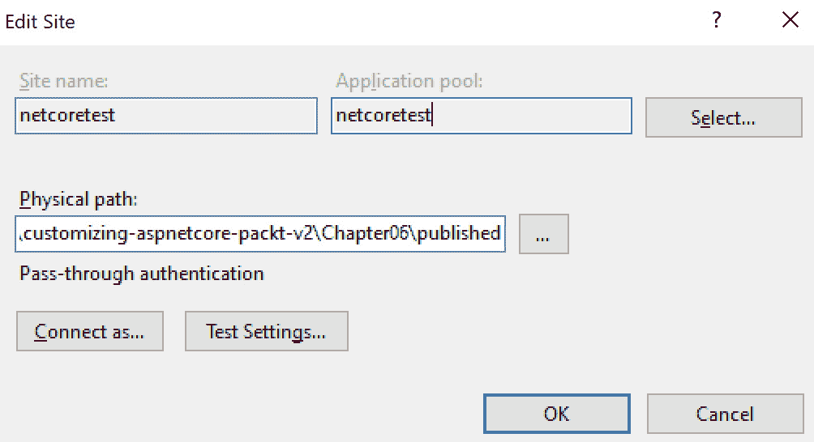

# 第六章：*第六章*：使用不同的托管模型

在本章中，我们将讨论如何在 ASP.NET Core 中自定义托管。我们将探讨托管选项和不同类型的托管，并简要介绍在 IIS 上的托管。本章只是一个概述。对于每个主题，都有可能进行更深入的探讨，但这将需要一本完整的书来阐述！

在本章中，我们将涵盖以下主题：

+   设置 `WebHostBuilder`

+   设置 Kestrel

+   设置 `HTTP.sys`

+   在 IIS 上托管

+   在 Linux 上使用 Nginx 或 Apache

本章中的主题涉及 ASP.NET Core 架构的托管层：


图 6.1 – ASP.NET Core 架构

本章探讨了以下服务器架构主题：


图 6.2 – ASP.NET 服务器架构

# 技术要求

对于本章，我们只需要设置一个小型的空 Web 应用程序：

```cs
dotnet new web -n ExploreHosting -o ExploreHosting
```

就这些了。用 Visual Studio Code 打开它：

```cs
cd ExploreHosting
code .
```

*Et voilà*！一个简单的项目在 Visual Studio Code 中打开。

本章的代码可以在 GitHub 上找到：[`github.com/PacktPublishing/Customizing-ASP.NET-Core-6.0-Second-Edition/tree/main/Chapter06`](https://github.com/PacktPublishing/Customizing-ASP.NET-Core-6.0-Second-Edition/tree/main/Chapter06)。

# 设置 WebHostBuilder

与上一章一样，在本节中我们将重点关注 `Program.cs`。`WebHostBuilder` 是我们的朋友。这是配置和创建 Web 服务器的地方。

以下代码片段是使用 .NET CLI 的 `dotnet new` 命令创建的每个新 ASP.NET Core Web 项目的默认配置：

```cs
var builder = WebApplication.CreateBuilder(args);
var app = builder.Build();
app.MapGet("/", () => "Hello World!");
app.Run();
```

如我们从之前的章节中已经了解到的，默认构建器已经预先配置了所有必要的功能。为了在 Azure 或本地 IIS 上成功运行应用程序，所有需要配置的内容都已为您配置好。

但是，您可以覆盖几乎所有这些默认配置，包括托管配置。

接下来，让我们设置 Kestrel。

# 设置 Kestrel

在创建 `WebHostBuilder` 之后，我们可以使用各种功能来配置构建器。在这里，我们可以看到其中之一，它指定了应该使用的 `Startup` 类。

注意

如在 *第四章* 中讨论的，*使用 Kestrel 配置和自定义 HTTPS*，Kestrel 是托管应用程序的一种可能选择。Kestrel 是内置在 .NET 中并基于 .NET 套接字实现的 Web 服务器。之前，它是基于 **libuv** 构建的，这是 Node.js 使用的相同 Web 服务器。Microsoft 移除了对 **libuv** 的依赖，并基于 .NET 套接字创建了自己的 Web 服务器实现。

在上一章中，我们看到了 `UseKestrel` 方法来配置 Kestrel 选项：

```cs
.UseKestrel((host, options) =>
{
    // ...
})
```

第一个参数是`WebHostBuilderContext`，用于访问已配置的托管设置或配置本身。第二个参数是一个用于配置 Kestrel 的对象。这个代码片段显示了我们在上一章中配置套接字端点时所做的工作，主机需要监听这些端点：

```cs
builder.WebHost.UseKestrel((host, options) =>
{
    var filename = host.Configuration.GetValue(
        "AppSettings:certfilename", "");
    var password = host.Configuration.GetValue(
        "AppSettings:certpassword", "");
    options.Listen(IPAddress.Loopback, 5000);
    options.Listen(IPAddress.Loopback,  5001,  
        listenOptions  =>
        {
            listenOptions.UseHttps(filename, password);
        });
});
```

（你可能需要向`System.Net`添加一个`using`语句。）

这将覆盖默认配置，你可以传递 URL，例如，使用`launchSettings.json`的`applicationUrl`属性或环境变量。

现在，让我们看看如何设置`HTTP.sys`。

# 设置 HTTP.sys

另外还有一个托管选项，一个不同的 Web 服务器实现。`HTTP.sys`是 Windows 内部一个相当成熟的库，可以用来托管你的 ASP.NET Core 应用程序：

```cs
.UseHttpSys(options =>
{
    // ...
})
```

`HTTP.sys`与 Kestrel 不同。它不能用于 IIS，因为它与 IIS 的 ASP.NET Core 模块不兼容。

使用`HTTP.sys`而不是 Kestrel 的主要原因是在不需要 IIS 的情况下，你需要将你的应用程序暴露于互联网。

注意

IIS 已经在`HTTP.sys`上运行多年。这意味着`UseHttpSys()`和 IIS 使用相同的 Web 服务器实现。要了解更多关于`HTTP.sys`的信息，请阅读文档，相关链接可以在*进一步阅读*部分找到。

接下来，让我们看看如何使用 IIS 进行托管。

# 在 IIS 上托管

ASP.NET Core 应用程序不应当直接暴露于互联网，即使它支持 Kestrel 或`HTTP.sys`。最好在两者之间有一个反向代理，或者至少有一个监控托管进程的服务。对于 ASP.NET Core 来说，IIS 不仅仅是一个反向代理。它还负责托管进程，以防因错误而中断。如果发生这种情况，IIS 将重新启动进程。在 Linux 上，Nginx 可以用作反向代理，同时也负责托管进程。

注意

确保你创建了一个新项目或移除了上一节中 Kestrel 的配置。这不会与 IIS 一起工作。

要在 IIS 或 Azure 上托管 ASP.NET Core Web，你需要先发布它。发布不仅编译项目；它还准备项目在 IIS、Azure 或 Linux 上的 Web 服务器（如 Nginx）上托管。

以下命令将发布项目：

```cs
dotnet publish -o ..\published -r win-x64
```

在系统浏览器中查看时，它应该如下所示：


图 6.3 – .NET 发布文件夹

这会产生一个可以在 IIS 中映射的输出。它还创建了一个`web.config`文件，用于添加 IIS 或 Azure 的设置。它包含了一个作为 DLL 编译的 Web 应用程序。

如果你发布了一个自包含的应用程序，它也包含了运行时本身。自包含的应用程序会自带.NET Core 运行时，但交付的大小会增加很多。

在 IIS 上？只需创建一个新的 Web，并将其映射到放置发布输出的文件夹：



图 6.4 – .NET 发布对话框

如果您需要更改安全性，如果您有一些数据库连接等，事情会变得稍微复杂一些。这可以是一个单独章节的主题。


图 6.5 – 在浏览器中查看的“Hello World!”

*图 6.5*显示了示例项目中`Program.cs`中小的`MapGet`的输出：

```cs
app.MapGet("/", () => "Hello World!");
```

接下来，我们将讨论一些 Linux 的替代方案。

# 在 Linux 上使用 Nginx 或 Apache

在 Linux 上发布 ASP.NET Core 应用程序看起来与在 IIS 上看起来非常相似，但为反向代理做准备需要一些额外的步骤。您需要一个像 Nginx 或 Apache 这样的反向代理服务器，它将流量转发到 Kestrel 和 ASP.NET Core 应用程序：

1.  首先，您需要允许您的应用程序接受两个特定的转发头。为此，打开`Startup.cs`，并在`UseAuthentication`中间件之前将以下行添加到`Configure`方法中：

    ```cs
    app.UseForwardedHeaders(new ForwardedHeadersOptions
    {
        ForwardedHeaders = ForwardedHeaders.XForwardedFor 
            | ForwardedHeaders.XForwardedProto
    });
    ```

1.  您还需要信任来自反向代理的传入流量。这需要您将以下行添加到`ConfigureServices`方法中：

    ```cs
    Builder.Services.Configure<ForwardedHeadersOptions>(
      options =>
    {
        options.KnownProxies.Add(
            IPAddress.Parse("10.0.0.100"));
    });
    ```

    您可能需要向`Microsoft.AspNetCore.HttpOverrides`添加一个`using`。

1.  在这里添加代理的 IP 地址。这只是一个示例。

1.  然后，您需要发布应用程序：

    ```cs
    dotnet publish --configuration Release
    ```

1.  将构建输出复制到名为`/var/www/yourapplication`的文件夹中。您还应该在 Linux 上通过调用以下命令进行快速测试：

    ```cs
    dotnet <yourapplication.dll>
    ```

1.  在这里，`yourapplication.dll`是编译后的应用程序，包括路径。如果一切正常，您应该能够在`http://localhost:5000/`上调用您的 Web 应用程序。

    如果一切正常，应用程序应作为服务运行。这需要您在`/etc/systemd/system/`上创建一个服务文件。将文件命名为`kestrel-yourapplication.service`，并在其中放置以下内容：

    ```cs
    [Unit]
    Description=Example .NET Web API App running on Ubuntu
    [Service]
    WorkingDirectory=/var/www/yourapplication
    ExecStart=/usr/bin/dotnet/var/www/yourapplication/yourapplication.dll
    Restart=always
    # Restart service after 10 seconds if the dotnet service crashes:
    RestartSec=10
    KillSignal=SIGINT
    SyslogIdentifier=dotnet-example
    User=www-data
    Environment=ASPNETCORE_ENVIRONMENT=Production
    Environment=DOTNET_PRINT_TELEMETRY_MESSAGE=false
    [Install]
    WantedBy=multi-user.target 
    ```

    确保第 5 行和第 6 行中的路径指向您放置构建输出的文件夹。此文件定义了您的应用程序应在默认端口上作为服务运行。它还监视应用程序，并在它崩溃时重新启动它。它还定义了传递给配置应用程序的环境变量。请参阅*第一章*，*自定义日志记录*，了解如何使用环境变量配置您的应用程序。

接下来，我们将看到如何配置 Nginx。

## 配置 Nginx

现在，您可以使用以下代码告诉 Nginx 要做什么：

```cs
server {
    listen        80;
    server_name   example.com *.example.com;
    location / {
        proxy_pass         http://localhost:5000;
        proxy_http_version 1.1;
        proxy_set_header   Upgrade $http_upgrade;
        proxy_set_header   Connection keep-alive;
        proxy_set_header   Host $host;
        proxy_cache_bypass $http_upgrade;
        proxy_set_header   X-Forwarded-For
                           $proxy_add_x_forwarded_for;
        proxy_set_header   X-Forwarded-Proto $scheme;
    }
}
```

这告诉 Nginx 将端口`80`上的调用转发到`example.com`，以及它的子域名到`http://localhost:5000`，这是您应用程序的默认地址。

## 配置 Apache

Apache 的配置看起来与 Nginx 方法非常相似，并在最后做同样的事情：

```cs
<VirtualHost *:*>
   RequestHeader set "X-Forwarded-Proto 
     expr=%{REQUEST_SCHEME}
</VirtualHost>
<VirtualHost *:80>
    ProxyPreserveHost On
    ProxyPass / http://127.0.0.1:5000/
    ProxyPassReverse / http://127.0.0.1:5000/
    ServerName www.example.com
    ServerAlias *.example.com
    ErrorLog ${APACHE_LOG_DIR}yourapplication-error.log
    CustomLog ${APACHE_LOG_DIR}yourapplication-access.log
    common
</VirtualHost>
```

Nginx 和 Apache 就到这里。现在让我们总结这一章。

# 摘要

ASP.NET Core 和 .NET CLI 已经包含了所有工具，可以将它们部署到各种平台，并设置好以准备在 Azure、IIS 以及 Nginx 上运行。这非常简单，在文档中有详细描述。

目前，我们拥有 `WebHostBuilder`，它可以创建应用程序的托管环境。在 3.0 版本中，我们有了 `HostBuilder`，它能够创建一个完全独立于任何 Web 上下文的托管环境。

ASP.NET Core 6.0 具有在应用程序内部运行后台任务的功能。要了解更多信息，请阅读下一章。

# 进一步阅读

更多信息，您可以参考以下链接：

+   **Kestrel 文档**：[`docs.microsoft.com/en-us/aspnet/core/fundamentals/servers/kestrel?view=aspnetcore-6.0`](https://docs.microsoft.com/en-us/aspnet/core/fundamentals/servers/kestrel?view=aspnetcore-6.0)

+   **HTTP.sys 文档**：[`docs.microsoft.com/en-us/aspnet/core/fundamentals/servers/httpsys?view=aspnetcore-6.0`](https://docs.microsoft.com/en-us/aspnet/core/fundamentals/servers/httpsys?view=aspnetcore-6.0)

+   **ASP.NET Core**：[`docs.microsoft.com/en-us/aspnet/core/host-and-deploy/aspnet-core-module?view=aspnetcore-6.0`](https://docs.microsoft.com/en-us/aspnet/core/host-and-deploy/aspnet-core-module?view=aspnetcore-6.0)
