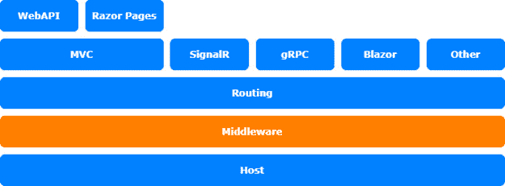
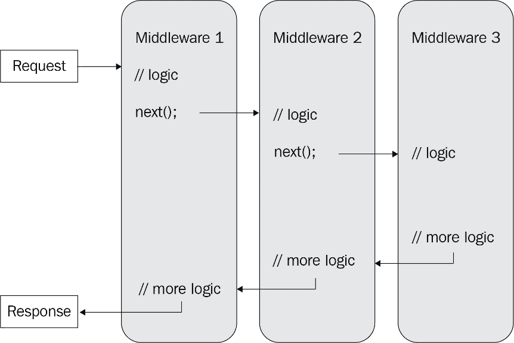

# 第八章：*第八章*：编写自定义中间件

哇，我们这本书已经进入了第八章！在本章中，我们将学习关于 **中间件** 的知识以及如何使用它来进一步定制你的应用程序。我们将快速浏览中间件的基础知识，然后我们会探索一些你可以用它做的特别事情。

在本章中，我们将涵盖以下主题：

+   介绍中间件

+   编写自定义中间件

+   探索中间件的潜力

+   在 ASP.NET Core 3.0 及更高版本中使用中间件

本章涉及的内容与 ASP.NET Core 架构的中间件层相关：



图 8.1 – ASP.NET Core 架构

# 技术要求

要跟随本章的描述，你需要创建一个 ASP.NET Core MVC 应用程序。为此，打开你的控制台、shell 或 Bash 终端，切换到你的工作目录。然后，使用以下命令创建一个新的 MVC 应用程序：

```cs
dotnet new web -n MiddlewaresSample -o MiddlewaresSample
```

现在，通过双击项目文件在 Visual Studio 中打开项目，或者在 Visual Studio Code 中，在已经打开的控制台中输入以下命令：

```cs
cd MiddlewaresSample
code .
```

注意

.NET 6.0 中的简单 `web` 项目模板发生了变化。在 6.0 版本中，Microsoft 引入了 **最小 API** 并将项目模板更改为使用最小 API 方法。这是一种更简单的方式来引导和开始一个 Web 应用程序。

本章中所有的代码示例都可以在本书的 **GitHub** 仓库中找到，网址为 [`github.com/PacktPublishing/Customizing-ASP.NET-Core-6.0-Second-Edition/tree/main/Chapter08`](https://github.com/PacktPublishing/Customizing-ASP.NET-Core-6.0-Second-Edition/tree/main/Chapter08)。

# 介绍中间件

大多数人可能已经知道什么是中间件，但有些人可能不知道。即使你已经使用 ASP.NET Core 有一段时间了，你也不必详细了解中间件实例，因为它们大多隐藏在诸如 `UseMvc()`、`UseAuthentication()`、`UseDeveloperExceptionPage()` 等命名良好的扩展方法之后。每次你在 `Startup.cs` 文件中的 `Configure` 方法中调用 `Use` 方法时，你都会隐式地使用至少一个——或者可能更多——中间件组件。

中间件组件是一段处理请求管道的代码。想象一下请求管道就像一个巨大的管子，你可以在里面调用某个东西，然后会有回声。中间件负责产生这个回声——它操纵声音以丰富信息，处理原始声音，或者处理回声。

中间件组件按照它们配置的顺序执行。首先配置的中间件组件是第一个被执行的。

在 ASP.NET Core Web 应用程序中，如果客户端请求一个图像或任何其他静态文件，`StaticFileMiddleware`会搜索该资源，如果找到，则返回该资源。如果没有找到，这个中间件组件除了调用下一个中间件外，不做任何事情。如果没有处理请求管道的最终中间件，请求将返回空。`MvcMiddleware`组件也会检查请求的资源，尝试将其映射到配置的路由，执行控制器，创建视图，并返回 HTML 或 Web API 结果。如果`MvcMiddleware`找不到匹配的控制器，它仍然会返回一个结果——在这种情况下，是一个`404`状态结果。所以，在任何情况下，它都会返回一个回声。这就是为什么`MvcMiddleware`是配置的最后一个中间件组件。



图 8.2 – 中间件工作流程图

`500`状态：

1.  如果你创建一个空的 ASP.NET Core 应用程序，如*技术要求*部分所述，你将能够看到管道是如何执行的。

1.  使用你喜欢的编辑器打开`Program.cs`。与常规 ASP.NET Core 应用程序相比，这应该相当小。在 ASP.NET Core 6.0 中，Microsoft 引入了最小 API 方法，它简化了应用程序配置，并隐藏了大量的默认配置，不让开发者看到。Microsoft 还在 ASP.NET Core 中实现了默认的`using`语句。正因为如此，你最初看不到任何`using`语句。这是 ASP.NET Core 6.0 中`Program.cs`的样貌：

    ```cs
    var builder = WebApplication.CreateBuilder(args);
    var app = builder.Build();
    app.MapGet("/", () => "Hello World!");
    app.Run();
    ```

    在这里，特殊的 lambda 中间件绑定到默认路由，并且只将`"Hello World!"`写入响应流。响应流是我们之前学过的回声。这个特殊的中间件停止了管道，并返回类似回声的东西。因此，它是最后运行的中间件。

1.  将调用`app.MapGet()`的行替换为以下代码，在`app.Run()`函数之前：

    ```cs
    app.Use(async (context, next) =>{
        await context.Response.WriteAsync("===");
        await next();
        await context.Response.WriteAsync("===");
    });
    app.Use(async (context, next) =>
    {
        await context.Response.WriteAsync(">>>>>> ");
        await next();
        await context.Response.WriteAsync(" <<<<<<");
    });
    app.Run(async context =>
    {
        await context.Response.WriteAsync("Hello World!");
    });
    ```

    这两个`app.Use()`调用也创建了两个 lambda 中间件，但这次，除了处理特定请求外，中间件组件还会调用它们的后续者：每个中间件组件都知道应该跟随哪个中间件组件，因此会调用它。`app.Run()`的调用替换了`app.MapGet()`的调用，但它们基本上做的是同一件事，只是`app.Run()`直接写入响应流。使用`app.Use()`创建的 lambda 中间件在调用下一个中间件之前和之后写入响应流。在调用下一个中间件之前，实际请求被处理，在调用下一个中间件之后，响应（回声）被处理。这应该展示了管道是如何工作的。

1.  如果你现在运行应用程序（使用`dotnet run`），并在浏览器中打开显示的 URL，你应该看到如下所示的纯文本结果：

    ```cs
    ===>>>>>> Hello World! <<<<<<===
    ```

这对你来说有道理吗？如果有，让我们继续看看如何使用这个概念为请求管道添加一些额外的功能。

# 编写自定义中间件

ASP.NET Core 基于中间件。在请求过程中执行的所有逻辑都基于中间件。因此，我们可以使用它来向 Web 添加自定义功能。在以下过程中，我们想要找出每个通过请求管道的请求的执行时间：

1.  我们可以通过在调用下一个中间件之前创建并启动一个计时器，并在调用下一个中间件之后停止测量执行时间来实现这一点，如下所示：

    ```cs
    app.Use(async (context, next) =>
    {
        var s = new Stopwatch();
        s.Start();
        // execute the rest of the pipeline
        await next();
        s.Stop(); //stop measuring
        var result = s.ElapsedMilliseconds;
        // write out the milliseconds needed
        await context.Response.WriteAsync($" Time needed: 
          {result} milliseconds");
    });
    ```

    你可能需要添加一个`using`语句来引用`System.Diagnostics`。

    之后，我们将经过的毫秒数返回到响应流中。

1.  如果你编写了更多的中间件组件，`Program.cs`中的配置会变得相当混乱。这就是为什么大多数中间件组件都是作为单独的类编写的。这可能看起来像这样：

    ```cs
    using System.Diagnostics;
    public class StopwatchMiddleware
    {
        private readonly RequestDelegate _next;
        public StopwatchMiddleware(RequestDelegate next)
        {
            _next = next;
        }
        public async Task Invoke(HttpContext context)
        {
            var s = new Stopwatch();
            s.Start();
            // execute the rest of the pipeline
            await _next(context);
            s.Stop(); //stop measuring
            var result = s.ElapsedMilliseconds;
            // write out the milliseconds needed
            await context.Response.WriteAsync($" Time 
              needed: {result} milliseconds");
        }
    }
    ```

    这样，我们通过构造函数和`Invoke()`方法中的当前上下文来获取下一个中间件组件执行。

    注意

    中间件在应用程序启动时初始化，构造函数在整个应用程序生命周期中只运行一次。另一方面，`Invoke()`方法对每个请求只调用一次。

1.  要使用此中间件，有一个通用的`UseMiddleware()`方法可用，你可以使用它：

    ```cs
    app.UseMiddleware<StopwatchMiddleware>();
    ```

1.  然而，更优雅的方法是创建一个`extension`方法来封装这个调用：

    ```cs
    public static class StopwatchMiddlewareExtension
    {
        public static IApplicationBuilder 
          UseStopwatch(this IApplicationBuilder app)
        {
            app.UseMiddleware<StopwatchMiddleware>();
            return app;
        }
    }
    ```

1.  现在，你可以简单地这样调用它：

    ```cs
    app.UseStopwatch();
    ```

这样，你就可以通过请求管道为 ASP.NET Core 应用程序提供额外的功能。在你的中间件中，你可以使用整个`HttpContext`来操作请求或甚至响应。

例如，`AuthenticationMiddleware`试图从请求中收集用户信息。如果没有找到任何信息，它将通过发送特定的响应回客户端来请求信息。如果找到了一些信息，它将通过这种方式将其添加到请求上下文中，并使其对整个应用程序可用。

# 探索中间件的潜力

你可以用中间件做很多事情。例如，你知道你可以将请求管道分成两个或更多管道吗？在本节中，我们将探讨如何做到这一点以及其他几个方面。

## 使用`/map`分支管道

下面的代码片段展示了如何根据特定的路径创建请求管道的分支：

```cs
app.Map("/map1", app1 =>
{
    // some more Middleware
    app1.Run(async context =>
    {
        await context.Response.WriteAsync("Map Test 1");
    });
});
app.Map("/map2", app2 =>
{
    // some more Middleware
    app2.Run(async context =>
    {
        await context.Response.WriteAsync("Map Test 2");
    });
});
// some more Middleware
```

`/map1`路径是一个特定的分支，它继续在内部扩展请求管道——这与`/map2`路径相同。两个映射都有自己的中间件配置在内。所有其他未指定的路径都将遵循主分支。

## 使用`MapWhen()`分支管道

此外，还有一个`MapWhen()`方法可以根据条件分支管道，而不是基于路径的分支：

```cs
public void Configure(IApplicationBuilder app)
{
    app.MapWhen(
        context => 
          context.Request.Query.ContainsKey("branch"),
        app1 =>
        {
            // some more Middleware
            app1.Run(async context =>
            {
                await context.Response.WriteAsync(
                    "MapBranch Test");
            });
    });
    // some more Middleware
    app.Run(async context =>
    {
        await context.Response.WriteAsync(
            "Hello from non-Map delegate.");
    });
}
```

接下来，我们将看看如何使用中间件来创建条件。

## 使用中间件创建条件

您可以根据配置值创建条件，或者，如这里所示，根据请求上下文属性创建条件。在之前的示例中，使用了查询字符串属性。您可以使用 HTTP 头、表单属性或请求上下文的任何其他属性。

您还可以嵌套映射以创建所需的子分支和孙分支。

我们可以使用 `Map()` 或 `MapWhen()` 分别提供基于特定路径或特定条件的特殊 API 或资源。ASP.NET Core 的 `HealthCheck` API 就是这样的：首先，它使用 `MapWhen()` 来指定要使用的端口，然后，它使用 `Map()` 来设置 `HealthCheck` API 的路径（或者，如果没有指定端口，则使用 `Map()`）。最后，使用 `HealthCheckMiddleware`。以下代码只是一个示例，以展示其外观：

```cs
private static void UseHealthChecksCore(IApplicationBuilder 
  app, PathString path, int? port, object[] args)
{
    if (port == null)
    {
        app.Map(path, 
            b => 
             b.UseMiddleware<HealthCheckMiddleware>(args));
    }
    else
    {
        app.MapWhen(
            c => c.Connection.LocalPort == port,
            b0 => b0.Map(path, 
            b1 => 
              b1.UseMiddleware<HealthCheckMiddleware>(args)
            )
        );
    };
}
```

接下来，让我们看看如何在 ASP.NET Core 更新版本中使用终止中间件组件。

# 在 ASP.NET Core 3.0 及以后的版本中使用中间件

在 ASP.NET Core 3.0 及以后的版本中，有两种新的中间件元素，它们被称为 `UseRouting` 和 `UseEndpoints`：

```cs
public void Configure(IApplicationBuilder app, 
  IWebHostEnvironment env)
{
    if (env.IsDevelopment())
    {
        app.UseDeveloperExceptionPage();
    }
    app.UseRouting();
    app.UseEndpoints(endpoints =>
    {
        endpoints.MapGet("/", async context =>
        {
           await context.Response.WriteAsync("Hello 
                                              World!");
        });
    });
}
```

第一个是一个使用路由的中间件组件，另一个使用端点。那么，我们到底在关注什么呢？

这就是新的 **端点路由**。之前，路由是 MVC 的一部分，并且它只与 MVC、Web API 和基于 MVC 框架的框架一起工作。然而，在 ASP.NET Core 3.0 及以后的版本中，路由不再在 MVC 框架中。现在，MVC 和其他框架被映射到特定的路由或端点。有不同类型的端点定义可用。

在前面的代码片段中，将 `GET` 请求映射到页面根 URL。在下一个代码片段中，MVC 被映射到路由模式，而 **Razor Pages** 被映射到基于 Razor Pages 特定文件结构的路由：

```cs
app.UseEndpoints(endpoints =>
{
    endpoints.MapControllerRoute(
        name: "default",
        pattern: "{controller=Home}/{action=Index}/{id?}");
    endpoints.MapRazorPages();
});
```

已经没有 `UseMvc()` 方法了，即使它仍然存在于 `IApplicationBuilder` 对象级别并且仍然可以工作，以防止现有代码损坏。现在，有新的方法可以更细致地激活 ASP.NET Core 功能。

这些是 ASP.NET Core 5.0 或更高版本中最常用的 `Map` 方法：

+   `endpoints.MapAreaControllerRoute(...);`

+   `endpoints.MapControllerRoute(...);`

+   `endpoints.MapBlazorHub(...);`

+   `endpoints.MapHub(...);`

+   `endpoints.MapRazorPages(...);`

+   `endpoints.MapHealthChecks(...);`

有许多更多方法来定义回退端点、将路由和 HTTP 方法映射到委托，以及用于中间件组件。

如果您想创建适用于所有请求的中间件，例如 `StopWatchMiddleware`，它将在 `IApplicationBuilder` 上像以前一样工作。如果您想编写适用于特定路径或路由的中间件，您需要为它创建一个 `Map` 方法来将其映射到该路由。

重要提示

现在不再建议在中间件内部处理路由。相反，你应该使用新的端点路由。这种方法使得中间件更加通用，并且它将使用单个配置在多个路由上工作。

我最近编写了一个中间件，在 ASP.NET Core 应用程序中提供 **GraphQL** 端点。然而，我不得不重写它以遵循新的 ASP.NET Core 路由。旧的方法仍然可以工作，但它将路径和路由与新的 ASP.NET Core 路由分开处理。让我们看看如何处理这些情况。

## 重写终止中间件以满足当前标准

如果你有一个提供不同端点的现有中间件，你应该将其更改为使用新的端点路由：

1.  例如，让我们创建一个小型的、模拟的中间件，它将应用程序状态写入特定的路由。在这个例子中，没有自定义路由处理：

    ```cs
    namespace MiddlewaresSample;
    public class AppStatusMiddleware
    {
        private readonly RequestDelegate _next;
        private readonly string _status;
        public AppStatusMiddleware(
            RequestDelegate next, string status)
        {
            _next = next;
            _status = status;
        }
        public async Task Invoke(HttpContext context)
        {
            await context.Response.WriteAsync(
                $"Hello {_status}!");
        }
    }
    ```

    我们需要做的第一件事是在 `IEndpointRouteBuilder` 对象上编写一个 `extension` 方法。这个方法有一个作为可选参数的路由模式，并返回一个 `IEndpointConventionBuilder` 对象，以便为路由启用 **跨源资源共享**（**CORS**）、身份验证或其他条件。

1.  现在，我们应该添加一个扩展方法来简化中间件的使用：

    ```cs
    public static class MapAppStatusMiddlewareExtension
    {
        public static IEndpointConventionBuilder 
          MapAppStatus(
            this IEndpointRouteBuilder routes,
            string pattern = "/", 
            string name = "World")
        {
            var pipeline = routes
                .CreateApplicationBuilder()
                .UseMiddleware<AppStatusMiddleware>(name)
                .Build();
            return routes.Map(pattern, pipeline)
                .WithDisplayName("AppStatusMiddleware");
        }
    }
    ```

1.  完成之后，我们可以使用 `MapAppStatus` 方法将其映射到特定的路由：

    ```cs
    app.UseRouting();
    app.UseEndpoints(endpoints =>
    {
        endpoints.MapGet("/", () => "Hello World!");
        endpoints.MapAppStatus("/status", "Status");
    });
    ```

1.  现在，我们可以在浏览器中通过输入以下地址来调用该路由：`http://localhost:5000/status`。

我们将在 *第九章* 中学习更多关于端点路由以及如何自定义它，*与端点路由一起工作*。现在，让我们回顾一下关于中间件我们已经学到了什么。

# 摘要

大多数 ASP.NET Core 功能都是基于中间件的，在本章中，你学习了中间件的工作原理以及如何创建自己的中间件组件以扩展 ASP.NET 框架。你还学习了如何使用新的路由向自己的自定义终止中间件组件添加路由。

在下一章中，我们将探讨 ASP.NET Core 中的新端点路由，它允许你以简单灵活的方式创建自己的托管端点。
