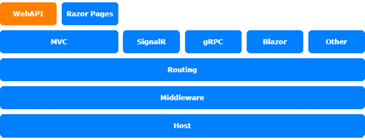
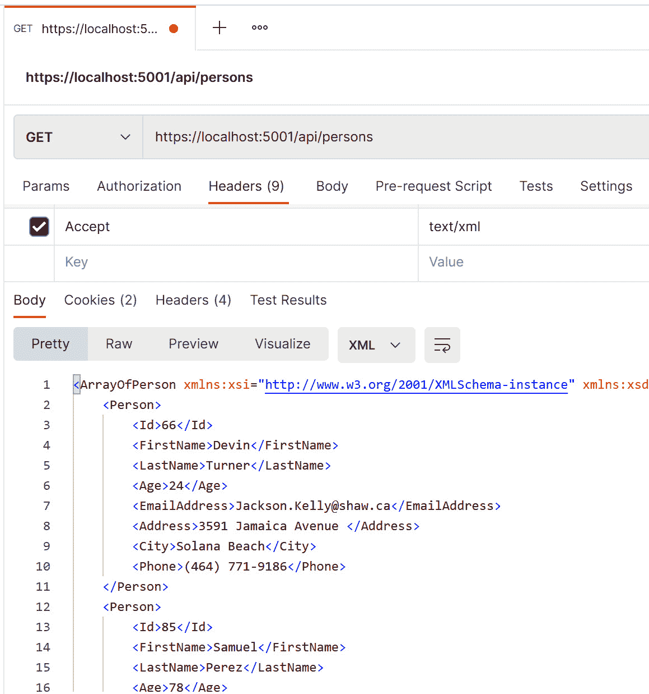
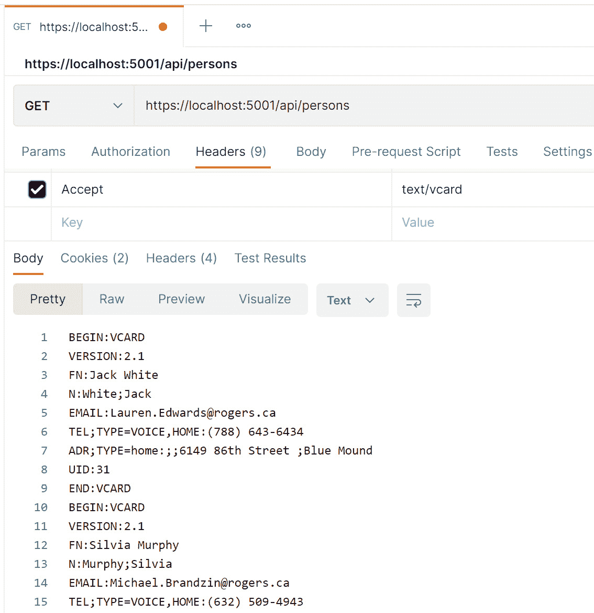
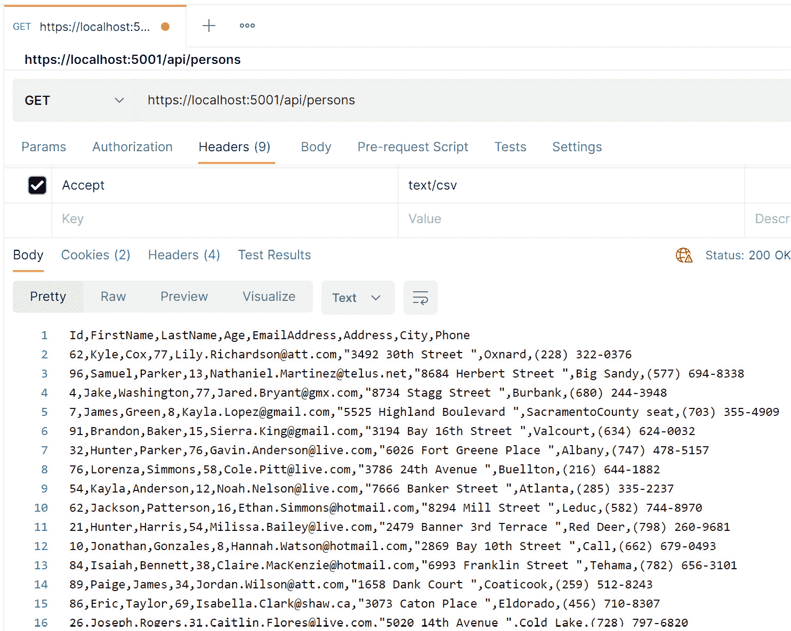

# 第十二章：*第十二章*：使用自定义 OutputFormatter 进行内容协商

在本章中，我们将学习如何以不同的格式和类型将数据发送到客户端。默认情况下，ASP.NET Core Web API 以 JSON 格式发送数据，但还有一些其他的数据分发方式。

本章将涵盖以下内容：

+   介绍 `OutputFormatter` 对象

+   创建自定义 `Outputformatter` 对象

本章讨论的主题与 ASP.NET Core 架构的 WebAPI 层相关：



图 12.1 – ASP.NET Core 架构

# 技术要求

要遵循本章中的示例，你需要创建一个 ASP.NET Core MVC 应用程序。为此，打开你的控制台、shell 或 Bash 终端，切换到你的工作目录。然后，使用以下命令创建一个新的 MVC 应用程序：

```cs
dotnet new webapi -n OutputFormatterSample -o OutputFormatterSample
```

现在，通过双击项目文件或在 Visual Studio Code 中在已打开的控制台中输入以下命令来打开项目：

```cs
cd OutputFormatterSample
code .
```

本章中所有的代码示例都可以在本书的**GitHub**仓库中找到，仓库地址为[`github.com/PacktPublishing/Customizing-ASP.NET-Core-6.0-Second-Edition/tree/main/Chapter12`](https://github.com/PacktPublishing/Customizing-ASP.NET-Core-6.0-Second-Edition/tree/main/Chapter12)。

# 介绍 OutputFormatter 对象

在 ASP.NET Core 中，`OutputFormatters` 是将现有数据转换为不同格式以通过 HTTP 发送到客户端的类。Web API 使用默认的 `OutputFormatters` 将对象转换为 JSON，这是发送结构化数据的默认格式。其他内置格式化程序包括 XML 格式化程序和纯文本格式化程序。

通过所谓的 *内容协商*，客户端能够决定他们想要检索哪种格式。客户端需要在 `Accept` 标头中指定格式的内容类型。内容协商在 `ObjectResult` 中实现。

默认情况下，Web API 总是返回 JSON，即使你在标头中接受 text/XML。这就是为什么内置的 XML 格式化程序默认未注册。

向 ASP.NET Core 添加 `XmlSerializerOutputFormatter` 有两种方式：

+   以下代码片段展示了第一种方式：

    ```cs
    builder.Services.AddControllers()
        .AddXmlSerializerFormatters();
    ```

+   或者，你也可以使用以下方法：

    ```cs
    builder.Services.AddControllers()
        .AddMvcOptions(options =>
        {
            options.OutputFormatters.Add(
                new XmlSerializerOutputFormatter());
        });
    ```

你可能需要将 `Microsoft.AspNetCore.Mvc.Formatters` 命名空间添加到 `using` 语句中。

还有一个名为 `XmlDataContractSerializerOutputFormatter` 的格式化程序可用，它内部使用 `DataContractSerializer`，并且在配置上更加灵活。

默认情况下，任何 `Accept` 标头都会自动转换为 `application/json`，即使你使用了这些方法之一。然而，我们可以解决这个问题。

如果你想要允许客户端接受不同的标头，你需要关闭这种转换：

```cs
builder.Services.AddControllers()
    .AddMvcOptions(options =>
    {
        options.RespectBrowserAcceptHeader = true; 
          // false by default
    });
```

一些第三方组件可能不完全支持 ASP.NET Core 5.0 或更高版本，不会异步写入响应流，但自 ASP.NET Core 3.0 起的默认配置仅允许异步写入。

要启用同步写入访问，你需要在 `ConfigureServices` 方法中添加以下行：

```cs
builder.Services.Configure<KestrelServerOptions>(options =>
{
    options.AllowSynchronousIO = true;
});
```

将 `Microsoft.AspNetCore.Server.Kestrel.Core` 命名空间添加到 `using` 语句中，以便访问选项。

要尝试格式化程序，让我们设置一个小型的测试项目。

## 准备测试项目

使用控制台，我们将创建一个小型的 ASP.NET Core 网络 API 项目，使用之前在 *技术要求* 部分中显示的命令：

1.  首先，执行以下命令以添加必要的 `GenFu` 是一个易于创建测试数据的优秀库，第二个包 `CsvHelper` 帮助我们轻松写入 CSV 数据。

1.  现在，在 Visual Studio 或 VS Code 中打开项目，并在 `controller` 文件夹中创建一个新的 API 控制器 `PersonsController`：

    ```cs
    [Route("api/[controller]")]
    [ApiController]
    public class PersonsController : ControllerBase
    {
    }
    ```

1.  打开 `PersonsController.cs` 文件，并添加一个 `Get()` 方法，如下所示：

    ```cs
    [HttpGet]
    public ActionResult<IEnumerable<Person>> Get()
    {
        var persons = A.ListOf<Person>(25);
        return persons;
    }
    ```

    你可能需要在文件开头添加以下 `using` 语句：

    ```cs
    using GenFu;
    using Microsoft.AspNetCore.Mvc;
    using OutputFormatterSample.Models;
    ```

    使用 `GenFu` 创建一个包含 25 个人的列表。属性将自动填充真实数据。`GenFu` 是一个开源、快速、轻量级且可扩展的测试数据生成器。它包含内置的姓名、城市、国家、电话号码等列表，并自动将数据填充到类的正确属性中，具体取决于属性名称。例如，名为 `City` 的属性将填充城市名称，而名为 `Phone`、`Telephone` 或 `Phonenumber` 的属性将填充格式良好的假电话号码。你将在稍后看到 `GenFu` 的魔法和结果。

1.  现在，创建一个 `Models` 文件夹，并在其中创建一个名为 `Person.cs` 的新文件，并在其中包含 `Person` 类：

    ```cs
    public class Person
    {
        public int Id { get; set; }
        public string? FirstName { get; set; }
        public string? LastName { get; set; }
        public int Age { get; set; }
        public string? EmailAddress { get; set; }
        public string? Address { get; set; }
        public string? City { get; set; }
        public string? Phone { get; set; }
    }
    ```

1.  也要打开 `Program.cs` 文件，添加 XML 格式化程序，并允许其他 `AcceptHeader`，如前所述：

    ```cs
    builder.Services.AddControllers()
        .AddMvcOptions(options =>
        {
            options.RespectBrowserAcceptHeader = true; 
              // false by default
            options.OutputFormatters.Add(
                new XmlSerializerOutputFormatter());
        });
    ```

    到此为止。现在，你能够从网络 API 中检索数据。

1.  使用 `dotnet run` 命令启动项目。

接下来，我们将测试 API。

# 测试网络 API

测试网络 API 的最佳工具是 **Fiddler** ([`www.telerik.com/fiddler`](https://www.telerik.com/fiddler)) 或 **Postman** ([`www.postman.com/`](https://www.postman.com/))。我更喜欢 Postman，因为它更容易使用。你可以使用这两个工具中的任何一个，但在这些建议中，我们将使用 Postman：

1.  在 Postman 中创建一个新的请求。将 API URL（[`localhost:5001/api/persons`](https://localhost:5001/api/persons)（URL 的端口号可能不同））输入到 `address` 字段中，然后添加一个带有 `Accept` 键和 `application/json` 值的标题。

1.  在点击 `GenFu` 对象将数据放入人员的属性中后，基于属性类型和属性名称：真实的首字母和姓氏，以及真实的城市和格式良好的电话号码。

1.  接下来，让我们测试 XML 输出格式化器。在 Postman 中，将 `Accept` 标头从 `application/json` 更改为 `text/xml`，然后点击 **发送**：



图 12.3 – Postman 中 XML 输出的截图

现在，我们已经有了 XML 格式的输出。现在，让我们更进一步，创建一些自定义 `OutputFormatter` 对象。

# 创建自定义 OutputFormatter 对象

在这个例子中，我们的目标是创建一个 **VCard** 输出，以便能够直接将个人的联系详情导入到 **Microsoft** **Outlook** 或任何支持 VCards 的其他联系数据库。在本节后面的内容中，我们还想创建一个 CSV 输出格式化器。

这两个都是基于文本的输出格式化器，它们将从 `TextOutputFormatter` 继承其值。让我们看看创建 VCard 输出的步骤：

1.  在新文件中创建一个名为 `VcardOutputFormatter.cs` 的新类。

1.  现在，在新文件中插入以下类骨架。你将在下面的代码片段中找到空方法的实现。构造函数包含支持的媒体类型和内容编码：

    ```cs
    public class VcardOutputFormatter : TextOutputFormatter
    {
        public string? ContentType { get; }
        public VcardOutputFormatter()
        {
            SupportedMediaTypes.Add(
                MediaTypeHeaderValue.Parse("text/vcard"));
            SupportedEncodings.Add(Encoding.UTF8);
            SupportedEncodings.Add(Encoding.Unicode);
        }
        protected override bool CanWriteType(Type type)
        {
        }
        public override Task WriteResponseBodyAsync(
            OutputFormatterWriteContext context,
             Encoding selectedEncoding)
        {
        }
        private static void FormatVcard(
            StringBuilder buffer, 
            Person person, 
            ILogger logger)
        {
        }
    }
    ```

    你可能需要添加以下 `using` 语句：

    ```cs
    using Microsoft.AspNetCore.Mvc.Formatters;
    using System.Text;
    using Microsoft.Extensions.Logging;
    using Microsoft.Net.Http.Headers;
    using OutputFormatterSample.Models;
    ```

1.  下面的代码片段显示了 `CanWriteType` 方法的实现。重写此方法是可选的，但限制特定条件是有意义的。在这种情况下，`OutputFormatter` 只能格式化 `Person` 类型的对象：

    ```cs
    protected override bool CanWriteType(Type type)
    {
        if (typeof(Person).IsAssignableFrom(type)
            || typeof(IEnumerable<Person>)
                .IsAssignableFrom(type))
        {
            return base.CanWriteType(type);
        }
        return false;
    }
    ```

1.  你需要重写 `WriteResponseBodyAsync` 方法，将实际的 `Person` 对象转换为所需的输出。为了获取要转换的对象，你需要从传递给方法的 `OutputFormatterWriteContext` 对象中提取它们。你还可以从该上下文中获取 HTTP 响应。这是写入结果并发送给客户端所需的。

1.  在方法内部，我们检查是否得到一个人或人的列表，并调用尚未实现的 `FormatVcard` 方法：

    ```cs
    public override Task WriteResponseBodyAsync(
        OutputFormatterWriteContext context,
        Encoding selectedEncoding)
    {
        var serviceProvider = 
          context.HttpContext.RequestServices;
        var logger = serviceProvider.GetService(
            typeof(ILogger<VcardOutputFormatter>)) as 
              ILogger;
        var response = context.HttpContext.Response;
        var buffer = new StringBuilder();
        if (context.Object is IEnumerable<Person>)
        {
            foreach (var person in context.Object as 
              IEnumerable<Person>)
            {
                FormatVcard(buffer, person, logger);
            }
        }
        else
        {
            var person = context.Object as Person;
            FormatVcard(buffer, person, logger);
        }
        return response.WriteAsync(buffer.ToString());
    }
    ```

1.  要将输出格式化为支持标准的 `Vcard`，你可能需要做一些手动工作：

    ```cs
    private static void FormatVcard(
        StringBuilder buffer, 
        Person person, 
        ILogger logger)
    {
        buffer.AppendLine("BEGIN:VCARD");
        buffer.AppendLine("VERSION:2.1");
        buffer.AppendLine(
            $"FN:{person.FirstName} {person.LastName}");
        buffer.AppendLine(
            $"N:{person.LastName};{person.FirstName}");
        buffer.AppendLine(
            $"EMAIL:{person.EmailAddress}");
        buffer.AppendLine(
            $"TEL;TYPE=VOICE,HOME:{person.Phone}");
        buffer.AppendLine(
             $"ADR;TYPE=home:;;{person.Address};
                 {person.City}");
        buffer.AppendLine($"UID:{person.Id}");
        buffer.AppendLine("END:VCARD");
        logger.LogInformation(
            $"Writing {person.FirstName}  
              {person.LastName}");
    }
    ```

1.  然后，我们需要在 `Program.cs` 中注册新的 `VcardOutputFormatter` 对象：

    ```cs
    builder.Services.AddControllers()
        .AddMvcOptions(options =>
        {
            options.RespectBrowserAcceptHeader = true; 
              // false by default
            options.OutputFormatters.Add(
                new XmlSerializerOutputFormatter());
            // register the VcardOutputFormatter
            options.OutputFormatters.Add(
                new VcardOutputFormatter());
        });
    ```

    你可能需要在 `OutputFormatterSample` 中添加一个 `using` 语句。

1.  使用 `dotnet run` 再次启动应用程序。

1.  现在，将 `Accept` 标头更改为 `text/vcard`，看看会发生什么：

    图 12.4 – Postman 中 VCard 输出的截图

    现在，我们应该能看到所有数据都以 `VCard` 格式呈现。

1.  现在，让我们为 CSV 输出做同样的事情。我们已经将 `CsvHelper` 库添加到项目中。所以，前往以下 URL 下载 `CsvOutputFormatter` 并将其放入你的项目中：[`github.com/PacktPublishing/Customizing-ASP.NET-Core-6.0-Second-Edition/blob/main/Chapter12/OutputFormatterSample6.0/CsvOutputFormatter.cs`](https://github.com/PacktPublishing/Customizing-ASP.NET-Core-6.0-Second-Edition/blob/main/Chapter12/OutputFormatterSample6.0/CsvOutputFormatter.cs)

1.  让我们快速看一下`WriteResponseBodyAsync`方法：

    ```cs
    public override async Task WriteResponseBodyAsync(
        OutputFormatterWriteContext context,
        Encoding selectedEncoding)
    {
        var response = context.HttpContext.Response;
        var csv = new CsvWriter(
            new StreamWriter(response.Body),
            CultureInfo.InvariantCulture);
        IEnumerable<Person> persons;
        if (context.Object is IEnumerable<Person>)
        {
            persons = context.Object as 
              IEnumerable<Person>;
        }
        else
        {
            var person = context.Object as Person;
            persons = new List<Person> { person };
        }
        await csv.WriteRecordsAsync(persons);
    }
    ```

1.  它几乎与`VcardOutputFormatter`以相同的方式工作。我们可以通过`StreamWriter`直接将响应流传递给`CsvWriter`。之后，我们就能将个人或个人列表喂给写入器。就是这样。

1.  在测试之前，我们还需要注册`CsvOutputFormatter`：

    ```cs
    builder.Services.AddControllers()
        .AddMvcOptions(options =>
        {
            options.RespectBrowserAcceptHeader = true; 
               // false by default
            options.OutputFormatters.Add(
                new XmlSerializerOutputFormatter());
            // register the VcardOutputFormatter
            options.OutputFormatters.Add(
                new VcardOutputFormatter());
            // register the CsvOutputFormatter
            options.OutputFormatters.Add(
                new CsvOutputFormatter());
        });
    ```

1.  在 Postman 中，将`Accept`头改为`text/csv`，然后再次点击**发送**：




图 12.5 – Postman 中 text/CSV 输出的截图

我们做到了——Postman 能够打开我们测试的所有格式。

# 摘要

难道这不酷吗？根据`Accept`头改变格式的功能非常方便。这样，你就能为许多不同的客户端创建一个 Web API——一个接受多种不同格式的 API，具体取决于客户端的偏好。仍然有许多潜在的客户不使用 JSON，而更喜欢 XML 或 CSV。

反过来，也可以选择在 Web API 中消费 CSV 或其他任何格式。例如，假设你的客户端以 CSV 格式发送给你一串人名。你会如何解决这个问题？在`action`方法中手动解析字符串是可行的，但这不是一个容易的选择。

这就是`ModelBinder`对象能为我们做的。让我们看看它们在下一章是如何工作的。
