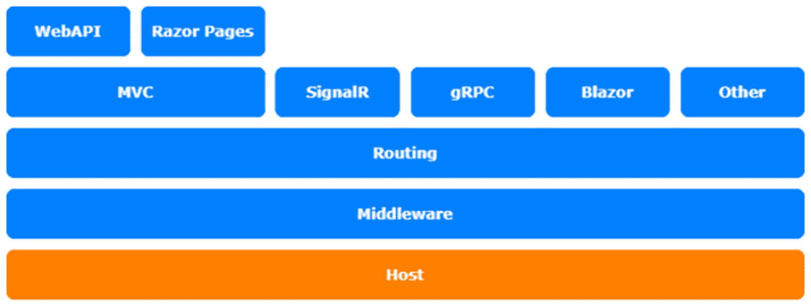

# 十一、配置`WebHostBuilder`

当阅读[*第 4 章*](04.html#_idTextAnchor071)*使用 Kestrel*配置和定制 HTTPS 时，您可能会问自己，*如何使用用户机密将密码传递到 HTTPS 配置？*您甚至可能想知道是否可以从`Program.cs`中获取配置。

在本章中，我们将通过以下主题回答这个问题：

*   复核`WebHostBuilderContext`

本章中的主题涉及 ASP.NET Core 架构的**主机**层：



图 11.1–ASP.NET Core 体系结构

# 技术要求

要完成本章中的练习，您需要创建一个 ASP.NET Core 应用。打开控制台、shell 或 bash 终端，并切换到工作目录。使用以下命令创建新的 web 应用：

```cs
dotnet new web -n HostBuilderConfig -o HostBuilderConfig
```

现在，通过双击项目文件或在 VS 代码中，通过在已打开的控制台中键入以下命令，在 Visual Studio 中打开项目：

```cs
cd HostBuilderConfig
code .
```

本章中的所有代码示例都可以在本书的 GitHub 存储库中的[中找到 https://github.com/PacktPublishing/Customizing-ASP.NET-Core-5.0/tree/main/Chapter11](https://github.com/PacktPublishing/Customizing-ASP.NET-Core-5.0/tree/main/Chapter11) 。

# R 电子考试 WebHostBuilderContext

还记得我们在[*第 4 章*](04.html#_idTextAnchor071)*中看到的`Program.cs`中的`WebHostBuilderContext`Kestrel 配置吗？*用 Kestrel*配置和定制 HTTPS？在那一章中，我们看到您应该使用用户机密来配置证书的密码，如下面的代码片段所示：*

```cs
public class Program
{
    public static void Main(string[] args)
    {
        CreateHostBuilder(args).Build().Run();
    }
    public static IHostBuilder CreateHostBuilder(
        string[] args) =>
        Host.CreateDefaultBuilder(args)
            .ConfigureWebHostDefaults(webBuilder =>
            {
                webBuilder
                    .UseKestrel(options =>
                    {
                        options.Listen(
                            IPAddress.Loopback, 
                            5000);
                        options.Listen(
                            IPAddress.Loopback, 
                            5001, 
                            listenOptions  =>
                            {
                                listenOptions.UseHttps(
                                    "certificate.pfx", 
                                    "topsecret");
                            });
                    })
                    .UseStartup<Startup>();
            });
    }
        }
```

通常，您无法获取此代码中的配置。您需要知道`UseKestrel()`方法是重载的，您可以在这里看到：

```cs
.UseKestrel((host, options) =>
{
    // ...
})
```

第一个参数是`WebHostBuilderContext`类型，您可以使用它访问配置。因此，让我们稍微重写 lambda 以使用此上下文：

```cs
.UseKestrel((host, options) =>
{
    var filename = host.Configuration.GetValue(
        "AppSettings:certfilename", "");
    var password = host.Configuration.GetValue(
        "AppSettings:certpassword", "");
    options.Listen(IPAddress.Loopback, 5000);
    options.Listen(IPAddress.Loopback, 5001, 
        listenOptions =>
        {
            listenOptions.UseHttps(filename, password);
        });
})
```

在本示例中，我们使用冒号分隔符写入键，因为这是您需要从`appsettings.json`读取嵌套配置的方式：

```cs
{
    "AppSettings": {
        "certfilename": "certificate.pfx",
        "certpassword": "topsecret"
    },
    "Logging": {
        "LogLevel": {
            "Default": "Warning"
        }
    },
    "AllowedHosts": "*"
}
```

重要提示

这只是如何读取配置以配置 Kestrel 的示例。请不要在代码中存储任何凭证。请使用以下概念。

您还可以从设置密钥的用户机密存储中读取，如下所示：

```cs
dotnet user-secrets init
dotnet user-secrets set "AppSettings:certfilename" 
  "certificate.pfx"
dotnet user-secrets set "AppSettings:certpassword" 
  "topsecret"
```

这也适用于环境变量：

```cs
SET APPSETTINGS_CERTFILENAME=certificate.pfx
SET APPSETTINGS_CERTPASSWORD=topsecret
```

重要提示

由于用户机密存储仅用于本地开发，因此应通过环境变量将凭据传递给生产中的应用或类似生产的应用。此外，您将在 Azure 中设置的应用设置配置将作为环境变量传递给您的应用。

那么，这一切是如何运作的呢？

## 它是如何工作的？

你还记得以前你需要在`Startup.cs`ASP.NET Core 1.0 中配置应用配置的日子吗？是在 startup 类的构造函数中配置的，如果您添加了用户机密，看起来与此类似：

```cs
var builder = new ConfigurationBuilder()
    .SetBasePath(env.ContentRootPath)
    .AddJsonFile("appsettings.json")
    .AddJsonFile($"appsettings.{env.EnvironmentName}.json",  
      optional:  true);
if (env.IsDevelopment())
{
    builder.AddUserSecrets();
}
builder.AddEnvironmentVariables();
Configuration = builder.Build();
```

这段代码现在被包装在`CreateDefaultBuilder`方法中（如您在 GitHub 上看到的；有关详细信息，请参阅*进一步阅读*部分），如下所示：

```cs
builder.ConfigureAppConfiguration((hostingContext, config) 
  =>
{
    var env = hostingContext.HostingEnvironment;
    config
        .AddJsonFile(
            "appsettings.json", 
            optional: true, 
            reloadOnChange: true)
        .AddJsonFile(
            $"appsettings.{env.EnvironmentName}.json", 
            optional:  true,
            reloadOnChange: true);
    if (env.IsDevelopment())
    {
        var appAssembly = Assembly.Load(
            new AssemblyName(env.ApplicationName));
        if (appAssembly != null)
        {
            config.AddUserSecrets(appAssembly, 
                optional: true);
        }
    }
    config.AddEnvironmentVariables();
    if (args != null)
    {
        config.AddCommandLine(args);
    }
})
```

这几乎是相同的代码，并且是构建`WebHost.cs`文件时首先执行的事情之一。

它必须是第一件事之一，因为 Kestrel 可以通过应用配置进行配置。您可以使用环境变量或`appsettings.json`指定端口和 URL 等。

您可以在`WebHost.cs`中找到这些行：

```cs
builder.UseKestrel((builderContext, options) =>
  {
    options.Configure(
        builderContext.Configuration.GetSection("Kestrel"));
})
```

这意味着您可以将这些行添加到`appsettings.json`以配置 Kestrel 端点：

```cs
"Kestrel": {
    "EndPoints": {
        "Http": {
            "Url": "http://localhost:5555"
        }
    }
}
```

或者，可以使用以下环境变量来配置端点：

```cs
SET KESTREL_ENDPOINTS_HTTP_URL=http://localhost:5555
```

现在，让我们回顾一下本章所涵盖的所有内容。

# 总结

在`Program.cs`内，您可以在配置方法的 lambda 内使用 app 配置，前提是您可以访问`WebHostBuilderContext`。这样，您就可以使用您想要配置的所有配置`WebHostBuilder`。

在下一章中，我们将了解托管的详细信息。您将了解不同的托管模型以及如何以不同的方式托管 ASP.NET Core 应用。