# 第七章：拦截

在前两章中，我们已经讨论了 DI 生态系统的两个支柱。这些支柱为我们提供了识别依赖项、注册它们以及根据需要管理它们的生命周期的途径。在本章中，我们将介绍一些不同的事情，它解决了 DI 的架构问题。

一个没有安全、日志记录、缓存、事务管理等功能的程序似乎很不完整。当我们编写代码来覆盖所有这些功能时，我们可能会在应用程序的每个模块中编写重复的代码。即使我们的应用程序中存在依赖注入，试图管理类的需求并提供之前提到的日志记录或其他类型，也违反了 SRP 和 DRY 原则。因此，我们需要一种不同的方法来解决这个问题，那就是 **拦截**。简单来说，拦截将帮助我们动态地在需要的地方注入代码块。

现在，你可能会有一个关于何时以及如何注入此代码的问题。现在我们先保留“如何”这个问题，专注于“何时”。我们很快会讨论“如何”。为了回答“何时”，注入可以在执行之前或之后进行，甚至可以完全替换实际的方法执行。

在本章中，我们将了解拦截是什么以及如何实现它。我们将找出可能的干扰执行流程的技术。当然，我们还会讨论为什么我们需要拦截。

.NET Core 中拦截的模式和原则是我们接下来要说明的内容。我们甚至将扩展 ASP.NET MVC Core 中使用过滤器和中件间的拦截概念。

在本章中，我们将涵盖以下主题：

+   横切关注点和方面

+   **面向切面编程**（**AOP**）：其类型、优点、缺点和过程

+   每种类型 AOP 的演示

+   使用过滤器和中件间在 ASP.NET Core MVC 中实现拦截

# 介绍拦截

在本节中，我将向您介绍 *拦截* 以及它与 *依赖注入* 的联系。

拦截是另一个重要的支柱。拦截是通过它可以轻松拦截消费者和服务之间的调用，以便在服务被调用之前或之后执行某些代码的过程。

以下图表显示了有和无拦截过程时会发生什么：

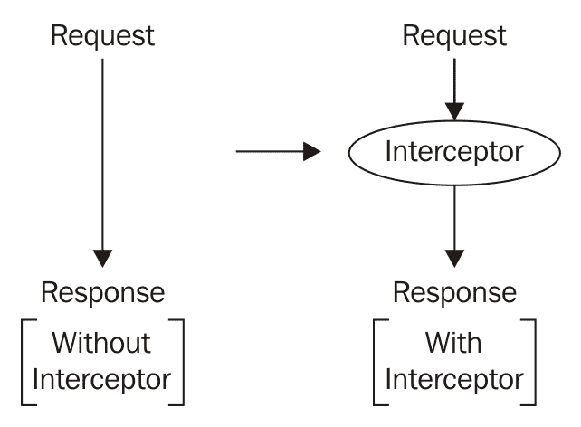

如果我们将前面的请求视为一个名为`CompanyController`的控制器索引操作的调用，并且在将公司详细信息提供给客户端之前，我们可以运行一些账目任务，例如*谁请求了公司详细信息？*，*何时进行的调用**？*，*用户是否有权接收公司详细信息？*等等。对于所有这些任务，我们必须在控制器中停止流程以执行所有这些操作，完成后，我们再次恢复主要任务，即返回数据。但是，所有这些任务都不能写在动作方法中，因为动作的主要责任是返回公司详细信息。如果我们把所有东西都写在动作方法中，就会违反 SRP。

# 装饰器

让我们通过一个需要基本日志记录作为其操作一部分的类来找出答案。`CompanyRepository`可能有一个将`User`分配给`Company`的方法。

```cs
    public void AssignUserToCompany(int userId, int companyId)
    {
      // Database operation to assign User to Company.
    }
```

现在，一个客户端要求你在执行此操作时记录一些重要信息，仅用于账目和未来参考。这些信息可能是操作的开始时间、操作的结束时间、谁请求了操作、是否有异常等。你脑海中浮现出的即时解决方案可能看起来像以下这样：

```cs
    public void AssignUserToCompany(int userId, int companyId)
    {
 _logger.Log("Assign to User started.");
      // Database operation to assign User to Company.
 _logger.Log("Assign to User ended.");
    }
```

注意粗体线条。`ILogger`可以通过构造函数注入到存储库中，以进行日志操作。我们还可以放置`try...catch`块并记录异常。一切看起来都很好，但你难道不认为这个类做得比它打算的更多，并且我们违反了**单一职责原则**（**SRP**）吗？因此，让我们考虑另一个解决方案。以下是一个例子？

```cs
    public class LoggingCompanyRepository : CompanyRepository
    { 
      private readonly CompanyRepository _companyReposiory;
 private readonly ILogger _logger;
      public LoggingCompanyRepository(CompanyRepository 
         companyRepository, ILogger logger)
      {
        this._companyReposiory = companyRepository ??
           throw new ArgumentNullException("companyRepository");
        this._logger = logger ?? throw new 
           ArgumentNullException("logger");
     }
     public override void AssignUserToCompany(int userId,
         int companyId)
     {
 _logger.Log("Assign to User started.");
        _companyReposiory.AssignUserToCompany(userId, 
            companyId);
 _logger.Log("Assign to User ended.");
     }
    }
```

我们引入了一个名为`LoggingCompanyRepository`的装饰`CompanyRepository`，它负责管理日志部分。它通过接受存储库和日志记录依赖项并在需要时执行带有日志条目的方法进行初始化。遵循装饰器模式，新类试图协调存储库和记录器之间的工作。

最后的任务是组合装饰器，以下步骤如下：

1.  我们可以创建`SqlCompanyRepository`和`SqlLogger`的实例，它们源自相关抽象。

1.  然后，我们通过注入这些依赖项来创建装饰器的实例。

1.  我们返回带有装饰存储库的`CompanyService`实例。

参考以下代码以获取这些步骤：

```cs
    public ICompanyService ResolveCompanyService()
    {
      CompanyRepository companyRepository = new 
          SqlCompanyRepository("ConnectionString");
      Controllers.ILogger logger = new SqlLogger();
      CompanyRepository loggingCompanyRepository = new 
          LoggingCompanyRepository(companyRepository, logger);
      return new CompanyService(loggingCompanyRepository);
    }
```

这就是截获的全部内容。我们能够中断对具体类`SqlCompanyRepository`的`AssignUserToCompany`方法的调用，因为`Service`现在由一个装饰器与具体类组合而成，而不是直接代码块。当你调用方法时，它首先会调用装饰器的方法，然后调用具体类的方法。

下面的图解说明了流程：

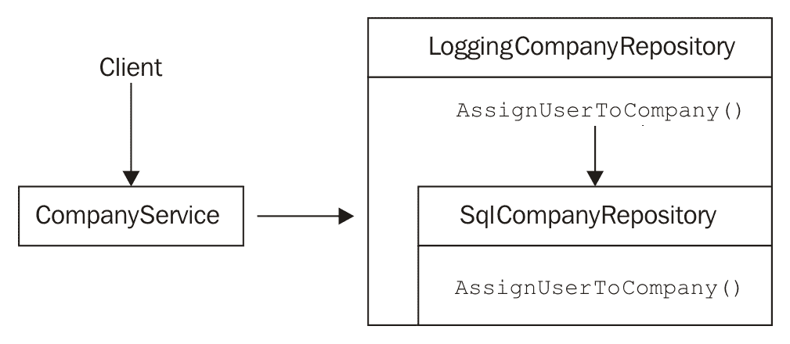

# 截获模式和原则

你可能已经察觉到，我想让你从不仅注入依赖，还管理并维护代码以构建良好架构的角度来体验依赖注入（DI）。在上一个章节中，我们探讨了装饰器模式，这使得我们能够在不触及应用中任何类的情况下，用一点额外的代码来装饰具体的实现。这构成了拦截的基础。

通过拦截，我们清楚地遵循了软件设计的 SOLID 原则。当我们开始设计装饰器类时，这个类在 SRP 中扮演了至关重要的角色。`CompanyRepository` 负责数据库部分，而 `LoggingCompanyRepository` 负责日志记录。

**里氏替换原则（Liskov Substitution Principle，LSP**）要求消费者不应该感觉到依赖任何实现的变化。我们通过装饰器实现了 `Service` 所要求的相同抽象，即 `CompanyRepository`，这样我们就可以在不破坏服务代码的情况下，用装饰器 `LoggingCompanyRepository` 替换原始的 `SqlCompanyRepository`。

在进行所有前面的步骤时，我们没有更改任何类来实现装饰器。相反，我们进行了扩展，这强烈遵循了开放/封闭原则。没有必要触及 `Service` 类或消费者。

遵循 SOLID 原则的拦截背后的原则让我们了解到装饰器模式与 DI 密切相关，因为 DI 支持拦截。装饰器模式是这一概念的基本构建块，但我们的实现方式并没有解决手头的架构问题。让我们分析相关的利益和问题。

# 装饰器模式的好处

使用装饰器模式，我们获得了许多好处。请参考以下列表：

+   `Service` 不了解它接收的是哪个仓库。请注意，`CompanyRepository` 和 `LoggingCompanyRespository` 都被声明为 `CompanyRepository` 实例。

+   就因为类型相同，没有必要对 `Service` 类进行任何更改。此外，我们在不更改 `CompanyRepository` 类的情况下添加了日志行为。这支持了开放/封闭原则。所有类都保持完好。

+   我们能够拦截具体的 `SqlCompanyRepository` 方法以实现日志条目。因此，我们没有违反仓库的单一职责原则（SRP）。

然而，我们没有意识到这种方法存在的一些问题。这种结构从长远来看会引导我们走向糟糕的架构。让我们找出原因。

而不是手动处理实例，始终使用 DI 容器来解析依赖。我们很快就会看到如何使用 DI 容器进行拦截。

# 装饰器模式的问题

在一个典型的项目中，我们将拥有许多这样的仓库和服务。我们肯定会遇到以下问题：

+   想象一下，你需要编写多少行代码来编写装饰器，以便为数百个类进行拦截。

+   接下来的一件事非常重要，这实际上是讨论主题的基础。如果你需要在那些一百个类的一千个方法中记录日志，这是常见的，我们几乎在每个方法都需要它。想想涉及的工作量和你的应用程序的大小。

由于所有这些，我们将最终采用不同的方法来使用切面拦截方法调用。依赖注入容器使我们能够轻松设计切面并附加拦截器。让我们继续前进。

# 面向切面编程

**面向对象编程**（**OOP**）处理使用底层对象模型解决现实世界问题的技术。为了设计软件，我们需要采用 OOP 以及良好的设计方法，以便使其可维护、一致和可靠。在应用程序开发过程中，我们会遇到许多这样的模式或问题，它们是设计决策，既不能通过 OOP 实践解决，也不能通过过程式方法解决。

在本章中，我们将讨论一个可以通过切面轻松管理的设计决策。为了澄清，我们可以考虑一个在代码中非常常见的简单示例，那就是**日志记录**。我们在几乎每个方法中都进行日志记录。这意味着你每天都在重复代码，违反了**DRY**（**不要重复自己**）原则。

以下图表显示了在您的代码中常见的大量重复日志代码：

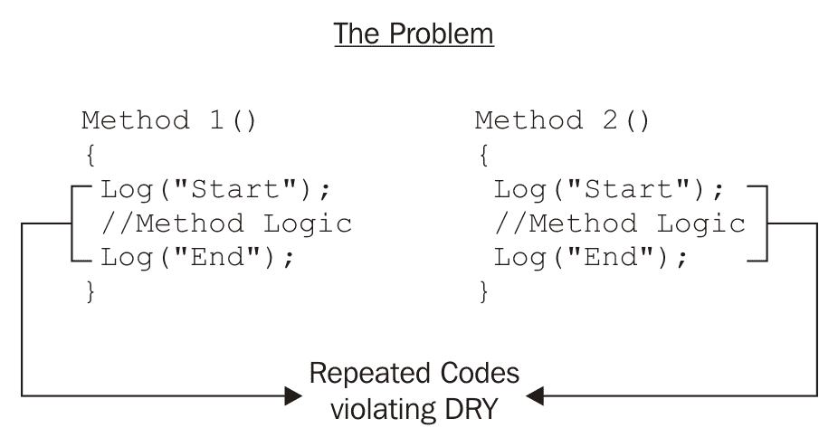

如果我告诉你，我们可以将这些日志行打包成一个模块化的代码块，并要求所有需要日志记录的方法在运行时只需导入它，你会怎么反应？是的，这就是切面的全部意义。因此，我们可以编写一个切面来管理日志。我们在应用中实现切面时遵循的图案被称为**面向切面编程**（**AOP**）*。它旨在将这些重复代码从核心功能中分离或模块化。

以下是一个名为`LoggingAspect`的切面的解决方案预览，它将所有日志代码打包在其中，并作为方法属性附加到方法之上（写作 `[LoggingAspect]`）。现在不必担心日志行如何应用于特定位置的方法，例如*开始*或*结束*。我们很快就会学习所有这些，这些都是面向方面编程（AOP）背后的概念：

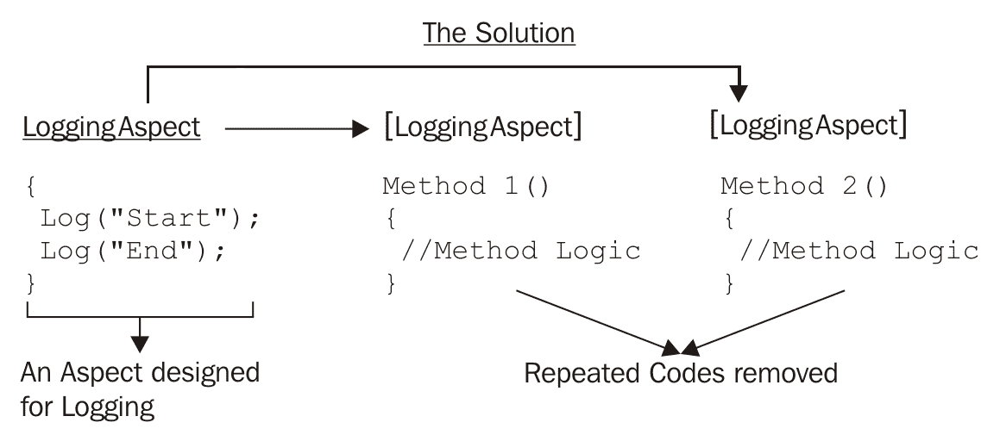

当我们在应用程序中遵循 AOP 时，我们可以轻松地将这些模块自动附加到我们的方法上。因此，开发者可以完全专注于方法内的业务逻辑或核心关注点，而无需担心所有重复的代码。

# 横切关注点

**关注点**可以定义为系统的一部分，提供一些特定的功能。如果你考虑一个典型的例子，在你的系统中保存用户，它可能有一个类似以下的业务逻辑：

1.  验证用户的所有字段，以确保正确的数据类型、`null`值等。

1.  通过唯一值（如`Email`或`UserName`）检查系统中是否存在用户。

1.  如果用户不存在，则创建用户，否则更新用户。

所有这些步骤都被标记为**业务逻辑**，这可能在不同的应用程序中不同，因为它取决于你的需求和设计。因此，我们的`SaveUser`方法的主要职责是执行所有这些步骤，这可以定义为**主要关注点**。

然而，在一个典型的应用程序中，这些并不是`SaveUser`方法中发生的唯一事情。在保存用户的过程中，你可能必须做以下事情：

1.  检查登录用户是否有权限保存用户。

1.  在文本/数据库中记录`SaveUser`开始。

1.  [执行*业务逻辑*（所有之前定义的步骤）] - 主要关注点。

1.  在文本/数据库中记录`SaveUser`方法成功。

步骤 1、2 和 3 是次要步骤，与主要关注点不匹配。但这些步骤不能被忽略。此外，这些特定的步骤几乎在应用程序的每个方法中都会执行。

当我们的方法试图运行主要关注点时，这些家伙试图干扰执行并做其他事情。这就是为什么它们被称为**横切关注点**。这些关注点位于整个应用程序中，影响整个架构。看看以下图表，其中箭头表示主要关注点，矩形区域表示横切关注点：

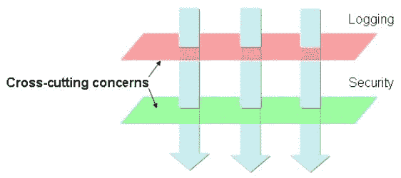

# Aspect

简而言之，当我们看到应用程序中存在一些重复的模式代码时，这就是我们将其视为横切关注点的线索。这些是代码补丁，它们与执行方法中的主要关注点不匹配。

当我在编程范式中说*aspect*时，它基本上是指独立于实际任务/关注点的行为模式。因此，当你将横切关注点打包成一个可以注入到方法中的模块化部分时，你实际上设计了一个方面。

例如，我们希望在许多方法中的某些行进行日志记录：

```cs
    public void SaveUser(User user)
    {
      Log.Debug("SaveUser started");   
      try
      {
        // Service call to save the user.
      }
      catch(Exception ex)
      {
        Log.Error(ex, "Exception in SaveUser Method");
        throw;
      }
      finally
      {
          Log.Debug("SaveUser Method completed.");
      }
    }
```

显然，`Log`类方法帮助我们记录方法内部的调试步骤和异常。这种特定的模式在应用程序的许多地方都可以看到。这就是所谓的**横切关注点**。`SaveUser`方法实际的任务是更新用户详情，例如`UserName`、`Email`、`Password`等，但此方法还承担记录一些行到文件的责任，这违反了 SRP 原则。此外，当这些模式在项目中重复出现时，它并不遵循 DRY 原则。

看看以下图表，它描述了日志记录作为跨应用层的一个常见范式：

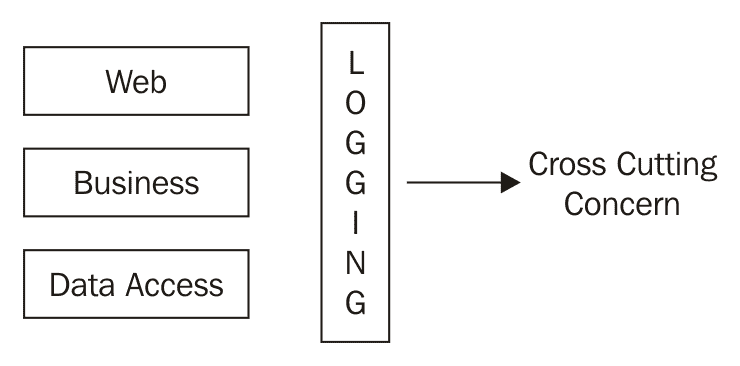

因此，在这里，AOP 就派上用场了，它封装了这个模式来记录开始、记录结束和记录异常，然后将其包装在`SaveUser`方法周围。

另一个常见的场景是将我们的数据库操作包裹在一个由`Begin Transaction`和`Commit/Rollback Transaction`组成的`Transaction`块中。那么，如果有人帮我们处理这部分工作，我们就可以专注于操作数据库的核心代码，怎么样？

横切关注点通常可以在应用程序中找到，例如记录步骤、处理异常、管理缓存、访问控制等。例如，在处理异常时，你使用`try..catch`块来操作找到的异常（记录到文本文件/数据库或发送电子邮件给管理员等）。这种特定的模式需要在每个方法中。现在我们需要找到一种方法来请求（更具体地说，包装）我们需要用于异常处理的每个方法，而不是在它内部添加`try..catch`行。因此，这个包装的模块化部分可以被称为方面，它最终将所有指示它执行异常处理的方法包装起来，而不是让这些方法本身执行相同的操作。

# 方面特性

当我们尝试将这些横切关注点封装成方面时，我们实际上确保它们遵循一些特性：

+   **包装器**：所有这些方面都将围绕一些业务功能进行包装。

+   **单一职责原则（SRP）**：包装器只关注一个特定的任务。例如，日志记录只会执行日志记录的任务，不会做其他事情。

+   **装饰器模式**：然后使用装饰器模式将方面附加到现有函数上。

    +   **开闭原则**：当这些重复的代码在业务函数中，并且如果未来需要对这些代码进行任何更改，那么我们就必须更改包含这些片段的业务函数，这违反了开闭原则。现在，当我们将这些片段隔离到模块中时，业务函数就变得*开放*于扩展，但*关闭*于更改。

请参考以下图表以获得图形说明：

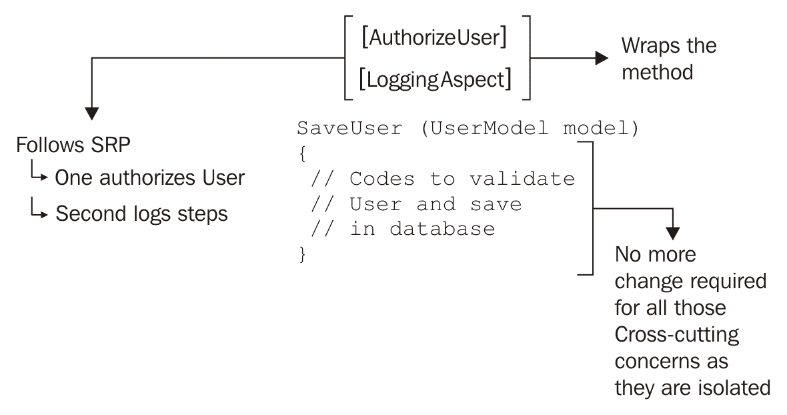

AOP 不是 OOP 的竞争对手。两者完全不同。一个不是另一个的替代品。有了所有这些特性，AOP 帮助我们保持项目的良好结构，从而实现良好的 OOP 实践。

# 优点

让我总结一下 AOP 的重要优点：

+   **增加模块化**：常见功能被集中到独立的模块中，并在应用程序的许多地方附加这些模块或方面。

+   **管理横切关注点**：这些分散的关注点集中在一个地方，可以轻松管理，而无需对实际业务代码进行任何代码更改。

+   **更好的架构：**将这些关注点分离到单一责任方面有助于我们构建和整理业务需求，而无需在代码中不必要地重复自己。

# 方面附加位置

基本上，方面可以附加到方法的基本有三个位置：

+   **启动时：**当我们希望方面在底层函数执行之前立即执行。

+   **错误处理：**显然，只有当方法中发生异常时，此位置的方面才会运行。

+   **成功时：**在方法执行后立即运行。然而，它仅限于不抛出异常的函数。

# AOP 类型

AOP 中有两种技术：

+   **拦截器：动态的，在运行时附加拦截器**

+   **IL 代码织入：**静态的，在编译后运行并插入代码到程序集

静态（编译后）的包括 Fody、SheepAspect、Mono.Cecil 和 PostSharp。静态可能更快，但在动态的拦截器中我们获得更多的灵活性，因为我们可以在运行时动态地更改代码。

将方面应用于代码取决于所使用的框架。有不同的技术来附加方面，例如编写属性、XML 配置和流畅接口。

# 检查拦截

要拦截意味着阻止某物或某人达到预期的目的地。

拦截（一种编程范式），帮助我们设计方面，并在运行时根据需要注入横切关注点。使用拦截器，我们可以轻松拦截类中方法和对属性的调用。为了实现这一点，我们通常最终使用**控制反转**（**IoC**）容器。

IoC 提供类功能，然后将其包装为我们请求的拦截器。假设在代码的某个地方，你向特定类型的 IoC 容器（例如`IStudent`）请求一个类（例如`Student`），该容器有一个用于记录的方面，那么 IoC 容器就能够提供带有该方面装饰的拦截器来满足所需。

拦截器由外部组件管理，这些组件创建动态装饰器，用于围绕现有的业务组件包装方面。

拦截器的主要优势是它们不受编译过程的限制，并且不会在构建后修改我们的程序集。换句话说，这只是 IoC 容器的配置，你可以轻松地将其带到另一个项目中，而不是携带 DLL 并再次编译它们。

然而，拦截器可以配置为在运行时或编译时工作。

Unity、Ninject、Spring.NET、Castle Windsor、LinFu、Autofac、LOOM.NET、Seasar 等是一些允许在编译时或运行时注入拦截器的 IoC 容器。

这些 IoC 容器使用动态代理创建内存中的装饰器，这些装饰器包装了你的现有代码。这些动态代理负责代码执行。因此，它允许执行包装方面以及被包装的底层代码。

# 拦截过程

拦截过程可以描述如下：

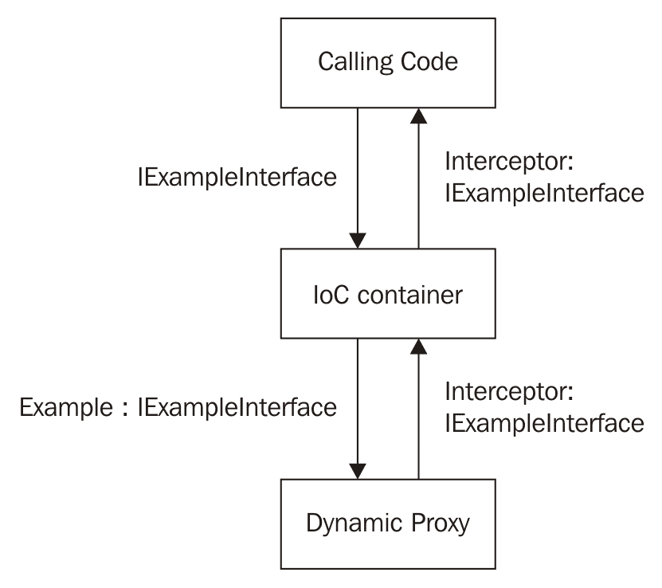

下面是具体发生的情况：

1.  调用代码询问 IoC 容器它正在寻找的类型。例如，`IExampleInterface` 类型。

1.  IoC 容器现在尝试匹配请求的类型的具体实现，它可以将其返回给调用代码，即 `Example` 类。在这个过程中，它认识到该类型已经配置为使用拦截器。

1.  现在，IoC 容器不是直接返回到调用代码，而是将拦截器和请求类型的实现类发送给动态代理。

1.  动态代理现在将具体类包装起来，并使用拦截器。然后，它生成一个实现最初请求的类型，并使用 IoC 容器提供的具体类实例和拦截器。之后，它将请求类型的实现返回给 IoC 容器。这就是 `Interceptor` 类。

1.  现在，IoC 容器将动态代理生成的 `Interceptor` 类发送回调用代码。

1.  调用代码执行返回的类，该类随后运行拦截器和具体类 `Example` 的底层代码。

# Castle Windsor

Castle Windsor 是一个控制反转容器。这个库是开源项目 **Castle Project** 的一部分。Castle Project ([`www.castleproject.org/`](http://www.castleproject.org/)) 提供了许多用途的可重用库。Castle 有许多组件，Windsor 是 Castle Project 的依赖注入容器组件。然而，它可以独立于其他 Castle 组件使用。

市场上还有许多其他库，如 Microsoft Unity、Autofac、Ninject 等。每个框架都提供了一些不同的优点和功能。然而，在底层，它们对大多数核心概念（包括类型注册、解析和注入）的实现是相同的。你可以无疑地使用这些中的任何一个来在你的应用程序中应用拦截。

尽管如此，我们使用 Castle Windsor 的逻辑并不存在。使用这个工具，我们可以轻松地将拦截器附加到我们的代码上。我们稍后会看到这一点。

# 使用 Castle Windsor 的演示

让我们开始使用 `Nuget` 包 Castle Windsor 实现一个拦截器。首先，创建一个控制台应用程序，进入 Nuget 包管理器并安装 Castle Windsor 包。安装成功后，你的项目引用将如下所示：

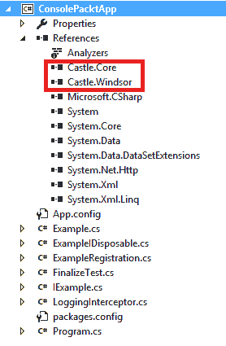

因此，它安装了 `Castle.Core` 和 `Castle.Windsor`。现在我们准备好创建一个拦截器了。

# 创建一个拦截器

我们将做一个简单的日志拦截器，它将为我们记录步骤以及异常。让我们称它为 `LoggingInterceptor.cs`。要成为拦截器，类应该实现 `Interceptor` 接口。这个接口中只有一个方法，即 `Intercept`，它接受 `IInvocation` 作为参数。

以下代码块展示了我说的话：

```cs
    using Castle.DynamicProxy;
    using System;
    namespace ConsolePacktApp
    {
      public class LoggingInterceptor : IInterceptor
      {
        public void Intercept(IInvocation invocation)
        {
          invocation.Proceed();
        }
      }
    }
```

调用 `invocation.Proceed()` 只是调用应该被拦截的底层方法。这意味着，当任何注册使用此拦截器的注册方法时，它将来到这个方法，然后从这个方法中调用相同的 `Proceed()` 方法。

为了调查拥有拦截器的实际好处，我们将在以下代码块中添加更多代码：

```cs
    using Castle.DynamicProxy;
    using System;
    namespace ConsolePacktApp
    {
      public class LoggingInterceptor : IInterceptor
      {
        public void Intercept(IInvocation invocation)
        {
            try
            {
                Console.WriteLine("Log Interceptor Starts");
                invocation.Proceed();
                Console.WriteLine("Log Interceptor Success");
            }
            catch (Exception e)
            {
                Console.WriteLine("Log Interceptor Exception");
                throw;
            }
            finally
            {
                Console.WriteLine("Log Interceptor Exit");
            }
        }
      }
    }
```

接下来是设计一个接口和一个具体类：

```cs
    using System;
    namespace ConsolePacktApp
    {
      public interface IExample
      {
        void PrintName(string FirstName, string LastName);
      }

      public class Example : IExample
      {
        public void PrintName(string FirstName, string LastName)
        {
            Console.WriteLine($"Name is {FirstName} {LastName}");
        }
      }
    }
```

因此，`PrintName()` 方法使用 `FirstName` 和 `LastName` 打印名字。我们将拦截这个方法并尝试使用拦截器添加日志步骤。

# 添加拦截器

现在最重要的部分是 `ExampleRegistration`，它实现了 `Castle.MicroKernel.Registration` 命名空间中的 `IRegistration` 接口。

这是我们注册 `LoggingInterceptor`（参考以下代码块中的第一条注释）并声明将被 `LoggingInterceptor` 拦截的 `Example` 类（参考第二条注释）的地方：

```cs
    using Castle.MicroKernel.Registration;
    using Castle.MicroKernel;
    using Castle.Core;
    namespace ConsolePacktApp
    {
      public class ExampleRegistration : IRegistration
      {
        public void Register(IKernelInternal kernel)
        {
            // 1\. Interceptor Registration
            kernel.Register(
                Component.For<LoggingInterceptor>()
                    .ImplementedBy<LoggingInterceptor>());

            // 2\. Interceptor attached with Example Class.
            kernel.Register(
                Component.For<IExample>()
                .ImplementedBy<Example>()
                .Interceptors(InterceptorReference.ForType<LoggingInterceptor>
                   ()).Anywhere);
        }
      }
    }
```

最后但同样重要的是，`main` 方法：

```cs
    using Castle.Windsor;
    using System;
    namespace ConsolePacktApp
    {
      class Program
      {
        private static IWindsorContainer _container;
        static void Main(string[] args)
        {
            _container = new WindsorContainer();
            _container.Register(new ExampleRegistration());

            var example = _container.Resolve<IExample>();

            try
            {
                example.PrintName("Gobinda", "Dash");   
            }
            catch (Exception ex)
            {
            }

            Console.ReadKey();
        }
      }
    }
```

我们获取一个 `IWindsorContainer` 实例。首先，我们注册包含我们的目标方法和拦截器配置的 `ExampleRegistration` 类。然后，`_container.Resolve()` 帮助我们获取实现 `IExample` 的所需实例。

正如我们在 `ExampleRegistration` 类的 `Register()` 方法中已经定义的那样，`Example` 是实现 `IExample` 的类，因此创建了一个 `Example` 类的实例。然后，我们在 `try` 块中有一个 `PrintName()` 调用。

现在运行程序并查看输出：

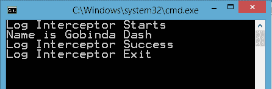

显然，在打印名字之前，首先执行的是日志开始消息。其次，实际的方法执行，打印名字。之后，正如我们所预期的，是成功和退出消息。退出意味着它已从拦截器中退出。

显然，我们没有得到任何异常，所以那条消息被跳过了。

现在，让我们尝试看看。修改后的 `Example` 类将如下所示，包含 `throw new Exception()` 代码行：

```cs
    using System;
    namespace ConsolePacktApp
    {
      public class Example : IExample
      {
        public void PrintName(string FirstName, string LastName)
        {
            throw new Exception();
            Console.WriteLine($"Name is {FirstName} {LastName}");
        }
      }
    }
```

强制性地，我们在 `Console.WriteLine` 之前抛出一个异常。当我们运行这个程序时，我们会看到以下输出：

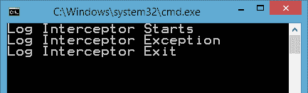

有趣的是，我们没有看到成功日志消息，但打印了退出消息，并且打印名字的方法的实际执行也没有发生。这是因为无论调用代码发生什么，退出消息都一定会打印，因为那是在拦截器的 `finally` 块中。

我们在实际代码执行之前手动抛出一个异常来打印名称，这导致打印出异常日志消息以及 Start 和 Exit。

可以将多个拦截器附加到单个类。有两种类型的拦截器注册，如下所示。您可以使用以下任一种：

`     kernel.Register(        Component.For()       .ImplementedBy()       .Interceptors<LoggingInterceptor,           AnotherInterceptor>());`

或者您可以使用这个：

`    kernel.Register(      Component.For<IExample>()      .ImplementedBy<Example>()      .Interceptors(new InterceptorReference[] {      InterceptorReference.ForType<LoggingInterceptor>(),      InterceptorReference.ForType<AnotherInterceptor>() }).Anywhere);`

# 中间语言 (IL) 线程

在这种类型的 AOP 中，方面是在应用程序编译之后附加到底层代码的。这个编译后过程在 IL 级别修改程序集，以便在配置的位置调用方面钩子点。

如果我用简单的话来解释，这是一个在编译后将方面代码插入到原始代码中的过程，但这只发生在 IL 代码（原始源代码保持不变）中，并将其打包到程序集中。您的原始代码将保持不变。然而，除了您的代码之外，方面块也将被包含，程序集将获得修改后的代码。与拦截不同，拦截是在运行时插入代码，这个过程是静态的，代码是在之前包含的。

最广泛使用的线程工具是 PostSharp，我们稍后将演示它。其他包括 LOOM.NET、Fody、SheepAspect、Mono.Cecil 等等。

# IL 线程过程

由于我已经解释了过程，让我们在以下图中看看它是如何实际操作的：

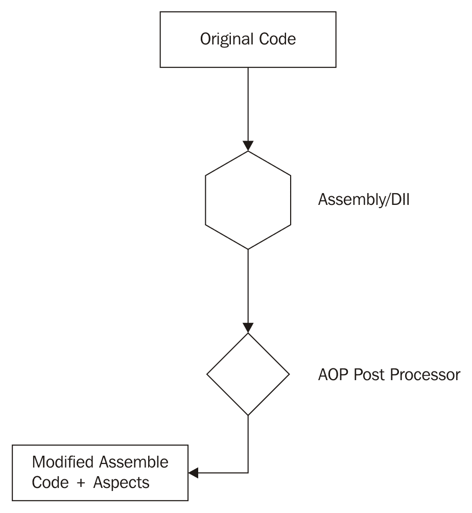

简单，不是吗！现在我们了解了这个过程是如何进行的，是时候动手做一些真正的代码并尝试一下了。

# 创建一个方面

在启动之前，我们需要将名为 PostSharp 的 `Nuget` 包添加到项目中。

要创建一个方面，我们需要设计一个类，该类将继承自 `OnMethodBoundaryAspect` 方面类，这是一个位于 `PostSharp.Aspects` 命名空间内的抽象类。这可以在以下代码块中看到：

```cs
    using PostSharp.Aspects;
    using System;
    namespace ConsolePacktApp
    {
      [Serializable]
      class LoggingWeaverAspect : OnMethodBoundaryAspect
      {
        public override void OnEntry(MethodExecutionArgs args)
        {
            Console.WriteLine("Inside OnEntry");
        }

        public override void OnExit(MethodExecutionArgs args)
        {
            Console.WriteLine("Inside OnExit");
        }

        public override void OnException(MethodExecutionArgs args)
        {
            Console.WriteLine("Inside OnException");
        }

        public override void OnSuccess(MethodExecutionArgs args)
        {
            Console.WriteLine("Inside OnSuccess");
        }
      }
    }
```

`OnMethodBoundaryAspect` 方面有助于编写可以在方法执行前后或异常情况下执行的代码。正如您从前一个类中看到的那样，我们正在重写 `OnEntry`、`OnExit`、`OnException` 和 `OnSucess` 方法。还有其他方面类可以解决不同的目的。

按照以下方式更新 `main` 方法：

```cs
    static void Main(string[] args)
    {
      try
      {
        Example example = new Example();
        example.PrintName("Gobinda", "Dash");
      }
      catch
      {
      }
      Console.ReadKey();
    }
```

现在，当您运行应用程序时，没有任何事情发生。我们可以通过查看生成的程序集代码来得到确认。

ILSpy 是开源的 .NET 程序集浏览器和反编译器。您可以从 [`ilspy.net/`](http://ilspy.net/) 下载它。这将帮助我们查看程序集中打包的实际代码。

当你运行 ILSpy 应用程序并选择我们的应用程序的程序集时，它看起来会像以下这样：

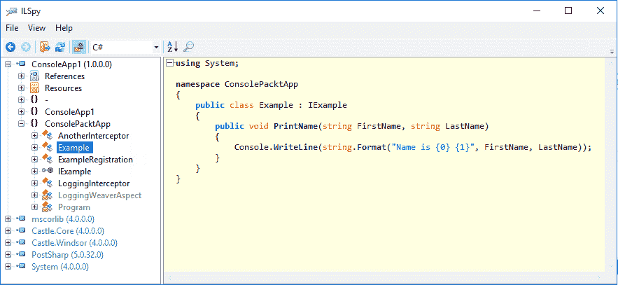

你可以看到 `Example` 类中的代码保持完整。没有其他代码被插入到程序集中。这是因为我们还没有将编织器与我们的 `Example` 类关联起来。让我们接下来这样做。

如果你在构建应用程序时遇到 PostSharp 许可证错误，这意味着你必须购买一个许可证。你也可以使用免费许可证，它有一定的限制。你可以在 [`www.postsharp.net/essentials`](https://www.postsharp.net/essentials) 找到下载页面。

# 绑定方面

绑定方面非常简单。你只需将编织器作为属性添加到你想包装方面的类中即可。

注意以下代码片段中 `PrintName` 方法上方的粗体行：

```cs
    using System;
    namespace ConsolePacktApp
    {
      public class Example : IExample
      {
        [LoggingWeaverAspect]
        public void PrintName(string FirstName, string LastName)
        {
            Console.WriteLine($"Name is {FirstName} {LastName}");
        }
      }
    }
```

我们在 `Example` 类周围使用了 `[LoggingWeaverAspect]` 属性。现在，让我们运行它并查看输出：

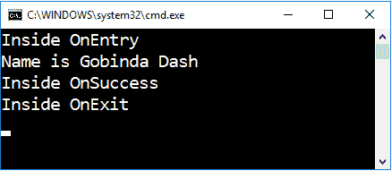

看看以下程序集代码：

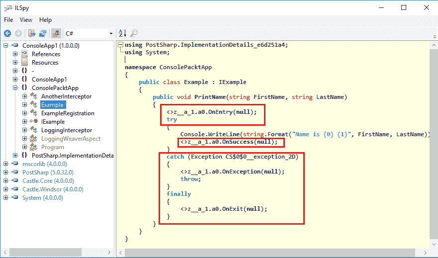

这里红色的方框表示在构建应用程序后插入到程序集中的代码。由于我们在编织器方面有一个 `OnException`，因此 `PrintName()` 方法现在包含一个 `try...catch` 块。最后，`OnEntry` 在开始处，而 `OnExit` 在 `Console.WriteLine()` 之内。在 `Console.WriteLine()` 之后，我们可以看到 `OnSuccess` 的调用。

如果在方法实际执行之前（在本例中为 `Console.WriteLine()` 之前）发生异常，我们将看到以下输出，而没有成功消息：

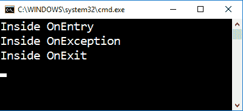

既然我们已经对概念有了初步的了解，让我们来探讨如何在 .NET Core 中实现拦截。

# ASP.NET Core 中的拦截

ASP.NET Core 实现了拦截的概念，用于中断对控制器操作和请求-响应管道的调用。我们可以通过不同的技术来实现，这些技术被称为过滤器和中件。接下来，我们将通过示例逐一讨论。

# 过滤器

过滤器允许 ASP.NET Core 拦截动作方法。你可以配置一个全局过滤器，每次请求控制器动作时都会运行，或者为某些动作方法配置独特的过滤器。

过滤器将实现 `Microsoft.AspNet.Mvc.Filters` 命名空间中驻留的一个过滤器接口。让我们看看以下简单的过滤器框架：

```cs
    using Microsoft.AspNetCore.Mvc.Filters;
    namespace FiltersAndMiddlewares.Filters
    {
      public class SomeFilter : IActionFilter
      {
        public void OnActionExecuted(ActionExecutedContext context)
        {
          // Do something.
        }

        public void OnActionExecuting(ActionExecutingContext context)
        {
          // Do something.
        }
      }
    }
```

如前例所示，`SomeFilter` 实现了 `IActionFilter`。正如其名称所暗示的，`OnActionExecuting` 和 `OnActionExecuted` 分别在动作执行时和执行完成后运行。

如果你还记得拦截（拦截原则，即“我们可以运行一些代码在执行方法之前或之后，或者完全替换该方法的*过程*”），你会注意到这些 `IActionFilter` 方法也遵循该原则，并且旨在拦截对控制器动作方法的调用。

# 全局过滤器

假设你想创建一个拦截器，它会拦截所有动作方法。听起来像是一个常见的或全局声明的代码块，可以被称为 **全局过滤器**。使用 `ConfigureServices` 中的服务集合将过滤器注册到 MVC 过滤器中会使过滤器全局可执行或可拦截。

参考以下代码，这是将普通过滤器转换为全局过滤器（除了过滤器定义外，当然你需要编写代码）的唯一一行：

```cs
    services.AddMvc(mvc => mvc.Filters.AddService(
        typeof(SomeGlobalFilter)));
```

`SomeGlobalFilter` 也可以注入依赖项。以下代码块可以被视为全局过滤器，其中 `ISomeService` 使用最流行的构造函数注入模式进行注入：

```cs
    using FiltersAndMiddlewares.Interfaces;
    using Microsoft.AspNetCore.Mvc.Filters;
    namespace FiltersAndMiddlewares.Filters
    {
      public class SomeGlobalFilter : IActionFilter
      {
 public SomeGlobalFilter(ISomeService service)
 {
 // Do something with the service.
 }

        public void OnActionExecuted(ActionExecutedContext context)
        {
            // Do something.
        }

        public void OnActionExecuting(ActionExecutingContext context)
        {
            // Do something.
        }
      }
    }
```

你注意到一件事吗？在 `SomeGlobalFilter` 中的参数化构造函数注入了类型为 `ISomeService` 的依赖。虽然不是可选的，但如果我们在过滤器中需要任何必需的依赖项，则可以进行此操作。想象一下，如果我们需要在动作开始执行时在数据库中添加日志条目，就像记录事件发生的顺序一样。为了实现这一点，我们可以注入一个服务，然后使用其方法对数据库进行操作。

# 属性

另一种附加过滤器的方法是为所需操作编写属性。当你全局应用时，它适用于所有操作。然而，如果我们只想将属性附加到某些操作上，则可以编写属性。让我们看看一个带有 `SomeFilter` 属性的动作方法：

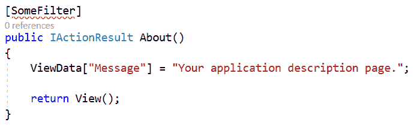

编译器在抱怨。如果你悬停，它会说 `SomeFilter` 不是一个属性类。实际上，它期望 `SomeFilter` 如下所示：

```cs
    public class SomeFilterAttribute : Attribute {}
```

注意过滤器名称已更改为 `SomeFilterAttribute` 并从 `Attribute` 抽象类派生。这是通过语法实现的。此外，属性需要无参构造函数。但为了拦截，我们需要实现一些过滤器接口，如 `IActionFilter`。

为了克服这一点，我们可以借助从 `Attribute` 类派生并通过其构造函数接受类型的 `TypeFilterAttribute` 类。因此，以下代码显示了使用过滤器作为属性的正确模式：

```cs
 [TypeFilter(typeof (SomeFilter))]
    public IActionResult About()
    {
      ViewData["Message"] = "Your application description page.";
      return View();
    }
```

这里有两个重要的事项需要注意：

+   我们没有在应用程序的入口点注册 `SomeFilter`；然而，它仍然可以工作

+   `TypeFilter` 属性有助于创建 `SomeFilter` 的实例

由于我们在玩.NET Core，我们应该从服务注册中获取过滤器实例，而不是通过`TypeFilter`动态创建它。这就是`ServiceFilterAttribute`类出现的地方。让我们看看我们如何修改代码以使用`ServiceFilter`：

```cs
 [ServiceFilter(typeof (SomeFilter))]
    public IActionResult About()
    {
      ViewData["Message"] = "Your application description page.";
      return View();
    }
```

你确定这个更改会工作吗？不，它不会。当你运行应用程序时，你会看到以下错误：

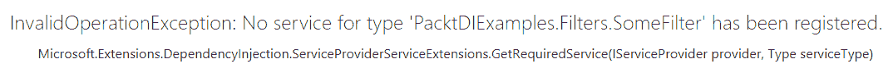

哎，我知道了！现在你知道我们遗漏了什么。当你使用 DI 工作时，这是一个非常熟悉的异常。正如我所说，`ServiceFilter`从服务集合中找到过滤器实例；如果你没有注册它，它肯定会抛出异常。

以下代码是使它工作所需的内容。虽然这不是必须的，使其变为瞬时的，但它取决于你的场景：

```cs
    services.AddTransient<SomeFilter>();
```

# 中间件

中间件，它所知名的是，拦截执行管道，开发者可以在响应发送到客户端之前做任何事情。我们将在下一节中看到如何具体实现中间件以进行拦截。

ASP.NET Core 中的中间件遵循拦截技术，在请求和响应之间插入方面。它基本上是一段与应用程序管道注册的代码块。以下图表显示了请求如何逐个通过中间件，直到响应出来：

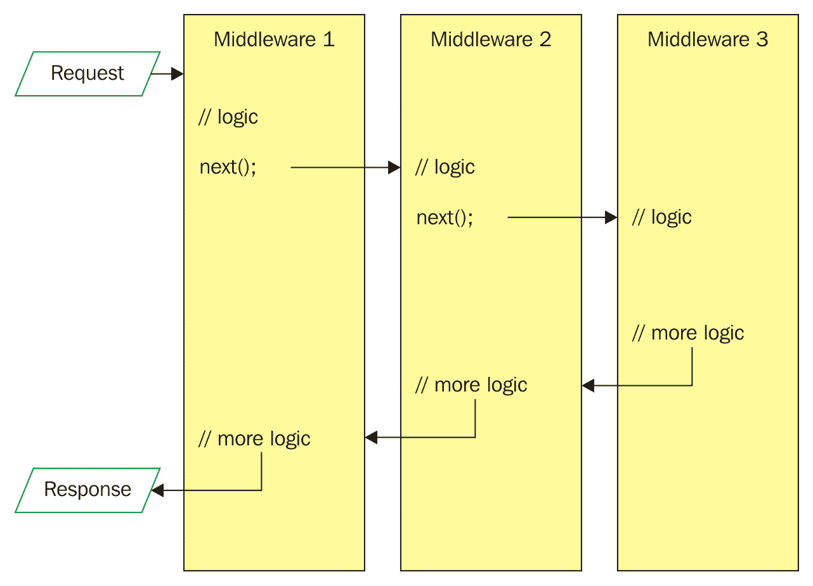

可以将大量的中间件插入到管道中。每个中间件决定是否将执行传递给下一个中间件，并在调用下一个组件之前和之后执行一些逻辑。这些组件被设计来解决特定的目的，如日志记录、异常处理、授权等。

# 注册

`IApplicationBuilder`接口帮助我们使用`Configure()`中的`app.Use`注册中间件。让我们检查一个简单的代码块：

```cs
    public void Configure(IApplicationBuilder app)
    {
      var response = string.Empty;
      app.Use(async (context, next) =>
      {
        response += "Inside Middleware 1\n";
        await next.Invoke();
      });
       app.Use(async (context, next) =>
       {
        response += "Inside Middleware 2\n";
        await next.Invoke();
       });
       app.Run(async context =>
       {
         response += "App run\n";
         await context.Response.WriteAsync(response);
       });
    }
```

# 执行

我们有两个中间件然后是`app.Run`。当我们运行这个时，我们会看到以下内容：

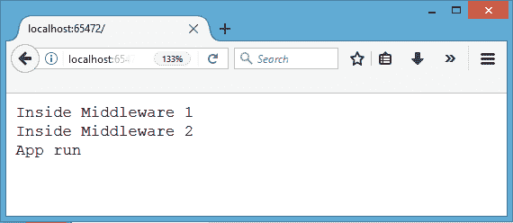

这里有一个问题。如果你刷新页面，而不构建代码，你将看到以下内容：

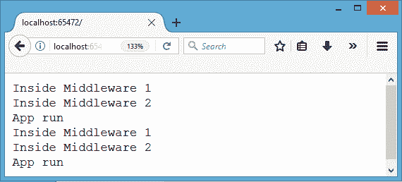

原因是我将字符串连接在一起，当你刷新页面时，它直接跳到中间件 1，然后是中间件 2，最后是`app.Run`。因为变量在`Configure`内部初始化，它具有应用程序作用域。因此，它将被附加。如果你再次刷新页面，你将看到另一组相同的消息被附加到前一个截图中的内容上。

这是中间件劫持应用程序管道并在响应发送到客户端之前执行的方式。让我们考虑另一个代码块：

```cs
    public void Configure(IApplicationBuilder app, IHostingEnvironment env, 
       ILoggerFactory loggerFactory)
    {
     var response = string.Empty;
     app.Use(async (context, next) =>
     {
        response += "Inside Middleware 1\n";
        await next.Invoke();
     });
     app.Run(async context =>
     {
        response += "App run\n";
        await context.Response.WriteAsync(response);
     });
     app.Use(async (context, next) =>
     {
        response += "Inside Middleware 2\n";
        await next.Invoke();
     });
    }
```

你认为输出会是什么？检查一下：

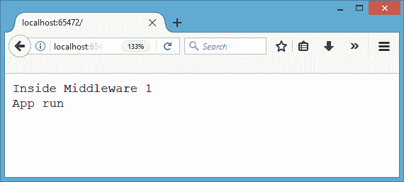

中间件 2 被遗漏了。这是因为我们在 Middleware 2 之前写了 `app.Run`。`app.Run` 是退出点，它终止了管道。在那之后的所有内容都不会被运行时考虑。

你当然可以在调用 invoke 之前和之后进行编码，如下所示：

`   app.Use(async (context, next) =>     {     // 在调用下一个中间件之前做一些事情          await next.Invoke();     // 在调用下一个中间件之后做一些事情    });`

# 排序

存在一条简单的规则，即它们注册的顺序就是它们将被执行的顺序。当某个组件依赖于另一个组件时，排序扮演着重要的角色。例外情况是可能在应用程序的任何时间、任何地方发生的事情。因此，我们需要在所有其他事情之前先注册它，这样我们就可以轻松地捕获异常。

# 摘要

我们探讨了在典型编程场景中哪些方面是跨切面关注点以及如何确定它们。有一些特定的位置可以标记方面，我们将在下面进行说明。

面向方面编程帮助我们运行自定义逻辑，在方法注册之前、之后，甚至完全替换方法，其中注册了它。我们看到了使用 IL Weaving 和拦截器分别附加方面的静态和动态技术。拦截是一种比 IL Weaving 更受欢迎的技术，因为它可以动态运行注册的代码块（通常称为方面）。另一方面，IL Weaving 处理在构建过程完成后更新程序集，将方面代码插入到已注册的方法中。

然后，我们深入讨论了在 ASP.NET Core 中如何以过滤器和中件间的形式采用拦截。

过滤器可以拦截动作方法执行的路径，这可以是按需将属性分配给方法，或者将其注册到服务集合中，以将其标记为全局过滤器。注册一个过滤器的单行代码可以使过滤器轻松拦截所有动作方法。

中间件是 ASP.NET Core 中的一种技术，它允许我们在请求-响应管道中插入内置/自定义代码块。

现在我们已经学习了 DI 的所有基本概念，在 第八章 *模式 - 依赖注入* 中，我们将发现不同的技术/模式来向客户端注入依赖。
