# 第十章：其他 JavaScript 框架中的依赖注入

在第九章，*依赖注入的反模式和误解*中，我们讨论了使用依赖注入时最重要的反模式，以及在使用它时的一些典型误解。在本章中，我们将处理其他框架中的依赖注入，特别是 TypeScript 2.3 和 Angular 4+。

回顾 TypeScript 的基础知识的原因是 Angular 2+ 使用了这种语言，因此我们需要了解如何进行类创建和模块管理，才能真正掌握这种架构背后的主要概念。

在本章中，我们将涵盖：

+   TypeScript 2.3+ 中的类创建和模块管理

+   AngularJS（版本 1.x）中 DI 技术的原生实现和使用

+   在 Angular 4+ 中使用 DI 的原生实现和可定制选项

# TypeScript

你可能已经知道 TypeScript 在现代 JavaScript 框架开发中的作用，甚至作为 JavaScript 的改进替代品本身。

TypeScript 多次被定义为 JavaScript 的强类型超集。它是一个超集，因为它包括了 JavaScript 所有的内容（这扩展到版本 3、5 和 6，也称为 ES2015），以及一些特性，允许程序员以面向对象的方式编程。在撰写本文时，可用的最新版本是 2.3：

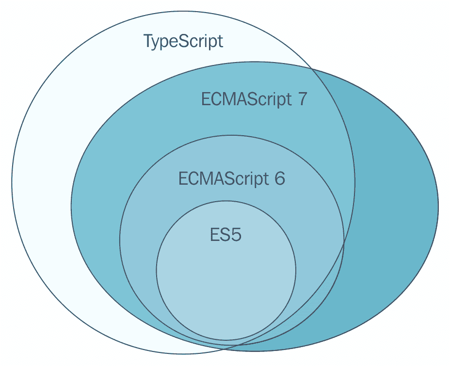

（图片来源：[`blog.soat.fr/2016/08/feedback-typescript/`](http://blog.soat.fr/2016/08/feedback-typescript/)）

因此，我们在保持可以编写正常 JavaScript 的同时（一个重要的点是任何有效的 JavaScript 都是有效的 TypeScript），仍然发现许多语法上的好处。

以这种方式，TypeScript 通过使用接口和静态类型来促进更声明式的编程风格，它提供了模块和类的概念，并且能够很好地与大多数现有的 JavaScript 库和代码集成。我们可以将其视为一个强静态层，覆盖在 JavaScript 之上，并附带许多功能，使程序员的（尤其是调试）工作变得更加易于管理。

如果你想对 TypeScript 语言有一个好的介绍，你可以阅读 Remo H. Jansen 的 *Introducing Object-Oriented Programming with TypeScript*（见 [`www.packtpub.com/books/content/introducing-object-oriented-programmng-typescript`](https://www.packtpub.com/books/content/introducing-object-oriented-programmng-typescript)），如果你更喜欢深入语言及其可能性，可以查看 Nathan Rozentals 的优秀作品 *Mastering TypeScript*（可在 [`www.packtpub.com/web-development/mastering-typescript`](https://www.packtpub.com/web-development/mastering-typescript) 购买）。

当创建语言时，Anders Hejlsberg（TypeScript 的首席架构师）的主要目标是：

+   创建一个完全面向对象的编程语言，在编译时转换为 JavaScript（由于它只是产生另一种语言而不是编译模块，因此称为**transpilation**），允许最终生成的 JavaScript 在任何浏览器（或 Web 平台）中执行。

+   使语言静态类型化，这样工具就可以在任何编辑器中提供现代开发技术：Intellisense、代码补全、智能重构等。

+   通过使语言完全开源来让社区参与到项目中。你可以在其网站上看到项目的当前状态并协作，网址为[`www.typescriptlang.org/`](http://www.typescriptlang.org/)。

实际上，TypeScript 已经非常成功，以至于 Angular 开发团队采用了它来创建 Angular 2，并且继续为未来的版本（最新的是 Angular 4.1）与该语言合作。

# 架构变化

理解一些架构变化对于实现 DI（依赖注入）在编译后不是面向对象的编程语言中是基本的，除非你是在将其转换为 ES2015。

ES2015（或简称 ES6）中最大的变化之一是模块的存在。基本上，模块就是存储在文件中的 JavaScript 代码。一旦编写，你可以说每个模块对应一个文件，每个文件对应一个模块。

# TypeScript 中的模块

TypeScript 定义了两种不同类型的模块——内部和外部。此外，我们还可以将内部模块进一步区分成两类：那些有名称的和那些没有名称的（你可以称它们为隐式的）。在这种情况下，区别在于你定义和使用它们的方式。

假设你有一个包含以下内容的 TypeScript 文件：

```cs
    // Implicit module (goes to the global namespace) 
    // It appears as part of the window object 
    class ClassA { 
      private x = "The String"; 
      public y = 4; 
    }; 
    var ca = new ClassA();   
```

这段代码本身就是一个隐式模块。它成为全局命名空间的一部分，你可以在运行时在`window`对象中找到它。你也可以将全局命名空间视为隐式（默认）模块。

当然，我们有一些比污染全局命名空间更好的解决方案。最明显的一个是`module`关键字，它允许定义一个私有代码区域。

根据定义，模块内部声明的所有内容对该模块都是私有的。因此，新的保留字`import`和`export`被用来允许访问命名模块内的代码片段。

如果我们将之前的类包裹在一个模块定义中，那么在模块外部尝试引用模块成员将不被识别（请参阅以下截图，位于 Visual Studio 2017 编辑器内）：

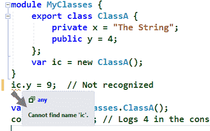

要使模块的成员在模块外部可用，你应该使用`export`关键字。将之前的声明改为如下：

```cs
    export class ClassA 
```

然后，你可以使用模块的名称来访问其公共成员：

```cs
    var c = new MyClasses.ClassA(); 
    console.log(c.y); // Logs 4 in the console window. 
```

注意，由于`ClassA.x`成员的私有声明，它也无法访问。这样，我们就有了将事物与其应属于的命名空间关联起来的便捷方式。

# 外部模块

然而，当你处理大型应用程序时，最有用的方法就是使用外部模块。实际上，正如 John Papa 建议的([`johnpapa.net/typescriptpost4/`](https://johnpapa.net/typescriptpost4/))，按你需要的模块来组织应用程序的功能可能是有用的。

假设我们在`ES6Code.ts`文件中有一个模块定义。要导出`foo()`函数和`Timer`类，你可以这样声明：

```cs
    // File ES6Code.ts  
    module ES6Code { 
      export function foo() { console.log("Foo executed"); } 
      export class Timer { 
        localTime: string; 
        currentDate: string; 
        constructor( todaysDate:Date ) { 
            this.localTime = todaysDate.toTimeString(); 
            this.currentDate = todaysDate.toLocaleDateString(); 
        } 
      } 
    } 
```

现在，在单独的模块或脚本部分，我们可以使用稍微不同的引用来访问该功能：

```cs
    // File: app.ts --------- 
    // Simple Function Import  
    import foo = ES6Code.foo; 
    foo();  // OK. 
```

对于`Timer`类也是如此，只不过我们还可以采用另一种方法来引用这个类：

```cs
    // File: app.ts --------- 
    // Reference Class Import (alternative syntax) 
    var timer = new ES6Code.Timer(new Date()); 
    console.log(timer.currentDate); 
    console.log(timer.localTime); 
```

在这种情况下，模块的名称用作类实例化的前缀，这与在处理 C#代码时找到的命名空间方式类似。

要测试这段代码，我们只需在 HTML 页面中包含对应编译后的文件（`.js`扩展名）的引用，或者在内置的 Node 控制台中测试它。例如，如果你使用一个空白 HTML 页面，你可以这样包含文件：

```cs
    <head> 
      <meta charset="utf-8" /> 
      <title></title> 
      <link rel="icon" href="data:;base64,iVBORw0KGgo="> 
      <script src="img/ES6Code.js"></script> 
      <script src="img/app.js"></script> 
  </head> 
```

注意：`<link>`标签是一个假 favicon，用于防止 Chrome 在控制台输出“文件未找到”错误。

在这两种情况下，引用都是正确的，代码按预期执行，正如我们可以在下面的屏幕截图中看到（记住：在任何现代浏览器的开发者工具中的`F12/Console`。这里我使用的是 Chrome）：

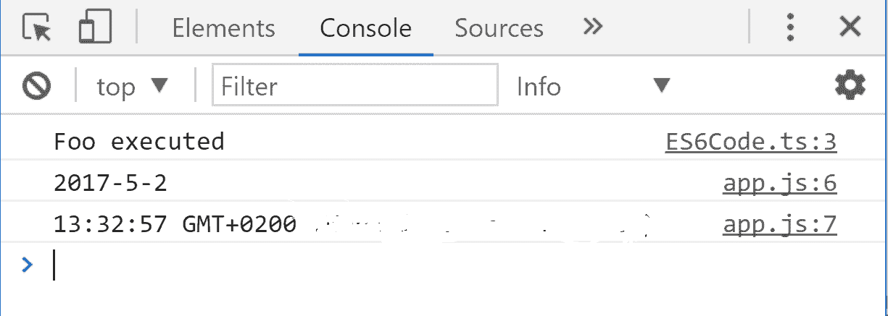

这是因为，一旦文件在页面内部被引用，只要它们被标记为`export`，它们的成员就可以访问。

实际上，我们可以引用多个文件，并且它们将按顺序加载和执行。注意，控制台窗口还指示了哪些代码负责执行控制台中的哪个条目。

在初始示例中，`MyClasses`存储在`app1.ts`文件中。因此，现在我们也可以在`</head>`标签之前引用它，并检查第三个源在控制台中的显示，输出数字 4 在最后一个位置（如下面的屏幕截图所示）：

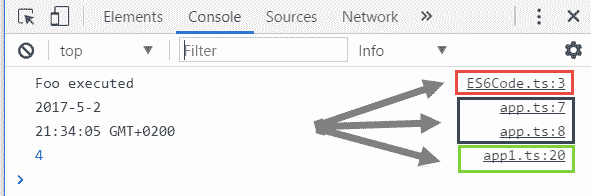

此外，你会发现 Chrome 足够智能，能够引用原始的`.ts`文件而不是编译后的文件，这允许你调试这些文件中的任何一个，设置断点等。在下面的屏幕截图中，我展示了在打印日期和时间值之前设置断点后的 Chrome 调试窗口：

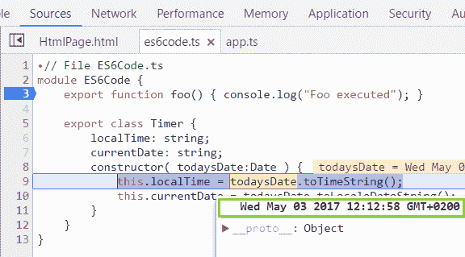

除了这些选项之外，现在还可以使用 Chrome 作为默认浏览器在 Visual Studio 2017 中进行调试。

这种模块分离很重要，因为，正如你稍后将会看到的，这意味着文件分离，这对于 TypeScript 和，尤其是 Angular 组织应用程序的不同组件的方式变得至关重要。

# TypeScript 中的依赖注入

所有这些说完，TypeScript 本身并没有 DI 容器。然而，你可以使用一些可用的第三方选项。其中一些最受欢迎的是 `Infuse.js`（可在 [`github.com/soundstep/infuse.js`](https://github.com/soundstep/infuse.js) 获取）和 TypeScript IoC，你可以在 NPMJS 网站上找到它（[`www.npmjs.com/package/typescript-ioc`](https://www.npmjs.com/package/typescript-ioc)），两者都以与我们已经在 .NET Core 中看到的方式非常相似的方式工作。

也就是说，你必须做出定义，将接口映射到类，甚至将描述符映射到类，然后注册这些选项。之后，你可以引用所需的类型，并期望 DI 容器为你提供相应的类型。

让我们回顾一下 TypeScript IoC 的工作方式，以定义一个简单的注入场景，就像它在官方页面上展示的那样。

首先，假设你已经安装了 TypeScript，你还应该使用典型的 `npm` 命令安装 TypeScript IoC：

```cs
    npm install typescript-ioc  
```

此外，配置文件（`tsconfig.json` 文件）中还需要一些现代选项：

```cs
    { 
      "compilerOptions": { 
        "experimentalDecorators": true, 
        "emitDecoratorMetadata": true 
      } 
    } 
```

一旦配置完成，你就可以使用 `import` 语法的一种变体来投入使用：

```cs
    import {AutoWired, Inject} from "typescript-ioc"; 
    class PersonDAO { 
      @Inject restProxy: PersonRestProxy; 
    } 
```

如你所见，`restProxy` 属性（属于另一种类型 `PersonRestProxy`）被标记为 `@Inject` 装饰器（JavaScript 最新版本中的新功能，并在 TypeScript 中可用），以表明它可以在其他代码中稍后注入）。

在代码的另一个地方，你将能够使用这些定义，语法非常简单：

```cs
    let personDAO: PersonDAO = new PersonDAO();  
```

`restProxy` 属性将由容器提供，解决依赖关系。参数注入也通过一个具有构造函数的类提供，如下面的代码所示：

```cs
    class PersonService { 
     private personDAO: PersonDAO; 
     constructor( @Inject personDAO: PersonDAO ) { 
       this.personDAO = personDAO; 
     } 
   } 
```

如果后来你有一个使用 `PersonService` 作为属性的另一个类，你可以在该属性上标记 `@Inject`，就像以下代码中所示：

```cs
    class PersonController {
     @Inject private personService: PersonService;
    }
```

你可以依赖容器管理的依赖关系链，它将通过所有之前标记为 `@Inject` 的引用。

然而，在实践中，很少看到 TypeScript 本身的应用程序，这种语言最常见的用途是向其他框架，如 Angular 或 Ionic，提供一致的开发语言。

# Angular

如 第二章 中提到的，*依赖注入和 IoC 容器*，Angular 是由 Google 团队（由 MiskoHevery 领导）创建的一个开发框架，现在已经成为非常流行的框架（你可以在 [`angularjs.org`](http://angularjs.org) 访问官方信息）。

现在，Angular 以两种不同的风味提供，遵循不同的发布路径或分支：

+   **版本 1.x**：也称为 **AngularJS**。它适用于小型/中型应用程序，并使用 MVC 模型从开始就实现适当的关注点分离：

    +   它由一组 JavaScript 库组成，每个库提供所需功能的一部分。然而，所有库都依赖于基本的 AngularJS 库。

    +   在撰写本文时，最新版本是 1.6.4，团队保证提供支持和未来的更新。它也可以通过 CDN 在 [`ajax.googleapis.com/ajax/libs/angularjs/1.6.4/angular.min.js`](https://ajax.googleapis.com/ajax/libs/angularjs/1.6.4/angular.min.js) 下载。

+   **版本 2+**：它被称为 **Angular**，遵循语义版本控制路径，这意味着在次要修订中不允许有破坏性变化，只有在新的版本中才允许。为了避免 3.0，版本号跳过了 3.0，所以最新版本是 Angular 4（确切地说，是 4.1）。它除了 AngularJS 之外还有一个专门的网站 [`angular.io/`](https://angular.io/)：

    +   可能最大的变化是 Angular 不与 AngularJS 兼容，因为它采用了 ES6 中出现的一些变化，这直接影响了模块的管理方式。

    +   它的主要特性包括跨兼容性、改进的速度和性能、优秀的工具支持，以及全球社区日益增长的采用率。

    +   Angular 是通过与微软 TypeScript 团队的合作在 TypeScript 中构建的，该团队积极参与项目。最近，团队的一位主要成员宣布：“自 2017 年 3 月起，TypeScript 已被允许用于不受限制的客户端开发。TypeScript 和 TypeScript 上的 Angular 在 Google Analytics、Firebase 和 Google Cloud Platform 以及关键内部工具（如错误跟踪、员工评审和产品审批及发布工具）中使用。”

从架构角度来看，这两个版本有一些共同点。它们促进 SOLID 原则，特别是 SRP 和 DIP，因此它们都依赖于依赖注入容器。此外，采用 MVC 模型有助于结构化关注点的分离。

让我们看看这两大流行架构如何实现依赖注入（尽管方式不同）。

# AngularJS

一旦清楚 MVC 的基本原理，创建一个非常基础的 Angular 应用程序就很容易了。MVC 模型建议将应用程序组件的基本分离为三个部分（见以下图示）：

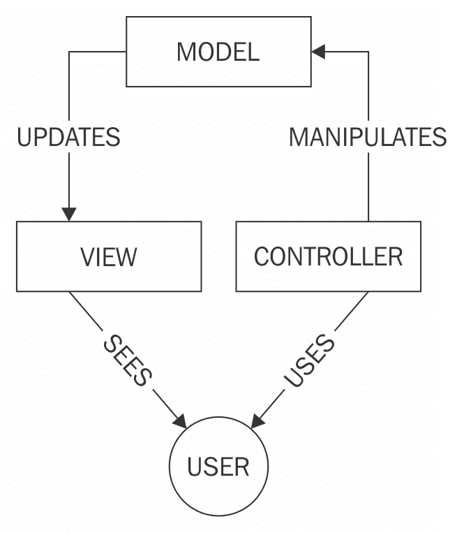

（图片来源：维基百科：[`en.wikipedia.org/wiki/Model-view-controller`](https://en.wikipedia.org/wiki/Model-view-controller)）

用户的交互生成一个电路，其中包含 MVC 的三个支柱：

+   **模型**（MODEL）在加载 AngularJS 库的过程中自动创建。

+   **视图**（VIEW）对应于 HTML 部分，通过自定义属性（所有以 ***ng-*** 开头）来标记所需的特定功能。视图还使用一种称为 **mustache** 的语法来指示哪些部分受数据绑定的影响。

+   **控制器**是 JavaScript 片段，编码以反映用户请求的任何更改，并在需要时操作模型。

当用户与页面中的 UI 元素交互时，控制器会处理相应的操作，如果需要则修改模型，Angular 会更新视图以反映这些变化。最后，用户接收到的视图继续不间断地循环。

# 使用 Visual Studio 2017 的示例

一旦你有一个加载了 AngularJS 库的 HTML 页面，你应该用一个特殊的属性（ng-app）标记一个 DOM 元素，以通知 Angular 其工作作用域。这定义了 AngularJS 在页面内的作用区域。

让我们通过一个非常简单的例子来看一下所有这些。我们也可以使用 Visual Studio 2017，例如创建一个新的网站（请注意，我们不需要项目，因为我们不需要在服务器上编译任何代码：所有操作都在客户端进行）。

因此，我建议选择 ASP.NET 空网站来进行这个初始演示。这将创建一个文件夹来保存解决方案，并且会包含一个 `Web.config` 文件，以防你需要指导服务器关于某些行为或需要一些编译后的代码。

接下来，我们添加一个 HTML 页面并将解决方案保存，以便能够使用管理 NuGet 包选项并搜索 AngularJS.Core 库。确保如果你不想被这个框架的所有可用库所淹没，你选择的是 AngularJS.Core 而不是 just angularjs（参见以下截图）：

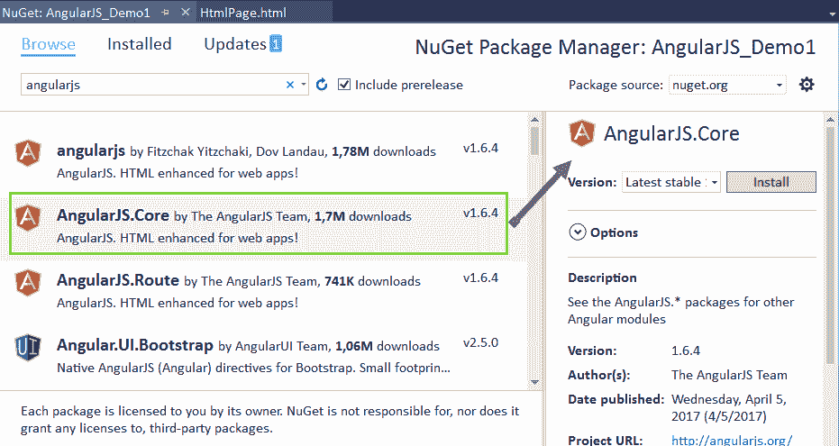

安装完成后，解决方案资源管理器中会出现一个新的 `Scripts` 文件夹，包括一些库。你只需要将 angular.js 库拖放到 `<head>` 标签内，让 Visual Studio 创建一个指向库的 `<script>` 标签，然后你就可以开始了！

下一步是添加 `ng-app` 属性（例如，到 `<body>` 标签）并给它一个有效的名称，比如 `app`。目前，我们有一个页面，加载了 angular 库，并且定义了一个作用域。

我们如何使用这个来看到一些 AngularJS 的实际应用？我们可以创建一个 HTML 标签，如 `<h2>`、`<h3>`、`<div>`、`<article>` 等，并在其中包含一个莫斯塔奇链接（它们被称为 AngularJS 绑定表达式），这些链接应该在运行时解析，例如，一个显示当前时间的 `<h2>` 标签。总的来说，到目前为止，我们应该有一个像这样的页面：

```cs
    <!DOCTYPE html> 
    <html> 
    <head> 
      <meta charset="utf-8" /> 
      <title>AngularJS initial demo</title> 
      <script src="img/angular.js"></script> 
    </head> 
    <body ng-app="app"> 
      <h2>Current time: {{time}}</h2> 
    </body> 
    </html> 
```

观察两个尚未定义的标识符（`app` 和 `time`）。这将是我们这个页面的 JavaScript 部分。因此，在关闭 `</body>` 标签之前，我们将包含一个 `<script>` 标签，其中包含以下代码：

```cs
    <script> 
      var app = angular.module("app", []); 
      app.controller("TimeController", function ($scope) { 
         $scope.time = new Date().toLocaleTimeString(); 
      }); 
   </script> 
```

这需要一些解释：首先，我们创建一个名为 `app` 的 `module`。这是一个由 AngularJS 管理的对象，用于建立感兴趣的 DOM 区域，并且它是在加载时通过在 `angular` 对象上调用 `method` module 创建的。我们只是将返回值缓存到同名变量中，以便使接下来的代码更清晰。

下一步至关重要。在这里，我们创建一个名为 `TimeController` 的控制器，并给它分配一个回调函数。嗯，这个函数默认使用依赖注入！如果你注意到函数的定义，其中定义了一个 `$scope` 变量。它从哪里来？

解释是，在几个 Angular 构造中，当你定义一个回调函数并声明一个可识别的服务作为参数（如 `$scope`）时，`$injector` 对象会提供该服务的单例实例给你，而无需我们自己的干预。

正是那个 `$injector` 对象提供了 AngularJS 中的 DI 容器服务。每个由模块管理的对象都有该服务的实例，并负责解决所有依赖。

官方的 AngularJS 文档以这种方式定义了其实现：

AngularJS 的注入子系统负责创建组件，解决它们的依赖关系，并在请求时将它们提供给其他组件。

# 理解 AngularJS 引导结构

以下图表显示了加载 Angular 应用时发生的引导过程的结构：

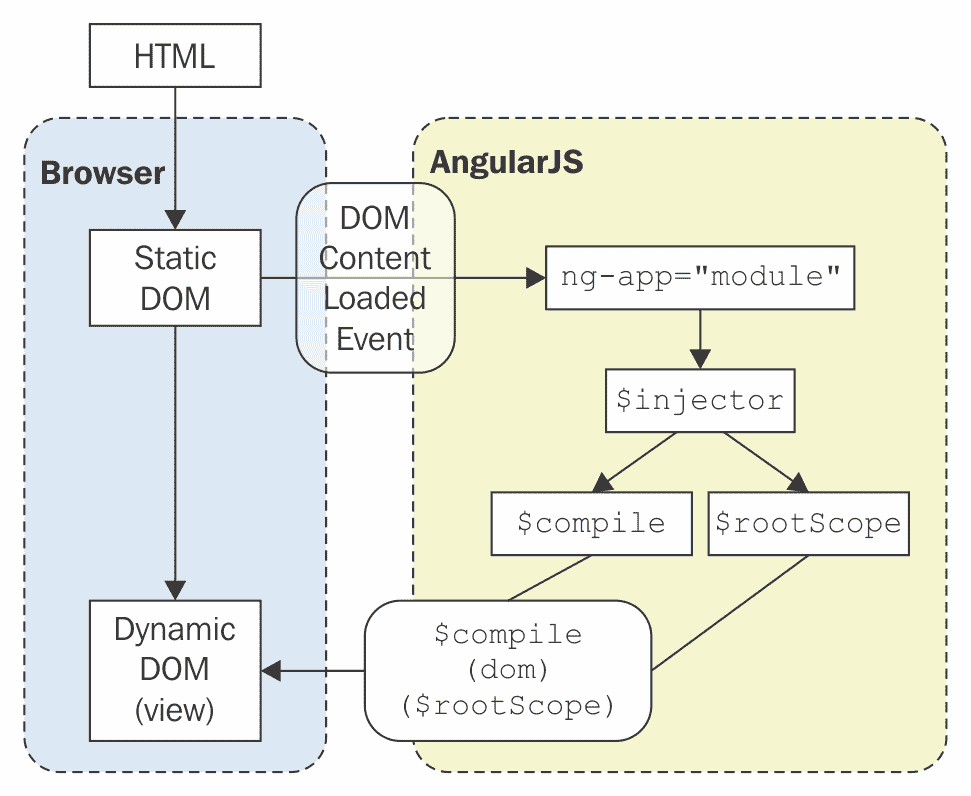

详细解释如下：带有以 `ng-` 开头的属性的 HTML 元素表示 DOM 的一部分，称为动态 DOM（没有 `ng-` 属性的，被认为是静态 DOM）。

让我们简要地重现所使用的步骤：

+   当 DOM 加载时，AngularJS 会寻找带有 `ng-app` 标记的元素，并定义一个与它关联的 `$injector`。

+   反过来，该注入器定义了一个 `$compile` 服务，它教会 HTML 解释器一些新的语法。更准确地说，文档通过以下方式解释这一点：

*编译器允许你将行为附加到任何 HTML 元素或属性，甚至可以创建具有自定义行为的新的 HTML 元素或属性。AngularJS 将这些行为扩展称为指令。*

+   记住所有这些，AngularJS 还创建了一个特殊的服务，称为 `$rootScope`，它作为模块的根模型。当然，你可以在自己的代码中使用它。

+   现在，你创建的每个控制器都有一个 `$rootScope` 的子控制器，简单地称为 `$scope`：这就是该控制器管理的模型部分。

+   作为最后一步，`$compile` 对象遍历模块，寻找具有 `ng-*` 属性的元素，这里称为指令，或者 AngularJS 表达式（`{{moustache}}` 注释），并用所需的数据或代码替换这些元素。

因此，我们 HTML 代码的最后一个方面将是（我只包括 `<body>` 元素的內容）：

```cs
     <body ng-app="app"> 
      <h2 ng-controller="TimeController">Current time: {{time}}</h2> 
    <script> 
       var app = angular.module("app", []); 
       app.controller("TimeController", function ($scope) { 
          $scope.time = new Date().toLocaleTimeString(); 
       }); 
      </script> 
    </body> 
```

因此，我在这里所做的是创建一个名为 `TimeController` 的控制器变量（`time`），其值等于表示当前系统时间的字符串。

最后，我们需要指出哪个 AngularJS 元素由哪个控制器管理：在这种情况下，是包含在模型中定义的`time`变量的`<h2>`元素。在运行时，AngularJS 将变量的值替换为`{{time}}`表达式。

浏览器中的输出每次刷新页面时都会改变（请参阅以下截图）：

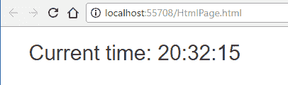

这是一个非常简单的示例，但它说明了 AngularJS 的基础以及 DI 如何在整个框架中无处不在，因为你会发现它无处不在。

# 数据访问和依赖注入

实际上，如果我们使用另一个名为`$http`的 AngularJS 服务访问一些真实数据，我们可以看到控制器的一个更好的实现以及如何使用`$injector`对象。

以下代码读取了我们在第九章中使用的`BookStore2.json`文件的所有数据，*依赖注入的反模式和误解*演示，并创建了一个元素列表。我将首先展示代码，然后我们将进行解释：

```cs
    <!DOCTYPE html> 
    <html> 
    <head> 
      <meta charset="utf-8" /> 
      <title>AngularJS Data Access Demo</title> 
      <link rel="icon" href="data:;base64,iVBORw0KGgo="> 
      <link href="Content/bootstrap.css" rel="stylesheet" /> 
      <script src="img/angular.js"></script> 
    </head> 
    <body ng-app="app" class="container"> 
      <h2>A list of ASP.NET Core Books (by PACKT)</h2> 
      <ul ng-controller="ListController"> 
        <li ng-repeat="book in Books"> 
            {{book.Title}}, <strong><em>{{book.Author}}</em></strong> 
        </li> 
      </ul> 
      <script> 
        angular.module("app", []); 
        var ListController = function ($scope, $http) { 
               $http.get("BookStore.json"). 
               then(function (response) { 
                     $scope.Books = response.data; 
               }). 
               catch(function (error) { 
                     alert(error.statusText); 
               }); 
        };         
        ListController.$inject = ["$scope", "$http"]; 
        angular.module("app").controller("ListController", 
           ListController); 
      </script> 
    </body> 
    </html> 
```

在取消注释之前，让我们注意，我还在使用 BootStrap 库，但这只是为了展示目的；它与 DI 无关。

如果你在任何浏览器中查看之前的代码，它将呈现一个与以下截图非常相似的输出：

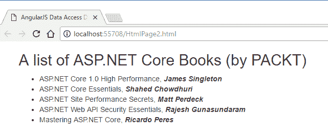

让我们回顾一下这段代码中最重要的一些更改。在 JavaScript 方面：

+   模块创建不会缓存在变量中（这避免了在全局空间中不必要的变量）。

+   控制器是通过将一个函数表达式赋值给同名的变量来创建的。它声明了两个稍后将要注入的变量：

    +   `$scope`：与控制器链接的模型引用

    +   `$http`：一个服务，它通过使用 AngularJS 中的`XmlHttpRequest`对象（AJAX）或 JSONP 与 HTTP 服务器进行请求/响应操作

+   在函数内部，使用`$http`通过调用其`get`方法并传递要恢复的资源 URL 来获取数据。该调用返回一个承诺，该承诺异步解决：

    +   当承诺解决时，它返回预期的信息，并且与之链接的回调函数将接收到一个对象，该对象具有以下属性，根据官方网站的文档：

        +   `data{string|Object}`: 使用转换函数转换后的响应体

        +   `status{number}`: 响应的 HTTP 状态码

        +   `headers{function([headerName])}`: 获取头部的函数

        +   `config{Object}`: 生成请求时使用的配置对象

        +   `statusText{string}`: 响应的 HTTP 状态文本

    +   如果状态码是 200 到 299 之间的数字，则过程成功，并且后续调用`.then()`将接收其`[parameter].data`属性内的信息

    +   否则（如果你得到不同的状态码），将出现错误，你应该通过额外的`.catch()`调用来捕获它，就像我们在前面的代码中所做的那样

+   `$injector`对象能够解析变量的名称，作为它们所代表服务的单例实例，但当你打包应用程序并且**minifiers**更改这些变量的名称时会发生什么？这就是`$inject`数组发挥作用的地方：

    +   它允许**minifiers**重命名函数的参数，同时仍然能够注入引用的服务。请注意，这是一个与控制器链接的数组，它可以随意增长或缩小。

+   最后一步是在模块内部定义控制器本身。这就是为什么我们使用`angular.module("app")`语法，它访问模块并在其中调用所需的方法（注意这次我们没有传递第二个参数：这意味着访问，而不是创建）。

当然，AngularJS 使用 DI 和框架本身还有很多其他功能，但我希望现在对依赖注入在这里是如何实现的有一个大致的了解。让我们总结并完成 AngularJS 中这个模式最重要的要点。

# 总结 AngularJS 中的依赖注入功能

在 AngularJS 中，依赖项的创建是`injector`对象的责任。顺便说一下，该对象使用构造函数注入范式。实际上，注入器表现得像一个服务定位器，负责构造和查找依赖项。

这是通过在 HTML 模板中使用声明性记号来实现的。当 HTML 被处理（解析）时，它将组件创建的责任传递给注入器，从而避免了在整个应用程序中传递注入器的需要。所有这些工作都是在幕后完成的。

正如文档所述，以这种方式工作，应用程序代码只需声明它需要的依赖项，无需处理注入器。这种设置不会违反迪米特法则*。

现在，让我们关注 Angular 的最新版本（版本 2.0+），它们在许多方面基于这些原则，但它们的实现方式有很大的不同，因为它们采用了 ES6 和相关技术。

# Angular 2+

自从 2009 年 AngularJS（版本 1.x）发布以来，网络发生了巨大的变化。我们现在有各种各样的构建系统、模块化加载能力和可用的 Web 组件。JavaScript 开发也取得了飞跃性的进步。

这些更改在 AngularJS 中没有反映出来，因此它的性能不如团队所希望的那样，主要由于消化周期（与我们之前提到的 DOM 解析相关），以及直接与变更检测相关。

在 Angular 中，变更检测可以想象成从根到叶子的单向工作树，这样既快又可预测。

任何高于 1.x 版本的名称只是 Angular，没有`JS`后缀

Angular 有可观察和不可变对象，这大大加快了检查多少个属性的速度。

此外，可观察对象仅在它们依赖的输入发出事件时才会触发。不可变对象仅在它们的输入属性之一发生变化时才会检查。然而，在大多数情况下，这两种类型的对象不需要检查，这意味着你的整个应用程序将会加速。

# Microsoft 的 TypeScript 是 Angular 2+ 中的首选语言

另一个重大变化是使用 TypeScript 作为首选语言（Angular 团队也使用 TypeScript 语言服务和 Visual Studio Code，以检测代码中的失败和不一致性，正如布拉德·格林最近所宣布的）。

TypeScript 在 Visual Studio Code 和 WebStorm 等编辑器中得到了很好的支持，并且当你导入模块和自动完成智能建议时，它表现得像一个永久的助手。

此外，由于它是一种类型化语言，提供的提示比 JavaScript 的 Intellisense 深得多。此外，任何有效的 JavaScript 都是 TypeScript，因此你可以根据你的舒适度使用尽可能多或尽可能少的 TypeScript。许多区域有助于 Angular，例如接口、构造函数、公共变量、类、类型化参数等等。

但也许 Angular 中最大的变化是其架构基于组件的概念。这些组件是通过类注解或装饰器定义的，这是一个允许向类添加元数据的特性。

在深入探讨之前，让我们首先提醒自己与 Angular 一起工作所需的工具。

# Angular 工具

要使用 Angular 的最新版本，你可以当然从各种工具中选择，但我将使用官方站点推荐的工具，以及你作为需求所需的工具。

首先，你需要安装一个较新的 Node.js 版本。在撰写本文时，其网站上提供了两个版本（[`nodejs.org/es/`](https://nodejs.org/es/)）：6.10.3 和 7.10.0。任何一个都可以，尽管我安装了 7.10.0。这个安装提供了两个基本工具来与 Angular 一起工作：Node 和 **NPM**（**Node 包管理器**）。

安装完成后，请确保版本正确，通过在控制台窗口中输入以下内容：

```cs
 node-v
```

并且通过输入以下内容：

```cs
 npm -v 
```

在此基础上，有许多适合 Angular 的编辑器，但你可以尝试免费的跨平台 Visual Studio Code，它具有调试功能，在 Windows、Linux 和 OSX 上运行良好。

# 使用 Angular

让我们安装 Angular CLI，这是一个用于与 Angular 一起工作的命令行界面，它在这个框架的初始步骤中非常有帮助。我们将能够非常容易地创建早期应用程序，并了解架构的变化。

Angular CLI 有一个专门的网站([`cli.angular.io/`](https://cli.angular.io/))，在那里你可以找到安装过程、下载和相关文档。然而，最简单的方法是通过 NPM 安装它。你只需在命令提示符中输入以下命令：

```cs
    npm install -g @angular/cli  
```

这将在全局范围内安装 Angular-CLI 工具，因此它在整个文件系统中都是可用的。

再次强调，检查安装的最终状态是一个好习惯，你可以通过输入以下命令来完成：

```cs
    ng --version
```

输出应显示以下信息：

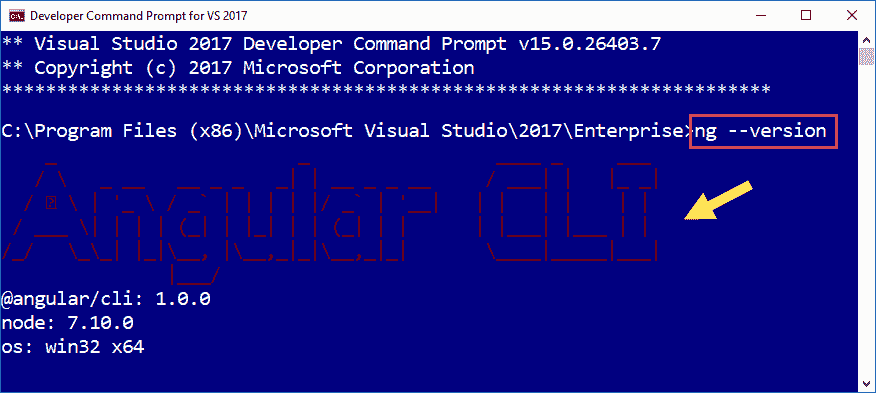

我们已经准备就绪！如果你想查看 Angular CLI 所持有的命令列表，只需输入`ng --help`。会出现一个长长的列表，这样你就可以了解这个工具在当前版本中的强大之处。

要创建第一个应用程序，打开命令提示符（你可以使用 Visual Studio 安装的开发者命令提示符链接），转到你想要放置演示的目录，创建一个新的目录，并输入以下命令：

```cs
 ng new [your-app-name]
```

在我的情况下，我输入了`ng new ng4-demo`，然后你等待 NPM 的一堆库在你的选择目录中下载和安装。

在新目录中，你现在可以看到由工具创建的文件和目录列表，并准备好启动。请注意，有三个新的目录：`e2e`、`node_modules`和`src`。

第一个包含应用程序的端到端测试。这是默认设置的，你应该进一步修改这些定义以满足你的需求。

第二个最大的目录包含了几乎任何 Angular 应用程序所需的 JavaScript 库列表。不要因为它的长度而感到害怕：它们被下载并本地安装，为程序员提供他们可能需要的工具，但在部署时，只有那些必需的库会被包含在部署前的打包和压缩过程中（这被称为**tree-shaking**）。

最后，在`src`目录中，你会找到这个初始演示所需的全部文件。其余的是 Angular CLI 和其他工具（如编辑器）用于管理项目的文件（特别是`package.json`、`tsconfig.json`和`angular-cli.json`）。

你最终会得到以下列表：

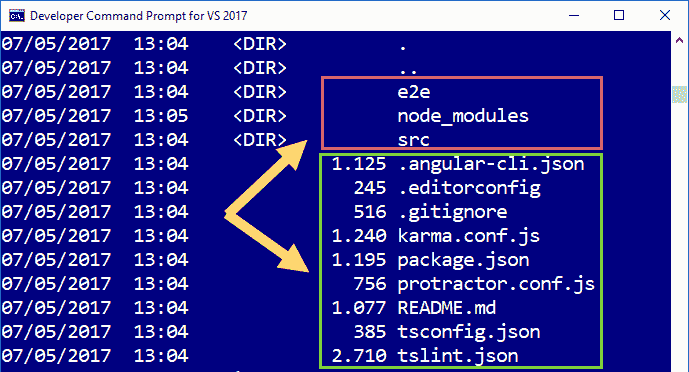

要看到它的实际效果，只需输入`ng serve`。这将运行 Webpack 工具准备一切，并在默认情况下在 4200 端口启动一个服务器。

最后一步是打开任何浏览器，输入 URL `http://localhost:4200`，并查看显示`app works`的非常简单的页面（我省略了输出；这很显然）。

# 编辑初始项目

现在我们知道一切正常，让我们在 Visual Studio Code（或你选择的编辑器）中查看项目，并尝试理解其背后的架构。

因此，我将从命令提示符打开编辑器，只需在主项目目录中输入`code .`即可。

想了解更多关于 VSCode 的信息，请访问[`code.visualstudio.com/`](https://code.visualstudio.com/)。

也许，这个初始演示最令人惊奇的事情（尤其是如果你将其与我们之前在 Angular 1.6 中的演示进行比较）是这个应用程序主 HTML 页面内缺少引用和指令：

```cs
    <!doctype html> 
    <html> 
    <head> 
     <meta charset="utf-8"> 
     <title>Ng4demo</title> 
     <base href="/"> 
     <meta name="viewport" content="width=device-width, initial-scale=1"> 
     <link rel="icon" type="image/x-icon" href="favicon.ico"> 
    </head> 
    <body> 
     <app-root>Loading...</app-root> 
    </body> 
    </html> 
```

唯一的非静态 HTML 用粗体标出：`<app-root>`。Angular 通过一个复杂的组件相关架构过程将这个自定义元素解析成你在浏览器中看到的真实页面，在这个过程中，每个组件定义其行为、其视觉元素（如果有），以及它与应用程序其余部分的通信方式。

如果你查看`src`目录，你会看到几个 TypeScript 文件。负责在调用`http://localhost:4200`时指导浏览器做什么的模块位于`angular-cli.json`文件中。此文件包含有关编辑器和服务器行为等的大量定义。

它包含一个应用程序的入口，包含那个`main`属性，以及应用程序的入口点，它与一个`index`字段相关联（见以下截图）：

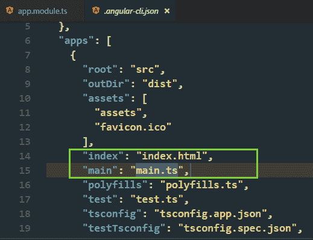

通过这些定义，浏览器知道要启动哪个页面，服务器知道应该解析哪些组件：无论`main`模块指示什么。它显示的是一个基本的环境配置：

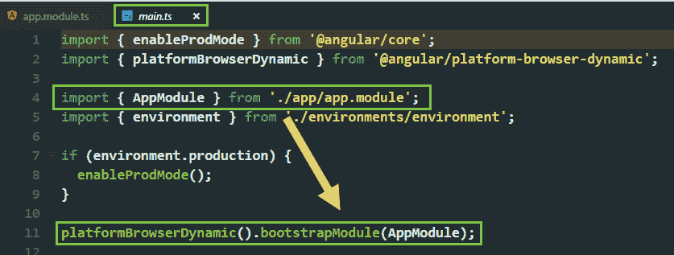

因此，这就是 Angular 管理应用程序初始化的方式。无论`AppModule`内部有什么，都将被加载和解析。

# 主模块的结构

然而，由于每个 Angular 应用程序都必须至少包含一个模块，`app.module.ts`就成为了设置应用程序的那个模块。理解它是如何工作的至关重要：

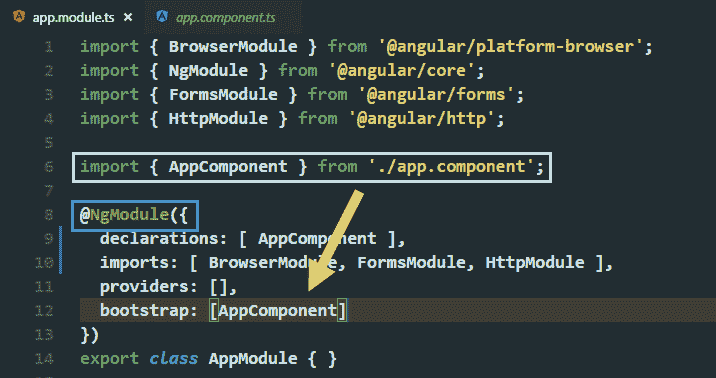

首先，我们找到`import`语句，这些语句加载了 Angular 库中之前导出的某些组件，例如`platform-browser`、`core`、`forms`和`http`。然而，这些库中的一些在这个基本演示中并不需要。

最后一个`import`语句是连接此模块与剩余功能，加载`app.component`的那个。

定义模块的方式是通过一个类（这里命名为`AppModule`），并用`@NgModule`装饰器标记。里面没有功能或定义。只有装饰器提供了与应用程序其余元素的正确链接。

实际上，`bootstrap`属性指示哪个组件将负责启动应用程序。

让我们看看这个组件是如何构成的：

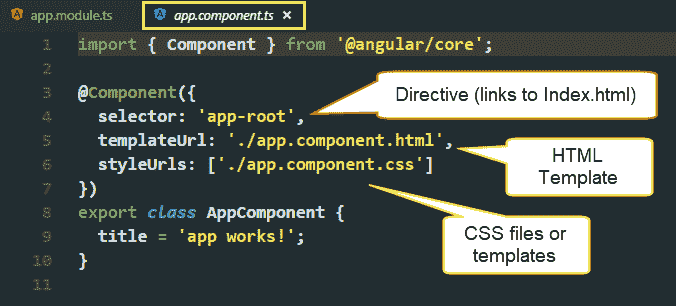

现在我们有一个带有`@Component`装饰器的`AppComponent`类。在里面，我们找到了在浏览器中看到的 HTML 部分。它是类的标题字段。

但是，在装饰器内部，我们有一些线索：

+   `selector`：指示将被转换为运行时真实 HTML 片段的定制动态 DOM 部分。记住，`Index.html` 内部的 HTML 的唯一外部部分是对 `<app-root>` 元素的引用。

+   `templateUrl`（可选，如果指示的话）：包含将替换选择器的 HTML 片段的文件。它们接受 `{{moustache}}` 语法，就像这里发生的那样。

+   `styleUrls`：一个 CSS 文件数组，将在运行时加载用于展示目的。它们只会影响定义它们的组件，而不会影响整个页面。

最后，我们在浏览器初始页面中看到的 `app works` 句子只是 `AppComponent` 类的 `title` 属性。是的，它是通过数据绑定链接到模板内的 HTML 的，而模板只是一个 `<h1>` 元素：

```cs
    <h1> 
     {{title}} 
    </h1> 
```

因此，让我们做一些更改，看看效果如何。我将 `app works` 改为 `title` 属性的 `First demo in Angular 4`，而空的 CSS 文件也将包含一些格式化规则：

```cs
    h1 { 
      font-family: 'Segoe UI', Tahoma, Geneva, Verdana, sans-serif; 
      font-size: 2em; 
      border: 3px solid navy; 
    } 
```

当然，我们也可以将任何静态内容添加到 `**index.html**` 本身（例如，一个图像，位于选择器旁边）：

```cs
     
```

环境将负责处理应用中的每一个变化，并增量地重新编译这些变化。

注意，最后我们看到的是类的 `title` 属性，它由 Angular 框架的组件架构评估和管理，正是这个组件架构促进了依赖注入的实现。

因此，我们应该看到这些变化，而无需任何更多干预：

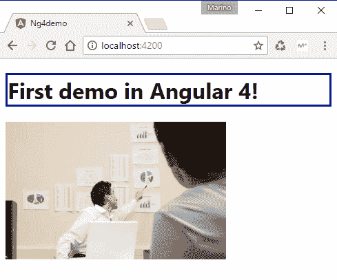

这个模型中隐含的一些过程使用在编译时间和运行时解决的依赖类型。但我们如何看到 DI 的实际应用呢？

# Angular 4 中的依赖注入（DI）

好吧，Angular 中的 DI 遵循构造函数注入模式；因此，由于我们在这里处理的是类（组件），大多数注入都需要在构造函数参数定义中进行。

官方 Angular 文档网站上有一个专门的页面提供了有关依赖注入的更多信息，请参阅[`angular.io/docs/ts/latest/guide/dependency-injection.html`](https://angular.io/docs/ts/latest/guide/dependency-injection.html)。

与 AngularJS 一样，Angular 在引导过程中创建了一个注入器对象，因此您不需要自己创建它（记住，`main.ts` 中的 `platformBrowserDynamic().bootstrapModule(AppModule)` 语句）。

# 提供者的概念

在这个前提下，程序员的职责是注册那些将通过 DI 服务的类。您可以在 `NgModule` 中或任何 `Component` 内完成此操作，但无论如何，声明可注入类的途径是将它的名称添加到组件或模块的 `provider` 集合中。

差别在于，当在`@**NgModule**`内部声明时，这些服务将与整个应用程序一起可用。在其他情况下，它将限制在组件的层次结构内。

让我们修改之前的例子，这样你就可以看到这个技术的实际应用。实际上，这相当简单。

第一步是创建一个提供所需注入信息的类（我将称之为`DIClass`）。让我们假设我们想要一个额外的文本属性和一张图片。由于我们只需要图片的 URL，我们将定义两个字符串属性。

但为了使这个类可注入，我们需要将其标记为可注入。我们通过从`@angular/core`导入`"Injectable"`定义，并用该注解装饰类来实现这一点。这个类的代码的最后一个方面将是：

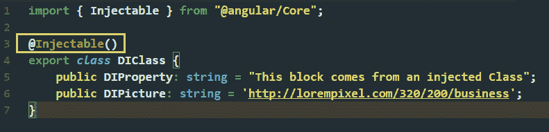

现在，我们可以从`index.html`中移除我们插入的``元素，并将插入图片的任务交给组件。

此外，仅为了展示目的，我已经修改了`app.component.css`代码，用边框标记注入的信息，这样这些片段就变得清晰可见。

类准备好了，我们现在定义这个服务的范围。由于我们只需要在`AppComponent`中使用它，我们将在`@Component`装饰器的类中添加一个新的`providers`定义；这将使`DIClass`的内容在组件内部可用。

最后，我们可以修改我们的类以包含两个额外的属性（`subtitle`和`fotosource`），它们的值是通过注入获得的。在实践中，这个注入的类通常会是被多个应用程序的组件所需的数据访问服务或其他类型的资源。

由于这些值是通过在构造函数中声明注入的类（或值）来接收的，最终的版本将是：

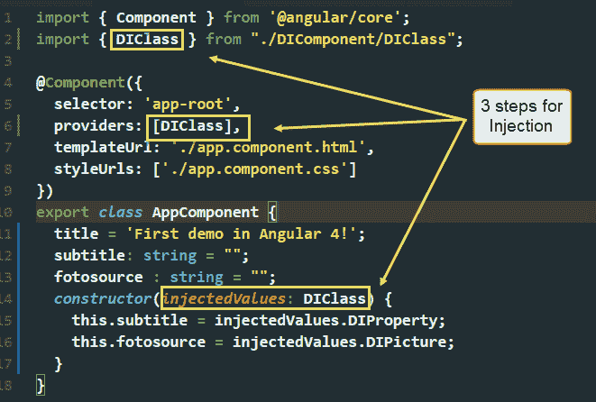

现在，如果你保持服务器运行并查看页面的新方面，在初始消息旁边，我们应该看到那些注入的元素，格式化根据`**app.component.css**`文件内的 CSS 规则：

就这样。只要我们之前用`**@Injectable**`装饰器声明了这些值，我们就可以注入所需数量的项目；然而，如果您需要更多可定制的服务或数据，我建议阅读我之前提到的文档参考。

# 总结

这些技术使你的代码更易于维护和扩展，并且也减少了对外部变化的依赖。由于你只需要引用所需的服务，一个服务的实现变化并不一定意味着使用这些服务的高级类也会发生变化。

当然，在 Angular 4 中的依赖注入（DI）远不止本章所包含的基本信息。到现在为止，我希望你已经更好地理解了 DI 在这些框架中的存在方式，以及为什么它正成为普遍流行的实现设计模式。

# 摘要

在本章中，我们介绍了其他框架中的 DI，特别关注了 Angular 的两个当前分支。

首先，我们了解了 TypeScript 的基础知识，它是 Angular 2+的基础，以及它的类定义和模块加载能力如何允许以更面向对象、模块化的方式构建基于 JavaScript 的应用程序。

接着，我们探讨了 AngularJS（Angular 的遗留分支）内部的 DI 实现，该实现仍在全球超过 70%的 Angular 项目中使用。

最后，我们探讨了 Angular 4（撰写本文时的最新版本）的基础知识，以及上述面向对象及其基于注解的组件架构如何使得依赖注入的实现变得非常简单。

在第十一章，“最佳实践与其他相关技术”，我们将介绍 DI 和其他相关技术中最常见的最佳实践。
