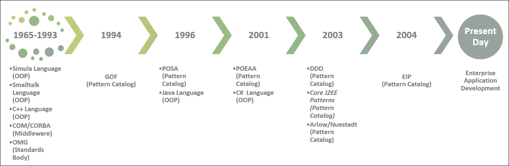

# 第一章. 模式和模式目录简介

设计模式一直令软件开发者着迷，然而，对其适用性和后果的真正了解却让许多人望而却步。随着时间的推移，经验丰富的开发者和架构师研究了为解决类似问题而创建和应用的各种解决方案。一个缓慢的运动开始记录这些经过时间考验且成功的解决方案，这些解决方案成为了软件设计的蓝图。设计模式的适用性在解决方案架构（从稳定性、一致性、可维护性和可扩展性方面）上表现出成熟度（尽管过度设计被视为风险），并成为严肃的开发者和架构师的核心技能。在这本关于模式和模式目录的介绍中，作者希望详细说明导致各种模式和模式目录被发现和巩固的软件开发生态运动。同样重要的是要理解导致这些技术无关蓝图标准化的模式、习语、编程语言和标准的发展演变，这些蓝图构成了今天企业应用开发的基础。我们将在此方面涵盖以下主题：

+   面向对象编程（OOP）技术、习语和模式的历史

+   模式和模式运动

+   关键模式和模式目录

+   促进面向对象编程（OOP）技术、习语和模式实现的 C#语言关键特性

# 面向对象编程 - 简史

面向对象编程（OOP）是一种编程模型，旨在将结构（数据）和行为（方法）结合起来以提供软件功能。这与当时在 OOP 模型获得显著地位时盛行的过程式编程模型形成了鲜明对比。在过程式编程模型中，主要的组成单元是过程（大多数是带有副作用的功能）。数据被输入到一系列过程中，这些过程构成了在解决方案上下文中的过程或算法。在面向对象的案例中，数据和相关的函数被一起表示为一个类，它在编程模型中作为一个基本单元。示意图如下：

```cs
    Class Test 
    { 
      <------ Static (Class Level) Variables ---------------> 
      <------ Instance (Object Level) Variables ------------> 
      <------ Private Methods ------------------------------> 
      <------ Public Methods -------------------------------> 
    } 

```

作为程序员，在程序执行过程中可以创建许多类的实例。由于类封装了数据和相关的操作以提供一个连贯的实体，因此与全局变量/数据（用作过程的负载）相关的所有问题（或更确切地说，副作用）突然消失了。这有助于管理开发大型软件的复杂性。

面向对象编程（OOP）革命性地改变了程序员对问题域的建模方式，类组合利用封装、关联、继承和多态。此外，由于能够轻松地用对象来表示层次结构（这紧密地代表了问题域），因此对于开发者来说，以对象为思考方式变得自然。

### 注意

面向对象的起源可以追溯到 Kristen Nygaard 和 Ole-Johan Dahl 在 1965 年创建的 Simula 编程语言。**Smalltalk**系统的出现帮助面向对象的思想渗透到学术界和一些咨询领域。Smalltalk 是一种动态类型语言，最初被设计为一个消息传递系统。后来，他们添加了 Simula 的基于类的对象模型。Xerox PARC 的 Alan Kay、Dan Inaglis 和 Adele Goldberg 设计了这种语言。

面向对象（OOP）模型在 20 世纪 90 年代初达到了临界质量，这得益于 C++编程语言的普及。尽管 Smalltalk 和 C++都是面向对象的编程语言，但 Smalltalk 是一种动态类型编程语言，而 C++是一种静态类型（尽管执行力度较弱）的编程语言。C++编程语言是由 Bjarne Stroustrup 在 AT&T 贝尔实验室创建的，作为 C 语言（为了更广泛的应用）的扩展。在这方面，C++作为一种编程语言，由于必须使其与 C 语言兼容，因此在使用方面存在一些问题。关于该语言演变的历程，在 Bjarne 本人所著的《C++的设计与演化》一书中得到了很好的记录。这本书讨论了设计该语言的原理以及他为了整合诸如单一继承、多重继承、虚方法、异常处理、模板（泛型）、输入/输出流等功能而可供选择的设计方案。任何严肃的 C++开发者都不应该错过这本书，因为它有助于理解为什么 C++编程语言是这样的！

曾尝试使用中间件技术，如微软的**组件对象模型**（**COM**）和 OMG 的**公共对象请求代理架构**（**CORBA**）来构建基于协议的开发。CORBA 和 COM 都非常相似，并且都促进了二进制级别的对象互操作性。每个协议都有自己的二进制编码格式，这两个标准之间的互操作性成为了一个问题。一些有进取心的公司通过编写 COM/CORBA 桥来解决这个问题谋生。此外，COM 主要只在微软 Windows 上可用，使其成为一种特定平台的解决方案。

然后，在 1996 年，Sun Microsystems 推出了一种语言，它被宣传为一种用于编写在浏览器中运行的应用程序（Applets）的编程语言。他们将其命名为 Java。然而，由于性能和政治原因，Applet 开发并没有起飞。这种语言及其相关平台很快被定位为服务器端编程系统。这是一个巨大的成功，Java 语言也因此强势回归，进一步普及了面向对象的编程模型。Java 语言的主要架构师是 James Gosling。

在 2001 年，微软发布了 C#，这是一种全新的面向对象语言，用于他们新的虚拟机开发平台，即.NET。后来，微软还添加了对泛型、lambda、动态类型和 LINQ 等特性的支持，使 C#成为世界上最强大的编程语言之一。该语言的主要架构师是安德斯·海尔斯伯格。

同时，像 Ruby 和 Python 这样的语言出现了，并在某些领域仍然相关。然后，出现了诸如 F#、Scala、Groovy、Clojure 等面向对象-函数式语言。然而，面向对象模型由 C++、C#和 Java 等语言代表。

# 模式和模式运动

20 世纪 90 年代初的程序员在理解面向对象（OOP）以及如何在大型项目中有效使用它们方面遇到了很多困难。在没有像互联网这样的病毒式传播媒介的情况下，这对他们来说是一场相当大的挑战。早期采用者发表了技术报告，在期刊/杂志上撰写文章，并举办研讨会来普及面向对象技术。例如，《Dr. Dobbs Journal》和《C++ Report》等杂志都设有介绍面向对象技术的专栏。

人们感到有必要将专家的智慧传授给不断增长的编程社区，但这种知识传播并没有发生。传奇的德国数学家卡尔·弗里德里希·高斯曾说过，“总是向大师学习”*。尽管高斯当时是在考虑数学，但这适用于任何非平凡的人类努力。然而，精通面向对象（OOP）技术的专家寥寥无几，学徒制模式也未能很好地扩展。

### 注意

詹姆斯·科普林出版了一本有影响力的书，名为《高级 C++编程风格和习惯用法》，该书涉及与 C++编程语言使用相关的低级模式（习惯用法）。尽管引用并不广泛，但作者认为这是一本值得注意的书，用于记录面向对象的最佳实践和技术。

+   就在这段时间，埃里希·伽玛开始在他的博士论文中研究一个模式目录，受到了一位名叫克里斯托弗·亚历山大的建筑师的启发。克里斯托弗·亚历山大的《模式语言 - 城市、建筑、建筑》是埃里希·伽玛的灵感来源。随后，持有相似想法的人，即拉尔夫·约翰逊、约翰·弗利斯、理查德·赫尔姆，与埃里希·伽玛携手合作，创建了一个包含 23 个模式的目录，现在广为人知为**四人帮**（**GoF**）设计模式。1994 年，Addison Wesley 出版了《设计模式：可重用面向对象软件元素》一书。这本书很快成为程序员的宝贵参考资料，并推动了基于模式的软件开发。GoF 目录主要关注软件设计。

+   在 1996 年，一群来自西门子的工程师出版了一本名为*面向模式的软件架构*的书，主要关注构建系统的架构方面。整个**面向模式的软件架构**（**POSA**）模式目录由约翰·威利父子公司的五本书详细记录。该团队后来加入了道格拉斯·施密特，他是**自适应通信环境**（**ACE**）网络编程库和**TAO**（**ACE ORB**）的创造者。他后来成为**对象管理组**（**OMG**）的主席，该组织开发、采用和维护标准，如 CORBA 和 UML。

+   另一个有影响力的目录是马丁·福勒在 2001 年出版的一本名为*企业应用架构模式*的书。本书主要关注使用 JEE 和.NET 框架开发企业应用时出现的模式。顺便提一下，大多数代码片段都是用 Java 和 C#编写的。

+   格雷戈尔·霍普和博比·沃尔夫出版了一个模式目录，以记录企业集成场景中出现的模式。他们的目录名为*企业集成模式*，作为马丁·福勒签名书系列的一部分出版，被广泛认为是关于企业集成技术的思想来源。Apache Camel 集成库受到了这本书的启发。

+   *核心 J2EE 模式：最佳实践和设计策略*（由 Deepak Alur 等人所著），虽然是一个特定平台的目录，但它是关于企业应用结构化思想的丰富来源。本书包括用于 Web 应用开发中的表示层、数据层和服务层模式。

+   *领域驱动设计*，由埃里克·埃文斯于 2003 年出版，讨论了一种称为**领域驱动设计**（**DDD**）的技术。本书使用 GoF 和**企业应用架构模式**（**POEAA**）模式提出了一种设计方法论，该方法论侧重于构建一个持久的无知领域模型。本书还介绍了一些用于结构化领域逻辑的模式和惯用语。

+   吉姆·阿罗和伊拉·纽斯塔特出版了一本名为*企业模式和 MDA*的书，该目录基于*荣格原型*列出了一系列模式。该目录包含九个顶级原型和 168 个业务原型，用于开发应用程序。

下图展示了设计方法论、编程语言和模式目录的演变：



## 关键模式目录

模式通常被编目在某种模式存储库中。其中一些被出版为书籍。最受欢迎和广泛使用的模式目录是 GoF，以生产它们的四位合作者的名字命名。他们是埃里克·甘玛、拉尔夫·约翰逊、约翰·弗利斯和理查德·赫尔姆。

### GoF 模式

以目录的四位创建者命名的 GoF 目录，开启了模式运动。创建者主要关注面向对象软件的设计和架构。克里斯托弗·亚历山大的思想被借用到软件工程学科，并应用于应用架构、并发、安全等领域。GoF 将目录分为结构型、创建型和行为型模式。原始书籍使用 C++和 Smalltalk 来解释概念。这些模式已经移植并利用在当今大多数编程语言中。

| **序号** | **模式类型** | **模式** |
| --- | --- | --- |
| 1 | 创建型模式 | 抽象工厂、建造者、工厂方法、原型、单例。 |
| 2 | 结构模式 | 适配器、桥接、组合、装饰者、外观、享元、代理。 |
| 3 | 行为模式 | 责任链、命令、解释器、迭代器、中介者、备忘录、观察者、状态、策略、模板方法、访问者。 |

我们认为，对 GoF 模式有良好的理解对任何程序员都是必要的。这些模式无处不在，无论应用领域如何。GoF 模式帮助我们以语言无关的方式沟通和推理系统。它们在.NET 和 Java 世界中得到了广泛的应用。

### POSA 目录

POSA 第 5 卷是一本有影响力的书籍系列，涵盖了在开发关键任务系统时的大部分适用模式。在原生代码编程方面存在一定的偏见；也许在研究期间 C++是流行的面向对象编程语言。跨越五卷出版的目录如下：

| **序号** | **模式类型** | **模式** |
| --- | --- | --- |
| 1 | 架构模式 | 层次、管道和过滤器、黑板、经纪人、MVC、表示-抽象-控制、微内核、反射。 |
| 2 | 设计模式 | 整体-部分、主-从、代理、命令处理器、视图处理器、转发器-接收器、客户端-调度器-服务器、发布者-订阅者。 |
| 3 | 服务访问和配置模式 | 包装外观、组件配置器、拦截器、扩展接口。 |
| 4 | 事件处理模式 | 反应器、先行者、异步完成令牌、接受者-连接器。 |
| 5 | 同步模式 | 作用域锁定、策略锁定、线程安全接口、双重检查锁定优化。 |
| 6 | 并发模式 | 活动对象、监控对象、半同步/半异步、领导者/跟随者、线程特定存储。 |
| 7 | 资源获取模式 | 查找、延迟获取、立即获取、部分获取。 |
| 8 | 资源生命周期 | 缓存、池化、协调器、资源生命周期管理器。 |
| 9 | 资源释放模式 | 出租、驱逐者。 |
| 10 | 分布式计算的模式语言 | 在分布式编程的背景下，对不同目录中模式的整合。 |
| 11 | 关于模式和模式语言 | 这最后一卷提供了有关模式、模式语言及其使用的元信息。 |

我们认为 POSA 目录非常重要（在某种程度上，一位作者认为，如果有人没有听说过 POSA 目录，那么他或她就不理解模式），如果一个人在编写中间件服务器和可扩展的 Web 基础设施。由于某种原因，它没有得到应有的关注。它们对于编写服务器级软件基础设施，如 Web 容器、应用程序容器和其他中间件组件非常有用。

### POEAA 目录

马丁·福勒（Martin Fowler）和一些合著者出版了一本名为《企业应用架构模式》（Patterns of Enterprise Application Architecture）的书。这本书是模式的宝库，帮助人们使用.NET 和 Java 对企业应用程序的设计进行结构和组织。Fowler 的一些模式在 POSA-Volume 4 作者关于分布式计算的环境中得到了应用。

| **序号** | **模式类型** | **模式** |
| --- | --- | --- |
| 1 | 领域逻辑 | 事务脚本、领域模型、表模块、服务层。 |
| 2 | 数据源架构模式 | 表数据网关、行数据网关、活动记录、数据映射器。 |
| 3 | 对象关系行为模式 | 工作单元、身份映射、延迟加载。 |
| 4 | 对象关系结构模式 | 身份字段、外键映射、关联表映射、依赖映射、嵌入值、序列化 LOB、单表继承、类表继承、具体表继承、继承映射器。 |
| 5 | 对象关系元数据映射模式 | 元数据映射、查询对象、存储库。 |
| 6 | Web 展示模式 | 模型-视图-控制器、页面控制器、前端控制器、模板视图、转换视图、两步视图、应用程序控制器。 |
| 7 | 分布式模式 | 远程外观、数据传输对象。 |
| 8 | 线下并发模式 | 乐观锁、悲观锁、粗粒度锁、隐式锁。 |
| 9 | 会话状态模式 | 客户端会话状态、服务器会话状态、数据库会话状态。 |
| 10 | 基础模式 | 网关、映射器、层超类型、分离接口、注册表、值对象、货币、特殊案例、插件、服务存根、记录集。 |

当涉及到企业应用程序软件开发时，POEAA 目录是一个丰富的思想来源。其中一些模式由 Spring（包括 Spring.NET）、Nhibernate/Entity Framework、**Windows Communication Foundation**（**WCF**）和**Windows Presentation Foundation**（**WPF**）等框架实现。了解 POEAA 目录有助于人们推理.NET 平台上的几乎所有架构。

### EIP 目录

当代企业需要信息在实时或离线状态下从一个应用程序流向另一个应用程序。由于应用程序使用不同的实现技术，我们需要消息传递系统来传输数据。这些通信通常以异步方式进行。**企业集成模式**（**EIP**）目录处理了专业人士经过时间考验的解决方案，这些专业人士在解决重复性问题方面有着丰富的集成经验。

| **序号** | **模式类型** | **模式** |
| --- | --- | --- |
| 1 | 消息系统 | 消息通道、消息、管道和过滤器、消息路由器、消息翻译器、消息端点。 |
| 2 | 消息通道 | 点对点通道、发布-订阅通道、数据类型通道、无效消息通道、死信通道、保证投递、通道适配器、消息桥、消息总线。 |
| 3 | 消息构建 | 命令消息、文档消息、事件消息、请求-响应、回送地址、关联标识符、消息序列、消息过期、格式指示符。 |
| 4 | 消息路由 | 基于内容的路由器、消息过滤器、动态路由器、接收者列表、分割器、聚合器、重新排序器、复合消息处理器、分散-收集、路由条、进程管理器、消息代理。 |
| 5 | 消息转换 | 封装包装器、内容丰富器、内容过滤器、索赔检查、标准化器、规范数据模型。 |
| 6 | 消息端点 | 消息网关、消息映射器、事务客户端、轮询消费者、事件驱动消费者、竞争消费者、消息调度器、选择性消费者、持久订阅者、幂等接收者、服务激活器。 |
| 7 | 系统管理 | 控制总线、绕行、线截听、消息历史、消息存储、智能代理、测试消息、通道清理器。 |

EIP 目录是关于在应用程序之间传输异步消息和点对点同步通信策略的非常有影响力的目录。Apache Camel 库实现了在执行**企业应用集成**（**EAI**）时大多数常见模式。作者认为，如果一个人开始一个需要从系统到系统传输信息/数据的项目的学习，包括涉及数据同步和排队机制的移动设备与后端服务的通信（MBAAS），那么这个目录是值得研究的。

### J2EE 设计模式目录

这是一个以《核心 J2EE 模式：最佳实践和设计策略》（Core J2EE Patterns: Best Practices and Design Strategies）为书名，由 Deepak Alur、John Crupi 和 Dan Malks 编写的书籍所捕捉的设计经验目录。这本书和相关的网站讨论了在编写企业级 Web 应用程序时可以利用的常见解决方案。尽管是为 J2EE 平台设计的，但目录中概述的模式可以在任何存在类似 J2EE 平台编程模型的环境中应用。幸运的是，.NET 服务器端模型与 J2EE 非常相似。

| **序号** | **模式类别** | **模式** |
| --- | --- | --- |
| 1 | 业务层模式 | 业务代理，会话外观，服务定位器，传输对象，组合实体，传输对象，装配器，值列表处理器，业务对象，应用程序服务。 |
| 2 | 表示层模式 | 拦截过滤器，前端控制器，组合视图，视图助手，服务到工作者，视图调度器，上下文对象，应用程序控制器。 |
| 3 | 集成模式 | 数据访问对象，服务激活器，领域存储，Web 服务代理。 |

作者认为，J2EE 目录在 .NET 平台上得到了广泛的应用，尤其是在微软发布 ASP.Net MVC 编程模型之后。该目录是构建企业级 Web 应用程序的丰富思想来源。

### 基于 DDD 的模式

由 Eric J. Evans 编著，于 2003 年发布的《领域驱动设计》（Domain-Driven Design）一书本身并不是一本关于模式的书籍。该书的主要目标是概述一种方法，通过利用业务场景中利益相关者使用的通用语言，可以创建持久的无知领域模型。书中包含了许多用于架构、设计和应用程序集成的模式和惯用语，以模型驱动的方式进行。

| **序号** | **模式类型** | **模式** |
| --- | --- | --- |
| 1 | 适应性设计模式 | 表明意图的接口，无副作用函数，断言，概念轮廓，独立类，操作封闭，声明性设计。 |
| 2 | 领域模型表达式模式 | 关联，实体（引用对象），值对象，服务，模块（包）。 |
| 3 | 领域模型完整性模式 | 限界上下文，上下文映射，共享内核，反腐败层，开放主机服务，发布语言。 |
| 4 | 领域模型提炼模式 | 核心领域，通用子领域，隔离核心，抽象核心。 |

这是在创建与敏捷开发模型相匹配的方法论方面的最具影响力的书籍之一。这本书中的思想已经深入到构建当今的软件系统中。

### Arlow/Nuestadt 模式

吉姆·阿罗和伊拉·纽斯塔特出版了一本名为《企业模式和 MDA》的书。这本书基于卡尔·古斯塔夫·荣格作品中的原型概念。原型是原始实体，在跨文化的社会文化背景下反复出现。商业原型是在商业环境中出现的实体（其中商业是一种社会经济活动）。书中涵盖的商业原型包括聚会、CRM、产品、业务规则、订单、库存、单位等。原型有助于建模业务问题，这为解决方案的预期组成和行为提供了明确的指示。原型是一种强大的文化基因，它提供了业务模型和解决方案模型之间的直接映射，从而避免了在业务分析、设计和实施过程中的不匹配。书中的思想和模式可以用来编写更好的企业级软件产品。

| **序号** | **模式类型** | **模式** |
| --- | --- | --- |
| 1 | 聚会原型模式 | 聚会标识符，注册标识符，聚会签名，聚会认证，地址，个人，ISOGender，种族，身体测量，个人姓名，组织，公司，公司名称，公司标识符，公司组织单位，合伙人和个体经营者，偏好，聚会管理员。 |
| 2 | 聚会关系原型模式 | 聚会角色，聚会角色类型，聚会关系类型，责任，能力。 |
| 3 | 客户关系管理原型模式 | 客户，客户沟通管理器，客户沟通，客户服务案例。 |
| 4 | 产品原型模式 | 产品类型，产品实例，序列号，批量，产品规格，产品目录，目录条目，包装，包装类型，包装实例，组合产品类型，规则驱动的包装规格，产品关系，价格，包装定价，测量产品，服务，服务类型和服务实例，产品多形态。 |
| 5 | 库存原型模式 | 库存原型，产品库存条目，服务库存条目，库存容量规划，库存管理，可用性，预订。 |
| 6 | 订单原型模式 | 订单原型，采购订单，销售订单，订单行，订单中的聚会摘要角色，交货接收者，费用行，订单管理员，订单事件，订单状态，生命周期事件，修正事件，修正订单行事件，修正聚会摘要事件，修正条款和条件事件，折扣事件，发货事件，收货事件，订单支付，支付事件，支付策略，采购订单流程，采购订单取消，处理采购订单，销售订单流程原型，销售订单流程，处理销售订单，订单流程文档。 |
| 7 | 数量原型模式 | 数量原型模式，度量，单位/系统单位，SIBaseUnit，派生单位，人工小时，数量，标准转换/单位转换器。 |
| 8 | 货币原型模式 | 货币原型模式，货币，地区，ISOCountryCode，汇率/货币转换器，支付。 |
| 9 | 规则原型模式 | 规则原型模式，业务规则/系统规则，RuleElement，RuleContext，规则评估，ActivityRule，RuleSet，RuleOverride。 |

作者在为基于移动医疗应用程序实现**领域特定语言**（**DSL**）创建本体时借鉴了书中的想法。如果一个人开始创建基于 DSL 的系统架构，这本书可以是一个基于业务原型的丰富领域模型的好起点。

# 我们是否应该使用所有这些？

模式目录可用于处理软件开发的各种关注点，无论是设计、架构、安全、数据等等。大多数应用程序，甚至框架，只利用了之前列出的模式的一小部分。理解模式目录及其适用性是任何软件开发者设计灵感的丰富来源。开发者应小心避免所谓的**模式腹泻**。

| **序号** | **模式目录** | **主要用例** |
| --- | --- | --- |
| 1 | GoF 模式 | 这些是无论在哪个领域都会反复出现的根本模式。它们以无上下文的方式使用。 |
| 2 | POSA 目录 | 这些模式相关的领域包括并发管理、分布式编程、中间件软件等等。 |
| 3 | POEAA 目录 | 使用 .NET 和 JEE 平台进行企业级 Web 应用程序开发。 |
| 4 | EIP | 现代企业中的应用集成。 |
| 5 | J2EE 设计模式 | 使用 .NET 和 Java 编写 Web 应用程序。 |
| 6 | DDD | 事实上，这本书是一个用于以持久无知的方式开发丰富领域模型的框架。 |
| 7 | Arlow/Nuestadt | 非常适用于编写企业应用程序时，无需费心创建数据库模式。大多数实体都作为业务原型在这里可用。 |

# C# 语言和 .NET 平台

微软（MS）最初押注于一种名为**Windows DNA**的企业架构策略，该策略以**分布式组件对象模型**（**DCOM**）为中心。Java 编程模型的兴起和普及迫使微软重新调整其策略，因此他们决定创建一个名为.NET 的虚拟机平台。.NET 平台于 2002 年发布，被称为微软的 Java。行业专家们重申了古老的谚语“模仿是最真诚的恭维”。Web 开发使用 ASP.Net Web Forms 编程模型，桌面开发基于 Windows 窗体。他们还为这个新平台创建了一种新语言，命名为 C#。为了平台互操作性，他们创建了.NET 远程架构，该架构成为通过 TCP 和 DCOM 协议在同类系统（包括 CLR 托管和非托管）之间通信的门户。对于与异构系统的通信，远程对象利用了如 SOAP 和 WSDL 等开放标准，这些远程对象可以是自托管的或托管在 IIS 上下文中。

在 2003 年，微软发布了.NET v1.1，该版本修复了.NET v1.0 中的许多错误。Microsoft .NET 1.1 的发布鼓励人们在这个平台上押注他们的未来。它没有提供应用程序服务器。这导致了对该平台的采用出现了一些延迟。以下是一个 C#代码片段，它通过命令行计算一系列数字的平均值：

```cs
    // Chap1_01.cs 
    using System; 
    using System.Collections; 
    class Temp 
    { 
      public static void Main(String [] args) { 
      //---- accumulate command line arguments to  
      //---- to a list 
      ArrayList a = new ArrayList(); 
      for(int i=0; i< args.Length; ++i) 
        a.Add(Convert.ToDouble(args[i])); 
      //----- aggregate value to a variable (sum) 
      double sum = 0.0; 
      foreach(double at in a) 
        sum = sum + at; 
      //------------ Compute the Average 
      double ar = sum/a.Count; 
      //------------ Spit value to the console 
      //------------ Wait for a Key  
      Console.WriteLine(ar); 
      Console.Read(); 
    } 
  } 

```

在 2005 年，微软为他们平台添加了许多功能，其中包括泛型和匿名委托。在 C# 2.0 中，我们可以通过使用泛型和匿名委托来重写平均计算程序，如下所示：

```cs
    // -- Chap1_02.cs 
    using System; 
    using System.Collections; 
 using System.Collections.Generic;public delegate double    
    Del(List<double> pa); 
    class Temp 
    { 
      public static void Main(String [] args) { 
      //----- Use a Generic List (List<T> ) 
      //----- to accumulate command line arguemnts 
      List<double> a = new List<double>(); 
      for(int i=0; i< args.Length ; ++ i ) 
      a.Add(Convert.ToDouble(args[i])); 
      //--- Define a anonymous delegate and assign 
      //--- to the variable temp 
      //--- The delegate aggregates value and  
      //--- compute average 
 Del temp = delegate(List<double> pa ) { 
        double sum = 0.0; 
        foreach( double at in pa ) 
          sum = sum + at; 
        return sum/pa.Count; 
      }; 
      //---- invoke the delegate 
      //---- and wait for the key 
      Console.WriteLine(temp(a)); 
      Console.Read(); 
     } 
   } 

```

.NET 平台 3.0 的发布通过引入 WCF、WPF 和**Windows Workflow Foundation**（**WF**）克服了先前版本的不足，这些都与 Vista 平台的发布相吻合。

微软发布了平台 3.5 版本，其中包括 LINQ、lambda 和匿名类型等关键特性。他们还发布了 C# 3.0 编程语言。通过类型推断和 lambda 表达式，平均计算程序被重写如下：

```cs
    //--- Chap1_03.cs 
    using System; 
    using System.Collections; 
    using System.Collections.Generic; 
 using System.Linq; 
    class Temp { 
      public static void Main(String [] args) { 
      //---- leverage type inference feature to assign 
      //---- a List<T> and accumulate values to that list 
      var a = new List<double>(); 
      for(int i=0; i< args.Length ; ++ i ) 
        a.Add(Convert.ToDouble(args[i])); 
      //----- Define a Lambda function which passes 
      //----- through the value.  
 Func<double,double> ar2 = (x => x ); 
 //------ use the Sum function available with List<T> 
 //------ to compute the average 
      var ar = a.Sum(ar2 )/a.Count; 
      //------ Spit the value to the console 
      Console.WriteLine(ar); 
      Console.Read(); 
    } 
  } 

```

在 Visual Studio 2010 中，微软发布了支持动态编程的 C# 4.0。以下代码片段演示了动态类型（基于`DynamicObject`）和 ExpandoObjects。以下代码片段展示了如何创建一个可以添加任意属性和方法的自定义对象：

```cs
    // Chap1_04.cs 
    using System; 
    using System.Collections.Generic; 
    using System.Linq; 
    using System.Text; 
 using System.Dynamic; 

    namespace TestVS 
    { 
      class DynamicClass : DynamicObject 
    { 
      //---- underlying container for storing  
      //---- Ibject memebers 
      private Dictionary<string, Object> props = 
      new Dictionary<string, object>(); 

      public DynamicClass() { } 

      //------- Retrieve value from a member 
      public override bool TryGetMember(GetMemberBinder binder,  
      out object result){ 
        string name = binder.Name.ToLower(); 
        return props.TryGetValue(name, out result); 
      } 
      public override bool TrySetMember(SetMemberBinder binder, 
      object value){ 
        props[binder.Name.ToLower()] = value; 
        return true; 
      } 
    } 

    class Program{ 
      static void Main(string[] args){ 
 dynamic dc = new DynamicClass(); 
        //--------- Adding a property 
        dc.hell = 10; 
        //--------read back the property... 
        Console.WriteLine(dc.hell); 
        //------- Creating an Action delegate... 
        Action<int> ts = new Action<int>( delegate(int i ) { 
          Console.WriteLine(i.ToString()); 
        }); 
        //------------Adding a method.... 
        dc.rs = ts; 
        //----------- invoking a method.... 
        dc.rs(100); 
        Console.Read(); 
      } 
    } 
  } 

```

以下代码片段展示了如何使用`ExpandoObject`为我们创建的类型添加属性。我们将利用 C# 4.0 的动态特性：

```cs
    using System; 
    using System.Collections.Generic; 
    using System.Linq; 
    using System.Text; 
    using System.Dynamic;  

    namespace TestVS 
    { 
      class Program 
    { 
      static void Main(string[] args){ 
 dynamic ds = new ExpandoObject();
 //---- Adding a property 
        ds.val = 20; 
        Console.WriteLine(ds.val); 
        //---- Assign a new value to the "val" property 
        //-----This is possible because of dynamic typing  
        ds.val = "Hello World..."; 
        Console.WriteLine(ds.val); 
        //---------------- Wait for the Keyboard input 
        Console.Read(); 
      } 
    } 
  } 

```

在 2012 年，微软发布了 C#编程语言的 5.0 版本，该版本引入了一个基于`async`/`await`范式的声明式并发模型。以下 C#代码演示了`async`/`await`的用法：

```cs
    //-- Chap1_05.cs 
    using System; 
    using System.IO; 
 using System.Threading.Tasks; 

    class Program 
    { 
      static void Main() { 
        //--- Create a Task to Start processing 
        Task task = new Task(ProcessCountAsync); 
 task.Start();
 task.Wait(); 
        Console.ReadLine(); 
      } 

 static async void ProcessCountAsync() 
    { 
      // Start the HandleFile method. 
      Task<int> task = HandleFileAsync(@".\WordCount.txt"); 
      // 
      // -------- One can do some lengthy processing here 
      //  
      int x = await task; 
      Console.WriteLine("Count: " + x); 
    } 

 static async Task<int> HandleFileAsync(string file) 
    { 
      int count = 0; 
      using (StreamReader reader = new StreamReader(file)) 
      { 
        string v = await reader.ReadToEndAsync(); 
        count += v.Length; 
      } 
      return count; 
    } 
  } 

```

随着 Visual Studio 2015 的发布，微软发布了 C# 6.0，它主要包含对语言的细微改动。此外，C# 7.0 并没有为语言添加很多新特性。微软发布的.NET Core 可以在 Windows、GNU/Linux 和 MAC OS X 上运行，承诺使 C#成为一种多平台/跨平台语言。Xamarin 的收购帮助微软进入了基于原生代码的跨平台移动开发领域。

# C#语言与单例模式

作者认为单例模式，正如在 GoF（设计模式：可复用面向对象软件的基础）一书中所描述的那样，是一种反模式。关于如何在多核/多线程环境中实现它的讨论已经有很多。例如，双重检查锁定模式已经被实现，以在实现单例的同时引入懒加载。

C#编程语言有一个叫做静态构造函数的巧妙特性，它有助于以线程安全的方式实现单例模式。静态构造函数保证在调用任何方法（包括构造函数）之前被调用。我们认为我们可以停止砍伐树木来撰写关于单例模式的文章，至少在.NET 世界中是这样。

```cs
    //--Chap1_06.cs 
    using System; 

    class SingleInstance 
    { 
      private int value = 10; 
      //----- In the case of Singleton Pattern, we make our 
      //----- ctor private to avoid instantiating the object using 
      //----- the new keyword 
      private SingleInstance() { } 

      //----- The static method acts as a mechanism to expose 
      //------ the internal instance 
      public static SingleInstance Instance {  
        get {  
          return Nested.instance; 
        }  
      } 

      private class Nested 
      { 
        static Nested() { } 
        internal static readonly SingleInstance instance 
        = new SingleInstance(); 
      } 
      public void Increment() 
      { 
        value++; 
      } 
      public int Value { get { return value; } } 
    } 

    public class SingletonExample 
    { 
      public static void Main(String[] args) 
    { 
      SingleInstance t1 = SingleInstance.Instance; 
      SingleInstance t2 = SingleInstance.Instance; 
      t1.Increment(); 
      if (t1.Value == t2.Value) 
        Console.WriteLine("SingleTon Object"); 
    } 
  } 

```

# 摘要

模式运动彻底改变了人们开发软件的方式。通过捕捉各自领域的专家智慧，模式目录可以用于软件工程、库设计以及它们可用的所有领域。著名的 GoF 模式书籍在 1994 年启动了整个运动。一些值得注意的目录包括 POSA、POEAA、EIP、J2EE、DDD 以及 Arlow/Nuestadt。我们也看到了像 C#这样的多范式语言如何非常适合基于模式的软件开发，考虑到语言在功能方面的演变。我们将在接下来的章节中继续探讨模式的应用性和后果。我们还将探讨关键设计原则，并使用应用案例研究来解释设计模式的需求。
