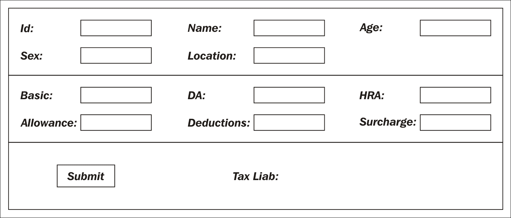

# 第二章。为什么我们需要设计模式？

在本章中，我们将尝试理解选择基于模式的方法进行软件开发的重要性。我们从一些软件开发的原则开始，这些原则在承担大型项目时可能会很有用。本章的工作示例从需求规范开始，逐步发展到初步实现。然后我们将尝试使用模式和惯用用法迭代地改进解决方案，并设计出一个支持良好定义的编程接口的良好设计。在这个过程中，我们将了解一些软件开发原则，人们可以坚持这些原则，包括以下内容：

+   面向对象编程的 SOLID 原则

+   设计模式的三种关键用途

+   Arlow/Nuestadt 原型模式

+   实体、值和数据传输对象

+   命令模式和工厂方法模式

+   设计约定惯用用法和模板方法模式

+   用于 API 的外观模式

+   利用.NET 反射 API 实现插件架构

+   使用 LINQ 解析配置文件的 XML 处理

+   使用扩展方法进行 CLR 对象的深度克隆

+   设计无状态类以实现更好的可伸缩性

# 一些软件开发原则

在没有一些基础原则的情况下，持续编写高质量的生成代码并不容易。本节的目的在于激发开发者的兴趣，并在本节末尾提供一些详细研究的参考文献。对这些原则的详细覆盖需要一本单独的书籍。作者们试图吸收以下软件开发的关键原则，这些原则有助于人们编写高质量的代码：

+   **KISS**: 简单，傻瓜

+   **DRY**: 不要重复自己

+   **YAGNI**: 你不需要它

+   **低耦合**: 最小化类之间的耦合

+   **SOLID 原则**：面向对象编程的原则

### 注意

奥卡姆的威廉提出了**简单，傻瓜**（**KISS**）的格言。它也被称为节约法则。在编程术语中，它可以被翻译为“以直接的方式编写代码，专注于解决当前问题的特定解决方案”。

这个格言之所以重要，是因为大多数情况下，开发者会陷入编写通用代码以实现不必要的可扩展性的陷阱。尽管一开始看起来很有吸引力，但事情会逐渐失控。为了应对不可能的场景而引入的意外复杂性，通常会降低代码的可读性和可维护性。KISS 原则可以应用于人类活动的每一个方面。通过查阅网络了解更多关于 KISS 原则的信息。

### 注意

**不要重复自己**（**DRY**），这是程序员在实现他们的领域逻辑时经常忘记的一个格言。在协作开发场景中，由于缺乏沟通和适当的设计规范，代码往往无意中重复。最常见的情况是，由于缺乏沟通和适当的设计规范，代码在协作开发场景中无意中重复。

这会使代码库膨胀，引起微妙的错误，并使事情变得非常难以更改。通过在开发的各个阶段遵循 DRY 原则，我们可以避免额外的努力并使代码保持一致。DRY 的反面是**写两次**（**WET**）。 |

### 注意

**YAGNI**（你不会需要它），这是一个补充 KISS 原则的原则。它作为对试图以最通用方式编写代码、从一开始就预测变化的人的警告。

在实践中，大多数以通用方式编写的代码可能会产生代码异味。

### 注意

在编写代码时，应该尽量确保没有对具体类的硬编码引用。建议按照接口编程而不是实现编程。

这是一个许多模式用来在运行时提供行为获取的关键原则。可以使用依赖注入框架来减少类之间的耦合。

SOLID 原则是一套编写更好面向对象软件的指南。它是一个记忆法缩写词，代表了以下五个原则：

| **序号** | **原则** | **描述** |
| --- | --- | --- |
| 1 | **单一职责原则**（**SRP**） | 一个类应该只有一个职责。如果它做了不止一件不相关的事情，我们需要将类拆分。 |
| 2 | **开放封闭原则**（**OCP**） | 一个类应该对扩展开放，对修改封闭。 |
| 3 | **里氏替换原则**（**LSP**） | 以图灵奖获得者芭芭拉·里士满的名字命名，她提出了一个子类（派生类）可以替代任何超类（基类）引用而不影响功能的主张。尽管这看起来像是在陈述显而易见的事实，但大多数实现都有违反这一原则的怪癖。 |
| 4 | **接口隔离原则**（**ISP**） | 对于一个类（这样的类也可以称为组件）来说，拥有多个接口比拥有一个强制实现所有方法的 Uber 接口更可取（这些方法对于解决方案上下文来说既相关又无关）。 |
| 5 | **依赖倒置**（**DI**） | 这是一个在框架设计中非常有用的原则。在框架的情况下，客户端代码将由服务器代码调用，而不是客户端通常调用的服务器。这里的主要原则是抽象不应该依赖于细节；相反，细节应该依赖于抽象。这也被称为**好莱坞原则**（不要联系我们，我们会联系你）。 |

作者认为前五个原则主要是一个验证机制。这将通过验证以下案例研究实现对这些原则的违反来证明。

### 注意

卡尔·塞圭恩（Karl Seguin）撰写了一本名为《编程基础 - 构建更好的软件》（*Foundations of Programming - Building Better Software*）的电子书，涵盖了此处概述的大部分内容。阅读他的书籍以深入了解这些主题的大部分内容。SOLID 原则在维基百科的相关页面上有很好的介绍，可以通过[`en.wikipedia.org/wiki/SOLID_(object-oriented_design`](https://en.wikipedia.org/wiki/SOLID_(object-oriented_design)获取。

# 为什么需要模式？

根据作者的说法，面向模式的软件开发三个突出的关键优势如下：

+   一种语言/平台无关的方式来沟通关于软件工件

+   重构倡议（重构目标）的工具

+   更好的 API 设计

随着模式运动的兴起，软件开发社区获得了一种标准化的语言来沟通软件设计、架构和实现。软件开发是一项具有每个策略相关权衡的工艺，并且有多种软件开发方式。各种模式目录为软件开发中的这种**混乱**带来了一些概念上的统一。

今天，世界上大多数有实力的开发者都能理解和说出这种语言。我们相信你将在本章结束时也能做到。想象一下，关于你最近的实现，你将如何陈述以下内容：

### 小贴士

在我们的税务计算示例中，我们使用了命令模式来处理计算逻辑。命令（处理器）通过 XML 文件进行配置，工厂方法负责使用懒加载动态实例化类。我们缓存命令，通过在调用上施加单例约束来避免更多对象的实例化。我们支持原型模式，其中命令对象可以被克隆。命令对象有一个基本实现，具体命令对象使用模板方法模式来覆盖必要的方法。命令对象使用基于契约的设计方法实现。整个机制被封装在一个外观类中，该类作为应用程序逻辑的 API 层。应用程序逻辑使用实体对象（引用）来存储应税实体，如税参数等属性存储为值对象。我们使用**数据传输对象**（**DTO**）将数据从应用程序层传输到计算层。基于 Arlow/Nuestadt 的构型模式是结构化税务计算逻辑的单位。

对于一些开发者来说，前面提供的语言/平台无关的软件开发描述就足以理解所采取的方法。这将提高开发者的生产力（包括开发、维护和支持在内的 SDLC 所有阶段），因为开发者将能够获得良好的代码库心理模型。没有模式目录，这样的简洁设计或实现描述是不可能的。

在敏捷软件开发场景中，我们以迭代的方式开发软件。一旦我们在某个模块中达到一定的成熟度，开发者就会重构他们的代码。在重构模块时，模式有助于组织逻辑。接下来的案例研究将帮助你理解“模式作为重构目标”的合理性。

基于定义良好的模式的 API 容易使用，并且对程序员施加的认知负荷较小。ASP.NET MVC 框架、NHibernate 以及 ASP.NET 管道中编写 HTTP 模块和处理器 API 的成功，是这一过程的几个证明。你将在接下来的章节和案例研究中看到这三个关键优势是如何付诸实践的。

# 对 .NET 反射 API 的快速探索

当我们编写应投入生产的非平凡软件时，必须具备动态加载和执行模块的能力。当你计划提供用户定义的扩展作为向现有软件添加新功能的一种机制时，这很有用。.NET 反射 API 是微软公司支持的一种巧妙机制，可以帮助开发者编写在基础软件编写之后可以动态加载的代码。平台技术，如 ASP.net、WCF、EF 和 WPF，广泛使用反射：

```cs
     public class Test 
     { 
       //---- Only Property this class has  
       public int X { get; set; } 
       //----- This method will be invoked dynamically 
       public void Spit() 
       { 
         Console.WriteLine(" X is " + X); 
       } 
     } 

```

我们将编写一个简单的程序，使用 `new` 关键字实例化对象，并在对象实例化后，将属性（`X`）设置为值 `0xBEEF`。我们将使用 .NET 反射 API 来检索属性值并使用它们调用方法（`Spit`）：

```cs
    class Program 
    { 
      static void Main(string[] args) 
    { 
      Test a = new Test(); 
      //------ Set the property 
      a.X = 0xBEEF; 
      //------ Retrieve the CLR Type 
      Type t = a.GetType(); 
      if (t == null)  return; 
      //---- Retrieve the Property Handle 
      PropertyInfo np = t.GetProperty("X"); 
      //---- Retrieve the Property  Value 
      Console.WriteLine(np.GetValue(a)); 
      //------ Retrieve the Method Handle 
      MethodInfo mi = t.GetMethod("Spit"); 
      //------ Invoke the method 
      mi.Invoke(a, null); 

      Console.Read(); 
    } 
  } 

```

我们将在程序中广泛使用 .NET 反射 API。一个合格的程序员应该了解 .NET 反射 API 及其特性，以便编写任何高级代码。请查阅微软文档以了解可用的特性和 API 的细微差别。如果你想成为一名库或框架设计师，你应该深入了解反射 API。

# 个人所得税计算 - 案例研究

与其解释模式的优点，以下示例将帮助我们看到实际操作。年度所得税的计算是全球公认的问题领域。我们选择了一个以关注软件开发问题而闻名的应用领域。

### 注意

应用程序应接收有关公民人口统计资料（UID、姓名、年龄、性别、位置）和收入详情（基本工资、DA、HRA、CESS、扣除额）的输入，以计算他们的税负。系统应根据人口统计资料设置判别标准，并为老年人、未成年人、残疾人、女性老年人以及其他人群设置单独的逻辑。我们所说的判别标准是指人口统计参数，如年龄、性别和位置应决定一个人所属的类别，因此为该个人应用特定类别的计算。作为第一次迭代，我们将实现针对老年人和普通公民类别的逻辑。

在初步讨论后，我们的开发人员创建了一个原型屏幕，如下面的图像所示：



## 原型和商业原型模式

传奇的瑞士心理学家卡尔·古斯塔夫·荣格（Carl Gustav Jung）创造了原型的概念来解释从人类共同经验库中产生的根本实体。原型的概念从心理学渗透到软件行业。Arlow/Nuestadt 模式描述了诸如派对、客户呼叫、产品、金钱、单元、库存等商业原型模式。一个例子是 Apache Maven 原型，它帮助我们生成不同性质的项目，如 J2EE 应用、Eclipse 插件、OSGI 项目等。微软的模式和实践描述了针对构建目标的原型，如 Web 应用、富客户端应用、移动应用和服务应用。在相应的上下文中，可以存在各种特定领域的原型，作为组织和结构化机制。

在我们的案例中，我们将定义一些在税收领域常见的原型。该领域的一些关键原型如下：

| **序号** | **原型** | **描述** |
| --- | --- | --- |
| 1 | SeniorCitizenFemale | 年龄在 60 岁以上且为女性的纳税人。 |
| 2 | SeniorCitizen | 年龄在 60 岁以上且为男性的纳税人。 |
| 3 | OrdinaryCitizen | 年龄在 18 岁以上且为男性/女性的纳税人。 |
| 4 | DisabledCitizen | 有任何残疾的纳税人。 |
| 5 | MilitaryPersonnel | 军事人员纳税人。 |
| 6 | Juveniles | 年龄小于 18 岁的纳税人。 |

我们将使用人口统计参数作为判别标准来找到与实体相对应的原型。诱导原型的整个想法是将税收计算逻辑围绕它们组织。一旦我们能够解决原型，就很容易找到并委派与原型对应的计算。

## 实体、值和数据传输对象

我们将创建一个表示公民的类。由于公民需要唯一标识，我们将创建一个实体对象，这也可以称为参考对象（来自 DDD 目录）。实体对象的**通用标识符**（**UID**）是应用程序引用的句柄。实体对象不是通过其属性来识别的，因为可能有两个人有相同的名字。ID 唯一标识实体对象。实体对象的定义如下：

```cs
    public class TaxableEntity 
    { 
      public int Id { get; set; } 
      public string Name { get; set; } 
      public int Age { get; set; } 
      public char Sex { get; set; } 
      public string Location { get; set; } 
      public TaxParamVO taxparams { get; set; } 
    } 

```

在前面的类定义中，`Id`唯一标识实体对象。TaxParams 是与实体对象关联的值对象（来自 DDD 目录）。值对象没有概念上的身份。它们描述了一些事物的属性（实体）。TaxParams 的定义如下：

```cs
    public class TaxParamVO 
    { 
      public double Basic {get;set;} 
      public double DA { get; set; } 
      public double HRA { get; set; } 
      public double Allowance { get; set; } 
      public double Deductions { get; set; } 
      public double Cess { get; set; } 
      public double TaxLiability { get; set; } 
      public bool Computed { get; set; } 
    } 

```

自从使用 Smalltalk 编写应用程序以来，**模型-视图-控制器**（**MVC**）一直是结构化应用程序的最主要范式。应用程序被分为模型层（主要处理数据）、视图层（作为显示层）和控制器（在两者之间进行调解）。在 Web 开发场景中，它们在物理上分布在不同的机器上。为了在层之间传输数据，J2EE 模式目录确定了 DTO。DTO 对象定义为如下：

```cs
    public class TaxDTO 
    { 
      public int id { } 
      public TaxParamVO taxparams { } 
    } 

```

如果分层存在于同一进程中，我们可以直接传递这些对象。如果层分布在不同的进程或系统中，我们可以使用 XML 或 JSON 序列化在层之间传递对象。

## 一个计算引擎

我们需要将 UI 处理、输入验证和计算分离，以创建一个可以扩展以处理额外需求的解决方案。计算引擎将根据接收到的命令执行不同的逻辑。GoF 命令模式被用来根据接收到的命令执行逻辑。

命令模式由四个组成部分组成。具体如下：

+   命令对象

+   参数

+   命令调度器

+   客户端

命令对象的接口有一个`Execute`方法。命令对象的参数通过一个包传递。客户端通过将参数通过包传递给命令对象来调用命令对象，以便由命令调度器消费。参数通过以下数据结构传递给命令对象：

```cs
    public class COMPUTATION_CONTEXT 
    { 
      private Dictionary<String, Object> symbols = new 
      Dictionary<String, Object>(); 
      public void Put(string k, Object value) { 
        symbols.Add(k, value); 
      } 
      public Object Get(string k) { return symbols[k]; } 
    } 

```

所有命令对象都实现的`ComputationCommand`接口只有一个`Execute`方法，如下所示。`Execute`方法接受一个包作为参数。在这里，`COMPUTATION_CONTEXT`数据结构充当包：

```cs
    Interface ComputationCommand 
    { 
      bool Execute(COMPUTATION_CONTEXT ctx); 
    } 

```

由于我们已实现了命令接口和用于传递参数的包，现在是时候实现命令对象了。为了简化，我们将实现两个命令，其中硬编码了税负：

```cs
    public class SeniorCitizenCommand : ComputationCommand 
    { 
      public bool Execute(COMPUTATION_CONTEXT ctx) 
      { 
        TaxDTO td = (TaxDTO)ctx.Get("tax_cargo"); 
        //---- Instead of computation, we are assigning 
        //---- constant tax for each archetypes 
        td.taxparams.TaxLiability = 1000; 
        td.taxparams.Computed = true; 
        return true; 
      } 
    } 

    public class OrdinaryCitizenCommand : ComputationCommand 
    { 
      public bool Execute(COMPUTATION_CONTEXT ctx) 
      { 
        TaxDTO td = (TaxDTO)ctx.Get("tax_cargo"); 
        //---- Instead of computation, we are assigning 
        //---- constant tax for each archetypes 
        td.taxparams.TaxLiability = 1500; 
        td.taxparams.Computed = true; 
        return true; 
      } 
    } 

```

命令将由一个 `CommandDispatcher` 对象调用，该对象接受一个 `archetype` 字符串和一个 `COMPUTATION_CONTEXT` 对象。`CommandDispatcher` 作为应用程序的 API 层：

```cs
    class CommandDispatcher 
    { 
      public static bool Dispatch(string archetype,      
      COMPUTATION_CONTEXT ctx) 
      { 
        if (archetype == "SeniorCitizen") 
        { 
          SeniorCitizenCommand cmd = new SeniorCitizenCommand(); 
          return cmd.Execute(ctx); 
        } 
        else if (archetype == "OrdinaryCitizen") 
        { 
          OrdinaryCitizenCommand cmd = new OrdinaryCitizenCommand(); 
          return cmd.Execute(ctx); 
        } 
        else {  
          return false; 
        } 
      } 
    } 

```

## 应用程序到引擎通信

来自应用程序 UI 的数据，无论是网页还是桌面，都必须流向计算引擎。下面的 `ViewHandler` 例程显示了如何通过命令调度器将应用程序 UI 中检索到的数据传递给引擎，由客户端完成：

```cs
    public static void ViewHandler(TaxCalcForm tf) 
    { 
      TaxableEntity te = GetEntityFromUI(tf); 
      if (te == null){ 
        ShowError(); 
        return; 
      } 
      string archetype = ComputeArchetype(te); 
      COMPUTATION_CONTEXT ctx = new COMPUTATION_CONTEXT(); 
      TaxDTO td = new TaxDTO { id = te.id, taxparams =    
      te.taxparams}; 
      ctx.Put("tax_cargo",td); 
      bool rs = CommandDispatcher.Dispatch(archetype, ctx); 
      if ( rs ) { 
        TaxDTO temp = (TaxDTO)ctx.Get("tax_cargo"); 
        tf.Liabilitytxt.Text =        
        Convert.ToString(temp.taxparams.TaxLiability); 
        tf.Refresh(); 
      } 
    } 

```

到目前为止，假设我们已经收到了利益相关者的需求变更。现在我们需要支持新类别的税务计算。

### 注意

最初，我们有针对老年人和普通公民的不同计算。现在我们需要添加新的原型。同时，为了使软件可扩展（松耦合）和可维护，如果我们能够以可配置的方式支持新的原型，而不是为每个新的原型重新编译应用程序，这将是非常理想的，因为具体引用。

命令调度器对象在处理额外的原型时扩展性不好。每当包含新的原型时，我们需要更改程序集，因为每个原型的税务计算逻辑都不同。我们需要创建一个可插拔的架构，以便随意添加或删除原型。

## 使系统可扩展的插件系统

在不影响应用程序的情况下编写系统逻辑需要一个机制——即动态加载类的机制。幸运的是，.NET 反射 API 提供了一种在运行时加载类并调用其中方法的机制。一个有价值的开发者应该学习反射 API 来编写动态变化的系统。实际上，大多数技术如 ASP.NET、Entity Framework、.NET Remoting 和 WCF 都是因为 .NET 堆栈中反射 API 的可用性而得以工作。

从此以后，我们将使用 XML 配置文件来指定我们的税务计算逻辑。下面给出一个示例 XML 文件：

```cs
    <?xml version="1.0"?> 
    <plugins> 
      <plugin archetype ="OrindaryCitizen"     
      command="TaxEngine.OrdinaryCitizenCommand"/>  <plugin   
      archetype="SeniorCitizen"    
      command="TaxEngine.SeniorCitizenCommand"/> 
    </plugins> 

```

可以使用 LINQ to XML 非常容易地读取 XML 文件的内容。我们将使用以下代码片段生成一个 `Dictionary` 对象：

```cs
    private Dictionary<string,string> LoadData(string xmlfile) 
    { 
       return XDocument.Load(xmlfile) 
      .Descendants("plugins") 
      .Descendants("plugin") 
      .ToDictionary(p => p.Attribute("archetype").Value, 
      p => p.Attribute("command").Value); 
    } 

```

## 工厂方法模式和插件

工厂方法（来自 GoF 目录）是一种通过仅为此目的公开的静态方法解决对象创建的模式。我们创建的对象将基于特定的类或派生类。在我们的情况下，我们需要创建实现了 `ComputationCommand` 接口的对象。

`Factory` 类的消费者也可以指示它是否需要单例或原型。工厂方法的默认行为是单例，它应该在收到对 `Factory` (`Get`) 方法的调用时返回相同的实例。如果提供了原型选项，将创建对象的副本并返回：

```cs
    public class ObjectFactory 
    { 
      //--- A Dictionary to store  
      //--- Plugin details (Archetype/commandclass) 
      private Dictionary<string, string> plugins = new   
      Dictionary<string, string>(); 
      //--- A Dictionary to cache objects 
      //--- archetype/commandclassinstance 
      private Dictionary<string, ComputationCommand> commands = 
      new Dictionary<string, ComputationCommand>(); 

      public ObjectFactory(String xmlfile) 
      { 
        plugins = LoadData(xmlfile); 
      } 

      private Dictionary<string,string> LoadData(string xmlfile) 
      { 
        return XDocument.Load(xmlfile) 
        .Descendants("plugins") 
        .Descendants("plugin") 
        .ToDictionary(p => p.Attribute("archetype").Value, 
        p => p.Attribute("command").Value); 
      } 
      //---- Rest of the code omitted 
    } 

```

`ObjectFactory`类的消费者将指示它是否希望对象引用在插件缓存中可用或对象的一个克隆。我们可以使用二进制序列化来克隆对象。通过利用泛型的扩展方法，我们可以编写一个通用的克隆例程。以下代码片段将帮助我们实现这一点：

```cs
    public static T DeepClone<T>(this T a) { 
      using (MemoryStream stream = new MemoryStream()) { 
      BinaryFormatter formatter = new BinaryFormatter(); 
      formatter.Serialize(stream, a); 
      stream.Position = 0; 
      return (T)formatter.Deserialize(stream); 
      } 
    } 

```

现在`Get`的实现变得简单直接；`Get`方法的完整列表如下所示：

```cs
    public ComputationCommand Get(string archetype,  
    string mode = "singleton") 
    { 
      //---- We can create a new instance, when a  
      //---- prototype is asked, otherwise we will 
      //---- return the same instance stored in the dictionary 
      if (mode != "singleton" && mode != "prototype") 
      return null; 

      ComputationCommand temp = null; 
      //--- if an instance is already found, return 
      // it (singleton) or clone (prototype 
      if (commands.TryGetValue(archetype, out temp)) 
      { 
        return (mode == "singleton") ? temp : 
        temp.DeepClone<ComputationCommand>(); 
      } 

      //---- retrieve the commandclass name 
      string classname = plugins[archetype]; 
      if (classname == null) 
      return null; 
      //------ retrieve the classname, if it 
      //------ is available with CLR 
      Type t = Type.GetType(classname); 

      if (t == null) 
      return null; 
      //---- Create a new Instance and store it 
      //---- in commandclass instance dictionary 
      commands[archetype]=       
      (ComputationCommand)Activator.CreateInstance(t); 
      return commands[archetype]; 
    } 

```

现在我们已经得到了一个工厂方法实现，让我们看看如何消费这段代码。命令调度器将根据提供的原型获取命令实例的句柄。一旦收到对象的句柄，就可以调用`Execute`方法：

```cs
    public class CommandDispatcher 
    { 
      private static ObjectFactory obj =  
      new  ObjectFactory("Pluggins.xml"); 

      public static bool Dispatch(string archetype,  
      COMPUTATION_CONTEXT ctx) 
      { 
        ComputationCommand cmd = obj.Get(archetype); 
        return (cmd == null) ? false : cmd.Execute(ctx);  
      } 
    } 

```

### 注意

书的作者认为命令对象应该以无状态的方式设计。在命令式编程世界中，这意味着类的方法之间不应有任何共享变量。我们不应添加类级别变量，以避免在多线程环境中出现锁。实际上，参数成为结果的唯一决定因素。如果你无法避免有类级别变量，它们应该是不可变的（只读）。如果我们改变对象的状态，由此产生的原型将因为对象引用而受到影响。Java servlet 规范期望 servlet 是无状态的，Spring 控制器也是无状态的。Microsoft ASP.NET MVC 控制器不需要是无状态的（不清楚为什么微软选择了这种方式）。

现在，让我们重新审视我们的`ViewHandler`例程。这里的接口没有变化。真正的魔法发生在命令调度器对象之下：

```cs
    public static void ViewHandler(TaxCalcForm tf) 
    { 
      TaxableEntity te = GetEntityFromUI(tf); 
      if (te == null) 
      { 
        ShowError(); 
        return; 
      } 
      string archetype = ComputeArchetype(te); 
      COMPUTATION_CONTEXT ctx = new COMPUTATION_CONTEXT(); 
      TaxDTO td = new TaxDTO { id = te.id, taxparams = te.taxparams}; 
      ctx.Put("tax_cargo",td); 
      bool rs = CommandDispatcher.Dispatch(archetype, ctx); 
      if ( rs ) { 
        TaxDTO temp = (TaxDTO)ctx.Get("tax_cargo"); 
        tf.Liabilitytxt.Text =          
        Convert.ToString(temp.taxparams.TaxLiability); 
        tf.Refresh(); 
      } 
    } 

```

视图处理程序例程执行以下操作：

+   从 UI 元素中检索值以创建实体

+   根据人口统计参数确定原型

+   创建一个 DTO 并将其放入一个包中

+   通过`CommandDispatcher`调度方法

+   根据状态更新 UI

让我们创建一个新的命令，该命令将为女性老年人计算税款：

```cs
    public class SeniorCitizenFemaleCommand : ComputationCommand 
    { 
      public bool Execute(COMPUTATION_CONTEXT ctx) 
      { 
        TaxDTO td = (TaxDTO)ctx.Get("tax_cargo"); 
        //---- Compute the Tax for Senior Females 
        //---- They belong to different Slabs 
        double accum = td.taxparams.Basic + 
        td.taxparams.DA + td.taxparams.Allowance + 
        td.taxparams.HRA; 
        double net = accum - td.taxparams.Deductions - 
        td.taxparams.Surcharge; 
        //---- Flat 10% Tax 
        td.taxparams.TaxLiability = net*0.1; 
        td.taxparams.Computed = true; 
        return true; 
      } 
    } 

```

我们需要对配置文件进行一些修改。生成的 XML 配置如下所示：

```cs
    <?xml version="1.0"?> 
    <plugins> 
      <plugin archetype ="OrindaryCitizen"       
      command="TaxEngine.OrdinaryCitizenCommand"/>  <plugin    
      archetype="SeniorCitizen"      
      command="TaxEngine.SeniorCitizenCommand"/>  <plugin  
      archetype="SeniorCitizenFemale"      
      command="TaxEngine.SeniorCitizenFemaleCommand"/> 
    </plugins> 

```

# 完成解决方案

我们从一个解决当前问题的解决方案开始。在创建基本管道后，我们创建了一个复杂的管道，这使得解决方案具有可扩展性。现在我们可以添加新的命令而无需重新编译应用程序。这对于受可修改法律约束的应用程序来说非常重要。为了使我们的代码健壮，我们将设计合同策略添加到我们的命令对象中。

## 设计合同和模板方法模式

由 Bertrand Meyer（Eiffel 语言创造者）创建的设计由合同（Design by Contract）习语，扩展了抽象数据类型的普通定义，包括前置条件、后置条件和不变性。为了在现实生活中执行任何合同，我们需要满足一些前置条件，然后执行，并有一个后执行（验证）阶段，如下所示：

+   Pre-Execute

+   Execute

+   Post-Execute

在 Post-Execute 阶段结束时，将检查不变性以确定它们是否被违反。消费者将调用 `PreExecute` 以确定是否存在执行合同的上下文。只有当 `PreExecute` 返回 true 时，调用才会继续。为了实现设计由合同（Design by Contract），我们通过两个额外的方法扩展了接口。结果 `interface` 如下所示：

```cs
    public interface ComputationCommand 
    { 
      bool PreExecute(COMPUTATION_CONTEXT ctx); 
      bool Execute(COMPUTATION_CONTEXT ctx); 
      bool PostExecute(COMPUTATION_CONTEXT ctx); 
    } 

```

我们将创建一个 `BaseComputationCommand` 类，它将模拟 `ComputationCommand` 接口中的方法。这将帮助具体的派生命令类仅覆盖那些具有相应更改的方法。在重新定义接口后，我们将创建一个带有标记为 `virtual` 的方法的命令模式的默认实现。这有助于我们在派生类中覆盖实现。这是一个模板方法模式的实例：

```cs
    public class BaseComputationCommand : ComputationCommand 
    { 
      public virtual bool PreExecute(COMPUTATION_CONTEXT ctx) { return      
      true;  }  public virtual bool Execute(COMPUTATION_CONTEXT ctx) {  
      return true; } public virtual bool  
      PostExecute(COMPUTATION_CONTEXT ctx) { return true; } 
    } 

```

我们在这里使用的命令将使用模板方法模式来覆盖仅与相关的方法。否则，`BaseComputationCommand` 中已经有了回退机制。模板方法模式在方法中定义算法（s）的程序骨架，它们被称为模板方法（s）。这些模板方法被子类覆盖，以实现具体的逻辑：

```cs
    public class SeniorCitizenCommand : BaseComputationCommand { 
      public override bool PreExecute(COMPUTATION_CONTEXT ctx) 
      { 
        TaxDTO td = (TaxDTO)ctx.Get("tax_cargo"); 
        //--- Do Some Sanity Checks 
        //--- if some problems => return false; 
        return base.PreExecute(ctx); 
      } 
      public override bool Execute(COMPUTATION_CONTEXT ctx) 
      { 
        TaxDTO td = (TaxDTO)ctx.Get("tax_cargo"); 
        //---- Compute the Tax for Senior Citizens 
        //---- They belong to different Slabs 
        td.taxparams.TaxLiability = 1000; 
        td.taxparams.Computed = true; 
        return true; 
      } 

      public override bool PostExecute(COMPUTATION_CONTEXT ctx) 
      { 
        //--- Do the Check on Invariants 
        //--- Return false, if there is violation 
        return base.PostExecute(ctx); 
      } 
    } 

```

我们不需要覆盖每个方法，而且整个方案仍然可以工作：

```cs
    public class SeniorCitizenFemaleCommand : BaseComputationCommand 
    { 
      public override bool Execute(COMPUTATION_CONTEXT ctx) 
      { 
        TaxDTO td = (TaxDTO)ctx.Get("tax_cargo"); 
        //---- Compute the Tax for Senior Females 
        //---- They belong to different Slabs 
        double accum = td.taxparams.Basic + 
        td.taxparams.DA + td.taxparams.Allowance + 
        td.taxparams.HRA; 
        double net = accum - td.taxparams.Deductions - 
        td.taxparams.Surcharge; 
        //---- Flat 10% Tax 
        td.taxparams.TaxLiability = net*0.1; 
        return true; 
      } 
    } 

```

现在我们需要重写命令模式，以反映命令类中设计由合同（Design by Contract）习语的实现：

```cs
    public class CommandDispatcher 
    { 
      private static ObjectFactory obj = new      
      ObjectFactory("Pluggins.xml");  public static bool  
      Dispatch(string archetype,    COMPUTATION_CONTEXT ctx) 
      { 
        ComputationCommand cmd = obj.Get(archetype); 
        if (cmd == null)  
        return false; 

        if (cmd.PreExecute(ctx)) 
        { 
          bool rs = cmd.Execute(ctx); 
          cmd.PostExecute(ctx); 
          return rs; 
        } 
        return false; 
      } 
    } 

```

在某些实现中，客户端将检查返回值以查看是否违反了不变性。在某些情况下，将执行补偿事务以将状态恢复到之前的状态。

## 使用门面（Facade）模式公开计算 API

我们的计算引擎包含许多类，它们协同工作以实现应用程序逻辑。任何想要与这种实现交互的客户端都会更喜欢一个简化的子系统接口。门面（Facade）是一个对象，它为大型类或模块中的大量代码提供简单的接口。

GoF 门面（Facade）模式是我们可以使用来公开粗粒度 API 的机制：

```cs
    public class TaxComputationFacade 
    { 
       /// <summary> 
       ///  A Rule Engine can do Archetype detection 
       ///  One can write a small Expression Evaluator Engine  
       ///  and GOF terms its Interpreter pattern 
       /// </summary> 
       /// <param name="te"></param> 
       /// <returns></returns> 
       private static string ComputeArchetype(TaxableEntity te) 
       { 
         if ((te.Sex == 'F') && (te.age > 59)) 
         { 
           return "SeniorCitizenFemale"; 
         } 
         else if (te.age<18) { 
           return "JuevenileCitizen"; 
         } 

         return (te.age > 60) ? "SeniorCitizen" : "OrdinaryCitizen"; 
       } 

       public static bool Compute(TaxableEntity te) 
       { 
         string archetype = ComputeArchetype(te); 
         COMPUTATION_CONTEXT ctx = new COMPUTATION_CONTEXT(); 
         TaxDTO td = new TaxDTO { id = te.id, taxparams = te.taxparams         
         }; 
         ctx.Put("tax_cargo", td); 
         return CommandDispatcher.Dispatch(archetype, ctx); 
       } 
    } 

```

现在，`ViewHandler` 已经变得简单多了，如下面的代码所示：

```cs
    public static void ViewHandler(TaxCalcForm tf) 
    { 
      TaxableEntity te = GetEntityFromUI(tf); 
      if (te == null) 
      { 
        ShowError(); 
        return; 
      } 
      bool rs = TaxComputationFacade.Compute(te); 
      if (rs)  
      { 
        tf.Liabilitytxt.Text =       
        Convert.ToString(te.taxparams.TaxLiability); 
        tf.Refresh(); 
      } 
    } 

```

# 摘要

在本章中，我们深入探讨了为什么面向模式的软件开发是开发现代软件的一种好方法。我们通过引用一些关键原则开始了本章的讨论。然后，我们通过迭代地修改一个可扩展且对变化具有弹性的应用程序，进一步展示了这些关键原则的应用性。在这个过程中，我们涵盖了诸如命令模式、工厂方法模式、外观模式、基于契约的设计、模板方法模式、XML 配置文件、LINQ to XML 等概念。

在下一章中，我们将通过实现一个日志库来继续我们的模式讨论，该库可以将内容序列化到文件、数据库或远程网络中。
