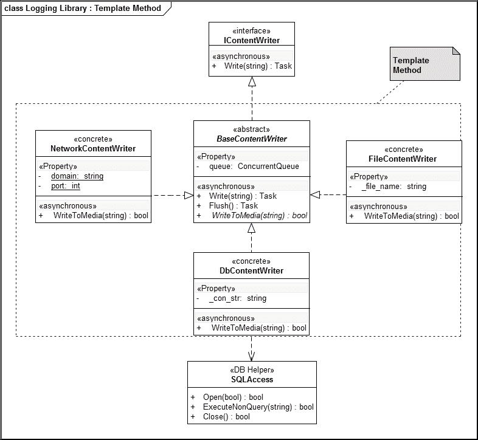
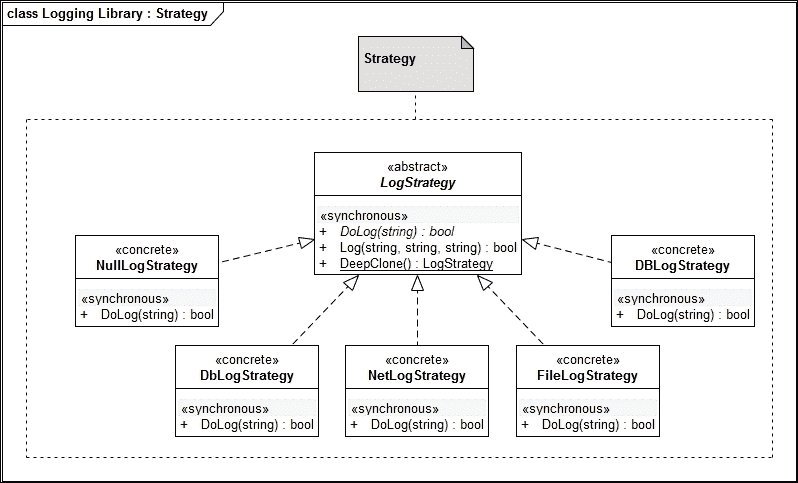
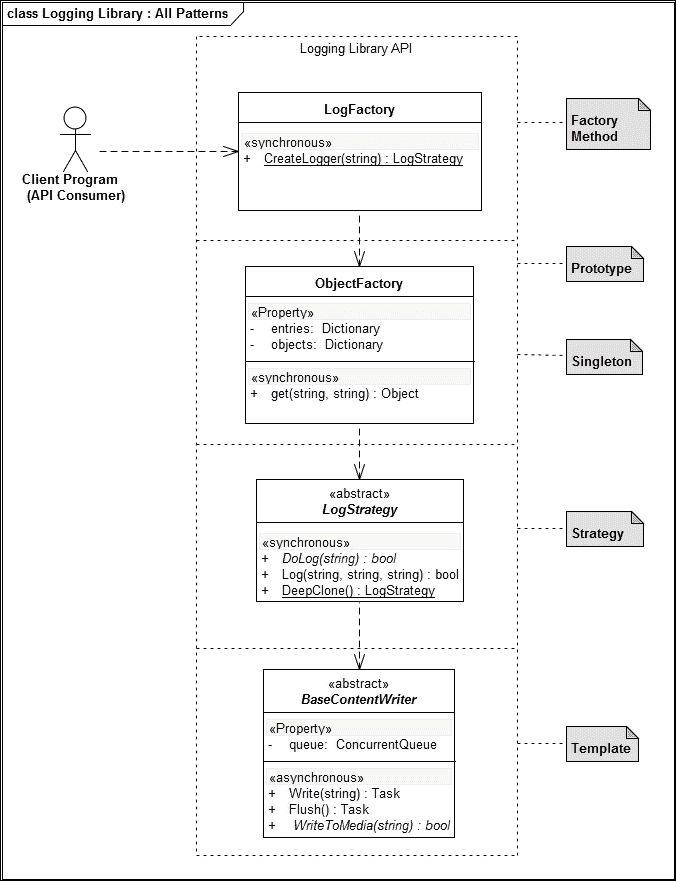

# 第三章。日志库

在本章中，我们将尝试创建一个**日志库**，它将允许应用程序开发者在程序执行期间将信息记录到媒体（文件、网络或数据库）。这将是一个关键的库，开发者可以使用它进行审计跟踪（领域先决条件）和代码调试（从调试和验证的角度）。我们将从头开始设计和实现这个库，并将其作为 API 提供给最终开发者使用。

在本章的学习过程中，作为读者，你将学会利用策略模式、工厂方法模式、模板模式、单例和原型模式来完成以下任务：

+   将数据写入文件流

+   使用 ADO.NET 创建一个简单的**数据访问层（DAL**）

+   将数据写入 SQLite 数据库

+   使用 System.Net API 将数据写入网络流

+   处理并发

+   线程

# 库的需求

在我们开始编写库之前，让我们草拟一个初步的需求说明，如下所示：

日志库应提供一个统一的接口来处理应持久保存在媒体（文件、远程节点或数据库）中的日志条目，目标媒体应在运行时从配置文件中确定。API 应该是目标无关的，并且应该提供在不更改应用程序逻辑的情况下添加新日志目标的方法。

# 解决方案方法

在我们编写实现我们的库（一个 Windows 汇编）的代码之前，让我们列举一下需求，以获得整体情况：

+   数据应写入多个流

    +   文件、网络和数据库

+   开发者 API 应该是目标无关的

+   该库应维护其对象生命周期

+   该库应提供添加新日志目标的功能

+   该库应该能够处理对日志目标的并发写入

# 将内容写入媒体

为了管理代码隔离的复杂性，让我们声明一个 C#接口，该接口将管理多个日志目标的特点：

```cs
    public interface IContentWriter 
    { 
      Task<bool> Write(string content); 
    } 

```

这里的基本思想是，实现接口的具体类应该提供一种将日志写入相应媒体的方法实现。但经过仔细检查，我们发现最好在抽象类中编写这个方法及其相关语义的基础类实现。基础类实现可以将日志条目添加到队列中（这将提供并发支持），当达到阈值（配置）时刷新队列，并将数据持久化到目标媒体。将有一个方法被标记为抽象，为具体类提供写入相应媒体条目的机制。

由于我们的库应该在多线程环境中工作，我们需要以一种整洁的方式处理并发。在写入文件或网络时，我们需要小心，确保只有一个线程可以访问文件或套接字句柄。我们将利用.NET 的`.NET `async`/`await`声明性编程模型来管理后台处理任务。**模型-视图-控制器**（**MVC**）是构建应用程序最占主导地位的范式。

## 模板方法模式和内容编写者

在第一阶段，我们计划将日志内容刷新到文件、网络和数据库目标。我们的大部分逻辑对所有内容编写者都是通用的。为了帮助分离关注点并避免代码重复，最好让具体的内容编写者类管理它们的目标媒体。基本实现将负责并发和队列管理。

### 备注

为了使代码简单，我们将利用`ConcurrentQueue`类（随.NET 框架版本 4 引入的数据结构）和`Systems.Collections.Concurrent`包一起提供的功能。为了提高清晰度，我们省略了异常处理代码。请注意，在并发执行场景中，应使用`AggregateException`类来处理异常。

此类将确保在任何时候只有一个线程可以写入队列。我们将使用**任务并行库**（**TPL**）实现异步的`Flush`方法。此例程将从队列中检索数据，并通过一个抽象方法（`WriteToMedia`）将持久化任务（在所选媒体中）委托给相应的具体类：

```cs
    public abstract class BaseContentWriter : IContentWriter 
    { 
      private ConcurrentQueue<string> queue =  
      new ConcurrentQueue<string>(); 
      private Object _lock = new Object(); 

      public BaseContentWriter() { } 
      //---- Write to Media 
      public abstract bool WriteToMedia(string logcontent); 

      async Task  Flush() 
      { 
        string content; 
        int count = 0; 
        while (queue.TryDequeue(out content) && count <= 10) 
        { 
          //--- Write to Appropriate Media 
          //--- Calls the Overriden method 
          WriteToMedia(content); 
          count++; 
        } 
      }  

```

一旦队列中的内容达到阈值水平，一个线程将获取锁以刷新数据。在我们的情况下，我们将启动超过 10 个队列项的刷新：

```cs
    public async Task<bool> Write(string content) 
    { 
      queue.Enqueue(content); 
      if (queue.Count <= 10) 
      return true; 
      lock (_lock){ 
        Task temp = Task.Run(() => Flush()); 
        Task.WaitAll(new Task[] { temp }); 
      } 
      return true; 
    } 
  } 

```

从`BaseContentWriter`派生的具体类将实现以下方法来处理特定情况：

```cs
    public abstract bool WriteToMedia(string logcontent); 

```

### 备注

这是一个模板方法模式的实例。模板方法模式是一种行为设计模式，其中大部分逻辑位于基类中，而某些步骤由具体类实现。在`BaseContentWriter`中，我们有向并发队列添加元素和从并发队列检索元素的逻辑。持久化由实现我们的模板方法（`WriteToMedia`）的子类负责。

下面的 UML 类图表示了各种类之间的实现、依赖和关联。请注意，注释清楚地概述了模板方法模式的作用：



## 将日志条目写入文件流

我们将使用文件流来写入文件。我们在`WriteToMedia`模板方法中实现实际的文件处理逻辑：

```cs
    public class FileContentWriter : BaseContentWriter 
    { 
      private string _file_name; 
      public FileContentWriter(string name){ 
        _file_name =  name; 
      } 
      public override bool WriteToMedia( string content) 
      { 
        using (FileStream SourceStream =  
        File.Open(_file_name, FileMode.Append )) 
        { 
          byte[] buffer =  
          Encoding.UTF8.GetBytes(content+"\r\n"); 
          SourceStream.Write (buffer, 0, buffer.Length); 
        } 
        return true; 
      } 
    } 

```

## 将日志条目写入数据库

为了理解本节的所有细节，需要对 ADO.NET 有一定的了解。为了简化问题，我们选择了 SQLite 作为我们的数据库选择来持久化日志条目。可以选择 MySQL、SQL Server 或 Oracle。由于 ADO.NET 库，对于每个提供的 RDBMS，代码将大致相同。我们创建了一个名为`SQLAccess`的类，它封装并利用了 SQLite 的 ADO.NET 提供程序，以提供与 SQLite 数据库引擎（x86/x64）的交互。如果此程序集（`System.Data.SQLite`）在本地不可用，请通过包管理控制台使用 nuget 安装它，命令为`PM> Install-Package System.Data.SQLite`：

```cs
    public class SQLAccess 
    { 
      private SQLiteConnection _con = null; 
      private SQLiteCommand _cmd = null; 
      private SQLiteTransaction _cts = null; 
      private string _constr; 
      public SQLAccess(string constr) 
      { 
        _constr = constr; 
      } 

```

下面的`Open`方法实例化了连接对象，并调用了 ADO.NET 连接对象的`Open`方法。如果我们需要事务支持，我们需要实例化一个事务上下文（`SQLiteTransaction`）对象：

```cs
    public bool Open(bool trans = false) 
    { 
      try 
      { 
        _con = new SQLiteConnection(_constr); 
        _con.Open(); 
        if (trans) 
        _cts = _con.BeginTransaction(); 
        return true; 
      } 
      catch( SQLiteException e) 
      { 
        return false; 
      } 
    } 

```

要将值或值集插入数据库，我们需要通过提供一个连接对象和一个包含 SQL 语句的字符串来实例化一个命令对象。ADO.NET 有`ExecuteNonQuery`方法来执行查询：

```cs
    public bool ExecuteNonQuery(string SQL) 
    { 
      try 
      { 
        _cmd = new SQLiteCommand(SQL, _con); 
        _cmd.ExecuteNonQuery(); 
        _con.Close(); 
        _con = null; 
        return true; 
      } 
      catch (Exception e) 
      { 
        _con = null; 
        return false; 
      } 
    } 

```

我们在将记录插入数据库后关闭连接：

```cs
    public Boolean Close() 
    { 
      if (_con != null) 
      { 
        if (_cts != null) 
        { 
          _cts.Commit(); 
          _cts = null; 
        } 
        _con.Close(); 
        _con = null; 
        return true; 
      } 
      return false; 
    } 

```

一旦我们有一个类可以帮助我们将数据持久化到关系型数据库，编写模板方法（`WriteToMedia`）就变得容易了。整个代码列表如下所示：

```cs
    public class DbContentWriter : BaseContentWriter 
    { 
      private string _con_str =  
      @"Data Source=./Logstorage.db"; 
      public DbContentWriter(){ } 
      public override bool WriteToMedia(string logcontent)  
      { 
        SQLAccess access = new SQLAccess(_con_str); 
        if (access.Open()) 
        { 
          string query = "INSERT INTO logs VALUES('" + 
          logcontent + "');"; 
          bool result =  access.ExecuteNonQuery(query); 
          access.Close(); 
          return result; 
        } 
        return false;  
      } 
    } 

```

## 将日志条目写入网络流

我们将使用`System.Net`命名空间下的`TCPListener`类来将数据写入网络流。对于当前实现，我们已将域名（localhost:`127.0.0.1`）和端口（`4500`）硬编码。我们可以从配置文件中读取这些值。像往常一样，整个操作都在`WriteToMedia`模板方法中完成。在章节末尾，我们提供了一个简单的日志服务器实现，以保持完整性。日志服务器接收我们写入的条目，并将其打印到其控制台：

```cs
    public class NetworkContentWriter : BaseContentWriter 
    { 
      private static string domain = "127.0.0.1"; 
      private static int port = 4500; 
      public NetworkContentWriter(){} 
      public override bool WriteToMedia(string content) 
      { 
        TcpClient _client = new TcpClient(); 
        if (_client == null){ return false; } 

        try{ 
          _client.Connect(domain, port); 
        } 
        catch (Exception) { return false; } 

        StreamWriter _sWriter =  
        new StreamWriter(_client.GetStream(), Encoding.ASCII); 
        _sWriter.WriteLine(content); 
        _sWriter.Flush(); 
        _sWriter.Close(); 
        _client.Close(); 
        return true; 
      } 
    } 

```

我们现在已经实现了文件、数据库（使用 ADO.NET）和网络流的内联编写器。有了这些，我们需要为应用程序提供一个接口来消费这些内容编写器。根据应用程序选择的日志策略，适当的内容编写器应连接到日志数据流。这需要另一组接口。

## 在策略模式之上进行日志记录策略

我们将使用 GoF 策略模式来实现日志库的接口。

### 注意

我们可以将将数据记录到不同流中的日志视为算法，而策略模式旨在参数化要执行的算法。

通过为网络、文件和数据库策略提供具体的类，我们能够交换实现逻辑：

```cs
    public abstract class LogStrategy 
    { 
      // DoLog is our Template method 
      // Concrete classes will override this  
      protected abstract bool DoLog(String logitem); 
      public bool Log(String app, String key, String cause) 
      { 
        return DoLog(app + " " + key + " " + cause); 
      } 
    } 

```

为了测试代码，我们将编写一个`NullLogStrategy`类，该类将日志条目打印到控制台。由于我们已经编写了代码执行调度的逻辑，我们的实现将更加简单。我们通过实现模板方法（`DoLog`）在控制台中写入日志条目：

```cs
    public class NullLogStrategy : LogStrategy 
    { 
      protected override bool DoLog(String logitem) 
      { 
        // Log into the Console 
        Console.WriteLine(logitem+"\r\n"); 
        return true; 
      } 
    } 

```

由于我们已经费尽心思创建了`ContentWriter`类，因此我们的策略类实现只是实现`DoLog`模板方法，并将实际工作委托给相应的内容编写者：

```cs
    public class DbLogStrategy : LogStrategy 
    { 
      BaseContentWriter wt = new DbContentWriter(); 
      protected override bool DoLog(String logitem) 
      { 
        return wt.Write(logitem); 
      } 
    } 

    public class FileLogStrategy : LogStrategy 
    { 
      BaseContentWriter wt = new FileContentWriter(@"log.txt"); 
      protected override bool DoLog(String logitem) 
      { 
        // Log into the file 
        wt.Write(logitem); 
        return true; 
      } 
    } 

    public class NetLogStrategy : LogStrategy 
    { 
      BaseContentWriter nc = new NetworkContentWriter(); 
      protected override bool DoLog(String logitem) 
      { 
        // Log into the Network Socket 
        nc.Write(logitem); 
        return true; 
      } 
    } 

```

以下图像说明了策略模式在实际中的应用：



# 实例化的工厂方法模式

现在，我们应该根据接收到的参数（通常从配置文件中检索）来关注正确对象的实例化，以确定策略。

### 注意

我们将使用 GoF 工厂方法模式来实例化`LogStrategy`对象。通过检查`loggertype`参数，将实例化适当的具体类。

```cs
    public static LogStrategy CreateLogger(string loggertype) 
    { 
      if (loggertype == "DB") 
        return new DbLogStrategy(); 
      else if (loggertype == "FILE") 
        return new FileLogStrategy(); 
      else if (loggertype == "NET") 
        return new NetLogStrategy(); 
      else 
        return new NullLogStrategy(); 
    } 

```

应用开发者也可以通过配置条目来控制日志策略。实例化`LogStrategy`类的过程如下所示：

```cs
    string loggertype=read_from_config("loggertype"); 
    LogStrategy lf = LoggerFactory.CreateLogger(loggertype); 
    //-- somewhere out in the module 
    lf.Log("APP","KEY","CAUSE"); 

```

## 编写通用的工厂方法实现

如前一章所述，在不影响应用程序的情况下编写系统逻辑需要一个机制——即动态加载类。我们将调整工厂方法（`LogFactory`）的实现，使系统通用。我们将使用 XML 文件来提供工厂方法将用于创建相应日志处理程序（`LogStrategy`）的元数据，以满足请求的策略（由消费者）。以下是一个示例 XML 文件（`LogStrategy.xml`）：

```cs
    <?xml version="1.0"?> 
    <entries> 
      <entry key ="DB" value="LogLibrary.DbLogStrategy"/> 
      <entry key="NET" value="LogLibrary.NetLogStrategy"/> 
      <entry key="FILE" value="LogLibrary.FileLogStrategy"/> 
      <entry key="NULL" value ="LogLibrary.NullLogStrategy"/> 
    </entries> 

```

使用 LINQ to XML 可以非常容易地读取 XML 文件的内容。

## 工厂方法、单例和原型模式用于动态类加载

.NET 反射 API 帮助我们动态加载类并实例化对象。有克隆现有对象以创建新对象的选择。我们将使用这两种策略来实例化对象。

### 注意

工厂方法（来自 GoF 目录）是一种通过仅为此目的公开的静态方法解决对象创建的模式。我们创建的对象将基于特定的类或派生类。`Factory` 类的消费者也可以指示它是否需要单例或原型。工厂方法的默认行为是创建单例，并且每次调用工厂（`Get`）方法时都会返回相同的实例。如果提供了原型选项，将创建对象的副本并返回。这是一个很好的例子，展示了这三个模式如何组合并协同工作以提供所需的结果。同时请注意，字典对象被巧妙地用于实现单例。创建 **对象池** 的结构已经存在于这个实现中。这将是任何感兴趣的读者发现和实现的好练习。

`ObjectFactory` 类的消费者将指示它是否想要缓存中可用的对象引用或对象的副本。我们可以使用二进制序列化来克隆对象。通过利用泛型编写扩展方法，我们可以创建一个通用的克隆程序。以下代码片段实现了这一点：

```cs

    public static T DeepClone<T>(this T a) { 
      using (MemoryStream stream = new MemoryStream()) { 
        BinaryFormatter formatter = new BinaryFormatter(); 
        formatter.Serialize(stream, a); 
        stream.Position = 0; 
        return (T)formatter.Deserialize(stream); 
      } 
    }
```

然而，请注意，如果需要自定义克隆过程，可以利用可克隆接口。现在 `Get` 方法的实现变得简单直接；以下是对 `Get` 方法的完整列表：

```cs
    public class ObjectFactory 
    { 
      //----- The Dictionary which maps XML configuration 
      //----- Keys (key) to TypeName (value) 
      private Dictionary<string, string> entries = 
      new Dictionary<string, string>(); 
      //----- The Dictionary which maps Entry Keys to Objects 
      //----- already instantiated by the Container 
      private Dictionary<string, Object> objects = 
      new Dictionary<string, Object>(); 

      private Dictionary<string, string> LoadData(string str) 
      { 
        //---- We use LINQ lambda syntax to load the contents of the  
        //---- XML file. 
        return XDocument.Load(str).Descendants("entries"). 
        Descendants("entry").ToDictionary(p =>        
        p.Attribute("key").Value, 
        p => p.Attribute("value").Value); 
      } 

      public ObjectFactory(String str) 
      { 
        entries = LoadData(str); 
      } 

      public Object Get(string key, string mode = "singleton") 
      { 
        //------------ singleton will return the same object 
        //------------ every time. 
        //------------ prototype will create a clone of the  
        //------------ object if already instantiated before 
        //------------ Singleton and Protype are the permissible 
        //------------ Parameters 
        if (mode != "singleton" && mode != "prototype") 
          return null; 
        Object temp = null; 
        if (objects.TryGetValue(key, out temp)) 
          return (mode == "singleton") ? temp : 
        temp.DeepClone<Object>(); 
        //------ if we could not retrieve an instance of previously  
        //------ created object, retrieve the typename from entries 
        //------ map 

        string classname = null; 
        entries.TryGetValue(key, out classname); 
        if (classname == null) 
          return null; 
        string fullpackage = classname; 
        //---- use .NET Reflection API to retrieve the CLR type 
        //---- of the class name 

        Type t = Type.GetType(fullpackage); 
        if (t == null) 
          return null; 
        //------- Instantiate the object using .NET Reflection API 
        objects[key] = (Object)Activator.CreateInstance(t); 
        return objects[key]; 
      } 
    }
  } 

```

在接下来的所有示例中，我们将使用前面的类和不同的配置文件。这将简化我们的代码，并且我们将有一个简洁的列表。

## 使用泛型工厂方法重构代码

使用 `ObjectFactory`，我们的策略实例化变得更加简洁。如果我们无法通过字典查找（在工厂存储中）找到适当的策略实现，我们将实例化一个 `NullStrategy` 对象（回退选项）：

```cs
    public class LoggerFactory 
    { 
      private static ObjectFactory of =  
      new ObjectFactory("LogStrategy.xml"); 
      public static LogStrategy CreateLogger(string loggertype) 
      { 
        LogStrategy sf = (LogStrategy)of.Get(loggertype); 
        return (sf != null)?sf: new NullLogStrategy(); 
      } 
    } 

```

# 一个用于网络日志的日志服务器

下一个给出的是可以处理来自远程应用程序的数据流的客户端应用程序的实现。在这里，我们使用 System.Net 的 `TCPListener` 类来监听传入的连接。一旦我们从远程进程接收到连接，我们将启动一个线程来处理该连接的日志数据。这里给出这个实现是为了完整性：

```cs
    class LogSocketServer 
    { 
      private TcpListener _server; 
      private Boolean _running; 
      private int port = 4500; 

      public LogSocketServer() 
      { 
        _server = new TcpListener(IPAddress.Any, port); 
        _server.Start(); 
        _running = true; 
        AcceptClients(); 
      } 

      public void AcceptClients() 
      { 
        while (_running) 
        { 
          TcpClient newClient = _server.AcceptTcpClient(); 
          Thread t = new Thread( 
          new ParameterizedThreadStart( 
          HandleClientData)); 
          t.Start(newClient); 
        } 
      } 

      public void HandleClientData(object obj) 
      { 
        TcpClient client = obj as TcpClient; 
        StreamReader sReader = new 
        StreamReader(client.GetStream(), 
        Encoding.ASCII); 
        bool bRead = true; 
        while (bRead == true) 
        { 
          String sData = sReader.ReadLine(); 
          if (sData == null || sData.Length == 0) 
          bRead = false; 
          Console.WriteLine(sData); 
        } 
      }   
    } 

```

# 一个简单的客户端程序以测试库

下一个给出的是用于日志库的简单测试框架。程序接受一个命令行参数，即日志目标（NET | FILE | DB）。我们使用工厂方法模式创建适当的日志策略类。

```cs
    class Program 
    { 
      private static bool Table(LogStrategy ls) 
      { 
        int a = 10; 
        int b = 1; 
        while (b < 100) 
        { 
          ls.Log("Table", a.ToString() + " * " + 
          b.ToString(), "=" +(a * b).ToString()); 
          b++; 
        } 
        return true; 
      } 
      static void Main(string[] args) 
      { 
        if (args.Length != 1) 
        { 
          return;  
        }  
        string loggertype=args[0]; 
        LogStrategy lf = LoggerFactory.CreateLogger(loggertype); 
        Table(lf); 
      } 
    } 

```

下面的 UML 图展示了日志 API 中关键模式集的执行情况：



# 摘要

在本章中，我们覆盖了更多内容，以便对一些设计模式有一个良好的理解。我们创建了一个日志库，它可以记录来自多个线程的信息，并处理不同的目标，如文件、数据库和远程服务器。我们使用策略模式根据配置文件来交换各种日志实现。再次，模板方法模式帮助我们创建了一个可扩展的解决方案，以适应新的日志目标。我们只需要用新日志目标的具体实现覆盖基本实现，因为日志信息处理由基本实现处理。我们还扩展了我们的工厂方法模式，以便根据配置文件处理任意对象。我们还学会了利用字典对象来生成单例和原型。在下一章中，我们将编写一个数据访问层，它可以帮助应用程序针对多个数据库。在这个过程中，你将学习到适配器模式、工厂方法等。
