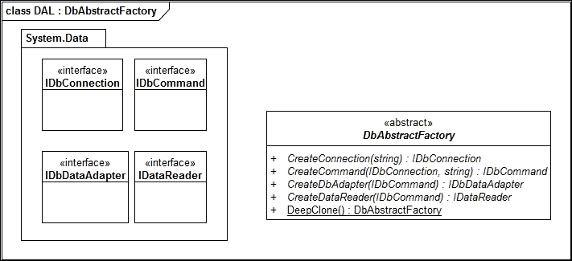
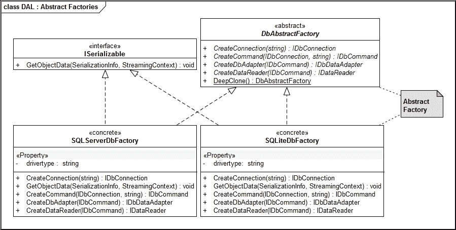
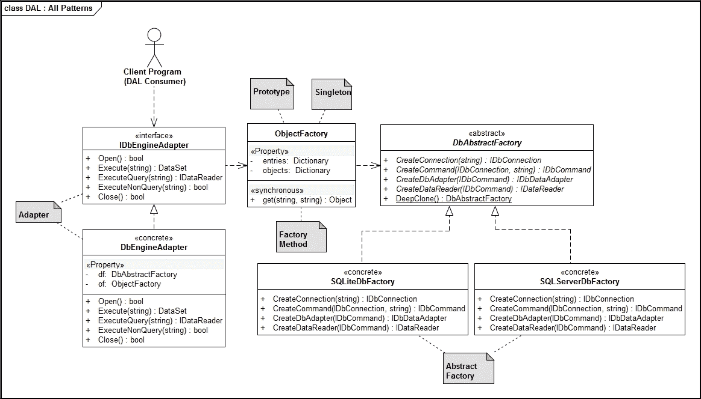

# 第四章. 多数据库目标

在本章中，我们将尝试创建一个库，帮助应用程序开发者针对 SQL Server、SQLite、MySQL 和 Oracle 等数据库。通过创建这个库，我们将能够编写应用程序代码，而无需担心底层持久化技术。尽管 ADO.NET 在抽象化关系数据库管理系统（**RDBMS**）的细节方面做得很好，但我们还需要比 ADO.NET 提供的标准功能更多的东西来编写数据库无关的持久化层。

在本章的阅读过程中，作为读者，你将学会利用抽象工厂模式、工厂模式和适配器模式，以便能够做到以下几项：

+   与各种 ADO.NET 提供者接口

+   编写与数据库存储无关的逻辑

+   将数据写入 SQLite 数据库

+   将数据写入 SQL Server 数据库

+   将数据写入 ODBC 数据源

# 库的要求

在我们开始编写库之前，让我们草拟以下初步需求声明：

### 注意

当我们编写商业应用程序时，我们的应用程序应该能够持久化到来自不同数据库供应商的关系数据库引擎。

### 注意

我们应该能够支持 SQL Server、SQLite、Oracle 或任何支持 ADO.net 的数据库引擎。添加新的数据库引擎应该是一件轻而易举的事情。同样，对于应用程序开发者来说，更改数据库技术应该是一个无缝的过程。

# 解决方案方法

随着 ORM 技术如 ADO.NET **Entity Framework**（**EF**）和**NHibernate**的出现，编写针对多个数据库提供者的应用程序变得更加容易。作者认为，ADO.NET EF 与 Visual Studio 环境及其工具协同工作，在面向模式的软件开发书籍中处理起来可能会很困难。对于习惯了 Hibernate 库的 Java 世界的人来说，NHibernate 简化了学习曲线。尽管在.NET 专业人士中其使用率和受欢迎程度正在下降（原因不明），但作者认为 NHibernate 是编写企业级应用程序的一个可行的选择。为了简单起见，本书中将使用 ADO.NET 编程模型来隔离数据库特定性。

ADO.NET 库基于 Microsoft 的`System.Data`程序集中定义的以下一组接口：

| **接口** | **定义** |
| --- | --- |
| `IDbConnection` | 用于管理数据库连接具体细节的接口。 |
| `IDbCommand` | 用于发出 SQL 命令和查询的接口。 |
| `IDbDataAdapter` | 用于断开连接的数据访问接口。 |
| `IDataReader` | 用于基于游标的数据库访问接口。 |

### 注意

还有其他接口用于处理事务管理、存储过程和相关的参数处理。为了缩短代码列表，我们将在此书中忽略它们。这些可以在不费太多力气的情况下纳入我们的库中。

所述接口均由各自数据库供应商编写的提供者实现。Microsoft 鼓励独立供应商编写 ADO.NET 提供者。这些接口的 SQL Server 实现 (`System.Data.SqlClient`) 命名为以下：

| **类** | **定义** |
| --- | --- |
| `SqlConnection` | 实现 `IDbConnection` 接口。 |
| `SqlCommand` | 实现 `IDbCommand` 接口。 |
| `SqlDataAdapter` | 实现 `IDbAdapter` 接口。 |
| `SqlDataReader` | 实现 `IDataReader` 接口。 |

在 `System.Data.SQLite` 的情况下，方案如下：

| **类** | **定义** |
| --- | --- |
| `SQLiteConnection` | 实现 `IDbConnection` 接口。 |
| `SQLiteCommand` | 实现 `IDbCommand` 接口。 |
| `SQLitelDataAdapter` | 实现 `IDbAdapter` 接口。 |
| `SQLiteDataReader` | 实现 `IDataReader` 接口。 |

类似提供者类由 Oracle 和 MySQL 实现。

### 注意

我们将使用 GoF 目录中的抽象工厂方法来实例化针对连接、命令、数据适配器和读取器的标准 ADO.NET 库特定接口。抽象工厂模式是一种创建型模式，它提供了一个接口，用于在不指定具体类的情况下创建相关或依赖对象系列。

## ADO.net 快速入门

由于我们使用 ADO.net API 访问数据库，以下代码片段将有助于理解以下部分。使用 ADO.net API 编写代码有两种方式。我们可以直接使用具体类来访问数据库内容。以下代码片段展示了如何使用 `SQliteConnection`、`SQliteCommand` 和 `SQliteDataReader` 等编写针对 SQLite 的代码。类似的代码可以用于 SQL Server、MySQL 和 Oracle：

```cs
    public static void TestAdoNetSpecificInterface() 
    { 
      string connectionString = @"Data Source=./Logstorage.db"; 
      //----- Create a Connection Object 
      //----- and open it 
      SQLiteConnection dbcon= 
        new SQLiteConnection(connectionString); 
      dbcon.Open(); 
      //----------- Create a Command Object 
      //----------- to issue SQL Query 
      SQLiteCommand dbcmd = dbcon.CreateCommand(); 
      string sql = "SELECT * from logs"; 
      dbcmd.CommandText = sql; 

      //----------- Create a Reader Object  
      //----------- And Iterate through it 
      SQLiteDataReader reader = dbcmd.ExecuteReader(); 
      while (reader.Read()) 
      { 
        string logentry = reader.GetString(0); 
        Console.WriteLine(logentry); 
      } 
      // clean up 
      reader.Close(); 
      reader = null; 
      dbcmd.Dispose(); 
      dbcmd = null; 
      dbcon.Close(); 
      dbcon = null; 
    } 

```

上述代码片段利用了提供的具体类。如果我们想以通用方式编写代码，我们可以针对接口如 `IDbConnection`、`IDbCommand` 和 `IDbDataReader` 等进行编程。以下代码片段展示了该技术：

```cs
    public static void TestAdoNetWithGenericInterface() 
    { 
      string connectionString = @"Data Source=./Logstorage.db"; 
      //------ Open a connection and assign the connection object  
      //------ to the IDbconnection interface. SQliteConnection, 
      //------ OracleConnection,SQLConnection etc. implements the  
      //------ IDbConnection Interface 
      IDbConnection dbcon 
        = (IDbConnection)new SQLiteConnection(connectionString); 
      dbcon.Open(); 
      //------------ IDbCommand is the interface for  
      //------------ Command Object . Every ADO.net  
      //------------ Interface (for Oracle,SQL server etc) 
      //------------ supports it  
      IDbCommand dbcmd = dbcon.CreateCommand(); 
      string sql = "SELECT * from logs"; 
      dbcmd.CommandText = sql; 
      //------- Create a Data Reader and Assign  
      //------- it to IDataReader Interface 
      IDataReader reader = dbcmd.ExecuteReader(); 
      while (reader.Read()) 
      { 
        string logentry = reader.GetString(0); 
        Console.WriteLine(logentry); 
      } 
      // clean up 
      reader.Close(); 
      reader = null; 
      dbcmd.Dispose(); 
      dbcmd = null; 
      dbcon.Close(); 
      dbcon = null; 
    } 

```

## 抽象工厂模式和对象实例化

在我们的情况下，抽象工厂模式是相关的，因为我们应该基于 ADO.NET 定义的接口创建一组相关类。为此，我们将定义一个具有以下签名的抽象类：

```cs
    public abstract class DbAbstractFactory 
    { 
      public abstract IDbConnection CreateConnection(string connstr); 
      public abstract IDbCommand CreateCommand(IDbConnection con,    
      string cmd); 
      public abstract IDbDataAdapter CreateDbAdapter(IDbCommand cmd); 
      public abstract IDataReader CreateDataReader(IDbCommand cmd); 
    } 

```



在上一个界面中，我们有创建连接对象、命令对象、数据适配器对象和数据读取器对象的方法。这些类是相关的，具体类是为每个数据库提供的产品而设计的。具体类会调用相应的 ADO.NET 驱动程序。

## SQL 服务器实现

抽象工厂的 SQL Server 实现使用了微软公司提供的默认提供程序。我们需要在我们的项目中包含`System.Data.SqlClient`命名空间，以利用提供程序命名空间中的对象。尽管给出的代码保证了更健壮和防御性编程实践，这对于工业强度实现是必需的，但它提供了清晰性，并且是此类实现的良好模板：

```cs
    [Serializable()] 
    public class SQLServerDbFactory : DbAbstractFactory,ISerializable 
    { 
      private string drivertype { get; set; } 
      public SQLServerDbFactory() { this.drivertype = null; } 
      //------------------ Create a Connection Object 
      //------------------ returns a reference to  
      //------------------- a IDbConnection Interface 
      public override IDbConnection CreateConnection(string connstr) 
      { 
        if (connstr == null || connstr.Length == 0) 
          return null; 
        return new SqlConnection(connstr); 
      } 
      public override IDbCommand CreateCommand(IDbConnection con,    
      string cmd) 
      { 
        if (con == null || cmd == null || cmd.Length == 0) 
        return null; 
        if (con is SqlConnection) 
        return new SqlCommand(cmd, 
        (SqlConnection)con); 
        return null; 
      } 
      public override IDbDataAdapter CreateDbAdapter(IDbCommand cmd) 
      { 
        if (cmd == null) { return null; } 
        if (cmd is SqlCommand) 
        return new 
        SqlDataAdapter((SqlCommand)cmd); 
        return null; 
      } 
      public override IDataReader CreateDataReader(IDbCommand cmd) 
      { 
        if (cmd == null) { return null; } 
        if (cmd is SqlCommand) 
          return (SqlDataReader)cmd.ExecuteReader(); 
        return null; 
      } 
      public void GetObjectData(SerializationInfo info,  
      StreamingContext ctxt) 
      { 
      } 
      protected SQLServerDbFactory(SerializationInfo info,  
      StreamingContext context) 
      { 
      } 
    } 

```

## SQLite 的实现

SQLite 的实现使用了 SQLite 实现团队维护的 ADO.NET 提供程序。为了包含它，我们需要从[`system.data.sqlite.org`](https://system.data.sqlite.org/)网站下载程序集。我们还需要包含 SQLite 网站上可用的`sqlite3.dll`。

您也可以使用 nuget 通过包管理控制台安装它，命令为`PM> Install-Package System.Data.SQLite`：

```cs
    [Serializable()] 
    public class SQLiteDbFactory : DbAbstractFactory,ISerializable 
    { 
      private string drivertype { get; set; } 
      public SQLiteDbFactory() { this.drivertype = null; } 
      public override IDbConnection CreateConnection(string connstr) 
      { 
        if (connstr == null || connstr.Length == 0) 
        return null; 
        return new SQLiteConnection(connstr); 
      } 

      public override IDbCommand CreateCommand(IDbConnection    
      con,string cmd) 
      { 
        if (con == null || cmd == null || cmd.Length == 0) 
        return null; 
        if (con is SQLiteConnection ) 
        return  new SQLiteCommand(cmd,  
        (SQLiteConnection)con); 
        return null; 
      } 

      public override IDbDataAdapter CreateDbAdapter(IDbCommand cmd) 
      { 
        if (cmd == null) { return null; } 
        if (cmd is SQLiteCommand) 
        return new  
        SQLiteDataAdapter((SQLiteCommand)cmd); 
        return null; 
      } 

      public override IDataReader CreateDataReader(IDbCommand cmd) 
      { 
        if (cmd == null) { return null; } 
        if (cmd is SQLiteCommand) 
        return (SQLiteDataReader)cmd.ExecuteReader(); 
        return null; 
      } 

      public void GetObjectData(SerializationInfo info,  
      StreamingContext ctxt) 
      { 
      } 

      protected SQLiteDbFactory(SerializationInfo info,  
      StreamingContext context) 
      { 
      } 
    } 

```

## Oracle 和 ODBC 的实现

由于微软已经弃用了`System.Data.OracleClient`接口，我们需要从 Oracle 公司网站下载 ADO.NET 提供程序。将 Oracle 整合到混合中与我们对 SQL Server 和 SQLite 所做的方式相似。由于 Oracle 支持 ODBC，我们通过`System.Data.Oledb`命名空间使用 ODBC ADO.NET 提供程序与其他数据库交互。实现作为源代码下载的一部分提供。

下面的图示说明了抽象工厂的作用（尽管只有一个被标记）：



## 适配器模式驱动的 API

在这个上下文中，GOF 适配器模式对我们很有用，可以为我们提供统一编程模型，供子系统消费者使用。

### 注意

适配器模式是一种结构型模式，它作为不同接口或接口的不同实现之间的桥梁。在我们的情况下，我们将使用适配器模式作为应用程序开发者和`DbAstractFactory`各种实现之间的桥梁。

我们需要为应用程序软件开发者创建一个**应用程序程序接口**（**API**），以便根据配置条目利用不同的实现。我们将创建一个 C#接口，适配器类需要实现它，作为 API。在这个时候，我们只有一个适配器类的实例。在未来，我们可以有不同的适配器用于不同的场景：

```cs
    public interface IDbEngineAdapter 
    { 
      bool Open(); 
      DataSet Execute(string SQL); 
      IDataReader ExecuteQuery(string SQL); 
      bool ExecuteNonQuery(string SQL);     
      Boolean Close(); 
    } 

```

## 适配器类实现

我们将实现一个适配器类，它将帮助我们无缝地将多个数据库引擎与我们的应用程序集成。为了实现适配器类，我们将利用上一章中的对象工厂（`ObjectFactory`）实现：

```cs
    public class DbEngineAdapter : IDbEngineAdapter 
    { 
      static  ObjectFactory of = new ObjectFactory("DbDrivers.xml"); 
      private IDbConnection _con = null; 
      private IDbCommand _cmd = null; 
      private DbAbastractFactory df = null; 
      private string _constr; 
      private string _driver; 

```

我们利用在第三章中创建的工厂方法基础设施，即《日志库》，以帮助实例化`DbAstractFactory`的正确具体实现。《DbDrivers.xml》配置文件包含实例化具体类所需的信息：

```cs
    public DbEngineAdapter(string constr, string driver) 
    { 
      _constr = constr; 
      _driver = driver; 
      //----- Instantiate the correct concrete class 
      //----- based on the driver 
      df = (DbAbastractFactory)of.Get(driver, "prototype"); 
    } 

```

构造函数接受两个参数，即连接字符串和驱动程序名称。使用驱动程序名称作为键，将实例化适当的 ADO.NET 实现：

```cs
    public bool Open() 
    { 
      try 
      { 
        if (_con != null || df == null || _constr == null) 
        { 
          return false; 
        } 
        //------ Create Connection Object  
        _con = df.CreateConnection(_constr); 
        if (_con == null) 
        return false; 
        _con.Open(); 
        return true; 
      } 
      catch (Exception e) 
      { 
        e.ToString(); 
        return false; 
      } 
    } 

```

`Open` 方法通过抽象工厂的具体实现创建连接对象。一旦创建连接对象，ADO.NET 连接就打开了。然后应用程序开发者应该在调用任何其他方法之前调用当前类的`Open`方法：

```cs
    public DataSet Execute(string SQL) 
    { 
      try 
      { 
        if (_con == null || df == null || _cmd != null)  
        {  
          return null;  
        } 
        _cmd = df.CreateCommand(_con, SQL); 
        IDbDataAdapter da = df.CreateDbAdapter(_cmd); 
        if (da == null) { return null; } 
        DataSet ds = new DataSet(); 
        da.Fill(ds); 
        return ds; 
      } 
      catch (Exception e) 
      { 
        e.ToString(); 
        return null; 
      } 
    } 

```

`Execute` 方法帮助将 SQL 字符串发送到所选数据库引擎，并返回一个数据集。此方法还用于断开连接访问，其中应用程序想要检索一小批数据以填充用户界面：

```cs
    public IDataReader ExecuteQuery(string SQL) 
    { 
      try 
      { 
        if (_con == null || df == null || _cmd != null) { return      
        null;} 
        _cmd = df.CreateCommand(_con, SQL); 
        if (_cmd == null) { return null; } 
        IDataReader rs = df.CreateDataReader(_cmd); 
        return rs; 
      } 
      catch (Exception e) 
      { 
        e.ToString(); 
        return null; 
      } 
    } 

```

`ExecuteQuery` 方法帮助将 SQL 查询发送到数据库，并检索一个数据读取器对象，该对象可以帮助逐条记录进行导航。这称为基于游标的访问，适用于返回大量数据集的查询：

```cs
    public bool ExecuteNonQuery(string SQL) 
    { 
      try 
      { 
        if (_con == null || df == null || _cmd != null)  
        return false;  
        _cmd = df.CreateCommand(_con,SQL); 
        if (_cmd == null) { return false; } 
        _cmd.ExecuteNonQuery(); 
        return true; 
      } 
      catch (Exception e) 
      { 
        e.ToString(); 
        return false; 
      } 
    } 

```

`ExecuteNonQuery` 方法旨在向表中插入、更新或删除记录。它不返回任何值。换句话说，该方法用于对关系数据库上的可变操作进行调用：

```cs
    public Boolean Close() 
    { 
      if (_con != null) 
      { 
        _con.Close(); 
        _con = null; 
        return true; 
      } 
      return false; 
    } 
  }
```

如指示，`Close` 方法关闭数据库连接。适配器类可以使用以下模式在应用程序代码中实例化。我们需要的只是一个连接字符串和一个驱动程序名称（`SQLITE`、`SQLSERVER`等）来实例化对象。一旦实例化了对象，我们就可以像以下代码所示，对所选数据库引擎发送任意查询：

```cs
    DbEngineAdapter db =  
    new DbEngineAdapter(connstr,driver); 
    if (db.Open()) 
    { 
      bool result = db.ExecuteNonQuery(query); 
    } 
    db.Close(); 

```

## 适配器配置

各数据库引擎的驱动程序通过以下方式的 XML 文件（`DbDrivers.xml`）进行配置：

```cs
    <?xml version="1.0"?> 
    <entries> 
      <entry key ="SQLITE" value="Chapter4_Example.SQLiteDbFactory"/> 
      <entry key="SQLSERVER"      
      value="Chapter4_Exanple.SQLServerDbFactory"/> 
      <entry key="NULL" value ="Chapter4_Example.NULLDbFactory"/> 
    </entries> 

```

当我们想要针对新的数据库时，我们需要创建一个实现抽象工厂接口的具体类，并将条目添加到此配置文件中。

## 客户端程序

我们可以编写一个客户端程序来测试这个逻辑。以下给出将条目插入所选数据库的代码。我们最初选择 SQLite 是为了简化。由于 SQLite 是一个无服务器数据库引擎，我们可以将 SQLite 数据库嵌入到我们的项目中：

```cs
    static void TestInsert(string connstr, string driver) 
    { 
      DbEngineAdapter db =  
      new DbEngineAdapter(connstr,driver); 
      //----- a Test Log Entry 
      string test = "Log value is " + Math.PI * 1999; 
      if (db.Open()) 
      { 
        string query = "INSERT INTO logs VALUES('" + 
        test + "');"; 
        bool result = db.ExecuteNonQuery(query); 
      } 
      db.Close(); 
      return; 
    } 

```

要从表中检索数据，我们可以使用断开连接的记录集模型或游标模型。当我们处理大量数据集时，特别是对于报告，使用游标模型更合适。对于需要通过某些控件编辑一小批数据的场景，断开连接的集合更受欢迎。以下代码演示了如何使用断开连接的记录集来检索数据：

```cs
    static void TestDataSet(string connstr, string driver) 
    { 
      IDbEngineAdapter db = 
      new DbEngineAdapter(connstr,driver); 
      if (db.Open()) 
      { 
        string query = "SELECT * from logs"; 
        DataSet ds = db.Execute(query); 
        DataTable dt = ds.Tables[0]; 
        int i = 0; 
        int max = dt.Rows.Count; 
        while (i < max) 
        { 
          DataRow dr = dt.Rows[i]; 
          Console.WriteLine(dr[0]); 
          i++; 
        } 
      } 
      db.Close(); 
      return; 
    } 

```

ADO.NET 的 `DataReader` 接口旨在用于基于游标的数据库访问。这有助于遍历满足某些标准的数据。基于游标的访问是报告应用程序的典型用例：

```cs
    static void TestDataReader(string connstr, string driver) 
    { 
      IDbEngineAdapter db = 
      new DbEngineAdapter(connstr,driver); 
      string query = "select * from logs"; 
      if (db.Open()) 
      { 
        IDataReader reader = db.ExecuteQuery(query); 
        while(reader.Read()) 
        { 
          Console.WriteLine(reader.GetString(1)); 
        } 
      } 
      db.Close(); 
    } 

```

下文给出了调用这些辅助例程的 `Main` 程序。初始代码片段展示了如何将 SQLite 作为目标数据库使用：

```cs
    static void Main(string[] args) 
    { 
      TestInsert(@"Data Source=./Logstorage.db", "SQLITE"); 
      TestDataSet(@"Data Source=./Logstorage.db", "SQLITE"); 
      TestDataReader(@"Data Source=./Logstorage.db", "SQLITE"); 
    } 

```

要使用 SQL Server，需要修改连接字符串。由于连接字符串针对特定的 SQL Server 安装（读者将拥有），调用程序的通用方案如下：

```cs
    static void Main(string[] args) 
    { 
      TestInsert(@"sqlserverconnstring", "SQLSERVER"); 
      TestDataSet(@"sqlserverconnstring", "SQLSERVER"); 
      TestDataReader(@"sqlserverconnstring", "SQLSERVER"); 
    } 

```

以下 UML 图展示了我们构建的 **数据库访问库（DAL**） API 中关键模式集的作用：



# 摘要

在本章中，我们创建了一个可重用的 DAL，以针对不同的关系数据库产品实现持久化。该库利用 Microsoft ADO.NET 编程模型实现数据库无关的持久化。在这个过程中，你了解了抽象工厂模式、适配器模式和回顾了工厂方法模式。你还理解了工厂方法和抽象工厂模式之间的区别。在下一章中，我们将编写一个文档对象库，这将帮助用户将数据内容保存到不同的格式，如 PDF、SVG 和 HTML。在这个过程中，你将学习到组合设计模式和访问者模式。
