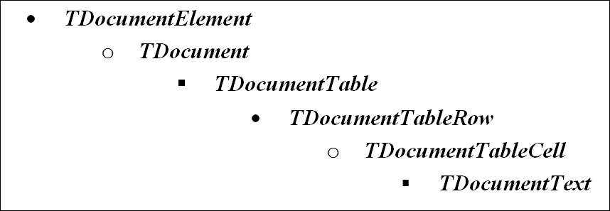
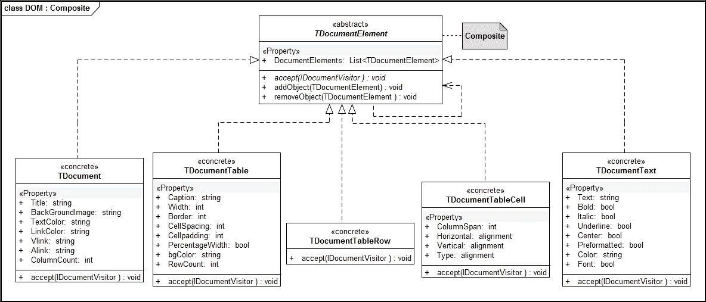

# 第五章：生成表格报告

在本章中，我们将创建一个库，帮助应用开发者使用为此目的创建的定制**文档对象模型**（**DOM**）来创建表格报告。我们将遍历树状结构的文档对象模型，以生成 Adobe® **便携式文档格式**（**PDF**）和 HTML 格式的输出。对新目标格式的支持将无缝进行，开发者只需编写相应的处理器。对于 PDF 输出，我们计划使用开源的**iTextSharp**库。在本章的阅读过程中，作为读者，你将学习以下内容：

+   定义文档的对象模型

+   用于建模部分/整体关系的组合模式

+   通过利用 iTextSharp 库生成 PDF 文档

+   访问者模式和组合对象遍历

# 库的需求

在我们着手编写库之前，让我们先草拟一个初步的需求声明如下：

对于大量商业应用，我们需要各种格式的表格报告。流行的输出格式选择包括 PDF、HTML、SVG 等。我们应该创建一个库来生成这些格式的表格输出。该库应定义一个统一的编程模型，并作为开发者的 API。文档内容和其表格的内容应与处理层分离，以便纳入未来的输出驱动程序。

# 解决方案方法

在编写代码之前，让我们稍微退后一步，列举一下需求细节。我们计划编写的库应该具备以下特点：

+   支持各种输出格式，如 HTML、PDF 等

+   用于存储表格内容的对象模型

+   为开发者提供的统一编程模型和 API

+   分离内容和其处理

+   编写新的可插拔输出处理器（驱动程序）的能力

我们将首先创建一个用于存储文档内容的元素层次结构。一个简单的设计如下：



我们将在树状文档模型中编码我们的内容。为了简化，我们减少了文档元素的数量。在库的工业强度实现中，我们将有更多的元素。我们可以在这种方案中创建表格内的表格，因为我们允许嵌套表格。在我们开始实现上述层次结构之前，我们将探讨使用开源库创建 PDF 文档的具体细节。

# 用于 PDF 输出的 iTextSharp

为了生成 PDF 格式的文档输出，我们计划使用开源 iText 库的.NET 版本。

### 注意

该库可以从以下地址的 iTextSharp 网站上下载：[`www.nuget.org/packages/iTextSharp/`](https://www.nuget.org/packages/iTextSharp/)。

一个简单的程序，它使用库生成一个 PDF 文档，紧随其后，以便让读者理解这个库的编程模型：

```cs
    using iTextSharp; 
    using iTextSharp.text; 
    using iTextSharp.text.pdf; 
    //------some code omitted 
    FileStream fs = new FileStream(@"D:\ab\fund.pdf",   
    FileMode.Create); 
    Document document = new Document(PageSize.A4, 25, 25, 30, 30); 
    PdfWriter writer = PdfWriter.GetInstance(document, fs); 
    document.AddAuthor("Praseed Pai"); 
    document.AddCreator("iTextSharp PDF Library"); 
    document.AddTitle("PDF Demo"); 
    document.Open(); 
    PdfPTable table = new PdfPTable(2); 
    PdfPCell cell = new PdfPCell(new Phrase("A Header which spans    
    Columns")); 
    cell.Colspan = 3; 
    cell.HorizontalAlignment = 1;  
    table.AddCell(cell); 
    table.AddCell("Col 1 Row 1"); 
    table.AddCell("Col 2 Row 1"); 
    table.AddCell("Col 3 Row 1"); 
    table.AddCell("Col 1 Row 2"); 
    table.AddCell("Col 2 Row 2"); 
    table.AddCell("Col 3 Row 2"); 
    document.Add(table); 
    document.Close(); 
    writer.Close(); 
    fs.Close(); 

```

前面的代码将生成一个 PDF 文档，该文档包含通过 iTextSharp API 传递给 iTextsharp 库的内容。现在我们将专注于创建一个 DOM 来存储我们的内容。

# 组合和访问者模式 - 快速入门

当我们处理像 W3C DOM、文档格式、图形数据库或编译器的**抽象语法树**（**AST**）这样的层次结构时，我们创建部分/整体关系。GoF 组合模式是创建层次结构的一个自然选择。使用 GoF 访问者模式可以将层次结构的构建和处理分离。访问者模式遍历层次结构中的每个节点并在节点上执行某些操作。在一个编译器中，程序的树表示将被用于类型检查、代码生成、跨编译（源到源转换）等。有时人们希望在树上执行额外的活动。在节点内部添加处理节点的方法是不可行的。每当程序员想要一个新方法时，我们就被迫更改层次结构中的每个节点。需要一个机制来解耦层次结构中的节点处理。当我们使用访问者模式时，层次结构内的节点仅成为数据的容器。我们将编写一个表达式组合来模拟一个四功能计算器，以展示组合和访问者模式：

```cs
    public enum OPERATOR 
    { 
      //--- supports +,-,*/ 
      PLUS,MINUS,MUL,DIV 
    } 
    /// <summary> 
    /// Base class for all Expression 
    /// supports accept method to implement  
    /// so called "Double Dispatch". Search for  
    /// "Double Dispatch" and Visitor to understand more  
    /// about this strategy 
    /// </summary> 
    public abstract class Expr 
    { 
      //------ Whenever we start traversal, we will start from  
      //------ the topmost node of a hierarchy and  
      //-------descends down the heirarchy 
      //------ The Visitor will call the accept method of a node 
      //------ and node will reflect it back to concrete class 
      //------ using Visit method. Thus Visitor dispatches the  
      //------ call to a node and node dispatches it back to the 
      //-------visit method of the Visitor. This is called a 
      //------ a double dispatch 
      public abstract double accept(IExprVisitor expr_vis); 
    } 

```

表达式的层次结构是

+   `Expr`

    +   `Number`

    +   `BinaryExpr`

    +   `UnaryExpr`

```cs
    /// <summary> 
    ///  Our Visitor Interface. The Purpose of seperating Processing 
    ///  Of Nodes and Data Storage (heirarchy) is for various  
    ///  transformations on the composites created. 
    /// </summary> 
    public interface IExprVisitor 
    { 
      double Visit(Number num); 
      double Visit(BinaryExpr bin); 
      double Visit(UnaryExpr un); 
    } 

```

下面的类将存储一个 IEEE 754 双精度浮点值。我们的评估器将只处理常量，因为支持变量的表达式评估器将需要额外的努力，而且不会服务于我们演示组合和访问者模式的初衷：

```cs
    /// <summary> 
    ///  Class Number stores a IEEE 754 doouble precision 
    ///  floating point 
    /// </summary> 
    public class Number : Expr 
    { 
      public double NUM { get; set; } 
      public Number(double n) { this.NUM = n; } 
      public  override double accept(IExprVisitor expr_vis) 
      { 
        return expr_vis.Visit(this); 
      } 
    } 

```

现在我们已经创建了`Number`节点，我们应该创建一个节点来通过二元运算符组合值。支持的二元运算符有`+`、`-`、`/`、`*`，并且这个类被命名为`BinaryExpr`：

```cs
    /// <summary> 
    ///  Class BinaryExpr models a binary expression of  
    ///  the form <Operand> <OPER> <Operand> 
    /// </summary> 
    public class BinaryExpr : Expr 
    { 
      public Expr Left { get; set; } 
      public Expr Right { get; set; } 
      public OPERATOR OP { get; set; } 
      public BinaryExpr(Expr l,Expr r,OPERATOR op){ 
        Left = l; Right = r; OP = op; 
      } 
      public override double accept(IExprVisitor expr_vis) 
      { 
        //----- When this method gets invoked by a Concrete 
        //----- implementation of Visitor, the call is routed 
        //----- back to IExprVisitor.Visit(BinaryExpr ) 
        return expr_vis.Visit(this); 
      } 
    } 

```

下面的类实现了单元表达式节点。在我们的评估器中，我们支持单元运算符`+`和`-`：

```cs
    /// <summary> 
    /// Class UnaryExpr models a unary expression of the form 
    /// <OPER> <OPERAND>  
    /// </summary>
   public  class UnaryExpr  : Expr { 
     public Expr Right; 
     public OPERATOR OP; 
     public UnaryExpr (Expr r,OPERATOR op) { 
       Right = r; OP = op; 
     } 
     public override double accept(IExprVisitor expr_vis) 
     { 
       //----- When this method gets invoked by a Concrete 
       //----- implementation of a Visitor, the call is routed 
       //----- back to IExprVisitor.Visit(UnaryExpr ) 
       return expr_vis.Visit(this); 
     } 
   } 

```

我们定义了一个表达式层次结构，它可以组合成任意复杂性的算术表达式。我们的节点只存储数据和子节点的引用。节点的处理与节点本身解耦，使用访问者模式。让我们看看几个例子，我们可以用它们来组合算术表达式。作为一个例子，让我们看看我们如何使用我们的组合来存储表达式 *1+2*：

```cs
    Expr first = new BinaryExpr( 
      new Number(1), 
      new Number(2), 
      OPERATOR.PLUS); 

```

表达式 *2+3*4* 可以编码为：

```cs
    Expr r = new BinaryExpr(new Number(2), 
    new BinaryExpr( 
      new Number(3),  
      new Number(4),  
      OPERATOR.MUL), 
    OPERATOR.PLUS); 

```

我们可以使用这种方法构建任意复杂性的表达式。现在，我们将看看我们如何使用访问者模式处理这些组合。作为一个例子，我们将编写一个生成 **逆波兰表示法**（**RPN**）的访问者。RPN 也称为后缀表示法，在一些计算器和 Forth 编程语言中使用。从互联网上了解更多关于 RPN 的信息。

```cs
    /// <summary> 
    ///  A Visitor implementation which converts Infix expression to  
    ///  a Reverse Polish Notation ( RPN)  
    /// </summary> 
    public class ReversePolishEvaluator : IExprVisitor 
    { 
      public double Visit(Number num) 
      { 
        //------ Spit the number to the console 
        Console.Write(num.NUM+ " "); 
        return 0; 
      } 
      public double Visit(BinaryExpr bin) 
      { 
        //------ Traverse the Left Sub Tree followed 
        //------ By Right Sub Tree. We follow a Depth 
        //------ First Traversal 
        bin.Left.accept(this); 
        bin.Right.accept(this); 
        //-----  After Nodes has been processed, spit out 
        //-----  the Operator 
        if (bin.OP == OPERATOR.PLUS) 
          Console.Write(" + "); 
        else if (bin.OP == OPERATOR.MUL) 
          Console.Write(" * "); 
        else if (bin.OP == OPERATOR.DIV) 
          Console.Write(" / "); 
        else if (bin.OP== OPERATOR.MINUS) 
          Console.Write(" - "); 
        return Double.NaN; 
      } 
      public double Visit(UnaryExpr un) 
      { 
        //-------- In a Unary Expression we have got  
        //-------- only a sub tree, Traverse it 
        un.Right.accept(this); 
        //-------- Spit the operand to the Console. 
        if (un.OP == OPERATOR.PLUS) 
          Console.Write("  + "); 
        else if (un.OP == OPERATOR.MINUS) 
          Console.Write("  - "); 
        return Double.NaN; 
      } 
    } 

```

上述类可以按如下方式调用。我们将展示如何将表达式 *2+3*4* 转换为 *2 3 4 * +*。让我们使用我们的表达式层次结构来编码表达式如下：

```cs
    Expr r = new BinaryExpr(new Number(2), 
      new BinaryExpr( 
        new Number(3),  
        new Number(4),  
        OPERATOR.MUL), 
      OPERATOR.PLUS); 

```

上述构建的表达式层次结构可以通过 `ReversePolishEvaluator` 进行遍历，从而产生 *2 3 4 * +* 如下所示：

```cs
    IExprVisitor visitor =  
      new ReversePolishEvaluator(); 
    second.accept(visitor); 

```

创建表达式树并对其进行评估的整个目的。我们将编写一个基于栈的表达式评估器来演示访问者模式的用法：

```cs
    /// <summary> 
    ///  A Visitor which evaluates the Infix expression using a Stack 
    ///  We will leverage stack implementation available with .NET  
    ///  collections API 
    /// </summary> 
    public class StackEvaluator : IExprVisitor 
    { 
      //------- A stack to store double values 
      //------- .NET Framework has got a stack implementation! 
      private Stack<double> eval_stack = new Stack<double>(); 
      //---- return the computed value 
      //---- implementation does not do any error check 
      public double get_value() { return eval_stack.Pop(); } 

      public StackEvaluator() { eval_stack.Clear(); } 
      public double Visit(Number num) 
      { 
        //---- whenever we get an operand 
        //---- push it to the stack 
        eval_stack.Push(num.NUM); 
        return 0; 
      } 
      public double Visit(BinaryExpr bin) 
      { 
        bin.Left.accept(this); 
        bin.Right.accept(this); 
        //--- We have processed left and right sub tree 
        //--- Let us pop values, apply the operator 
        //--- and push it back 
        if (bin.OP == OPERATOR.PLUS) 
          eval_stack.Push(eval_stack.Pop() + eval_stack.Pop()); 
        else if (bin.OP == OPERATOR.MUL) 
          eval_stack.Push(eval_stack.Pop() * eval_stack.Pop()); 
        else if (bin.OP == OPERATOR.DIV) 
        { 
          double dval = eval_stack.Pop(); 
          if (dval == 0) 
          { 
            //--- handle division by zero error 
            //--- throw an exception 
          } 
          eval_stack.Push( eval_stack.Pop()/dval); 
        } 
        else if (bin.OP == OPERATOR.MINUS) 
          eval_stack.Push(eval_stack.Pop() - eval_stack.Pop()); 
        return Double.NaN; 
      } 
      public double Visit(UnaryExpr un) 
      { 
        un.Right.accept(this); 
        if (un.OP == OPERATOR.PLUS) 
          eval_stack.Push(eval_stack.Pop()); 
        else if (un.OP == OPERATOR.MINUS) 
          eval_stack.Push(-eval_stack.Pop()); 
        return Double.NaN; 
      } 
    } 

```

上述栈评估器可以按如下方式调用：

```cs
    Expr third = new BinaryExpr(new Number(2), 
      new BinaryExpr( 
      new Number(3),  
      new Number(4),  
      OPERATOR.MUL), 
    OPERATOR.PLUS); 

    StackEvaluator seval = new StackEvaluator();  
    third.accept(seval);
    Console.WriteLine(seval.get_value()); 
    Console.WriteLine(); 

```

我们已经完成了对访问者和组合模式的讨论。在上面的例子中，我们定义了一个小的层次结构来构建数学表达式，并使用遍历组合的访问者类来处理它，从而生成 RPN 表达式并使用栈进行评估。这种技术在需要处理层次结构的地方被广泛使用。让我们关注如何创建文档层次结构并处理它。

# 组合模式和文档组合

在表示部分-整体层次结构（树状结构）时，组合设计模式描述了一组应以统一方式处理的对象，就像叶节点和内部节点是同一对象的实例一样。文档对象可以包含多个表格，我们也可以嵌套表格。这是一个部分-整体层次结构的实例，组合设计模式在这里是一个自然的选择。要创建组合，我们需要声明一个基类，并且所有对象都应该从这个基类派生：

```cs
    public abstract class TDocumentElement 
    { 
      public List<TDocumentElement> DocumentElements { get; set; } 
      //------ The method given below is for implementing Visitor     
      Pattern 
      public abstract void accept(IDocumentVisitor doc_vis); 
      //--- Code Omitted 
      public TDocumentElement() 
      { 
        DocumentElements = new List<TDocumentElement>(5); 
        this.Align = alignment.LEFT; 
        this.BackgroundColor = "0xFF000000L"; 
      } 
      //---- Code Omitted 
      public void addObject(TDocumentElement value) 
      { 
        if (value != null) 
        DocumentElements.Add(value); 
      } 
      public Boolean removeObject(TDocumentElement value) 
      { 
        if (value != null) 
        { 
          DocumentElements.Remove(value); 
          return true; 
        } 
        return false; 
      } 
      //----- Code Omitted 
    } 

```

`TDocumentElement` 类作为对象模型中所有类的基类。请注意关于 `TDocumentElement` 类的以下两个重要事项：

+   第一项是 `DocumentElements` 属性。每个 `TDocumentElement` 都有一个 `TDocumentElement` 列表来存储其子对象。这意味着，我们可以插入一个实现 `TDcoumentElement` 的具体对象列表作为子对象。使用这种技术，我们可以构建任意复杂性的文档层次结构。

+   第二点是存在一个名为 `accept` 的抽象方法。`accept` 方法是一种机制，通过它我们可以将节点操作和节点数据结构分开。我们将在后面的章节中了解更多关于 `accept` 方法的语义。

层次结构中最顶层的类是 `TDocument`，它作为 `TDocumentElement` 派生类的分层集合的容器。该类将存储要嵌入文档中的所有子内容（基类型为 `TDocumentElement` 的具体类）。

```cs
    public class TDocument : TDocumentElement 
    { 
      public string Title {get;set;} 
      public string BackGroundImage { get; set;} 
      public string TextColor { get; set;} 
      public string LinkColor {get;set;} 
      public string Vlink { get; set;} 
      public string Alink {get;set;} 
      public  int ColumnCount { get; set;} 
      public override void accept(IDocumentVisitor doc_vis) 
      { 
        doc_vis.visit(this); 
      } 
      public TDocument(int count=1) 
      { 
        this.ColumnCount = count; 
        this.Title = "Default Title"; 
      } 
    } 

```

应用程序开发者可以利用`TDocumentElement`类中可用的`addObject`方法向`TDocument`添加内容。在我们的示例中，最明显的选择是表格列表。`accept`方法调用访问者的`visit`方法，并将`TDocument`实例（this）作为参数。这将调用实现`IDocumentVisitor`接口的类中实现的`visit(TDocument)`方法。有关访问者模式和其实现的更多内容将在后面的章节中介绍。

`TDocumentTable`模型了一个可以嵌入文档中的表格对象。由于`TDocumentTable`对象继承自`TDocumentElement`，我们可以将任何`TDocumentElement`派生类作为子项添加。使用这种技术，我们可以嵌入任意复杂性的对象。但是，对于我们的库，`TDocumentTable`实例是作为`TDocument`对象第一个子项的自然选择。

```cs
    public class TDocumentTable : TDocumentElement 
    { 
      public string  Caption {get;set; } 
      public int Width { get;set; } 
      public int Border { get; set; } 
      public int CellSpacing { get;set;} 
      public int Cellpadding { get; set; } 
      public Boolean PercentageWidth { get;set; } 
      public String bgColor {get; set; } 

      public int RowCount 
      { 
        get 
        { 
          return this.DocumentElements.Count; 
        } 
      } 

      public override void accept(IDocumentVisitor doc_vis) 
      { 
        doc_vis.visit(this); 
      } 

      public TDocumentTable() 
      { 
      } 
    } 

```

在表格内部，我们以一系列行的方式存储数据，用于存储信息的类被适当地命名为`TDocumentTableRow`。我们也可以将另一个表格作为子项插入。可以在表格内嵌套表格。为了简洁起见，我们尚未在当前实现中包含该功能。如果我们需要支持嵌套表格，我们需要合并一个称为作用域树的数据结构。此类实现的列表无法方便地包含在书中。

```cs
    public class TDocumentTableRow : TDocumentElement 
    { 
      public TDocumentTableRow(){} 
      public override void accept(IDocumentVisitor doc_vis) 
      { 
        doc_vis.visit(this); 
      } 
    } 

```

行是一系列单元格的集合，在每一个单元格中，我们可以存储任意文本。也可以存储图像，但为了简洁起见，我们已将单元格内容限制为文本。根据用于文本的方案，可以非常容易地合并图像或其他内容类型。

```cs
    public class TDocumentTableCell : TDocumentElement 
    { 
      public int ColumnSpan { get; set; } 
      public alignment Horizontal { get; set; } 
      public alignment Vertical { get; set; } 
      public alignment Type { get; set; } 
      public TDocumentTableCell() 
      { 
        this.ColumnSpan = 1; 
        this.Horizontal = alignment.LEFT; 
        this.Vertical = alignment.MIDDLE; 
        this.Type = alignment.DATA; 
      } 
      public override void accept(IDocumentVisitor doc_vis) 
      { 
        doc_vis.visit(this); 
      } 
    } 

```

表格中的每个单元格都包含一个用于我们的实现的文本项。我们使用`TDocumentText`类来模拟文本。在这个类中，`Text`属性用于存储和加载文本。

```cs
    public class TDocumentText : TDocumentElement 
    { 
      public string Text { set;get; } 
      public Boolean Bold {get;set;} 
      public Boolean Italic {get;set;} 
      public Boolean Underline { get; set; } 
      public Boolean Center {get;set;} 
      public Boolean Preformatted { get; set; } 
      public string Color { get; set; } 
      public Boolean Font  {get;set;} 

      public TDocumentText(string value = null) 
      { 
        this.Text = value; 
      } 

      public override void accept(IDocumentVisitor doc_vis) 
      { 
        doc_vis.visit(this); 
      } 
    } 

```

因此，我们定义了我们的 DOM。您可以在以下图中看到组合模式的作用的 UML 表示：



现在我们需要创建一个机制来遍历层次结构以生成我们选择的输出。

# 文档遍历的访问者模式

我们创建的树形 DOM 需要遍历以生成类似 HTML、PDF 或 SVG 的输出格式的内容。

### 注意

我们创建的复合树可以使用 GoF 访问者模式进行遍历。无论何时使用组合模式来组合对象层次结构，访问者模式都是遍历树的天然选择。

在访问者模式实现中，复合树中的每个节点都将支持一个名为`accept`的方法，该方法接受一个访问者具体类作为参数。`accept`例程的职责是将对访问者具体类中适当访问方法的调用反射出来。我们声明一个名为`IDocumentVisitor`的接口，其中包含用于访问我们层次结构中每个元素的方法，如下所示：

```cs
    public interface IDocumentVisitor 
    { 
      void visit(TDocument doc); 
      void visit(TDocumentTable table); 
      void visit(TDocumentTableRow row); 
      void visit(TDocumentTableCell cell); 
      void visit(TDocumentText txt); 
    } 

```

树的遍历应从树的顶层节点开始。在我们的情况下，我们从 `TDocument` 节点开始遍历。对于层次结构中的每个节点，我们将添加一个 `accept` 方法，它接受 `IDocumentVisitor` 的一个实例。此函数的签名如下：

```cs
    public abstract class TDocumentElement 
    { 
      //--- code omitted 
      public abstract void accept(IDocumentVisitor doc_vis); 
      //--- code omitted 
    } 

```

从 `TDocumentElement` 派生的文档节点元素需要实现此方法。例如，`TDocument` 类的体如下所示：

```cs
    public class TDocument : TDocumentElement 
    { 
      //----- code omitted 
      public override void accept(IDocumentVisitor doc_vis) 
      { 
        doc_vis.visit(this); 
      } 
      //------ code omitted
    } 

```

在 `TDocument` 类中，`accept` 方法将反映 `Visitor` 类实现的 `IDocumentVisitor visit(TDocument)` 方法的调用。在 `Visitor` 类中，对于每个作为子节点插入的节点，将触发对该节点 `accept` 方法的调用。每次调用都会反射回 `Visitor` 类的相应访问方法。以这种方式，accept/visit 对处理整个层次结构。

遍历从 `TDocument accept` 方法开始，如下所示：

```cs
    string filename = @"D:\ab\fund.pdf"; 
    ds.accept(new PDFVisitor(filename)); 

```

`ds` 对象是 `TDocument` 类型，`accept` 方法接受 `IDocumentVisitor` 接口的一个实例。在文档对象中，调用会反射到 `IDocumentVisitor visit(TDocument)` 方法。

## PDFVisitor 用于 PDF 生成

我们已经定义了我们的对象层次结构和遍历层次结构的接口。现在我们需要实现遍历树的例程。`PDFVisitor` 类实现了 `IDocumentVisitor` 接口，如下代码片段所示：

```cs
    public class PDFVisitor : IDocumentVisitor 
    { 
      private string file_name = null; 
      private PdfWriter writer = null; 
      private Document document = null; 
      private PdfPTable table_temp = null; 
      private FileStream fs = null; 
      private int column_count; 

      public PDFVisitor(string filename) 
      { 
        file_name = filename; 
        fs = new FileStream(file_name, FileMode.Create); 
        document = new Document(PageSize.A4, 25, 25, 30, 30); 
        writer = PdfWriter.GetInstance(document, fs); 
      } 

```

`visit` 方法，它以 `TDocument` 作为参数，向正在创建的 PDF 文档添加一些元数据。在此操作之后，该方法检查 `TDocument` 的所有子元素，并使用当前访问实例发出 `accept` 方法调用。这调用了嵌入作为子对象的 `TDocumentElement` 具体类的 `accept` 方法：

```cs
    public void visit(TDocument doc) 
    { 
      document.AddAuthor(@"Praseed Pai & Shine Xavier"); 
      document.AddCreator(@"iTextSharp Library"); 
      document.AddKeywords(@"Design Patterns Architecture"); 
      document.AddSubject(@"Book on .NET Design Patterns"); 
      document.Open(); 
      column_count = doc.ColumnCount; 
      document.AddTitle(doc.Title); 

      for (int x = 0; x < doc.DocumentElements.Count; x++) 
      { 
        try 
        { 
          doc.DocumentElements[x].accept(this); 
        } 
        catch (Exception ex) 
        { 
          Console.Error.WriteLine(ex.Message); 
        } 
      } 
      document.Add(this.table_temp); 
      document.Close(); 
      writer.Close(); 
      fs.Close(); 

```

`TDocumentTable` 对象将以类似的方式由 `visit` 方法处理。一旦我们处理了节点，存储在 `DocumentElements` 中的所有子节点将通过调用嵌入表中的每个节点元素的 `accept` 方法进行处理：

```cs
    public void visit(TDocumentTable table) 
    { 
      this.table_temp = new PdfPTable(column_count); 
      PdfPCell cell = new  
      PdfPCell(new Phrase("Header spanning 3 columns")); 
      cell.Colspan = column_count; 
      cell.HorizontalAlignment = 1;  
      table_temp.AddCell(cell); 
      for (int x = 0; x < table.RowCount; x++) 
      { 
        try 
        { 
          table.DocumentElements[x].accept(this); 
        } 
        catch (Exception ex) 
        { 
          Console.Error.WriteLine(ex.Message); 
        } 
      } 
    } 

```

通常，`TDocumentTableRow` 的实例被包含为 `TDocumentTable` 的子节点。对于我们的实现，我们将遍历行对象的全部子节点，对相应的节点发出 `accept` 调用：

### 注意

表是行的集合，行是单元格的集合。每个单元格包含一些文本。我们还可以在单元格内添加文本集合。我们的实现假设我们只存储一个文本。

```cs
    public void visit(TDocumentTableRow row) 
    { 
      for (int I = 0; i < row.DocumentElements.Count; ++i) 
      { 
        row.DocumentElements[i].accept(this); 
      } 
    } 

```

为了处理 `TDocumentTableCell`，我们遍历单元格的所有子元素，这些元素是 `TDocumentText` 的实例。为了简洁起见，我们包含了一个名为 `Text` 的属性来存储单元格的内容：

```cs
    public void visit(TDocumentTableCell cell) 
    { 
      for (int i = 0; i < cell.DocumentElements.Count; ++i) 
      { 
        cell.DocumentElements[i].accept(this); 
      } 
    } 

```

`TDocumentText` 类有一个名为 `Text` 的属性，其中应用程序开发者可以存储一些文本。这将添加到表中：

```cs
    public void visit(TDocumentText txt) 
    { 
      table_temp.AddCell(txt.Text); 
    } 
  } 

```

## HTMLVisitor 用于 HTML 生成

`HTMLVisitor`类通过遍历 DOM 来生成 HTML 输出。`HTMLVisitor`的骨架实现如下：

```cs
    public class HTMLVisitor : IDocumentVisitor 
    { 
      private String file_name = null; 
      private StringBuilder document = null; 
      public HTMLVisitor(string filename) { 
        file_name = filename; 
      } 
      //--- Code omitted for all methods 
      public void visit(TDocument doc){} 
      public void visit(TDocumentTable table){} 
      public void visit(TDocumentTableRow row) {} 
      public void visit(TDocumentTableCell cell) {} 
      public void visit(TDocumentText txt) {} 
    }
```

可以如下使用`HTMLVisitor`类：

```cs
    string filename = @"D:\ab\fund.html"; 
    ds.accept(new HTMLVisitor(filename)); 

```

# 客户端程序

下面的简单程序展示了如何利用 DOM。我们创建一个`TDocument`对象作为顶级节点，并将文档的其他内容作为子节点添加到相应的类中：

```cs
    static void DocumentRender() 
    { 
      TDocument ds = new TDocument(3); 
      ds.Title = "Multiplication Table"; 
      TDocumentTable table = new TDocumentTable(); 
      table.Border = 1; 
      table.Width = 100; 
      table.BackgroundColor = "#EFEEEC"; 
      TDocumentTableRow row = null; 
      row = new TDocumentTableRow(); 

      TDocumentText headtxt = new TDocumentText("Multiplicand"); 
      headtxt.Font = true; 
      headtxt.Color = "#800000"; 
      TDocumentTableCell cell = null; 
      cell = new TDocumentTableCell(alignment.HEADING); 
      cell.addObject(headtxt); 
      row.addObject(cell); 

      headtxt = new TDocumentText("Multiplier"); 
      headtxt.Color = "#800000"; 
      cell = new TDocumentTableCell(alignment.HEADING); 
      cell.addObject(headtxt); 
      row.addObject(cell); 
      headtxt = new TDocumentText("Result"); 
      headtxt.Color = "#800000"; 
      cell = new TDocumentTableCell(alignment.HEADING); 
      cell.addObject(headtxt); 
      row.addObject(cell); 
      table.addObject(row); 

      int a = 16; 
      int j = 1; 

      while (j <= 12) 
      { 
        row = new TDocumentTableRow(); 
        cell = new TDocumentTableCell(alignment.DATA); 
        cell.addObject(new TDocumentText(a.ToString())); 
        row.addObject(cell); 
        cell = new TDocumentTableCell(alignment.DATA); 

        cell.addObject(new TDocumentText(j.ToString())); 
        row.addObject(cell); 
        cell = new TDocumentTableCell(alignment.DATA); 
        int result = a * j; 
        cell.addObject(new TDocumentText(result.ToString())); 
        row.addObject(cell); 
        table.addObject(row); 
        j++; 
      } 
      ds.addObject(table); 

      string filename = 
      @"D:\ab\fund.pdf"; 
      ds.accept(new PDFVisitor(filename)); 

      string filename2 = 
      @"D:\ab\fund.html"; 
      ds.accept(new HTMLVisitor(filename2)); 
    } 

```

# 摘要

在本章中，我们创建了一个用于生成各种格式的表格报告的库。在这个过程中，我们学习了以树状结构创建任意对象层次的方法。我们利用组合模式来实现我们的层次结构。复合对象通过访问者模式进行处理。我们通过编写`PDFVisitor`和`HTMLVisitor`类来处理 PDF 和 HTML 输出。引入新的输出格式只需编写一个新的访问者（例如，`SVGVisitor`），其中需要将文档内容映射到适当的 SVG 标签。在下一章中，我们将通过实现一个帮助我们将任意表达式作为图表绘制的库来学习解释器模式和观察者模式。
