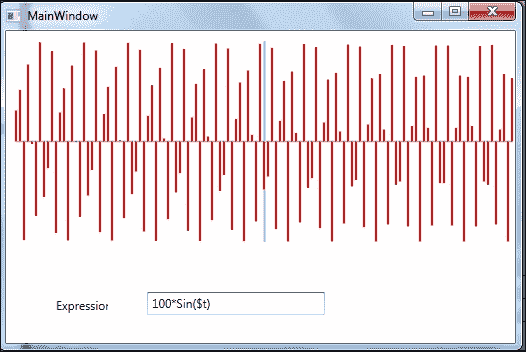
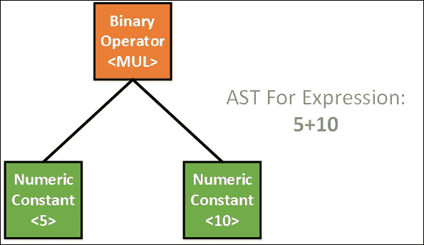
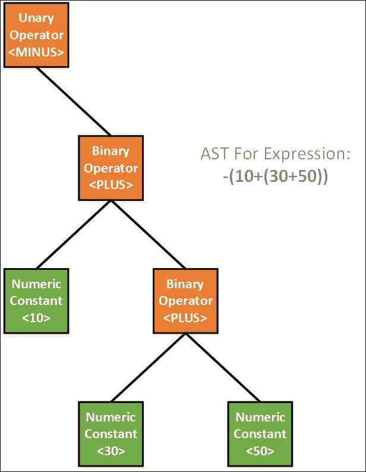
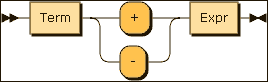
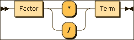
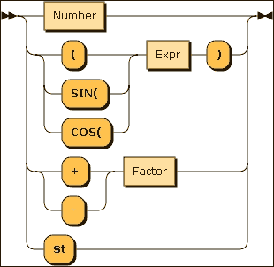

# 第六章. 绘制数学表达式

在本章中，我们将创建一个应用程序，该程序将在基于**Windows Presentation Foundation**（**WPF**）的图形表面上绘制任意数学表达式。我们将使用 GoF 观察者模式来连接表达式输入控制和渲染表面。在这个过程中，我们将开发一个库，该库可以即时评估任意算术表达式。表达式评估器将支持基本的算术运算符（`+`、`-`、`*`、`/`、一元`+`/`-`），三角函数，以及一个伪变量（`$t`），它可以表示二维平面中 X 轴的值。在本章的整个过程中，作为读者，你将学习以下内容：

+   观察者模式

+   使用递归下降解析数学表达式

+   将**抽象语法树**（**AST**）建模为组合

+   解释器模式

+   构建者模式

+   基础 WPF 2D 图形

# 表达式库和应用程序的要求

在我们开始编写库之前，让我们草拟一个初步的需求声明，如下所示：

能够绘制任意数学表达式的结果是商业应用程序的常见要求。我们需要解析表达式以评估结果树形表示。词法分析、解析、建模表达式节点、递归评估等过程应该对应用程序程序员是透明的。库应支持一些三角函数和一个变量（`$t`），以传递图形表面的当前 X 坐标信息。应用程序应评估传递给表达式评估引擎的每个 X 坐标值的 Y 坐标值。

# 解决方案方法

我们将需求分为以下两个部分：

+   一个用于评估任意数学表达式的库

+   一个将消耗上述库以绘制数据的程序

表达式评估库的要求可以列举如下：

+   将表达式建模为 AST

+   编写词法分析器

+   编写递归下降解析器

+   树的深度优先遍历

+   支持三角函数和伪变量（`$`）

+   将一切打包为基于外观模式的 API

应用程序的要求可以列举如下：

+   一个带有 WPF 2D 图形表面的屏幕

+   输入表达式的提示

+   实现用于检测新绘图请求的观察者

+   将值传递给表达式库以改变 X 坐标值

+   渲染结果值

# 图形绘制应用程序

图形绘制应用程序是一个简单的 WPF 应用程序，其中包含一个画布和一个文本框。以下图像显示了屏幕渲染表达式结果后的快照：



当表达式文本框中的表达式发生变化时，WPF 画布会收到通知。如果文本框中的表达式有效，图表将如图所示绘制。我们将在以下章节中处理实现表达式评估引擎的细微差别。以下代码片段显示了如何处理文本的变化：

```cs
    public override void  
    Observer_ExpressionChangedEvent( string expression) 
    { 
      MainWindow mw = this._ctrl as MainWindow; 
      mw.Expr = expression; 
      ExpressionBuilder builder = new  
      ExpressionBuilder(expression); 
      Exp expr_tree = builder.GetExpression(); 

      if ( expr_tree != null ) 
      mw.Render(); 
    } 

```

# UI 事件的观察者模式

我们将使用 GoF 观察者模式自动处理 UI 事件。当文本框中的表达式发生变化时，窗口应该收到有关此变化的通知，如果表达式有效，结果表达式将在屏幕上渲染。

### 注意

在实现观察者模式时，我们有两个类——`Subject` 类，它表示事件源，以及 `Observer` 类，它是一系列观察者（对监听事件感兴趣的观察者）。每当文本发生变化时，代表事件源的 `Subject` 类将向所有已订阅事件的接收者发送通知。

我们已经提到，在观察者模式的情况下，我们在事件源和事件接收者之间进行通信。事件源用 `Subject` 类表示，事件接收者用 `Observer` 类表示。让我们分析 `Observer` 类的实现：

```cs
    public abstract class BaseObserver 
    { 
      protected delegate void 
      ExpressionEventHandler(string expression); 
      protected ExpressionEventHandler ExpressionChangedEvent; 
      protected Control _ctrl = null; 
      public abstract void Observer_ExpressionChangedEvent(string     
      expression);
```

我们声明一个委托，它将充当事件处理器，为了使类处理所有 WPF 控件，我们将事件订阅者标记为 WPF 控件。具体的类可以持有从 `Control` 派生的任何对象：

```cs
    public BaseObserver(Control ctrl) 
    { 
      this.ExpressionChangedEvent +=  
      new ExpressionEventHandler( 
      Observer_ExpressionChangedEvent); 
      this._ctrl = ctrl; 
    } 

```

在构造函数中，我们使用抽象方法的地址初始化委托。这将自动将其连接到具体类的该方法实现。实际上，我们正在使用 GoF 模板方法模式来实现观察者。具体类必须实现 `Observer_ExpressionChangedEvent` 方法：

```cs
    private void OnChange(string expression) 
    { 
      if (ExpressionChangedEvent != null) 
      ExpressionChangedEvent(expression); 
    } 
    public void Update(string expression) 
    { 
      OnChange(expression); 
    } 
  } 

```

现在，我们将尝试编写 `Subject` 类，它充当事件源。`Subject` 类将遍历观察者列表以分发观察者感兴趣的事件。表达式文本框的任何变化都将传递给窗口对象，该对象充当事件的接收者：

```cs
    public class Subject 
    { 
      List<BaseObserver> observers = new List<BaseObserver>(); 
      private delegate void NotifyHandler(string expression); 
      private event NotifyHandler NotifyEvent; 

      public Subject(){ 
        this.NotifyEvent += new NotifyHandler(Notify); 
      } 

      public void UpdateClient(string expression){ 
        OnNotify(expression); 
      } 

      private void OnNotify(string expression){ 
        if (NotifyEvent != null) 
        NotifyEvent(expression); 
      } 

      private void Notify(string expression){ 
        foreach (BaseObserver b in observers) 
        b.Update(expression); 
      } 

      public void RegisterClient(BaseObserver obs){ 
        observers.Add(obs); 
      } 
    } 

```

在前一个代码片段中给出的 `BaseObserver` 类是一个抽象类，我们需要创建一个具体的类来实现 `Observer_ExpressionChangedEvent`。具体的实现列表如下：

```cs
    class ExpressionObserver : BaseObserver 
    { 
      public ExpressionObserver(Window _win) : 
      base(_win){ } 

      public override void  
      Observer_ExpressionChangedEvent(string expression) 
      { 
        MainWindow mw = this._ctrl as MainWindow; 
        mw.Expr = expression; 
        ExpressionBuilder builder = new  
        ExpressionBuilder(expression); 
        Exp expr_tree = builder.GetExpression(); 

        if ( expr_tree != null ) 
          mw.Render(); 
      } 
    } 

```

让我们看看我们如何连接 `Subject` 和 `Observer` 类。参见与此书相关的源代码中的 `MainWindow.cs` 模块。以下是一段代码的示例：

```cs
    _observer = new ExpressionObserver(this); 
    _subject = new Subject(); 
    _subject.RegisterClient(_observer); 

```

当文本发生变化时，渲染例程将被通知。渲染例程使用 WPF 2D 图形变换来绘制方程式：

```cs
    private void text_changed(object sender, TextChangedEventArgs e) 
    { 
      if ( _subject != null ) 
      _subject.UpdateClient(this.ExprText.Text); 
    } 

```

# 表达式评估器和解释器模式

本书作者认为，任何值得尊敬的程序员都需要学习编译构造的基础知识，以便在其工作中实现微型语言或**领域特定语言**（**DSL**）。编译器将表达式视为数据，而表达式在本质上大多是分层的。我们使用一种称为抽象语法树（AST）的数据结构来表示表达式树的节点。要将文本表达式转换为 AST，我们需要编写一个解析器来分析表达式的组成部分。向解析器提供数据的子系统是一个名为词法分析器的模块，它将输入流分解成一系列标记。

GoF 目录将微型语言的定义及其评估器的编写视为解释器模式。

在软件设计中，解释器模式是一种设计模式，它指定了如何在（微型）语言中评估句子。基本思想是为专用计算机语言中的每个符号（终结符或非终结符）创建一个类。在我们的情况下，我们使用一个带有双精度浮点数、符号变量（`$t`）、三角函数（正弦/余弦）和基本算术运算符的微型语言。该语言的句子语法树是组合模式的实例，用于评估（解释）客户端的句子。我们处理的一些表达式包括`2*3 + SIN($t)*2`、`$t*100`、`COS((3.14159/2) - $t)`等。

# 抽象语法树 (AST)

在计算机科学中，AST（或简称语法树）是源代码抽象（简化）语法结构的树形表示。树中的每个节点表示正在考虑的编程语言的构造。在我们的表达式评估器中，节点是数值（IEEE 754 浮点数）、二元运算符、一元运算符、三角函数和一个变量。

语法在抽象意义上并不代表真实语法中出现的每个细节。例如，分组括号在树结构中是隐含的，AST 数据结构忽略了括号。在我们建模 AST 之前，让我们看看一些表达式及其 AST 表示：

```cs
    // AST for 5*10 
    Exp e = new BinaryExp( 
    new NumericConstant(5), 
    new NumericConstant(10), 
    OPERATOR.MUL); 

```



上述示例使用了两种节点类型，即`NumericConstant`和`BinaryExp`。即使是最简单的表达式也会创建一个看似有些复杂的结构。

让我们看看一个包含一元运算符的表达式：

```cs
    // AST for -(10+(30+50)) 
    Exp e = new UnaryExp( 
      new BinaryExp( 
        new NumericConstant(10), 
        new BinaryExp( 
          new NumericConstant(30), 
          new NumericConstant(50), 
        OPERATOR.PLUS), 
      OPERATOR.PLUS) 
    ,OPERATOR.MINUS); 

```



由于我们的表达式评估器只支持一个变量，我们创建了一个上下文类，该类将存储相关的变量。该类名为`RUNTIME_CONTEXT`，整个列表如下所示：

```cs
    public class RUNTIME_CONTEXT 
    { 
      private double _t = 0 ; 
      public RUNTIME_CONTEXT(){ } 
      public double T { 
        get { return _t; } 
        set { _t = value; } 
      } 
    } 

```

在任何编程语言中，表达式是你评估其值的内容。这可以建模为一个抽象类。我们支持的数值类型是 IEEE 754 双精度浮点数：

```cs
    abstract class Exp{ 
      public abstract double Evaluate(RUNTIME_CONTEXT cont);
    } 

```

表达式评估器支持像 `PLUS` (+), `MINUS` (-), `DIV` (/), 和 `MUL` (*) 这样的运算符。它们使用名为 `OPERATOR` 的枚举类型进行建模：

```cs
    public enum OPERATOR{ 
      ILLEGAL = -1,PLUS, MINUS, DIV, MUL 
    } 

```

我们将首先创建一个节点层次结构来模拟表达式。我们使用组合模式将较大的表达式从较小的表达式组合出来：

```cs
    class Exp // Base class for Expression 
    class NumericConstant // Numeric Value 
    class BinaryExp // Binary Expression 
    class UnaryExp // Unary Expression 
    class SineExp // Trig fn 
    class SineExp // Trig 
    class Var // psuedo variable $t 

```

`NumericConstant` 类可以在其中存储 IEEE 754 双精度浮点值。这是 AST 中的一个叶节点：

```cs
    public class NumericConstant : Exp 
    { 
      private double _value; 
      public NumericConstant(double value){ _value = value;} 

      public override double Evaluate(RUNTIME_CONTEXT cont) 
      { return _value;} 
    } 

```

`BinaryExp` 类模拟一个二元表达式，它接受两个表达式（`ex1` 用于左节点和 `ex2` 用于右节点），在评估例程中对两个值（左侧值和右侧值）应用运算符：

```cs
    public class BinaryExp : Exp 
    { 
      private Exp _ex1, _ex2; 
      private OPERATOR _op; 

      public BinaryExp(Exp a, Exp b, OPERATOR op) 
      { _ex1 = a; _ex2 = b; _op = op; } 

      public override double Evaluate(RUNTIME_CONTEXT cont) 
      { 
        switch (_op) 
        { 
          case OPERATOR.PLUS: 
            return _ex1.Evaluate(cont) + _ex2.Evaluate(cont); 
          case OPERATOR.MINUS: 
            return _ex1.Evaluate(cont) - _ex2.Evaluate(cont); 
          case OPERATOR.DIV: 
            return _ex1.Evaluate(cont) / _ex2.Evaluate(cont); 
          case OPERATOR.MUL: 
            return _ex1.Evaluate(cont) * _ex2.Evaluate(cont); 
        } 
        return Double.NaN; 
      } 
    } 

```

在一元表达式的情形下，我们取一个运算符和一个 `Exp` 节点作为子节点：

```cs
    public class UnaryExp : Exp 
    { 
      private Exp _ex1; 
      private OPERATOR _op; 
      public UnaryExp(Exp a, OPERATOR op) 
      {_ex1 = a;_op = op } 
      public override double Evaluate(RUNTIME_CONTEXT cont) 
      { 
        switch (_op) 
        { 
          case OPERATOR.PLUS: 
          return _ex1.Evaluate(cont); 
          case OPERATOR.MINUS: 
          return -_ex1.Evaluate(cont); 
        } 
        return Double.NaN; 
      } 
    } 

```

正弦节点接受一个表达式作为子节点。我们评估 `_ex1`，并在结果值上调用 `Math.Sin`：

```cs
    class SineExp : Exp 
    { 
      private Exp _ex1; 
      public SineExp(Exp a) 
      { _ex1 = a; } 
      public override double Evaluate(RUNTIME_CONTEXT cont){ 
        double val = _ex1.Evaluate(cont); 
        return Math.Sin(val); 
      } 
    } 

```

余弦节点接受一个表达式作为子节点。我们评估 `_ex1`，并在结果值上调用 `Math.Cos`：

```cs
    class CosExp : Exp 
    { 
      private Exp _ex1; 
      public CosExp(Exp a) 
      { _ex1 = a;} 
      public override double Evaluate(RUNTIME_CONTEXT cont){ 
        double val = _ex1.Evaluate(cont); 
        return Math.Cos(val); 
      } 
    } 

```

最后，变量（`$t`）被建模如下：

```cs
    class Var : Exp 
    { 
      public Var(){} 
      public override double Evaluate(RUNTIME_CONTEXT cont){ 
        return cont.T; 
      } 
    } 

```

# 表达式语法

**巴科斯-诺尔范式**（**BNF**）符号用于指定编程语言的语法。可以从书籍中学习 BNF 的语义，并且有大量的资料可用。我们使用的表达式评估器的语法如下：

```cs
    <Expr> ::= <Term> | Term { + | - } <Expr> 
    <Term> ::= <Factor> | <Factor> {*|/} <Term> 
    <Factor>::= <number> | ( <expr> ) | {+|-} <factor> |  
                SIN(<expr>) | COS(<expr>) | $t 

```

这种巴科斯-诺尔范式（BNF）可以很容易地转换为源代码。

# 词法分析

词法分析器将字符分组为标记，包括 `'+'`, `'-'`, `'/'`, `'*'`, `SIN`, `COS` 等。在这个过程中，当模块被请求时，它会向解析器提供模块。解析器不是对整个输入进行词法扫描，而是从词法分析器请求下一个标记。在我们的表达式评估器中，以下标记是由词法分析器在解析器请求下一个标记时返回的：

```cs
    public enum TOKEN 
    { 
      ILLEGAL_TOKEN = -1, // Not a Token 
      TOK_PLUS = 1, // '+' 
      TOK_MUL, // '*' 
      TOK_DIV, // '/' 
      TOK_SUB, // '-' 
      TOK_OPAREN, // '(' 
      TOK_CPAREN, // ')' 
      TOK_DOUBLE, // '(' 
      TOK_TPARAM, // $t 
      TOK_SIN, // SIN 
      TOK_COS, // COS 
      TOK_NULL // End of string 
    } 

```

词法分析器模块扫描输入，每当它找到一个标记（合法或不合法）时，它会保存当前输入指针并返回下一个标记。由于列表很长且代码很平凡，它被作为代码仓库的一部分给出。以下伪代码显示了词法分析器的架构：

```cs
    while (<there is input>)  
    { 
      switch(currentchar) { 
        case Operands: 
          <advance input pointer> 
          return TOK_XXXX; 
        case '$': 
          <Now Look for 't'> 
          if found return TOK_TPARAM 
            else Error 
        case Number: 
          <Extract the number(Advance the input)> 
          return TOK_DOUBLE; 
        case 'S' or 'C': 
          <Try to see whether it is SIN/COS> 
          Advance the input 
          return TOK_SIN Or TOK_COS 
        default: 
          Error 
      } 
    } 

```

# 解析器模块

通过使用递归下降解析，我们将安排标记以查看表达式是否有效，并在词法分析器的帮助下从输入流中生成 AST：

递归下降解析器是由一组相互递归的过程构建的从上到下的解析器，其中每个这样的过程通常实现语法规则中的一个。因此，生成的程序的结构与它所识别的语法紧密对应：

```cs
    public class RDParser : Lexer 
    { 
      TOKEN Current_Token; 
      public RDParser(String str): base(str){} 

      public Exp CallExpr() 
      { 
        Current_Token = GetToken(); 
        return Expr(); 
      } 

```

`RDParser`类的构造函数接受表达式字符串作为参数，并将其传递给`Lexer`类。每当解析器需要标记时，它都会通过`GetToken()`方法请求`Lexer`类提供一个标记。整个解析过程从`CallExpr()`方法开始，并在其中，解析器通过`Lexer`类获取一个标记：

```cs
    //Implementation of <Expr> ::= <Term> | Term { + | - } <Expr>  
    Grammar 
    public Exp Expr() 
    { 
      TOKEN l_token; 
      Exp RetValue = Term(); 
      while (Current_Token == TOKEN.TOK_PLUS ||  
      Current_Token == TOKEN.TOK_SUB) 
      { 
        l_token = Current_Token; 
        Current_Token = GetToken(); 
        Exp e1 = Expr(); 
        RetValue = new BinaryExp(RetValue, e1, 
        l_token == TOKEN.TOK_PLUS ?  
        OPERATOR.PLUS : OPERATOR.MINUS); 
      } 
      return RetValue; 
    } 

```

`Expr()`函数向下传递到`Term()`函数（如下所示），并从那里返回子表达式。只要存在进一步相同优先级的运算符，它就会递归地调用`Expr()`方法以检索以树的形式表示的因子。创建一个`BinaryExp`节点来表示到目前为止解析的子表达式：

```cs
    //Implementation of <Term> ::= <Factor> | <Factor> {*|/} <Term>     
    Grammar 
    public Exp Term() 
    { 
      TOKEN l_token; 
      Exp RetValue = Factor(); 
      while (Current_Token == TOKEN.TOK_MUL ||  
      Current_Token == TOKEN.TOK_DIV) 
      { 
        l_token = Current_Token; 
        Current_Token = GetToken(); 
        Exp e1 = Term(); 
        RetValue = new BinaryExp(RetValue, e1, 
        l_token == TOKEN.TOK_MUL ?  
        OPERATOR.MUL : OPERATOR.DIV);  
      } 
      return RetValue; 
    } 

```

该术语向下传递到`Factor()`方法（如下所示），以检索一个节点（该节点可以是括号内的表达式本身），只要存在相同优先级的运算符，它就会递归地调用自身以生成相同类型的项：

```cs
    //Implementation of <Factor>::= <number> | ( <expr> ) | {+|-}   
    <factor> |  
    //SIN(<expr>) | COS(<expr>) | $t Grammar 
    public Exp Factor() 
    { 
      TOKEN l_token; 
      Exp RetValue = null; 

      if (Current_Token == TOKEN.TOK_DOUBLE) 
      { 
        RetValue = new NumericConstant(GetNumber()); 
        Current_Token = GetToken(); 
      } 

```

如果解析器返回一个数字，因子创建一个数字节点并返回相同的值：

```cs
    else if (Current_Token == TOKEN.TOK_TPARAM) 
    { 
      RetValue = new Var(); 
      Current_Token = GetToken(); 
    } 

```

如果当前标记是`$t`，因子方法将返回一个`Var`节点。在实例化`Var`对象后，解析器在返回表达式对象实例之前获取下一个标记：

```cs
    else if ( Current_Token == TOKEN.TOK_SIN || 
    Current_Token == TOKEN.TOK_COS) 
    { 
      TOKEN old = Current_Token; 
      Current_Token = GetToken(); 
      if (Current_Token != TOKEN.TOK_OPAREN) 
      { 
        Console.WriteLine("Illegal Token"); 
        throw new Exception(); 
      } 
      Current_Token = GetToken(); 
      RetValue = Expr();  // Recurse 

      if (Current_Token != TOKEN.TOK_CPAREN) 
      { 
        Console.WriteLine("Missing Closing Parenthesis\n"); 
        throw new Exception(); 
      } 

      Retvalue = (old == TOKEN.TOK_COS) ? 
      new CosExp(RetValue) : 
      new SineExp(RetValue); 
      Current_Token = GetToken(); 
    } 

```

如果当前标记是`SIN`或`COS`，我们将递归地调用`Expr()`来解析参数。一旦`Expr()`返回，我们就创建相应的节点：

```cs
    else if (Current_Token == TOKEN.TOK_OPAREN)  
    { 
      Current_Token = GetToken(); 
      RetValue = Expr();  // Recurse 
      if (Current_Token != TOKEN.TOK_CPAREN) 
      { 
        Console.WriteLine("Missing Closing Parenthesis\n"); 
        throw new Exception(); 
      } 
      Current_Token = GetToken(); 
    } 

```

如果我们找到一个开括号，`Expr()`的调用将用于解析嵌套表达式：

```cs
    else if (Current_Token == TOKEN.TOK_PLUS ||  
    Current_Token == TOKEN.TOK_SUB) 
    { 
      l_token = Current_Token; 
      Current_Token = GetToken(); 
      RetValue = Factor(); // Recurse 
      RetValue = new UnaryExp(RetValue, 
      l_token == TOKEN.TOK_PLUS ?  
      OPERATOR.PLUS : OPERATOR.MINUS); 
    } 
    else 
    { 
      Console.WriteLine("Illegal Token"); 
      throw new Exception(); 
    } 
    return RetValue; 
  } 
} 

```

前面的代码片段处理一元运算符，如果当前标记是任何不应该出现的东西，将抛出错误。下面显示了实现的语法的语法图（也称为铁路图）：

**表达式**用以下语法图表示。BNF 语法提供了更好的清晰度：

```cs
    <Expr> ::= <Term> | Term { + | - } <Expr> 

```



下面的语法图表示了**Term**。为了更好的清晰度，显示了 BNF 语法：

```cs
    <Term> ::= <Factor> | <Factor> {*|/} <Term> 

```



**因子**可以用以下铁路图表示。为了清晰起见，也显示了 BNF 语法：

```cs
    <Factor>::= <number> | ( <expr> ) | {+|-} <factor> | SIN(<expr>) |  
    COS(<expr>) | $t
```



# 构建器、外观和表达式 API

解释表达式的过程是一个复杂的过程，其中许多类共同协作以实现目标。作为一个应用开发者，为了专注于手头的任务，我们可能需要公开一个 API，该 API 抽象掉了词法分析、解析和 AST 生成的复杂性。在这些情况下，我们通常使用 GoF 的外观模式。但是，在这里我们将使用 GoF 的构建器模式，因为这种创建型模式在需要创建复合对象的情况下更为合适。在这里，我们创建的表达式被建模为复合对象：

```cs
    public class AbstractBuilder{} 

    public class ExpressionBuilder : AbstractBuilder 
    { 
      public string _expr_string; 
      public ExpressionBuilder(string expr) 
      { _expr_string = expr; } 

      public Exp GetExpression() 
      { 
        try 
        { 
          RDParser p = new RDParser(_expr_string); 
          return p.CallExpr(); 
        } 
        catch (Exception) 
        { 
          return null; 
        } 
      } 
    } 

```

`GetExpression()`方法利用递归下降解析和词法分析来创建由 AST 节点组成的`Exp`对象。如果解析失败，该例程将返回 null。`Builder`类将被用来解析从其文本表示形式中的表达式：

```cs
    double t = -x / 2; 
    double final = x / 2; 
    ExpressionBuilder bld = new ExpressionBuilder(expr); 
    Exp e = bld.GetExpression(); 
    if (e == null) 
      return false; 

```

### 注意

我们解析树一次以创建 AST。一旦 AST 被创建，我们就可以通过更改`RUNTIME_CONTEXT`对象中的值多次评估生成的 AST。

```cs

    RUNTIME_CONTEXT context = new RUNTIME_CONTEXT(); 
    context.T = t; 
    for (; t < final; t += 4) 
    { 
      context.T=t; 
      double n = e.Evaluate(context); 
      RenderAPixel(); 
    }
```

表达式只解析一次，并从中创建 AST。一旦创建了树，就可以通过更改`context`对象来评估它。在前面的循环中，`t`被更新并设置为`context`对象。每次评估树时，都是针对不同的`t`值进行评估。

# 摘要

在本章中，我们创建了一个应用程序，该程序在图形表面上绘制任意数学表达式的结果。我们使用 WPF 作为我们的渲染目的。我们还创建了一个表达式评估库，它使用递归下降解析技术将表达式解析为称为 AST 的数据结构。AST 可以通过深度优先遍历来评估其值。这是一个解释器模式的良好示例。我们使用了观察者模式来自动将表达式输入的变化传递到画布对象。在下一章中，你将学习.NET 框架库如何利用模式为开发者提供一个良好的 API。
