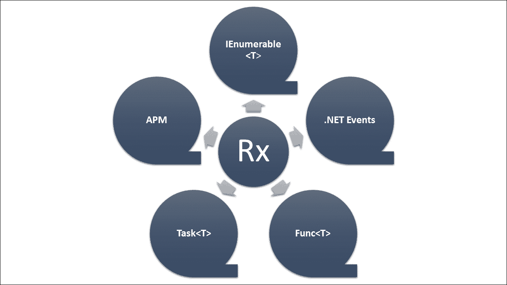
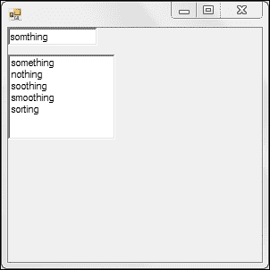
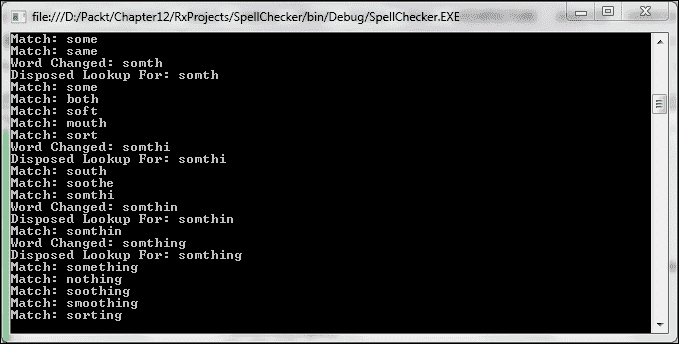
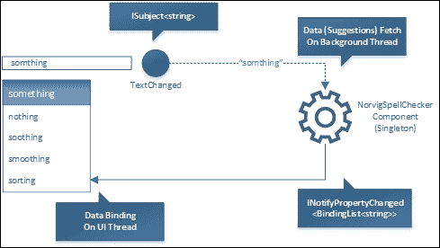
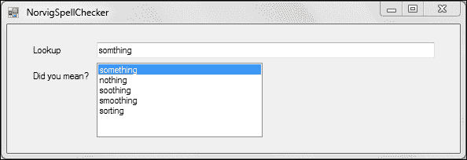
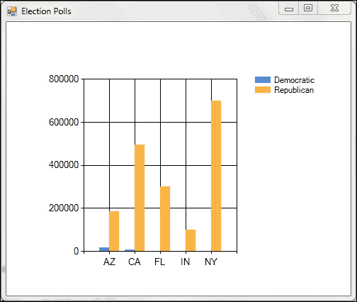

# 第十二章. 使用.NET Rx 扩展进行反应式编程

在上一章中，我们看到了反应式编程如何让你为可扩展性和响应性做好准备。我们看到了这两个属性如何在支持事件驱动的应用程序中得到支持，这些应用程序能够迅速响应事件、失败和负载。

现在本章我们将：

+   深入研究 Reactive Extensions (Rx)库，看看我们如何使用可观察序列和 LINQ 查询运算符编写异步和事件驱动程序。

+   我们还将详细探讨一些示例用例及其使用 Rx 的实现，以便清楚地了解如何在.NET 框架中利用 Observables、LINQ 和调度器来创建可以处理异步数据流的并发和响应式应用程序。

到本章结束时，你将理解为什么 Rx 被吹捧为下一个大事件，并且将成为事实上的事件驱动编程模型，在各种主流编程语言中获得势头和认可。

# 流作为生活方式

正如你在上一章中看到的，反应式程序的基本成功在于将事件转换为不可变和可观察的流。使用这种格式，程序组合变得非常简单直观，你可以使用.NET Rx 扩展来创建统一的接口。

### 注意

理解这一点非常重要，因为像 Rx 这样的工具并不能让你变成雷神索尔。你并不一定把每个实现都看作是钉子，然后用力敲打。正如本叔叔曾经劝告彼得，也就是蜘蛛侠：“能力越大，责任越大”。

通过查看可用的选项集，我们可以更深入地理解这一点，并做出明智的决定。考虑以下图像：



正如前图所示，在统一世界方面，Rx 提供了桥梁，帮助你在这类编程模型之间无缝工作。为了快速回顾我们在第十一章（第十一章. 什么是反应式编程？）中阅读的内容，请查看以下表格：

| **工厂方法** | **展开方法** | **桥梁** |
| --- | --- | --- |

|

+   `Observable.Return`

+   `Observable.Empty`

+   `Observable.Never`

+   `Observable.Throw`

+   `Observable.Create`

|

+   `Observable.Range`

+   `Observable.Interval`

+   `Observable.Timer`

+   `Observable.Generate`

|

+   `Observable.Start`

+   `Observable.FromEventPattern`

+   `Task.ToObservable`

+   `Task<T>.ToObservable`

+   `IEnumerable<T>.ToObservable`

+   `Observable.FromAsyncPattern`

|

如前所述，我们并不取代现有的异步性。.NET 事件、异步方法、任务等都有它们的使用，并且在自己的世界中是完美的。

Rx 只是将这些世界统一起来的粘合剂，提供了组合性，并帮助建立桥梁。

现在，让我们开始一些示例，这些示例将帮助我们理解如何在日常编程中最佳地使用 Rx。仅突出显示了一些实用方面，利用 Rx 中的关键结构，因为完整的覆盖范围需要另一本同样大小的书。

# 使用事件组合的拼写检查器

这个第一个示例是一个 Windows 应用程序，它集成了之前实现的拼写检查器（来自第九章，*更好的状态管理功能编程技术*），并使用 Rx 探索了如何利用它来建议替代方案和更正。考虑以下代码片段：

```cs
    static void Main() 
    { 
        ObservableEventsDemo(); 
    }  

```

从这里初始化您的输入，包括我们需要的某些基本控件，即一个文本框（用于关键字搜索）和一个列表框，它为给定关键字提供建议/更正。看看以下代码片段：

```cs
    static void ObservableEventsDemo()
    {  
       // Input form

      var txtBoxSpellCorrect = new TextBox(); 
      var lstBoxSuggestions = new ListBox {
        Top = txtBoxSpellCorrect.Height + 10 }; 
      var frmSpellChecker = new Form { Controls = { txtBoxSpellCorrect,
        lstBoxSuggestions } }; 

```

现在，我们需要创建一个`DispatcherScheduler`，它将在当前 UI 线程的调度器上安排工作单元。创建了一个名为`onInputChange`的委托，用于在输入关键字更改时清除列表框中的建议。考虑以下代码片段：

```cs
    // Dispatcher scheduler for the UI thread

    var _dispatcher = new DispatcherScheduler(
      System.Windows.Threading.Dispatcher.CurrentDispatcher); 

    Action<string> onInputChange = word => 
    { 
        lstBoxSuggestions.Items.Clear(); 
        Console.WriteLine("Word Changed: " + word); 
    }; 

```

我们将在输入上定义一个可观察流/序列，通过订阅文本框的`TextChanged`事件使用`FromEventPattern`桥接器。我们还将根据最小字符数（在这个例子中是三个）和唯一条目（有助于降低查找频率）进一步过滤输入流。从该输入序列的有效输出将触发委托，清除列表框内容并使其准备好接收新的一组建议，当它们可用时。考虑以下代码片段：

```cs
    var input = Observable 
      .FromEventPattern(txtBoxSpellCorrect, "TextChanged") 
      .Select(evt => ((TextBox)evt.Sender).Text) 
      .Timestamp().Select(evt => evt.Value) 
      .Where(evt => evt.Length > 3) 
      .DistinctUntilChanged() 
      .Do(onInputChange); 

```

这定义了第二个可观察序列，它根据我们在前面代码中定义的第一个序列（关键字）获取建议：

```cs
    Func<string, IObservable<string>> matches =
      searchText => NorvigSpellCheckerModel.
        Instance.SpellCheck(searchText, 5).ToObservable<string>(); 

```

这是一个重要的步骤，我们声明性地指定继续获取建议，直到关键字更改（对我们来说，这是第一个可观察序列）。如果您注意到，这里使用的是`TakeUntil`运算符：

```cs
    var result = from term in input 
      from words in matches(term)
      .TakeUntil(input)
      .Finally(() => 
      { 
         Console.WriteLine("Disposed Lookup For: " + term); 
      }) 
     select words; 

```

然后，我们将为`Subscribe`方法定义委托（`onEachSuggest`、`onSuggestError`和`onSuggestComplete`），以接收基于推送的通知，如以下代码片段所示（`onEachSuggest`倾向于在收到建议时将其添加到列表框）：

```cs
    Action<string> OnEachSuggest = word => 
    { 
        lstBoxSuggestions.Items.Add(word); 
        Console.WriteLine("Match: " + word); 
    }; 

    Action<Exception> OnSuggestError = ex => 
    { 
        Console.WriteLine("Error: " + ex.Message); 
    }; 

    Action OnSuggestComplete = () => 
    { 
        lstBoxSuggestions.Items.Clear(); 
        Console.WriteLine("Suggestion Complete!!!"); 
    };  

```

这是最后一步，我们将指定在 UI 线程的调度器上观察（对于您来说，进行必要的 UI 更新是绝对关键的）并订阅默认任务调度程序实例（Rx 将根据最小并发原则为您选择一个）。考虑以下代码片段：

```cs
    using (result.OnErrorResumeNext(
      Observable.Empty<string>()) 
      .ObserveOn(_dispatcher) 
      .SubscribeOn(Scheduler.Default) 
      .Subscribe(
 OnEachSuggest,
          OnSuggestError, 
          OnSuggestComplete))                 
    Application.Run(frmSpellChecker); 
    }

```

让我们快速查看支持模型代码（将早期的`NorvigSpellChecker`代码重构为单例并实现`ISpellCheckerModel`接口）。此接口有助于将结果作为可枚举列表返回，这可以进一步转换为可观察序列。让我们看一下以下代码片段：

```cs
    public interface ISpellCheckerModel 
    { 
        IEnumerable<string> SpellCheck(string word, int count); 
    }  

```

这是第九章中的旧代码，*更好的状态管理功能编程技术*，基于 Peter Norvig 的帖子：[`norvig.com/spell-correct.html`](http://norvig.com/spell-correct.html)，修改为单例。考虑以下代码片段：

```cs
    public sealed class NorvigSpellCheckerModel : ISpellCheckerModel 
    { 
        private static readonly Lazy<NorvigSpellCheckerModel>
        spellCheckerInstance = new Lazy<NorvigSpellCheckerModel>(() => 
          new NorvigSpellCheckerModel()); 

        private NorvigSpellCheckerModel() 
        { 
            //......... USE CODE FROM CHAPTER 9 HERE 
        } 

        public static NorvigSpellCheckerModel Instance 
        { 
            get 
            { 
                return spellCheckerInstance.Value; 
            } 
        } 

        public IEnumerable<string> SpellCheck(string word, int count) 
        { 
            //......... USE CODE FROM CHAPTER 9 HERE 
        } 
    } 

```

这里需要注意的一些关键点是：

+   使用`FromEventPattern`桥接器订阅`TextChanged`事件

+   单例的经典用例（为了防止每次查找单词时重复创建训练模型语料库）以创建和缓存字典以供将来使用

+   值得一看的是利用.NET 4 的`Lazy<T>`类型实现线程安全、延迟实例化和不使用传统的双重检查锁定惯用语的 Singleton 实现

+   使用`Where`和`DistinctUntilChanged`运算符限制查找独特的四字母词及其以上

如下所示展示了我们的拼写检查器在实际操作中的截图：



支持控制台帮助您理解幕后操作的顺序，如下面的截图所示：



# MVVM on Rx

现在，让我们将前面的示例转换为如何将其应用于经典的 MVVM 实现。

### 注意

MVVM 是一个重要的应用程序开发框架，其根源与**Windows Presentation Framework**（**WPF**）有关。它最适合事件驱动编程，其中你实现了清晰的**关注点分离**，从而促进了并行开发（模型、视图和视图模型）和可测试性。



正如你在前面的解决方案模型中观察到的（无意中用了双关语），要查找的单词输入的文本框的`TextChanged`事件将指示这里的`ISubject<T>`类型，它实现了`IObservable<T>`和`IObserver<T>`接口，从而让你能够方便地观察和向订阅者发布项目。

确保您已通过**NuGet**包管理器安装了适当的依赖项/包，并且正确引用。这里考虑的包括以下内容：

+   `System.Reactive.Core`

+   `System.Reactive.Interfaces`

+   `System.Reactive.Linq`

+   `System.Reactive.PlatformServices`

+   `System.Reactive.Windows.Threading`

如下所示，这是视图层的代码。请注意（突出显示）与相应视图模型的数据绑定：

```cs
    public partial class frmSpellChecker : Form 
    { 
        private SpellCheckerViewModel _spellCheckerViewModel; 
        public frmSpellChecker() 
        { 
            InitializeComponent(); 
            _spellCheckerViewModel = new 
            SpellCheckerViewModel(NorvigSpellCheckerModel.Instance); 
            //Data Binding Is Done Here 
            lstBoxSuggestions.DataSource = 
              _spellCheckerViewModel.Corrections;         
        } 

        private void txtBoxSpellCorrect_TextChanged(
          object sender, EventArgs e) 
        {
           _spellCheckerViewModel.SearchChanges(((TextBox)sender).Text); 
        } 
    } 

```

正如你所见，创建了一个视图模型实例，并指定了模型（代码中引用的是之前示例中使用的相同实例）。文本更改通过`TextChanged`事件路由到视图模型中的主题。关于数据绑定，同步（针对建议列表框）通过视图模型（实现了`INotifyPropertyChanged`接口）的属性更改通知自动发生。数据源保留在视图模型中。现在让我们看看视图模型：

```cs
    class SpellCheckerViewModel : INotifyPropertyChanged 
    { 
        private BindingList<string> _corrections; 
        private ISpellCheckerModel _spellChecker; 
        private ISubject<string> _searchChanged; 
        private IScheduler _dispatcher; 
        public event PropertyChangedEventHandler PropertyChanged; 

    public BindingList<string> Corrections 
    { 
        get 
        { 
            return this._corrections; 
        } 

        set 
        { 
            if (value != this._corrections) 
            { 
                this._corrections = value; 
                NotifyPropertyChanged(); 
            } 
        } 
    } 

```

在这里，我们将使用`CallerMemberName`属性来避免将成员名称作为字符串参数传递给被调用方法：

```cs
 private void NotifyPropertyChanged([CallerMemberName]
    String propertyName = "") 
    { 
        if (PropertyChanged != null) 
        { 
            this.PropertyChanged(this, 
              new PropertyChangedEventArgs(propertyName)); 
        } 
    } 

    public void SearchChanges(string text) 
    { 
        _searchChanged.OnNext(text); 
    } 

    public ISubject<string> SearchChanged 
    { 
        get 
        { 
            return _searchChanged; 
        } 
    } 

    public SpellCheckerViewModel(ISpellCheckerModel spellChecker) 
    { 
        _spellChecker = spellChecker; 
        _dispatcher = new DispatcherScheduler(
          System.Windows.Threading.Dispatcher.CurrentDispatcher); 
        _corrections = new BindingList<string>(); 
        _searchChanged = new Subject<string>(); 
        Func<string, IObservable<string>> GetSuggestions = (searchText) => 
        { 
            IsProcessing = true; 
            Corrections.Clear(); 
            Error = null; 
            return _spellChecker.SpellCheck(searchText, 5)
              .ToObservable<string>(); 
        }; 

        var searches = this.SearchChanged.Select(GetSuggestions); 

```

现在，这一最终步骤在以下方面提供了必要的魔法：

+   提供序列中最新的更改（`Switch`运算符）

+   查找四个字母以上的单词的建议（`Where`运算符）

+   只有当输入的新值与旧值不同时才查找建议（`DistinctUntilChanged`运算符）

+   最后，使用调度器的任务/线程池在后台线程上查找，并在 UI 线程的调度器上返回建议。请看以下代码片段：

```cs
 searches.Switch() 
          .Where(s => s.Length > 3) 
           .DistinctUntilChanged() 
           .SubscribeOn(Scheduler.Default) 
           .ObserveOn(_dispatcher) 
           .Subscribe(OnEachSuggest, OnSuggestError, 
             OnSuggestComplete); 
        } 

        private void OnEachSuggest(string searchText) 
        { 
            Corrections.Add(searchText); 
        } 
    } 

```

这个视图模型清楚地展示了如何将可观察的、LINQ（`Where`和`DistinctUntilChanged`）和调度器用于实际应用。正如前面的代码所强调的，在后台线程上进行的查找让观察者，在这种情况下，数据源，即`BindingList<string>`，通过属性更改通知知道；从而触发`Suggestions`列表框中的自动内容刷新。另一个需要注意的事情是`SubscribeOn`/`ObserveOn`对的熟练使用，以防止阻塞 UI 线程，同时在该线程上更新 UI 对象。

这里有一些关键点需要注意：

+   使用`Switch`运算符，除了`Where`和`DistinctUntilChanged`运算符外，以确保在显示与序列相关的最新和相关信息方面的搜索活力。

+   这也将作为一个**收集管道**模式的例子，其中你的计算通过从一个操作中获取集合/序列并传递给另一个操作而成为一系列操作

它利用不可变性、列表解析（LINQ 中的声明性查询语法）、惰性和并行性来实现这一点。

这里展示了我们的拼写检查器正在工作的截图：



# 异步日志记录器

日志和审计跟踪是我们日常创建的应用程序中的一个重要横切或横向关注点。我们利用了各种第三方工具；并且在第三章“日志库”中深入探讨了如何自己编写一个。在这里，我们将看到如何赋予自定义日志组件反应性。

我们将使用前一个节中的相同拼写检查器示例，并查看如何将日志功能集成到现有的代码库中。

我们将首先初始化日志收集为`BindingList`，就像我们初始化更正/建议的方式一样：

```cs
    class SpellCheckerViewModel : INotifyPropertyChanged 
    { 
 private BindingList<string> _logs; 
 private ISubject<string> _logChanged; 
        public BindingList<string> Logs 
        { 
          get 
          { 
             return this._logs; 
          } 

          set 
          { 
             if (value != this._logs) 
             { 
                this._logs = value; 
                NotifyPropertyChanged(); 
             } 
           } 
        }   

```

以下`AddToLog`方法将是通用的日志方法，用于将日志文本传递给等待在`_logchanged`主题上的观察者。您可以在方法中看到用于适用性和清晰性的仪器代码，如下所示：

```cs
    public void AddToLog(string text) 
    { 
        _logChanged.OnNext(text); 
    } 

    public SpellCheckerViewModel(ISpellCheckerModel spellChecker) 
    { 
        _logs = new BindingList<string>();
        _logChanged = new Subject<string>(); 

        Func<string, IObservable<string>> GetSuggestions = (searchText) => 
        { 
            AddToLog(string.Format("Searching for 
              suggestions : {0}", searchText)); 
            return _spellChecker.SpellCheck(searchText, 5)
              .ToObservable<string>(); 
        }; 

        var searches = _searchChanged 
            .Select(GetSuggestions) 
            .Finally(() => AddToLog("Search DISPOSED!!!")); 
        searches 
            .Switch() 
            .Where(s => s.Length > 3) 
            .DistinctUntilChanged() 
            .SubscribeOn(Scheduler.Default) 
            .ObserveOn(_dispatcher) 
            .Subscribe(OnEachSuggest, OnSuggestError, OnSuggestComplete); 

 DoLogging(_logChanged); 
    } 

    private void OnEachSuggest(string searchText) 
    { 
        AddToLog(string.Format("Suggestion Added : {0}", searchText)); 
    } 

    private IObservable<string> GetSuggestions(string searchText) 
    { 
        AddToLog(string.Format("Searching for suggestions : 
          {0}", searchText)); 
    } 

    private void OnEachLog(string searchText) 
    { 
        Logs.Add(searchText); 
    } 

```

以下`DoLogging`方法设置观察者，在我们的案例中是`OnEachLog`方法，通过`AddToLog`方法的`onNext`方法调用从可观察的`_logChanged`监听日志文本序列/馈送，从而通过`_logchanged`主题促进发布和订阅：

```cs
    private void DoLogging(IObservable<string> sequence) 
    { 
        sequence 
        .SubscribeOn(ThreadPoolScheduler.Instance) 
        .ObserveOn(_dispatcher) 
        .Subscribe(OnEachLog); 
    } 
  } 

```

此绑定列表绑定到本例中专门用于查看日志的`Listbox`。此更改的属性进一步路由到 UI 线程，该线程检测我们案例中绑定数据源列表（针对列表框）的变化，并强制刷新。如果您仔细观察，日志功能完全是异步的，并由后台线程处理——在本例中是线程池中的工作线程。考虑以下代码片段：

```cs
    public frmSpellChecker() 
    { 
        //Data Binding Is Done Here 
        lstBoxSuggestions.DataSource = _spellCheckerViewModel.Corrections; 
        lstBoxLog.DataSource = _spellCheckerViewModel.Logs; 
    } 

```

您可以使用存储，例如文件、数据库等，进一步持久化日志。您也可以使用此方法清楚地了解从观察者和订阅者角度的数据流。修改后的应用程序将如下所示：


# 几乎实时可视化器/仪表板

仪表板是查看实时或接近实时数据的自然候选者。反应式结构可以非常有效地用于从报告的角度实现实用仪表板。让我们看看一个有趣的场景，即选举投票结果在实时基础上，随着来自不同州的投票馈送的到来而查看。这再次与实际的投票过程没有任何相似之处，但在这里以虚构的方式概念化，这将使学习并阐明利用反应式编程为这种报告应用程序的各种有趣可能性。考虑以下代码片段：

```cs
    public partial class Form1 : Form 
    { 
        public enum Party { Republican, Democratic }; 
        public enum States { AZ, CA, FL, IN, NY }; 
        string[] xState = { "AZ", "CA", "FL", "IN", "NY" }; 
        double[] yRVotes = { 0, 0, 0, 0, 0 }; 
        double[] yDVotes = { 0, 0, 0, 0, 0 }; 
        Random random = new Random(); 
        class Vote 
        { 
            public Party VoteId { get; set; } 
            public string State { get; set; } 
        } 

        public Form1() 
        { 
            InitializeComponent(); 
            chart1.Series.Clear(); 
            DrawSimulation(chart1); 
        } 

```

这是原型的第一阶段，我们开始构建数据序列/流（在我们的案例中是来自多个州的投票）的模拟模型。在这里，我们为每个州初始化一定数量的投票。如果您注意到了，这里使用了`Take`查询运算符：

```cs
    private void DrawSimulation(Chart chart1) 
    { 
        var azVotes = GenerateVotes<Vote>( 
          () => new Vote() { VoteId = CauchyDistribution(
            random.NextDouble()), State = "Arizona" }).Take(200000); 
        var caVotes = GenerateVotes<Vote>( 
          () => new Vote() { VoteId = CauchyDistribution(
            random.NextDouble()), State = "California" }).Take(500000); 
        var flVotes = GenerateVotes<Vote>( 
          () => new Vote() { VoteId = CauchyDistribution(
            random.NextDouble()), State = "Florida" }).Take(300000); 
        var inVotes = GenerateVotes<Vote>( 
          () => new Vote() { VoteId = CauchyDistribution(
            random.NextDouble()), State = "Indiana" }).Take(100000); 
        var nyVotes = GenerateVotes<Vote>( 
          () => new Vote() { VoteId = CauchyDistribution(
            random.NextDouble()), State = "New York" }).Take(700000);  

```

这是原型的下一阶段，我们将从模拟模型的流源中过滤民主党和共和党的投票，该流源在前面代码中生成：

```cs
        var azDVotes = from v in azVotes.ToObservable<Vote>() 
                   where v.VoteId == Party.Democratic 
                   select v; 
        var azRVotes = from v in azVotes.ToObservable<Vote>() 
                   where v.VoteId == Party.Republican 
                   select v; 
        var caDVotes = from v in caVotes.ToObservable<Vote>() 
                   where v.VoteId == Party.Democratic 
                   select v; 
        var caRVotes = from v in caVotes.ToObservable<Vote>() 
                   where v.VoteId == Party.Republican 
                   select v; 
        var flDVotes = from v in flVotes.ToObservable<Vote>() 
                   where v.VoteId == Party.Democratic 
                   select v; 
        var flRVotes = from v in flVotes.ToObservable<Vote>() 
                   where v.VoteId == Party.Republican 
                   select v; 
        var inDVotes = from v in inVotes.ToObservable<Vote>() 
                   where v.VoteId == Party.Democratic 
                   select v; 
        var inRVotes = from v in inVotes.ToObservable<Vote>() 
                   where v.VoteId == Party.Republican 
                   select v; 
        var nyDVotes = from v in nyVotes.ToObservable<Vote>() 
                   where v.VoteId == Party.Democratic 
                   select v; 
        var nyRVotes = from v in nyVotes.ToObservable<Vote>() 
                   where v.VoteId == Party.Republican 
                   select v; 

```

在这里，我们将初始化和创建图表组件所需的 X 轴和 Y 轴的数据系列。这样，系列就绑定到图表组件：

```cs
        Series democratic = new Series("Democratic"); 
        Series republican = new Series("Republican"); 
        chart1.Series.Add(democratic); 
        chart1.Series.Add(republican);              

```

这是启动模拟的阶段，即根据每个州生成指定的投票：

```cs
        GetDemocraticVotes(States.AZ, azDVotes); 
        GetRepublicanVotes(States.AZ, azRVotes); 
        GetDemocraticVotes(States.CA, caDVotes); 
        GetRepublicanVotes(States.CA, caRVotes); 
        GetDemocraticVotes(States.FL, flDVotes); 
        GetRepublicanVotes(States.FL, flRVotes); 
        GetDemocraticVotes(States.IN, inDVotes); 
        GetRepublicanVotes(States.IN, inRVotes); 
        GetDemocraticVotes(States.NY, nyDVotes); 
        GetRepublicanVotes(States.NY, nyRVotes); 
        } 

```

以下两个辅助方法，`GetDemocraticVotes` 和 `GetRepublicanVotes`，作为启动模拟的一部分，确保观察者（在这种情况下是下面的 lambda 函数）被绑定并监听投票开始流入时的变化。过滤后的投票被引导到这些相应的辅助方法，并将持续在近乎实时的基础上增加相应的投票计数器：

```cs
    private void GetDemocraticVotes(States state, IObservable<Vote> votes) 
    { 
        int stateIndex = (int)state; 
        votes.SubscribeOn(Scheduler.Default) 
          .ObserveOn(NewThreadScheduler.Default) 
            .Subscribe(v => 
            { 
                double voteCount = yDVotes[stateIndex]; 
                yDVotes[stateIndex] = voteCount + 1; 
            }); 
    } 

    private void GetRepublicanVotes(States state, IObservable<Vote> votes) 
    { 
        int stateIndex = (int)state; 
        votes.SubscribeOn(Scheduler.Default) 
          .ObserveOn(NewThreadScheduler.Default) 
             .Subscribe(v => 
             { 
                double voteCount = yRVotes[stateIndex]; 
                yRVotes[stateIndex] = voteCount + 1; 
             }); 
    } 

```

以下 `GenerateVotes` 方法是真正的投票生成器（无限，正如你所见），通过使用 Take 操作符指定的数字进行限制，正如前面代码所示。这个方法内部使用生成函数 `CauchyDistribution` 来随机且非均匀地生成投票：

```cs
    public IEnumerable<T> GenerateVotes<T>(Func<T> generator) 
    { 
        while (true) yield return generator(); 
    } 

    private Party CauchyDistribution(double p) 
    { 
        return Math.Tan(Math.PI * (p - 0.5)) >= 0 ? 
          Party.Democratic : Party.Republican; 
    } 

```

这个计时器控制有助于根据预设频率刷新图表控制，其值表示在考虑的各种状态下两个党派的得票数。现在，你需要理解的一个重要问题是，当你遍历订阅者和观察者的层级时，你倾向于引入延迟，这再次基于你为并发所采用的调度器类型，这使得最终输出接近实时，而不是实时，以避免引入任何可解释的主观性。应该努力减少这些层级，并通过多次试验和校准来选择正确的调度器，以最小化这些延迟并满足所需的 SLA。考虑以下代码片段：

```cs
    private void timer1_Tick(object sender, EventArgs e) 
    { 
        chart1.Series["Republican"].Points.DataBindXY(xState, yRVotes); 
        chart1.Series["Democratic"].Points.DataBindXY(xState, yDVotes); 
    } 
   } 
  } 

```

正如你所见，程序被分为多个阶段，具体如下：

+   **阶段 1**：模拟模型构建块

+   **阶段 2**：基于 `Party` 过滤投票

+   **阶段 3**：发布给订阅者

+   **阶段 4**：仪表板渲染器

近乎实时的仪表板将如下所示：



# 摘要

正如你所见，我们经历了一些有趣且实用的例子，这些例子说明了响应式编程原则的应用。目的是让你了解可能性，并为接下来的严肃编程任务做好准备。我们相信你现在能够欣赏这种范式，并且可能能够将其视为以声明方式表达解决方案模型的自然方式，这在以前需要大量的管道代码。在这个模型中，你获得的可组合性力量是非常明显的。现在，在下一章中，我们将继续探索 RxJS，这是一个响应式编程 JavaScript 库，它帮助你为网络编程做好准备。
