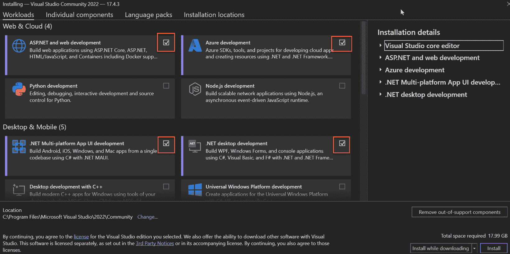
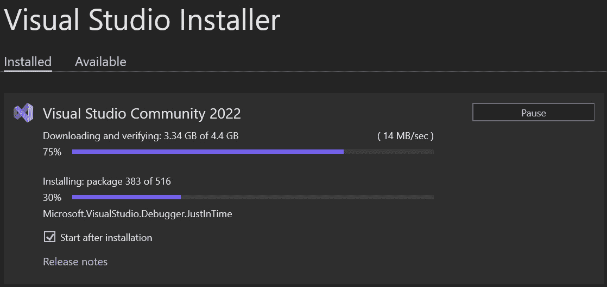
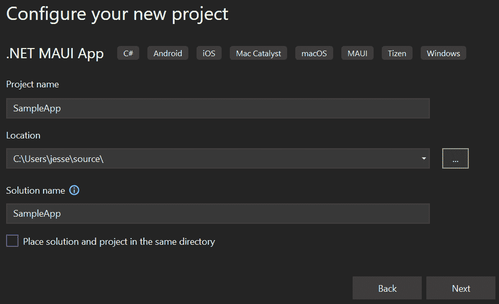
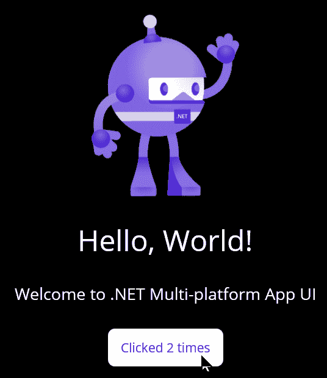
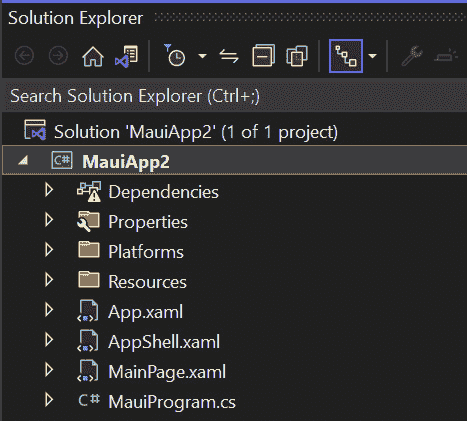

# 第一章：组装你的工具和创建你的第一个应用程序

在本书中，我们将使用一个共同的代码库构建 iOS、Android、Windows 和 Mac 应用程序。除非你想为 iOS 和 Mac 构建应用程序，在这种情况下你需要一台 Mac 电脑，否则你需要的一切都是免费的。我将假设你有一台 Mac，但如果你没有，变化非常小；你只是可以部署的平台更有限。

如果你没有 Mac 的替代方案

微软的 James Montemagno 有一个针对没有 Mac 的解决方案的视频。虽然存在严重的限制，但需求必须。我个人的建议是，如果你没有 Mac，请使用 Android 进行开发。以下是视频：[`www.youtube.com/watch?v=snQ1C6Cppr8`](https://www.youtube.com/watch?v=snQ1C6Cppr8)。

在接下来的章节中，你将看到我们将逐步构建的一个非平凡的 .NET MAUI 项目。在这个过程中，我们将检查如何使用 **XAML**（一种标记语言）和 **C#** 创建 **用户界面**（**UI**）。

MAUI Blazor

一种替代方案，本书未涉及，是使用 MAUI Blazor，它允许你利用 Blazor 技能创建跨平台应用程序。你可以在 [`bit.ly/MauiBlazor`](https://bit.ly/MauiBlazor) 了解更多关于 MAUI Blazor 的信息。

在本书的第一部分，我们将讨论 .NET MAUI 的主要架构：**模型-视图-视图模型**（**MVVM**）。然后我们将深入了解用于创建强大 UI 的各种控件，接着将有一章专门讨论如何在页面上布局这些控件。

我们将继续讨论 Shell 导航架构以及如何从一个页面移动到另一个页面，并在需要时传递数据。我们将查看数据持久化，然后停下来讨论测试代码这个至关重要的主题。

虽然 .NET MAUI 提供了丰富的控件，但有时你需要 Microsoft 没有预料到的东西，因此我们将专门用一章来创建自定义控件。（一旦你有了自定义控件，你就可以在后续的任何 .NET MAUI 项目中使用它。）

在本书的最后部分，我们将探讨消费 REST API 并创建用于移动和桌面应用程序的相同 REST API 的网络前端，这次使用 **Blazor**。

在本章中，你将学习如何获取和安装 Visual Studio 以编写程序，以及 Git 以管理和保护你的代码。每个章节的最终代码将位于一个专门的分支中，最终产品位于主分支。

在本章中，你将找到以下内容：

+   Visual Studio 的描述，以及安装说明

+   Git 的描述，以及安装说明

+   如何创建你的第一个、现成的程序，以及该项目文件的浏览

应用程序与应用程序的区别

由于我们将为 iOS 和 Android（指应用程序）以及 Windows 和 Mac（指应用程序）构建，我将交替使用这两个术语。

让我们获取所需的软件，并设置 Visual Studio。

# 技术要求

要跟随本章和本书的内容，您需要获取并安装 Visual Studio 和 Git。为此，您需要一个 Windows 机器（Windows 10 或更高版本）。此外，如果您想为 iOS 和/或 Mac 编写代码，您需要一台与您的 Windows 电脑在同一网络上的 Apple 电脑。

本书中的所有代码都可在 [`github.com/PacktPublishing/.NET-MAUI-for-C-Sharp-Developers`](https://github.com/PacktPublishing/.NET-MAUI-for-C-Sharp-Developers) 上找到。每个章节的代码将有自己的分支，并在该章节的 *技术要求* 部分中注明。请注意，*第 1* 和 *第 2* 章没有代码。

关于 Visual Studio Mac 的说明

应该可以使用 Visual Studio Mac 跟随本书的内容，但一些菜单和当然许多快捷键将不同。根据我的经验，Visual Studio Mac 在新功能实现上会稍后跟随 Visual Studio。如果您只有 Mac，那么当然可以在那里进行开发。如果您两者都有，或者只有 Windows 机器，您会发现使用 Visual Studio（Windows 版本）进行跟随会更容易一些。

在此期间，我想提到，我正在使用一台装有 64 GB 内存和 1 TB 硬盘的台式电脑运行 Windows 11。这本书不需要这些。您至少需要 16 GB 的内存来进行 .NET MAUI 编程。

# 获取和安装 Visual Studio

本书最首要的软件是来自微软的最新版本的 Visual Studio。当然，您可以使用任何数量的编辑器或 **集成开发环境**（**IDE**）来编写 .NET 和 .NET MAUI 应用程序，但在这本书中，我将使用 Visual Studio，因为它是我认为最适合这项工作的最强大的 IDE。所有示例都将使用 Visual Studio，如果您也这样做，至少在阅读本书的过程中，您的工作将会更加容易。

要获取 Visual Studio，请打开浏览器并导航到 [`visualstudio.microsoft.com/`](https://visualstudio.microsoft.com/)。微软经常更改此页面的外观，但您应该会看到下载 **Visual Studio**、**Visual Studio for Mac** 和 **Visual Studio Code** 的机会。

## 安装 Visual Studio

在网站上，点击 **下载 Visual Studio**。您可以下载您喜欢的任何版本。请注意，社区版本是免费的。如果您已经安装了 Visual Studio 2022 或更高版本，您不需要添加另一个副本，尽管如果您有足够的磁盘空间，它们可以并行运行。安装时，请按照以下步骤操作：

1.  一旦下载了 Visual Studio，点击可执行文件以开始安装过程。安装程序将更新，并会显示如图 *图 1* 所示的 **工作负载** 对话框。

![图 1.1 – Visual Studio 工作负载

![img/Figure_1.1_B19723.jpg]

图 1.1 – Visual Studio 工作负载

1.  Visual Studio 允许你选择和选择你需要的工作负载，以便它的大小不会超过必要。务必检查**Azure 开发**、**.NET 多平台应用 UI 开发**和**.NET 桌面开发**，如图*图 1**.2*所示。

图 1.2 – 选择工作负载

1.  接下来，点击**安装**并为自己泡一杯咖啡；这可能需要几分钟。你应该能在 Visual Studio 安装程序中看到进度，如图*图 1**.3*所示。

图 1.3 – Visual Studio 安装程序

安装完成后，Visual Studio 将打开。

关于 ReSharper 的一些建议

**ReSharper**是一个非常强大的工具，它极大地提高了.NET 开发者的生产力。然而，它不是免费的，尽管我在自己的工作中每天都在使用它，但在这本书中我们不会使用它。由于我们可以在 Visual Studio 中完成所有操作而不需要 ReSharper（尽管可能需要更多的按键），所以没有关系。

安装了 Visual Studio 后，唯一剩下的问题是存储、保护和检索源代码。为此，我们将使用**Git** – 行业标准。最终应用程序将在主分支中，每个章节的代码将在一个专门的分支中。

# Git

你接下来需要的软件是 Git。要下载 Git，请导航到[git-scm.com/download](https://git-scm.com/download )并选择你的操作系统。我会选择 Windows。接下来，我会在**独立安装程序**下选择**64 位 Git for Windows 安装**。这将立即开始下载。双击下载的文件进行安装。如果你已经安装了 Git，这将更新它。

你不需要任何 Git GUI，因为我们将通过 Visual Studio 与 Git 交互。

安装完成后，你会看到以下选项：**启动 Git Bash**和**查看发行说明**。取消选中两者并点击**完成**。

让我们继续探索 Visual Studio。

# 打开 Visual Studio

你需要从 Visual Studio 内部获取其余的软件，所以让我们先打开它。如果安装按预期进行，启动对话框将显示在屏幕上：

1.  点击**创建新项目**。（如果你直接进入 Visual Studio，跳过了启动对话框，只需点击**文件** | **新建项目**。）

1.  现在是时候选择我们想要的模板了。模板可以让开始变得更容易。在`MAUI`中，将展示几个选择；你需要选择**.NET MAUI App**，如图所示：

图 1.4 – 创建新项目

1.  点击`ForgetMeNotDemo`（你将在本书中构建的项目），而不是一个只是为了快速浏览的示例项目。给它起一个有创意的名字，比如`SampleApp`，并将其放置在你稍后能轻松找到的磁盘位置。在点击**下一步**之前，确保你的对话框看起来类似于*图 1**.5*。

图 1.5 – 命名你的项目

1.  点击**下一步**，然后使用下拉菜单选择.NET 的最新版本。在撰写本文时，那就是.NET 7。最后，点击**创建**。

注意

由于微软一直在更新 Visual Studio，你的屏幕或步骤可能会有所不同。不要为此担心。我使用的是 Visual Studio 2022，版本 17.4.3。只要你的版本相同或更高，你就准备好了。但为了保险起见，让我们启动示例应用（*F5*）。你应该能看到类似*图 1**.6*的东西。

图 1.6 – 运行你的应用

1.  在前一个图中看到的屏幕上，点击按钮几次以确保它正在工作。

通常情况下，我不会详细介绍如何在 Visual Studio 上做简单的事情。假设你是 C#程序员，因此你很可能熟悉 Visual Studio。另一方面，万一你不熟悉，我会描述如何做任何不是立即直观的事情。接下来，让我们更详细地探索随盒装应用。

## 应用快速浏览

让我们快速浏览一下随盒装应用附带的内容。首先，通过按菜单栏中的红色方块按钮停止应用。确保**解决方案资源管理器**已打开（如果没有，请转到**视图** | **解决方案资源管理器**）。注意，有三个文件夹和四个文件，如图*图 1**.7*所示：

图 1.7 – 三个文件夹和四个文件

扩展名为`.xaml`的文件是 XAML 文件——也就是说，它们使用 XAML 标记语言。我不会假设你知道 XAML，实际上，在整个本书中，我将提供 XAML 和流畅 C#的布局和其他代码，但这将在下一章中介绍。

现在，让我们打开`this out of the` `box project`。

这是程序的入口点。正如你所见，它是一个静态类，包含一个静态方法，负责创建应用本身。我们将在后续章节中回到这个文件。

当你打开`MainPage.xaml`时，你会看到一个布局，其中包含我们刚才查看的页面（带有那个古怪的 MAUI 人物挥手并计数我们的按钮点击）。再次强调，我们还将回到布局和控制，但扫描这个页面，看看你是否能猜出发生了什么。你可能发现它并不像第一眼看起来那么陌生。如果你有这个动力，你可以通过仔细阅读这个页面来学习很多关于 XAML 的知识。

点击`MainPage.xaml`旁边的三角形以显示代码隐藏文件。代码隐藏文件总是命名为`<PageName>.xaml.cs` – 在这个例子中，`MainPage.xaml.cs`。这些文件总是使用 C#编写的。在这里，我们看到构造函数然后是一个事件处理器。当用户点击按钮时，这个事件处理器（`OnCounterClicked`）会被调用。

通过在 XAML 和代码隐藏文件之间来回切换，你可能能够弄清楚按钮是如何工作的以及点击次数是如何显示的。然而，没有必要这样做，因为我们在接下来的章节中会涵盖所有这些细节。

目前，其他大多数文件几乎是空的，不值得花时间去检查。

为了好玩，展开`Resources`文件夹。你会看到有应用程序图标、字体、图像等文件夹。所有平台的所有资源都保存在这里。

然后是一个`Platforms`文件夹，它包含每个平台所需的文件。例如，iOS 应用程序需要一个`info.plist`文件，你可以在**Platforms** | **iOS**中找到它。

在 Forget Me Not™应用程序中，还有很多东西可以探索，但我们将随着构建过程逐步解决每个部分。

# 摘要

在本章中，你看到了如何找到、下载和安装 Visual Studio 和 Git，这两样工具你将在整本书中都需要。你还创建了你的第一个.NET MAUI 应用程序，并且我们快速浏览了一些文件。

在下一章中，我们将深入探讨 XAML：页面布局和控制创建的标记语言。然后我们将探讨如何在 C#中创建布局和控制，以及一个允许我们使用 Fluent C#创建布局和控制的库。

# 问答

通过回答以下问题来测试你对本章内容的理解：

1.  你如何创建一个新的项目？

1.  如果`Solution Explorer`不可见，你如何找到它？

1.  `.xaml`扩展名表示什么？

1.  我们称与`.xaml`文件关联的`.cs`文件为什么？

1.  .NET MAUI 应用程序的入口点在哪里？

# 你试试看

大多数章节都会有一个*你试试看*部分，其中你会被鼓励承担与章节内容相关的任务。遗憾的是，本章没有为你设置任务。
