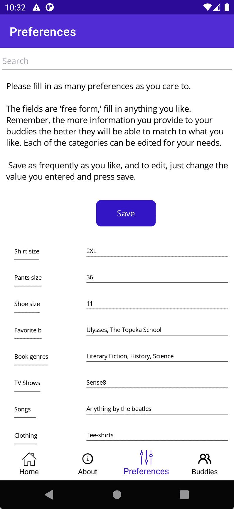
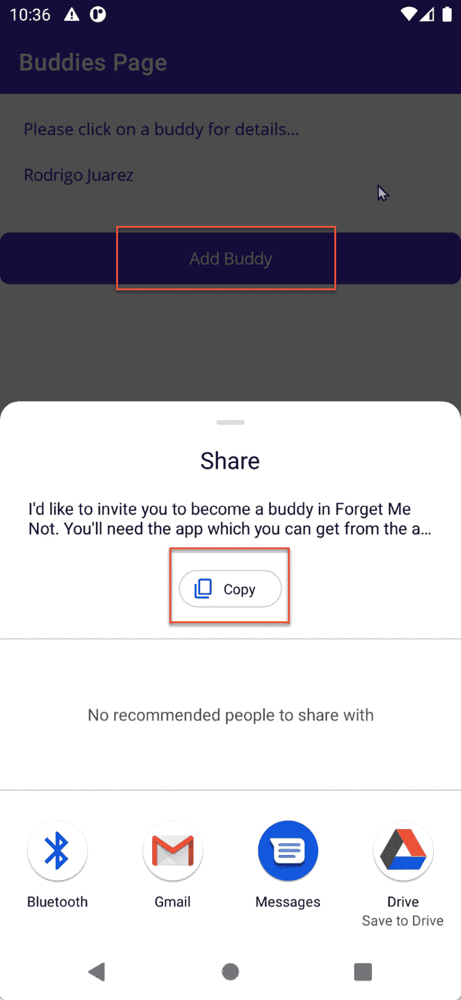
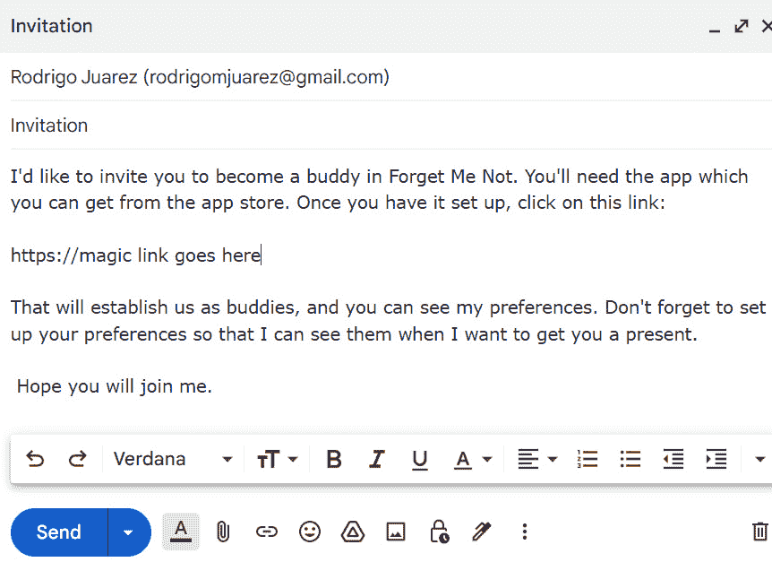
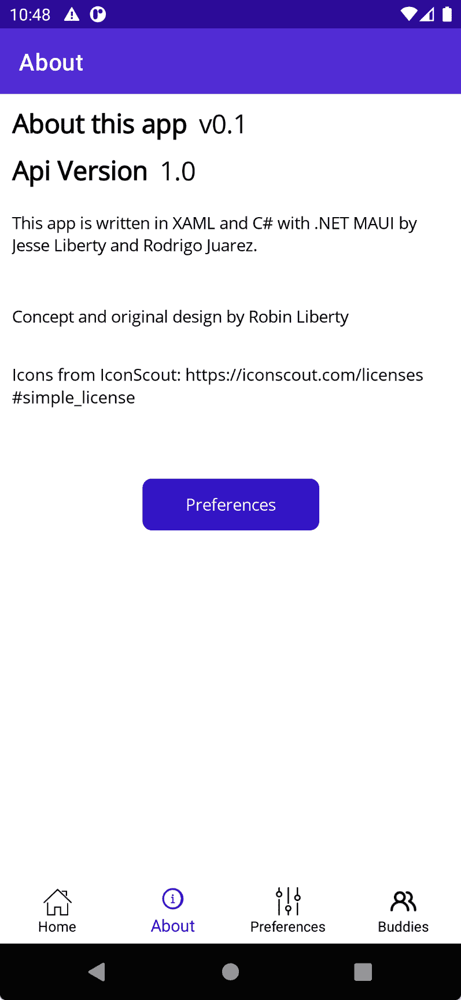
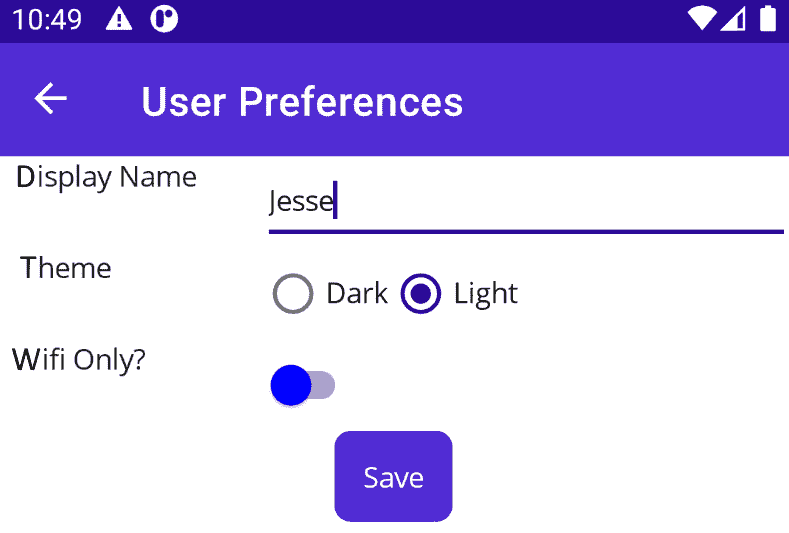

# 第二章：我们将构建的内容：勿忘我

在本书的整个过程中，我们将构建一个名为*Forget Me Not*的完整非平凡应用程序的核心。当你知道你要去哪里时，你最容易到达某个地方，因此本章将从用户的角度回顾最终产品。也就是说，在本章中，我们将回顾功能，在随后的章节中，我们将深入到实现中。

# 技术要求

本章不会回顾代码（尽管所有随后的章节都会），因此本章没有特定的技术要求。

# Forget Me Not 是什么？

Forget Me Not™是一个应用程序，旨在帮助您为您的朋友购买礼物，并允许他们轻松为您购买礼物。

Forget Me Not 的核心是您的偏好列表，如图*图 2.1*所示：

图 2.1 – 预设

你可以用你喜欢的任何方式和信息填写每个字段。更重要的是，你可以更改左侧的提示，然后在右侧填写你的新偏好！这让你在指定你的偏好和你在各种潜在礼物类别中的品味方面具有最大的灵活性。

当你有了朋友后，你就能看到这种力量的体现。

# 朋友

如果一个朋友或亲戚有这个应用，你可以邀请他们成为你的朋友。一旦你在云数据库中建立了关系，你就可以看到你朋友的偏好，他们也可以看到你的（尽管你不能编辑彼此的偏好）。

## 邀请朋友

要邀请一个朋友，你使用标签导航到朋友列表，点击**添加朋友**，这将显示**分享**页面，如图*图 2.2*所示。

图 2.2 – 分享页面

您现在可以使用任何平台特定的分享选项，包括复制邀请。让我们将其作为电子邮件消息发送，如图*图 2.3*所示。

图 2.3 – 邮件邀请

邀请函的文本是预先设定的，并自动提供，但用户可以随意编辑它。*魔法链接*将由服务器提供，用于一次性访问登录页面，以回应邀请好友的连接。请注意，本书不会涉及这一点，因为这项工作是由 API 完成的。

那些是关键页面，但还有一些其他页面。

# 其他页面

除了这些主要页面之外，还有一个**关于**页面，如图所示：

图 2.4 – 关于页面

点击这里的**预设**将显示**用户预设**页面，如图*图 2.5*所示。

图 2.5 – 用户预设

这个应用并没有太多其他内容。虽然只有六七页，但这些页面做了很多工作，将为学习基础知识提供肥沃的土壤，并在此基础上深入到中级和高级主题。

# 你将学到什么

即使只有这几页，也将为我们提供一个机会来讨论 .NET MAUI 的几乎所有方面，包括以下内容：

+   Shell 导航

+   布局

+   XAML

+   控件

+   显示集合

+   MVVM 模式

+   数据绑定

+   数据持久化

+   消费 REST 服务

+   管理 UI 的高级主题

+   使用社区工具包

+   行为

+   触发器

当你完成这本书的阅读时，你将拥有两样东西：一个可工作的应用程序和构建 .NET MAUI 应用程序的专业知识！

# 摘要

在接下来的章节中，我们将构建本章中描述的“忘不了”应用。这个看似简单的应用实现将使我们能够探索 .NET MAUI 的核心方面，然后继续到中级，最终到高级主题。

如同在*第一章*中提到的，每个章节（除了这个）都将以一个测验结束，以确保你对所涵盖的内容感到舒适，并有一个*你试试看*部分，鼓励你将新技能付诸实践。

我迫不及待地想要开始。让我们从检查标记语言（XAML）和使用 C# 为程序逻辑开始。
