# 第一章：.NET MAUI 简介

本章主要介绍如何了解**.NET 多平台应用程序用户界面**（.NET MAUI）以及可以期待它带来什么。.NET MAUI 允许您使用.NET 和 C#构建针对 Android、iOS、macOS 和 Windows 的原生跨平台移动和桌面应用。这是唯一一个纯粹理论性的章节；其他所有章节都涵盖实际项目。在这个阶段，您不需要编写任何代码，而是简单地阅读本章，以形成一个高级理解.NET MAUI 是什么，.NET MAUI 如何与.NET 相关联，以及如何设置开发机器。

我们将首先定义什么是原生应用，以及.NET 作为一项技术带来了什么。然后，我们将探讨.NET MAUI 如何融入更大的图景，并了解何时使用传统的.NET 移动和.NET MAUI 应用是合适的。我们经常使用“传统.NET 移动应用”这个术语来描述不使用.NET MAUI 的应用，即使.NET MAUI 应用是通过传统的.NET 移动应用启动的。

在本章中，我们将涵盖以下主题：

+   定义原生应用

+   .NET 移动

+   探索.NET MAUI 框架

+   设置我们的开发机器

+   .NET 移动生产力工具

让我们开始吧！

# 定义原生应用

“原生应用”这个术语对不同的人有不同的含义。对一些人来说，它指的是使用平台创建者指定的工具开发的应用，例如使用 Objective-C 或 Swift 开发的 iOS 应用，使用 Java 或 Kotlin 开发的 Android 应用，或使用 C/C++或.NET Framework 开发的 Windows 应用。其他人使用“原生应用”一词来指代编译成平台架构的机器码的应用，例如 x86、x64 或 ARM。在这本书中，我们将原生应用定义为具有原生 UI、性能和 API 访问的应用。以下列表更详细地解释了这三个概念：

+   **原生 UI**：使用.NET MAUI 构建的应用使用每个平台的标准控件。这意味着，例如，使用.NET MAUI 构建的 iOS 应用将看起来和表现得像一个 iOS 用户所期望的那样，而使用.NET MAUI 构建的 Android 应用将看起来和表现得像一个 Android 用户所期望的那样。

+   **原生性能**：使用.NET MAUI 构建的应用针对原生性能进行编译，这意味着它们的执行速度几乎与为平台设计的工具构建的应用相同，即 Java 或 Swift，并且可以使用平台特定的硬件加速。

+   **原生 API 访问**：原生 API 访问意味着使用.NET MAUI 构建的应用可以访问目标平台和设备为开发者提供的一切。例如，.NET MAUI 应用可以使用特定的硬件功能，如相机或地图。

# .NET 移动

.NET 移动（以前称为 Xamarin）是一组用于开发 iOS（**.NET for iOS/tvOS/Mac Catalyst**）、Android（**.NET for Android**）和 macOS（**.NET for macOS**）原生应用程序的 .NET 扩展。.NET 是 .NET Framework 的演变，旨在进行跨平台开发。.NET 移动是在 .NET Core 5 中作为可选工作负载引入的。从技术上讲，它是在这些平台之上的绑定层。使用绑定到平台 API 可以使 .NET 开发者能够使用 C#（和 F#）利用每个平台的全部能力来开发原生应用程序。

当我们使用 .NET 移动开发应用程序时，我们使用的 C# API 与平台 API 匹配，但它们被修改以符合 .NET Core 中的约定。例如，API 通常被定制以遵循 .NET 命名约定，Android 的 `set` 和 `get` 方法通常被属性替换。这使得使用 API 对 .NET 开发者来说更容易也更熟悉。

**Mono** ([`www.mono-project.com`](https://www.mono-project.com)) 是微软 .NET Framework 的开源实现，它基于欧洲计算机制造商协会（**ECMA**）的 C# 标准和 **通用语言运行时（CLR**）。Mono 的创建是为了将 .NET Framework 带到除 Windows 之外的平台。它是 .NET 基金会（[`www.dotnetfoundation.org`](http://www.dotnetfoundation.org)）的一部分，这是一个支持涉及 .NET 生态系统的开放开发和协作的独立组织。自 .NET 5 以来，Mono 现在是 .NET 上构建的应用程序的支持运行时。使用 Mono 与 .NET 无需单独的安装程序；它包含在 .NET 安装程序中。Mono 运行时用于 iOS、tvOS、Mac Catalyst 和 Android 应用程序，而 .NET Core CLR 用于所有其他支持的平台。

通过结合 .NET 移动平台、.NET 和 Mono，我们可以使用特定平台的 API 以及 .NET 的平台无关部分，包括 `System`、`System.Linq`、`System.IO`、`System.Net` 和 `System.Threading.Tasks` 等命名空间。

使用 .NET 移动进行移动应用程序开发有几个原因，我们将在以下章节中介绍。

## 代码共享

如果我们为多个移动平台（甚至服务器平台）使用一种通用的编程语言，那么我们可以在我们的目标平台之间共享大量代码，如下面的图示所示。所有与目标平台无关的代码都可以与其他 .NET 平台共享。以这种方式共享的代码通常包括业务逻辑、网络调用和数据模型：

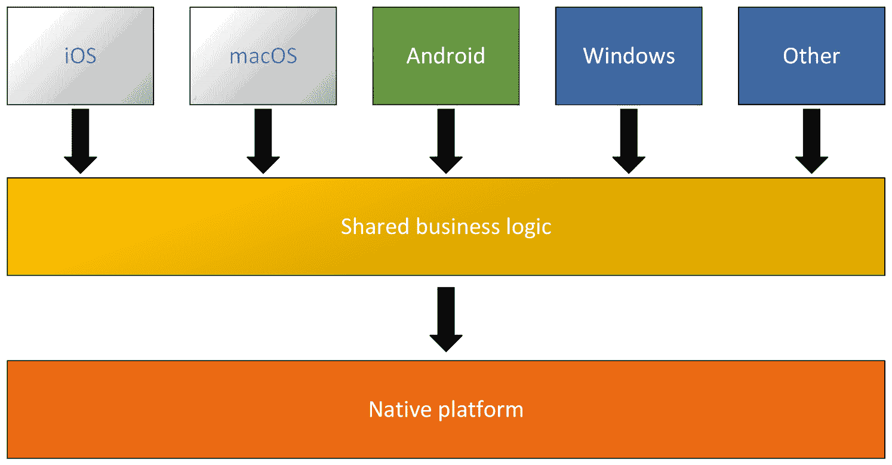

图 1.1 – .NET MAUI 代码共享

在 .NET 平台周围也有一个庞大的社区，提供不同形式的代码共享。可以从 NuGet ([`nuget.org`](https://nuget.org)) 下载各种第三方库和组件，这些库和组件可以为您提供额外的功能或能力，这些功能或能力可以在所有支持的 .NET MAUI 平台上工作。例如，您可以找到提供数据库、图形或条形码读取的 NuGet 包，以便包含在您的应用程序中。

跨平台代码共享可以缩短开发时间。它还产生了更高品质的应用程序，例如，我们只需要编写一次业务逻辑的代码。降低错误的风险，并且也能保证无论用户使用什么平台，计算都能返回相同的结果。

## 利用现有知识

对于想要开始构建原生移动应用的 .NET 开发者来说，学习新平台的 API 比学习旧平台和新平台的编程语言和 API 更容易。

同样，想要构建原生移动应用的组织可以使用熟悉 .NET 的现有开发者来开发应用程序。由于 .NET 开发者比 Objective-C 和 Swift 开发者多，因此更容易为移动应用开发项目找到新的开发者。

## .NET 移动平台

可用的不同 .NET 移动平台包括 .NET for iOS/tvOS/Mac Catalyst、.NET for Android 和 .NET for macOS。在本节中，我们将查看每个平台。

### .NET for iOS/tvOS/Mac Catalyst

.NET for iOS/tvOS/Mac Catalyst 用于使用 .NET 分别构建 iOS、tvOS 或 Mac Catalyst 应用程序，并包含之前提到的 iOS API 的绑定。.NET for iOS/tvOS/Mac Catalyst 使用 `System.Linq` 或 `System.Net`，由 Mono 运行时执行，而使用 iOS 特定命名空间的代码则由 Objective-C 运行时执行。Mono 运行时和 Objective-C 运行时都运行在 **X is Not Unix** (**XNU**) 类 Unix 内核之上 ([`github.com/apple/darwin-xnu`](https://github.com/apple/darwin-xnu))，该内核由苹果公司开发。以下图展示了 iOS 架构的概述：

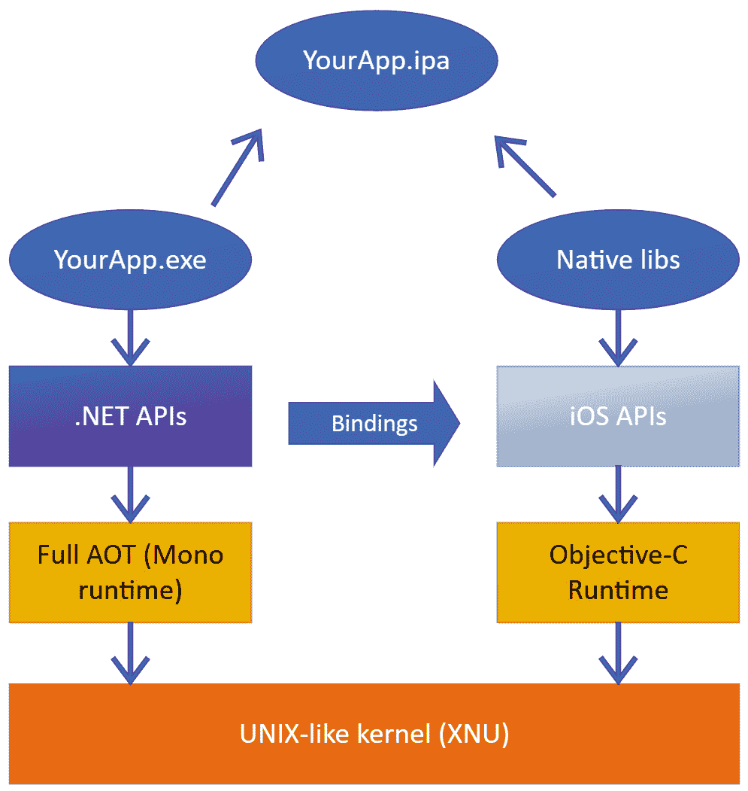

图 1.2 – .NET for iOS

### .NET for macOS

.NET for macOS 用于使用 .NET 构建 macOS 应用程序，并包含对 macOS API 的绑定。.NET for macOS 与 .NET for iOS 具有相同的架构——唯一的区别是，.NET for macOS 应用程序是即时编译的（**JIT**），而 .NET for iOS 应用程序是 AOT 编译的。这将在以下图中展示：

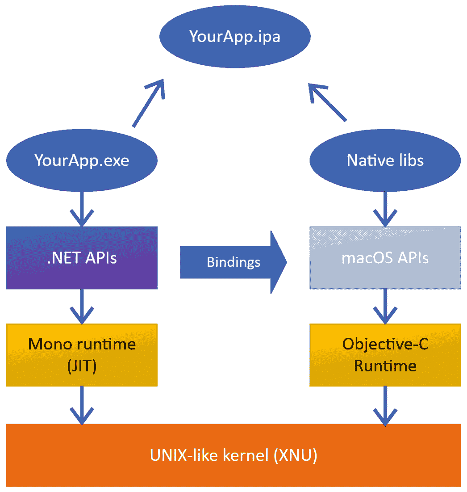

图 1.3 – .NET for macOS

### .NET for Android

.NET for Android 用于使用 .NET 构建安卓应用，并包含对安卓 API 的绑定。Mono 运行时和 Android 运行时（**ART**）在 Linux 内核之上并行运行。.NET for Android 应用可以是 JIT 编译或 AOT 编译，但为了进行 AOT 编译，我们需要使用 Visual Studio Enterprise。

Mono 运行时和 ART 之间的通信通过 **Java 本地接口**（**JNI**）桥进行。有两种类型的 JNI 桥——**管理可调用包装器**（**MCW**）和 **安卓可调用包装器**（**ACW**）。当代码需要在 ART 中运行时使用 MCW，而当 ART 需要在 Mono 运行时中运行代码时使用 ACW，如下所示：

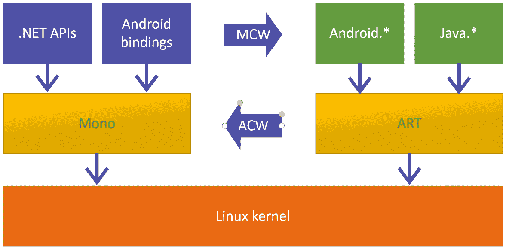

图 1.4 – .NET for Android

.NET for Tizen

.NET MAUI 从三星获得了对 Tizen 平台的支持。三星提供了绑定层和运行时，以允许 .NET MAUI 在 Tizen 平台上运行。要了解更多关于如何安装和为 Tizen 平台开发的信息，请访问您的浏览器中的 [`github.com/Samsung/Tizen.NET`](https://github.com/Samsung/Tizen.NET)。

现在我们已经了解了 .NET 移动是什么以及每个平台的工作方式，我们可以详细探索 .NET MAUI。

# 探索 .NET MAUI 框架

.NET MAUI 是一个基于 .NET 移动（用于 iOS 和 Android）和 **Windows UI**（**WinUI**）库的跨平台框架。.NET MAUI 允许开发者使用 XAML 创建 iOS、Android 和 WinUI 的用户界面。.NET MAUI 通过将所有特定于平台的功能放在与跨平台功能相同的项目中，改进了 Xamarin.Forms，这使得查找和编辑代码变得更加容易。.NET MAUI 还包括了之前在 Xamarin.Essentials 中所有的内容，它提供了跨平台功能，如权限、位置、照片和相机、联系人以及地图，并通过一个共享代码库利用这些跨平台功能，如下面的图示所示：

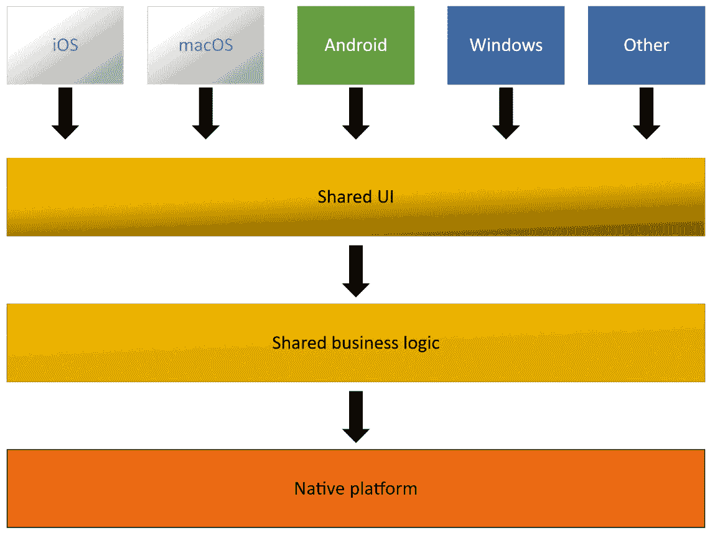

图 1.5 – .NET MAUI 架构

如果我们使用 .NET MAUI 构建应用，我们可以使用 XAML、C# 或两者的组合来创建用户界面。

## .NET MAUI 的架构

.NET MAUI 是在每个平台之上的一个抽象层。.NET MAUI 有一个共享层，该层被所有平台使用，以及一个特定于平台的层。特定于平台的层包含 **处理程序**。处理程序是一个将 .NET MAUI 控件映射到特定于平台的本地控件的类。每个 .NET MAUI 控件都有一个特定于平台的处理程序。

以下图表说明了.NET MAUI 中的输入控件如何映射到每个平台的正确原生控件。当在 iOS 应用程序中使用共享.NET MAUI 代码时，输入控件映射到`UIKit`命名空间中的`UITextField`控件。在 Android 上，输入控件映射到`AndroidX.AppCompat.Widget`命名空间中的`EditText`控件。最后，对于 Windows，.NET MAUI `Entry`处理程序映射到`Microsoft.UI.Xaml.Controls`命名空间中的`TextBox`。

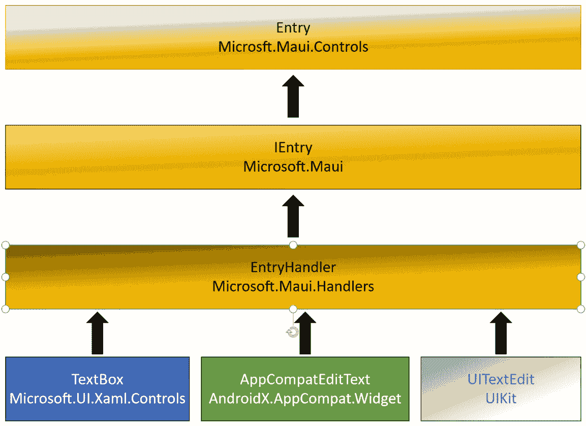

图 1.6 – .NET MAUI 控制架构

在牢固掌握.NET MAUI 架构和.NET 移动平台之后，是时候探索如何在.NET MAUI 中创建 UI 了。

## 使用 XAML 定义 UI

在.NET MAUI 中声明我们的 UI 最常见的方式是在 XAML 文档中定义它。由于 XAML 是用于实例化对象的标记语言，因此也可以在 C#中创建 GUI。从理论上讲，只要它有一个无参构造函数，我们就可以使用 XAML 创建任何类型的对象。XAML 文档是一个具有特定模式的**可扩展标记语言**（**XML**）文档。

在接下来的几节中，我们将学习一些.NET MAUI 的控制，以帮助我们入门。然后，我们将比较使用.NET MAUI 构建 UI 的不同方法。

### 定义标签控件

作为简单的例子，让我们看看以下 XAML 文档片段：

```cs
<Label Text="Hello World!" />
```

当 XAML 解析器遇到此片段时，它将创建一个`Label`对象的实例，然后设置与 XAML 中的属性相对应的对象属性。这意味着如果我们设置 XAML 中的`Text`属性，它将设置创建的`Label`对象实例的`Text`属性。前面示例中的 XAML 具有以下相同的效果：

```cs
var obj = new Label()
{
    Text = "Hello World!"
};
```

XAML 的存在是为了使查看我们需要创建以制作 GUI 的对象层次结构变得更加容易。GUI 的对象模型也是按设计分层的，因此 XAML 支持添加子对象。我们可以简单地将其作为子节点添加，如下所示：

```cs
<StackLayout>
    <Label Text="Hello World" />
    <Entry Text="Ducks are us" />
</StackLayout>
```

`StackLayout`是一个容器控件，它在一个容器内垂直或水平地组织子控件。默认情况下是垂直组织，除非我们指定其他方式。还有其他容器，例如`Grid`和`FlexLayout`。

这些将在后续章节的许多项目中使用。

### 在 XAML 中创建页面

一个控件如果没有容器来承载它就没有用处。让我们看看一个完整的页面会是什么样子。在 XAML 中定义的完全有效的`ContentPage`对象是一个 XML 文档。这意味着我们必须从一个 XML 声明开始。之后，我们必须有一个——并且只有一个——根节点，如下所示：

```cs
<?xml version="1.0" encoding="UTF-8"?>
<ContentPage  
 x:Class="MyApp.
MainPage">
    <StackLayout>
        <Label Text="Hello world!" />
    </StackLayout>
</ContentPage>
```

在前面的示例中，我们定义了一个 `ContentPage` 对象，它在每个平台上转换为一个单独的视图。为了使其成为有效的 XAML，我们需要指定一个默认命名空间（`http://schemas.microsoft.com/dotnet/2021/maui`）并添加 `x` 命名空间（`http://schemas.microsoft.com/winfx/2009/xaml`）。

默认命名空间让我们可以创建对象而无需前缀，例如 `StackLayout` 对象。`x` 命名空间让我们可以访问诸如 `x:Class` 这样的属性，它告诉 XAML 解析器在创建 `ContentPage` 对象时实例化哪个类来控制页面。

`ContentPage` 对象只能有一个子元素。在这种情况下，它是一个 `StackLayout` 控件。除非我们指定其他方式，否则默认布局方向是垂直的。因此，`StackLayout` 对象可以有多个子元素。本书后面我们将讨论更高级的布局控件，如 `Grid` 和 `FlexLayout` 控件。

作为 `StackLayout` 的第一个子元素，我们将创建一个 `Label` 控件。

### 在 C# 中创建页面

为了清晰起见，以下代码显示了上一个示例在 C# 中的样子：

```cs
public class MainPage : ContentPage
{
}
```

`MainPage` 是一个继承自 .NET MAUI 的 `ContentPage` 类。如果我们创建一个 XAML 页面，这个类会自动为我们生成，但如果我们只使用代码，我们就需要自己定义它。

让我们使用以下代码创建与之前定义的 XAML 页面相同的控件层次结构：

```cs
var page = new MainPage();
var stacklayout = new StackLayout();
stacklayout.Children.Add(
    new Label()
    {
        Text = "Welcome to .NET MAUI"
    });
page.Content = stacklayout;
```

第一个语句创建了一个 `page` 对象。理论上，我们可以直接创建一个新的 `ContentPage` 页面，但这将阻止我们为其编写任何代码。因此，为每个我们计划创建的页面进行子类化是一个好的实践。

在此第一个语句之后的块创建了 `StackLayout` 控件，它包含添加到 `Children` 集合中的 `Label` 控件。

最后，我们需要将 `StackLayout` 分配给页面的 `Content` 属性。

由于 XAML 是一种主要为我们实例化对象的标记语言，我们可以看到在 C# 中复制它有多么容易。接下来，我们将看看一些使您在 C# 中开发 UI 更好的扩展。

### 使用 .NET MAUI Markup Community Toolkit

GitHub 上的 Community Toolkit 组织有一个项目，为 MAUI 添加 **Fluent** 扩展，以使用 C# 创建 UI。该项目 **.NET MAUI Markup Community Toolkit** ([`github.com/CommunityToolkit/Maui.Markup`](https://github.com/CommunityToolkit/Maui.Markup))，或简称 **MAUI.Markup**，在网站上描述如下：

.NET MAUI Markup Community Toolkit 是一组 Fluent C# 扩展方法，允许开发者在无需 XAML 的情况下继续使用 MVVM、绑定、资源字典等来架构他们的应用程序。

使用 MAUI 标记来创建我们在前两个部分中创建的相同页面看起来可能如下所示：

```cs
public class MainPage: ContentPage
{
    public MainPage()
    {
        Build();
    }
    public void Build() {
        Content = new StackLayout()
        {
            Children =
            {
                new Label()
                {
                    Text = "Welcome to .NET MAUI"
                }
            }
        };
    }
}
```

有关如何在您的应用程序中使用 MAUI 标记的更多信息，请使用您喜欢的网络浏览器访问[`github.com/CommunityToolkit/Maui.Markup`](https://github.com/CommunityToolkit/Maui.Markup)。

那么，创建我们的 UI，XAML 还是 C#更好呢？

### XAML 或 C#？

通常，使用 XAML 可以提供一个更好的概览，因为页面是一个对象的分层结构，而 XAML 是定义这种结构的一种非常好的方式。在代码中，结构是颠倒的，因为我们需要首先定义最内层的对象，这使得阅读我们页面的结构变得困难。这在本章的“在 XAML 中创建页面”部分中得到了演示。话虽如此，我们决定如何定义 GUI 通常是一个个人偏好的问题。这本书将在未来的项目中使用 XAML 而不是 C#。

现在我们已经探讨了如何使用.NET MAUI 创建我们的页面，是时候回顾.NET MAUI 和.NET 移动之间的比较了。

## .NET MAUI 与传统.NET 移动的比较

虽然这本书是关于.NET MAUI 的，但我们也会突出使用传统.NET 移动和.NET MAUI 之间的差异。当开发使用 iOS 或 Android **软件开发套件**（**SDK**）且没有任何抽象手段的 UI 时，会使用传统.NET 移动。例如，我们可以创建一个 iOS 应用程序，该应用程序在故事板或直接在代码中定义其 UI。这段代码对于其他平台，如 Android，是不可重用的。使用这种方法构建的应用程序仍然可以通过简单地引用.NET 标准库来共享非平台特定的代码。这种关系在以下图中显示：

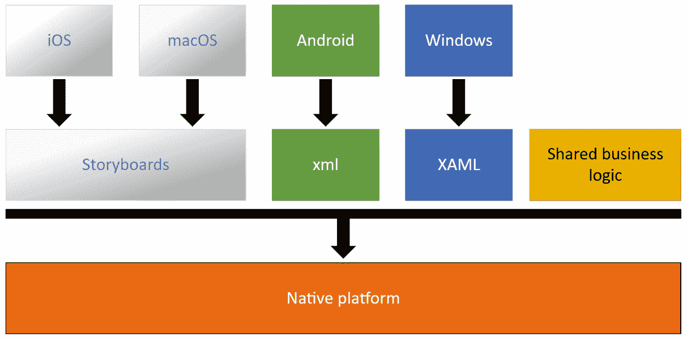

图 1.7 – 传统.NET UI

另一方面，.NET MAUI 是 GUI 的抽象，它允许我们以平台无关的方式定义 UI。它仍然基于.NET for iOS、.NET for Android 以及所有其他支持的平台。.NET MAUI 应用程序被创建为一个.NET 标准库，其中共享源文件和特定于平台的源文件都在我们当前构建的平台上的同一个项目中构建。这种关系在以下图中显示：

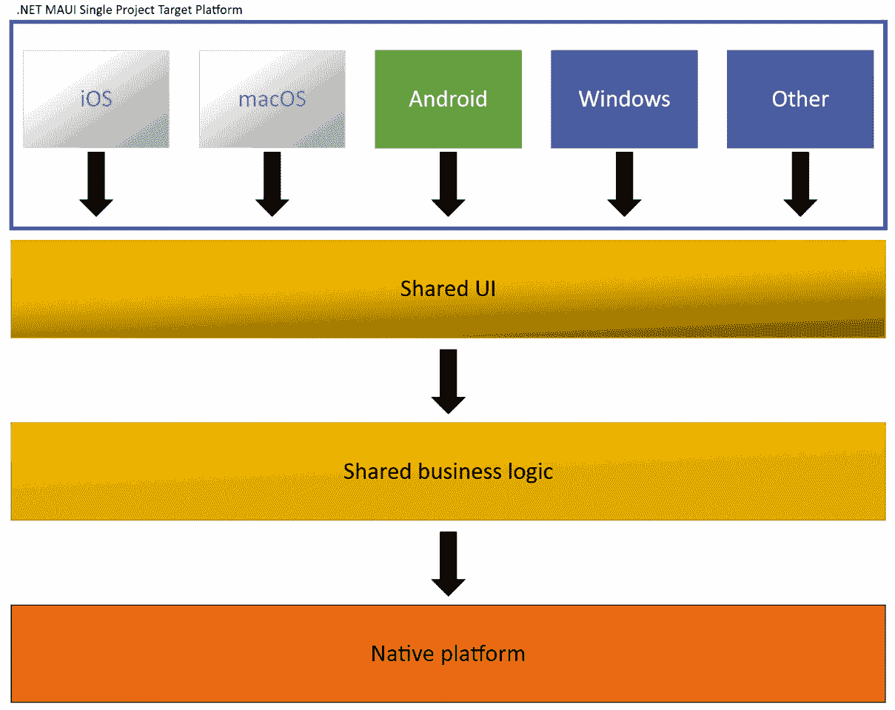

图 1.8 – 单个项目中的.NET MAUI UI

话虽如此，.NET MAUI 无法在没有传统.NET 移动的情况下存在，因为它通过每个平台的应用程序进行引导。这使我们能够使用自定义渲染器和特定于平台的代码在每个平台上扩展.NET MAUI，这些代码可以通过接口暴露给我们的共享代码库。我们将在本章后面更详细地探讨这些概念。

### 何时使用.NET MAUI

在大多数情况下和大多数类型的应用中，我们可以使用 .NET MAUI。如果我们需要使用 .NET MAUI 中不可用的控件，我们始终可以使用特定平台的 API。然而，有些情况下 .NET MAUI 并不适用。我们可能想要避免使用 .NET MAUI 的最常见情况是，如果我们构建的应用在不同目标平台上看起来应该非常不同。

现在理论部分已经足够了；让我们准备我们的开发机器，以便使用 .NET MAUI 进行开发。

# 设置我们的开发机器

为多个平台开发应用对我们的开发机器提出了更高的要求。其中一个原因是，我们通常希望在开发机器上运行一个或多个模拟器或仿真器。不同的平台对开始开发所需的内容也有不同的要求。无论我们使用 macOS 还是 Windows，Visual Studio 都将是我们的 **集成开发环境**（**IDE**）。Visual Studio 有几个版本，包括免费的社区版。请访问 [`visualstudio.microsoft.com/`](https://visualstudio.microsoft.com/) 比较可用的版本，并选择适合你的版本；.NET MAUI 包含在所有 Windows 和 macOS 的 Visual Studio 版本中。以下列表是针对每个平台开始开发所需内容的总结：

+   **iOS**：要为 iOS 开发应用，我们需要一个 **Macintosh**（**Mac**） 设备。这可以是我们在其上开发的那台机器，或者如果我们使用的是网络上的机器。我们需要连接到 Mac 的原因是我们需要 Xcode 来构建应用包。Xcode 还提供了各种模拟器来运行和调试你的应用。在没有连接 Mac 的情况下，你可以在 Windows 上进行一些 iOS 开发；你可以在本章的 *Xamarin Hot Restart* 部分中了解更多信息。

+   **Android**：Android 应用可以在 macOS 或 Windows 上开发。我们需要的所有东西，包括 SDK 和模拟器，都可以通过 Visual Studio 安装。

+   **WinUI**：WinUI 应用只能在 Windows 机器上的 Visual Studio 中开发。

我们首先设置 Mac，然后稍后介绍 Windows。如果你没有 Mac，你可以跳过这一部分，直接进入 *设置 Windows 机器* 部分。

## 设置 Mac

在 Mac 上使用 .NET 移动开发 iOS 和 Android 应用需要两个主要工具。这些是 Visual Studio for Mac（如果我们只开发 Android 应用，这就是我们需要的唯一工具）和 Xcode。在接下来的章节中，我们将探讨如何设置 Mac 以进行应用开发。

### 安装 Xcode

在我们安装 Visual Studio 之前，我们需要下载并安装 Xcode。Xcode 是苹果的官方开发 IDE，包含所有 iOS 开发工具，包括 iOS、macOS、Mac Catalyst 和 tvOS 的 SDK。

我们可以从 Apple 开发者门户（[`developer.apple.com`](https://developer.apple.com)）或 Apple App Store 下载 Xcode。我建议您从 App Store 下载，因为这可以保证您拥有最新的稳定版本。唯一需要从开发者门户下载 Xcode 的原因是为了使用 Xcode 的预发布版本来开发 iOS 的预发布版本。

当使用 macOS 的预发布版本及其相应的 Xcode 版本时，可能 .NET for iOS/tvOS/Mac Catalyst/macOS 还未更新以与最新的 Xcode 变更兼容。建议在安装最新 Xcode 之前检查兼容性，以确保工作环境正常。

在第一次安装之后，以及每次 Xcode 更新之后，打开 Xcode 都非常重要。Xcode 在安装或更新后通常需要安装额外的组件。我们还需要打开 Xcode 来接受与 Apple 的许可协议。

### 安装 Visual Studio

要安装 Visual Studio，我们首先需要从 [`visualstudio.microsoft.com`](https://visualstudio.microsoft.com) 下载它。

Visual Studio for Mac 弃用

2023 年 8 月 31 日，微软根据其现代生命周期政策宣布了 Visual Studio for Mac 的弃用，这意味着支持将在 2024 年 8 月 31 日结束。Visual Studio for Mac 将一直支持到那个日期。如果您有 Visual Studio 订阅，您可以从 [my.visualstudio.com](http://my.visualstudio.com) 下载 Visual Studio for Mac 的最新版本。微软已发布了 C# Dev Kit 和 .NET MAUI Dev Kit 扩展程序，这些扩展程序在 Windows、macOS 和 Linux 上运行。您可以使用 Visual Studio Code 和这些扩展程序来完成本书中的项目，尽管与 Visual Studio for Mac 的 UI 相关的说明将不匹配 Visual Studio Code。要了解更多信息，请访问 [`learn.microsoft.com/en-us/visualstudio/mac/what-happened-to-vs-for-mac?view=vsmac-2022`](https://learn.microsoft.com/en-us/visualstudio/mac/what-happened-to-vs-for-mac?view=vsmac-2022)。

当我们通过下载的文件启动 Visual Studio 安装程序时，它将开始检查我们机器上已经安装的内容。当检查完成后，我们可以选择我们想要安装的平台和工具。

一旦我们选择了想要安装的平台，Visual Studio 将下载并安装我们使用 .NET 移动进行应用程序开发所需的所有内容，如下所示：

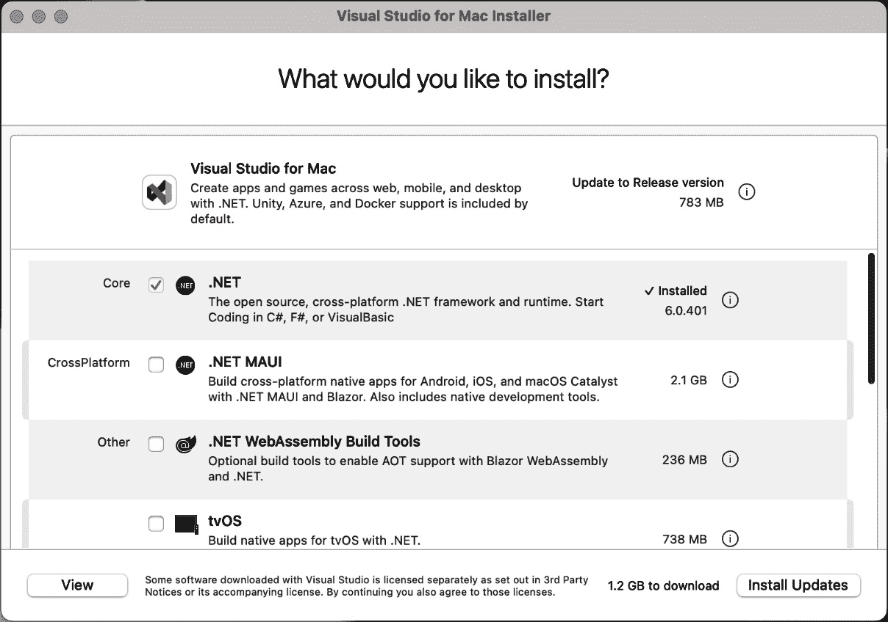

图 1.9 – Visual Studio for Mac 安装程序

### 配置 Android 模拟器

Visual Studio 使用 Google 提供的 Android 模拟器。它们通过 SDK 管理器进行安装和配置。

关于基于 Intel 的 Mac 设备的特别说明

如果我们希望我们的模拟器运行得快，那么我们需要确保它是硬件加速的。为了硬件加速 Android 模拟器，我们需要安装 Intel **硬件加速执行管理器**（**HAXM**），可以从[`software.intel.com/en-us/articles/intel-hardware-accelerated-execution-manager-intel-haxm`](https://software.intel.com/en-us/articles/intel-hardware-accelerated-execution-manager-intel-haxm)下载。

下一步是创建 Android 模拟器。首先，我们需要确保已安装 Android 模拟器和 Android 操作系统图像。为此，请执行以下步骤：

1.  前往**工具**选项卡安装 Android 模拟器：

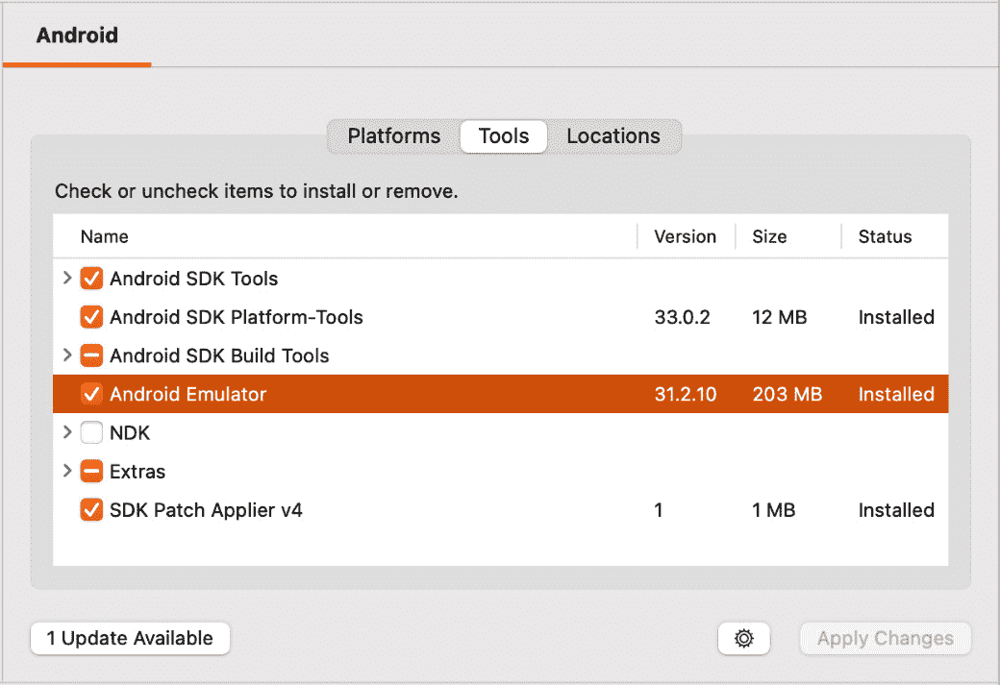

图 1.10 – 在 Visual Studio for Mac 中安装 Android 模拟器

1.  我们还需要安装一个或多个图像以供模拟器使用。例如，如果我们想在不同的 Android 版本上运行我们的应用，我们可以安装多个图像。我们可以通过 Google Play（如下面的截图所示）选择模拟器，这样我们就可以在我们的应用中使用 Google Play 服务，即使我们在模拟器中运行它。例如，如果我们想在我们的应用中使用 Google Maps，这是必需的：

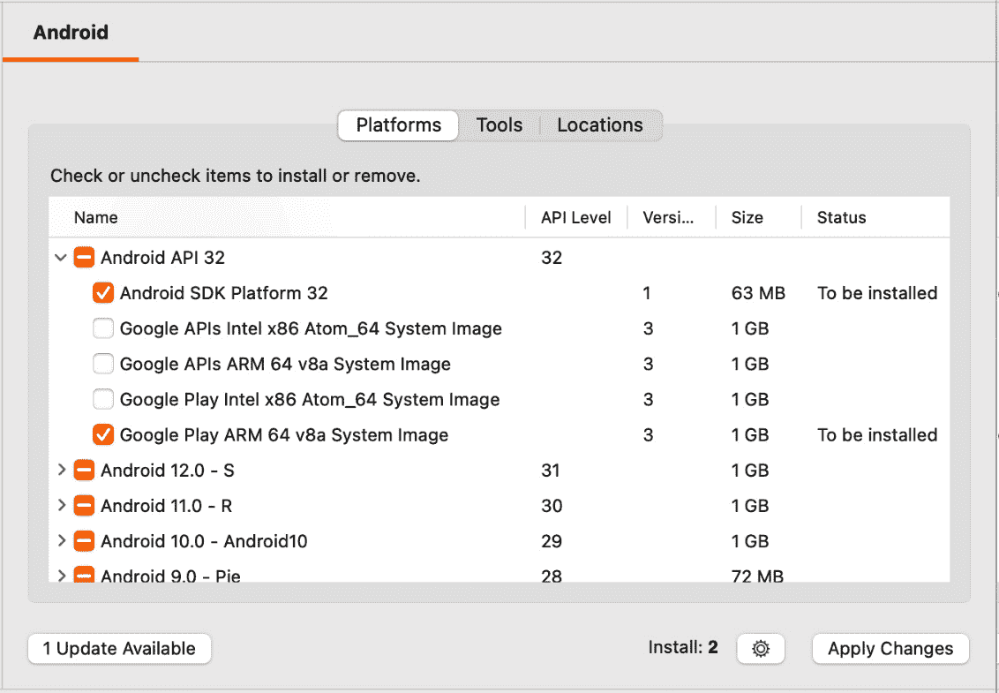

图 1.11 – 在 Visual Studio for Mac 中安装模拟器图像

英特尔与苹果 M1 的比较

如果您有一台使用 M1 芯片组的 Apple Mac，那么您应该使用名称中包含**ARM 64**的模拟器图像；否则，如果您正在使用带有 Intel 芯片组的较旧 Mac 设备，则使用名称中包含**Intel x86**的图像。

1.  然后，要创建和配置模拟器，请转到 Visual Studio 中的**工具**菜单下的**设备管理器**。从**Android 设备管理器**，如果我们已经创建了一个模拟器，我们可以启动它，或者我们可以创建新的模拟器，如下所示：

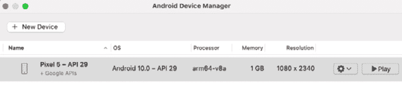

图 1.12 – Visual Studio for Mac 中的 Android 设备管理器

1.  如果我们点击**新建设备**按钮，我们可以创建一个具有所需规格的新模拟器。在这里创建新模拟器最简单的方法是选择一个与我们需求匹配的基础设备。这些基础设备是预先配置的，这通常已经足够。然而，我们也可以编辑设备的属性，以便我们有一个符合我们特定需求的模拟器。

    处理器下拉菜单将预先选择与您的设备正确的架构。如果您更改此设置，例如，从 ARM 更改为 x86 或从 x86 更改为 ARM，那么模拟器将变慢；始终尝试使用与您的设备匹配的架构。

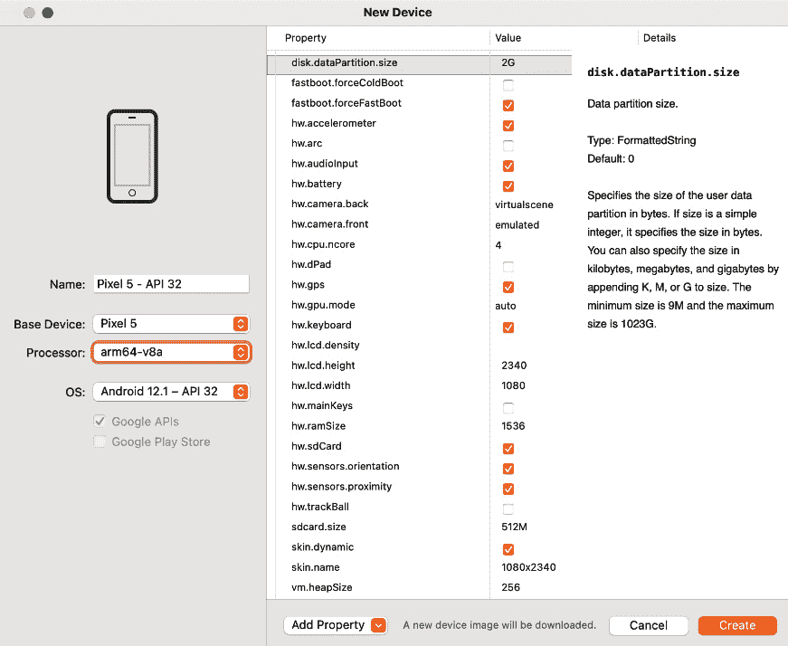

图 1.13 – 创建新的 Android 设备

如果我们只有 Mac，那么我们已经完成，可以跳转到 *.NET 移动生产力工具* 部分。如果我们有 Windows 设备，那么下一部分，*设置 Windows 机器*，就是为您准备的。

## 设置 Windows 机器

我们可以使用虚拟或物理 Windows 机器来使用 .NET 移动进行开发。例如，我们可以在我们的 Mac 上运行虚拟 Windows 机器。我们只需要在我们的 Windows 机器上安装 Visual Studio 就可以进行应用开发。

### 为 Visual Studio 2022 或更高版本安装 .NET 移动

如果我们已安装 Visual Studio 2022 或更高版本，我们首先需要打开 **Visual Studio 安装程序**；否则，我们需要前往 [`visualstudio.microsoft.com`](https://visualstudio.microsoft.com) 下载安装文件。在 **认识 Visual Studio 家族** 部分的横幅下，您可以找到下载 Visual Studio 2022 for Windows 或 Visual Studio 2022 for Mac 的链接。

在安装开始之前，我们需要选择我们想要安装的工作负载。

对于 .NET MAUI 开发，我们需要安装 **.NET 多平台应用程序 UI 开发**。选择 **ASP.NET 和 Web 开发** 工作负载，以便能够开发 MAUI/Blazor 混合应用。

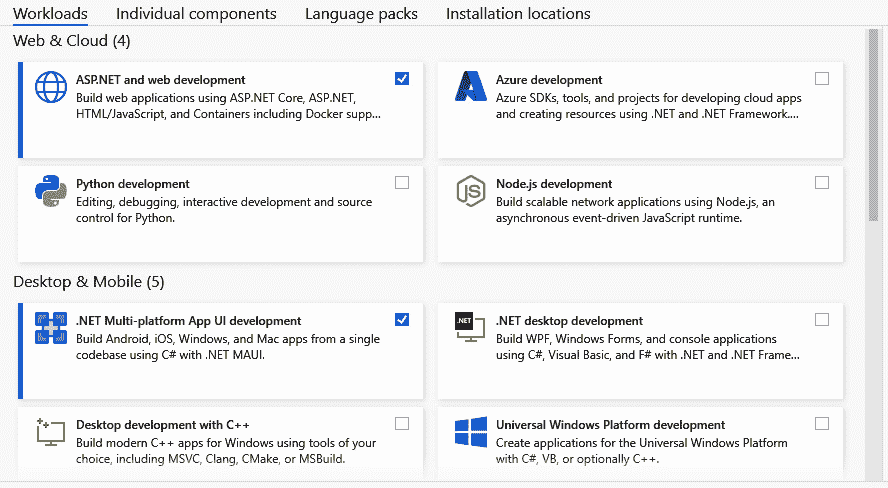

图 1.14 – Visual Studio 2022 安装程序

在使用 .NET MAUI 时，Hyper-V 是默认的硬件加速方法。如果我们想使用 Intel HAXM，我们需要在 **单个组件** 选项卡中勾选 Intel HAXM，如下面的截图所示：

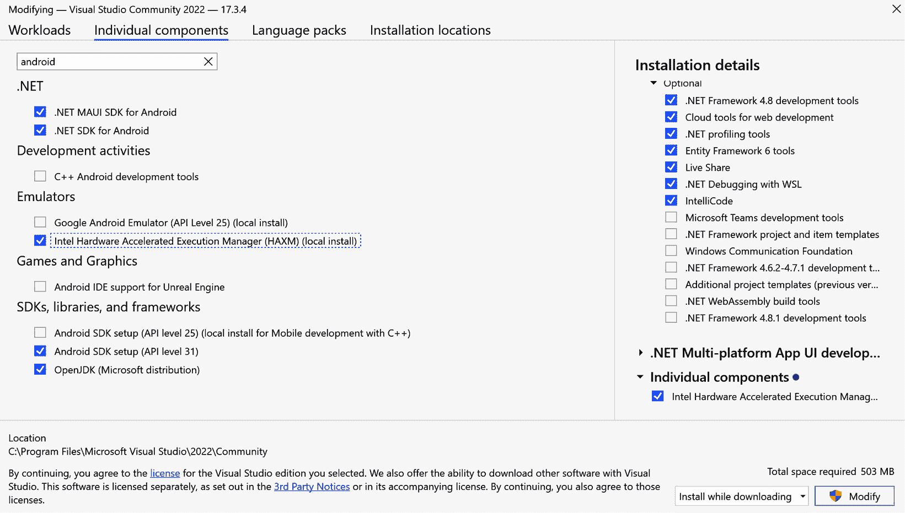

图 1.15 – 添加 Intel HAXM

当我们第一次启动 Visual Studio 时，系统会询问我们是否想要登录。除非我们想要使用 Visual Studio Professional 或 Enterprise，在这种情况下我们需要登录以验证我们的许可证，否则我们不需要登录。

现在 Visual Studio 已经安装，我们可以完成运行和调试 iOS 和 Android 应用的配置。

### 将 Visual Studio 与 Mac 配对

如果我们想在 Windows 开发机器上运行、调试和编译我们的 iOS 应用，那么我们需要将其连接到 Mac。我们可以手动设置我们的 Mac，如本章前面所述，或者我们可以使用 Visual Studio 中的 **自动 Mac 配置**。这将安装 Mono 和 .NET for iOS 到我们连接的 Mac 上。它不会安装 Visual Studio IDE，但如果我们只是想将其用作构建机器，则这不是必需的。然而，我们确实需要手动安装 Xcode。

要从 Visual Studio 连接到 Mac，请使用工具栏中的 **配对到 Mac** 按钮（如下面的截图所示），或者在顶部菜单中转到 **工具** | **iOS** | **配对** | **到 Mac**：

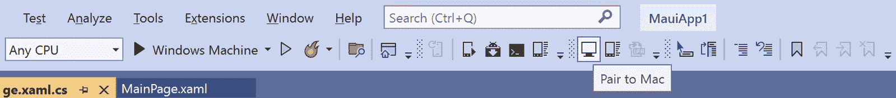

图 1.16 – 配对到 Mac 按钮

如果这是您第一次尝试配对到 Mac，Visual Studio 将打开一个向导，该向导将指导您在 Mac 上执行使 Visual Studio 能够连接所需的步骤。

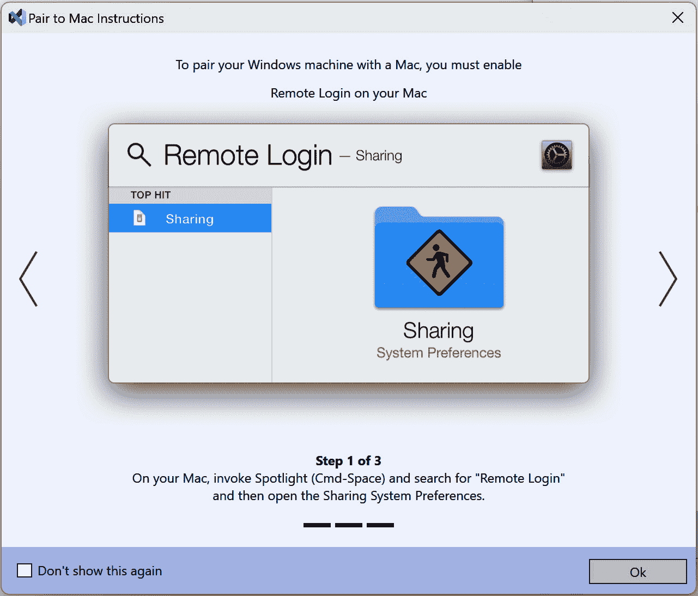

图 1.17 – 配对到 Mac 向导

要能够连接到 Mac——无论是手动还是使用**自动 Mac 配置**——我们需要能够通过网络访问 Mac，并且需要在 Mac 上启用**远程登录**。

要完成此操作，请转到**设置** | **共享**并选中**远程登录**的复选框。在窗口的左侧，我们可以选择允许使用**远程登录**连接的用户，如图所示：

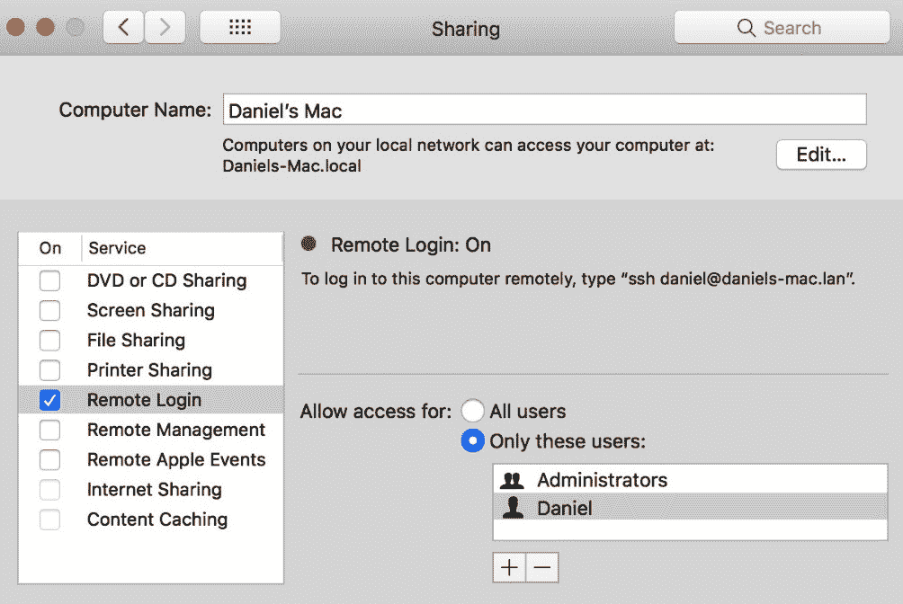

图 1.18 – 在 macOS 上启用远程登录

将会弹出一个对话框，显示网络上可以找到的所有 Mac。如果您的 Mac 不在可用的 Mac 列表中，您可以在窗口左下角的**添加 Mac...**按钮中输入 IP 地址，如图所示：

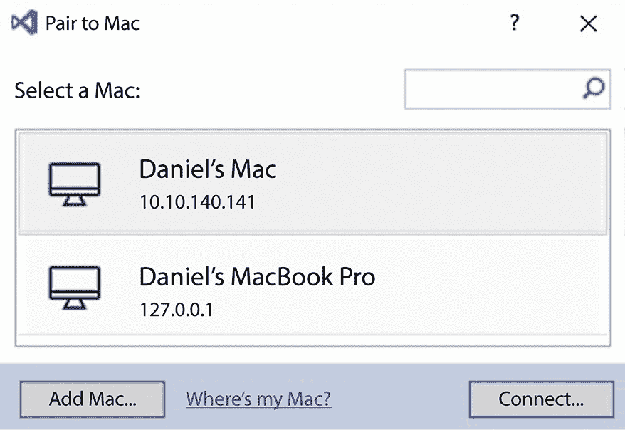

图 1.19 – 配对到 Mac

如果 Mac 上安装了所有必需的软件，Visual Studio 将连接，我们可以开始构建和调试我们的 iOS 应用。如果 Mac 上缺少 Mono，将出现警告。此警告还将提供安装它的选项，如图所示：

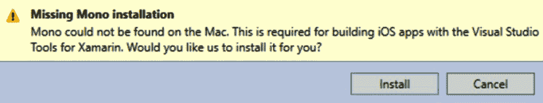

图 1.20 – 缺少 Mono 安装对话框

现在我们已经将 Mac 配对成功，我们可以配置 Android 模拟器。

### 配置 Android 模拟器和硬件加速

如果我们想要一个运行流畅的快速 Android 模拟器，我们需要启用硬件加速。这可以通过 Intel HAXM 或 Hyper-V 来完成。Intel HAXM 的缺点是它不能在带有**高级微设备公司**（**AMD**）处理器的机器上使用；我们必须使用带有 Intel 处理器的机器。我们无法在 Hyper-V 并行使用 Intel HAXM。

由于这个原因，Hyper-V 是在 Windows 机器上硬件加速 Android 模拟器的首选方式。要使用 Hyper-V 与我们的 Android 模拟器，我们需要安装 Windows 11 或带有 2018 年 4 月更新（或更高版本）的 Windows 10，以及安装了 Visual Studio 2017 版本 15.8（或更高版本）。

查找您的 Visual Studio 版本

要确定您正在使用的 Visual Studio 版本，当 Visual Studio 打开时，使用**帮助** | **关于 Visual Studio**菜单，您应该会看到一个类似于以下对话框：

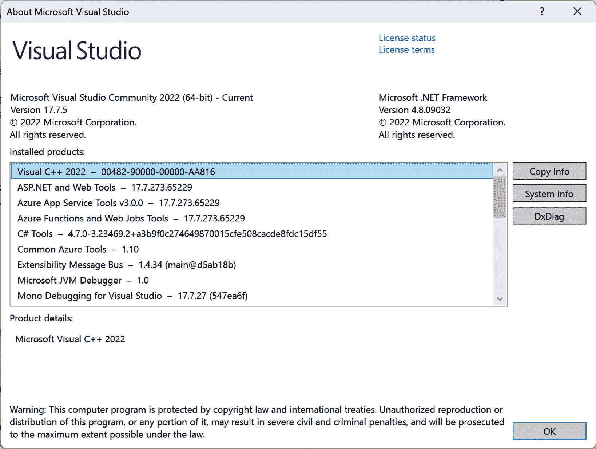

图 1.21 – 帮助 | 关于

要启用 Hyper-V，我们需要采取以下步骤：

1.  打开搜索菜单，输入`打开或关闭 Windows 功能`。点击出现的选项以打开它，如图所示：

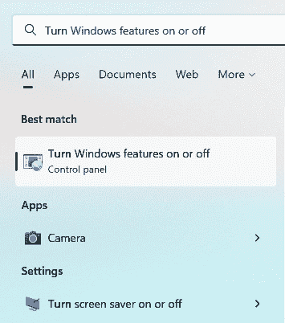

图 1.22 – 打开或关闭 Windows 功能

1.  要启用 Hyper-V，选中 **Hyper-V** 复选框。同时，展开 **Hyper-V** 选项并选中 **Hyper-V 平台** 复选框。我们还需要选中 **Windows 虚拟机平台** 复选框，如下所示：

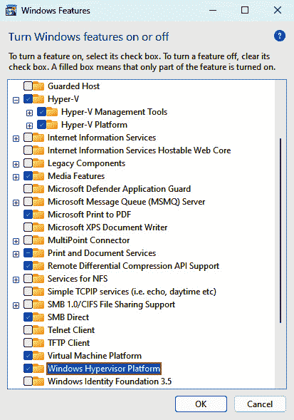

图 1.23 – 在 Windows 功能中启用 Hyper-V

1.  当 Windows 提示您时，请重新启动计算机。

1.  由于我们在安装 Visual Studio 时没有安装 Android 模拟器，现在我们需要安装它。在 Visual Studio 的 **工具** 菜单中，然后点击 **Android**，再点击 **Android SDK 管理器**。

1.  在 **Android SDK 管理器** 的 **工具** 下，我们可以通过选择 **Android 模拟器** 来安装模拟器，如下截图所示。同时，我们应确保已安装最新版本的 **Android SDK 构建工具**：

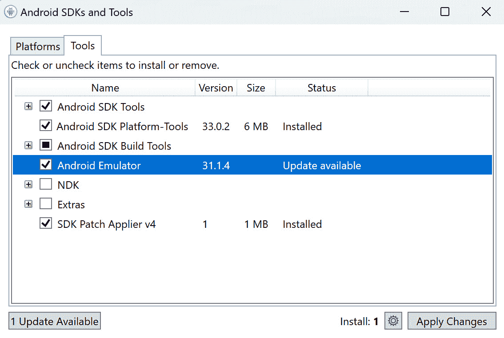

图 1.24 – 在 Android SDK 管理器中安装 Android 模拟器

1.  Android SDK 允许同时安装多个模拟器镜像。如果我们想在不同的 Android 版本上运行我们的应用，我们可以安装多个镜像。选择带有 **Google Play** 的模拟器（如以下截图所示），这样我们就可以在我们的应用中使用 Google Play 服务，即使我们在模拟器中运行它。

    例如，如果我们想在我们的应用中使用 Google Maps，这是必需的：

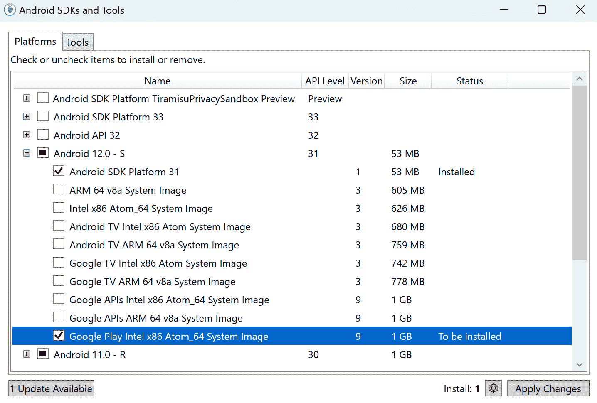

图 1.25 – 在 Android SDK 管理器中安装 Android 模拟器镜像

1.  在关闭窗口之前，务必点击 **应用更改** 按钮来安装您之前选择的任何组件。

1.  下一步是创建一个虚拟设备来使用模拟器镜像。要创建和配置一个模拟器，请转到 **Android 设备管理器**，我们可以从 Visual Studio 的 **工具** 选项卡中打开它。从设备管理器中，我们可以启动一个模拟器（如果我们已经创建了一个）或者创建新的模拟器，如下所示：

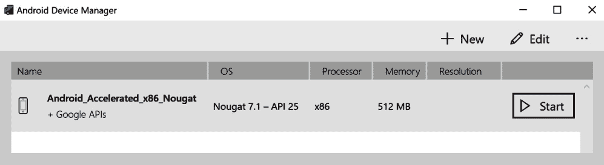

图 1.26 – Android 设备管理器

如果我们点击 **新建** 按钮，我们可以创建一个具有所需规格的新模拟器。在这里创建新模拟器最简单的方法是选择一个与我们需求匹配的基础设备。这些基础设备是预先配置的，这通常就足够了。然而，我们可以编辑设备的属性，以便我们有一个符合我们特定需求的模拟器。

我们必须为模拟器选择正确的处理器，以匹配我们的 Windows 开发机器中的处理器。如果它们不匹配，那么模拟器将比所需的运行得更慢。如果您使用的是基于 Intel 或 AMD x86 的硬件，请选择 **x86_64** 处理器（如下截图所示），或者如果您有一个运行 Windows 的 ARM 设备，请选择 **arm64-v***。

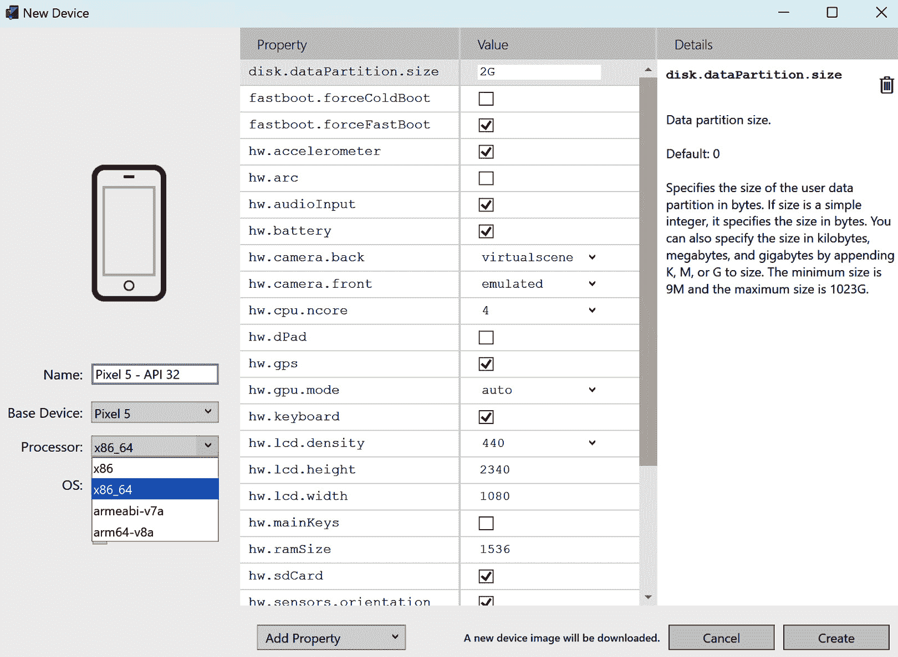

图 1.27 – 在 Android 设备管理器中创建新设备

### 配置开发者模式

如果我们想要为 Windows 开发桌面应用程序，我们需要在我们的开发机器上激活开发者模式。为此，转到**设置** | **隐私和安全** | **开发者选项**。然后，选择**开发者模式**，如以下截图所示。这使得我们可以通过 Visual Studio 侧载和调试应用程序：

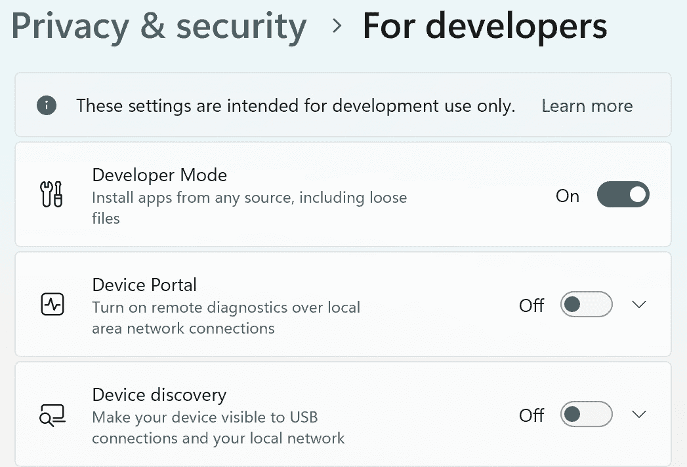

图 1.28 – 启用开发者模式

到目前为止，我们的 Windows 机器已准备好进行开发。在我们开始创建第一个项目之前，还有一些其他可选功能需要我们审查。这些功能将有助于您在构建应用程序时提高开发效率。

# .NET 移动生产力工具

**Xamarin 热重启**和**热重载**是两种提高.NET MAUI 开发者生产力的工具。为了从 Android 模拟器中获得更好的性能，您可以使用**Windows 子系统**为**Android**（**WSA**）。

## Xamarin 热重启

热重启是 Visual Studio 的一个功能，旨在提高开发者的生产力。它还为我们提供了一种在 iPhone 上运行和调试 iOS 应用程序的方法，而无需使用连接到 Visual Studio 的 Mac。微软将热重启描述如下：

Xamarin 热重启允许您在开发过程中快速测试对应用程序的更改，包括多文件代码编辑、资源和引用。它将新更改推送到调试目标上的现有应用程序包，从而实现更快的构建和部署周期。

要使用热重启，您需要以下内容：

+   Visual Studio 2019 版本 16.5

+   iTunes（微软商店或 64 位版本）

+   需要一个苹果开发者账户和付费的苹果开发者计划([`developer.apple.com/programs/`](https://developer.apple.com/programs/))注册

热重启目前只能与 iOS 应用程序的.NET 一起使用。

有关热重启当前状态的更多信息，请参阅[`docs.microsoft.com/en-us/xamarin/xamarin-forms/deploy-test/hot-restart`](https://docs.microsoft.com/en-us/xamarin/xamarin-forms/deploy-test/hot-restart)。

## 热重载

热重载是一种运行时技术，允许我们在 IDE 中做出更改时更新我们的运行中的应用程序。目前热重载有两种主要类型：**XAML 热重载**和**C#热重载**。

XAML 热重载允许我们在不重新部署应用程序的情况下更改我们的 XAML。当我们对 XAML 进行了更改后，我们只需保存文件，它就会更新模拟器/模拟器或设备上的页面。XAML 热重载目前支持所有.NET MAUI 平台。

C# 热重载允许我们在不重新部署我们的应用的情况下修改代码。C# 热重载类似于 *编辑并继续*；然而，您不需要处于中断模式才能将更改应用到应用中。一旦您修改了代码，您可以在 Visual Studio 工具栏中点击 **热重载** 按钮，热重载将更新运行中的应用。如果由于某些原因无法应用更改，热重载将显示一个对话框，要求您修复任何编译错误，或者在某些情况下，要求您重新启动应用。

要在 Windows 上为 Visual Studio 启用 XAML 热重载，请转到 **工具** | **选项** | **Xamarin** | **热重载**.

要在 Mac 上为 Visual Studio 启用 XAML 热重载，请转到 **Visual Studio** | **首选项** | **Xamarin 工具** | **XAML** **热重载**.

C# 热重载仅在 Windows Visual Studio 中可用；要启用它，请转到 **工具** | **选项** | **调试器** | **.NET / C++** **热重载**.

## Windows Subsystem for Android

如果您在支持的地区使用 Windows 11，您可以使用 WSA 作为调试目标，而不是使用 Android 模拟器。要了解更多关于 WSA 以及如何设置您的机器以使用它，请访问 [`learn.microsoft.com/en-us/windows/android/wsa/`](https://learn.microsoft.com/en-us/windows/android/wsa/).

如果您想使用 WSA 调试您的 .NET MAUI 应用，如果您安装了 WSA Barista Visual Studio 扩展 ([`marketplace.visualstudio.com/items?itemName=Redth.WindowsSubsystemForAndroidVisualStudioExtension`](https://marketplace.visualstudio.com/items?itemName=Redth.WindowsSubsystemForAndroidVisualStudioExtension))，这将有所帮助。这将添加 **Windows Subsystem for Android** 菜单项到 **工具** 下，这将提示您从 Windows Store 安装 WSA，然后自动配置 WSA 并设置 Visual Studio 以使用 WSA 作为设备。

# 摘要

您现在应该对 .NET 移动是什么以及 .NET MAUI 如何与 .NET 移动相关有更多的了解。

在本章中，我们定义了什么是原生应用，并看到了它如何具有原生 UI、性能和 API 访问。我们讨论了 .NET 移动如何使用 Mono，Mono 是 .NET Framework 的开源实现，并讨论了在核心上，.NET 移动是一组绑定到特定平台 API 的绑定。然后我们查看 .NET for iOS 和 .NET for Android 在底层是如何工作的。

之后，我们开始触及本书的核心主题，即 .NET MAUI。我们首先概述了平台无关控件如何渲染为特定平台的控件，以及如何使用 XAML 定义控件层次结构来组装页面。然后，我们花了一些时间来查看 .NET MAUI 应用与传统 .NET 移动应用之间的区别。

一个传统的 .NET 移动应用直接使用特定平台的 API，除了 .NET 作为平台添加的任何抽象之外，没有任何抽象。.NET MAUI 是一个建立在传统 .NET API 之上的 API，允许我们使用 XAML 或代码定义平台无关的 GUI，这些代码被渲染为特定平台的控件。.NET MAUI 的功能远不止于此，但这正是其核心所在。

在本章的最后部分，我们讨论了如何在 Windows 或 macOS 上设置开发机器。最后，我们查看了一些可选功能，这些功能可以帮助改善您的开发周期：热重启、热重载和 WSA。

现在，是时候将我们新获得的知识付诸实践了！在下一章中，我们将从头开始创建一个 *待办事项* 应用程序。我们将探讨诸如 **模型-视图-视图模型** (**MVVM**) 等概念，以实现业务逻辑和 UI 之间的清晰分离，以及 SQLite.NET 将数据持久化到设备上的本地数据库。我们将同时为三个平台进行此操作——所以，继续阅读吧！
