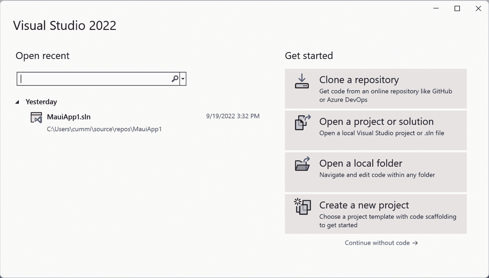
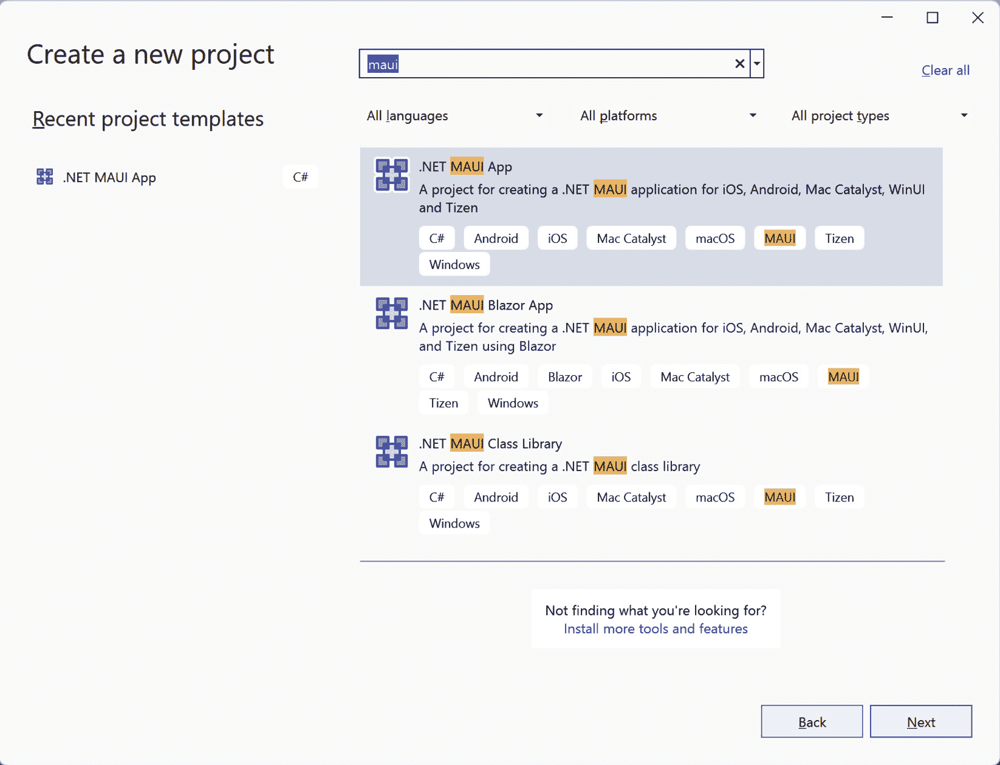
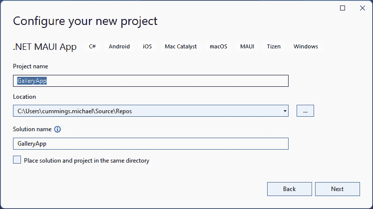
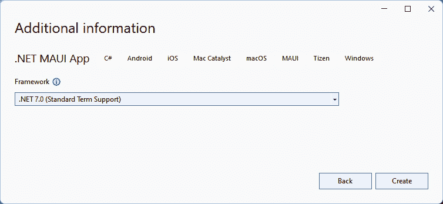

# 第六章：使用 CollectionView 和 CarouselView 构建 Photo Gallery 应用程序

在本章中，我们将构建一个应用程序，展示用户设备相册（照片库）中的照片。用户还可以选择照片作为收藏夹。然后我们将探讨不同的照片显示方式——在轮播图中和在多列网格控件中。通过使用 .NET MAUI `CarouselView` 控件显示一组图像，用户可以滑动查看每张图像。为了显示大量图像，我们将使用 .NET MAUI `CollectionView` 控件和垂直滚动，以便用户查看所有图像。通过学习如何使用这些控件，我们将在构建实际应用程序时能够将它们用于许多其他情况。

本章将涵盖以下主题：

+   从用户请求访问数据的权限

+   如何从 iOS 和 Mac Catalyst 照片库导入照片

+   如何从 Android 照片库导入照片

+   如何从 Windows 照片库导入照片

+   如何在 .NET MAUI 中使用 `CarouselView`

+   如何在 .NET MAUI 中使用 `CollectionView`

# 技术要求

要完成此项目，您需要安装 Visual Studio for Mac 或 Windows，以及必要的 .NET MAUI 工作负载。有关如何设置环境的更多详细信息，请参阅 *第一章*，*.NET MAUI 简介*。

要使用 Visual Studio for PC 构建 iOS 应用程序，您必须连接一个 **Macintosh**（**Mac**）设备。如果您根本无法访问 Mac，您可以只遵循此项目的 Android 和 Windows 部分。

您可以在本章中找到代码的完整源代码，请访问 [`github.com/PacktPublishing/MAUI-Projects-3rd-Edition/`](https://github.com/PacktPublishing/MAUI-Projects-3rd-Edition/)。

# 项目概述

几乎所有应用程序都会可视化数据集合，在本章中，我们将重点关注两个可以用于显示数据集合的 .NET MAUI 控件——`CollectionView` 和 `CarouselView`。我们的应用程序将展示用户设备上的照片；为此，我们需要为每个平台创建一个照片导入器——一个用于 iOS 和 Mac Catalyst，一个用于 Windows，一个用于 Android。

此项目的构建时间约为 60 分钟。

# 构建 Photo Gallery 应用程序

此项目，就像所有其他项目一样，是一个 **文件** | **新建** | **项目...** 风格的项目，这意味着我们根本不会导入任何代码。因此，本节全部关于创建项目和设置基本项目结构。

是时候开始使用以下步骤构建应用程序了。让我们开始吧！

## 创建新项目

第一步是创建一个新的 .NET MAUI 项目：

1.  打开 Visual Studio 2022 并选择 **创建新项目**：



图 6.1 – Visual Studio 2022

这将打开 **创建新项目** 向导。

1.  在搜索框中输入 `maui` 并从列表中选择 **.NET MAUI 应用** 项：



图 6.2 – 创建新项目

1.  点击 **下一步**。

1.  通过命名您的项目来完成向导的下一步。在本例中，我们将我们的应用程序命名为 `GalleryApp`。通过点击 **下一步**，继续到下一个对话框，如图所示：



图 6.3 – 配置您的项目

1.  点击 **下一步**。

1.  最后一步将提示您选择要支持的 .NET Core 版本。在撰写本文时，.NET 6 可用为 **长期支持**（**LTS**），而 .NET 7 可用为 **标准期限支持**。在本书中，我们假设您将使用 .NET 7。



图 6.4 – 补充信息

1.  通过点击 **创建** 并等待 Visual Studio 创建项目来最终完成设置。

就这样，应用程序就创建完成了。让我们先获取一些照片来显示。

## 导入照片

照片的导入是在所有平台上执行的操作，因此我们将创建一个照片导入接口。该接口将有两个 `Get` 方法—一个支持分页，另一个获取指定文件名的照片。这两种方法也将接受一个质量参数，但我们只会在 iOS 照片导入器中使用该参数。质量参数将是一个具有两个选项的 `enum` 类型—`High` 和 `Low`。然而，在我们创建接口之前，我们将创建一个模型类，该类将使用以下步骤表示导入的照片：

1.  在 `GalleryApp` 项目中创建一个名为 `Models` 的新文件夹。

1.  在最近创建的文件夹中创建一个名为 `Photo` 的新类：

    ```cs
    namespace GalleryApp.Models;
    public class Photo
    {
      public string Filename { get; set; }
      public byte[] Bytes { get; set; }
    }
    ```

现在我们已经创建了模型类，我们可以继续创建接口：

1.  在项目中创建一个名为 `Services` 的新文件夹。

1.  在 `Services` 文件夹中创建一个名为 `IPhotoImporter` 的新接口：

    ```cs
    namespace GalleryApp.Services;
    using System.Collections.ObjectModel;
    using GalleryApp.Models;
    public interface IPhotoImporter
    {
      Task<ObservableCollection<Photo>> Get(int start, int  count, 
    Quality quality = Quality.Low);
      Task<ObservableCollection<Photo>> Get(List<string> filenames, 
    Quality quality = Quality.Low);
    }
    ```

1.  在 `Services` 文件夹中，添加一个新文件并创建一个名为 `Quality` 的 `enum` 类型，包含两个成员—`Low` 和 `High`：

    ```cs
    namespace GalleryApp.Services;
    public enum Quality
    {
      Low,
      High
    }
    ```

1.  在 `Services` 文件夹中创建一个名为 `PhotoImporter` 的新类：

    ```cs
    namespace GalleryApp.Services;
    using GalleryApp.Models;
    using System.Collections.ObjectModel;
    internal partial class PhotoImporter : IPhotoImporter
    {
      private partial Task<string[]> Import();
      public partial Task<ObservableCollection<Photo>> Get(int 
    start, int count, Quality quality);
      public partial Task<ObservableCollection<Photo>> 
    Get(List<string> filenames, Quality quality);
    }
    ```

    此类为我们提供了特定平台实现的基础。通过将其标记为 `partial`，我们告诉编译器该类在其他文件中还有更多内容。我们将在稍后把实现放在特定平台的文件夹中。

现在我们有了接口，我们可以添加应用程序权限。

### 请求应用程序权限

如果您的应用程序不需要设备任何额外的功能，如位置、相机或互联网，那么您将需要使用权限来请求访问这些资源。虽然每个平台对权限的实现略有不同，但 .NET MAUI 将特定平台的权限映射到一组通用的权限，以简化操作。.NET MAUI 的权限系统也是可扩展的，这样您就可以创建最适合您应用程序的自定义权限。

让我们通过一个具体的例子来看看请求权限是如何工作的。`GalleryApp` 显示来自设备照片库的图片。在 iOS 和 Android 的案例中，应用必须在能够使用照片库之前声明并请求访问权限。虽然这些权限的配置和命名方式不同，但 .NET MAUI 定义了一个 `Photo` 权限，隐藏了这些实现细节。

按照以下步骤向 `GalleryApp` 添加权限检查：

1.  在 `GalleryApp` 项目中创建一个名为 `AppPermissions` 的新类。

1.  修改类定义以添加 `partial` 修饰符，并移除默认构造函数：

    ```cs
    namespace GalleryApp;
    internal partial class AppPermissions
    {
    }
    ```

1.  将以下类定义添加到 `AppPermissions` 类中：

    ```cs
    internal partial class AppPermissions
    {
      internal partial class AppPermission : Permissions.Photos
      {
      }
    }
    ```

    这创建了一个名为 `AppPermission` 的类型，它从默认的 .NET MAUI `Photos` 权限类继承。它也被标记为 `partial`，以便添加特定于平台的实现细节。剧透一下：我们将需要一些特定于平台的权限。

1.  将以下方法添加到 `AppPermissions` 类中：

    ```cs
    public static async Task<PermissionStatus> 
    CheckRequiredPermission() => await Permissions.
    CheckStatusAsync<AppPermission>();
    ```

    `CheckRequiredPermission` 方法用于确保在我们尝试任何可能会因为权限不足而失败的操作之前，我们的应用拥有正确的权限。其实现是调用 .NET MAUI 的 `CheckSyncStatus` 方法，并使用我们的 `AppPermission` 类型。它返回一个 `PermissionStatus`，这是一个枚举类型。我们主要对 `Denied` 和 `Granted` 值感兴趣。

1.  将 `CheckAndRequestRequiredPermission` 方法添加到 `AppPermissions` 类中：

    ```cs
    public static async Task<PermissionStatus> 
    CheckAndRequestRequiredPermission()
    {
      PermissionStatus status = await Permissions.
    CheckStatusAsync<AppPermission>();
      if (status == PermissionStatus.Granted)
                return status;
      if (status == PermissionStatus.Denied && DeviceInfo.Platform 
    == DevicePlatform.iOS)
      {
        // Prompt the user to turn on in settings
        // On iOS once a permission has been denied it may not be 
    requested again from the application
        await App.Current.MainPage.DisplayAlert("Required App 
    Permissions", "Please enable all permissions in Settings for 
    this App, it is useless without them.", "Ok");
      }
      if
      (Permissions.ShouldShowRationale<AppPermission>())
      {
        // Prompt the user with additional information as to why the 
    permission is needed
        await App.Current.MainPage.DisplayAlert("Required App 
    Permissions", "This is a Photo gallery app, without these 
    permissions it is useless.", "Ok");
      }
      status = await MainThread.InvokeOnMainThreadAsync(Permissions.
    RequestAsync<AppPermission>);
      return status;
      }
    }
    ```

    `CheckAndRequestRequiredPermission` 方法处理从用户请求访问权限的复杂性。第一步是简单地检查权限是否已经被授予，如果是，则返回状态。接下来，如果您在 iOS 上且权限已被拒绝，则无法再次请求，因此您必须指导用户如何通过设置面板授予应用权限。在请求行为中，Android 包括如果用户拒绝访问时骚扰用户的能力。这种行为通过 .NET MAUI 的 `ShouldShowRationale` 方法公开。对于不支持此行为的任何平台，它将返回 `false`；在 Android 上，第一次用户拒绝访问时将返回 `true`，如果用户第二次拒绝，则返回 `false`。最后，我们请求用户对 `AppPermission` 进行访问。同样，.NET MAUI 正在隐藏所有平台实现细节，使得检查和请求访问某些资源变得非常直接。

看起来熟悉吗？

如果前面的代码看起来很熟悉，那可能是因为它。这正是 .NET MAUI 文档中描述的实现。您可以在 [`learn.microsoft.com/en-us/dotnet/maui/platform-integration/appmodel/permissions`](https://learn.microsoft.com/en-us/dotnet/maui/platform-integration/appmodel/permissions) 找到它。

现在我们已经设置了共享的 `AppPermissions`，我们可以开始平台实现。

### 从 iOS 照片库导入照片

首先，我们将编写 iOS 代码。为了访问照片，我们需要用户的权限，并且我们需要解释为什么我们需要请求权限。为此，我们将解释为什么需要权限的文本添加到 `info.plist` 文件中。当请求用户权限时，将显示此文本。要打开 `info.plist` 文件，在 `Platforms/iOS` 文件夹中的文件上右键单击并点击 `Info.plist` 编辑器。将以下文本添加到 `<``dict>` 元素的末尾：

```cs
<key> NSPhotoLibraryUsageDescription </key>
<string> We want to show your photos in this app </string>
```

我们将要做的第一件事是实现 `Import` 方法，该方法读取可以加载哪些照片：

1.  在 `Platforms/iOS` 文件夹中的 `GalleryApp` 项目中，创建一个名为 `PhotoImporter` 的新类。

1.  将命名空间声明从 `GalleryApp.Platforms.iOS` 更改为 `GalleryApp.Services`。

1.  即使部分类定义在不同的文件夹中，它们也必须在同一个命名空间中。

1.  添加 `partial` 修饰符。

1.  解析所有引用。

1.  创建一个名为 `assets` 的 `PHAsset` 字典的 `private` 字段。这将用于存储照片信息：

    ```cs
    private Dictionary<string,PHAsset> assets;
    ```

1.  创建一个名为 `Import` 的新 `private partial` 方法：

    ```cs
    private partial async Task<string[]> Import()
    {
    }
    ```

1.  在 `Import` 方法中，使用 `AppPermissions.Check``AndRequestRequiredPermission` 方法请求授权：

    ```cs
    var status = await AppPermissions.
    CheckAndRequestRequiredPermission();
    ```

1.  如果用户已经授予访问权限，则使用 `PHAsset.FetchAssets` 通过 `PHAsset` 获取所有图像资产：

    ```cs
    internal partial class PhotoImporter
    {
      private Dictionary<string,PHAsset> assets;
      private partial async Task<string[]> Import()
      {
        var status = await AppPermissions.
    CheckAndRequestRequiredPermission();
        if (status == PermissionStatus.Granted)
        {
          assets = PHAsset.FetchAssets(PHAssetMediaType.Image, null)
          .Select(x => (PHAsset)x)
          .ToDictionary(asset => asset.
    ValueForKey((NSString)"filename").ToString(), asset => asset);
        }
        return assets?.Keys.ToList().ToArray();
    }
    ```

现在，我们已经获取了所有照片的 `PHAssets`，但要显示照片，我们需要获取实际的照片。在 iOS 上，为了做到这一点，我们需要请求资产的图像。这是一项异步执行的操作，因此我们将使用 `ObservableCollection`：

```cs
private void AddImage(ObservableCollection<Photo> photos, string path, 
PHAsset asset, Quality quality)
  {
    var options = new PHImageRequestOptions()
    {
      NetworkAccessAllowed = true,
      DeliveryMode = quality == Quality.Low ?
      PHImageRequestOptionsDeliveryMode.FastFormat :
      PHImageRequestOptionsDeliveryMode.HighQualityFormat
    };
        PHImageManager.DefaultManager.RequestImageForAsset(asset, 
PHImageManager.MaximumSize, PHImageContentMode.AspectFill, options, 
(image, info) =>
    {
      using NSData imageData = image.AsPNG();
      var bytes = new byte[imageData.Length];
             System.Runtime.InteropServices.Marshal.Copy(imageData.
Bytes, bytes, 0, Convert.ToInt32(imageData.Length));
      photos.Add(new Photo()
      {
        Bytes = bytes,
        Filename = Path.GetFileName(path)
      });
    });
  }
```

现在，我们已经拥有了开始实现接口中的两个 `Get` 方法所需的一切。我们将从部分 `Task<ObservableCollection<Photo>> Get(int start, int count, Quality quality = Quality.Low)` 方法开始，该方法将用于从加载照片的 `CollectionView` 视图中获取照片：

```cs
public partial async Task<ObservableCollection<Photo>> Get(int start, 
int count, Quality quality)
  {
    var photos = new ObservableCollection<Photo>();
    var status = await AppPermissions.
CheckAndRequestRequiredPermission();
    if (status == PermissionStatus.Granted)
    {
      var result = await Import();
      if (result.Length == 0)
      {
        return photos;
      }
      Index startIndex = start;
      Index endIndex = start + count;
      if (endIndex.Value >= result.Length)
      {
        endIndex = result.Length;
      }
      if (startIndex.Value > endIndex.Value)
      {
        return photos;
      }
      foreach (var path in result[startIndex..endIndex])
      {
        AddImage(photos, path, assets[path], quality);
      }
    }
    return photos;
  }
```

来自 `IPhotoImporter` 接口的另一个方法 `Task<ObservableCollection<Photo>> Get(List<string> filenames, Quality quality = Quality.Low)` 与 `Task<ObservableCollection<Photo>> Get(int start, int count, Quality quality = Quality.Low)` 方法非常相似。唯一的区别是没有处理索引的代码，并且遍历结果数组的 `foreach` 循环包含一个 `if` 语句，检查文件名是否与当前的 `PHAsset` 对象相同，如果是，则调用 `AddImage` 方法：

```cs
public partial async Task<ObservableCollection<Photo>> 
Get(List<string> filenames, Quality quality)
  {
    var photos = new ObservableCollection<Photo>();
    var result = await Import();
    if (result?.Length == 0)
    {
      return photos;
    }
    foreach (var path in result)
    {
      if (filenames.Contains(path))
      {
        AddImage(photos, path, assets[path], quality);
      }
    }
    return photos;
  }
```

在前面的代码中，我们设置了 `NetworkAccessAllowed = true`。我们这样做是为了使下载来自 **iCloud** 的照片成为可能。

现在，我们项目中的四个照片导入器之一已经完成。下一个我们将实现的是 Mac Catalyst 导入器。

### 从 Mac Catalyst 照片库导入照片

Mac Catalyst 导入器与我们刚刚为 iOS 所做的是完全相同的。然而，并没有一种方便的方式来表达，“*我只需要这个类用于 iOS 和 Mac Catalyst，而不需要其他任何东西。*”因此，我们将走最简单的路径，直接将类复制到 Mac Catalyst 平台文件夹中：

1.  右键单击项目中的`Platforms/iOS`文件夹中的`PhotoImporter.cs`文件并选择**复制**。

1.  右键单击`Platforms/MacCatalyst`文件夹并选择**粘贴**。

1.  右键单击`Platforms/MacCatalyst`文件夹中的`Info.plist`文件并点击`<dict>`元素：

    ```cs
    <key> NSPhotoLibraryUsageDescription </key>
    <string> We want to show your photos in this app </string>
    ```

这就完成了`PhotoImporter`类的 Mac Catalyst 实现。接下来，我们将着手处理 Android 平台。

### 从 Android 照片库导入图片

现在我们已经为 iOS 创建了一个实现，我们将为 Android 做同样的处理。在我们直接进入导入器之前，我们需要解决 Android 上的权限问题。

在 Android API 版本 33 中，添加了三个新权限以启用对媒体文件的读取访问：`ReadMediaImages`、`ReadMediaVideos`和`ReadMediaAudio`。在 API 版本 33 之前，所需的只是`ReadExternalStorage`权限。为了正确请求设备的 API 版本的正确权限，在`Platform/Android`文件夹中创建一个名为`AppPermissions`的新文件，并将其修改如下：

```cs
using Android.OS;
[assembly: Android.App.UsesPermission(Android.Manifest.Permission.
ReadMediaImages)]
[assembly: Android.App.UsesPermission(Android.Manifest.Permission.
ReadExternalStorage, MaxSdkVersion = 32)]
namespace GalleryApp;
internal partial class AppPermissions
{
  internal partial class AppPermission : Permissions.Photos
  {
    public override (string androidPermission, bool isRuntime)[] 
RequiredPermissions
    {
      get
      {
        List<(string androidPermission, bool isRuntime)> perms = new();
        if (Build.VERSION.SdkInt >= BuildVersionCodes.Tiramisu)
                    perms.Add((global::Android.Manifest.Permission.
ReadMediaImages, true));
        else
                    perms.Add((global::Android.Manifest.Permission.
ReadExternalStorage, true));
        return perms.ToArray();
      }
    }
  }
}
```

前两行将所需的权限添加到`AndroidManifet.xml`文件中，这与我们手动对 iOS 的`info.plist`文件所做的是类似的。然而，我们只需要`ReadMediaImages`权限用于 API 33 及以上版本，以及`ReadExternalStorage`权限用于低于 33 版本的 API 版本，因此我们为`ReadExternalStorage`属性设置了`MaxSdkVersion`。然后，我们通过实现`RequirePermissions`属性来扩展`AppPermission`类。在`RequirePermissions`中，如果 API 版本为 33 或更高，我们返回包含`ReadMediaImages`权限的数组；如果 API 版本低于 33，则返回`ReadExternalStorage`权限。`perms`数组中的布尔值表示权限是否需要在运行时请求用户的访问权限。现在，当应用启动时，它将根据设备的 API 级别请求正确的权限。

现在我们已经整理好了 Android 特定的权限，我们可以按照以下步骤导入图片：

1.  在`Platforms/Android`文件夹中的项目中创建一个名为`PhotoImporter`的新类。

1.  将命名空间声明从`GalleryApp.Platforms.Android`更改为`GalleryApp.Services`。

1.  即使部分类定义在不同的文件夹中，它们也必须在同一个命名空间中。

1.  添加`partial`修饰符。

1.  添加一个`using`语句以使用`GalleryApp.Models`中的`Photo`类。

1.  与 iOS 实现类似，我们将首先实现`Import`方法。添加一个名为`Import`的新方法，如下所示：

    ```cs
    private partial async Task<string[]> Import()
    {
      var paths = new List<string>();
      return paths.ToArray();
    }
    ```

1.  从用户那里请求权限以获取照片（以下代码块中突出显示）：

    ```cs
    private partial async Task<string[]> Import()
    {
      var paths = new List<string>();
      var status = await AppPermissions.
    CheckAndRequestRequiredPermission();
      if (status == PermissionStatus.Granted)
      {
      }
      return paths.ToArray();
    }
    ```

1.  现在，使用 `ContentResolver` 查询文件并将它们添加到结果中：

    ```cs
    private partial async Task<string[]> Import()
    {
      var paths = new List<string>();
      var status = await AppPermissions.
    CheckAndRequestRequiredPermission();
      if (status == PermissionStatus.Granted)
      {
        var imageUri = MediaStore.Images.Media.ExternalContentUri;
        var projection = new string[] { MediaStore.IMediaColumns.
    Data };
        var orderBy = MediaStore.Images.IImageColumns.DateTaken;
        var cursor = Platform.CurrentActivity.ContentResolver.
    Query(imageUri, projection, null, null, orderBy);
        while (cursor.MoveToNext())
        {
          string path = cursor.GetString(cursor.
    GetColumnIndex(MediaStore.IMediaColumns.Data));
          paths.Add(path);
        }
      }
      return paths.ToArray();
    }
    ```

然后，我们将开始编辑 `Task<ObservableCollection<Photo>> Get(int start, int count, Quality quality = Quality.Low)` 方法。如果导入成功，我们将继续编写处理在此图像加载中应导入哪些照片的代码。条件由 `start` 和 `count` 参数指定。使用以下代码列表来实现第一个 `Get` 方法：

```cs
public partial async Task<ObservableCollection<Photo>> Get(int start, 
int count, Quality quality)
{
  var photos = new ObservableCollection<Photo>();
  var result = await Import();
  if (result.Length == 0)
  {
    return photos;
  }
  Index startIndex = start;
  Index endIndex = start + count;
  if (endIndex.Value >= result.Length)
  {
    endIndex = result.Length;
  }
  if (startIndex.Value > endIndex.Value)
  {
    return photos;
  }
  foreach (var path in result[startIndex..endIndex])
  {
    photos.Add(new()
    {
      Bytes = File.ReadAllBytes(path),
      Filename = Path.GetFileName(path)
    });
  }
  return photos;
}
```

让我们回顾一下前面的代码。第一步是调用 `Import` 方法并验证是否有照片要导入。如果没有，我们简单地返回一个空列表。如果有照片要导入，那么我们需要知道 `photos` 数组中的 `startIndex` 和 `endIndex` 以导入。代码默认 `endIndex` 为 `startIndex` 加上要导入的照片数量。如果要导入的照片数量大于 `Import` 方法返回的照片数量，则将 `endindex` 调整为 `Import` 方法返回的照片长度。如果 `startIndex` 大于 `endIndex`，则返回照片列表。最后，我们可以从照片数组中读取 `startIndex` 到 `endIndex` 的图像，并返回每个条目的文件字节和文件名。

现在，我们将继续处理其他 `Task<ObservableCollection<Photo>> Get` **(List<string> filenames, Quality quality =** `Quality.Low)` 方法。

创建一个 `foreach` 循环来遍历所有照片并检查每个照片是否在 `filenames` 参数中指定。如果照片在 `filenames` 参数中指定，则从路径读取照片，就像第一个 `Get` 方法一样：

```cs
public partial async Task<ObservableCollection<Photo>> 
Get(List<string> filenames, Quality quality)
{
  var photos = new ObservableCollection<Photo>();
  var result = await Import();
  if (result.Length == 0)
  {
    return photos;
  }
  foreach (var path in result)
  {
    var filename = Path.GetFileName(path);
    if (!filenames.Contains(filename))
    {
      continue;
    }
    photos.Add(new Photo()
    {
      Bytes = File.ReadAllBytes(path),
      Filename = filename
    });
  }
  return photos;
}
```

随着 Android 导入器的完成，我们可以转向 Windows 的最终导入器。

### 从 Windows 照片库导入照片

我们需要的最终导入器是为 Windows 平台。代码将遵循与其他平台相同的模式；然而，对于 Windows，我们将使用 **Windows 搜索** 服务来获取照片列表。让我们通过以下步骤查看此平台是如何实现的：

1.  导入 `tlbimp-Windows.Search.Interop` 和 `System.Data.OleDB` NuGet 包。这些包用于在文件系统中搜索图像。

1.  通过在 **解决方案资源管理器** 中双击它来打开 `GalleryApp` 项目；编辑新的导入以添加一个条件：

    ```cs
    <PackageReference Include="System.Data.OleDb" Version="7.0.0" 
    Condition="$([MSBuild]::GetTargetPlatformIdentifier('$(Target
    Framework)')) == 'windows'" />
    <PackageReference Include="tlbimp-Microsoft.Search.Interop" 
    Version="1.0.0" Condition="$([MSBuild]::GetTargetPlatform
    PackageReference so that it is only used when TargetPlatformIdentifier is 'windows'.
    ```

1.  在 `Windows` 平台文件夹中创建一个名为 `PhotoImporter` 的新类，并将其标记为 `partial`。

1.  将命名空间声明从 `GalleryApp.Platforms.Windows` 更改为 `GalleryApp.Services`。

1.  `partial` 类定义必须在同一个命名空间中，即使它们在不同的文件夹中。

1.  添加 `using` 指令，以便我们可以使用那些命名空间中的类：

    ```cs
    using GalleryApp.Models;
    using Microsoft.Search.Interop;
    using System.Data.OleDb;
    ```

1.  向 `QueryHelper` 引用添加一个 `private` 字段：

    ```cs
    ISearchQueryHelper queryHelper;
    ```

1.  与之前的实现类似，我们将首先实现 `Import` 方法，因此添加一个名为 `Import` 的新方法，如下所示：

    ```cs
    private partial async Task<string[]> Import()
    {
      var paths = new List<string>();
      return paths.ToArray();
    }
    ```

1.  从用户那里请求权限以获取照片（以下代码块中突出显示）：

    ```cs
    private partial async Task<string[]> Import()
    {
      var paths = new List<string>();
      var status = await AppPermissions.
    CheckAndRequestRequiredPermission();
      if (status == PermissionStatus.Granted)
      {
      }
      return paths.ToArray();
    }
    ```

1.  现在，使用`QueryHelper`获取所有图像路径：

    ```cs
    private partial async Task<string[]> Import()
    {
      var paths = new List<string>();
      var status = await AppPermissions.
    CheckAndRequestRequiredPermission();
      if (status == PermissionStatus.Granted)
      {
        string sqlQuery = queryHelper.GenerateSQLFromUserQuery(" ");
        using OleDbConnection conn = new(queryHelper.
    ConnectionString);
        conn.Open();
        using OleDbCommand command = new(sqlQuery, conn);
        using OleDbDataReader WDSResults = command.ExecuteReader();
        while (WDSResults.Read())
        {
          var itemUrl = WDSResults.GetString(0);
          paths.Add(itemUrl);
        }
      }
      return paths.ToArray();
    }
    ```

    在这里，使用`QueryHelper`创建一个 SQL 查询，并使用`OleDbConnection`查询搜索索引以获取所有匹配的文件。

我们现在可以开始编辑`Task<ObservableCollection<Photo>> Get(int start, int count, Quality quality = Quality.Low)`方法。将以下声明添加到`PhotoImporter`类中：

```cs
public partial async Task<ObservableCollection<Photo>> Get(int start, 
int count, Quality quality)
{
}
```

现在，我们将开始实现方法，设置文件模式和我们将要搜索的位置：

```cs
string[] patterns = { ".png", ".jpeg", ".jpg" };
string[] locations = {
Environment.GetFolderPath(Environment.SpecialFolder.MyPictures),
      Environment.GetFolderPath(Environment.SpecialFolder.
CommonPictures),
     Path.Combine(Environment.GetFolderPath(Environment.SpecialFolder.
UserProfile),"OneDrive","Camera Roll")
};
```

这些数组定义了我们将会搜索的文件扩展名和文件夹，我们将从`tlbimp-Windows.Search.Interop` NuGet 包中创建`QueryHelper`，并使用这些数组来配置查询参数：

```cs
queryHelper = new CSearchManager().GetCatalog("SystemIndex").
GetQueryHelper();
queryHelper.QueryMaxResults = start + count;
queryHelper.QuerySelectColumns = "System.ItemPathDisplay";
queryHelper.QueryWhereRestrictions = "AND (";
foreach (var pattern in patterns)
     queryHelper.QueryWhereRestrictions += " Contains(System.
FileExtension, '" + pattern + "') OR";
queryHelper.QueryWhereRestrictions = queryHelper.
QueryWhereRestrictions[..²];
queryHelper.QueryWhereRestrictions += ")";
queryHelper.QueryWhereRestrictions += " AND (";
foreach (var location in locations)
     queryHelper.QueryWhereRestrictions += " scope='" + location + "' 
OR";
queryHelper.QueryWhereRestrictions = queryHelper.
QueryWhereRestrictions[..²];
queryHelper.QueryWhereRestrictions += ")";
queryHelper.QuerySorting = "System.DateModified DESC";
```

将`QueryMaxResults`设置为只检索我们正在寻找的结果。然后，我们指定只返回数据列`"System.ItemPathDisplay"`。接下来，我们从我们的扩展名列表中设置`QueryWhereRestrictions`。注意在查询字符串中移除尾随的`"OR"`时使用了`range`运算符。我们使用相同的技巧将位置添加到`QueryWhereRestrictions`中。最后，我们设置排序顺序。

方法的其余部分将与之前平台的类似。如果导入成功，我们将继续处理这次加载图像中应该导入的照片。条件由`start`和`count`参数指定。使用以下代码列表来完成第一个`Get`方法的实现：

```cs
var photos = new ObservableCollection<Photo>();
var result = await Import();
if (result?.Length == 0)
{
  return photos;
}
Index startIndex = start;
Index endIndex = start + count;
if (endIndex.Value >= result.Length)
{
  endIndex = result.Length;
}
if (startIndex.Value > endIndex.Value)
{
  return photos;
}
foreach (var uri in result[startIndex..endIndex])
{
  var path = new System.Uri(uri).AbsolutePath;
  photos.Add(new()
  {
    Bytes = File.ReadAllBytes(path),
    Filename = Path.GetFileName(path)
  });
}
return photos;
```

让我们快速回顾一下前面的代码。第一步是调用`Import`方法并验证是否有照片要导入。如果没有，我们简单地返回一个空列表。如果有照片要导入，那么我们需要知道`photos`数组中的`startIndex`和`endIndex`以导入。`startIndex`和`endIndex`被调整以确保它们对于要导入的照片是有效的。然后，我们可以从照片数组中读取从`startIndex`到`endIndex`的图像，并返回每个条目的文件字节和文件名。

现在，我们将继续其他`Task<ObservableCollection<Photo>> Get(List<string> filenames, Quality quality = Quality.Low)`方法。将以下声明添加到`PhotoImporter`类中：

```cs
public partial async Task<ObservableCollection<Photo>> 
Get(List<string> filenames, Quality quality)
{
}
```

现在，我们将开始实现方法，设置搜索参数：

```cs
queryHelper = new CSearchManager().GetCatalog("SystemIndex").
GetQueryHelper();
queryHelper.QuerySelectColumns = "System.ItemPathDisplay";
queryHelper.QueryWhereRestrictions = "AND (";
foreach (var filename in filenames)
     queryHelper.QueryWhereRestrictions += " Contains(System.Filename, 
'" + filename + "') OR";
queryHelper.QueryWhereRestrictions = queryHelper.
QueryWhereRestrictions[..²];
queryHelper.QueryWhereRestrictions += ")";
```

对于这个方法，我们只需要将所有文件名添加到`QueryWhereRestrictions`中。随后，调用`Import`方法，如果它返回结果，则使用`foreach`循环遍历所有照片，并检查每张照片是否在`filenames`参数中指定。如果照片在`filenames`参数中指定，则从路径读取照片，就像第一个`Get`方法中那样：

```cs
var photos = new ObservableCollection<Photo>();
var result = await Import();
if (result?.Length == 0)
{
  return photos;
}
foreach (var uri in result)
{
  var path = new System.Uri(uri).AbsolutePath;
  var filename = Path.GetFileName(path);
  if (filenames.Contains(filename))
  {
    photos.Add(new()
    {
      Bytes = File.ReadAllBytes(path),
      Filename = filename
    });
  }
}
return photos;
```

照片导入器现在已经完成，我们准备编写应用程序的其余部分，这主要涉及添加在各个平台之间共享的代码。

### 编写应用初始化代码

我们现在已经编写了将用于获取数据的代码。让我们继续构建应用，从初始化应用的核心部分开始。

### 配置依赖注入

通过使用依赖注入作为模式，我们可以使我们的代码更干净、更易于测试。此应用将使用构造函数注入，这意味着一个类所拥有的所有依赖项都必须通过其构造函数传递。然后容器为您构建对象，因此您不必太关心依赖链。由于.NET MAUI 已经包含了依赖注入框架**Microsoft.Extensions.DependencyInjection**，因此无需安装任何额外的内容。

对依赖注入感到困惑？

在*第二章*，*构建我们的第一个.NET MAUI 应用*中查看*配置依赖注入*部分，以获取有关依赖注入的更多详细信息。

虽然建议使用扩展方法来分组类型，但在此应用中要注册的类型很少，所以我们将在下一节中使用不同的方法。

#### 使用依赖注入注册 PhotoImporter

让我们添加必要的代码来注册我们迄今为止创建的类型，如下所示：

1.  在`GalleryApp`项目中，打开`MauiProgram.cs`。

1.  对`MauiProgram`类进行以下更改（更改已突出显示）：

    ```cs
    using GalleryApp.Services;
    using Microsoft.Extensions.Logging;
    public static class MauiProgram
    {
      public static MauiApp CreateMauiApp()
      {
        var builder = MauiApp.CreateBuilder();
        builder
          .UseMauiApp<App>()
          .ConfigureFonts(fonts =>
          {
            fonts.AddFont("OpenSans-Regular.ttf", 
    "OpenSansRegular");
            fonts.AddFont("OpenSans-Semibold.ttf", 
    "OpenSansSemibold");
          });
    #if DEBUG
        builder.Logging.AddDebug();
    #endif
      builder.Services.AddSingleton<IPhotoImporter>(serviceProvider 
    => new PhotoImporter());
        return builder.Build();
      }
    }
    ```

.NET MAUI 的`MauiAppBuilder`类公开了`Services`属性，它是依赖注入容器。我们只需添加我们想要依赖注入了解的类型，容器就会为我们完成剩余的工作。顺便说一句，将构建器视为收集大量需要完成的信息的东西，然后构建我们需要的对象。它是一个非常有用的模式。

目前我们只使用构建器做一件事。稍后，我们将使用它来注册程序集中从我们的抽象`ViewModel`类和视图继承的任何类。容器现在已为我们准备好，以便我们可以请求这些类型。

### 创建外壳

此应用的主要导航将在屏幕底部显示标签。应用将有一个飞出菜单，包含两个选项——**主页**和**画廊**：

1.  在项目中创建一个名为`Views`的新文件夹。

1.  在`Views`文件夹中，使用`MainView`创建两个新文件，并命名为`GalleryView`。

1.  从项目的根目录中删除`MainPage.Xaml`和`MainPage.Xaml.cs`文件，因为我们不再需要那些文件。

1.  打开项目根目录中的`AppShell.xaml`文件。

    使用`ShellContent`的`ContentTemplate`属性将两个视图添加到`Shell`对象中。使用`DataTemplate`标记扩展从依赖注入容器中加载视图：

    ```cs
    <?xml version="1.0" encoding="UTF-8" ?>
    <Shell
        x:Class="GalleryApp.AppShell"

        >
        <ShellContent Title="Home" ContentTemplate="{DataTemplate views:MainView}" />
        <ShellContent Title="Gallery" ContentTemplate="{DataTemplate views:GalleryView}" />
    </Shell>
    ```

1.  由于视图是通过`DataTemplates`加载的，它们必须与依赖注入进行注册。在`MauiProgram.cs`文件中，在`IPhotoInmporter`行之后添加突出显示的代码：

    ```cs
            builder.Services.
    AddSingleton<IPhotoImporter>(serviceProvider => new 
    PhotoImporter());
            builder.Services.AddTransient<Views.MainView>();
            builder.Services.AddTransient<Views.GalleryView>();
    return builder.Build();
    ```

现在我们已经创建了一个外壳，在开始创建视图之前，让我们继续编写一些其他的基础代码。

### 创建基视图模型

在创建实际视图模型之前，我们将创建一个所有视图模型都可以继承的抽象基视图模型。这个基视图模型背后的想法是我们可以在其中编写通用代码。在这种情况下，我们将通过以下步骤实现 `INotifyPropertyChanged` 接口：

1.  在 `GalleryApp` 项目中，创建一个名为 `ViewModels` 的文件夹。

1.  将 `CommunityToolkit.Mvvm` 添加为 NuGet 引用；我们使用 `CommunityToolkit.Mvvm` 来实现 `INotifyPropertyChanged` 接口，就像在其他章节中做的那样。

1.  创建一个新的抽象类名为 `ViewModel`：

    ```cs
    namespace GalleryApp.ViewModels;
    using CommunityToolkit.Mvvm.ComponentModel;
    public abstract partial class ViewModel: ObservableObject
    {
        [ObservableProperty]
        [NotifyPropertyChangedFor(nameof(IsNotBusy))]
        private bool isBusy;
        public bool IsNotBusy => !IsBusy;
        abstract protected internal Task Initialize();
    }
    ```

在此应用的 `ViewModel` 类中，我们为 `Initialize` 添加了一个抽象方法。每个 `ViewModel` 实现都将覆盖此方法并异步加载图像以供显示。`IsBusy` 和 `NotIsBusy` 属性用作标志，指示数据何时完成加载。

现在，我们有一个 `ViewModel` 基类，我们可以用于在此项目中稍后创建的所有 `ViewModel` 实例。

## 创建画廊视图

现在，我们将开始构建视图。我们将从画廊视图开始，该视图将作为网格显示照片。我们将从 `GalleryViewModel` 开始，然后创建 `GalleryView`。首先创建视图模型允许 Visual Studio 使用 `GalleryViewModel` 定义来检查 XAML 文件中的数据绑定语法。

### 创建 GalleryViewModel

`GalleryViewModel` 是负责获取数据和处理视图逻辑的类。由于照片将被异步添加到照片集合中，我们不想在调用 `PhotoImporter` 的 `Get` 方法后立即将 `IsBusy` 设置为 `false`。相反，我们首先等待 3 秒钟。然而，我们也会向集合添加一个事件监听器，以便我们可以监听变化。如果集合发生变化并且其中包含项目，我们将 `IsBusy` 设置为 `false`。在 `ViewModels` 文件夹中创建一个名为 `GalleryViewModel` 的类，并添加以下代码以实现此功能：

```cs
namespace GalleryApp.ViewModels;
using CommunityToolkit.Mvvm.ComponentModel;
using GalleryApp.Models;
using GalleryApp.Services;
using System.Collections.ObjectModel;
using System.Threading.Tasks;
public partial class GalleryViewModel : ViewModel
{
    private readonly IPhotoImporter photoImporter;
    [ObservableProperty]
    public ObservableCollection<Photo> photos;
    public GalleryViewModel(IPhotoImporter photoImporter) : base()
    {
        this.photoImporter = photoImporter;
    }
    override protected internal async Task Initialize()
    {
        IsBusy = true;
        Photos = await photoImporter.Get(0, 20);
        Photos.CollectionChanged += Photos_CollectionChanged;
        await Task.Delay(3000);
        IsBusy = false;
    }
    private void Photos_CollectionChanged(object sender, System.
Collections.Specialized.NotifyCollectionChangedEventArgs e)
    {
        if (e.NewItems != null && e.NewItems.Count > 0)
        {
            IsBusy = false;
            Photos.CollectionChanged -= Photos_CollectionChanged;
        }
    }
}
```

最后，在 `MauiProgram` 中使用依赖注入注册 `GalleryViewModel`：

```cs
        builder.Services.AddSingleton<IphotoImporter>(serviceProvider 
=> new PhotoImporter());
        builder.Services.AddTransient<ViewModels.GalleryViewModel>();
builder.Services.AddTransient<Views.MainView>();
builder.Services.AddTransient<Views.GalleryView>();
return builder.Build();
```

现在，`GalleryViewModel` 已经准备好了，所以我们可以开始创建 `GalleryView`。

### 创建画廊视图

首先，我们将创建一个将 `byte[]` 转换为 `Microsft.Maui.Controls.ImageSource` 的转换器。在 `GalleryApp` 项目中，创建一个新的文件夹名为 `Converters`，并在文件夹内创建一个新的类名为 `BytesToImageConverter`：

```cs
namespace GalleryApp.Converters;
using System.Globalization;
internal class BytesToImageConverter : IValueConverter
{
    public object Convert(object value, Type targetType, object 
parameter, CultureInfo culture)
    {
        if (value != null)
        {
            var bytes = (byte[])value;
            var stream = new MemoryStream(bytes);
            return ImageSource.FromStream(() => stream);
        }
        return null;
    }
    public object ConvertBack(object value, Type targetType, object 
parameter, CultureInfo culture)
    {
        throw new NotImplementedException();
    }
}
```

要使用转换器，我们需要将其添加为资源。我们将通过将其添加到 `GalleryView` 的 `Resources` 属性中的 `Resource` **字典** 对象来完成此操作。

打开 `GalleryView.xaml`，并将以下突出显示的代码添加到视图中：

```cs
<ContentPage  

    x:Class="GalleryApp.Views.GalleryView"
    Title="GalleryView">
    <ContentPage.Resources>
      <ResourceDictionary>
        <converters:BytesToImageConverter x:Key="ToImage" />
      </ResourceDictionary>
    </ContentPage.Resources>
</ContentPage>
```

为了能够绑定到 `ViewModel`，我们将 `BindingContext` 设置为 `GalleryViewModel`。在 `GalleryView.xaml.cs` 中使用构造函数依赖注入创建 `GalleryViewModel` 的实例。

打开 `GalleryView.xaml.cs`，并将以下突出显示的代码添加到类中：

```cs
public GalleryView(GalleryViewModel viewModel)
{
    InitializeComponent();
    BindingContext = viewModel;
      MainThread.InvokeOnMainThreadAsync(viewModel.Initialize);
GalleryViewModel. That instance is set as BindingContext for the page. This object will be used in the XAML bindings of the view. Finally, we initialize the view model asynchronously.
What we will show in this view is a grid with three columns. To build this with .NET MAUI, we will use the `CollectionView` control. To specify the layout that `CollectionView` should have, add a `GridItemsLayout`element to the `ItemsLayout` property of `CollectionView`. Follow these steps to build this view:

1.  Navigate to `GalleryView.xaml`.

    Import the namespaces for `GalleryApp.ViewModels` and `GalleryApp.Models` as `viewModels` and `models`, respectively:

    ```

    `x:Class=" GalleryApp.Views.GalleryView"`

    ```cs

     2.  On `ContentPage`, set `x:DataType` to `viewModels:GalleryViewModel`. This makes the bindings compile, which will make our view faster to render:

    ```

    `<CollectionView x:Name="Photos" ItemsSource="{Binding Photos}">

    `<CollectionView.ItemsLayout>`

    `<GridItemsLayout Orientation="Vertical" Span="3"

    `HorizontalItemSpacing="0" />`

    `<CollectionView.ItemsLayout>`

    `<CollectionView.ItemTemplate>`

    `<DataTemplate x:DataType="models:Photo">

    `<Grid>`

    `<Image Aspect="AspectFill" Source="{Binding Bytes,

    `Converter={StaticResource ToImage}}" HeightRequest="120" />`

    </Grid>

    </DataTemplate>

    `<CollectionView.ItemTemplate>`

    `<CollectionView>`

    ```cs

Now, we can see the photos in the view. However, we will also need to create the content that will be shown when we don’t have any photos to show as they have not been loaded yet, or if there are no photos available. Add the following highlighted code to create a `DataTemplate` object to show when `CollectionView`doesn’t have any data:

```

`<CollectionView :Name="Photos" ItemsSource="{Binding Photos}"

`EmptyView="{Binding}">

…

`<CollectionView.EmptyViewTemplate>`

`<DataTemplate x:DataType="viewModels:GalleryViewModel">

`<Grid>`

`<ActivityIndicator IsVisible="{Binding IsBusy}" />`

`<Label Text="No photos to import could be found"

`IsVisible="{Binding IsNotBusy}" HorizontalOptions="Center"`

`VerticalOptions="Center" HorizontalTextAlignment="Center" />`

</Grid>

</DataTemplate>

`<CollectionView.EmptyViewTemplate>`

`<CollectionView>`

```cs

 Now, we can run the app. The next step is to load more photos when a user reaches the end of the view.
Loading photos incrementally
To load more than the first 20 items, we will load photos incrementally so that when users scroll to the end of `CollectionView`, it will start to load more items. `CollectionView` has built-in support for loading data incrementally. Because we get an `ObservableCollection`object back from the photo importer and data is added asynchronously to it, we need to create an event listener to handle when items are added to the photo importer so that we can add it to the `ObservableCollection`instance that we bound to `CollectionView`. Create the event listener by navigating to `GalleryViewModel.cs` and adding the following code at the end of the class:

```

`private int itemsAdded;`

`private void Collection_CollectionChanged(object sender, System.

`Collections.Specialized.NotifyCollectionChangedEventArgs args)`

{

`foreach (Photo photo in args.NewItems)`

{

`itemsAdded++;`

`Photos.Add(photo);`

}

`if (itemsAdded == 20)`

{

`var collection = (ObservableCollection<Photo>)sender;`

`collection.CollectionChanged -= Collection_CollectionChanged;`

}

}

`private int currentStartIndex = 0;`

`[RelayCommand]`

`public async Task LoadMore()`

{

`currentStartIndex += 20;`

`itemsAdded = 0;`

`var collection = await photoImporter.Get(currentStartIndex, 20);`

`collection.CollectionChanged += Collection_CollectionChanged;`

}

```cs

 The only thing we have left to do to get the incremental load to work is to bind `CollectionView` to the code we created in `ViewModel`. The following code will trigger the loading of more photos when the user has just five items left:

```

`<CollectionView x:Name="Photos" EmptyView="{Binding}"

`ItemsSource="{Binding Photos}" RemainingItemsThreshold="5"`

`RemainingItemsThresholdReachedCommand="{Binding LoadMoreCommand}">`

```cs

 Now that we have a view that shows photos and loads them incrementally, we can make it possible to add photos as favorites.
Saving favorites
In `GalleryView`, we want to be able to select favorites that we can show in `MainView`. To do that, we need to store the photos that we have selected so that it remembers our selection. Create a new interface in the `GalleryApp` project named `ILocalStorage` in the `Services` folder:

```

`public interface ILocalStorage

{

`void  Store(string filename);`

`List<string> Get();`

}

```cs

 The easiest way to store/persist data in .NET MAUI is to use the built-in property store. `Preferences` is a static class in the `Microsoft.Maui.Storage` namespace. Follow these steps to use it:

1.  Create a new class named `MauiLocalStorage` in the `Services` folder.
2.  Implement the `ILocalStorage` interface:

    ```

    `namespace GalleryApp.Services;`

    `using System.Text.Json;`

    `public class MauiLocalStorage : ILocalStorage`

    {

    `public const string FavoritePhotosKey = "FavoritePhotos";`

    `public List<string> Get()`

    {

    `if (Preferences.ContainsKey(FavoritePhotosKey))`

    {

    `var filenames = Preferences.Get(FavoritePhotosKey,string.Empty);`

    `return JsonSerializer.Deserialize<List<string>>(filenames);`

    }

    `return new List<string>();`

    }

    `public void Store(string filename)`

    {

    `var filenames = Get();`

    `filenames.Add(filename);`

    `var json = JsonSerializer.Serialize(filenames);`

    `Preferences.Set(FavoritePhotosKey, json);`

    }

    }

    ```cs

To be able to use `ILocalStorage` with constructor injection, we need to register it with the container. Navigate to the `MauiProgram` class and add the following highlighted code:

```

`builder.Services.AddSingleton<IPhotoImporter>(serviceProvider => new

`PhotoImporter());`

`builder.Services.AddTransient<ILocalStorage>(ServiceProvider => new

`MauiLocalStorage());`

`builder.Services.AddTransient<ViewModels.MainViewModel>();`

```cs

 Now, we are ready to use the local storage.
Navigate to the `GalleryViewModel` class, add the `ILocalStorage`interface to the constructor, and assign it to a field:

```

`private readonly IPhotoImporter photoImporter;`

`private readonly ILocalStorage localStorage;`

`public GalleryViewModel(IPhotoImporter photoImporter, ILocalStorage`

`localStorage)

{

`this.photoImporter = photoImporter;`

`this.localStorage = localStorage;`

}

```cs

 The next step is to create a command that we can bind to from the view when we select photos. The command will monitor which photos we have selected and notify other views that we have added favorite photos. We will use `WeakReferenceManager` from `CommunityToolkit` to send messages from `GalleryViewModel` to `MainViewModel`.
Follow these steps to implement the `GalleryViewModel` side:

1.  Create a new class in the `Services` folder named `Messages`:

    ```

    `namespace GalleryApp.Services;`

    `internal static class Messages`

    {

    public const string FavoritesAddedMessage =

    nameof(FavoritesAddedMessage);

    }

    ```cs

    This is used to define the message type we are sending to `MainViewModel`.

     2.  Navigate to `GalleryViewModel`.
3.  Create a new method named `AddFavorites` that is attributed to the `RelayCommand` type.
4.  Add the following code:

    ```

    [RelayCommand]

    public void AddFavorites(List<Photo> photos)

    {

    foreach (var photo in photos)

    {

    localStorage.Store(photo.Filename);

    }

    WeakReferenceMessenger.Default.Send<string>(Messages.

    FavoritesAddedMessage);

    }

    ```cs

Now, we are ready to start working with the view. The first thing we will do is make it possible to select photos. Navigate to `GalleryView.xaml` and set the `SelectionMode` mode of `CollectionView` to `Multiple` to make it possible to select multiple items:

```

<CollectionView x:Name="Photos"

EmptyView="{Binding}" ItemsSource="{Binding Photos}"

SelectionMode="Multiple" RemainingItemsThreshold="5"

RemainingItemsThresholdReachedCommand="{Binding LoadMore}">

```cs

 When a user selects a photo, we want it to be clear which photos have been selected. To achieve this, we will use `VisualStateManager`. We will do this by creating a style for `Grid` and setting `Opacity` to `0.5`, as in the following code. Add the code to `Resources` of the page:

```

<ContentPage.Resources>

<ResourceDictionary>

<converters:BytesToImageConverter x:Key="ToImage" />

<Style TargetType="Grid">

<Setter Property="VisualStateManager.VisualStateGroups">

<VisualStateGroupList>

<VisualStateGroup x:Name="CommonStates">

<VisualState x:Name="Normal" />

<VisualState x:Name="Selected">

<VisualState.Setters>

<Setter Property="Opacity" Value="0.5" />

</VisualState.Setters>

</VisualState>

</VisualStateGroup>

</VisualStateGroupList>

</Setter>

</Style>

</ResourceDictionary>

</ContentPage.Resources>

```cs

 To save the selected photos, we will create a toolbar item that the user can tap:

1.  Add `ToolbarItem` with the `Text` property set to `Select`.
2.  Add an event handler named `SelectToolBarItem_Clicked`:

    ```

    <ContentPage.ToolbarItems>

    <ToolbarItem Text="Select" Clicked="SelectToolBarItem_

    Clicked" />

    </ContentPage.ToolbarItems>

    ```cs

     3.  Navigate to the code behind the `GalleryView.xaml.cs` file.
4.  Add the following `using` statements:

    ```

    using GalleryApp.Models;

    using GalleryApp.ViewModels;

    ```cs

     5.  Create an event handler named `SelectToolBarItem_Clicked`:

    ```

    private void SelectToolBarItem_Clicked(object sender, EventArgs e)

    {

    if (!Photos.SelectedItems.Any())

    {

    DisplayAlert("No photos", "No photos selected", "OK");

    return;

    }

    var viewModel = (GalleryViewModel)BindingContext;

    viewModel.AddFavoritesCommand.Execute(Photos.

    SelectedItems.Select(x =>(Photo)x).ToList());

    DisplayAlert("Added", "Selected photos have been added to

    favorites", "OK");

    }

    ```cs

Now that we are done with `GalleryView`, we will continue with the main view, which will show the latest photos and the favorite photos in two carousels.
Creating the carousels for MainView
The last view in this app is `MainView`, which is the view that is visible when users start the app. This view will show two carousel views—one with recent photos and one with favorite photos.
Creating the view model for MainView
We will start by creating `ViewModel` that we will use for the view. In the `ViewModel` folder, create a new class named `MainViewModel`:

```

namespace GalleryApp.ViewModels;

using CommunityToolkit.Mvvm.ComponentModel;

using CommunityToolkit.Mvvm.Messaging;

using GalleryApp.Models;

using GalleryApp.Services;

using System.Collections.ObjectModel;

public partial class MainViewModel : ViewModel

{

private readonly IPhotoImporter photoImporter;

private readonly ILocalStorage localStorage;

[ObservableProperty]

private ObservableCollection<Photo> recent;

[ObservableProperty]

private ObservableCollection<Photo> favorites;

public MainViewModel(IPhotoImporter photoImporter, ILocalStorage

localStorage)

{

this.photoImporter = photoImporter;

this.localStorage = localStorage;

}

override protected internal async Task Initialize()

{

var photos = await photoImporter.Get(0, 20, Quality.Low);

Recent = photos;

await LoadFavorites();

WeakReferenceMessenger.Default.Register<string>(this, async

(sender, message) => {

if( message == Messages.FavoritesAddedMessage )

{

await MainThread.InvokeOnMainThreadAsync(LoadFavorites);

}

});

}

private async Task LoadFavorites()

{

var filenames = localStorage.Get();

var favorites = await photoImporter.Get(filenames, Quality.Low);

Favorites = favorites;

}

}

```cs

 In the preceding code, the `Initialize` method is used to register a callback with `Weak` **ReferenceManager**. This callback invokes the `LoadFavorites` method if the message sent was `Message.FavoritesAddedMessage`. Recall that `Messages.Favorites` **AddedMessage** is sent from `GalleryViewModel` after selecting new photos.
In the `LoadFavorites` method, the favorites are loaded from the storage provider instance in `localStorage`. Then, the photos from the favorites are imported using the `photoImporter` instance.
We need to add the view model to dependency injection so that we can use it in the view. Open `MauiProgram` and add the highlighted code:

```

builder.Services.AddTransient<ILocalStorage>(ServiceProvider

=> new MauiLocalStorage());

builder.Services.AddTransient<ViewModels.MainViewModel>();

builder.Services.AddTransient<ViewModels.GalleryViewModel>();

```cs

 Now that we have created `MainViewModel`, we will continue with the latest photos.
Showing the latest photos
We are now ready to set up the carousel views. We have already created the view model, so we can use the view model to populate the view with content.
Let’s look at the steps to create the view:

1.  In the constructor of the code, behind the `MainView.xaml.cs` file, set `ViewModel` to `BindingContext`:

    ```

    public MainView(MainViewModel viewModel)

    {

    InitializeComponent();

    BindingContext = viewModel;

    MainThread.InvokeOnMainThreadAsync(viewModel.Initialize);

    }

    ```cs

     2.  Navigate to `MainView.xaml`.
3.  Add the following code:

    ```

    <ContentPage

    x:Class="GalleryApp.Views.MainView"

    x:DataType="viewModels:MainViewModel"

    Title="My Photos">

    <ContentPage.Resources>

    <ResourceDictionary>

    <converters:BytesToImageConverter x:Key="ToImage" />

    </ResourceDictionary>

    </ContentPage.Resources>

    <Grid>

    <Grid.RowDefinitions>

    <RowDefinition Height="*" />

    <RowDefinition Height="50" />

    <RowDefinition Height="*" />

    <RowDefinition Height="20" />

    </Grid.RowDefinitions>

    <CarouselView ItemsSource="{Binding Recent}"

    PeekAreaInsets="40,0,40,0" >

    <CarouselView.ItemsLayout>

    <LinearItemsLayout Orientation="Horizontal"  SnapPointsAlignment="Start"

    SnapPointsType="Mandatory" />

    </CarouselView.ItemsLayout>

    <CarouselView.ItemTemplate>

    <DataTemplate x:DataType="models:Photo">

    <Image Source="{Binding Bytes,

    Converter={StaticResource ToImage}}" Aspect="AspectFill" />

    </DataTemplate>

    </CarouselView.ItemTemplate>

    </CarouselView>

    </Grid>

    </ContentPage>

    ```cs

    The `CarouselView` control is used to present data to the user in a scrollable layout, where the user can swipe to move through the collection of items. It is very similar to `CollectionView`; however, the uses of the two controls are different. You would use `CollectionView` when you want to display a list of items with an indeterminate length, and `CarouselView` is used to highlight items from a list of items with a limited length. Since `CarouselView` shares implementations with the `CollectionView` control, it uses the familiar `ItemTemplate` property to customize how each item is displayed. It adds an `ItemsLayout` property to define how the collection of items is displayed. `CarouselView` can use either a `Horizontal` or `Vertical` layout direction, with `Horizontal` being the default.

    In `MainView`, `CarouselView` is used to display the `Recent` photos from `MainViewModel`. `ItemsLayout` is customized to set the scrolling behavior so that items will snap into view using the start, or left edge of the image. The `SnapPointType` property set to `Mandatory` makes sure that `CarouselView` snaps the image into place after scrolling, which would ensure a single image is always in view.

    `ItemsTemplate` is used to display an image that is data-bound to each photo and displays the image from the bytes in the `Photo` model. `BytesToImageConverter` converts the byte array from the `Photo` model into `ImageSource` that can be displayed by the `Image` control. The `Image` control has the `Aspect` property set to `AspectFill`, allowing the image control to resize the image, maintaining the aspect ratio of the source image to fill the available visible space.

Now that we have shown the latest photos in a carousel, the next (and the last) step is to show the favorite photos in another carousel.
Showing the favorite photos
The last thing we will do in this app is add a carousel to show favorite photos. Add the following highlighted code inside `Grid`, after the first `CarouselView`, as shown in the following code snippet:

```

<Grid>

<!—Code omitted for brevity -->

<CarouselView>

<!—Code omitted for brevity -->

</CarouselView>

<Label Grid.Row="1" Margin="10" Text="Favorites" FontSize="Subtitle"

FontAttributes="Bold" />

<CarouselView Grid.Row="2" ItemsSource="{Binding Favorites}"

PeekAreaInsets="0,0,40,0" IndicatorView="Indicator">

<CarouselView.ItemsLayout>

<LinearItemsLayout Orientation="Horizontal"

SnapPointsAlignment="Start" SnapPointsType="MandatorySingle" />

</CarouselView.ItemsLayout>

<CarouselView.EmptyViewTemplate>

<DataTemplate>

<Label Text="No favorites selected" />

</DataTemplate>

</CarouselView.EmptyViewTemplate>

<CarouselView.ItemTemplate>

<DataTemplate x:DataType="models:Photo">

<Border Grid.RowSpan="2" StrokeShape="RoundRectangle

15,15,15,15" Padding="0" Margin="0,0,0,0" BackgroundColor="#667788" >

<Image Source="{Binding Bytes, Converter={StaticResource

ToImage}}" Aspect="AspectFill" />

</Border>

</DataTemplate>

</CarouselView.ItemTemplate>

</CarouselView>

<IndicatorView Grid.Row="3" x:Name="Indicator" HorizontalOptions="Center" SelectedIndicatorColor="Red" IndicatorColor="LightGray" />

</Grid>

```cs

 For the `Favorites` photos, again, `CarouselView` is used with a few changes from `CarouselView` displaying the `Recent` photos. The most visible change is that the `ItemsLayout` property is now using `MandatorySingle` for the value of `SnapPointsType`. This forces a behavior that only allows the user to swipe one image at a time, snapping each image into view.
The `ItemTemplate` property has also been changed to add a rounded border around each image, with a background color.
New to this `CarouselView` is the `EmptyViewTemplate` property. This is used to display the text `"No favorites selected"` when the `Favorites` property is empty.
Finally, `IndicatorView` was added to provide the user with a visual cue of how many items are in `CarouselView` and which item is currently displayed. `CarouselView` is connected to `IndicatorView` by the `IndicatorView` property of `CarouselView`. The `IndicatoryView` property is set to the `x:Name` property of `IndicatorView`. The `IndicatorView` displays on the page as a series of horizontal light gray dots, with the dot representing the current image in red.
That is all—now, we can run the app and see both the most recent photos and the photos that have been marked as favorites.
Summary
In this chapter, we focused on photos. We learned how to import photos from the platform-specific photo galleries and how we can display them as a grid using `CollectionView` and in carousels using `CarouselView`. This makes it possible for us to build other apps and provides multiple options for presenting data to users, as we can now pick the best method for the situation.
Additionally, we learned about permissions and how to check and request permission to use protected resources in our app.
If you are interested in extending the app even further, try creating a page to view the details of the photo, or to view the photo in full screen by tapping on the photo.
In the next chapter, we will build an app using location services and look at how to visualize location data on a map.

```
