# 第五章：XML 和数据

在本章中，我们将探讨以下食谱：

+   创建一个读取和写入 XML 文件的库

+   创建一个用于使用 XMLLib 库的 ASP.NET MVC 应用程序

+   使用 LINQ to XML 处理 XML 文件

+   创建一个用于使用库的.NET Core 控制台应用程序

# 技术要求

读者应具备基本的 C#知识。他们还应具备使用 Visual Studio、使用 NuGet 安装包以及在其他项目中引用库的基本知识。

本章的代码文件可以在 GitHub 上找到：

[`github.com/PacktPublishing/DotNET-Standard-2-Cookbook/tree/master/Chapter05`](https://github.com/PacktPublishing/DotNET-Standard-2-Cookbook/tree/master/Chapter05)

查看以下视频以查看代码的实际操作：

[`goo.gl/uQTMeB`](https://goo.gl/uQTMeB)

# 简介

XML 代表可扩展标记语言，类似于 HTML。XML 用于存储和读取数据。主要来说，XML 是一个数据存储系统，也用于传输数据。C#使用`System.XML`命名空间在语言内部支持 XML。您将能够使用此命名空间读取、写入和解析 XML 数据。有了 LINQ 的支持，处理基于 XML 的数据变得更加容易。

# 创建一个读取和写入 XML 文件的库

在这个食谱中，我们将使用.NET Standard 2.0 库来创建和写入 XML 文件。我们还将使用相同的库将数据写入 XML 文件。

# 准备工作

让我们启动 Visual Studio 2017 并完成任务。请确保您已安装 Visual Studio 2017 的最新版本。

# 如何操作...

1.  打开 Visual Studio 2017。

1.  点击“文件”|“新建”|“项目”以创建项目。

1.  在“新建项目”对话框中，展开左侧窗格中的“其他项目类型”节点，并选择“Visual Studio 解决方案”。在右侧窗格中，选择“空白解决方案”。

1.  在“名称：”文本框中，键入`Chapter5.XmlDoc`，并在“位置：”文本框中，从下拉框中选择路径或点击“浏览...”按钮定位路径：

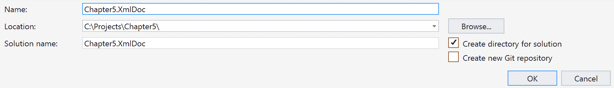

1.  点击“确定”。

1.  现在，解决方案资源管理器（*Ctrl* + *Alt* + *L*）应该看起来像这样：

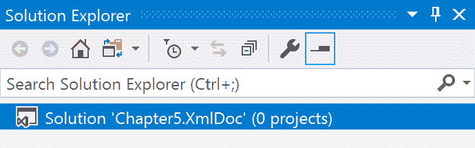

1.  现在，在解决方案资源管理器中的`Chapter5.XmlDoc`标签上右键单击，然后选择“添加”|“新建项目”。

1.  在“新建项目”对话框中，展开“Visual C#”节点。

1.  在左侧窗格中选择.NET Standard，在右侧窗格中选择类库(.NET Standard)：

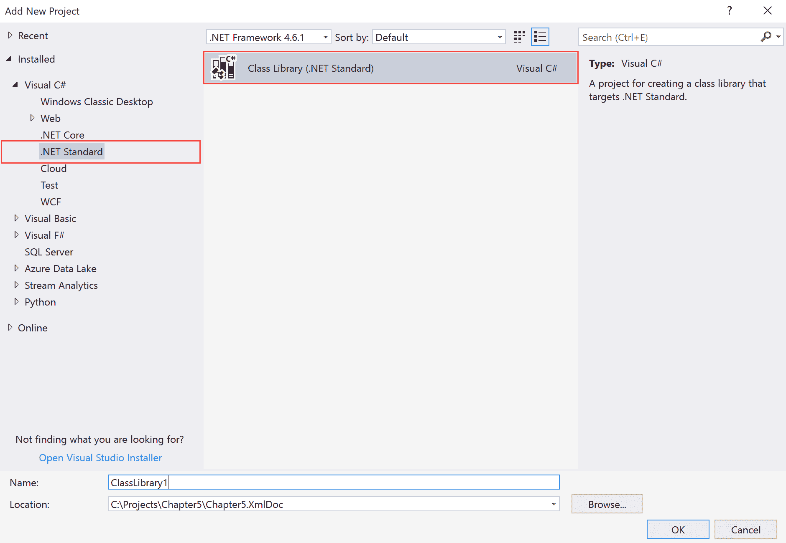

1.  现在，在“名称：”文本框中，键入`Chapter5.XmlDoc.XmlLib`，保留其他默认设置，然后点击“确定”：


1.  现在，解决方案资源管理器（*Ctrl* + *Alt* + *L*）应该看起来像这样：

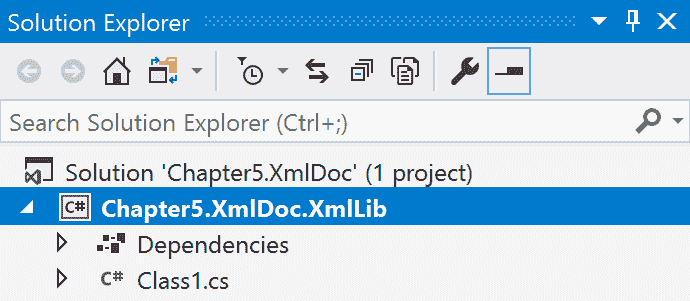

1.  现在，在解决方案资源管理器中选择`Class1.cs`，然后按*F2*键重命名文件为`XMLLog.cs`。

1.  在确认对话框中回答“是”，以将类名也重命名。

1.  现在，在解决方案资源管理器中双击`XMLLog.cs`标签。

1.  向上滚动，直到到达`using`指令，并在最后一个`using`指令的末尾添加以下内容：

```cs
        using System.Xml;
        using System.IO;
        using System.Xml.Linq;
        using System.Collections.Generic;
        using System.Linq;
```

1.  现在，向下滚动并在`XMLLog`类上方添加以下类变量：

```cs
        private string _xmlFile;
```

1.  让我们为`XMLLog`类添加构造函数：

```cs
        public XMLLog(string xmlFile)
        {
          _xmlFile = xmlFile;
        }
```

1.  在类的构造函数之后添加以下公共方法：

```cs
        public void WriteToLog(string message)
        {

          if (!File.Exists(_xmlFile))
          {
            using (XmlWriter xmlWriter = XmlWriter.Create(_xmlFile))
            {
              xmlWriter.WriteStartDocument();
              xmlWriter.WriteStartElement("Log");
              xmlWriter.WriteStartElement("LogEntry");
              xmlWriter.WriteElementString("LogDate", DateTime.Now.ToString());
              xmlWriter.WriteElementString("Message", message);
              xmlWriter.WriteEndElement();
              xmlWriter.WriteEndElement();
              xmlWriter.WriteEndDocument();

              xmlWriter.Flush();
              xmlWriter.Close();
            }
          }
          else
          {
            XDocument xDoc = XDocument.Load(_xmlFile);
            XElement root = xDoc.Element("Log");
            IEnumerable<XElement> rows = root.Descendants("LogEntry");

            XElement lastRow = rows.Last();
            lastRow.AddAfterSelf(
              new XElement("LogEntry",
              new XElement("LogDate", DateTime.Now.ToString()),
              new XElement("Message", message)));

            xDoc.Save(_xmlFile);
          }
        }
```

1.  现在，在`WriteToLog()`方法旁边添加以下代码：

```cs
        public Dictionary<string, string> ReadLog()
        {

          var xmlOutPut = new Dictionary<string, string>();
          var line = 0;

          if (File.Exists(_xmlFile))
          {
            using (XmlReader xmlReader = XmlReader.Create(_xmlFile))
            {
              while(xmlReader.Read())
              {

                if (xmlReader.IsStartElement())
                {

                  switch (xmlReader.Name)
                  {
                    case "LogDate":
                      xmlOutPut.Add($"LogDate - {line}", xmlReader.ReadElementContentAsString());
                      break;
                    case "Message":
                      xmlOutPut.Add($"Message - {line}", xmlReader.ReadElementContentAsString());
                      break;    
                  }
                }
                line++;
              }
            }

            return xmlOutPut;
          }
        }
```

1.  让我们按*Ctrl* + *Shift* + *B*进行快速构建。

# 它是如何工作的...

在步骤 1 到 5 中，我们创建了一个空白解决方案，并为解决方案赋予了合适的名称。然后，在步骤 6 到 10 中，我们将一个.NET Standard 2.0 库项目添加到解决方案中。在步骤 11、12 和 13 中，我们将 Visual Studio 生成的默认类模板重命名。

在步骤 15 中，我们为我们的库添加了所有必需的命名空间。`System.Xml`和`System.Xml.Linq`是我们将要关注的两个命名空间。`System.Xml`提供了创建和维护 XML 文档的功能。`System.Xml.Linq`是 LINQ 的扩展，用于操作 XML 数据。

在步骤 16 中，我们创建了一个类级别的私有变量来存储 XML 文件的路径。在步骤 17 中，我们为类创建了一个构造函数，该构造函数接受一个字符串参数。该参数是带有 XML 文件路径的文件名。它还填充了步骤 16 中创建的私有变量。在步骤 18 中，我们添加了一个公共方法来写入 XML 文件。

在代码的第一行，我们检查 XML 文件是否存在。如果它不存在，以下代码块将接管：

```cs
using (XmlWriter xmlWriter = XmlWriter.Create(_xmlFile))
{
    xmlWriter.WriteStartDocument();
    xmlWriter.WriteStartElement("Log");
    xmlWriter.WriteStartElement("LogEntry");
    xmlWriter.WriteElementString("LogDate", DateTime.Now.ToString());
    xmlWriter.WriteElementString("Message", message);
    xmlWriter.WriteEndElement();
    xmlWriter.WriteEndElement();
    xmlWriter.WriteEndDocument();

    xmlWriter.Flush();
    xmlWriter.Close();
}
```

我们使用了`XmlWriter`类及其`Create`方法来创建 XML 文件。在这种情况下，它被包含在一个`using`关键字中。如果类实现了`IDisposable`接口，并且其生命周期限制在方法内，这是一个好的实践。`using`语句以正确的方式调用对象的`Dispose`方法，并且一旦调用`Dispose`，对象本身就会超出作用域。最后，`XmlWriter`类的`Flush()`方法将清除缓冲区，而`Close()`方法将关闭写入流。

在接下来的几行代码中，我们开始编写文档，并最终澄清了问题并关闭了`XmlWriter`。如果文件存在，我们编写了一些代码来处理现有的 XML 文档并将其数据附加到它上。代码如下：

```cs
XDocument xDoc = XDocument.Load(_xmlFile);
XElement root = xDoc.Element("Log");
IEnumerable<XElement> rows = root.Descendants("LogEntry");

XElement lastRow = rows.Last();
lastRow.AddAfterSelf(
    new XElement("LogEntry",
        new XElement("LogDate", DateTime.Now.ToString()),
            new XElement("Message", message)));

xDoc.Save(_xmlFile);
```

在这段代码中，我们创建了一个`XDocument`类来处理现有的 XML 文件。这个类是从`System.Xml.Linq`命名空间引用的。在第一行，我们加载了现有的 XML 文件。在第二行，我们查找文档的根元素。我们从根元素的子元素中选取所有后代，并从该列表中选取最后一个元素。这就是我们将添加新数据的位置。我们使用了`AddAfterSelf()`方法将新条目添加到 XML 文档中，并最终保存了文档。

在第 19 步中，我们创建了一个读取现有 XML 文档的方法。在第一行，我们创建了一个字典来存储我们从 XML 文档中读取的数据。然后，我们检查文件是否存在以进行读取，并创建了读取文件的代码。这次我们使用了 `XmlReader()` 类来读取数据并将其存储在字典中：

```cs
while(xmlReader.Read())
{
    if (xmlReader.IsStartElement())
    {

        switch (xmlReader.Name)
        {
            case "LogDate":
                xmlOutPut.Add($"LogDate - {line}", xmlReader.ReadElementContentAsString());
                break;
            case "Message":
                xmlOutPut.Add($"Message - {line}", xmlReader.ReadElementContentAsString());
                break;    
        }
     }
     line++;
 }
```

我们使用了一个 `while` 循环来遍历 XML 文档的每一行，并使用 `switch` 语句来检查正确的元素并将其存储在字典中。如您所见，通过使用 `counter` (`line`) 变量，我们还为字典创建了一个唯一的键。最后，我们返回了已填充的字典。在第 20 步中，我们执行了快速构建以检查语法是否正确。

# 创建一个用于使用 XMLLib 库的 ASP.NET MVC 应用程序

在这个配方中，我们将创建一个 ASP.NET MVC 应用程序来使用这个库。这次，它将在 Windows 下运行，并将在 Windows 下使用完整的 .NET Framework。

# 准备工作

确保我们已经完成了之前的配方。在那个配方中，我们构建了一个 .NET Standard 2.0 库来创建和读取 XML 文档。现在让我们创建一个 ASP.NET MVC 应用程序来使用这个库。

# 如何操作...

1.  打开 Visual Studio 2017。

1.  现在，打开上一个配方中的解决方案。点击 文件 | 打开 | 打开项目/解决方案，或按 *Ctrl* + *Shift* + *O*，然后选择 `Chapter5.XmlDoc` 解决方案。

1.  按 *Ctrl* + *Shift* + *B* 进行快速构建以检查一切是否正常。

1.  现在，单击 `Chapter5.XmlDoc` 解决方案标签。点击 文件 | 添加 | 新项目。

1.  在“添加新项目”模板对话框中，展开左侧窗格中的 Visual C# 节点。

1.  选择 Web，然后在右侧窗格中选择 ASP.NET Web 应用程序（.NET Framework）：

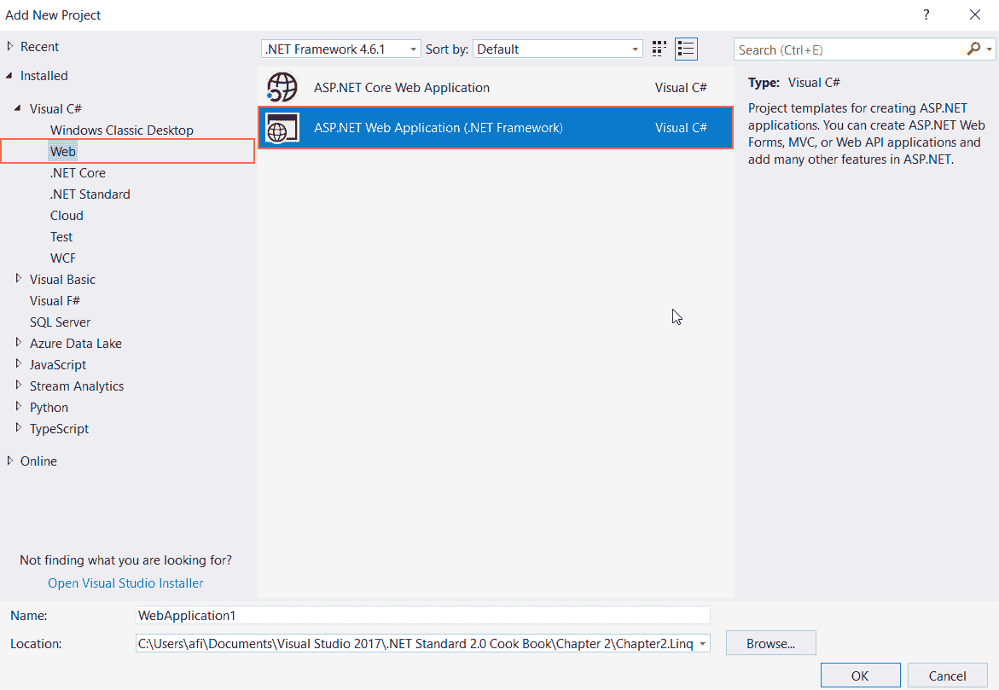

1.  现在，在“名称：”文本框中，键入 `Chapter5.XmlDoc.XmlMVC` 作为名称，并将“位置：”文本框保留在默认值：

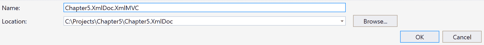

1.  在“新建 ASP.NET 网络应用程序”对话框中，从模板列表中选择空模板。

1.  在“添加文件夹和核心引用”选项中，选择 MVC。

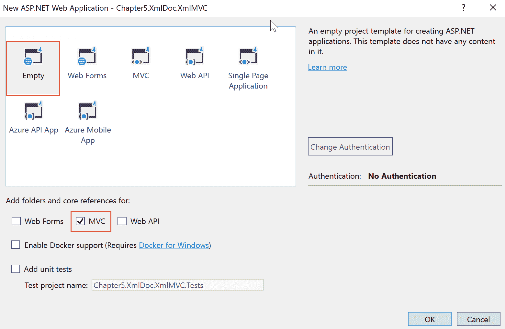

1.  其余保持不变，点击确定以创建默认的 ASP.NET MVC 网络应用程序模板。

1.  现在，解决方案资源管理器应该看起来像这样：

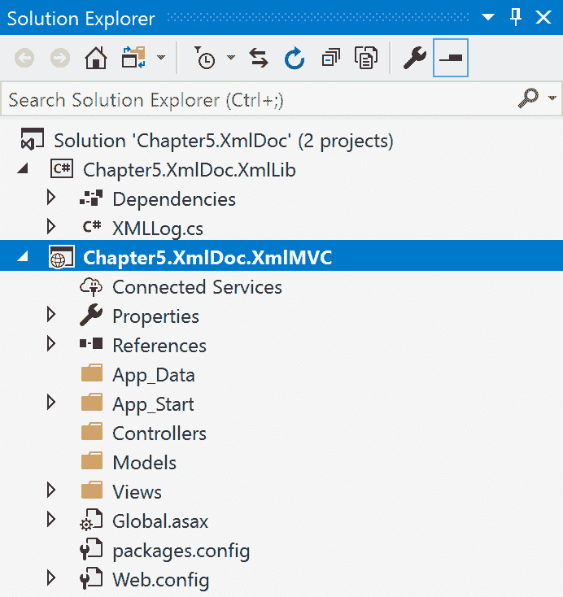

1.  现在，在 `Chapter5.XmlDoc.XmlMVC` 项目下的引用标签上右键单击，并选择添加引用。

1.  在“引用管理器”对话框中，在左侧窗格中选择项目，然后在右侧窗格中选择 `Chapter5.XmlDoc.XmLib`：

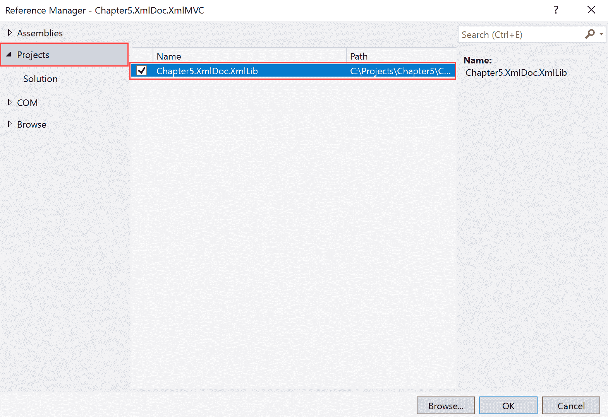

1.  点击确定。

1.  现在，在 `Chapter5.XmlDoc.XmlMVC` 项目中的 `Controllers` 文件夹上右键单击。

1.  选择 添加 | 控制器。

1.  在“添加模板”对话框中，从模板列表中选择 MVC 5 控制器 – 空模板，然后点击添加：

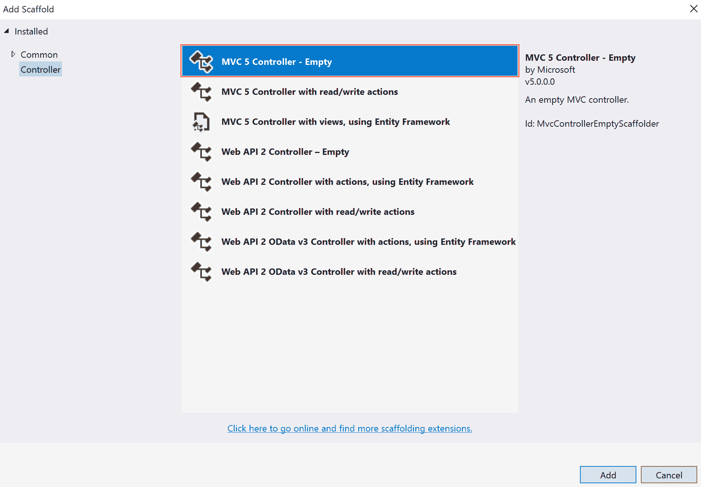

1.  现在，在添加控制器对话框中，在控制器名称：文本框中键入`HomeController`：

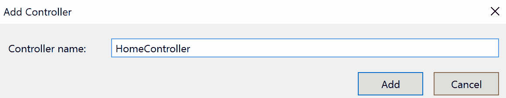

1.  点击添加。

1.  现在双击`Controllers`文件夹下的`HomeController.cs`标签。

1.  在代码窗口中，右键单击`Index()`方法名称并选择添加视图。

1.  在添加视图对话框中保留默认设置并点击添加：

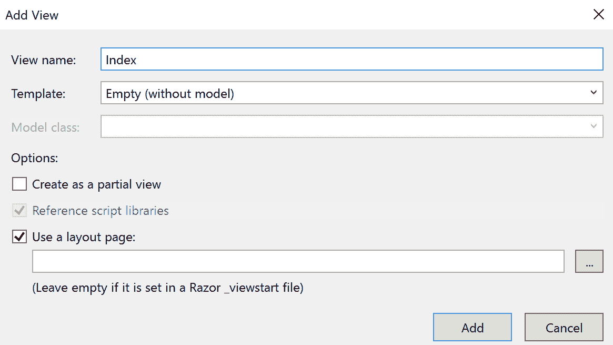

1.  点击代码窗口中的`HomeController.cs`标签页。

1.  将此`using`指令添加到代码的顶部，紧邻指令的最后一行：

```cs
        using Chapter5.XmlDoc.XmlLib;
```

1.  现在，让我们将此代码添加到`Index()`方法中，并在`return`语句之前：

```cs
        var xmlFile = $"{Server.MapPath("~")}/testlog.xml";

        var xmlLog = new XMLLog(xmlFile);
        xmlLog.WriteToLog("Start at the Index() method");
        xmlLog.WriteToLog("Another log entry here");
        xmlLog.WriteToLog("Before the return statement");
```

1.  按*F5*测试我们的代码，你应该得到如下输出：

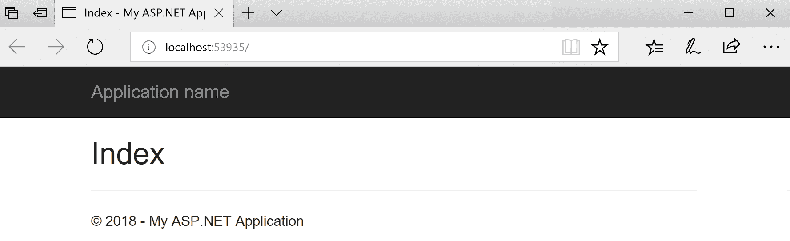

1.  现在关闭浏览器，然后在解决方案资源管理器中点击显示所有文件图标：


1.  现在，你应该看到创建了`textlog.xml`标签，解决方案资源管理器应该看起来像这样：


1.  点击`testlog.xml`标签，你应该看到类似的输出：

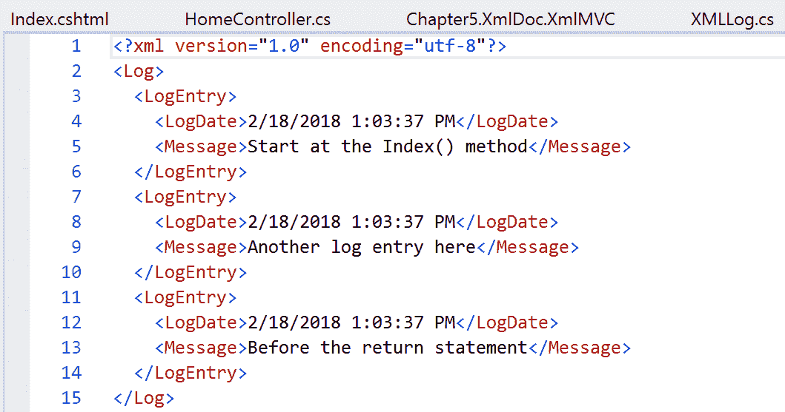

1.  现在，让我们点击`HomeController.cs`标签页，并在`Index()`方法旁边添加此代码：

```cs
        public ActionResult Display()
        {

            var xmlFile = $"{Server.MapPath("~")}/testlog.xml";
            var xmlLog = new XMLLog(xmlFile);

            ViewBag.LogDetails = xmlLog.ReadLog();

            return View();
        }
```

1.  现在，右键单击`Display()`方法名称并选择添加视图。

1.  按照步骤 22 添加视图。

1.  现在，在`Display.cshtml`中，在`<h2>`标签旁边添加以下代码：

```cs
        @{ 

            var xmlLogDetails = (Dictionary<string, string>)ViewBag.LogDetails;

            foreach (var log in xmlLogDetails)
            {
                <p>@log.Key.Split('-')[0]: @log.Value.Split('-')[0]</p>
            }
        }
```

1.  现在，让我们按*F5*来调试代码。默认情况下，这应该在浏览器中加载`Display.chtml`；如果不是，请输入`http://locahost<portnumber>/Home/Display`并按*Enter*。

1.  你应该看到类似的输出：

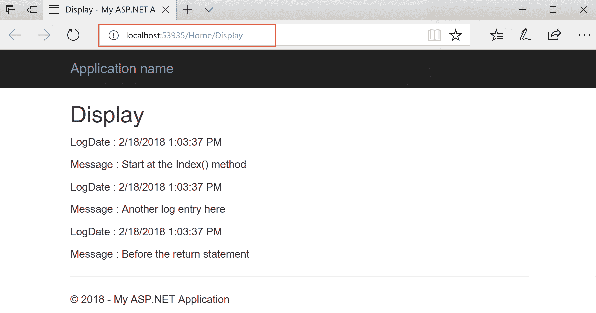

1.  现在，关闭你的浏览器，我们就完成了。

# 它是如何工作的...

在步骤 1 到 10 中，我们打开了一个包含用于读取和写入 XML 文件库的现有解决方案。然后，在这些步骤中，我们向该解决方案添加了一个 ASP.NET MVC 项目。在步骤 13 中，我们添加了对之前菜谱中构建的库的引用。这将允许你访问库中的可用方法。

在步骤 16 到 20 中，我们向项目中添加了一个控制器，并将其命名为`HomeController`。在步骤 24 中，我们添加了一个`using`指令来引用库。在步骤 25 中，我们编写了创建`XMLLog`类实例的代码，并在创建和写入 XML 文档的方法中使用它。在以下代码行中，我们提供了我们的 XML 文件的路径和名称：

```cs
var xmlFile = $"{Server.MapPath("~")}/testlog.xml";
```

`Server.MapPath("~")`确保文件被创建在我们的 Web 文件夹的根目录。在步骤 26 到 29 中，我们确认了我们的代码正在工作，并且 XML 文件已创建并包含日志条目。在步骤 30 中，我们为`HomeController`创建了一个新的操作。我们创建了一个`XMLLog`类的实例，并在方法中使用它来从日志文件中读取信息。然后我们将值存储在`ViewBag`中：

```cs
ViewBag.LogDetails = xmlLog.ReadLog();
```

在步骤 32 中，我们为`Display`操作创建了一个视图，就像我们在步骤 22 中所做的那样。然后在步骤 32 中为视图添加了代码，将`ViewBag`转换为字典并显示其内容。最后，我们在步骤 34 和 35 中测试了输出。

# 使用 LINQ to XML 处理 XML 文件

在本食谱中，我们将构建一个.NET Standard 2.0 库，该库使用 LINQ to XML 读取 XML 数据。LINQ to XML 是一个启用 LINQ 的内存编程接口。它允许你使用你喜欢的.NET 语言处理 XML。本书使用 C#来描述代码。在本食谱中，我们将主要查看使用 LINQ to XML 查询 XML 文档。我们在“A library that reads and writes to an XML file”食谱中使用了 LINQ to XML 来写入 XML 文件。

# 准备工作

本食谱假设你已经使用了 LINQ。我们专注于使用 XML 文档的 LINQ。让我们启动 Visual Studio 并开始吧。

# 如何操作...

1.  打开 Visual Studio 2017。

1.  点击文件 | 新建 | 项目以创建项目。

1.  在“新建项目”对话框中，展开左侧窗格中的“其他项目类型”节点，并选择 Visual Studio 解决方案。在右侧窗格中选择空白解决方案。

1.  在“名称”文本框中，输入`Chapter5.XmlLinq`，在“位置”文本框中，从下拉框中选择路径或点击浏览...按钮定位路径：

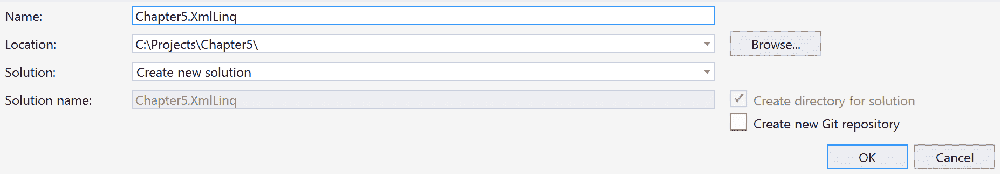

1.  点击确定。

1.  现在，解决方案资源管理器（*Ctrl* + *Alt* + *L*）应该看起来像这样：

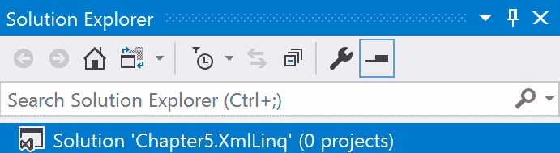

1.  现在，在解决方案资源管理器中的`Chapter5.XmlLinq`标签上右键单击，并选择添加 | 新项目。

1.  在“新建项目”对话框中，展开 Visual C#节点。

1.  在左侧窗格中选择.NET Standard，在右侧窗格中选择类库(.NET Standard)：

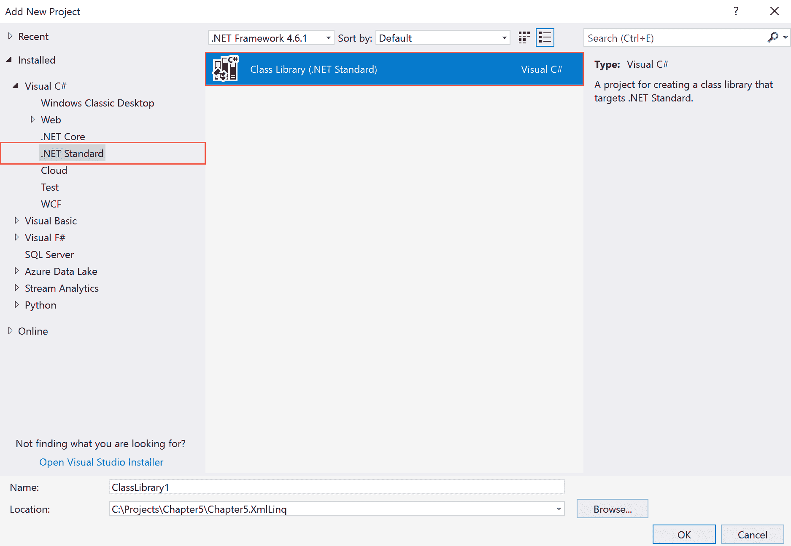

1.  现在，在“名称”文本框中，输入`Chapter5.XmlLinq.XmlLinqLib`，保留其他默认设置，然后点击确定：

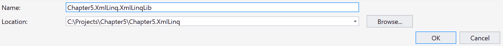

1.  现在，解决方案资源管理器（*Ctrl* + *Alt* + *L*）应该看起来像这样：

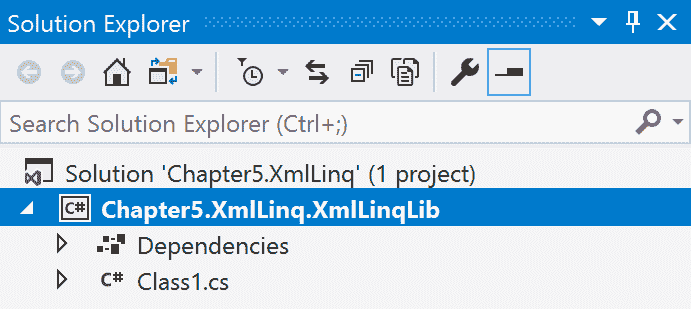

1.  现在，在解决方案资源管理器中选择`Class1.cs`，并按*F2*重命名文件为`XmlBooks.cs`。

1.  在询问是否重命名类名的确认对话框中回答“是”。

1.  现在，在解决方案资源管理器中双击`XmlBooks.cs`标签。

1.  在列表中的最后一个指令旁边添加以下`using`指令：

```cs
        using System.Collections.Generic;
        using System.Xml;
        using System.Xml.Linq;
```

1.  添加以下私有变量以存储 XML 文件名：

```cs
        private string _xmlFile;
```

1.  创建如下默认构造函数：

```cs
        public XmlBooks(string xmlFile)
        {
            _xmlFile = xmlFile;
        }
```

1.  现在添加以下方法来读取 XML 文件：

```cs
        public List<string> GetBookTitles()
        {

            var titles = new List<string>();
            XDocument xDoc = XDocument.Load(_xmlFile);

            var books = xDoc.Descendants("book"); 

            foreach (var book in books)
            {
                titles.Add(book.Element("title").Value);
            }

            return titles;
        }
```

1.  现在，让我们按*Ctrl* + *Shift* + *B*进行快速构建，以检查所有语法是否正确。

# 工作原理...

在步骤 1 到 10 中，我们将一个空白解决方案和一个 .NET Standard 2.0 类库添加到项目中。我们为我们的解决方案和类库项目分配了合适的名称。然后在步骤 15 中，我们添加了使用指令。这些指令帮助我们获取所需的泛型集合和 XML 的 LINQ 支持。

在步骤 16 中，我们添加了一个私有变量来存储 XML 文件名。然后在步骤 17 中，我们使用 `XmlBooks` 类的默认构造函数来创建填充此变量的代码。在步骤 18 中，我们创建了一个读取 XML 文件中包含的书籍标题的方法。此 XML 文件将在下一个食谱中创建。在代码中，我们使用了 `XDocument` 来加载 XML 文件，该文件由 `System.Xml.Linq` 命名空间支持。我们将后代存储在一个变量中，迭代每个元素，并将它们存储在一个 `List<string>` 泛型集合中。

最后，我们构建了代码以检查语法。

# 创建一个 .NET Core 控制台应用程序来使用该库

在本食谱中，我们将创建一个 .NET Core 控制台应用程序来使用上一食谱中创建的库。您可以在任何平台上尝试此食谱，例如 Linux 或 macOS，因为 .NET Core 是一个跨平台库。在本食谱中，我们将专注于 Windows。

# 准备工作

让我们通过查看之前构建的 .NET Standard 2.0 库来做好准备，该库用于读取 XML 文件。请确保您已经在项目中创建了此 XML 文件。我们将使用此文件进行读取。此示例来自 MSDN 库本身：

```cs
<?xml version="1.0"?>
<catalog>
   <book id="bk101">
      <author>Gambardella, Matthew</author>
      <title>XML Developer's Guide</title>
      <genre>Computer</genre>
      <price>44.95</price>
      <publish_date>2000-10-01</publish_date>
      <description>An in-depth look at creating applications 
      with XML.</description>
   </book>
   <book id="bk102">
      <author>Ralls, Kim</author>
      <title>Midnight Rain</title>
      <genre>Fantasy</genre>
      <price>5.95</price>
      <publish_date>2000-12-16</publish_date>
      <description>A former architect battles corporate zombies, 
      an evil sorceress, and her own childhood to become queen 
      of the world.</description>
   </book>
   <book id="bk103">
      <author>Corets, Eva</author>
      <title>Maeve Ascendant</title>
      <genre>Fantasy</genre>
      <price>5.95</price>
      <publish_date>2000-11-17</publish_date>
      <description>After the collapse of a nanotechnology 
      society in England, the young survivors lay the 
      foundation for a new society.</description>
   </book>
   <book id="bk104">
      <author>Corets, Eva</author>
      <title>Oberon's Legacy</title>
      <genre>Fantasy</genre>
      <price>5.95</price>
      <publish_date>2001-03-10</publish_date>
      <description>In post-apocalypse England, the mysterious 
      agent known only as Oberon helps to create a new life 
      for the inhabitants of London. Sequel to Maeve 
      Ascendant.</description>
   </book>
   <book id="bk105">
      <author>Corets, Eva</author>
      <title>The Sundered Grail</title>
      <genre>Fantasy</genre>
      <price>5.95</price>
      <publish_date>2001-09-10</publish_date>
      <description>The two daughters of Maeve, half-sisters, 
      battle one another for control of England. Sequel to 
      Oberon's Legacy.</description>
   </book>
</catalog>
```

# 如何操作...

1.  打开 Visual Studio 2017。

1.  现在，打开上一个食谱中的解决方案。点击 文件 | 打开 | 打开项目/解决方案，或按 *Ctrl* + *Shift* + *O*，然后选择 `Chapter5.XmlLinq` 解决方案。

1.  按 *Ctrl* + *Shift* + *B* 进行快速构建以检查一切是否正常。

1.  现在，单击 `Chapter5.XmlLinq` 解决方案标签。点击 文件 | 添加 | 新项目。

1.  在“添加新项目”模板对话框中，展开左侧窗格中的 Visual C# 节点。

1.  在右侧窗格中，选择 .NET Core 并选择 Console App (.NET Core):

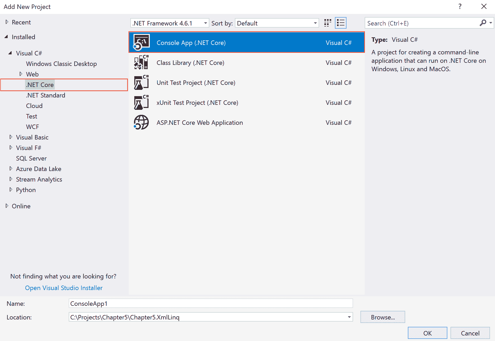

1.  现在，在“名称：”文本框中，键入 `Chapter5.XmlLinq.XmlCore` 作为项目的名称。其余字段可以保持不变：

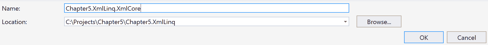

1.  点击确定。

1.  现在，解决方案资源管理器（按 *Ctrl* + *Alt* + *L*）应显示如下：

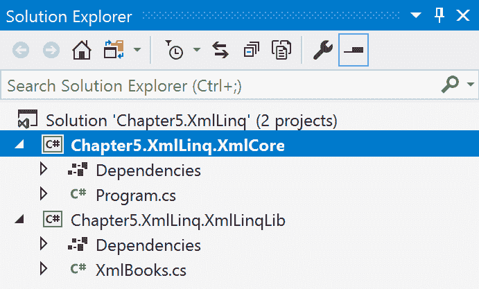

1.  在 `Chapter5.XmlLinq.XmlCore` 下的“依赖项”标签上右键单击。

1.  选择添加引用。

1.  在引用管理器中，单击右侧窗格中的“项目”标签：

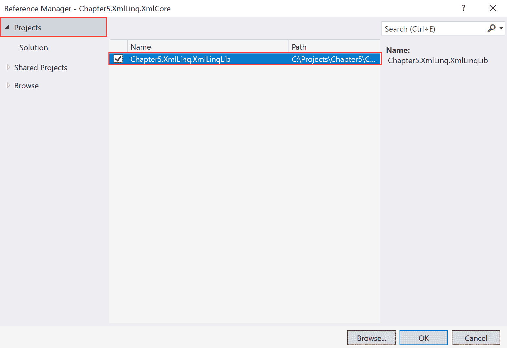

1.  在左侧窗格中检查 `Chapter5.XmlLinq.XmlLinqLib` 项目。

1.  点击确定。

1.  现在，单击项目名称标签 `Chapter5.XmlLinq.XmlCore` 并选择添加 | 新项。

1.  在“添加新项”对话框中，在左侧窗格中，选择 Visual C# 项下的数据，在右侧窗格中选择 XML 文件：

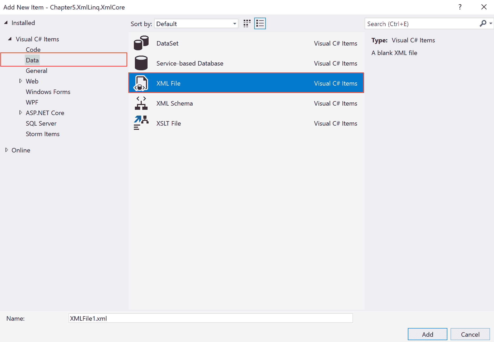

1.  在名称：文本框中键入 `books.xml` 并点击添加。

1.  现在将现有代码替换为以下内容：

```cs
        <?xml version="1.0"?>
        <catalog>
          <book id="bk101">
              <author>Gambardella, Matthew</author>
              <title>XML Developer's Guide</title>
              <genre>Computer</genre>
              <price>44.95</price>
              <publish_date>2000-10-01</publish_date>
              <description>An in-depth look at creating applications 
              with XML.</description>
           </book>
           <book id="bk102">
              <author>Ralls, Kim</author>
              <title>Midnight Rain</title>
              <genre>Fantasy</genre>
              <price>5.95</price>
              <publish_date>2000-12-16</publish_date>
              <description>A former architect battles corporate zombies, 
               an evil sorceress, and her own childhood to become queen 
               of the world.</description>
           </book>
           <book id="bk103">
              <author>Corets, Eva</author>
              <title>Maeve Ascendant</title>
              <genre>Fantasy</genre>
              <price>5.95</price>
              <publish_date>2000-11-17</publish_date>
              <description>After the collapse of a nanotechnology 
              society in England, the young survivors lay the 
              foundation for a new society.</description>
           </book>
           <book id="bk104">
              <author>Corets, Eva</author>
              <title>Oberon's Legacy</title>
              <genre>Fantasy</genre>
              <price>5.95</price>
              <publish_date>2001-03-10</publish_date>
              <description>In post-apocalypse England, the mysterious 
              agent known only as Oberon helps to create a new life 
              for the inhabitants of London. Sequel to Maeve 
              Ascendant.</description>
           </book>
           <book id="bk105">
              <author>Corets, Eva</author>
              <title>The Sundered Grail</title>
              <genre>Fantasy</genre>
              <price>5.95</price>
              <publish_date>2001-09-10</publish_date>
              <description>The two daughters of Maeve, half-sisters, 
              battle one another for control of England. Sequel to 
              Oberon's Legacy.</description>
           </book>
        </catalog>
```

1.  现在双击 `Program.cs` 以打开代码窗口。

1.  在代码窗口中，滚动到屏幕顶部。

1.  在 `using` 指令的最后一条语句旁边，添加以下 `using` 指令：

```cs
        using Chapter5.XmlLinq.XmlLinqLib;
```

1.  现在将 `Main()` 方法中的现有代码替换为以下代码：

```cs
        var xmlFile = @"C:\Projects\Chapter5\Chapter5.XmlLinq\Chapter5.XmlLinq.XmlCore\books.xml";

        var books = new XmlBooks(xmlFile);
        var titles = books.GetBookTitles();

        foreach (var title in titles)
        {

            Console.WriteLine(title);
        }

        Console.ReadLine();
```

1.  按 *F5* 查看输出，它应该看起来像这样：


1.  按 *Enter* 退出。

# 工作原理...

在步骤 1 到 9 中，我们打开了一个现有的解决方案。然后，我们将一个 .NET Core 控制台应用程序添加到解决方案中。在这些步骤中，我们为项目分配了一个合适的名称。在步骤 10 到 13 中，我们将项目引用添加到我们在上一个菜谱中创建的库中。这些步骤将允许您使用库中可用的方法。

在步骤 15 到 18 中，我们将一个 XML 文件项添加到项目中，然后填充了一些示例数据。在步骤 21 中，我们从 .NET Core 控制台应用程序中引用了我们的库。在步骤 22 中，我们在控制台应用程序的 `Main()` 方法中添加了代码。第一行存储了我们的 XML 文件路径。这可能在您的设置中有所不同。在接下来的两行中，我们创建了一个 `XmlBooks` 类的实例，使用其 `GetBookTitles()` 方法，并将其存储在一个变量中。然后，使用 `foreach` 语句遍历 `GetBookTitles()` 方法返回的列表。最后，我们执行了代码。
