# 第六章：探索线程

在本章中，我们将探讨以下食谱：

+   创建一个可以同时执行多项操作的库

+   创建一个用于使用库的 .NET Core 控制台应用程序

+   创建一个使用任务的无阻塞方法

+   创建一个用于使用库的 WPF 应用程序

+   创建线程池

+   创建一个用于使用库的 .NET 控制台应用程序

# 技术要求

读者应具备基本的 C# 知识。他们还应具备使用 Visual Studio、使用 NuGet 安装包以及在其他项目中引用库的基本知识。

本章的代码文件可以在 GitHub 上找到：

[`github.com/PacktPublishing/DotNET-Standard-2-Cookbook/tree/master/Chapter06`](https://github.com/PacktPublishing/DotNET-Standard-2-Cookbook/tree/master/Chapter06)

查看以下视频以查看代码的实际效果：

[`goo.gl/BhsEpf`](https://goo.gl/BhsEpf)

# 简介

线程使您的 C# 应用程序能够同时执行多个操作。简单来说，您可以在执行后台进程的同时允许用户输入个人信息并监控它。例如，在策略游戏中，一个角色可能正在从森林中获取一些木材。同时，另一个角色可能正在建造一堵墙，另一个角色正在射击敌人。让我们看看如何在 .NET Standard 2.0 库中实现线程。

# 创建一个可以同时执行多项操作库

在本食谱中，我们将探讨线程的基础知识，并在 .NET Standard 2.0 库中使用 `System.Threading` 命名空间。

# 准备工作

在我们开始构建我们的库之前，让我们确保已经安装并配置了最新的 Visual Studio 2017 以创建 .NET Standard 2.0 库。

# 如何操作...

1.  打开 Visual Studio 2017。

1.  点击文件 | 新建 | 项目以创建一个项目。

1.  在新建项目对话框中，展开左侧窗格中的其他项目类型节点，并选择 Visual Studio 解决方案。在右侧窗格中，选择空白解决方案****。

1.  在名称：文本框中，键入 `Chapter6.Threads`，并在位置：文本框中，从下拉框中选择一个路径或点击浏览...按钮定位路径：

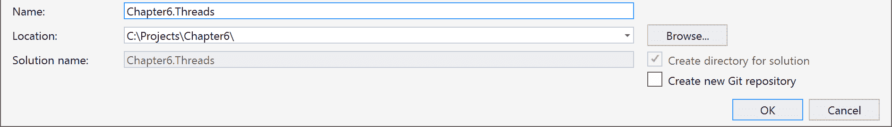

1.  点击确定。

1.  现在，解决方案资源管理器 (*Ctrl* + *Alt* + *L*) 应该看起来像这样：

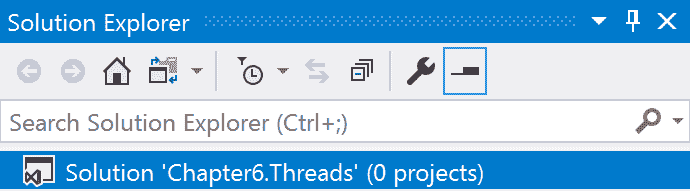

1.  现在，在解决方案资源管理器中右键单击 `Chapter6.Threads` 标签，然后选择添加 | 新项目****。

1.  在新建项目对话框中，展开 Visual C# 节点。

1.  在左侧窗格中选择 .NET Standard，在右侧窗格中选择类库 (.NET Standard)：

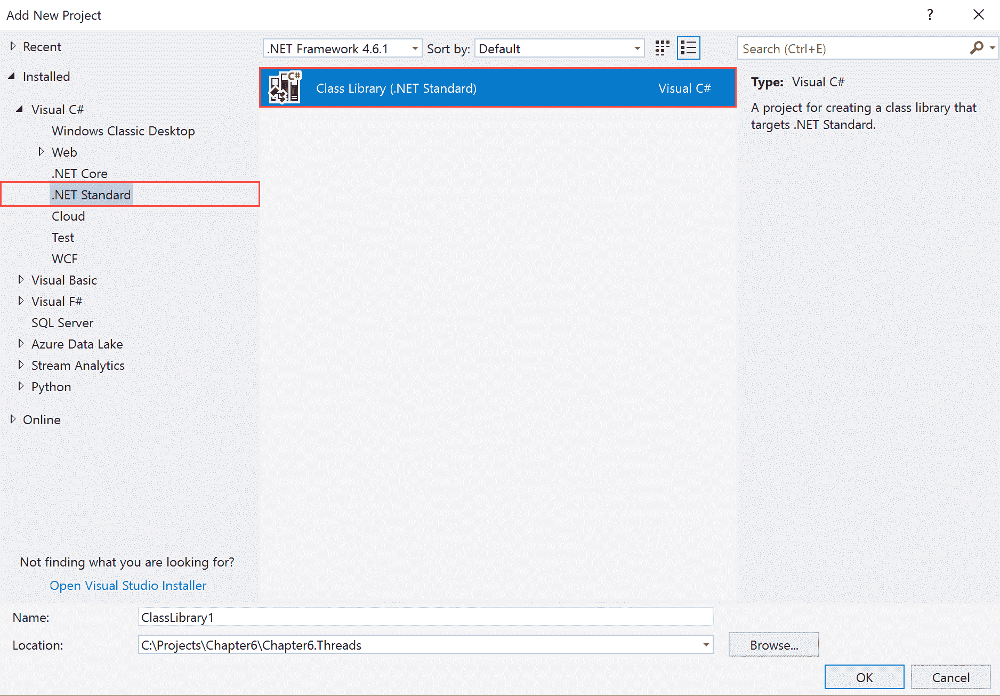

1.  现在，在名称：文本框中键入 `Chapter6.Threads.ThreadLib`。保留其他默认设置，然后点击确定：

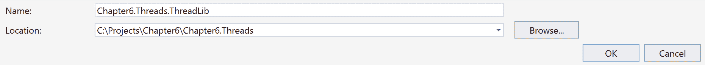

1.  现在，解决方案资源管理器 (*Ctrl* + *Alt* + *L*) 应该看起来像这样：

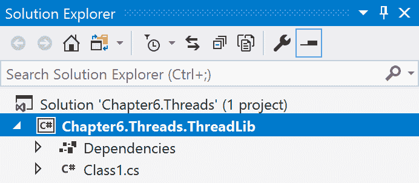

1.  现在，在解决方案资源管理器中选择`Class1.cs`文件，然后按*F2*键重命名文件为`ThreadGenerator.cs`。

1.  在确认对话框中回答“是”，以将类名也重命名。

1.  现在，在解决方案资源管理器中双击`ThreadGenerator.cs`标签。

1.  让我们在代码窗口中向上滚动并添加以下`using`指令：

```cs
      using System.Threading;
      using System.Text
```

1.  现在，让我们添加这个类级别变量来存储我们的文本消息：

```cs
      StringBuilder messages = new StringBuilder(); 
```

1.  在`ThreadGenerator`类中创建此方法：

```cs
      public StringBuilder StartThreads()
      {
          var mainThread = Thread.CurrentThread;
          mainThread.Name = "MainThread";

          messages.Append($"This is the {mainThread.Name}\n");

          Thread anotherThread = new Thread(CountTo100);
          messages.Append("Start a new thread\n");
          anotherThread.Start();

          messages.Append($"Now call {mainThread.Name} will count to 50\n");

          for (int j=0; j<50; j++)
          {
              messages.Append($"MT-{j + 1}\n");
              Thread.Sleep(80);
          }

          messages.Append($"{mainThread.Name} finished\n");

          return messages;
      }
```

1.  最后，为主`StartThreads()`方法创建此支持方法：

```cs
      private void CountTo100()
      {
          for (int i=0; i<100; i++)
          {
              messages.Append($"Thread 2 counting {i + 1}\n");
              Thread.Sleep(100);
          }
      }
```

1.  通过按*Ctrl* + *Shift* + *B*来执行快速构建，以检查语法。

# 它是如何工作的...

在步骤 1 到 14 中，我们创建了一个新的空白解决方案，并添加了一个.NET Standard 2.0 类库。然后我们给默认模板类取了一个合适的名字。在步骤 15 中，我们添加了用于线程支持的必需的`using`指令，即`System.Threading`，并且我们使用了`System.Text`命名空间来获取`StringBuilder`类以存储我们的消息。

我们使用了`StringBuilder`而不是`String`。如果你想知道为什么，那是因为`StringBuilder`是可变的。当你执行插入、替换或追加等操作时，`StringBuilder`对象不会每次都创建一个新的实例。它将在内存中更新一个空间，而不在内存中创建新的空间。然而，`String`是不可变的，这意味着如果你创建了一个`String`对象，那么你无法修改它，并且它总是在内存中创建一个新的`String`对象。

在步骤 16 中，我们创建了一个`StringBuilder`类的实例，它将处理所有消息并将它们存储起来。然后，我们创建了一个返回`StringBuilder`的方法。这个`StringBuilder`将包含在步骤 17 中创建的`StartThreads()`方法执行期间生成的所有消息。

在这三行中，我们获取了当前正在运行的线程，即主线程，并给它起了一个名字。然后，我们在`StringBuilder`中存储了一条消息：

```cs
var mainThread = Thread.CurrentThread;
mainThread.Name = "MainThread";

messages.Append($"This is the {mainThread.Name}\n");
```

在这些行中，我们创建了另一个新的线程，并使用步骤 18 中创建的`helper`方法来执行线程。这个`private helper`方法循环 100 步，向字符串构建器添加一条消息，并在每一步暂停 100 毫秒：

```cs
private void CountTo100()
{
    for (int i=0; i<100; i++)
    {
        messages.Append($"Thread 2 counting {i + 1}\n");
        Thread.Sleep(100);
    }
}
```

它还按照以下方式在`StringBuilder`中存储相关消息：

```cs
Thread anotherThread = new Thread(CountTo100);
messages.Append("Start a new thread\n");
anotherThread.Start();
```

在代码的最后几行中，我们在主线程中执行了另一个循环，并将消息存储在`StringBuilder`中，以识别正在执行的线程。最后，我们进行了快速构建以检查语法。

# 创建一个.NET Core 控制台应用程序以使用库

在这个菜谱中，我们将构建一个.NET Core 控制台应用程序。这个应用程序将使用我们在上一个菜谱中构建的库。

# 准备中

确保你已经完成了上一个菜谱，并且它构建正确。让我们开始构建使用库的应用程序。

# 如何操作...

1.  打开 Visual Studio 2017。

1.  现在，打开上一个菜谱中的解决方案。点击“文件”|“打开”|“打开项目/解决方案”，或者按*Ctrl* + *Shift* + *O*，并选择`Chapter6.Threads`解决方案。

1.  按*Ctrl* + *Shift* + *B*进行快速构建以检查一切是否正常。

1.  点击`Chapter6.Threads`解决方案标签。点击“文件”|“添加”|“新建项目”。

1.  在“添加新项目”模板对话框中，展开左侧窗格中的“Visual C#”节点。

1.  在右侧窗格中选择.NET Core，并选择“控制台应用程序 (.NET Core)”：

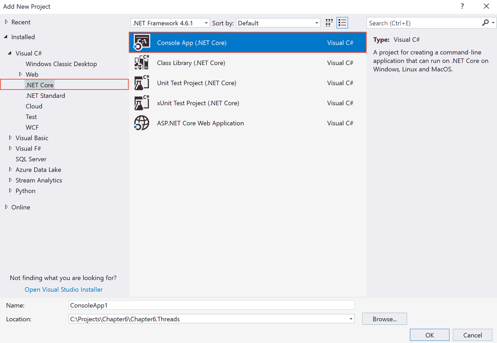

1.  现在，在“名称：”文本框中，将项目名称输入为`Chapter6.Threads.ThreadsCore`。其余字段应保持不变：

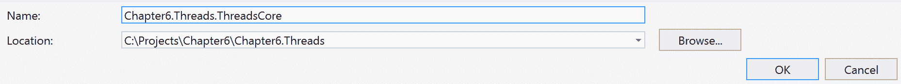

1.  点击“确定”。

1.  现在，解决方案资源管理器（按*Ctrl* + *Alt* + *L*）应该显示如下：


1.  在`Chapter6.Threads.ThreadsCore`中的“依赖项”标签上右键单击。

1.  选择“添加引用”。

1.  在引用管理器中，点击右侧窗格中的“项目”标签：

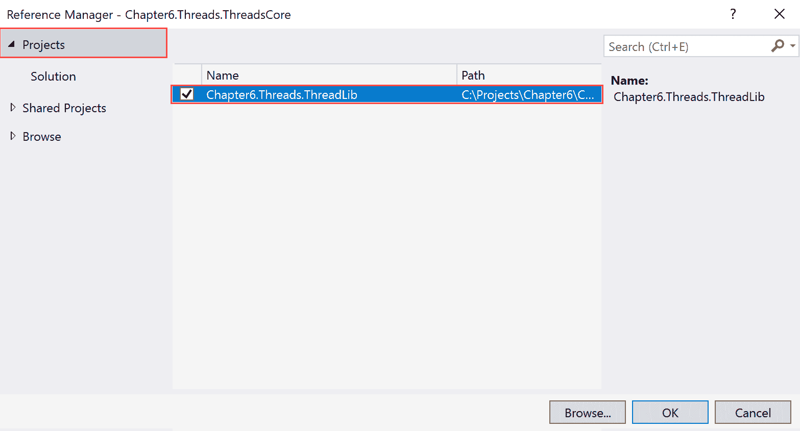

1.  在左侧窗格中检查`Chapter6.Threads.ThreadLib`项目。

1.  点击“确定”。

1.  现在，在解决方案资源管理器中双击`Program.cs`标签。

1.  在代码窗口中向上滚动并添加以下`using`指令：

```cs
      using Chapter6.Threads.ThreadLib;
```

1.  现在，删除`Main()`方法中由 Visual Studio 生成的任何现有代码，并添加以下代码：

```cs
      var threads = new ThreadGenerator();
      var output = threads.StartThreads();

      Console.WriteLine(output);
      Console.ReadLine();
```

1.  按*F5*执行应用程序。

1.  你应该看到如下输出：


1.  按*Enter*键退出。

# 它是如何工作的...

在步骤 1 到 9 中，我们打开了一个现有的解决方案，其中包含一个.NET Standard 2.0 库项目。然后，我们将.NET Core 控制台应用程序添加到该解决方案中。在步骤 10 到 14 中，我们将.NET Standard 2.0 库项目作为依赖项添加到控制台应用程序中。然后在步骤 16 中，我们使用`using`指令来引用类库。这将使我们能够访问库中的可用功能。

在第 17 步中，我们在类库中创建了一个`ThreadGenerator`类的实例。然后，我们使用了它的`StartThreads()`方法，并将返回的`StringBuilder`存储在一个变量中。最后，我们使用`Console.WriteLine`显示了输出，并在最后一行等待用户按键。在第 18 到 20 步中，我们执行了应用程序并看到了输出。

# 使用任务创建异步方法

在这个菜谱中，我们将探讨 C#语言中找到的异步编程能力。C#具有语言级别的异步能力，因此你不必依赖第三方库。如果你有 I/O 操作，例如从网络或数据库读取数据，你可以利用异步编程。你也可以为 CPU 密集型、昂贵的计算使用异步编程。

# 准备工作

确保你的 Visual Studio 2017 已经更新。还假设你之前有异步编程的经验以及它的含义。

# 如何做...

1.  打开 Visual Studio 2017。

1.  点击 File | New | Project 来创建一个项目。

1.  在新项目对话框中，展开左侧窗格中的 Other Project Types 节点，并选择 Visual Studio Solutions。在右侧窗格中，选择 Blank Solution**.**

1.  在 Name: 文本框中，键入 `Chapter6.AsyncTasks`，并在 Location: 文本框中，从下拉框中选择一个路径或点击 Browse... 按钮定位路径：

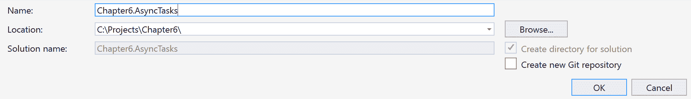

1.  点击 OK。

1.  现在，解决方案资源管理器 (*Ctrl* + *Alt* + *L*) 应该看起来像这样：

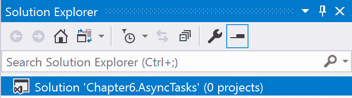

1.  现在，在解决方案资源管理器中的 `Chapter6.AsyncTasks` 标签上右键单击，然后选择 Add | New Project**.**

1.  在新项目对话框中，展开 Visual C# 节点。

1.  在左侧窗格中选择 .NET Standard，在右侧窗格中选择 Class Library (.NET Standard)：

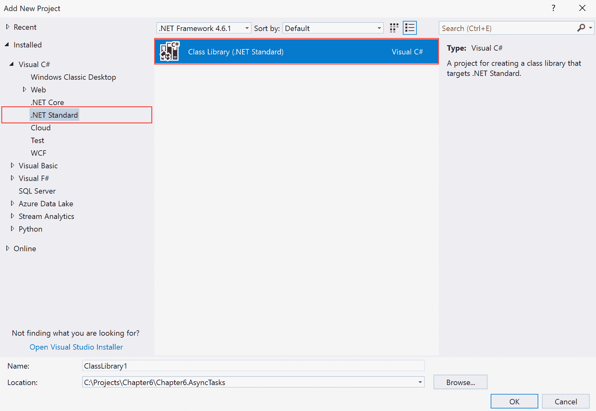

1.  现在，在 Name: 文本框中，键入 `Chapter6.AsyncTasks.AsyncLib`。保留其他默认设置，然后点击 OK：

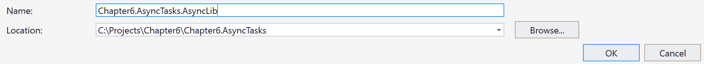

1.  现在，解决方案资源管理器 (*Ctrl* + *Alt* + *L*) 应该看起来像这样：

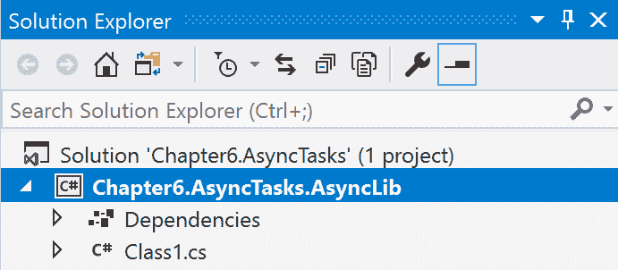

1.  现在，在解决方案资源管理器中选择 `Class1.cs`，然后按 *F2* 重命名文件为 `SiteReader.cs`。

1.  在确认对话框中回答 Yes，询问是否也要重命名类名。

1.  现在，双击解决方案资源管理器中的 `SiteReader.cs` 标签。

1.  让我们在代码窗口中向上滚动并添加以下 using 指令：

```cs
      using System.Net.Http;
      using System.Threading.Tasks;
```

1.  现在，让我们添加这个类级别的变量：

```cs
      private HttpClient _httpClient = new HttpClient();
```

1.  在 `SiteReader` 类的开放和闭合花括号内添加以下方法：

```cs
      public async Task<string> ReadSiteContent(string url)
      {
          var htmlContent = await _httpClient.GetStringAsync(url);

          return htmlContent;
      }
```

1.  按 *Ctrl* + *Shift* + *B* 进行快速构建。

# 它是如何工作的...

在步骤 1 到 12 中，我们添加了一个空白解决方案，然后向解决方案中添加了一个 .NET Standard 2.0 类库。在这些步骤中，我们为解决方案和项目分配了合适的名称。在步骤 13 和 14 中，我们将默认类模板重命名为更有意义的内容。你也可以删除这个类并创建一个新的。

在步骤 15 中，我们向代码中添加了两个命名空间。在步骤 16 中，我们创建了一个类级别的变量并创建了一个 `HttpClient` 类的实例。在步骤 17 中，我们创建了一个异步的公共方法，该方法将给定的网站内容作为 `string` 读取并返回读取的内容。

最后，我们进行了快速构建以检查语法。

# 创建一个用于使用库的 WPF 应用程序

在这个菜谱中，我们将创建一个用于使用库的 Windows Presentation Foundation 应用程序。将创建一个基本的用户界面来显示内容。

# 准备工作

确保你已经打开了我们在上一道菜谱中构建的 .NET Standard 2.0 类库。如果没有，请确保在深入这一道之前完成上一道菜谱。

# 如何做...

1.  打开 Visual Studio 2017。

1.  现在，打开前一个菜谱中的解决方案。点击“文件”|“打开”|“打开项目/解决方案”，或者按*Ctrl* + *Shift* + *O*，然后选择`Chapter6.AsyncTasks`解决方案。

1.  按*Ctrl* + *Shift* + *B*进行快速构建以检查一切是否正常。

1.  点击`Chapter6.AsyncTasks`解决方案标签。点击“文件”|“添加”|“新建项目”。

1.  在“添加新项目”模板对话框中，展开左侧窗格中的“Visual C#”节点。

1.  在右侧窗格中选择“Windows Classic Desktop”，然后选择“WPF App (.NET Framework)”：


1.  现在，在“名称：”文本框中，输入`Chapter6.AsyncTasks.WPFSiteContent`作为项目的名称。其余字段可以保持不变：

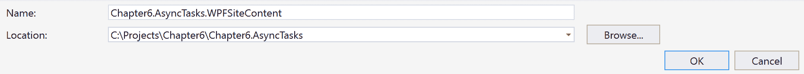

1.  点击“确定”。

1.  现在，解决方案资源管理器（按*Ctrl* + *Alt* + *L*）应该看起来像这样：

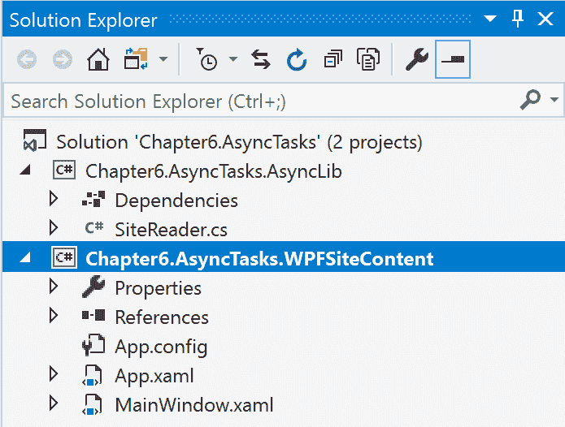

1.  在`Chapter6.AsyncTasks.WPFSiteContent`中，右键点击“引用”标签。

1.  选择“添加引用”。

1.  在参考管理器中，点击右侧窗格中的“项目”标签：

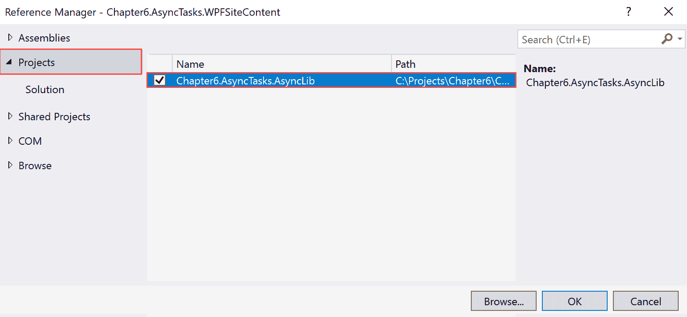

1.  在左侧窗格中检查`Chapter6.AsyncTasks.AsyncLib`项目。

1.  点击“确定”。

1.  现在，点击`MainWindow.xaml`选项卡。

1.  从工具箱中，向 MainWindow 窗体添加一个 TextBox 控件、一个 Button 控件和一个 WebBrowser 控件：

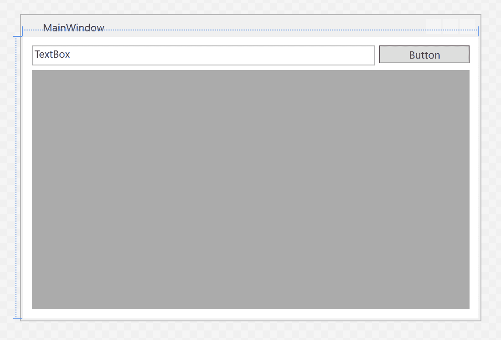

1.  选择 TextBox 并按*F4*加载属性窗口。

1.  更改以下属性：

    | **控件** | **属性** | **值** |
    | --- | --- | --- |
    | TextBox | Name | `UrlTextBox` |
    | TextBox | Text | `删除现有文本并留空` |
    | Button | Name | `GoButton` |
    | Button | Content | `Go` |
    | WebBrowser | Name | `ContentBrowser` |

1.  双击“Go”按钮进入代码窗口。

1.  向上滚动直到到达`using`指令。

1.  将以下`using`指令添加到指令的最后一行：

```cs
      using Chapter6.AsyncTasks.AsyncLib;
```

1.  向下滚动并在`GoButton_Click()`事件内添加以下代码。

1.  按如下方式更改`GoButton_Click`：

```cs
      private async void GoButton_Click(object sender, RoutedEventArgs e)
```

1.  在`GoButton_Click()`方法内添加以下代码：

```cs
      var url = UrlTextBox.Text;
      var siteReader = new SiteReader();
      var content = await siteReader.ReadSiteContent(url);

      ContentBrowser.NavigateToString(content);
```

1.  按*F5*执行应用程序。

1.  在文本框内输入一个 URL 并点击“Go”按钮。

1.  你应该看到类似以下输出：

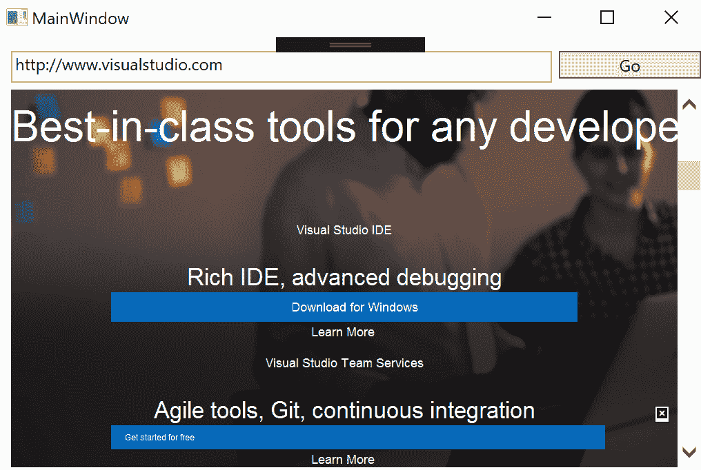

1.  关闭应用程序。

# 它是如何工作的...

在步骤 1 到 10 中，我们打开了现有的.NET Standard 2.0 库项目解决方案。然后我们向解决方案中添加了一个 WPF 项目。在步骤 11 到 14 中，我们添加了对之前菜谱中构建的类库的引用。在步骤 16 到 18 中，我们向 WPF 应用程序的`MainWindow`添加了控件，并更改了一些属性。

在步骤 21 中，我们使用`using`指令引用了类库。在步骤 23 中，我们使用`async`关键字装饰了`GoButton_Click()`方法。在步骤 24 中，代码的前三行演示了我们在创建`SiteReader`类实例后创建了一个变量来存储从 TextBox 中获取的 URL。然后，我们使用`ReadSiteContent()`异步方法读取给定 URL 的内容。最后，我们在`WebBrowser`控件中显示该内容。

在步骤 25 到 27 中，我们测试了应用程序。

# 创建线程池

在本食谱中，我们将探讨 C# 中的线程池。基本上，线程池是一组可以用于在后台执行任务的线程。一旦线程完成其任务，它就会被发送到等待线程的池中，以便可以重用。让我们创建一个使用线程池的 .NET Standard 2.0 库。

# 准备工作

确保您已安装并运行了最新版本的 Visual Studio 2017。

# 如何操作...

1.  打开 Visual Studio 2017。

1.  点击“文件”|“新建”|“项目”来创建一个项目。

1.  在“新建项目”对话框中，展开左侧窗格中的“其他项目类型”节点，并选择“Visual Studio 解决方案”。在右侧窗格中，选择“空白解决方案**”。**

1.  在“名称：”文本框中，键入`Chapter6.ThreadPools`，并在“位置：”文本框中，从下拉框中选择一个路径或点击“浏览...”按钮来定位路径：

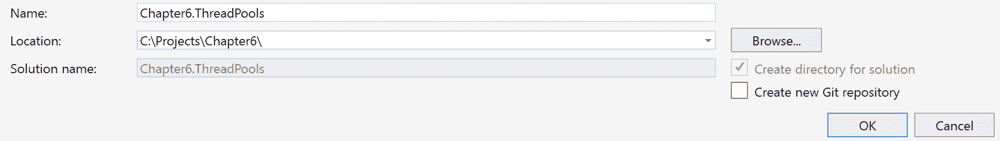

1.  点击“确定”。

1.  现在，解决方案资源管理器 (*Ctrl* + *Alt* + *L*) 应该看起来像这样：

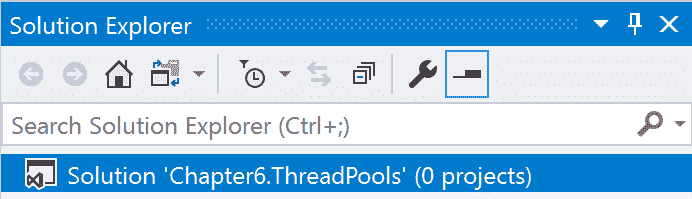

1.  在解决方案资源管理器中的`Chapter6.ThreadPools`标签上右键单击，并选择“添加”|“新建项目**”。**

1.  在“新建项目”对话框中，展开“Visual C#”节点。

1.  在左侧窗格中选择.NET Standard，在右侧窗格中选择“类库 (.NET Standard)”：

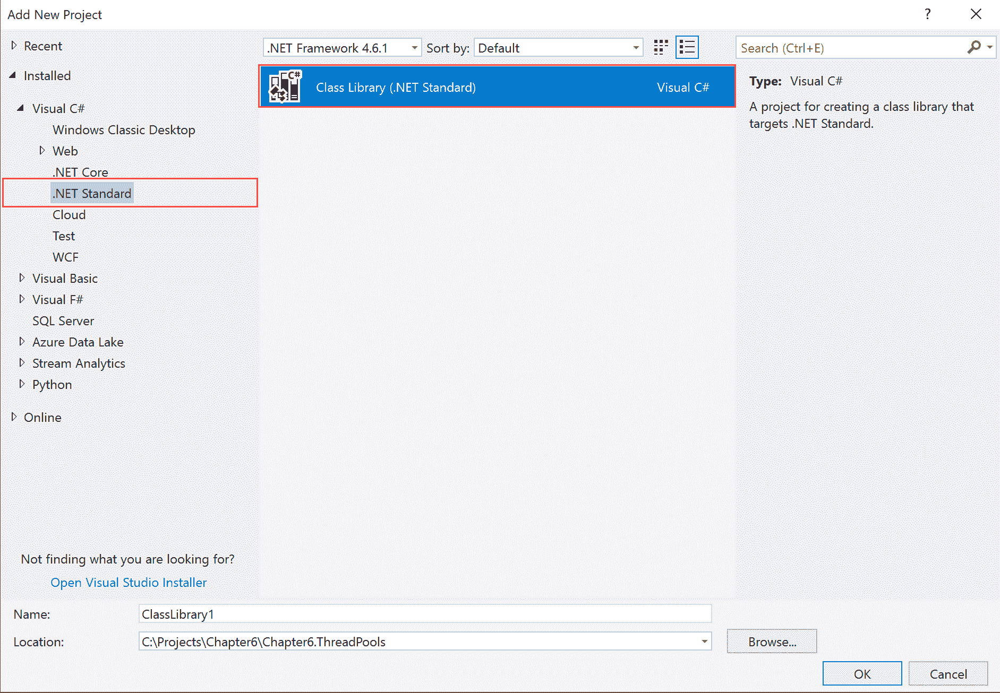

1.  在“名称：”文本框中，键入`Chapter6.ThreadPools.PoolLib`。保留其他默认设置并点击“确定”：

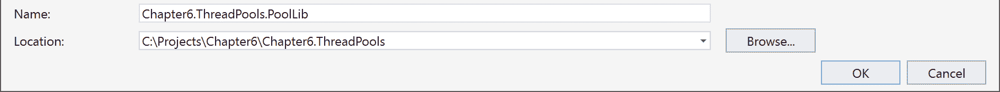

1.  现在，解决方案资源管理器 (*Ctrl* + *Alt* + *L*) 应该看起来像这样：

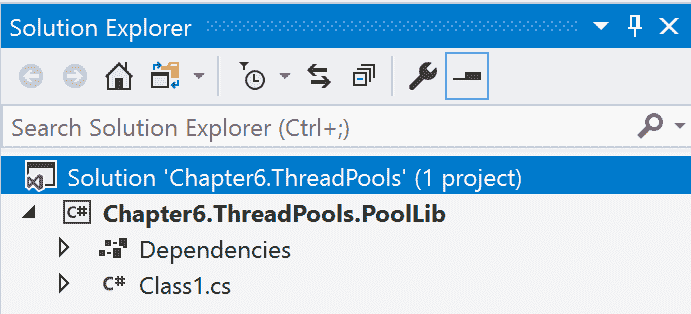

1.  在解决方案资源管理器中选择`Class1.cs`，然后按*F2*键重命名文件为`ThreadList.cs`。

1.  在确认对话框中回答“是”，询问是否重命名类名。

1.  双击解决方案资源管理器中的`ThreadList.cs`标签。

1.  让我们在代码窗口中向上滚动并添加以下`using`指令：

```cs
      using System.Text;
      using System.Threading;
```

1.  让我们添加一个类级别的变量来保存`StringBuilder`：

```cs
      StringBuilder messages = new StringBuilder();
```

1.  在类中添加一个主`ProcessPool()`方法：

```cs
      public StringBuilder ProcessPool()
      {
          for (int i=0; i<5; i++)
          {
              ThreadPool.QueueUserWorkItem(new WaitCallback(Process));
          }

          for (int k=0; k<10; k++)
          {
              messages.AppendLine($"Main Thread - {k + 1}");
          }

          return messages;
       }
```

1.  最后，让我们添加一个辅助方法来处理线程：

```cs
private void Process(object callback)
{
    for (int j=0; j<10; j++)
    {
        messages.AppendLine($"Thread - {j + 1}");
    }
}
```

1.  通过按*Ctrl* + *Shift* + *B*进行快速构建。

# 它是如何工作的...

在步骤 1 到 10 中，我们创建了一个空白解决方案，并将.NET Standard 2.0 库添加到项目中。在此期间，我们为项目和解决方案分配了有意义的名称。在第 12 步中，我们重命名了 Visual Studio 创建的默认类。在第 15 步中，我们添加了构建库所需的命名空间。

在第 16 步中，我们使用`StringBuilder`类创建了一个变量来存储消息。这是一个类级别的变量，在类内的方法之间共享。在第 17 步中，我们创建了一个方法，使用第 18 步中的辅助方法创建线程池。在该方法内部，我们使用`messages`变量在过程中存储消息。

最后，在第 19 步中，我们进行了快速构建以检查语法是否正确。

# 创建一个.NET 控制台应用程序来使用库

在本食谱中，我们将查看一个基于.NET 控制台的应用程序来使用库。这个控制台应用程序将引用上一食谱中创建的库并使用它。

# 准备工作

确保你已经完成了上一食谱。如果你已经完成，请使用 Visual Studio 2017 打开它并执行快速构建以检查一切是否正常。

# 如何操作...

1.  打开 Visual Studio 2017。

1.  现在，打开上一食谱中的解决方案。点击文件 | 打开 | 打开项目/解决方案，或按*Ctrl* + *Shift* + *O*，并选择`Chapter6.ThreadPools`解决方案。

1.  按*Ctrl* + *Shift* + *B*进行快速构建以检查一切是否正常。

1.  点击解决方案资源管理器中的`Chapter6.ThreadPools`解决方案标签。点击文件 | 添加 | 新项目。

1.  在“添加新项目”模板对话框中，展开左侧窗格中的 Visual C#节点。

1.  在右侧窗格中选择 Windows 经典桌面，并选择 Console App (.NET Framework)：

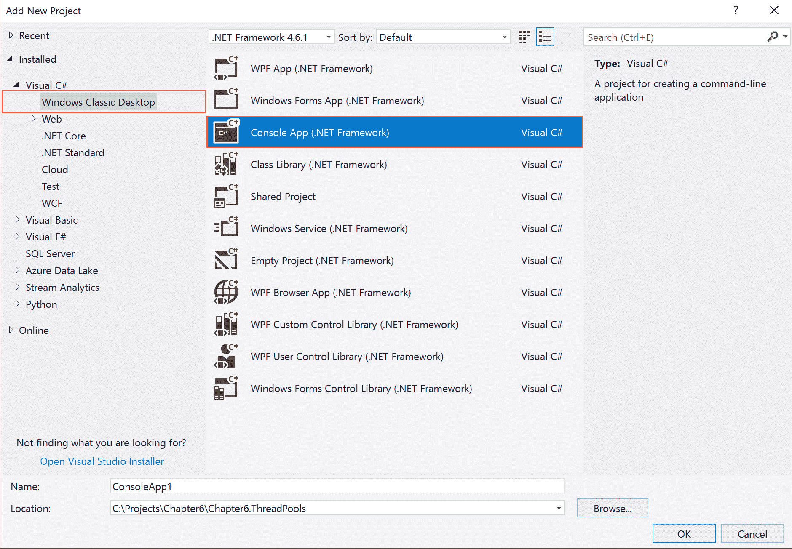

1.  在“名称”文本框中，输入`Chapter6.ThreadPools.PoolConsole`作为项目的名称。其余字段可以保持不变：

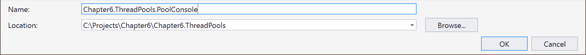

1.  点击确定。

1.  现在，解决方案资源管理器（按*Ctrl* + *Alt* + *L*）应该看起来像这样：

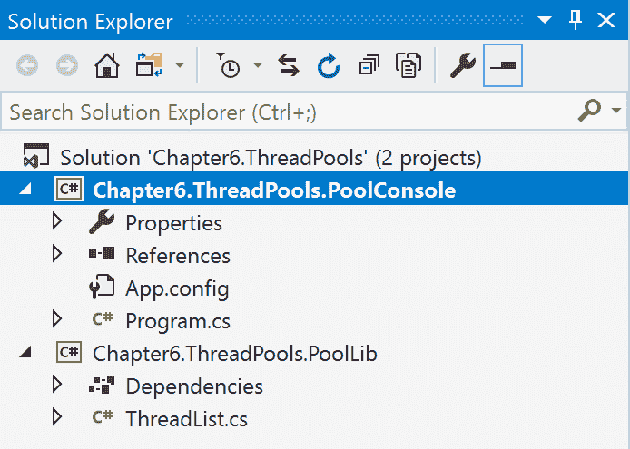

1.  在`Chapter6.ThreadPools.PoolConsole`的引用标签上右键单击。

1.  选择添加引用。

1.  在引用管理器中，点击右侧窗格中的项目标签：

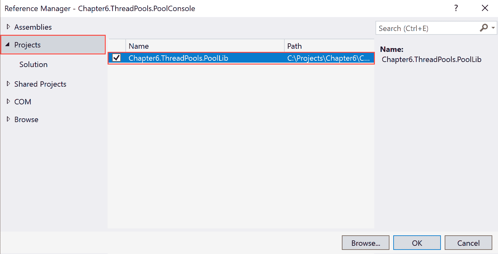

1.  在左侧窗格中检查`Chapter6.ThreadPools.PoolLib`项目。

1.  点击确定。

1.  双击解决方案资源管理器中的`Program.cs`标签。

1.  在代码窗口中向上滚动并添加以下`using`指令：

```cs
      using Chapter6.ThreadPools.PoolLib;
```

1.  让我们在`Main()`方法中添加代码：

```cs
      var pool = new ThreadList();
      var output = pool.ProcessPool();

      Console.WriteLine(output);

      Console.ReadLine();
```

1.  现在，按*F5*测试我们的应用程序：

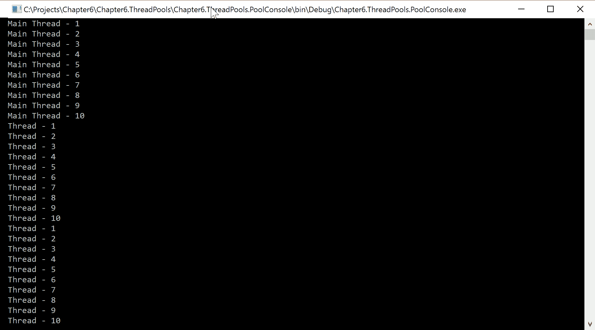

1.  按下*Enter*键退出应用程序。

# 它是如何工作的...

在步骤 1 到 9 中，我们打开了上一道菜谱中创建的解决方案。然后，我们将一个 .NET 控制台应用程序添加到项目中。在步骤 10 到 14 中，我们添加了对上一道菜谱中创建的库的引用。在步骤 16 中，我们在代码中创建了库的引用。在步骤 17 中，我们添加了代码来创建 `ThreadList` 类的实例。我们调用了 `ProcessPool()` 并将返回值存储在一个变量中。

最后，我们在控制台窗口中显示了输出，并在步骤 18 和 19 中测试了应用程序。
