# 第八章：使用 Xamarin 进入 iOS

在本章中，我们将探讨以下菜谱：

+   安装 Visual Studio for Mac

+   Hello iOS – 创建一个 Xamarin iOS 应用

+   创建.NET Standard 2.0 库

+   整合组件并测试应用

# 技术要求

读者应具备 C#的基本知识。他们还应具备使用 Visual Studio、使用 NuGet 安装包以及在项目中引用其他项目库的基本知识。

本章的代码文件可以在 GitHub 上找到：

[`github.com/PacktPublishing/DotNET-Standard-2-Cookbook/tree/master/Chapter08`](https://github.com/PacktPublishing/DotNET-Standard-2-Cookbook/tree/master/Chapter08)

查看以下视频以查看代码的实际操作：

[`goo.gl/fG1ErJ`](https://goo.gl/fG1ErJ)

# 简介

Xamarin 是一个开发平台，允许您为 iOS、Android 和 Windows 构建原生应用。Xamarin 最令人惊奇之处在于，您可以使用现有的 C#技能来开发这些应用。最初，Xamarin 被称为 Xamarin Studio，用于在 macOS 和 Windows 上构建应用。Windows 用户有额外特权使用 Visual Studio。在微软收购后，Xamarin Studio 变成了 Visual Studio for Mac。在本章中，我们将使用 Visual Studio for Mac 构建我们的应用，贯穿整个菜谱。

# 安装 Visual Studio for Mac

在这个菜谱中，我们将探讨如何获取 Visual Studio for Mac 并安装它。我们还将探讨设置一些其他事情。

# 准备工作

确保您有一台 Mac 来完成此菜谱。目前，我正在使用 macOS High Sierra 版本 10.13.3。同时，请确保您已经安装了最新的 XCode 版本。XCode 是 Mac 构建 iOS 应用时所需的，与 Visual Studio 一起使用。

# 如何操作...

1.  让我们打开您最喜欢的浏览器。

1.  在地址栏中输入[`www.xamarin.com/download`](https://www.xamarin.com/download)，然后按*Enter*。

1.  你应该看到一个类似的屏幕：

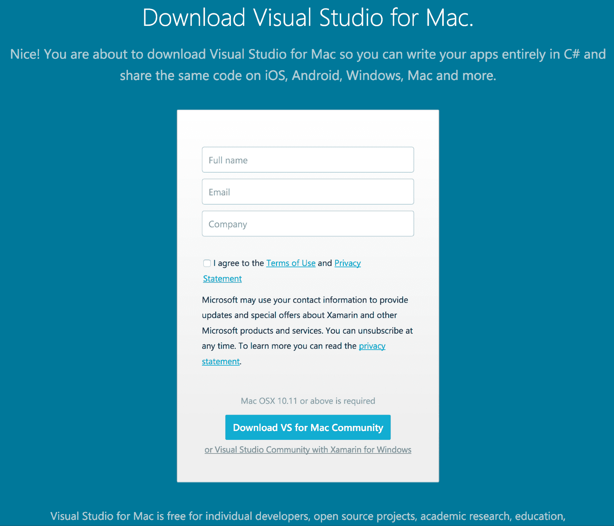

1.  现在，填写您的详细信息并按下“下载 VS for Mac Community”按钮。

1.  这将默认将文件下载到“下载”目录，命名为`VisualStudioForMacInstaller__215259590.1517557727.dmg`或类似名称（下载时末尾数字可能会变化。）

1.  双击该文件。

1.  你应该看到一个类似的窗口：

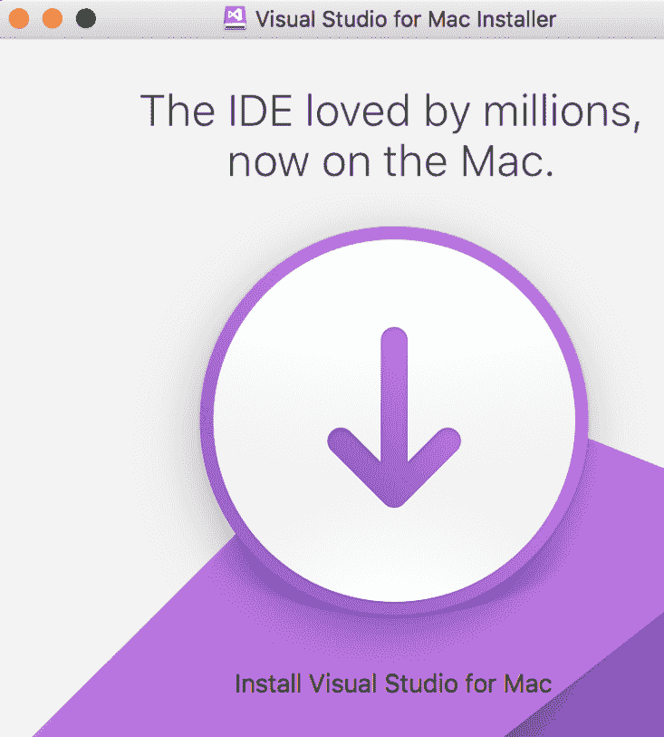

1.  双击下箭头。在下一个屏幕中，选择要安装的组件：

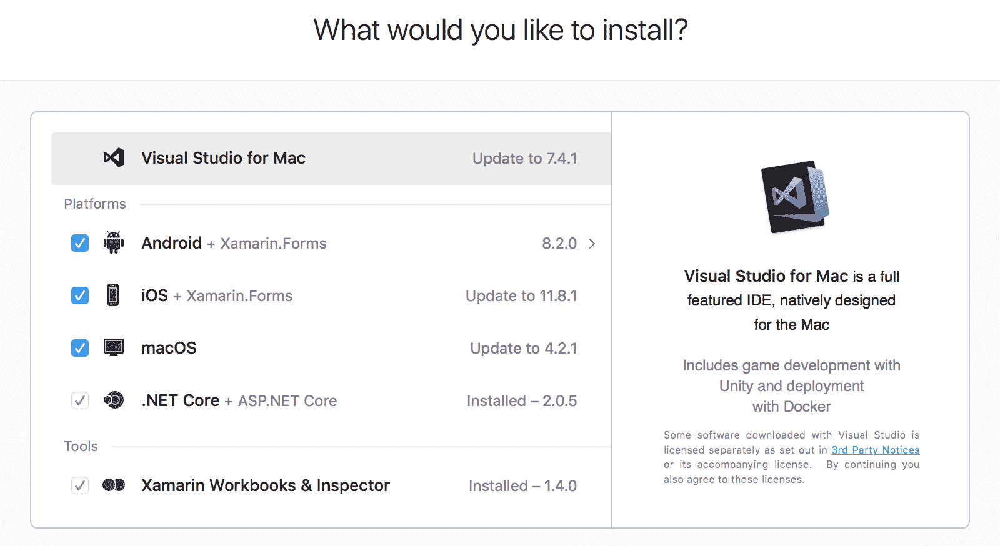

1.  点击安装按钮安装所有组件。请确保您已选择了 Android 和 iOS。

1.  安装成功后，你应该看到这个：

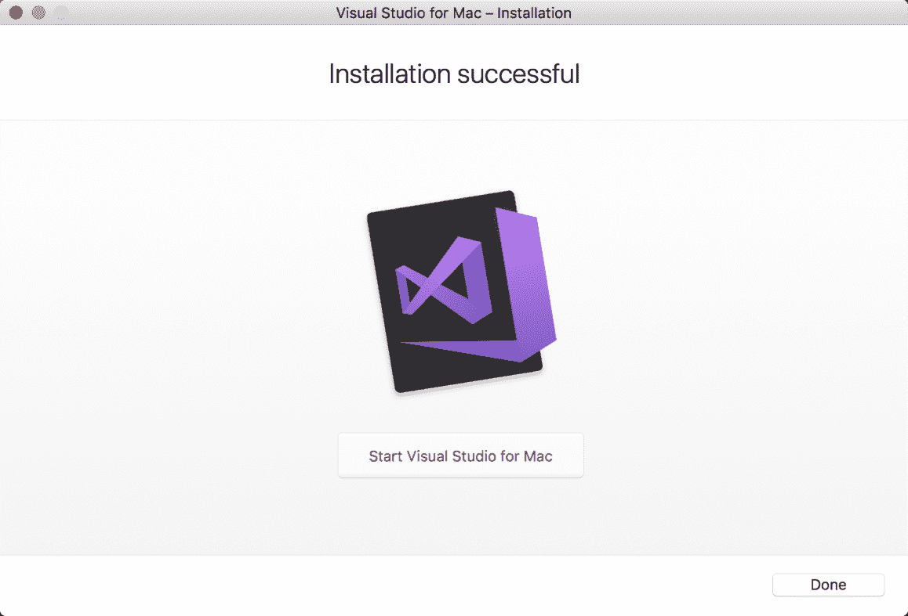

1.  现在，您可以点击完成以退出，并启动 Visual Studio for Mac 以打开 IDE：


Visual Studio for Mac

# 它是如何工作的...

这些是安装 Visual Studio for Mac 的简单步骤。在第 8 步，你应该看到安装而不是更新。这个屏幕出现是因为我已经安装了 Visual Studio for Mac 的一个版本。

# Hello iOS – 创建一个 Xamarin iOS 应用

在本菜谱中，我们将创建我们的第一个 iOS 应用程序。这将是一个类似于`Hello World`的应用程序。稍后，我们将修改这个应用程序以使用 .NET Standard 2.0 库。

# 准备工作

确保你已经完成了上一个菜谱，并且安装了 Visual Studio for Mac。同时，请确保你已经安装了与 Visual Studio for Mac 一起使用的 XCode。

# 如何操作...

1.  打开 Finder。

1.  在左侧面板中点击应用程序。

1.  现在，双击 Visual Studio 图标。

1.  现在，点击新建项目按钮。

1.  在选择项目模板对话框中，向下滚动直到到达其他部分。

1.  在左侧面板的 iOS 部分，选择杂项，然后在通用部分选择空白解决方案：

****

1.  现在，点击下一步按钮。

1.  在解决方案名称：文本框中输入 `Chapter8.Xamarin`。同时确保你已经选择了合适的存储位置：

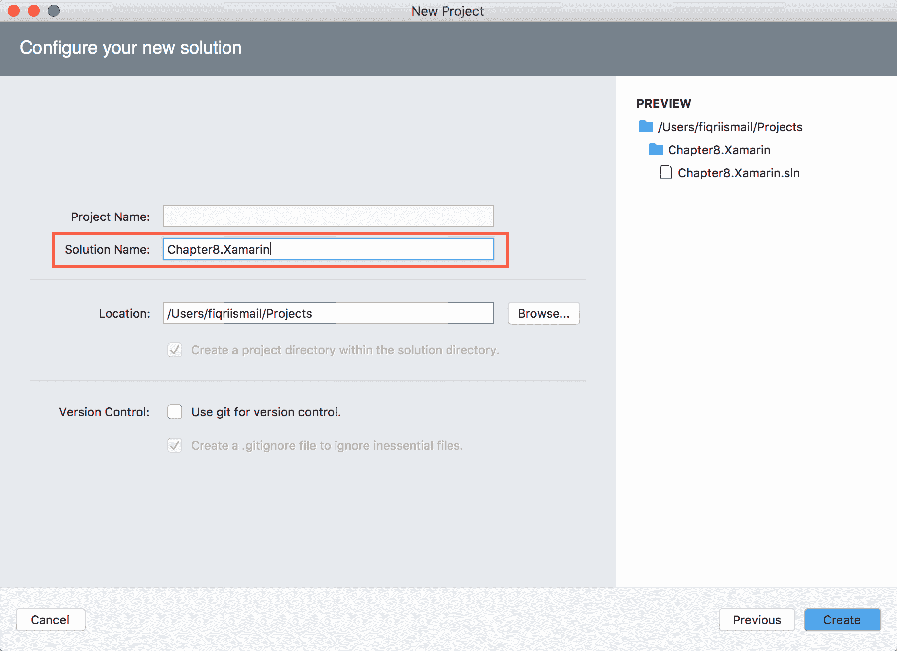

1.  现在，点击创建。

1.  现在，解决方案资源管理器应该看起来像这样：

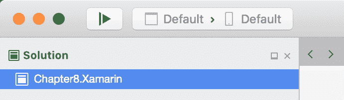

1.  现在，*Ctrl* + 点击 Chapter8.Xamarin 标签并选择添加 | 新项目。

1.  在左侧面板的 iOS 部分，选择应用程序，然后在右侧面板中选择单视图应用程序。

1.  确保选择 C# 作为编程语言：

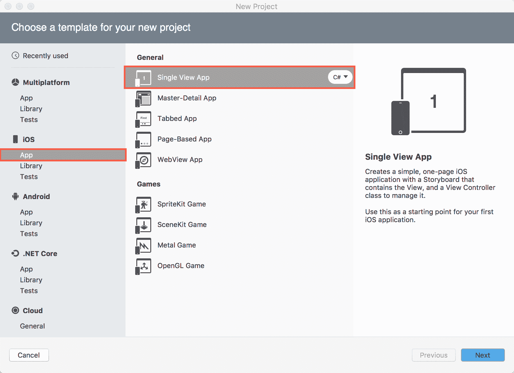

1.  点击下一步按钮。

1.  新建项目对话框将显示。

1.  在应用程序名称：文本框中输入 `Chapter8.Xamarin.iOSApp`，在组织标识符：文本框中输入 `com.chapter8`，并取消选中 iPad。保持目标：操作系统不变：

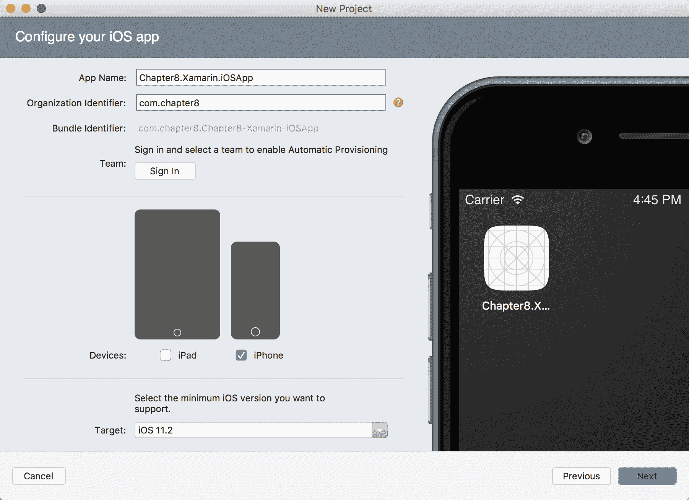

1.  点击下一步。

1.  保持一切不变并点击创建：

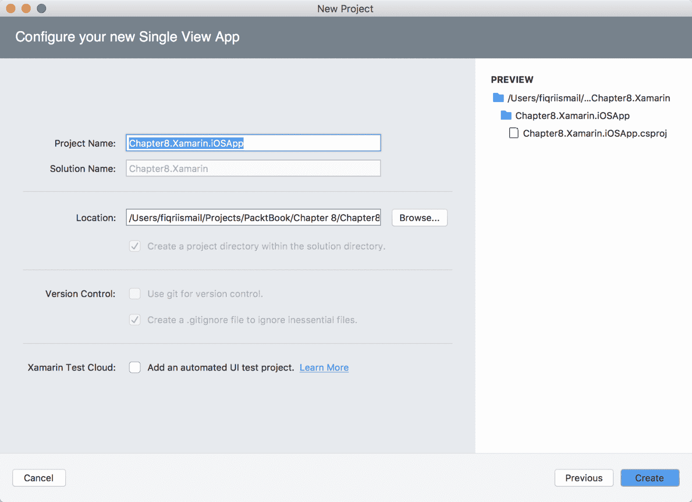

1.  现在，解决方案资源管理器应该看起来像这样：

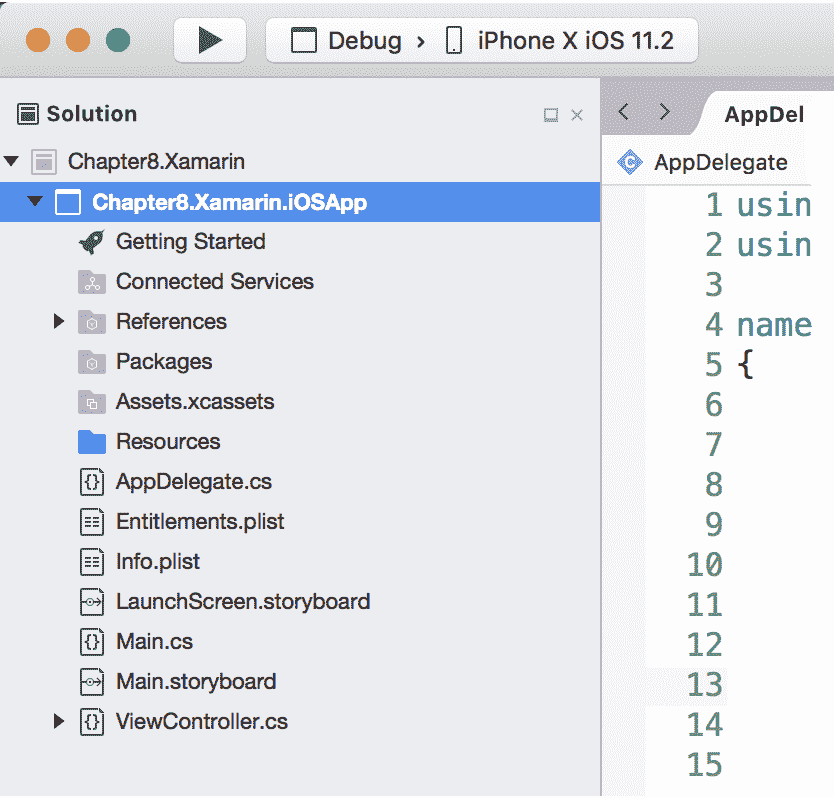

解决方案资源管理器

1.  现在，按下 *command* + *return* 以调试应用程序或按下解决方案资源管理器顶部的播放按钮。

1.  现在，你应该能看到 iOS 模拟器启动，它显示了应用的第一屏：

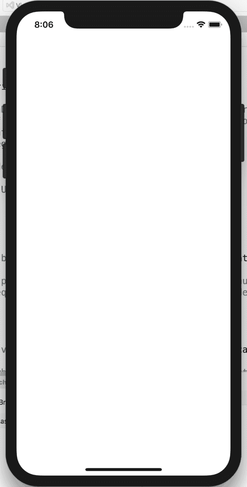

1.  恭喜！你已经测试了你的第一个 iOS 应用程序。

1.  现在，通过按下 *shift* + *command* + *return* 停止调试器。

# 它是如何工作的...

在步骤 1 到 3 中，我们打开了 Visual Studio for Mac，在步骤 6 到 9 中，我们创建了一个空白解决方案。我们还为该解决方案分配了一个合适的名称。这个空白解决方案将作为本章的基础。在步骤 11 到 18 中，我们将 iOS 单视图应用程序添加到解决方案中。在步骤 16 中，我们添加了一个组织标识符，这是在您部署到应用商店时识别您的应用程序的唯一标识符。单视图应用程序是一个入门模板，帮助开发者为 iOS 开发，并附带一个自定义的 `ViewController` 以便开始。我们也给它起了一个合适的名称。最后，在步骤 20 到 23 中，我们测试了 Visual Studio for Mac 生成的默认模板。

我们将在后面的菜谱中回到这个应用程序，并添加一些控件和一些代码。

# 创建 .NET Standard 2.0 库

在这个菜谱中，我们将使用 Visual Studio for Mac 构建 .NET Standard 2.0 库。我们将使用之前菜谱中的相同解决方案。

# 准备工作

确保您已经完成了之前菜谱中添加的 iOS 项目。如果是这样，让我们开始添加库并编写一些代码。

# 如何操作...

1.  打开 Finder。

1.  在左侧窗格中点击“应用程序”。

1.  现在，双击 Visual Studio 图标。

1.  现在，点击“打开”，定位到 `Chapter8.Xamarin` 解决方案，并打开它。

1.  解决方案资源管理器应该看起来像这样：

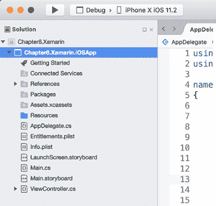

1.  现在，*按住控制键 (^)* + 点击 `Chapter8.Xamarin` 标签，然后选择“添加”|“新建项目”。

1.  在“新建项目”对话框中，滚动左侧窗格，直到看到“多平台”部分。

1.  在右侧窗格中点击“库”，然后在“常规”下选择 .NET Standard 库。同时确保已选择 C#：

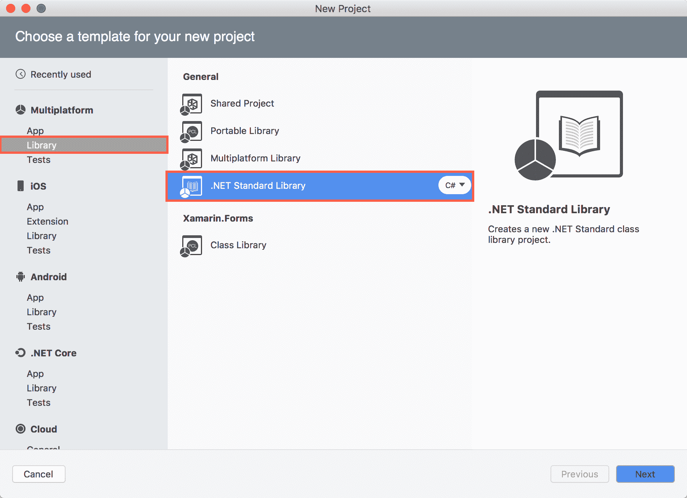

1.  点击“下一步”。

1.  选择“目标框架：”为 .NET Standard 2.0 并点击“下一步”：

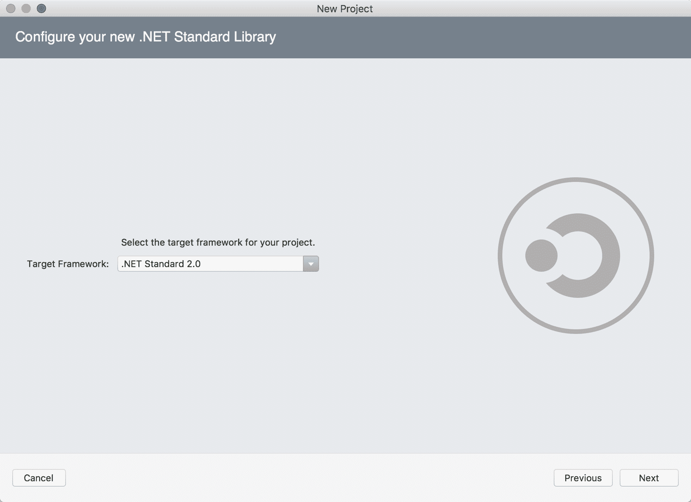

1.  在“项目名称：”文本框中，输入 `Chapter8.Xamarin.iOSLib` 作为名称，其余保持不变：

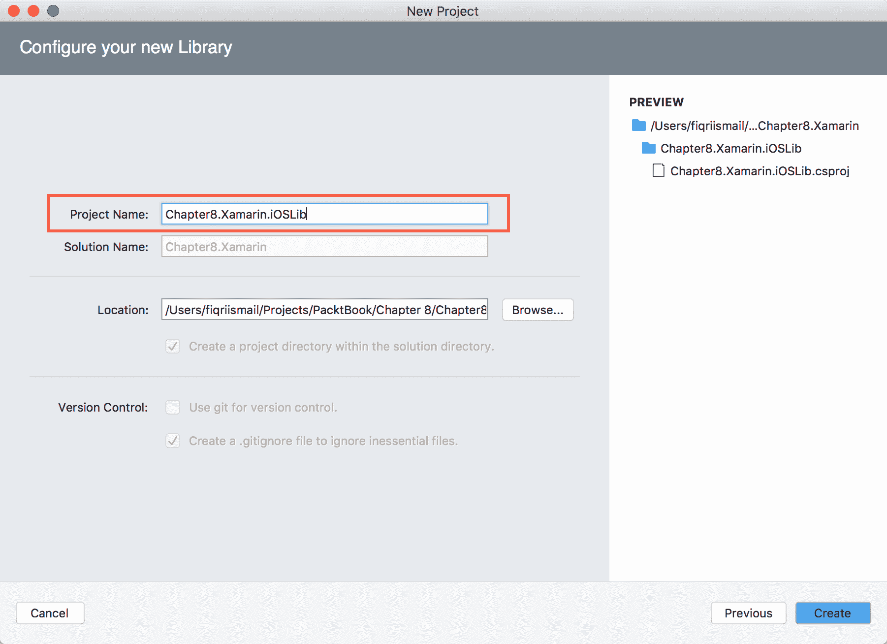

1.  点击“创建”。

1.  现在，解决方案资源管理器应该看起来像这样：


1.  选择 `Class1.cs` 标签并按 *command* + *R* 重命名。

1.  将其重命名为 `HelloLib.cs`。

1.  确保您还将类名从 `Class1` 更改为 `HelloLib`。

1.  现在，在 `HelloLib` 类内部，添加以下代码：

```cs
      public string SayHello(string yourName)
      {
          return $"Hello {yourName}, Greetings from iOS";
      }
```

1.  点击“生成”|“生成所有”以检查所有语法是否正确。

# 作用原理...

在步骤 1 到 4 中，我们打开了之前菜谱中创建的解决方案。在步骤 6 到 12 中，我们将 .NET Standard 2.0 库添加到解决方案中。现在，解决方案有两个项目，一个 iOS 项目和一个 .NET Standard 2.0 库项目。在步骤 14 到 16 中，我们重命名了 Visual Studio 创建的类。我们还重命名了实际的类名以匹配文件名。

在步骤 17 中，我们添加了一个公共方法，该方法接受一个 `string` 参数并返回一个欢迎消息作为字符串。最后，我们进行了快速构建以检查语法是否正确。

# 整合事物并测试应用程序

在这个菜谱中，我们将向 iOS 应用程序添加一些控件，并使用之前菜谱中创建的.NET Standard 2.0 库。

# 准备工作

确保你已经完成了前面的两个菜谱。它们是继续的必要条件。如果你已经完成了它们，让我们快速构建并开始。

# 如何操作...

1.  打开 Finder。

1.  在左侧窗格中点击“应用程序”。

1.  双击 Visual Studio 图标。

1.  点击“打开”，定位 `Chapter8.Xamarin` 解决方案，并打开它。

1.  解决方案资源管理器应该看起来像这样：

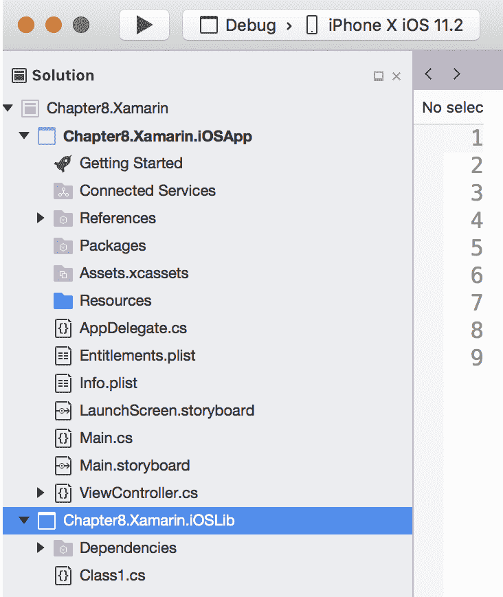

1.  现在，展开 `Chapter8.Xamarin.iOSApp` 项目节点。

1.  双击 `Main.storyboard` 文件。

1.  这将打开应用程序的故事板选项卡。

1.  你应该看到 iOS 应用程序的默认布局如下：

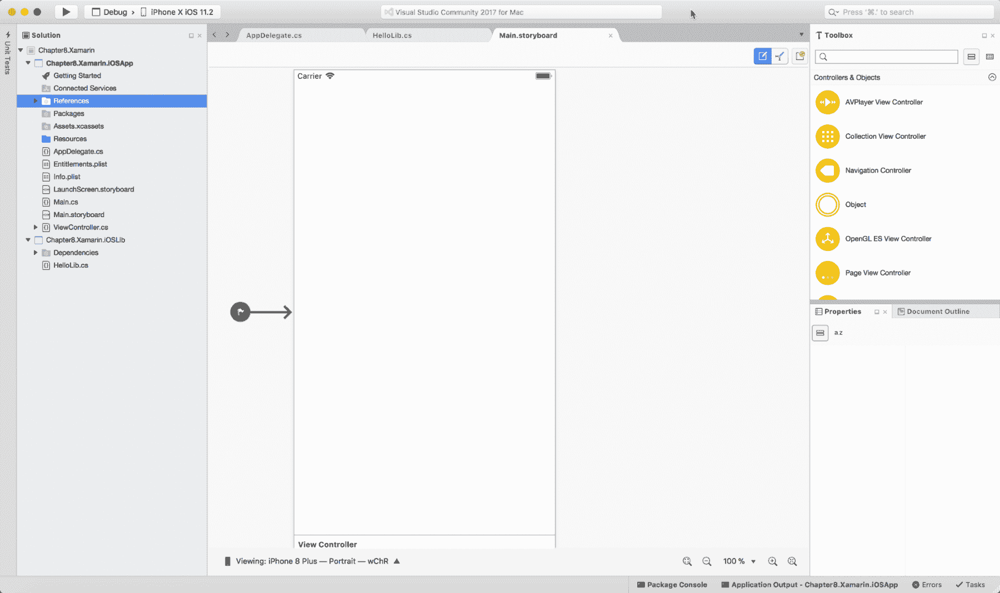

iOS 应用程序的默认布局

1.  现在，选择工具箱窗口。

1.  在 `search` 文本框内点击并输入 `Button`。

1.  现在，将按钮控件拖到画布中间的主白色区域。

1.  选择按钮。在属性窗口中，在标题标签下输入 `Say Hello`，在名称属性中输入 `HelloButton`。

1.  现在，你的画布应该看起来像这样：

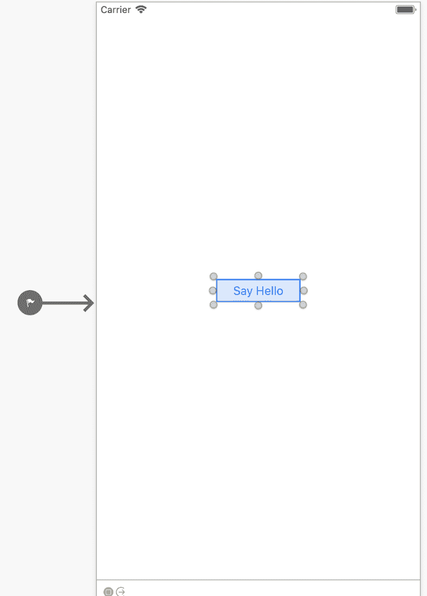

1.  现在，在解决方案资源管理器中，*control (^)* + 点击“引用”标签并选择“编辑引用”。

1.  在“编辑引用”对话框中，点击“项目”选项卡。

1.  在列表中勾选 `Chapter8.Xamarin.iOSLib` 并点击确定：

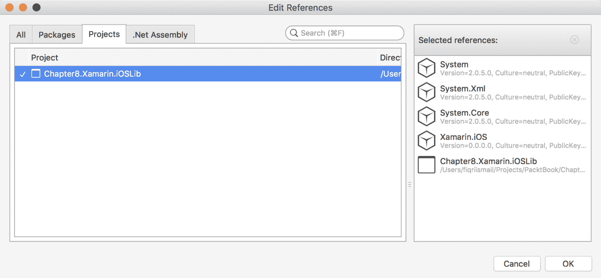

1.  现在，双击 `VeiwController.cs` 文件以打开其代码。

1.  向上滚动到 `using` 指令，并添加以下 `using` 指令以访问库：

```cs
      using Chapter8.Xamarin.iOSLib;

```

1.  现在，向下滚动到 `ViewDidLoad()` 方法。

1.  在 `base.ViewDidLoad()` 行旁边添加以下代码：

```cs
      HelloButton.TouchUpInside += (object sender, EventArgs e) =>
      {
          var greetings = new HelloLib();
          var message = greetings.SayHello("Fiqri Ismail");

          //Create an alert box    
          var greetingsAlert = UIAlertController.Create("Hello", 
              message, UIAlertControllerStyle.Alert);
          greetingsAlert.AddAction(UIAlertAction.Create("OK", 
              UIAlertActionStyle.Default, null));

          PresentViewController(greetingsAlert, true, null);
       };
```

1.  现在，按 *command* + *return* 键来调试应用程序。

1.  你应该看到以下输出：

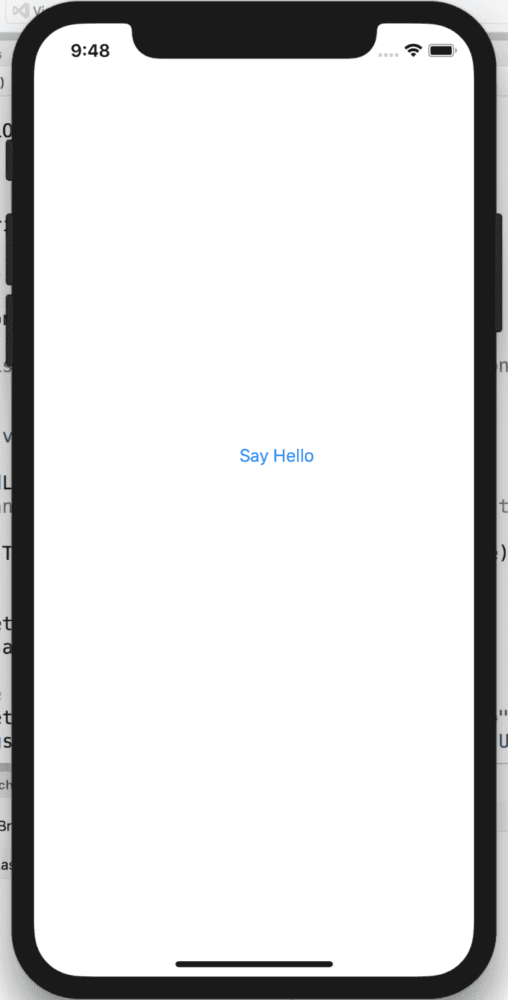

1.  现在，点击“说你好”按钮：

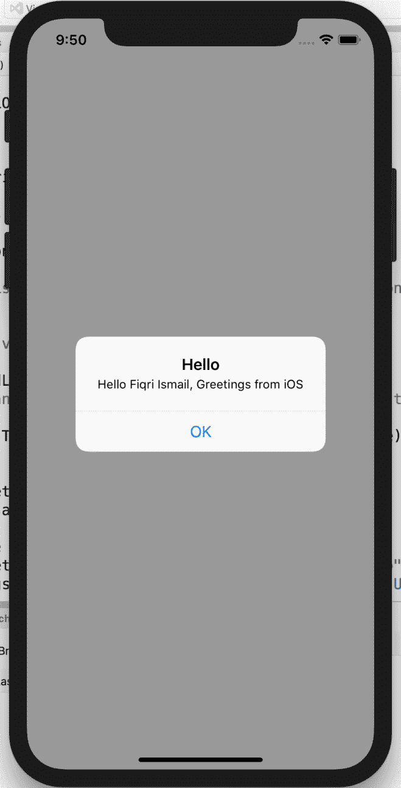

1.  现在，点击确定并停止调试。

# 工作原理...

在步骤 1 到 6 中，我们打开了一个现有的项目解决方案。在步骤 10 到 13 中，我们在画布上添加了一个简单的按钮控件。之后，我们更改了按钮的标题和名称属性。在步骤 17 中，我们从 iOS 项目添加了对库的引用。同样，在步骤 19 中，我们从代码级别添加了对.NET Standard 库的引用。

在第 21 步中，我们添加了代码来触发按钮触摸抬起事件。此事件在您在真实设备上触摸并抬起手指时触发，但在模拟器中，它会在您点击按钮时触发。我们是在`ViewDidLoad()`方法中添加的这段代码。该方法在视图加载后触发。在代码的前两行中，我们从一个库中创建了一个`HelloLib`类的实例。然后，我们执行了`SayHello`方法，并将返回值保存在一个变量中。

然后，我们创建了一个警报框来显示加尔各答消息，并附带一个确定按钮。最后，在第 23 步和第 24 步中，我们测试了我们刚刚构建的 iOS 应用程序。
