# 第十一章：打包和交付

在本章中，我们将探讨以下菜谱：

+   创建.NET Standard 2.0 库

+   创建你的库的 NuGet 包

+   将包提交到 NuGet 包管理器

+   创建经典 Windows 应用程序并测试 NuGet 包

# 技术要求

读者应具备 C#的基本知识。他们还应具备使用 Visual Studio、使用 NuGet 安装包以及在其他项目中引用库的基本知识。

本章的代码文件可以在 GitHub 上找到：

[`github.com/PacktPublishing/DotNET-Standard-2-Cookbook/tree/master/Chapter11`](https://github.com/PacktPublishing/DotNET-Standard-2-Cookbook/tree/master/Chapter11)

查看以下视频以查看代码的实际操作：

[`goo.gl/XuznM7`](https://goo.gl/XuznM7)

# 简介

在本章中，我们将探讨如何创建你的库的 NuGet 包。我们将创建一个基本库，然后创建一个 NuGet 包并提交它。最后，我们将在两个不同的应用程序中使用该包。

NuGet 是.NET 应用程序的包交付工具。它避免了寻找包或库所需的所有依赖项的麻烦。例如，如果你正在寻找库 A，并且它需要几个其他库，如库 B 和库 C，你只需获取库 A。NuGet 将为你节省搜索库 B 和 C 以及安装和配置它们的时间。

# 创建.NET Standard 2.0 库

在这个菜谱中，我们将创建一个用于打包的基本.NET Standard 2.0 库；为了演示目的，我们将创建一个小计算器库。

# 准备工作

确保你的系统上已安装并更新了最新版本的 Visual Studio 2017。这个菜谱假设你具备创建.NET Standard 2.0 库的相当多的知识。

# 如何做...

1.  打开 Visual Studio 2017。

1.  点击**文件** | **新建** | **项目**，然后在新建项目模板对话框中，在左侧窗格中选择**其他项目类型**下的**Visual Studio 解决方案**，在右侧窗格中选择**空白解决方案**。

1.  在名称：文本框中，键入`Chapter11.Packaging`作为解决方案的名称，如图所示。在**位置**下拉列表中选择一个首选位置，或单击浏览...按钮并选择一个位置。保持默认设置不变：

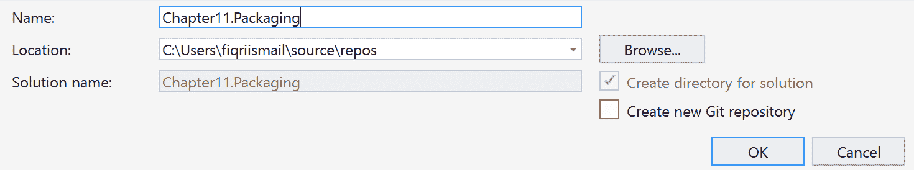

1.  点击“确定”。

1.  现在，在解决方案资源管理器中（或按*Ctrl* + *Alt* + *L*），选择`Chapter11.Packaging`。右键单击并选择**添加** | **新建项目**。

1.  在添加新项目对话框中，展开 Visual C#节点，并在左侧窗格中选择.NET Standard。

1.  在右侧窗格中，选择如图所示的类库(.NET Standard)：

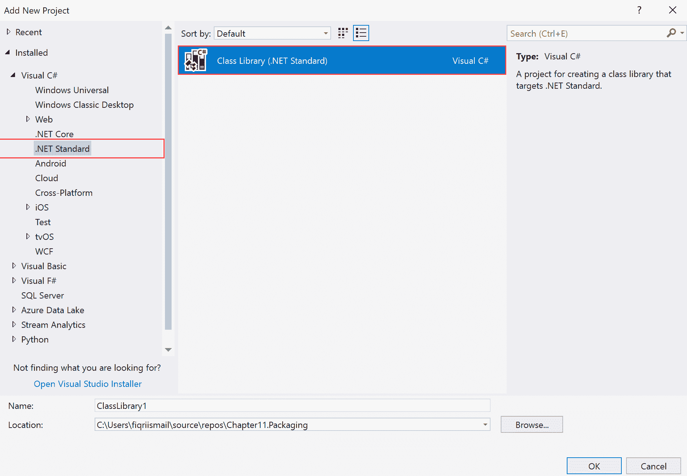

1.  现在，在**名称**文本框中，键入`Chapter11.Packaging.CalcLib`，并保持位置：文本框不变：

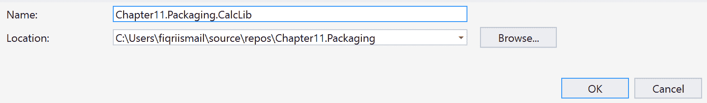

1.  点击确定。

1.  现在，解决方案资源管理器应该看起来像这样：

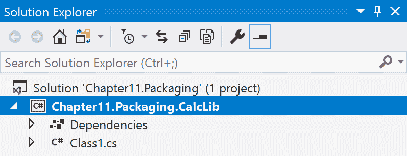

1.  点击 `Class1.cs` 并按 *F2* 重命名它。将新名称输入为 `Calculator.cs`。

1.  选择是以确认类名的重命名。

1.  现在，将这些两个公共方法添加到类体中：

```cs
      public int Add(int num1, int num2)
      {
          return num1 + num2;
      }

      public int Subtract(int num1, int num2)
      {
          return num1 - num2;
      }
```

1.  按 *Ctrl* + *Shift* + *B* 进行快速构建。

# 它是如何工作的...

在步骤 1 到 10 中，我们创建了一个空白解决方案并给它起了适当的名字。然后我们向解决方案中添加了一个 .NET Standard 2.0 类库。在步骤 11 和 12 中，我们将默认的 `Class1.cs` 重命名为更有意义的东西。是的，你可以随时删除这个类并创建一个新的。在步骤 13 中，我们为两个整数的加法和减法创建了两个简单的方法。

最后，我们在步骤 14 中进行了快速构建以进行语法检查。

# 创建您库的 NuGet 包

在这个食谱中，我们将探讨如何从上一个食谱中刚刚构建的库中创建一个 NuGet 包。

# 准备工作

确保你已经完成了前面的食谱，或者你已经有一个现成的 .NET Standard 库。让我们开始吧。

# 如何操作...

1.  打开 Visual Studio 2017。

1.  现在，打开上一个食谱中的解决方案。点击文件 | 打开 | 打开项目/解决方案，或者按 *Ctrl* + *Shift* + *O*，并选择 `Chapter11.Packaging` 解决方案。

1.  现在，解决方案资源管理器应该看起来像这样：

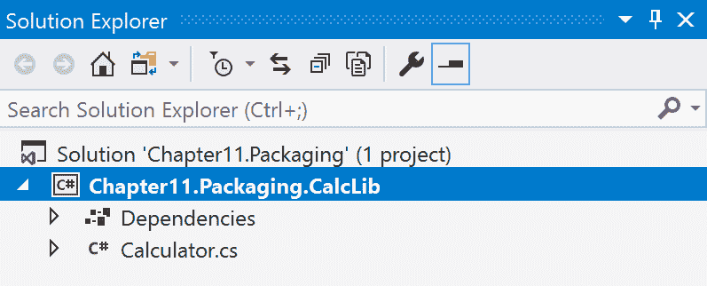

1.  现在，点击 `Chapter11.Packaging.CalcLib` 项目标签以选择它。

1.  右键单击并选择属性。

1.  在属性选项卡中，点击包标签：

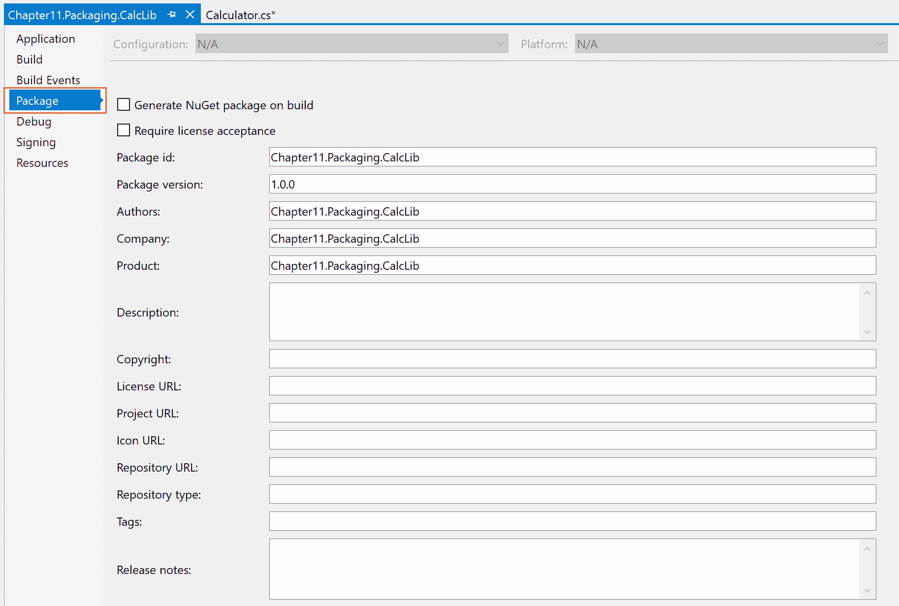

1.  现在，填写信息，它应该看起来像这样：

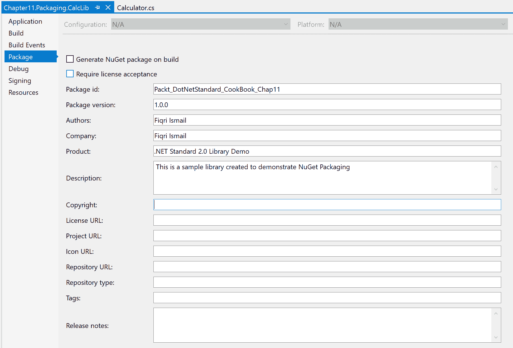

1.  现在，保存并关闭。

1.  再次，在工具栏中，从调试区域选择发布：

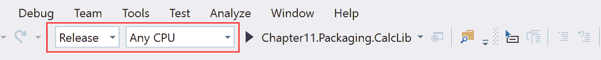

1.  现在，再次在解决方案资源管理器中，右键单击 `Chapter11.Packaging.CalcLib` 标签。

1.  选择打包：

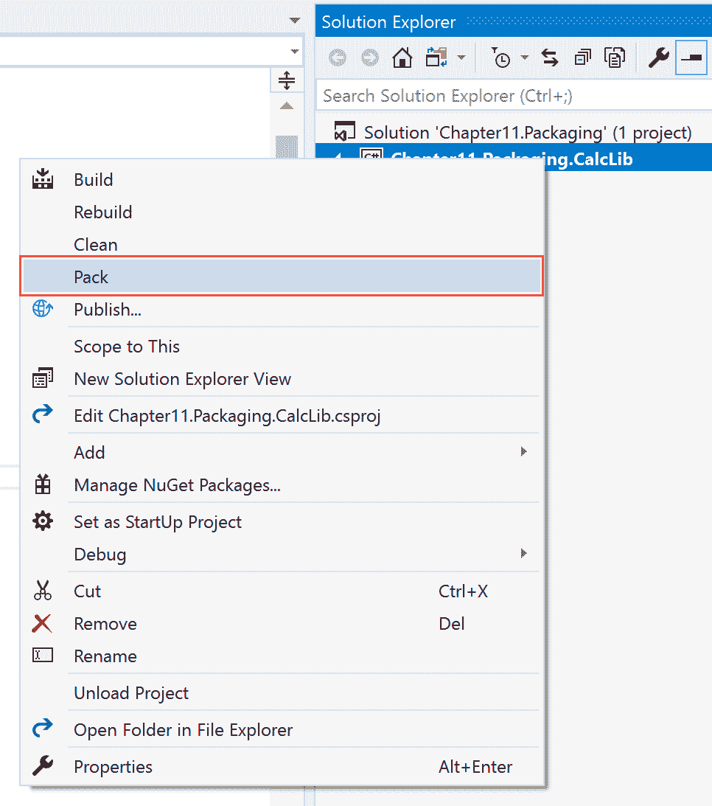

1.  这应该在您的位置构建并创建一个 NuGet 包。

1.  你可以在输出窗口中看到位置，如下所示：

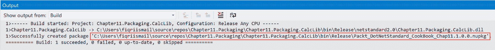

# 它是如何工作的...

这些步骤是自我解释的。当你遵循这些步骤时，你将能够看到选中的 NuGet 包。在第 7 步中，如果你真的想让你的客户明确接受你的模块的许可条款，可以将“要求接受许可”设置为 true。最重要的步骤是第 9 步，其中你将构建选项设置为发布。确保当你将库上传到那里时，你做了这件事——不是调试版本，总是发布版本。

# 将包提交到 NuGet 包管理器

在本教程中，我们将探讨如何提交在前一个教程中创建的 NuGet 包。要向 NuGet 提交包，您将需要登录。如果您有 Microsoft Live 账户，这很简单；否则，您始终可以在 NuGet 网站本身创建一个 `nuget.org` 账户。

# 准备中

确保您已经完成了前面的教程并创建了一个 NuGet 包。另外，拥有一个 Microsoft Live 账户可以让登录过程更加顺畅，但是的，您始终可以创建一个 NuGet 账户。

# 如何操作...

1.  打开您首选的浏览器。

1.  在地址栏中，键入 [www.nuget.org](https://www.nuget.org/) 并按 *Enter*。

1.  现在，点击右上角的“登录”链接：

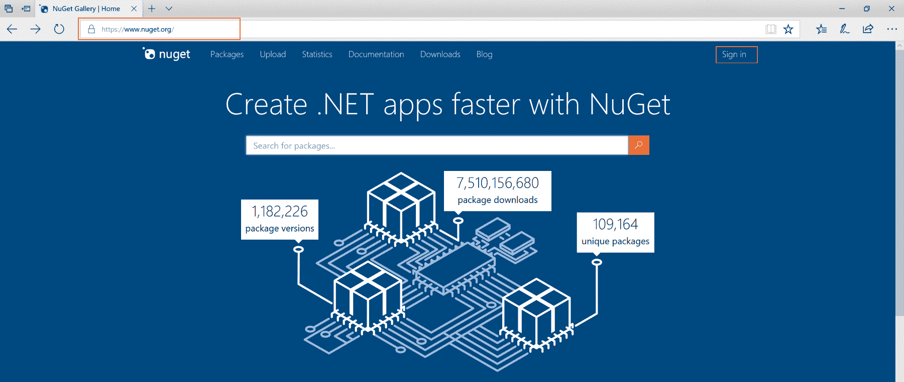

1.  使用您的 Microsoft 账户或创建一个 NuGet 账户然后登录：

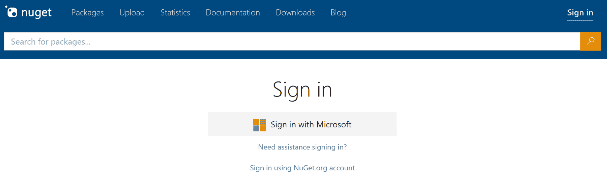

1.  登录成功后，点击“上传”链接。

1.  现在，在这个屏幕上，您可以拖放您的包，或者您可以浏览包：

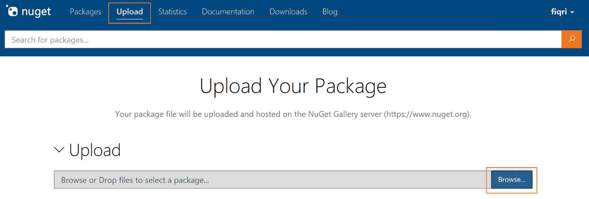

1.  现在，点击“浏览...”按钮并定位您的包（或者您可以将包拖放到这里）：

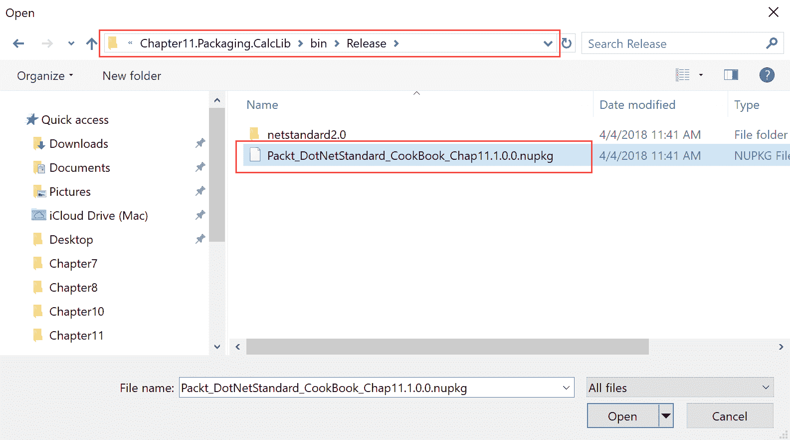

1.  点击“打开”。

1.  在下一屏，您将需要确认您的包的详细信息。

1.  如果您对此满意，请点击屏幕底部的“提交”按钮：

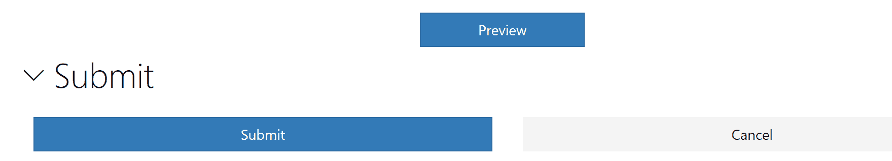

1.  成功提交后，您应该看到这个屏幕：

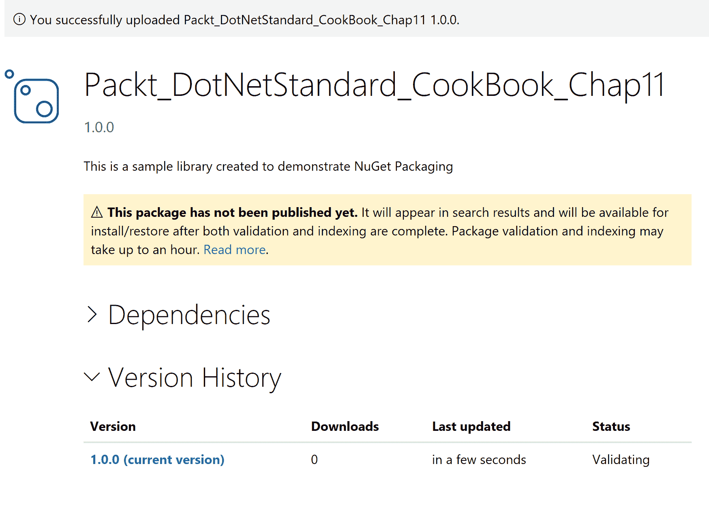

1.  几分钟后，您应该会看到您包的安装说明：

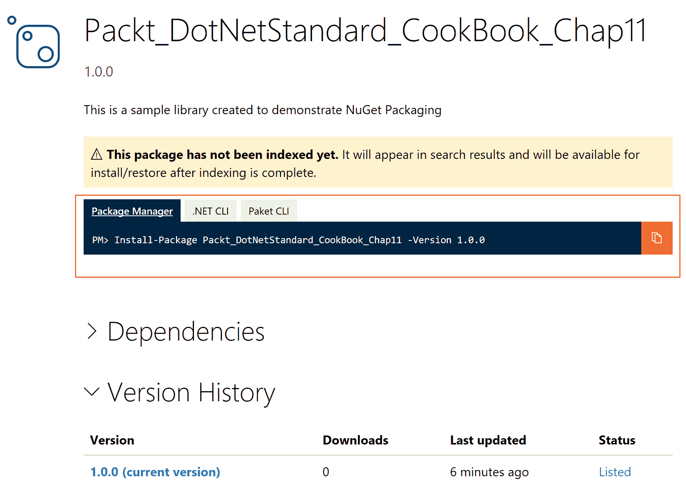

# 它是如何工作的...

所有这些步骤都解释了如何创建和提交您的 NuGet 包。但是，您需要记住一些事情，比如适当的命名和提交库之前的测试。始终确保您更新库到新版本，因为它们将包含修复错误的补丁，这将使您最终能够交付一个非常好的产品。

# 创建经典 Windows 应用程序并测试 NuGet 包

在本教程中，我们将探讨创建经典 Windows 应用程序并使用前一章中提交的 NuGet 包。我们将创建一个新的项目并使用这个库。

# 准备中

确保您已经完成了提交 NuGet 包的前一个教程。确保包在 `nuget.org` 上已准备好安装。

# 如何操作...

1.  打开 Visual Studio 2017。

1.  点击“文件”|“新建**项目**”并在 Visual C# 下的右侧窗格中选择 Windows Classic Desktop：

1.  在右侧窗格中选择 Windows Forms App (.NET Framework)：

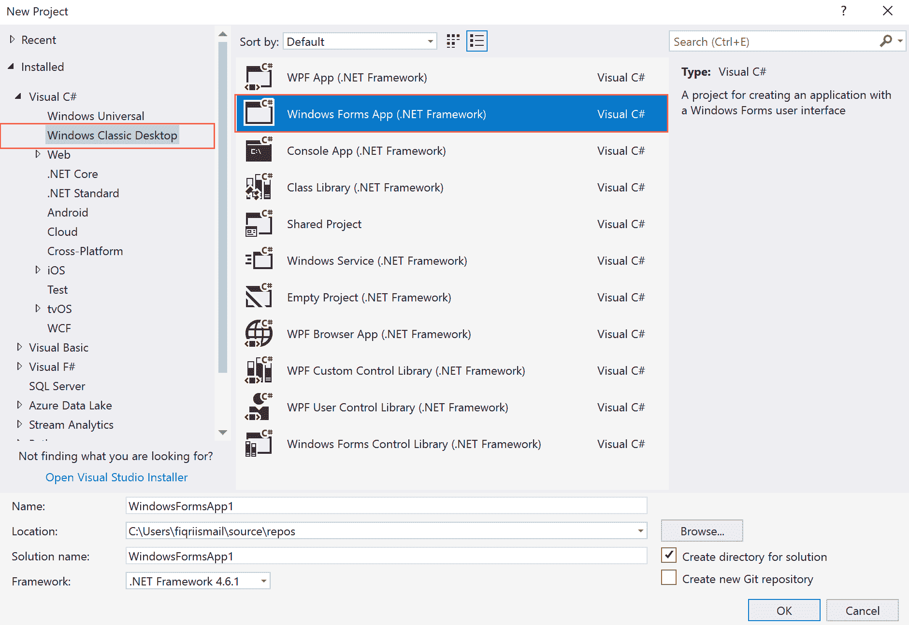

1.  现在，在“名称：”文本框中，键入 `Chapter11.Packaging.WinAppUsage`，并在“位置：”文本框下选择一个合适的地点，其他字段保持不变：

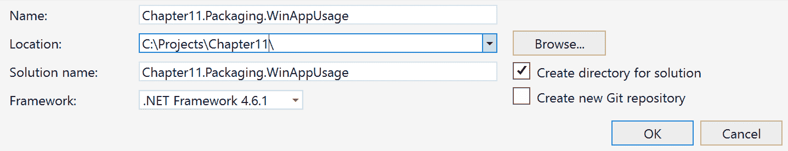

1.  点击“确定”。

1.  解决方案资源管理器（*Ctrl* + *Alt* + *L*）应该看起来像这样：

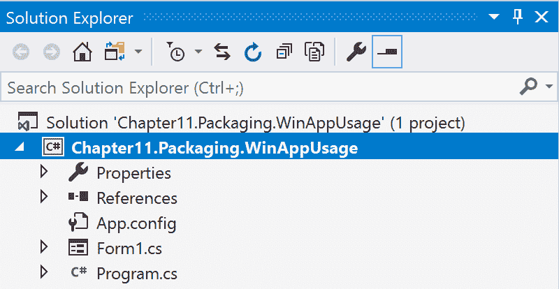

1.  现在，点击`Form1.cs`并将其名称更改为`MainForm.cs`。

1.  确认更改类名。

1.  现在，将两个按钮拖到设计器中的表单上。

1.  按照以下方式更改按钮的属性：

    | **控件** | **属性** | **值** |
    | --- | --- | --- |
    | 按钮 | 名称 | `BtnAdd` |
    | 按钮 | 文本 | `Add` |
    | 按钮 | 名称 | `BtnSub` |
    | 按钮 | 文本 | `Subtract` |
    | 表单 | 名称 | `MainForm` |
    | 表单 | 文本 | `Simple Calculator` |

1.  现在，你的表单应该看起来像这样：

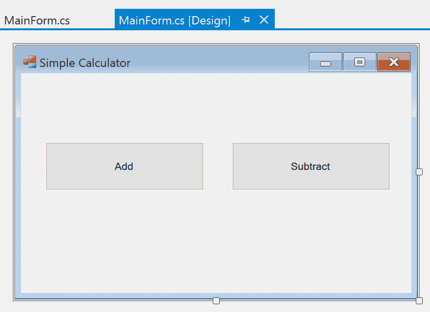

1.  现在，在引用标签上右键单击。

1.  选择管理 NuGet 包**。**

1.  点击浏览，在搜索框中输入你上传时选择的包 ID。

1.  在这个情况下，输入`Packt_DotNetStandard_CookBook_Chap1`，然后按*Enter*：

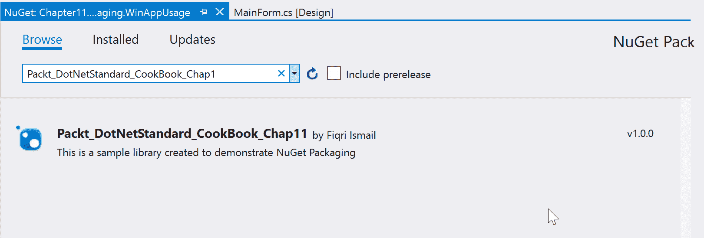

1.  现在，点击该包。

1.  在右侧窗格中点击安装按钮：

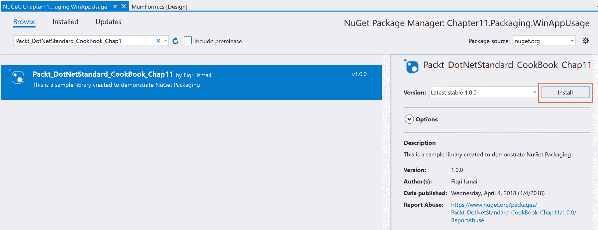

1.  在确认对话框中点击确定：

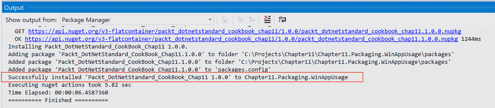

1.  现在，在解决方案资源管理器中，展开引用标签，你应该在那里看到我们的库：

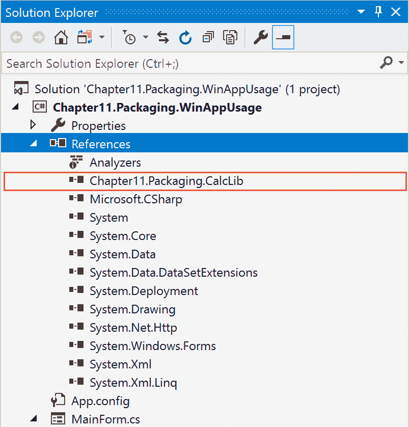

1.  现在，双击添加按钮进入代码窗口。

1.  向上滚动直到看到`using`指令。

1.  在`using`指令的末尾添加以下指令。

```cs
      using Chapter11.Packaging.CalcLib;
```

1.  现在，向下滚动直到到达`BtnAdd_Click()`方法。

1.  在方法内部添加以下代码：

```cs
      var calculator = new Calculator();
      var answer = calculator.Add(10, 20);

      MessageBox.Show($"The answer is {answer}");
```

1.  现在，双击减按钮，并在`click`方法内部添加以下代码：

```cs
      var calculator = new Calculator();
      var answer = calculator.Subtract(50, 20);

      MessageBox.Show($"The answer is {answer}");
```

1.  现在，按*F5*测试应用程序。

1.  点击添加按钮，你应该会看到如下输出：

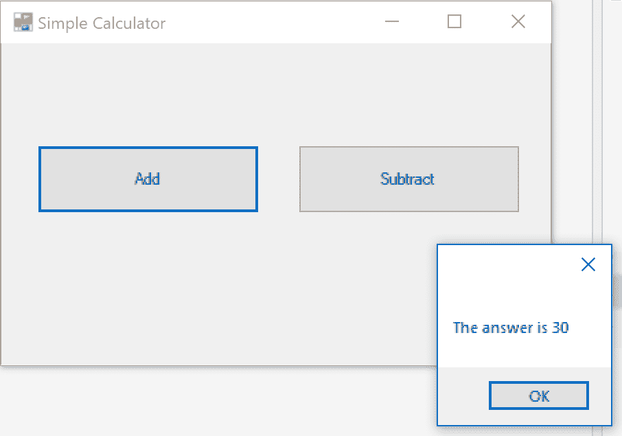

1.  对减按钮也做同样的操作。

1.  点击确定并关闭窗口。

# 它是如何工作的...

在步骤 1 到 7 中，我们创建了一个经典的 Windows 应用程序项目。然后，在步骤 9 到 11 中，我们创建了 Windows 项目的 UI。在步骤 14 和 15 中，我们打开了 NuGet 包管理器。然后我们搜索我们的包并确认它已加载。在步骤 18 到 20 中，我们安装了我们的包并确认它已安装。

在步骤 24 中，我们添加了使用 NuGet 包管理器安装的库的引用。在步骤 25 和 26 中，我们创建了一个`Calculator`类的实例并使用了它的`Add()`和`Subtract()`方法。最后，在步骤 28 到 30 中，我们测试了应用程序。

使用包管理器是从 NuGet 安装包的一种方式。但你可以使用 NuGet 包管理器控制台来完成同样的操作。要访问包管理器控制台，你可以点击工具 | NuGet 包管理器 | 包管理器控制台：

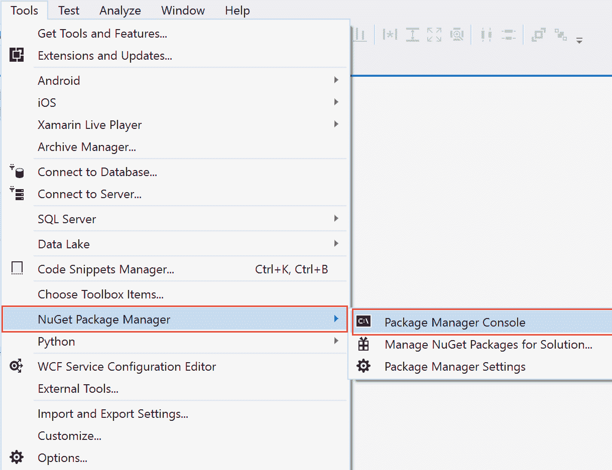

在控制台中，你可以输入：

```cs
Install-Package Packt_DotNetStandard_CookBook_Chap11 -Version 1.0.0
```

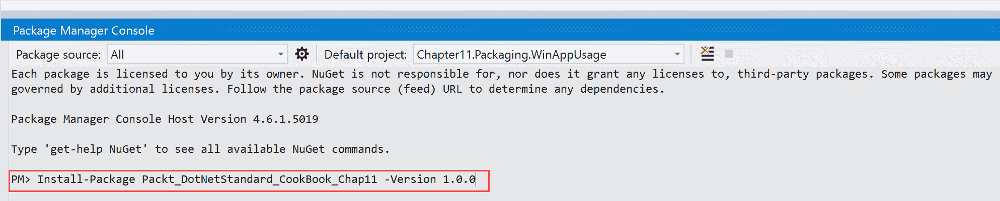

此方法将执行相同操作并将您的包安装到项目中。
