# 第二章 实现延续

在本章中，我们将涵盖：

+   继续任务

+   将任务结果传递给延续

+   继续使用 "WhenAny" 和 "WhenAll"

+   指定延续何时运行

+   使用延续进行异常处理

+   取消延续

+   使用延续来链接多个任务

+   使用延续来更新 UI

# 简介

当你编写一个具有任务且并行执行的应用程序时，通常会有一些并行任务依赖于其他任务的结果。这些任务应该在被称为前驱的早期任务完成之后才开始。

事实上，为了编写真正可扩展的软件，你不应该有阻塞的线程。当任务尚未完成运行时调用`Wait`或查询`Task.Result`，将导致你的线程阻塞。幸运的是，有一种更好的方法。

在**Task Parallel Library**（**TPL**）引入之前，这种相互依赖的线程执行是通过回调完成的，其中调用一个方法，其中一个参数是在任务完成时执行的委托。这提供了一种可行的解决方案来处理依赖性问题，但在实际应用中很快变得非常复杂。这尤其适用于，例如，你需要运行在几个其他任务完成之后的任务。

使用 TPL，存在一种更简单的解决方案，即延续任务。这些任务与前驱任务相关联，并在早期任务完成后自动启动。

延续之所以如此强大，是因为你可以创建在任务或一组任务完成时抛出异常或被取消时运行的延续。正如你将在本章中看到的，延续甚至可以提供一种将异步方法的结果与在另一个线程上运行的用户界面同步的手段。

我们将以一个基本的、简单的延续开始本章，该延续在单个任务完成时运行。从那里，我们将探讨使用延续来控制任务集合，使用延续来处理异常，以及使用延续将多个任务链接在一起。我们将通过创建一个**Windows Presentation Foundation**（**WPF**）应用程序来结束本章，使用延续将任务中创建的数据回传到用户界面。

# 继续任务

在其最简单的形式中，延续是在目标任务（称为前驱）完成后异步运行的操作。

在本章的第一个菜谱中，我们将构建一个基本的延续。我们将通过使用`Task.ContinueWith(Action<Task>)`方法来完成这个任务。

## 如何实现...

让我们去 Visual Studio 创建一个控制台应用程序，在单词计数任务完成后运行任务延续。创建控制台应用程序的步骤如下：

1.  使用**C# Console Application**项目模板启动一个新项目，并将`Continuation1`分配为**解决方案名称**。

1.  将以下`using`指令添加到程序类的顶部：

    ```cs
    using System;
    using System.Linq;
    using System.Net;
    using System.Threading;
    using System.Threading.Tasks;
    ```

1.  现在，让我们添加一个 try/catch 块和一些基本的异常处理。在这个时候，程序类的`Main`方法应该看起来如下代码片段所示：

    ```cs
    static void Main()
    {
      try
      {
      // The Task and Continuation will go here
      }
      catch (AggregateException aEx)
      {
        foreach (Exception ex in aEx.InnerExceptions)
        {
          Console.WriteLine("An exception has occured: {0}" + ex.Message);
        }
      }
    }
    ```

1.  在`try`块内部，创建一个`WebClient`对象，并设置用户代理头，如下代码片段所示：

    ```cs
    var client = new WebClient();
    const string headerText = "Mozilla/5.0 (compatible; MSIE 10.0; Windows NT 6.1; Trident/6.0)";
    client.Headers.Add("user-agent", headerText);

    ```

1.  接下来，在`try`块的主体中，让我们创建一个匿名`Task`（没有名称），然后在`Task`关闭括号后立即跟一个`.ContinueWith()`。在这个配方中，前驱`Task`不返回任何结果。

    ```cs
    Task.Factory.StartNew(() =>
    {
    }).ContinueWith(obj =>
    {
    }).Wait();
    ```

1.  最后，我们需要创建`Task`和后续任务的主体。`Task`将执行我们熟悉的单词计数。后续任务将在前驱任务完成后用于清理对`WebClient`对象的引用。在后续任务之后，提示用户退出。

    ```cs
    Task.Factory.StartNew(() =>
      {
        Console.WriteLine("Antecedent running.");
        char[] delimiters = { ' ', ',', '.', ';', ':', '-', '_', '/', '\u000A' };                        
        var words = client.DownloadString(@"http://www.gutenberg.org/files/2009/2009.txt");
        var wordArray = words.Split(delimiters, StringSplitOptions.RemoveEmptyEntries);
        Console.WriteLine("Word count for Origin of Species: {0}", wordArray.Count());
      }
    ).ContinueWith(antecedent =>
      {
        Console.WriteLine("Continuation running");
        client.Dispose();
      }).Wait();
    ```

1.  在 Visual Studio 2012 中，按*F5*运行项目。你应该会看到类似于以下截图的输出：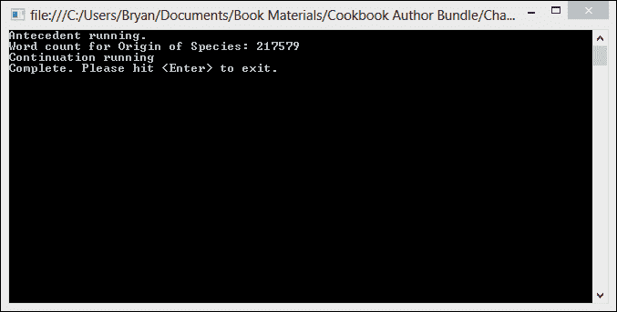

## 如何工作…

对于这个基本的后续任务，没有太多要解释的，但有几个小点需要注意。

对于这个配方，我们创建了一个匿名`Task`，并在任务关闭括号后立即调用`ContinueWith`，如下所示：

```cs
Task.Factory.StartNew(() =>
{
}).ContinueWith(obj =>
{
}).Wait();
```

我们也可以创建一个命名任务，并在单独的语句中调用`ContinueWith`，如下所示：

```cs
Task task1 = Task.Factory.StartNew(() =>
{
});
task1.ContinueWith(obj =>
{
}).Wait();
```

此外，请注意，我们可以使用`Wait()`方法等待后续任务；同样，我们也可以等待`Task`（然而，在实际操作中通常不会这样做。这会导致线程阻塞等待后续任务完成。一般来说，你想要避免使你的线程阻塞）。事实上，任务和后续任务并没有太大的区别，并且具有许多相同的实例方法和属性。

# 将任务结果传递给后续任务

在这个配方中，我们将看到如何将前驱`Task`返回的结果传递给一个后续任务。

我们的前驱`Task`将读取书籍的内容作为字符串，并向用户显示单词计数。在前驱任务完成后运行的后续任务将获取前驱返回的字符串数组，并执行 LINQ 查询，以找到使用频率最高的五个单词。

## 如何做…

让我们启动 Visual Studio，并构建一个控制台应用程序，展示如何从前驱传递结果到后续任务。步骤如下：

1.  使用**C#控制台应用程序**项目模板启动一个新项目，并将`Continuation2`作为**解决方案名称**。

1.  将以下`using`指令添加到程序类的顶部：

    ```cs
    using System;
    using System.Collections.Generic;
    using System.Linq;
    using System.Net;
    using System.Threading.Tasks;
    ```

1.  首先，让我们在班级中放入一些基本的东西。我们需要一个分隔符字符数组，以便我们可以正确地解析单词。此外，我们还需要一个 try/catch 块和一些基本的异常处理。在这个时候，程序类的`Main`方法应该看起来如下所示：

    ```cs
    static void Main()
    {
        char[] delimiters = { ' ', ',', '.', ';', ':', '-', '_', '/', '\u000A' };
        try
        {
        // The Task and Continuation will go here
        }
        catch (AggregateException aEx)
        {
          foreach (Exception ex in aEx.InnerExceptions)
          {
            Console.WriteLine("An exception has occured: {0}" + ex.Message);
          }
        }
    }
    ```

1.  现在，让我们创建一个名为 `task1` 的任务，该任务返回一个字符串数组作为其结果。`task1` 的目的是创建 `System.Net.WebClient`，它将读取书籍的文本作为字符串。一旦字符串被解析并放入字符串数组中，我们将使用数组的 `Count` 方法向用户显示单词计数，然后将数组作为任务的结果返回，以便在延续中使用。在 `try` 块内创建任务。`try` 块的主体现在应该类似于以下代码：

    ```cs
    try
    {
        Task<string[]> task1 = Task.Factory.StartNew(() =>
        {
          var client = new WebClient();
          const string headerText = "Mozilla/5.0 (compatible; MSIE 10.0; Windows NT 6.1; Trident/6.0)";
          client.Headers.Add("user-agent",headerText);
          var words = client.DownloadString(@"http://www.gutenberg.org/files/2009/2009.txt");
          string[] wordArray = words.Split(delimiters, StringSplitOptions.RemoveEmptyEntries);
          Console.WriteLine("Word count for Origin of Species: {0}", wordArray.Count());
          Console.WriteLine();
          return wordArray;
        }
    }
    ```

1.  接下来，我们将使用 `Task.ContinueWith()` 方法创建我们的延续。我们的延续将有一个 `Task<string[]> state` 参数。延续的主体将对字符串数组执行 Linq 查询，按单词在数组中出现的次数对包含的所有单词进行排序。然后我们将执行另一个 Linq 操作，取出使用频率最高的前五个单词并将它们写入控制台。最后，我们希望使用 `Wait()` 方法等待延续完成。在先验任务主体之后创建任务延续。

    ```cs
    task1.ContinueWith(antecedent =>
    {
      var wordsByUsage = antecedent.Result.Where(word => word.Length > 5)
      .GroupBy(word => word)
      .OrderByDescending(grouping => grouping.Count())
      .Select(grouping => grouping.Key);
      var commonWords = (wordsByUsage.Take(5)).ToArray();
      Console.WriteLine("The 5 most commonly used words in Origin of Species:");
      Console.WriteLine("----------------------------------------------------");
      foreach (var word in commonWords)
      {
        Console.WriteLine(word);
      }
    }).Wait();
    ```

1.  好的，本食谱的最后一步是让用户知道我们的应用程序已完成，并提示他们退出。将此代码放在延续之后。它应该是 `try` 块中的最后一行。

    ```cs
    Console.WriteLine();
    Console.WriteLine("Complete. Please hit <Enter> to exit.");
    Console.ReadLine();
    ```

1.  在 Visual Studio 2012 中，按 *F5* 运行项目。你应该会看到类似于以下截图的输出：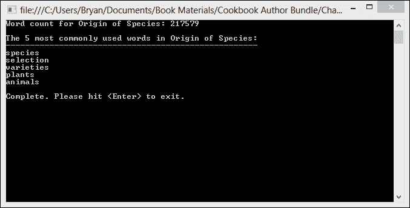

## 它是如何工作的…

在本食谱中，我们使用现有任务实例的 `ContinueWith` 方法创建了延续，就像我们在上一个食谱中所做的那样。然而，在本食谱中，我们使用 Lambda 表达式传入一个代表先验 `Task` 的 `Task<string[]>` 参数。

```cs
Task<string[]> task1 = Task.Factory.StartNew(() =>
{
  //Task Action
}); 
task1.ContinueWith(antecedent =>
{
  //Continuation Action
});
```

注意，延续使用 `Task.Result` 属性访问先验的结果。如果这看起来很熟悉，那应该如此。你几乎以相同的方式在延续中访问任务的结果，就像你会在任何代码片段中访问 `Result` 属性一样。并行扩展团队已经使所有并行操作的编码体验非常一致。

```cs
task1.ContinueWith(antecedent =>
{
  var wordsByUsage = antecedent.Result.Where(word => word.Length > 5)
  .GroupBy(word => word)
  .OrderByDescending(grouping => grouping.Count())
  .Select(grouping => grouping.Key);
  var commonWords = (wordsByUsage.Take(5)).ToArray();
  Console.WriteLine("The 5 most commonly used words in Origin of Species:");
  Console.WriteLine("----------------------------------------------------");
  foreach (var word in commonWords)
  {
    Console.WriteLine(word);
  }
});
```

最后，我们在提示用户退出之前等待延续完成。

# 继续使用 "WhenAny" 和 "WhenAll"

在本食谱中，我们将从延续单个任务转移到为任务组设置延续。我们将查看的两个方法是 `WhenAny` 和 `WhenAll`。这两个方法都是 `Task.Factory` 类的静态成员，并接受一个任务数组和 `Action<Task>` 作为它们的参数。

首先，我们将查看`WhenAny`延续。基本思想是，我们有一组任务，我们只想在组中的第一个和最快的任务完成其工作之前继续。在我们的情况下，我们将下载三本不同书籍的文本，并对每本书进行单词计数。当第一个任务完成时，我们将向用户显示获胜者的单词计数。

之后，我们将更改为`WhenAll`并向用户显示所有三个单词计数的结果。

## 如何做到这一点…

让我们构建一个解决方案，展示如何有条件地继续一个任务。步骤如下：

1.  使用**C#控制台应用程序**项目模板开始一个新的项目，并将`Continuation3`分配为**解决方案名称**。

1.  将以下`using`指令添加到你的程序类顶部：

    ```cs
    using System;
    using System.Collections.Generic;
    using System.Linq;
    using System.Net;
    using System.Threading.Tasks;
    ```

1.  首先，在你的程序类中的`Main`方法中，让我们创建一个字符数组，用于分割我们的单词，一个字符串常量用于我们的网络客户端的用户代理头部，以及一个`Dictionary<string, string>`方法来存储我们的书名和 URL。这个字典将作为任务的状态对象参数，这些任务将在`foreach`循环中创建。

    ```cs
    char[] delimiters = { ' ', ',', '.', ';', ':', '-', '_', '/', '\u000A' };
    const string headerText = "Mozilla/5.0 (compatible; MSIE 10.0; Windows NT 6.1; Trident/6.0)";
    var dictionary = new Dictionary<string, string>
    {
      {"Origin of Species", "http://www.gutenberg.org/files/2009/2009.txt"},
        {"Beowulf", "http://www.gutenberg.org/files/16328/16328-8.txt"},
        {"Ulysses", "http://www.gutenberg.org/files/4300/4300.txt"}
    };
    ```

1.  接下来，让我们创建一个带有一些基本错误处理的 try/catch 块。

    ```cs
    try
    {
      // Loop to create and Continuation will go here
    }
    catch (AggregateException aEx)
    {
      foreach (Exception ex in aEx.InnerExceptions)
      {
        Console.WriteLine("An exception has occured: {0}" + ex.Message);
      }
    }
    ```

1.  在`try`块内部，让我们创建一个新的`Task<KeyValuePair<string, string>>`列表。当然，这将是我们任务列表。每个任务将从一个我们在步骤 3 中创建的字典中获取一个`KeyValuePair`作为它们的状态参数。

    ```cs
    var tasks = new List<Task<KeyValuePair<string, int>>>();
    ```

1.  现在，让我们在`foreach`循环中创建我们的任务。每个任务将从一个字符串中读取一本书的文本，将字符串分割成一个字符数组，并执行单词计数。我们的前驱任务将返回一个`KeyValuePair<string, int>`，包含每本书的标题和单词计数。

    ```cs
    foreach (var pair in dictionary)
    {
      tasks.Add(Task.Factory.StartNew(stateObj =>
      {
        var taskData = (KeyValuePair<string, string>)stateObj;
        Console.WriteLine("Starting task for {0}", taskData.Key);
        var client = new WebClient();
        client.Headers.Add("user-agent", headerText);
        var words = client.DownloadString(taskData.Value);
        var wordArray = words.Split(delimiters, StringSplitOptions.RemoveEmptyEntries);
        return new KeyValuePair<string, int>(taskData.Key, wordArray.Count());
      }, pair));
    }
    ```

1.  现在，让我们通过调用`Task.Factory.WhenAny`方法来创建延续。延续将只向用户显示获胜者的标题和单词计数。

    ```cs
    Task.Factory.ContinueWhenAny(tasks.ToArray(), antecedent =>
    {
        Console.WriteLine("And the winner is: {0}", antecedent.Result.Key);
        Console.WriteLine("Word count: {0}", antecedent.Result.Value);
    }).Wait();
    ```

1.  最后，在`catch`块之后，提示用户退出并等待输入。

    ```cs
    Console.WriteLine("Complete. Press <Enter> to exit.");
    Console.ReadLine();
    ```

1.  在 Visual Studio 2012 中，按*F5*运行项目。你应该会看到类似以下输出的结果。你的获胜者可能会有所不同。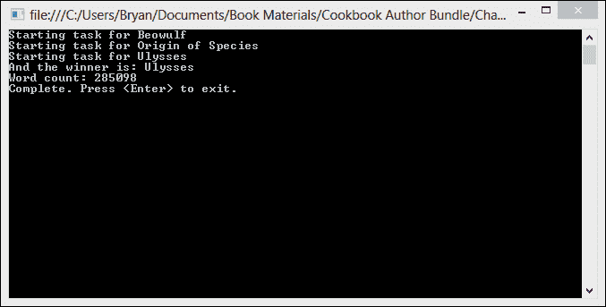

1.  在继续之前，让我们稍微修改一下我们的代码，并在所有任务完成时继续。我们只需要将我们的方法调用从`Task.Factory.WhenAny`更改为`Task.Factory.WhenAll`，将延续参数的名称从`antecedent`更改为`antecedents`以反映复数，并在延续的主体中创建一个`foreach`循环来遍历结果。

    ```cs
    Task.Factory.ContinueWhenAll(tasks.ToArray(), antecedents =>
    {
        foreach (var antecedent in antecedents)
        {
            Console.WriteLine("Book Title: {0}", antecedent.Result.Key);
            Console.WriteLine("Word count: {0}", antecedent.Result.Value);
        }
    }).Wait();
    ```

1.  在 Visual Studio 2012 中，按*F5*运行项目。你应该会看到类似以下屏幕截图的输出：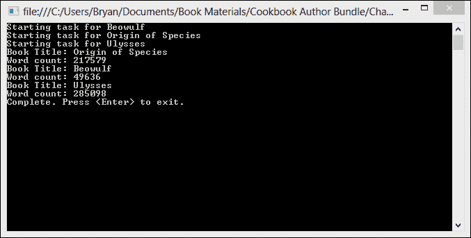

## 它是如何工作的…

在这个菜谱中创建的延续与我们在先前任务中创建的延续略有不同。我们不是在`Task`变量上调用实例方法`ContinueWith`，而是在`Task.FactoryClass`上调用`ContinueWhenAny`和`ContinueWhenAll`静态方法。

```cs
Task.Factory.ContinueWhenAll(tasks.ToArray(), antecedents =>
{
});
```

`ContinueWhenAny`和`ContinueWhenAll`方法与`Task.ContinueWith`的参数列表不同。

`ContinueWhenAny`将其第一个参数作为`Task`数组，第二个参数作为单个`Action<Task>`委托。

```cs
ContinueWhenAny(Task[], Action<Task>)
```

`ContinueWhenAll`将其第一个参数作为与`Task`相同的数组，第二个参数作为`Action<Task[]>`。

```cs
ContinueWhenAll(Task[], Action<Task[]>)
```

# 指定延续何时运行

任务延续功能最强大的特性之一是能够为任务创建多个延续，并使用`Task.TaskContinuationOptions`枚举指定每个延续将在何种确切条件下被调用。

当你为任务创建延续时，你可以使用`Task.ContinueWith`重载，它接受`TaskContinuationOptions`枚举来指定延续只有在先导`Task`完成、取消或出现故障时才会运行。枚举还有指定延续不应运行时的成员。

在这个菜谱中，我们将查看两个简单的任务，每个任务都有两个延续。每个任务的其中一个延续将在任务完成时运行，另一个将在任务取消时运行。

## 如何操作...

现在，让我们创建一个条件性地继续任务的控制台应用程序。创建控制台应用程序的步骤如下：

1.  使用**C#控制台应用程序**项目模板启动一个新项目，并将`Continuation4`作为**解决方案名称**。

1.  将以下`using`指令添加到程序类顶部：

    ```cs
    using System;
    using System.Threading;
    using System.Threading.Tasks;
    ```

1.  在`Main`方法顶部，创建两个`CancellationTokenSource`对象，并从每个对象中获取一个`CancellationToken`。

    ```cs
    var tokenSource1 = new CancellationTokenSource();
    var token1 = tokenSource1.Token;

     var tokenSource2 = new CancellationTokenSource();
     var token2 = tokenSource2.Token;
    ```

1.  接下来，让我们创建一个带有基本错误处理的 try/catch 块。

    ```cs
    try
    {
        // Tasks and Continuations will go here
    }
    catch (AggregateException aEx)
    {
        foreach (Exception ex in aEx.InnerExceptions)
        {
          Console.WriteLine("An exception has occured: {0}" + ex.Message);
        }
    }
    ```

1.  在`try`块内部，让我们创建两个简单的任务。这两个任务只是向控制台写入一条消息。同时，为每个任务创建两个延续，使用`TaskContinuationOptions.OnlyOnRanToCompletion`和`Task ContinuationOption.OnlyOnFaulted`。

    ```cs
    var task1 = Task.Factory.StartNew(() =>
    {
        Console.WriteLine("Task #1 is running.");
        //wait a bit
        Thread.Sleep(2000);
    }, token1);

    task1.ContinueWith(antecedent => Console.WriteLine("Task #1 completion continuation."), TaskContinuationOptions.OnlyOnRanToCompletion);
    task1.ContinueWith(antecedent => Console.WriteLine("Task #1 cancellation continuation."), TaskContinuationOptions.OnlyOnCanceled);

    var task2 = Task.Factory.StartNew(() =>
    {
        Console.WriteLine("Task #2 is running.");
        //wait a bit
        Thread.Sleep(2000);
    }, token2);

    task2.ContinueWith(antecedent => Console.WriteLine("Task #2 completion continuation."), TaskContinuationOptions.OnlyOnRanToCompletion);
    task2.ContinueWith(antecedent => Console.WriteLine("Task #2 cancellation continuation."), TaskContinuationOptions.OnlyOnCanceled);
    ```

1.  最后，在`catch`块之后，让我们取消令牌，并在退出之前等待用户输入。

    ```cs
    tokenSource2.Cancel();
    Console.ReadLine();
    ```

1.  在 Visual Studio 2012 中，按*F5*运行项目。你应该会看到类似于以下截图的输出：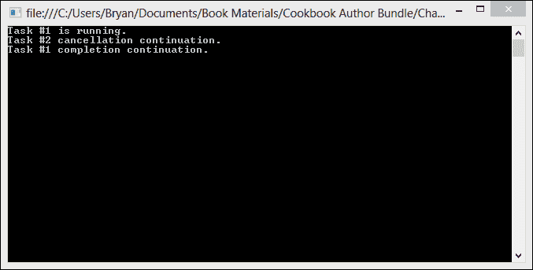

## 它是如何工作的...

在这个非常简单的例子中，我们首先创建了两个`CancellationTokenSource`对象，并从每个对象中获取一个取消令牌源。如果我们创建了一个`CancellationTokenSource`对象并将令牌传递给两个任务，那么当我们取消令牌时，两个任务都会被取消。在我们的情况下，我们只想取消两个任务中的其中一个。

任务本身非常简单。它们只是等待一段时间，给我们一些时间取消令牌并在控制台显示一条消息。我们像以下代码片段所示，将一个 `CancellationToken` 传递给每个任务：

```cs
var task1 = Task.Factory.StartNew(() =>
{
    Console.WriteLine("Task #1 is running.");
    //wait a bit
    Thread.Sleep(2000);
}, token1);

var task2 = Task.Factory.StartNew(() =>
{
    Console.WriteLine("Task #2 is running.");
    //wait a bit
    Task2.Delay(2000);
}, token2);
```

这两个后续操作只是向控制台显示一条消息，并且都是使用 `Task.TaskContinuationOptions` 枚举的一个成员创建的。第一个后续操作在任务运行完成时触发，第二个后续操作在任务被取消时触发。

```cs
task1.ContinueWith(antecedent => Console.WriteLine("Task #1 completion continuation."),         TaskContinuationOptions.OnlyOnRanToCompletion);

task1.ContinueWith(antecedent => Console.WriteLine("Task #1 cancellation continuation."), TaskContinuationOptions.OnlyOnCanceled);
```

我们取消了 `task2` 的令牌，但没有取消 `task1` 的令牌，并且每个对应的后续操作都会执行，我们可以在控制台上看到写入的消息。

## 还有更多...

`TaskContinuationOptions` 枚举有几个成员，用于控制在什么条件下触发后续操作。以下表格包含这些成员的列表。请注意，这并不是后续选项的完整列表。完整的后续选项列表可以在 [`msdn.microsoft.com/en-us/library/system.threading.tasks.taskcontinuationoptions.aspx`](http://msdn.microsoft.com/en-us/library/system.threading.tasks.taskcontinuationoptions.aspx) 找到。`OnlyOnFaulted` 成员将在本章后面的配方中单独介绍。

| `NotOnRanToCompletion` | 如果任务运行完成，则不应安排后续操作。 |
| --- | --- |
| `NotOnFaulted` | 如果任务出现故障，则不应安排后续操作。 |
| `NotOnCancelled` | 如果任务被取消，则不应触发后续操作。 |
| `OnlyOnRanToCompletion` | 如果任务运行完成，则应安排后续操作。 |
| `OnlyOnFaulted` | 如果任务出现故障，则应安排后续操作。 |
| `OnlyOnCancelled` | 如果任务被取消，则应触发后续操作。 |

`TaskContinuationOptions` 枚举可以被视为一个位字段，并且可以在其成员上执行位运算。

# 使用后续操作进行异常处理

在 *使用 try/catch 处理任务异常* 的配方中，在 第一章，*使用任务并行库入门* 我们探讨了如何处理任务中的异常。除了该配方中使用的技巧外，您还可以使用后续操作来处理任务异常。通过使用后续操作，我们可以以更干净、更不内联的方式处理错误。异常处理后续操作允许在需要提供日志或其他异常相关代码的情况下集中处理异常处理逻辑。

基本概念是使用 `Task.TaskContinuationOptions` 枚举，这样我们就可以创建一个在任务运行完成时安排的后续操作，以及一个在任务被置于错误状态时安排的后续操作。

## 准备就绪

对于这个菜谱，我们需要关闭**Visual Studio 2012 异常助手**。异常助手会在抛出运行时异常时出现，并在它到达我们的处理器之前拦截异常。

1.  要关闭异常助手，请转到**调试**菜单并选择**异常**。

1.  取消选中**公共语言运行时异常**旁边的**用户未处理**复选框。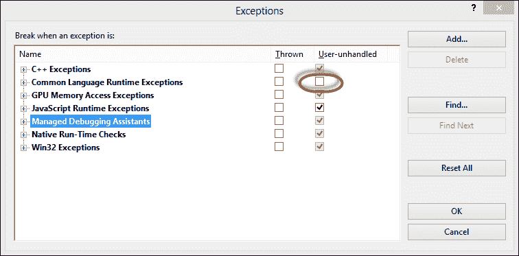

## 如何实现...

现在，让我们去 Visual Studio 看看如何使用延续进行异常处理。步骤如下：

1.  使用**C#控制台应用程序**项目模板启动一个新项目，并将`Continuation5`作为**解决方案名称**。

1.  在程序类顶部添加以下`using`指令：

    ```cs
    using System;
    using System.Threading;
    using System.Threading.Tasks;
    ```

1.  在程序类的`Main`方法中创建一个`Task`。任务不需要接受状态参数或返回任何内容。在`Task`的主体中创建 try/finally 块。为了有一个可释放的资源，在`try`块中创建一个新的 WebClient，然后抛出异常。在`finally`块中调用 WebClient 的 dispose 方法。除此之外，具体的细节并不重要。

    ```cs
    Task task1 = Task.Factory.StartNew(() =>
    {
        Console.WriteLine("Starting the task.");
        var client = new WebClient();
        const string headerText = "Mozilla/5.0 (compatible; MSIE 10.0; Windows NT 6.1; Trident/6.0)";
        client.Headers.Add("user-agent", headerText);
        try
        {
            var book = client.DownloadString(@"http://www.gutenberg.org/files/2009/2009.txt");
            var ex = new WebException("Unable to download book contents");
            throw ex;
        }
        finally
        {
            client.Dispose();
            Console.WriteLine("WebClient disposed.");
        }
    });
    ```

1.  紧接着`Task`之后，使用`TaskContinuationOptions.OnlyOnRanToCompletion`创建一个简单的延续，以便在任务成功完成时运行。这个延续只需要将一条消息写入控制台。

    ```cs
    task1.ContinueWith(antecedent=> 
    {
        Console.WriteLine("The task ran to   completion."),
    }, TaskContinuationOptions.OnlyOnRanToCompletion);
    ```

1.  接下来使用`TaskContinuationOptions.OnlyOnFaulted`创建一个延续，只有当`task1`抛出故障时才会运行。在延续之后，添加`Console.Readline`以等待用户输入后再退出。

    ```cs
    task1.ContinueWith(antecedent =>
    {
        Console.WriteLine("The task faulted.");
        var aEx = antecedent.Exception;
        if (aEx != null)
        foreach (var ex in aEx.InnerExceptions)
        {
            Console.WriteLine("Handled Exception: {0}",ex.Message);
        }
    }, TaskContinuationOptions.OnlyOnFaulted);
    Console.ReadLine();
    ```

1.  在 Visual Studio 2012 中，按*F5*运行项目。你应该会看到类似于以下截图的输出：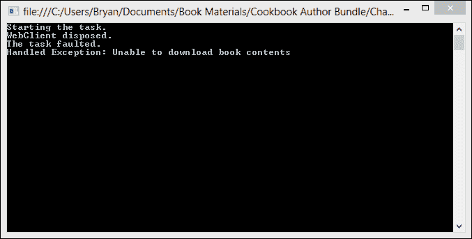

## 它是如何工作的...

创建一个在`Task`处于故障状态时运行的延续，与在延续上设置`TaskContinuationOptions`中的任何其他枚举的工作方式相同。

为了正确清理`Task`使用的资源，我们在任务中创建了`try/finally`块，并在`finally`块中释放了 WebClient。

```cs
finally
{
    client.Dispose();
    Console.WriteLine("WebClient disposed.");
}
```

我们对异常处理的延续进行检查，在遍历`InnerExceptions`集合并将结果写入控制台之前，查看`AggregateException`是否为 null。null 检查并不是严格必要的，因为延续被安排之前，前置任务需要处于故障状态，但无论如何，这是一种良好的防御性编程实践：

```cs
task1.ContinueWith(antecedent =>
{
    Console.WriteLine("The task faulted.");
    var aEx = antecedent.Exception;
    if (aEx != null)
        foreach (var ex in aEx.InnerExceptions)
        {
            Console.WriteLine("Handled Exception: {0}",ex.Message);
        }
}, TaskContinuationOptions.OnlyOnFaulted);
Console.ReadLine();
```

# 取消延续

取消延续遵循与取消`Task`相同的基本规则。如果`Task`及其延续是同一操作的两个部分，则可以将相同的取消令牌传递给`Task`和延续。

在这个菜谱中，我们将有一个简单的`Task`，它创建一个数字列表，并有一个后续操作对数字进行平方并返回结果。运行几秒钟后，我们将使用令牌来取消`Task`和后续操作。

## 准备就绪

由于取消`Task`或后续操作会引发`OperationCanceledException`，我们需要关闭 Visual Studio 2012 异常助手。异常助手会在运行时异常抛出时出现，并在它到达我们的处理器之前拦截异常。

1.  要关闭异常助手，请转到**调试**菜单并选择**异常**。

1.  取消勾选**用户未处理的**复选框旁边的**公共语言运行时异常**。

## 如何做到这一点...

现在，让我们构建一个控制台应用程序，以便我们可以看到如何取消后续操作。步骤如下：

1.  使用**C#控制台应用程序**项目模板创建一个新的项目，并将`Continuation6`作为**解决方案名称**。

1.  将以下`using`指令添加到程序类的顶部。

    ```cs
    using System;
    using System.Collections.Generic;
    using System.Threading;
    using System.Threading.Tasks;
    ```

1.  在程序类的`Main`方法中，我们首先创建我们的`CancellationTokenSource`并获取一个令牌。我们将这个令牌传递给前驱`Task`和后续操作。

    ```cs
    var tokenSource = new CancellationTokenSource();
    var token = tokenSource.Token;
    ```

1.  接下来，让我们在`Main`方法中添加 try/catch/finally 块，就在之前的行下面。在`catch`块中添加一些基本的错误处理，并在`finally`块中处理`CancellationTokenSource`。

    ```cs
    try
    {
    //Task and Continuation go here
    }
    catch (AggregateException aEx)
    {
        foreach (var ex in aEx.InnerExceptions)
        {
            Console.WriteLine("An exception has occured: " + ex.Message);
        }
    }
    finally
    {
        tokenSource.Dispose();
    }
    ```

1.  在`try`块内部，创建一个接受对象状态参数的任务。该参数将确定我们的数字列表的大小。我们将它转换为`Int32`并创建一个`for`循环来向我们的列表中添加数字。同时，将步骤 1 中创建的令牌传递给任务构造函数。

    ```cs
    var task1 = Task.Factory.StartNew(state =>
    {
        Console.WriteLine("Task has started.");
        var result = new List<Int32>();
        for (var i = 0; i < (Int32) state; i++)
        {
            token.ThrowIfCancellationRequested();
            result.Add(i);
            Thread.Sleep(100); //sleep to simulate some work
        }
        return result;
    }, 5000,token);
    ```

1.  在`Task`之后，让我们创建我们的后续操作。后续操作将接收前驱`Task`的结果，遍历列表，并对数字进行平方。将相同的`CancellationToken`传递给后续操作的构造函数。

    ```cs
    task1.ContinueWith(antecedent =>
    {
        Console.WriteLine("Continuation has started.");
        var antecedentResult = antecedent.Result;
        var squares = new List<int>();
        foreach (var value in antecedentResult)
        {
            token.ThrowIfCancellationRequested();
            squares.Add(value*value);
            Thread.Sleep(100);//sleep to simulate some more work
        }
        return squares;
    },token);
    ```

1.  在`try`块的末尾，我们需要让线程休眠一段时间，以便`Task`和后续操作有足够的时间运行，然后我们将取消令牌。最后，我们将调用`task1`的`Wait`方法。

    ```cs
    Thread.Sleep(2000); //wait for 2 seconds
    tokenSource.Cancel();
    task1.Wait();
    ```

1.  最后，在`finally`块结束后，向控制台发送一条消息，表示我们已经完成，并等待用户输入。

    ```cs
    Console.WriteLine("Complete. Press enter to exit.");
    Console.ReadLine();
    ```

1.  在 Visual Studio 2012 中，按*F5*运行项目。你应该会看到类似于以下截图的输出：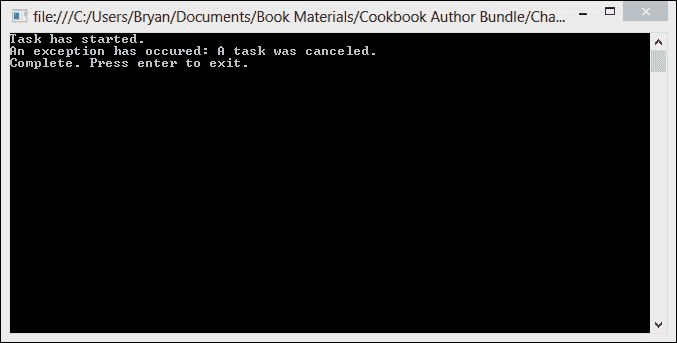

## 它是如何工作的...

当前驱任务在响应取消请求时抛出`OperationCancelledException`，只要后续操作使用相同的`CancellationToken`，取消请求将被视为合作取消的确认，前驱任务和后续操作都将进入已取消状态。

这相当简单。我们只需要从一个 `CancellationTokenSource` 获取一个 `CancellationToken`，并将令牌传递给前驱 `Task` 和连续操作的构造函数。

```cs
var tokenSource = new CancellationTokenSource();
var token = tokenSource.Token;

var task1 = Task.Factory.StartNew(state =>
{
    // Task body
}, 5000,token);

task1.ContinueWith(antecedent =>
{
    //Continuation body
},token);
```

在我们的 `Task` 和连续操作体内的循环中，我们需要轮询取消操作，并在令牌被取消时抛出 `OperationCancelledException`。这可以通过 `CancellationToken` 对象的 `ThrowIfCancellationRequested` 方法在一行代码中完成。

```cs
foreach (var value in antecedentResult)
{
    token.ThrowIfCancellationRequested();
    squares.Add(value*value);
    Thread.Sleep(100);//sleep to simulate some more work
}
```

最后，我们只需确保我们在 `catch` 块中处理 `AggregateExceptions`。

# 使用连续操作链式连接多个任务

连续的一个特点是你可以连续使用连续操作，以便将任务链在一起，长度不受限制。可以通过一系列任务和连续操作来实现管道模式。你可以将管道想象成工厂中的流水线。在管道的前端，一个生产任务生成要操作的数据，而每个链式消费者阶段都会对生成的数据进行操作或更改。

在这个菜谱中，我们将回到我们的单词计数示例，使用 `TaskContinuationOptions.OnlyOnRanToCompletion` 创建一个简单的三阶段管道。

## 如何操作…

打开 Visual Studio，让我们看看如何将任务链在一起形成一个管道。步骤如下：

1.  使用 **C# 控制台应用程序** 项目模板创建一个新的项目，并将 `Continuation7` 作为 **解决方案名称**。

1.  将以下 `using` 指令添加到程序类的顶部：

    ```cs
    using System;
    using System.Linq;
    using System.Net;
    using System.Threading.Tasks;
    ```

1.  让我们从在程序类的 `Main` 方法中添加 try/catch 块开始这个应用程序。在 `catch` 块中添加对任务引发的任何 `AggregateException` 的处理。在 `catch` 块的末尾，向控制台写入一条消息，告诉用户我们已经完成，并等待输入以退出。

    ```cs
    try
    {
    //Task and continuations go here
    }
    catch (AggregateException aEx)
    {
        foreach (var ex in aEx.InnerExceptions)
        {
            Console.WriteLine("An exception has occured: {0}", ex.Message);
        }
    }
    Console.WriteLine();
    Console.WriteLine("Complete. Please hit <Enter> to exit.");
    Console.ReadLine();
    ```

1.  现在，我们需要创建一个 `producer` 任务，该任务读取书籍的文本，并返回一个字符串数组，消费者连续操作将消费这个数组。

    ```cs
    var producer = Task.Factory.StartNew(() =>
    {
        char[] delimiters = { ' ', ',', '.', ';', ':', '-', '_', '/', '\u000A' };
        var client = new WebClient();
        const string headerText = "Mozilla/5.0 (compatible; MSIE 10.0; Windows NT 6.1; Trident/6.0)";
        client.Headers.Add("user-agent", headerText);
        try
        {
            var words = client.DownloadString(@"http://www.gutenberg.org/files/2009/2009.txt");
            var wordArray = words.Split(delimiters, StringSplitOptions.RemoveEmptyEntries);
            Console.WriteLine("Word count for Origin of Species: {0}", wordArray.Count());
            Console.WriteLine();
            return wordArray;
        }
        finally
        {
            client.Dispose();
        }
    });
    ```

1.  第一个消费者将对生产者的结果执行 Linq 查询，以找出最常见的五个单词。

    ```cs
    Task<string[]> consumer1 = producer.ContinueWith(antecedent =>
    {
        var wordsByUsage =antecedent.Result.Where(word => word.Length > 5)
            .GroupBy(word => word)
            .OrderByDescending(grouping => grouping.Count())
            .Select(grouping => grouping.Key);
        var commonWords = (wordsByUsage.Take(5)).ToArray();
        Console.WriteLine("The 5 most commonly used words in Origin of Species:");
        Console.WriteLine("----------------------------------------------------");
        foreach (var word in commonWords)
        {
            Console.WriteLine(word);
        }
        Console.WriteLine();
        return antecedent.Result;
    }, TaskContinuationOptions.OnlyOnRanToCompletion);
    The second consumer will perform another Linq query to find the longest word used.
    Task consumer2 = consumer1.ContinueWith(antecedent =>
    {
        var longestWord = (antecedent.Result.OrderByDescending(w => w.Length)).First();
        Console.WriteLine("The longest word is: {0}", longestWord);
    }, TaskContinuationOptions.OnlyOnRanToCompletion);
    consumer2.Wait();
    ```

1.  在 Visual Studio 2012 中，按 *F5* 键运行项目。你应该会看到类似于以下截图的输出：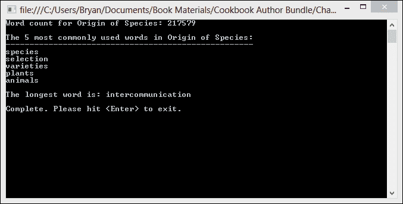

## 它是如何工作的…

在本例中使用的任务和连续操作与我们在其他菜谱中创建的任务几乎相同。主要区别在于我们如何将它们链在一起以及链的长度。我们的前驱任务生成并返回一个字符串数组，然后我们有一个连续操作来找出最常见的五个单词，最后我们继续连续操作来找出最长的单词。

注意，我们还使用了 `TaskContinuationOptions.OnlyOnRanToCompletion`，因为我们只想在先前的任务成功时调度消费者运行。为了成为一个更完整的解决方案，我们还想使用 `TaskContinuationOptions.OnlyOnFaulted` 来设置失败路径的后续操作。

# 使用后续操作更新 UI

在开发多线程 WPF 应用程序时，一个常见的挑战是 UI 控件具有线程亲和性，这意味着它们只能由创建它们的线程进行更新。这通常是应用程序的主线程。

然而，TPL 提供了一种干净的方式来将 TPL 任务的结果传输到正确的线程以更新 UI。它通过 `TaskScheduler.FromCurrentSynchronizationContext` 方法实现，该方法创建一个与当前 `SyncronizationContext` 关联的 `TaskScheduler`。

在这个菜谱中，我们将创建一个 WPF 应用程序，该程序将启动一个任务来获取书籍的单词计数。该任务将有一个后续操作，通过调用 `TaskScheduler.FromCurrentSynchronizationContext` 在正确的同步上下文中创建。后续操作将执行 UI 更新。

## 如何操作…

让我们创建一个 WPF 应用程序，看看我们如何使用 TPL 将数据传输到 UI 线程。

1.  使用 **WPF Application** 项目模板启动一个新项目，并将 `Continuation8` 作为 **Solution name** 分配。

1.  打开 `MainWindow.xaml.cs` 文件，并确保将以下 `using` 指令添加到 `MainWindow` 类的顶部：

    ```cs
    using System;
    using System.Linq;
    using System.Net;
    using System.Threading.Tasks;
    using System.Windows;
    ```

1.  返回到 `MainWindow.xaml` 并将 XAML 替换为以下代码以创建 UI 布局：

    ```cs
    <Window x:Class="Continuation8.MainWindow"
            xmlns="http://schemas.microsoft.com/winfx/2006/xaml/presentation"
            xmlns:x="http://schemas.microsoft.com/winfx/2006/xaml"
            Title="MainWindow" Height="350" Width="525">
        <Grid>
            <Button Content="Get Word Count" 
                HorizontalAlignment="Left" 
                Margin="207,236,0,0" 
                VerticalAlignment="Top" 
                Width="96" 
                Click="Button_Click_1"/>
            <Label x:Name="lblWordCount" 
                Content="" 
                HorizontalAlignment="Left" 
                Margin="121,148,0,0" 
                VerticalAlignment="Top" 
                RenderTransformOrigin="0.094,0.923" 
                Width="278"/>

        </Grid>
    </Window>
    ```

    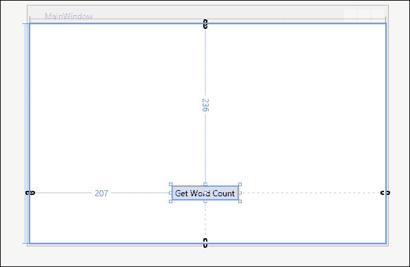

1.  现在从工具箱中添加一个 `Label` 到您的窗口中。将 **Name** 属性更改为 `lblWordCount` 并从 **Content** 属性中删除默认值。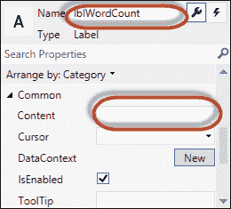

1.  好的，现在双击表单上的 **Get Word Count** 按钮，在 `Button_Click_1` 事件处理程序中打开 `Mai``nWindow.xaml.cs`。这就是我们将创建任务和后续操作的地方。

1.  在 `Button_Click_1` 事件处理程序中，创建一个 `Task`，将书籍的内容读取到字符串数组中。`Task` 将返回一个字符串数组结果，该结果将在后续操作中用于在 UI 中显示单词计数。`Task` 将通过在构造函数中调用 `TaskScheduler.FromCurrentSynchronizationContext` 来继续使用后续操作：

    ```cs
    private void Button_Click_1(object sender, RoutedEventArgs e)
    {
        Task.Factory.StartNew(() =>
        {
            char[] delimiters = {' ', ',', '.', ';', ':', '-', '_', '/', '\u000A'};
            var client = new WebClient();
            const string headerText = "Mozilla/5.0 (compatible; MSIE 10.0; Windows NT 6.1; Trident/6.0)";
            client.Headers.Add("user-agent", headerText);
            try
            {
                var words = client.DownloadString(@"http://www.gutenberg.org/files/2009/2009.txt");
                var wordArray = words.Split(delimiters, StringSplitOptions.RemoveEmptyEntries);
                return wordArray;
            }
            finally
            {
                client.Dispose();
            }
        }).ContinueWith(antecedent =>
        {
            lblWordCount.Content = String.Concat("Origin of Species word count: ",antecedent.Result.Count().ToString());
        }, TaskScheduler.FromCurrentSynchronizationContext());
    }
    ```

1.  在 Visual Studio 2012 中，按 *F5* 运行项目。您的应用程序窗口应类似于以下截图所示：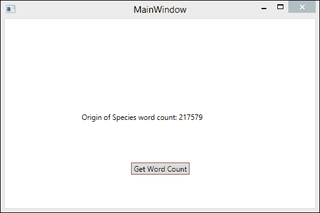

## 它是如何工作的…

任务在 `TaskScheduler` 类的实例上运行。.NET Framework 4.5 包含 `TaskScheduler` 的两个实现。一个是默认调度程序，它与 .NET ThreadPool 集成。另一个是从静态方法 `TaskScheduler.FromCurrentSynchronizationContext` 返回的 `TaskScheduler` 类型。

`SynchronizationContext` 提供了两个方法，`Send` 和 `Post`，两者都接受一个要执行的委托。`Send` 方法会同步调用委托，而 `Post` 方法则会异步调用委托。

UI 控件应由创建它们的线程访问，通常是主 UI 线程。因此，如果后台工作的线程想要更新 UI 中的某些内容，它需要将那些数据回传到 UI 线程，以便控件可以安全访问。在 WPF 中，您会使用目标线程的 `Dispatcher` 和相应的 `Invoke/BeginInvoke` 方法来完成此操作。使用 .NET 4.5 TPL，可以从 `SynchronizationContext` 派生出一个新类型，这样其 `Send` 方法会同步地将委托发送到正确的线程执行，而 `Post` 方法则异步地执行相同操作。

UI 框架如 WPF 会将它们 `SynchronizationContext` 派生类的实例发布到 `SynchronizationContext.Current`。然后，您的代码可以获取 `SynchronizationContext.Current` 并使用它来执行工作。

`TaskScheduler.FromCurrentSynchronizationContext` 创建一个 `TaskScheduler`，它包装了从 `SynchronizationContext.Current` 返回的 `SynchronizationContext`。这样做会为您提供可以在当前 `SynchronizationContext` 上执行 `Tasks` 的 `TaskScheduler`。这意味着您可以通过在正确的调度器上运行来创建能够安全访问 UI 控件的 `Tasks`。

由于我们可以使用派生的 `TaskScheduler` 创建 `Task` 或延续，因此我们可以使用一个将延续在适当上下文中执行的调度器来创建延续。

```cs
Task.Factory.StartNew(() =>
{
}).ContinueWith(antecedent =>
{
}, TaskScheduler.FromCurrentSynchronizationContext());
```
