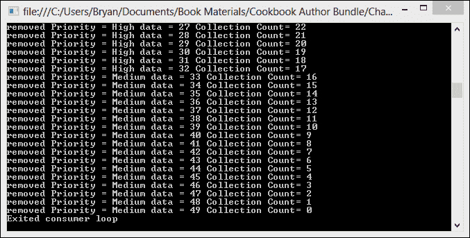

# 第五章。并发集合

在本章中，我们将介绍以下菜谱：

+   向 `BlockingCollection` 添加和删除项目

+   使用 `GetConsumingEnumerable` 迭代 `BlockingCollection`

+   使用 `ConcurrentStack` 执行 LIFO 操作

+   使用 `ConcurrentDictionary` 进行线程安全的数据查找

+   取消并发集合中的操作

+   与多个生产者和消费者一起工作

+   使用 `ConcurrentStack` 创建对象池

+   使用 `IProducerConsumerCollection` 添加阻塞和边界

+   使用多个并发集合创建管道

# 简介

虽然 `System.Collections` 命名空间提供了广泛的集合；但在多线程或并行环境中使用它们的限制是它们不是线程安全的。非线程安全的集合可能导致竞态条件，这是一种当两个或多个线程可以访问共享数据并尝试同时更改它时发生的情况，从而产生意外的错误。

.NET Framework 4.5 中的并发集合允许开发人员创建类型安全和线程安全的集合。这些集合类是并行编程功能的重要组成部分，并在 `System.Collections.Concurrent` 命名空间下可用。

# 向 BlockingCollection 添加和删除项目

`BlockingCollection<T>` 是一个线程安全的集合类，它提供了阻塞和边界功能。边界意味着你可以设置集合的最大容量，这使你能够控制集合在内存中的最大大小。

多个线程可以同时向集合中添加项目，但如果集合达到容量，生产线程将阻塞，直到项目被移除。多个消费者可以同时从集合中移除项目。如果集合变为空，消费将阻塞，直到有更多项目被生产并添加到集合中。

在这个菜谱中，我们将查看向 `BlockingCollection` 添加项目和从 `BlockingCollection` 中删除项目的基本方法。

我们将创建一个 `Console` 应用程序，初始化一系列整数并创建一个并行任务将数字添加到阻塞集合中。另一个并行任务将被创建来从集合中移除项目。

## 如何操作…

让我们启动 Visual Studio，看看如何使用 `BlockingCollection` 添加和删除项目。

1.  使用 **C# 控制台应用程序** 项目模板开始一个新的项目，并将 `BlockingCollection` 作为 **解决方案名称** 指定。

1.  将以下 `using` 指令添加到 `Program` 类的顶部：

    ```cs
    using System;
    using System.Collections.Concurrent;
    using System.Linq;
    using System.Threading;
    using System.Threading.Tasks;
    ```

1.  首先，在 `Program` 类的 `Main` 方法中，让我们创建我们的输入数据范围和阻塞集合。

    ```cs
    var data = Enumerable.Range(0, 100);
    var numbers = new BlockingCollection<int>(100);
    ```

1.  现在，让我们创建一个简单的生产者 `Task`，它将使用 `for` 循环遍历源数据中的数字并将它们添加到阻塞集合中。在循环完成后，使用 `BlockingCollection` 的 `CompleteAdding` 方法来指示我们已完成数据的生产。

    ```cs
    // A simple blocking producer 
    Task.Factory.StartNew( ()=>
    {
        foreach (var item in data)
        {
            numbers.Add(item);
            Console.WriteLine("Adding:{0} Item Count={1}", item, numbers.Count);
        }
        numbers.CompleteAdding();
    });
    ```

1.  接下来，让我们创建一个简单的消费者`Task`，它使用`while`循环从`BlockingCollection`中获取项目并将输出写入`Console`。完成操作后，等待用户输入再退出。

    ```cs
    // A simple blocking consumer.
    Task.Factory.StartNew(() =>
    {
            int item = -1;
            while (!numbers.IsCompleted)
            {
                try
                {
                    item = numbers.Take();
                }
                catch (InvalidOperationException)
                {
                    Console.WriteLine("Nothing to take");
                    break;
                }
                Console.WriteLine("Taking:{0} ", item);
                // wait for a bit
                 Thread.SpinWait(1000);
        }

        Console.WriteLine("\rNo more items to take.");
    });

    Console.ReadLine();
    ```

1.  在 Visual Studio 2012 中，按*F5*键运行项目。你应该会看到以下截图所示的输出：

## 它是如何工作的...

在这个菜谱中，我们看到了如何向`BlockingCollection`中添加项目以及如何从中移除项目。`BlockingCollection`实际上是对`IProducerConsumer<T>`的包装，并为线程安全的集合提供了阻塞和边界能力。`BlockingCollection`在其构造函数中接受`IProducerConsumerCollection`，或默认使用`ConcurrentQueue`。

将源数据添加到集合中非常简单。我们只需遍历源数据并调用`BlockingCollection`的`Add`方法来添加项目。当我们完成向集合添加项目后，我们调用`CompleteAdding`方法。一旦集合被标记为添加完成，将不允许再添加更多项目，并且从集合中移除项目的线程在集合为空时不会等待。

```cs
foreach (var item in data)
{
    numbers.Add(item);
    Console.WriteLine("Adding:{0} Item Count={1}", item, numbers.Count);
}
numbers.CompleteAdding();
```

消费者`Task`使用`BlockingCollection`的`IsCompleted`属性来控制`while`循环。正如你所期望的，`IsCompleted`属性指示`BlockingCollection`是否被标记为添加完成并且为空。在`while`循环内部，我们只需使用`Take`方法从集合中获取一个项目并在控制台上显示它。

```cs
Task.Factory.StartNew(() =>
{
    while (!numbers.IsCompleted)
    {
        try
        {
            item = numbers.Take();
        }
        catch (InvalidOperationException)
        {
            Console.WriteLine("Nothing to take");
            break;
        }
    ...
    }
Console.WriteLine("\rNo more items to take.");
});
```

# 使用 GetConsumingEnumerable 遍历 BlockingCollection

`BlockingCollection`为我们提供了一个更简单的替代方案，用于遍历集合，并在不设置`while`循环和检查`IsCompleted`属性的情况下移除项目。`BlockingCollection`通过`GetConsumingEnumerable`方法为我们提供了执行简单`foreach`循环的能力。

在这个菜谱中，我们将创建一个`Console`应用程序，初始化一系列源数据并启动一个生产者任务将数据添加到集合中。集合数据的消费者将使用`GetConsumingEnumerable`方法来获取集合中项目的`IEnumerable<T>`。

## 如何实现...

让我们看看如何使用`GetConsumingEnumerable`遍历`BlockingCollection`。

1.  使用**C#控制台应用程序**项目模板创建一个新的项目，并将`Enumerate`作为**解决方案名称**。

1.  将以下`using`指令添加到`Program`类的顶部。

    ```cs
    using System;
    using System.Collections.Concurrent;
    using System.Linq;
    using System.Threading;
    using System.Threading.Tasks;
    ```

1.  首先，在`Program`类的`Main`方法中，让我们创建我们的输入数据范围和阻塞集合。

    ```cs
    var data = Enumerable.Range(0, 100);
    var numbers = new BlockingCollection<int>(100);
    ```

1.  接下来，让我们创建一个简单的生产者`Task`，它将使用`for`循环遍历源数据的数字并将它们添加到阻塞集合中。

    ```cs
    // A simple blocking producer 
    Task.Factory.StartNew( ()=>
    {
        foreach (var item in data)
        {
            numbers.Add(item);
            Console.WriteLine("Adding:{0} Item Count={1}", item, numbers.Count);
        }
        numbers.CompleteAdding();
    });
    ```

1.  最后，让我们创建一个消费者`Task`，它将通过调用阻塞集合的`GetConsumingEnumerable`方法使用`foreach`循环遍历集合。完成时，在退出之前等待用户输入。

    ```cs
    Task.Factory.StartNew(() =>
    {
        foreach (var item in numbers.GetConsumingEnumerable())
        {                        
            Console.Write("\nConsuming item: {0}", item);                       
        }                    
    });
    Console.ReadLine();
    ```

1.  在 Visual Studio 2012 中，按*F5*运行项目。你应该会看到以下截图所示的输出：

## 它是如何工作的…

本食谱中的生产者`Task`与第一个食谱中创建的生产者`Task`完全相同。唯一真正需要注意的改变是，我们不再需要设置一个`while`循环从集合中获取项目，就像我们在第一个食谱中所做的那样。

```cs
Task.Factory.StartNew(() =>
{
    while (!numbers.IsCompleted)
    {
        try
        {
            item = numbers.Take();
        }
        catch (InvalidOperationException)
        {
            Console.WriteLine("Nothing to take");
            break;
        }
    ...
    }
Console.WriteLine("\rNo more items to take.");
});
```

通过调用`BlockingCollection`的`GetConsumingEnumerable`方法，我们现在可以使用更干净的`foreach`循环语法。

```cs
Task.Factory.StartNew(() =>
{
    foreach (var item in result.GetConsumingEnumerable())
    {                        
        Console.Write("\nConsuming item: {0}", item);                       
    }                    
});
Console.ReadLine();
```

`GetConsumingEnumerable`方法会捕捉底层集合的当前状态，并返回集合项目的`IEnumerable<T>`。

# 使用 ConcurrentStack 执行 LIFO 操作

`ConcurrentStack`是`Systems.Collections.Generic.Stack`的线程安全版本，后者是.NET Framework 中的标准**后进先出**（**LIFO**）容器。对于倾向于使用堆栈的算法，如深度优先搜索，线程安全的堆栈是一个很大的好处。

在这个食谱中，我们将查看`ConcurrentStack`的基本用法。我们的`Console`应用程序将为这个食谱初始化一系列数据，一个简单的生产者`Task`将把这些数据推入堆栈。消费者`Task`将并发地从堆栈中弹出项目并将它们写入`Console`。

## 如何做…

现在，让我们看看如何使用`ConcurrentStack`执行 LIFO 操作。

1.  使用**C# Console Application**项目模板创建一个新的项目，并将`ConcurrentStack`作为**解决方案名称**。

1.  将以下`using`指令添加到你的`Program`类顶部：

    ```cs
    using System;
    using System.Collections.Concurrent;
    using System.Linq;
    using System.Threading;
    using System.Threading.Tasks;
    ```

1.  首先，在`Program`类的`Main`方法中，让我们创建我们的输入数据范围和我们的阻塞集合。

    ```cs
    var data = Enumerable.Range(0, 100);
    ConcurrentStack<int> stack = new ConcurrentStack<int>();
    ```

1.  接下来，让我们创建一个简单的生产者任务，它将使用一个`for`循环遍历源数据中的数字并将它们弹出堆栈。

    ```cs
    // producer 
    Task.Factory.StartNew(() =>
    {
        foreach (var item in data)
        {
            stack.Push(item);
            Console.WriteLine("Pushing item onto stack:{0} Item Count={1}", 
          item, stack.Count);
        }
    });
    ```

1.  现在，让我们创建一个消费者`Task`，它将使用一个`while`循环从堆栈中弹出项目，直到堆栈的`IsEmpty`属性为假。完成时，在退出之前等待用户输入。

    ```cs
    //consumer
    Task.Factory.StartNew(() =>
    {
        Thread.SpinWait(1000000);
        while (!stack.IsEmpty)
        {
            int result = 0;
            stack.TryPop(out result);
            Console.WriteLine("Popping item from stack:{0} Item Count={1}", 
          result, stack.Count);
        }
    });
    Console.ReadLine();
    ```

1.  在 Visual Studio 2012 中，按*F5*运行项目。你应该会看到以下截图所示的输出：

## 它是如何工作的…

`ConcurrentStack`通过使用`System.Threading.Interlocked`操作实现线程安全访问。Interlocked 操作提供了一种简单的机制，用于同步多个线程共享的变量的访问。Interlocked 操作也非常快速。

在大多数情况下，`ConcurrentStack`的行为类似于`System.Collections.Generic.Stack`。要向堆栈中推入一个项目，你只需使用`Push`方法。

```cs
foreach (var item in data)
{
    stack.Push(item);
    Console.WriteLine("Pushing item onto stack:{0} Item Count={1}", 
    item, stack.Count);
}
```

然而，为了支持`TryPop`，`Pop`方法已被移除。`TryPop`如果存在并弹出项目，则返回`true`，否则返回`false`。如果弹出成功，`out`参数包含被移除的对象，否则是不确定的。

```cs
while (!stack.IsEmpty)
{
    int result = 0;
    stack.TryPop(out result);
    Console.WriteLine("Popping item from stack:{0} Item Count={1}", 
    result, stack.Count);
}
```

# 使用`ConcurrentDictionary`进行线程安全数据查找

`ConcurrentDictionary`是泛型`dictionary`集合的线程安全版本。两者都旨在基于键快速查找数据。然而，`ConcurrentDictionary`允许我们交错读取和更新。`ConcurrentDictionary`通过没有公共锁来提高效率实现其线程安全性。它实际上使用一系列锁来提供并发更新，并且具有无锁读取。

在这个菜谱中，我们将创建`ConcurrentDictionary`并使用一组小的键值对初始化它。我们的`dictionary`将由一个任务并发更新，并由另一个任务读取。

## 如何操作…

让我们看看如何使用`ConcurrentDictionary`进行数据查找。

1.  使用**C# Console Application**项目模板创建一个新的项目，并将`ConcurrentDictionary`分配为**解决方案名称**。

1.  将以下`using`指令添加到`Program`类的顶部：

    ```cs
    using System;
    using System.Collections.Concurrent;
    using System.Collections.Generic;
    using System.Linq;
    using System.Text;
    using System.Threading.Tasks;
    ```

1.  首先，让我们创建我们的`ConcurrentDictionary`并使用一些数据初始化它。

    ```cs
    var dictionary = new ConcurrentDictionary<string, int>();
    dictionary["A"] = 1;
    dictionary["B"] = 2;
    dictionary["C"] = 3;
    dictionary["D"] = 4;
    dictionary["E"] = 5;
    dictionary["F"] = 6;
    dictionary["G"] = 7;
    dictionary["H"] = 8;
    dictionary["I"] = 9;
    dictionary["J"] = 10;
    dictionary["K"] = 11;
    dictionary["L"] = 12;
    dictionary["M"] = 13;
    dictionary["N"] = 14;
    dictionary["O"] = 15;
    ```

1.  现在，让我们创建一个`Task`，在单独的线程上更新`dictionary`。

    ```cs
    // update dictionary on a separate thread
    Task.Factory.StartNew(() =>
    {
        foreach (var pair in dictionary)
        {
            var newValue = pair.Value + 1;
            dictionary.TryUpdate(pair.Key,newValue,pair.Value);
            Console.WriteLine("Updated key: {0} value:{1}", pair.Key, newValue);
        }   
    });
    ```

1.  现在，让我们创建另一个`Task`，它将并发地从`dictionary`中读取。

    ```cs
    Task.Factory.StartNew(() =>
    {
        foreach (var pair in dictionary)
        {
            Console.WriteLine("Reading key: {0} value:{1}",pair.Key,pair.Value);
        }
    });            

    Console.ReadLine();
    ```

1.  在 Visual Studio 2012 中，按*F5*运行项目。你应该会看到以下截图所示的输出：

## 它是如何工作的…

`ConcurrentDictionary`的行为类似于`dictionary`的对应版本，但略有不同。我们使用`TryUpdate`方法更新`dictionary`。此方法被添加以提供原子操作来检查项目是否存在，如果不存在，则在原子锁下添加它。

```cs
foreach (var pair in dictionary)
    {
        var newValue = pair.Value + 1;
        dictionary.TryUpdate(pair.Key,newValue,pair.Value);
        Console.WriteLine("Updated key: {0} value:{1}", pair.Key, newValue);
    }
```

我们直接从集合中每个`KeyValuePair`的`Key`和`Value`属性读取`dictionary`。

# 取消并发集合中的操作

当与`BlockingCollection`一起工作时，大多数`Add`和`Take`操作都是在循环中执行的。`BlockingCollection`的`TryAdd`和`TryTake`方法可以接受一个`CancellationToken`参数，这样我们就可以响应取消请求并退出循环。

在这个菜谱中，我们将创建一个具有生产者`Task`和消费者`Task`的`Console`应用程序。生产者将通过使用`TryAdd`向`BlockingCollection`添加项目，而消费者将使用`Try`移除项目。

在生产者和消费者开始后，我们将在一个令牌源上调用`Cancel`方法，以查看我们如何使用`TryAdd`和`TryTake`重载来处理操作的取消。

## 准备工作…

对于这个示例，我们需要关闭 Visual Studio 2012 的异常助手。异常助手会在抛出运行时 `Exception` 时出现，并在它到达我们的处理器之前拦截 `Exception`。

1.  要关闭异常助手，请转到 **调试** 菜单并选择 **异常**。

1.  取消勾选 **公共语言运行时异常** 旁边的 **用户未处理** 复选框。

## 如何操作...

现在，让我们看看如何取消并发集合操作。

1.  使用 **C# 控制台应用程序** 项目模板启动一个新项目，并将 `CancelOperation` 作为 **解决方案名称**。

1.  将以下 `using` 指令添加到 `Program` 类的顶部：

    ```cs
    using System;
    using System.Collections.Concurrent;
    using System.Linq;
    using System.Threading;
    using System.Threading.Tasks;
    ```

1.  在 `Program` 类的 `Main` 方法中，让我们创建一个数字范围，实例化我们的 `CancellationTokenSource` 并获取 `CancellationToken`。

    ```cs
    var data = Enumerable.Range(0, 100);
    var numbers = new BlockingCollection<int>(100);
    var tokenSource = new CancellationTokenSource();
    var token = tokenSource.Token;
    ```

1.  接下来，在上一行下方创建一个生产者 `Task` 并传入 `CancellationToken`。生产者应该通过在 `try`/`catch` 块中调用 `TryAdd` 来向 `BlockingCollection` 添加项目。`catch` 块应该处理 `OperationCancelledException`。

    ```cs
    Task.Factory.StartNew(() =>
    {
        foreach (var item in data)
        {
        try
        {
          numbers.TryAdd(item,5,token);
          Console.WriteLine("Adding:{0} Item Count={1}", 
            item, numbers.Count);
        }
        catch(OperationCanceledException)
        {
          Console.WriteLine("Adding operation has been cancelled");
          numbers.CompleteAdding();
          break;
        }
        }
        numbers.CompleteAdding();
    },token);
    ```

1.  现在，让我们创建一个消费者 `Task` 并传入 `CancellationToken`。消费者任务应该通过在 `try`/`catch` 块中调用 `TryTake` 来从 `BlockingCollection` 中获取项目。`catch` 块应该处理 `OperationCancelledException`。

    ```cs
    // A simple blocking consumer.
    Task.Factory.StartNew(() =>
    {

      while (!numbers.IsCompleted)
      {
        try
        {
          numbers.TryTake(out item,5,token);
        }
        catch (OperationCanceledException)
        {
          Console.WriteLine("Take operation has been cancelled");
          break;
        }
        Console.WriteLine("Taking:{0} ", item);
        // wait for a bit
        Thread.SpinWait(10000);
      }
      Console.WriteLine("\rNo more items to take.");
    },token);
    ```

1.  最后，让主线程等待一会儿，然后调用 `CancellationTokenSource` 的 `Cancel` 方法。在退出之前等待用户输入。

    ```cs
    Thread.SpinWait(2000000);
    tokenSource.Cancel();
    Console.ReadLine();
    ```

1.  在 Visual Studio 2012 中，按 *F5* 运行项目。你应该会看到以下截图所示的输出：

## 它是如何工作的…

在使用 `BlockingCollection` 处理取消操作时，与其他 Task Parallel Library 中的类非常一致。

在生产者任务中，我们使用接受输出参数、超时参数和 `CancellationToken` 的 `TryAdd` 重载。我们还在 `try`/`catch` 块中调用 `TryAdd`，以便响应 `OperationCancelledException`。当操作被取消时，我们调用 `CompleteAdding` 来指示我们将继续添加更多项目，并执行一个 `break` 语句来跳出循环。

```cs
foreach (var item in data)
{
  try
  {
    numbers.TryAdd(item,5,token);
    Console.WriteLine("Adding:{0} Item Count={1}", 
              item, numbers.Count);
  }
  catch(OperationCanceledException)
  {
    Console.WriteLine("Adding operation has been cancelled");
    numbers.CompleteAdding();
    break;
  }
}
```

消费者端的操作非常相似。我们将 `CancellationToken` 传递给 `TryTake`，并在我们的 `catch` 块中处理 `OperationCancelledException`。当操作被取消时，我们发出一个 `break` 语句来跳出循环。

# 与多个生产者和消费者一起工作

可以使用单个 `BlockingCollection` 作为多个生产者和消费者之间的缓冲区。

在这个示例中，我们将构建一个 `Console` 应用程序，该程序将创建多个执行昂贵数学运算的小范围数字的生产者任务。我们还将有两个消费者任务，它们将循环遍历 `BlockingCollection` 缓冲区并显示结果。

## 如何操作…

现在，让我们看看如何使用单个 `BlockingCollection` 和多个生成器和消费者。

1.  使用 **C# Console Application** 项目模板创建一个新的项目，并将 `Solution name` 设置为 `MultiptleProducerConsumer`。

1.  将以下 `using` 指令添加到 `Program` 类的顶部：

    ```cs
    using System;
    using System.Collections.Concurrent;
    using System.Collections.Generic;
    using System.Linq;
    using System.Text;
    using System.Threading.Tasks;
    ```

1.  让我们从在 `Program` 类上创建一个执行我们昂贵的数学运算的 `static` 方法开始。

    ```cs
    private static double CalcSumRoot(int root)
    {
      double result = 0;
      for (int i = 1; i < 10000000; i++)
      {
        result += Math.Exp(Math.Log(i) / root);
      }
      return result;
    }
    ```

1.  现在，让我们在 `Program` 类上创建另一个 `static` 方法，消费者将使用此方法将结果显示到 `Console` 应用程序中。此方法将在 `BlockingCollection` 上调用 `GetConsumingEnumerable` 并遍历集合。

    ```cs
    private static void DisplayResults(BlockingCollection<double> results)
    {
      foreach (var item in results.GetConsumingEnumerable())
      {
        Console.Write("\nConsuming item: {0}", item);
      }
    }
    ```

1.  接下来，在 `Program` 类的 `Main` 方法中，让我们定义我们的 `BlockingCollection` 缓冲区并创建 `List<Task>`，以便我们可以协调我们的多个任务，并创建几个简单的消费者 `tasks`，这些 `tasks` 将使用 `DisplayResults` 方法打印出结果。

    ```cs
    var results = new BlockingCollection<double>();
    var tasks = new List<Task>();
    var consume1 = Task.Factory.StartNew(() => DisplayResults(results));
    var consume2 = Task.Factory.StartNew(() => DisplayResults(results));
    ```

1.  现在，我们需要创建一个从一到二十五的 `for` 循环，创建使用 `CalcSumRoot` 方法计算结果的生成器任务，并将结果通过调用 `TryAdd` 添加到 `BlockingCollection` 中。循环还必须将所有生成器 `tasks` 添加到 `Task` 列表中。

    ```cs
    for (int item = 1; item < 25; item++)
    {
      var value = item;
      var compute = Task.Factory.StartNew(() =>
      {
        var calcResult = CalcSumRoot(value);
        Console.Write("\nProducing item: {0}", calcResult);
        results.TryAdd(calcResult);
      });
      tasks.Add(compute);
    }
    ```

1.  最后，让我们创建一个在所有生成器 `tasks` 完成后运行的后续操作。后续操作简单地调用 `BlockingCollection` 的 `CompleteAdding` 方法，以指示我们已完成向集合添加项目。完成操作后，等待用户输入再退出。

    ```cs
    Task.Factory.ContinueWhenAll(tasks.ToArray(),
    result =>
    {
      results.CompleteAdding();
      Console.Write("\nCompleted adding.");
    });

    Console.ReadLine();
    ```

1.  在 Visual Studio 2012 中，按 *F5* 运行项目。注意以下截图中的有序结果：

## 它是如何工作的…

默认情况下，`BlockingCollection` 使用 `ConcurrentQueue<T>` 作为后端存储。`ConcurrentQueue` 负责线程同步，而 `BlockingCollection` 在尝试从集合中取出项目时执行非忙碌等待。也就是说，如果消费者在队列中没有项目时调用 `TryTake`，它将进行非忙碌等待，直到有项目可用。

在这个菜谱中，我们使用 `for` 循环启动生成器 `tasks`。每个生成器 `task` 都调用 `CalcSumRoot` 方法，这是一个相当昂贵的数学运算。我们的消费者只是简单地显示输出到屏幕上。因此，我们的两个消费者 `tasks` 可能大部分时间都在非忙碌等待状态。

生成器和消费者相当简单，但我们需要一种方法在所有生成器 `tasks` 完成后调用 `CompleteAdding`。我们通过将所有我们的生成器 `Task` 对象添加到 `List<Task>` 中，并调用 `Task.Factory` 的 `ContinueWhenAll` 方法来处理这个问题，这样我们的后续操作只会在所有生成器完成时运行。后续操作的唯一任务是调用 `BlockingCollection` 的 `CompleteAdding` 方法。

```cs
Task.Factory.ContinueWhenAll(tasks.ToArray(),
result =>
{
  results.CompleteAdding();
  Console.Write("\nCompleted adding.");
});

Console.ReadLine();
```

# 使用 ConcurrentStack 创建对象池

对象池是一组预初始化的对象，您的应用程序可以使用这些对象，而不是创建和销毁它需要的所有对象。如果对象类型的实例化成本很高，您的应用程序可能从对象池中受益。

在这个菜谱中，我们将基于 `ConcurrentStack` 创建一个对象池。`ConcurrentStack` 将使用快速互锁操作处理并发访问问题，并以 LIFO（后进先出）的方式分配我们的对象。我们还将有一个对象池客户端，它创建三个任务。一个创建对象并将它们放入池中，另外两个任务在不同的线程上从池中请求对象。

## 如何做到这一点...

让我们看看如何使用 `ConcurrentStack` 来构建一个预初始化对象的池。

1.  使用 **C# Console Application** 项目模板启动一个新的项目，并将 `ObjectPool` 作为 **解决方案名称**。

1.  让我们先创建我们的对象池类。在 **解决方案资源管理器** 中右键单击 `ObjectPool` 项目，然后单击 **添加**，然后选择 **新建项**。选择 **Visual C# 项**，然后选择 **类**。将类命名为 `ConcurrentObjectPool`。

1.  将以下 `using` 指令添加到您的 `ConcurrentObjectPool` 类的顶部：

    ```cs
    using System;
    using System.Collections.Concurrent;
    ```

1.  我们希望我们的对象池能够与任何类型一起工作，所以请在类名后添加一个泛型类型参数。

    ```cs
    public class ConcurrentObjectPool<T>
    {
    }
    ```

1.  我们的 `ObjectPool` 类需要几个私有状态字段。我们需要一个 `ConcurrentStack` 字段，它将提供我们的后端存储，以及一个 `Func<T>` 字段，它将保存一个对象创建函数，池可以使用该函数在池为空时生成对象。在类声明中添加以下字段：

    ```cs
    private ConcurrentStack<T> _objects;
    private Func<T> _objectInitializer;
    ```

1.  现在我们需要一个 `ConcurrentObjectPool` 类的构造函数。构造函数应该接受一个 `Func<T>` 参数作为对象生成器，并实例化一个新的 `ConcurrentStack` 对象作为后端存储。

    ```cs
    public ConcurrentObjectPool(Func<T> objectInitializer)
    {
      _objects = new ConcurrentStack<T>();
      _objectInitializer = objectInitializer;
    }
    ```

1.  现在我们需要一个 `GetObject` 方法，该方法将返回一个新的对象给客户端。`GetObject` 方法将尝试从栈中弹出一个对象。如果它不能从栈中弹出一个对象，它将使用 `objectInitializer` 来实例化一个新的对象。

    ```cs
    public T GetObject()
    {
      T item;
      if (_objects.TryPop(out item)) return item;
      return _objectInitializer();
    }
    ```

1.  我们对象池的最后一步是一个 `PutObject` 方法，它接受一个泛型项目参数并将其推入栈中。

    ```cs
    public void PutObject(T item)
    {
      _objects.Push(item);
    }
    ```

1.  现在我们需要创建一个将使用对象池的 `Console` 应用程序。回到 `Program.cs` 文件，在文件顶部添加以下 `using` 指令：

    ```cs
    using System;
    using System.Text;
    using System.Threading.Tasks;
    ```

1.  第一步是实例化我们的对象池。在程序类的 `main` 方法中，创建一个 `ConcurrentObjectPool` 对象，并将一个创建新的 `StringBuilder` 对象的函数作为构造函数参数传入。

    ```cs
    var pool = new ConcurrentObjectPool<StringBuilder>(()=>
      new StringBuilder("Pooled Object created by objectInitializer"));
    ```

1.  现在，让我们创建一个任务，使用 `PutObject` 方法创建一些对象并将它们放入 `pool` 中。

    ```cs
    var task1 = Task.Factory.StartNew(() =>
    {
      for (var index = 0; index < 10; index++)
      {
        StringBuilder newObject = new StringBuilder(string.Concat("Pooled object", 
              index.ToString()));
        Console.WriteLine("Putting pooled object: {0}", index.ToString());
        pool.PutObject(newObject);
      }
    });
    ```

1.  最后，让我们创建两个在第一个任务完成后运行的后续任务。这两个任务只是使用 `GetObject` 方法从对象 `pool` 中请求对象。

    ```cs
    task1.ContinueWith((antecedent)=>
    {
      for (var index = 0; index < 10; index++)
      {
        var pooledObject = pool.GetObject();
        Console.WriteLine("First Task: {0}", pooledObject.ToString());                    
      }
    });

    task1.ContinueWith((antecedent) =>
    {
      for (var index = 0; index < 10; index++)
      {
        var pooledObject = pool.GetObject();
        Console.WriteLine("Second Tasks: {0}", pooledObject.ToString());
      }
    });
    ```

1.  在 Visual Studio 2012 中，按 *F5* 运行项目。你应该会看到以下截图所示的输出：

## 它是如何工作的…

我们还可以向我们的对象 `pool` 添加其他功能，例如控制并发级别和/或使用线程局部段来存储我们的对象，但这个简单的实现已经完成了我们的目的。

对象 `pool` 的构造函数接受一个函数参数，如果池为空，它可以用来生成一个对象，并将该函数存储在私有的 `objectInitializer` 字段中。在这个示例中，我们只是池化了 `StringBuilder` 对象，所以我们传递了以下函数：

```cs
 ()=>new StringBuilder("Pooled Object created by objectInitializer")
```

我们的 `GetObject` 方法，客户端使用它从 `pool` 获取对象，只是使用 `ConcurrentStack` 的 `TryPop` 方法来返回一个对象。如果 `TryPop` 由于栈为空而无法返回任何内容，我们只需返回 `objectInitializer` 函数的结果。

```cs
public T GetObject()
{
  T item;
  if (_objects.TryPop(out item)) return item;
  return _objectInitializer();
}
```

`PutObject` 方法可能不需要太多解释。它只是使用 `ConcurrentStack` 的 `Push` 方法将对象推送到栈上。

由于我们选择了使用 `ConcurrentStack`，我们的对象引用以 LIFO（后进先出）的方式返回。如果我们不希望这样，我们可以选择另一种类型的后端存储。例如，我们可以选择使用 `ConcurrentQueue` 作为后端存储，以实现 **先进先出**（**FIFO**）的方式返回项目，或者我们可以使用 `ConcurrentBag` 来提供无序存储。

# 使用 IProducerConsumerCollection 添加阻塞和边界

默认情况下，`BlockingCollection` 使用 `ConcurrentQueue` 作为其后端存储。然而，您可以通过在类中实现 `IProducerConsumerCollection` 接口，将阻塞和边界功能添加到任何自定义或派生集合类中。然后，您可以使用自定义集合类的实例作为 `BlockingCollection` 的后端存储。

在这个菜谱中，我们将创建一个自定义优先级队列，并使用自定义队列作为 `BlockingCollection` 的后端存储。

## 如何实现…

让我们看看如何使用 `IProducerConsumerColletion` 将阻塞和边界功能添加到自定义集合中。

1.  使用 **C# Console Application** 项目模板创建一个新的项目，并将 **Solution name** 设置为 **CustomBlockingBounding**。

1.  首先，让我们为我们的自定义队列添加一个 `Class` 文件。右键单击 **CustomBlockingBounding** 项目，然后单击 **Add Item**，接着单击 **Add New Item**，然后单击 **Class**。将新类命名为 `PriorityQueue.cs`。

1.  将以下 `using` 指令添加到您的 `PriorityQueue` 类顶部：

    ```cs
    using System.Collections.Concurrent;
    using System.Collections.Generic;
    using System.Collections;
    using System;
    using System.Threading;
    ```

1.  在 `PriorityQueue` 类下方，让我们创建一个枚举来表示我们的队列优先级级别。我们只想使用低、中、高作为可能的优先级级别。

    ```cs
    public enum QueuePriorityLevel
    {
      High = 0,
      Medium = 1,
      Low = 2
    }
    ```

1.  我们的定制集合类将包含队列优先级级别和数据队列的 `KeyValuePairs`。将优先级级别和队列数据泛型类型参数添加到 `Class` 中，并声明 `IProducerConsumerCollection` 接口。

    ```cs
    public class PriorityQueue<PriorityLevel, TValue>: 
      IProducerConsumerCollection<KeyValuePair<QueuePriorityLevel, TValue>>
    {

    }
    ```

1.  接下来，我们需要为 `PriorityQueue` 类提供一些私有字段。我们需要三个 `ConcurrentQueue<QueuePriorityLevel, TValue>` 字段；每个用于低、中、高优先级队列。我们需要一个 `ConcurrentQueue` 数组来存储所有队列和一个整型计数变量。

    ```cs
    private ConcurrentQueue<KeyValuePair<QueuePriorityLevel, TValue>> _lowPriotityQueue = null;
    private ConcurrentQueue<KeyValuePair<QueuePriorityLevel, TValue>> _mediumPriotityQueue = null;
    private ConcurrentQueue<KeyValuePair<QueuePriorityLevel, TValue>> _highPriotityQueue = null;
    private ConcurrentQueue<KeyValuePair<QueuePriorityLevel, TValue>>[] _queues = null;
    private int _count = 0;
    ```

1.  现在让我们向 `PriorityQueue` 类添加一个默认构造函数，该构造函数初始化所有字段。

    ```cs
    public PriorityQueue()
    {
      _lowPriotityQueue = new ConcurrentQueue<KeyValuePair<QueuePriorityLevel,TValue>>();
      _mediumPriotityQueue = new ConcurrentQueue<KeyValuePair<QueuePriorityLevel,TValue>>();
      _highPriotityQueue = new ConcurrentQueue<KeyValuePair<QueuePriorityLevel,TValue>>();
      _queues = new ConcurrentQueue<KeyValuePair<QueuePriorityLevel, TValue>>[3]
      {
        _lowPriotityQueue,
        _mediumPriotityQueue,
        _highPriotityQueue
      };
    }
    ```

1.  接下来，我们需要为 `IProducerConsumerCollection` 接口的几个成员提供一个实现。让我们从 `CopyTo` 方法开始。此方法将我们的集合数组复制到目标数组中。

    ```cs
    public void CopyTo(KeyValuePair<QueuePriorityLevel, TValue>[] array, int index)
    {
      if (array == null) throw new ArgumentNullException();

      KeyValuePair<QueuePriorityLevel, TValue>[] temp = this.ToArray();
      for (int i = 0; i < array.Length && i < temp.Length; i++)
        array[i] = temp[i];
    }
    ```

1.  现在我们需要为 `ToArray` 方法提供一个实现，该方法返回一个 `KeyValuePairs` 数组。

    ```cs
    public KeyValuePair<QueuePriorityLevel, TValue>[] ToArray()
    {
      KeyValuePair<QueuePriorityLevel, TValue>[] result;

      lock (_queues)
      {
        result = new KeyValuePair<QueuePriorityLevel, TValue>[this.Count];
        int index = 0;
        foreach (var q in _queues)
        {
          if (q.Count > 0)
          {
            q.CopyTo(result, index);
            index += q.Count;
          }
        }
        return result;
      }
    }
    ```

1.  现在我们正在接近关键的 `IProducerConsumerCollection` 方法实现。我们需要为 `TryAdd` 方法提供一个实现，该方法将确定我们的私有 `ConcurrentQueue` 集合以添加新项目，然后添加项目，并使用 `Interlocked.Increment` 来增加计数。

    ```cs
    public bool TryAdd(KeyValuePair<QueuePriorityLevel, TValue> item)
    {
      int priority = (int) item.Key;
      _queues[priority].Enqueue(item);
      Interlocked.Increment(ref _count);
      return true;
    }
    ```

1.  `TryTake` 方法的实现需要按优先级顺序遍历后端的 `ConcurrentQueues`，并尝试从其中一个队列中取出第一个可用的项目，并减少计数。

    ```cs
    public bool TryTake(out KeyValuePair<QueuePriorityLevel, TValue> item)
    {
      bool success = false;

      for (int i = 0; i <= 2; i++)
      {
        lock (_queues)
        {
          success = _queues[i].TryDequeue(out item);
          if (success)
          {
            Interlocked.Decrement(ref _count);
            return true;
          }
        }
      }

      item = new KeyValuePair<QueuePriorityLevel, TValue>(0, default(TValue));
      return false;
    }
    ```

1.  接下来，我们需要实现实现 `IEnumerable` 所需的 `GetEnumerator` 方法。

    ```cs
    public IEnumerator<KeyValuePair<QueuePriorityLevel, TValue>> GetEnumerator()
    {
      for (int i = 0; i <= 2; i++)
      {
        foreach (var item in _queues[i])
          yield return item;
      }
    }

    IEnumerator IEnumerable.GetEnumerator()
    {
      return GetEnumerator();
    }
    ```

1.  我们几乎完成了集合。最后我们需要实现 `count` 字段的简单获取器。不需要为其他 `IProducerConsumerCollection` 成员提供实现。

    ```cs
    public int Count
    {
      get { return _count; }
    }
    ```

1.  好的，让我们继续到我们的 `Console` 应用程序，该程序将使用定制的 `queue` 类。打开 `Program.cs` 并将以下 `using` 指令添加到类的顶部：

    ```cs
    using System;
    using System.Collections.Concurrent;
    using System.Collections.Generic;
    using System.Threading;
    using System.Threading.Tasks;
    ```

1.  在 `Program` 类的 `Main` 方法中，从为 `PriorityQueue` 变量、一个以 `PriorityQueue` 变量作为构造函数参数的 `BlockingCollection` 变量以及将包含我们的生产者和消费者 `tasks` 的任务列表的局部变量声明开始。

    ```cs
    var queue = new PriorityQueue<QueuePriorityLevel, int>();
    var bc = new BlockingCollection<KeyValuePair<QueuePriorityLevel, int>>(queue);
    var tasks = new List<Task>();
    ```

1.  我们的 `Console` 应用程序有一个生产者任务，该任务将以随机优先级级别向优先级队列中添加项目。消费者任务将从队列中按优先级顺序移除项目，并将结果写入 `Console`。让我们从 `producer` 任务开始。

    ```cs
    var producer = Task.Factory.StartNew(() =>
    {
      Random r = new Random();
      int itemsToAdd = 50;
      int count = 0;
      for (int i = 0; i < itemsToAdd; i++ )
      {
        Thread.SpinWait(10000);
        // Generate random priority level
        QueuePriorityLevel[] values = (QueuePriorityLevel[])Enum.GetValues(typeof(QueuePriorityLevel));
        var priority = values[new Random().Next(0, values.Length)];                    
        var item = new KeyValuePair<QueuePriorityLevel, int>(priority, count++);
        bc.Add(item);
        Console.WriteLine("added priority {0}, data={1}", priority, item.Value);
      }
      Console.WriteLine("Producer is finished.");
     }).ContinueWith( (antecedent)=>
       {
         bc.CompleteAdding();
       });
    ```

1.  在 `producer` 任务之后，调用 `Thread.SpinWait` 使主线程等待一段时间，然后再启动 `consumer` 任务。

    ```cs
    Thread.SpinWait(100000);
    ```

1.  现在让我们添加 `consumer` 任务，该任务将从队列中提取项目，并将结果显示到 `Console` 应用程序中。

    ```cs
    var consumer = Task.Factory.StartNew(() =>
    {
      while (!bc.IsCompleted )
      {
         KeyValuePair<QueuePriorityLevel, int> item = new KeyValuePair<QueuePriorityLevel, int>();
        bool success = false;
        success = bc.TryTake(out item);
        if (success)
        {
        Console.WriteLine("removed Priority = {0} data = {1} Collection Count= {2}", item.Key, item.Value, bc.Count);
        }
        else
          Console.WriteLine("No items remaining. count = {0}", bc.Count);
      }
      Console.WriteLine("Exited consumer loop");
    });
    ```

1.  最后，将`producer`和`consumer`任务添加到`tasks`列表中。在`try`/`catch`块中调用`Task.WaitAll`以等待这两个任务完成。在`catch`块中，处理可能抛出的任何`AggregateException`。最后，在退出之前等待用户输入。

    ```cs
    tasks.Add(producer);
    tasks.Add(consumer);

    try
    {
      Task.WaitAll(tasks.ToArray());
    }

    catch (AggregateException ae)
    {
      foreach (var v in ae.InnerExceptions)
        Console.WriteLine(v.Message);
    }

    Console.ReadLine();
    ```

1.  在 Visual Studio 2012 中，按*F5*运行项目。你应该会看到以下截图所示的输出：

## 它是如何工作的…

在这个配方中有很多代码，但实现的关键点可以简化为仅几个`IProducerConsumerCollection`接口方法实现。

`IProducerConsumerCollection<T>`定义了一些方法，用于操作线程安全的集合以供生产者/消费者使用。

要创建我们的自定义集合类，我们只需在我们的自定义`PriorityQueue`类上实现`IProducerConsumerCollection`接口，并使用一些`ConcurrentQueue`字段作为我们的后端存储。

```cs
public class PriorityQueue<PriorityLevel, TValue>: 
    IProducerConsumerCollection<KeyValuePair<QueuePriorityLevel, TValue>>
{
  private ConcurrentQueue<KeyValuePair<QueuePriorityLevel, TValue>> _lowPriotityQueue = null;
  private ConcurrentQueue<KeyValuePair<QueuePriorityLevel, TValue>> _mediumPriotityQueue = null;
  private ConcurrentQueue<KeyValuePair<QueuePriorityLevel, TValue>> _highPriotityQueue = null;
  private ConcurrentQueue<KeyValuePair<QueuePriorityLevel, TValue>>[] _queues = null;
  private int _count = 0;	
  ...  
}
```

`IProducerConsumerCollection.TryAdd`方法的实际实现相当简单。我们只是通过将我们的`QueuePriorityLevel`枚举强制转换为整数来确定放置项目的队列，然后入队项目。然后我们对计数字段执行`Interlocked.Increment`。`Interlocked.Increment`对计数字段执行线程安全的增量。

```cs
public bool TryAdd(KeyValuePair<QueuePriorityLevel, TValue> item)
{
  int priority = (int) item.Key;
  _queues[priority].Enqueue(item);
  Interlocked.Increment(ref _count);
  return true;
}
```

`TryTake`并不复杂。我们只是按照优先级顺序遍历我们的三个私有后端队列，并移除我们遇到的第一个项目。`TryTake`返回一个布尔值，以指示它是否成功取走了一个项目。

```cs
public bool TryTake(out KeyValuePair<QueuePriorityLevel, TValue> item)
{
  bool success = false;

  for (int i = 0; i <= 2; i++)
  {
    lock (_queues)
    {
      success = _queues[i].TryDequeue(out item);
      if (success)
      {
        Interlocked.Decrement(ref _count);
        return true;
      }
    }
  }
}
```

# 使用多个并发集合创建管道

管道就像工厂中的装配线。使用管道模式，数据按顺序处理，第一个阶段的输出成为第二个阶段的输入，依此类推。管道使用并行任务和并发队列来处理一系列输入值。

在这个配方中，我们将创建一个简单的管道，该管道创建一个数字范围，将范围内的数字加倍，然后将结果写入`Console`。

## 如何做…

现在，让我们看看如何通过使用多个并发集合来创建管道。

1.  使用**C#控制台应用程序**项目模板启动一个新项目，并将`Pipeline`作为**解决方案名称**。

1.  将以下`using`指令添加到`Program`类的顶部：

    ```cs
    using System;
    using System.Collections.Concurrent;
    using System.Threading.Tasks;
    ```

1.  首先，让我们向`Program`类添加一个`static`方法来创建范围。此方法需要一个`BlockingCollection`参数。它将简单地通过循环将项目添加到`BlockingCollection`中。

    ```cs
    static void CreateRange(BlockingCollection<int> result)
    {
      try
      {
        for (int i = 1; i < 10; i++)
        {
          result.Add(i);
          Console.WriteLine("Create Range {0}", i);
        }
      }
      finally
      {
        result.CompleteAdding();
      }
    }
    ```

1.  接下来，让我们创建一个`static`方法来平方范围。此方法将接受两个`BlockingCollection`参数，并将源集合中的每个项目平方，并将它们放置在结果集合中。

    ```cs
    static void SquareTheRange(BlockingCollection<int> source, BlockingCollection<int> result)
    {
      try
      {
        foreach (var value in source.GetConsumingEnumerable())
        {
          result.Add((int)(value * value));
        }
      }
      finally
      {
        result.CompleteAdding();
      }
    }
    ```

1.  现在，让我们创建一个`static`方法来显示结果。此方法将接受一个`BlockingCollection`参数，并将遍历其项目，将值写入`Console`应用程序。

    ```cs
    {
      foreach (var value in input.GetConsumingEnumerable())
      {
        Console.WriteLine("The result is {0}", value);
      }
    }
    ```

1.  在 `Program` 类的 `Main` 方法中，声明两个 `BlockingCollection<int>` 变量。这些阻塞集合将是管道的数据缓冲区。

    ```cs
    var bufferA = new BlockingCollection<int>(10);
    var bufferB = new BlockingCollection<int>(10);
    ```

1.  创建并启动三个任务，调用我们的三个方法，并为每个方法传递所需的 `BlockingCollection` 缓冲区。

    ```cs
    var createStage = Task.Factory.StartNew(() => 
      {
        CreateRange(bufferA);
      },TaskCreationOptions.LongRunning);
    var squareStage = Task.Factory.StartNew(() => 
      {
        SquareTheRange(bufferA, bufferB);
      },TaskCreationOptions.LongRunning );

    var displayStage = Task.Factory.StartNew(() => 
      {
        DisplayResults(bufferB);
      },TaskCreationOptions.LongRunning);
    ```

1.  最后，通过调用 `Task.WaitAll` 等待所有三个任务完成。在退出之前等待用户输入。

    ```cs
    Task.WaitAll(createStage, squareStage, displayStage);
    Console.ReadLine();
    ```

1.  在 Visual Studio 2012 中，按 *F5* 运行项目。你应该会看到以下截图所示的输出：

## 它是如何工作的…

在这个食谱中，我们创建了一个由三个阶段组成的简单管道。每个阶段都会从特定的缓冲区读取并/或写入数据。如果你的机器有比管道中阶段更多的可用处理器核心，那么这些阶段可以并行运行。`BlockingCollection`使用的并发队列将缓冲所有共享的输入和输出。

管道中的每个阶段只要输出缓冲区有空间，就可以向其中添加项目。如果缓冲区已满，管道阶段将等待空间可用后再添加项目。阶段也可以等待来自前一阶段的输入。

产生数据的阶段使用 `BlockingCollection.CompleteAdding` 来表示它们已经完成数据的添加。这告诉消费者，在所有之前添加的数据被移除或处理完毕后，它可以结束其处理循环。
