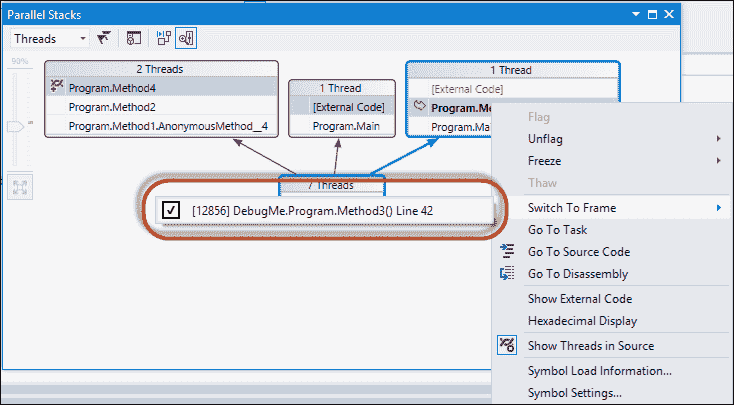

# 第七章. 性能分析和调试

在本章中，我们将涵盖以下菜谱：

+   使用线程和调用堆栈窗口

+   使用并行堆栈窗口

+   使用并行监视窗口监视线程中的值

+   使用并行任务窗口检测死锁

+   使用并发可视化器测量 CPU 利用率

+   使用并发可视化器线程视图

+   使用并发可视化器核心视图

# 简介

并行编程可以创建复杂的问题。也许你没有从并行化你的应用程序中获得预期的性能提升。它甚至可能比相同算法的顺序版本运行得更慢。也许你得到的是持续或偶尔的错误结果。

并行程序中可能出现的问题众多，且难以检测。可能是因为上下文切换次数过多，过度订阅导致了性能不佳。也许你无意中创建了一个锁车队，这是一种当多个优先级相同的线程反复争夺同一锁时发生的情况，即使使用了多个线程，也可能导致显著的锁竞争和程序序列化。

在本章中，我们将探讨 Visual Studio 2012 的多线程应用程序调试功能，以及如何使用这些功能来解决与并发相关的问题。

# 使用线程和调用堆栈窗口

当我们想要以线程为中心的视图查看我们的应用程序时，线程窗口是开始的地方。我们可以使用线程窗口来查看所有线程的位置，查看线程调用堆栈，等等。我们可以使用调用堆栈窗口来查看应用程序的堆栈帧，或当前在堆栈上的函数或过程调用。

在这个菜谱中，我们将了解如何在 Visual Studio 2012 中使用线程和调用堆栈窗口来查看应用程序中线程的调用堆栈信息。

## 准备中…

在我们开始查看 Visual Studio 2012 的调试功能之前，我们需要一个可调试的应用程序。让我们创建一个`Console`应用程序，启动几个任务，以便我们可以查看它们的调用堆栈信息。

1.  使用**C#控制台应用程序**项目模板启动一个新项目，并将`LockExample`指定为**解决方案名称**。

1.  将以下`using`指令添加到`Program`类的顶部。

    ```cs
    using System;
    using System.Diagnostics;
    using System.Threading;
    using System.Threading.Tasks;
    ```

1.  让我们先在`Program`类上创建几个`static`方法。添加一个名为`Method1`的方法，该方法循环三次，创建任务。任务只需要调用带有`integer`参数的`Method2`。

    ```cs
    static void Method1()
    {
      Console.WriteLine("In Method1.");
      for (int i = 0; i < 3; i++)
      {
        Task.Factory.StartNew(index => Method2((int)index), i);               
      }
    }
    ```

1.  现在创建一个名为`Method2`的方法。`Method2`只是将一个随机数添加到参数中，将参数写入`Console`，并调用`Method4`。

    ```cs
    static void Method2(int number)
    {
      Random rnd = new Random();
      var sum = number + rnd.Next(1,10);
      Console.WriteLine("In Method2\. Value:{0}", sum);
      Method4(sum);            
    }
    ```

1.  接下来创建`Method3`，它仅启动一个调用`Method2`的第三个任务。

    ```cs
    static void Method3()
    {
      Console.WriteLine("In Method3.");
      for (int i = 0; i < 3; i++)
      {
        Task.Factory.StartNew(() =>
        {
          Task.Factory.StartNew(index => Method2((int)index), i);
        });
        Thread.Sleep(10);
      }

    }
    ```

1.  最后，创建包含我们的断点的`Method4`。

    ```cs
    static void Method4(int number)
    {
      Console.WriteLine("In Method4.", number);
      Debugger.Break();
    }
    ```

1.  在`Main`方法中，创建一个调用`Method1`的任务和一个调用`Method3`的任务。在退出之前等待用户输入。

    ```cs
    static void Main()
    {
      var task1 = Task.Factory.StartNew(() => Method1());
      var task2 = Task.Factory.StartNew(() => Method3());
      Console.ReadLine();
    }
    ```

## 如何操作…

让我们开始一个调试会话并查看窗口。

1.  在 Visual Studio 2012 中，按 *F5* 运行项目。

1.  当调试器触碰到 `Debug.Break` 语句时，转到 Visual Studio 2012 的 **调试** 菜单，点击 **窗口**，然后点击 **调用堆栈** 以查看 **线程** 窗口。

1.  活跃线程是当前在 **线程** 窗口中选中的线程，由箭头图标指示。默认情况下，活跃线程是触碰到断点的线程。通过在 **线程** 窗口中双击视图中的不同线程来切换活跃线程。

1.  返回到 **调试** 菜单，点击 **窗口**，然后点击 **线程** 以显示 **调用** **堆栈** 窗口。

1.  **调用堆栈** 窗口使用箭头图标指示活跃线程的堆栈顶部。这被称为活跃堆栈帧。当切换线程时，活跃堆栈帧会改变。当执行恢复时，执行从活跃堆栈帧开始继续。

1.  当前堆栈帧是驱动其余调试工具和窗口的堆栈帧。通过在 **调用堆栈** 窗口中双击不同的条目来更改当前堆栈帧。当将当前堆栈帧更改为非活跃堆栈帧时，它显示一个细长的箭头。

1.  您可以导航到堆栈帧中任何条目的源代码。在 **调用堆栈** 窗口中，右键单击您想查看源代码的函数，然后从快捷菜单中选择 **转到源代码**。

# 使用并行堆栈窗口

随着我们的应用程序并行度的持续增长，我们需要能够从单个视图中查看和导航多个线程的调用堆栈。调试多线程应用程序的开发者需要能够同时查看多个线程的调用堆栈，以便看到应用程序的整体状态。

在这个菜谱中，我们将看到如何在 Visual Studio 2012 中使用并行堆栈窗口来获取应用程序中所有任务的调用堆栈的图形视图。

## 如何操作…

现在，让我们回到 Visual Studio 2012 并查看并行堆栈窗口。

1.  在 Visual Studio 2012 中，按 *F5* 运行项目。

1.  当调试器触碰到 `Debug.Break` 语句时，转到 **调试** 菜单，点击 **窗口**，然后点击 **并行堆栈** 以显示 **并行堆栈** 窗口。

1.  您的**并行堆栈**视图可能与图片略有不同，但您可以在单个图形视图中看到所有任务的调用堆栈。前一个屏幕截图中的并行堆栈窗口显示，我们有一个线程从`Main`中的匿名方法切换到`Method3`，正如在**外部代码**中指出的。一个线程在`Main`中，并已切换到**外部代码**。另外两个线程启动，通过`Method1`中的匿名方法，通过`Method2`，到`Method4`。这也是活动堆栈帧，这是当前线程，如活动线程上的标志所示。Visual Studio 2012 将具有相同调用堆栈信息的线程组合到同一个框中。

1.  将鼠标悬停在框上，并注意显示堆栈帧信息（包括每个线程的方法名称和参数值）的工具提示。

1.  您可以双击线程堆栈中的任何项来导航到代码。

1.  要切换到另一个线程，右键单击所需线程的堆栈帧，然后单击**切换到帧**。注意，高亮显示已更改为所选堆栈帧，并且框中有一个绿色箭头指示这是调试器当前关注的当前堆栈帧，而不是由箭头指示的活动堆栈帧。

1.  您可以通过在**并行堆栈**窗口中双击它来切换回活动堆栈帧。注意，它有一个线程图标而不是箭头，而不同的堆栈帧则是调试器的焦点。一旦您双击它，箭头就会返回，指示这是活动且当前线程。

1.  您可以通过单击当前堆栈帧并然后单击**并行堆栈**窗口菜单上的**方法视图**按钮来查看调用方法的**线程**。单击按钮后，视图将更改以显示线程正在调用哪些方法。

# 使用并行监视窗口监视线程中的值

传统上，调试器被设计为一次只在一个线程的上下文中工作。为了与不同的线程一起工作，您需要首先切换线程上下文。Visual Studio 2012 有一个称为并行监视窗口的功能，允许您在多个线程上显示变量或表达式的值。

在这个菜谱中，我们将了解如何使用并行监视窗口查看多个线程中变量的值。

## 如何做到这一点...

让我们看看并行监视窗口如何帮助我们查看多个线程中的变量值。

1.  在 Visual Studio 2012 中，按*F5*键运行项目。

1.  当调试器遇到 `Debug.Break` 语句时，转到 Visual Studio 2012 的 **Debug** 菜单，然后点击 **Windows**。然后点击 **Parallel Watch** 和 **Parallel Watch 1** 来查看窗口。

1.  默认情况下，**Parallel Watch** 窗口会显示进程中当前正在执行的所有线程。为了添加新的监视，我们需要点击 **<Add Watch>** 列，这允许我们输入一个表达式。点击 **<Add Watch>** 并输入数字作为监视的表达式。一旦监视被添加，我们就可以在 **Watch** 窗口中看到表达式在所有不同的线程中被评估。

1.  在 **Filter by Boolean Expression** 框中输入一个布尔表达式。调试器为每个线程上下文评估表达式。只有值为真的行才会显示。

# 使用 Parallel Tasks 窗口检测死锁

Visual Studio 2012 调试器的一个非常有用的功能是能够检测任务中的死锁。死锁发生在两个或更多任务永久性地相互阻塞的情况下，每个任务都锁定了一个其他任务试图锁定的资源，或者通过等待对方完成。

在 Visual Studio 2012 的 Parallel Tasks 窗口中查找死锁是最简单的方法。Parallel Tasks 窗口与 Threads 窗口非常相似，但它显示的是每个 `Task` 或 `task_handle` 对象的信息，而不是每个线程的信息，以及任务的状态。

在这个菜谱中，我们将创建一个 `Console` 应用程序，该程序将在循环中创建几个任务。由于每个任务都在等待下一个任务完成，因此任务将会发生死锁。

## 准备工作…

在我们使用 Parallel Task 窗口查看代码中的死锁之前，我们需要创建一个具有一些死锁的应用程序以便我们查看。

1.  使用 **C# Console Application** 项目模板创建一个新的项目，并将 `DetectDeadlock` 作为 **Solution name**。

1.  将以下 `using` 指令添加到 `Program` 类的顶部：

    ```cs
    using System.Collections.Generic;
    using System.Diagnostics;
    using System.Threading;
    using System.Threading.Tasks;
    ```

1.  在 `Program` 类的 `Main` 方法中，让我们首先创建一个用于创建 `CountDownEvent` 的任务数量的变量，以及一个 `tasks` 数组。

    ```cs
    static void Main()
    {
      int taskCount = 5;
      var countdownEvent = new CountdownEvent(taskCount);
      var tasks = new Task[taskCount];
    }
    ```

1.  现在，就在之前的代码下方，让我们在 `for` 循环中创建阻塞的 `tasks`。每个任务都应该等待下一个任务完成。

    ```cs
    for(int i = 0; i < taskCount; i++)
    {
       tasks[i] = Task.Factory.StartNew((state) =>
         {
           countdownEvent.Signal();
           tasks[(((int)state)+1)taskCount].Wait();
         },i);
    }
    ```

1.  接下来，让我们创建并启动几个不会阻塞的任务。

    ```cs
    var task1 = new Task(() =>
    {
      Thread.Sleep(500);                
    });

    var task2 = new Task(() =>
    {
      Thread.Sleep(500);
    });

    task1.Start();
    task2.Start();
    ```

1.  通过等待 `CountDownEvent` 并为 `Debugger` 设置断点来完成 `Main` 方法。

    ```cs
    countdownEvent.Wait();
    Debugger.Break();
    ```

## 如何操作…

1.  在 Visual Studio 2012 中，按 *F5* 运行项目。

1.  当调试器遇到 `Debug.Break` 语句时，转到 Visual Studio 2012 的 **Debug** 菜单并点击 **Windows**。然后点击 **Parallel Tasks** 来查看窗口。

1.  在 **Parallel Tasks** 窗口中，您可以查看所有已识别为死锁的任务。将鼠标悬停在任何阻塞任务上，以查看任务正在等待什么。

1.  对于有很多任务的程序，按其状态分组任务可能很有用。在 **Parallel Tasks** 窗口中右键单击任何位置，然后单击 **Group By**，再单击 **Status**。

# 使用并发可视化器测量 CPU 利用率

并行应用程序不仅容易受到在顺序应用程序中发现的常见效率低下来源的影响，而且它们还可能遭受独特的并行性能问题，如负载不平衡、过度的同步开销或线程迁移。

理解这样的性能问题可能是一个困难且耗时的过程。然而，Visual Studio 2012 包含了一个分析工具，即并发可视化器，它可以显著减少并行性能分析的工作量。

在这个菜谱中，我们将查看并发可视化器的 CPU 利用率视图。

## 准备工作…

在我们查看并发可视化器之前，我们需要创建一个 `Console` 应用程序，该程序将稍微改变我们在 第五章 中创建的 `MultipleProducerConsumer` 应用程序，即并发集合。该应用程序将使用 `for` 循环创建一些生产者 `tasks`，生产者使用这些 `tasks` 对一些数字执行数学运算，并将结果添加到 `BlockingCollection`。`BlockingCollection` 是一个提供对实现 `IProducerConsumerCollection<T>` 的线程安全集合进行阻塞和限制功能的类。还将有四个消费者 `tasks` 从 `BlockingCollection` 中检索结果并将它们写入 `Console`。

1.  使用 **C# Console Application** 项目模板启动一个新项目，并将 `MultipleProducerConsumer` 作为 **Solution name** 分配。

1.  将以下 `using` 指令添加到 `Program` 类的顶部：

    ```cs
    using System;
    using System.Collections.Concurrent;
    using System.Collections.Generic;
    using System.Threading.Tasks;
    ```

1.  让我们在 `Program` 类中添加一个 `static` 方法，生产者 `tasks` 将调用它来执行计算。

    ```cs
    private static double CalcSumRoot(int root)
    {
      double result = 0;
      for (int i = 1; i < 10000000; i++)
      {
        result += Math.Exp(Math.Log(i) / root);
      }
      return result;
    }
    ```

1.  现在，在之前的方法下面，让我们创建另一个 `static` 方法，该方法是消费者 `tasks` 将用来将结果写入 `Console` 的。

    ```cs
    private static void DisplayResults(BlockingCollection<double> results)
    {
      foreach (var item in results.GetConsumingEnumerable())
      {
        Console.Write("\nConsuming item: {0}", item);
      }
    }
    ```

1.  在 `Main` 方法中，让我们首先创建 `BlockingCollection`，作为生产者和消费者之间的缓冲区，任务列表以及四个消费者 `tasks` 的定义。

    ```cs
    var results = new BlockingCollection<double>();
    var tasks = new List<Task>();
    var consume1 = Task.Factory.StartNew(() => DisplayResults(results));
    var consume2 = Task.Factory.StartNew(() => DisplayResults(results));
    var consume3 = Task.Factory.StartNew(() => DisplayResults(results));
    var consume4 = Task.Factory.StartNew(() => DisplayResults(results));
    ```

1.  现在，让我们创建一个 `for` 循环，启动一些生产者 `tasks`，执行计算，并将结果添加到 `BlockingCollection`。

    ```cs
    for (int item = 1; item < 100; item++)
    {
      var value = item;
      var compute = Task.Factory.StartNew(() =>
      {
        var calcResult = CalcSumRoot(value);
        Console.Write("\nProducing item: {0}", calcResult);
        results.TryAdd(calcResult);
      });
      tasks.Add(compute);
    }
    ```

1.  最后，让我们创建一个延续，当所有生产者 `tasks` 完成时，在 `BlockingCollection` 上调用 `CompleteAdding`。在退出之前等待用户输入。

    ```cs
    Task.Factory.ContinueWhenAll(tasks.ToArray(), result =>
    {
     results.CompleteAdding();
     Console.Write("\nCompleted adding.");
    });

    Console.ReadLine();
    ```

## 如何做到这一点...

现在，让我们看看我们如何使用并发可视化器来报告并行代码的性能和效率。

1.  在 Visual Studio 2012 菜单上，点击 **分析**，然后点击 **并发可视化器**，并 **使用当前项目启动**。您将看到应用程序在 Visual Studio 2012 收集数据和在后台构建报告的同时运行。

1.  当应用程序运行完成后，请关闭应用程序。此时，Visual Studio 2012 将最终化并打开性能报告。

1.  一旦报告完成并加载，您将看到并发可视化器的 **利用率** 视图。X 轴显示从跟踪开始以来的 **已过时间**。Y 轴显示您系统中的逻辑处理器核心数。绿色区域显示在分析运行中的任何给定点上应用程序正在使用的 **逻辑核心数**。其余的核心要么是空闲的，要么被 **其他进程** 使用，这些进程通过从图表顶部延伸的灰色线条显示。顶部有一个 **缩放** 滑块，可以用来缩小图表的时间范围。

1.  当调整您的并行应用程序时，此视图允许您确认并行程度。您可以通过查看图表来获得常见并行性能问题的提示。处理器核心之间的负载不平衡在图表中表现为阶梯状模式。对同步对象的竞争在图表上显示，例如，当期望并行执行时出现串行执行。

# 使用并发可视化器线程视图

线程视图可能是并发可视化器中最有用且最常使用的视图。通过使用此视图，您可以确定线程是因为同步或其他原因而执行或阻塞。当线程停止执行时，线程视图会将一个类别分配给每个上下文切换。

在这个菜谱中，我们将使用并发可视化器来显示每个应用程序线程的所有上下文切换事件。

## 准备工作…

对于这个菜谱，我们将使用与上一个菜谱相同的示例应用程序。如果您已经关闭了 `MultipleProducerConsumer` 解决方案，请重新打开它，并通过 Visual Studio 2012 菜单进入并发可视化器，然后点击 **分析**。接着，点击 **并发可视化器**，并 **打开跟踪**。或者，您也可以像上一个菜谱中那样重新运行并发可视化器。

## 如何操作…

让我们看看我们可以使用并发可视化器的线程视图做什么。

1.  打开 **MultipleProducerConsumer** 解决方案的 **并发可视化器** 并点击 **线程** 视图。

1.  当**线程**视图打开时，您会注意到 X 轴再次是**时间线**。然而，Y 轴被划分为水平通道。如果您的机器上的物理磁盘在应用程序运行期间有任何活动（在这个例子中它们没有），顶部通道将描述您的物理磁盘。在我们的案例中，通道都是我们的应用程序中的线程。您将看到`Main`线程、一个调试器辅助线程以及所有工作线程。在**线程**列表下方，您将看到并发可视化器分配的**执行类别**。在下面的屏幕截图中，您可以看到应用程序在**执行**中花费了**16%**的**时间线**，在**同步**中花费了**71%**的**时间线**。

1.  在顶部通道中单击一个 CLR 工作线程。**CLR 工作线程**通道旁边的**时间线**将被划分为线程的**时间片**。在**配置文件报告**选项卡中单击**当前**选项卡。您将看到上下文切换时线程的调用堆栈、上下文切换的原因以及报告分配的**类别**。您可以在**当前**选项卡中看到，此线程上下文切换是因为它到达了**Monitor.Wait**调用。

1.  **线程**视图最有价值的特性之一是确定线程依赖关系的能力。选择一个工作线程的同步段（一个粉红色的段）。在**当前**选项卡中，您将看到解除当前线程阻塞的线程。单击**解除阻塞堆栈**选项卡，您将看到解除当前线程阻塞的线程的调用堆栈。

# 使用并发可视化器核心视图

经常切换上下文会严重影响应用程序的性能，尤其是在线程在恢复执行时跨越核心时。这种性能影响的原因是运行中的线程将它们需要的指令和数据加载到缓存层次结构中，而当一个线程在不同的核心上恢复执行时，可能会出现延迟，因为工作数据需要从内存或其他缓存中重新加载。

并发可视化器的核心视图是一个帮助识别过度上下文切换的工具。在这个配方中，我们将回到`MultipleProducerConsumer`解决方案，看看我们如何检查应用程序中发生的上下文切换。

## 准备工作…

对于这个配方，我们将使用与上一个配方相同的示例应用程序。如果您已关闭`MultipleProducerConsumer`解决方案，请重新打开它，并通过 Visual Studio 2012 菜单转到并发可视化器。单击**分析**，然后单击**并发可视化器**，并**打开跟踪**。或者，您可以根据上一个配方重新运行并发可视化器。

## 如何操作…

1.  打开`MultipleProducerConsumer`解决方案的并发可视化器，并点击**核心**视图。

1.  与其他视图一样，**核心**视图在 X 轴上显示时间线。系统的逻辑核心显示在 Y 轴上。应用程序中的每个线程以不同的颜色显示，线程执行段显示在核心通道上。

1.  **核心**视图中显示的统计信息有助于开发者识别发生过多上下文切换并导致核心迁移的**线程**。**核心**视图底部的线程列表按**跨核心上下文切换次数**排序。点击列表中核心切换次数最多的线程（列表顶部的线程）。注意线程执行是如何分散到系统可用的**核心**上的。
