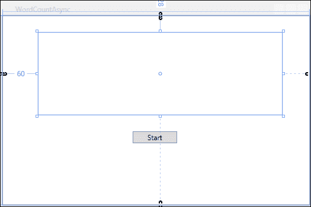
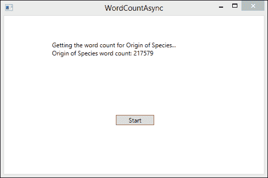
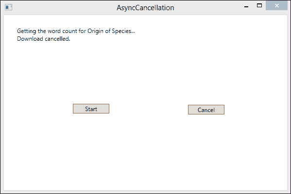
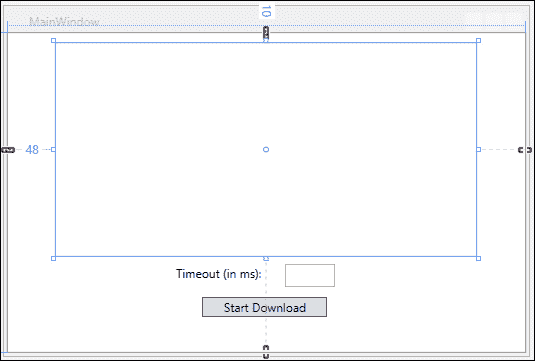
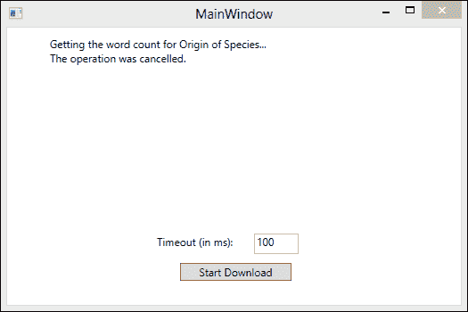
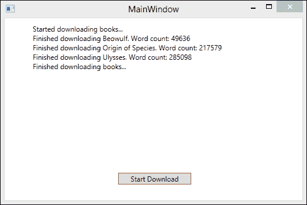
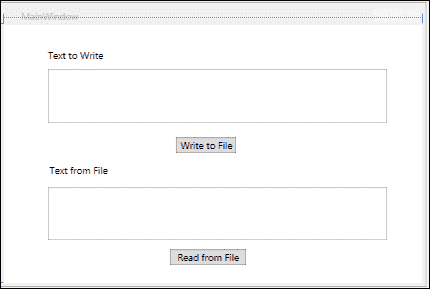
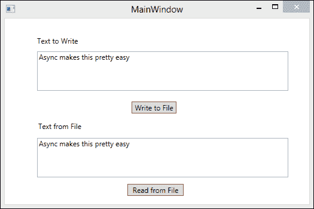
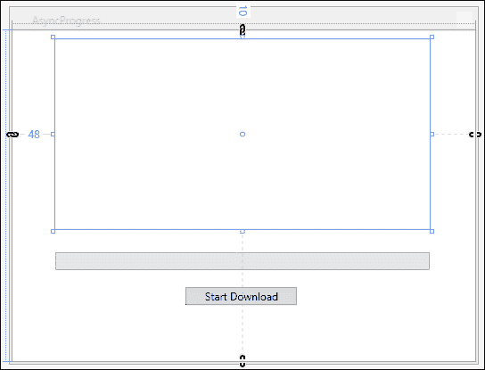
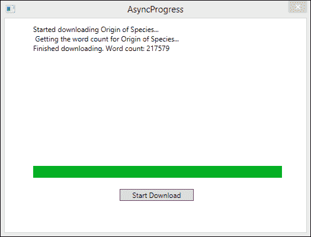

# 第八章。异步

在本章中，我们将介绍以下食谱：

+   创建一个 `异步` 方法

+   处理异步代码中的 `异常`

+   取消异步操作

+   超时后取消 `异步` 操作

+   在任务完成时处理多个 `异步` 任务

+   使用 `Task.WhenAll` 提高异步解决方案的性能

+   使用 `async` 进行文件访问

+   检查异步任务的进度

# 简介

我们都见过客户端应用程序对鼠标事件没有反应或更新显示需要明显的时间。这种延迟很可能是代码长时间占用单个 UI 线程的结果。也许它正在等待网络 I/O，或者它正在进行密集的计算。与此同时，用户只能坐着等待，因为我们的应用程序几乎停止了。解决这个问题的是异步。

异步的概念与并行性有何不同？到这本书的这一部分，你很可能对并行性非常熟悉，它主要关于应用性能。并行性使开发者能够同时在一个或多个线程上执行 CPU 密集型工作，利用现代的多核计算机架构。另一方面，异步性是并发的超集。它包括并发以及其他比 CPU 密集型更 I/O 密集型的异步调用。比如说，你正在将大文件保存到硬盘上，或者你想要从服务器下载一些数据。这类 I/O 密集型任务非常适合异步。异步是一种立即释放控制权并等待回调或其他通知发生后再继续的模式。

因此，只需使用异步模式做事，你的 UI 响应性问题就解决了，对吧？嗯，是的，但有一个小问题。异步代码是困难的，至少从历史的角度来看。然而，异步性在可用性方面取得了巨大的进步。微软通过在 .NET 4.5 的 `Task` 功能上构建，以及向 .NET 框架中添加两个新关键字：`async` 和 `await` 来实现这一点。

在本章中，我们将通过几个食谱展示如何使用 .NET Framework 4.5 中的新 **基于任务的异步模式** （**TAP**） 来保持 UI 的响应性或可扩展的服务。

# 创建一个异步方法

TAP 是 .NET Framework 4.5 中异步编程的新模式。它基于任务，但在这个案例中，任务并不代表将在另一个线程上执行的工作。在这种情况下，任务用于表示任意异步操作。

让我们从创建一个使用 `HttpClient` 访问网络的 **Windows 表现基础** （**WPF**） 应用程序开始，来学习 `async` 和 `await` 的工作原理。这种网络访问非常适合观察 TAP 的实际应用。该应用程序将从网络获取一本经典书籍的内容，并提供书中单词数量的统计。

## 如何做到这一点...

让我们去 Visual Studio 2012 看看如何使用 `async` 和 `await` 关键字通过异步进行网络通信来保持响应式 UI。

1.  使用 **WPF 应用程序** 项目模板启动一个新的项目，并将 `WordCountAsync` 作为 **解决方案名称**。

1.  首先打开 `MainWindow.xaml` 并添加以下 XAML 以创建一个包含 `Button` 和 `TextBlock` 的简单用户界面：

    ```cs
    <Window x:Class="WordCountAsync.MainWindow"
            xmlns="http://schemas.microsoft.com/winfx/2006/xaml/presentation"
            xmlns:x="http://schemas.microsoft.com/winfx/2006/xaml"
            Title="WordCountAsync" Height="350" Width="525">
        <Grid>
            <Button x:Name="StartButton" 
        Content="Start" 
        HorizontalAlignment="Left" 
        Margin="219,195,0,0" 
        VerticalAlignment="Top" 
        Width="75" 
        RenderTransformOrigin="-0.2,0.45" 
        Click="StartButton_Click"/>
            <TextBlock x:Name="TextResults" 
          HorizontalAlignment="Left" 
          Margin="60,28,0,0" 
          TextWrapping="Wrap" 
          VerticalAlignment="Top" 
          Height="139" 
          Width="411"/>

        </Grid>
    </Window>
    ```

    

1.  接下来，打开 `MainWindow.xaml.cs`。在 **项目** 中添加对 `System.Net.Http` 的引用。

1.  将以下 `using` 指令添加到 `MainWindow` 类的顶部：

    ```cs
    using System;
    using System.Linq;
    using System.Net.Http;
    using System.Threading.Tasks;
    using System.Windows;
    ```

1.  在 `MainWindow` 类的顶部添加一个 `character` 数组常量，该常量将用于将书籍内容拆分为单词数组。

    ```cs
    char[] delimiters = { ' ', ',', '.', ';', ':', '-', '_', '/', '\u000A' };
    ```

1.  为 `StartButton` 添加按钮点击事件，并将 `async` 修饰符添加到方法签名中，以指示这将是一个 `async` 方法。请注意，通常只使用返回 `void` 的 `async` 方法作为事件处理器，应避免使用。

    ```cs
    private async void StartButton_Click(object sender, RoutedEventArgs e)
    {

    }
    ```

1.  接下来，让我们创建一个名为 `GetWordCountAsync` 的 `async` 方法，它返回 `Task<int>`。这个方法将创建 `HttpClient` 并调用其 `GetStringAsync` 方法以将书籍内容作为字符串下载。然后，它将使用 `Split` 方法将字符串拆分为 `wordArray`。我们可以返回 `wordArray` 的计数作为我们的 `return` 值。

    ```cs
    public async Task<int> GetWordCountAsync()
    {
      TextResults.Text += "Getting the word count for Origin of Species...\n";
      var client = new HttpClient();
      var bookContents = await client.GetStringAsync(@"http://www.gutenberg.org/files/2009/2009.txt");
      var wordArray = bookContents.Split(delimiters, StringSplitOptions.RemoveEmptyEntries);
      return wordArray.Count();           
    }
    ```

1.  最后，让我们完成按钮点击事件的实现。`Click` 事件处理器将仅使用 `await` 关键字调用 `GetWordCountAsync` 并将结果显示到 `TextBlock`。

    ```cs
    private async void StartButton_Click(object sender, RoutedEventArgs e)
    {
      var result = await GetWordCountAsync();
      TextResults.Text += String.Format("Origin of Species word count: {0}",result);
    }
    ```

1.  在 Visual Studio 2012 中，按 *F5* 运行项目。单击 **开始** 按钮，你的应用程序应该如图所示：

## 它是如何工作的…

在 TAP 中，异步方法用 `async` 修饰符标记。方法上的 `async` 修饰符并不意味着该方法将在工作线程上异步运行。它意味着该方法包含涉及等待异步操作结果的控制流，并且将由编译器重写以确保异步操作可以在正确的位置恢复此方法。

让我尝试将这说得简单一点。当你将 `async` 修饰符添加到方法中时，它表示该方法将等待异步代码完成。这是通过 `await` 关键字完成的。编译器实际上会将 `async` 方法中 `await` 关键字后面的代码转换为在异步操作结果可用后运行的延续。在此期间，方法被挂起，控制权返回到方法的调用者。

如果你将 `async` 修饰符添加到方法中，但没有 `await` 任何内容，它不会导致错误。该方法将简单地同步运行。

异步方法可以有一个三种返回类型之一：`void`、`Task`或`Task<TResult>`。如前所述，在这个上下文中，任务并不意味着这将在一个单独的线程上执行。在这种情况下，任务只是异步工作的容器，而在`Task<TResult>`的情况下，它是一个承诺，异步操作完成后将出现类型为`TResult`的结果值。

在我们的应用程序中，我们使用`async`关键字标记按钮点击事件处理器为异步，然后使用`await`关键字等待`GetWordCountAsync`方法完成。

```cs
private async void StartButton_Click(object sender, RoutedEventArgs e)
{
  StartButton.Enabled = false;
  var result = await GetWordCountAsync();
  TextResults.Text += String.Format("Origin of Species word count: {0}",
..................  result);
  StartButton.Enabled = true;
}
```

在`await`关键字之后的代码，在这个例子中，是更新`TextBlock`的同一行代码，被编译器转换为一个在`integer`结果可用后运行的延续。

如果在异步任务进行中再次触发`Click`事件，将创建另一个异步任务并等待。为了防止这种情况，通常的做法是禁用被点击的按钮。

按照惯例，异步方法应以`Async`后缀命名，正如我们在`GetWordCountAsync`中所做的那样。

# 在异步代码中处理异常

那么你将如何向执行异步的代码中添加`异常`处理？在之前的异步模式中，这非常困难。在 C# 5.0 中，这要简单得多，因为你只需要用标准的`try`/`catch`块包装异步函数调用。

表面上这听起来很简单，确实如此，但在幕后还有更多的事情发生，这些事情将在我们构建下一个示例应用程序后立即解释。

对于这个菜谱，我们将回到我们经典的书籍单词计数场景，并且我们将处理`HttpClient`在尝试使用错误的 URL 获取书籍内容时抛出的`异常`。

## 如何做到这一点…

让我们再构建一个 WPF 应用程序，并看看当我们的异步方法中发生错误时如何处理`异常`。

1.  使用**WPF 应用程序**项目模板启动一个新项目，并将**解决方案名称**设置为`AsyncExceptions`。

1.  开始时打开`MainWindow.xaml`，并添加以下 XAML 以创建一个包含`Button`和`TextBlock`的简单用户界面：

    ```cs
    <Window x:Class="WordCountAsync.MainWindow"
            xmlns="http://schemas.microsoft.com/winfx/2006/xaml/presentation"
            xmlns:x="http://schemas.microsoft.com/winfx/2006/xaml"
            Title="WordCountAsync" Height="350" Width="525">
        <Grid>
            <Button x:Name="StartButton" 
        Content="Start" 
        HorizontalAlignment="Left" 
        Margin="219,195,0,0" 
        VerticalAlignment="Top" 
        Width="75" 
        RenderTransformOrigin="-0.2,0.45" 
        Click="StartButton_Click"/>
            <TextBlock x:Name="TextResults" 
          HorizontalAlignment="Left" 
          Margin="60,28,0,0" 
          TextWrapping="Wrap" 
          VerticalAlignment="Top" 
          Height="139" 
          Width="411"/>

        </Grid>
    </Window>
    ```

1.  接下来，打开`MainWindow.xaml.cs`。转到**项目资源管理器**，右键单击**引用**，点击**框架**从**引用管理器**左侧菜单，然后添加对`System.Net.Http`的引用。

1.  将以下`using`指令添加到`MainWindow`类的顶部：

    ```cs
    using System;
    using System.Linq;
    using System.Net.Http;
    using System.Threading.Tasks;
    using System.Windows;
    ```

1.  在`MainWindow`类的顶部，添加一个`字符`数组常量，该常量将用于将书籍内容分割成单词数组。

    ```cs
    char[] delimiters = { ' ', ',', '.', ';', ':', '-', '_', '/', '\u000A' };
    ```

1.  现在，让我们创建我们的`GetWordCountAsync`方法。这个方法将与上一个菜谱非常相似，但它将尝试访问一个错误的 URL 上的书籍。异步代码将被包裹在`try`/`catch`块中，以处理`Exception`。我们还将使用`finally`块来释放`HttpClient`。

    ```cs
    public async Task<int> GetWordCountAsync()
    {
      ResultsTextBlock.Text += "Getting the word count for Origin of Species...\n";
      var client = new HttpClient();            
      try
      {
        var bookContents = await client.GetStringAsync(@"http://www.gutenberg.org/files/2009/No_Book_Here.txt");
        var wordArray = bookContents.Split(delimiters, StringSplitOptions.RemoveEmptyEntries);
        return wordArray.Count();
      }
      catch (Exception ex)
      {
        ResultsTextBlock.Text += String.Format("An error has occurred: {0} \n", ex.Message);
        return 0;
      }
      finally
      {
        client.Dispose();
      }

    }
    ```

1.  最后，让我们创建`StartButton`的`Click`事件处理程序。这基本上与上一个菜谱相同，只是包裹在`try`/`catch`块中。别忘了在方法签名上添加`async`修饰符。

    ```cs
    private async void StartButton_Click(object sender, RoutedEventArgs e)
    {            
      try
      {
        var result = await GetWordCountAsync();
        ResultsTextBlock.Text += String.Format("Origin of Species word count: {0}", 
            result);
      }
      catch(Exception ex)
      {
        ResultsTextBlock.Text += String.Format("An error has occurred: {0} \n", 
                ex.Message);
      } 
    }
    ```

1.  现在，在 Visual Studio 2012 中，按*F5*运行项目。点击**Start**按钮。你的应用程序应该如图所示：

## 它是如何工作的...

将你的异步代码包裹在`try`/`catch`块中相当简单。实际上，它隐藏了一些 Visual Studio 2012 为我们做的复杂工作。

要理解这一点，你需要考虑你的代码运行的环境。

当在 Windows Forms 或 WPF 应用程序中使用 TAP 时，代码运行在已经存在的上下文中，例如消息循环 UI 线程。当在这些应用程序中调用`async`方法时，等待的代码将异步执行其工作，然后`async`方法返回到其调用者。换句话说，程序执行返回到消息循环 UI 线程。

`Console`应用程序没有上下文的概念。当代码在`try`块中遇到等待的调用时，它将返回到其调用者，在这个例子中是`Main`。如果在等待调用之后没有更多的代码，应用程序将在`async`方法完成之前结束。

为了缓解这个问题，Microsoft 在 TAP 中包含了与`Console`应用程序或单元测试应用程序兼容的上下文，以防止这种不一致的行为。这个新的上下文被称为`GeneralThreadAffineContext`。

你真的需要理解这些上下文问题来处理异步`Exceptions`吗？不，实际上并不需要。这正是基于任务的异步模式（Task-based Asynchronous Pattern，简称 TAP）之美的一部分。

# 取消异步操作

在.NET 4.5 中，可以通过传递`CancellationToken`并在`CancellationTokenSource`上调用`Cancel`方法来以与取消并行任务相同的方式取消异步操作。

在这个菜谱中，我们将创建一个 WPF 应用程序，从网络上获取一本经典书籍的内容并执行单词计数。这次，我们将设置一个**取消**按钮，我们可以使用它来取消`async`操作，如果我们不想等待它完成的话。

## 如何实现它...

让我们创建一个 WPF 应用程序来展示我们如何向异步方法添加取消功能。

1.  使用**WPF 应用程序**项目模板启动一个新项目，并将`Solution name`设置为`AsyncCancellation`。

1.  首先，打开`MainWindow.xaml`并添加以下 XAML 来创建我们的用户界面。在这种情况下，UI 包含`TextBlock`、`StartButton`和`CancelButton`。

    ```cs
    <Window x:Class="AsyncCancellation.MainWindow"
            xmlns="http://schemas.microsoft.com/winfx/2006/xaml/presentation"
            xmlns:x="http://schemas.microsoft.com/winfx/2006/xaml"
            Title="AsyncCancellation" Height="400" Width="599">
        <Grid Width="600" Height="400">
            <Button x:Name="StartButton" 
            Content="Start" 
            HorizontalAlignment="Left" 
            Margin="142,183,0,0" 
            VerticalAlignment="Top" 
            Width="75" 
            RenderTransformOrigin="-0.2,0.45" 
            Click="StartButton_Click"/>
            <Button x:Name="CancelButton" 
            Content="Cancel" 
            HorizontalAlignment="Left" 
            Margin="379,185,0,0" 
            VerticalAlignment="Top" 
            Width="75" 
            Click="CancelButton_Click"/>
            <TextBlock x:Name="TextResult" 
            HorizontalAlignment="Left" 
            Margin="27,24,0,0" 
            TextWrapping="Wrap" 
            VerticalAlignment="Top" 
            Height="135" 
            Width="540"/>
        </Grid>
    </Window>
    ```

1.  接下来，打开 `MainWindow.xaml.cs`，点击 **项目资源管理器**，并添加对 `System.Net.Http` 的引用。

1.  在你的 `MainWindow` 类的顶部添加以下 `using` 指令：

    ```cs
    using System;
    using System.Linq;
    using System.Net.Http;
    using System.Threading.Tasks;
    using System.Windows;
    ```

1.  在 `MainWindow` 类的顶部添加一个 `character` 数组常量，该常量将用于将书籍内容拆分为单词数组。

    ```cs
    char[] delimiters = { ' ', ',', '.', ';', ':', '-', '_', '/', '\u000A' };
    ```

1.  接下来，让我们创建 `GetWordCountAsync` 方法。这个方法与之前解释的方法非常相似。它需要使用 `async` 修饰符标记为异步，并返回 `Task<int>`。然而，这次方法需要一个 `CancellationToken` 参数。我们还需要使用 `HttpClient` 的 `GetAsync` 方法而不是 `GetStringAsync` 方法，因为前者支持取消，而后者则不支持。我们将在方法中添加一个小的延迟，以便在下载完成之前有时间取消操作。

    ```cs
    public async Task<int> GetWordCountAsync(CancellationToken ct)
    {
      TextResult.Text += "Getting the word count for Origin of Species...\n";            
      var client = new HttpClient();
      await Task.Delay(500);
      try
      {
        HttpResponseMessage response = await client.GetAsync(@"http://www.gutenberg.org/files/2009/2009.txt", ct);
        var words = await response.Content.ReadAsStringAsync();
        var wordArray = words.Split(delimiters, StringSplitOptions.RemoveEmptyEntries);
        return wordArray.Count();
      }
      finally
      {
        client.Dispose();
      }
    }
    ```

1.  现在，让我们为我们的 `CancelButton` 创建一个 `Click` 事件处理器。这个方法只需要检查 `CancellationTokenSource` 是否为 `null`，如果不是，就调用 `Cancel` 方法。

    ```cs
    private void CancelButton_Click(object sender, RoutedEventArgs e)
    {
      if (cts != null)
      {
        cts.Cancel();
      }
    }
    ```

1.  好的，让我们通过为 `StartButton` 添加一个 `Click` 事件处理器来完成。这个方法与之前解释的相同，只是我们还有一个专门处理 `OperationCancelledException` 的 `catch` 块。别忘了用 `async` 修饰符标记该方法。

    ```cs
    public async Task<int> GetWordCountAsync(CancellationToken ct)
    {
      TextResult.Text += "Getting the word count for Origin of Species...\n";            
      var client = new HttpClient();
      await Task.Delay(500);
      try
      {
        HttpResponseMessage response = await client.GetAsync(@"http://www.gutenberg.org/files/2009/2009.txt", ct);
        var words = await response.Content.ReadAsStringAsync();
        var wordArray = words.Split(delimiters, StringSplitOptions.RemoveEmptyEntries);
        return wordArray.Count();
      }
      finally
      {
        client.Dispose();
      }
    }
    ```

1.  在 Visual Studio 2012 中，按 *F5* 运行项目。点击 **启动** 按钮，然后点击 **取消** 按钮。你的应用程序应该看起来像下面的截图所示：

## 它是如何工作的...

取消是构建专业 `async` 应用程序时需要考虑的用户交互的一个方面。在这个例子中，我们通过使用 **取消** 按钮实现了取消，这是在 GUI 应用程序中公开取消功能的最常见方式之一。

在这个菜谱中，取消遵循一个非常常见的流程。

1.  调用者（启动按钮点击事件处理器）创建一个 `CancellationTokenSource` 对象。

    ```cs
    private async void StartButton_Click(object sender, RoutedEventArgs e)
    {
      cts = new CancellationTokenSource();            
      ...
    }
    ```

1.  调用者调用一个可取消的方法，并传递来自 `CancellationTokenSource` 的 `CancellationToken`（`CancellationTokenSource.Token`）。

    ```cs
    public async Task<int> GetWordCountAsync(CancellationToken ct)
    {
      ...
      HttpResponseMessage response = await client.GetAsync(@"http://www.gutenberg.org/files/2009/2009.txt", ct);
      ...
    }
    ```

1.  取消按钮点击事件处理器使用 `CancellationTokenSource` 对象（`CancellationTokenSource.Cancel()`）请求取消。

    ```cs
    private void CancelButton_Click(object sender, RoutedEventArgs e)
    {
      if (cts != null)
      {
        cts.Cancel();
      }
    }
    ```

1.  任务通过抛出 `OperationCancelledException` 来确认取消，我们在启动按钮点击事件处理器的 `catch` 块中处理它。

# 超时周期后取消异步操作

取消异步任务的另一个常见场景是使用 `CancellationTokenSource.CancelAfter` 方法设置超时周期。此方法安排在 `CancelAfter` 表达式指定的周期内未完成的任何相关任务的取消。

在这个菜谱中，我们将创建一个 WPF 应用程序，从网络上获取经典书籍的内容并执行单词计数。不过这次，我们将设置一个超时期间，在此期间任务将被取消。

## 如何操作…

现在，让我们看看如何创建一个在指定超时期间取消的异步任务。

1.  使用 **WPF 应用程序** 项目模板启动一个新的项目，并将 `CancelAfterTimeout` 作为 **解决方案名称**。

1.  首先打开 `MainWindow.xaml` 并添加以下 XAML 以创建我们的用户界面：

    ```cs
    <Window x:Class="CancelAfterTimeout.MainWindow"
            xmlns="http://schemas.microsoft.com/winfx/2006/xaml/presentation"
            xmlns:x="http://schemas.microsoft.com/winfx/2006/xaml"
            Title="MainWindow" Height="350" Width="525">
        <Grid>
            <Button x:Name="StartButton" 
            Content="Start Download" 
            HorizontalAlignment="Left" 
            Margin="194,264,0,0" 
            VerticalAlignment="Top" 
            Width="125" 
            RenderTransformOrigin="-0.2,0.45" 
            Click="StartButton_Click"/>
            <TextBlock x:Name="TextResult" 
            HorizontalAlignment="Left" 
            Margin="48,10,0,0" TextWrapping="Wrap" 
            VerticalAlignment="Top" 
            Height="213" 
            Width="420"/>
            <Label Content="Timeout (in ms):" 
             HorizontalAlignment="Left" 
             Margin="163,227,0,0" 
             VerticalAlignment="Top"/>
            <TextBox x:Name="TextTimeout" 
            HorizontalAlignment="Left" 
            Height="23" 
            Margin="277,231,0,0" 
            TextWrapping="Wrap" 
            VerticalAlignment="Top" 
            Width="50"/>
        </Grid>
    </Window>
    ```

    

1.  接下来，打开 `MainWindow.xaml.cs`。转到 **项目资源管理器** 并添加对 `System.Net.Http` 的引用。

1.  将以下 `using` 指令添加到 `MainWindow` 类的顶部：

    ```cs
    using System;
    using System.Linq;
    using System.Net.Http;
    using System.Threading.Tasks;
    using System.Windows;
    ```

1.  在 `MainWindow` 类的顶部添加一个 `character` 数组常量，该常量将用于将书籍的内容分割成单词数组。

    ```cs
    char[] delimiters = { ' ', ',', '.', ';', ':', '-', '_', '/', '\u000A' };
    ```

1.  接下来，让我们创建 `GetWordCountAsync` 方法。这个方法与上一个菜谱完全相同。它需要使用 `async` 修饰符标记为异步，并返回 `Task<int>`。该方法接受一个 `CancellationToken` 参数。我们将在方法中添加一个小的延迟，以便在下载完成之前有时间取消操作。

    ```cs
    public async Task<int> GetWordCountAsync(CancellationToken ct)
    {
      TextResult.Text += "Getting the word count for Origin of Species...\n";            
      var client = new HttpClient();
      await Task.Delay(500);
      try
      {
        HttpResponseMessage response = await client.GetAsync(@"http://www.gutenberg.org/files/2009/2009.txt", ct);
        var words = await response.Content.ReadAsStringAsync();
        var wordArray = words.Split(delimiters, StringSplitOptions.RemoveEmptyEntries);
        return wordArray.Count();
      }
      finally
      {
        client.Dispose();
      }
    }
    ```

1.  好的，让我们通过为 `StartButton` 添加 `Click` 事件处理程序来完成。这个方法与上一个菜谱类似，只是我们调用 `CancellationTokenSource.CancelAfter` 方法，传入 `timeout` 文本框的值。别忘了用 `async` 修饰符标记该方法。

    ```cs
    private async void StartButton_Click(object sender, RoutedEventArgs e)
    {
      StartButton.IsEnabled = false;
      try
      {
        tokenSource = new CancellationTokenSource();
        var timeoutPeriod = int.Parse(TextTimeout.Text);
        tokenSource.CancelAfter(timeoutPeriod);                
        await GetWordCount(tokenSource.Token);                                
      }
      catch (OperationCanceledException)
      {
        TextResult.Text += "The operation was cancelled. \n";
      }
      catch (Exception)
      {
        TextResult.Text += "The operation failed to complete due to an exception. \n";
      }
      finally
      {
        StartButton.IsEnabled = true;
      }
    }
    ```

1.  在 Visual Studio 2012 中，按 *F5* 运行项目。将 `timeout` 值设置为 `100`。您的应用程序应如图所示：

## 工作原理…

该应用程序与我们上一次创建的应用程序非常相似，只是这次没有使用 `Cancel` 按钮。实际的取消流程与此类似。

1.  调用者（开始按钮点击事件处理程序）创建一个 `CancellationTokenSource` 对象，然后调用 `CancelAfter` 方法传入 `timeout` 值。

    ```cs
    private async void StartButton_Click(object sender, RoutedEventArgs e)
    {
      StartButton.IsEnabled = false;
      try
      {
        tokenSource = new CancellationTokenSource();
        var timeoutPeriod = int.Parse(TextTimeout.Text);
        tokenSource.CancelAfter(timeoutPeriod);                
        ...                                
      }
      ...
    }
    ```

1.  调用者调用一个可取消的方法，并传递来自 `CancellationTokenSource` 的 `CancellationToken` (`CancellationTokenSource.Token`)。

    ```cs
    public async Task<int> GetWordCountAsync(CancellationToken ct)
    {
      ...
      HttpResponseMessage response = await client.GetAsync(@"http://www.gutenberg.org/files/2009/2009.txt", ct);
      ...
    }
    ```

1.  超时期间过后，`CancellationTokenSource` 触发取消操作，就像我们调用 `CancellationTokenSource.Cancel` 一样。

    ```cs
    private void CancelButton_Click(object sender, RoutedEventArgs e)
    {
      if (cts != null)
      {
        cts.Cancel();
      }
    }
    ```

任务通过抛出 `OperationCancelledException` 来确认取消，我们在开始按钮点击事件处理程序中的 `catch` 块中处理它。

# 处理多个异步任务，当它们完成时

我们在 第一章 中学到的 `Task` 类的许多方法，在编写异步代码时与编写并行代码时一样有用。在本菜谱中，我们将下载多本书的内容，并使用 `Task.WhenAny` 在它们完成时处理它们。

此应用程序将使用 `while` 循环创建任务集合。每个任务下载指定书籍的内容。在循环的每次迭代中，对 `WhenAny` 的等待调用返回任务集合中首先完成的任务。该任务从集合中删除并处理。循环重复进行，直到集合中不再包含任务。

## 如何做到这一点…

现在，让我们创建一个 WPF 应用程序，该程序创建多个异步任务并在它们完成时处理它们。

1.  使用 **WPF 应用程序** 项目模板启动一个新项目，并将 `AsyncMultipleRequest` 作为 **解决方案名称**。

1.  首先，打开 `MainWindow.xaml` 并添加以下 XAML 以创建我们的用户界面：

    ```cs
    <Window x:Class="AsyncMultipleRequest.MainWindow"
            xmlns="http://schemas.microsoft.com/winfx/2006/xaml/presentation"
            xmlns:x="http://schemas.microsoft.com/winfx/2006/xaml"
            Title="MainWindow" Height="350" Width="525">
        <Grid>
            <Button x:Name="StartButton" 
            Content="Start Download" 
            HorizontalAlignment="Left" 
            Margin="194,264,0,0" 
            VerticalAlignment="Top" 
            Width="125" 
            RenderTransformOrigin="-0.2,0.45" 
            Click="StartButton_Click"/>
            <TextBlock x:Name="TextResult" 
               HorizontalAlignment="Left" 
               Margin="48,10,0,0" 
               TextWrapping="Wrap" 
               VerticalAlignment="Top" 
               Height="213" Width="420"/>
        </Grid>
    </Window>
    ```

1.  接下来，打开 `MainWindow.xaml.cs`。转到 **项目资源管理器**，并将 `System.Net.Http` 添加为引用。

1.  在 `MainWindow` 类的顶部添加以下 `using` 指令：

    ```cs
    using System;
    using System.Collections.Generic;
    using System.Linq;
    using System.Threading.Tasks;
    using System.Windows;
    using System.Windows.Documents;
    using System.Net.Http;
    ```

1.  在 `MainWindow` 类的顶部添加一个 `character` 数组常量，该常量将用于将书籍内容拆分为单词数组。

    ```cs
    char[] delimiters = { ' ', ',', '.', ';', ':', '-', '_', '/', '\u000A' };
    ```

1.  让我们先创建一个辅助函数，该函数构建一个 `KeyValuePair<string,string>` 列表，表示我们的书籍标题和 URL。

    ```cs
    private List<KeyValuePair<string, string>> GetBookUrls()
    {
      var urlList = new List<KeyValuePair<string, string>>
      {
        new KeyValuePair<string,string>("Origin of Species",
              "http://www.gutenberg.org/files/2009/2009.txt"),
        new KeyValuePair<string,string>("Beowulf",
              "http://www.gutenberg.org/files/16328/16328-8.txt"),
        new KeyValuePair<string,string>("Ulysses",
              "http://www.gutenberg.org/files/4300/4300.txt")
      };
      return urlList;
    }
    ```

1.  现在，让我们创建一个 `async` 方法，该方法执行书籍下载并返回 `KeyValuePair<string, int>`，表示我们的书籍标题和单词数。此方法需要接受一个 `KeyValuePair<string, string>` 参数，表示书籍标题和 URL。该方法还需要一个 `HttpClient` 参数。

    ```cs
    async Task<KeyValuePair<string,int>> ProcessBook(KeyValuePair<string,string> book, HttpClient client)
    {
      var bookContents = await client.GetStringAsync(book.Value);
      var wordArray = bookContents.Split(delimiters, StringSplitOptions.RemoveEmptyEntries);
      return new KeyValuePair<string,int>(book.Key,wordArray.Count());
    }
    ```

1.  现在，我们需要创建另一个名为 `GetMultipleWordCount` 的 `async` 方法。此方法在我们的书籍列表上执行查询。每个查询调用 `ProcessBook` 方法来实际下载并获取单词数。查询后，我们设置一个 `while` 循环，该循环在书籍处理任务列表大于零时循环。循环的每次迭代都等待对 `Task.WhenAny` 的调用。当任务完成时，结果被写入并从 `Task` 列表中删除。此方法不接受任何参数并返回 `Task`。

    ```cs
    public async Task GetMultipleWordCount()
    {
      var client = new HttpClient();
      var results = new List<KeyValuePair<string, int>>();
      var urlList = GetBookUrls();
      IEnumerable<Task<KeyValuePair<string,int>>> bookQuery =
        from book in urlList select ProcessBook(book, client);
      List<Task<KeyValuePair<string,int>>> bookTasks = bookQuery.ToList();
      while (bookTasks.Count > 0)
      {
        Task<KeyValuePair<string, int>> firstFinished = await Task.WhenAny(bookTasks);
        bookTasks.Remove(firstFinished);
        var thisBook = await firstFinished;
        TextResult.Text += String.Format("Finished downloading {0}. Word count: {1}\n", 
          thisBook.Key, 
          thisBook.Value);
      }
    }
    ```

1.  最后，让我们创建我们的启动按钮点击事件处理程序。处理程序只需要调用 `GetMultipleWordCount` 方法。

    ```cs
    private async void StartButton_Click(object sender, RoutedEventArgs e)
    {
      TextResult.Text += "Started downloading books...\n";
      await GetMultipleWordCount();
      TextResult.Text += "Finished downloading books...\n";
    }
    ```

1.  在 Visual Studio 2012 中，按 *F5* 运行项目。您的应用程序应如图所示：

## 它是如何工作的…

在前面的菜谱中，我们已经看到 `Task` 类的 `WhenAny` 方法可以用于并行任务列表，以便在数组中的任何任务完成时继续处理。

即使在`async`上下文中，一个任务并不意味着我们的`async`任务列表在单独的工作线程上并行运行，我们仍然可以使用`WhenAny`方法来处理`async`请求，当它们完成时。

在这个示例中，我们在下载完成后下载了多本书的文本，并显示了每本书的单词计数。除了向`TextBlock`添加一些文本并等待调用`GetMultipleWordCount`方法之外，开始按钮的点击事件处理器并没有做太多的事情。在创建`HttpClient`之后，`GetMultipleWordCount`方法调用我们创建的辅助方法`GetBookUrls`，该方法仅返回三本书及其 URL 的列表。

在获取书籍及其 URL 的列表后，`GetMultipleWordCount`方法通过执行一个 LINQ 查询来创建`IEnumerable<Task<TResult>>`，该查询对列表中的每个`book`调用`ProcessBook`方法。

```cs
var bookQuery = from book in urlList select ProcessBook(book, client);
var bookTasks = bookQuery.ToList();
```

接下来，我们设置一个`while`循环，条件是`bookTasks.Count`大于零。在`while`循环的主体中，我们`await`调用`Task.WhenAny`方法，该方法将在第一个任务列表完成时返回。然后我们从`bookTasks`中移除这个`Task`，以便计数递减。下面，我们`await``firstFinished`任务变量。这会导致编译器在此处为我们创建一个延续，一旦`task`变量`firstFinished`完成，编译器创建的延续将包含更新`TextBlock`中书籍单词计数的代码。

```cs
var firstFinished = await Task.WhenAny(bookTasks);
bookTasks.Remove(firstFinished);
var thisBook = await firstFinished;

// The compiler will create a continuation at this point that will run
//  when the task referenced by the firstFinished variable completes.
TextResult.Text += String.Format("Finished downloading {0}. Word count: {1}\n", 
  thisBook.Key, 
  thisBook.Value);
```

# 使用 Task.WhenAll 改进异步解决方案的性能

我们已经看到了如何使用`Task.WhenAny`方法来处理异步任务，当它们完成时。你也会发现`Task.WhenAll`方法在异步上下文中非常有用。在一些创建多个异步请求的应用程序中，使用`Task.WhenAll`可以延迟处理结果，直到所有异步任务都完成，从而提高应用程序的性能。

在这个示例中，我们将创建一个 WPF 应用程序，该应用程序异步下载多本书的内容，但在所有任务完成之前不处理结果。

## 如何做到这一点...

1.  使用**WPF 应用程序**项目模板启动一个新的项目，并将**解决方案名称**分配为`AsyncMultipleRequest`。

1.  开始时，打开`MainWindow.xaml`并添加以下 XAML 以创建我们的用户界面：

    ```cs
    <Window x:Class="AsyncMultipleRequest.MainWindow"
            xmlns="http://schemas.microsoft.com/winfx/2006/xaml/presentation"
            xmlns:x="http://schemas.microsoft.com/winfx/2006/xaml"
            Title="MainWindow" Height="350" Width="525">
        <Grid>
            <Button x:Name="StartButton" 
            Content="Start Download" 
            HorizontalAlignment="Left" 
            Margin="194,264,0,0" 
            VerticalAlignment="Top" 
            Width="125" 
            RenderTransformOrigin="-0.2,0.45" 
            Click="StartButton_Click"/>
            <TextBlock x:Name="TextResult" 
               HorizontalAlignment="Left" 
               Margin="48,10,0,0" 
               TextWrapping="Wrap" 
               VerticalAlignment="Top" 
               Height="213" Width="420"/>
        </Grid>
    </Window>
    ```

1.  接下来，打开`MainWindow.xaml.cs`。转到**项目资源管理器**，并添加对`System.Net.Http`的引用。

1.  将以下`using`指令添加到`MainWindow`类的顶部：

    ```cs
    using System;
    using System.Collections.Generic;
    using System.Linq;
    using System.Threading.Tasks;
    using System.Windows;
    using System.Windows.Documents;
    using System.Net.Http;
    ```

1.  在`MainWindow`类的顶部，添加一个`character`数组常量，该常量将用于将书籍内容拆分为单词数组。

    ```cs
    char[] delimiters = { ' ', ',', '.', ';', ':', '-', '_', '/', '\u000A' };
    ```

1.  让我们先创建一个辅助函数，该函数构建一个`KeyValuePair<string,string>`列表，表示我们的书籍标题和 URL。

    ```cs
    private List<KeyValuePair<string, string>> GetBookUrls()
    {
      var urlList = new List<KeyValuePair<string, string>>
      {
        new KeyValuePair<string,string>("Origin of Species",
              "http://www.gutenberg.org/files/2009/2009.txt"),
        new KeyValuePair<string,string>("Beowulf",
              "http://www.gutenberg.org/files/16328/16328-8.txt"),
        new KeyValuePair<string,string>("Ulysses",
              "http://www.gutenberg.org/files/4300/4300.txt")
      };
      return urlList;
    }
    ```

1.  现在，让我们创建一个执行书籍下载并返回表示我们的书籍标题和单词计数的 `KeyValuePair<string, int>` 的 `async` 方法。此方法需要接受一个表示书籍标题和 URL 的 `KeyValuePair<string, string>` 参数。该方法还需要一个 `HttpClient` 参数。

    ```cs
    async Task<KeyValuePair<string,int>> ProcessBook(KeyValuePair<string,string> book, HttpClient client)
    {
      var bookContents = await client.GetStringAsync(book.Value);
      var wordArray = bookContents.Split(delimiters, StringSplitOptions.RemoveEmptyEntries);
      return new KeyValuePair<string,int>(book.Key,wordArray.Count());
    }
    ```

1.  接下来，我们需要创建 `GetWordCount` 方法。此方法将执行 LINQ 查询以对列表中的每个 `book` 调用 `ProcessBook` 方法。然后它调用 `Task.WhenAll` 以 `await` 所有任务的完成。当所有任务完成时，它需要在 `for` 循环中将结果写入 `TextBlock`。

    ```cs
    public async Task GetWordCount()
    {            
      var urlList = GetBookUrls();
      var wordCountQuery = from book in urlList select ProcessBook(book);
      Task<KeyValuePair<string,int>>[] wordCountTasks = wordCountQuery.ToArray();
      KeyValuePair<string, int>[] wordCounts = await Task.WhenAll(wordCountTasks);
      foreach (var book in wordCounts)
      {
        TextResult.Text += String.Format("Finished processing {0} : Word count {1} \n", 
          book.Key, book.Value);
      }
    }
    ```

1.  最后，启动按钮的点击事件处理程序只需调用 `GetWordCount` 方法并 `await` 任务。

    ```cs
    private async void StartButton_Click(object sender, RoutedEventArgs e)
    {

      TextResult.Text = "Started downloading books...\n";
      Task countTask = GetWordCount();
      await countTask;            
    }
    ```

1.  在 Visual Studio 2012 中，按 *F5* 运行项目。你的应用程序应该有如下截图所示的结果：

## 它是如何工作的…

在这个菜谱中，`GetWordCount` 方法通过执行 LINQ 查询为列表中的每本书调用 `ProcessBook` 方法。这返回一个 `IEnumerable<Task<TResult>>`，当我们调用 `ToArray` 方法时，将其转换为任务数组。

```cs
var urlList = GetBookUrls();
var wordCountQuery = from book in urlList select ProcessBook(book);
var wordCountTasks = wordCountQuery.ToArray();
```

接下来，我们只需 `await` 一个调用 `Task.WhenAll` 方法的调用，该方法将在所有异步任务完成时返回。最后，我们只需使用一个 `for` 循环来更新 `TextBlock`。

```cs
var wordCounts = await Task.WhenAll(wordCountTasks);
foreach (var book in wordCounts)
{
  TextResult.Text += String.Format("Finished processing {0} : Word count {1} \n", book.Key, book.Value);
}
```

# 使用异步进行文件访问

到目前为止，我们已经创建了使用 `async` 进行网络访问的应用程序，使用了 `HttpClient`。`async` 的另一个常见用途是在不阻塞主线程的情况下执行异步文件 I/O。

在这个菜谱中，我们将创建一个 WPF 应用程序，该程序可以异步写入和读取文件。应用程序将有两个文本框，一个包含要写入文件的文本，另一个包含要读取的文件中的文本。

## 如何做…

1.  使用 **WPF 应用程序** 项目模板启动一个新的项目，并将 `AsyncFileAccess` 作为 **解决方案名称**。

1.  首先，打开 `MainWindow.xaml` 并添加以下 XAML 以创建我们的用户界面：

    ```cs
    <Window x:Class="AsyncFileAccess.MainWindow"
            xmlns="http://schemas.microsoft.com/winfx/2006/xaml/presentation"
            xmlns:x="http://schemas.microsoft.com/winfx/2006/xaml"
            Title="MainWindow" Height="350" Width="525">
        <Grid>
            <Label Content="Text to Write" 
            HorizontalAlignment="Left" 
            Margin="49,24,0,0" 
            VerticalAlignment="Top" 
            Width="87"/>
            <Button x:Name="WriteButton" 
            Content="Write to File" 
            HorizontalAlignment="Left" 
            Margin="212,139,0,0" 
            VerticalAlignment="Top" 
            Width="75" 
            Click="WriteButton_Click"/>
            <TextBox x:Name="TextWrite" 
            HorizontalAlignment="Left" 
            Height="66" Margin="54,55,0,0" 
            TextWrapping="Wrap" 
            VerticalAlignment="Top" Width="420"/>
            <TextBox x:Name="TextRead" 
            HorizontalAlignment="Left" 
            Height="66" 
            Margin="54,200,0,0" 
            TextWrapping="Wrap" 
            VerticalAlignment="Top" 
            Width="420"/>
            <Label Content="Text from File" 
            HorizontalAlignment="Left" 
            Margin="51,167,0,0" 
            VerticalAlignment="Top" 
            Width="87"/>
            <Button x:Name="ReadButton" 
            Content="Read from File" 
            HorizontalAlignment="Left" 
            Margin="205,277,0,0" 
            VerticalAlignment="Top" 
            Width="94" 
            Click="ReadButton_Click"/>
        </Grid>
    </Window>.
    ```

    

1.  在你的 `MainWindow` 类的顶部添加以下 `using` 指令：

    ```cs
    using System;
    using System.IO;
    using System.Text;
    using System.Threading.Tasks;
    using System.Windows;
    ```

1.  在 `MainWindow` 类的顶部添加一个 `path` 常量，用于将要写入的文本文件的路径。这可以是任何你喜欢的路径。

    ```cs
    string path = @"C:\temp\temp.txt";
    ```

1.  接下来，让我们创建一个返回 `Task` 的 `async` 方法，称为 `WriteToFileAsync`。此方法获取 `TextBox` 中文本的 `Unicode` 编码 `byte` 数组，创建一个文件流，并将文本写入文件。

    ```cs
    private async Task WriteToFileAsync(string path, string content)
    {
      byte[] encodedContent = Encoding.Unicode.GetBytes(content);
      using(FileStream stream = new FileStream(path,FileMode.Append,
           FileAccess.Write,
           FileShare.None,
           bufferSize: 4096,
           useAsync:true))
           {
             await stream.WriteAsync(encodedContent,
                        0,
                        encodedContent.Length);
           };
    }
    ```

1.  现在创建一个异步的 `Click` 事件处理程序，用于 `Write` 按钮。在这里，我们只需 `await` 一个调用 `WriteFileAsync` 的调用，并传递输入字符串。

    ```cs
    private async void WriteButton_Click(object sender, RoutedEventArgs e)
    {
      WriteButton.IsEnabled = false;
      string content = TextWrite.Text;
      await WriteToFileAsync(path, content);
      WriteButton.IsEnabled = true;
    }
    ```

1.  现在，让我们创建一个返回 `Task<string>` 的异步方法，称为 `ReadFromFileAsync`。此方法创建 `FileStream` 并将文件内容读取到 `string` 中。

    ```cs
    private async Task<string> ReadFromFileAsync(string path)
    {
      using (FileStream stream = new FileStream(path, 
                      FileMode.Open,
                      FileAccess.Read, 
                      FileShare.Read, 
                      bufferSize: 4096, 
                      useAsync: true))
      {
        var sb = new StringBuilder();
        byte[] buffer = new byte[0x1000];
        int bytesRead;
        while((bytesRead = await stream.ReadAsync(buffer, 
                          	  0, 
                          	  buffer.Length))!=0)
        {
          string content = Encoding.Unicode.GetString(buffer,
                                0,
                                bytesRead);
          sb.Append(content);
        }
        return sb.ToString();
      }
    }
    ```

1.  最后，让我们创建读取按钮的点击处理程序。这个`async`方法只需要检查文件是否存在，并`await`对`ReadFromFileAsync`的调用。将方法调用的结果设置到适当的`TextBox`中。

    ```cs
    private async void ReadButton_Click(object sender, RoutedEventArgs e)
    {
      if (File.Exists(path) == false)
      {
        TextRead.Text = "There was an error reading the file.";
      }
      else
      {
        try
        {
          string content = await ReadFromFileAsync(path);
          TextRead.Text = content;
        }
        catch(Exception ex)
        {
          TextRead.Text = ex.Message;
        }                
      }
    }
    ```

1.  在 Visual Studio 2012 中，按*F5*键运行项目。你的应用程序应该如图所示：

## 工作原理…

`Click`事件处理程序非常简单明了。它被标记为`async`关键字，因为它等待对`WriteToFileAsync`的调用。你一定注意到了，我们在方法开始时禁用了`Write`按钮，并在方法结束时再次启用它。这是一种很好的实践，用于使用`async`方法控制可重入性。UI 可以自由响应用户点击，并在接收到点击时再次触发`Click`事件处理程序。

```cs
private async void WriteButton_Click(object sender, RoutedEventArgs e)
{
  WriteButton.IsEnabled = false;
  string content = TextWrite.Text;
  await WriteToFileAsync(path, content);
  WriteButton.IsEnabled = true;
}
```

`WriteToFileAsync`方法获取输入字符串的`Unicode`编码`byte`数组，然后以`Append`模式创建具有写入访问权限的`FileStream`。一旦`stream`打开，我们`await`对`FileStream`的`WriteAsync`方法的调用，并传递我们的`byte`数组。

```cs
byte[] encodedContent = Encoding.Unicode.GetBytes(content);
using(FileStream stream = new FileStream(path,FileMode.Append,
     FileAccess.Write,FileShare.None,bufferSize: 4096,useAsync:true))
     {
       await stream.WriteAsync(encodedContent,0,encodedContent.Length);
     };
```

`ReadFromFileAsync`方法仅创建具有读取访问权限的`FileStream`。一旦`stream`打开，我们就在`while`循环中`await`对`FileStream`的`ReadAsync`方法的调用，并读取其内容。

```cs
var sb = new StringBuilder();
byte[] buffer = new byte[0x1000];
int bytesRead;
while((bytesRead = await stream.ReadAsync(buffer, 0, buffer.Length))!=0)
{
  string content = Encoding.Unicode.GetString(buffer,0,bytesRead);
  sb.Append(content);
}
return sb.ToString();
```

# 检查异步任务进度

如果你的应用程序中的异步功能在用户等待结果时涉及明显的延迟，你可能想通知用户将会有等待，并提供等待可能持续多长时间的感觉。`async`编程模型的进度和取消功能使你能够满足这些需求。

在本食谱中，我们将创建一个使用`WebClient`的进度事件来显示`Download`任务状态的 WPF 应用程序。

## 如何操作…

让我们创建一个 WPF 应用程序，看看我们如何向异步操作添加进度报告。

1.  使用**WPF 应用程序**项目模板启动一个新项目，并将`AsyncProgress`作为**解决方案名称**。

1.  首先打开`MainWindow.xaml`，并添加以下 XAML 以创建我们的用户界面：

    ```cs
    <Window x:Class="AsyncProgress.MainWindow"
            xmlns="http://schemas.microsoft.com/winfx/2006/xaml/presentation"
            xmlns:x="http://schemas.microsoft.com/winfx/2006/xaml"
            Title="AsyncProgress" Height="400" Width="525" ResizeMode="NoResize">
        <Grid>
            <Button x:Name="StartButton" 
            Content="Start Download" 
            HorizontalAlignment="Left" 
            Margin="194,288,0,0" 
            VerticalAlignment="Top" 
            Width="125" 
            RenderTransformOrigin="-0.2,0.45" 
            Click="StartButton_Click"/>
            <TextBlock x:Name="TextResult" 
            HorizontalAlignment="Left" 
            Margin="48,10,0,0" 
            TextWrapping="Wrap" 
            VerticalAlignment="Top" 
            Height="213" 
            Width="420"/>
            <ProgressBar x:Name="DownloadProgress" 
            HorizontalAlignment="Left" 
            Height="20" 
            Margin="48,249,0,0" 
            VerticalAlignment="Top" 
            Width="420"/>
        </Grid>
    </Window>
    ```

    

1.  将以下`using`指令添加到`MainWindow`类的顶部：

    ```cs
    using System;
    using System.ComponentModel;
    using System.Linq;
    using System.Net;
    using System.Threading.Tasks;
    using System.Windows;
    ```

1.  在`MainWindow`类的顶部添加一个`character`数组常量，该常量将用于将书籍内容分割成单词数组。还要添加一个用于`WebClient`用户代理头的`string`常量。

    ```cs
    char[] delimiters = { ' ', ',', '.', ';', ':', '-', '_', '/', '\u000A' };
    const string headerText = "Mozilla/5.0 (compatible; MSIE 10.0; Windows NT 6.1; Trident/6.0)";
    ```

1.  现在，让我们添加一个名为`client_DownloadFileCompleted`的方法，它将是`WebClient`的`DownloadFileCompleted`事件的事件处理程序。这个方法只需要向`TextBlock`添加一些文本，以指示下载已完成。

    ```cs
    void client_DownloadFileCompleted(object sender, AsyncCompletedEventArgs e)
    {
      TextResult.Text += " Download completed. \n";
    }
    ```

1.  接下来，创建一个名为 `client_DownloadProgressChanged` 的方法。这个方法将是 `WebClient` 的 `DownloadProgressChanged` 事件的事件处理程序，需要计算已接收的字节数、总字节数、完成百分比，并更新进度条。

    ```cs
    void client_DownloadProgressChanged(object sender, DownloadProgressChangedEventArgs e)
    {
      double bytesIn = double.Parse(e.BytesReceived.ToString());
      double totalBytes = double.Parse(e.TotalBytesToReceive.ToString());
      double percentage = bytesIn / totalBytes * 100;
      DownloadProgress.Value = int.Parse(Math.Truncate(percentage).ToString());
    }
    ```

1.  现在我们需要创建我们的异步 `GetWordCountAsync` 方法。该方法返回 `Task<int>`，在创建 `WebClient` 并连接 `DownloadFileCompletedEvent` 和 `DownloadProgressChanged` 事件之后，它等待对 `WebClient` 的 `DownloadStringTaskAsync` 方法的调用，以下载书籍的内容并将单词分割成字符串数组。

    ```cs
    public async Task<int> GetWordCount()
    {
      TextResult.Text += " Getting the word count for Origin of Species...\n";
      var client = new WebClient();
      client.Headers.Add("user-agent", headerText);
      client.DownloadProgressChanged += new 
          DownloadProgressChangedEventHandler(client_DownloadProgressChanged);
      client.DownloadFileCompleted += 
          new AsyncCompletedEventHandler(client_DownloadFileCompleted);
      Task<string> wordsTask = 
        client.DownloadStringTaskAsync(new Uri("http://www.gutenberg.org/files/2009/2009.txt"));
      var words = await wordsTask;
      var wordArray = words.Split(delimiters, StringSplitOptions.RemoveEmptyEntries);
      return wordArray.Count();
    }
    ```

1.  最后，让我们为 `StartButton` 创建一个异步的 `Click` 事件处理程序。这个按钮只是将一些文本写入 `TextBlock` 并等待对 `GetWordCountAsync` 的调用。

    ```cs
    private async void StartButton_Click(object sender, RoutedEventArgs e)
    {
      TextResult.Text += "Started downloading Origin of Species...\n";
      Task<int> countTask = GetWordCountAsync();
      int result = await countTask;
      TextResult.Text += String.Format("Finished downloading. Word count: {0}\n", result);
    }
    ```

1.  在 Visual Studio 2012 中，按 *F5* 运行项目。你的应用程序应该显示如下截图所示的结果：

## 它是如何工作的…

这个应用程序能够通过连接 `WebClient` 类的两个事件：`DownloadProgressChanged` 和 `DownloadFileCompleted` 来显示其下载进度。然后它调用 `WebClient` 的 `DownloadStringTaskAsync` 方法，随着下载的进行，该方法会触发这些事件。

```cs
public async Task<int> GetWordCountAsync()
{
  ...
  client.DownloadProgressChanged += 
      new DownloadProgressChangedEventHandler(client_DownloadProgressChanged);
  client.DownloadFileCompleted += 
      new AsyncCompletedEventHandler(client_DownloadFileCompleted);
  Task<string> wordsTask = 
      client.DownloadStringTaskAsync(new Uri("http://www.gutenberg.org/files/2009/2009.txt"));
  ...
}
```

`DownloadFileCompleted` 的事件处理程序相当直观。`DownloadProgressChanged` 的事件处理程序是实际进行进度计算的地方。每次事件触发时，我们都会得到 `WebClient` 已接收的字节数、总字节数，并计算下载完成的百分比。最后，我们使用 `percentage` 计算的结果设置 `ProgressBar` 的 `Value` 属性。

```cs
void client_DownloadProgressChanged(object sender, DownloadProgressChangedEventArgs e)
{
  double bytesIn = double.Parse(e.BytesReceived.ToString());
  double totalBytes = double.Parse(e.TotalBytesToReceive.ToString());
  double percentage = bytesIn / totalBytes * 100;
  DownloadProgress.Value = int.Parse(Math.Truncate(percentage).ToString());
}
```
