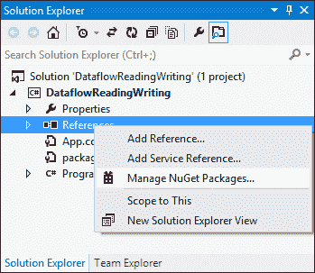
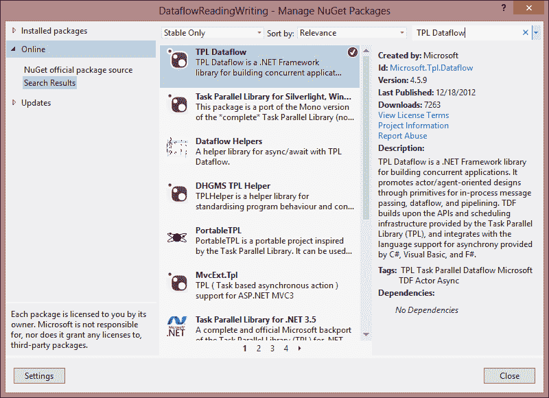
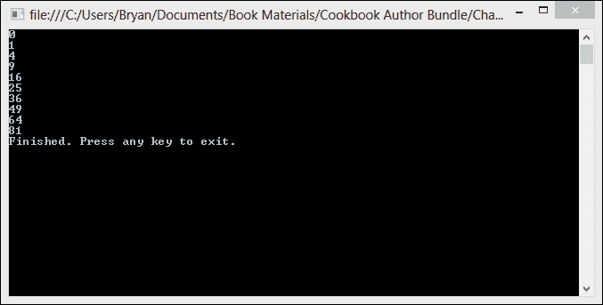
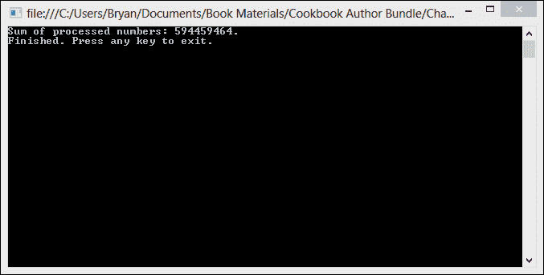
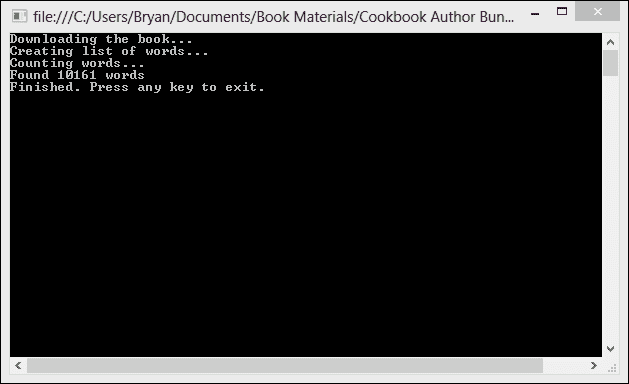
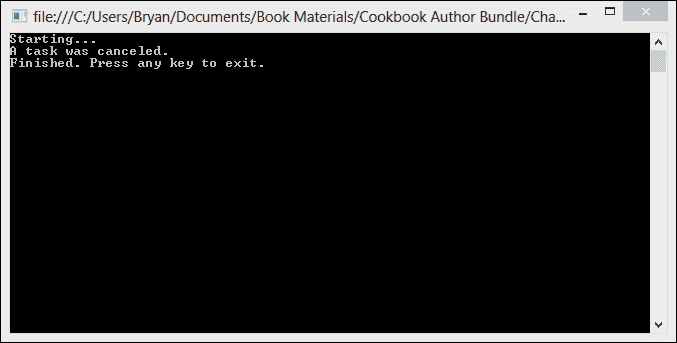
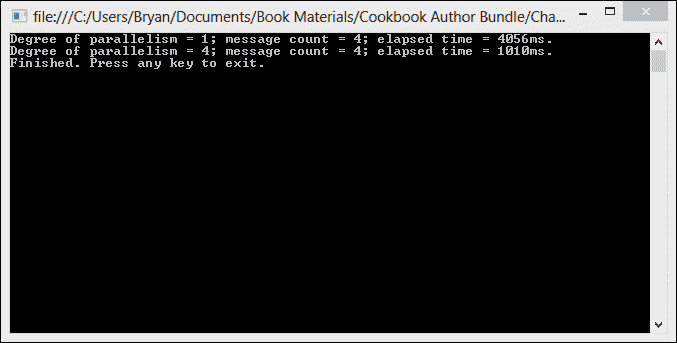
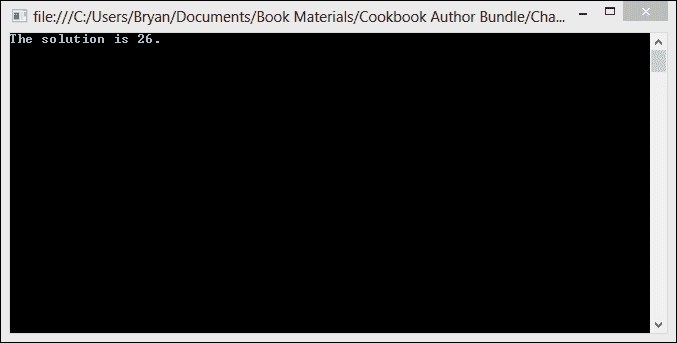
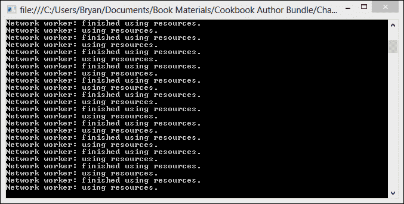

# 第九章 数据流库

在本章中，我们将介绍以下食谱：

+   同步从数据流块读取和写入

+   异步从数据流块读取和写入

+   实现生产者-消费者数据流模式

+   创建数据流管道

+   取消数据流块

+   指定并行度

+   断开数据流块链接

+   使用 `JoinBlock` 从多个数据源读取

# 简介

任务并行库（TPL）的数据流是一个旨在提高高度并发应用程序鲁棒性的新库。TPL 数据流使用异步消息传递和管道化，以获得比手动线程更好的控制和性能。

数据流由一系列块组成。每个块都可以是数据源或目标。数据通常通过将数据发布到传播块（实现 `ISourceBlock<T>` 和 `ITargetBlock<T>` 的块）进入数据流。源块可以连接到其他目标或传播块。数据异步地从链中的第一个块流向下一个块。数据在源或目标块中缓冲，直到需要时。

预定义的块分为三类。有缓冲块，用于存储数据以供数据消费者使用；有执行块，为每条接收到的数据调用用户提供的委托；还有分组块，将来自一个或多个源的数据在各种约束下组合起来。

TPL 数据流库提供了三种类型的缓冲块。有 `System.Threading.Tasks.Dataflow.BufferBlock<T>` 类，`System.Threading.Tasks.Dataflow.BroadcastBlock<T>` 类，以及 `System.Threading.Tasks.Dataflow.WriteOnceBlock<T>` 类。`BufferBlock<T>` 类是一个通用异步消息类。`BufferBlock<T>` 存储一个 **先进先出**（**FIFO**）队列的消息，可以由多个源写入或由多个目标读取。

`BroadcastBlock<T>` 类在将多个消息传递给另一个组件，或将消息传递给多个组件时很有用。

`WriteOnceBlock<T>` 类与 `BroadcastBlock<T>` 类类似，但 `WriteOnceBlock<T>` 对象只能写入一次。

TPL 数据流库提供了三种类型的执行块。有 `ActionBlock<TInput>` 类，`System.Threading.Tasks.Dataflow.TransformBlock<TInput, TOutput>` 类，以及 `System.Threading.Tasks.Dataflow.TransformManyBlock<TInput, TOutput>` 类。

`ActionBlock<TInput>` 类是一个目标块，在接收到数据时调用委托。你可以将 `ActionBlock<TInput>` 对象视为一个在数据可用时异步运行的委托。

`TransformBlock<TInput, TOutput>` 类类似于 `ActionBlock<TInput>` 类，但它同时作为源和目标。

`TransformManyBlock<TInput, TOutput>`类与`TransformBlock<TInput, TOutput>`类相似，但`TransformManyBlock<TInput, TOutput>`对每个输入值产生零个或多个输出值，而不是每个输入值只产生一个输出值。

TPL 数据流库还提供了三种类型的连接块。有`BatchBlock<T>`类、`JoinBlock<T1, T2>`类和`BatchedJoinBlock<T1, T2>`类。

`BatchBlock<T>`类将输入数据集（称为批次）组合成输出数据数组。

`JoinBlock<T1, T2>`和`JoinBlock<T1, T2, T3>`类收集输入元素，并传播出包含这些元素的`System.Tuple<T1, T2>`或`System.Tuple<T1, T2, T3>`对象。

`BatchedJoinBlock<T1, T2>`和`BatchedJoinBlock<T1, T2, T3>`类收集输入元素批次，并传播出包含这些元素的`System.Tuple(IList(T1), IList(T2))`或`System.Tuple(IList(T1), IList(T2), IList(T3))`对象。

数据流库的基础架构建立在.NET 4.5 的并行任务库之上。这些数据流组件在您有多个必须异步相互通信的操作或您想处理可用数据时非常有用。

# 同步从数据流块读取和写入

通过调用块的`Post<TInput>`方法来同步将消息写入数据流块。让我们使用块的`Receive`方法来接收数据。

在这个菜谱中，我们将创建一个使用`for`循环同步将一些数字写入`BufferBlock`的`Console`应用程序，使用`Post`方法。然后，应用程序使用`Receive`方法从`BufferBlock`读取数据，并将数据写入`Console`。

## 准备中…

TPL 数据流库不与 TPL 一起分发。要在您的解决方案中使用 TPL 数据流库，您需要使用 NuGet 包管理器来设置您的引用。

1.  在 Visual Studio 2012 中创建您的全新项目后，转到**解决方案资源管理器**，右键单击**引用**，然后单击**管理 NuGet 包**。

1.  在 NuGet 包管理器窗口中，点击左侧菜单中的**在线**，并搜索**TPL Dataflow**。

## 如何操作…

让我们创建一个新的`Console`应用程序，以便我们可以看到如何创建数据流块并将其同步写入。

1.  使用**控制台应用程序**项目模板启动一个新项目，并将**解决方案名称**设置为`Dataflow ReadingWriting`。

1.  接下来，转到**解决方案资源管理器**，右键单击**引用**，点击**管理 NuGet 包**，并添加对**TPL Dataflow**库的引用。

1.  打开`Program.cs`文件，并将以下`using`指令添加到`Program`类的顶部。

    ```cs
    using System;
    using System.Threading.Tasks.Dataflow;
    ```

1.  在`Program`类的`Main`方法中，创建一个`BufferBlock<int>`对象。

    ```cs
    var bufferingBlock = new BufferBlock<int>();
    ```

1.  现在，让我们创建一个从零到十的循环，并使用`Post`方法将循环索引器的平方写入缓冲块。

    ```cs
    for (int i = 0; i < 10; i++)
    {
      bufferingBlock.Post(i*i);
    }
    ```

1.  现在，让我们创建另一个从零到十的循环，在每次迭代中调用缓冲块的`Receive`方法，并将结果写入`Console`。

    ```cs
    for (int i = 0; i < 10; i++)
    {
      Console.WriteLine(bufferingBlock.Receive.ToString());
    }
    ```

1.  最后，向`Console`应用程序发送消息并等待用户输入后再退出。

    ```cs
    Console.WriteLine("Finished. Press any key to exit.");
    Console.ReadLine();
    ```

1.  在 Visual Studio 2012 中，按*F5*运行项目。点击**开始**按钮，您的应用程序应该如图所示：

## 它是如何工作的…

这个简单的示例展示了如何直接从消息块读取和写入。更常见的情况是，您将连接数据流块以形成管道，或线性序列的块。

直接向块写入是一个相当简单的事情；您只需要调用`Post<TInput>`方法。

```cs
bufferingBlock.Post(i*i);
```

`Post`方法同步执行，并在目标块决定接受或拒绝项目后返回。

相反，可以通过调用`Receive`方法直接从`bufferingBlock`接收数据。

```cs
bufferingBlock.Receive()
```

`Receive`方法有几个方便的重载，可以接受超时时间、`CancellationToken`或两者。

# 异步从数据流块读取和写入

向数据流块异步发送消息是通过调用块的`SendAsync<TInput>`方法来完成的。您使用块的`ReceiveAsync`方法来接收数据。

在这个菜谱中，我们将创建一个使用`for`循环异步将一些数字写入`BufferBlock`的`Console`应用程序，使用`SendAsync`方法。然后，应用程序使用`ReceiveAsync`方法从`BufferBlock`读取数据，并将数据写入`Console`。

## 如何做…

1.  使用**控制台应用程序**项目模板启动一个新的项目，并将`Solution name`设置为`Dataflow ReadWriteAsync`。

1.  接下来，转到**解决方案资源管理器**，右键单击**引用**，点击**管理 NuGet 包**，并将 TPL 数据流库添加为引用。

1.  打开`Program.cs`，并将以下`using`指令添加到`Program`类的顶部：

    ```cs
    using System;
    using System.Threading.Tasks.Dataflow;
    using System.Threading.Tasks;
    ```

1.  现在，让我们创建一个返回`Task`的`static async`方法，命名为`WriteDataAsync`。该方法接受一个`BufferBlock<int>`参数，并使用一个`for`循环从零迭代到十。在循环的每次迭代中，我们需要使用`SendAsync`方法将循环索引器的平方写入`bufferingBlock`。

    ```cs
    private static async Task WriteDataAsync(BufferBlock<int> bufferingBlock)
    {
      // Post some messages to the block. 
      for (int i = 0; i < 10; i++)
      {
        await bufferingBlock.SendAsync(i * i);
      }
    }
    ```

1.  接下来，让我们创建一个返回`Task`的`static async`方法，命名为`ReadDataAsync`。该方法接受一个`BufferBlock<int>`参数，并使用一个`for`循环从`BufferBlock`读取数据并将其显示到`Console`。

    ```cs
    private static async Task ReadDataAsync(BufferBlock<int> bufferingBlock)
    {
      // Receive the messages back . 
      for (int i = 0; i < 10; i++)
      {
        Console.WriteLine(await bufferingBlock.ReceiveAsync());
      }
    }
    ```

1.  最后，让我们创建`Main`方法的实现。在这里，我们只需要等待对`WriteDataAsync`和`ReadDataAsync`的调用。我们还需要在退出前等待用户输入。

    ```cs
    static void Main(string[] args)
    {
      // Create a BufferBlock object. 
      var bufferingBlock = new BufferBlock<int>();
      WriteDataAsync(bufferingBlock).Wait();
      ReadDataAsync(bufferingBlock).Wait();

      Console.WriteLine("Finished. Press any key to exit.");
      Console.ReadLine();
    }
    ```

1.  现在，在 Visual Studio 2012 中，按 *F5* 运行项目。点击 **开始** 按钮。你的应用程序应该如图所示：

## 它是如何工作的…

此应用程序使用 `SendAsync` 方法异步地向 `BufferBlock<int>` 对象写入，并使用 `ReceiveAsync` 方法从同一个对象读取。我们还使用 `async` 和 `await` 操作符将数据发送到目标块并从目标块读取数据。

注意，`ReadDataAsync` 和 `WriteDataAsync` 方法都被标记为 `async`，返回类型为 `Task`。我们使用 `await` 关键字异步调用 `SendAsync` 和 `ReceiveAsync`。

```cs
private static async Task ReadDataAsync(BufferBlock<int> bufferingBlock)
{            
  for (int i = 0; i < 10; i++)
  {
    Console.WriteLine(await bufferingBlock.ReceiveAsync());
  }
}
```

当数据可用时，`ReceiveAsync` 方法特别有用，当你想要对数据进行操作时。

# 实现生产者-消费者数据流模式

TPL 数据流块也可以用于生产者-消费者模式，其中生产者向一个块发送消息，消费者从这个块读取消息。

在这个菜谱中，我们将创建一个 `控制台` 应用程序来演示使用数据流的基本生产者-消费者模式。生产者将使用 `for` 循环创建一些随机数字并将它们添加到 `BufferBlock<int>`。消费者任务将异步地接收 `BufferBlock` 中的数据，并在数据可用时返回所有数字的总和。

## 如何操作…

让我们创建另一个 `控制台` 应用程序，看看我们如何使用数据流块实现生产者-消费者模式。

1.  使用 **控制台应用程序** 项目模板创建一个新的项目，并将 `Dataflow ProducerConsumer` 作为 **解决方案名称**。

1.  接下来，转到 **解决方案资源管理器**，右键单击 **引用**，单击 **管理 NuGet 包**，并将对 **TPL Dataflow** 库的引用添加到其中。

1.  打开 `Program.cs` 并将以下 `using` 指令添加到 `Program` 类的顶部。

    ```cs
    using System;
    using System.Threading.Tasks.Dataflow;
    using System.Threading.Tasks;
    ```

1.  让我们从在 `Program` 类上创建一个名为 `Produce` 的 `static` 方法开始。此方法返回 `void`，并接受一个类型为 `ITargetBlock<int>` 的参数。此方法将使用 `for` 循环生成随机数字，然后使用 `Post` 方法将它们发送到块。当 `Produce` 方法完成添加后，它将调用块上的 `Complete` 方法。

    ```cs
    static void Produce(ITargetBlock<int> target)
    {
      // Create a Random object.
      Random rand = new Random();

      // fill a buffer with random data  
      for (int i = 0; i < 100; i++)
      {
        // get the next random number 
        int number = rand.Next();

        // Post the result .
        target.Post(number);
      }

      // Set the target to the completed state
      target.Complete();
    }
    ```

1.  接下来，让我们创建一个名为 `ConsumeAsync` 的方法。正如你可能从方法名中猜到的，这是一个返回 `Task<int>` 的 `async` 方法。`ConsumeAsync` 方法需要一个类型为 `ISourceBlock<int>` 的参数。此方法使用 `while` 循环从块中获取数据，当数据可用时产生数字的总和。

    ```cs
    static async Task<int> ConsumeAsync(ISourceBlock<int> source)
    {
      // Initialize a counter to track the sum. 
      int sumOfProcessed = 0;

      // Read from the source buffer until empty
      while (await source.OutputAvailableAsync())
      {
        int data = source.Receive();

        // calculate the sum.
        sumOfProcessed += data;
      }

      return sumOfProcessed;
    }
    ```

1.  好的，让我们通过实现 `Program` 类的 `Main` 方法来完成。这个方法只需要启动 `producer` 和 `consumer`，并在完成后显示结果。

    ```cs
    static void Main(string[] args)
    {  
      var buffer = new BufferBlock<int>();

      // Start the consumer.   
      var consumer = ConsumeAsync(buffer);

      // Post source data.
      Produce(buffer);

      // Wait for the consumer to process data.
      consumer.Wait();

      // Print the count of bytes processed to the console.
      Console.WriteLine("Sum of processed numbers: {0}.", consumer.Result);
      Console.WriteLine("Finished. Press any key to exit.");
      Console.ReadLine();
    }
    ```

1.  在 Visual Studio 2012 中，按 *F5* 运行项目。你的应用程序应该如图所示：

## 它是如何工作的…

`Produce` 方法非常直接。我们声明了一个接口类型 `ITargetBlock<TInput>` 的参数。`ITargetBlock` 是由 `BufferBlock` 实现的接口，它表示一个数据流块，是数据的目标。

`Produce` 方法仅使用 `for` 循环通过 `Post` 方法将数据发送到目标块。在完成添加数据后，它调用完成方法来表示操作已完成。

```cs
static void Produce(ITargetBlock<int> target)
{
  ... 
  for (int i = 0; i < 100; i++)
  {
    ...
    target.Post(number);
  }.
  target.Complete();
}
```

`ConsumeAsync` 接受一个接口类型 `ISourceBlock` 的参数，该接口表示一个数据流块，它是数据源。为了异步操作，`ConsumeAsync` 方法调用 `OutputAvailiableAsync` 方法以在源块完成时接收通知，并且源块将不会有额外的数据。除此之外，它只是使用 `Receive` 方法接收数据并汇总结果。

```cs
static async Task<int> ConsumeAsync(ISourceBlock<int> source)
{
  ...
  while (await source.OutputAvailableAsync())
  {
    int data = source.Receive();
      sumOfProcessed += data;
  }
  return sumOfProcessed;
}
```

# 创建数据流管道

如我们所见，您可以使用 `Post`、`Receive` 和 `RecieveAsync` 从源块发送和接收消息。您还可以将消息块连接起来形成一个数据流管道。数据流管道是一系列数据流块，每个块执行特定任务并为更大的目标做出贡献。管道中的每个块在接收到来自另一个数据流块的消息时执行其工作。

在这个菜谱中，我们将再次回到我们的 WordCount 示例。我们将创建一个 `Console` 应用程序，该应用程序形成一个数据流管道以下载经典书籍的内容，过滤掉书籍内容中的小单词，并返回单词计数。

## 如何实现...

现在，让我们看看如何将数据流块链接起来形成一个管道。

1.  使用 **控制台应用程序** 项目模板创建一个新的项目，并将 `DataflowPipeline` 作为 **解决方案名称**。

1.  接下来，转到 **解决方案资源管理器**，右键单击 **引用**，单击 **管理 NuGet 包**，并添加对 **TPL Dataflow** 库的引用。

1.  打开 `Program.cs` 并将以下 `using` 指令添加到 `Program` 类的顶部：

    ```cs
    using System;
    using System.Linq;
    using System.Threading.Tasks.Dataflow;
    using System.Net;
    ```

1.  第一步是创建参与管道的数据流块。在 `Main` 方法中，创建一个 `TransformBlock<string,string>`，它接受字符串输入参数并使用 `WebClient` 将书籍内容作为字符串下载。

    ```cs
    // Download a book as a string
    var downloadBook = new TransformBlock<string, string>(url =>
    {
      Console.WriteLine("Downloading the book...");

      return new WebClient().DownloadString(url);
    });
    ```

1.  接下来，让我们添加 `TransformBlock<string, string[]>`，它接收前一个块的输出，删除空格，并将单词拆分到一个字符串数组中。

    ```cs
    // splits text into an array of strings. 
    var createWordList = new TransformBlock<string, string[]>(text =>
    {
      Console.WriteLine("Creating list of words...");

      // Remove punctuation  
      char[] tokens = text.ToArray();
      for (int i = 0; i < tokens.Length; i++)
      {
        if (!char.IsLetter(tokens[i]))
          tokens[i] = ' ';
      }
      text = new string(tokens);

      return text.Split(new char[] { ' ' },
         StringSplitOptions.RemoveEmptyEntries);
    });
    ```

1.  好的，让我们创建一个 `TransformBlock<string[],int>`，该块过滤掉少于三个字符的单词，并返回单词的计数。

    ```cs
    // Remove short words and return the count 
    var filterWordList = new TransformBlock<string[], int>(words =>
    {
      Console.WriteLine("Counting words...");

      var wordList = words.Where(word => word.Length > 3).OrderBy(word => word)
         .Distinct().ToArray();
      return wordList.Count();
    });
    ```

1.  最后，让我们创建 `ActionBlock<int>` 来将单词计数显示到 `Console`。

    ```cs
    var printWordCount = new ActionBlock<int>(wordcount =>
    {
      Console.WriteLine("Found {0} words",
         wordcount);
    });
    ```

1.  现在，让我们使用 `LinkTo` 方法将源块和目标块连接起来形成管道。

    ```cs
    downloadBook.LinkTo(createWordList);
    createWordList.LinkTo(filterWordList);
    filterWordList.LinkTo(printWordCount);
    ```

1.  接下来，我们需要添加一些完成任务，以便每个数据流块在处理完所有数据元素后执行最终操作。

    ```cs
    downloadBook.Completion.ContinueWith(t =>
    {
      if (t.IsFaulted) ((IDataflowBlock)createWordList).Fault(t.Exception);
      else createWordList.Complete();
    });
    createWordList.Completion.ContinueWith(t =>
    {
      if (t.IsFaulted) ((IDataflowBlock)filterWordList).Fault(t.Exception);
      else filterWordList.Complete();
    });
    filterWordList.Completion.ContinueWith(t =>
    {
      if (t.IsFaulted) ((IDataflowBlock)printWordCount).Fault(t.Exception);
      else printWordCount.Complete();
    });
    ```

1.  最后，让我们在 `Main` 方法中添加一些代码来发布数据到管道，完成管道活动，等待管道完成，并在退出之前等待用户输入。

    ```cs
    // Download Origin of Species
    downloadBook.Post("http://www.gutenberg.org/files/2009/2009.txt");

    // Mark the head of the pipeline as complete. 
    downloadBook.Complete();

    printWordCount.Completion.Wait();

    Console.WriteLine("Finished. Press any key to exit.");
    Console.ReadLine();
    ```

1.  在 Visual Studio 2012 中，按 *F5* 运行项目。你的应用程序应该显示如下截图所示的结果：

## 它是如何工作的…

在这个应用程序中，我们使用了 `TransformBlock<TInput, TOutput>` 来使管道的每个成员能够对其输入数据执行操作并将结果发送到管道的下一步。例如，`downloadBook TransformBlock` 接收字符串输入并返回字符串输出到下一步。

```cs
var downloadBook = new TransformBlock<string, string>(uri =>
{
  ...
  return new WebClient().DownloadString(uri);
});
```

唯一的例外是管道的尾部是 `ActionBlock<TInput>`，因为它对其输入执行操作但不产生结果。

下一步是将管道中的每个块连接到下一个。`DataflowBlock` 的 `LinkTo` 方法用于将 `ISourceBlock<TOutput>` 连接到 `TargetBlock<TInput>`。当你调用 `LinkTo` 方法将源连接到目标时，源将在数据可用时将数据传播到目标。

```cs
downloadBook.LinkTo(createWordList);
createWordList.LinkTo(filterWordList);
filterWordList.LinkTo(printWordCount);
```

我们还添加了一些完成任务以通过管道传播完成状态。每个完成任务都将下一个数据流块设置为完成状态。

```cs
downloadBook.Completion.ContinueWith(t =>
{
  if (t.IsFaulted) ((IDataflowBlock)createWordList).Fault(t.Exception);
  else createWordList.Complete();
});
```

最后，我们使用 `DataflowBlock.Post<TInput>` 同步将数据发送到管道的头部。以下是我们正在下载的书籍的 URL 字符串：

```cs
downloadBook.Post("http://www.gutenberg.org/files/2009/2009.txt");
```

# 取消数据流块

由于数据流块建立在 TPL 的 `Task` 基础设施之上，因此可以通过从 `CancellationTokenSource` 获取 `CancellationToken` 来支持取消操作。

在这个菜谱中，我们将创建一个数据流管道以下载经典书籍的内容并执行词频统计，但这次，我们将启用构成管道的块可以取消。

## 如何操作…

让我们看看如何将取消操作添加到我们的数据流块中。

1.  使用 **控制台应用程序** 项目模板创建一个新的项目，并将 `Solution name` 设置为 `CancelDataflow`。

1.  接下来，转到 **解决方案资源管理器**，右键单击 **引用**，单击 **管理 NuGet 包**，并添加对 **TPL Dataflow** 库的引用。

1.  打开 `Program.cs` 并将以下 `using` 指令添加到 `Program` 类的顶部：

    ```cs
    using System;
    using System.Linq;
    using System.Threading.Tasks.Dataflow;
    using System.Net;
    using System.Threading;
    ```

1.  在 `Main` 方法中，创建一个新的 `CancellationTokenSource` 对象。

    ```cs
    var cancellationSource = new CancellationTokenSource();
    ```

1.  接下来，让我们创建构成管道的块。这些块与之前完全相同，只是这次它们是用一个新的 `ExecutionDataflowBlockOptions` 参数创建的，该参数设置 `CancellationToken`。

    ```cs
    // Download a book as a string
    var downloadBook = new TransformBlock<string, string>(uri =>
    {
      Console.WriteLine("Downloading the book...");

      return new WebClient().DownloadString(uri);
    },
    new ExecutionDataflowBlockOptions
    {
      CancellationToken = cancellationSource.Token
    });

    // splits text into an array of strings. 
    var createWordList = new TransformBlock<string, string[]>(text =>
    {
      Console.WriteLine("Creating list of words...");

      // Remove punctuation  
      char[] tokens = text.ToArray();
      for (int i = 0; i < tokens.Length; i++)
      {
        if (!char.IsLetter(tokens[i]))
          tokens[i] = ' ';
      }
      text = new string(tokens);
      return text.Split(new char[] { ' ' },
         StringSplitOptions.RemoveEmptyEntries);
    },
    new ExecutionDataflowBlockOptions
    {
      CancellationToken = cancellationSource.Token
    });

    // Remove short words and return the count 
    var filterWordList = new TransformBlock<string[], int>(words =>
    {
      Console.WriteLine("Counting words...");

      var wordList = words.Where(word => word.Length > 3).OrderBy(word => word)
         .Distinct().ToArray();
      return wordList.Count();
    },
    new ExecutionDataflowBlockOptions
    {
      CancellationToken = cancellationSource.Token
    });

    var printWordCount = new ActionBlock<int>(wordcount =>
    {
      Console.WriteLine("Found {0} words",
         wordcount);
    },
    new ExecutionDataflowBlockOptions
    {
      CancellationToken = cancellationSource.Token
    });
    ```

1.  现在，让我们使用 `LinkTo` 方法将源块和目标块连接起来以形成管道。

    ```cs
    downloadBook.LinkTo(createWordList);
    createWordList.LinkTo(filterWordList);
    filterWordList.LinkTo(printWordCount);
    ```

1.  接下来，我们需要添加一些完成任务，以便每个数据流块在处理完所有数据元素后执行最终操作。

    ```cs
    downloadBook.Completion.ContinueWith(t =>
    {
      if (t.IsFaulted) ((IDataflowBlock)createWordList).Fault(t.Exception);
      else createWordList.Complete();
    });
    createWordList.Completion.ContinueWith(t =>
    {
      if (t.IsFaulted) ((IDataflowBlock)filterWordList).Fault(t.Exception);
      else filterWordList.Complete();
    });
    filterWordList.Completion.ContinueWith(t =>
    {
      if (t.IsFaulted) ((IDataflowBlock)printWordCount).Fault(t.Exception);
      else printWordCount.Complete();
    });
    ```

1.  现在，添加一个 `try` 块将数据发布到管道的头部，完成管道活动，并取消令牌。

    ```cs
    try
    {
      Console.WriteLine("Starting...");                

      // Download Origin of Species
      downloadBook.Post("http://www.gutenberg.org/files/2009/2009.txt");

      // Mark the head of the pipeline as complete. 
      downloadBook.Complete();

      // Cancel the operation
      cancellationSource.Cancel();

      printWordCount.Completion.Wait();

    }
    ```

1.  最后，添加一个处理 `AggregateException` 的 `catch` 块和一个在退出前等待用户输入的 `finally` 块。

    ```cs
    catch (AggregateException ae)
    {
      foreach (Exception ex in ae.InnerExceptions)
      {
        Console.WriteLine(ex.Message);
      }
    }
    finally
    {
      Console.WriteLine("Finished. Press any key to exit.");
      Console.ReadLine();
    }
    ```

1.  在 Visual Studio 2012 中，按 *F5* 运行项目。你的应用程序应该如图所示：

## 它是如何工作的…

此应用程序形成一个数据流管道来处理书籍的内容，并返回与前面配方中相同的单词计数。不同之处在于，我们通过创建一个 `CancellationTokenSource` 对象来设置取消，然后设置与我们的管道中的块关联的 `ExecutionDataflowBlockOptions` 对象的 `CancellationToken` 属性。

```cs
CancellationTokenSource cancellationSource = new CancellationTokenSource();            

var downloadBook = new TransformBlock<string, string>(uri =>
{
  ...

  return new WebClient().DownloadString(uri);
},
new ExecutionDataflowBlockOptions
{
  CancellationToken = cancellationSource.Token
});
```

我们将 `ExecutionDataflowBlockOptions` 对象的 `CancellationToken` 属性设置为从 `CancellationTokenSource` 对象获得的 `CancellationToken`。

与 TPL 中的所有其他取消一样，我们需要处理 `OperationCancelled` 异常，该异常将被包装在 `AggregateException` 对象中。

```cs
catch (AggregateException ae)
{
  foreach (Exception ex in ae.InnerExceptions)
  {
    Console.WriteLine(ex.Message);
  }
}
```

# 指定并行度

在前面的配方中，我们看到了如何使用 `ExecutionDataflowBlockOptions` 对象的 `CancellationToken` 属性来启用管道的取消。在这个配方中，我们将看到如何使用 `MaxDegreeOfParallelism` 属性来启用数据流块一次处理多个消息。

我们将创建一个执行两个数据流计算的 `Console` 应用程序，并打印每个计算的耗时。第一个计算将最大并行度设置为 1。第二个操作与第一个相同，但将最大并行度设置为机器上可用的处理器数量。

## 如何实现...

现在，让我们看看如何向我们的数据流块添加取消功能。

1.  使用 **Console Application** 项目模板创建一个新的项目，并将 `DegreeOfParallelism` 作为 **解决方案名称**。

1.  接下来，转到 **解决方案资源管理器**，右键单击 **引用**，单击 **管理 NuGet 包**，并添加对 **TPL Dataflow** 库的引用。

1.  打开 `Program.cs` 文件，并将以下 `using` 指令添加到 `Program` 类的顶部：

    ```cs
    using System;
    using System.Diagnostics;
    using System.Threading;
    using System.Threading.Tasks.Dataflow;
    ```

1.  让我们从在 `Program` 类上创建一个名为 `ComputeTime` 的 `static` 方法开始。该方法需要接受一个 `maxDegreeOfParallelism` 的 `integer` 参数和一个 `messageCount` 的 `integer` 参数。

    ```cs
    static TimeSpan ComputeTime(int maxDegreeOfParallelism, int messageCount)
    {

    }
    ```

1.  在 `ComputeTime` 方法中，创建一个 `ActionBlock<int>`，它只是休眠 `integer` 参数的时间段。`ActionBlock` 还需要使用 `ExecutionDataflowBlockOptions` 参数，并将 `MaxDegreeOfParallelism` 属性设置为方法参数的值。

    ```cs
    var actionBlock = new ActionBlock<int>(
      millisecondsTimeout => Thread.Sleep(millisecondsTimeout),
      new ExecutionDataflowBlockOptions
      {
         MaxDegreeOfParallelism = maxDegreeOfParallelism
      });
    ```

1.  让我们通过创建一个 `Stopwatch` 对象，使用 `for` 循环将数据发布到操作块，完成操作块，并返回耗时来完成 `ComputeTime` 方法。

    ```cs
    Stopwatch sw = new Stopwatch();
    sw.Start();

    for (int i = 0; i < messageCount; i++)
    {
    	actionBlock.Post(1000);
    }
    actionBlock.Complete();
    actionBlock.Completion.Wait();
    sw.Stop();

    return sw.Elapsed;
    ```

1.  接下来，我们需要实现 `Main` 方法。让我们首先获取机器的处理器数量；调用 `ComputeTime` 方法两次（一次将 `maxDegreeOfParallelism` 参数设置为 一，另一次设置为处理器数量），并显示结果。

    ```cs
    static void Main(string[] args)
    {
      int processorCount = Environment.ProcessorCount;
      int messageCount = processorCount;
      TimeSpan elapsedTime;
      elapsedTime = ComputeTime(1, messageCount);
      Console.WriteLine("Degree of parallelism = {0}; message count = {1}; " +
         "elapsed time = {2}ms.", 1, messageCount, (int)elapsedTime.TotalMilliseconds);

      elapsedTime = ComputeTime(processorCount, messageCount);
      Console.WriteLine("Degree of parallelism = {0}; message count = {1}; " +
         "elapsed time = {2}ms.", processorCount, messageCount, (int)elapsedTime.TotalMilliseconds);

      Console.WriteLine("Finished. Press any key to exit.");
      Console.ReadLine();
    }
    ```

1.  在 Visual Studio 2012 中，按 *F5* 运行项目。您的应用程序应该有如下截图所示的结果：

## 它是如何工作的...

在这个配方中，我们只是使用 `ComputeTime` 方法将 `ActionBlock<int>` 的最大并行度设置为 `maxDegreeOfParallelism` 方法参数的值。

```cs
static TimeSpan ComputeTime(int maxDegreeOfParallelism, int messageCount)
{
  var actionBlock = new ActionBlock<int>(
     millisecondsTimeout => Thread.Sleep(millisecondsTimeout),
     new ExecutionDataflowBlockOptions
     {
       MaxDegreeOfParallelism = maxDegreeOfParallelism
     });
   ...

}
```

我们调用此方法两次，一次将 `maxDegreeOfParallelism` 参数设置为 一，另一次设置为机器的处理器数量。

当并行度为一时，数据流块会顺序处理消息，而当并行度大于一时，数据流块可以并行处理消息。

# 取消链接数据流块

我们之前已经看到如何将数据流块链接在一起以形成一个管道。这个配方将展示如何将数据流块从其源中取消链接。

我们将通过创建一个 `Console` 应用程序来展示如何取消链接数据流块，该应用程序创建三个转换块，每个转换块都调用一个执行计算的方法。转换块对象将分别链接到一个 `WriteOnceBlock<T>` 对象，其 `MaxMessages` 属性设置为 一。这将指示源块在目标接收第一条消息后取消链接。

## 如何操作...

1.  使用 **控制台应用程序** 项目模板创建一个新的项目，并将 `DegreeOfParallelism` 作为 **解决方案名称**。

1.  接下来，转到 **解决方案资源管理器**，右键单击 **引用**，单击 **管理 NuGet 包**，并添加对 **TPL Dataflow** 库的引用。

1.  打开 `Program.cs` 并将以下 `using` 指令添加到 `Program` 类的顶部：

    ```cs
    using System;
    using System.Threading;
    using System.Threading.Tasks.Dataflow;
    ```

1.  首先，让我们创建一个名为 `DoCalculation` 的 `static` 方法。此方法接受 `integer` 和 `CancellationToken` 作为参数，并返回 `integer`。此方法将模拟一个耗时几秒钟才能完成的长时间计算，然后返回一个相当随机的值。

    ```cs
    static int DoCalculation(int n, CancellationTokenSource tokenSource)
    {  
      // simulate a workload and return result
      SpinWait.SpinUntil(() => tokenSource.IsCancellationRequested,
        new Random().Next(2000));
      return n + 5;
    }
    ```

1.  接下来，让我们创建另一个名为 `ReceiveFromAny<T>` 的 `static` 方法。此方法将接受一个 `ISourceBlock<T>` 参数数组，并返回 `T`。此方法将从 `source` 数组中的第一个返回值的源接收一个值。它将创建一个新的 `WriteOnceBlock<T>` 并将其链接到每个源块，使用 `DataFlowLinkOptions` 参数和 `MaxMessages` 属性设置为 一。最后，它将接收由 `WriteOnceBlock` 产生的值。

    ```cs
    public static T ReceiveFromAny<T>(params ISourceBlock<T>[] sources)
    {
      var writeOnceBlock = new WriteOnceBlock<T>(e => e);
      foreach (var source in sources)
      {
        source.LinkTo(writeOnceBlock, new DataflowLinkOptions { MaxMessages = 1 });
      }            
      return writeOnceBlock.Receive();
    }
    ```

1.  最后，让我们实现`Main`方法。`Main`需要创建一个新的`CancellationToken`对象，创建三个调用`DoCalculation`方法、将数据发送到每个`TransformBlocks`并接收结果的`System.Threading.Tasks.Dataflow.TransformBlock`对象。

    ```cs
    static void Main(string[] args)
    {

      try
      {
        var tokenSource = new CancellationTokenSource();

        Func<int, int> action = n => DoCalculation(n, tokenSource);
        var calculation1 = new TransformBlock<int, int>(action);
        var calculation2 = new TransformBlock<int, int>(action);
        var calculation3 = new TransformBlock<int, int>(action);

        calculation1.Post(11);
        calculation2.Post(21);
        calculation3.Post(31);

        int result = ReceiveFromAny(calculation1, calculation2, calculation3);

        // Cancel all calls to TrySolution that are still active.
        tokenSource.Cancel();

        // Print the result to the console.
        Console.WriteLine("The solution is {0}.", result);
      }
      catch (AggregateException) { }
      finally { Console.ReadLine(); }

    }
    ```

1.  在 Visual Studio 2012 中，按*F5*键运行项目。你的应用程序应该如图所示：

## 它是如何工作的…

此应用程序的`Main`方法负责创建我们的`TransformBlock`对象，创建`Func`以调用`DoCalculation`方法，将一些数据发送到`TransformBlocks`，并使用`TransformBlocks`作为参数调用`RecieveFromAny`。

```cs
var tokenSource = new CancellationTokenSource();

Func<int, int> action = n => DoCalculation(n, tokenSource);
var calculation1 = new TransformBlock<int, int>(action);
var calculation2 = new TransformBlock<int, int>(action);
var calculation3 = new TransformBlock<int, int>(action);

calculation1.Post(11);
calculation2.Post(21);
calculation3.Post(31);

int result = ReceiveFromAny(calculation1, calculation2, calculation3);
```

`RecieveFromAny`方法创建一个新的`WriteOnceBlock<T>`对象，使用`for`循环将`WriteOnceBlocks`链接到源`TransformBlocks`，并接收`WriteOnceBlock`产生的第一个数据。

```cs
public static T ReceiveFromAny<T>(params ISourceBlock<T>[] sources)
{
  var writeOnceBlock = new WriteOnceBlock<T>(e => e);
  foreach (var source in sources)
  {
    source.LinkTo(writeOnceBlock, new DataflowLinkOptions { MaxMessages = 1 });
  }            
  return writeOnceBlock.Receive();
}
```

使用`LinkTo`方法创建源块之间的链接，就像之前一样，但这次使用一个新的`DataflowLinkOptions`对象作为参数，并将`MaxMessages`属性设置为 1。

`MaxMessages`属性用于设置跨链接可能消耗的最大消息数。

# 使用`JoinBlock`从多个数据源读取

这个菜谱将展示如何使用`JoinBlock`在多个数据源有可用数据时执行操作。

我们将创建一个`Console`应用程序，该程序定义了两种类型的资源：`NetworkResource`和`MemoryResource`。我们将使用`NetworkResource`和`MemoryResource`对来执行操作。为了使操作在所需资源都可用时发生，我们将使用`JoinBlock<T1, T2>`。

## 如何实现…

让我们看看如何使用`JoinBlock`根据多个数据源的数据执行操作。

1.  使用**控制台应用程序**项目模板启动一个新的项目，并将`JoinBlock`分配为**解决方案名称**。

1.  接下来，转到**解决方案资源管理器**，右键单击**引用**，单击**管理 NuGet 包**，并添加对**TPL Dataflow**库的引用。

1.  打开`Program.cs`文件，并将以下`using`指令添加到`Program`类的顶部：

    ```cs
    using System;
    using System.Threading;
    using System.Threading.Tasks.Dataflow;
    ```

1.  在上面的`Program`类中的`Main`方法内部，创建一个资源`abstract`类定义，以及`MemoryResource`和`NetworkResource`的`class`定义。

    ```cs
    abstract class Resource
    {
    }

    class MemoryResource : Resource
    {
    }

    class NetworkResource : Resource
    {
    }
    ```

1.  现在，在`Main`方法中，创建一个`BufferBlock<MemoryResource>`和一个`BufferBlock<NetworkResource>`对象。

    ```cs
    var networkResources = new BufferBlock<NetworkResource>();
    var memoryResources = new BufferBlock<MemoryResource>();
    ```

1.  接下来，创建一个`JoinBlock<NetworkResource, MemoryResource>`。创建一个`GroupingDataflowBlockOptions`对象参数，并将`Greedy`属性设置为 false。

    ```cs
    var joinResources =
       new JoinBlock<NetworkResource, MemoryResource>(
        new GroupingDataflowBlockOptions
        {
          Greedy = false
        });
    ```

1.  现在我们需要创建一个`ActionBlock<Tuple<NetworkResource, MemoryResource>>`对象来模拟`NetworkResource`执行一个耗时的网络访问操作。

    ```cs
    var networkMemoryAction =
       new ActionBlock<Tuple<NetworkResource, MemoryResource>>(
        data =>
        {
          Console.WriteLine("Network worker: using resources.");
          Thread.Sleep(new Random().Next(500, 2000));
          Console.WriteLine("Network worker: finished using resources.");
          networkResources.Post(data.Item1);
          memoryResources.Post(data.Item2);
        });
    ```

1.  最后，让我们通过链接资源对象、将`JoinBlock`链接到`ActionBlock`以及向资源块发送数据来完成`Main`方法。

    ```cs
    networkResources.LinkTo(joinResources.Target1);
    memoryResources.LinkTo(joinResources.Target2);

    joinResources.LinkTo(networkMemoryAction);

    networkResources.Post(new NetworkResource());
    networkResources.Post(new NetworkResource());
    networkResources.Post(new NetworkResource());

    memoryResources.Post(new MemoryResource());

    Thread.Sleep(10000);
    Console.ReadLine();
    ```

1.  在 Visual Studio 2012 中，按 *F5* 键运行项目。你的应用程序应显示如下截图所示的结果：

## 它是如何工作的…

此应用程序从创建两个 `BufferBlock<T>` 对象开始；一个用于存储网络资源，另一个用于存储内存资源。

```cs
var networkResources = new BufferBlock<NetworkResource>();
var memoryResources = new BufferBlock<MemoryResource>();
```

然后，我们创建了一个非贪婪的 `JoinBlock`，通过将 `Greedy` 属性设置为 `false` 来将网络资源连接到内存资源。在默认的贪婪模式下，连接块会贪婪地从源中获取数据，但只有在所有必要的数据都可用时才会产生结果元组。这主要在源连接到多个连接块时非常重要。如果所有连接都贪婪地从源中获取数据，你可能会遇到数据可以满足其中一个连接的情况，但最终会被贪婪地获取并分配到多个连接中，这样就没有任何一个可以满足，因此，在更多数据到来之前，它们都不会产生结果。

```cs
var joinResources =
   new JoinBlock<NetworkResource, MemoryResource>(
    new GroupingDataflowBlockOptions
    {
      Greedy = false
   });
```

下一步是创建一个操作网络和内存资源的 `ActionBlock`。该操作仅模拟对网络资源进行长时间操作，然后释放资源回到它们的池中。

```cs
var networkMemoryAction =
   new ActionBlock<Tuple<NetworkResource, MemoryResource>>(
    data =>
    {
      ...
      Thread.Sleep(new Random().Next(500, 2000));
      ...
      networkResources.Post(data.Item1);
      memoryResources.Post(data.Item2);
    });
```

最后，我们将资源连接起来，填充资源池，并允许数据流动几秒钟。

```cs
networkResources.LinkTo(joinResources.Target1);
memoryResources.LinkTo(joinResources.Target2);
joinResources.LinkTo(networkMemoryAction);

networkResources.Post(new NetworkResource());
networkResources.Post(new NetworkResource());
networkResources.Post(new NetworkResource());

memoryResources.Post(new MemoryResource());

Thread.Sleep(10000);
```
