# 第二章：.NET Core 中的原生库

在本章中，我们将学习 ncurses 原生库以及如何在 Linux 上扩展.NET Core 的控制台功能。我们还将学习如何与现有的原生代码进行互操作。本章将介绍 ncurses 原生库以及与现有原生和 Mono 库的互操作。我们将构建一个示例原生库（C++），并学习如何创建一个实现新库和 ncurses 的应用程序。本章的目的是了解与现有库的互操作，以及通过实现 ncurses 扩展控制台功能的能力。

本章将涵盖以下主题：

+   ncurses 简介

+   与现有原生和 Mono 库的互操作

+   构建示例原生库（C++）

+   实现新库和 ncurses 的示例应用程序

# ncurses 简介

**新 curses**（**ncurses**）是一个公开可分发的函数库，用于处理文本模式下的应用程序的用户界面（**UI**）。它为终端功能创建了一个包装器。ncurses 是免费软件，但它不是开源的。它提供了创建用于逻辑计算的虚拟屏幕窗口、打印窗口等功能。用于面板、菜单和表单的库使用 ncurses 库并扩展了 ncurses 的基本功能。我们可以创建包含多个窗口、菜单、面板和表单的应用程序；窗口可以自主管理，可以提供可滚动性，甚至可以覆盖。

菜单为客户提供简单的顺序确定选择，表单允许形成易于使用的信息部分并显示窗口，面板扩展了 ncurses 管理覆盖和堆叠窗口的能力。这些都是我们可以使用 ncurses 完成的基本操作之一。随着我们的进展，我们将看到如何使用 C++构建原生库。

ncurses 随 Visual Studio Code 安装提供，我们可以从[`ftp.gnu.org/pub/gnu/ncurses/`](http://ftp.gnu.org/pub/gnu/ncurses/)下载`ncurses-6.0.tar.gz`（本书编写时的最新版本）。下载后，解压并安装 ncurses 6.0：

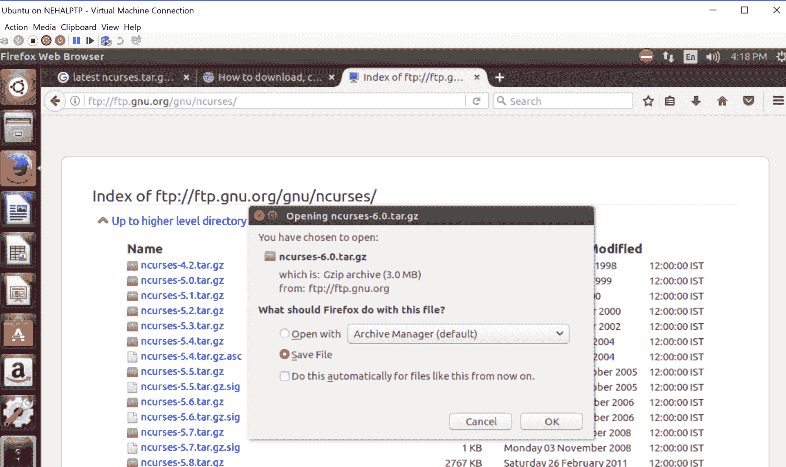

从`ncurses-6.0`文件夹打开终端，并运行以下命令安装 ncurses：

+   `./configure`：根据您的环境配置构建

+   `make`：使其完成

+   `su root`：成为 root 用户

+   `make install`：安装它

让我们从简单的应用程序`"Welcome to .NET Core 2.0"`开始，了解如何启动、使用、修改和关闭 ncurses：

```cs
#include <ncurses.h>

Void WelcomeMessage()
{
  initscr(); /* Start ncurses mode */
  printw("Welcome to .NET Core 2.0"); /* Print welcome message */
  Move(3, 2); /* moves the cursor to 3rd row and 2nd column */
  Addch('a' | A_Bold | A_UNDERLINE); /* Move() and addch() functions     
  can be replaced by mvaddch(row,col,ch); */
  refresh(); /* Print it on to the real screen */
  getch(); /* Wait for user input */
  endwin(); /* End curses mode */
}
int main()
{
  WelcomeMessage();
  return 0;
}
```

编写一个名为`WelcomeMessage()`的函数，它返回 void，并在`main`中调用它，如下例所示。让我们尝试理解在`WelcomeMessage`函数内部调用的每个函数：

+   `Initscr()`：这个函数在 curses 模式下初始化终端。通常在介绍程序时，这是主要的 curses 方法。偶尔，应该在其之前调用一些不常用的方法；这些是 `slk_init()`、`channel()`、`ripoffline()` 和 `use_env()`。对于不同的终端应用程序，`newterm()` 可能会在 `initscr()` 之前被调用。`initscr()` 代码决定终端排序并建立所有 curses 数据结构。`initscr()` 同样执行主要的调用，`refresh()`，以清除屏幕。如果出现错误，`initscr()` 会将错误信息写入标准错误并退出；否则，会返回到 `stdscr`。如果一个程序需要响应多个终端，则应该为每个终端使用 `newterm()` 例程，而不是 `initscr()`。`newterm()` 方法应该为每个终端调用一次。

+   `printw("Welcome to .NET Core 2.0")`：这个函数会在屏幕上打印 `"Welcome to .NET Core 2.0"`。`printw()` 是一类函数：

    +   **`printw()`**：这个函数与 `printf()` 类似，不同之处在于它将信息打印在名为 stdscr 的窗口上，并增加了在任何屏幕位置（当前 (*y, x*) 坐标）打印的能力。如果光标位于坐标 (0,0)，字符串将打印在窗口的左上角。

    +   `mvprintw()`：这个函数可以用来移动光标到某个位置然后打印。如果你想先移动光标然后使用 `printw()` 函数打印，先使用 `move()` 函数，然后使用 `printw()`。我认为使用 `mvprintw()` 比使用 `move()` 和 `printw()` 更好，因为它提供了更多的灵活性。

    +   **`wprintw()`** 和 **`mvwprintw()`**：这两个函数与前面两个函数类似，不同之处在于它们在作为参数给出的相应窗口中打印。

    +   `vwprintw()`：这个函数类似于 `vprintf()`。当需要打印可变数量的参数时，可以使用此函数。

早期的程序演示了使用 `printw` 的简便性。你只需将要在屏幕上显示的消息传递给函数，然后它就会按照你的意愿执行。当我们调用 `printw` 时，信息实际上是为一个虚拟窗口编写的，这个窗口还没有在屏幕上刷新。`printw` 的活动是刷新一些横幅和信息结构，并将信息写入支持文件而不是 `stdscr()`。为了在屏幕上显示它，我们必须调用 `refresh()`，并通知 curses 框架将内容输出到屏幕。背后的逻辑是允许软件开发者对虚拟屏幕或窗口进行不同的更新，并在完成所有的屏幕刷新后进行一次刷新。

所有这些函数首先传递*y*坐标，然后是*x*坐标。初学者常见的错误是按照特定的顺序传递*x*、*y*。如果你在进行大量的(*y*，*x*)坐标操作，考虑将屏幕隔离成窗口并独立控制每一个。 

+   `Move(row,col)`: 该函数`move()`通过传递行和列值将光标移动到所需位置。

+   **`Addch(ch | A_attribute)`:** 此函数用于在 stdscr 窗口的当前光标位置打印一个字符。我们可以传递属性来根据属性打印字符，例如，`addch(ch |A_Bold |A_underline)`将打印加粗和下划线的字符。以下在`<ncurses.h>`中指定的属性可以传递给`attron()`、`attroff()`和`attrset()`、`attron()`函数，`attron()`函数打开属性，相应地`attoff()`关闭属性。要设置窗口的质量，我们应该使用`attrset()`，例如，如果我们编写`attrset(A_NORMAL)`，它将设置一个没有特征的普通显示窗口，并关闭所有属性。

    我们可以使用`OR` `(|)`与传递给`addch()`的字符同时使用多个属性。如下表所示：

    | **序号** | **属性名称** | **属性用途** |
    | --- | --- | --- |
    | 1 | `A_NORMAL` | 正常显示（无高亮） |
    | 2 | `A_UNDERLINE` | 下划线 |
    | 3 | `A_BOLD` | 额外的明亮或粗体 |
    | 4 | `A_PROTECT` | 保护模式 |
    | 5 | `A_INVIS` | 不可见或空白模式 |
    | 6 | `A_ALTCHARSET` | 替代字符集 |
    | 7 | `A_CHARTEXT` | 提取字符的位掩码 |
    | 8 | `A_DIM` | 半亮度 |
    | 9 | `A_BLINK` | 闪烁 |
    | 10 | `A_REVERSE` | 反转视频 |
    | 11 | `A_STANDOUT` | 终端的最佳高亮模式 |
    | 12 | `COLOR_PAIR(n)` | 颜色对编号 *n* |

    如果我们想在特定位置或光标位置打印一个字符，可以使用以下函数，而不是使用`move()`和`addch()`函数：

    +   `mvaddch()`: 此函数通过传递光标位置来打印所需位置的字符，例如，`mvaddch(row,col,ch)`

    +   `waddch()`: 此函数用于在指定窗口中打印当前光标位置的字符

    +   `mvwaddch()`: 此函数通过传递行、列、字符和窗口来在特定窗口中打印确定的光标位置的字符

+   `refresh()`: 此函数检查窗口并仅更新已更改的位。这提高了执行效率并提供了更大的灵活性。初学者常见的错误是在通过`printw()`类函数进行一些刷新操作后没有调用`refresh()`。

+   **`getch()`:** 这个函数会等待客户端按键，除非你指定了超时时间，当客户端按下按键时，会返回相应的整数编号。此时，我们可以检查返回的值是否与 `curses.h` 中定义的常量相符，以比较所需的按键。如果是一个普通字符，整数编号将等于该字符，否则将恢复一个可以与 `curses.h` 中定义的常量相对应的数字。例如，如果客户端按下 *F1*，返回的数字是 `265`。这可以通过 `curses.h` 中定义的 `KEY_F()` 完成检查。这使得读取按键变得方便且易于管理。

+   `endwin()`: 这个函数用于结束 curses 模式，否则程序停止后我们的终端可能会出现异常行为。`endwin()` 释放了 curses 子系统和其数据结构占用的内存，并将终端置于正常模式。当完成 curses 模式时，必须调用此函数。

    程序应该在快速离开或关闭 curses 模式之前可靠地调用 `endwin()`。此函数恢复 `tty` 模式，将光标移动到屏幕的左下角，并将终端重置为最佳的非视觉模式。在短暂的逃避之后调用 `refresh()` 或 `doupdate()`，程序将进入视觉模式。`isendwin()` 例程在未调用 `wrefresh()` 的后续调用之后调用 `endwin()` 时返回 `TRUE`。

要在 Ubuntu 上运行此程序，系统上必须安装 ncurses，否则在编译时，我们将得到一个错误，指出 `ncurses.h: no such file or directory`，并且编译将终止。使用以下命令安装 ncurses：

```cs
sudo apt-get install libncurses5-dev libncursesw5-dev
```

前面的命令将最新版本的 ncurses 库安装到系统中。一旦安装完成，打开 Visual Studio Code，转到文件，然后点击新建文件——它将打开一个新未命名的页面。按照前面的例子编写代码，并将其保存到您希望的位置。重命名文件，并给它一个 `.c` 扩展名或任何适合您需求的扩展名。在这个例子中，我们创建了一个名为 `IntoToNcurses.c` 的文件。运行以下命令来执行此程序。

要编译程序，我们使用以下命令语法：

```cs
gcc  <Program_name_with_Extension> -o <Out_FileName> -lncurses
```

这里是一个例子：

```cs
gcc IntroToNcurses.c -o ExampleOfNcurses -lncurses 
```

前一个命令的输出可以在以下屏幕截图中看到：

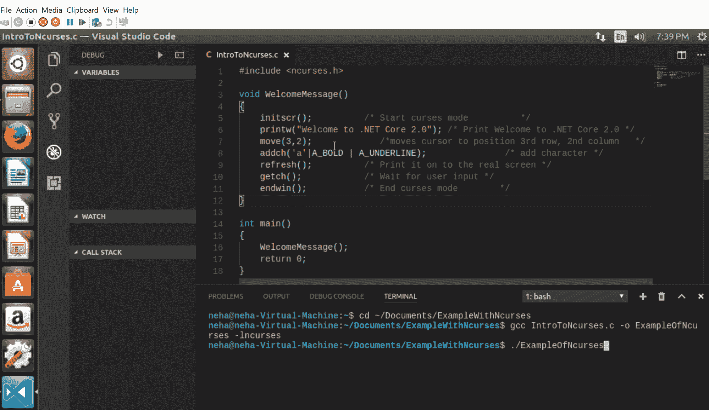

在前面的例子中，我们传递了具有 `.c` 扩展名的 C 程序。在 `-o` 命令之后，我们传递输出，或者更确切地说，是编译后的文件名。在这里，我们可以给它任何我们想要的名称，就像在这个例子中我们给 `ExampleOfNcurses` 一样。为了包含 ncurses 库，我们必须在编译时使用 `-lncurses` 链接它，否则编译将因错误 `undefined reference to functions` 而失败，因为这些函数是 ncurses 函数。

一旦编译成功，它将创建一个输出文件，如下面的屏幕截图所示：

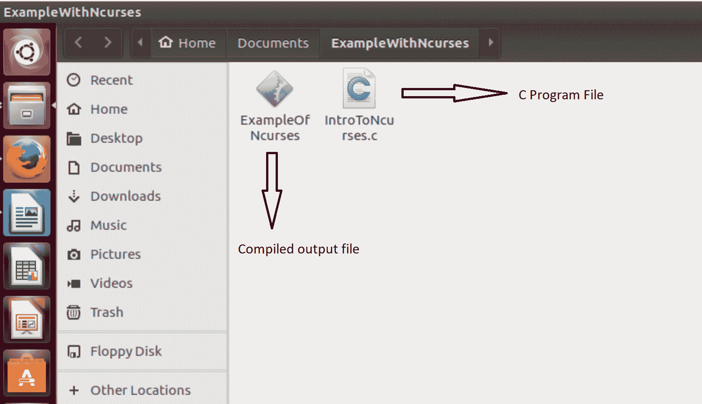

编译成功并在同一文件夹中创建输出文件后，我们可以运行我们的程序。在终端中，将输出文件名作为`./hello`传递以执行程序，如下面的截图所示：

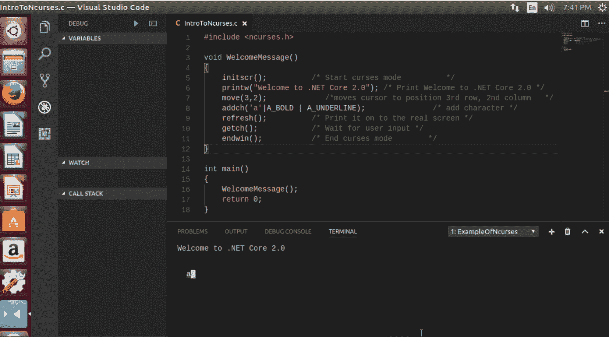

# 与现有的原生和 Mono 库进行互操作

代码重用是编程中的关键原则之一。例如，在一个应用程序中，我们可能需要多次使用某个功能，所以我们将其保存在一个有用的位置，并在需要时从该位置引用它。现在，假设我们的应用程序实现了一些可以在其他应用程序中使用的通用功能，在这种情况下，我们不必再次编写相同的逻辑，我们可以创建一个库。它易于分发和重用。

Asp.NET Core 支持跨平台编程，因此任何已经构建了许多可重用库、类似 API 的控制台支持和文件系统访问的 Linux 用户，在编写 ASP.NET Core 代码时想要使用它们，都可以访问它们。在本节中，我们将了解如何在程序中访问这些原生库（`.dll`）和 Mono 库（`.so`）。

**通用语言基础设施**（**CLI**）有助于与现有代码进行互操作。我们需要处理三个基本问题才能使事情正常工作。首先，在哪里以及如何指定库，其次，确定我们想要调用的函数，第三，传递参数。**通用语言运行时**（**CLR**）提供平台调用服务——我们称之为 P/Invoke。它使托管代码能够调用原生库（DLLs）中的 C、C++函数。让我们讨论一下平台调用是什么以及如何使用它。

# 平台调用（P/Invoke）

P/Invoke 允许我们从我们的托管代码 ASP.NET Core 2.0 中访问未管理库的结构和函数。要使用 P/Invoke API，我们使用`System.Runtime.InteropServices`命名空间。此命名空间允许我们以我们想要的方式访问属性，与原生组件一起使用。`DllImport`属性用于声明。

如果你想深入了解细节，可以在以下在线资源找到更多信息：[`www.pinvoke.net`](http://www.pinvoke.net/)。它包含了所有广泛使用的函数。

例如：`AllowSetForegroundWindow (user32)`—这通过利用`SetForegroundWindow`方法使提到的进程能够设置前台窗口；唯一条件是调用进程应该能够设置前台窗口。在 C#代码中，我们将它写成：`[DllImport("user32.dll")]`

`static extern bool AllowSetForegroundWindow(int dwProcessId);`

以下图表展示了互操作在原生和托管代码之间的位置：


例如，如果我们想使用`user32.dll`中的`AnyPopup()`方法，我们将如下使用它：

```cs
using System.Runtime.InteropServices;
public class Demo
{
    // Import user32.dll (contains the method we need) and define
    // the method corresponding to the native method
    [DllImport("user32.dll")]
    static extern bool AnyPopup();

    public static void Main(string[] args)
    {
        // Invoke the method as a regular managed method.
        AnyPopup();
    }
}
```

在这个程序中，我们使用了`DllImport`属性来调用**动态链接库**（**DLL**），我们可以使用此 DLL 中的所有方法，该 DLL 被`_declspec(dllexport)`关键字或`extern "c"`装饰。我们将在下一节中更详细地讨论从库中导入和导出方法。

# DLLImport 属性

属性`[DllImport()]`属于`DllImportAttribute`类。它提供了调用从非托管 DLL 导出的函数所需的信息。最低先决条件是我们应该传递包含入口点的 DLL 的名称。我们可以直接将此属性应用于 C#和 C++函数定义。让我们来看看`DllImport`属性内部有什么。在代码窗口中，点击`DllImport`并按*F12*键（称为转到定义）。此键绑定到 Visual Studio 中的反编译命令，如果可以的话，将反编译选定的类型。在反编译后，Visual Studio 将在新窗口中显示反编译的代码。在`DllImport`的反编译代码中，我们可以看到每个参数。代码注释非常详细，易于理解，如下所示：

```cs
namespace System.Runtime.InteropServices
{
    //
    // Summary:
    // Indicates that the attributed method is exposed by an unmanaged 
       dynamic-link
    // library (DLL) as a static entry point.
    [AttributeUsage(AttributeTargets.Method, Inherited = false)]
    public sealed class DllImportAttribute : Attribute
    {
        //
        // Summary:
        // Enables or disables best-fit mapping behavior when 
           converting Unicode characters
        // to ANSI characters.
        public bool BestFitMapping;
        //
        // Summary:
        // Indicates the calling convention of an entry point.
        public CallingConvention CallingConvention;
        //
        // Summary:
        // Indicates how to marshal string parameters to the method and 
           controls name mangling.
        public CharSet CharSet;
        //
        // Summary:
        // Indicates the name or ordinal of the DLL entry point to be 
           called.
        public string EntryPoint;
        //
        // Summary:
        // Controls whether the 
           System.Runtime.InteropServices.DllImportAttribute.CharSet
        // field causes the common language runtime to search an 
           unmanaged DLL for entry-point
        // names other than the one specified.
        public bool ExactSpelling;
        //
        // Summary:
        // Indicates whether unmanaged methods that have HRESULT or 
           retval return values
        // are directly translated or whether HRESULT or retval return 
           values are automatically
        // converted to exceptions.
        public bool PreserveSig;
        //
        // Summary:
        // Indicates whether the callee calls the SetLastError Win32 
           API function before
        // returning from the attributed method.
        public bool SetLastError;
        //
        // Summary:
        // Enables or disables the throwing of an exception on an 
           unmappable Unicode character
        // that is converted to an ANSI "?" character.
        public bool ThrowOnUnmappableChar;

        //
        // Summary:
        // Initializes a new instance of the  
           System.Runtime.InteropServices.DllImportAttribute
        // class with the name of the DLL containing the method to 
           import.
        //
        // Parameters:
        // dllName:
        // The name of the DLL that contains the unmanaged method. This 
           can include an assembly
        // display name, if the DLL is included in an assembly.
        public DllImportAttribute(string dllName);

        //
        // Summary:
        // Gets the name of the DLL file that contains the entry point.
        //
        // Returns:
        // The name of the DLL file that contains the entry point.
        public string Value { get; }
    }
}
```

我们可以用 DLL 名称来描述以下属性：

+   `ThrowOnUnmappableChar`：此字段默认为`False`，这意味着`ThrowOnUnmappableChar`字段被禁用。最佳匹配映射使 Interop 封装器能够在没有正确匹配时提供一个附近的协调字符，每次 Interop 封装器转换不可映射字符时都会这样做。例如，封装器将 Unicode 字符转换为`c`，以便于接受 ANSI 字符的非托管技术。一些字符没有最佳匹配表示；这些被称为不可映射字符。这些不可映射字符通常被转换为默认的`?` ANSI 字符。

+   `SetLastError`：默认情况下，`SetLastError`设置为 false，但在 Visual Basic 中默认设置为 true。`GetLastError`由运行时封装器调用，并缓存返回值，因此它不会被其他 API 调用覆盖。你可以通过调用`GetLastWin32Error`来恢复错误代码。

+   `ExactSpelling`：正如其名所示，`ExactSpelling`字段会影响`CharSet`字段的行为，以确定要调用的确切入口点名称。如果`ExactSpelling`字段设置为`False`，平台调用首先查找未改名的别名；如果未找到未改名的别名，则它将查找改名的名称。

+   `BestFitMapping`: 默认情况下，`BestFitMapping`字段为 true。如果此字段为 true，则覆盖`System.Runtime.InteropServices.BestFitMappingAttribute`的任何级别设置。最佳匹配映射允许 Interop 打包器在没有正确匹配的情况下提供一个接近匹配的字符。例如，打包器将 Unicode 版权字符转换为`c`，用于接受 ANSI 字符的未管理函数。一些字符没有最佳匹配表示，这些字符被称为不可映射字符。不可映射字符通常转换为默认的`?` ANSI 字符。

+   `CallingConvention`: 指定调用未管理代码中实现的方法所需的调用约定。它被定义为枚举类型。枚举值的用途是指定调用约定。这决定了函数是如何被调用的，例如，参数传递顺序行为设置为从右到左，或者堆栈维护责任，例如调用函数从堆栈中弹出参数，等等。基本上有五个调用约定字段：`Cdecl`、`StdCall`、`FastCall`、`ThisCall`和`Winapi`。对于使用 P/Invoke 的未管理函数，默认值为`StdCall`。更多关于此信息可以在以下链接中阅读：[`msdn.microsoft.com/en-us/library/system.runtime.interopservices.callingconvention(v=vs.110).aspx`](https://msdn.microsoft.com/en-us/library/system.runtime.interopservices.callingconvention(v=vs.110).aspx)。

+   `StdCall`: 被调用方清理堆栈。要使用平台调用调用未管理函数，这是默认约定。

+   `Cdecl`: 这允许调用具有可变`args`的函数，这意味着它适用于使用可变数量参数的函数，例如，在 Windows 平台上，`System.Runtime.InteropServices.CallingConvention.Cdecl`约定将作为：参数传递顺序 | 从右到左

+   `Winapi`: 这部分实际上不是一个调用约定，而是使用默认平台调用约定。例如，在 Windows 中，默认的是`StdCall`，而在 Windows CE .NET 中是`Cdecl`。

+   `ThisCall`: 主要参数是指针，并存储在寄存器 ECX 中。其他参数被推送到堆栈上。这种调用约定用于调用从未管理 DLL 导出的类中的函数。

+   `CharSet`: 它确定字符串参数的打包行为，并有助于指示要调用的入口点名称（给出的正确名称或以`net`或`As`结尾的名称）。C#的默认列表部分为`CharSet.Ansi`，而 C++的默认计数部分为`CharSet`。

+   `Entrypoint`：你可以通过提供一个显示包含入口点的 DLL 名称的字符串来确定入口点名称，或者你可以通过其序数来识别入口点。序数前带有 `#` 符号。我们可以利用 `DllImportAttribute.EntryPoint` 字段通过名称或序数来指示 DLL 函数。如果函数定义中的函数名称与 DLL 中的入口点相同，则不需要使用 `EntryPoint` 字段明确识别函数。使用语法来表示名称或序数：

```cs
[DllImport("dllname", EntryPoint="MethodName")]
[DllImport("dllname", EntryPoint="#XYZ")]
```

注意，你应该在序数前加上井号（`#`）。要了解 DLL 的入口点，我们也可以使用 `DUMPBIN.exe`。只需打开开发者命令提示符并转到 DLL 位置，然后输入命令，`DUMPBIN /EXPORTS ExampleDLL.dll`。运行此命令会返回有关 DLL 入口点和函数的信息，如下所示：

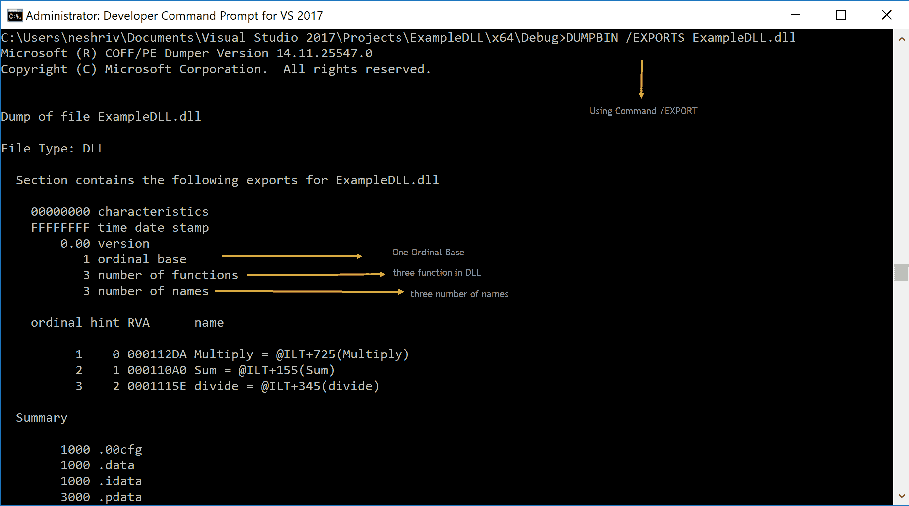

它提供了有关 DLL 的所有信息，例如：

+   +   它有一个序数基数

    +   它有三个函数

    +   函数名称及其序数值

我们可以使用许多命令来获取有关 DLL 的信息。要找出所有命令，请输入以下命令，`Dumpbin.exe`。它给出了我们可以使用的命令列表。

某些 Unicode 字符会被转换为危险字符，例如斜杠线 `\` 字符，这可能会无意中改变方式。通过将 `ThrowOnUnmappableChar` 字段设置为真实值，你可以通过抛出特殊案例来标记对客机的不可映射字符的接近。

当将包含 ANSI 字符或 LPSTR 的组件的托管数组传递给非托管安全展示时，你不能更改 `BestFitMapping` 和 `ThrowOnUnmappableChar` 字段提供的默认值。最佳匹配映射始终启用，并且不会抛出特殊案例。了解这种混合可能会牺牲你的安全信息。

# 使用示例与现有本地库进行互操作

让我们创建 DLL 并在它内部使用 C++ 创建一个头文件（`.h`），然后我们将看到我们如何在 .NET Core 应用程序中消费它。在以下示例中，我们创建了一个名为 `ExampleDLL` 的 DLL 项目。创建一个源 `.cpp` 文件和一个头文件。打开头文件并编写以下代码，该代码返回两个值的和。为了消费类中的公共数据和方法，我们必须在想要从外部消费的公共成员之前添加关键字 `_declspec(dllexport)`。在创建 DLL 时，我们通常添加包含函数或类原型的头文件，我们可以使用 `__declspec(dllexport)` 关键字来导出它，同时在头文件中进行声明。

命名的头文件是 `Calculate`，方法名称是 `Sum`，它接受两个变量，整数 `a` 和整数 `b`。构建此解决方案并打开项目位置。我们可以在调试文件夹中找到 DLL：

```cs
#ifndef Calculate
#define Calculate

extern "C"
{
  __declspec(dllexport)int Sum(int a, int b)
  {
    return a + b;
  }
}

#endif
```

将前面的代码添加到 `Calculate.h` 文件中，如图所示：

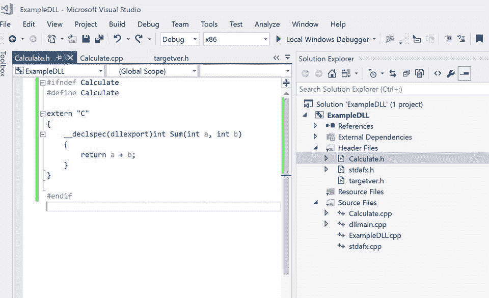

此 DLL 是在 `ExampleDLL` 项目的调试文件夹中创建的：

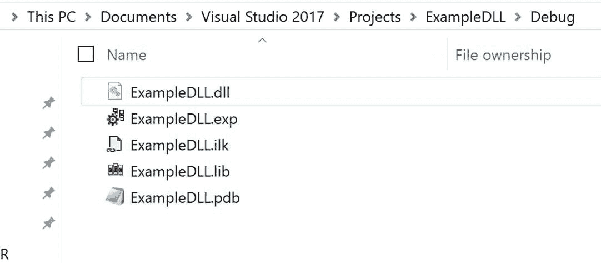

现在我们有了准备从 C# 代码中消费的 C++ DLL。例如，我正在创建一个 C# 控制台应用程序，我们只需要三行代码来消费 C++ DLL：

1.  使用 `System.Runtime.InteropServices;` 添加命名空间

1.  使用 `[DllImport(@"<DLL Location>")]` 添加属性

1.  在您的 C# 代码中添加具有兼容签名的 `static extern` 函数，例如 `public static extern int Sum(int a, int b);`

相应的 C# 脚本如下：

```cs
using System.Runtime.InteropServices;

class Program

    {
        //Insert file path of dll you want to import
        [DllImport(@"C:\Users\neshriv\Documents\Visual Studio 
        2017\Projects\ExampleDLL\Debug\ExampleDLL.dll")]
        public static extern int Sum(int a, int b);
        static void Main(string[] args)
        {

            int sumValue = Sum(3, 4);

            Console.WriteLine("Sum of 3 and 4 is {0}",sumValue);

            Console.ReadKey();

        }

    }
```

结果如下：

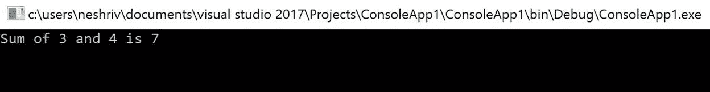

在上一节中，我们看到了如何在 DLL 中使用原生库。在本节中，让我们以 Mono 库为例。我们将在 Ubuntu 中创建一个 `.so` 文件，并从 .NET Core 中使用它。我们将看到 .NET Core 的向后兼容性。

Mono 是一个基于 .NET Framework 的开源开发平台；它使工程师能够以增强的设计师效率构建跨平台应用程序。Mono 的 .NET 执行依赖于 Ecma（Ecma International—欧洲标准化信息和通信系统的协会）为 C# 和公共语言基础设施制定的规范。Mono 包含了运行 .NET 客户端和服务器应用程序所需的工程师设备和基础。Mono 跨平台运行，可在 Linux、Microsoft Windows 和许多其他操作系统上运行。所有 Mono 方言都利用了运行时的许多亮点，例如程序内存管理、反射、泛型和线程。其特性使我们能够专注于编写应用程序，而不是编写框架基础代码。

在此示例中，我们创建了一个简单的库，该库显示一个整数值。

代码如下：

```cs
# include<stdio.h>

int hello()
{
  return 15;
}
```

在终端中运行以下命令以创建 `.so` 文件：

```cs
gcc -shared -o libHelloSO.so -fPIC HelloSOLib.c
```

在前面的命令中，`-shared -o` 创建了一个（`.o`）对象文件，并从对象文件创建了一个 `.so` 文件。`-fPIC` 用于声明一个表示位置无关代码的标志。`-fPIC` 生成位置无关代码，可以在运行时从任何内存位置加载，因此我们可以在运行时访问静态或全局变量和方法。

前面的命令可以在以下屏幕截图中看到：

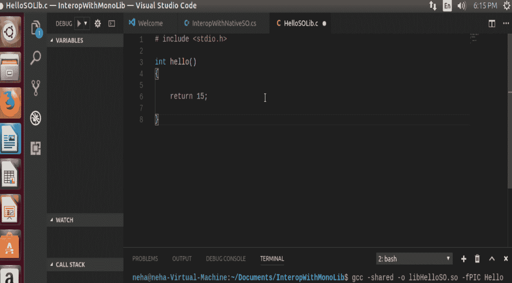

现在我们将看到如何在 C# 代码中消费这个 `.so` 文件。我们创建了一个 C# 文件，并添加了命名空间 `system.Runtime.InteropServices`，并在 `DLLImport` 属性中给出了 `.so` 文件的路径。

代码如下：

```cs
Using System;
Using System.Runtime.InteropServices;

Namespace Hello
{
  Class Program
  {
    [DllImport("/home/neha/Documents/InteroWithMonoLib/libHelloSO.so")]
    Private static extern int hello()
    Static void Main(string[] args)
    {
      int a = hello();
      Console.WriteLine(a);
    }
  }
}
```

现在，当我们完成代码和 `DLLImport` 后，让我们讨论 Mono，我们将使用它来创建我们的可执行文件并运行此应用程序。Mono 是一个由微软子公司 Xamarin 创建的开源工具。如果 Linux 开发者想在 Linux 或任何其他跨平台上运行 Microsoft .NET 应用程序，它会使他们的生活变得容易。本书撰写时的最新版本是 Mono 5.4.0，该版本于 2017 年 10 月发布。这个版本支持 .NET Framework 的 Core API 和 C# 7.0。Mono 提供了多个命令行实用程序，其中一些主要的常用命令是：

+   **Mono**: 它是一个 **即时编译** (**JIT**) 编译器，它支持 32 位和 64 位系统类型。它还支持多个平台，如 Microsoft Windows、Sun Solaris、Android、Apple iOS、macOS、Linux、Sony PlayStation 等。Mono 运行时提供代码执行、垃圾回收、代码生成、异常处理、操作系统接口、线程管理、控制台访问和安全系统、使用 AppDomain 的程序隔离。它允许项目通过重用所有现有的 C、C++ 代码库在 C# 中扩展。正如我们之前所说的，它是一个 JIT 编译器。由于我们在 Microsoft.NET 中有 `ngen.exe` 来生成预编译代码，这可以减少启动时间，所以我们使用以下命令与 Mono 编译程序集：

```cs
mono -O=all --aot <exe name>
```

在前面的命令中，`-O=all` 指示启用所有优化，然后 Mono 命令告诉 Mono 将代码编译为本地代码，`--aot` 用于预编译映像

+   **MCS**: 它是一个 C# 编译器。尽管有多个特定于版本的编译器版本可用，例如，`gmcs` 编译器针对 2.0 mscorelib，`smcs` 针对的是 2.1 mscorelib 和 Moonlight 应用程序（主要针对 Linux 的 Silverlight 实现），而 `dmcs` 针对的是 4.0 mscorlib。现在，新的编译器版本 MCS 已经出现，默认使用最新版本。我们也可以指定要使用哪个版本。MCS 在 Linux 机器上使用 Mono 运行时，在 Windows 机器上使用 .NET 和 Mono 运行时。

+   **全局程序集缓存工具 (Gacutil)**: 此工具用于维护系统全局程序集缓存中的程序集版本。

+   **XSP**: Mono 的 Web 服务和 Web 应用程序服务器。

+   **mono-config**: Mono 运行时的格式配置。

使用以下命令安装 Mono。当我们使用 `mcs` 时，它将安装最新版本：

```cs
sudo apt install mono-mcs
```

使用以下命令在 Visual Studio Code 中编译此 C# 程序；它从我们打开终端的位置创建一个 `.exe` 文件：

```cs
mcs -out:helloNative.exe InteropWithNativeSO.cs
```

现在，是时候运行并检查它是否显示我们传递到 `.so` 文件中的值 `15`，如下面的截图所示：

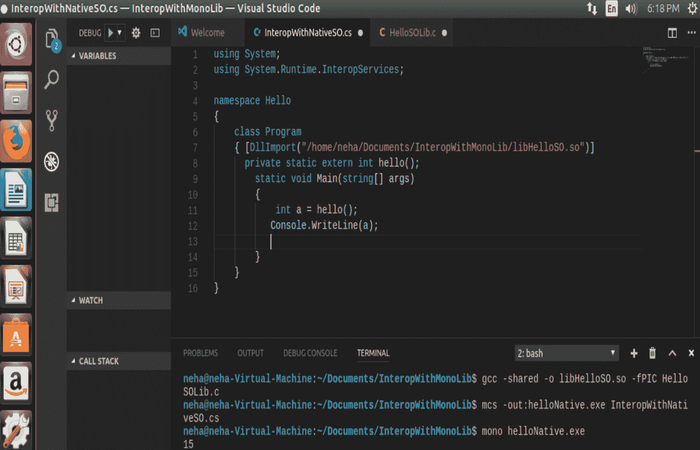

要运行 `helloNative.exe`，请使用以下命令：

```cs
mono helloNative.exe
```

# 不应使用 P/Invoke 的情况

在 DLL 中使用 P/Invoke 并不适合所有 C 风格的方法。让我们以一个在 C++ 程序中创建字符串并在 C# 应用程序中显示它的例子来说明：

```cs
#include "stdafx.h"

const char * HelloMsg()
{
  char * msg = "Hello .NET Core.";
  return msg;
}
int main()
{
  printf(HelloMsg());
}
```

现在，使用 P/Invoke，通过 `DllImport` 属性传递库：

```cs
[DllImport("HelloMsgLib.so")]
public static extern char *  HelloMsg();
```

这里的问题是，我们无法删除由 `msg` 返回的非托管字符串的内存。通过 P/Invoke 调用的不同方法恢复指针，并且不需要客户端释放。对于这种情况，使用 marshaling 是一个更合适的方法。

# 构建示例原生库 (C++)

在前面的章节中，我们学习了跨平台实现以及如何与现有的原生和 Mono 库进行互操作。为了展示互操作性，我们创建了小型示例应用程序。让我们从在 C++ 中构建我们的第一个原生库开始。按照以下步骤操作：

1.  打开 Visual Studio 并在 Visual C++ 下选择 Windows 桌面，然后选择项目类型为动态链接库 (DLL)。在这个例子中，我们命名项目为 `ExampleDLL` 并提供我们想要创建项目的位置：

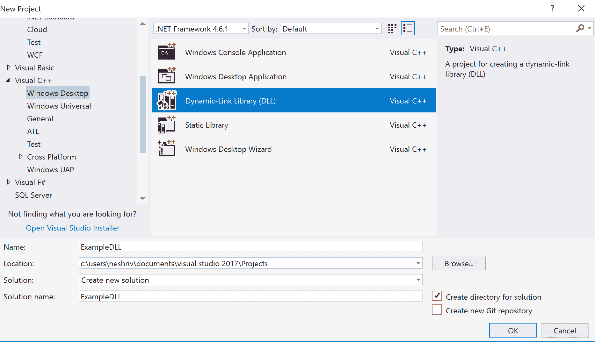

1.  右键单击头文件文件夹并创建一个新的头文件。在这个例子中，我们将其命名为 `Calculate.h`。`Calculate` 头文件包含数学运算，例如两个整数的求和、乘法和除法：

```cs
#ifndef Calculate
#define Calculate

extern "C"
{
  __declspec(dllexport)int Sum(int a, int b)
  {
    return a + b;
  }
  __declspec(dllexport) int Multiply(int number1, int number2)
  {
    int result = number1 * number2;
    return result;
  }
  __declspec(dllexport) double divide(int number1, int number2)
  {
    double result = 0.0;
    if (number2 != 0)
    result = number1 / number2;
    return result;
  }
}
#endif
```

在前面的例子中，我们定义了一个名为 `Calculate` 的头文件。

1.  `extern "C"` 用于指示编译器将使用 C 函数命名约定，而不是 C++。大多数代码使用此指令，因为 C 函数名称比 C++ 函数名称更容易理解。`__declspec(dllexport)` 用于导出。在 Microsoft 编译器的新版本中，我们可以使用此关键字 `__declspec(dllexport)`、对象文件的导出指令从 DLL 中导出数据、函数、类或类成员函数，因此我们不需要使用 `.def` 记录。这种便利性在尝试导出装饰过的 C++ 函数名称时最为明显。由于没有标准规范名称装饰，导出函数的名称可能在编译器版本之间发生变化。要导出函数，`__declspec(dllexport)` 关键字必须出现在调用约定关键字左侧，如果指定了关键字，例如：`__declspec(dllexport)int Sum(int a, int b)`。

要导出类中的所有公共数据成员和函数，关键字必须出现在类名左侧，如下所示：

`Class __declspec(dllexport)int Calculations : public CPPObj { 类定义 };`。

当构建 DLL 时，我们通常创建一个包含函数模型以及我们要交换的类的头文件，并在头文件中包含 `__declspec(dllexport)`。为了使我们的代码更易于理解，我们可以为 `__declspec(dllexport)` 定义一个宏，并使用该宏与每个我们发送出去的符号：

`# define DLLExport __declspec(dllexport)`：

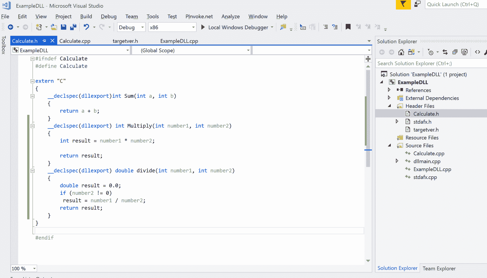

1.  在前面的示例中，我们创建了一个示例原生库，现在我们将看到我们如何访问它。在前面的代码中，我们使用了 `__declspec(dllexport)`；要访问此 DLL，我们将使用 `DllImport`。点击“添加 | 新项目”；在 C# 中选择 .NET Core 控制台应用程序。在这个例子中，我们称之为 `InteropWithCS`。打开解决方案并添加以下代码：

```cs
using System;
using System.Runtime.InteropServices;
namespace InteropWithCS
{
    class Program
    {
        [DllImport(@"C:\Users\neshriv\Documents\Visual Studio 
        2017\Projects\ExampleDLL\Debug\ExampleDLL.dll")]

        static extern int Multiply(int number1, int number2);

        [DllImport(@"C:\Users\neshriv\Documents\Visual Studio 
        2017\Projects\ExampleDLL\Debug\ExampleDLL.dll")]

        static extern double divide(int number1, int number2);

        [DllImport(@"C:\Users\neshriv\Documents\Visual Studio 
        2017\Projects\ExampleDLL\Debug\ExampleDLL.dll")]

        static extern int Sum(int a, int b);
        static void Main(string[] args)
        {

            Console.WriteLine("Enter number1");
            int number1 = Convert.ToInt32(Console.ReadLine());
            Console.WriteLine("Enter number2");
            int number2 = Convert.ToInt32(Console.ReadLine());
            Console.WriteLine("Select Operation : 1 for Sum , 2 for 
            multiply, 3 for divide");
            int option = Convert.ToInt32(Console.ReadLine());
            int result ;
            switch (option)
            {
                case 1:
                    result = Sum(number1, number2);
                    Console.WriteLine("You have selected Sum 
                    operation! 
                    Sum is : " + result);
                    Console.ReadLine();
                    break;
                case 2:
                    result = Multiply(number1, number2);
                    Console.WriteLine("You have selected Sum 
                    operation! 
                    multiplication is : " + result);
                    Console.ReadLine();
                    break;
                case 3:
                    double result1 = divide(number1, number2);
                    Console.WriteLine("You have selected Sum 
                    operation! 
                    division is : " + result1);
                    Console.ReadLine();
                    break;
            }

        }

    }

}
```

1.  在此示例中，我们使用 `ExampleDLL` 进行计算，并获取 `number1` 和 `number2` 的输入值。用户可以通过按相应的数字选择操作——求和、乘法或除法。在选项数字输入时，我们检查用户选项，使用 switch case 并显示结果：

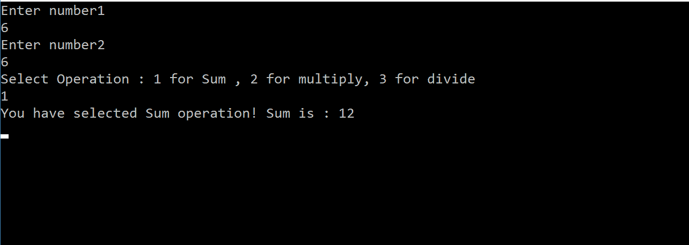

这个简单的应用程序让我们了解如何创建自己的 C 或 C++ 原生库，以及如何设置可以导出并从其他语言（如 C#）访问的函数。使其简单并使用小函数，例如求和和乘法，目的是让您了解功能，这样用户就不会被函数的复杂逻辑所分散。

# 实现新库和 ncurses 的示例应用程序

现在我们已经了解了基础知识，让我们开始构建一个实现 ncurses 的示例应用程序。我们将创建一个 C# 应用程序，该程序导入一个 C 库，或者我们可以说是 `.so` 文件。这个库实现了 ncurses 函数。P/Invoke 允许我们在 C# 应用程序中使用这些 ncurses 函数。

首先，我们将创建一个 C 程序，该程序使用 ncurses 头文件实现 ncurses 函数。让我们创建一个应用程序，该程序接受一个输入字符；这个字符将根据用户在应用程序中输入的行数和列数在一个窗口中打印。函数 `drawCharOnWindow()` 根据窗口中存在的行数和列数打印字符；它接受字符、行和列作为输入参数。我们使用 ncurses 函数 `getmaxyx()` 获取窗口的大小，如果用户输入 `q`，则退出字符的打印。打开 Visual Studio Code 并编写以下代码：

```cs
# include <stdio.h>
# include <ncurses.h>

int row, column, // current row and column (Top left is (0,0))
numberOfRows, // number of rows in current window
numberOfColumns; // number of columns in current window

void drawCharOnWindow(char drawChar, int row, int column)

{
  move(row, column); // ncurses call to move cursor to given row, given 
  column

  delch(); //ncurses calls to replace character 
  insch(drawChar); //under cursor by drawChar

  refresh(); // ncurses call to update screen
  row++; // go to next row
  // check for need to shift right or wrap around
  if (row == numberOfRows)
  {
    row = 0;
    column++;
    if (column == numberOfColumns) column = 0;
  }
}
void hello(int i, int j, char c)
{
  initscr(); // ncurses call to initialize window
  refresh(); // curses call to implement all changes since last refresh
  while (1)
  {
    if (c == 'q') break; // quit?
    {
      drawCharOnWindow(c, i, j);
    }
  }
}
```

使用以下命令创建一个库。它将在终端打开的位置创建一个 `.so` 文件，我们运行此命令：

```cs
gcc -shared -o libHelloSO.so -fPIC HelloSOLib.c -lncurses
```

现在，我们将使用这个库从 C# 程序中，以下示例应用程序从用户那里获取我们将打印的字符及其位置、行和列值。为了使用实现了 ncurses 的库并在 C# 中使用它，我们需要使用命名空间 `System.Runtime.InteropServices` 并导入 DLL，使用 `DllImport` 属性：

```cs
using System;
using System.Runtime.InteropServices;

namespace Hello
{
    class Program
    {
        [DllImport("/home/neha/Documents/
        InteropWithMonoLib/libHelloSO.so")]
        private static extern void hello(int i, int j, int c);

        static void Main(string[] args)
        {
            Console.WriteLine("Enter Character you want to print:\n");
            char c = Convert.ToChar(Console.ReadLine());
            Console.WriteLine("Enter row numbers till where to want to 
            see pattern of character:\n");
            int i = Convert.ToInt32(Console.ReadLine());
            Console.WriteLine("Enter column numbers till where to want 
            to see pattern of character:\n");
            int j = Convert.ToInt32(Console.ReadLine());
            for (int a = 0; a < i; a++)
            {
                for (int b = 0; b < j; b++)
                {
                    hello(i, j, c);
                }
            }
        }
    }
}
```

要创建 `.exe` 文件，请使用以下 Mono 命令：

```cs
mcs -out:helloNative.exe InteropWithNativeSO.cs
```

要在 Mono 中运行程序，请使用以下命令：

```cs
mono helloNative.exe
```

我们学习了如何使用 Mono 创建一个可执行文件并运行它；现在，我们将看到如何创建一个 .NET Core 2.0 控制台应用程序。打开 Visual Studio Code 并设置在终端中我们想要创建应用程序的位置，然后运行以下命令以创建控制台应用程序：

```cs
dotnet new console
```

在创建应用程序之后，使用前面的代码。使用以下命令运行此代码：

```cs
dotnet run
```

它将获取输入参数，要打印的字符，行和列的位置，并在指定位置窗口中打印该字符，如图所示：

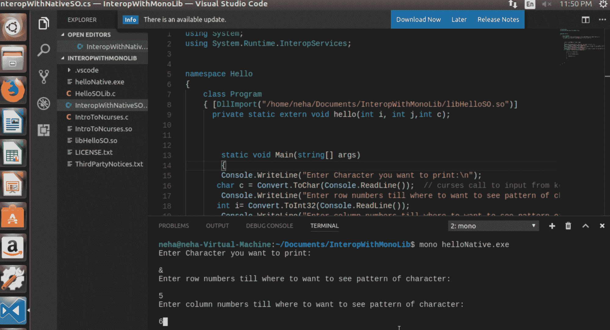

在通过这个细节之后，它会在屏幕上打印出指定行和列的字符，如下所示：

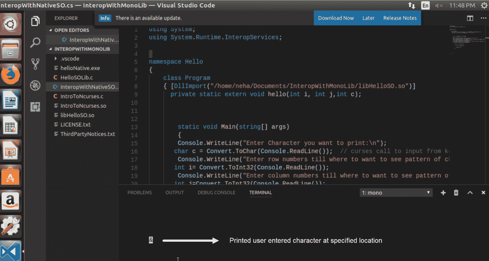

# 摘要

在本章中，我们学习了 ncurses 库以及如何在 C 或 C++ 程序中使用这个库。我们还学习了如何在 .NET Core 2.0 应用程序中重用 Ubuntu 或 Linux 机器上创建的库，使用 P/Invoke。我们看到了 Mono 如何高效地与 Linux 机器协同工作，使得在 .NET Core 2.0 中使用 C# 进行 Linux 用户编程变得容易。下一章将非常有趣，我们将在这里使用 .NET Core 构建我们的第一个游戏，井字棋（Tic-Tac-Toe），我们将学习其编译、构建和测试。
