# 第七章：走向云端

到目前为止，我们通过开发在本地机器上运行的应用程序来学习和探索了 ASP.NET Core 2.0 的基础知识。这些应用程序的真实价值只有在它们被部署并在互联网上可用时才能实现，这样它们就可以从地球上几乎任何地方访问。为了做到这一点，我们需要学习如何在云中部署我们的 ASP.NET Core 2.0 应用程序，即 Microsoft Azure。一个显而易见的问题就是 *我为什么要关心云？* 在本章中，我们将回答这个问题，并介绍我们的云平台 Microsoft Azure 及其基础知识。到目前为止，我们故意开发了不进行任何数据持久化的应用程序，因此没有使用关系型数据库。我们还将学习开发一个端到端的应用程序，该应用程序使用关系型数据库进行数据持久化，并在过程中了解 Entity Framework Core。我们将通过开发一个简单的电影预订网页应用程序来掌握这些概念，然后将此网页应用程序部署到 Azure 上。最后，我们将把本书中开发的聊天机器人集成到我们的电影预订网站上。我们有大量的内容要覆盖，所以让我们进入云端吧！

在本章中，我们将涵盖以下主题：

+   云端简介

+   云的类型

+   开始使用 Azure

# 云端简介

对于云，我们都是全情投入的。

– 史蒂夫·鲍尔默

在本质上，微软是移动优先和云优先世界的生产力和平台公司。

– 萨蒂亚·纳德拉

这两句来自前微软和现任 CEO 的引言突出了云的重要性。云在过去几年一直是热门的 buzzword，但你可能不会惊讶地知道，我们已经不知不觉地使用了云十年，甚至更久。Gmail、Facebook、Skype、Dropbox、OneDrive 等等都是我们几乎每天都在使用的云解决方案的例子。

云计算是一种 **信息技术**（**IT**）范式，它使对可配置的系统资源池和高级服务的普遍访问成为可能，这些服务可以以最小的管理努力快速提供，通常通过互联网。云计算依赖于资源共享来实现一致性和规模经济，类似于公用事业。云使组织能够专注于其核心业务，而不是在计算机基础设施和维护上消耗资源。云计算允许企业更快地将应用程序上线，并具有更好的可管理性和更少的维护，它还使 IT 团队能够更快地调整资源以满足波动和不可预测的业务需求。

云背后的基本理念是我们可以在不担心支持其运行的详细基础设施信息的情况下，通过互联网访问所有信息。

云为企业和组织提供：

+   **灵活性**：根据业务需求，例如将基本计划升级到高级计划，我们可以根据需要调整服务器的数量。想象一下一家蛋糕业务网站应用。在圣诞节假期期间，蛋糕的需求以及网站流量会大幅增加。因此，为了应对这种增加的负载，可以在假期期间增加服务器数量，而在淡季则可以减少。这种灵活性在当今经济中至关重要，因为企业必须节省并在每一个小利润点上表现出色。消费者几乎可以立即根据需要以几乎无需任何人工干预的方式获得服务。

+   **按需自助服务**：服务可以几乎立即由消费者根据需要提供或取消，无需任何人工干预。

+   **安全性**：安全性至关重要。请放心，你的数据在云中的安全性比在办公桌上的桌面或你携带的笔记本电脑中更高。丢失或被盗的笔记本电脑是一个常见问题。除了财务成本外，敏感数据的丢失代价高昂，不仅涉及财务，还涉及声誉和信任。当这种情况发生时，云为你提供了更好的安全性。由于数据存储在云中，无论你的机器发生什么情况，你都可以访问它。你甚至可以远程擦除机器上的数据，如果它落入错误的手中。

+   **成本**：使用云计算可以节省维护成本和昂贵的硬件成本。不再需要服务器、软件和更新费用。你只需“按需付费”并享受订阅服务。你也可以节省采购硬件、维护和更新硬件的人员成本。

+   **灾难恢复**：任何大型或小型企业都需要一个强大的灾难恢复计划，因为一次灾难可能会使你的业务陷入停顿。云计算让你比以往任何时候都更容易实现这一点。

+   **自动更新**：由于所有服务器都位于云上，你不必担心自己花费时间维护系统。云服务提供商会为你处理维护工作，并定期推出软件更新。这让你可以专注于更重要的事情，比如发展你的业务。

+   **协作**：当你的团队能够随时随地进行访问、编辑和共享文档时，他们能够更好地协作完成更多事情。基于云的工作流程和文件共享应用帮助他们实时更新，并全面了解他们的协作情况。

+   **在家工作**：为什么只是在家？在任何有互联网的地方都可以远程工作。是的，这是云计算带来的现实。

这些以及其他许多好处使云计算对任何现代 IT 专业人员来说都不可或缺。我甚至可以说：

<q>“如果你不在云上，你就不是 IT 的一部分。”</q>

接下来，让我们看看不同类型的云。

# 云类型

从广义上讲，云部署模型可以分为：

+   **公有云**：这是最常用的云部署模型。公有云是指服务提供商通过互联网向公众提供资源，如服务、应用程序或存储。公有云服务可能是**免费**的，或者按**按使用付费**的模式提供。公有云服务的例子包括 Microsoft Azure、Amazon **弹性计算云** (**EC2**)、IBM 的 Blue Cloud、Google App Engine 等。

+   **私有云**：私有云提供了与公有云相似的优势，但通过专有架构。与公有云不同，私有云是专门为单一组织服务的。由于涉及大量成本，只有大型组织才能投资私有云。拥有大量软件开发者的组织是私有云的使用案例，因为开发者经常需要新的虚拟机。例如，**印度国家银行** (**SBI**) 建立了一个名为 **Meghdoot** 的私有云，为多个业务服务提供动力。

+   **混合云**：这是公有云服务和私有云的结合。使用混合云不需要拥有私有云。混合云也可以是虚拟化、本地数据中心和公有云服务的组合。混合云也可以被视为连接公有云和私有云的桥梁，它可以根据策略、成本等因素在两者之间移动工作负载。如今，大多数公司都使用这种部署模型。例如，Marriott 和 Dominos Pizza 都使用混合云。

云计算服务可以分为三种服务交付模型：

+   **基础设施即服务** (**IaaS**)

+   **平台即服务** (**PaaS**)

+   **软件即服务** (**SaaS**)

以下图表应说明这些服务交付模型：

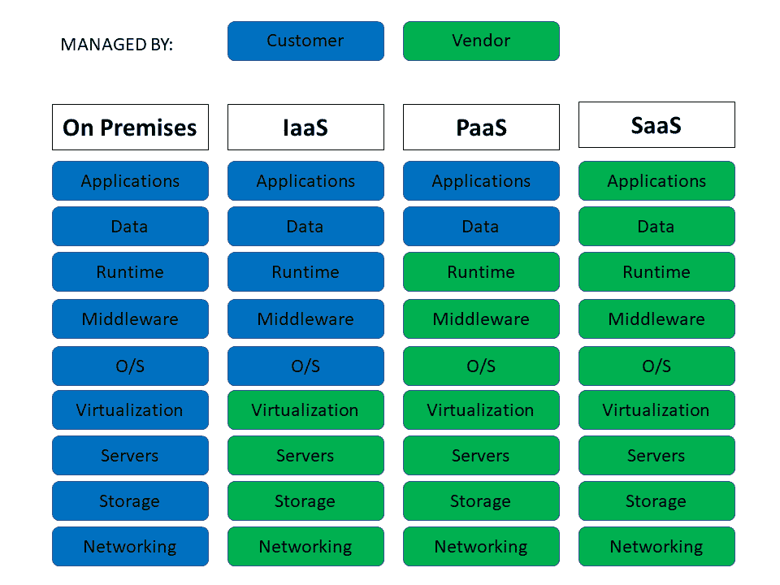

我们可以看到：

+   在**本地部署**中，客户必须从硬件到软件的每一件事都要管理；例如，在公司场所托管的服务器上部署的任何软件。

+   在**IaaS**中，所有必需的基础设施都由供应商管理。客户只需管理操作系统、软件、运行时以及应用程序及其数据；例如，Amazon EC2、Microsoft Azure 和 Google Compute Engine。

+   在**PaaS**中，基础设施以及操作系统和运行时由供应商管理。客户只需管理应用程序及其数据；例如，Google App Engine、Heroku 和 Microsoft Azure。

+   在**SaaS**中，整个基础设施和软件由供应商管理。客户只需消费作为服务的软件；例如，Microsoft Office 365、Gmail 和 OneDrive。

现在我们已经了解了云的基本知识，是时候开始使用那个代表未来并且我们都必须拥抱的云平台——Microsoft Azure 了。

# 开始使用 Azure

微软 Azure（之前称为 Windows Azure）是由微软创建的云服务，用于通过全球的微软管理数据中心网络构建、测试、部署和管理 Web 应用程序和服务。它提供 SaaS、PaaS 和 IaaS，并支持许多不同的编程语言、工具和框架，包括微软特定的和第三方软件和系统。本书中的所有示例都是在 Azure 中托管的**虚拟机（VM**）上开发的。由于我们还需要一个 Linux VM 来演示 ASP.NET Core 2.0 的跨平台支持，因此该 Linux VM 也被创建并在 Azure 中托管。这是展示开发者如何灵活且容易地拥抱和使用 Azure 的最佳示例。

可能出现在你脑海中的明显问题是：为什么使用 Azure 而不是亚马逊的 AWS 或谷歌云？当然，我对这一点有完全的偏见，并且我坚信微软 Azure 在许多参数上远远领先于其竞争对手。以下列出了一些亮点：

+   **安全合规性和信任**：Azure 拥有超过 70 种合规性产品，具有更全面的合规性覆盖范围，并且是第一个在合同上承诺满足**通用数据保护条例（GDPR**）要求的主要云服务提供商。为了保护您的组织，Azure 将安全、隐私和合规性嵌入到其开发方法中，并被认为是美国政府机构最信任的云服务。

+   **全球覆盖范围最广**：Azure 在全球拥有最多的区域覆盖，有 42 个已宣布的 Azure 区域——比任何其他云服务提供商都多。您可以选择最适合您和您的客户的数据中心和区域，以及您需要的性能和支持。

+   **支持多种开发工具和语言**：当萨蒂亚·纳德拉（Satya Nadella）说<q>*"微软♥ Linux"*</q>时，向世界传达了一个强烈的信号，即微软正在积极倾听其客户，并在其核心拥抱开源。同样的策略也体现在微软云中，它支持众多工具、框架和语言。微软是 GitHub 上的主要开源贡献者，并积极支持多个开源社区项目。

+   **真正的混合云方法**：Azure 在应用程序开发、安全、身份管理和数据平台等各个方面都提供混合一致性。这有助于降低混合云环境的风险和成本。

+   **无与伦比的人工智能**：使用微软认知服务、机器人、机器学习和仅可在 Azure 中找到的**区块链即服务（BaaS**）能力来开发可扩展的智能解决方案从未如此简单。

+   **大数据与高级分析**：Azure Cosmos DB 使您能够通过大数据支持无限扩展您的应用程序。然后 Azure 提供的先进商业分析服务让您比竞争对手高得多。

+   **管理和优化云成本**：使用免费的 Azure 成本管理，轻松优化云资源并在您的分配资金内进行预算。

+   **物联网就绪**：您可以使用 Azure IoT 套件中预配置的解决方案快速开发最常见的物联网场景，例如远程监控。

+   **无与伦比的开发者生产力**：Azure 对开发者友好，正如我们很快就会看到的，我们可以在 Visual Studio 或 PowerShell 内部开发、部署和测试我们的应用程序。

数据中心是由网络计算机和存储组成的设施，企业或其他组织使用它来组织、处理、存储和传播大量数据。企业通常严重依赖数据中心内包含的应用程序、服务和数据，使其成为日常运营的焦点和关键资产。

Azure 是全球范围内不断扩展的数据中心网络。这些数据中心形成了**区域**。这为我们提供了使用我们选择的区域的灵活性，以便部署资源/应用程序以获得最佳性能。以下截图显示了 Microsoft Azure 网站 ([`azure.microsoft.com/en-us/`](https://azure.microsoft.com/en-us/))，它在世界地图上说明了这些不同的区域。我们可以看到美国、英国、欧洲、印度和日本的多个区域。当我们部署应用程序时，我们需要为部署选择一个区域。我可能会选择一个特定的区域，以便将应用程序地理位置上靠近我或我的客户。我住在印度，所以我可能会使用西印度、中印度或南印度区域进行我的开发工作。如果我想有一些冗余，我也可以部署到多个区域。从这个图中我们可以得出的结论是，Microsoft Azure 运行着数百万台计算机服务器，这些物理机器遍布全球这些区域，并且 Microsoft 确保这些机器处于运行状态，健康，并且物理安全。我们只需要利用这部分巨大的计算能力来完成我们的工作：

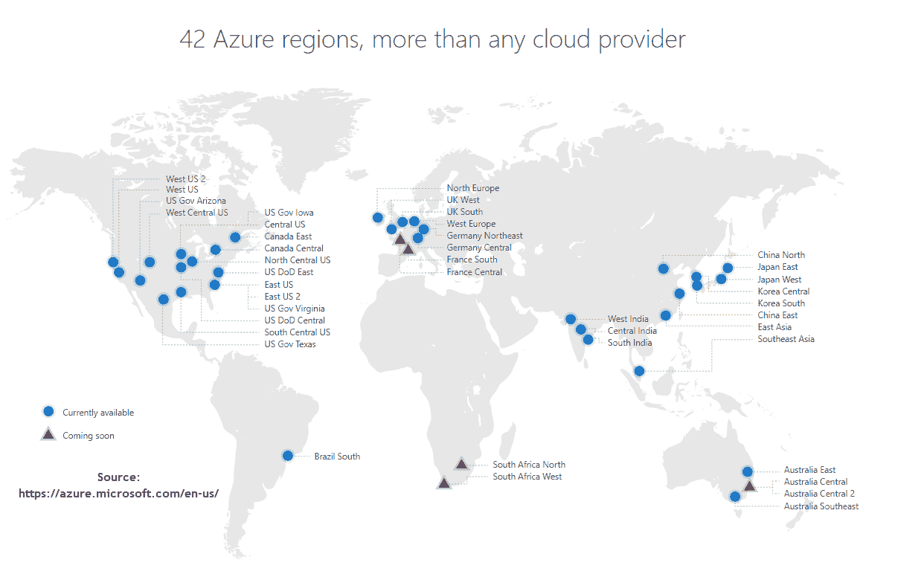

现在我们已经建立了云（以及 Microsoft Azure）的基本概念，让我们开始使用 Azure 平台吧。

首先，您需要将您的账户注册到 Azure。为此，请访问 [`portal.azure.com/`](https://portal.azure.com/) 并使用您的任何 Microsoft 账户进行注册，例如 Hotmail、MSN、Outlook 或 Live。在撰写本章时，Azure 在创建账户时提供了以下一些非常好的免费优惠。这些优惠可能因您阅读本书的时间而异：

+   12 个月的免费访问热门产品。您还将获得 25 永久免费的产品的访问权限。

+   30 天内可用于任何 Azure 产品的 200 美元信用额度。

+   Azure 仅使用信用卡信息进行身份验证，您只有在将订阅更改为*按使用付费*订阅之前不会收费。如果您在大型企业或 Microsoft 合作伙伴、BizSpark 计划或 MSDN 订阅者工作，您已经获得了 Azure 云资源的订阅。

一旦您注册，您将看到一个漂亮的仪表板。这是 Azure 管理门户。仪表板用户界面不断改进，并会不时更新，所以当您阅读这一章时，用户界面可能与现在不同。重要的是要注意，有一个左侧面板，列出了您可以使用的所有 Azure 服务。新用户应该进行 Azure 的引导游览，以便熟悉用户界面，因为它功能非常丰富。让我们快速看一下用户界面。以下截图展示了登录后的 Azure 仪表板。我们用数字标记了用户界面，以便我们可以合理深入地查看每个项目：


让我们看看不同的组件：

1.  **汉堡按钮**：显示左侧面板上的汉堡菜单。这具有标准的汉堡按钮行为。当展开时，它显示图标以及 Azure 提供的各种服务的描述。在折叠时，它增加了右侧列（仪表板显示的地方）的空间，因为在折叠的左侧面板中只显示图标。

1.  新建：创建新的资源。点击时，从市场显示需要创建的资源。您也可以使用此功能查看 Azure 市场中的各种服务。

1.  **左侧面板显示喜欢的 Azure 服务中心**：Azure 提供的所有您喜欢的或常用服务/资源都显示在这个我们称之为中心区域。当您想要创建或管理 Azure 中拥有的资源时，请前往此处。不要被“资源”这个词弄混淆；就像当经理谈论软件开发者时，他们被称为资源一样，我们可以从虚拟机到 Web 应用、Redis 缓存等创建的一切，通常都被称为资源。嗯，Azure 有如此多的资源，以至于它们不能全部放入中心，所以显示的是可以显示的，其余的则在“更多服务”项下显示。

1.  **右侧面板仪表板**：在截图上，这显示了来自所有订阅的 Azure 仪表板。我们可以有两种类型的仪表板：私有和共享。共享仪表板可以与其他用户共享，而私有仪表板正如其名所示。仪表板的目的在于快速访问您使用的资源，以便您可以快速查看和管理它们。

1.  新仪表板：这提供了一个创建新仪表板的选择，您可以在其中自定义要显示的资源磁贴，以您希望的方式显示。您可以按需固定、移动或调整资源磁贴的大小。

1.  编辑仪表板：使您能够编辑仪表板。您可以从仪表板中删除磁贴，或添加新的磁贴，或者只是拖动并更改其位置。您可以根据自己的偏好调整磁贴的大小。

1.  分享：使您能够与其他用户共享仪表板。您可以通过将仪表板发布为 Azure 资源来共享仪表板。Azure **基于角色的访问控制**（**RBAC**）将确定谁有权访问仪表板。对单个磁贴的访问权限可能与对仪表板本身的访问权限不同。

1.  全屏：全屏显示门户。

1.  克隆：克隆仪表板。

1.  删除：删除仪表板。

1.  **搜索**：搜索您正在寻找的资源/服务。

1.  **通知**：单击此类似铃铛的图标将显示通知和状态更新，例如账单更新、资源启动/停止/错误通知以及其他信息。

1.  **云 Shell**：使用此类似于命令提示符的图标，您可以选择 bash 或 PowerShell。您可以通过云 Shell 工具栏中的环境选择器随时更改 shell。最近使用的环境将是您下一次会话的默认设置。

1.  **设置**：齿轮图标代表当前门户中的设置。它允许您自定义门户设置、主题、语言等。

1.  **反馈**：与 Microsoft Azure 产品团队分享 Azure 门户的反馈。

1.  **帮助**：获取帮助和支持。您可以创建或跟踪支持票证，并监控您的 Azure 服务和资源的健康状况。您还可以在此处查看键盘快捷键，并获取引导式浏览。

1.  **账户信息**：切换目录、更改密码、查看权限、提交想法或查看账单。

1.  服务健康：当 Azure 服务中的问题影响您时，提供个性化的指导和支持。

1.  市场 place：发现、购买和管理来自 Microsoft 合作伙伴的附加组件和服务。

1.  新增功能：让您了解 Azure 的最新和最佳信息。

1.  反馈：与*步骤 15*相同。

1.  Azure 经典门户：用于查看旧的经典 Azure 门户，供熟悉旧门户的旧 Azure 用户使用。

1.  帮助+支持：与*步骤 16*相同。

1.  所有资源：显示您使用的订阅中的所有资源和服务。

虽然我们在这里讨论并定义了瓷砖，但请注意，由于仪表板是可定制的，您可以选择添加或完全删除瓷砖。因此，一些瓷砖可能在您的仪表板中显示或不显示。这里的目的是让您了解门户。此外，截图中有编号为 25、26 和 27 的瓷砖，这些是在创建这些资源后我标记的（实际上，Azure 在您基于设置创建资源时立即将其标记到仪表板）。这些瓷砖显示了我正在使用的资源/服务及其状态。在截图中，25 是一个名为 DotNetCore2 的瓷砖。它是一个虚拟机，已经停止。26 显示了一个名为 testdecompression 的 Web 应用，也已经停止。27 是一个名为 packtletschat 的 Web 应用，正在运行。希望这次讨论能让您开始使用 Azure 管理门户。接下来，我们将创建 Azure 中的虚拟机和 Web 应用，然后看看我们如何部署在 Azure 中发布的 ASP.NET Core 2.0 应用。

# 在 Azure 中创建虚拟机

在本节中，我们将学习如何在 Azure 中创建虚拟机。开发者始终需要虚拟机。如果您想知道我的意思，只需想象您想尝试一些尚未准备好生产的工具或软件的新版本，但由于新软件可能引起的不稳定问题，您不想在自己的笔记本电脑上尝试。我总是这样做，无论我是在尝试产品的夜间构建还是与任何新产品进行实际操作。Azure 为您提供了极大的灵活性和选择。有大量的选择和配置可供选择您想要的操作系统和所需的大小。作为充满激情的.NET 开发者，我们可能希望有一个安装了伟大 Visual Studio 2017 的虚拟机，这样我们就可以在配置虚拟机后立即开始开发。为此，我们将学习如何在 Azure 中创建虚拟机。为此，让我们执行以下步骤：

1.  在 Azure 管理门户的左侧面板（中心）中，单击虚拟机。请确保您单击虚拟机而不是虚拟机（经典）。我们将在本节稍后讨论经典和资源管理器之间的区别。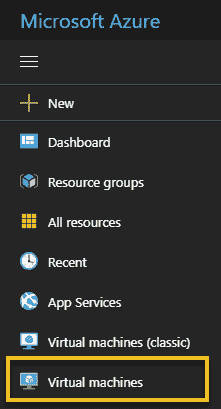您将看到一个虚拟机屏幕，其中列出了您拥有的所有虚拟机，并提供添加虚拟机、启动、停止、删除和重启虚拟机的用户界面，如下面的截图所示：

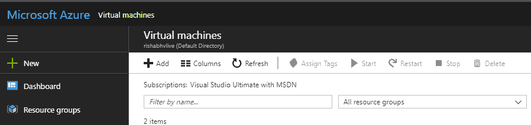

1.  单击添加按钮。这将打开右侧的新飞出窗口，显示可供选择的多个虚拟机映像。这个飞出窗口就是我们所说的刀片。您可以根据需求选择 Red Hat Linux、Windows Server、Ubuntu 或其他任何东西。由于我们需要一个安装了 Visual Studio 2017 Community Edition 的 Windows 10 机器，让我们搜索`Visual Studio 2017`。这显示了以下结果列表：

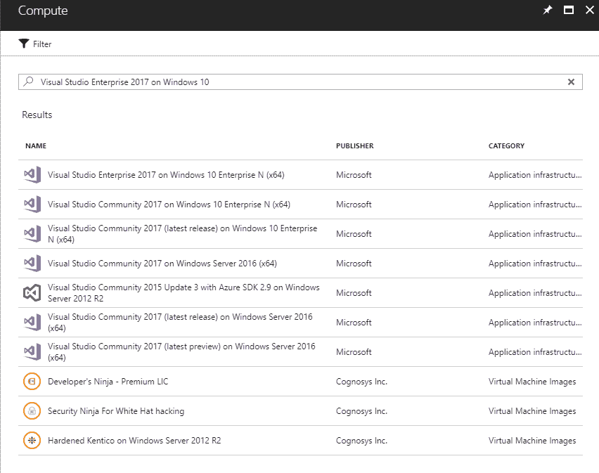

1.  选择最适合您需求的映像。这样做时，将出现一个新的刀片，显示虚拟机映像的详细信息、发布者、有用的链接、最后更新日期、其桌面截图、部署模型等。始终选择部署模型为资源管理器，因为它允许您使用 PowerShell 进行自动化，而经典模式则不行。此刀片在以下屏幕截图中可见：

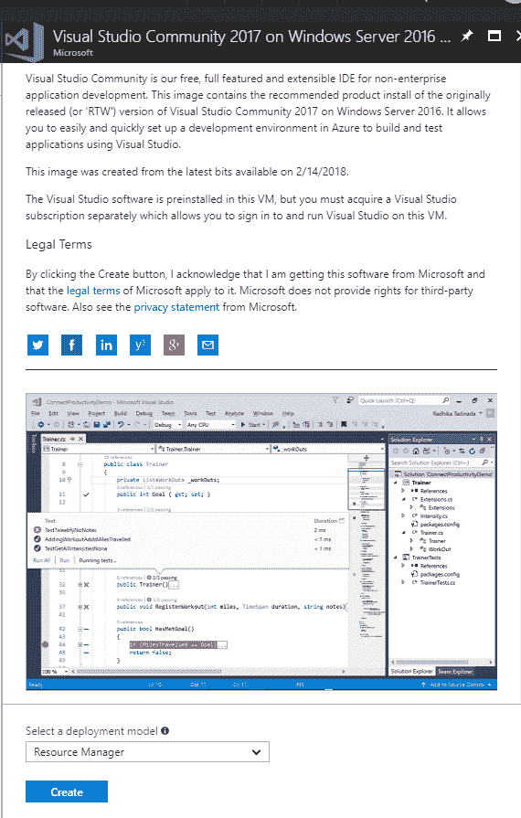

1.  点击“创建”按钮时，将显示以下屏幕，其中包含创建虚拟机的四个基本步骤：

    1.  基本设置

    1.  大小

    1.  设置

    1.  摘要

“基本”部分收集了将要创建的虚拟机的基本信息，例如：

+   +   名称：虚拟机的名称，必须是唯一的。

    +   虚拟机磁盘类型：这可以是**固态硬盘**（**SSD**），它提供一致的低延迟性能，非常适合生产使用或标准磁盘（HDD），这些磁盘由磁驱动器支持，并且适用于数据访问不频繁的应用程序。

    +   用户名：登录虚拟机的用户名。

    +   密码，确认密码：这些应该与用户名相同，并且此密码将与用户名一起用于登录虚拟机。

    +   订阅**：这是自动填充的。如果您有多个订阅，您可以选择您希望用于创建虚拟机的订阅。

    +   资源组：资源组是一组具有相同生命周期、权限和策略的资源。为了更好地管理，您可以选择创建新的或重用现有的资源组。

    +   位置：您希望用于创建虚拟机的 Azure 数据中心。根据您的位置或客户的位置，您可能希望选择最近的位置以获得性能和低延迟。点击“确定”：

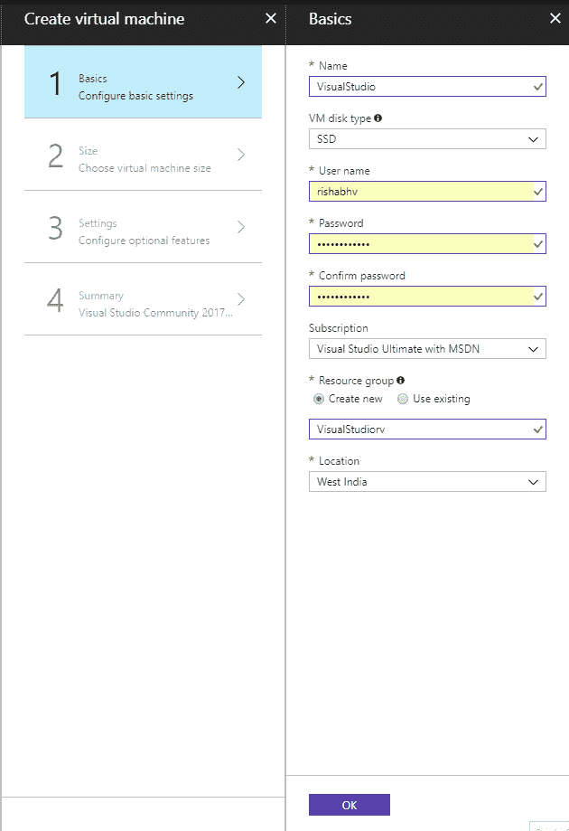

1.  在“大小”部分，选择适合您需求的尺寸。Azure 在刀片上列出推荐的大小，但如果它不符合您的需求，请点击“查看所有”，您将看到更多可供选择的配置。您还可以通过移动这些参数的滑块栏来自定义支持的硬盘类型、最小 CPU 和内存。Azure 列出了 CPU、内存、数据盘数量、磁盘大小以及其他包含的功能，以及您每月需要支付的成本的重要参数，因此请明智地使用。一旦确定大小，请点击“选择”：

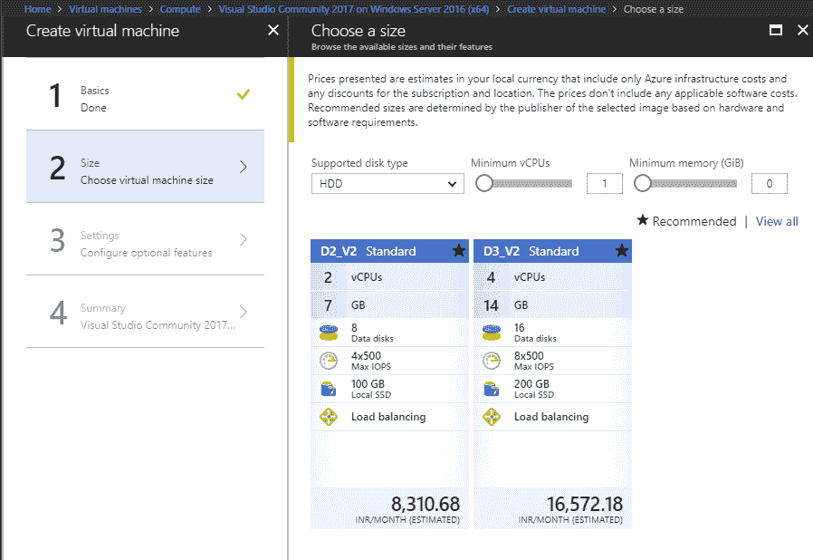

1.  “设置”部分包括虚拟机的重要且自动填充的设置。以下是一些重要的设置：

    +   可用性集：Azure 的可用性服务级别协议（SLA）为 99.95%。为了提高虚拟机的高可用性，建议在可用性集中冗余地分组两个或更多虚拟机。优点是，在计划内或计划外的维护期间，至少有一个虚拟机可用，以满足 Azure 99.95%的可用性 SLA。此设置在虚拟机创建后不能更改。在我们的情况下，我们不需要此设置，因此我们将使用默认值“无”。

    +   使用托管磁盘：此功能可能不在所有区域中可用。当此设置为“是”时，Azure 将自动管理磁盘的可用性，以提供数据冗余和容错。

    +   自动关机：此功能非常重要，至少在财务上。当您的虚拟机正在运行时，每分钟都会产生费用，因此只有在需要时才保持开启状态以保持账单合理。如果您启用自动关机，可以配置虚拟机在指定时间每天关闭。例如，如果虚拟机仅在办公时间内使用，那么在办公时间外关闭它以节省费用是很有意义的。设置选项卡如下面的截图所示：

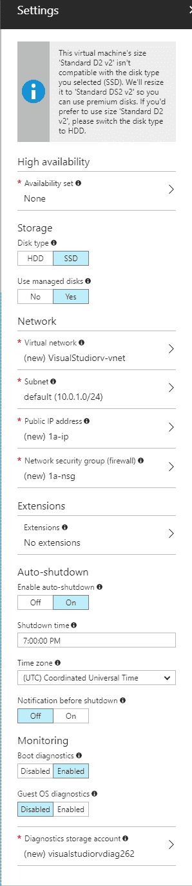

1.  点击“确定”。在摘要选项卡中，将显示所有设置的摘要页面，以及使用条款。如果您同意，请点击“创建”，您的虚拟机将开始创建。您将被带到仪表板页面，该页面现在将添加一个名为虚拟机的新磁贴，并显示该资源的状态。几分钟内，您的虚拟机将被配置。一旦配置完成，您将收到通知，表明虚拟机已成功部署，虚拟机的仪表板磁贴将显示状态为“运行”。

1.  点击我们创建的虚拟机磁贴。它将带我们到虚拟机的概述选项卡，如下面的截图所示：

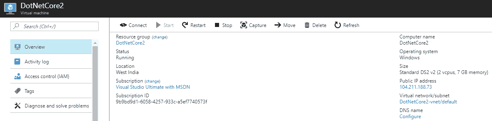

您将看到以下选项：

+   +   连接：点击“连接”后，将下载**远程桌面协议**（RDP）文件。双击下载的 RDP 文件，在提供创建虚拟机时使用的用户名和密码后，将启用远程桌面连接到虚拟机。

    +   启动：如果虚拟机尚未启动，则启动虚拟机。只有当虚拟机未运行时，此按钮才会启用。

    +   重新启动：重新启动虚拟机。

    +   停止：停止虚拟机并释放其资源。

    +   捕获：此功能可用于创建虚拟机镜像。我们通常在需要带有额外配置的基本镜像时使用它。

    +   移动：将虚拟机移动到另一个资源组或订阅。

    +   删除：用于删除虚拟机。

    +   刷新：刷新虚拟机的状态。

Azure 拥有优秀的文档和酷炫的培训视频。他们还提供了入门指南和架构建议，以创建和使用 Azure 资源。你可以在 Azure 网站上找到文档和 SDK，网址为 [`docs.microsoft.com/en-us/azure/`](https://docs.microsoft.com/en-us/azure/)。培训、网络研讨会、活动、代码示例、视频、白皮书和案例研究可以在 [`azure.microsoft.com/en-us/resources/`](https://azure.microsoft.com/en-us/resources/) 找到。

通过这种方式，我们已经在云（Azure）上创建了我们的第一个虚拟机，并且我们可以通过点击我们下载的远程桌面文件来使用它。点击 `.rdp` 文件时，它将以标准方式提示用户名和密码，就像任何其他远程桌面连接一样。只是这个虚拟机托管在云中，在 Azure 上。一旦你登录，你可以按你的意愿使用它。记住，一旦虚拟机启动，无论你是否使用它，它都会开始计费。所以，如果你想节省成本，确保你在不使用时关闭它，并在需要时启动它。这标志着我们对虚拟机的讨论结束。接下来，我们将看到如何使用 PowerShell 在 Azure 中自动化资源创建和管理。

# 使用 PowerShell 自动化

在本节中，我们将学习如何使用 PowerShell 在 Azure 中自动化资源创建和管理。在 Azure 中创建资源的用户界面方法非常有效且简单。你可能想知道：是否必须登录到 Azure 门户才能完成每一件事？不。你可以在 Azure 门户中设置和执行的所有操作都可以通过编写程序或脚本来自动化。此外，作为一个开发者，我更喜欢让我的代码来完成工作，而不是去门户手动执行操作。代码还可以帮助我们进行自动化，从而避免需要人工干预。许多语言都提供了 SDK，从 C# 到 JavaScript，再到 Ruby 等等。我们将通过以下步骤查看如何使用 PowerShell 启动和停止我们刚刚创建的虚拟机：

1.  访问网址 [`azure.microsoft.com/en-us/downloads/`](https://azure.microsoft.com/en-us/downloads/)。这是你可以获取 SDK 和命令行工具的中心位置。在这个页面上，我们可以看到有针对 .NET 开发者、Java 开发者、Node.js 等的 SDK。如果我们向下滚动一点，我们可以看到命令行工具。点击 PowerShell 下的 Windows 安装链接。它将下载安装程序可执行文件：

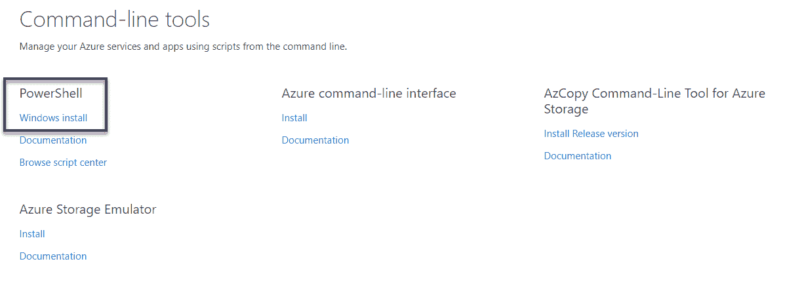

1.  下载完成后，运行可执行文件，按照安装说明进行操作。现在打开 PowerShell ISE。它应该已经安装好了。如果没有，您也可以在 Windows 10 机器上搜索 Windows Powershell 来使用 PowerShell。我们需要做的第一件事是将我们的 PowerShell 会话与 Azure 账户关联起来。我们可以使用`Login-AzureRmAccount`命令来完成。PowerShell 具有自动补全功能，所以当你在 Tab 键上输入几个字符后，它会尝试完成命令。当你按下 Enter 键时，你会看到一个界面，你需要使用你的 Microsoft 账户登录，如下面的截图所示：

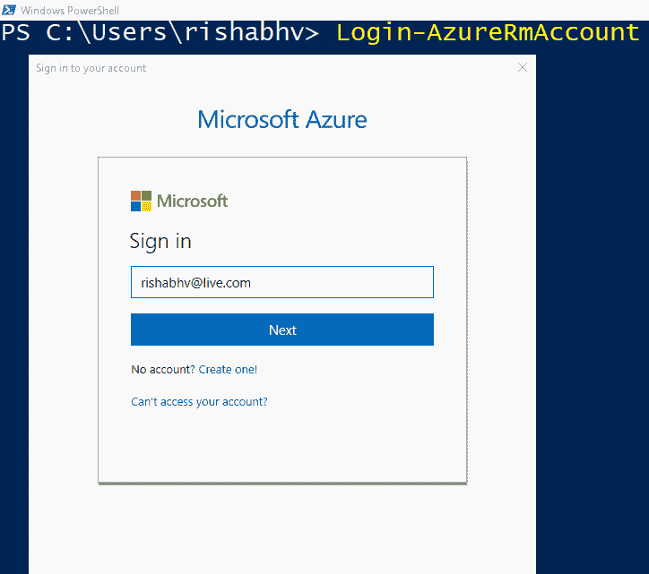

1.  输入您的用户名和密码。如果您启用了双因素认证，您可能还需要输入验证码。输入`Get-AzureRmSubscription`命令。这将显示所有订阅的列表，包括订阅名称、订阅 ID、租户 ID 和状态；即，它是启用还是不活跃。PowerShell cmdlet 的名称中包含`AzureRm`，其中`Rm`代表资源管理器：

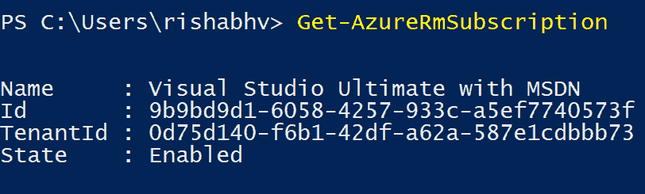

1.  接下来，我们检查`Get-AzureRmContext`。此 cmdlet 提供当前上下文，如下面的截图所示：

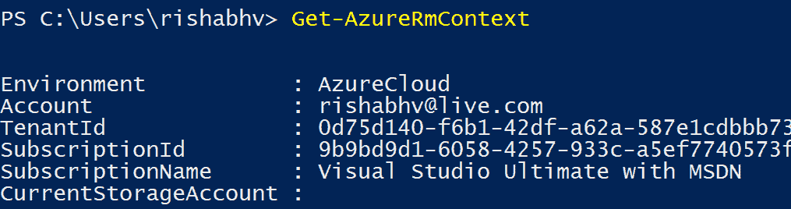

1.  现在，让我们获取订阅中所有虚拟机的列表。我们可以使用`Get-AzureRmVM`来获取：

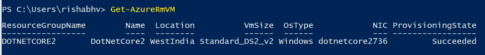

1.  要启动虚拟机，我们将使用`Start-AzureRmVM` cmdlet，传递`Name`和`ResourceGroupName`作为参数，如下面的截图所示。启动虚拟机需要一段时间，可以从`StartTime`和`EndTime`值中看出：

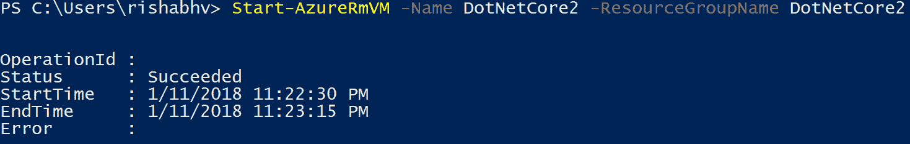

1.  要停止虚拟机，我们可以使用`Stop-AzureRmVM` cmdlet，传递`Name`和`ResourceGroupName`作为参数，并使用`Force`标志。`Force`参数仅用于使其非交互式；否则，将会有确认提示。与`Start-AzureRmVM`命令一样，此命令也需要一段时间，如下面的截图所示：


我们看到了如何使用 PowerShell 管理虚拟机是多么简单。从门户管理它更容易，因为它只需点击一下按钮，但这里的目的是展示 Azure 提供的灵活性。我们还可以在之前在本章中看到的 Cloud Shell 中执行这些 PowerShell 命令；也就是说，我们直接在 Azure 门户浏览器中打开的壳中执行命令。这需要额外的存储空间，因此会产生成本。这是关于使用 PowerShell 在 Azure 中进行自动化的一个非常基础的入门讨论。有大量的信息需要学习和掌握。一个热情的学习者应该阅读文档来增强他们的知识，并从官方的 Microsoft Azure 文档中掌握主题，文档链接为 [`docs.microsoft.com/en-us/powershell/azure/overview?view=azurermps-5.1.1`](https://docs.microsoft.com/en-us/powershell/azure/overview?view=azurermps-5.1.1)。还有书籍和示例模块，由 Microsoft 和 Azure 社区为各种场景构建，读者可以利用它们来学习、理解和实验。这些可以在 [`docs.microsoft.com/en-us/azure/automation/automation-runbook-gallery`](https://docs.microsoft.com/en-us/azure/automation/automation-runbook-gallery) 上看到。

接下来，我们将学习如何在 Azure 中发布 Web 应用，这是最常用的操作。

# 在 Azure 中发布 Web 应用

在本节中，我们将学习如何在 Azure 中发布 Web 应用。如前两个部分所述，我们可以从 Azure 门户创建资源，或者我们可以在我们首选语言的 SDK 上编写代码；例如，C#、PowerShell 等。作为一名在 Microsoft 技术上工作的开发者，我大部分的生产力工作时间都花在 Microsoft Visual Studio 上，所以我希望将 Web 应用发布到 Azure 上。这是我们最常执行的操作之一，因为开发完 Web 应用后，它应该托管在云端，以便为更广泛的受众和更多用户提供服务。如果我们查看 Azure 门户，我们将在左侧面板或中心看到名为 App 服务的服务。让我们首先讨论 App 服务。

# Azure App 服务

Azure App Services 是我们想要在云平台上运行的应用程序或 API 的解决方案。App Services 支持从传统的 Web 应用程序，如博客、电子商务网站或 **内容管理系统**（**CMS**）等多种技术和应用程序类型。我们可以用 ASP.NET、Node.js 或 PHP 等多种框架和语言编写应用程序。如果我们只想构建一个服务/API 并提供数据，现代的 **单页应用程序**（**SPA**）或逻辑应用程序，App Services 也支持所有这些。我们上一节在 Azure 门户中创建虚拟机的过程同样可以用来创建 App Service。使用虚拟机时，我们选择了想要的操作系统。对于 App Services，我们可以选择一个预配置的 App Service。例如，如果我们想设置一个 WordPress 博客，我们可以选择 WordPress 选项并点击创建，稍作配置后，我们就可以拥有一个运行中的 WordPress 网站。我们想要创建的 App Service 名称应该在 [azurewebsites.net](https://azure.microsoft.com/en-us/) 上是唯一的，那里将是应用程序最终托管的地方。接下来，我们必须选择一个资源组。我们可以使用现有的资源组或创建一个新的资源组。由于它是一个资源的逻辑容器，我更喜欢有单独的资源组，这样一旦我完成那个资源，我就可以一次性删除整个资源。Azure 门户接下来要求我们选择一个 App Service 计划。如果我们必须进行类比，那么当我们创建虚拟机时，它就像大小一样。App Service 计划的概念非常重要。我们将创建的每一个 **Web 应用程序** 都将被放置在一个专门为该应用程序提供的 **单个 App Service** 中。然后每个 **App Service** 都映射到一个单一的 **App Service 计划**。一个计划描述了托管 App Service 的机器的性能特征。在幕后，App Service 计划使用虚拟机，但 Azure 将其抽象化，我们不需要担心管理虚拟机，因为 Azure 会处理它，并从最终用户那里抽象出来。我们可以简单地使用 App Service 计划来描述我们需要多少 CPU 和多少内存；Azure 会处理其余部分。关于 App Service 计划的一个重要注意事项是，我们可以将多个 App Service 部署到 Azure，并将它们映射到同一个 App Service 计划。根据您的 Web 应用需求选择现有的 App Service 计划或新的 App Service 计划。如果您需要服务大量用户，如果将有大量用户使用您的 Web 应用程序，那么我们可以从门户中选择一个更大的服务计划，它可以处理更多的请求，我们可以重用现有的服务计划（如果我们已经有了），或者我们可以使用免费或成本较低的计划。完成所有配置后，我们可以点击创建。由于所有这些都与虚拟机创建非常相似，我们不会深入细节。几分钟内，App Service 应该就可以运行了。现在我们已经创建了 App Service，我们可以将我们的 Web 应用程序发布到这个创建的 App Service 上。

# 发布网络应用程序

让我们使用 Visual Studio 在 Azure 上发布一个 ASP.NET Core 2.0 网络应用程序：

1.  在 Visual Studio 中创建一个新的 ASP.NET Core 2.0 项目，或者使用本书中迄今为止创建的现有应用程序之一。我们将使用本书中迄今为止开发的网络应用程序之一进行说明。

1.  右键单击项目。在上下文菜单中，点击发布：


1.  这将显示一个美观的用户界面，提供了三个选项。我们可以选择在以下位置发布：

    +   Microsoft Azure App Service：网络应用程序的容器。

    +   IIS, FTP：在虚拟机上部署到 IIS 或 FTP。

    +   文件夹：在本地文件系统中发布应用程序。

    +   **导入配置文件**：从 Azure 门户导入发布配置文件以发布应用程序。我们将在本章后面看到这一点。

    +   Microsoft Azure 虚拟机**:** 在 Azure 中托管的虚拟机上发布应用程序。

我们将选择**Microsoft Azure App Service**。这提供了两个选项：要么选择一个现有的应用程序服务，要么创建一个新的。我们可以使用任一选项。这是为了说明我们可以在 Visual Studio 内部直接创建全新的应用程序服务，或者使用你创建的现有应用程序服务。点击**发布**按钮，我们将得到一系列对话框。如果你没有使用 Azure 订阅凭据登录，你需要这样做。

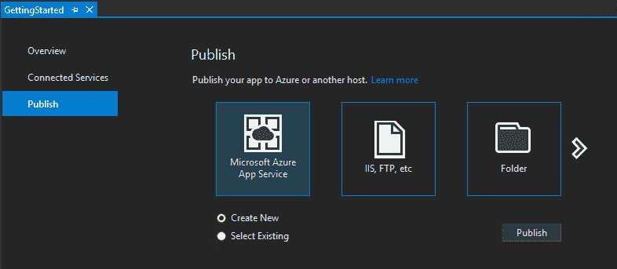

1.  你会注意到右上角显示了我在其中登录的 Microsoft 帐户。我需要输入一个唯一的**应用程序名称**。**订阅**将自动填充。但是，如果你有多个订阅，你必须选择你希望使用的订阅。**资源组**和**应用程序服务计划**可以是全新创建的，也可以从现有的中选择。在这里，截图显示我已经选择了一个现有的。点击**创建**。它将显示一个**摘要**屏幕：

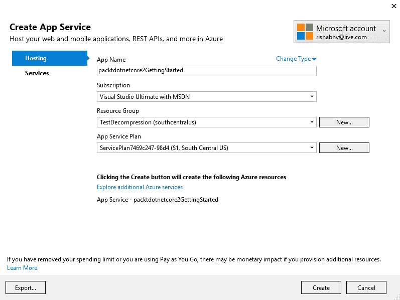

1.  点击发布，应用程序将在 Azure 上发布。Visual Studio 会保存项目的发布设置文件。第一次发布时可能需要一段时间，因为 Visual Studio 需要将所有用于 App 服务的程序集和工件推送到服务器。但是一旦发布到 Azure，如果我们只是更改了像 Razor 视图文件或脚本文件这样的内容，并在下一次发布，Visual Studio 只需要上传少量更改的文件。

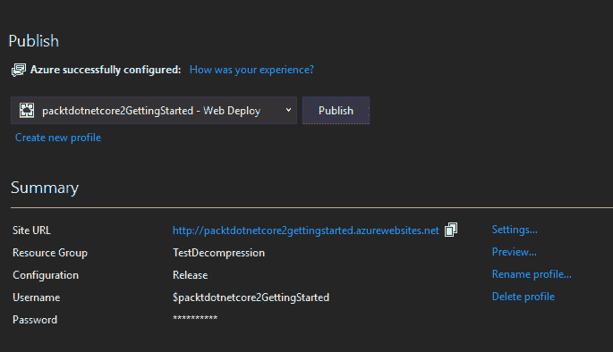

1.  经过一段时间后，发布成功后，部署的应用程序将在浏览器中打开，如下面的截图所示：

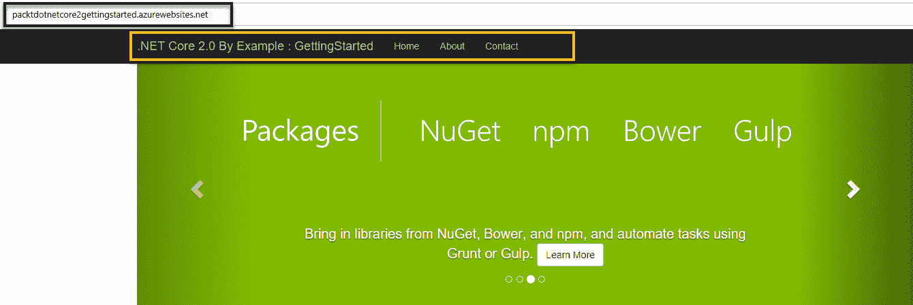

在幕后，Visual Studio 会创建一个发布配置文件，让我们快速看一下它。

# 发布配置文件

发布后，Visual Studio 将创建一个发布配置文件。它基本上是一个包含项目创建的文件的文件夹，可以在项目的属性节点中看到，如下截图所示：

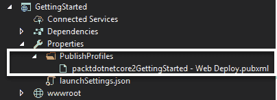

我们可以有多个配置文件，这些配置文件将存储在 `PublishProfiles` 文件夹中，文件扩展名为 `.pubxml`，因为这些是 XML 文件。`.pubxml` 文件包含有关构建类型的信息，例如，发布/调试构建。它包含部署凭据的一部分的 URL 和用户名，如下代码所示：

```cs
<?xml version="1.0" encoding="utf-8"?>
<!--
This file is used by the publish/package process of your Web project. You can customize the behavior of this process
by editing this MSBuild file. In order to learn more about this please visit https://go.microsoft.com/fwlink/?LinkID=208121\. 
-->
<Project ToolsVersion="4.0" xmlns="http://schemas.microsoft.com/developer/msbuild/2003">
  <PropertyGroup>
    <WebPublishMethod>MSDeploy</WebPublishMethod>
    <ResourceId>/subscriptions/9b9dd9d2-6058-4257-933c-
    a5ef7740573f/resourcegroups/TestDecompression
    /providers/Microsoft.Web/sites/
    packtdotnetcore2GettingStarted</ResourceId>
    <ResourceGroup>TestDecompression</ResourceGroup>
    <PublishProvider>AzureWebSite</PublishProvider>
    <LastUsedBuildConfiguration>Release</LastUsedBuildConfiguration>
    <LastUsedPlatform>Any CPU</LastUsedPlatform>
    <SiteUrlToLaunchAfterPublish>http://packtdotnetcore2gettingstarted
    .azurewebsites.net</SiteUrlToLaunchAfterPublish>
    <LaunchSiteAfterPublish>True</LaunchSiteAfterPublish>
    <ExcludeApp_Data>False</ExcludeApp_Data>
    <ProjectGuid>a1a01377-c3df-4586-9838-10c733becf91</ProjectGuid>
    <MSDeployServiceURL>packtdotnetcore2gettingstarted
    .scm.azurewebsites.net:443</MSDeployServiceURL>
    <DeployIisAppPath>packtdotnetcore2GettingStarted</DeployIisAppPath>
    <RemoteSitePhysicalPath />
    <SkipExtraFilesOnServer>True</SkipExtraFilesOnServer>
    <MSDeployPublishMethod>WMSVC</MSDeployPublishMethod>
    <EnableMSDeployBackup>True</EnableMSDeployBackup>
    <UserName>$packtdotnetcore2GettingStarted</UserName>
    <_SavePWD>True</_SavePWD>
    <_DestinationType>AzureWebSite</_DestinationType>
  </PropertyGroup>
</Project>
```

该文件不包含密码。因此，可以在源代码控制中检查，而不用担心安全风险。默认情况下，部署密码放置在一个不同的文件中，该文件不是项目的一部分，但位于同一文件夹中：

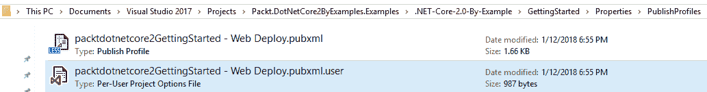

它是 `pubxml.user` 文件。该文件不包含明文密码。它使用登录用户特定的密钥进行加密，因此如果文件被复制粘贴并由另一个用户使用，密码将无法正确解密（因为密钥是用户特定的，它不会匹配），因此密码对他们将不起作用。所以，脑海中浮现出的明显问题是：如果我丢失了密码或删除了 `pubxml.user` 文件，想要发布应用程序怎么办？我们可以通过以下步骤来完成：

1.  打开 Azure 门户，然后查看我们希望发布的 App Service 的概览选项卡。点击“获取发布配置文件”以下载发布配置文件，如下截图所示：

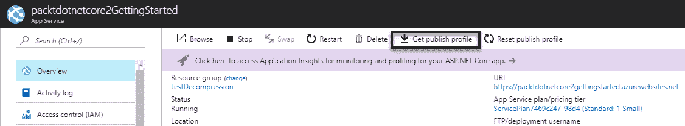

1.  在 Visual Studio 中，右键单击项目并点击“发布”；选择“导入配置文件”并点击“确定”：

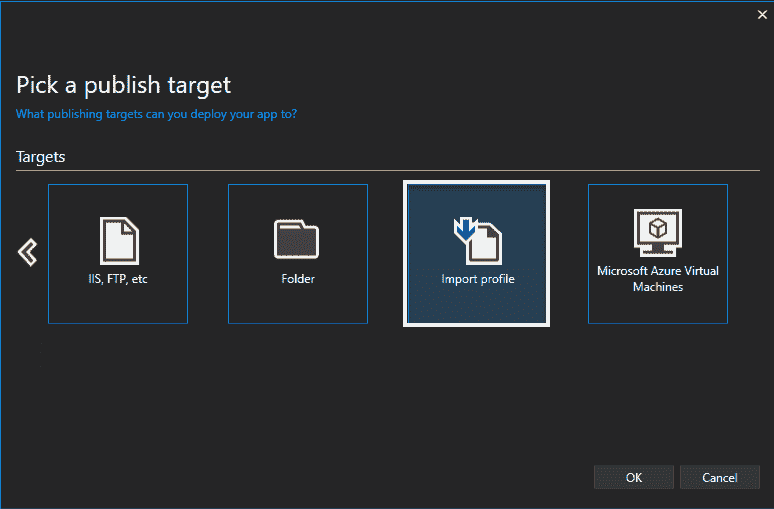

1.  点击“发布”，Web 应用程序将被发布。

接下来，让我们看看 Azure 中一些常用的功能，每个 .NET 开发者都必须熟悉。

# 应用服务功能

如果我们查看我们创建的应用服务项目，我们会注意到许多事情。要详细描述它们需要单独的一章，所以我们将快速查看从 .NET 开发者角度出发的几个最常见和重要的功能：

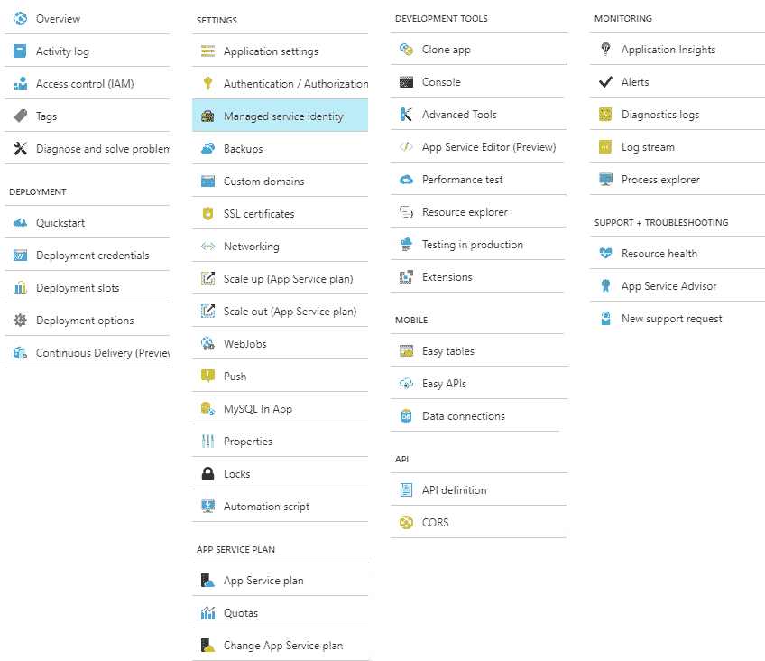

如我们所见，有 DEPLOYMENT（部署）、SETTINGS（设置）、APP SERVICE PLAN（应用服务计划）、DEVELOPMENT TOOLS（开发工具）、MOBILE（移动）、API、MONITORING（监控）、SUPPORT + TROUBLESHOOTING（支持+故障排除）等子部分。让我们讨论每个部分，以便我们知道 Azure 提供的所有内容，然后我们可以根据需要利用它。最基本且最常用的包括：

+   概览：提供 App Service 的完整整体视图。我们可以从这里浏览服务，并启动/停止/重启/删除服务。我们还可以下载服务的发布配置文件，并将发布配置文件重置为使先前下载的发布配置文件无效。图表显示 App Service 的统计信息，例如 HTTP 5xx 或服务器错误的数量、时间线上的数据进出、请求数量和处理请求的平均响应时间。

+   诊断和解决问题：这提供了一个简单的方法来诊断和解决 Web 应用中的问题。有预定义的问题类别可供选择，您可以使用 Azure Health Checkup Web 应用进行诊断，该应用基于请求、CPU 使用率和内存使用率，提供对应用健康状况的深入了解。

# 部署

在这个类别中，选项如下：

+   快速入门：提供指导，帮助您开始应用部署。快速入门为 ASP.NET、Java、Node.js、PHP 和 Python 提供了实用的指导。

+   部署槽位：部署槽位允许我们将不同版本的 Web 应用部署到不同的 URL。我们可以测试某个版本，然后在不同槽位之间交换内容和配置。部署槽位使我们能够在将应用推广到生产之前，验证应用在 Azure 中是否正常运行。这还消除了停机时间，并给新部署一个在客户使用之前预热的机会。我们可以拥有多个槽位，只要我们有合适的 App Service Plan。例如，我们可能需要一个槽位用于测试，一个用于预发布，一个用于生产。一旦验证了预发布部署的工作正常，我们就可以交换槽位；也就是说，我们可以将预发布槽位中测试的内容，通过点击一个按钮（或 PowerShell 脚本），将预发布部署转换为新的生产部署。在最坏的情况下，如果出现问题，很容易将这些槽位交换回来，并将最后一个正常工作的生产部署重新放入生产。

+   部署选项：配置您选择的源控制以进行部署。**Visual Studio Team Services**（**VSTS**）、OneDrive、Git、Bitbucket 和 Dropbox 都受到支持。

+   持续交付：在编写本章时，这正处于预览阶段。在 Visual Studio Team Services 中的持续交付简化了设置健壮的部署管道。该管道构建、运行负载测试，并将部署到预发布槽位，然后到生产。

# 设置

这里选项如下：

+   应用程序设置：我们可以在这里定义和覆盖应用程序设置和连接字符串的地方。我们将在下一章中看到它的实际应用，当我们构建我们的电影预订 Web 应用时。这也是我们为基于 SignalR 的应用程序启用 WebSockets 并将应用程序转换为始终开启的地方；否则，如果 Web 应用程序保持空闲状态，它将被卸载。远程调试也可以从这个面板中启用和禁用。

+   **身份验证/授权**：启用/禁用身份验证。

+   **备份**：配置备份以创建可恢复的存档副本，包括 Web 应用内容、配置和数据库。

+   **自定义域名**：这是配置和管理分配给 Web 应用的自定义主机名的地方。例如，我的博客网站是`rishabhverma.net`。如果我想将此域名与 Web 应用链接，就需要在这里进行配置。我还可以在此处启用仅 HTTPS 标志，这样所有 HTTP 流量都会被重定向到 HTTPS，使我的应用更加安全。

+   **扩展**：为了满足 Web 应用增加/减少的负载或需求，我们需要更高/更低的 App Service 计划配置，而这个选项卡就是用于此目的的。

+   **扩展**：在这个选项卡中，我们可以启用自动扩展，如果根据配置的规则负载增加，应用程序将自动扩展。我们还可以在此选项卡中选择托管 App Service 的机器的实例数量。

+   自动化脚本：在这个选项卡中，我们可以通过单个协调操作使用 Azure Resource Manager 模板自动部署资源。我们还可以定义资源和可配置的输入参数，并通过脚本或代码进行部署。

我们已经详细讨论了应用服务计划，因此作为练习，读者应理解和学习应用服务计划的细节，因为这与你在 Azure 中托管的应用程序的性能和成本直接相关。

# **开发工具**

让我们看看可用的选项：

+   **高级工具**：高级工具（Kudu）为 App Service 提供了一组面向开发者的工具和可扩展点。一旦我们在 Azure 中部署了应用，这将是使用频率最高的选项之一。我强烈建议读者阅读 Kudu 维基百科[`github.com/projectkudu/kudu/wiki`](https://github.com/projectkudu/kudu/wiki)，因为它提供了关于 Kudu 的详细信息。

+   **性能测试**：在这个选项卡中，我们可以通过模拟任何数量的用户虚拟负载以及我们想要测试的持续时间来执行 App Service 的负载测试。我们可以指定 API 端点 URL 或 Visual Studio Web Test 以进行性能测试。

+   **扩展**：扩展为 App Service 添加功能，例如图像上传应用程序的图像优化器等。

# **API**

这里有一些选项：

+   **API 定义**：API 定义允许我们配置描述通过 App Service 公开的 API 的 Swagger 2.0 元数据的存储位置。这使得其他人更容易发现和消费 API。

+   **CORS**：**跨源资源共享**（CORS）允许运行在外部主机浏览器中的 JavaScript 代码与 App Service 后端交互。我们可以指定应允许进行跨源调用的来源。

# **监控**

让我们看看可用的选项：

+   **Application Insights：**它帮助我们检测和诊断 Web 应用和 Web 服务的质量问题，并帮助我们了解用户实际上在 App Service 中使用什么。这对于分析 App Service 的性能和错误特征非常重要。在下一章中，我们将利用应用洞察构建我们的电影预订应用。

+   **警报：**这是 Azure 的卓越功能之一。如果我们想知道我们的 Web 应用表现不佳或由于负载导致 CPU 或内存使用量高时，我们可以在该选项卡中配置基于规则的电子邮件警报，如果满足规则条件，我们将通过电子邮件收到通知。然后，借助其他诊断工具，我们可以找出并修复问题。

+   **诊断日志：**在这个选项卡中，我们可以启用/禁用文件系统或 blob 中的应用程序日志。我们还可以启用/禁用详细错误消息和失败的请求跟踪。在这里需要注意的一点是，文件系统日志在 12 小时后自动禁用，以防止日志膨胀文件系统，而 blob 日志将无限期地继续。

+   **进程资源管理器：**用于监控/终止运行 App Service 的进程，并监控它们的内存和 CPU 使用情况。

# 支持与故障排除

选项包括：

+   **资源健康：**资源健康监控资源并告诉我们它们是否按预期运行，如果不按预期运行，可以采取哪些措施。

+   **App Service Advisor：**App Service Advisor 为改进 App Service 平台上的应用体验提供洞察。

Visual Studio 提供了非常丰富的扩展支持。对于 Azure 也有许多扩展。Cloud Explorer 是一个针对 Azure 的出色扩展，它应该已经包含在 Visual Studio 2017 中。如果没有，我强烈建议您尝试使用它。要搜索、下载和安装任何可用的 Visual Studio 扩展，请点击**工具** | **扩展和更新**。然后在窗口左侧面板上点击**在线**后搜索`Cloud Explorer`。可以通过点击**视图** | **Cloud Explorer**来打开 Cloud Explorer。Cloud Explorer 可以被视为 Azure 管理门户的精简版，可以在 Visual Studio IDE 内部使用。我们可以从这个扩展中启动/停止虚拟机或 App Service，分析 App Service，下载发布配置文件和日志，将调试器附加到 Azure，等等。以下截图显示了 Cloud Explorer 扩展：

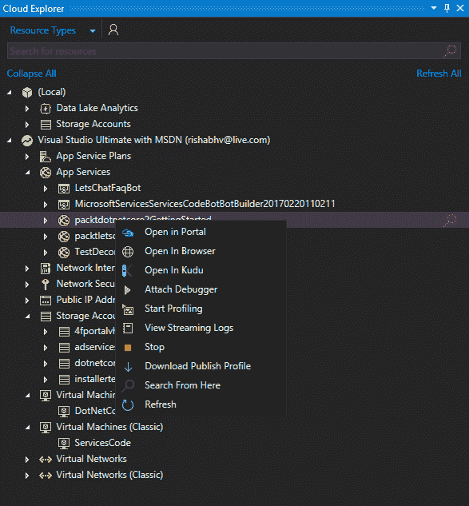

这就结束了我们对 Azure 的讨论。接下来，我们将讨论云存储和提供低成本无服务器计算的 Azure 函数。

# 云存储

我们都知道 SQL Server（如果不知道，不要担心）。Azure SQL 只是部署在 Azure 上的 SQL Server。在本节中，我们不会讨论 Azure SQL，因为我们将在下一章中使用 Azure SQL，因此将在那时详细讨论。我们将检查存储帐户。存储帐户可以存储数百个千兆字节（粗略地说，1 千兆字节= 1,000 千兆字节）的数据。我们将讨论如何将 Azure 存储用作存储上传文件的场所，以及我们如何通过创建和分发所谓的**共享访问签名**（**SAS**）来启用用户从存储中下载文件。所以，让我们开始吧。

在 Azure 门户中，点击新建，选择存储，然后点击存储帐户 - 块、文件、表、队列，如下面的截图所示：

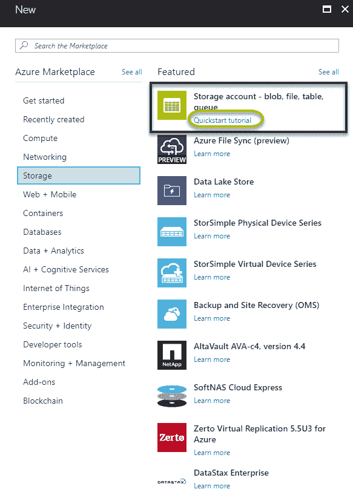

还有一个链接到快速入门教程，我强烈推荐它，因为它有来自主要技术传教士的出色的入门视频和教程，可以帮助您快速开始使用 Azure 存储。点击存储帐户 - 块、文件、表、队列，将显示一个名为创建存储帐户的新刀片，如下面的截图所示：

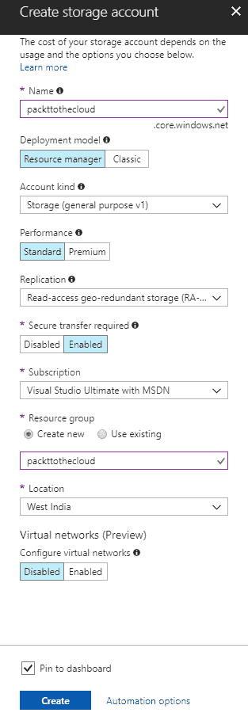

在刀片视图中，输入所需的字段：

+   **名称**：这应该由 3-24 个字符组成，可以是小写或数字文本，且在整个 Azure 存储中应该是唯一的，因为它在.core.windows.net 上公开。

+   部署模型：这应该保持为资源管理器。

+   帐户类型：这可以是通用存储 V1 或 V2 或专用 blob 存储。我们将保持为通用存储。

+   性能：这可以根据需要选择为高级或标准。

+   需要安全传输：对于任何严肃的 Web 应用，这应该被设置为启用。

+   资源组：这可以创建新的或重用的。

+   位置：选择最接近您业务需求的位置。

您可以选择通过勾选“固定到仪表板”复选框将存储帐户固定到仪表板。点击创建。过了一会儿，存储帐户将被创建。一旦存储帐户创建完成，点击仪表板上的固定磁贴，它将带您到存储帐户概览刀片，该刀片总结了存储帐户的详细信息。需要注意的是，在刀片中间列出了不同类型的存储，如下面的截图所示：

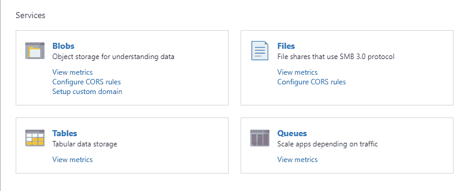

因此，我们可以使用四种类型的存储与存储帐户一起使用。让我们简要地讨论这些：

+   **Blob 存储**：Blob 是**二进制大对象**的缩写。我们可以在 blob 存储中存储任何类型的文件。

+   **表存储**：表存储是一个无 SQL 数据库，类似于文档数据库，但与存储文档不同，表存储优化用于存储键值对。表存储非常便宜，是存储大量数据的好地方。

+   **文件存储**：文件存储允许我们在云中设置**服务器消息块**（SMB 3.0 协议）文件共享。当我们有一个需要迁移到 Azure 且已使用文件共享的现有应用程序时，通常会选择这种存储方式。

+   **队列存储**：队列允许我们存储和检索消息。如果我们想构建可靠的高规模网站，队列是一项重要的技术，因为它们可以在应用程序和它使用的后端服务之间设置一个缓冲区。

块和队列被更频繁地使用，在我们开发电影预订网站时，我们将在下一章使用块存储，因此我们将结束对存储的简要讨论。在下一章中，我们将详细看到如何使用 SAS 令牌从存储上传和下载数据。这标志着我们对云介绍的讨论和本章的结束。我们现在应该准备好在 Azure 中进行开发和部署，这将在下一章中完成。

# 摘要

在本章中，我们学习了云是什么以及为什么现代开发者应该熟悉云技术。我们还开始了 Azure 的学习，并意识到了 Azure 管理门户。我们学会了从门户创建虚拟机，并看到这可以通过使用 SDK 通过 PowerShell 或其他语言自动化。然后我们使用 PowerShell 管理虚拟机，并了解了如何启动和停止它。我们还学会了如何从 Visual Studio 2017 本身创建 Azure 中的 Web 应用，并了解了发布配置文件。我们对 App 服务进行了概述，并对 Azure 存储进行了快速浏览。现在我们已经掌握了基础知识，我们将在下一章开发一个电影预订应用程序并将其部署到 Azure。
