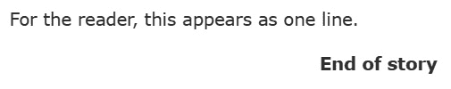
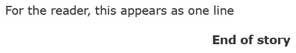
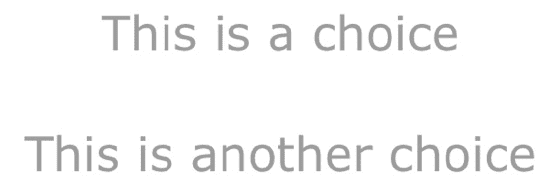

# 第五章：*第五章*：隧道和线程

本章从**隧道**的概念开始。通过多个转向和至少两个结（请参阅*第二章*，“结、转向和循环模式”）创建，隧道提供了一种比上一章中讨论的更快的创建复杂结构的方法。在此之后，我们将继续回顾**线程**，这是另一种使用转向动态连接墨水项目多个部分的方法。最后，我们将探讨结合隧道和线程，根据墨水在故事中理解结和转向的简单规则，创建更复杂的结构。

在本章中，我们将涵盖以下主要主题：

+   转向到转向

+   拉动线程

+   结合隧道和线程

在本章中，我们将探讨使用隧道和线程创建更复杂项目的各种方法。我们已经探讨了多个级别的选择及其结果，以创建一个细分的故事。我们不会转向一个接一个的结或针，而是学习如何将隧道作为一系列转向整合，然后再返回到它们原来的位置。我们还将探讨如何通过*编织*将结轻松地组合在一起。

# 技术要求

本章中使用的示例，在`*.ink`文件中，可以在 GitHub 上找到：[`github.com/PacktPublishing/Dynamic-Story-Scripting-with-the-ink-Scripting-Language/tree/main/Chapter5`](https://github.com/PacktPublishing/Dynamic-Story-Scripting-with-the-ink-Scripting-Language/tree/main/Chapter5)。

# 转向到转向

在*第二章*，“结、转向和循环模式”，转向的概念与被称为结的故事部分一起引入。使用转向和结，创建了循环结构，并揭示了其他墨水概念作为替代方案（请参阅*第三章*，“序列、循环和文本洗牌”）。在*第四章*，“变量、列表和函数”中，介绍了函数的使用和向结传递值。本节基于这些概念，通过解释如何使用转向来创建更高级的故事来构建。

在*第二章*，“结、转向和循环模式”中，转向按照以下模式出现：

示例 1：

```cs
For the reader, <>
-> next_part
== next_part
this appears as one line.
-> DONE
```



图 5.1 – 示例 1 的 Inky 输出

转向也可以多次使用。在 ink 中，这被称为**隧道**的概念。流程将移动到一个结，然后返回到其原始位置。从读者的角度来看，流程*隧道*从一个部分到另一个部分。隧道是 ink 中循环结构常见时的一个极其有用的概念。

在这个主题中，我们将回顾如何制作和使用隧道。不需要在结或缝合中指定每个转向的位置，隧道允许作者将故事的流程通过一系列章节移动，并在隧道最终结束时再次返回。

## 制作隧道

通过使用转向符号`->`、结或缝合的名称，然后另一个转向符号`->`，在墨水中创建隧道。这会告诉墨水，流程将移动到结，然后再返回。在目标结中，然后使用两个转向符号一起：`->->`。这创建了流程移动到结然后再返回的*隧道效应*：

示例 2：

```cs
For the reader, <>
-> next_part ->
<> as one line
== next_part
this appears
->->
```

如果你忘记了墨水中的流程是如何工作的，*示例 2*可能会显得令人困惑。转向符号将流程移动到故事中的目的地。在*示例 2*中，流程从`For the reader, <>`的文本开始。然后，这被转向到`next_part`结。隧道的开始以`-> next_part ->`的代码开始，继续到`next_part`结，然后使用两个转向符号`->->`返回。对于只看到输出的读者来说，它将看起来是一个完整的句子：



图 5.2 – Inky 的 Example 2 输出

提醒

*第一章，文本，流程，选择和编织*介绍了胶水的概念以及使用小于和大于符号的组合。这个概念*粘合*了一行到前一行。在*示例 2*中，胶水用于隧道开始之前和结束之后，以从故事中的结创建完整的句子。

隧道可以连接故事中的任何两个点。在*示例 2*中，隧道开始，移动到一个结，然后返回。隧道可能还有另一种用途，即为玩家创建一系列故事事件来查看。你可以通过从一个结到下一个结创建隧道直到故事结束来实现这一点：

示例 3：

```cs
You lift the body onto your back and then carry it over to the edge of the hole before dropping it again. You watch it hit the ground with a pleasant thump. It is dirty work, gravedigging is (you laugh at your own joke as you brush some dirt off your hands and onto your already dirty pants), but it pays the bills.
-> past -> present -> future -> DONE
== past
You did not want to be a gravedigger at first. Who does? No, you stumbled into it as many people do. You needed the money and dead people were dead as far as you were concerned. Dig a hole, put the body in, cover the hole. Easy work. Easy money.
->->
== present
You shake your head and then kick the body so that it plops into the grave. Another sound you did not expect to like when you started so many years ago, but you take little joys where you can. Life is funny that way.
->->
== future
"There's no future in the dead," your wife had said. But she is dead now, too. And what did she know? Other than dirt! (You laugh at another of your jokes.)
You pick up the shovel.
One load of dirt after another.
It is a living. Or a dying! (You laugh again to yourself as you continue.)
->->
```

在*示例 3*中，三个不同的结（即`过去`、`现在`和`未来`）都是一条长隧道的部分。第一个连接到`过去`结，然后`过去`结连接到`现在`结，`现在`结连接到`未来`结，最后，`未来`结连接到`完成`结以结束流程和故事。在这些情况下，使用两个转向符号`->->`都指回隧道开始的地方，然后再继续到更长的系列中的下一个结。与*示例 2*及其完整的句子一样，*示例 3*的结果是读者通过章节的单个流程来创造一个完整的叙事体验。

## 隧道到隧道

*示例 3* 指出了隧道的伟大用途：它们可以连接到其他隧道！在墨迹中，可以进入隧道中的隧道。虽然像 *示例 3* 中使用的线性模式很常见，但高级模式会重用隧道作为更大、循环结构的一部分。因为使用两个转向的结总是会返回到起始位置，所以可以使用结来执行小计算或检查值，然后再继续重复的模式：

示例 4:

```cs
VAR playful = 0
VAR anger = 0
On your daily walk, you decide to sit for a few minutes on a nearby bench. You close your eyes to take in the evening sun.
Suddenly, you hear a small sound and look down. A kitten is circling your legs.
-> kitten
== kitten
-> check_kitten ->
+ [Scratch the kitten on its head]
    You pet the kitten on its head.
    -> scratch_head -> kitten
+ [Scratch the kitten on its side]
    You pet the kitten on its side.
    -> scratch_side -> kitten
== scratch_head
~ playful = playful + 1
->->
== scratch_side
~ anger = anger + 1
->->
== check_kitten
{anger >= 2: The kitten seems angry and walks away. -> DONE}
{playful >= 2: One moment, you were scratching the kitten and the next your hand has some small cuts on it. You decide to leave the kitten alone. -> DONE}
->->
```

*示例 4* 展示了一个使用结、变量和隧道的更复杂模式。对于 `kitten` 结的每一圈，都会为 `check_kitten` 结创建一个隧道，然后再次返回到 `kitten`。在 `check_kitten` 结中，进行了两次检查。第一次检查是确保 `anger` 变量的值大于或等于 `2`。如果是，则显示句子，并将故事转向 `DONE`。第二次检查是确保 `playful` 变量的值大于或等于 `2`。如果这个第二次检查为真，则显示不同的句子，并将故事转向 `DONE`。在由两个粘性选择创建的编织中，每个选项，无论是 `scratch_head` 还是 `scratch_side`，都会增加与玩家动作相关的结的变量值。

*示例 4* 使用多个隧道创建了一个复杂模式。然而，墨迹中还有一个概念可以使相同的代码更容易理解：**线程**。正如我们将在下一节中讨论的，线程允许我们轻松地拉入结，而无需首先转向它们。

# 拉动线程

转向被引入为 *指向* 目的地。要创建隧道，将破折号和大于符号组合在一起，`->`，位于结或针的名称两侧。然而，转向也可以 *指向* 内部。当使用小于符号和破折号创建转向时，`<-`，它变成了一个称为 **线程** 的不同概念。而不是将流程移动到目的地，墨迹 *线程化* 目的地文本或代码到另一个位置。

在本节中，我们将使用线程将更复杂的编织简化为更简单的结构。而不是多级选择及其文本结果，我们将使用线程以更有效的方式实现相同的结果。

## 制作线程

通常，线程被认为是转向的逆。而不是流程移动到故事的部分，故事的部分移动到流程的当前位置。回到 *示例 4* 的代码，线程可以在多个地方使用以实现相同的结果：

示例 5:

```cs
VAR playful = 0
VAR anger = 0
On your daily walk, you decide to sit for a few minutes on a nearby bench. You close your eyes to take in the evening sun.
Suddenly, you hear a small sound and look down. A kitten is circling your legs.
-> kitten
== kitten
<- check_kitten
+ [Scratch the kitten on its head]
    You pet the kitten on its head.
    <- scratch head 
    -> kitten
+ [Scratch kitten on its side]
    You pet the kitten on its side.
    <- scratch_side 
    -> kitten
== scratch_head
~ playful = playful + 1
== scratch_side
~ anger = anger + 1
== check_kitten
{anger >= 2: The kitten seems angry and walks away. -> DONE}
{playful >= 2: One moment, you were scratching the kitten and the next your hand has some small cuts on it. You decide to leave the kitten alone. -> DONE}
```

在 *示例 5* 中，使用了线程代替了 *示例 4* 中的先前隧道。现在 `scratch_head` 和 `scratch_side` 结被 *线程化* 到 `kitten` 结的代码中。对于 `check_kitten` 也是如此。而不是创建多个隧道，通常使用线程将越来越复杂的结构折叠成可以 *线程化* 在一起的段落。

警告

有时，使用复杂的隧道和线程结构可能会让 Inky 迷惑。在使用这些更高级的概念时，总是要仔细检查所有代码！

## 使用多个线程

每个线程的使用都必须单独一行。它们不能合并的原因是墨水会将故事的部分移动到当前流程的位置。第二个线程不能将其内容移动到上一个位置。它不再存在了！然而，线程，就像改道一样，也可以是集合或替代中的元素。就像不同的改道形式可以 *指向* 内部一样，线程也可以在单行上使用洗牌：

示例 6：

```cs
"Hey! Jesse!" you shout, trying to get her attention. Hearing your voice, she turns, and you hurry to catch up with her as you jog from the building after your class.
{~ <- question_one|<- question_two}
== question_one
<> "How was your class"? you ask.
== question_two
<> "Are you going to the party tonight?" you ask.
```

在 *示例 6* 中，线程被用作洗牌的元素。每次运行故事时，两个线程中的一个将被选择并 *编织* 到故事中，创造一个新的体验。以这种方式将线程与替代结合使用，在创建作为线程本身访问的故事的 *替代* 内容时非常有用。

在许多角色扮演视频游戏中常见的一种模式是使用各种玩家统计数据来确定基于测试变量的值，哪些内容是可用的。如果它在某个范围内，内容就可以被 *编织* 到当前的结构中。这将为读者提供关于行动结果的额外上下文：

示例 7：

```cs
VAR strength = 16
VAR intelligence = 16
-> save_or_doom
== save_or_doom
The villain holds the ancient artifact and is moments away from enslaving the world with its limitless power as part of a complex ritual.
* {strength > 15} [Use strength]
    <- use_strength
* {intelligence > 15} [Use intelligence]
    <- use_intelligence
- -> DONE
= use_strength
You throw your hand axe as hard as you can. It strikes the artifact, shattering it into multiple pieces and ending the ritual.
= use_intelligence
You quickly calculate the size of the artifact based on its materials and cast the spell to banish it to another dimension. In a blink of an eye, the ritual ends!
```

*示例 7* 中的每个针都包含额外的文本。因为针是 `save_or_doom` 结的一部分，所以它们可以用作线程的一部分。故事的小节仍然是 *部分*。

*示例 7* 也使用了条件选项，如*第二章*中所述的“结、改道和循环模式”，以及*第四章*中讨论的变量。通过测试 `strength` 和 `intelligence` 变量的值范围，`15` 个选项都显示出来：


图 5.3 – 从示例 7 中输出的 Inky 的结果

可以使用改道的逆动作创建单个线程。不是移动到某个位置，而是该部分移动到流程的当前时刻。此外，可以将多个线程组合起来，为读者创造一个连续的叙事体验，因为它们被拉在一起。当处理线程时，还有一个更重要的方面：`DONE` 关键字。在本主题的最后部分，我们将探讨如何关闭线程以及当你使用嵌套线程时这意味着什么。

## 结束线程

`DONE`和`END`关键字在*第二章*“节点、转向和循环模式”中引入。这两个关键字的使用之间的区别在它们的用法中得到了解释。`END`关键字停止故事，而`DONE`关键字停止当前流程。当使用线程时，故事流程也会受到影响。换句话说，`DONE`关键字关闭了*当前*流程。在许多情况下，这将是故事本身。当使用线程时，该关键字会关闭线程本身。

在 Inky 中创建节点时，作者通常会收到一个警告，提示在不含该关键字的节点中需要`DONE`关键字。当处理线程时，这个警告会提示作者注意线程和`DONE`关键字的重要方面：

示例 8：

```cs
<- thread_1
<- thread_2
== thread_1
* This is a choice
-> DONE
== thread_2
* This is another choice
-> DONE
```

*示例 8*使用了两个`DONE`关键字的实例。这可能会显得有些奇怪，但每个关键字的用法都会关闭其自己的线程。在 Inky 中运行时，两个选择，每个选择都在一个单独的线程中，将被合并：



图 5.4 – 示例 8 的组合线程输出

在*示例 8*中，`DONE` 关键字的单独使用不会相互影响。每个线程都包含在其自身之内。这一点在尝试在`DONE`关键字之后将第二个线程的包含移动到第一个线程中时变得明显：

示例 9：

```cs
<- thread_1
== thread_1
* This is a choice
-> DONE
<- thread_2
== thread_2
* This is another choice
-> DONE
```

在*示例 9*中，第二个线程出现在`DONE`关键字的使用之后。与*示例 8*不同，其中两个选择将合并成一个单一的编织，故事将在第二个线程出现之前结束：


图 5.5 – 示例 9 中的线程关闭

*示例 9*展示了`DONE`关键字与线程之间的交互。`DONE`关键字关闭当前流程。在*示例 9*中，第一个线程内部的第二个线程永远不会到达，因为它被`DONE`关键字关闭。

线程和洞穴不是两个独立的概念，而是根据作者的需求以两种不同的方式实现类似结果的方法。在下一个主题中，我们将探讨结合这两个概念的各种方法，以创建更复杂的故事。我们将使用洞穴移动到故事中的某个位置，并检查线程如何重复而不是编写更多代码。

# 洞穴和线程的结合

洞穴允许故事流程移动到节点或缝合处，然后返回。线程作为其逆过程，将内容从节点或缝合处移动到当前流程位置。共同作用，它们形成了一种强大的方式，可以用来构建由不同部分组成的叙事。在高级项目中，这两个概念通常与编织和聚集点一起使用，以扩展或收缩可能的分支数量。

隧道可以被重复使用，线程可以被重复。在本主题中，我们将探讨如何将线程和隧道结合起来，使用更少的总体代码创建更复杂的故事。

## 重复使用隧道和重复线程

*示例 4*使用了多个隧道，而*示例 5*使用多个线程展示了相同的结果。也可以通过将内容分割成线迹作为每个故事部分的多个结点的一部分来组合多个隧道和线程。例如，许多角色扮演视频游戏开始时先展示角色的对话。然后，他们通过让玩家在做出最终选择之前选择各种选项，来给玩家提供控制的错觉，最终回到相同的选项，直到玩家做出某个选择以继续：

示例 10：

```cs
VAR has_rake = false
-> tutorial
== tutorial
= awake
You feel a hand on your shoulder and wake up to a young woman frowning down at you.
Jane: "I see you are finally awake! I wish you would stop sleeping under this tree instead of working."
Jane: "Uncle John is going to catch you one of these days and then you will be in trouble."
Jane: "Do you remember what you need to do today?"
* [What was it again?]
    <- tasks
* [I remember.]
    <- remember
- -> rake ->
-> old_shrine
= tasks
Jane: "In case you forgot, you need to clean up all the leaves around the old shrine."
Jane: "And don't forget to take your rake!"
= remember
Jane: "Good! Get out to that old shrine and finish your cleaning!"
= rake
+ [Pick up rake]
    ~ has_rake = true
+ [Skip the rake]
    ~ has_rake = false
- ->->
== old_shrine
{has_rake == false: You realize you do not have your rake.}
+ {has_rake == false} [Retrieve rake]
    -> tutorial.rake ->
    {has_rake == false: -> old_shrine}
- You begin to rake the leaves around the old shrine.
-> DONE
```

*示例 10*重复使用了一个隧道。第一次出现是在读者在`old_shrine`结点之间选择，并且没有耙子（即，如果`has_rake`等于`false`），他们会收到**检索耙子**选项和隧道的第二个可能实例。

在*示例 10*中，线程被用来分割角色的响应文本。这创建了一个简化的编织模式，文本被分割成其线迹。对于作者来说，这种模式允许他们在不担心编织代码部分的情况下更改或添加响应文本。

最后，收集点（如*第一章*，*文本、流程、选择和编织*中讨论的）被使用了三次。第一次是折叠第一个编织的可能分支，并创建隧道的第一个实例。第二次是作为`rake`线迹的一部分发生。这个收集点是两个隧道实例的结束，并折叠了任何选项的结果：`has_rake`等于`true`），**检索耙子**选项不再出现，故事以角色在旧神社耙树叶结束。

“这是一个例子，”丹写道。然而，在*示例 8*中，角色的名字出现在对话之前，以表明是谁在说话。*第十章*，*带有墨水的对话系统*将重新审视标签的使用，并探讨一些在视频游戏中编写和标记对话的方法。

## 带有隧道的线程

当通过代码的内存版本移动时，线程会将故事的一部分移动到当前流程位置。内部来说，这不会改变它们在更大故事代码中的实际位置，但它们与故事运行时当前版本流程的连接会改变。这意味着可以在线程内包含隧道。在这些情况下，流程会“线程”结点或线迹，然后移动到另一个部分，然后再返回：

示例 11：

```cs
<- knot_example.stitch_one
<- knot_example.stitch_two
== knot_example
= stitch_one
-> tunnel ->
= stitch_two
-> tunnel ->
== tunnel
This is a tunnel inside a thread!
->->
```

*示例 11* 展示了在线程中使用隧道的基模式。在墨迹中这样做是安全的，因为流程*线程化*通过结或缝合点的方式。更复杂的用法可能是视频游戏对话系统的一部分，其中数据被传递到结以执行不同的微小计算，作为玩家跟随对话某些分支的反应的一部分：

示例 12:

```cs
VAR reputation = 10
-> villager_1
== villager_1
Villager: Heroes! You have returned from fighting the monsters in the forest! Did you find any sign of my husband? He has been missing for several days.
+ \(Lie\) We have not found him yet.
    <- adjust_reputation(-10)
+ We found what was left of him. I'm sorry to report he is 
  dead.
    <- adjust_reputation(10)
+ I used his leg to fight off some spiders! Oh. Right... 
  he's, you know, dead.
    <- adjust_reputation(-15)
- -> DONE
== adjust_reputation(amount)
~ reputation = reputation + amount
-> report_reputation ->
== report_reputation
Current reputation: {reputation}
```

*示例 12* 是 *示例 1* 中引入的模式的一个更实际的例子。它使用线程将数据传递到结，就像是一个函数。此外，*示例 12* 在 `adjust_reputation` 结内部使用隧道作为连接到 `report_reputation` 结的连接。对于每个选择，`reputation` 变量的值将在读者做出选择后更改。新的 `reputation` 值将作为结果显示。

注意

*示例 12* 使用反斜杠`\`，带有开括号`(`和闭括号`)`，来*转义*括号的使用，而不是创建一个可选的标签。

# 摘要

在本章中，我们学习了更多关于转向如何在墨迹中与结和缝合点协同工作的知识。我们探讨了隧道概念如何将墨迹中的两个不同部分连接起来。当故事运行时，流程移动到结或缝合点，然后使用两个转向`->->`返回。我们还回顾了隧道如何作为更复杂流程模式的一部分被使用，该模式是两个部分之间更长的连接序列。接下来，我们看到了线程，墨迹中的另一个概念，作为转向的逆过程，其中部分被移动到当前流程位置而不是流程移动到其内容。最后，我们检查了一些在线程中使用隧道将数据传递到结并显示变量更改值的模式。

线程和隧道虽然是更高级的概念，但可以使代码更加简洁。线程允许开发者将代码分成不同的部分，然后将它们再次*线程化*组合在一起。隧道允许开发者以不同的方式实现与线程相同的一般结果。而不是将内容拉在一起，隧道移动到一个结或一个缝合点，然后再返回，*隧道化*通过故事到达一个位置然后再返回。线程和隧道有其特定的用法，但两者都允许开发者通过更有效地使用它们的各个部分来创建更复杂的项目。

在下一章中，我们将继续使用 ink-Unity Integration 插件。虽然 Inky 已经被用来显示墨迹代码输出，但 ink-Unity Integration 插件将允许我们更全面地控制墨迹故事如何运行。在接下来的章节中，我们还将学习如何使用 C# 和 ink API 来进行选择、更改变量的值，甚至访问墨迹代码中的函数。

# 问题

1.  要从结或缝合点中的隧道返回，必须使用哪个墨迹概念两次？

1.  墨迹中的隧道是如何工作的？

1.  线程与转向和隧道有何不同？

1.  是否可以在同一行上使用多个线程？
