# 第七章：*第七章*：Unity API – 做出选择和故事推进

本章首先回顾了如何在 Unity 中将`script`组件添加到游戏对象中。通过创建与 C#文件关联的`script`组件，可以编写代码从 ink 源文件加载 ink-Unity 集成插件创建的编译后的 JSON 文件，作为 Unity 场景的一部分。接下来，我们将探讨如何加载 ink 故事并开始推进它。我们将看到如何通过编程选择 ink 提供的选项，然后如何作为结果继续故事推进。我们将以在 Unity 中向玩家展示多个用户界面元素的常见方法为例。用户将能够在 Unity 中点击按钮并引导 ink 故事的推进。

在本章中，我们将涵盖以下主要主题：

+   加载编译后的 ink 故事

+   程序化选择选项

+   创建动态用户界面

# 技术要求

本章中使用的示例，在`*.ink`文件中，可以在 GitHub 上找到：[`github.com/PacktPublishing/Dynamic-Story-Scripting-with-the-ink-Scripting-Language/tree/main/Chapter7`](https://github.com/PacktPublishing/Dynamic-Story-Scripting-with-the-ink-Scripting-Language/tree/main/Chapter7)。

# 加载编译后的 ink 故事

在*第六章*中，*添加和使用 ink-Unity 集成插件*，我们学习了如何将新的 ink 文件添加到 Unity 项目中。在导入插件后，可以使用**项目**窗口中的**创建**菜单创建新文件。当添加 ink 源时，插件会自动创建一个编译后的 JSON 文件。随着我们现在开始使用插件提供的 ink API 进行工作，我们将使用创建的 JSON 文件来处理故事。

在 Unity 中使用代码的第一步是创建一个`GameObject`。这是 Unity 中的一个基本容器。每个`GameObject`至少包含一个组件。Unity 中的不同系统，如渲染系统（用于在屏幕上绘制事物）、物理系统（用于检测屏幕上两个事物是否重叠）和输入系统（用于检测用户是否按下了按钮）都与这些组件进行通信。当 Unity 运行项目时，它会将数据发送到与它关联的系统所匹配的组件。例如，要处理来自输入系统的数据，需要一个输入组件。

要在 Unity 中使用代码，需要一个`script`组件。添加到 Unity 项目中的所有代码都是通过成为不同系统的一部分来工作的。`script`组件允许开发者编写用于处理游戏对象及其包含的不同组件的代码。与其他主要从不同系统接收数据的组件不同，`script`组件可以*脚本化*其他对象和值。通过代码，它可以指示其他组件在发生不同事件（如用户点击按钮）时更改其值。

## 创建脚本组件

任何游戏对象都可以有一个 `script` 组件。然而，为了更好的组织，通常为每个类型的数据、行为或与项目相关的任务创建一个新的 `GameObject` 是很有用的。这通过 `GameObject` 将每个新的动作或可能的事件分开，使得在大项目中的不同部分工作变得更加容易：

1.  打开一个新的或现有的 Unity 项目。

1.  如果尚未添加，请确保安装 ink-Unity Integration 插件。

    在 Unity 中做事情总是有多种方式，创建新的游戏对象也是如此。创建新游戏对象最简单的方法之一是使用 **GameObject** 菜单。

1.  点击 **GameObject**，然后点击 **Create Empty**。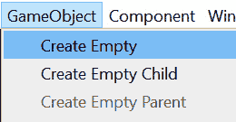

    图 7.1 – GameObject 菜单

1.  将创建一个新的 `GameObject` 并添加到 `GameObject` 中，将显示其当前组件。`GameObject` 仅仅是一个容器。其组件执行与运行项目相关的所有工作。甚至 `GameObject` 的名称也是其组件包含的一个值。

1.  要更改创建的 `GameObject` 的名称，请点击它，在 `GameObject`（默认值）更改为 `Ink` `Story`。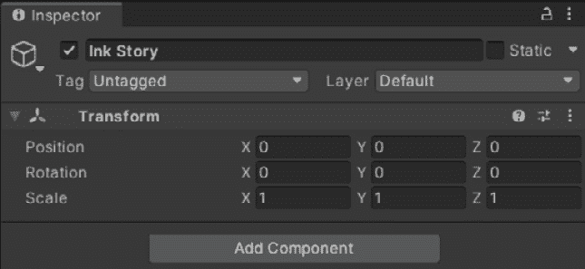

    图 7.3 – 在 Unity 中更改 Ink Story 名称

    新命名的 `Ink` `Story` 将成为运行墨迹故事相关组件的容器。将游戏对象名称更改为 `Ink` `Story` 使得在项目中众多其他对象中更容易找到它，同时也解释了它在项目中的作用。

1.  在 **Inspector** 视图中显示 `Ink` `Story` 的组件，点击 **Add Component**。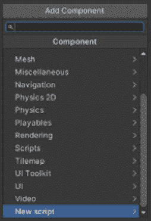

    图 7.4 – 添加组件菜单中的组件列表

1.  在列表中点击 **New script**。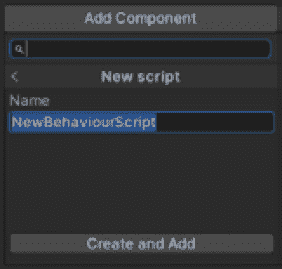

    图 7.5 – 新脚本组件创建

1.  将此新的脚本文件命名为 `inkLoader.cs`。

    注意

    点击 `script` 组件名称并不总是允许在 Unity 中重命名文件。按键盘上的向下箭头两次将选择从搜索移动到文件标题。

    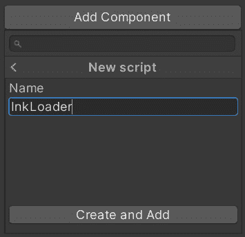

    图 7.6 – 脚本重命名为 InkLoader

1.  重命名文件后，点击 **Create and Add** 按钮。一个新的 C# 文件将被添加到 **Project** 窗口中。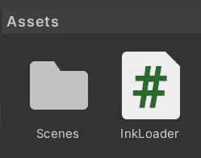

    图 7.7 – Unity 中的新 InkLoader.cs 文件

1.  双击此文件以在 Visual Studio 中打开它进行编辑。

本节已包含了一个逐步过程，用于准备 Unity 项目以使用 ink Story API。我们看到了如何创建`GameObject`并添加`script`组件。在下一节中，我们将在此基础上构建项目，开始使用作为 ink-Unity Integration 插件部分添加到 Unity 中的 Story API。

## 添加 ink Story API

安装 ink-Unity Integration 插件会添加一个额外的`Ink`。它包含三个其他命名空间，分别命名为`Parsed`、`Runtime`和`UnityIntegration`，每个命名空间都包含与其名称相关的类。要处理编译后的 ink JSON 文件，需要`Ink`.`Runtime`命名空间。这告诉 Unity 应该从`ink`命名空间开始，然后找到其中名为`Runtime`的命名空间：

1.  在*创建脚本组件*部分打开的文件中，在已创建文件中已有的那些之后添加一个新的`using`行：

    ```cs
    using System.Collections;
    using System.Collections.Generic;
    using UnityEngine;
    using keyword tells Unity to include the Ink.Runtime namespace and allow its classes to be used as part of this file.
    ```

1.  接下来，创建一个名为`inkJSONAsset`的公共字段，并将`Start()`方法更改为以下内容：

    ```cs
    public class InkLoader: MonoBehaviour
    {
        InkJSONAsset field with the public keyword will allow this value to be changed inside the Unity editor. The addition of the Story class creates a new ink story as part of the Runtime namespace. This is known as the *Story API* because multiple methods will be used as part of the Story class.
    ```

1.  在 Visual Studio 中保存`InkLoader.cs`文件，并返回 Unity。

1.  一段时间后，Unity 将刷新并重新加载更改后的 C#文件。

1.  最后一步是将一个 ink JSON 文件与创建的 C#文件关联。在`InkStory`游戏对象中，在`script`组件中，如下截图所示：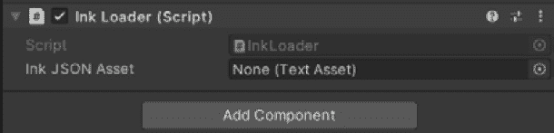

    Figure 7.8 – 新的 Ink JSON Asset 属性在检查器视图中

    属性显示值为`None (Text Asset)`。这意味着没有文件与此属性关联。要更改此，需要添加一个编译后的 JSON 文件。

    注意

    下一步需要 ink JSON 文件。如果没有创建，可以通过创建 ink 文件并让**自动编译**选项创建一个，或者点击现有的 ink 源文件，然后在**检查器**视图中点击**编译**来创建一个新的 JSON 文件。

1.  点击值旁边的**TextAsset**选择圆圈以打开**选择 TextAsset**窗口。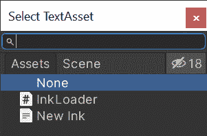

    Figure 7.9 – 选择 TextAsset 窗口

1.  选择一个 ink 编译的 JSON 文件。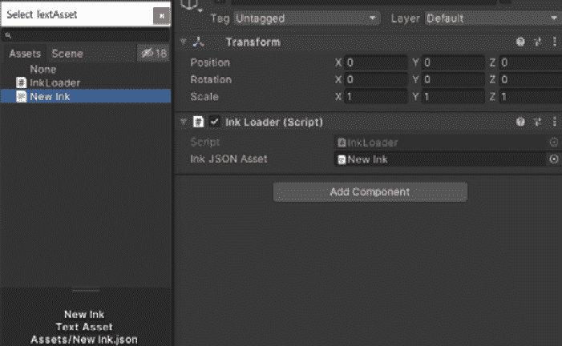

    Figure 7.10 – 更新的 Ink JSON Asset 属性

    在**Ink JSON Asset**属性值更新后，关闭**选择 TextAsset**窗口。

1.  在 Unity 编辑器的中间点击**Play**按钮。

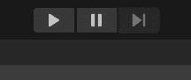

Figure 7.11 – Unity 中的播放按钮

Unity 将运行当前场景，看起来似乎没有发生任何事情。如果没有错误出现在**控制台**窗口中，则一切运行正确。内部，Unity 已加载编译后的 ink JSON 文件，并准备好运行 ink 故事。

通过第二次点击**Play**按钮停止运行场景。

## 运行 ink JSON 文件

ink 故事使用 `Story` 类和方法运行。加载 ink JSON 文件只是第一步。必须告诉 `Story` 类一次加载故事的一个或多个 *行*。

当之前使用 Inky 运行 ink 源文件时，它一次显示一行，并在它们之间有一个空行：

示例 1：

```cs
This is the start.
And then this happens.
```

当在 Inky 中运行时，*示例 1* 生成以下输出：

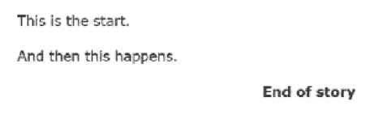

图 7.12 – 示例 1 输出

在 Inky 中，它创建的额外行是其自身使用 Story API 的结果。为了复制此输出，我们需要添加一个新方法：`Continue()`：

1.  在作为 *添加 ink Story API* 部分的一部分使用的相同文件中，在 Inky 中打开文件进行编辑。

1.  将新 ink 源文件的内容更改为 *示例 1* 并然后在 Inky 中保存该文件。保存文件后不要关闭 Inky。现在返回 Unity。

1.  在检测到 ink 源文件的更改后，ink-Unity Integration 插件将自动重新编译 ink JSON 文件。因为它作为 *添加 ink Story API* 部分的一部分与 Ink JSON Asset 属性相关联，ink JSON 文件也将始终正确加载。

1.  如果 `InkLoader.cs` 文件尚未在 Visual Studio 中打开，请双击 **项目** 窗口中的它。

1.  将以下行添加到 `Start()` 方法中：

    ```cs
    void Start()
    {
    Story exampleStory = new Story(InkJSONAsset.text);
      Debug.Log(exampleStory.Continue());
    }
    ```

1.  保存更改后的 `inkLoader.cs` 文件并返回 Unity。

1.  点击 **播放** 按钮来运行当前场景。

    这次，**控制台** 窗口将显示一条消息。

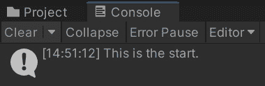

图 7.13 – Unity 中的控制台窗口

`Debug.Log()` 方法使用 `Continue()` 方法返回的内容作为 `Story` 类的一部分，在 **控制台** 窗口中显示一条消息。

每次调用 `Continue()` 方法时，它都会加载 ink 故事的下一行，并返回一个表示它的字符串。然而，该方法有一个问题：它无法检测故事的结尾。为此，需要一个不同的属性。

再次点击 **播放** 按钮来停止正在运行的场景。

## 检查故事是否可以继续

`Continue()` 方法会在有可用的情况下加载故事的下一行。在 *示例 1* 的代码中，有两行。

1.  返回 Visual Studio 并编辑 `Ink` `Loader.cs` 文件。将 `Story()` 方法更改为以下内容：

    ```cs
    void Start()
    {
    Story exampleStory = new Story(InkJSONAsset.text);
    Debug.Log(exampleStory.Continue());
    Debug.Log(exampleStory.Continue());
    }
    ```

1.  在添加新行代码后保存 `InkLoader.cs` 文件。返回 Unity 并点击 **播放** 按钮来播放当前场景和更新后的文件。

1.  将 `Continue()` 方法传递给 `Debug.Log()` 方法。

1.  再次在 Unity 中点击 **播放** 按钮来停止当前场景。

1.  返回 Visual Studio 并编辑 `InkLoader.cs` 文件。将以下代码添加到 `Start()` 方法中：

    ```cs
    void Start()
    {
    Story exampleStory = new Story(InkJSONAsset.text);
    Debug.Log(exampleStory.Continue());
    Debug.Log(exampleStory.Continue());
    Debug.Log(exampleStory.Continue());
    }
    ```

1.  保存更新的 `InkLoader.cs` 文件。

1.  返回 Unity 并播放场景。

    使用 `Continue()` 方法的第三次调用时，将发生错误并在 **控制台** 窗口中显示。

    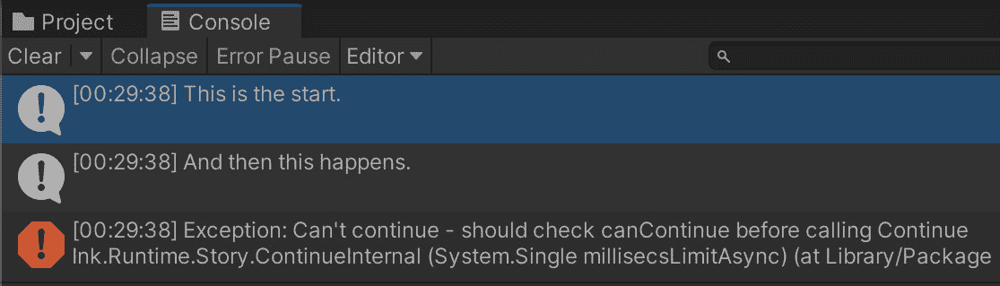

    图 7.15 – Unity 控制台中的 Continue() 错误

1.  点击 `Continue()` 方法不会检查是否有其他行要加载。当没有更多内容时，它会抛出一个错误。

    为了解决这个问题，需要一个在错误中提到的属性。`Story` 类提供了 `canContinue` 属性来检查是否有更多故事内容要加载。它包含一个布尔值。如果有更多内容，`canContinue` 将为 `true`。否则，它将为 `false`。

1.  返回 Visual Studio 并编辑 `InkLoader.cs` 文件。将 `InkLoader.cs` 文件中的 `Start()` 方法更新如下：

    ```cs
    void Start()
    {
    Story exampleStory = new Story(InkJSONAsset.text);
    while(exampleStory.canContinue)
          {
              Debug.Log(exampleStory.Continue());
          }
    }
    ```

1.  在 Visual Studio 中保存编辑后的 `InkLoader.cs` 文件。

1.  返回 Unity 并再次播放场景。

使用 `while` 循环，故事将逐行加载，直到没有内容为止。一旦发生这种情况，`canContinue` 属性将更改为 `false`，循环结束。

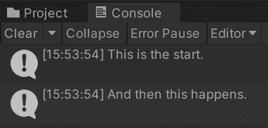

图 7.16 – 使用更新后的 while 循环的 Console 窗口

将 `canContinue` 属性与 `Continue()` 方法结合使用是使用 Story API 时的常见模式。更高级的使用模式可能不会使用 `while` 循环，但属性和方法通常会一起出现。

# 以编程方式选择选项

仅显示 ink 故事的文本具有有限的有用性。大多数高级 ink 故事使用 weave 来展示不同的选项。除了 `Continue()` 方法和 `canContinue` 属性外，Story API 还有一个名为 `currentChoices` 的属性，它包含由最近的 weave 生成的选项列表。

如在 *检查故事是否可以继续* 部分所示，`canContinue` 属性受 `Continue()` 方法的影响。在每行加载并返回为字符串后，如果还有更多故事要加载，`Story` 类将更新 `canContinue` 属性。这也适用于 `currentChoice` 属性。当使用 `Continue()` 方法时，它将加载下一行 *以及* 任何 weave。

注意

任何之前在本章中使用的游戏对象或 C# 文件都可以安全删除。本节将创建一个新的游戏对象和脚本组件，并使用不同的代码来处理 weave 和选项。

## 检测 ink 选项

对 weave 进行操作的第一步是检测其选项是否已通过 `currentChoices` 属性加载。这意味着需要 `canContinue` 属性和 `Continue()` 方法。第一个属性防止尝试加载可能不存在的内容，第二个属性则加载当前行和任何沿途的 weave：

1.  在一个没有使用 Story API 的新或现有 Unity 项目中，创建一个新的空 `GameObject`。将其命名为 `Ink` `Choices`。

    图 7.17 – ink Choices GameObject

1.  如在 *创建脚本组件* 部分所示，在 `Ink` `Choices` 游戏对象上创建一个新的 `script` 组件。将此新文件命名为 `LoadingChoices.cs`。

    图 7.18 – Assets 窗口中的 LoadingChoices.cs 文件

1.  在 **Assets** 窗口中双击 `LoadingChoices.cs` 文件，以在 Visual Studio 中打开它进行编辑：

    ```cs
    using System.Collections;
    using System.Collections.Generic;
    using UnityEngine;
    using Ink.Runtime;
    public class LoadingChoices : MonoBehaviour
    {
        public TextAsset InkJSONAsset;
        void Start()
        {
            Story InkStory = new Story(InkJSONAsset.text);
            InkStory.Continue();
            foreach (Choice c in InkStory.currentChoices)
            {
                Debug.Log(c.text);
            }
        }
    }
    ```

1.  在 Visual Studio 中保存文件并返回 Unity。

1.  创建一个新的 ink 文件，并将其命名为（或重命名为）`Example3.ink`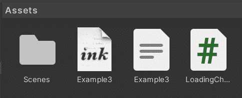

    图 7.19 – Assets 窗口中的 Example3.ink 文件

1.  按照在 *运行 ink JSON 文件* 部分中的说明，将自动生成的 ink JSON 文件与 `Ink` `Choices` 游戏对象属性关联。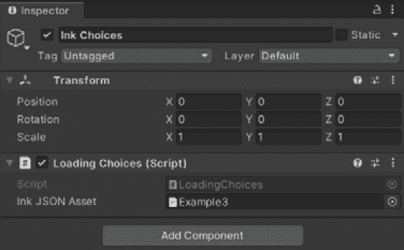

    图 7.20 – 与 ink JSON 资产属性关联的 Example3.json 文件

1.  在 Inky 中打开 `Example3.ink` 文件进行编辑。将其更改为以下内容：

    ```cs
    Sam reached out, not quite touching Juan.
    * "Are you just going to leave me?"
    * "He didn't mean anything to me!"
    * "Can't we just start again?"
    ```

1.  保存更改后的 `Example3.ink` 文件。返回 Unity 并运行场景。现在 Unity 的 **控制台** 窗口将显示每个选项的文本内容。

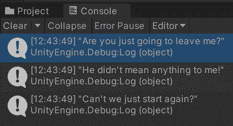

图 7.21 – 控制窗口中的 Example 3 选项

使用 `Continue()` 方法不仅加载了 *Example 3* 的第一行，还加载了代码中出现的第一个编织。`currentChoices` 属性包含每个编织中存在的选项的对象的 `List<Choice>`。`List<Choice>` 的每个元素都是一个 `Choice` 对象，这是一个包含两个重要属性的特定期类：`index` 和 `text`。

在 `foreach` 循环中，检索每个 `Choice` 对象的 `text` 属性。然后将其传递给 `Debug.Log()` 方法。当运行时，ink 故事被加载。接下来，加载第一行和编织。在循环内部，使用 `currentChoices` 属性检索每个 `text` 属性的值。每个值随后在 `Debug.Log()` 方法中显示。

## 使用 Unity API 进行选择

玩家通过选择选项来继续故事。在 ink 源代码中，使用星号（`*`）或加号符号（`+`）创建一个选择。当运行时，ink 运行时代码作为 `Story` 类的一部分从这些源代码选择中创建 *选项*。然而，要在一个 ink 故事中前进，必须 *做出* 选择。它必须存在于代码中，然后作为选项呈现。

`Story`类提供了一个名为`ChooseChoiceIndex()`的方法。该方法接受`currentChoices`属性中当前元素总数范围内的一个*索引*（`int`）。`currentChoices`列表中的每个`Choice`对象都有`index`和`text`属性。在*检测墨水选择*部分，使用了`text`属性来显示从墨水源文件生成的选项。要*做出*选择，则使用其`index`属性：

1.  双击*检测墨水选择*部分中的`LoadingChoices.cs`文件，如果它尚未在 Visual Studio 中打开，则打开它进行编辑。

1.  将文件更新如下：

    ```cs
    void Start()
    {
    Story InkStory = new Story(InkJSONAsset.text);
    InkStory.Continue();
    Choice exampleChoice = InkStory.currentChoices[0];
    InkStory.ChooseChoiceIndex(exampleChoice.index);
    Debug.Log(InkStory.Continue());
    }
    ```

1.  在 Visual Studio 中保存文件，返回 Unity，并运行场景。

`currentChoices`属性中的`0`)位置元素。

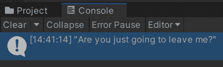

图 7.22 – 控制窗口中从 Example 3 选择的选项

`ChooseChoiceIndex()`方法根据`exampleChoice`的`index`属性在编织中选择第一个选项。然后，在 Unity 的`Continue()`方法中显示出来。

当使用 ink 和 Unity 进行选择时，需要按顺序发生一系列事情。首先，必须加载一个故事。其次，至少需要加载一行，该行还包含一个编织点。接下来，必须使用`Story`类的`currentChoices`属性来检索为玩家创建的选项。然后，需要使用从`currentChoices`属性检索到的`Choice`对象的`index`属性来使用`ChooseChoiceIndex()`方法。最后，需要加载故事的下一部分。这次额外的加载将包括使用`ChooseChoiceIndex()`方法选择的选项的文本（如果未使用选择性输出）。然后，故事的其余部分可以继续。

## 加载所有文本直到下一个编织点

虽然对于加载故事内容很有用，但必须多次使用`Continue()`方法逐行加载。与*使用 Unity API 进行选择*部分中的代码一样，这意味着它需要出现在多行代码中。为了预见这个问题，Story API 还包括一个名为`ContinueMaximally()`的方法。

与逐行加载不同，`ContinueMaximally()`方法会加载所有内容，直到遇到一个编织点。对于许多项目来说，当编织点之间或由墨水内部作为编织本身的一部分生成多行文本时，这是一种首选的方法：

1.  在 Unity 中创建一个新的墨水源文件。命名（或重命名）文件为`Example4.ink`。

1.  在 Inky 中打开`Example4.ink`进行编辑，并将其更新如下：

    ```cs
    You read all the books and convinced your parents into going to the zoo. You just had to know. 
    You enter the area containing the snakes and walk up to the glass.
    -> snake_house
    == snake_house
    + (tap){tap < 2}[Tap the glass and say something {tap > 0: again}]
        {tap <= 1: You tap on the glass in front of you.
          The snake turns slightly toward the noise and
          sticks out its tongue.}
        {tap > 1: No, you finally decide. You cannot talk
          to snakes.}
        -> snake_house
    + [Ignore the snake]
        You regard the coiled snake and then walk out.
        {tap > 1: What were you thinking? Talking to
          snakes is fictional.}
        -> DONE
    ```

1.  更新`Example4.ink`文件，将其内容从*Example 4*中提取。

1.  点击`Example3.json`到`Example4.json`。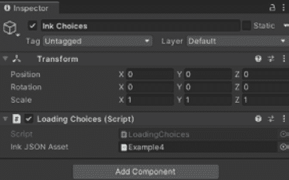

    图 7.23 – 在检查器视图中更新的 Example4.json 值

1.  双击 `LoadingChoices.cs` 以在 Visual Studio 中打开它进行编辑。

1.  将文件更新如下：

    ```cs
    using System.Collections;
    using System.Collections.Generic;
    using UnityEngine;
    using Ink.Runtime;
    public class LoadingChoices : MonoBehaviour
    {
        public TextAsset InkJSONAsset;
        void Start()
        {
            Story InkStory = new Story(InkJSONAsset.text);
            Debug.Log(InkStory.ContinueMaximally());
            Choice exampleChoice =
            InkStory.currentChoices[0];
            Debug.Log(exampleChoice.text);
            InkStory.ChooseChoiceIndex
              (exampleChoice.index);
            Debug.Log(InkStory.ContinueMaximally());
        }
    }
    ```

1.  在 Visual Studio 中保存更改，返回 Unity，并运行场景。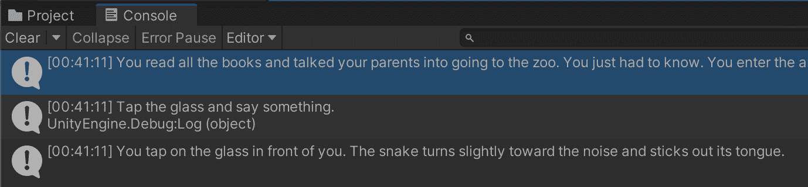

    

    图 7.24 – 从示例 4 加载的行和选择文本

1.  停止正在运行的场景。

`ContinueMaximally()` 方法的第一次使用加载了前两行和编织点。接下来，`ChooseChoiceIndex()` 方法选择了第一个选项。第二次 `ContinueMaximally()` 方法的使用，与内部转向相结合，再次加载了下一行和编织点。

当与循环结构一起工作时，`ContinueMaximally()` 方法通常比使用 `Continue()` 方法更好。使用 `ContinueMaximally()` 方法将始终加载所有新的文本，直到遇到下一个编织点。对于文本可能在编织点之间出现的情况，单次使用 `ContinueMaximally()` 方法可以达到与多次调用 `Continue()` 方法加载相同内容相同的效果。

本主题从使用 `currentChoices` 属性检测运行中的墨迹故事中的选择开始。然后，我们转向制作选择，包括在墨迹代码中创建它们，然后使用 `ChooseChoiceIndex()` 方法来选择它们。最后，我们看到了如何将 `ContinueMaximally()` 方法与 `currentChoices` 属性和 `ChooseChoiceIndex()` 方法结合使用。在下一个主题中，我们将扩展这些概念。为了创建一个动态界面，我们可以使用我们对 Story API 的知识来关联 `GameObjects` 用户界面，并在屏幕上点击按钮与推进墨迹故事之间建立连接。

# 创建动态用户界面

`Story` 类提供了多种加载和推进故事的方法。然而，如果没有用户界面，玩家将无法在选项之间进行选择并看到结果。为了解决这个问题，需要额外的游戏对象来显示文本并为用户提供一个点击不同内容的界面。

首先，需要一个新项目。而不是示例代码，这将使用不同的用户界面对象来与用户一起工作。项目还需要创建一个 `GameObject`，在运行时可以从 `GameObject` 中移动以成为 *预制件*。

由 `ContinueMaximally()` 方法返回的当前行和在 `currentChoices` 属性中的选择在墨迹故事运行时可能具有动态性。结合预制件，C# 代码可以通过玩家点击按钮在故事中进行选择来动态地重新创建界面。

在这个主题中，我们将通过从创建一个新的 Unity 项目开始，并创建必要的游戏对象，来逐步学习如何创建一个动态界面。接下来，我们将把预制件与我们的代码关联起来。最后，我们将结束于一个关于将所有内容组合在一起并运行组合项目的部分。

## 创建新项目和游戏对象

让我们首先创建一个新的项目和游戏对象：

1.  在 Unity 中创建一个新的项目。将此项目命名为 `The Body` 并使用 2D 模板。

    图 7.25 – 以 The Body 命名的 Unity Hub 项目创建

    重要提示

    在进行任何其他操作之前，请按照 *第六章* 中 *添加和操作 ink-Unity 集成插件* 的说明，在新项目中安装 ink-Unity Integration 插件。

1.  一旦 Unity 创建了项目，请向 `Canvas` 游戏对象添加一个 `Canvas` 游戏对象可以通过选择 `Canvas` 游戏对象访问，Unity 将自动添加一个 `EventSystem` 游戏对象。

1.  点击 `Canvas` 游戏对象。在 **检查器** 视图中，点击 **添加组件** 按钮。选择 **布局** 然后选择 **垂直布局组**。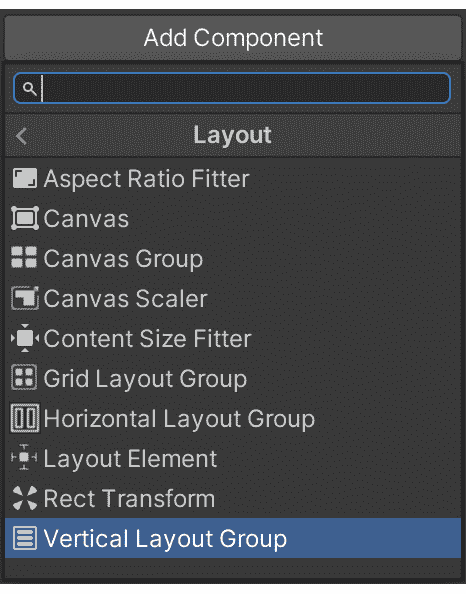

    图 7.27 – 选择垂直布局组组件

    垂直布局组将自动以垂直模式在其内部对齐所有其他 UI 游戏对象。

1.  在垂直布局组中，点击 **子对齐** 下拉菜单并选择 **中间居中**。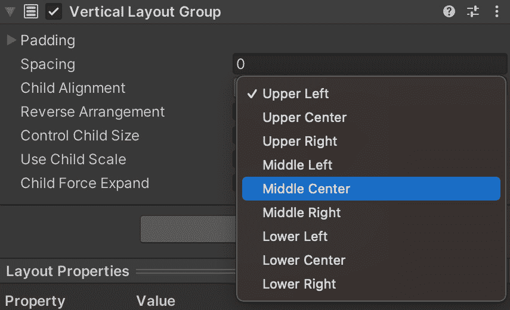

    图 7.28 – 已选择中间居中的垂直布局组

1.  在 `Text` 游戏对象中选择 `Canvas` 游戏对象。`Text` 游戏对象可以在 `Text` 下找到，并将作为 `Canvas` 游戏对象的子对象添加。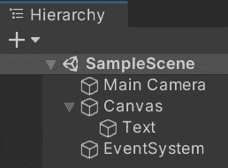

    图 7.29 – 在层次结构视图中添加的 Text 游戏对象

1.  在 `Button` 游戏对象中选择 `Canvas` 游戏对象。`Button` 可以在 `Button` 游戏对象下找到，并将作为 `Canvas` 游戏对象的子对象添加。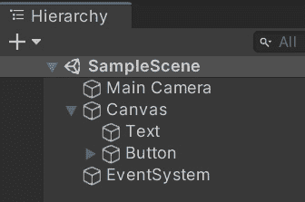

    图 7.30 – 在层次结构视图中添加的 Button 游戏对象

1.  选择新添加的 `Button` 游戏对象，然后从 **项目** 窗口中的 `Button` 拖动并点击。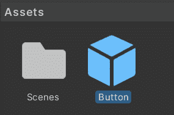

    图 7.31 – 在项目窗口中创建的预制件

1.  在 `Button` 游戏对象图标在 `Button` 游戏对象中的 `Button` 游戏对象更改后，现在它是一个预制件，它作为一个资产存在，不需要在当前的 **层次结构** 视图中存在。（它稍后将通过代码实例化。）

在创建项目和游戏对象后，下一项是一个 `script` 组件。这将创建运行故事所需的必要属性。

## 关联预制件和 ink JSON 文件

在上一节创建游戏对象后，我们现在将创建一个 `script` 组件，创建必要的属性，然后将资产与属性关联：

1.  在**层次结构**视图中选择`Canvas`游戏对象。

1.  在使用*创建脚本组件*部分中的说明的`script`组件中。

1.  （或创建后重命名）此新文件为`InkStory.cs`。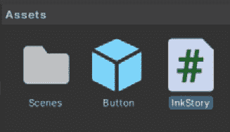

    图 7.32 – 创建的 InkStory.cs 文件

1.  双击`InkStory.cs`文件以在 Visual Studio 中进行编辑。

1.  将代码更新为以下内容：

    ```cs
    using System.Collections;
    using System.Collections.Generic;
    using UnityEngine;
    using Ink.Runtime;
    public class InkStory : MonoBehaviour
    {
        public TextAsset InkJSONAsset;
        public GameObject prefabButton;
    }
    ```

Unity 提供的默认代码中新增了三项内容。第一项是包含`Ink.Runtime`命名空间，这将允许我们在故事运行时使用 ink。后两项新增内容是我们将在 C#中的`public`关键字中使用的属性，以创建可以在编辑器中调整的属性：

1.  保存文件并返回 Unity。

1.  创建一个名为（或创建后重命名）`TheBody.ink`的新 ink 文件。

1.  在 Inky 中打开`TheBody.ink`文件进行编辑，并从 GitHub 的文件中复制内容。

    注意

    此示例的代码`TheBody.ink`可以在 GitHub 上找到。

1.  保存 ink 源文件并返回 Unity。

    在`InkStory.cs`中使用的`public`关键字为`Canvas`游戏对象添加了两个新属性。

    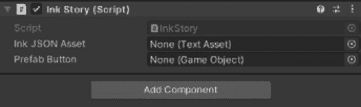

    图 7.33 – 在检查器视图中添加的属性

1.  点击`Ink` `JSON Asset`属性旁边的文件选择，打开**选择文本资产**窗口。

1.  将 ink-Unity Integration 插件创建的 ink JSON 文件与**Ink JSON Asset**属性关联，然后关闭**选择文本资产**窗口。

1.  点击`Button`预制件旁边的文件选择，打开**选择游戏对象**窗口。

1.  如果未打开，在**选择游戏对象**窗口中选择**资产**选项卡。

1.  选择**按钮**预制件，然后关闭**选择游戏对象**窗口。

将 ink JSON 文件与`Button`预制件关联的结果是，代码在运行时可以访问这些资源。

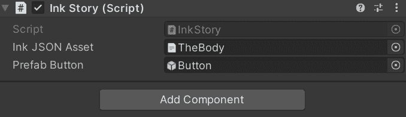

图 7.34 – 更新了 Ink Story 组件，包含 ink JSON 文件和按钮预制件值

与`script`组件的属性关联的文件，现在可以编写额外的代码。更改 ink 源文件`TheBody.ink`并保存更改将自动更新`TheBody.json`文件。同样，对于`Button`预制件也是如此。它也可以进行调整，并更改其设置。只要这两个资源没有重命名，Unity 将保持关联，并允许开发者在场景运行时独立于使用它们的代码自定义其设置。

到本节结束时，我们将创建一个 Unity 项目、其游戏对象以及相关的具有属性的资源。在我们能够运行项目之前，我们需要编写更多代码来根据正在运行的墨迹故事的内容动态创建用户界面。在下一节中，我们将编写代码来使用预制件并根据`ContinueMaximally()`方法和`currentChoices`属性的文字输出创建动态界面。

## 制作动态用户界面

在 Unity 项目可以运行之前，需要添加更多的代码。我们需要结合本章中解释的概念，包括使用`ContinueMaximally()`方法和`currentChoices`属性。我们还需要在代码中添加一个整体循环，使用`canContinue`属性检查在推进故事之前是否有更多内容。

我们首先在不会由 Unity 编辑器使用的类中添加我们将需要的属性。我们使用`private`关键字标记这些属性。

在 Visual Studio 中打开`InkStory.cs`进行编辑：

```cs
using System.Collections;
using System.Collections.Generic;
using UnityEngine;
using UnityEngine.UI;
using Ink.Runtime;
public class InkStory : MonoBehaviour
{
    public TextAsset InkJSONAsset;
    public GameObject prefabButton;
    private Story inkStory;
    private Text currentLinesText;
}
```

要与用户界面游戏对象一起工作，需要另一个`using`关键字的实例。这将为`Text`和`Button`等在此文件中使用的类添加访问权限。

`Story`类和`Text`游戏对象`currentLinesText`将在本代码的多个方法中使用。为了确保它们可以以这种方式使用，它们必须是`InkStory`类的属性，而不是任何方法中的变量。

必须首先发生的是加载 ink JSON 文件。接下来，需要一个对`Text`组件的引用。每次用户做出选择时，都会显示文本。这意味着需要更新`Text`游戏对象的`text`属性。然而，由于它是`Canvas`的子项，需要使用`GetComponentInChildren()`方法：

```cs
void Start()
{
inkStory = new Story(InkJSONAsset.text);
currentLinesText = GetComponentInChildren<Text>();
}
```

加载文本内容和当前选项的过程将被多次使用。这意味着作为该过程一部分使用的所有代码都应该是一个独立的方法：

```cs
void LoadTextAndWeave()
{
if (inkStory.canContinue)
{
currentLinesText.text = inkStory.ContinueMaximally();
foreach (Choice c in inkStory.currentChoices)
{
GameObject cloneButtonGameObject = 
  Instantiate(prefabButton, this.transform);
Button cloneButtonButton =
  cloneButtonGameObject.GetComponent<Button>();
cloneButtonButton.onClick.AddListener(delegate
{
inkStory.ChooseChoiceIndex(c.index);
LoadTextAndWeave();
                });
Text cloneButtonText = cloneButtonButton.
  GetComponentInChildren<Text>();
cloneButtonText.text = c.text;
}
}
}
```

在新的`LoadTextAndWeave()`方法中，如果`canContinue`属性为真，将加载新的文本内容。使用`foreach`关键字，通过 Unity 中的`Instantiate()`方法添加新的按钮。这将在运行时将预制件作为 GameObject 实例化，通过代码创建它并将其添加到正在运行的场景中。

最后，使用 Unity 中按钮的`OnClick`属性和`AddListener()`方法。这会将一个集合添加到其中，指定哪些函数应该在点击发生时被通知。`delegate`关键字允许开发人员将方法作为参数传递给另一个方法。在这种情况下，在`foreach`循环的同一作用域内创建了一个简短的方法。因此，可以在创建的方法中使用`index`属性。

每次按钮被点击时，`Story`类方法`ChooseChoiceIndex()`将使用正确的索引被调用，并且`LoadTextAndWeave()`方法将再次被调用，刷新`currentLinesText`方法的值并更新屏幕上显示的当前按钮：

1.  要运行当前代码，还需要进行一项更改。需要在`Start()`方法中调用`LoadTextAndWeave()`方法：

    ```cs
    void Start()
    {
    inkStory = new Story(InkJSONAsset.text);
    currentLinesText = GetComponentInChildren<Text>();
    LoadTextAndWeave();
    }
    ```

1.  在 Visual Studio 中保存当前代码。返回 Unity 并运行场景。

    立即，两个问题将变得明显。首先，默认的黑色文本在深色背景上使得文本难以阅读。其次，只显示前几个单词。

    

    图 7.35 – 在 Unity 中运行的 Body 项目

1.  单击**（继续。）**按钮以查看更多两个问题。

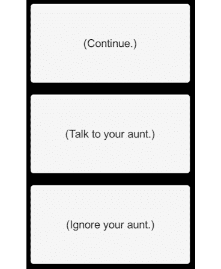

图 7.36 – 在 The Body 中动态创建的按钮

第一个问题是在替换第一个按钮而不是添加两个按钮。这是由于对`LoadTextAndWeave()`方法的第二次内部调用引起的。首先，加载了文本内容和按钮。然后，当**（继续。）**按钮被点击时，它再次被调用，添加了更多按钮。

我们还可以观察到按钮很小，难以阅读。默认情况下，Unity 将为`Button`游戏对象假设一些值。在调整我们的代码时，我们还需要更改属性：

1.  停止运行场景。

1.  要开始修复文本问题，首先，在`160`和`30`中选择`Text`游戏对象。

1.  通过点击和拖动使用`800`宽度和`300`高度。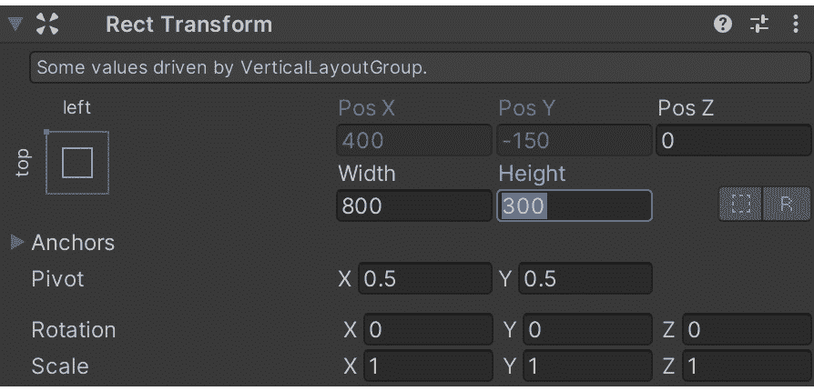

    图 7.37 – Unity 中带有更新后的宽度和高度值的检查器视图

1.  单击`14`到`24`。这将使起始大小更大。

1.  单击`default`将其更改为`white`，然后关闭**颜色**窗口。

    更新后的值现在将显示更多文本，并且由于白色背景较暗，其可读性有所提高。

    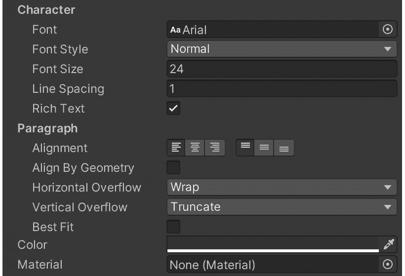

    图 7.38 – 更新后的 Text GameObject 组件值

1.  在**项目**窗口中单击`Button`Prefab。

1.  与`Text`游戏对象一样，其默认宽度为`160`，高度为`30`。将宽度更改为`250`，高度更改为`100`。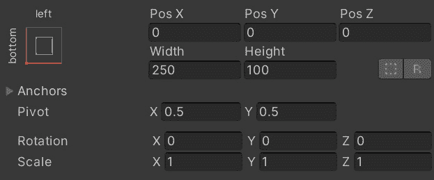

    图 7.39 – 更新后的 button Prefab 值

1.  返回到 Visual Studio 中的`InkStory.cs`进行编辑。

代码的修复是一个小但重要的更改。每次按钮被点击时，代码将需要销毁当前按钮并创建新的按钮：

1.  需要一种新方法来执行特定任务，即销毁`Button`子对象：

    ```cs
    DestroyButtonChildren() method needs to be called as part of the delegate method. Before the content is refreshed, the current buttons need to be destroyed:

    ```

    cloneButtonButton.onClick.AddListener(delegate

    {

    inkStory.ChooseChoiceIndex(c.index);

    DestoryButtonChildren();

    LoadTextAndWeave();

    });

    ```cs

    ```

1.  在 Visual Studio 中保存更新后的文件并返回 Unity。

    `DestroyButtonChildren()`方法查找特定的`标签`值。这需要添加到`按钮`预制件中。

1.  在**项目**窗口中选择`按钮`预制件。

1.  在**检查器**视图中，点击**标签**下拉菜单，然后选择**添加标签…**选项。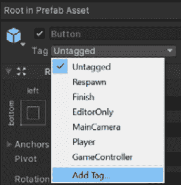

    图 7.40 – Unity 检查器视图中的标签下拉菜单

1.  点击**+**图标向列表中添加一个新的标签。在提示中，使用名称*ButtonChoice*。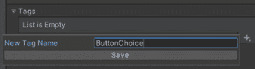

    图 7.41 – 新标签名称

1.  点击**保存**以创建一个新的标签。

1.  点击已添加到`ButtonChoice`标签中的`按钮`预制件，必须选择它。

1.  在**标签**下拉菜单中，选择**ButtonChoice**。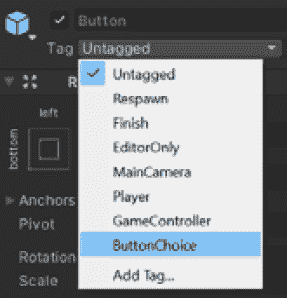

    图 7.42 – 将 ButtonChoice 选项添加到标签下拉菜单

1.  运行场景。通过点击按钮进行选择并查看结果来玩故事。

1.  玩完故事后，停止运行场景。

对`文本`游戏对象和代码的更改将加载新的文本，并在玩家点击按钮时正确更新选择。虽然步骤较多，但这种方法可以用于大多数 ink JSON 文件，以向玩家展示文本和动态按钮，让他们做出不同的选择，并在屏幕上看到结果。

# 摘要

在本章中，我们探讨了添加`脚本`组件、将 ink JSON 文件与属性关联以及使用`Story`类中的方法和属性来推进运行中的 ink 故事的过程。我们看到了`Continue()`方法一次加载一行，而`ContinueMaximally()`方法则加载所有文本直到遇到编织点。当与`canContinue`属性结合使用时，这些方法允许从 ink JSON 文件中加载文本内容，并在内容耗尽时防止出现任何错误。通过`currentChoices`属性，我们探讨了如何使用循环，例如使用`foreach`关键字。当我们使用`ChooseChoiceIndex()`方法时，我们选择了想要从编织点中选择的选项，并再次使用`Continue()`或`ContinueMaximally()`方法推进故事。

通过在 Unity 中设置用户界面游戏对象，我们构建了一个动态过程来加载墨水故事内容，销毁按钮，然后创建新的按钮。需要创建一个`按钮`预制件时，我们看到了代码在运行时如何实例化这些预制件。调整`文本`和`按钮`游戏对象的值，我们完成了一个运行 ink JSON 文件的界面，并构建了一个许多其他项目都可以使用的系统，这些项目使用相同的游戏对象和组织。

在下一章中，我们继续使用`Story`类及其方法。我们将探讨如何使用 C#代码检索和更新墨迹故事中的变量值。我们还将了解如何访问 ink 中的函数以及如何向它们传递和接收数据。结合用户界面游戏对象，我们将构建一个示例，展示如何通过使用 ink 中的内容在 Unity 中创建多个动态界面，从而实现 ink 运行时与 Unity 代码之间的通信。

# 问题

1.  `Story`类中的`Continue()`和`ContinueMaximally()`方法之间的区别是什么？

1.  `Story`类中的`ChooseChoiceIndex()`方法期望哪种类型的数据？

1.  在`Story`类中，如何使用`canContinue`属性与`Continue()`和`ContinueMaximally()`方法一起使用？

1.  Unity 中的 Prefab 是什么？

1.  在`Story`类的`currentChoices`列表属性中可以找到哪种类型的对象？
