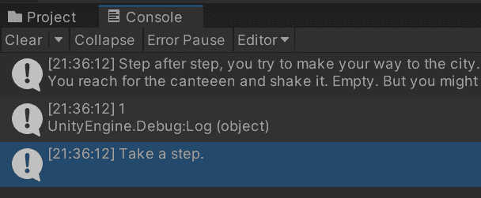

# 第九章：*第九章*：故事 API – 观察和响应故事事件

在本章中，我们将探索运行中的 ink 故事中的变化如何触发 Unity 中的事件。我们将学习 ink-Unity 集成插件提供的 Story API 中的`ObserveVariable()`和`ObserveVariables()`方法如何允许您准备函数以响应 Unity 中的未来事件。我们将从观察单个变量开始，然后继续学习如何观察多个值。

在*第八章*，*故事 API – 访问 ink 变量和函数*中，重点是通过对 ink 故事调用其函数和从 Unity 更改其值来控制 ink 故事。本章将这两个系统之间的重点进行了反转。在本章中，我们将探索如何使用叙事事件，例如由于玩家的选择而更改的变量，来控制 Unity 中呈现的信息。

在本章中，我们将涵盖以下主题：

+   监听变量变化

+   动态响应 ink 故事

+   观察多个 ink 值

# 技术要求

本章中使用的示例，在`*.ink`文件中，可以在 GitHub 上找到：[`github.com/PacktPublishing/Dynamic-Story-Scripting-with-the-ink-Scripting-Language/tree/main/Chapter9`](https://github.com/PacktPublishing/Dynamic-Story-Scripting-with-the-ink-Scripting-Language/tree/main/Chapter9)。

# 监听变量变化

ink 中的变量是全局的。一旦创建，它们可以在故事的任何位置访问。在第*第八章*，*故事 API – 访问 ink 变量和函数*中，我们学习了如何使用`variablesState`属性来访问或更改它们的值。然而，我们不仅可以直接在 Unity 中干预正在运行的 ink，我们还可以等待 ink 中发生某些事情，然后在 Unity 中做出反应。这种类型的方法所使用的动词，作为故事 API 的一部分，被称为*观察*。

当我们观察 ink 变量时，我们可以编写自己的规则，关于当其值发生变化或达到某个阈值时应该发生什么。我们只是在*观察*其值。由于这种观察，我们做什么取决于开发者。

在这个主题中，我们将探索`ObserveVariable()`方法。

推荐

建议您为此主题创建一个新的 Unity 2D 项目。有关如何创建新的 Unity 项目以及导入 ink-Unity 集成插件的说明，请参阅*第六章*，*添加和使用 ink Unity 插件*。

我们将执行以下步骤：

1.  在一个新的 Unity 项目中，使用带有 ink-Unity 集成插件的 2D 模板，创建一个新的空游戏对象，并将其命名为`InkStory`。此游戏对象将包含`script`组件，并响应 Ink 代码中的变化。

1.  创建一个新的 Ink 文件，并将其命名为`InkStoryStepCounter.ink`。

1.  在 Inky 中打开`InkStoryStepCounter.ink`进行编辑，并更新其内容为`示例 1 (InkStoryStepCounter.ink)`。

1.  在`InkStory`游戏对象内部创建一个新的`script`组件。创建的文件命名为`InkStoryScript.cs`。

1.  在 Visual Studio 中打开`InkStoryScript.cs`进行编辑。

    将`InkStoryScript.cs`更新为`示例 1 (InkStoryScript.cs)`。

    `ObserveVariable()`方法是在本章中引入的新方法，接受两个参数。第一个参数是要观察的变量的名称，第二个是要调用的函数或方法。

    本例中使用的代码还结合了一个名为`ObserveVariable()`的 C#概念，该方法在 ink 中观察一个变量。如果其值在任何时候发生变化，lambda 表达式将运行。这发生在正常流程之外。

1.  关联编译后的 Ink JSON 文件。

1.  运行项目。

当项目运行时，`ObserveVariable()`方法和第三个将是作为第一个选项产生的文本：

图 9.1 – 在 Unity 中按执行顺序显示文本输出

第二条消息在选项的第三个文本之前显示值的原因是因为执行顺序。在运行中的 ink 故事中，`ObserveVariable()`方法发生在文本输出为选项生成并返回 Unity 之前。这种方式下，委托的 lambda 表达式出现在正常执行流程之外。每当观察变量的值发生变化时，函数会立即被调用，无论此时周围是否有其他代码正在执行。

在下一节中，我们将在此基础上进行构建。通常，在 Unity 中，只有在变量发生变化时才应该通知 Unity，这样可以释放执行时间，让 Unity 执行其他任务，并允许开发者编写更响应式的代码，只有在需要时才运行。

# 动态响应 ink 故事

在 Unity 中，当项目运行时，作为正常执行周期的一部分，会调用多个方法。通常，如`Update()`这样的方法，是 Unity 中行为脚本的一个常见部分，包含许多行代码。甚至像`FixedUpdate()`这样的方法，在每个运行项目中的物理计算周期结束时被调用，也可能包含多个部分。任何依赖于其他系统（如与 ink 通信的系统）的代码也可以在每个周期中增加额外的时间。

使用`ObserveVariable()`方法允许 ink 的数据只在需要时更新 Unity。因为 Story API 只有在必要时才会调用委托函数，所以 Unity 也只有在需要知道变化时才会获取数据。这也会发生在 Unity 中`Update()`方法或`FixedUpdate()`方法之外的使用。

在本节中，我们将检查`ObserveVariable()`方法如何在 Unity 外部作为其他方法的一部分运行。它只会在值发生变化时调用委托函数，从而允许 Unity 中动态响应。

返回上一节创建的项目，并执行以下步骤：

1.  将`InkStoryScript.cs`文件更新为`示例 2 (InkStoryScript.cs)`。

1.  在`Update()`方法中，正在进行四个不同的动作。

    **第一**个是变量时间的增加，使用最新的`Time.deltaTime`，这是在十进制（float）数字中测量的循环之间的毫秒数。**第二**个是将其浮点值转换为整数。这个操作移除了数字的小数部分。**第三**个动作是一个称为`%`的数学运算，可以用来找到除法的余数。这个操作称为**模运算**。然而，许多编程语言也使用术语**余数运算符**。当这个操作执行时，它将确定一个数字可以被另一个数字除多少次。在这种情况下，使用`60`的余数，`seconds`变量将始终等于自项目开始以来经过的秒数，除以`time`变量。

    在`Update()`方法中的**第四**个动作是将`seconds`变量赋值为秒数，这是由之前解释的动作定义的。在 Unity 的每个循环中，这个数字都会更新，`seconds`变量将始终保持最新。

    在委托函数中发生最后一个动作，即使用`Destroy()`方法。在代码中，一旦`steps`ink 变量的值等于由 Unity 确定的`3`，它将从一个场景中移除一个按钮。这有助于保持按钮与 Unity 外部更改的值之间的连接。一旦 ink 变量更改并被报告给 Unity，按钮就会被移除。

    在`Start()`方法的最后一行，为按钮的`onClick`事件提供了一个监听函数。当按钮被点击时，与监听器关联的任何函数都将被调用。在这个例子中，点击按钮将调用新的`TakeStep()`方法。这将加载下一个文本内容，直到遇到 ink 代码中的下一个编织点，然后选择编织中的第一个（`0`）选项。这将导致 ink 代码内部循环。

    在创建代码后，还需要两个步骤才能播放项目。首先，需要向项目中添加一个新的`Button`游戏对象。然后，一旦`Button`游戏对象存在，它必须与新代码中的`InkStory`属性相关联。

1.  在 Unity 中创建一个新的`Button`游戏对象。

1.  将`Button`游戏对象与`Button Step`属性关联。

1.  播放项目。

1.  创建的`Button`游戏对象出现在场景底部。点击`Button`游戏对象四次将导致其消失，并在**控制台**窗口中显示一条消息：

    图 9.2 – 由委托函数生成的控制台窗口中的消息

1.  停止项目。

当项目首次启动时，代码的`Update()`方法在每个周期中都会被调用。在内部，它更新 Unity 代码中的`time`和`seconds`变量。每当点击`Button`游戏对象时，它就会推进墨迹代码，该代码会内部循环。由于使用了`ObserveVariable()`方法，每当墨迹变量步骤更新时，它都会调用委托函数并测试传递给它的新值。一旦达到`3`（基于总共四次点击将其从`0`移动到`3`），委托函数就在`Button`游戏对象中创建了一条消息。

本节中使用的示例遵循一个常见的模式，其中 Unity 在方法（如`Update()`）中执行自己的计算，并动态响应墨迹故事的变化。而不是在每个周期中检查`steps`墨迹变量是否作为`variablesState`属性的一部分发生变化，如果值没有变化，则会浪费时间，委托函数允许 Unity 仅在需要时采取行动。对于更复杂的项目，这是首选的方法，并且通常会产生更快的项目。

在墨迹中可以观察到多个变量。根据设计的复杂性，Unity 项目可能对观察多个墨迹值并更新屏幕区域以显示故事进展或玩家当前统计数据感兴趣。在这些情况下，需要不同的方法：`ObserveVariables()`。在下一节中，我们将演示如何使用此方法。

# 观察多个墨迹值

与`ObserveVariable()`方法并列的是另一个名为`ObserveVariables()`的姐妹方法。然而，虽然`ObserveVariable()`方法接受变量名和一个委托函数，但`ObserveVariables()`方法接受一个`IList<string>`类型的变量名列表和一个委托函数。它的委托函数在传递给方法的列表中的任何变量发生变化时被调用，而不是响应单个变量的变化。虽然设置起来稍微复杂一些，但`ObserveVariables()`方法提供了观察多个墨迹变量的功能。

建议

建议您为这一节创建一个新的 Unity 2D 项目。有关如何创建新的 Unity 项目以及导入 ink-Unity 集成插件的说明，请参阅*第六章*，*添加并使用 ink-Unity 集成插件*。

执行以下步骤：

1.  在导入 ink-Unity Integration 插件的新的 Unity 2D 项目中，创建一个新的空游戏对象并将其命名为 `InkStory`。这个游戏对象将包含 `Script` 组件，并能够对 ink 代码中的任何更改做出反应。

1.  创建一个新的 ink 文件，并将其命名为 `InkStoryPlayerStatistics.ink`。

1.  在 Inky 中打开 `InkStoryPlayerStatistics.ink` 文件进行编辑，并将其内容更新为 `Example` `3` `(InkStoryPlayerStatistics.ink)`。

1.  在 `InkStory` 游戏对象内部创建一个新的 `script` 组件。将创建的文件命名为 `InkStoryPlayerStatisticsScript.cs`。

1.  在 Visual Studio 中打开创建的 `InkStoryPlayerStatisticsScript.cs` 文件。将其更新为 `Example` `3` `(` `InkStoryPlayerStatisticsScript.cs)`。

    更新后的代码首先设置 Story API。它是通过基于 `Story` 类创建一个新对象来做到这一点的。接下来，创建一个 `List<string>`。这个列表用于基于它们的字符串值作为变量名称的列表。在创建列表后，根据 `mental_health` 和 `physcial_health` ink 变量的名称顺序向其中添加两个值。然后，将创建的列表传递给 `ObserveVariables()` 方法，并使用第二个参数，即 lambda 表达式形式的委托函数。

    `Start()` 方法以调用创建的 `ProgressStory()` 方法结束。在这个创建的方法内部，通过使用 `ContinueMaximally()` 和 `ChooseChoiceIndex()` 方法程序化地推进故事。第一个方法加载所有文本内容直到第一个编织点，而第二个方法选择编织中的第一个（`0`）选项。最后，`ContinueMaximally()` 方法的第二次使用在 Ink 代码中加载结果文本，并且这是为了使变量发生变化。

1.  将编译后的 Ink JSON 文件与 `InkStory` 游戏对象关联。

1.  运行项目。

    当项目启动时，它将程序化地推进本节中使用的 ink 故事。因此，它将在传递给 `ObserveVariables()` 方法的 `List<string>` 中生成一条消息。然而，由于 ink 故事的推进，只有一个变量发生了变化。因此，变量发生了变化，其新值被传递回 Unity。当变化发生时，委托函数被调用，带有第二个参数，即变量的名称（`variableName`）和其新值（`newValue`）。

    `ObserveVariables()` 方法与它的姐妹方法 `ObserveVariable()` 方法工作方式类似。两者在 Ink 中发生时立即响应，返回变量的名称和更改后的值。它们之间的主要区别在于第一个参数。`ObserveVariables()` 方法接受 Ink 中单个变量的名称，而 `ObserveVariables()` 方法是一个变量列表，用于观察并使用委托函数响应。

1.  停止项目。

本章本节重点介绍了`ObserveVariables()`方法的使用，与上一节中我们使用的`ObserveVariable()`姐妹方法模式相呼应。一般来说，两种方法都提供了一种控制 Unity 如何响应 ink 的方式，在两个系统之间转换信息控制。与`variablesState`属性一起，本章中涵盖的不同方法，如在第*第八章*“Story API – Accessing ink Variables and Functions”中所述，提供了对 ink 中变量的访问。根据开发者的需求，它们可以在项目中使用，要么更多地从 ink 端驱动 Unity 项目，要么根据需要直接从 Unity 代码在 ink 端更改值。

# 摘要

在本章中，我们探讨了多个示例。首先，我们从`ObserveVariable()`方法开始，只观察一个变量。在第二部分，我们动态地响应 Unity 中的 ink 故事。使用委托函数，我们学习了当 ink 变量发生变化时，代码的一部分才会被调用。在第三部分，我们探讨了使用`ObserveVariables()`方法来观察按名称指定的多个变量。

在*第十章*，“使用墨迹的对话系统”中，我们将从 Story API 的个体属性和方法转向开始，将功能组合成更复杂的用例。结合在第*第七章*“Unity API – Making Choices and Story Progression”中引入的 Unity API 的部分，以及本章中涵盖的`ObserveVariable()`方法，我们将探讨如何创建不同的对话系统。

# 问题

1.  “观察”的动作是什么，它如何应用于`Story`类提供的方法？

1.  在使用`ObserveVariable()`和`ObserveVariables()`方法时，委托函数扮演什么角色？

1.  `ObserveVariable()`方法和`ObserveVariables()`方法之间有什么区别？

1.  使用`variablesState`属性访问 ink 变量和使用`ObserveVariable()`方法或`ObserveVariables()`方法之间有什么区别？
